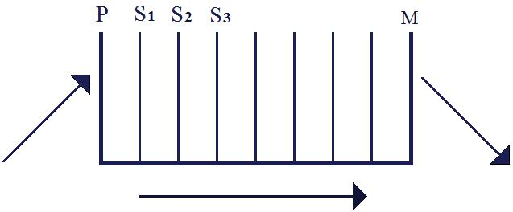

# Leçon 12 | 02 Mars 1955

  <label><input type="checkbox" data-lacan-toggle="original" checked> 原文</label>
  <label><input type="checkbox" data-lacan-toggle="notes" checked> 注释</label>
  <label><input type="checkbox" data-lacan-toggle="commentary" checked> 个人解读评论</label>

<section class="parallel-paragraph" data-paragraph-ids="s2-12-0001">

s2-12-0001

[无对应译文]

原文 · s2-12-0001

[VALABREGA](#VALABREGA02_03)

</section>

<section class="parallel-paragraph" data-paragraph-ids="s2-12-0002">

s2-12-0002

[无对应译文]

原文 · s2-12-0002

LACAN

</section>

<section class="parallel-paragraph" data-paragraph-ids="s2-12-0003">

s2-12-0003

[无对应译文]

原文 · s2-12-0003

On va commencer par lire quelques petits bouts de texte de FREUD, que l’on lit toujours trop vite.

</section>

<section class="parallel-paragraph" data-paragraph-ids="s2-12-0004">

s2-12-0004

[无对应译文]

原文 · s2-12-0004

Aujourd’hui nous reprenons le fil de notre com­mentaire de la VIIème partie de la *Science des rêves, Psychologie des processus du rêve*, dans le dessein de l’intégrer à cette ligne générale que nous poursuivons : tâcher de comprendre ce que signifie le progrès de la pensée de FREUD, eu égard à ce qu’on peut appeler les fondements premiers de l’être humain tels qu’ils se découvrent dans la relation analytique et ceci dans le dessein d’expliquer le der­nier état de la pensée de FREUD, celui qui s’est exprimé dans l’*Au-delà du prin­cipe du plaisir.*

</section>

<section class="parallel-paragraph" data-paragraph-ids="s2-12-0005">

s2-12-0005

[无对应译文]

原文 · s2-12-0005

Nous en étions arrivés la dernière fois à prendre, au niveau du texte de *Psychologie des processus du rêve*, le premier paragraphe qui concerne *L’ou­bli des rêves* et l’expliquer. Ceci nous a amené, à propos d’une divergence qui s’est manifestée dans certaines corrections que j’avais apportées aux remarques de VALABREGA sur la nature de la résistance, à préciser d’une façon apologétique le sens qui s’est incarné dans un petit apologue sur la différence qu’il y a entre *censure* et *résistance*, *censure* et *résistance de censure *:

</section>

<section class="parallel-paragraph" data-paragraph-ids="s2-12-0006">

s2-12-0006

[无对应译文]

原文 · s2-12-0006

- *la résistance* étant tout ce qui s’oppose, dans un sens général, au travail analytique,

</section>

<section class="parallel-paragraph" data-paragraph-ids="s2-12-0007">

s2-12-0007

[无对应译文]

原文 · s2-12-0007

- et *la censure*, une qualification spéciale de cette *résistance*.

</section>

<section class="parallel-paragraph" data-paragraph-ids="s2-12-0008">

s2-12-0008

[无对应译文]

原文 · s2-12-0008

La ligne dans laquelle s’insère notre travail, pas besoin de le rappeler une fois de plus, il s’agit toujours de savoir où se situe ce que nous pouvons appe­ler *le sujet* de la relation analytique. Il faut se garder sur ce plan, sur cette ques­tion de qui est *le sujet* de la relation analytique, d’une attitude naïve : « *le sujet, eh bien, c’est lui, quoi !* ». Comme si le patient était quelque chose d’univoque, comme si nous-même, l’analyste, étions quelque chose qui sans aucun doute peut se résumer à une certaine somme de caractéristiques individuelles.

</section>

<section class="parallel-paragraph" data-paragraph-ids="s2-12-0009">

s2-12-0009

[无对应译文]

原文 · s2-12-0009

Cette notion du clivage qu’il fait intervenir dans la notion du « *qui est-il ?* », ou « *qui suis-je ?* », c’est toute la question que nous manipulons ici dans toutes ses manifestations, pour essayer, par justement les antinomies, les problèmes qui se révèlent dans la rencontre à tout instant, concrète, avec cette question « *qui est le sujet ?* », en la suivant dans tous ces points où elle se *réfléchit* où elle se *réfracte*, où elle *éclate* de façon patente, dans *les difficultés* que nous rencon­trons à y répondre. C’est de cette façon que nous espérons donner le sentiment du point où elle se situe exactement et qui, bien entendu, ne peut pas s’attaquer d’une façon directe, puisque s’y attaquer c’est aussi s’attaquer aux racines même du langage.

</section>

<section class="parallel-paragraph" data-paragraph-ids="s2-12-0010">

s2-12-0010

[无对应译文]

原文 · s2-12-0010

Qu’est-ce que ça veut dire ? Dans cette ligne : regarder les choses auxquelles on ne s’arrête pas, parce que c’est une petite note incluse dans toute la maçonnerie, dans *l’édifice freudien* \[p. 493 éd. PUF 1967, p.636 éd. PUF 2003\].

</section>

<section class="parallel-paragraph" data-paragraph-ids="s2-12-0011">

s2-12-0011

[无对应译文]

原文 · s2-12-0011

Nous n’arriverons peut-être pas à rejoindre VALABREGA, non pas parce qu’il va vite, mais il va d’une façon assez précise pour que nous ne soyons pas forcés de l’arrêter. Cette note est dans la IVème partie, *Le réveil par le rêve*, *Les rapports de l’in­conscient et du préconscient*.

</section>

<section class="parallel-paragraph" data-paragraph-ids="s2-12-0012">

s2-12-0012

[无对应译文]

原文 · s2-12-0012

« *Une autre complication -* que celle de savoir pourquoi le préconscient a rejeté et étouffé le désir qui appartient à l’inconscient - *beaucoup plus importante et profonde, dont le profane ne tient pas compte, est la suivante. Une réalisation du désir devrait certainement* *être une cause de plaisir. Mais pour qui ?* » \[p. 493\]

</section>

<section class="parallel-paragraph" data-paragraph-ids="s2-12-0013">

s2-12-0013

[无对应译文]

原文 · s2-12-0013

Vous voyez que cette question de « *pour qui ?* », nous ne l’évoquons pas pour la première fois dans notre société. Ce n’est pas mon élève LECLAIRE qui l’a inventée : « *qui est le sujet ?* »

</section>

<section class="parallel-paragraph" data-paragraph-ids="s2-12-0014">

s2-12-0014

[无对应译文]

原文 · s2-12-0014

« *Pour celui, naturellement, qui a ce désir. Or, nous savons que l’attitude du rêveur à l’égard de ses désirs est une attitude tout à fait* *particulière. Il les repousse, les censure, bref ne veut rien en savoir. Leur réalisation ne peut donc lui procurer déplaisir,* *bien au contraire. Et l’expérience montre que ce contraire, qui reste encore à expliquer, se manifeste sous la forme de l’angoisse.* *Dans son attitude à l’égard des désirs de ses rêves, le rêveur apparaît ainsi comme composé de deux personnes réunies cependant* *par une intime communauté.* »

</section>

<section class="parallel-paragraph" data-paragraph-ids="s2-12-0015">

s2-12-0015

[无对应译文]

原文 · s2-12-0015

Voilà un petit texte que je livre comme liminaire à votre méditation, car il exprime d’une façon tout à fait claire l’idée même du décentrement du sujet, sur laquelle j’insiste toujours, d’une façon, là, tout à fait clairement exprimée. C’est *une étape* naturellement de la pensée, *pas la solution*.

</section>

<section class="parallel-paragraph" data-paragraph-ids="s2-12-0016">

s2-12-0016

[无对应译文]

原文 · s2-12-0016

Qu’une verbalisa­tion permette de donner à cela quelque chose qui serait comme une chosification du problème, à savoir : *il y a une autre personnalité*, on n’avait pas attendu FREUD pour le dire.

</section>

<section class="parallel-paragraph" data-paragraph-ids="s2-12-0017">

s2-12-0017

[无对应译文]

原文 · s2-12-0017

C’est un monsieur nommé JANET…

</section>

<section class="parallel-paragraph" data-paragraph-ids="s2-12-0018">

s2-12-0018

[无对应译文]

原文 · s2-12-0018

> qui n’est d’ailleurs pas tra­vailleur sans mérite, encore que tout à fait éclipsé par la découverte freudienne

</section>

<section class="parallel-paragraph" data-paragraph-ids="s2-12-0019">

s2-12-0019

[无对应译文]

原文 · s2-12-0019

…qui avait cru s’apercevoir, en effet, que dans certains cas il y avait le phénomè­ne de double personnalité dans le sujet. Et il s’en était arrêté là, parce qu’il était un psychologue. C’était en somme une curiosité psychologique, ou comme vous voudrez, un fait d’observation psychologique - cela revient au même - *historiolé*, disait M. SPINOZA, des petites histoires.

</section>

<section class="parallel-paragraph" data-paragraph-ids="s2-12-0020">

s2-12-0020

[无对应译文]

原文 · s2-12-0020

Tandis que nous, c’est justement :

</section>

<section class="parallel-paragraph" data-paragraph-ids="s2-12-0021">

s2-12-0021

[无对应译文]

原文 · s2-12-0021

- parce que FREUD ne nous présente pas les choses sous la forme d’une petite his­toire,

</section>

<section class="parallel-paragraph" data-paragraph-ids="s2-12-0022">

s2-12-0022

[无对应译文]

原文 · s2-12-0022

- parce que FREUD pose le problème en son point tout à fait essentiel, à savoir :

</section>

<section class="parallel-paragraph" data-paragraph-ids="s2-12-0023">

s2-12-0023

[无对应译文]

原文 · s2-12-0023

> *qu’est-ce que c’est que ce qu’on peut appeler le sens ?*

</section>

<section class="parallel-paragraph" data-paragraph-ids="s2-12-0024">

s2-12-0024

[无对应译文]

原文 · s2-12-0024

Mais aussi bien quand il dit « *les pensées* », c’est ça qu’il veut dire et pas autre chose : le sens du comportement de notre prochain, en tant que nous sommes vis-à-vis de lui dans cette relation tout à fait spéciale qui a été inaugurée par FREUD dans la façon d’aborder un certain type de maladies, les névroses. Qu’est-ce que c’est que ce sens ? Il donne cette question.

</section>

<section class="parallel-paragraph" data-paragraph-ids="s2-12-0025">

s2-12-0025

[无对应译文]

原文 · s2-12-0025

Il va la rechercher non pas simplement dans un certain nombre de traits à mettre en évidence dans notre comportement exceptionnel, anormal, pathologique, mais il parle d’abord de lui-même, à savoir que pour faire sortir cette vérité du sens du sujet, il com­mence à se la poser là seulement où le sujet peut se la poser, au niveau de lui-même.

</section>

<section class="parallel-paragraph" data-paragraph-ids="s2-12-0026">

s2-12-0026

[无对应译文]

原文 · s2-12-0026

Et c’est parce que FREUD analyse ses propres rêves qu’il fait sortir quelque chose qui est ce que nous venons de dire, à savoir que *quelqu’un d’autre* – apparemment - que lui-même parle dans ses rêves, et c’est ce qu’il nous confie dans une note comme celle-ci, *quelqu’un d’autre* : apparemment ce deuxième personnage.

</section>

<section class="parallel-paragraph" data-paragraph-ids="s2-12-0027">

s2-12-0027

[无对应译文]

原文 · s2-12-0027

Qu’est-ce que ça veut dire ? Quel est son rapport avec l’être du sujet ?

</section>

<section class="parallel-paragraph" data-paragraph-ids="s2-12-0028">

s2-12-0028

[无对应译文]

原文 · s2-12-0028

C’est toute la question dont il s’agit depuis le début jusqu’à la fin, depuis le petit *draft* dont nous avons vu à quel point, à tout instant, tout en se maintenant dans le langage atomistique, il en dérape à quelque chose, parce qu’il pose tout le problème des rela­tions du sujet et de l’objet, dans des termes remarquablement originaux.

</section>

<section class="parallel-paragraph" data-paragraph-ids="s2-12-0029">

s2-12-0029

[无对应译文]

原文 · s2-12-0029

Il ne vous a pas échappé que je viens de renouer aujourd’hui la ligne de notre travail.

</section>

<section class="parallel-paragraph" data-paragraph-ids="s2-12-0030">

s2-12-0030

[无对应译文]

原文 · s2-12-0030

L’originalité de cette première ébauche que FREUD nous donne…

</section>

<section class="parallel-paragraph" data-paragraph-ids="s2-12-0031">

s2-12-0031

[无对应译文]

原文 · s2-12-0031

> de tenta­tive de dessin de l’appareil psychique humain, ce qui est important, frappant,
>
> distinct de tous les auteurs qui ont écrit
>
> sur le même sujet, et même du grand FECHNER, auquel il se réfère sans cesse

</section>

<section class="parallel-paragraph" data-paragraph-ids="s2-12-0032">

s2-12-0032

[无对应译文]

原文 · s2-12-0032

…c’est l’idée que l’objet de la recherche humaine n’est jamais *un objet de retrouvailles*, qu’il est un objet \[nouveau\] à chaque fois…

</section>

<section class="parallel-paragraph" data-paragraph-ids="s2-12-0033">

s2-12-0033

[无对应译文]

原文 · s2-12-0033

> *retrouvailles au sens de la réminiscence*, où le sujet retrouve les rails préformés de son rapport naturel au monde extérieur

</section>

<section class="parallel-paragraph" data-paragraph-ids="s2-12-0034">

s2-12-0034

[无对应译文]

原文 · s2-12-0034

…mais si l’objet humain se constitue, c’est toujours par l’intermédiaire d’une *première perte*, rien de ce qui est fécond pour l’homme ne se passe sinon par l’intermédiaire d’*une* *perte de l’objet*, que c’est toujours *une reconstruction de l’objet* dont il s’agit.

</section>

<section class="parallel-paragraph" data-paragraph-ids="s2-12-0035">

s2-12-0035

[无对应译文]

原文 · s2-12-0035

Ceci est un trait que nous avons noté au passage, je pense qu’il ne vous a pas échappé au milieu de beaucoup de choses que nous avons vues dans *ce premier paragraphe*. Mais ceci a pu vous paraître n’être qu’un point de détail. Je le repointe au passage, parce que nous le retrouverons dans la suite.

</section>

<section class="parallel-paragraph" data-paragraph-ids="s2-12-0036">

s2-12-0036

[无对应译文]

原文 · s2-12-0036

Toute dia­lectique, en somme, de la décomposition de l’objet, le fait que l’objet humain est toujours quelque chose dont le sujet va tenter de retrouver *la totalité*, à par­tir de je ne sais quelle *unité perdue à l’origine*, c’est quelque chose de très frap­pant qui déjà s’ébauche à l’intérieur de cette sorte de symbolique construction théorique que FREUD cherche, que lui suggèrent les premières découvertes sur la structure du système nerveux, dans la mesure où elles peuvent être appli­quées à son expérience clinique.

</section>

<section class="parallel-paragraph" data-paragraph-ids="s2-12-0037">

s2-12-0037

[无对应译文]

原文 · s2-12-0037

Déjà il arrive à cette réalité profonde au niveau de ce qu’il faut appeler « *la portée métaphysique* » de son œuvre, au niveau de la *Science des rêves,* à un point accidentel voire caduque, on peut le laisser passer, ou voir là une énonciation qui nous fait toucher que nous sommes bien dans la ligne en posant toujours à ce niveau la question de FREUD, à savoir : « *qu’est-ce que le sujet ?* ». « *Qu’est–ce que le sujet ?* » en tant que ce qu’il fait *a un sens*, qu’en fin de compte il parle par son comportement comme par ses symptômes, comme par aussi bien toute cette fonction marginale de ce que nous connaissons de son activité psychique, dite à ce moment là « *conscience* »…

</section>

<section class="parallel-paragraph" data-paragraph-ids="s2-12-0038">

s2-12-0038

[无对应译文]

原文 · s2-12-0038

> le terme étant, pour la psychologie de l’époque, maintenu pour équivalent

</section>

<section class="parallel-paragraph" data-paragraph-ids="s2-12-0039">

s2-12-0039

[无对应译文]

原文 · s2-12-0039

…et dont FREUD montre à tout instant que c’est précisément là ce qui fait le problème :

</section>

<section class="parallel-paragraph" data-paragraph-ids="s2-12-0040">

s2-12-0040

[无对应译文]

原文 · s2-12-0040

- que la chose la plus incompréhen­sible n’est assurément pas ce qui se lit dans le comportement du sujet,

</section>

<section class="parallel-paragraph" data-paragraph-ids="s2-12-0041">

s2-12-0041

[无对应译文]

原文 · s2-12-0041

- c’est : pourquoi cette apparence, cette présentation dans la conscience est quelque chose qui est en quelque sorte

</section>

<section class="parallel-paragraph" data-paragraph-ids="s2-12-0042">

s2-12-0042

[无对应译文]

原文 · s2-12-0042

> si irrégulière.

</section>

<section class="parallel-paragraph" data-paragraph-ids="s2-12-0043">

s2-12-0043

[无对应译文]

原文 · s2-12-0043

C’est là à tout instant présentifié dans cette petite *ébauche de l’appareil psychique*, avec laquelle nous en avons à peu près fini. Et au moment où il aborde une notion psychologique des processus du rêve, c’est à savoir :

</section>

<section class="parallel-paragraph" data-paragraph-ids="s2-12-0044">

s2-12-0044

[无对应译文]

原文 · s2-12-0044

« *Il ne faut pas confondre* - dit-il - *processus primaire et inconscient.* »

</section>

<section class="parallel-paragraph" data-paragraph-ids="s2-12-0045">

s2-12-0045

[无对应译文]

原文 · s2-12-0045

Dans le *processus primaire*, il y a toutes sortes de choses qui apparaissent au niveau de la conscience. Il s’agit précisément de *savoir pourquoi ce sont celles-là qui apparaissent*, à savoir quelque chose qui est ce qui nous apparaît comme l’idée, *la pensée du rêve*. Bien sûr *nous en avons conscience*, puisqu’aussi bien, sans cela, nous ne saurions rien de ce qui existe du rêve. Ce qui est *inconscient* est quelque chose où forcément, nous dit-il, il faut par une nécessité de la théo­rie qu’*une certaine quantité*, un certain facteur quantitatif d’intérêt se soit porté.

</section>

<section class="parallel-paragraph" data-paragraph-ids="s2-12-0046">

s2-12-0046

[无对应译文]

原文 · s2-12-0046

Et pourtant, ce qui motive cette quantité, ce qui la détermine est ailleurs, est dans un ailleurs dont nous ne sommes pas conscients. Il faut aussi que nous le reconstruisions, cet objet-là. C’est ce que nous avons vu apparaître déjà au niveau du premier petit schéma donné dans *le rêve d’injection d’Irma*, celui que FREUD donne au niveau du graphe, de *l’ébauche de l’appareil psychique* : il nous montre que ce qui apparaît dans le rêve est évidemment, quand on étudie la structure, la détermination des associations, ce qui est le plus chargé en quanti­té, ce vers quoi convergent, sur le plan de la relation expressive du *signifié au signifiant*, le plus de choses à signifier.

</section>

<section class="parallel-paragraph" data-paragraph-ids="s2-12-0047">

s2-12-0047

[无对应译文]

原文 · s2-12-0047

Mais ceci en effet émerge, parce que cela semble être le carrefour, le point de concours du plus d’intérêt psychique. C’est aussi quelque chose qui nous lais­se complètement dans l’ombre les éléments qui s’y manifestent, à savoir les motifs eux-mêmes. Ces motifs nous les avons déjà indiqués au niveau du *graphe*. Ils sont doubles :

</section>

<section class="parallel-paragraph" data-paragraph-ids="s2-12-0048">

s2-12-0048

[无对应译文]

原文 · s2-12-0048

- c’est *le discours continué*, *la parole du dialogue pour­suivi avec Fliess*, d’une part,

</section>

<section class="parallel-paragraph" data-paragraph-ids="s2-12-0049">

s2-12-0049

[无对应译文]

原文 · s2-12-0049

- et d’autre part, *sous une double forme, le fonde­ment sexuel* qui donne l’autre détermination à toutes les apparences du rêve.

</section>

<section class="parallel-paragraph" data-paragraph-ids="s2-12-0050">

s2-12-0050

[无对应译文]

原文 · s2-12-0050

Le fondement sexuel est double :

</section>

<section class="parallel-paragraph" data-paragraph-ids="s2-12-0051">

s2-12-0051

[无对应译文]

原文 · s2-12-0051

- à la fois intéressé dans cette *parole*, puisque c’est la notion qu’il existe en tant que tel, qui vient là déterminer le rêve, montrant que c’est le rêve de quelqu’un en train de chercher ce qui est un objet même du rêve,

</section>

<section class="parallel-paragraph" data-paragraph-ids="s2-12-0052">

s2-12-0052

[无对应译文]

原文 · s2-12-0052

- et le fait que FREUD se trouve lui-même effectivement particulièrement, non seulement avec sa malade, mais toute la série féminine qui s’ébauche der­rière elle, série complexe et contrastée, ce qui reste justement à déterminer, ce qui est dans l’inconscient et ceci doit être, ne peut être uniquement, comme objet, que reconstruit.

</section>

<section class="parallel-paragraph" data-paragraph-ids="s2-12-0053">

s2-12-0053

[无对应译文]

原文 · s2-12-0053

C’est là le sens de ce que FREUD, au point où nous sommes du développement de sa pensée, nous amène.

</section>

<section class="parallel-paragraph" data-paragraph-ids="s2-12-0054">

s2-12-0054

[无对应译文]

原文 · s2-12-0054

C’est ce que nous allons aborder aujourd’hui, avec la deuxième partie sur la régression, sur la notion de comment il faut concevoir *la coalescence*, sa caractéristique de nécessité fondamentale dans toute formation symptomatique, d’au moins deux séries de motivations dont une doit être sexuelle, et l’autre est justement ce qui est mis en question ici, parce que c’est en question partout dans l’œuvre de FREUD, sans être jamais à proprement nommé de la façon dont nous lui donnons ici son nom, qui est justement le facteur de *la parole*, de *la fonction symbolique* en tant qu’elle est assumée par le sujet.

</section>

<section class="parallel-paragraph" data-paragraph-ids="s2-12-0055">

s2-12-0055

[无对应译文]

原文 · s2-12-0055

Mais toujours avec la même question : *par qui, par quel sujet ?*

</section>

<section class="parallel-paragraph" data-paragraph-ids="s2-12-0056">

s2-12-0056

[无对应译文]

原文 · s2-12-0056

[Jean-Paul VALABREGA](#Mars02)

</section>

<section class="parallel-paragraph" data-paragraph-ids="s2-12-0057">

s2-12-0057

[无对应译文]

原文 · s2-12-0057

C’est *important* de conserver en mémoire qu’il introduit pour la première fois la conception de l’appareil psychique à propos de l’étude sur *la régression*. C’est donc à la *Traumdeutung* qu’il faudra retourner, pour retrou­ver la première explication de *la régression*, qui ultérieurement va prendre une importance considérable dans toute la théorie qui suivra.

</section>

<section class="parallel-paragraph" data-paragraph-ids="s2-12-0058">

s2-12-0058

[无对应译文]

原文 · s2-12-0058

Ensuite - pour suivre l’argumentation de FREUD dans ce passage - il commence par rappeler les trois caractères les plus importants qui lui ont été fournis par l’étude du rêve. C’est-à-dire qu’il résume, condense, tout ce qui précède cette partie, pour ainsi dire tout le volume, avant d’en arriver à cette étude des pro­cessus qui sont trois :

</section>

<section class="parallel-paragraph" data-paragraph-ids="s2-12-0059">

s2-12-0059

[无对应译文]

原文 · s2-12-0059

1)  Le rêve met la pensée au *présent* dans l’accomplissement du désir. Par consé­quent, c’est une actualisation. Le désir ou la pensée du désir, le plus fré­quemment dans le rêve, est objectivé, mis en scène, enfin vécu.

</section>

<section class="parallel-paragraph" data-paragraph-ids="s2-12-0060">

s2-12-0060

[无对应译文]

原文 · s2-12-0060

2)  C’est un caractère presque indépendant, dit FREUD, du caractère précédent, et non moins important : la transformation de *la pensée du rêve en images visuelles et en discours*, *Bildermutrede.*

</section>

<section class="parallel-paragraph" data-paragraph-ids="s2-12-0061">

s2-12-0061

[无对应译文]

原文 · s2-12-0061

LACAN

</section>

<section class="parallel-paragraph" data-paragraph-ids="s2-12-0062">

s2-12-0062

[无对应译文]

原文 · s2-12-0062

*Rede,* ça veut dire *discours*. L’inconscient c’est le discours de l’autre, ce n’est pas moi qui l’ai inventé. *Bilder,* ça veut dire *imaginaire*, parti­culièrement adapté à un terme qui veut dire *image* en allemand.

</section>

<section class="parallel-paragraph" data-paragraph-ids="s2-12-0063">

s2-12-0063

[无对应译文]

原文 · s2-12-0063

Jean-Paul VALABREGA

</section>

<section class="parallel-paragraph" data-paragraph-ids="s2-12-0064">

s2-12-0064

[无对应译文]

原文 · s2-12-0064

3)  Troisième notion sur laquelle on a déjà insisté, due à FECHNER : *lieu psy­chique du rêve* différent du lieu

</section>

<section class="parallel-paragraph" data-paragraph-ids="s2-12-0065">

s2-12-0065

[无对应译文]

原文 · s2-12-0065

> de représentation de la vie éveillée.

</section>

<section class="parallel-paragraph" data-paragraph-ids="s2-12-0066">

s2-12-0066

[无对应译文]

原文 · s2-12-0066

Voilà les trois résultats les plus importants qu’il souligne dans le début de son argumentation, *l’essai de construction de l’appareil psychique* auquel il va se livrer. Cela va être le premier schéma sur le modèle d’appareil possible. Et cette reconstruction suit directement la référence à la *Psycho-physique* de FECHNER.

</section>

<section class="parallel-paragraph" data-paragraph-ids="s2-12-0067">

s2-12-0067

[无对应译文]

原文 · s2-12-0067

Pourtant, une chose importante est déjà indiquée et va être reprise dans la suite, c’est que l’appareil psychique étant constitué de divers systèmes ϕ, Ψ,ω et que l’on n’est pas obligé - dit-il - d’imaginer entre les divers systèmes un certain *ordre spatial*, mais un *ordre de succession temporelle*, il faut donc imaginer cet appareil comme un *schéma spatial * :

</section>

<section class="parallel-paragraph" data-paragraph-ids="s2-12-0068">

s2-12-0068

[无对应译文]

原文 · s2-12-0068

- mais ne pas croire à *sa spatialité*,

</section>

<section class="parallel-paragraph" data-paragraph-ids="s2-12-0069">

s2-12-0069

[无对应译文]

原文 · s2-12-0069

- mais croi­re que c’est *un ordre de succession temporelle de l’excitation* qui parcourt les différents systèmes concernés. Par conséquent, c’est une topique temporelle.

</section>

<section class="parallel-paragraph" data-paragraph-ids="s2-12-0070">

s2-12-0070

[无对应译文]

原文 · s2-12-0070

Plus loin, après l’exposé des schémas, il va revenir sur cette idée, et dire que le rêve est un retour…

</section>

<section class="parallel-paragraph" data-paragraph-ids="s2-12-0071">

s2-12-0071

[无对应译文]

原文 · s2-12-0071

> dans une synthèse qu’il fait après sa conception de l’appareil

</section>

<section class="parallel-paragraph" data-paragraph-ids="s2-12-0072">

s2-12-0072

[无对应译文]

原文 · s2-12-0072

…un retour au plus lointain passé et ce passé, par-delà l’enfance, remonte à *un passé phylogénétique*, c’est-à-dire compris dans un sens encore plus large que le passé historique du sujet.

</section>

<section class="parallel-paragraph" data-paragraph-ids="s2-12-0073">

s2-12-0073

[无对应译文]

原文 · s2-12-0073

En abandonnant cette synthèse, voici le schéma n° 1 de l’appareil. \[p.456, éd. PUF 1967 ; p.590, éd. PUF 2003\] Il est doté d’une direction : c’est ce qui est fondamental : *la direction des flèches*.

</section>

<section class="parallel-paragraph" data-paragraph-ids="s2-12-0074">

s2-12-0074

[无对应译文]

原文 · s2-12-0074

</section>

<section class="parallel-paragraph" data-paragraph-ids="s2-12-0075">

s2-12-0075

[无对应译文]

原文 · s2-12-0075

Le processus psychique va toujours de l’extrémité P, perceptive, à M, motrice, cependant, il y a *une première différenciation* qui intervient aussitôt après : *les excitations perceptives* parvenant dans le sujet y laissent une trace, qui est *une trace de souvenir*. Il faut expliquer *la mémoire*. Or *le système* P, *percep­tion*, n’a aucune *mémoire*, il faut donc différencier un système S du système P.

</section>

<section class="parallel-paragraph" data-paragraph-ids="s2-12-0076">

s2-12-0076

[无对应译文]

原文 · s2-12-0076

</section>

<section class="parallel-paragraph" data-paragraph-ids="s2-12-0077">

s2-12-0077

[无对应译文]

原文 · s2-12-0077

Car d’abord les perceptions se trouvent unies dans la mémoire d’après leur ordre d’apparition. Lorsqu’il y a eu simultanéité de perceptions, il y aura connexion dans le même ordre simultané des *traces* : c’est là le phénomène important de l’*association*. Comme d’autre part il existe dans les connexions intervenant dans le système S, d’autres connexions que la connexion associati­ve, il sera donc nécessaire d’admettre plusieurs systèmes S : S1, S2, S3... On en aura un grand nombre. Il serait vain, dit FREUD, de vouloir en fixer le nombre, et même de vouloir le tenter.

</section>

<section class="parallel-paragraph" data-paragraph-ids="s2-12-0078">

s2-12-0078

[无对应译文]

原文 · s2-12-0078

LACAN

</section>

<section class="parallel-paragraph" data-paragraph-ids="s2-12-0079">

s2-12-0079

[无对应译文]

原文 · s2-12-0079

Ceci est presque amusant. Vous avez le texte dans l’esprit, M. HYPPOLITE, c’est vraiment fort piquant :

</section>

<section class="parallel-paragraph" data-paragraph-ids="s2-12-0080">

s2-12-0080

[无对应译文]

原文 · s2-12-0080

« *Le premier de ces systèmes S fixera l’association par simultanéité. Dans les systèmes plus éloignés, cette même matière d’excitation* *sera rangée selon des modes différents de rencontre, de façon, par exemple, que ces systèmes successifs représentent des rapports* *de ressemblance, ou autres…* »

</section>

<section class="parallel-paragraph" data-paragraph-ids="s2-12-0081">

s2-12-0081

[无对应译文]

原文 · s2-12-0081

C’est-à-dire, bien entendu, que nous entrons là dans *le registre dialectique* de l’établissement *du même, de l’autre, de l’un, du multiple,* de tout ce que vous voudrez. Vous pouvez insérer là tout PARMÉNIDE.

</section>

<section class="parallel-paragraph" data-paragraph-ids="s2-12-0082">

s2-12-0082

[无对应译文]

原文 · s2-12-0082

Et il dit :

</section>

<section class="parallel-paragraph" data-paragraph-ids="s2-12-0083">

s2-12-0083

[无对应译文]

原文 · s2-12-0083

« *Il serait oiseux, évidemment, de vouloir indiquer en paroles la significa­tion psychique d’un tel système.* »

</section>

<section class="parallel-paragraph" data-paragraph-ids="s2-12-0084">

s2-12-0084

[无对应译文]

原文 · s2-12-0084

Qu’est-ce que ça veut dire « *vouloir indiquer en paroles* » ?

</section>

<section class="parallel-paragraph" data-paragraph-ids="s2-12-0085">

s2-12-0085

[无对应译文]

原文 · s2-12-0085

C’est-à-dire dans les paroles de notre démonstration, d’un schéma, de faire un *schéma* des diffé­rentes façons dont s’organisent et se regroupent les éléments plus ou moins atomistiquement conçus de la réalité, au niveau des différents plans où il faut que nous les considérions, pour recréer toutes les catégories du langage.

</section>

<section class="parallel-paragraph" data-paragraph-ids="s2-12-0086">

s2-12-0086

[无对应译文]

原文 · s2-12-0086

Ici FREUD s’aperçoit, sous cet « *Il serait oiseux* » de la vanité d’un tel excès. Et il est exigé d’un autre côté qu’un schéma nous permette de dérouler *spatialement* - puisqu’il s’agit du schéma d’un appareil spatial - tout ce que nous devons retrouver comme connexions au niveau des concepts et des catégories.

</section>

<section class="parallel-paragraph" data-paragraph-ids="s2-12-0087">

s2-12-0087

[无对应译文]

原文 · s2-12-0087

Dès lors, bien enten­du, il serait tout à fait oiseux de le faire. Car notre schéma spatial ne sera alors qu’une doublure des exigences à cet endroit *du jeu de la pensée*, au sens le plus profond et le plus général.

</section>

<section class="parallel-paragraph" data-paragraph-ids="s2-12-0088">

s2-12-0088

[无对应译文]

原文 · s2-12-0088

Ici, on voit qu’il abandonne, que son schéma n’a plus d’utilité, si ce n’est de nous indiquer que là où il y a relation de langage il faut qu’il y ait *connexion *: à partir du moment où nous cherchons à établir ces relations de langage dans leurs rapports, leurs supports, un substrat qui serait donné à l’inté­rieur d’un appareil neuronique déterminé.

</section>

<section class="parallel-paragraph" data-paragraph-ids="s2-12-0089">

s2-12-0089

[无对应译文]

原文 · s2-12-0089

Il s’aperçoit qu’il n’y a rien d’autre à faire qu’à indiquer qu’il faut qu’il y ait *une série de systèmes*, mais qu’il serait oiseux de vouloir les préciser, les uns après les autres, car alors nous abandonnons toute la catégorie du schéma neurologique : nous y incluons, nous y supposons la tota­lité du schéma disons *noologique*, tout simplement. Et l’espèce de tranquillité avec laquelle il abandonne cette tâche, à laquelle on voit de plus naïfs se consacrer, est tout à fait caractéristique.

</section>

<section class="parallel-paragraph" data-paragraph-ids="s2-12-0090">

s2-12-0090

[无对应译文]

原文 · s2-12-0090

Par contre, la phrase suivante :

</section>

<section class="parallel-paragraph" data-paragraph-ids="s2-12-0091">

s2-12-0091

[无对应译文]

原文 · s2-12-0091

« *Sa caractéristique serait l’étroitesse de ses relations avec les matières pre­mières du souvenir, c’est-à-dire, si nous voulons évoquer* *une théorie plus profonde, les dégradations de la résistance dans le sens de ces éléments.* »

</section>

<section class="parallel-paragraph" data-paragraph-ids="s2-12-0092">

s2-12-0092

[无对应译文]

原文 · s2-12-0092

« *Dégradations de la résistance* », ce n’est pas la traduction exacte. Là, quelque chose nous arrête de tout à fait concret. Que signifie à ce niveau la notion de résistance ? Où elle va se situer à l’intérieur de ce schéma ?

</section>

<section class="parallel-paragraph" data-paragraph-ids="s2-12-0093">

s2-12-0093

[无对应译文]

原文 · s2-12-0093

Jean-Paul VALABREGA

</section>

<section class="parallel-paragraph" data-paragraph-ids="s2-12-0094">

s2-12-0094

[无对应译文]

原文 · s2-12-0094

Ainsi qu’on peut le voir, dans le passage que M. LACAN vient de commenter, il y a une critique de l’associationnisme. Car l’associationnisme doctrinal est la loi de l’association qui met les souvenirs en connexion, quels que soient leurs rapports, de contiguïté, ressemblance ou différence.

</section>

<section class="parallel-paragraph" data-paragraph-ids="s2-12-0095">

s2-12-0095

[无对应译文]

原文 · s2-12-0095

Tandis que là, l’association est spécifiée, c’est une connexion parmi d’autres. Il y en a d’*autres* et c’est pour cela qu’il y a plusieurs systèmes. Il y a une critique qui est formu­lée, qui est en désaccord avec la doctrine associationnniste.

</section>

<section class="parallel-paragraph" data-paragraph-ids="s2-12-0096">

s2-12-0096

[无对应译文]

原文 · s2-12-0096

LACAN

</section>

<section class="parallel-paragraph" data-paragraph-ids="s2-12-0097">

s2-12-0097

[无对应译文]

原文 · s2-12-0097

C’est exact. C’est en ce sens qu’il reconnaît implicitement, puis­qu’il faut qu’il suppose au niveau des différents systèmes tous ces étages, qu’au niveau précis où il s’agit des rapports de ressemblance, il passe de l’asso­ciationnisme à ce qu’il y a d’irréductible à l’associationnisme, toute la dialec­tique, la catégorie de la ressemblance étant la première catégorie dialectique.

</section>

<section class="parallel-paragraph" data-paragraph-ids="s2-12-0098">

s2-12-0098

[无对应译文]

原文 · s2-12-0098

Jean-Paul VALABREGA

</section>

<section class="parallel-paragraph" data-paragraph-ids="s2-12-0099">

s2-12-0099

[无对应译文]

原文 · s2-12-0099

Alors, ces souvenirs, S1, S2, S3… sont par nature inconscients. Ils peuvent devenir conscients. Mais dans ce cas, encore faut-il noter qu’ils n’ont aucune qualité comparable, aucune qualité sensible, c’est sur la qualité sensible qu’il faut insister, comparables à celle des perceptions.

</section>

<section class="parallel-paragraph" data-paragraph-ids="s2-12-0100">

s2-12-0100

[无对应译文]

原文 · s2-12-0100

Et si maintenant nous introduisons…

</section>

<section class="parallel-paragraph" data-paragraph-ids="s2-12-0101">

s2-12-0101

[无对应译文]

原文 · s2-12-0101

> car il dit que jusqu’ici nous n’avons pas tenu compte, dans notre schéma, du rêve et de sa psychologie

</section>

<section class="parallel-paragraph" data-paragraph-ids="s2-12-0102">

s2-12-0102

[无对应译文]

原文 · s2-12-0102

…le rêve dans le schéma, nous nous rappelons qu’il ne peut être expliqué dans sa formation que par deux instances fondamentales, l’instance critiquante et l’instance critiquée, celle qui critique et celle qui est critiquée. L’instance critiquante est celle qui interdit l’accès à la conscience et qui se trouve par ce fait dans la relation la plus étroite avec cette conscience.

</section>

<section class="parallel-paragraph" data-paragraph-ids="s2-12-0103">

s2-12-0103

[无对应译文]

原文 · s2-12-0103

C’est en plaçant dans son schéma ces deux instances : *critiquante* et *critiquée*, qu’il parvient au schéma du dessous, où nous avons toujours l’extrémité per­ceptive et l’extrémité motrice : il situe le *préconscient* près de l’extrémité M, le *préconscient* est à considérer comme le dernier des systèmes situé à l’extrémité motrice. Les *phénomènes préconscients* peuvent parvenir à *la conscience*.

</section>

<section class="parallel-paragraph" data-paragraph-ids="s2-12-0104">

s2-12-0104

[无对应译文]

原文 · s2-12-0104

</section>

<section class="parallel-paragraph" data-paragraph-ids="s2-12-0105">

s2-12-0105

[无对应译文]

原文 · s2-12-0105

Tout à l’heure on verra dans le développement linéaire du *schéma* qu’on sera amené à assimiler, puisque certains phénomènes préconscients peuvent devenir conscients, je puis me tromper, mais il me semble qu’on comprendrait plus clai­rement le schéma si au lieu d’en faire un schéma parallélépipédique, on faisait un schéma circulaire, afin de pouvoir parvenir aussi de M à P, les phénomènes *préconscients* devenant *conscients*.

</section>

<section class="parallel-paragraph" data-paragraph-ids="s2-12-0106">

s2-12-0106

[无对应译文]

原文 · s2-12-0106

Dans l’autre cas, ça va être un autre processus sur lequel on va insister. Les phénomènes préconscients sont définis par leur capacité à devenir conscients, en suivant un processus dirigé normalement à l’inverse de la flèche du bas.

</section>

<section class="parallel-paragraph" data-paragraph-ids="s2-12-0107">

s2-12-0107

[无对应译文]

原文 · s2-12-0107

LACAN

</section>

<section class="parallel-paragraph" data-paragraph-ids="s2-12-0108">

s2-12-0108

[无对应译文]

原文 · s2-12-0108

Vous mettez là en valeur ce que - j’imagine - tout lecteur de bonne foi de FREUD doit s’être posé comme problème depuis longtemps. Ce système qui, bien entendu, dès ce moment là est reconnu comme supposant *une unité*, à savoir le système de la *perception-conscience*, *Wahrnehmung-Bewusstsein,* celui que nous retrouvons au niveau de *la dernière topique*… comme à certains moments de l’exposé de FREUD …comme devant former le noyau du *moi*.

</section>

<section class="parallel-paragraph" data-paragraph-ids="s2-12-0109">

s2-12-0109

[无对应译文]

原文 · s2-12-0109

Mais cela ne veut pas dire que, parce que ceci est exprimé de cette façon, il faille s’en tenir là. Justement, quand on parvient à ce dernier état de la pensée de FREUD, c’est pour en dire qu’il est communément accepté. Je le dis au passage pour signaler que c’est communément accepté et que nous ne nous en contenterons pas!

</section>

<section class="parallel-paragraph" data-paragraph-ids="s2-12-0110">

s2-12-0110

[无对应译文]

原文 · s2-12-0110

Revenons en arrière. Le système *perception-conscience* est d’ores et déjà, au niveau de la *Science des rêves,* affirmé. Ce qui est frappant est qu’il doit impliquer, admettre, d’une façon absolument nécessaire, en raison de l’annexion interne, cette liaison dénommée *représentation*.

</section>

<section class="parallel-paragraph" data-paragraph-ids="s2-12-0111">

s2-12-0111

[无对应译文]

原文 · s2-12-0111

La remarque de VALABREGA vaut à elle toute seule, indépendamment de la ten­tative de solution qu’il présente, c’est que d’autre part il nous représente comme un seul système l’élément topique…

</section>

<section class="parallel-paragraph" data-paragraph-ids="s2-12-0112">

s2-12-0112

[无对应译文]

原文 · s2-12-0112

> dans un schéma qui, je vous le rappelle, n’est pas purement spatial, mais successif

</section>

<section class="parallel-paragraph" data-paragraph-ids="s2-12-0113">

s2-12-0113

[无对应译文]

原文 · s2-12-0113

…comme unité topique, ce *quelque chose* qui justement *est décomposé* aux deux bouts, *aux deux extrémités du système*.

</section>

<section class="parallel-paragraph" data-paragraph-ids="s2-12-0114">

s2-12-0114

[无对应译文]

原文 · s2-12-0114

Cette difficulté doit bien représenter quelque chose. Je dirai que pour l’instant il suffit que nous laissions la question ouverte.

</section>

<section class="parallel-paragraph" data-paragraph-ids="s2-12-0115">

s2-12-0115

[无对应译文]

原文 · s2-12-0115

En fin de compte pour l’explication du fonctionnement même de son *schéma*, il faut qu’il nous rappelle, à un moment donné, que *la conscience* est à l’issue des procès d’élaboration qui vont de *l’inconscient vers le préconscient*, qui doivent normalement aboutir - puisque la dénomination même de ces systèmes implique cette orientation - vers la conscience : ce qui est *dans l’inconscient* est séparé de *la conscience* mais peut y arriver par le stade préalable du *préconscient*.

</section>

<section class="parallel-paragraph" data-paragraph-ids="s2-12-0116">

s2-12-0116

[无对应译文]

原文 · s2-12-0116

Or ce sys­tème de la conscience, par la nécessité de son schéma, il faut qu’il le situe juste *avant* la possibilité de l’acte, *avant* l’issue motrice, donc là, à droite, en M. Et c’est là en effet qu’il le place. Or, par toutes les prémisses qui déterminaient la fabri­cation de *son schéma neurologique*, il a fallu qu’il admette que ce soit au contrai­re bien avant toute espèce d’*inconscient*, c’est-à-dire au niveau de l’acquisition, de la prise de contact avec le monde extérieur, avec l’*Umwelt,* que se produise la perception, c’est-à-dire à l’autre bout du schéma, que nous ayons le système *Warnehmung* W ou *perception* P.

</section>

<section class="parallel-paragraph" data-paragraph-ids="s2-12-0117">

s2-12-0117

[无对应译文]

原文 · s2-12-0117

Par conséquent, le schéma, la façon dont il est construit, à cette étape de la pensée de FREUD, a pour conséquence, pour pro­priété et singularité, qu’il pose un problème de représenter comme étant disso­cié, aux deux points terminaux de la série de ce qui est le sens de circulation de l’élaboration psychique, à ses deux extrémités, ce qui paraît être l’envers et l’en­droit d’une même fonction, à savoir la perception et la conscience.

</section>

<section class="parallel-paragraph" data-paragraph-ids="s2-12-0118">

s2-12-0118

[无对应译文]

原文 · s2-12-0118

Ceci d’aucune façon ne peut être attribué à quelque caractère contingent qui serait né du fait que nous subissons quelque illusion dans la spatialisation de l’en­semble de ce schéma, qu’il est parfaitement concevable que, tout cela étant en fin de compte des phénomènes loin d’être uniquement spatiaux, sur un certain plan ce soit simplement une difficulté de la représentation graphique qui abou­tisse à cette difficulté apparente. Cette difficulté est bien interne à la construc­tion, au mouvement même, à l’élaboration dialectique du schéma. Il faut que la perception soit aidée pour qu’elle ait cette caractéristique d’être une espèce de *couche sensible*, au sens que le mot sensible a dans *photosensible*.

</section>

<section class="parallel-paragraph" data-paragraph-ids="s2-12-0119">

s2-12-0119

[无对应译文]

原文 · s2-12-0119

Mais dans un autre texte, FREUD y est revenu et a insisté sur le petit appareil qui consiste à voir prendre des notes sur une sorte de tableau d’ardoise, qui a des propriétés spé­ciales d’adhésivité et sur lequel repose un papier transparent\[« [*ardoise magique* ](http://www.textlog.de/freud-psychoanalyse-notiz-wunderblock.html)»\] Le crayon est une simple pointe ayant pour propriété, chaque fois qu’elle trace quelques lignes ou signes sur le papier transparent, de déterminer une adhérence momentanée et locale avec l’ardoise qui est dessous, et par conséquent le mot tracé apparaît sur la surface, en sombre sur clair, ou clair sur sombre, et reste inscrit sur cette sur­face aussi longtemps que vous ne faites pas le geste de détacher la feuille à nou­veau du fond, ce qui provoque la disparition du mot, le papier se retrouve vier­ge chaque fois que l’adhérence est levée.

</section>

<section class="parallel-paragraph" data-paragraph-ids="s2-12-0120">

s2-12-0120

[无对应译文]

原文 · s2-12-0120

C’est quelque chose comme cela que FREUD exige de sa première couche per­ceptive. Il faut supposer que le neurone perceptif étant une matière sensible, puisse intercepter toujours quelque perception. Mais il restera toujours quelque trace sur l’ardoise, même si ce n’est plus visible, de ce qui a été un moment écrit. Ce sont les couches supérieures qui sont chargées de conserver ce qui a été une fois perçu, mais il faut que ce qui est à la surface devienne vierge. Tel est le sché­ma cohérent, logique, et rien ne nous indique qu’il ne soit pas fondé dans le fonctionnement concret de l’appareil psychique, ce qui rend *nécessaire* que le système perceptif soit donné au départ.

</section>

<section class="parallel-paragraph" data-paragraph-ids="s2-12-0121">

s2-12-0121

[无对应译文]

原文 · s2-12-0121

Ainsi, nous aboutissons à cette singulière dissociation, à savoir que *perception* et *mémoire* s’excluent quant à leur localisation systématique. Du point de vue de *l’appareil nerveux*, il faut distinguer :

</section>

<section class="parallel-paragraph" data-paragraph-ids="s2-12-0122">

s2-12-0122

[无对应译文]

原文 · s2-12-0122

- le niveau de l’accumulation de l’appareil *mnésique*,

</section>

<section class="parallel-paragraph" data-paragraph-ids="s2-12-0123">

s2-12-0123

[无对应译文]

原文 · s2-12-0123

- du niveau de l’acquisition *perceptive*, …ce qui est, du point de vue de l’imagination, d’une « *machine* » parfaitement correct mais nous nous trouvons devant cette seconde difficulté qui constitue le paradoxe sur lequel VALABREGA et moi attirons votre attention.

</section>

<section class="parallel-paragraph" data-paragraph-ids="s2-12-0124">

s2-12-0124

[无对应译文]

原文 · s2-12-0124

Si nous prenons les choses ainsi, tout dans l’expé­rience indique que le système de la conscience doit se trouver au point opposé le plus extrême de cette succession de couches d’élaboration, d’interconnexions systématiques, qu’il nous est nécessaire d’admettre pour penser le fonctionne­ment concret, effectif dans l’expérience, de *l’appareil psychique*.

</section>

<section class="parallel-paragraph" data-paragraph-ids="s2-12-0125">

s2-12-0125

[无对应译文]

原文 · s2-12-0125

Ce niveau de la conscience nous devons le supposer exactement au point opposé de la dite suc­cession de couches. Ceci présente une difficulté. Nous soupçonnons, une fois de plus, qu’il y a là quelque chose qui ne va pas, ce même quelque chose qui, dans le premier schéma, va s’exprimer en ceci qu’il va les supposer sur deux plans différents :

</section>

<section class="parallel-paragraph" data-paragraph-ids="s2-12-0126">

s2-12-0126

[无对应译文]

原文 · s2-12-0126

- le fonctionnement du système ϕ, d’une part, complément du circuit stimu­lus–réponse,

</section>

<section class="parallel-paragraph" data-paragraph-ids="s2-12-0127">

s2-12-0127

[无对应译文]

原文 · s2-12-0127

- et le système Ψ, fonctionnement énergétique du fonctionnement psychique.

</section>

<section class="parallel-paragraph" data-paragraph-ids="s2-12-0128">

s2-12-0128

[无对应译文]

原文 · s2-12-0128

Là nous avons un paradoxe singulier : la nécessité d’admettre comme quelque chose fonctionnant selon des principes *énergétiques* diffé­rents, *le système* que nous appelions ω, qui représentait *le système de la per­ception,* en tant que dans ce premier schéma il était *la fonction de la prise de conscience*, liée à sa nature de fonctionnement particulier, au niveau de la qualité de tout ce qui faisait l’autonomie du *système* ω dans le premier sché­ma. Et par là *le sujet* avait avant tout ses renseignements qualitatifs qui étaient autre chose, que ce schéma était amené à isoler, faute de pouvoir d’au­cune façon le représenter au niveau du *système d’équilibre énergétique* constitué par *le système* Ψ en tant que régulateur des investissements dans *l’appareil nerveux*.

</section>

<section class="parallel-paragraph" data-paragraph-ids="s2-12-0129">

s2-12-0129

[无对应译文]

原文 · s2-12-0129

Donc nous nous trouvons devant ceci :

</section>

<section class="parallel-paragraph" data-paragraph-ids="s2-12-0130">

s2-12-0130

[无对应译文]

原文 · s2-12-0130

- le premier schéma nous donne une représentation à une seule extrémité de l’appareil de la perception et de la conscience, comme unies entre elles, comme elles le sont expérimentalement.

</section>

<section class="parallel-paragraph" data-paragraph-ids="s2-12-0131">

s2-12-0131

[无对应译文]

原文 · s2-12-0131

- Mais le second schéma multiplie les difficultés du premier par une nouvelle dif­ficulté, à savoir la dissociation de la place du système perceptif et de la place de la conscience. Vous voyez où tout cela va nous mener. Pour l’instant, je sus­pends simplement la question.

</section>

<section class="parallel-paragraph" data-paragraph-ids="s2-12-0132">

s2-12-0132

[无对应译文]

原文 · s2-12-0132

Jean-Paul VALABREGA

</section>

<section class="parallel-paragraph" data-paragraph-ids="s2-12-0133">

s2-12-0133

[无对应译文]

原文 · s2-12-0133

Il faudrait donc, semble-t-il, qu’on puisse établir une connexion quelconque, je ne sais pas comment, FREUD n’y insiste pas.

</section>

<section class="parallel-paragraph" data-paragraph-ids="s2-12-0134">

s2-12-0134

[无对应译文]

原文 · s2-12-0134

LACAN *–* Vous avez proposé une solution.

</section>

<section class="parallel-paragraph" data-paragraph-ids="s2-12-0135">

s2-12-0135

[无对应译文]

原文 · s2-12-0135

Jean-Paul VALABREGA

</section>

<section class="parallel-paragraph" data-paragraph-ids="s2-12-0136">

s2-12-0136

[无对应译文]

原文 · s2-12-0136

Non, ce n’est pas une solution. Je vais dire pourquoi. C’est que si on avait pu imaginer ce *schéma circulaire*, je ne vois pas pourquoi FREUD ne l’aurait pas fait. Il sait faire des cercles comme nous tous. Il imagine comme ça et parle…

</section>

<section class="parallel-paragraph" data-paragraph-ids="s2-12-0137">

s2-12-0137

[无对应译文]

原文 · s2-12-0137

> dans une *très courte note* \[Cf. note 1 p.460, éd. PUF 1967 ; p.594 éd. PUF 2003\] seulement, où il assimile P et C

</section>

<section class="parallel-paragraph" data-paragraph-ids="s2-12-0138">

s2-12-0138

[无对应译文]

原文 · s2-12-0138

…du déroulement linéaire de son schéma, s’il avait voulu en faire *un développement circulaire*, il l’aurait fait. Et il ne le fait pas.

</section>

<section class="parallel-paragraph" data-paragraph-ids="s2-12-0139">

s2-12-0139

[无对应译文]

原文 · s2-12-0139

Il faudrait donc trouver *une voie* *hypothétique*. Et ce n’est pas ce point que FREUD va étudier. Je pense à une dernière *hypothèse*. Il faut attendre une autre topique - c’est un autre point sur lequel nous insisterons tout à l’heure - pour y voir clair. Abandonnons ce problème, pour en venir à l*’inconscient*, qui est un système situé plus en arrière. Il ne peut accéder à la conscience « *si ce n’est en passant par le pré­conscient* ». Ainsi *le motif du rêve* serait à situer dans le système inconscient.

</section>

<section class="parallel-paragraph" data-paragraph-ids="s2-12-0140">

s2-12-0140

[无对应译文]

原文 · s2-12-0140

La conscience - petite note page 444 de la dernière édition française \[éd. PUF 1950. Cf. note 1 p.460, éd. PUF 1967 ; p.594 éd. PUF 2003\] est un « *système succédant au préconscient* ». C’est un ordre de succession au pré­conscient, mais dans un autre sens : c’est le système le plus superficiel, le systè­me P-C. On retrouve ici le paradoxe que le système conscient soit ouvert à la fois :

</section>

<section class="parallel-paragraph" data-paragraph-ids="s2-12-0141">

s2-12-0141

[无对应译文]

原文 · s2-12-0141

- du côté de *la perception*, à gauche du tableau, par où l’excitation arrive,

</section>

<section class="parallel-paragraph" data-paragraph-ids="s2-12-0142">

s2-12-0142

[无对应译文]

原文 · s2-12-0142

- et à l’extrémité *motrice*, à droite, dont le système le plus voisin est le *système pré­conscient*.

</section>

<section class="parallel-paragraph" data-paragraph-ids="s2-12-0143">

s2-12-0143

[无对应译文]

原文 · s2-12-0143

On retrouve dans cette note le même paradoxe. *L’excitation interne* dans le cas du rêve, tend à passer par le relais du *préconscient* pour devenir *consciente* mais elle ne le peut pas, parce que *la censure* lui interdit cette voie pendant le jour, pendant la veille. Comment expliquer l’*hallucination*, le *rêve hallucinatoire* ? FREUD dit qu’il n’y a qu’un moyen de s’en tirer, c’est admettre que l’excitation, au lieu de se transmettre normalement vers l’extrémité motrice, suit une voie rétrograde. Voilà *la régression*.

</section>

<section class="parallel-paragraph" data-paragraph-ids="s2-12-0144">

s2-12-0144

[无对应译文]

原文 · s2-12-0144

LACAN

</section>

<section class="parallel-paragraph" data-paragraph-ids="s2-12-0145">

s2-12-0145

[无对应译文]

原文 · s2-12-0145

Je vois qu’aujourd’hui l’attention, sur des choses qui sont tout à fait simples, est un tant soit peu ondulante. En d’autres termes, nous nous trou­vons devant cette singulière contradiction - je ne sais pas *s’il faut l’appeler ou non dialectique -* que vous écoutez d’autant mieux que vous comprenez moins. Car je vous dis des choses fort difficiles, et je vous vois suspendus à mes lèvres, et après j’apprends que certains n’ont pas compris ! Et d’un autre côté, quand on dit des choses très simples, presque trop connues, il est certain que vous êtes moins suspendus.

</section>

<section class="parallel-paragraph" data-paragraph-ids="s2-12-0146">

s2-12-0146

[无对应译文]

原文 · s2-12-0146

C’est une remarque que je fais *au passage* parce qu’elle a son intérêt, comme toute observation concrète, et elle pose *la question* sur son origine. Je livre ceci à votre méditation. Néanmoins, malgré que nous allions lentement, ceci est très important à regarder de près. Je vous fais remarquer ce que ça veut dire. Cela veut dire que la première fois que la notion de *régression* intervient, elle est strictement liée à une particularité du schéma, dont je vous ai montré tout à l’heure le para­doxe.

</section>

<section class="parallel-paragraph" data-paragraph-ids="s2-12-0147">

s2-12-0147

[无对应译文]

原文 · s2-12-0147

En d’autres termes, si nous arrivons simplement à fomenter *d’une façon qui soit cohérente* que *le schéma* qui est sous vos yeux, un schéma tel que *le système perception-conscience* ne soit pas situé dans cette position *paradoxa­le* par rapport à l’appareil, au fonctionnement à sens unique que représente cette étape de la représentation du psychisme comme tel dans FREUD, si le sché­ma était différent, on n’aurait aucun besoin, à ce niveau-là de la notion de *régression*. C’est uniquement parce que le schéma est fait comme cela, qu’il faut qu’il explique la qualité *hallucinatoire* de l’expérience du rêve.

</section>

<section class="parallel-paragraph" data-paragraph-ids="s2-12-0148">

s2-12-0148

[无对应译文]

原文 · s2-12-0148

À ce niveau-là, il est nécessaire d’admettre, non pas tellement une régression, qu’un sens *régrédient* de la circulation quantitative, qui s’exprime par le processus excitation-décharge. Ce qui est à ce moment-là appelé « *régrédient »* est opposé au sens « *progrédient »* du fonctionnement normal, éveillé, de l’appareil psychique. C’est quelque chose qui est uniquement dépendant de ce caractère spécial du schéma qui doit tout de même nous être un peu suspect d’être peut-être quelque chose de caduc, puisqu’en lui-même il se présente déjà comme ayant un caractère paradoxal.

</section>

<section class="parallel-paragraph" data-paragraph-ids="s2-12-0149">

s2-12-0149

[无对应译文]

原文 · s2-12-0149

Je vous prie simplement de pointer ceci au passage parce que cela nous per­mettra peut–être d’apporter quelque lumière dans la façon dont ensuite le terme de *régression* est employé, avec une multiplicité de sens qui ne va pas sans pré­senter quelque ambiguïté.

</section>

<section class="parallel-paragraph" data-paragraph-ids="s2-12-0150">

s2-12-0150

[无对应译文]

原文 · s2-12-0150

Le premier sens sous lequel il apparaisse, qu’on peut appeler régression topique, le fait que le courant - ce qui s’opère dans l’appareil nerveux - peut et doit aller dans certains cas en *sens contraire*, c’est-à-dire non pas à la décharge, mais par rapport au système, à la mobilisation du système de souvenirs qui constitue le système inconscient.

</section>

<section class="parallel-paragraph" data-paragraph-ids="s2-12-0151">

s2-12-0151

[无对应译文]

原文 · s2-12-0151

Il faut dans un certain schéma, que nous expli­quions pourquoi le caractère hallucinatoire du rêve, de la figuration du rêve, pourquoi ce quelque chose qui revêt certains aspects, qui ne sont d’ailleurs *des aspects sensoriels* que d’une façon *métaphorique,* le côté qualitatif de la figuration du rêve, le caractère spécialement de *la figuration visuelle* dans le rêve, c’est ce qui est à expliquer à ce niveau.

</section>

<section class="parallel-paragraph" data-paragraph-ids="s2-12-0152">

s2-12-0152

[无对应译文]

原文 · s2-12-0152

Et *la première introduction du terme de* *régression* dans le système freudien apparaît donc de ce fait même comme singulièrement problématique, essentiellement liée à une particularité justement des plus inexplicables de son premier schéma. Voilà ce qu’il y a à remarquer à ce niveau. Nous verrons si quelque chose n’est pas infiniment plus valable, qui nous permette d’expliquer les choses d’une façon telle que le terme de *régression* deviendrait tout à fait inutile à ce niveau-là.

</section>

<section class="parallel-paragraph" data-paragraph-ids="s2-12-0153">

s2-12-0153

[无对应译文]

原文 · s2-12-0153

Jean HYPPOLITE

</section>

<section class="parallel-paragraph" data-paragraph-ids="s2-12-0154">

s2-12-0154

[无对应译文]

原文 · s2-12-0154

Est-ce qu’on ne pourrait pas émettre l’hypothèse que la *régression*, le schéma, l’idée de la *régression* chez FREUD, est première par rap­port au schéma. Ce n’est pas le schéma qui entraîne la *régression*, mais *l’arrière pensée freudienne* de la *régression* qui entraîne le schéma - c’est une hypothèse... - la particularité du schéma ?

</section>

<section class="parallel-paragraph" data-paragraph-ids="s2-12-0155">

s2-12-0155

[无对应译文]

原文 · s2-12-0155

LACAN

</section>

<section class="parallel-paragraph" data-paragraph-ids="s2-12-0156">

s2-12-0156

[无对应译文]

原文 · s2-12-0156

C’est justement, si vous voulez, ce qui est l’importance de la façon dont nous procédons, en étudiant successivement, sous la forme des quatre étapes, qui je crois, schématiquement correspondent bien à quelque chose du schéma représentatif de l’appareil psychique dans FREUD, c’est que ce schéma est précédé d’un autre, qui est aussi quelque chose de construit au niveau de son expérience particulière, à savoir l’expérience des névroses. C’est cela qui, depuis le départ, anime tout son effort théorique.

</section>

<section class="parallel-paragraph" data-paragraph-ids="s2-12-0157">

s2-12-0157

[无对应译文]

原文 · s2-12-0157

À ce niveau là, il n’y a pas trace d’in­troduction d’une notion comme celle de la *régression*. C’est précisément, si vous voulez, ce schéma qui continue l’autre, ou plus exactement dans ce sché­ma qui apparaît comme premier, qui est en continuité avec le précédent, ce sché­ma a cette forme dans la mesure où le premier avait cette autre que j’ai déjà représentée au tableau plusieurs fois.

</section>

<section class="parallel-paragraph" data-paragraph-ids="s2-12-0158">

s2-12-0158

[无对应译文]

原文 · s2-12-0158

 

</section>

<section class="parallel-paragraph" data-paragraph-ids="s2-12-0159">

s2-12-0159

[无对应译文]

原文 · s2-12-0159

Et c’est dans la mesure où ce schéma a cette forme, qu’il faut qu’il admette, sur le plan *topique* qu’il y a un retour en arrière, une remontée du courant nerveux. À ce niveau-là, rien d’autre n’implique le terme de *régression* pour expliquer la qualité *hallucinatoire* du rêve et il ne s’agit pas du caractère du *désir*, par exemple :

</section>

<section class="parallel-paragraph" data-paragraph-ids="s2-12-0160">

s2-12-0160

[无对应译文]

原文 · s2-12-0160

- qui soutient le rêve,

</section>

<section class="parallel-paragraph" data-paragraph-ids="s2-12-0161">

s2-12-0161

[无对应译文]

原文 · s2-12-0161

- qui peut jouer sur d’autres plans,

</section>

<section class="parallel-paragraph" data-paragraph-ids="s2-12-0162">

s2-12-0162

[无对应译文]

原文 · s2-12-0162

- faire intervenir, *sous une autre forme*, *une autre nécessité*,

</section>

<section class="parallel-paragraph" data-paragraph-ids="s2-12-0163">

s2-12-0163

[无对应译文]

原文 · s2-12-0163

- qui peut aussi tomber sous le même *schéma de régression*.

</section>

<section class="parallel-paragraph" data-paragraph-ids="s2-12-0164">

s2-12-0164

[无对应译文]

原文 · s2-12-0164

C’est ce que nous allons voir maintenant. Mais, à ce niveau-là, sur le plan topique, le fait que le souvenir revienne à la qualité vivante de l’image primitive au moment où elle se forme dans la perception, c’est une chose qui n’a un caractère, et n’est même qualifiée de régressive, qu’à travers toutes sortes de difficultés.

</section>

<section class="parallel-paragraph" data-paragraph-ids="s2-12-0165">

s2-12-0165

[无对应译文]

原文 · s2-12-0165

FREUD est forcé de faire des constructions supplémentaires pour admettre qu’il puisse se produire *quelque chose de régrédient*, à travers ce qui se passe de tou­jours *progrédient*, d’habitude. Et ceci est en mille endroits du texte : qu’il faut jus­tement qu’il dise, qu’il admette du même coup que ce qui se produit dans le rêve est justement une suspension du courant *progrédient*.

</section>

<section class="parallel-paragraph" data-paragraph-ids="s2-12-0166">

s2-12-0166

[无对应译文]

原文 · s2-12-0166

Car si le courant *progré­dien*t passait toujours à la même vitesse, il ne pourrait pas se produire de *régression*.

</section>

<section class="parallel-paragraph" data-paragraph-ids="s2-12-0167">

s2-12-0167

[无对应译文]

原文 · s2-12-0167

La notion de *régression* propose assez de difficultés à admettre, étant donné la façon dont le schéma est construit, pour qu’on voit que s’il est forcé de l’ad­mettre c’est parce qu’il lui faut, dans l’intérieur de ce schéma, expliquer comment il peut se produire des choses qui effectivement vont dans le sens de la régression par rapport au schéma.

</section>

<section class="parallel-paragraph" data-paragraph-ids="s2-12-0168">

s2-12-0168

[无对应译文]

原文 · s2-12-0168

Et ce n’est pas du tout du *fait* de la *régression* qu’il part. Ce ne peut être conçu comme une *régression* que par le fait qu’il est forcé de construire son schéma, pas seulement son schéma, mais il est forcé, par la façon dont il conçoit dans l’ensemble, *la fonction de la perception*, dans l’ensemble de l’économie psychique, comme quelque chose de *primaire*, *pas composé*, *élémen­taire*, que l’organisme représente un organisme au premier chef impressionnable et cet élément d’impressionnable, c’est dans sa fonction *élémentaire* qu’il le repré­sente à ce niveau, et c’est dans sa fonction élémentaire qu’il est amené à la faire entrer en jeu dans son économie de ce qui se passe au niveau symptomatique. C’est là qu’est tout le problème, bien entendu, de savoir si ce qui se passe au niveau des phénomènes de conscience peut en fait, d’aucune façon, être assimilé pure­ment et simplement aux phénomènes élémentaires de la perception.

</section>

<section class="parallel-paragraph" data-paragraph-ids="s2-12-0169">

s2-12-0169

[无对应译文]

原文 · s2-12-0169

Mais ce qu’on peut dire en faveur de FREUD, c’est qu’à ce niveau, si on peut dire naïf - car il ne faut pas oublier que ceci est construit il y a cinquante ans - d’une tentative de représentation de ce qui s’effectue dans le système ner­veux, FREUD n’élude pas une difficulté, qui est celle de l’existence comme telle de la conscience.

</section>

<section class="parallel-paragraph" data-paragraph-ids="s2-12-0170">

s2-12-0170

[无对应译文]

原文 · s2-12-0170

N’oublions pas que pour nous, toutes ces choses, avec le recul du temps, prennent une espèce de côté déchargé d’intérêt qui tient très exactement à ceci : la diffusion de la pensée *behavioriste*. Je veux vous faire remarquer au passage que la pensée *behavioriste* est, par rapport à ce qu’essaie de faire FREUD, un pur et simple escamotage.

</section>

<section class="parallel-paragraph" data-paragraph-ids="s2-12-0171">

s2-12-0171

[无对应译文]

原文 · s2-12-0171

La pensée *behavioriste* dit ceci :

</section>

<section class="parallel-paragraph" data-paragraph-ids="s2-12-0172">

s2-12-0172

[无对应译文]

原文 · s2-12-0172

> « *Bien entendu, la conscience est quelque chose qui pose des problèmes. Nous, behavioristes, résolvons la question*
>
> *en décrivant des phénomènes, et en opérant sur eux, sans jamais tenir aucun compte qu’elle existe comme telle.*
>
> *Là où manifestement elle est opérante, elle est un stade, une étape simplement, nous n’en parlons pas !* »

</section>

<section class="parallel-paragraph" data-paragraph-ids="s2-12-0173">

s2-12-0173

[无对应译文]

原文 · s2-12-0173

C’est en effet *une façon assez remarquable d’éluder les difficultés*, devant les­quelles nous sommes, grâce au fait que FREUD, lui, ne songe pas à éliminer la dif­ficulté de faire entrer la conscience comme une instance spéciale dans l’en­semble du processus. Ce qui l’amène à quelque chose dont on est surpris de la prudence même avec laquelle il la manie. Car en fin de compte, il arrive à la manier sans l’*entifier*, sans la *chosifier*. Vous allez le voir d’autant plus par toute la suite du déve­loppement.

</section>

<section class="parallel-paragraph" data-paragraph-ids="s2-12-0174">

s2-12-0174

[无对应译文]

原文 · s2-12-0174

Jean-Paul VALABREGA

</section>

<section class="parallel-paragraph" data-paragraph-ids="s2-12-0175">

s2-12-0175

[无对应译文]

原文 · s2-12-0175

D’ailleurs on peut soulever, à propos de la *régression*, le problè­me de savoir s’il n’a pas d’autres exemples dans la tête. Mais dans *le texte de* 1895 \[*Entwurf* \] - cette remarque va peut-être répondre à M. HYPPOLITE - FREUD donne de l’hallucination une explication purement quantitative. Il dit que c’est la quantité d’investissement, seule en cause, qui explique qu’une représentation puisse être hallucinatoire. Par conséquent il n’a pas en vue de justifier une autre idée. Ici intervient un processus d’ordre formel, c’est-à-dire un autre courant, une autre circulation du courant psychique. Dans le premier cas, n’interviennent que des données économiques…

</section>

<section class="parallel-paragraph" data-paragraph-ids="s2-12-0176">

s2-12-0176

[无对应译文]

原文 · s2-12-0176

LACAN

</section>

<section class="parallel-paragraph" data-paragraph-ids="s2-12-0177">

s2-12-0177

[无对应译文]

原文 · s2-12-0177

Si vous voulez, en d’autres termes, le premier schéma dans la pre­mière conception qu’il en a donnée : cette espèce de réseau est l’appareil Ψ, l’ensemble qui, dans la névrose repré­sente tout ce que nous pouvons appeler « *fibres d’association* ». Ces « *fibres d’association* », FREUD, dans le 1er *schéma*, s’intéresse uniquement à ce qui circule dedans, *la quantité neuronique*, notion *énergétique* réglée par ceci : que l’en­semble du système doit rester à un certain niveau pour que les choses s’établis­sent dans une certaine circulation qui représente en effet la somme de ses expé­riences. Du changement de ce niveau d’investissement va dépendre le fait que ça passe ou ne passe pas, le passage à travers la barrière synaptique. En fait, c’est ça qui lui est donné : un système nerveux fait d’une certaine façon, de neurones interconnectés.

</section>

<section class="parallel-paragraph" data-paragraph-ids="s2-12-0178">

s2-12-0178

[无对应译文]

原文 · s2-12-0178

Il s’agit de savoir :

</section>

<section class="parallel-paragraph" data-paragraph-ids="s2-12-0179">

s2-12-0179

[无对应译文]

原文 · s2-12-0179

- ce qui passe et ce qui ne passe pas.

</section>

<section class="parallel-paragraph" data-paragraph-ids="s2-12-0180">

s2-12-0180

[无对应译文]

原文 · s2-12-0180

- Comment se fait le frayage.

</section>

<section class="parallel-paragraph" data-paragraph-ids="s2-12-0181">

s2-12-0181

[无对应译文]

原文 · s2-12-0181

- Comment ce frayage change.

</section>

<section class="parallel-paragraph" data-paragraph-ids="s2-12-0182">

s2-12-0182

[无对应译文]

原文 · s2-12-0182

- Comment il est en état de fonc­tionner au-delà de certains seuils et ne circule plus au dessous.

</section>

<section class="parallel-paragraph" data-paragraph-ids="s2-12-0183">

s2-12-0183

[无对应译文]

原文 · s2-12-0183

Tout est réglé au niveau général, avec tout ce qu’il introduit d’*homéostase* et ce qui passe comme variation du fait qu’il y a plusieurs seuils possibles : la veille, le sommeil, ceux-ci représentant des règles différentes d’homéostases différentes, axées sur une idée commune, un thème commun de régulation homéostatique.

</section>

<section class="parallel-paragraph" data-paragraph-ids="s2-12-0184">

s2-12-0184

[无对应译文]

原文 · s2-12-0184

Eh bien, ce qui se passe et qu’il appelle *hallucination* à ce moment là, est sim­plement ce qui correspond à certaines incitations internes qui viennent de l’or­ganisme tout entier, c’est-à-dire ce que le système nerveux reçoit d’excitations de l’*intérieur* de l’organisme, c’est-à-dire des besoins. Il se produit dans ces conditions un certain nombre d’expériences, ce sont les premières qui détermi­nent les autres. La notion est strictement de l’ordre de l’*apprentissage*, du *learning,* les premières expériences vont déterminer les autres et ont pour résultat l’enregistrement, la structuration à l’intérieur de ce système, de certains circuits correspondant à certaines *pulsions instinctives*, chaque fois que la pulsion va se reproduire.

</section>

<section class="parallel-paragraph" data-paragraph-ids="s2-12-0185">

s2-12-0185

[无对应译文]

原文 · s2-12-0185

</section>

<section class="parallel-paragraph" data-paragraph-ids="s2-12-0186">

s2-12-0186

[无对应译文]

原文 · s2-12-0186

C’est aussi *une conséquence de la structure du schéma*. Ce qui va se mettre en éveil est ce qui a été associé aux premières expériences, c’est-à-dire que ce sont *les neurones* qui *vont se mettre* de nouveau - appelons ça comme ça - *à s’al­lumer*. \[Cf. triode\]

</section>

<section class="parallel-paragraph" data-paragraph-ids="s2-12-0187">

s2-12-0187

[无对应译文]

原文 · s2-12-0187

C’est une espèce de signaux intérieurs, qui vont être exactement les mêmes que ceux qui se sont allumés lors de la première expérience, nécessitée par le besoin, de la première mise en mouvement de l’organisme sous la pres­sion de ce besoin.

</section>

<section class="parallel-paragraph" data-paragraph-ids="s2-12-0188">

s2-12-0188

[无对应译文]

原文 · s2-12-0188

Qu’est-ce qu’il en résulte ?

</section>

<section class="parallel-paragraph" data-paragraph-ids="s2-12-0189">

s2-12-0189

[无对应译文]

原文 · s2-12-0189

Une conception strictement hal­lucinatoire de la mise en jeu des besoins, c’est de là que sort l’idée de processus primaire. En d’autres termes, il est normal, dans cette conception d’un organisme défi­ni comme organisme psychique, que du fait qu’il a été satisfait d’une certaine façon dans ses premières expériences confuses, liées à son premier besoin, il est normal qu’il *hallucine* sa seconde satisfaction, c’est-à-dire que les mêmes choses s’allument. Au niveau de quoi ? Vous le voyez bien : de quelque chose qui implique une identification entre le phénomène physique de ce qui se passe dans un neurone et ce *quelque chose* qui en est vraiment *l’envers épiphénoménal*, qui est strictement de l’ordre du parallélisme psycho-physique, à savoir ce que le sujet perçoit.

</section>

<section class="parallel-paragraph" data-paragraph-ids="s2-12-0190">

s2-12-0190

[无对应译文]

原文 · s2-12-0190

Il faut appeler les choses par leur nom. Le fait qu’il appel­le ça « *hallucination* » est lié au fait qu’il faut qu’il mette ailleurs la perception authentique, valable, réelle. Cette *hallucination* est simplement une fausse per­ception, de même qu’on a pu, à la même époque, définir la perception comme une *hallucination vraie*.

</section>

<section class="parallel-paragraph" data-paragraph-ids="s2-12-0191">

s2-12-0191

[无对应译文]

原文 · s2-12-0191

En d’autres termes : toute espèce de retour à un besoin, une fois satisfait, entraîne l’*hallucination* de sa satisfaction. Et toute *la construc­tion du* *premier schéma* repose là-dessus : comment se fait-il que l’être vivant, qui en tant qu’être vivant est supposé pourvu d’appareils nerveux et construit comme ça, arrive quand même à ne pas tomber dans les pièges biologiquement graves ? Car il est clair qu’en effet si toute espèce de satisfaction pour l’être vivant commence à se proposer à lui comme hallucination, il a peu de chance d’arriver jamais à \[...\]

</section>

<section class="parallel-paragraph" data-paragraph-ids="s2-12-0192">

s2-12-0192

[无对应译文]

原文 · s2-12-0192

Il s’agirait donc de comprendre le réglage de ce qui se passe à l’intérieur de ça. Et ce réglage fait par quelque chose qui à ce moment-là est situé à l’intérieur des systèmes Ψ par FREUD, à savoir par ce quelque chose qu’il appelle d’ores et déjà un *ego*. Qu’est-ce que c’est à ce moment-là ? C’est quelque chose - c’est dit dans FREUD - qui est *l’organisation secondaire* qu’il nous faut nécessairement supposer, par rapport à ce fonctionnement *primaire* du système Ψ.

</section>

<section class="parallel-paragraph" data-paragraph-ids="s2-12-0193">

s2-12-0193

[无对应译文]

原文 · s2-12-0193

Dans le même système, il faut bien qu’il se soit passé quelque chose qui permette à chaque instant à cet organisme de référer à cette hallucination surgissant spon­tanément, à ce quelque chose d’autre qui se passe au niveau de ces appareils perceptuels, c’est-à-dire faire la comparaison, la confrontation qui s’appelle réali­ser des *types d’adaptation* au réel. Et ceci suppose, il faut l’admettre comme une conséquence de l’expérience, que se constitue - à mesure des expériences qui permettent de se constituer - *quelque chose* qui diminue l’investissement *quantitatif* au *point sensible* d’incidence du besoin dans cet appareil, qui le diminue d’une façon qui est ce que FREUD nous explique dans sa première éla­boration par *le processus de dérivation *: *ce qui est quantitatif est* toujours susceptible, dans un appareil construit tel quel, d’être *dérivé, diffusé* : il y a *une voie d’abord* tracée.

</section>

<section class="parallel-paragraph" data-paragraph-ids="s2-12-0194">

s2-12-0194

[无对应译文]

原文 · s2-12-0194

Mais si quelque chose intervient pour faire passer *le stimulus, l’excitation, la quantité neuro­nique, représentation énergétique,* sur 3 voies, ou 4, ou 5 à la fois, au lieu d’une, FREUD trouve dans ce schéma l’explication satisfaisante qui lui permet de penser que, au niveau quantitatif, ce qui a passé par la première voie, la voie frayée, va être assez abaissé de niveau pour subir avec succès l’examen comparatif avec ce qui se passe parallèlement au niveau strictement perceptuel.

</section>

<section class="parallel-paragraph" data-paragraph-ids="s2-12-0195">

s2-12-0195

[无对应译文]

原文 · s2-12-0195

Vous voyez les hypothèses que cela suppose d’une part sur cer­tains points, sur d’autres : pas. Il en faut tellement d’hypothèses, et beaucoup ne sont pas à la portée d’être confirmées. Cela a toujours le caractère un peu décevant de ces constructions.

</section>

<section class="parallel-paragraph" data-paragraph-ids="s2-12-0196">

s2-12-0196

[无对应译文]

原文 · s2-12-0196

Nous ne sommes pas là pour juger de la qua­lité des constructions de FREUD. Elles valent par les développements où elles ont mené FREUD. L’important est de dire qu’à ce moment, c’est comme ça que ça se structure.

</section>

<section class="parallel-paragraph" data-paragraph-ids="s2-12-0197">

s2-12-0197

[无对应译文]

原文 · s2-12-0197

Je vous fais remarquer au passage que l’*ego* est, dans ce système Ψ lui-même, à ce niveau-là et pas au niveau de l’appareil perceptuel conçu comme système de référence à l’hallucination, par rapport à la perception vraie. L’*ego* est l’appareil *régulateur* de toutes ces expériences de comparaison entre :

</section>

<section class="parallel-paragraph" data-paragraph-ids="s2-12-0198">

s2-12-0198

[无对应译文]

原文 · s2-12-0198

- ce qui se passe d’*hal­lucinatoire* au niveau du système Ψ,

</section>

<section class="parallel-paragraph" data-paragraph-ids="s2-12-0199">

s2-12-0199

[无对应译文]

原文 · s2-12-0199

- et ce qui se passe d’*adapté à la réalité* au niveau du système ω.

</section>

<section class="parallel-paragraph" data-paragraph-ids="s2-12-0200">

s2-12-0200

[无对应译文]

原文 · s2-12-0200

L’important est d’expliquer *au niveau énergétique* com­ment les choses, comme celles-là, sont possibles, parce qu’au niveau ω *les charges énergétiques sont très faibles*. Il faut toujours que l’*ego* ramène ici *l’al­lumage des neurones* déjà frayés à un *niveau énergétique* extrêmement bas, pour qu’il puisse se passer quelque chose de *possible*, du niveau des aiguillages, des distinctions qui se feront par l’intermédiaire du système ω.

</section>

<section class="parallel-paragraph" data-paragraph-ids="s2-12-0201">

s2-12-0201

[无对应译文]

原文 · s2-12-0201

En d’autres termes, dans ce schéma - c’est dans la ligne de ce que nous sommes en train d’essayer de montrer - l’*ego* se trouve là au cœur de cet appa­reil psychique, les processus primaire et secondaire passent aux mêmes endroits, topiquement. Dans le premier schéma, l’*ego* et l’appareil Ψ sont la même chose. L’*ego* est le *nucleus*, c’est comme ça qu’il s’exprime, le noyau de cet appareil. C’est ça qui est intéressant, c’est de noter cette évolution et cette différence.

</section>

<section class="parallel-paragraph" data-paragraph-ids="s2-12-0202">

s2-12-0202

[无对应译文]

原文 · s2-12-0202

Et c’est ce qui va contre votre remarque et hypothèse de tout à l’heure. C’est que c’est bien moins par une espèce d’idée préformée, qui lui imposerait cette dissociation du système de l’*ego* dans ces deux parts, *perception* et *conscience*, situées si paradoxalement dans son schéma, mais c’est bien loin pour lui d’être une commodité, c’était plus commode dans le 1er schéma.

</section>

<section class="parallel-paragraph" data-paragraph-ids="s2-12-0203">

s2-12-0203

[无对应译文]

原文 · s2-12-0203

C’est la question que je pose : pourquoi semble-t-il nécessaire qu’il en soit ainsi dans le 2nd schéma ?

</section>

<section class="parallel-paragraph" data-paragraph-ids="s2-12-0204">

s2-12-0204

[无对应译文]

原文 · s2-12-0204

C’est le fait que le second schéma ne recouvre pas du tout, absolu­ment, le premier. Ce qui domine dans le second schéma, c’est que c’est un sché­ma temporel. Il s’agit de savoir dans quel ordre et dans quelle succession, se pro­duisent les choses. Et ce qui est remarquable est qu’il rencontre justement cette difficulté au moment où il introduit la dimension temporelle. C’est là qu’il ren­contre *un paradoxe* qu’il ne trouvait pas dans sa première formulation schéma­tique. C’est la question que je laisse ouverte.

</section>

<section class="parallel-paragraph" data-paragraph-ids="s2-12-0205">

s2-12-0205

[无对应译文]

原文 · s2-12-0205

\[à J.P. Valabrega\] Concluez ce que vous pouvez avoir à dire.

</section>

<section class="parallel-paragraph" data-paragraph-ids="s2-12-0206">

s2-12-0206

[无对应译文]

原文 · s2-12-0206

Jean-Paul VALABREGA

</section>

<section class="parallel-paragraph" data-paragraph-ids="s2-12-0207">

s2-12-0207

[无对应译文]

原文 · s2-12-0207

Il faudra distinguer les trois formes de *régression*. En tout cas, ce qui est important à dire est que la *régression* reste pour lui un phénomène inex­plicable. Il le souligne et il va en chercher l’élucidation dans la reviviscence d’une scène infantile, mais du point de vue topique il ne l’expliquera pas. C’est là-des­sus qu’on pourrait conclure.

</section>

<section class="parallel-paragraph" data-paragraph-ids="s2-12-0208">

s2-12-0208

[无对应译文]

原文 · s2-12-0208

LACAN

</section>

<section class="parallel-paragraph" data-paragraph-ids="s2-12-0209">

s2-12-0209

[无对应译文]

原文 · s2-12-0209

Si vous voulez. Nous n’aurions fait que cela aujourd’hui : vous montrer sous la plume de FREUD - car non seulement nous le mettons en valeur, mais c’est dans son texte - qu’en fin de compte la *régression* est quelque chose dont il est vraiment aussi embarrassé qu’un poisson d’une pomme. C’est quelque chose de vraiment problématique.

</section>

<section class="parallel-paragraph" data-paragraph-ids="s2-12-0210">

s2-12-0210

[无对应译文]

原文 · s2-12-0210

C’est une chose dont l’apparition au niveau du schéma reste à la fois paradoxale, et jusqu’à un certain point non néces­saire. Puisque déjà à ce niveau-là il n’y avait pas la moindre nécessité du monde à la faire intervenir pour expliquer le caractère *hallucinatoire* fondamentalement de ce quelque chose qu’il a *déjà dégagé*, à ce moment-là, comme *processus primaire*, car déjà au niveau du premier schéma, les *processus primaire* et *secondaire* sont distingués comme fondamentaux et essentiels.

</section>

<section class="parallel-paragraph" data-paragraph-ids="s2-12-0211">

s2-12-0211

[无对应译文]

原文 · s2-12-0211

Et il ne s’agit pas d’y introduire la notion de *régression*. Il l’introduit à partir du moment où il met l’accent sur des facteurs temporels.Or, première conséquence, il est forcé d’admettre aussi sur le plan *topique*, c’est-à-dire *spatial*, cette fameuse *régression* qui fait son apparition en *porte à faux*. Est-ce que vous suivez ? C’est le caractère paradoxal, et jusqu’à un certain point pour lui-même inex­pliqué, antinomique, inexplicable, de la *régression* qu’il s’agit de mettre en valeur dans ce progrès.

</section>

<section class="parallel-paragraph" data-paragraph-ids="s2-12-0212">

s2-12-0212

[无对应译文]

原文 · s2-12-0212

Vous verrez ensuite comment *les choses* se présenteront et comment il faut que nous introduisions cette notion de *régression*, quand il la met en valeur sous d’autres registres, et en particulier sous le registre géné­tique, du progrès de l’organisme, considéré dans la dimension de sa genèse, de ses époques successives, de son développement.

</section>

<section class="parallel-paragraph" data-paragraph-ids="s2-12-0213">

s2-12-0213

[无对应译文]

原文 · s2-12-0213

Ce sera pour la prochaine fois.

</section>

