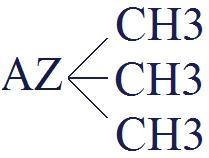
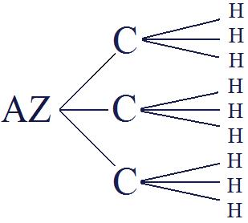

# Leçon 13 | 09 Mars 1955

  <label><input type="checkbox" data-lacan-toggle="original" checked> 原文</label>
  <label><input type="checkbox" data-lacan-toggle="notes" checked> 注释</label>
  <label><input type="checkbox" data-lacan-toggle="commentary" checked> 个人解读评论</label>

<section class="parallel-paragraph" data-paragraph-ids="s2-13-0001">

s2-13-0001

[无对应译文]

原文 · s2-13-0001

Nous allons essayer aujourd’hui de faire quelque chose malgré ma fatigue. Je suis un peu éprouvé par une grippe. Nous sommes toujours à méditer sur le sens concret des diverses conceptions chez FREUD de l’appareil psychique, qui à travers son œuvre se présentent comme explications nécessaires…

</section>

<section class="parallel-paragraph" data-paragraph-ids="s2-13-0002">

s2-13-0002

[无对应译文]

原文 · s2-13-0002

> toujours répondant pour lui à de très difficiles exigences de cohérence interne

</section>

<section class="parallel-paragraph" data-paragraph-ids="s2-13-0003">

s2-13-0003

[无对应译文]

原文 · s2-13-0003

…explications nécessaires de certaines phases des faits cli­niques :

</section>

<section class="parallel-paragraph" data-paragraph-ids="s2-13-0004">

s2-13-0004

[无对应译文]

原文 · s2-13-0004

- d’abord au moment où lui même est le seul et le premier à s’essayer de se retrouver,

</section>

<section class="parallel-paragraph" data-paragraph-ids="s2-13-0005">

s2-13-0005

[无对应译文]

原文 · s2-13-0005

- puis ensuite à travers les modifications de conception et de technique que font autour de lui ceux qui le suivent, c’est-à-dire la communauté analytique.

</section>

<section class="parallel-paragraph" data-paragraph-ids="s2-13-0006">

s2-13-0006

[无对应译文]

原文 · s2-13-0006

En somme, la *Traumdeutung* est l’explication de *l’appareil psychique* tel que vous l’avez vu la dernière fois, avec VALABREGA, d’une façon qui paraissait peut-être aride. Nous étions confrontés avec cette difficile question de la régression, telle qu’elle est d’abord engendrée par les nécessités du schéma même. Il faut lire les *Lettres à Fliess* pour savoir combien pour FREUD ça a été un tra­vail d’engendrement difficile, et comme je disais tout à l’heure, plein d’exigences internes qui vont chez lui jusqu’au plus profond, que d’obtenir des schémas rigoureux, c’est-à-dire permettant d’éliminer soit des absurdités ou des contra­dictions internes trop grandes. Et là il est exigeant.

</section>

<section class="parallel-paragraph" data-paragraph-ids="s2-13-0007">

s2-13-0007

[无对应译文]

原文 · s2-13-0007

Je ne crois pas que ce soit parce qu’il est dans l’hypothèse où il est permis de laisser les choses floues. Quand on fait une hypothèse sur la *quantité*, il faut voir le retentissement sur la notion de *qualité*, et je ne crois pas que l’une et l’autre soient exactement compatibles, à partir du moment où l’on a préféré l’une à l’autre pour certaines commodités de la formulation. C’est ce qui a engendré cette complication première, c’est-à-dire tout à fait fondée, le premier schéma, celui du *Projet* sur lequel nous avons amplement insisté, mais sur lequel nous aurons encore à revenir.

</section>

<section class="parallel-paragraph" data-paragraph-ids="s2-13-0008">

s2-13-0008

[无对应译文]

原文 · s2-13-0008

C’est à une relative simplification de ce premier schéma que nous devons les difficultés du second. À savoir cette dissociation de *la perception* et de *la conscience*, qui oblige en somme à introduire l’hypothèse d’une *régression*, à propos du caractère *figuratif*, *imagi­naire*, comme nous disons, de ce qui se produit dans le rêve. Évidemment, si le terme d’*imagi­naire* avait pu être employé à ce moment-là, cela aurait levé beau­coup de difficultés et de contradictions.

</section>

<section class="parallel-paragraph" data-paragraph-ids="s2-13-0009">

s2-13-0009

[无对应译文]

原文 · s2-13-0009

Mais ce caractère *figuratif* étant conçu comme participant du *perceptif*, le trait justement de la *qualité visuelle* nommément, étant ce qu’il a promu comme équi­valent au terme perceptuel d’autre part, il est clair que la façon de proposer le schéma, telle qu’elle est élaborée, construite dans ce chapitre de la *Traumdeutung,* amène la nécessité de proposer, dès le niveau *topique*, une hypo­thèse comme celle-ci : l’état de rêve ne permettant pas la succession temporelle normale des processus, c’est-à-dire allant jusqu’à la décharge motrice, c’est là qu’il faut chercher l’explication d’une sorte de *retour en arrière* du processus de l’influx intentionnel et par le *retour en arrière* l’apparition de son caractère *imagé*.

</section>

<section class="parallel-paragraph" data-paragraph-ids="s2-13-0010">

s2-13-0010

[无对应译文]

原文 · s2-13-0010

C’est en cela en somme, que tient cette hypothèse, et la *régression* est tellement importante, parce qu’aussi bien nous y voyons la première formulation théorique ferme de ce qui, d’une façon parallèle, analogue, est ensuite admis tant sur le plan formel que sur le plan génétique, historique, c’est-à-dire la régression au premier stade du développement de l’individu, notion qui domine - vous le savez - beau­coup de nos conceptions, eu égard à ce qu’est la névrose d’une part, et ce que pro­duit d’autre part le traitement.

</section>

<section class="parallel-paragraph" data-paragraph-ids="s2-13-0011">

s2-13-0011

[无对应译文]

原文 · s2-13-0011

Eh bien, le fait de questionner tout à fait au départ les exigences de s’en sortir de cette notion, faciliter son entrée en jeu qui paraît maintenant si familière, n’est pas tellement quelque chose qui aille de soi. Que les choses puissent aller ainsi *à l’envers*, c’est ça le sens du terme *régression*. C’est là que nous en sommes.

</section>

<section class="parallel-paragraph" data-paragraph-ids="s2-13-0012">

s2-13-0012

[无对应译文]

原文 · s2-13-0012

Pour vous mettre sur le chemin du passage de ce schéma, que j’ai appelé simplifié, ou second schéma - celui que nous avons vu se réduire à cette série d’étapes, de couches, représenté au tableau, schéma bien connu de la *Traumdeutung –* pour vous faciliter le passage de ce schéma à celui qu’implique le développement ulté­rieur de *la théorie de l’appareil psychique* dans FREUD, nommément celui qui va être centré autour de la conception du narcissisme, je vais vous proposer aujour­d’hui une petite épreuve, à propos du travail du rêve.

</section>

<section class="parallel-paragraph" data-paragraph-ids="s2-13-0013">

s2-13-0013

[无对应译文]

原文 · s2-13-0013

Le rêve initial, le rêve des rêves, celui de *l’injection d’Irma*, auquel FREUD a tou­jours accordé l’importance d’une analyse aussi exhaustive que possible, et auquel, quand il veut reprendre un point d’appui, il revient très souvent, dans l’intérieur même du livre, et à une certaine reprise particulièrement longuement…

</section>

<section class="parallel-paragraph" data-paragraph-ids="s2-13-0014">

s2-13-0014

[无对应译文]

原文 · s2-13-0014

> je vous signale que c’est au niveau de l’explication, de l’introduction qu’il donne de la notion de « *condensation »*

</section>

<section class="parallel-paragraph" data-paragraph-ids="s2-13-0015">

s2-13-0015

[无对应译文]

原文 · s2-13-0015

…eh bien ce rêve, nous allons le prendre, si vous voulez, avec notre point de vue de maintenant.

</section>

<section class="parallel-paragraph" data-paragraph-ids="s2-13-0016">

s2-13-0016

[无对应译文]

原文 · s2-13-0016

Quand nous faisons cela, nous faisons une chose à quoi nous avons pleinement droit, bien entendu, à condition de ne pas en faire mauvais usage, en d’autres termes, de ne pas vouloir refaire dire à une première étape de la pensée de FREUD ce qui est dans la derniè­re, et bien plus encore les accorder les unes avec les autres à notre façon.

</section>

<section class="parallel-paragraph" data-paragraph-ids="s2-13-0017">

s2-13-0017

[无对应译文]

原文 · s2-13-0017

Je vous signale en passant, parce que c’est un trait auquel n’ont pas manqué de s’abandonner *certains auteurs*, et en en faisant un aveu assez candide, nommément on peut trouver sous la plume d’HARTMANN cette notion qu’après tout les concep­tions de FREUD ne s’accordent pas tellement bien que cela entre elles et elles ont besoin - le terme lui échappe, je le regrette pour lui, ce n’est pas moi qui le lui fais dire, je n’attendais pas de lui un tel témoignage - d’être synchronisées.

</section>

<section class="parallel-paragraph" data-paragraph-ids="s2-13-0018">

s2-13-0018

[无对应译文]

原文 · s2-13-0018

Les effets de *cette synchronisation* de la pensée de FREUD sont très précisément ce qui rend nécessaire un retour aux textes. Car à la vérité *la synchronisation* me paraît en cette occasion apporter en soi un fâcheux écho de « *mise au pas »*. Il ne s’agit pas de *syn­chroniser* les différentes étapes de la pensée de FREUD, ni même de les accorder.

</section>

<section class="parallel-paragraph" data-paragraph-ids="s2-13-0019">

s2-13-0019

[无对应译文]

原文 · s2-13-0019

Il s’agit de voir à quelle unique et constante difficulté, le progrès - fait de contradictions de ces différentes étapes de la pensée de FREUD - répondait, et à travers cette suc­cession d’antinomies qu’elle nous présente toujours à l’intérieur d’entre elles et entre elles, à nous affronter à ce qui est proprement l’objet de notre expérience. En d’autres termes, vous allez le voir tout de suite apparaître, je ne suis pas le seul à avoir une idée, parmi les gens qui ont fonction d’enseigner l’analyse et de vous for­mer comme analystes, à avoir eu l’idée de reprendre *le rêve de l’injection d’Irma*.

</section>

<section class="parallel-paragraph" data-paragraph-ids="s2-13-0020">

s2-13-0020

[无对应译文]

原文 · s2-13-0020

Un homme qui s’appelle ERICKSON, et se qualifie lui-même comme tenant de l’éco­le *culturaliste* - grand bien lui fasse ! - c’est une certaine façon de mettre dans l’analy­se l’accent sur le matériel culturel, ce qui pousse à orienter l’attention vers quelque chose qui n’était certes pas méconnu jusque-là…

</section>

<section class="parallel-paragraph" data-paragraph-ids="s2-13-0021">

s2-13-0021

[无对应译文]

原文 · s2-13-0021

> je ne sache pas que FREUD l’ait jamais négligé, ni ceux qui peuvent se qualifier comme spécifiquement freudiens

</section>

<section class="parallel-paragraph" data-paragraph-ids="s2-13-0022">

s2-13-0022

[无对应译文]

原文 · s2-13-0022

…ce qui dans chaque cas relève du contexte culturel dans lequel le sujet est plongé. La ques­tion est de savoir l’importance de tout premier plan, tout à fait prévalente ou non, que l’on doit donner à cet élément dans la constitution du sujet.

</section>

<section class="parallel-paragraph" data-paragraph-ids="s2-13-0023">

s2-13-0023

[无对应译文]

原文 · s2-13-0023

Laissons de côté pour l’instant les discussions que cela peut soulever, et voyons à quoi cela aboutit. À propos du *rêve de l’injection d’Irma*, cela aboutit à certaines remarques - que j’essaierai de vous pointer au fur et à mesure \- pour autant que j’aurai à les ren­contrer dans l’essai de ré-analyse que j’essaierai de faire aujourd’hui - certaines remarques pertinentes, mais qui ne répondent pas, je crois, à ce culturalisme.

</section>

<section class="parallel-paragraph" data-paragraph-ids="s2-13-0024">

s2-13-0024

[无对应译文]

原文 · s2-13-0024

D’un autre côté, je suis étonné de voir que ce *culturalisme* converge assez singu­lièrement avec quelque chose d’autre que j’appellerai un *psychologisme*, et qui consiste - vous verrez toute la question autour de laquelle pivote notre recherche - à tâcher en somme de recomprendre tout le texte analytique, quel qu’il soit, en fonction d’une recherche qui devient la recherche centrale, la préoccupation majeure des analystes…

</section>

<section class="parallel-paragraph" data-paragraph-ids="s2-13-0025">

s2-13-0025

[无对应译文]

原文 · s2-13-0025

> et ce n’est pas pour rien que j’ai nommé HARTMANN, ce n’est pas le simple désir de persifler sa « *synchronisation* »

</section>

<section class="parallel-paragraph" data-paragraph-ids="s2-13-0026">

s2-13-0026

[无对应译文]

原文 · s2-13-0026

…à savoir « *les différentes étapes de l’ego »*.

</section>

<section class="parallel-paragraph" data-paragraph-ids="s2-13-0027">

s2-13-0027

[无对应译文]

原文 · s2-13-0027

Le *rêve de l’injection d’Irma* nous livre tellement de choses. On cherchera à le comprendre en tant qu’étape du développement de l’*ego* de FREUD par exemple, *ego* qui a évidemment droit à un respect tout à fait particulier car c’est l’*ego* d’un grand créateur, et c’est au moment éminent de cette *capacité créatrice* que nous essaierons de situer ce rêve. Bien entendu, ceci a tout l’intérêt pos­sible et à la vérité il ne peut pas se dire non plus que ce soit quelque chose qui soit un idéal faux. Bien sûr, il doit y avoir une *psychologie* du créateur.

</section>

<section class="parallel-paragraph" data-paragraph-ids="s2-13-0028">

s2-13-0028

[无对应译文]

原文 · s2-13-0028

Mais est-ce la leçon que nous avons à tirer de l’expérience freudienne, et plus spécialement, si nous la regardons à la loupe, de ce qui se passe au niveau du *rêve de l’injection d’Irma* ? C’est ce que nous allons tâcher de voir. Vous sentez bien que si ce point de vue est vrai, tout ce que je vous dis, tout ce qui est l’*essence* de la découverte freudienne - qui est essentiellement *le décentrement du sujet par rapport à cet ego -* est faux, et nous pouvons en fin de compte reve­nir à la notion que tout se situe et se centre par rapport à une sorte de « *dévelop­pement idéal-typique de l’ego ».* Si c’est ce que découvre l’analyse, tout ce que je vous dis est faux. Inversement, si ce que je dis est faux, il devient extrêmement difficile de lire le moindre texte de FREUD en y comprenant quelque chose.

</section>

<section class="parallel-paragraph" data-paragraph-ids="s2-13-0029">

s2-13-0029

[无对应译文]

原文 · s2-13-0029

Nous allons en faire l’épreuve, précisément sur le *rêve de l’injection d’Irma*. Je crois que nous avons le droit de le faire, étant donné l’importance que FREUD donne à ce rêve. Au premier abord, on pourrait s’en étonner : qu’est-ce que FREUD, en effet, tire de l’analyse de ce rêve ? Il en tire cette conclusion, cette véri­té qu’il pose comme première : *que le rêve est toujours la réalisation d’un désir, d’un souhait*.

</section>

<section class="parallel-paragraph" data-paragraph-ids="s2-13-0030">

s2-13-0030

[无对应译文]

原文 · s2-13-0030

Ce rêve, je vais rapidement vous en faire rappeler le contenu. J’espère que pour beaucoup d’entre vous le fait de réévoquer le contenu vous ré­évoquera du même coup l’analyse. Vous l’avez lu assez de fois pour que ça signi­fie tout de suite pour vous toute l’analyse attachée autour. J’aurai à m’y référer sans cesse. VALABREGA va vous lire le texte du rêve.

</section>

<section class="parallel-paragraph" data-paragraph-ids="s2-13-0031">

s2-13-0031

[无对应译文]

原文 · s2-13-0031

> « *Un grand hall,* *beaucoup d’invités, nous recevons. Parmi ces invités, Irma, que je prends tout de suite à part, pour lui reprocher,*
>
> *en réponse à sa lettre, de ne pas avoir encore accepté ma « solution ». Je lui dis : « Si tu as encore des douleurs, c’est réellement*
>
> *de ta faute ». Elle répond : « Si tu savais comme j’ai mal à la gorge, à l’estomac et au ventre, cela m’étrangle ». Je prends peur*
>
> *et je la regarde. Elle a un air pâle et bouffi ; je me dis : n’ai-je pas laissé échapper quelque symptôme d’origine organique.*
>
> *Je l’amène près de la fenêtre et j’examine sa gorge. Elle manifeste une certaine résistance comme les femmes qui portent un dentier.*
>
> *Je me dis : pourtant elle n’en a pas besoin. Alors, elle ouvre bien la bouche, et je constate, à droite, une grande tache blanche, et d’autre part j’aperçois d’extraordinaires formations contournées qui ont l’apparence des cornets du nez, et sur elles de larges escarres blanc grisâtre. J’appelle aussitôt le docteur M., qui à son tour examine la malade et confirme... Le docteur M. n’est pas comme d’habitude,*
>
> *il est très pâle, il boite, il n’a pas de barbe... Mon ami Otto est également là, à côté d’elle et mon ami Léopold la per­cute par-dessus*
>
> *le corset ; il dit : « Elle a une matité à la base gauche », et il indique aussi une région infiltrée de la peau au niveau de l’épaule gauche (fait que je constate comme lui, malgré les vêtements)... M. dit : « Il n’y a pas de doute, c’est une infection, mais ça ne fait rien ;*
>
> *il va s’y ajouter de la dysenterie et le poison va s’éliminer. ». Nous savons également, d’une manière directe, d’où vient l’infection.*
>
> *Mon ami Otto lui a fait récem­ment, un jour où elle s’était sentie souffrante, une injection avec une pré­paration de propyle, propylène... acide proprionique... triméthylamine (dont je vois la formule devant mes yeux, imprimée en caractères gras)... Ces injections ne sont pas faciles à faire... il est probable aussi que la seringue n’était pas propre.* » \[p. 99, éd. PUF 1967 ; p. 142 éd. PUF 2003.\]
>
> \[*Eine große Halle – viele Gäste, dia wir empfangen. – Unter ihnen Irma, die ich sofort bei Seite nehme, um gleichsam ihren Brief zu beantworten, ihr Vorwürfe zu machen, daß sie die „Lösung“ noch nicht akzeptiert. Ich sage ihr: Wenn du noch Schmerzen hast, so ist es wirklich nur deine Schuld. – Sie antwortet: Wenn du wüßtest, was ich für Schmerzen jetzt habe im Halse, Magen und Leib, es schnürt mich zusammen. – Ich erschrecke und sehe sie an. Sie sieht bleich und gedunsen aus; ich denke, am Ende übersehe ich da doch etwas Organisches. Ich nehme sie zum Fenster und schaue ihr in den Hals. Dabei zeigt sie etwas Sträuben, wie die Frauen, die ein künstliches Gebiß tragen. Ich denke mir, sie hat es doch nicht nötig. – Der Mund geht dann auch gut auf und ich finde rechts einen großen weißen Fleck und anderwärts sehe ich an merk­würdigen krausen Gebilden, die offenbar den Nasenmuscheln nach­gebildet sind, ansgedehnte weißgraue Schorfe. – Ich rufe schnell Dr. M. hinzu, der die Untersuchung wiederholt und bestätigt.... Dr. M. sieht ganz anders aus als sonst; er ist sehr bleich, hinkt, ist am Kinn bartlos.... Mein Freund Otto steht jetzt auch neben ihr und Freund Leopold perkutiert sie über dem Leibchen und sagt: Sie hat eine Dämpfung links unten, weist auch auf eine infiltrierte Hautpartie an der linken Schulter hin (was ich trotz des Kleides wie er spüre). M. sagt: Kein Zweifel, es ist eine Infektion, aber es macht nichts; es wird noch Dysenterie hinzukommen und das Gift sich ausscheiden.... Wir wissen auch unmittelbar, woher die Infektion rührt. Freund Otto hat ihr unlängst, als sie sich unwohl fühlte, eine Injektion gegeben mit einem Propylpräparat, Propylen... Propionsäure... Trimethylamin (dessen Formel ich fett gedruckt vor mir sehe). Man macht solche Injektionen nicht so leichtfertig. Wahrscheinlich war auch die Spritze nicht rein.*\] \[*Traumdeutung,* Deuticke 1911, 3ème éd.\]

</section>

<section class="parallel-paragraph" data-paragraph-ids="s2-13-0032">

s2-13-0032

[无对应译文]

原文 · s2-13-0032

Je vous rappelle les antécédents du rêve, et ce que signifie Irma. Irma est une malade amie de la famille de FREUD. Il est donc vis-à-vis d’elle dans la situation particulièrement délicate où est l’analyste avec les personnes qu’il soigne dans un cercle interne de ses propres connaissances et nous savons qu’en soi-même la chose est toujours à éviter. Nous sommes beaucoup plus avertis qu’à cet état préhistorique de l’analyse de ce qu’on appelle les difficul­tés, dans ce cas, d’un contre-transfert. C’est bien en effet ce qui se passe. FREUD a de grandes difficultés avec Irma.

</section>

<section class="parallel-paragraph" data-paragraph-ids="s2-13-0033">

s2-13-0033

[无对应译文]

原文 · s2-13-0033

Comme il nous le signale dans les associa­tions du rêve à ce moment, il est encore à penser que quand le sens inconscient du conflit fondamental de la névrose est découvert, on n’a qu’à le proposer au sujet, qui accepte ou n’accepte pas, s’il n’accepte pas, c’est sa faute, c’est un vilain, un méchant, un mauvais patient. Il ne s’agit que de ça dans l’analyse. Je ne force rien, il y a *les bons* et *les mauvais patients*. Quand il est bon, il accep­te et tout va bien. Cette notion, FREUD nous la rapporte avec un humour, voi­sin de l’ironie un peu sommaire que je fais sur ce sujet. Il dit d’ailleurs que cette conception, il peut simplement bénir le ciel de l’avoir eue à cette époque, car elle lui a permis de vivre.

</section>

<section class="parallel-paragraph" data-paragraph-ids="s2-13-0034">

s2-13-0034

[无对应译文]

原文 · s2-13-0034

Donc, il est en grande difficulté avec Irma, qui est certainement améliorée, mais qui conserve certains symptômes, et particulièrement une tendance au vomissement, si mon souvenir est bon, chose certainement fort pénible. Il vient à ce moment là d’interrompre le traitement, et vient d’avoir des nouvelles par l’ami Otto. C’est celui dont, autrefois, quand nous parlions de tout autre chose, j’ai souligné ici qu’il est très proche de FREUD, mais ça n’est pas un ami intime, au sens où il serait un familier des pensées de celui qui est déjà un Maître.

</section>

<section class="parallel-paragraph" data-paragraph-ids="s2-13-0035">

s2-13-0035

[无对应译文]

原文 · s2-13-0035

C’est *un brave* Otto, un Otto qui soigne un peu toute la famille, quand on a des rhumes, des choses qui ne vont pas très bien, qui d’ailleurs fréquente aussi la famille, et qui, vous allez le voir, joue dans le ménage le rôle du célibataire sympathique, bien­faisant, donneur de cadeaux. Tout cela non sans provoquer une certaine ironie amusée de la part de FREUD. L’Otto en question, pour lequel il a une estime de bon aloi, mais moyenne, lui rapporte des nouvelles de la nommée Irma et lui dit que somme toute, ça va, mais pas si bien que ça.

</section>

<section class="parallel-paragraph" data-paragraph-ids="s2-13-0036">

s2-13-0036

[无对应译文]

原文 · s2-13-0036

Et à travers *les intonations* de l’Otto, FREUD croit sen­tir qu’en somme il est quelque peu désapprouvé par le cher ami Otto, plus exac­tement qu’Otto a dû quelque peu participer aux *gorges chaudes* de l’entourage, voire à l’opposition qu’il a rencontrée à propos de cette cure imprudemment entreprise sur un terrain où il n’est pas pleinement maître de manœuvrer comme il l’entend. C’est bien de cela qu’il s’agit, car FREUD a le sentiment qu’il a bien proposé à Irma la bonne *solution*, *Lösung,* mot qui a la même ambiguïté en allemand qu’en français: *solution* qu’on injecte, et *solution* de conflit, se confondent et se recouvrent sur le même terme, et c’est en cela que le *rêve de l’injection d’Irma* prend déjà son sens symbolique. À propos de cette *Lösung,* que nous allons voir - à la fin surtout - se rapprocher de plus en plus *d’une injec­tion*, c’est bien de cela qu’il s’agit et que nous partons.

</section>

<section class="parallel-paragraph" data-paragraph-ids="s2-13-0037">

s2-13-0037

[无对应译文]

原文 · s2-13-0037

Et au départ FREUD est fort mécontent de son ami. Mais s’il en est mécontent, c’est qu’il est encore bien plus mécontent de lui-même, non seulement quant aux résultats obtenus, mais il va jusqu’à mettre en doute le bien-fondé de la solution qu’il apporte et le bon apport de la dite solution, même peut-être le principe même du traitement, puisqu’aussi bien, pour lui, tout est encore en question de la valabilité de ce trai­tement des névroses.

</section>

<section class="parallel-paragraph" data-paragraph-ids="s2-13-0038">

s2-13-0038

[无对应译文]

原文 · s2-13-0038

Il est en somme au stade expérimental - 1895 - où il fait ses découvertes majeures et parmi lesquelles, l’analyse de ce rêve qui lui paraîtra toujours si importante que plus tard, en 1900, il écrira dans une *lettre à Fliess*, juste après la parution du livre où il le rapporte : « *expérience décisive* ». Il s’amu­sera - mais ses façons de s’amuser ne sont pas tellement gratuites - à évoquer :

</section>

<section class="parallel-paragraph" data-paragraph-ids="s2-13-0039">

s2-13-0039

[无对应译文]

原文 · s2-13-0039

« *Peut-être un jour on mettra sur le seuil de la maison de campagne de Bellevue, où se passe ce rêve :* *« Ici, le* 24 *juillet* 1895*, pour la première fois l’énigme du rêve a été dévoilée par Sigmund Freud »*[^13].

</section>

<section class="parallel-paragraph" data-paragraph-ids="s2-13-0040">

s2-13-0040

[无对应译文]

原文 · s2-13-0040

Il est donc à la fois plein de confiance, et juste avant la crise de 1897, dont nous trouvons trace dans la *lettre à Fliess*, où il pense à un moment qu’il a méconnu tous les problèmes concernant la névrose, que toute la théorie du trauma, qui est centrale pour la genèse de sa conception sous la forme de la séduction, est à reje­ter, et par conséquent du même coup tout l’édifice s’écroule.

</section>

<section class="parallel-paragraph" data-paragraph-ids="s2-13-0041">

s2-13-0041

[无对应译文]

原文 · s2-13-0041

FREUD est donc dans une période créatrice, mais d’autre part extrêmement ouverte à l’incertitude, au doute, qui est même ce qui caractérise tout son progrès de la découverte. Ce simple petit choc de ce qui est perçu - à travers la voix d’Otto - de désapprobation, est ce qui va être la mise en branle, le mobile, de ce qui va déclencher tout le rêve.

</section>

<section class="parallel-paragraph" data-paragraph-ids="s2-13-0042">

s2-13-0042

[无对应译文]

原文 · s2-13-0042

Dès 1882 - je vous le signale – FREUD, dans une lettre à sa fiancée remarquait que ce qui venait dans les rêves \- ça vaut la peine de le noter, j’ai trouvé ça comme ça - ce n’étaient pas tellement les grandes préoccupations du jour que les thèmes qui ont été amorcés puis interrompus, cette espèce de côté « *sifflet coupé* » de la parole.

</section>

<section class="parallel-paragraph" data-paragraph-ids="s2-13-0043">

s2-13-0043

[无对应译文]

原文 · s2-13-0043

C’est une des choses qui ont le plus frappé FREUD précocement, et que nous retrouvons sans cesse dans ses analyses, que quoi que ce soit qui se passe dans l’ordre de ce qu’on peut appeler « *psychopathologie de la vie quotidienne* », vous vous rappelez sans doute quand je vous ai parlé de l’histoire de l’oubli du nom de l’auteur de la fresque d’Orvieto, c’est en raison aussi de *quelque chose qui n’est pas complètement sorti pendant la journée* et on le retrouve sans cesse.

</section>

<section class="parallel-paragraph" data-paragraph-ids="s2-13-0044">

s2-13-0044

[无对应译文]

原文 · s2-13-0044

Ici, c’est bien loin d’en être ainsi. FREUD s’est mis au travail le soir après dîner et fait tout un résumé à propos du cas d’Irma, de façon à remettre les choses au point, et au besoin justifier de la conduite générale du traitement. Là-dessus la nuit vient, et nous assistons à ce rêve.

</section>

<section class="parallel-paragraph" data-paragraph-ids="s2-13-0045">

s2-13-0045

[无对应译文]

原文 · s2-13-0045

Je vais tout de suite au résultat. FREUD considère, semble-t-il, et d’une façon qui nous frappe, vous allez voir pourquoi, comme un grand succès d’avoir pu expliquer dans tous ses détails ce rêve par le désir de se décharger de la responsabilité dans l’échec du traitement d’Irma.

</section>

<section class="parallel-paragraph" data-paragraph-ids="s2-13-0046">

s2-13-0046

[无对应译文]

原文 · s2-13-0046

Il le fait dans le rêve - lui, comme artisan du rêve - par des voies mul­tiples, tellement multiples que, comme il le remarque avec son humour habituel, cela ressemble beaucoup à l’histoire de la personne à qui on reproche d’avoir rendu un chaudron percé, et qui répond que* *

</section>

<section class="parallel-paragraph" data-paragraph-ids="s2-13-0047">

s2-13-0047

[无对应译文]

原文 · s2-13-0047

- premièrement, il l’a rendu intact,

</section>

<section class="parallel-paragraph" data-paragraph-ids="s2-13-0048">

s2-13-0048

[无对应译文]

原文 · s2-13-0048

- deuxièmement, il était déjà percé quand il l’a emprunté,

</section>

<section class="parallel-paragraph" data-paragraph-ids="s2-13-0049">

s2-13-0049

[无对应译文]

原文 · s2-13-0049

- troisièmement il ne l’a pas emprunté. Chacune de ces explications serait parfaitement valable mais l’en­semble ne peut en aucune façon nous satisfaire. C’est ainsi que serait conçu ce rêve, dit FREUD. Et bien entendu, ça n’est que trop évident qu’il y a là un fil com­mun, trame de tout ce qui apparaît dans le rêve.

</section>

<section class="parallel-paragraph" data-paragraph-ids="s2-13-0050">

s2-13-0050

[无对应译文]

原文 · s2-13-0050

La question est plutôt celle-ci : comment FREUD se contente-t-il…

</section>

<section class="parallel-paragraph" data-paragraph-ids="s2-13-0051">

s2-13-0051

[无对应译文]

原文 · s2-13-0051

> étant donné le développement qu’ultérieurement a pris pour lui la théorie du rêve, qu’il y a dans le rêve un certain nombre d’éléments qui sont en continuité, il y a le texte du *préconscient*, qui sont dans le rêve fondamentalement animés par le désir inconscient

</section>

<section class="parallel-paragraph" data-paragraph-ids="s2-13-0052">

s2-13-0052

[无对应译文]

原文 · s2-13-0052

…en somme pour le premier pas de sa démonstration de la *Traumdeutung,* comment se contente-t-il de nous montrer un rêve entièrement expliqué par la satisfaction d’un désir qu’on ne peut pas appeler autrement que *préconscient*.

</section>

<section class="parallel-paragraph" data-paragraph-ids="s2-13-0053">

s2-13-0053

[无对应译文]

原文 · s2-13-0053

Car ce désir de se justifier de l’échec du traitement d’Irma est quelque chose qui en effet est non seulement *préconscient* mais tout à fait *conscient*, puisqu’il a passé la veille au soir à faire quelque chose qui réduit tout le traitement d’Irma, c’est-à-dire justement de se justifier aussi bien de ce qui va, de ce qui peut ne pas aller, mettre noir sur blanc ce qui semble avoir motivé toute sa conduite.

</section>

<section class="parallel-paragraph" data-paragraph-ids="s2-13-0054">

s2-13-0054

[无对应译文]

原文 · s2-13-0054

FREUD ne semble donc pas au premier abord avoir du tout exigé, pour l’établissement de cette formule qu’« *un rêve est dans tous les cas la satisfaction d’un désir* », autre chose que la notion la plus générale du *désir*, sans se soucier plus avant de la situation de *ce désir*, de savoir, comme je vous le disais à l’orée de notre dernière rencontre, ce qu’est *ce désir*, ou même - pour nous en tenir à quelque chose de plus familier - d’où vient ce désir : de *l’inconscient* ou du *préconscient* ?

</section>

<section class="parallel-paragraph" data-paragraph-ids="s2-13-0055">

s2-13-0055

[无对应译文]

原文 · s2-13-0055

Rappelez-vous que FREUD pose sa question ainsi dans une note que j’ai lue la dernière fois :

</section>

<section class="parallel-paragraph" data-paragraph-ids="s2-13-0056">

s2-13-0056

[无对应译文]

原文 · s2-13-0056

- Qui est-il, ce désir inconscient ?

</section>

<section class="parallel-paragraph" data-paragraph-ids="s2-13-0057">

s2-13-0057

[无对应译文]

原文 · s2-13-0057

- Qui est-il, lui qui est repoussé et fait horreur au sujet ?

</section>

<section class="parallel-paragraph" data-paragraph-ids="s2-13-0058">

s2-13-0058

[无对应译文]

原文 · s2-13-0058

- Quand on parle donc d’un désir inconscient, qu’est-ce qu’on veut dire ?

</section>

<section class="parallel-paragraph" data-paragraph-ids="s2-13-0059">

s2-13-0059

[无对应译文]

原文 · s2-13-0059

- Pour qui ce désir existe-t-il ? En fin de compte c’est bien à ce niveau que va s’éclairer pour nous le fait de l’immense satisfaction qu’apporte à FREUD cette *solution* qu’il donne au rêve.

</section>

<section class="parallel-paragraph" data-paragraph-ids="s2-13-0060">

s2-13-0060

[无对应译文]

原文 · s2-13-0060

Car pour donner nous-même son plein sens au fait que ce premier rêve interprété joue ce rôle décisif dans l’exposé de FREUD, il faut que nous y ajoutions cette note spéciale, précisément de l’impor­tance - et je dirai d’autant plus significative qu’elle nous apparaît paradoxale - que lui donne FREUD. Car au premier abord on pourrait presque dire que la porte qu’il enfonce n’était pas tellement \[...\] presque d’être une porte ouverte, puisqu’il s’agit en fin de compte de *désir préconscient*. Il n’a pas fait le pas décisif apparemment, *mais il a le sentiment de l’avoir fait* puisqu’il en fait *le rêve des rêves*, le rêve initial, typique.

</section>

<section class="parallel-paragraph" data-paragraph-ids="s2-13-0061">

s2-13-0061

[无对应译文]

原文 · s2-13-0061

*C’est ce qui est important, c’est qu’il ait le sentiment de l’avoir fait* et il ne démontre que trop par la suite de son exposé qu’il l’a fait. *S’il a le sentiment de l’avoir fait, c’est qu’il l’a effectivement fait*. Entendez que je ne suis pas en train de refaire l’analyse du rêve de FREUD après FREUD lui-même. Ce serait tout à fait absurde. Pas plus qu’il n’est ques­tion d’analyser des auteurs défunts, il n’est question d’analyser mieux que FREUD son propre rêve.

</section>

<section class="parallel-paragraph" data-paragraph-ids="s2-13-0062">

s2-13-0062

[无对应译文]

原文 · s2-13-0062

Quand FREUD interrompt les associations, il a ses raisons pour cela et il nous dit :

</section>

<section class="parallel-paragraph" data-paragraph-ids="s2-13-0063">

s2-13-0063

[无对应译文]

原文 · s2-13-0063

> « *Ici, je ne veux pas vous en dire plus long, car quand même je vous en donne déjà assez,*
>
> *je ne peux pas vous raconter toutes les histoires de lit et de pot de chambre…* »

</section>

<section class="parallel-paragraph" data-paragraph-ids="s2-13-0064">

s2-13-0064

[无对应译文]

原文 · s2-13-0064

Ou bien il dit nettement :

</section>

<section class="parallel-paragraph" data-paragraph-ids="s2-13-0065">

s2-13-0065

[无对应译文]

原文 · s2-13-0065

« *Ici, je n’ai plus envie de continuer à associer.* »

</section>

<section class="parallel-paragraph" data-paragraph-ids="s2-13-0066">

s2-13-0066

[无对应译文]

原文 · s2-13-0066

Tout cela est noté à l’intérieur de ce texte. Il ne s’agit donc pas d’*exégéter*, d’ex­trapoler là où FREUD s’interrompt lui-même, mais de prendre, nous, cet ensemble dans lequel nous sommes sur une position différente de FREUD, car enfin il ne faut pas oublier qu’il y a deux choses : premièrement, faire le rêve, deuxièmement, l’in­terpréter. C’est une opération dans laquelle nous intervenons. Mais n’oubliez pas que dans la plupart des cas nous intervenons aussi dans la première, car ce que nous faisons dans une analyse, ce n’est pas *simplement* *interpréter le rêve* du sujet, si tant est que nous l’interprétions, mais comme nous sommes déjà à titre d’analyste dans la vie du sujet, *nous sommes déjà dans son rêve*.

</section>

<section class="parallel-paragraph" data-paragraph-ids="s2-13-0067">

s2-13-0067

[无对应译文]

原文 · s2-13-0067

Si vous vous rappelez ce que dans la conférence inaugurale de cette société[^14] je vous évoquai comme « *petit* » *symbolisme*, à propos du *symbolique*, de *l’imaginai­re* et du *réel*, des choses sur lesquelles je ne suis jamais revenu, qui consistaient à en user sous forme de *petites lettres* et de *grandes lettres *:

</section>

<section class="parallel-paragraph" data-paragraph-ids="s2-13-0068">

s2-13-0068

[无对应译文]

原文 · s2-13-0068

- *i* (S) : mettre *le symbole* sous forme d’*image*, *imager le symbole*, mettre *le dis­cours symbolique* sous forme *figurative* : le rêve,

</section>

<section class="parallel-paragraph" data-paragraph-ids="s2-13-0069">

s2-13-0069

[无对应译文]

原文 · s2-13-0069

- *s* (I) : *symboliser l’image*, faire une *interprétation* de *rêve*.

</section>

<section class="parallel-paragraph" data-paragraph-ids="s2-13-0070">

s2-13-0070

[无对应译文]

原文 · s2-13-0070

Seulement, pour cela *il faut qu’il y ait une réversion, que ce symbole soit symbo­lisé*, c’est-à-dire qu’au milieu il y a la place pour comprendre ce qui se passe dans cette double transformation. C’est simplement ça que nous allons essayer de faire, prendre l’ensemble de ce rêve et l’interprétation qu’en donne FREUD, et voir ce que ça signifie dans l’ordre du *symbolique* et de l’*imaginaire*.

</section>

<section class="parallel-paragraph" data-paragraph-ids="s2-13-0071">

s2-13-0071

[无对应译文]

原文 · s2-13-0071

Nous avons la chance que le fameux rêve dont nous parlons tout le temps, et dont vous ne constaterez que trop que nous ne le manions qu’avec le plus grand respect, parce qu’il s’agit d’un rêve, *n’est pas dans le temps*. C’est très simple à remarquer et constitue précisément l’originalité du rêve : *le rêve n’est pas dans le temps*.

</section>

<section class="parallel-paragraph" data-paragraph-ids="s2-13-0072">

s2-13-0072

[无对应译文]

原文 · s2-13-0072

Il y a quelque chose de tout à fait frappant, qu’aucun des auteurs en question n’a remarqué dans sa pureté, non pas qu’ils ne s’en soient pas approchés, M. ERIKSON s’en approche, mais malheureusement son *culturalisme* n’est pas pour lui un instrument aussi efficace qu’on pourrait le souhaiter. Le dit *cul­turalisme* le pousse à poser le problème soit-disant de l’étude du *contenu manifeste* du rêve. Ce *contenu manifeste* du rêve mériterait d’être remis au premier plan, nous dit-il.

</section>

<section class="parallel-paragraph" data-paragraph-ids="s2-13-0073">

s2-13-0073

[无对应译文]

原文 · s2-13-0073

Là-dessus, discussion fort confuse, qui repose sur la notion de « *superficiel »* et de « *profond »*, dont je vous supplie toujours de vous débarrasser et n’y plus penser. Il y a là une considération sur la profondeur du superficiel, où je dois dire, quant à moi, prenant les choses sous le jour de l’humour, et comme GIDE le dit dans « *Les faux monnayeurs »* : *Il n’y a rien de plus profond que le superficiel* », parce qu’il n’y a pas de profond du tout.

</section>

<section class="parallel-paragraph" data-paragraph-ids="s2-13-0074">

s2-13-0074

[无对应译文]

原文 · s2-13-0074

Nous allons en effet le voir. Ce n’est pas là qu’est la question. La question est ceci : il faut d’abord partir du texte, et en partir comme FREUD le conseille lui-même, montre qu’il le fait : *comme d’un texte sacré*. L’*auteur*, le *scribe* n’était qu’un scribouillard, et il vient en second. Les *commentaires des Écritures* ont été irrémédiablement perdus le jour où on a voulu nous faire la psy­chologie de JÉRÉMIE, ISAÏE, voire JÉSUS-CHRIST.

</section>

<section class="parallel-paragraph" data-paragraph-ids="s2-13-0075">

s2-13-0075

[无对应译文]

原文 · s2-13-0075

C’est du même ordre que ce que je suis en train de vous raconter. Quand il s’agit de nos patients, je vous demande de porter plus d’attention au texte qu’à la psychologie de l’auteur. C’est tout le sens et l’orientation de mon enseignement. Eh bien, prenons ce texte, justement : il nous mène à ce qui est essentiel dans l’analyse. Prenons ce texte : il y a deux étapes.

</section>

<section class="parallel-paragraph" data-paragraph-ids="s2-13-0076">

s2-13-0076

[无对应译文]

原文 · s2-13-0076

Il y a une acmé qui est ceci : D’abord, FREUD est là. M. ERIKSON attache une grande importance au fait qu’au départ il dit : « *Nous recevons* ». Au départ il serait un personnage double : il reçoit, il n’est pas tout seul, il reçoit avec sa femme. Et en effet il est là aperçu, il s’agit d’un anniversaire. C’est une petite fête qui est attendue pour quelque chose et où Irma, l’amie de la famille, doit venir. Je veux bien, en tête le « *Nous recevons* » pose FREUD dans son identité de chef de famille, ce « *Nous* » ne paraît pas être quelque chose qui implique une bien grande duplicité de sa fonction sociale. Car on ne voit absolument pas apparaître la chère *Frau doktor*, pas une minute.

</section>

<section class="parallel-paragraph" data-paragraph-ids="s2-13-0077">

s2-13-0077

[无对应译文]

原文 · s2-13-0077

Dès qu’il apparaît, FREUD entre dans le dialogue, le champ visuel se rétrécit. Il prend Irma à part et commence à lui faire des reproches et à l’invectiver, lui dire :

</section>

<section class="parallel-paragraph" data-paragraph-ids="s2-13-0078">

s2-13-0078

[无对应译文]

原文 · s2-13-0078

« *C’est bien de ta faute, si tu m’écoutais ça irait mieux* ».

</section>

<section class="parallel-paragraph" data-paragraph-ids="s2-13-0079">

s2-13-0079

[无对应译文]

原文 · s2-13-0079

Inversement, Irma lui dit :

</section>

<section class="parallel-paragraph" data-paragraph-ids="s2-13-0080">

s2-13-0080

[无对应译文]

原文 · s2-13-0080

> « *Tu ne peux pas savoir comme ça fait mal ici et là : gorge, ventre, estomac .*»

</section>

<section class="parallel-paragraph" data-paragraph-ids="s2-13-0081">

s2-13-0081

[无对应译文]

原文 · s2-13-0081

Et puis elle dit que cela lui *zusammenschnüren, étreindre-ficeler*, ce *Zusammenschnüren* me paraît vivement expressif, je lui attache une certaine expression...

</section>

<section class="parallel-paragraph" data-paragraph-ids="s2-13-0082">

s2-13-0082

[无对应译文]

原文 · s2-13-0082

Mme X - Autrefois, on avait trois ou quatre personnes qui tiraient sur le cor­don du corset pour le serrer.

</section>

<section class="parallel-paragraph" data-paragraph-ids="s2-13-0083">

s2-13-0083

[无对应译文]

原文 · s2-13-0083

LACAN

</section>

<section class="parallel-paragraph" data-paragraph-ids="s2-13-0084">

s2-13-0084

[无对应译文]

原文 · s2-13-0084

Et alors FREUD, quand même, est assez impressionné par tout cela : il commence à manifester quelque inquiétude. Il l’attire vers la fenêtre et lui fait ouvrir la bouche. Tout cela donc, est sur un fond de discussion et de *résistance*, mais *résistance* qui n’est pas simplement *résistance* à ce que FREUD propose, mais aussi à l’examen.

</section>

<section class="parallel-paragraph" data-paragraph-ids="s2-13-0085">

s2-13-0085

[无对应译文]

原文 · s2-13-0085

Tous ces mots valent d’être dits en allemand. On les traduit en anglais et en français par « *hérésie »*... Il s’agit là en fait de *résis­tance* du type « *résistance féminine »*, et aussi bien les auteurs passent là-dessus, faisant entrer en jeu toute la question de la psychologie féminine dite victo­rienne. Car il est bien certain que les femmes ne nous résistent plus, ça ne nous excite plus, les femmes qui résistent. Quand il s’agit de *résistance féminine* c’est toujours *ces pauvres femmes victoriennes* qui sont là à concen­trer sur elles leurs reproches, c’est assez amusant. Et aussi, *conséquence du culturalisme* qui dans ce cas-là ne sert évidemment pas à ouvrir les yeux à M. ERIKSON. Néanmoins, nous sentons que c’est là quelque chose d’important, cela l’est en fait. C’est autour de cela que vont tourner toutes les associations de FREUD qui vont mettre en valeur qu’Irma est bien loin d’être la seule en cause.

</section>

<section class="parallel-paragraph" data-paragraph-ids="s2-13-0086">

s2-13-0086

[无对应译文]

原文 · s2-13-0086

Parmi les per­sonnes qui sont *sich streichen* il y en a bien d’autres. Et en particulier il y en a deux qui sont là, et qui pour être symétriques n’en sont pas moins assez problématiques : la femme de FREUD lui-même qui, à ce moment-là - ce n’est pas dit dans le texte mais on en fait état par ailleurs - est enceinte, et d’autre part une autre malade, qui est, si on peut dire, la malade idéale, parce que d’abord elle n’est pas une malade de FREUD et ensuite elle est assez jolie, et aussi certainement plus intelligente qu’Irma, dont on a plutôt tendance à noircir les facilités de compré­hension.

</section>

<section class="parallel-paragraph" data-paragraph-ids="s2-13-0087">

s2-13-0087

[无对应译文]

原文 · s2-13-0087

Et elle a aussi cet attrait : qu’elle ne demande pas le secours de FREUD. Ce qui de ce fait même, laisse souhaiter à FREUD qu’elle puisse un jour le lui deman­der. Mais à vrai dire il n’en a pas grand espoir. Bref, dans ce registre, la femme va très évidemment de l’intérêt professionnel le plus purement orienté, jusqu’à toutes les formes de virage imaginaire qui peuvent s’établir à travers une femme.

</section>

<section class="parallel-paragraph" data-paragraph-ids="s2-13-0088">

s2-13-0088

[无对应译文]

原文 · s2-13-0088

Nous voyons s’insérer en éventail ces trois femmes, parmi lesquelles est impli­quée la personne très évidemment très importante pour la situation du personna­ge de FREUD, sa propre femme, dont nous savons à la fois l’importance extrême du rôle qu’elle a joué dans la vie de FREUD, dans le style d’un caractère tout à fait spécial d’attachement non seulement familial, mais conjugal : nous savons que l’attachement à sa femme était hautement idéalisée.

</section>

<section class="parallel-paragraph" data-paragraph-ids="s2-13-0089">

s2-13-0089

[无对应译文]

原文 · s2-13-0089

Il ne semble pas pourtant, à travers certaines nuances qu’on découvre, qu’elle ait été sans lui apporter sur un certain nombre de plans instinctuels quelques déceptions. C’est dans cet éventail que se situe la relation avec Irma. Irma apparaît comme un personnage qui a une valeur imaginaire qui se déploie.

</section>

<section class="parallel-paragraph" data-paragraph-ids="s2-13-0090">

s2-13-0090

[无对应译文]

原文 · s2-13-0090

Il faut remarquer que tout ceci n’est retrouvé que grâce à des petits signes de modifications d’image d’Irma, et dans les associations dans la seconde partie, dans la partie « *interpréta­tion* » du rêve. Dans la partie « *rêve* », il y a seulement Irma. FREUD est tel qu’il est, par­lant avec Irma, en psychothérapeute, d’une façon directe, d’objets qui sont évi­demment légèrement distordus par rapport à ceux qui sont l’objet actuel, réel, de leur débat.

</section>

<section class="parallel-paragraph" data-paragraph-ids="s2-13-0091">

s2-13-0091

[无对应译文]

原文 · s2-13-0091

Les symptômes sont un peu modifiés, sans aucun doute. Tout ceci pose un certain nombre d’énigmes qui ouvrent sur le sens profond dont il s’agit, celles d’un aperçu. Mais dans la structure de ce qui se passe dans le rêve, nous avons ici l’*ego* de FREUD, qui est parfaitement au niveau de son *ego* vigile. L’objet dont il s’agit, Irma, est à peine distordu mais ce qu’elle montre, elle le montrerait aussi bien si on y regardait de près à l’état de veille.

</section>

<section class="parallel-paragraph" data-paragraph-ids="s2-13-0092">

s2-13-0092

[无对应译文]

原文 · s2-13-0092

Si FREUD analysait ses comportements, ses réponses, ses émotions, son transfert, comme on dit, à tout instant dans le dialogue avec Irma, il verrait tout aussi bien que derrière Irma il y a :

</section>

<section class="parallel-paragraph" data-paragraph-ids="s2-13-0093">

s2-13-0093

[无对应译文]

原文 · s2-13-0093

- sa femme, amie assez intime,

</section>

<section class="parallel-paragraph" data-paragraph-ids="s2-13-0094">

s2-13-0094

[无对应译文]

原文 · s2-13-0094

- et aussi bien la jeune femme séduisante qui est aussi à deux pas et ferait une bien meilleure patiente qu’Irma. Nous sommes là à un premier niveau, où le dialogue reste en quelque sorte entièrement asservi aux conditions de la relation réelle, en tant qu’elle est juste­ment elle-même entièrement engluée dans les conditions imaginaires qui la limi­tent, et font pour FREUD, pour l’instant, la difficulté.

</section>

<section class="parallel-paragraph" data-paragraph-ids="s2-13-0095">

s2-13-0095

[无对应译文]

原文 · s2-13-0095

Ceci va très loin, jusqu’à ce qu’ayant ouvert la bouche de la patiente, ayant obtenu qu’elle ouvre la bouche…

</section>

<section class="parallel-paragraph" data-paragraph-ids="s2-13-0096">

s2-13-0096

[无对应译文]

原文 · s2-13-0096

> c’est de cela qu’il s’agit justement dans la réalité : qu’elle n’ouvre pas la bouche

</section>

<section class="parallel-paragraph" data-paragraph-ids="s2-13-0097">

s2-13-0097

[无对应译文]

原文 · s2-13-0097

…ce qu’il voit au fond est quelque chose dont il faut voir dans les associations le caractère, c’est un spectacle affreux, horrible, épouvantable, cette bouche avec toutes les significations d’équivalence que vous voudrez, qui semble aussi bien où tout se mêle et s’associe dans cette image, les préoccupations habituelles, cette sorte de bouche dans laquelle on voit les cornets du nez recouverts d’une couche de membrane blanchâtre.

</section>

<section class="parallel-paragraph" data-paragraph-ids="s2-13-0098">

s2-13-0098

[无对应译文]

原文 · s2-13-0098

Vous voyez les condensations qu’il y a là ! Ceci va de l’organe sexuel féminin, en passant par la bouche, jusqu’au nez, le nez ayant lui-même le sens extrêmement précis, c’est un mal dont souffre FREUD, qui, juste avant ou après, se fait opérer lui-même, par FLIESS ou un autre, des cornets du nez.

</section>

<section class="parallel-paragraph" data-paragraph-ids="s2-13-0099">

s2-13-0099

[无对应译文]

原文 · s2-13-0099

Il y a là une découverte, horrible découverte ! Il n’est pas question de cela dans les symptômes réels de la patiente. C’est le spectacle d’horreur par excellence ! C’est la chair qu’on ne voit jamais :

</section>

<section class="parallel-paragraph" data-paragraph-ids="s2-13-0100">

s2-13-0100

[无对应译文]

原文 · s2-13-0100

- le fond des choses, l’envers de la face, du visa­ge, les sécrétats par excellence,

</section>

<section class="parallel-paragraph" data-paragraph-ids="s2-13-0101">

s2-13-0101

[无对应译文]

原文 · s2-13-0101

- la chair en tant qu’en sort tout ce qui en sort, au plus profond même du mystère,

</section>

<section class="parallel-paragraph" data-paragraph-ids="s2-13-0102">

s2-13-0102

[无对应译文]

原文 · s2-13-0102

- la chair en tant qu’elle est souffrante, qu’elle est informe, que sa forme par soi-même est quelque chose qui provoque l’angoisse.

</section>

<section class="parallel-paragraph" data-paragraph-ids="s2-13-0103">

s2-13-0103

[无对应译文]

原文 · s2-13-0103

C’est de cela qu’il s’agit dans cette vision d’angoisse, avec tout ce que comporte aussi d’identification d’angoisse, dernière révélation le « *tu es ceci* », « *tu es ce qui est le plus loin de toi, tu es ce qui est le plus informe, le plus impossible à révé­ler* ». C’est devant cette révélation du type *Mené, tecel, fares* [^15] que FREUD arrive au som­met de son besoin de voir, de savoir, de chercher dans ce dialogue, au niveau strict du dialogue de l’*ego* avec l’objet. Voilà où nous arrivons.

</section>

<section class="parallel-paragraph" data-paragraph-ids="s2-13-0104">

s2-13-0104

[无对应译文]

原文 · s2-13-0104

Ici, M. ERIKSON fait une remarque qui, je dois dire, est excellente :

</section>

<section class="parallel-paragraph" data-paragraph-ids="s2-13-0105">

s2-13-0105

[无对应译文]

原文 · s2-13-0105

> « *Normalement un rêve qui aboutit à cela doit provoquer le réveil. Pourquoi ne se réveille-t-il pas ?*
>
> *Parce que c’est Freud ! C’est un dur* »

</section>

<section class="parallel-paragraph" data-paragraph-ids="s2-13-0106">

s2-13-0106

[无对应译文]

原文 · s2-13-0106

Moi je veux bien, c’est un dur. Comme son *ego* est coincé salement devant ce spectacle, il régresse cet *ego* et toute la suite de l’exposé est pour nous dire que cet *ego* régresse. Alors il y a toute une théorie des différents stades de l’*ego*, dont je vous donnerai connaissance. C’est toujours intéressant. Il y a un *ego* qui pro­gresse de la confiance - sur une base de méfiance - à toutes sortes d’évolutions. Du côté de l’adolescence, il s’agit d’une opposition.

</section>

<section class="parallel-paragraph" data-paragraph-ids="s2-13-0107">

s2-13-0107

[无对应译文]

原文 · s2-13-0107

X - L’initiative…

</section>

<section class="parallel-paragraph" data-paragraph-ids="s2-13-0108">

s2-13-0108

[无对应译文]

原文 · s2-13-0108

LACAN- C’est fou ce qu’on a d’initiative quand on est petit.

</section>

<section class="parallel-paragraph" data-paragraph-ids="s2-13-0109">

s2-13-0109

[无对应译文]

原文 · s2-13-0109

X - Et après une certaine intégration.

</section>

<section class="parallel-paragraph" data-paragraph-ids="s2-13-0110">

s2-13-0110

[无对应译文]

原文 · s2-13-0110

LACAN

</section>

<section class="parallel-paragraph" data-paragraph-ids="s2-13-0111">

s2-13-0111

[无对应译文]

原文 · s2-13-0111

L’intégration s’opposant à la diffusion des rôles, ce serait la carac­téristique de l’adolescence. Je ne dis pas que ce soit faux.

</section>

<section class="parallel-paragraph" data-paragraph-ids="s2-13-0112">

s2-13-0112

[无对应译文]

原文 · s2-13-0112

X…

</section>

<section class="parallel-paragraph" data-paragraph-ids="s2-13-0113">

s2-13-0113

[无对应译文]

原文 · s2-13-0113

Et après l’identité du moi, à partir du moment où l’adulte l’a eu par la conscience et d’autre part une telle intégrité qu’il puisse réussir. Il veut évi­ter deux termes qui au fond se rattachent à la génération.

</section>

<section class="parallel-paragraph" data-paragraph-ids="s2-13-0114">

s2-13-0114

[无对应译文]

原文 · s2-13-0114

LACAN

</section>

<section class="parallel-paragraph" data-paragraph-ids="s2-13-0115">

s2-13-0115

[无对应译文]

原文 · s2-13-0115

Il y a là l’invention du mot « *générativité »,* pour être le maximum de la plénitude adulte, c’est-à-dire le moment où on a envie d’engendrer des enfants. On arrive ensuite à cette intégrité de l’âge du déclin, qui aurait à faire comme à son pôle d’opposition à quelque chose que j’ai assez apprécié, une *disgust.* Il semble qu’il y a entre les deux une espèce d’opposition.

</section>

<section class="parallel-paragraph" data-paragraph-ids="s2-13-0116">

s2-13-0116

[无对应译文]

原文 · s2-13-0116

J’objecterai volontiers au cher M. ERICKSON que le sentiment d’intégrité s’ac­commode assez bien du corrélatif contemporain et ne s’en porte pas plus mal. Ce sont des amusettes psychologiques certainement fort instructives, mais à la vérité qui me paraissent aller contre l’esprit même de la théorie freudienne.

</section>

<section class="parallel-paragraph" data-paragraph-ids="s2-13-0117">

s2-13-0117

[无对应译文]

原文 · s2-13-0117

Car enfin, si l’*ego* est en effet cette sorte de succession d’*émergences de formes*, le fait de double face, de bien et de mal, de réalisations et de modes d’irréalisations, qui en constitueraient le type, on voit mal ce que vient faire là-dedans une découverte de l’histoire du sujet qui - si vous me permettez de l’imager et de forcer la note contraire - fait au contraire dans 1000, 2000 endroits des écrits de FREUD, nous devons considérer le *moi* comme étant la somme des *identifications* du sujet avec tout ce que ceci peut comporter de plus radicalement contingent, et pour tout dire, en fait, littéralement, la superposition des différents manteaux empruntés à ce que j’appellerai « *le bric-à-brac de son magasin d’accessoires* ».

</section>

<section class="parallel-paragraph" data-paragraph-ids="s2-13-0118">

s2-13-0118

[无对应译文]

原文 · s2-13-0118

Qu’est-ce que l’expérience nous montre ? Est-ce que vous pouvez vraiment, vous autres *analystes*, en toute sincérité, authenticité, m’apporter comme témoi­gnages de ces superbes développements typiques de l’*ego* des sujets, ce sont des histoires pour \[enfants ?\]. Quand on nous raconte la façon dont se développe somptueuse­ment ce grand arbre, l’homme, qui à travers son existence triomphe des épreuves successives, grâce auquel il arrive à ce merveilleux équilibre ! C’est tout à fait autre chose, une vie humaine. J’ai déjà écrit cela autrefois, à propos de tout autre chose, dans mon discours sur la psychogenèse. Mais il convient de le répéter.

</section>

<section class="parallel-paragraph" data-paragraph-ids="s2-13-0119">

s2-13-0119

[无对应译文]

原文 · s2-13-0119

Qu’est-ce que nous voyons ? Est-ce vraiment *d’une régression de l’ego qu’il va s’agir* au moment où FREUD va éviter ce réveil ? Qu’est-ce que nous voyons ?

</section>

<section class="parallel-paragraph" data-paragraph-ids="s2-13-0120">

s2-13-0120

[无对应译文]

原文 · s2-13-0120

À partir de ce moment-là, plus question de FREUD. Lui-même a appelé le professeur M. au secours parce qu’il y perd son latin. Ce n’est pas pour autant qu’on va lui en donner un autre meilleur, de latin. Car *à partir de ce moment* ce que nous voyons est ceci : Les trois clowns qui sont là :

</section>

<section class="parallel-paragraph" data-paragraph-ids="s2-13-0121">

s2-13-0121

[无对应译文]

原文 · s2-13-0121

- le docteur M. personnalité prédominante du milieu, comme il l’appelle, je n’ai pas identifié qui c’est, un type tout à fait estimable dans la vie pratique. Il n’a certainement jamais fait beaucoup de mal à FREUD. Mais simplement il n’est pas toujours de son avis, et FREUD n’est pas homme à admettre ça d’une façon extrêmement aisée,

</section>

<section class="parallel-paragraph" data-paragraph-ids="s2-13-0122">

s2-13-0122

[无对应译文]

原文 · s2-13-0122

- puis il y a Otto,

</section>

<section class="parallel-paragraph" data-paragraph-ids="s2-13-0123">

s2-13-0123

[无对应译文]

原文 · s2-13-0123

- et le cama­rade Léopold, qui a un avantage principal aux yeux de FREUD, c’est qu’il *dame le pion* au camarade Otto.

</section>

<section class="parallel-paragraph" data-paragraph-ids="s2-13-0124">

s2-13-0124

[无对应译文]

原文 · s2-13-0124

Aux yeux de FREUD, ça lui fait un mérite considérable. Il le compare à l’inspecteur BRÄSIG [^16] et à son ami Karl. L’inspecteur BRÄSIG est un type futé et malin, mais qui se trompe toujours, parce qu’il omet de regarder bien les choses. Le camarade Karl, qui est là à côté, le remarque : « *ce n’est pas ça !* » et l’ins­pecteur BRÄSIG n’a plus qu’à suivre. Avec ce trio, nous voyons s’établir autour de la petite Irma une espèce de dialogue à *bâtons rompus*, qui tient plutôt du jeu des propos interrompus. On dirait même presque de quelque chose qui n’est pas tout à fait loin du dialogue bien connu de sourds. Je résume, car tout cela est extrême­ment riche.

</section>

<section class="parallel-paragraph" data-paragraph-ids="s2-13-0125">

s2-13-0125

[无对应译文]

原文 · s2-13-0125

Autour de cela, sont apparues toutes les associations qui nous montrent la véritable signification. FREUD va pouvoir y voir qu’à la suite de tout cela il est innocenté de tout.

</section>

<section class="parallel-paragraph" data-paragraph-ids="s2-13-0126">

s2-13-0126

[无对应译文]

原文 · s2-13-0126

- Premièrement, ils rapportent tout ce qu’on veut, et toutes sortes de choses qui, si elles sont vraies, innocentent FREUD à la façon dont nous le disions tout à l’heure : *du seau percé qu’on a rendu*.

</section>

<section class="parallel-paragraph" data-paragraph-ids="s2-13-0127">

s2-13-0127

[无对应译文]

原文 · s2-13-0127

- Deuxièmement, ils le font d’une façon si ridicule qu’évidemment n’importe qui apparaîtrait un dieu auprès de pareilles machines à absurdités.

</section>

<section class="parallel-paragraph" data-paragraph-ids="s2-13-0128">

s2-13-0128

[无对应译文]

原文 · s2-13-0128

- Troisièmement, ce que nous voyons est que ce dont il s’agit c’est *de personnages qui sont tous significatifs*, précisément de ce dont tout à l’heure je vous disais *de personnages de l’identification* auxquels préside la formation de l’*ego*.

</section>

<section class="parallel-paragraph" data-paragraph-ids="s2-13-0129">

s2-13-0129

[无对应译文]

原文 · s2-13-0129

Le docteur M. répond à quelque chose qui a été tout à fait capital pour FREUD, son demi-frère Philippe, celui dont je vous disais en un autre contexte que c’est le personnage tellement essentiel pour comprendre *le complexe œdipien* de FREUD, à savoir que si FREUD a été introduit à l’Œdipe d’une façon aussi décisive pour l’histoire de l’humanité, c’est évidemment qu’il avait un père, lequel d’un premier mariage, avait déjà deux fils, Emmanuel et Philippe, d’un âge voisin, à 3 années près, mais qui étaient déjà en âge d’être chacun le père du petit Sigmund, né lui d’une mère qui avait exactement le même âge que le dit Emmanuel.

</section>

<section class="parallel-paragraph" data-paragraph-ids="s2-13-0130">

s2-13-0130

[无对应译文]

原文 · s2-13-0130

Cet Emmanuel a été pour FREUD l’objet d’horreur par excellence. On a cru que toutes les horreurs étaient concentrées sur lui, à tort car Philippe en a pris sa part. C’est lui qui a fait coffrer la bonne vielle nourrice de FREUD à laquel­le on attache une importance démesurée, les culturalistes ayant voulu annexer FREUD au catholicisme - ce qui est une drôle d’idée - par son intermédiaire.

</section>

<section class="parallel-paragraph" data-paragraph-ids="s2-13-0131">

s2-13-0131

[无对应译文]

原文 · s2-13-0131

Il n’en reste pas moins que les personnages de la génération intermédiaire ont joué un rôle considérable et que c’est une forme particulièrement supérieure qui permet de concentrer les attaques agressives contre le père, sans trop toucher au *père symbolique* - qui lui, est vraiment dans un ciel qui n’est certainement pas celui de la sainteté, mais qui du point de vue *fonction symbolique* a son extrême impor­tance *- père symbolique* qui reste intact grâce à cette division des fonctions.

</section>

<section class="parallel-paragraph" data-paragraph-ids="s2-13-0132">

s2-13-0132

[无对应译文]

原文 · s2-13-0132

En effet, nous voyons donc se produire ceci :

</section>

<section class="parallel-paragraph" data-paragraph-ids="s2-13-0133">

s2-13-0133

[无对应译文]

原文 · s2-13-0133

- le Dr M. représente ce per­sonnage idéal constitué par cette pseudo–image paternelle, ce *père imaginaire*.

</section>

<section class="parallel-paragraph" data-paragraph-ids="s2-13-0134">

s2-13-0134

[无对应译文]

原文 · s2-13-0134

- Otto est tout à fait corrélatif de ce personnage à la fois familier et proche intime, qui est à la fois ami et ennemi, qui d’une heure à l’autre devient d’ami, ennemi, qui a joué un rôle constant dans la vie de FREUD.

</section>

<section class="parallel-paragraph" data-paragraph-ids="s2-13-0135">

s2-13-0135

[无对应译文]

原文 · s2-13-0135

- Léopold, à l’intérieur de cela, joue le rôle du personnage utile pour contrer toujours le personnage de cet ami-ennemi, de cet ennemi chéri, qui lui est si familier.

</section>

<section class="parallel-paragraph" data-paragraph-ids="s2-13-0136">

s2-13-0136

[无对应译文]

原文 · s2-13-0136

Nous voyons donc là, une toute autre triade, mais elle est dans le rêve. L’*interprétation* de FREUD nous sert à en com­prendre le sens. Mais quel est son rôle dans le rêve ? Elle est de jouer avec la paro­le, et la parole dans toute sa valeur décisive en cette occasion, et judicative, avec la loi, avec ce qui tourmente FREUD :

</section>

<section class="parallel-paragraph" data-paragraph-ids="s2-13-0137">

s2-13-0137

[无对应译文]

原文 · s2-13-0137

> « *Ai-je tort ou raison ? Où est la vérité ? Quel est le sort du problème ? Où est-ce que je suis situé ?* »

</section>

<section class="parallel-paragraph" data-paragraph-ids="s2-13-0138">

s2-13-0138

[无对应译文]

原文 · s2-13-0138

FREUD a bien raison de l’interpréter comme cela. Mais ce que nous voyons c’est aussi en comprenant *symboliquement* ce qui se passe à partir de ce moment-là. Nous avons vu la première fois, avec l’*ego* d’Irma trois personnages féminins, dont FREUD dit qu’il y a là une telle abondance de recoupements de tout ce qui se passe à propos de ces trois femmes, qu’à la fin les choses se nouent et qu’on arri­ve à je ne sais quel mystère.

</section>

<section class="parallel-paragraph" data-paragraph-ids="s2-13-0139">

s2-13-0139

[无对应译文]

原文 · s2-13-0139

Quand nous analysons ce texte, il faut tenir compte de ce qui est dans le texte tout entier, y compris ce qu’il y a dans *les notes*. À cette occasion, il va parler du fait que c’est ce point des associations où le rêve prend son insertion dans l’inconnu, où c’est ce qu’il appelle son *ombilic*. C’est là que nous en sommes restés avec la fin de la première étape. Nous sommes arrivés à ce quelque chose qu’il y a derrière ce trio mystique. Je dis « *mys­tique* » parce que nous en connaissons maintenant le sens :

</section>

<section class="parallel-paragraph" data-paragraph-ids="s2-13-0140">

s2-13-0140

[无对应译文]

原文 · s2-13-0140

- les trois femmes,

</section>

<section class="parallel-paragraph" data-paragraph-ids="s2-13-0141">

s2-13-0141

[无对应译文]

原文 · s2-13-0141

- les trois sœurs,

</section>

<section class="parallel-paragraph" data-paragraph-ids="s2-13-0142">

s2-13-0142

[无对应译文]

原文 · s2-13-0142

- les trois coffrets.

</section>

<section class="parallel-paragraph" data-paragraph-ids="s2-13-0143">

s2-13-0143

[无对应译文]

原文 · s2-13-0143

FREUD nous en a depuis longtemps démontré le sens. Le dernier terme et le sens c’est *la mort*, tout simplement. C’est bien de cela qu’il s’agit, car nous le voyons même apparaître au milieu du vacarme des paroles dans la seconde partie. L’histoire de la membrane diphtérique est directement liée à la menace portée deux ans auparavant sur une des filles de FREUD. À propos de la terrible menace, qui a été extrêmement loin, FREUD a senti la valeur comme d’un châtiment pour une *maladresse thérapeutique* qu’il a commise lui-même, en don­nant trop d’un médicament, nommément le Sulfonal, à une de ses patientes, ne sachant pas que l’usage continu du Sulfonal n’était pas sans effets nocifs. Et il a cru voir là le prix payé de sa faute professionnelle.

</section>

<section class="parallel-paragraph" data-paragraph-ids="s2-13-0144">

s2-13-0144

[无对应译文]

原文 · s2-13-0144

Voyons donc ce qui se passe. Dans la seconde partie, les trois personnages qui jouent entre eux ce jeu dérisoire de se renvoyer la balle à propos de la question fondamentale, cette question - qui d’autre part est étroitement liée pour FREUD, à la question : « *quel est le sens de la névrose ?* » - c’est :

</section>

<section class="parallel-paragraph" data-paragraph-ids="s2-13-0145">

s2-13-0145

[无对应译文]

原文 · s2-13-0145

- « *Quel est le sens de la cure ?* »

</section>

<section class="parallel-paragraph" data-paragraph-ids="s2-13-0146">

s2-13-0146

[无对应译文]

原文 · s2-13-0146

- « *Quel est le bien fondé de ma thérapeutique des névroses ?* » …et derrière tout cela le FREUD qui rêve en étant un FREUD qui cherche la clé du rêve : *et pourquoi la clé du rêve doit-elle être la même chose que la clé de la névrose et la clé de la cure ?*

</section>

<section class="parallel-paragraph" data-paragraph-ids="s2-13-0147">

s2-13-0147

[无对应译文]

原文 · s2-13-0147

Que voyons-nous se produire ? De même qu’il y a eu dans la première étape une sorte d’*acmé*, où est apparu brusquement un sommet, une révélation d’apocalypse de ce qui était là, dans la seconde partie, à un moment qui se caractérise sur deux plans différents très curieux : d’abord « nous savons immédiatement »...

</section>

<section class="parallel-paragraph" data-paragraph-ids="s2-13-0148">

s2-13-0148

[无对应译文]

原文 · s2-13-0148

> *unmittelbar,* fait allusion à ce quelque chose qui est la caractéristique de la conviction déli­rante :
>
> tout d’un coup, vous savez que c’est celui-là qui vous en veut

</section>

<section class="parallel-paragraph" data-paragraph-ids="s2-13-0149">

s2-13-0149

[无对应译文]

原文 · s2-13-0149

...tout d’un coup ils savent que c’est Otto le coupable, il est le coupable, parce qu’il a fait une injection. On cherche : *propyle*... *propylène*...

</section>

<section class="parallel-paragraph" data-paragraph-ids="s2-13-0150">

s2-13-0150

[无对应译文]

原文 · s2-13-0150

À ceci s’associe toute l’histoire infiniment comique du jus d’ananas, dont la veille Otto a fait cadeau à la famille. On a débouché, ça sentait ce qu’on appelle « *une odeur de rikiki* ». On dit « *On va le donner aux domestiques* ». Mais FREUD quand même « *plus humain* » - dit-il - dit gentiment « *Mais non, eux aussi ça pourrait leur faire du mal* ».

</section>

<section class="parallel-paragraph" data-paragraph-ids="s2-13-0151">

s2-13-0151

[无对应译文]

原文 · s2-13-0151

De tout cela il sort ceci, écrit en caractères gras, au-delà de ce vacarme des paroles - c’est la *Mené, thecel, Phares* de la Bible - la formule de la *triméthylamine*. Je vais vous écrire cette formule :

</section>

<section class="parallel-paragraph" data-paragraph-ids="s2-13-0152">

s2-13-0152

[无对应译文]

原文 · s2-13-0152

</section>

<section class="parallel-paragraph" data-paragraph-ids="s2-13-0153">

s2-13-0153

[无对应译文]

原文 · s2-13-0153

Cela éclaire tout, parce que *triméthylamine* ça bougeait beaucoup du côté de FLIESS pour des histoires de métabolisme sexuel, on a beaucoup parlé d’un tas de choses les derniers temps.

</section>

<section class="parallel-paragraph" data-paragraph-ids="s2-13-0154">

s2-13-0154

[无对应译文]

原文 · s2-13-0154

Je n’ai pas besoin de relire le passage qu’a lu VALABREGA. Ce rêve prend son sens non seulement dans la recherche de FREUD : « *qu’est-ce que le sens du rêve ?* », mais s’il peut continuer de se poser la question, c’est parce qu’il se demande si tout cela communique avec FLIESS et la *triméthylamine*. Dans les élucubrations de FLIESS, cela joue un rôle, à un moment, à propos des produits de décomposition des produits sexuels.

</section>

<section class="parallel-paragraph" data-paragraph-ids="s2-13-0155">

s2-13-0155

[无对应译文]

原文 · s2-13-0155

En effet, je me suis informé, la *triméthylamine* est un produit de décomposition du sperme, c’est ce qui donne son odeur ammoniacale quand on le laisse se décomposer à l’air. Il suffit de savoir qu’il lui donnait un rôle.

</section>

<section class="parallel-paragraph" data-paragraph-ids="s2-13-0156">

s2-13-0156

[无对应译文]

原文 · s2-13-0156

L’important est que le rêve, qui a culminé une première fois alors que l’*ego* était là, sur cette image horrifique, culmine la seconde fois...

</section>

<section class="parallel-paragraph" data-paragraph-ids="s2-13-0157">

s2-13-0157

[无对应译文]

原文 · s2-13-0157

> alors que quelque chose est là que nous ne pouvons pas identifier autrement que *la parole en tant que telle, en tant qu’on dit ce qui se dit, la rumeur universelle* dans une formule écrite, avec son côté « *Mené, thecel, Phares »* écrit sur la muraille

</section>

<section class="parallel-paragraph" data-paragraph-ids="s2-13-0158">

s2-13-0158

[无对应译文]

原文 · s2-13-0158

...et vient là à la fin du rêve, dont je dirai que nous ne pouvons pas y lire autre chose.

</section>

<section class="parallel-paragraph" data-paragraph-ids="s2-13-0159">

s2-13-0159

[无对应译文]

原文 · s2-13-0159

Comme un oracle, elle ne donne bien entendu pas la réponse à quoi que ce soit, à la question fondamentale qui est celle qui fait que ce rêve, par FREUD a été choisi comme exemple éminent, donnant la solution du sens du rêve, et qui est en effet la ques­tion du sens du rêve. On ne peut pas dire qu’elle donne la réponse, mais la façon énigmatique même dont elle donne cette réponse, à savoir sous la forme de for­mule avec tout son caractère hermétique, est la réponse à la question du sens du rêve. Je dirai qu’on peut le calquer sur la formule de *la charia islamique* « *Il n’y a d’autre Dieu que Dieu* »,

</section>

<section class="parallel-paragraph" data-paragraph-ids="s2-13-0160">

s2-13-0160

[无对应译文]

原文 · s2-13-0160

« *Il n’y a d’autre mot* - comme solution à votre problè­me - *que le mot »*.

</section>

<section class="parallel-paragraph" data-paragraph-ids="s2-13-0161">

s2-13-0161

[无对应译文]

原文 · s2-13-0161

Et ce mot du problème est ceci précisément que le mot est alors guidé par cela, nous pouvons même nous pencher sur la structure de ce mot, qui se présente là sous une forme éminemment symbolique, puisqu’il est fait de *signes sacrés*. Nous pouvons les retrouver, le regarder. Ces *trois* que nous retrouvons toujours, c’est là que dans le rêve est l’inconscient.

</section>

<section class="parallel-paragraph" data-paragraph-ids="s2-13-0162">

s2-13-0162

[无对应译文]

原文 · s2-13-0162

</section>

<section class="parallel-paragraph" data-paragraph-ids="s2-13-0163">

s2-13-0163

[无对应译文]

原文 · s2-13-0163

Ce qui est « *en dehors* » de tous les sujets - met­tons *la structure du rêve* - nous montre assez que ça n’est pas l’*ego* pur et simple du rêveur, que ça n’est pas FREUD en tant que FREUD, continuant sa conversation avec Irma, c’est FREUD au moment :

</section>

<section class="parallel-paragraph" data-paragraph-ids="s2-13-0164">

s2-13-0164

[无对应译文]

原文 · s2-13-0164

- où il a traversé le moment d’angoisse majeu­re,

</section>

<section class="parallel-paragraph" data-paragraph-ids="s2-13-0165">

s2-13-0165

[无对应译文]

原文 · s2-13-0165

- où le *moi* s’identifie au tout sous sa forme la plus inconstituée, la plus hor­rible,

</section>

<section class="parallel-paragraph" data-paragraph-ids="s2-13-0166">

s2-13-0166

[无对应译文]

原文 · s2-13-0166

- où il s’est littéralement évadé,

</section>

<section class="parallel-paragraph" data-paragraph-ids="s2-13-0167">

s2-13-0167

[无对应译文]

原文 · s2-13-0167

- où comme il l’écrit lui-même, il a fait appel tout d’un coup « *au congrès de tous ceux qui savent »*.

</section>

<section class="parallel-paragraph" data-paragraph-ids="s2-13-0168">

s2-13-0168

[无对应译文]

原文 · s2-13-0168

Tout d’un coup *il s’est éva­noui, résorbé, aboli* derrière eux, et quelque chose d’autre, *une autre voix prend la parole*, qui est celle-ci, appe­lons là comme vous voudrez, il est facile de s’amuser de ce qui est *l’alpha et l’oméga* de la chose - mais même nous appellerions l’azote N, que le « NEMO » nous servirait quand même encore la même calembredaine pour désigner ce « *sujet hors du sujet* ». Mais il est quand même là, pour désigner toute *la structure du rêve*. Ce que nous montre le rêve est ceci : ce qui est en jeu dans la fonction du rêve est ce quelque chose qui est *au-delà de l’ego* qui dans le sujet est du sujet et n’est pas du sujet, l’inconscient en d’autres termes.

</section>

<section class="parallel-paragraph" data-paragraph-ids="s2-13-0169">

s2-13-0169

[无对应译文]

原文 · s2-13-0169

Peu nous importe à ce moment-là que nous puissions nous souvenir que c’est cette injection faite par Otto, et faite avec une seringue qui est sale. On peut beau­coup s’amuser sur cette seringue d’un usage familier, en allemand cela s’accom­pagne de toutes sortes de résonances données en français par *gicler*. Nous savons en effet assez l’importance, par toutes sortes de petits indices dans la vie de FREUD, de ce qu’on peut appeler l’érotisme urétral. Un jour que je serai bien luné, je vous montrerai que jusqu’à un âge avancé FREUD a eu de ce côté-là quelque chose qui fait nettement écho au souvenir de son urination dans la chambre de ses parents, à laquelle ERIKSON attache tellement d’importance et nous fait remarquer que sans aucun doute il y avait là un petit pot de chambre, qu’il n’a pu faire pipi par terre. FREUD ne précise pas : il ne dit pas s’il a fait dans le pot de chambre maternel ou sur le tapis ou le simple parquet, mais ceci est de second ordre.

</section>

<section class="parallel-paragraph" data-paragraph-ids="s2-13-0170">

s2-13-0170

[无对应译文]

原文 · s2-13-0170

L’important est que ce rêve nous montre combien c’est essentiel dans le registre de *la communication symbolique d’une parole* qui a à passer, quelle qu’elle soit, que se produise le courant essentiel de ce qui se passe au niveau de tout ce qu’on peut appeler *les symptômes analytiques*, à proprement parler. À l’intérieur de cela se rencontre toujours le double obstacle, la résistance de quelque chose qui est à traverser, ce que nous appellerons provisoirement pour aujourd’hui, parce qu’il est tard, l’*ego* du sujet et son image, et que sans aucun doute, tant que ces deux interpositions offrent une suffisante *résistance*, elles *s’illuminent* si je puis dire à l’intérieur de ce courant, elles « *phosphorent* », elles *fulgurent*.

</section>

<section class="parallel-paragraph" data-paragraph-ids="s2-13-0171">

s2-13-0171

[无对应译文]

原文 · s2-13-0171

C’est le principe que toute cette phase originelle du rêve, pendant lequel FREUD est là sur le plan de la résistance, en train de jouer avec sa patiente, et il y a un moment, parce qu’il a dû aller assez loin, où ça cesse. En effet, il n’a pas tout à fait tort, M. ERIKSON, c’est bien parce que FREUD est actuellement pris par une passion telle que de savoir ce qui fait la véritable valeur inconsciente de ce rêve, quels que soient ses échos primordiaux et infantiles :

</section>

<section class="parallel-paragraph" data-paragraph-ids="s2-13-0172">

s2-13-0172

[无对应译文]

原文 · s2-13-0172

- cette recherche du mot,

</section>

<section class="parallel-paragraph" data-paragraph-ids="s2-13-0173">

s2-13-0173

[无对应译文]

原文 · s2-13-0173

- cet affrontement direct à la réalité secrète, significative du rêve,

</section>

<section class="parallel-paragraph" data-paragraph-ids="s2-13-0174">

s2-13-0174

[无对应译文]

原文 · s2-13-0174

- cette recherche de la signification comme telle, …qui fait qu’à *un moment*, et sous la forme où FREUD peut la voir apparaître à *ce moment originel* de naissance de sa doctrine, où tout est encore dans le chaos. C’est au milieu du chaos de tous ses confrères, de tout *le consensus de la République de ceux* *qui savent*, qu’il laisse passer - symbolisée dans son rêve - se manifester cette espèce de *loi contradictoire* et ainsi rassurante.

</section>

<section class="parallel-paragraph" data-paragraph-ids="s2-13-0175">

s2-13-0175

[无对应译文]

原文 · s2-13-0175

Parce que si personne n’a raison, tout le monde a raison, c’est au milieu de cela que *le sens du rêve* se révèle, qui est essentiellement *qu’il n’y a pas d’autre mot au rêve que ceci qui est de la nature du symbolique*, et que cette *nature du symbolique* ne se révèle que dans quelque chose que je veux à la fin de ce texte poser, pour lequel je veux moi aussi introduire, pour vous servir de repère. Les symboles n’ont jamais que la valeur de symbole, qui est quelque chose que nous pouvons désigner comme étant la caractéristique de ce qui se passe dans le mot de franchissement de la seconde partie du rêve. Dans la 1ère partie vous avez vu ce qui arrive, et elle est la plus chargée en raison d’un *imaginaire*. Elle est là, bien toute entière. À la fin du rêve, il entre quelque chose que nous pourrions au premier abord appeler la foule. C’est une foule structurée, comme la foule freudienne. Mais j’aimerais mieux vous introduire un autre terme que je vais lais­ser à votre méditation, c’est celui-ci, avec tous les doubles sens qu’il peut com­porter : « *l’immixtion des sujets »*.

</section>

<section class="parallel-paragraph" data-paragraph-ids="s2-13-0176">

s2-13-0176

[无对应译文]

原文 · s2-13-0176

Évidemment *les sujets* entrent et se mêlent des choses, cela peut être *le 1ersens*. *L’autre chose* est ceci : que nous devons tou­jours, chaque fois qu’il s’agit d’un phénomène inconscient, considérer que dès lors *que c’est dans un plan symbolique comme tel* \- et *dans un plan symbolique* que comme tel nous devons considérer comme *décentré par rapport à l’essence* psychologique *du sujet*, si tant est que ça existe - que ça se passe toujours *en un point* qui ne peut jamais se situer que - comme je vous l’ai dit que *la paro­le* toujours se situe - entre deux sujets.

</section>

<section class="parallel-paragraph" data-paragraph-ids="s2-13-0177">

s2-13-0177

[无对应译文]

原文 · s2-13-0177

Et pourtant, en partie, du moment où *la parole vraie* émerge et fait des deux sujets, deux sujets si *différents* - si l’on peut s’exprimer ainsi, de ce qu’ils étaient avant *la parole*, bien que ceci ne veuille rien dire, car ils ne commencent à être constitués comme sujets de *la parole* qu’à partir du moment où *la parole* existe, et il n’y a pas d’avant : *la parole* est toujours un médiateur entre deux sujets.

</section>

<section class="note-block original-notes">

## Notes

[^13]: Lettre 137 (248) du 12 Juin 1900, in « *Lettres à Wilhem Fliess* », PUF 2006, pp. 526-528.

[^14]: Jacques Lacan : *Conférence inaugurale de la Société française de psychanalyse*, [1953-07-08](http://www.ecole-lacanienne.net/pictures/mynews/9917835CB831A5EB84B0E347B2992D86/1953-07-08.pdf) (in « *pas tout Lacan* » : [E.L.P](http://www.ecole-lacanienne.net/fr/p/lacan).).

[^15]: Cf. « *Le Festin de Balthasar* », chapitre 5 du livre de Daniel, Ancien Testament : מְנֵא מְנֵא תְּקֵל וּפַרְסִין, « *Mené, Mené, Tekel et Parsîn* » : « *Mesuré, pesé, jugé* ».

[^16]: Sigmund Freud : *L’interprétation des rêves* : « *Il y avait entre eux une diversité de caractère tout à fait semblable à celle existant entre l 'inspecteur Bräsig*

    *et son ami Karl ».* L'inspecteur Bräsig est un personnage d'un roman célèbre de Fritz Reuter : « *Ut mine Stromlid* ».

</section>
