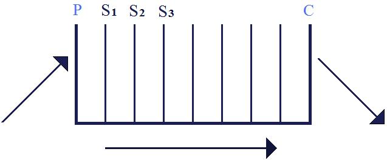

# Leçon 14 | 16 Mars 1955

  

    <label><input type="checkbox" data-lacan-toggle="original" checked> 原文</label>
    <label><input type="checkbox" data-lacan-toggle="notes" checked> 注释</label>
    <label><input type="checkbox" data-lacan-toggle="commentary" checked> 个人解读评论</label>
  

  <form class="lacan-tool-search" role="search">
    <input class="lacan-tool-search-input" type="search" placeholder="搜索全文" aria-label="搜索全文">
    <button class="lacan-tool-button" type="submit" title="搜索">搜索</button>
  </form>
  <button class="lacan-tool-button lacan-back-to-top" type="button" title="回到页面最上方" aria-label="回到页面最上方">↑</button>

<section class="parallel-paragraph" data-paragraph-ids="s2-14-0001">

s2-14-0001

原文 · s2-14-0001

Qu’est-ce que ça vous a *apporté* la séance d’hier soir ? Qu’est-ce que vous en pensez ? Quel rapport avec nos objets usuels ? Qu’est-ce qui a commencé à décanter la morale ? Quelles sont vos impressions ? Qu’est-ce que ça vous donne ?

[无对应译文]

</section>

<section class="parallel-paragraph" data-paragraph-ids="s2-14-0002">

s2-14-0002

原文 · s2-14-0002

LEFORT

[无对应译文]

</section>

<section class="parallel-paragraph" data-paragraph-ids="s2-14-0003">

s2-14-0003

原文 · s2-14-0003

Je me demande pourquoi ces gens n’ont pas une civilisation. Il semble qu’il y ait tant de choses qui viennent d’Égypte et qu’ils en soient pour­tant restés où ils en sont du point de vue expression ? C’est la question que je me suis posée. Mais ce que nous a apporté M. GRIAULE, moi ça m’a ouvert des horizons sur ces peuplades qui ont *une métaphysique* et une \[culture ?\] insoupçonnée. En particulier cette vibration de parole qui fait craquer la graine et va se poser sur les choses en puissance.

[无对应译文]

</section>

<section class="parallel-paragraph" data-paragraph-ids="s2-14-0004">

s2-14-0004

原文 · s2-14-0004

LACAN

[无对应译文]

</section>

<section class="parallel-paragraph" data-paragraph-ids="s2-14-0005">

s2-14-0005

原文 · s2-14-0005

Remarquez, la civilisation du Soudan, il ne l’a pas beaucoup mise en évidence. Il y a là quand même une histoire très complexe des sortes de mariage, d’influences, d’invasion, d’empires. Nous regrettons, d’ailleurs, de ne pas voir tout cela mieux noué, résultat d’une enquête actuelle, qui se place sur un plan bien systématique.

[无对应译文]

</section>

<section class="parallel-paragraph" data-paragraph-ids="s2-14-0006">

s2-14-0006

原文 · s2-14-0006

Les choses auxquelles il a fait rapidement allusion, par exemple l’islamisation d’une partie importante de ces populations, le fait qu’elles continuent à fonc­tionner sur *le registre symbolique*, tout en appartenant d’une façon non négli­geable à un style de *credo* religieux nettement discordant avec ce système, leur exigence sur ce plan se manifeste d’une façon très précise, par exemple quand ils demandent qu’on leur apprenne l’arabe, parce que l’arabe est la langue du Coran.

[无对应译文]

</section>

<section class="parallel-paragraph" data-paragraph-ids="s2-14-0007">

s2-14-0007

原文 · s2-14-0007

Tout cela qui subsiste à côté, corrélativement aux choses par ailleurs démontrées, comme une tradition qui vient de très loin et très vivantes, qui semblent s’entretenir par toutes sortes de procédés de rythme, c’est quelque chose qui nous laisse sur notre faim. Mais il ne faut pas croire que cette civilisation soudanaise soit sans \[culture ?\]. Vous voyez les manifestations extérieures…

[无对应译文]

</section>

<section class="parallel-paragraph" data-paragraph-ids="s2-14-0008">

s2-14-0008

原文 · s2-14-0008

LEFORT- Par exemple l’architecture, les petites maisons…

[无对应译文]

</section>

<section class="parallel-paragraph" data-paragraph-ids="s2-14-0009">

s2-14-0009

原文 · s2-14-0009

LACAN

[无对应译文]

</section>

<section class="parallel-paragraph" data-paragraph-ids="s2-14-0010">

s2-14-0010

原文 · s2-14-0010

Nous en avons vu à l’exposition coloniale, le style des bords du Niger. Mais évidemment, c’est assez troublant. C’est fait pour bouleverser nos catégories au sujet de l’échelle, que nous croyons trop unique, où peut se mesu­rer la qualité d’une civilisation.

[无对应译文]

</section>

<section class="parallel-paragraph" data-paragraph-ids="s2-14-0011">

s2-14-0011

原文 · s2-14-0011

Qui est-ce qui a lu le dernier article de LÉVI-STRAUSS ? Qu’est-ce que vous en pensez ? C’est précisément à ça qu’il est fait allusion, que certaines erreurs de nos perspectives proviennent du fait que nous nous servons d’une échelle unique pour mesurer ce qu’on appelle la qualité, le caractère exceptionnel, unique, d’une civilisation.

[无对应译文]

</section>

<section class="parallel-paragraph" data-paragraph-ids="s2-14-0012">

s2-14-0012

原文 · s2-14-0012

Il est évident qu’il y a là quelque chose qui donne le sentiment d’un usage extraordinairement étendu et profond à la fois, et exemplaire pour autant qu’il est, semble-t-il, capable d’apporter, indépendamment presque d’autres soutiens matériels dans la culture, d’être d’un grand secours pour les hommes qui vivent dedans, qui connaissent ce mode de communication qui est tout de même assez saisissant. C’est ça qui est exemplaire, cette sorte d’isolement de *la fonction symbolique*.

[无对应译文]

</section>

<section class="parallel-paragraph" data-paragraph-ids="s2-14-0013">

s2-14-0013

原文 · s2-14-0013

Quand on voit cela, semble-t-il, il est toujours difficile de juger ces choses à travers un informateur qui voit les choses sous un certain angle, qui apportent, semble-t-il, de grandes satisfactions, qui permettent à ces gens de vivre dans des conditions qui, au premier abord, peuvent en effet paraître assez ardues, assez précaires du point de vue du bien-être, de la civilisation, et pourtant semblent trouver là un appui très puissant, dans cette sorte de chose qui peut rester long­temps *cachée*.

[无对应译文]

</section>

<section class="parallel-paragraph" data-paragraph-ids="s2-14-0014">

s2-14-0014

原文 · s2-14-0014

C’est aussi frappant \[...\] dont on a mis longtemps à pouvoir entrer en communication avec eux. Il y a là une analogie avec notre propre position vis-à-vis du sujet humain. Vous ne croyez pas qu’on peut faire à peu près le bilan des choses comme ça ?

[无对应译文]

</section>

<section class="parallel-paragraph" data-paragraph-ids="s2-14-0015">

s2-14-0015

原文 · s2-14-0015

Quant à ce que j’ai raconté la dernière fois sur *le rêve de l’injection d’Irma*, est-ce que cela pose pour certains des questions ? Je pense qu’il y aurait lieu de confirmer, de savoir si ce que je vous ai dit a été *bien compris*. En fin de compte, dans la façon dont j’ai repris *le rêve d’Irma*, qu’est-ce que j’ai voulu dire et vous montrer ?

[无对应译文]

</section>

<section class="parallel-paragraph" data-paragraph-ids="s2-14-0016">

s2-14-0016

原文 · s2-14-0016

Qui est-ce qui veut prendre la parole là-des­sus ? LECLAIRE ?

[无对应译文]

</section>

<section class="parallel-paragraph" data-paragraph-ids="s2-14-0017">

s2-14-0017

原文 · s2-14-0017

Serge LECLAIRE - Je tiens à ne pas prendre la parole sur ce sujet.

[无对应译文]

</section>

<section class="parallel-paragraph" data-paragraph-ids="s2-14-0018">

s2-14-0018

原文 · s2-14-0018

LACAN - GRANOFF ?

[无对应译文]

</section>

<section class="parallel-paragraph" data-paragraph-ids="s2-14-0019">

s2-14-0019

原文 · s2-14-0019

Wladimir GRANOFF *- ...*

[无对应译文]

</section>

<section class="parallel-paragraph" data-paragraph-ids="s2-14-0020">

s2-14-0020

原文 · s2-14-0020

LACAN - MANNONI ?

[无对应译文]

</section>

<section class="parallel-paragraph" data-paragraph-ids="s2-14-0021">

s2-14-0021

原文 · s2-14-0021

Octave MANNONI - J’ai été malade, j’ai manqué les dernières.

[无对应译文]

</section>

<section class="parallel-paragraph" data-paragraph-ids="s2-14-0022">

s2-14-0022

原文 · s2-14-0022

LACAN - VALABREGA ?

[无对应译文]

</section>

<section class="parallel-paragraph" data-paragraph-ids="s2-14-0023">

s2-14-0023

原文 · s2-14-0023

VALABREGA - Je n’ai rien à dire.

[无对应译文]

</section>

<section class="parallel-paragraph" data-paragraph-ids="s2-14-0024">

s2-14-0024

原文 · s2-14-0024

LACAN

[无对应译文]

</section>

<section class="parallel-paragraph" data-paragraph-ids="s2-14-0025">

s2-14-0025

原文 · s2-14-0025

Eh bien, ce *rêve de l’injection d’Irma*, tel que je l’ai repris la der­nière fois, je voudrais que nous le reprenions un peu. Je crois que deux éléments essentiels de ce que je vous ai mis en valeur, c’est le caractère dramatique de la découverte du sens du rêve dans le moment que vit FREUD, entre 1895 et 1900, c’est-à-dire pendant le moment où il élabore cette *Traumdeutung.* Et quand je parle de ce « *caractère dramatique »*, je voudrais, à l’ap­pui de cela, vous donner un passage de la *Lettre* 138 des « *Lettres à Fliess »,* qui est un moment qui correspond. C’est la lettre qui succède à la fameuse lettre 137, dans laquelle, *mi-plaisant mi-sérieux*, et même terriblement sérieux, à propos de ce rêve, il nous apporte l’imagination future :

[无对应译文]

</section>

<section class="parallel-paragraph" data-paragraph-ids="s2-14-0026">

s2-14-0026

原文 · s2-14-0026

> « *Là, le 24 juillet 1895, le Docteur Sigmund Freud trouva le mystère du rêve.* »[^17]

[无对应译文]

</section>

<section class="parallel-paragraph" data-paragraph-ids="s2-14-0027">

s2-14-0027

原文 · s2-14-0027

Passage suivant, lettre suivante :

[无对应译文]

</section>

<section class="parallel-paragraph" data-paragraph-ids="s2-14-0028">

s2-14-0028

原文 · s2-14-0028

« *Sur les grands problèmes, il y a encore beaucoup de choses à décider, tout palpite... C’est une double image de vagues, d’oscillations,* *comme si le monde entier était animé par une pulsation imaginaire inquiétante et en même temps une image de feu, de lueur...* »[^18]

[无对应译文]

</section>

<section class="parallel-paragraph" data-paragraph-ids="s2-14-0029">

s2-14-0029

原文 · s2-14-0029

La suite indique bien la pensée et l’image que poursuit FREUD :

[无对应译文]

</section>

<section class="parallel-paragraph" data-paragraph-ids="s2-14-0030">

s2-14-0030

原文 · s2-14-0030

« *Un enfer intellectuel, une couche après l’autre, au niveau du noyau le plus obscur... umriss Von Luzifer...* »

[无对应译文]

</section>

<section class="parallel-paragraph" data-paragraph-ids="s2-14-0031">

s2-14-0031

原文 · s2-14-0031

Les traits, le dessin, la silhouette de LUCIFER qui commencent à se rendre visible, ce côté extraordinairement inquiétant, qui semble refléter un vécu tout à fait impressionnant, voire angoissant, dans ce moment là de la vie de FREUD, est quelque chose d’une dimension que nous ne devons pas oublier, comme étant ce qui, autour de ces années, celles de la quarantaine, a été vécu par FREUD, aux moments essentiels, décisifs qui sont représentés par la décou­verte de la notion de la fonction de l’inconscient.

[无对应译文]

</section>

<section class="parallel-paragraph" data-paragraph-ids="s2-14-0032">

s2-14-0032

原文 · s2-14-0032

C’est bien dans ce registre, avec cette perspective, que j’ai essayé de vous montrer quelle valeur unique, exceptionnelle parmi les autres, représentait \[...\] en tant qu’à ce moment-là ils ont commencé de révéler à FREUD, dans cette atmosphère de mise en question vécue des fondements mêmes du monde, de l’appréhension humaine, c’est à l’intérieur de cela que toute l’expé­rience de la découverte de l’inconscient a été vécue.

[无对应译文]

</section>

<section class="parallel-paragraph" data-paragraph-ids="s2-14-0033">

s2-14-0033

原文 · s2-14-0033

Nous n’avons pas besoin d’avoir plus d’indication sur ce qui est à proprement parler *son auto-analyse*, pour autant qu’il y fait allusion beaucoup plus qu’il ne la dévoile dans les *Lettres à Fliess.* C’est dans une atmosphère de découverte dangereuse, angoissante, que se passe tout ce qui se révèle à cette époque.

[无对应译文]

</section>

<section class="parallel-paragraph" data-paragraph-ids="s2-14-0034">

s2-14-0034

原文 · s2-14-0034

C’est bien ainsi que j’ai voulu mettre l’accent sur ce *rêve de l’injection d’Irma*, en montrant que le sens même du rêve se rapporte à la profondeur même de l’expérience qui est vécue par FREUD à cette époque. Le rêve lui-même s’y inclut, et il y est en quelque sorte un moment, une étape. En même temps qu’il interroge le rêve*, le rêve répond* sur un double point, pas simplement sur la question qu’il pose au rêve.

[无对应译文]

</section>

<section class="parallel-paragraph" data-paragraph-ids="s2-14-0035">

s2-14-0035

原文 · s2-14-0035

Le rêve lui-même, qui est un rêve que fait FREUD, est un rêve qui, en tant que rêve, est intégré dans le progrès de sa découverte. C’est ainsi que ce rêve prend un double sens. Au second degré, il n’est pas seu­lement un objet que FREUD déchiffre, mais lui-même le rêve, c’est-à-dire, puisque le rêve est une sorte d’acte qui est l’acte de la parole, il est une parole de FREUD qui à ce moment vit de sa recherche. C’est ce qui donne à ce rêve sa valeur exemplaire, qui autrement resterait, par rapport à d’autres rêves peut-être plus démonstratifs, assez énigmatique.

[无对应译文]

</section>

<section class="parallel-paragraph" data-paragraph-ids="s2-14-0036">

s2-14-0036

原文 · s2-14-0036

La valeur que lui donne FREUD, de rêve inauguralement déchiffré, resterait assez énigmatique, si nous ne pouvions pas lire précisément ce sens qui en fait un rêve qui a particulièrement répondu à la question de FREUD, et en somme bien au-delà de ce que FREUD lui-même à ce moment-là est capable dialectiquement, dans son écrit, de nous analyser. Ce que FREUD soupèse dans ce rêve, et le bilan qu’il fait de sa signification, est quelque chose qui est de beaucoup dépassé, en réalité, par cette valeur histo­rique que prend le rêve, et que FREUD prend en compte, en le présentant à cette place dans sa *Traumdeutung,* que FREUD reconnaît de cette façon en lui donnant cette fonction et cette place dans son œuvre.

[无对应译文]

</section>

<section class="parallel-paragraph" data-paragraph-ids="s2-14-0037">

s2-14-0037

原文 · s2-14-0037

Ceci est essentiel à la compréhension de ce rêve. Et c’est ce qui je crois nous a permis…

[无对应译文]

</section>

<section class="parallel-paragraph" data-paragraph-ids="s2-14-0038">

s2-14-0038

原文 · s2-14-0038

> je voudrais avoir confirmation par votre réponse, mais je ne sais pas non plus quelle interprétation donner
>
> à cette absence de réponse des uns et des autres \[cf. supra : Leclaire, Granoff, Mannoni, Valabrega...\]

[无对应译文]

</section>

<section class="parallel-paragraph" data-paragraph-ids="s2-14-0039">

s2-14-0039

原文 · s2-14-0039

…je crois que ce que nous avons pu en voir la dernière fois semble avoir une valeur assez convaincante pour que je n’aie pas lieu d’y revenir. Mais je vais y revenir sur un autre plan.

[无对应译文]

</section>

<section class="parallel-paragraph" data-paragraph-ids="s2-14-0040">

s2-14-0040

原文 · s2-14-0040

En effet, ce que je veux souligner dans la façon dont j’ai repris les choses la dernière fois, en considérant non seu­lement le rêve lui-même, c’est-à-dire en reprenant l’interprétation que FREUD en donne, mais en considérant l’ensemble de ce rêve et l’interprétation qu’en donne FREUD, et plus encore de la fonction particulière de l’interprétation de ce rêve dans ce quelque chose qui est en somme le dialogue de FREUD avec nous, car c’est là le point essentiel : nous ne pouvons pas séparer de *l’interprétation* du rêve, le fait que FREUD nous le donne comme le premier pas dans la clé du rêve. FREUD s’adresse à nous en faisant cette interprétation.

[无对应译文]

</section>

<section class="parallel-paragraph" data-paragraph-ids="s2-14-0041">

s2-14-0041

原文 · s2-14-0041

Une des questions que l’examen attentif du rêve peut permettre d’éclairer, celle sur laquelle nous sommes restés lors de l’avant dernier séminaire, est pré­cisément cette question si délicate, épineuse, de la *régression*, pour autant que nous nous en servons d’une façon de plus en plus routinière, non sans qu’il puisse nous apparaître à tout instant que nous superposons à cette notion de *régression* des fonctions extrêmement différentes. Car tout dans la *régression* n’est nécessairement pas du même registre, comme déjà il nous est apparu dans ce chapitre originel, à propos de la distinction - qui certainement se soutient - de *la distinction topique de la régression temporelle et des régressions formelles*. Qu’est-ce qu’il y a donc dans ce rêve, par exemple, qui fait que la nouvelle appréhension que nous en avons prise, qui se rapporte à cette question de la *régression*, telle qu’elle était soulevée, par exemple, par FREUD, au niveau de la *régression* topique, en nous parlant du caractère *hallucinatoire* du rêve, qui semblait l’amener d’après son schéma à cette exigence d’une notion de *proces­sus régrédient*, au lieu d’être *progrédient *?

[无对应译文]

</section>

<section class="parallel-paragraph" data-paragraph-ids="s2-14-0042">

s2-14-0042

原文 · s2-14-0042

Le *processus régrédient* pour autant que le rêve ramènerait tout ce qui est de l’ordre d’un certain moment de la chaîne psychique, tout ce qui doit s’exprimer en somme, au niveau de certaines exigences psychiques, à leur mode d’expression le plus primitif, celui qui serait situé au niveau de la perception, de ce qui est perçu, ce qui pour une certaine part s’interpréterait de la façon suivante : que le mode d’expression du rêve se trouverait...

[无对应译文]

</section>

<section class="parallel-paragraph" data-paragraph-ids="s2-14-0043">

s2-14-0043

原文 · s2-14-0043

> par des mécanismes qui sont là mis en question, d’une façon qui est loin d’être constante :
>
> FREUD le signale lui-même dans la théorie qu’il donne du rêve

[无对应译文]

</section>

<section class="parallel-paragraph" data-paragraph-ids="s2-14-0044">

s2-14-0044

原文 · s2-14-0044

...pour une part soumis aux exigences de passer par des éléments figu­ratifs dont la pureté de plus en plus grande, le fait qu’ils se rapprochent de plus en plus du niveau de perception, poserait cette question originale, à savoir : pourquoi un processus, si nous le suivons dans la ligne *progrédiente* où il se passe d’habitude, doit aboutir à *ces bornes mnésiques* qui sont celles *des images*.

[无对应译文]

</section>

<section class="parallel-paragraph" data-paragraph-ids="s2-14-0045">

s2-14-0045

原文 · s2-14-0045

Mais des *images* pour autant qu’elles sont de plus en plus loin du plan qua­litatif :

[无对应译文]

</section>

<section class="parallel-paragraph" data-paragraph-ids="s2-14-0046">

s2-14-0046

原文 · s2-14-0046

- où se produit la perception,

[无对应译文]

</section>

<section class="parallel-paragraph" data-paragraph-ids="s2-14-0047">

s2-14-0047

原文 · s2-14-0047

- où elles sont en quelque sorte de plus en plus dénuées, dépouillées,

[无对应译文]

</section>

<section class="parallel-paragraph" data-paragraph-ids="s2-14-0048">

s2-14-0048

原文 · s2-14-0048

- et où elles prendraient précisément un caractère de plus en plus associatif avec ce que FREUD nous a dit, les différents systèmes que nous a présenté l’autre jour VALABREGA au tableau, c’est-à-dire de plus en plus au nœud symbolique de *la ressemblance*, de *l’identité*, de *la différence*, bref de quelque chose qui va bien au-delà de ce qui est proprement du niveau associationniste.

[无对应译文]

</section>

<section class="parallel-paragraph" data-paragraph-ids="s2-14-0049">

s2-14-0049

原文 · s2-14-0049

*Ce qu’il y a, dans ce « rêve d’Irma », de proprement figuratif* est quelque chose, d’après l’analyse que nous en avons faite la dernière fois, qui nous impose une telle interprétation, c’est-à-dire *quelque chose* qui nous oblige essentiellement à considérer qu’il y a là une espèce de rapprochement au niveau des différents systèmes associatifs S1, S2, S3... qui se passe au niveau du système Ψ, l’enregis­trement de la mémoire, qui revient au plus près de cette porte d’entrée primiti­ve de ce qui vient par les sens, au niveau de la perception. Est-ce quelque chose qui nous oblige au soutien de ce schéma, avec ce qu’il comporte \- comme l’avait fait remarquer VALABREGA - de paradoxal ?

[无对应译文]

</section>

<section class="parallel-paragraph" data-paragraph-ids="s2-14-0050">

s2-14-0050

原文 · s2-14-0050

Le fait de nous apercevoir que quand nous voulons parler d’*issue de processus inconscients vers la conscience*, nous sommes obligés de mettre *la conscience* \[C\] *à la sortie*, alors que *la perception* \[P\] dont elle est solidaire se trouverait être *à l’entrée*.

[无对应译文]

</section>

<section class="parallel-paragraph" data-paragraph-ids="s2-14-0051">

s2-14-0051

原文 · s2-14-0051

[无对应译文]

</section>

<section class="parallel-paragraph" data-paragraph-ids="s2-14-0052">

s2-14-0052

原文 · s2-14-0052

Qu’est-ce que nous avons observé dans *cette phénoménologie du rêve de l’injection d’Irma*, que nous avons pris comme *exemple* ? Nous avons parlé de deux parties : la première aboutit à la révélation de l’image terrifiante, angois­sante, de ce que j’ai appelé « *la tête de Méduse* », la révélation abyssale de *ce quelque chose d’*à proprement parler *innommable*, qui est le fond de cette gorge, avec *cette forme complexe, insituable, qui en fait aussi bien l’objet pri­mitif par excellence*, sous quelque registre que nous le considérions

[无对应译文]

</section>

<section class="parallel-paragraph" data-paragraph-ids="s2-14-0053">

s2-14-0053

原文 · s2-14-0053

- l’abîme de *l’organe féminin*, d’où sort toute vie,

[无对应译文]

</section>

<section class="parallel-paragraph" data-paragraph-ids="s2-14-0054">

s2-14-0054

原文 · s2-14-0054

- aussi bien le gouffre et la béance de *la bouche*, où tout est englouti,

[无对应译文]

</section>

<section class="parallel-paragraph" data-paragraph-ids="s2-14-0055">

s2-14-0055

原文 · s2-14-0055

- aussi bien *l’image de la mort*, où tout vient se terminer, …puisque le rapport avec la maladie qui eût pu être mortelle, qui a menacé sa fille, est le lien avec la malade qu’il a perdue, à une époque contiguë avec celle de la maladie de sa fille, dont il a considéré que la menace por­tée sur sa fille avait même été une menace de je ne sais quelle *retaliation* \[représaille\] du sort contre une négligence professionnelle : « *Une Mathilde pour une autre* », écrit-il.

[无对应译文]

</section>

<section class="parallel-paragraph" data-paragraph-ids="s2-14-0056">

s2-14-0056

原文 · s2-14-0056

Donc, au niveau de cette apparition spécialement angoissante de quelque chose qui résume en soi ce que nous pouvons appeler d’une certaine façon *la révélation du réel*, dans ce qu’il a de moins pénétrable, d’absolument sans aucune médiation possible, de ce dernier *réel*, de cet objet essentiel qui n’est plus un objet, qui est *le quelque chose devant quoi tous les mots s’arrê­tent*, toutes les catégories échouent, et qui est à proprement parler *l’objet d’angoisse* pas excellence ?

[无对应译文]

</section>

<section class="parallel-paragraph" data-paragraph-ids="s2-14-0057">

s2-14-0057

原文 · s2-14-0057

À ce moment-là que se produit-il ? Est-ce que nous pouvons parler du pro­cessus - à ce moment d’acmé où arrive le rêve - est-ce que nous pouvons par­ler de *processus de régression*, pour expliquer la profonde déstructuration qui se produit à ce niveau dans le vécu du rêveur, à savoir le passage du premier registre, qui saisit FREUD dans sa recherche, sa chasse à l’endroit d’Irma, et même dans sa chasse active :

[无对应译文]

</section>

<section class="parallel-paragraph" data-paragraph-ids="s2-14-0058">

s2-14-0058

原文 · s2-14-0058

- il reproche à Irma de ne pas entendre ce qu’il veut lui faire comprendre,

[无对应译文]

</section>

<section class="parallel-paragraph" data-paragraph-ids="s2-14-0059">

s2-14-0059

原文 · s2-14-0059

- il continue strictement le style de rapports de la vie vécue.

[无对应译文]

</section>

<section class="parallel-paragraph" data-paragraph-ids="s2-14-0060">

s2-14-0060

原文 · s2-14-0060

C’est dans cette recherche passionnée, trop *passionnée* dirons-nous, et c’est bien un des sens du rêve de le dire formellement, puisqu’à la fin c’est de cela qu’il s’agit :

[无对应译文]

</section>

<section class="parallel-paragraph" data-paragraph-ids="s2-14-0061">

s2-14-0061

原文 · s2-14-0061

- la seringue était sale,

[无对应译文]

</section>

<section class="parallel-paragraph" data-paragraph-ids="s2-14-0062">

s2-14-0062

原文 · s2-14-0062

- la passion de l’analyste, l’ambition de réussir était là trop pressantes,

[无对应译文]

</section>

<section class="parallel-paragraph" data-paragraph-ids="s2-14-0063">

s2-14-0063

原文 · s2-14-0063

- le *contre transfert* - comme nous disons - de l’analyste était l’obstacle même.

[无对应译文]

</section>

<section class="parallel-paragraph" data-paragraph-ids="s2-14-0064">

s2-14-0064

原文 · s2-14-0064

Au moment où ce rêve aboutit à son premier sommet, il se passe quelque chose qui est un changement complet des relations du sujet. Le sujet devient tout autre chose :

[无对应译文]

</section>

<section class="parallel-paragraph" data-paragraph-ids="s2-14-0065">

s2-14-0065

原文 · s2-14-0065

- il n’y a plus de FREUD,

[无对应译文]

</section>

<section class="parallel-paragraph" data-paragraph-ids="s2-14-0066">

s2-14-0066

原文 · s2-14-0066

- il n’y a plus personne qui puisse dire « *je* ». À la vérité, la remarque est faite par l’auteur que je vous ai indiqué la dernière fois, qui avait fait une recherche pour la compréhension plus profonde du « *rêve de l’injection d’Irma* », à savoir Eric ERIKSON, là où il parle d’un \[...\].

[无对应译文]

</section>

<section class="parallel-paragraph" data-paragraph-ids="s2-14-0067">

s2-14-0067

原文 · s2-14-0067

J’essaie de vous montrer qu’il s’agit peut-être d’autre chose et que cette sorte de sujet, qui apparaît à ce moment, ce que j’ai appelé « *l’entrée du bouffon* », puisque c’est à peu près le rôle que vont jouer les sujets auxquels FREUD fait appel…

[无对应译文]

</section>

<section class="parallel-paragraph" data-paragraph-ids="s2-14-0068">

s2-14-0068

原文 · s2-14-0068

> c’est dans le texte : « *appell* » la racine latine du mot montre le sens juri­dique en l’occasion

[无对应译文]

</section>

<section class="parallel-paragraph" data-paragraph-ids="s2-14-0069">

s2-14-0069

原文 · s2-14-0069

…cet appel qu’il fait à ce *consensus* de ses semblables, de ses égaux, de ses confrères, de ses supérieurs, est là le point décisif.

[无对应译文]

</section>

<section class="parallel-paragraph" data-paragraph-ids="s2-14-0070">

s2-14-0070

原文 · s2-14-0070

Est-ce quelque chose qui puisse nous permettre sans plus, de parler de *régression* voire de *régression de l’ego*, ce qui est *une notion* tout à fait à distinguer, et tout à fait différente de la notion de régression instinctuelle ? La notion de *régression de l’ego* est introduite par FREUD au niveau des « *Leçons »* classées en français sous le titre « *Introduction à la psychanalyse ».*

[无对应译文]

</section>

<section class="parallel-paragraph" data-paragraph-ids="s2-14-0071">

s2-14-0071

原文 · s2-14-0071

C’est quelque chose qui pose toutes sortes de *problèmes*, à savoir, si nous pouvons, sur le sujet de l’*ego* introduire, sans plus, la notion d’*étapes typiques*, constituant un développement, des phases, un progrès normatif dans le développement du sujet ? Vous savez qu’à cet endroit, sans que la question puisse être résolue aujour­d’hui, au contraire, un ouvrage sur ce plan peut être considéré comme fonda­mental, celui d’Anna FREUD sur « *Le moi et les mécanismes de défense ».*

[无对应译文]

</section>

<section class="parallel-paragraph" data-paragraph-ids="s2-14-0072">

s2-14-0072

原文 · s2-14-0072

On doit reconnaître que, dans l’état actuel des choses, nous ne pouvons absolument pas introduire, quant à la notion de *développement du moi*, la notion d’un déve­loppement typique, stylisé, qui s’exprimerait en ceci qu’un mécanisme de défense, par sa seule nature, nous indiquerait, si un *symptôme* s’y rattache, à quelle étape nous devons rattacher le développement psychique du *moi*. Il n’y a rien qui puisse ici être *doctriné, mis en tableau*, comme vous savez qu’on l’a fait, et peut être trop fait, dans l’ordre du développement des relations instinctuelles. Bien loin de là, nous sommes tout à fait incapables actuellement, quant à ces différents *mécanismes de défense* qu’Anna FREUD nous énumère,de don­ner d’aucune façon un schéma génétique qui puisse être mis en parallèle, ou même simplement nous donner un commencement d’équivalence du dévelop­pement des relations instinctuelles. C’est bien à cela que beaucoup d’auteurs tendent à suppléer.

[无对应译文]

</section>

<section class="parallel-paragraph" data-paragraph-ids="s2-14-0073">

s2-14-0073

原文 · s2-14-0073

Et l’auteur dont je vous parlai la dernière fois, ERIKSON, n’y a pas manqué. C’est ce dont il s’agit quand il donne, des étapes du développement du *moi*, cette sorte de rayon, auquel j’ai fait allusion la dernière fois. Ce n’est certainement pas pour y atta­cher une grande valeur. Je ne crois pas du tout que ce soit à cela que nous ayons besoin de recourir, comme je vous l’ai dit, pour comprendre ce qui se passe à ce niveau du tournant du rêve.

[无对应译文]

</section>

<section class="parallel-paragraph" data-paragraph-ids="s2-14-0074">

s2-14-0074

原文 · s2-14-0074

Ce n’est pas d’*un état antérieur du moi* qu’il s’agit, mais littéralement d’une « *décomposition spectrale* », si on peut s’exprimer ainsi, de la fonction du *moi*, qu’il s’agit à cette étape du rêve. Et l’apparition de la série des *« moi »* et des *identifications* dont FREUD, à une étape ultérieure de son œuvre nous a strictement dit que le *moi* est fait, de la série des identifications qui au cours de la vie du sujet, ont représenté, à chaque moment historique, et d’une façon dépendante de circonstances historiques, de la vie du sujet.

[无对应译文]

</section>

<section class="parallel-paragraph" data-paragraph-ids="s2-14-0075">

s2-14-0075

原文 · s2-14-0075

Ce sont de *ces identifications successives* qu’il s’agit. Et c’est celles qu’il faut comprendre, si nous voulons comprendre ce qu’est l’*ego* du sujet. Ceci est dans « *Das Ich und das Es »,* qui succède à cet « *Au-delà du principe du plaisir »,* qui est le point pivot que nous sommes en train de rejoindre, après avoir fait ce grand détour, que nous sommes en train de faire par les premières étapes de la pensée de FREUD.

[无对应译文]

</section>

<section class="parallel-paragraph" data-paragraph-ids="s2-14-0076">

s2-14-0076

原文 · s2-14-0076

Cette « *décomposition spectrale* », comme je l’appelle, est évidemment une décomposition *imaginaire*.

[无对应译文]

</section>

<section class="parallel-paragraph" data-paragraph-ids="s2-14-0077">

s2-14-0077

原文 · s2-14-0077

C’est bien là-dessus que je veux maintenant essayer d’attirer votre attention, à savoir, en somme si l’étape ultérieure, par rapport à la « *Traumdeutung »,* de la pensée de FREUD, celle à laquelle plusieurs fois nous nous sommes référés l’année dernière, au moment où nous étudiions les « *Écrits techniques »,* c’est-à-dire ceux qui se groupent entre les années 1907 et 1913, et qui est la période dans laquelle, corrélativement, s’élabore la théorie du narcis­sisme, pour autant qu’elle est une étape fondamentale dans le développement de la pensée de FREUD, qui est ce qui fait que l’année dernière nous n’avons pas pu donner l’analyse même simplement compréhensible de tout ce qui se pour­suit dans cette époque sur le plan *Écrits techniques,* sans nous référer d’autre part à cette *théorie du narcis­sisme*, centrée sur l’article *Einfuhrung zur Narcismus.*

[无对应译文]

</section>

<section class="parallel-paragraph" data-paragraph-ids="s2-14-0078">

s2-14-0078

原文 · s2-14-0078

Si la théorie de FREUD…

[无对应译文]

</section>

<section class="parallel-paragraph" data-paragraph-ids="s2-14-0079">

s2-14-0079

原文 · s2-14-0079

> telle qu’elle nous est, à ce moment–là apportée, nous montrant *la fonction* tout à fait *fondamentale*
>
> du *narcissisme*, comme structu­rant toutes les relations de l’homme avec le monde extérieur

[无对应译文]

</section>

<section class="parallel-paragraph" data-paragraph-ids="s2-14-0080">

s2-14-0080

原文 · s2-14-0080

…si cette théorie a un sens, si nous devons en tirer, d’une façon logique, les conséquences, c’est d’une façon qui assurément concourt avec tout ce que l’élaboration de l’ap­préhension du monde par le vivant en général, nous a été donnée au cours de ces dernières années, dans la ligne de la pensée dite *gestaltiste,* c’est-à-dire *la dominance* dans la structuration du monde animal, par exemple, d’un certain nombre *d’images fondamentales* qui donnent à ce monde ses lignes de forces majeures, qui en font un monde qui répand d’une certaine façon le besoin de la mémoire.

[无对应译文]

</section>

<section class="parallel-paragraph" data-paragraph-ids="s2-14-0081">

s2-14-0081

原文 · s2-14-0081

Qu’il en soit quelque chose de tout différent chez l’homme, que ce soit d’une façon extraordinairement dénouée, en apparence, par rapport à *ses besoins d’objectivation du monde*, *c’est là qu’est le problème central*, ce dans quoi la notion freudienne du *narcissisme* nous apporte une catégorie qui nous permet de comprendre en quoi il y a tout de même un rapport entre :

[无对应译文]

</section>

<section class="parallel-paragraph" data-paragraph-ids="s2-14-0082">

s2-14-0082

原文 · s2-14-0082

- cette *structuration*, en apparence très neutralisée, du monde de l’homme,

[无对应译文]

</section>

<section class="parallel-paragraph" data-paragraph-ids="s2-14-0083">

s2-14-0083

原文 · s2-14-0083

- et les aperçus que nous donne la psychologie animale, concernant les relations de cette structuration du monde animal avec le monde des besoins humains.

[无对应译文]

</section>

<section class="parallel-paragraph" data-paragraph-ids="s2-14-0084">

s2-14-0084

原文 · s2-14-0084

Si quelque chose nous est apporté par la notion du *narcissisme*, c’est très évidemment ceci.

[无对应译文]

</section>

<section class="parallel-paragraph" data-paragraph-ids="s2-14-0085">

s2-14-0085

原文 · s2-14-0085

C’est ceci que j’ai essayé de mettre en valeur, d’exprimer, de faire comprendre, dans la notion du *stade du miroir* : d’un certain rapport qui domine tout le monde des perceptions de l’homme, pour autant qu’il a juste­ment en lui quelque chose *de dénoué*, *de morcelé*, disons pour exprimer notre pensée : *d’anarchique,* qui établit le rapport de l’homme avec son monde sur le plan d’une tension tout à fait originale. C’est à savoir que c’est d’abord et tou­jours *au dehors*, et d’une façon qui reflète d’une façon anticipée *l’unité* qu’il y mettra, pour autant :

[无对应译文]

</section>

<section class="parallel-paragraph" data-paragraph-ids="s2-14-0086">

s2-14-0086

原文 · s2-14-0086

- qu’il y apportera la marque proprement humaine, *son propre reflet*,

[无对应译文]

</section>

<section class="parallel-paragraph" data-paragraph-ids="s2-14-0087">

s2-14-0087

原文 · s2-14-0087

- qu’il y apportera *l’image de son corps, en tant que principe de toute unité perçue dans les objets*.

[无对应译文]

</section>

<section class="parallel-paragraph" data-paragraph-ids="s2-14-0088">

s2-14-0088

原文 · s2-14-0088

C’est *cette relation double à lui-même* qui fait que c’est en somme toujours autour d’une sorte *d’ombre errante* de son propre *moi*, que se structureront *tous les objets*. Tous les objets de son monde auront ce caractère fondamentalement *anthropomorphique*, disons même *egomorphique*, qui fait que c’est dans cette perception même qu’à tout instant pour l’homme *surgit*, et *est évoquée*, cette *unité* à la fois qui est la sienne, idéa­le, et en même temps *unité jamais atteinte*, qui à tout instant lui échappe pour autant que cet objet n’est jamais en effet définitivement et pour lui le dernier objet.

[无对应译文]

</section>

<section class="parallel-paragraph" data-paragraph-ids="s2-14-0089">

s2-14-0089

原文 · s2-14-0089

Sauf quand en effet, dans certaines expériences exceptionnelles il se pré­sente, mais alors comme :

[无对应译文]

</section>

<section class="parallel-paragraph" data-paragraph-ids="s2-14-0090">

s2-14-0090

原文 · s2-14-0090

- un objet dont il est irrémédiablement séparé,

[无对应译文]

</section>

<section class="parallel-paragraph" data-paragraph-ids="s2-14-0091">

s2-14-0091

原文 · s2-14-0091

- qui lui montre la figure même de sa déhiscence à l’intérieur du monde,

[无对应译文]

</section>

<section class="parallel-paragraph" data-paragraph-ids="s2-14-0092">

s2-14-0092

原文 · s2-14-0092

- un objet qui par essence est un objet qui le détruit, qui l’angoisse, qui ne peut jamais être atteint, où il ne peut jamais vraiment trouver *sa réconciliation*, *son adhérence* au monde, *sa complémentarité* parfaite sur le plan du désir.

[无对应译文]

</section>

<section class="parallel-paragraph" data-paragraph-ids="s2-14-0093">

s2-14-0093

原文 · s2-14-0093

Ce caractère radi­calement *déchiré* du désir humain et le monde de relations fondamentales où *l’image même de l’homme* apporte :

[无对应译文]

</section>

<section class="parallel-paragraph" data-paragraph-ids="s2-14-0094">

s2-14-0094

原文 · s2-14-0094

- une médiation toujours *imaginaire*,

[无对应译文]

</section>

<section class="parallel-paragraph" data-paragraph-ids="s2-14-0095">

s2-14-0095

原文 · s2-14-0095

- une médiation donc toujours problématique,

[无对应译文]

</section>

<section class="parallel-paragraph" data-paragraph-ids="s2-14-0096">

s2-14-0096

原文 · s2-14-0096

- donc qui n’est jamais complètement accomplie,

[无对应译文]

</section>

<section class="parallel-paragraph" data-paragraph-ids="s2-14-0097">

s2-14-0097

原文 · s2-14-0097

- qui se soutient dans une succession d’expériences instantanées, dans quelque chose qui toujours ou bien aliène l’homme à lui-même, ou bien aboutit à une destruction ou une négation de l’objet.

[无对应译文]

</section>

<section class="parallel-paragraph" data-paragraph-ids="s2-14-0098">

s2-14-0098

原文 · s2-14-0098

L’unité perçue au dehors a sa propre unité :

[无对应译文]

</section>

<section class="parallel-paragraph" data-paragraph-ids="s2-14-0099">

s2-14-0099

原文 · s2-14-0099

- en tant que « *désir* » que l’homme voit *dans le monde*,

[无对应译文]

</section>

<section class="parallel-paragraph" data-paragraph-ids="s2-14-0100">

s2-14-0100

原文 · s2-14-0100

- quelque chose qui dès qu’elle est perçue, le met lui-même en état de tension,

[无对应译文]

</section>

<section class="parallel-paragraph" data-paragraph-ids="s2-14-0101">

s2-14-0101

原文 · s2-14-0101

- par où il se perçoit lui-même à ce moment-là essentiellement comme *désir* et comme *désir insatisfait*.

[无对应译文]

</section>

<section class="parallel-paragraph" data-paragraph-ids="s2-14-0102">

s2-14-0102

原文 · s2-14-0102

Inversement, quand il saisit son unité, c’est le monde lui au contraire qui, pour lui, se décompose, perd son sens, et se présente à lui sous un aspect tout à fait spécialement aliéné, discordant. C’est dans *cette oscillation imaginaire* que nous trouvons la sous-jascence dramatique dans laquelle toute perception humaine, pour autant qu’elle intéresse vraiment un homme, est vécue.

[无对应译文]

</section>

<section class="parallel-paragraph" data-paragraph-ids="s2-14-0103">

s2-14-0103

原文 · s2-14-0103

Nous n’avons donc pas à chercher dans une *régression* la raison des *surgissements imaginaire*s qui caractérisent le rêve. C’est pour autant que quelque chose est vécu, qui représente cette approche, dans ce *dernier réel*, pour autant qu’un rêve va aussi loin qu’il peut aller dans l’ordre de l’angoisse, que nous assistons justement à cette *décomposition imaginaire* qui n’est que la révélation des composantes les plus normales de la perception, en tant qu’elle est en rap­port total à un tableau donné :

[无对应译文]

</section>

<section class="parallel-paragraph" data-paragraph-ids="s2-14-0104">

s2-14-0104

原文 · s2-14-0104

- où l’homme se reconnaît toujours quelque part,

[无对应译文]

</section>

<section class="parallel-paragraph" data-paragraph-ids="s2-14-0105">

s2-14-0105

原文 · s2-14-0105

- se voit toujours, quelquefois même en plusieurs points,

[无对应译文]

</section>

<section class="parallel-paragraph" data-paragraph-ids="s2-14-0106">

s2-14-0106

原文 · s2-14-0106

- où les points d’attaches ou, si vous voulez, les points de stabilité et les points d’inertie du tableau du rapport au monde, ce qui fait que ce n’est pas quelque chose qui est vécu d’une façon irréalisée et déréalisée, et toujours que ce tableau est chargé d’un certain nombre de *représentants d’images* diversifiées du *moi* du sujet.

[无对应译文]

</section>

<section class="parallel-paragraph" data-paragraph-ids="s2-14-0107">

s2-14-0107

原文 · s2-14-0107

C’est bien ainsi que nous avons l’habitude d’interpréter un rêve. Il faut toujours dans le rêve - c’est toujours ainsi que je vous apprends, dans les contrôles, tout au moins pour certains rêves - apprendre à reconnaître où est le *moi* du sujet. C’est déjà ce que nous retrouvons dans la *Traumdeutung* où à maintes reprises FREUD sait le montrer et reconnaître que c’est lui, FREUD, qui est représenté par tel ou tel. Par exemple, *le rêve du château*, dans le chapitre que nous avons commencé d’étudier, *le rêve du château en Espagne*, ou plus exactement le château de la guerre hispano-américaine où il se trouve être avec le commandant du château qui meurt à un moment. Et FREUD dit : \[PUF 1967 : pp. 395-398 ; PUF 2003 : pp. 513-516\]

[无对应译文]

</section>

<section class="parallel-paragraph" data-paragraph-ids="s2-14-0108">

s2-14-0108

原文 · s2-14-0108

> « *Je ne suis pas dans le rêve, là où on le croit. Le personnage qui vient de mourir, c’est moi, et voici pourquoi.* »

[无对应译文]

</section>

<section class="parallel-paragraph" data-paragraph-ids="s2-14-0109">

s2-14-0109

原文 · s2-14-0109

La seconde partie du rêve est très exactement ceci : la mise en évidence, et pré­cisément au moment où quelque chose du réel dans ce qu’il a de plus abyssal est atteint, de ces composés fondamentaux du monde perceptif comme tel que constitue ce rapport narcissique. Ce qui fait que *l’objet est toujours plus ou moins structuré comme* quelque chose qui est *l’image du corps du sujet,* *le reflet du sujet : l’image spéculaire se retrouve plus ou moins quelque part dans toute espèce de tableau perceptif*. C’est *elle* qui lui donne une inertie spéciale, un poids spécial, une qualité spéciale.

[无对应译文]

</section>

<section class="parallel-paragraph" data-paragraph-ids="s2-14-0110">

s2-14-0110

原文 · s2-14-0110

Elle est masquée, quelquefois même très masquée, mais dans le rêve - c’est justement en raison d’un allégement spécial que prennent les relations sur le plan *imaginaire* du rêve - dans le rêve, elle se révèle facilement à tout instant d’autant mieux que le point d’angoisse a été une fois atteint, ce qui est quelque chose où le sujet rencontre

[无对应译文]

</section>

<section class="parallel-paragraph" data-paragraph-ids="s2-14-0111">

s2-14-0111

原文 · s2-14-0111

- l’expérience de *son déchirement*,

[无对应译文]

</section>

<section class="parallel-paragraph" data-paragraph-ids="s2-14-0112">

s2-14-0112

原文 · s2-14-0112

- l’ex­périence de *son isolement* par rapport au monde,

[无对应译文]

</section>

<section class="parallel-paragraph" data-paragraph-ids="s2-14-0113">

s2-14-0113

原文 · s2-14-0113

- l’expérience de ce qui fait que le rapport humain à son monde a quelque chose de profondément, initialement, inauguralement, lésé comme tel.

[无对应译文]

</section>

<section class="parallel-paragraph" data-paragraph-ids="s2-14-0114">

s2-14-0114

原文 · s2-14-0114

C’est là ce qui ressort de toute la théorie que FREUD nous donne du narcis­sisme, pour autant que son cadre introduit ce je ne sais quoi de *« sans issue »* qui marque toutes ses relations et tout spécialement ses relations libidinales, le caractère fondamentalement *narcissique* de la *Verliebtheit,* de l’amour de l’ob­jet, le fait qu’il n’est jamais saisi et appréhendé sur le plan libidinal que par l’in­termédiaire et à travers la grille du rapport narcissique, avec tout ce qu’il y a d’initialement dans une relation pleinement réelle. C’est quelque chose dont il faut que nous nous souvenions toujours, si nous voulons comprendre une des dimensions les plus essentielles que la doctrine de l’expérience, de la découverte freudienne, nous permet de considérer comme établissant, structurant *le rapport humain imaginaire*.

[无对应译文]

</section>

<section class="parallel-paragraph" data-paragraph-ids="s2-14-0115">

s2-14-0115

原文 · s2-14-0115

En fait, qu’est-ce qui se passe à ce niveau…

[无对应译文]

</section>

<section class="parallel-paragraph" data-paragraph-ids="s2-14-0116">

s2-14-0116

原文 · s2-14-0116

> quand nous voyons au sujet se substituer *ce sujet polycéphale*, cette foule dont je parlai la dernière fois, qui est une foule au sens freudien dont on parle dans *Ich-psychologie,* ou *Massen psy­chologie,* qui est justement faite de cette *pluralité imaginaire* fondamentale du sujet, de cet étalement, de cet épanouissement de ces différentes identifications de l’*ego*

[无对应译文]

</section>

<section class="parallel-paragraph" data-paragraph-ids="s2-14-0117">

s2-14-0117

原文 · s2-14-0117

…qu’est-ce qui se passe, si ce n’est, bien entendu quelque chose qui nous apparaît tout d’abord comme *une abolition,* une destruction du sujet en tant que tel.

[无对应译文]

</section>

<section class="parallel-paragraph" data-paragraph-ids="s2-14-0118">

s2-14-0118

原文 · s2-14-0118

Car après tout ce sujet transformé dans cette *image polycéphale* est un sujet qui vient de l’*acéphale*. Et s’il y a quelque chose qui représente la notion que FREUD nous donne de *l’inconscient*, *c’est bien comme cela que nous devons nous représenter l’inconscient* :

[无对应译文]

</section>

<section class="parallel-paragraph" data-paragraph-ids="s2-14-0119">

s2-14-0119

原文 · s2-14-0119

- un sujet *acéphale*,

[无对应译文]

</section>

<section class="parallel-paragraph" data-paragraph-ids="s2-14-0120">

s2-14-0120

原文 · s2-14-0120

- un sujet en tant qu’il n’y a plus d’*ego*,

[无对应译文]

</section>

<section class="parallel-paragraph" data-paragraph-ids="s2-14-0121">

s2-14-0121

原文 · s2-14-0121

- en tant qu’il est extrême à l’*ego*,

[无对应译文]

</section>

<section class="parallel-paragraph" data-paragraph-ids="s2-14-0122">

s2-14-0122

原文 · s2-14-0122

- qu’il est décentré par rapport à l’*ego*,

[无对应译文]

</section>

<section class="parallel-paragraph" data-paragraph-ids="s2-14-0123">

s2-14-0123

原文 · s2-14-0123

- qu’il n’est pas à l’*ego*.

[无对应译文]

</section>

<section class="parallel-paragraph" data-paragraph-ids="s2-14-0124">

s2-14-0124

原文 · s2-14-0124

Et pourtant il est le sujet qui parle. Car c’est lui qui fait tenir, à tous les personnages qui sont dans « *le rêve de l’injection d’Irma »*, ces *discours insensés* qui justement prennent leur sens par leur caractère *insensé*. En fait, de quoi s’agit-il ? Qu’en ressort-il de ce moment du rêve où nous atteignons, avec le discours des multiples *ego*, qui entrent là en jeu dans la plus grande cacophonie, c’est ceci : en fait l’objection qui intéresse FREUD est sa propre culpabilité, en l’occasion par rapport à Irma.

[无对应译文]

</section>

<section class="parallel-paragraph" data-paragraph-ids="s2-14-0125">

s2-14-0125

原文 · s2-14-0125

L’objet est détruit si on peut dire, la culpabilité dont il s’agit est en effet détruite avec. Je vous l’ai sou­ligné, à propos de la comparaison que fait FREUD avec l’histoire du chaudron percé :

[无对应译文]

</section>

<section class="parallel-paragraph" data-paragraph-ids="s2-14-0126">

s2-14-0126

原文 · s2-14-0126

- premièrement qu’on a rendu intact,

[无对应译文]

</section>

<section class="parallel-paragraph" data-paragraph-ids="s2-14-0127">

s2-14-0127

原文 · s2-14-0127

- deuxièmement qu’on n’a pas reçu,

[无对应译文]

</section>

<section class="parallel-paragraph" data-paragraph-ids="s2-14-0128">

s2-14-0128

原文 · s2-14-0128

- troisièmement qui était déjà percé.

[无对应译文]

</section>

<section class="parallel-paragraph" data-paragraph-ids="s2-14-0129">

s2-14-0129

原文 · s2-14-0129

C’est quelque chose du même ordre, ici il n’y a pas eu crime puisque :

[无对应译文]

</section>

<section class="parallel-paragraph" data-paragraph-ids="s2-14-0130">

s2-14-0130

原文 · s2-14-0130

- *Premièrement la victime était* - ce que le rêve dit de mille façons - *déjà morte*, c’est-à-dire était déjà malade, ou d’une maladie que précisément FREUD ne pouvait pas soigner, puisque tout dans le rêve indique qu’elle était atteinte d’une maladie organique. Donc *la victime était déjà morte* quand le crime a eu lieu.

[无对应译文]

</section>

<section class="parallel-paragraph" data-paragraph-ids="s2-14-0131">

s2-14-0131

原文 · s2-14-0131

- *Deuxièmement le meurtrier*, c’est-à-dire le criminel FREUD, *était innocent de toute intention de faire le mal*, puisque…

[无对应译文]

</section>

<section class="parallel-paragraph" data-paragraph-ids="s2-14-0132">

s2-14-0132

原文 · s2-14-0132

- *Troisièmement* le crime dont il s’agit a été en somme un crime curatif, ce qui est indiqué à un autre endroit du rêve sous cette forme indiquée paradoxalement, et c’est un des endroits les plus absurdes : c’est que la maladie - il y a eu un jeu de mot fait entre *dysenterie* et *diphtérie -* la *dysenterie* est précisément ce qui déli­vrera la malade, dit un des trois personnages éminents : *tout le mal, toutes les mauvaises humeurs s’en iront avec la dysenterie*.

[无对应译文]

</section>

<section class="parallel-paragraph" data-paragraph-ids="s2-14-0133">

s2-14-0133

原文 · s2-14-0133

Dans les associations de FREUD cela fait écho avec un incident burlesque qu’il a eu à entendre dans les jours qui ont précédé son rêve, une de ces choses auxquelles on voit quelquefois les médecins…

[无对应译文]

</section>

<section class="parallel-paragraph" data-paragraph-ids="s2-14-0134">

s2-14-0134

原文 · s2-14-0134

> avec le caractère de personnages de comédie qu’ils conservent à tra­vers le temps,
>
> quand ils sont dans leur fonction de consultants

[无对应译文]

</section>

<section class="parallel-paragraph" data-paragraph-ids="s2-14-0135">

s2-14-0135

原文 · s2-14-0135

…profondément distraits, en même temps opiner sur un cas qu’on lui fait remarquer que le sujet, tout de même, a de l’albumine dans l’urine, il répond du tac au tac : « *C’est très bien, l’albumine s’éliminera* ».

[无对应译文]

</section>

<section class="parallel-paragraph" data-paragraph-ids="s2-14-0136">

s2-14-0136

原文 · s2-14-0136

C’est en effet à cela qu’aboutit le rêve, que justement c’est *l’entrée en fonction du système symbolique*, si on peut dire, dans son usage le plus radical, dans celui où ce *je ne sais quoi* d’absolu qu’il représente vient en somme à éliminer, à abo­lir tellement l’*action* de l’individu, qu’il élimine du même coup tout son rapport tragique au monde. C’est une sorte d’équivalent paradoxal et absurde de « *Tout ce qui est réel est rationnel...* »[^19].

[无对应译文]

</section>

<section class="parallel-paragraph" data-paragraph-ids="s2-14-0137">

s2-14-0137

原文 · s2-14-0137

Il en fait au dernier terme une considération strictement philosophique du monde, qui peut aboutir à nous placer dans une sorte d’*ataxie* tout à fait spéciale, dans quelque chose où après tout l’action de tout individu est justifiée selon les motifs qui le font agir, ces motifs étant conçus comme quelque chose qui le détermine totalement, ne pouvant plus d’aucune façon être pesés dans une perspective où le sujet même se sent un seul instant intéressé.

[无对应译文]

</section>

<section class="parallel-paragraph" data-paragraph-ids="s2-14-0138">

s2-14-0138

原文 · s2-14-0138

Toute action étant « *ruse de la raison* », après tout est également valable et à partir d’un certain usage extrême du caractère radicalement symbolique de toute vérité, on peut dire aussi que tout ce rapport avec la vérité perd sa pointe, et que le sujet se trouve littéralement, au milieu de la marche des choses, fonctionnement de la raison, de son entrée en jeu, n’être plus *qu’un point, quelque chose de passif* qui joue son rôle, poussé à l’intérieur de ce système, et il se retrouve lui-même vrai­ment *exclu de toute participation* qui soit proprement dramatique, par consé­quent tragique, à la réalisation de cette vérité.

[无对应译文]

</section>

<section class="parallel-paragraph" data-paragraph-ids="s2-14-0139">

s2-14-0139

原文 · s2-14-0139

C’est bien quelque chose de si extrême qui se passe à la limite du rêve, dans cette sorte d’innocentement total où FREUD, en fin de compte, dans l’expérien­ce révélatrice de ce rêve, se trouve porté, et qu’il reconnaît lui-même comme étant en réalité *l’animation secrète* du rêve, le but poursuivi par ce qu’il appelle *le désir structurant* qui anime ce rêve et qui le pousse jusqu’à son terme. En fait, nous nous trouvons bien là devant quelque chose qui nous porte à nous poser *la question du joint de l’imaginaire et du symbolique*, et de retrou­ver d’une autre façon cette tierce fonction du *symbolique*, cette fonction média­trice, que déjà je vous avais laissé apercevoir, au moment où essayant de retrou­ver une sorte de représentation mécanistique du rapport interhumain…

[无对应译文]

</section>

<section class="parallel-paragraph" data-paragraph-ids="s2-14-0140">

s2-14-0140

原文 · s2-14-0140

> de l’ima­ge que j’avais empruntée à ces modernes constructions mécaniques, aux expé­riences
>
> les plus récentes, les recherches dont la cybernétique nous a donné des exemples

[无对应译文]

</section>

<section class="parallel-paragraph" data-paragraph-ids="s2-14-0141">

s2-14-0141

原文 · s2-14-0141

…pour vous montrer que ce qui constituait le modèle qui peut être donné des rapports interhumains, par l’intermédiaire de la captation d’un cer­tain nombre de ces sujets artificiels par *l’image de leur semblable*.

[无对应译文]

</section>

<section class="parallel-paragraph" data-paragraph-ids="s2-14-0142">

s2-14-0142

原文 · s2-14-0142

Pour que le système puisse tourner, pour qu’il ne se résume pas à une vaste hallucination concentrique de plus en plus paralysante, il supposait évidemment l’interven­tion d’*un tiers régulateur*, de *quelque chose d’autre*, qui devait mettre entre eux la distance d’un certain ordre commandé. Eh bien, c’est quelque chose là que nous retrouvons sous un autre angle et sous un autre aspect : *tout rapport imaginaire*, comme je vous l’ai indiqué tout à l’heure, *se produit*, s’entend, *dans une espèce de « <u>toi ou moi</u> » entre le sujet et l’objet.* C’est-à-dire *si c’est toi : je ne suis pas, si c’est moi : c’est toi qui n’es pas.*

[无对应译文]

</section>

<section class="parallel-paragraph" data-paragraph-ids="s2-14-0143">

s2-14-0143

原文 · s2-14-0143

C’est bien là que *l’élément symbolique* intervient, dans ces objets qui sur *le plan imaginaire* ne se présentent jamais à l’homme que dans les rapports évanouis­sants de ce quelque chose où il reconnaît son *unité*, mais uniquement à l’exté­rieur. Et dans la mesure où il reconnaît son *unité*, il se sent, par rapport à l’ob­jet qui représente cette unité, lui-même dans le désarroi de ce qui est justement ce que nous appelons les instincts, les pulsions, que justement dans ce caractè­re fondamentalement morcelé, que représente la discordance fondamentale, la non-adaptation essentielle, le caractère essentiellement anarchique que l’étude même de l*’Id* comme tel, que l’expérience même de l’analyse nous montre être ce quelque chose qui caractérise la vie instinctive de l’homme, c’est-à-dire jus­tement cette possibilité de déplacement, qui revient à dire d’*erreur fondamen­tale*, qui s’attache à toutes les relations proprement instinctuelles.

[无对应译文]

</section>

<section class="parallel-paragraph" data-paragraph-ids="s2-14-0144">

s2-14-0144

原文 · s2-14-0144

Si cet objet n’est jamais saisissable que *comme un mirage*, que *comme un mirage d’une unité* qui ne peut *jamais être ressaisie* *sur le plan imaginaire*, il est certain que toute la relation objectale ne peut qu’en être frappée d’une *incerti­tude fondamentale* qui est bien ce qu’on a retrouvé dans une foule d’expé­riences dont il n’est pas simplement en *dire quelque chose* que de les appeler *psychopathologiques*, puisqu’elles sont en contiguïté avec de multiples expé­riences qui sont, elles, qualifiées de normales.

[无对应译文]

</section>

<section class="parallel-paragraph" data-paragraph-ids="s2-14-0145">

s2-14-0145

原文 · s2-14-0145

Eh bien, ici *la relation symbo­lique, le pouvoir de nommer les objets*, est quelque chose qui intervient comme absolument essentiel pour structurer ce que j’appellerai la *perception* elle-même. Le *percipi* [^20] lui-même de l’homme ne peut se soutenir qu’à l’intérieur d’une *zone de nomination *:

[无对应译文]

</section>

<section class="parallel-paragraph" data-paragraph-ids="s2-14-0146">

s2-14-0146

原文 · s2-14-0146

- pour autant que c’est par *la nomination* que l’hom­me maintient la subsistance de ces objets dans *une certaine consistance*,

[无对应译文]

</section>

<section class="parallel-paragraph" data-paragraph-ids="s2-14-0147">

s2-14-0147

原文 · s2-14-0147

- pour autant que ces objets perçus, qui ne le sont jamais que d’une façon instantanée dans *ce rapport narcissique* avec le sujet, et qui ne pourraient jamais l’être que de façon instantanée : c’est uniquement par l’intermédiaire du mot, et *du mot qui nomme*, et *du mot qui nomme* essentiellement *ce qui <u>dans</u> ces objets, un instant, est entr’aperçu*. Ce mot :

[无对应译文]

</section>

<section class="parallel-paragraph" data-paragraph-ids="s2-14-0148">

s2-14-0148

原文 · s2-14-0148

- c’est l’identique, dans cette différence fou­droyante, toujours prêt de s’évanouir,

[无对应译文]

</section>

<section class="parallel-paragraph" data-paragraph-ids="s2-14-0149">

s2-14-0149

原文 · s2-14-0149

- c’est quelque chose qui répond non pas à la distinction spatiale de l’objet, toujours prête à être dissoute dans une iden­tification au sujet,

[无对应译文]

</section>

<section class="parallel-paragraph" data-paragraph-ids="s2-14-0150">

s2-14-0150

原文 · s2-14-0150

- c’est quelque chose qui répond à sa dimension temporelle, au fait que *ces objets un instant constitués comme des semblants du sujet humain, des doubles de lui-même*, présentent quand même, à travers le temps une certaine *permanence d’aspect*, qui n’est pas indéfiniment durable, puisque tous les objets sont périssables, mortels.

[无对应译文]

</section>

<section class="parallel-paragraph" data-paragraph-ids="s2-14-0151">

s2-14-0151

原文 · s2-14-0151

C’est quand même cette permanence, cette dimension temporelle, ce fait qu’on peut pendant un certain temps leur appliquer le même nom, et *le nom est* essentiellement cela : *le temps de l’objet*.

[无对应译文]

</section>

<section class="parallel-paragraph" data-paragraph-ids="s2-14-0152">

s2-14-0152

原文 · s2-14-0152

*Le nom est une apparence pendant un certain temps, qui est reconnaissance qui perdure*, mais elle n’est strictement reconnaissable que :

[无对应译文]

</section>

<section class="parallel-paragraph" data-paragraph-ids="s2-14-0153">

s2-14-0153

原文 · s2-14-0153

- par l’intermédiaire de *la nomination*,

[无对应译文]

</section>

<section class="parallel-paragraph" data-paragraph-ids="s2-14-0154">

s2-14-0154

原文 · s2-14-0154

- par l’intermédiaire *du pacte que constitue la nomination*,

[无对应译文]

</section>

<section class="parallel-paragraph" data-paragraph-ids="s2-14-0155">

s2-14-0155

原文 · s2-14-0155

- par l’in­termédiaire du fait que cette nomination est une nomination où deux sujets en même temps s’accordent à reconnaître le même objet.

[无对应译文]

</section>

<section class="parallel-paragraph" data-paragraph-ids="s2-14-0156">

s2-14-0156

原文 · s2-14-0156

Si le sujet humain ne dénomme... comme la *Genèse* dit que cela a été fait au *Paradis terrestre *: les espèces majeures d’abord, ...ne s’entend pas sur cette *reconnaissance*, il n’y a aucun monde même perceptif du sujet humain qui soit soutenable plus d’un instant. Là est la caractéristique et le joint, la surgissance de la dimension du *symbo­lique* par rapport à *l’imaginaire*. C’est ce qui nous montre aussi la profonde cohérence de cette entrée du discours comme tel.

[无对应译文]

</section>

<section class="parallel-paragraph" data-paragraph-ids="s2-14-0157">

s2-14-0157

原文 · s2-14-0157

Je l’ai pris simplement à l’état de discours, et tout à fait indépendamment de son sens, puisque c’est un discours insensé dont il s’agit : l’entrée en jeu dans *le rêve de l’injection d’Irma* du discours comme tel au moment où le monde du rêveur, sur le plan *figuratif,* est plongé dans le chaos *imaginaire* le plus grand, c’est-à-dire dans *la décomposi­tion* croissante et totale, dans *la disparition du sujet* en tant que tel.

[无对应译文]

</section>

<section class="parallel-paragraph" data-paragraph-ids="s2-14-0158">

s2-14-0158

原文 · s2-14-0158

Eh bien, ce que je vous ai indiqué *qu’il y a* dans le rêve, à savoir la recon­naissance du caractère *fondamentalement acéphale* du sujet, passée une certaine limite : *ce point* qui paraît désigné d’une façon qui paraît presque elle-même une sorte de jeu symbolique, qui fait désigner au *point N*, de la formule de la *triméthylamine* *l’endroit* où il faut voir, concevoir, désigner, qu’est à ce moment le « *je* » du sujet, celui que je n’ai pas fait sans prudence, sans humour, ni sans hésita­tion, puisque cela a presque le caractère d’un *Witz,* d’un *mot d’esprit*, que de voir en fin de compte là le dernier mot du rêve, *au point* où l’on voit toutes les têtes de cette hydre dans un corps qui n’en a plus, dans « *une voix qui n’est plus la voix* *de personne* »[^21], dans l’apparition, le surgissement de cette formule de la *triméthylamine*, comme étant *le dernier mot* de ce dont il s’agit, de ce qui est cherché, de ce qui donne *le mot de tout*.

[无对应译文]

</section>

<section class="parallel-paragraph" data-paragraph-ids="s2-14-0159">

s2-14-0159

原文 · s2-14-0159

Et après tout ce mot ne veut rien dire, si ce n’est qu’il est quand même un mot. C’est cela que je vous ai dit la dernière fois. Il est bien certain que ceci qui a un caractère quasi délirant, l’est en effet. Si c’est le sujet tout seul, si FREUD tout seul, analysant son rêve, essayait de trouver là, à la façon dont pourrait procé­der une pensée occultiste, la sorte de désignation secrète du point où est en effet le mot, où est la solution de tout le mystère à la fois du sujet et du monde.

[无对应译文]

</section>

<section class="parallel-paragraph" data-paragraph-ids="s2-14-0160">

s2-14-0160

原文 · s2-14-0160

Mais, n’oublions pas ceci, c’est que ce n’est pas du tout ainsi que se présentent les choses. FREUD n’est pas tout seul. FREUD nous communique le secret de ce mystère *luciférien*, pour reprendre les termes que j’ai extraits de ses lettres, au début de cette causerie, FREUD n’est pas seul confronté à ce rêve, en cette occa­sion.

[无对应译文]

</section>

<section class="parallel-paragraph" data-paragraph-ids="s2-14-0161">

s2-14-0161

原文 · s2-14-0161

Ce rêve, je vous l’ai dit, de même que dans une analyse tout le rêve s’adres­se à l’analyste, on peut dire que FREUD dans ce rêve, déjà s’adresse à nous. C’est déjà pour nous - c’est-à-dire pour la communauté des *psychologues, anthropo­logues*... tous ceux qui sont supposés être le monde avec lequel il dialogue - qu’il rêve. Et quand il interprète ce rêve, c’est à nous qu’il s’adresse. Et c’est pour cela que ce *dernier mot* absurde du rêve, le fait d’y voir *le mot* n’est pas d’y voir quelque chose qui participe en quelque sorte à un délire, puisque FREUD, par l’intermédiaire de ce rêve, se fait entendre à nous et effectivement nous met sur la voie de ce qui est son objet, c’est-à-dire la compréhension du rêve.

[无对应译文]

</section>

<section class="parallel-paragraph" data-paragraph-ids="s2-14-0162">

s2-14-0162

原文 · s2-14-0162

Ce n’est pas simplement pour lui qu’il trouve le *Nemo,* ou *l’alpha et l’oméga* du sujet acé­phale, comme représentant son inconscient, c’est au contraire lui qui parle, par l’intermédiaire de ce rêve, qui s’aperçoit qu’il nous dit, sans l’avoir voulu, sans l’avoir reconnu d’abord, et le reconnaissant uniquement dans son analyse du rêve, c’est-à-dire pendant qu’il nous parle, il nous dit quelque chose qui est à la fois lui et pas lui, qui a parlé dans les dernières parties du rêve, qui nous dit :

[无对应译文]

</section>

<section class="parallel-paragraph" data-paragraph-ids="s2-14-0163">

s2-14-0163

原文 · s2-14-0163

> « *Je suis celui qui veut être pardonné d’avoir osé commencer a guérir ces malades, que jusqu’à présent on ne voulait pas comprendre,*
>
> *donc que l’on s’interdisait de guérir. Je suis celui qui veut être pardonné de cela. Je suis celui qui veut n’en être pas coupable,*
>
> *car c’est toujours être coupable que de transgresser une limite jusque-là imposée à l’activité humaine. Je veux n’être pas cela.*
>
> *À la place de moi, il y a tous les autres. Je ne suis là que le représentant de ce vaste mouvement assez vague qui est cette recherche*
>
> *de la vérité dans ce sens où moi je m’efface. Je ne suis plus rien. Mon ambition a été plus grande que moi. La seringue était sale,*
>
> *sans doute. Et c’est justement dans la mesure où je l’ai trop désiré, où j’ai participé à cette action, où j’ai voulu être moi, le créateur.*
>
> *Je ne suis pas le créateur. Le créateur est quelqu’un de plus grand que moi. C’est mon inconscient, c’est cette parole qui parle en moi,*
>
> *au-delà de moi.* »

[无对应译文]

</section>

<section class="parallel-paragraph" data-paragraph-ids="s2-14-0164">

s2-14-0164

原文 · s2-14-0164

C’est cela le sens du rêve. Je crois que ce qui nous permettra maintenant d’aller plus loin, de com­prendre dans la suite de nos leçons la façon dont il faut concevoir *l’instinct de mort* - ce qui est, ne l’oublions pas, en question – le rapport de *l’instinct de mort* avec *ce monde du symbole, ce monde de la parole, cette parole qui est dans le sujet sans être la parole du sujet.* C’est la question que nous soutenons le temps qu’il faut pour qu’elle prenne corps dans nos esprits avant que nous puissions essayer d’en donner à notre tour *une symbolisation, une schématisa­tio*n, qui nous permette de comprendre quelle est la fonction de *l’instinct de mort*.

[无对应译文]

</section>

<section class="parallel-paragraph" data-paragraph-ids="s2-14-0165">

s2-14-0165

原文 · s2-14-0165

Et nous commençons, bien entendu, d’entrevoir très naturellement pour­quoi il est nécessaire, a*u-delà du principe du plaisir,* que *l’instinct de mort* soit quelque chose qui existe, que cette dimension existe pour autant que nous voyons que c’est bien *au-delà des homéostases des moi, du principe du plaisir*, pour autant que leur *moi* se retrouve toujours, pour autant que l’inconscient intervienne, c’est parce qu’autre chose, un autre courant, une autre nécessité intervient, qu’il faut la distinguer dans son plan, que FREUD est amené après avoir introduit le *principe du plaisir*, comme étant ce qui règle la mesure du *moi*, qui instaure cette *conscience* dans ses relations avec l’extérieur où juste­ment il se retrouve, c’est en raison du caractère insuffisant de cette explicitation, eu égard à cette compulsion, qui fait que *quelque chose qui a été exclu du sujet*, ou qui n’y est jamais rentré, le *Verdrangt, le refoulé*, *s’exprime dans ce Zwang.*

[无对应译文]

</section>

<section class="parallel-paragraph" data-paragraph-ids="s2-14-0166">

s2-14-0166

原文 · s2-14-0166

Il s’agit d’expliquer ce *Zwang,* de s’apercevoir que nous ne pouvons pas le faire rentrer purement et simplement dans le *principe du plaisir*, à savoir parce que si le *moi*, comme tel, se retrouve et se reconnaît, c’est parce qu’il y a un incons­cient, un *au-delà de l’ego*, un sujet qui parle, et pourtant inconnu au sujet, qu’il faut que nous supposions un autre principe.

[无对应译文]

</section>

<section class="parallel-paragraph" data-paragraph-ids="s2-14-0167">

s2-14-0167

原文 · s2-14-0167

Pourquoi est-ce que FREUD l’a appelé *instinct de mort* ?

[无对应译文]

</section>

<section class="parallel-paragraph" data-paragraph-ids="s2-14-0168">

s2-14-0168

原文 · s2-14-0168

C’est précisément ce que nous essayerons de préciser par d’autres voies. D’abord en mettant en valeur, sous d’autres faces, à d’autres moments de l’expérience psychopathologique et normale, telle que FREUD nous apprend à le découvrir.

[无对应译文]

</section>

<section class="parallel-paragraph" data-paragraph-ids="s2-14-0169">

s2-14-0169

原文 · s2-14-0169

C’est ce que nous ferons dans nos rencontres ultérieures.

[无对应译文]

</section>

<section class="note-block original-notes">

## Notes

[^17]: Lettre 137 (248) du 12 Juin 1900, in « *Lettres à Wilhem Fliess* », PUF 2006, pp. 526-528.

[^18]: Lettre 138 (251) du 10 Juillet 1900, in « *Lettres à Wilhem Fliess* », PUF 2006, pp. 532-533.

[^19]: Cf. Hegel : *Préface de la philosophie de droit *: « *Tout ce qui est réel est rationnel, tout ce qui est rationnel est réel* ».

[^20]: Cf. le fameux précepte *« Esse est percipi »,* *être c’est être perçu,* que Berkeley reprend à Jacob Boehme.

[^21]: Cf. [Paul Valéry : *Charmes*, *La Pythie*](http://www.poesies.net/paulvalerycharmes.txt) (*dernière strophe*)

    «  ...*cette auguste Voix*

    *Qui se connaît quand elle sonne*

    *N’être plus la voix de personne*

    *Tant que des ondes et des bois !* »

</section>
