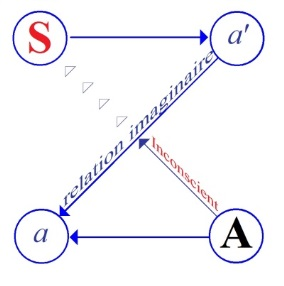
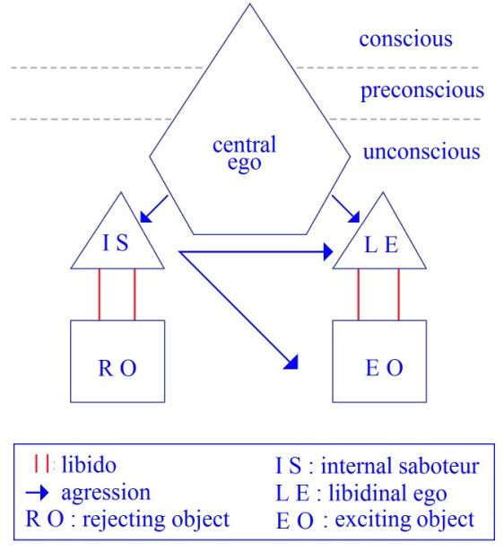
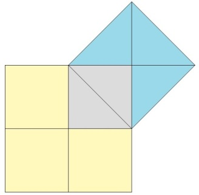

# Leçon 21 | 1er Juin 1955

  <label><input type="checkbox" data-lacan-toggle="original" checked> 原文</label>
  <label><input type="checkbox" data-lacan-toggle="notes" checked> 注释</label>
  <label><input type="checkbox" data-lacan-toggle="commentary" checked> 个人解读评论</label>

<section class="parallel-paragraph" data-paragraph-ids="s2-21-0001">

s2-21-0001

[无对应译文]

原文 · s2-21-0001

Nous allons reprendre le propos de la dernière fois. Nous allons reprendre *le mur du langage*, et ce qui se passe devant, et de part et d’autre. Ce schéma suppose une chose pour être constitué comme schéma, c’est que, comme la lumière, la parole se propage en ligne droite. C’est vous dire, bien entendu, que c’est un schéma métaphorique, analogique. Et pour qu’il puisse être constitué comme schéma spatial, cela nécessite cette seule hypothèse.

</section>

<section class="parallel-paragraph" data-paragraph-ids="s2-21-0002">

s2-21-0002

[无对应译文]

原文 · s2-21-0002

</section>

<section class="parallel-paragraph" data-paragraph-ids="s2-21-0003">

s2-21-0003

[无对应译文]

原文 · s2-21-0003

Il y a quelque chose également qui est impliqué dans le schéma que j’ai essayé la dernière fois de vous représenter, c’est ceci, ce quelque chose qui interfère avec *le mur du langage*. Car c’est aussi bien là *la réaction spéculaire*, la réaction par quoi le *moi* et l’*autre* sont dans un *rapport spéculaire*, par quoi *ce qui est du moi est* toujours perçu essentiellement et *toujours approprié* *par l’intermé­diaire d’un autre spéculaire*, qui garde toujours pour le sujet humain les pro­priétés fondamentales d’appui de l’*Urbild*, de *l’image fondamentale du moi*. C’est grâce à cela que peuvent se produire *une confusion, les erreurs, les méconnaissances fondamentales* grâce à quoi s’établissent à la fois *les malen­tendus fondamentaux* et la communication commune qui repose sur *les dits malentendus*.

</section>

<section class="parallel-paragraph" data-paragraph-ids="s2-21-0004">

s2-21-0004

[无对应译文]

原文 · s2-21-0004

J’ai amorcé la dernière fois ce schéma qui a plus d’une propriété, comme je vous l’ai montré déjà en vous apprenant à le transformer et à voir ce qu’y intro­duit de nouveau l’attitude de l’analyste. Je vous ai aussi indiqué que l’attitude de l’analyste pouvait différer grandement, c’est-à-dire du même coup porter à des conséquences diverses, et même, voire opposées dans l’analyse elle-même. En d’autres termes, nous en sommes venus *au pied du mur*, c’est-à-dire à ce qui se passe dans l’analyse selon qu’elle est orientée :

</section>

<section class="parallel-paragraph" data-paragraph-ids="s2-21-0005">

s2-21-0005

[无对应译文]

原文 · s2-21-0005

- selon une conception qui pose comme matriciel, comme indispensable - pour s’orienter non seulement dans la signification, mais dans la pratique de la technique analytique - le *rapport de parole* en tant que tel,

</section>

<section class="parallel-paragraph" data-paragraph-ids="s2-21-0006">

s2-21-0006

[无对应译文]

原文 · s2-21-0006

- ou dans celui qui, d’une façon quelconque, et si peu que ce soit, objectivant la situation analytique, essaie - ce que je vous ai depuis longtemps indiqué qu’est certaine façon de prendre l’analyse des résistances - aboutit à reconstituer cette objectivation, cet essai d’objectivation et je dirai que toute objectivation, tout essai d’objectiver cette situation, arrive - *sous des formes et avec une intensité diverses selon les auteurs, les théoriciens, les praticiens -* à faire de l’analyse un processus de modelage, de remodelage du *moi*, qui abou­tit toujours en dernière analyse, et au-delà même des auteurs qui le pratiquent dans ce registre, nécessairement à être le modelage ou remodelage du *moi* sur le modèle de l’analyste et du *moi* de l’analyste lui-même.

</section>

<section class="parallel-paragraph" data-paragraph-ids="s2-21-0007">

s2-21-0007

[无对应译文]

原文 · s2-21-0007

Bien entendu, pour que la critique qui est apportée dans une telle matière prenne toute sa portée, il faut étudier cette *théorie du moi* de façon aussi *appro­fondie* que nous avons tenté de le faire, de le soutenir, en montrant le caractère fondamentalement aliéné, fondamentalement spéculaire du *moi*, et comme quoi ceci est aussi vrai pour toute espèce de *moi*, que tout *moi* qui se présentifie en tant que *moi* est toujours présentification d’une *fonction imaginaire* comme telle, fût-ce le *moi* de l’analyste car un *moi* est toujours un *moi*, aussi perfec­tionné, purifié, élaboré soit-il.

</section>

<section class="parallel-paragraph" data-paragraph-ids="s2-21-0008">

s2-21-0008

[无对应译文]

原文 · s2-21-0008

Assurément, ce n’est pas sans fondement que l’analyse s’est engagée dans ces voies, car le *moi* a une incidence beaucoup plus précise, essentielle, fondamen­tale, dans la parole analytique. Il s’agit de savoir…

</section>

<section class="parallel-paragraph" data-paragraph-ids="s2-21-0009">

s2-21-0009

[无对应译文]

原文 · s2-21-0009

> parce que FREUD à un moment l’a réintégré,
>
> parce que FREUD l’a montré sous plus d’une face, l’importance essentielle, économique et dynamique d’abord, à quoi il a ajouté une certaine *topique*, dont nous reparlons sans cesse et qui est au cœur du problème pour l’instant,

</section>

<section class="parallel-paragraph" data-paragraph-ids="s2-21-0010">

s2-21-0010

[无对应译文]

原文 · s2-21-0010

...qu’ici, quand FREUD a réintégré le *moi,* si c’était pour lui donner cette valeur d’*objet*, ou plus exactement pour recentrer toute l’analyse sur l’*objet* et les *relations d’objet*, comme effectivement le mouvement s’en est suivi dans l’intérieur de l’analyse.

</section>

<section class="parallel-paragraph" data-paragraph-ids="s2-21-0011">

s2-21-0011

[无对应译文]

原文 · s2-21-0011

En d’autres termes, ce qui est aujourd’hui à l’ordre du jour est ce terme de *la relation d’objet*, dont je vous ai dit combien il était au cœur de toutes les ambiguïtés qui rendent si difficile maintenant à la fois la compréhension des dernières parties de l’œuvre de FREUD et la resituation des investigations *techniques*, en elles-mêmes toujours profitables.

</section>

<section class="parallel-paragraph" data-paragraph-ids="s2-21-0012">

s2-21-0012

[无对应译文]

原文 · s2-21-0012

Mais la resitua­tion de ces investigations techniques dans la situation générale fondamentale, dans la signification, est souvent oubliée de l’analyse comme telle. Je vous l’ai dit, c’est d’une façon qui diffère grandement selon les auteurs, qu’est compris ce terme de relation d’objet, que cet instrument est manié. Vous le trouverez fréquemment manipulé sous la plume d’un auteur trop proche de notre milieu pour que la dernière fois j’aie fait plus que le citer par l’intermé­diaire d’une de ses dernières œuvres. Je ne l’ai pas nommé, mais je pense que presque tout le monde l’a reconnu, quelqu’un qui a écrit sur *la névrose obses­sionnelle* et qui a mis la relation d’objet au cœur de toute sa théorie de *la névro­se obsessionnelle* \[Bouvier\].

</section>

<section class="parallel-paragraph" data-paragraph-ids="s2-21-0013">

s2-21-0013

[无对应译文]

原文 · s2-21-0013

Bien entendu, la relation d’objet, sous sa plume, n’est pas tout à fait ce qu’est la relation d’objet sous la plume de tel autre. Il faut tâcher de trouver, pour nous orienter, un facteur commun. Il est certain que ce que je vous enseigne ici ce sont des notions - comme je l’ai souvent dit et continue à le répéter - vraiment fondamentales, alphabétiques si je puis dire, qui sont bien plus une rose des vents, une table d’orientation, que vraiment une cartographie de ce qui actuellement se pose comme problèmes dans l’analyse. Cela suppose qu’armés de la dite table d’orientation vous essayiez aussi de vous promener, vous, par vos propres moyens, sur la carte. En d’autres termes, cette question dont certaines critiques me sont revenues : on entend tel ou tel dire par exemple que je vous propose ici une théorie qui ne coïncide pas avec ce qu’on peut lire sous tel texte de FREUD.

</section>

<section class="parallel-paragraph" data-paragraph-ids="s2-21-0014">

s2-21-0014

[无对应译文]

原文 · s2-21-0014

Je pourrais répondre facilement qu’à la vérité avant d’arriver à tel ou tel texte séparé, il faut comprendre l’ensemble, car l’*ego* apparaît dans plusieurs endroits de l’œuvre de FREUD. Quelqu’un qui n’a pas vu la théorie de l’*ego* dans l’« *Introduction au nar­cissisme »* ne peut pas suivre ce que FREUD dit de l’*ego* dans « *Das Ich und das Es »*, qui définit *le système perception-conscience*. Il est difficile d’apprécier ce que veut dire même à ce moment, en ce seul texte, la référence de l’*ego* au *système perception-conscience*, si vous n’avez pas idée de l’économie générale de l’œuvre de FREUD, ce qui implique tout de même que vous mettiez ce que je vous enseigne ici à l’épreuve d’une lecture étendue de l’œuvre de FREUD.

</section>

<section class="parallel-paragraph" data-paragraph-ids="s2-21-0015">

s2-21-0015

[无对应译文]

原文 · s2-21-0015

Mais quoi qu’il en soit, même à l’intérieur de l’élaboration topique comme celle que fait FREUD dans « *Das Ich und das Es »*, pour donner une juste portée à une définition, par exemple, comme celle, qui fait équivaloir l’*ego* au *système perception-conscience*, il ne faut pas vous en tenir à cette seule égalité, à cette seule équation, qui ne peut même pas passer dans cet ordre pour une définition. Si nous l’isolions sur ce plan, ce serait simplement une convention, ou une tau­tologie, si vous voulez. C’est pourquoi FREUD à ce moment-là, dans ce fameux schéma qui a joué dans toute l’analyse un rôle si hypnotique, ce fameux *sché­ma de l’œuf*, là où on voit le *need*, et quelque part apparaît l’espèce de lentille, de point germinatif qui symbolise l’*ego*, l’*ego* comme étant cette partie diffé­renciée, organisée de la masse de *need*, par où la relation est prise avec la réali­té.

</section>

<section class="parallel-paragraph" data-paragraph-ids="s2-21-0016">

s2-21-0016

[无对应译文]

原文 · s2-21-0016

</section>

<section class="parallel-paragraph" data-paragraph-ids="s2-21-0017">

s2-21-0017

[无对应译文]

原文 · s2-21-0017

Ce que veut dire FREUD, si c’est pour s’en tenir à un schéma qui peut avoir mille interprétations, à la vérité il n’était pas besoin de l’immense détour de l’œuvre de FREUD pour en arriver là. Ce qui est important dans ce schéma, c’est justement le caractère tout à fait dépendant de l’organisation de l’*ego* par rap­port à quelque chose qui lui est, du point de vue de l’organisation, complète­ment hétérogène. C’est peut-être cela qui est intéressant à mettre en relief. Et je dirai que c’est le danger de tout schéma, et surtout de tout schéma qui tend trop à chosifier les choses, que l’esprit aussitôt s’y précipite pour y voir les images les plus routinières et les plus sommaires.

</section>

<section class="parallel-paragraph" data-paragraph-ids="s2-21-0018">

s2-21-0018

[无对应译文]

原文 · s2-21-0018

Comme point de référence…

</section>

<section class="parallel-paragraph" data-paragraph-ids="s2-21-0019">

s2-21-0019

[无对应译文]

原文 · s2-21-0019

> il a bien fallu que j’en choisisse un, et puisque j’en avais choisi un tout près la dernière fois
>
> et qu’il n’est jamais si aisé de par­ler à propos d’auteurs qui nous sont aussi géographiquement proches

</section>

<section class="parallel-paragraph" data-paragraph-ids="s2-21-0020">

s2-21-0020

[无对应译文]

原文 · s2-21-0020

…j’en ai pris, dans la littérature analytique un autre, un anglais du nom de FAIRBAIRN, plu­tôt un écossais, qui a essayé non sans rigueur, non sans que cela ait justement le caractère exemplaire nécessité par notre exposé, de reformuler toute la théorie analytique en termes de relations d’objet.

</section>

<section class="parallel-paragraph" data-paragraph-ids="s2-21-0021">

s2-21-0021

[无对应译文]

原文 · s2-21-0021

C’est une lecture qui ne peut pas vous être inaccessible *in Psychoanalytic Studies of the Personality* (1952), et *International Journal* *of Psycho-Analysis, vol.* XXV, 1944, pp.70-93 \[*Endopsychic structure considered in terms of object-relationships*, 1944\]. Il s’agit donc de la structure endopsychique - écrit notre auteur - en termes de *relations d’objet*. Qu’est-ce que ça donne ? Ceci a plus que l’intérêt d’être la théorie particulière d’un auteur. C’est quelque chose qui est simplement exposé où vous reconnaîtrez les traces familières de la façon dont les problèmes sont posés, dont nous rapportons maintenant les cas, dont nous évoquons les incidences et les forces de la réalité psychique, de la façon dont même quelquefois il arrive de résumer un traitement, d’en discuter publi­quement.

</section>

<section class="parallel-paragraph" data-paragraph-ids="s2-21-0022">

s2-21-0022

[无对应译文]

原文 · s2-21-0022

Vous verrez à peu près en quoi le schéma que je vais vous reprodui­re, celui qu’il élabore après un article qui le motive, le justifie, en montre les échos, et après tout donne l’idée de quelque chose, d’une imagerie à proprement parler, qui n’est pas sans rapport avec ce quelque chose qui est en effet aussi ce que nous avons à manier sous le nom d’« *économie imaginaire* ». Vous allez en voir aussi du même coup les incidences, le danger et en tout cas ce en quoi ils peu­vent vous indiquer qu’à se maintenir au niveau d’une telle conceptualisation l’analyse court de grands risques et lesquels.

</section>

<section class="parallel-paragraph" data-paragraph-ids="s2-21-0023">

s2-21-0023

[无对应译文]

原文 · s2-21-0023

Bien curieusement, je vais aller tout de suite au fait, parce qu’il faudrait vrai­ment lire l’article en entier, en montrer le procès du progrès : c’est un travail qu’il faut que vous fassiez chacun dans votre privé. Ce que nous faisons ici doit orienter votre recherche, vous provoquer à confirmer, et non affirmer, contrô­ler ce qui est produit ici.

</section>

<section class="parallel-paragraph" data-paragraph-ids="s2-21-0024">

s2-21-0024

[无对应译文]

原文 · s2-21-0024

Voilà le schéma auquel l’auteur arrive, après l’exemple clinique d’un rêve où les personnages, les rôles ceux qui viennent d’entendre ici quelque chose qui va se renouveler ce soir sur le psychodrame, verront tout de suite la parenté qu’il y a et qui est très singulière, curieuse, et c’est bien une sorte de dégradation qui tend à s’établir entre une certaine fraction de la théorie de l’analyse et des pratiques en fin de compte comme celle du psychodrame, dont on ne peut parler sans prendre parti : on ne peut en aucun cas dire qu’il s’agisse de quelque chose qui soit une mesure commune avec la pratique analytique comme telle. Voilà donc à quoi aboutit notre auteur :

</section>

<section class="parallel-paragraph" data-paragraph-ids="s2-21-0025">

s2-21-0025

[无对应译文]

原文 · s2-21-0025

</section>

<section class="parallel-paragraph" data-paragraph-ids="s2-21-0026">

s2-21-0026

[无对应译文]

原文 · s2-21-0026

Il nous dit en fin de compte :

</section>

<section class="parallel-paragraph" data-paragraph-ids="s2-21-0027">

s2-21-0027

[无对应译文]

原文 · s2-21-0027

> « *qu’il faut tout refaire. Il y a des hétérogénéités, des dissymétries singulières dans la théorie freudienne.*
>
> *Moi* - dit FAIRBAIRN - *je n’y comprends plus rien. Ne serait-il pas plus simple, plutôt que de nous par­ler d’une libido*
>
> *dont nous ne savons plus actuellement par quel bout la prendre, qui nous pose trop de problèmes, qui aussi bien aboutit à ceci*
>
> *que pour l’iden­tifier à des pulsions qui sont en somme une certaine façon de la prendre sous une forme objectale, objectivée :*
>
> *mon Dieu, pourquoi ne pas plus simplement parler d’objet. »*

</section>

<section class="parallel-paragraph" data-paragraph-ids="s2-21-0028">

s2-21-0028

[无对应译文]

原文 · s2-21-0028

Et au lieu de partir, comme FREUD l’a fait avec tellement de pru­dence et de rigueur théorique, d’une libido comme étant une énergie avant tout, c’est-à-dire un concept théorique qui a prêté ensuite à toutes sortes de confu­sions, car en effet on l’a identifiée aussi bien aux capacités d’aimer ? Et notre auteur d’ailleurs suit fort bien cette voie, ne s’en prive pas, grands dieux ! Car, puisque son but est de nous faire remarquer que pour comprendre les choses il faut sortir de la perspective freudienne qui nous dit que :

</section>

<section class="parallel-paragraph" data-paragraph-ids="s2-21-0029">

s2-21-0029

[无对应译文]

原文 · s2-21-0029

> *« la libido* - pour s’expri­mer comme il s’exprime dans son langage et sa langue - *est pleasure-seeking*, dit-il, *dans* FREUD,
>
> *c’est-à-dire qu’elle recherche le plaisir, nous avons changé tout cela et nous sommes aperçus que la libido est object-seeking. *
>
> *Et M.* FREUD *en avait quelque idée : n’écrit-il pas « love for object », l’amour est à la recherche de son objet ?*
>
> *Entre les deux, il s’est simplement passé cette sorte de confusion, on a substitué « love », c’est-à-dire amour, à « libido ».*

</section>

<section class="parallel-paragraph" data-paragraph-ids="s2-21-0030">

s2-21-0030

[无对应译文]

原文 · s2-21-0030

Ce qui est absolument stupéfiant, parce que je vous assure, vous pouvez rencontrer cela dans les premières pages, chez l’auteur de ces lignes, comme beaucoup de gens, il ne s’est pas aperçu qu’il y a substitution, à savoir qu’en apportant comme argument à la théorie qui va nous faire de la *libido object-seeking*, il ne s’est pas aperçu que FREUD parle de l’amour au moment où lui croit encore qu’il s’agit de critiquer la théorie de la libido, comme…

</section>

<section class="parallel-paragraph" data-paragraph-ids="s2-21-0031">

s2-21-0031

[无对应译文]

原文 · s2-21-0031

> vous voyez le rapport avec ce que j’ai apporté dans la derniè­re séance

</section>

<section class="parallel-paragraph" data-paragraph-ids="s2-21-0032">

s2-21-0032

[无对应译文]

原文 · s2-21-0032

…comme quelque chose qui pose au moins le problème de son adap­tation aux objets.

</section>

<section class="parallel-paragraph" data-paragraph-ids="s2-21-0033">

s2-21-0033

[无对应译文]

原文 · s2-21-0033

La notion de *libido object-seeking* est d’une prévalence pré­dominante dans toute l’économie où cela va jouer, dans la réalité psychique, d’objet comme tel. Cela va aboutir à cette sorte de simplification très difficile à éviter qui est celle où s’est engagée toute la théorie analytique et pour laquelle la théorie que je vous apporte ici - la définition du domaine de *l’imaginaire* comme tel - me paraît être justement particulièrement adaptée pour arriver à nous y retrouver, c’est-à-dire à introduire toute conceptualisation à sa valeur essentiellement opérationnelle.

</section>

<section class="parallel-paragraph" data-paragraph-ids="s2-21-0034">

s2-21-0034

[无对应译文]

原文 · s2-21-0034

S’il y a quelque chose qui justifie ce que j’essaie ici - c’est un ressort, une des clés de la doctrine que je vous développe ici - c’est cette façon de distinguer pour vous le *réel*, *l’imaginaire* et le *symbolique*, de vous y rompre, de vous y habituer. Je crois qu’un des avantages de cette conceptualisation, qu’un ressort aussi fécond de cet exercice, de ce maniement, cette gymnastique mentale conceptuelle, c’est de vous permettre de vous y retrouver quand vous entendez parler de transformation de l’analyse, désormais orientée sur *les objets*, de voir quelle confusion secrète il y a sous cette notion d’*objet*.

</section>

<section class="parallel-paragraph" data-paragraph-ids="s2-21-0035">

s2-21-0035

[无对应译文]

原文 · s2-21-0035

Cela n’est rien moins que *la confusion* pure et simple *du réel, de l’imaginaire et du symbolique*. Sous la notion d’objet, vous ne pouvez plus retrouver les distinctions essentielles grâce à quoi il est même seulement concevable que nous intervenions par la tech­nique analytique. En fin de compte - puisqu’objets il y a - les objets seront tou­jours représentés par la façon dont le sujet les aborde. C’est cela que vous pre­nez au pied de la lettre.

</section>

<section class="parallel-paragraph" data-paragraph-ids="s2-21-0036">

s2-21-0036

[无对应译文]

原文 · s2-21-0036

Et quand vous les saisissez *objectivement*, comme on dit - c’est-à-dire à l’insu du sujet - vous allez aussi les représenter comme des objets homogènes aux premiers, c’est-à-dire au monde des objets que vous apporte le sujet. Et au milieu de cela vous allez tâcher de vous orienter, Dieu sait comment !

</section>

<section class="parallel-paragraph" data-paragraph-ids="s2-21-0037">

s2-21-0037

[无对应译文]

原文 · s2-21-0037

La notion à laquelle arrive FAIRBAIRN, l’auteur en question, est celle-ci : que nous devons avoir la notion qu’il y a un *ego central*.

</section>

<section class="parallel-paragraph" data-paragraph-ids="s2-21-0038">

s2-21-0038

[无对应译文]

原文 · s2-21-0038

</section>

<section class="parallel-paragraph" data-paragraph-ids="s2-21-0039">

s2-21-0039

[无对应译文]

原文 · s2-21-0039

Cet *ego central* est l’*ego* tel qu’on se l’est à peu près toujours imaginé à partir du moment où l’unité organique individuelle s’est *entifiée* sur le plan psychique dans la notion de son *unité*, c’est-à-dire de prendre comme une donnée *la synthèse psychique* de l’individu et d’y voir quelque chose qui soit *consistant* et lié à l’existence et au fonctionnement d’appareils c’est-à-dire quelque chose *qui fait de l’ego* en fin de compte *un objet psychique* et comme tel *fermé à toute dia­lectique*. Ceci est la conception classique, académique, l’*ego* empirique, pris comme tel, et étudié comme objet de la psychologie, c’est ce *central ego*.

</section>

<section class="parallel-paragraph" data-paragraph-ids="s2-21-0040">

s2-21-0040

[无对应译文]

原文 · s2-21-0040

Et ce central *ego,* on nous fera remarquer d’ailleurs aussi bien, vous voyez à quelle faible valeur fonctionnelle sont désormais réduites les premières références à la conscience et au préconscient :

</section>

<section class="parallel-paragraph" data-paragraph-ids="s2-21-0041">

s2-21-0041

[无对应译文]

原文 · s2-21-0041

- *une partie de ce central ego émerge dans la conscience et le préconscient* pas conçus autrement que comme des domaines de manifestations,

</section>

<section class="parallel-paragraph" data-paragraph-ids="s2-21-0042">

s2-21-0042

[无对应译文]

原文 · s2-21-0042

- *une partie* - ce qu’on n’a jamais nié, contesté, fût-ce dans la psychologie la plus périmée - *de cet ego est bien entendu inconscient*.

</section>

<section class="parallel-paragraph" data-paragraph-ids="s2-21-0043">

s2-21-0043

[无对应译文]

原文 · s2-21-0043

C’est du rapport de cet *ego* avec

</section>

<section class="parallel-paragraph" data-paragraph-ids="s2-21-0044">

s2-21-0044

[无对应译文]

原文 · s2-21-0044

- non pas du refoulé,

</section>

<section class="parallel-paragraph" data-paragraph-ids="s2-21-0045">

s2-21-0045

[无对应译文]

原文 · s2-21-0045

- non pas des significations refoulées,

</section>

<section class="parallel-paragraph" data-paragraph-ids="s2-21-0046">

s2-21-0046

[无对应译文]

原文 · s2-21-0046

- non pas tout ce qui nous introduit d’emblée dans une dimension subjective dans FREUD, mais d’autres structures, et qui sont conçues comme telles, comme refoulées.

</section>

<section class="parallel-paragraph" data-paragraph-ids="s2-21-0047">

s2-21-0047

[无对应译文]

原文 · s2-21-0047

C’est-à-dire que l’*ego* qu’on peut voir, qui est à notre portée, dont le sujet est sinon totalement conscient, du moins à peu près totalement conscient, c’est-à-dire qu’il est avec lui composé, identique, et puis il va y avoir quelque chose qui est refoulé, qui est un autre *ego*, parce qu’aussi bien à partir du moment où en effet nous admettons l’organisation de l’*ego* nous pouvons aussi bien l’admettre comme une organisation qui est réelle.

</section>

<section class="parallel-paragraph" data-paragraph-ids="s2-21-0048">

s2-21-0048

[无对应译文]

原文 · s2-21-0048

En somme, l’ambiguïté sur le terme objet ici repose sur une absence complète de toute espèce de cri­tique de l’objectivation comme telle. Il va y avoir un autre *ego*, qui est l’*ego libidinal*. L’*ego libidinal* est cette par­tie de l’*ego* en tant qu’elle désire, et en tant que désirable, ainsi orientée vers des objets, des objets qui sont là, quelque part, et nous allons voir tout à l’heure \- c’est très instructif - comment ils vont être *désignés*.

</section>

<section class="parallel-paragraph" data-paragraph-ids="s2-21-0049">

s2-21-0049

[无对应译文]

原文 · s2-21-0049

Cet *ego libidinal*, en raison de l’extrême difficulté de ses rapports avec le dit objet, a subi - on ne nous explique point jusqu’alors par quel mécanisme - cette sorte de dissociation, de schize, qui fait que son organisation, qui est bel et bien celle d’un *ego*, a été, par le fait de l’*ego ego* central, rejetée, repoussée dans un fonctionnement autonome, mais un fonctionnement qui ne peut plus désormais être raccordé au fonction­nement de l’*ego central*.

</section>

<section class="parallel-paragraph" data-paragraph-ids="s2-21-0050">

s2-21-0050

[无对应译文]

原文 · s2-21-0050

Vous reconnaissez quelque chose qui se forme assez bien dans l’esprit de chacun lors d’une première appréhension de la doctrine analytique, un retour à une sorte de doctrine vulgaire. Simplement, une mise en valeur des postulats - quand j’ai dit vulgaire, je veux dire vulgarisée - impli­qués par une telle conception est une adoption, cette fois-ci systématique et sans aucun recours critique précis à ce qui pourrait jeter le doute sur la validité d un tel schéma. C’est bien ainsi qu’une partie des analystes arrivent pour l’ins­tant à concevoir ce que signifie essentiellement le processus de refoulement.

</section>

<section class="parallel-paragraph" data-paragraph-ids="s2-21-0051">

s2-21-0051

[无对应译文]

原文 · s2-21-0051

Nous savons que la situation est loin d’être aussi simple depuis quelque temps, car on nous a découvert l’existence également dans l’inconscient de quelque chose d’autre, qui est bien loin d’être libidinal, et qui est quoi ? Tout ce qui a provoqué le grand remaniement de la théorie analytique à partir de l’in­troduction de la théorie de l’agressivité, à partir du moment où le problème de la relation de l’agressivité en tant qu’instante et présente dans l’inconscient a pu poser le problème de ses relations avec la fonction du *surmoi*. Toute la problé­matique est là, posée par FREUD.

</section>

<section class="parallel-paragraph" data-paragraph-ids="s2-21-0052">

s2-21-0052

[无对应译文]

原文 · s2-21-0052

Il n’a pas confondu l’agressivité interne avec le *surmoi*. Ici, nous allons avoir affaire à la notion tout à fait piquante car il ne semble pas avoir trouvé dans la langue anglaise le terme qui lui paraisse vrai­ment pouvoir représenter la fonction perturbatrice, voire démoniaque car c’est bien en fin de compte de cela qu’il s’agit, et sous cette forme que se présente l’instance qu’il a appelé l’*internal saboteur*. Je ne sais pas comment cela se défor­me avec la prononciation anglaise.

</section>

<section class="parallel-paragraph" data-paragraph-ids="s2-21-0053">

s2-21-0053

[无对应译文]

原文 · s2-21-0053

X – C’est presque la même chose : *internal saboteur*.

</section>

<section class="parallel-paragraph" data-paragraph-ids="s2-21-0054">

s2-21-0054

[无对应译文]

原文 · s2-21-0054

LACAN

</section>

<section class="parallel-paragraph" data-paragraph-ids="s2-21-0055">

s2-21-0055

[无对应译文]

原文 · s2-21-0055

Et il fait parler de lui. Il est *internal saboteur*, bien entendu aussi par un autre processus de refoulement de l’appareil et de l’organisation du *moi*. Et ceci est également lié au fait qu’il est en rapport avec un objet qui est l’objet correspondant et qui a, en quelque sorte, motivé cette différenciation.

</section>

<section class="parallel-paragraph" data-paragraph-ids="s2-21-0056">

s2-21-0056

[无对应译文]

原文 · s2-21-0056

En d’autres termes, c’est pour la raison qu’il y a eu dans la vie de l’individu deux instances de l’objet singulièrement incommodantes à l’origine du développe­ment, que le *moi,* dont la propriété est d’être quelque chose qui est en relation avec l’objet, a été amené à avoir ces relations si singulières qui se caractérisent par l’économie dite du refoulement avec ce qu’on pourrait appeler, et qu’il n’hé­site pas à appeler ainsi, les pseudopodes grâce à quoi il communiquait avec ces deux objets problématiques.

</section>

<section class="parallel-paragraph" data-paragraph-ids="s2-21-0057">

s2-21-0057

[无对应译文]

原文 · s2-21-0057

Les deux objets problématiques, il faut aussi les appeler par le nom que leur donne l’auteur, ces deux objets problématiques ont une curieuse propriété, c’est d’être fondamentalement et initialement un seul et même objet, dans son origine réelle. Je ne vous étonnerai pas en vous disant qu’en dernière analyse c’est bien en tout et pour tout de la mère qu’il s’agit. À ce niveau où nous sommes de la théorisation du psychisme, c’est de *la frustration* ou de *la non-frustration* originelle qu’il s’agit, et tout se ramène à cela.

</section>

<section class="parallel-paragraph" data-paragraph-ids="s2-21-0058">

s2-21-0058

[无对应译文]

原文 · s2-21-0058

La relation…

</section>

<section class="parallel-paragraph" data-paragraph-ids="s2-21-0059">

s2-21-0059

[无对应译文]

原文 · s2-21-0059

> et je ne force rien, je prie chacun de se reporter à cet article qui est exemplaire de ce qui est sous-jacent à beaucoup de positions plus moyennes, plus nuancées, plus camouflées, mais qui est une des tendances manifestes à quiconque vit dans le dialogue analytique à l’heure contemporaine

</section>

<section class="parallel-paragraph" data-paragraph-ids="s2-21-0060">

s2-21-0060

[无对应译文]

原文 · s2-21-0060

…en fin de compte, c’est de *la division* ou de *la schize* primitive entre *les deux faces, bonne mauvaise, de l’objet primitif*, c’est-à-dire de la mère en tant que nourrisseuse, que vont se ramener les structurations essentielles dont tout le reste ne sera qu’élaboration, jeu équivoque, homonymie, de la situation primi­tive. Ceci n’est absolument pas évité.

</section>

<section class="parallel-paragraph" data-paragraph-ids="s2-21-0061">

s2-21-0061

[无对应译文]

原文 · s2-21-0061

Ceci est poussé jusqu’à ses dernières conséquences dans l’article dont je vous parle, où on nous dit que *le complexe d’Œdipe* *ne vient que se superposer à cette structuration primitive, en lui don­nant des motifs*. Très exactement il s’agit là de *motifs au sens ornemental du terme*. Il s’agira ensuite, à une époque plus élaborée, que le père et la mère se répartissent d’une façon qui elle-même peut être extraordinairement nuancée, départagée, les rôles fondamentaux qui sont inscrits dans cette division primiti­ve :

</section>

<section class="parallel-paragraph" data-paragraph-ids="s2-21-0062">

s2-21-0062

[无对应译文]

原文 · s2-21-0062

- de l’objet, qualifié ici de *exciting*, c’est-à-dire de l’objet en tant qu’il excite le désir, la libido étant ici confondue avec la propriété tout à fait concrète, objec­tivée du désir comme tel, dans son conditionnement,

</section>

<section class="parallel-paragraph" data-paragraph-ids="s2-21-0063">

s2-21-0063

[无对应译文]

原文 · s2-21-0063

- et de l’autre, qui est l’ob­jet qualifié de *rejecting*. Je ne veux pas vous emmener trop loin. Mais ceci est riche d’incidences qui permettraient de critiquer les choses, ne serait-ce que ceci qu’*exciting* et *rejec­ting* ne sont pas du même niveau. *Rejecting* implique d’une façon latente déjà une *subjectivation* de l’objet, parce que sur le plan seulement objectif un objet est frustrant ou ne l’est pas. À partir du moment où nous introduisons la notion de *rejecting*, nous introduisons secrètement le rapport intersubjectif comme tel, la non-reconnaissance.

</section>

<section class="parallel-paragraph" data-paragraph-ids="s2-21-0064">

s2-21-0064

[无对应译文]

原文 · s2-21-0064

C’est vous dire à quelle confusion, même dans des élaborations comme celle-là, on est perpétuellement sujet à succomber. Mais je ne veux même pas m’étendre sur ce qui peut être fait comme critiques internes au schéma dans son propre but. Je ne suis pas là pour corriger M. FAIRBAIRN par rapport à ses propres intentions, j’essaie progressivement de vous dévoiler ses intentions et à quoi tout ceci aboutit.

</section>

<section class="parallel-paragraph" data-paragraph-ids="s2-21-0065">

s2-21-0065

[无对应译文]

原文 · s2-21-0065

Voici maintenant les éléments qui vont fonctionner. Cette tendance à la répul­sion, en fin de compte, à quoi toute la notion de la répression va être ramenée, *l’ego libidinal* et *l’internal saboteur*, pour les meilleurs raisons, parce que juste­ment s’ils ont été créés et différenciés comme tels, c’est en raison des extrêmes difficultés de maniement des deux objets primitifs, tout ceci représenté par des flèches.

</section>

<section class="parallel-paragraph" data-paragraph-ids="s2-21-0066">

s2-21-0066

[无对应译文]

原文 · s2-21-0066

Ces deux objets primitifs sont un seul et même objet dans la réalité, liés à la division sous ses deux faces, bonne et mauvaise, liés à ceci que pour que l’ob­jet en tant qu’il est rejetant soit d’une façon quelconque maîtrisé il faut - et ceci est absolument indispensable - qu’il soit de quelque façon internalisé par le sujet, conçu en tant que vivant par le sujet individuel, par l’*ego*.

</section>

<section class="parallel-paragraph" data-paragraph-ids="s2-21-0067">

s2-21-0067

[无对应译文]

原文 · s2-21-0067

Le principe d’ailleurs de l’*internalisation* de mauvais objet n’est même pas quelque chose qui puisse être en effet contesté dans l’économie, dans le schéma général que nous pouvons donner du développement, ceci n’est pas à contester, en effet, et à la vérité la remarque qui est faite que ce quelque chose est urgent à internaliser pour en être de quelque façon le maître, quelque incommodité qui doive s’en suivre, c’est bien plutôt le mauvais objet que le bon qu’il a plutôt intérêt à laisser au dehors, là où il peut exercer son influence bienfaisante.

</section>

<section class="parallel-paragraph" data-paragraph-ids="s2-21-0068">

s2-21-0068

[无对应译文]

原文 · s2-21-0068

Mais assurément, c’est du fait que cet objet est très loin d’être univoque, c’est-à-dire que c’est un seul et le même qui provoque chez le sujet la détresse de la réjection et l’incitation libidi­nale toujours renaissante, grâce à quoi cette détresse est réactivée, c’est en quelque sorte dans le mouvement, dans le sillage de l’internalisation du mauvais objet, du *rejecting object*, que se produira aussi le processus par quoi l’*ego libi­dinal* est considéré comme trop dangereux, comme réactivant d’une façon trop aiguë le drame qui a abouti à l’internalisation primitive.

</section>

<section class="parallel-paragraph" data-paragraph-ids="s2-21-0069">

s2-21-0069

[无对应译文]

原文 · s2-21-0069

Il sera lui aussi secon­dairement rejeté, sujet dès lors, de la part du *central ego*, à l’action de répulsion, de *schize*, de refoulement, qui est exprimée par la flèche que nous mettons ici, et d’oublier ceci, qui se passe à l’intérieur de l’inconscient, c’est-à-dire de la part du terme ainsi désigné *internal saboteur*, d’une double répulsion supplémentaire, manifestée cette fois sous forme d’agression, qui vient de l’instance elle-même refoulée, sous le nom d’ *internal saboteur*, c’est-à-dire de quelque chose d’étroitement en relation avec les primitifs mauvais objets.

</section>

<section class="parallel-paragraph" data-paragraph-ids="s2-21-0070">

s2-21-0070

[无对应译文]

原文 · s2-21-0070

Voilà à peu près le schéma auquel nous arrivons, et dont vous voyez d’ailleurs qu’il n’est pas en effet sans refléter quelque chose qui, du point de vue de la structure générale, n’est pas sans nous rappeler, bien entendu, plus d’un phénomène que nous constatons effectivement dans l’évolution clinique, dans les manifestations, dans ce qui paraît refléter le comportement des sujets dans le champ qualifié pour être celui de la névrose.

</section>

<section class="parallel-paragraph" data-paragraph-ids="s2-21-0071">

s2-21-0071

[无对应译文]

原文 · s2-21-0071

</section>

<section class="parallel-paragraph" data-paragraph-ids="s2-21-0072">

s2-21-0072

[无对应译文]

原文 · s2-21-0072

L’importance d’un tel schéma est par exemple directement illustrée par l’ima­ge d’un rêve, où se passent des choses qui sont en effet tout à fait expressives et exemplaires. Le sujet rêve qu’elle est elle-même objet d’une agression de la part d’un personnage qui se trouve être une actrice, la fonction de l’actrice ayant un rapport particulier avec son histoire.

</section>

<section class="parallel-paragraph" data-paragraph-ids="s2-21-0073">

s2-21-0073

[无对应译文]

原文 · s2-21-0073

Dans la suite du rêve, une transformation permet de préciser à la fois les rapports du personnage agresseur avec la mère du sujet, et d’autre part le dédoublement du personnage agressé dans la pre­mière partie du rêve en deux autres personnages respectivement masculin et féminin, et qui changent à la façon dont les moirures de couleur laissent, un moment donné, ambigu l’aspect d’un objet donné.

</section>

<section class="parallel-paragraph" data-paragraph-ids="s2-21-0074">

s2-21-0074

[无对应译文]

原文 · s2-21-0074

On voit successivement dans le rêve, passer par une espèce de pulsation le personnage agressé, d’une forme féminine à une forme masculine, forme masculine où l’auteur n’a pas de peine à reconnaître son *exciting object*, bien loin refoulé derrière les deux autres, espè­ce d’élément inerte qui se trouve ainsi au fond du psychisme inconscient et que les associations du sujet à ce rêve permettent d’identifier à son mari vis-à-vis duquel elle a assurément les relations les plus difficiles, qui sont présentifiées à ce moment-là par son retour imminent à la maison.

</section>

<section class="parallel-paragraph" data-paragraph-ids="s2-21-0075">

s2-21-0075

[无对应译文]

原文 · s2-21-0075

L’illustrer par un rêve comme celui-là a peu d’intérêt. Mille autres choses peuvent l’illustrer. Il s’agit simplement de savoir quel rôle peut jouer un pareil schéma dans l’économie qui va s’en déduire quant à l’action, à l’intervention de l’analyste. Une des modifications qui paraît théorique de la part de son auteur est bien ceci : qu’il lui semble que seule une telle façon de théoriser la structure fonda­mentale du sujet, si elle permet d’arriver d’abord à ses éléments tout à fait radi­caux, à savoir pouvoir sonder, repérer, presque quantifier dans chaque cas, selon la prédominance, l’instance la moins accentuée dans le fonctionnement du com­portement du sujet, de ce qui *le qualifie*, de ce qui *lui donne sa situation parti­culière*.

</section>

<section class="parallel-paragraph" data-paragraph-ids="s2-21-0076">

s2-21-0076

[无对应译文]

原文 · s2-21-0076

Indépendamment de cette notion, qui ne suffit pas à elle seule à justifier la création d’un pareil schéma il y a ceci : qu’un schéma comme celui-là, nous dit l’auteur, est d’avance ouvert, déterminé à toutes les réadaptations du sujet, car en fin de compte de quoi s’agit-il ? Il s’agit de cette libido, de cette énergie jusqu’ici appréhendée théoriquement dans les rapports extraordinairement mouvants de son économie interne, c’est-à-dire qu’aucune de ses parties ne peut changer sans que toutes les autres changent en même temps.

</section>

<section class="parallel-paragraph" data-paragraph-ids="s2-21-0077">

s2-21-0077

[无对应译文]

原文 · s2-21-0077

Il s’agit là au contraire, dans un monde parfaitement défini et stable, de l’individu vivant avec des objets qui lui sont destinés, dans lesquels il peut trouver sa coaptation stric­te, et à chaque étape il s’agit essentiellement de lui faire retrouver la voie d’un rapport normal avec des objets qui sont là, qui l’attendent.

</section>

<section class="parallel-paragraph" data-paragraph-ids="s2-21-0078">

s2-21-0078

[无对应译文]

原文 · s2-21-0078

La difficulté, bien entendu, puisque les choses ne vont pas toutes seules, tient à l’existence, et à l’existence secrète, cachée, de ces objets qu’on appelle, à partir de ce moment-là *« les objets internes »* et qui sont fondamentalement, dans leur origine, d’une nature coaptative, qui sont déjà des objets qui, comme tels, ont eu si on peut dire, une sorte de réalité de plein droit.

</section>

<section class="parallel-paragraph" data-paragraph-ids="s2-21-0079">

s2-21-0079

[无对应译文]

原文 · s2-21-0079

S’ils sont passés à cette fonction - à cette fonction qui dès lors est faite d’obstacles, d’alourdissement, de paralysie, pour le sujet - c’est parce que le sujet n’a pas su faire face à la primiti­ve rencontre d’un objet qui ne s’est pas montré à la hauteur de sa tâche. Ceci - je ne force rien - est dit dans le texte. C’est parce qu’après tout la mère, nous dit-on, n’a pas rempli sa fonction naturelle.

</section>

<section class="parallel-paragraph" data-paragraph-ids="s2-21-0080">

s2-21-0080

[无对应译文]

原文 · s2-21-0080

Car il est supposé :

</section>

<section class="parallel-paragraph" data-paragraph-ids="s2-21-0081">

s2-21-0081

[无对应译文]

原文 · s2-21-0081

- que dans la fonc­tion naturelle la mère en aucun cas n’est un objet rejetant,

</section>

<section class="parallel-paragraph" data-paragraph-ids="s2-21-0082">

s2-21-0082

[无对应译文]

原文 · s2-21-0082

- que la mère ne peut être que bonne dans *l’état de nature,*

</section>

<section class="parallel-paragraph" data-paragraph-ids="s2-21-0083">

s2-21-0083

[无对应译文]

原文 · s2-21-0083

- et que c’est en raison des *conditions parti­culières* qui sont celles de la façon où nous vivons qu’un pareil accident origi­nel peut arriver : que le sujet est forcé de se séparer, de se couper d’une certaine partie de lui-même.

</section>

<section class="parallel-paragraph" data-paragraph-ids="s2-21-0084">

s2-21-0084

[无对应译文]

原文 · s2-21-0084

Et très justement, et pour autant que cette partie est celle qu’il a fallu en quelque sorte qu’il abandonne *le manteau de Joseph*, qu’il s’am­pute en quelque sorte, et plutôt que de subir les incitations essentiellement ambivalentes, comme telles, et dont tout le drame surgit de cette ambivalence, c’est-à-dire de cette ambiguïté, c’est ce que veut dire le mot « ambiguïté » : être à la fois un bon et un mauvais objet.

</section>

<section class="parallel-paragraph" data-paragraph-ids="s2-21-0085">

s2-21-0085

[无对应译文]

原文 · s2-21-0085

Mais ce schéma donc, vous le voyez commenté au fur et à mesure, n’a pas que des défauts. Il comporte toutes sortes de choses qu’on peut montrer. En particulier, que toute espèce de notion qui soit efficiente, valable de l’*ego,* doit être en effet de mettre l’*ego* en corrélation - de quelque façon - avec les objets.

</section>

<section class="parallel-paragraph" data-paragraph-ids="s2-21-0086">

s2-21-0086

[无对应译文]

原文 · s2-21-0086

Que cet objet soit appelé internalisé, vous sentez bien en fin de compte que c’est là qu’est tout le tour de passe-passe. Cet objet internalisé, qu’est-ce que c’est ? C’est bien là qu’est toute la question. C’est ce que nous essayons ici de résoudre en parlant *d’imaginaire* et du même coup en voyant toutes les *implications* que comporte la référence à *l’ordre imaginaire*, si nous savons la fonction que joue *l’imaginaire* dans l’ensemble de l’ordre biologique.

</section>

<section class="parallel-paragraph" data-paragraph-ids="s2-21-0087">

s2-21-0087

[无对应译文]

原文 · s2-21-0087

C’est quelque chose sur quoi je vais revenir tout à l’heure, quoique je vous aie déjà donné assez d’indi­cations là-dessus. C’est justement du caractère très loin d’être identique au réel de *la fonction de l’imaginaire dans l’ordre biologique* qu’il va s’agir.

</section>

<section class="parallel-paragraph" data-paragraph-ids="s2-21-0088">

s2-21-0088

[无对应译文]

原文 · s2-21-0088

Mais ici, aucune critique de cet ordre : l’objet est un objet, il est pris dans toute sa *masse*. La position que nous choisissons pour l’objectiver - c’est-à-dire au début de la vie du sujet - prête en effet tout à fait à cette confusion car nous avons toute raison de penser que la valeur *imaginaire* de la mère, comme telle, peut être en effet très grande. Il n’est que trop évident également que la valeur de son personnage réel est quelque chose qui est aussi une incidence tout à fait prévalente.

</section>

<section class="parallel-paragraph" data-paragraph-ids="s2-21-0089">

s2-21-0089

[无对应译文]

原文 · s2-21-0089

Le drame, si je puis dire, est le risque de confusion, d’ambiguïté né à partir du moment où, pour prévalents que soient ces deux registres, on est amené ici à les confondre. En effet, de quoi va-t-il s’agir ?

</section>

<section class="parallel-paragraph" data-paragraph-ids="s2-21-0090">

s2-21-0090

[无对应译文]

原文 · s2-21-0090

Il va s’agir que cet *ego libidinal* puisse être réintégré, c’est-à-dire qu’il trouve les objets qui lui sont destinés, et que ces objets qui lui sont destinés participent de cette double nature d’*objets réels* et d’*objets imaginaires*. Je veux dire que c’est pour autant qu’ils sont recouverts de ce *prestige imaginaire, qui en fait des objets de désir*…

</section>

<section class="parallel-paragraph" data-paragraph-ids="s2-21-0091">

s2-21-0091

[无对应译文]

原文 · s2-21-0091

> s’il y a quelque chose que l’analyse met depuis toujours au premier plan c’est bien cela, la fécondité de la libido quant à la création des objets comme tels, qui répondent à une cer­taine phase, à une certaine étape de son développement

</section>

<section class="parallel-paragraph" data-paragraph-ids="s2-21-0092">

s2-21-0092

[无对应译文]

原文 · s2-21-0092

…et d’autre part, ces objets vont être des *objets réels*.

</section>

<section class="parallel-paragraph" data-paragraph-ids="s2-21-0093">

s2-21-0093

[无对应译文]

原文 · s2-21-0093

Ces *objets réels*, il est bien entendu que nous ne pouvons pas *les donner* à l’individu, ce n’est pas à notre portée. Ce dont il s’agit, c’est de lui permettre de cesser d’avoir, par rapport à l’objet en tant qu’*exciting*, c’est-à-dire provoquant la réaction *imaginaire,* une attitude, un compor­tement qui lui permette de manifester à proprement parler, dans toute son ampleur quantifiable, cette libido qui est jusque-là refoulée et dont le refoule­ment comme tel constitue le nœud de sa névrose. Eh bien, je crois qu’à ce niveau il est bien clair que si nous nous en tenons à un tel schéma, il n’y a en effet, pour l’analyste, qu’une seule voie.

</section>

<section class="parallel-paragraph" data-paragraph-ids="s2-21-0094">

s2-21-0094

[无对应译文]

原文 · s2-21-0094

Pour savoir quelle est la voie que peut prendre l’analyste, il faut savoir où il est, où il peut être dans ce schéma. Quand M. FAIRBAIRN déduit d’un phénomène - et non pas d’une construction abstraite, du rêve en particulier - la différenciation de cette *multiplicité d’ego*, comme il s’exprime, le *central ego* il ne le voit à ce moment-là nulle part, il le suppose, parce qu’on est parti sur l’idée que maintenant c’est l’*ego* qui nous intéresse, et que par conséquent on peut le faire entrer en jeu.

</section>

<section class="parallel-paragraph" data-paragraph-ids="s2-21-0095">

s2-21-0095

[无对应译文]

原文 · s2-21-0095

L’*ego* dont il s’agit, qu’il appelle « *central* », il n’a qu’une seule fonction dans le rêve, il le représente, dans le rêve dont il parle par exemple, comme d’origine du système de coordonnées qu’il définit, c’est un *ego*, c’est l’*ego* qu’il observe, celui dans lequel se passe toute la scène. Si, d’un schéma objectivé de l’individu nous passons à un effort bien indis­pensable pour objectiver la situation analytique, nous verrons que l’analyste ne peut être effectivement qu’à une seule place, précisément à la place de l’*ego* qu’il observe.

</section>

<section class="parallel-paragraph" data-paragraph-ids="s2-21-0096">

s2-21-0096

[无对应译文]

原文 · s2-21-0096

Cette seconde interprétation a même un mérite et une valeur évidente aussitôt qu’on la fait, c’est qu’elle est vraiment la justification de la première. Car jusqu’à présent dans une telle théorie, dans une telle schématisation, l’*ego* du sujet, en tant qu’il observe, n’a précisément *aucun caractère actif* d’un *ego*. S’il y a quelqu’un qui observe, par contre, c’est bien l’analyste, et aussi bien ce que nous savons c’est que dans l’économie d’un pareil schéma ce *central ego* a pour fonction, précisément, d’être quelque chose que l’analyste suppose chez son sujet, à savoir le *central ego*.

</section>

<section class="parallel-paragraph" data-paragraph-ids="s2-21-0097">

s2-21-0097

[无对应译文]

原文 · s2-21-0097

Ici, cet analyste qui observe, est également l’analyste qui va avoir d’une façon quelconque à intervenir : que nous appelions ça *interprétation*, *analyse des résis­tances*, ou autre chose, c’est lui qui va intervenir. Laissons de côté comment il interviendra. Ce qu’il y a de certain, c’est que c’est lui, de cette place, de cette posture, qui va avoir d’une façon quelconque à intervenir dans la révélation de la fonction de cet *objet caché*, de cet *objet refoulé* en tant qu’il est corrélatif de l’*ego libidinal*, qui doit pouvoir permettre sa révélation et son évolution. En d’autres termes, il s’agit de quoi ?

</section>

<section class="parallel-paragraph" data-paragraph-ids="s2-21-0098">

s2-21-0098

[无对应译文]

原文 · s2-21-0098

Le sujet - c’est cela désormais la fonction de l’analyse - va manifester quelles sont les images de son désir, et l’analyste est là pour lui montrer quelle est la bonne direction de ces images, quelle est celle où il peut trouver à les satisfaire, quel est le mode par où ces images qui consti­tuent les objets peuvent de nouveau être affrontées.

</section>

<section class="parallel-paragraph" data-paragraph-ids="s2-21-0099">

s2-21-0099

[无对应译文]

原文 · s2-21-0099

L’intervention de l’analys­te est donc quelque chose…

</section>

<section class="parallel-paragraph" data-paragraph-ids="s2-21-0100">

s2-21-0100

[无对应译文]

原文 · s2-21-0100

> et vous reconnaissez, je pense, ce qui pour certains d’entre vous, je suppose,
>
> ne constitue que le développement de ce que nous fai­sons dans l’analyse

</section>

<section class="parallel-paragraph" data-paragraph-ids="s2-21-0101">

s2-21-0101

[无对应译文]

原文 · s2-21-0101

…qui permet au sujet de retrouver des images convenables, des images à quoi il puisse s’accorder.

</section>

<section class="parallel-paragraph" data-paragraph-ids="s2-21-0102">

s2-21-0102

[无对应译文]

原文 · s2-21-0102

Ces images, à partir du moment où nous avons affaire ici à une réalité, une réalité qui constitue un monde de réalité, la seule différence entre *la réalité psychique* et *la réalité vraie*, comme on nous dit, étant précisément que *la réalité psychique* est soumise à ce mode qu’on appelle identificatoire, qui est *cette relation aux images,* il n’y a aucune mesure de la normalité, de la direction des images, sinon celle qui est donnée par le monde *imaginaire* - à un degré quelconque, c’est toujours lui que vous retrouverez - de l’analyste lui-même.

</section>

<section class="parallel-paragraph" data-paragraph-ids="s2-21-0103">

s2-21-0103

[无对应译文]

原文 · s2-21-0103

Aussi bien ceci n’est-il pas contesté, et toute espèce de théorisation de l’analyse qui se fonde et se rapporte à - s’organise autour de - la relation d’objet, consiste-t-elle à dire qu’en fin de compte la réorganisation, la redistribution, la recomposition du monde *imaginaire* du sujet, va se faire selon la norme et le monde de ce qui constitue…

</section>

<section class="parallel-paragraph" data-paragraph-ids="s2-21-0104">

s2-21-0104

[无对应译文]

原文 · s2-21-0104

> la chose est dite et appuyée et où que vous alliez, dès que vous entrez dans un tel registre
>
> de l’organisation de l’expérience, vous le retrouvez affirmé

</section>

<section class="parallel-paragraph" data-paragraph-ids="s2-21-0105">

s2-21-0105

[无对应译文]

原文 · s2-21-0105

…l’ordre, le monde des images qui constituent le *moi* de l’analyste.

</section>

<section class="parallel-paragraph" data-paragraph-ids="s2-21-0106">

s2-21-0106

[无对应译文]

原文 · s2-21-0106

La mauvaise originelle introjection du *rejecting object* qui a en quelque sorte empoisonné la fonction *exciting* du dit objet, est quelque chose qui est corrigé par *la bonne introjection* d’un *moi* correct, du *moi* de l’analyste, du monde imaginaire de l’analyste comme tel.

</section>

<section class="parallel-paragraph" data-paragraph-ids="s2-21-0107">

s2-21-0107

[无对应译文]

原文 · s2-21-0107

Ayant exposé cela, je l’ai exposé longuement, presque beaucoup plus lente­ment que quoi que ce soit que je vous ai exposé jusqu’ici, c’est intentionnelle­ment, pour que vous y reconnaissiez la fonction qu’effectivement on donne à la relation d’objet dans la pratique. Car, ayant entendu de ma bouche la façon dont s’organise le schéma du progrès analytique, vous ne pouvez que le retrouver impliqué dans une foule de pratiques et de théorisations que vous recevez chaque jour, sur la base de principes qui pour être implicites demandent pour­tant à être bien explicités.

</section>

<section class="parallel-paragraph" data-paragraph-ids="s2-21-0108">

s2-21-0108

[无对应译文]

原文 · s2-21-0108

Il s’agit de savoir si ceci c’est l’analyse ? En vous l’ex­posant, j’ai l’impression que beaucoup d’entre vous n’ont pas été initiés, par le travail que nous faisons ici, à une autre question : c’est le schéma radical, basique, *endopsychique*, situation ou *structure* comme s’exprime l’auteur de ce schéma. Je pense faire remarquer qu’ici toute l’expérience se passera donc non pas par la parole, mais par l’instrument de la parole, mais à la limite de cette fonction qui dès lors, dans l’analyse, ne prend plus qu’une espèce de rôle d’oc­cupation pour amuser le tapis.

</section>

<section class="parallel-paragraph" data-paragraph-ids="s2-21-0109">

s2-21-0109

[无对应译文]

原文 · s2-21-0109

On ne sait pas pourquoi on parle. Ce qu’il s’agit est de guetter comment, à la limite, dans ce qui échappe au champ de la parole, au champ de l’affirmation, au champ de la vérification dans la parole, on s’aper­çoit de ce qui captive le sujet, de ce qui l’arrête, le cabre, l’inhibe, lui fait peur, et d’une certaine façon, l’objectiver pour le rectifier, pour le rectifier \- je le répè­te - sur *un plan imaginaire* qui ne peut être que celui de *la relation duelle* au modèle constitué par l’analyste, faute de tout autre système de références.

</section>

<section class="parallel-paragraph" data-paragraph-ids="s2-21-0110">

s2-21-0110

[无对应译文]

原文 · s2-21-0110

La question qu’ici j’essaie de vous présentifier par l’intermédiaire de la plus difficile des œuvres de FREUD est celle-ci :

</section>

<section class="parallel-paragraph" data-paragraph-ids="s2-21-0111">

s2-21-0111

[无对应译文]

原文 · s2-21-0111

- jamais FREUD ne s’est contenté d’un pareil schéma.

</section>

<section class="parallel-paragraph" data-paragraph-ids="s2-21-0112">

s2-21-0112

[无对应译文]

原文 · s2-21-0112

- S’il avait voulu faire un pareil schéma, il l’aurait fait.

</section>

<section class="parallel-paragraph" data-paragraph-ids="s2-21-0113">

s2-21-0113

[无对应译文]

原文 · s2-21-0113

- S’il avait voulu conceptualiser ainsi la théorie de l’analyse, la moitié de son œuvre serait autre qu’elle n’est.

</section>

<section class="parallel-paragraph" data-paragraph-ids="s2-21-0114">

s2-21-0114

[无对应译文]

原文 · s2-21-0114

- Si ce schéma était ainsi conceptualisable,

</section>

<section class="parallel-paragraph" data-paragraph-ids="s2-21-0115">

s2-21-0115

[无对应译文]

原文 · s2-21-0115

- il n’y aurait aucun besoin d’un *Au-delà du principe du plaisir*.

</section>

<section class="parallel-paragraph" data-paragraph-ids="s2-21-0116">

s2-21-0116

[无对应译文]

原文 · s2-21-0116

L’*Au-delà du principe du plaisir -* j’y ai insisté dans tout ce qui a été notre enseignement de cette année - consiste en ceci que précisément cette *économie imaginaire* ne nous est pas donnée à la limite de notre expérience à la façon d’une sorte de vécu ineffable constitué par la recherche, le dégagement, quelque chose qui serait une meilleure économie des mirages.

</section>

<section class="parallel-paragraph" data-paragraph-ids="s2-21-0117">

s2-21-0117

[无对应译文]

原文 · s2-21-0117

Toute l’*économie imaginaire* au contraire n’a de sens, nous n’avons de prise sur elle, n’a de portée dans l’analyse, que pour autant qu’elle est prise dans un *ordre symbolique*, dans un *ordre symbolique* qui, comme tel, impose un rapport plus que *duel*, *ternaire* *fondamentalement*. Mais, à partir du moment où il est ternaire, il s’ouvre sur toute la complexité de l’*ordre symbolique* en tant qu’il est universel.

</section>

<section class="parallel-paragraph" data-paragraph-ids="s2-21-0118">

s2-21-0118

[无对应译文]

原文 · s2-21-0118

Quel que soit le caractère bien calqué de ce schéma sur le rêve auquel on fait allusion, et qui l’illustre d’une façon particulièrement claire et évidente dans ses images mêmes, quel que soit le caractère objectivable d’un pareil schéma, il y a une chose qui est plus essentielle que tout, et qui est le fait dominant :

</section>

<section class="parallel-paragraph" data-paragraph-ids="s2-21-0119">

s2-21-0119

[无对应译文]

原文 · s2-21-0119

- c’est que c’est le sujet qui vous le raconte,

</section>

<section class="parallel-paragraph" data-paragraph-ids="s2-21-0120">

s2-21-0120

[无对应译文]

原文 · s2-21-0120

- que c’est le sujet qui rêve, que l’expérience nous prouve que ce rêve n’est pas fait n’importe quand, n’importe comment, ni à l’adresse de personne.

</section>

<section class="parallel-paragraph" data-paragraph-ids="s2-21-0121">

s2-21-0121

[无对应译文]

原文 · s2-21-0121

C’est que nous savons que le rêve, même dans l’analyse, a toute la valeur et toute la fonction de ce que pourrait être la déclaration direc­te par le sujet de tout ce qu’il peut ici raconter de lui-même, et que c’est dans cette communication, dans le fait qu’il est capable de vous le rapporter, de vous le raconter, de se juger lui-même comme ayant telle ou telle attitude inhibée, difficile, ou au contraire facilitée dans d’autres cas, ou féminine, ou masculine, que c’est dans le ressort même du fait qu’il vous le communique qu’est le levier de l’analyse et que ceci peut l’être parce que ça n’est pas une chose superflue, superstructurale, qu’il puisse le dire dans la parole.

</section>

<section class="parallel-paragraph" data-paragraph-ids="s2-21-0122">

s2-21-0122

[无对应译文]

原文 · s2-21-0122

C’est que c’est déjà organi­sé au départ dans un *ordre symbolique*, dans un ordre légal auquel le sujet est introduit, presque dès l’origine, et qui déjà donne sa signification à ses relations *imaginaires* en fonction d’un discours qui est ce que je vous appelle *le discours inconscient* du sujet. Par tout cela qui a lieu, le sujet veut dire quelque chose et il veut le dire dans un langage qui est comme tel adapté ou tout au moins vir­tuellement offert à devenir une parole, c’est-à-dire à être communiqué.

</section>

<section class="parallel-paragraph" data-paragraph-ids="s2-21-0123">

s2-21-0123

[无对应译文]

原文 · s2-21-0123

C’est dans la relation d’élucidation parlée que gît le ressort du progrès. C’est pour autant que les images prendront leur sens dans un discours plus vaste, dans quelque chose à quoi toute l’histoire du sujet est intégrée, et comme tel le sujet, car comme tel c’est un sujet historisé de bout en bout. C’est ici que l’analyse se joue, à la frontière du *symbolique* et de l’*imaginaire*.

</section>

<section class="parallel-paragraph" data-paragraph-ids="s2-21-0124">

s2-21-0124

[无对应译文]

原文 · s2-21-0124

C’est que le sujet n’a pas un rapport duel avec un objet qui est en face de lui, mais c’est par rapport à un autre sujet que ses relations avec cet objet prennent leur sens et du même coup ce qu’on appelle secondairement leur valeur. Qu’inversement, s’il a des rapports avec cet objet c’est parce qu’un autre sujet que lui a aussi des rapports avec cet objet, et qu’ils peuvent tous les deux le nommer, le situer d’une certaine façon, dans un certain ordre, et un ordre qui est différent du réel, dès lors qu’il peut être nommé, dès lors que sa présence peut être évoquée comme une dimension originale, c’est-à-dire comme quelque chose distinct de sa réalité.

</section>

<section class="parallel-paragraph" data-paragraph-ids="s2-21-0125">

s2-21-0125

[无对应译文]

原文 · s2-21-0125

La *présence* comme telle suppose *absence*, et *nomi­nation*, et évocation de la présence, et possibilité du maintien de cette présence dans l’absence. En d’autres termes, le schéma qui est celui-ci, qui met au cœur de la théorisation de l’analyse la relation d’objet est quelque chose qui nous laisse toujours voilé, éludé, extérieur, ce autour de quoi doit être toujours pris comme centre de perspective toute l’expérience analytique, c’est-à-dire ce que le sujet vous raconte.

</section>

<section class="parallel-paragraph" data-paragraph-ids="s2-21-0126">

s2-21-0126

[无对应译文]

原文 · s2-21-0126

C’est le fait de vous le raconter, c’est en tant qu’il se raconte, c’est là qu’est le ressort dynamique de l’analyse. Et les déchirures qui apparaissent, grâce à quoi vous pouvez aller au-delà de ce qu’il vous raconte, ne sont pas dans un à côté du discours, ce sont justement des déchirures dans le texte du dis­cours, c’est pour autant que dans le discours il apparaît, que quelque chose apparaît comme, si vous voulez…

</section>

<section class="parallel-paragraph" data-paragraph-ids="s2-21-0127">

s2-21-0127

[无对应译文]

原文 · s2-21-0127

> je vais vous laisser apparaître le mot, c’est bien la première fois et vous allez voir dans quel sens

</section>

<section class="parallel-paragraph" data-paragraph-ids="s2-21-0128">

s2-21-0128

[无对应译文]

原文 · s2-21-0128

…comme *irrationnel*, c’est à ce niveau-là que vous pouvez faire intervenir les *images* dans leur *valeur symbolique*.

</section>

<section class="parallel-paragraph" data-paragraph-ids="s2-21-0129">

s2-21-0129

[无对应译文]

原文 · s2-21-0129

C’est la 1ère fois que je vous accorde qu’il y a quelque chose d’*irrationnel*. Mais rassurez-vous il n’y a là nulle contradiction en donnant à ce terme l’emploi qu’on peut strictement en faire en arithmétique. Il y a des nombres qu’on appelle *irrationnels*. Le premier qui, je pense, vous vient à l’esprit quand même, quel que soit votre peu de familiarité avec cette chose est la remarque qu’on a faite depuis les Grecs, et qui est celle qui va nous ramener au *Menon* qui a constitué les espèces de portiques par où nous sommes entrés cette année dans cette dialectique, c’est du caractère qui fait qu’il n’y a pas de commune mesu­re entre la diagonale du carré et son côté. On a mis très longtemps à admettre ça. Pendant longtemps, on s’est acharné à penser qu’on finirait par la trouver, si petite que vous la choisissiez, vous ne la trouverez pas. C’est ça qu’on appelle *« irrationnel* ».

</section>

<section class="parallel-paragraph" data-paragraph-ids="s2-21-0130">

s2-21-0130

[无对应译文]

原文 · s2-21-0130

Je vous dirai que tout ce qu’on appelle géométrie d’EUCLIDE est précisément fondé sur ceci : qu’on peut se servir d’une façon équivalente de *deux réalités symboliques*. Elles sont toutes les deux *symboliques*, nous pouvons supposer qu’une soit *réalité* et l’autre *symbole*, de deux *symboles*, si vous voulez, de deux *réalités symbolisées*, qui n’ont pas de commune mesure et c’est justement parce qu’elles n’ont pas de commune mesure qu’on peut s’en servir d’une façon équi­valente, c’est-à-dire faire comme fait SOCRATE, dans son dialogue avec l’esclave, dans le *Menon*.

</section>

<section class="parallel-paragraph" data-paragraph-ids="s2-21-0131">

s2-21-0131

[无对应译文]

原文 · s2-21-0131

Il lui dit, tu as une longueur, tu fais un carré. Tu veux faire un carré deux fois plus grand, qu’est-ce qu’il faut que tu fasses ? L’esclave répond, je vais faire une longueur deux fois plus grande. Tout ce dont il s’agit est qu’il arrive à lui faire tout de suite comprendre qu’il s’est trompé, que s’il fait une longueur deux fois plus grande, il y aura un carré quatre fois plus grand. Et on en serait là et on ne trouverait jamais autrement. Car il n’y a aucun moyen, de quelque façon que vous les disposiez, les carrés réels, vous n’arriverez pas à trouver un truc pour que le carré soit deux fois plus grand.

</section>

<section class="parallel-paragraph" data-paragraph-ids="s2-21-0132">

s2-21-0132

[无对应译文]

原文 · s2-21-0132

Mais c’est justement parce que c’est d’une façon *symbolique* que peut être traitée la réalité présente, c’est-à-dire que ce ne sont pas des carrés, ni des carreaux qu’on manipule, mais des lignes qu’on trace, c’est-à-direqu’on les introduit dans la réalité. C’est la chose, bien entendu, que SOCRATE ne dit pas à l’esclave parce que c’est là le mystère. On dit que l’esclave sait tout et qu’il n’a qu’à le reconnaître, mais à condition qu’on lui ait fait le travail.

</section>

<section class="parallel-paragraph" data-paragraph-ids="s2-21-0133">

s2-21-0133

[无对应译文]

原文 · s2-21-0133

Or le travail, c’est ça, c’est d’avoir tracé cette ligne et de s’en servir tout de suite comme de quelque chose qui peut être traité d’une façon équivalente avec celle qui est supposée donnée à l’origine, c’est-à-dire supposée réelle.

</section>

<section class="parallel-paragraph" data-paragraph-ids="s2-21-0134">

s2-21-0134

[无对应译文]

原文 · s2-21-0134

</section>

<section class="parallel-paragraph" data-paragraph-ids="s2-21-0135">

s2-21-0135

[无对应译文]

原文 · s2-21-0135

C’est-à-dire qu’on peut, à propos des deux, parler de quelque chose qui constitue un carré. Ce ne sera plus évidemment grand-chose à ce moment-là que de faire recon­naître à l’esclave qu’il y a là aussi un carré et de lui faire s’apercevoir que ce carré doit être le double de l’autre, parce qu’il est égal à quatre fois sa moitié.

</section>

<section class="parallel-paragraph" data-paragraph-ids="s2-21-0136">

s2-21-0136

[无对应译文]

原文 · s2-21-0136

Vous voyez déjà le nombre de choses qu’on introduit ! On introduit toute la numé­ration des nombres entiers dans des choses qui n’étaient pas données à l’origi­ne, où il s’agissait simplement de plus grand et de plus petit et de carreaux réels. En d’autres termes, vous voyez là - puisque je prends cet exemple pour mieux faire comprendre - des évidences *imaginaires* camouflées, ou plus exac­tement donnant un *aspect d’évidence* à ce qui est essentiellement manipulation *symbolique*.

</section>

<section class="parallel-paragraph" data-paragraph-ids="s2-21-0137">

s2-21-0137

[无对应译文]

原文 · s2-21-0137

Parce que si on a pu arriver à trouver la solution du problème, c’est-à-dire le carré qui est deux fois plus grand que le premier carré, c’est parce qu’on a commencé par détruire effectivement le 1er carré comme tel, c’est-à-dire à prendre de lui quelque chose qui est autre chose qu’un carré, puisque c’est un triangle, et, avec ce triangle, à recomposer un 2nd carré.

</section>

<section class="parallel-paragraph" data-paragraph-ids="s2-21-0138">

s2-21-0138

[无对应译文]

原文 · s2-21-0138

Ceci suppo­se tout un monde d’assomptions symboliques qui sont en quelque sorte plutôt cachées que révélées derrière la fausse évidence à laquelle on fait adhérer l’es­clave. En d’autres termes, ce dont il s’agit c’est de montrer ce qu’a de faussement évident, ce qu’a d’apparemment naturel, un espace qui contiendrait en lui-même ses propres intuitions, mais dont rien n’est moins évident qu’il les contienne.

</section>

<section class="parallel-paragraph" data-paragraph-ids="s2-21-0139">

s2-21-0139

[无对应译文]

原文 · s2-21-0139

Il a fallu un monde d’arpenteurs, un monde d’exercices pratiques, de *trigonométrie*, pour les gens qui ont précédé les gens qui discouraient si savam­ment sur l’Agora d’Athènes pour que l’espace, par exemple, ne soit pas pour tout un chacun, ce qu’il pouvait être pour quelqu’un qui vivrait au bord d’un grand fleuve, à l’état sauvage et naturel, c’est-à-dire un espace d’ondes et de boucles de sable, sur une plage perpétuellement mouvante, et où jamais aucun repère ne peut être saisi.

</section>

<section class="parallel-paragraph" data-paragraph-ids="s2-21-0140">

s2-21-0140

[无对应译文]

原文 · s2-21-0140

Un espace peut être aussi pseudopodique, pour prendre mon exemple, il a fallu pendant très longtemps apprendre à replier des choses sur d’autres, à faire coïncider des empreintes, avec toutes sortes de choses, pour commencer à concevoir un espace qui apparaît ensuite secondairement comme structuré d’une façon homogène dans les trois dimensions, alors que ces trois dimensions c’est vous qui les avez apportées avec votre *monde symbolique*.

</section>

<section class="parallel-paragraph" data-paragraph-ids="s2-21-0141">

s2-21-0141

[无对应译文]

原文 · s2-21-0141

En d’autres termes, l’introduction ici du côté incommensurable du nombre irrationnel, c’est précisément en ceci qu’il n’est pas commensurable, qu’il introduit vivifiées toutes ces premières *structurations imaginaires* qui seraient encore inertes, encore réduites à des opérations comme celles que nous voyons encore traîner dans les premiers livres d’EUCLIDE : souvenez-vous avec quelles précautions on soulève le triangle isocèle, et on vérifie qu’il n’a pas bougé, et on l’applique sur lui-même, et c’est par là que vous entrez dans la géométrie.

</section>

<section class="parallel-paragraph" data-paragraph-ids="s2-21-0142">

s2-21-0142

[无对应译文]

原文 · s2-21-0142

Elle porte là la trace de son cordon ombilical, à savoir qu’en effet rien n’est plus essentiel à toute l’édification de la géométrie euclidienne que ceci qu’on peut retourner sur lui-même quelque chose qui en fin de compte n’est qu’une trace, et même pas une trace, n’est rien du tout et c’est bien justement pour ça qu’on a tellement peur, au moment où on l’a saisie, pour lui faire des opérations dans un espace qu’elle n’est pas préparée à affronter. Et à la vérité, après tout, c’est là qu’on voit également à quel point c’est *l’ordre symbolique* qui introduit toute la réalité dans ce dont il s’agit.

</section>

<section class="parallel-paragraph" data-paragraph-ids="s2-21-0143">

s2-21-0143

[无对应译文]

原文 · s2-21-0143

De même, quand il s’agit des *images* de notre sujet, c’est l’ordre dialectique…

</section>

<section class="parallel-paragraph" data-paragraph-ids="s2-21-0144">

s2-21-0144

[无对应译文]

原文 · s2-21-0144

> le fait que tout ceci, cette *fonction des images* s’est inscrite, a pris une certaine place, un certain point, qu’en certains points elles se sont *capitonnées* dans le texte de l’histoire du sujet

</section>

<section class="parallel-paragraph" data-paragraph-ids="s2-21-0145">

s2-21-0145

[无对应译文]

原文 · s2-21-0145

…c’est en « *fonctions* » qu’elles sont prises dans un certain *ordre symbolique*, dans lequel le sujet humain est introduit, et aussi tôt que possible, aussi proche que possible, aussi coalescent que vous pouvez l’imagi­ner après, et contemporain de la relation originelle, que nous sommes forcés d’admettre comme une espèce de résidu du *réel*, à savoir cette \[*soumission ?*\] à l’objet *réel*.

</section>

<section class="parallel-paragraph" data-paragraph-ids="s2-21-0146">

s2-21-0146

[无对应译文]

原文 · s2-21-0146

Mais tout de suite, dès qu’il y a quelque chose qui ressemble chez l’être humain à ce rythme d’opposition qui est déjà scandé par le premier vagis­sement et sa cessation, il y a quelque chose qui déjà se révèle, et se révèle par toutes les traces qu’il laisse comme opératoires dans *l’ordre symbolique*. Tous ceux qui ont observé l’enfant ont vu à quel point précisément, le même coup, le même heurt, la même gifle n’est pas reçue de la même façon si c’est une gifle *punitive* ou si c’est un heurt accidentel.

</section>

<section class="parallel-paragraph" data-paragraph-ids="s2-21-0147">

s2-21-0147

[无对应译文]

原文 · s2-21-0147

Aussi précocement que possible et quelque part qui, antérieur même à la fixation de l’image propre du sujet en tant qu’elle va être la première image structurante du *moi*, le *rapport symbolique* comme tel, c’est-à-dire comme constituant le rapport intersubjectif, comme introduisant la dimension du sujet comme tel dans le monde, c’est-à-dire de quelque chose qui est capable de créer une autre réalité que ce qui se présente comme la réalité brute, massive, comme la rencontre de deux masses, comme le choc de deux boules.

</section>

<section class="parallel-paragraph" data-paragraph-ids="s2-21-0148">

s2-21-0148

[无对应译文]

原文 · s2-21-0148

C’est aussi précocement que possible que l’expérience, et particulièrement l’expérience imaginaire, s’inscrit comme telle dans la dialec­tique, dans le registre de cet *ordre symbolique*. C’est parce qu’il en est ainsi…

</section>

<section class="parallel-paragraph" data-paragraph-ids="s2-21-0149">

s2-21-0149

[无对应译文]

原文 · s2-21-0149

> parce que déjà tout ce qui s’est produit dans l’ordre de la relation d’objet est structuré en fonction de quelque chose qui a été pour le sujet une histoire par­ticulière, quelque chose qui n’est pas simplement *réminiscence* mais *remémorable*

</section>

<section class="parallel-paragraph" data-paragraph-ids="s2-21-0150">

s2-21-0150

[无对应译文]

原文 · s2-21-0150

…c’est à cause de cela que l’analyse est possible.

</section>

<section class="parallel-paragraph" data-paragraph-ids="s2-21-0151">

s2-21-0151

[无对应译文]

原文 · s2-21-0151

C’est à cause de cela que le phénomène lui-même du transfert est un transfert.

</section>

<section class="parallel-paragraph" data-paragraph-ids="s2-21-0152">

s2-21-0152

[无对应译文]

原文 · s2-21-0152

J’ai été amené aujourd’hui, simplement pour les nécessités de poser devant vous ce schéma typique de ce qui actuellement tend à être une certaine théorisation de l’analyse, à étendre au cours de ce séminaire d’aujourd’hui peut-être beaucoup plus le volume de ce que je voulais critiquer. Il ne reste pas, du même coup, assez de temps pour prendre les choses sous l’autre face, sous leur autre angle, sous leur autre biais, c’est-à-dire positivement ce que signifie la place que doit tenir effectivement la relation de *moi* à *moi*, la dialectique du *moi*, la fonc­tion du *moi,* dans l’analyse correctement centrée sur l’échange de *la parole*.

</section>

<section class="parallel-paragraph" data-paragraph-ids="s2-21-0153">

s2-21-0153

[无对应译文]

原文 · s2-21-0153

C’est ce que je ferai la prochaine fois. Si la séance d’aujourd’hui vous a paru trop aride, je prendrai un exemple et une référence littéraire, dont vous allez voir que les connotations s’imposent.

</section>

<section class="parallel-paragraph" data-paragraph-ids="s2-21-0154">

s2-21-0154

[无对应译文]

原文 · s2-21-0154

Je voulais dire, le *moi* ne peut être conçu que comme un entre les autres, dans le monde des objets, en tant que symbolisé. Mais, d’autre part, il a, bien entendu, comme cet espace qui est là toujours à la limite, sa sorte d’évidence propre, et pour les meilleures raisons. Il est bien certain qu’il y a un rapport très étroit entre nous-même et ce que nous appelons notre *moi*, et que notre identité à ce *moi* est quelque chose qui n’est pas du tout dans ses insertions réelles que nous ne le voyons que sous la forme d’une image.

</section>

<section class="parallel-paragraph" data-paragraph-ids="s2-21-0155">

s2-21-0155

[无对应译文]

原文 · s2-21-0155

C’est *l’autre bout de la chaîne*, comme on dit, c’est dans un certain temps. C’est bien de cela qu’il va s’agir. S’il y a quelque chose qui nous montre de la façon la plus problématique le caractère à proprement parler du mirage qu’il y a dans le *moi*, c’est la possibi­lité d’évoquer et la réalité du sosie, et plus encore, ce qui est plus important, la possibilité de l’illusion de sosie.

</section>

<section class="parallel-paragraph" data-paragraph-ids="s2-21-0156">

s2-21-0156

[无对应译文]

原文 · s2-21-0156

Bref, le terme même d’*identité imaginaire* de deux objets *réels*, quoique différents, est quelque chose autour de quoi peut se mettre à l’épreuve cette fonction de *moi* comme telle, et en tant que nous la posons ici comme un problème, c’est bien autour de sosie que j’aurai l’intention d’ouvrir le prochain séminaire. Et ceci, bien entendu, m’a mené à quelques réflexions littéraires qui ne sont pas d’hier sur le sujet de ce que c’est que le per­sonnage de SOSIE.

</section>

<section class="parallel-paragraph" data-paragraph-ids="s2-21-0157">

s2-21-0157

[无对应译文]

原文 · s2-21-0157

Il n’est pas distinguable, en raison même de la valeur que nous accordons au registre symbolique, de voir qu’il est né pas tout de suite mais en retard sur la légende d’AMPHITRYON. C’est PLAUTE qui l’a introduit comme une espèce de double comique du sosie par excellence, du plus magnifique des cocus, celui qui s’appelle AMPHITRYON.

</section>

<section class="parallel-paragraph" data-paragraph-ids="s2-21-0158">

s2-21-0158

[无对应译文]

原文 · s2-21-0158

Autour de cette légende, qui s’est enri­chie au cours des âges et a donné son dernier fleuron - pas son dernier, d’ailleurs, car c’est GIRAUDOUX - dans MOLIÈRE :

</section>

<section class="parallel-paragraph" data-paragraph-ids="s2-21-0159">

s2-21-0159

[无对应译文]

原文 · s2-21-0159

- il y en a eu un allemand, au XVIIIème siècle, du type mystique, évoqué comme une sorte de vierge Marie,

</section>

<section class="parallel-paragraph" data-paragraph-ids="s2-21-0160">

s2-21-0160

[无对应译文]

原文 · s2-21-0160

- il y a eu le merveilleux GIRAUDOUX, où les résonances pathétiques et l’approfondis­sement du thème vont beaucoup au–delà de la simple virtuosité littéraire.

</section>

<section class="parallel-paragraph" data-paragraph-ids="s2-21-0161">

s2-21-0161

[无对应译文]

原文 · s2-21-0161

Vous pouvez relire tout cela d’ici la prochaine fois, je me centrerai sur l’*Amphitryon* de MOLIÈRE, dans son caractère classique, et vous verrez combien, puisqu’aujourd’hui nous avons eu, au regard d’une certaine conceptualisation de l’analy­se, que je ne crois pas la meilleure, un petit schéma mécanique du plus heureux effet, il est naturel que pour illustrer quelque chose d’autre - la théorisation dans le registre *symbolique* de l’analyse elle-même - ce soit à une *image* ou un modè­le dramatique que je me rapporte.

</section>

<section class="parallel-paragraph" data-paragraph-ids="s2-21-0162">

s2-21-0162

[无对应译文]

原文 · s2-21-0162

J’essaierai de vous montrer, à l’intérieur de l’AMPHITRYON de MOLIÈRE ce que j’appellerai, pour parodier, pasticher le titre d’un livre récent, les aventures, et même les mésaventures, de la psychanalyse.

</section>

