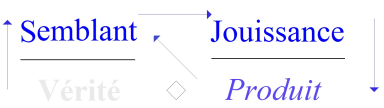
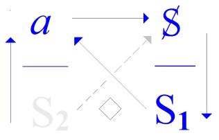

# Leçon 02 | 12 Décembre 1972

  <label><input type="checkbox" data-lacan-toggle="original" checked> 原文</label>
  <label><input type="checkbox" data-lacan-toggle="notes" checked> 注释</label>
  <label><input type="checkbox" data-lacan-toggle="commentary" checked> 个人解读评论</label>

<section class="parallel-paragraph" data-paragraph-ids="s20-02-0001">

s20-02-0001

[无对应译文]

原文 · s20-02-0001

[Récanati](#Recanati)

</section>

<section class="parallel-paragraph" data-paragraph-ids="s20-02-0002">

s20-02-0002

[无对应译文]

原文 · s20-02-0002

Lacan

</section>

<section class="parallel-paragraph" data-paragraph-ids="s20-02-0003">

s20-02-0003

[无对应译文]

原文 · s20-02-0003

Lacan paraît-il, dans son 1er « *séminaire* »...

</section>

<section class="parallel-paragraph" data-paragraph-ids="s20-02-0004">

s20-02-0004

[无对应译文]

原文 · s20-02-0004

> comme on l’appelle... ...de cette année, aurait parlé, je vous le donne en mille, de *l’amour,* pas moins !

</section>

<section class="parallel-paragraph" data-paragraph-ids="s20-02-0005">

s20-02-0005

[无对应译文]

原文 · s20-02-0005

La nouvelle s’est propagée...\[*Rires*\]

</section>

<section class="parallel-paragraph" data-paragraph-ids="s20-02-0006">

s20-02-0006

[无对应译文]

原文 · s20-02-0006

Elle m’est revenue même, de pas très loin bien sûr, d’une petite ville de l’Europe \[*Amsterdam*\] où on l’avait envoyée en message \[*Rires*\].

</section>

<section class="parallel-paragraph" data-paragraph-ids="s20-02-0007">

s20-02-0007

[无对应译文]

原文 · s20-02-0007

Comme c’est sur mon divan que ça m’est revenu, je peux pas croire que la personne qui me l’a rapportée y crût vraiment, vu qu’elle sait bien que ce que je dis de *l’amour* c’est assurément qu’on peut pas en parler.

</section>

<section class="parallel-paragraph" data-paragraph-ids="s20-02-0008">

s20-02-0008

[无对应译文]

原文 · s20-02-0008

*« Parlez-moi d’amour »,* ça veut dire des chansonnettes.

</section>

<section class="parallel-paragraph" data-paragraph-ids="s20-02-0009">

s20-02-0009

[无对应译文]

原文 · s20-02-0009

J’ai parlé de *la lettre d’amour*, de *la déclaration d’amour*, c’est pas la même chose que la parole d’amour.

</section>

<section class="parallel-paragraph" data-paragraph-ids="s20-02-0010">

s20-02-0010

[无对应译文]

原文 · s20-02-0010

Enfin je pense qu’il est clair...

</section>

<section class="parallel-paragraph" data-paragraph-ids="s20-02-0011">

s20-02-0011

[无对应译文]

原文 · s20-02-0011

> même si vous ne vous l’êtes pas formulé ...il est clair que dans ce 1er séminaire j’ai parlé de la *bêtise*, de celle qui conditionne ce dont j’ai donné cette année le titre à mon séminaire et qui se dit « *Encore ».*

</section>

<section class="parallel-paragraph" data-paragraph-ids="s20-02-0012">

s20-02-0012

[无对应译文]

原文 · s20-02-0012

Vous voyez le risque !

</section>

<section class="parallel-paragraph" data-paragraph-ids="s20-02-0013">

s20-02-0013

[无对应译文]

原文 · s20-02-0013

Je vous dis ça uniquement pour vous dire ce qui fait ici le poids, le poids de ma présence, c’est que vous en jouissez : ma présence seule - du moins j’ose le croire - ma présence seule dans mon discours, ma présence seule est ma *bêtise*.

</section>

<section class="parallel-paragraph" data-paragraph-ids="s20-02-0014">

s20-02-0014

[无对应译文]

原文 · s20-02-0014

Je devrais savoir que j’ai mieux à faire que d’être là.

</section>

<section class="parallel-paragraph" data-paragraph-ids="s20-02-0015">

s20-02-0015

[无对应译文]

原文 · s20-02-0015

C’est bien pour ça que je peux avoir envie tout simplement qu’elle ne vous soit pas assurée en tout état de cause. Néanmoins il est clair que je ne peux pas me mettre dans une position de retrait, de dire « *qu’encore ! et que ça dure »* c’est une *bêtise*, puisque moi-même j’y collabore, évidemment.

</section>

<section class="parallel-paragraph" data-paragraph-ids="s20-02-0016">

s20-02-0016

[无对应译文]

原文 · s20-02-0016

Je ne peux me placer que dans le champ de cet *« Encore »*.

</section>

<section class="parallel-paragraph" data-paragraph-ids="s20-02-0017">

s20-02-0017

[无对应译文]

原文 · s20-02-0017

 

</section>

<section class="parallel-paragraph" data-paragraph-ids="s20-02-0018">

s20-02-0018

[无对应译文]

原文 · s20-02-0018

Et peut-être à « *remonter* » un certain *discours...*

</section>

<section class="parallel-paragraph" data-paragraph-ids="s20-02-0019">

s20-02-0019

[无对应译文]

原文 · s20-02-0019

> qui est *le discours analytique* ...jusqu’à ce qui fait le conditionnement de ce *discours,* à savoir cette « *vérité »* \[**S2**\] ...

</section>

<section class="parallel-paragraph" data-paragraph-ids="s20-02-0020">

s20-02-0020

[无对应译文]

原文 · s20-02-0020

> la seule qui puisse être incontestable *de ce qu’elle n’est pas* ...*qu’il n’y a pas de rapport sexuel,* ceci ne permet d’aucune façon de juger de ce qui est ou n’est pas de « *la bêtise »*.

</section>

<section class="parallel-paragraph" data-paragraph-ids="s20-02-0021">

s20-02-0021

[无对应译文]

原文 · s20-02-0021

Et pourtant il ne se peut pas - vu l’expérience - qu’à propos du *discours analytique* quelque chose ne soit pas interrogé, qui est à savoir s’il ne tient pas *essentiellement de s’en supporter* de cette dimension de *« la bêtise ».*

</section>

<section class="parallel-paragraph" data-paragraph-ids="s20-02-0022">

s20-02-0022

[无对应译文]

原文 · s20-02-0022

Et pourquoi pas, pourquoi pas après tout, ne pas se demander quel est le statut de *cette dimension* pourtant bien présente. Car enfin il n’y a pas eu besoin du *discours analytique* pour que...

</section>

<section class="parallel-paragraph" data-paragraph-ids="s20-02-0023">

s20-02-0023

[无对应译文]

原文 · s20-02-0023

> c’est là la nuance ...comme « *vérité »,* soit annoncé « *qu’il n’y a pas de rapport sexuel »*.

</section>

<section class="parallel-paragraph" data-paragraph-ids="s20-02-0024">

s20-02-0024

[无对应译文]

原文 · s20-02-0024

Ne croyez pas que moi j’hésite à me mouiller...

</section>

<section class="parallel-paragraph" data-paragraph-ids="s20-02-0025">

s20-02-0025

[无对应译文]

原文 · s20-02-0025

Ce n’est pas d’aujourd’hui que je parlerai de Saint Paul, je l’ai déjà fait.

</section>

<section class="parallel-paragraph" data-paragraph-ids="s20-02-0026">

s20-02-0026

[无对应译文]

原文 · s20-02-0026

C’est pas ça qui me fait peur - même de me compromettre avec des gens dont le statut, la descendance n’est pas à proprement parler ce que je fréquente.

</section>

<section class="parallel-paragraph" data-paragraph-ids="s20-02-0027">

s20-02-0027

[无对应译文]

原文 · s20-02-0027

Néanmoins « *les hommes d’un côté, les femmes de l’autre* », ce fut la conséquence du message, voilà ce qui au cours des âges a eu quelques répercussions.

</section>

<section class="parallel-paragraph" data-paragraph-ids="s20-02-0028">

s20-02-0028

[无对应译文]

原文 · s20-02-0028

Ça n’a pas empêché le monde de se reproduire à votre mesure.

</section>

<section class="parallel-paragraph" data-paragraph-ids="s20-02-0029">

s20-02-0029

[无对应译文]

原文 · s20-02-0029

*La bêtise* tient bon, en tout cas.

</section>

<section class="parallel-paragraph" data-paragraph-ids="s20-02-0030">

s20-02-0030

[无对应译文]

原文 · s20-02-0030

 

</section>

<section class="parallel-paragraph" data-paragraph-ids="s20-02-0031">

s20-02-0031

[无对应译文]

原文 · s20-02-0031

C’est pas tout à fait *comme ça* que s’établit *le discours analytique...*

</section>

<section class="parallel-paragraph" data-paragraph-ids="s20-02-0032">

s20-02-0032

[无对应译文]

原文 · s20-02-0032

> ce que je vous ai formulé du *a* et de l’S2 qui est *en dessous,*
>
> et de ce que ça interroge du côté du sujet, \[*a* → **S**\]
>
> pour produire quoi ? \[ *Produit* : **S1,** *signifiant asémantique, hors sens → « la bêtise »*\] ...c’est bien évidemment que ça s’installe là-dedans, dans *la bêtise* - pourquoi pas ? - et que ça n’a pas ce recul \[*reculer devant la bêtise*\], que je n’ai pas pris moi non plus, de dire que si ça continue c’est de *la bêtise*.

</section>

<section class="parallel-paragraph" data-paragraph-ids="s20-02-0033">

s20-02-0033

[无对应译文]

原文 · s20-02-0033

Au nom de quoi le dirais-je ? Comment sortir de *la bêtise* ?

</section>

<section class="parallel-paragraph" data-paragraph-ids="s20-02-0034">

s20-02-0034

[无对应译文]

原文 · s20-02-0034

Il n’en est pas moins vrai qu’il y a quelque chose, un statut à donner de ce qu’il en est de ce neuf *discours* \[*le discours analytique*\]: de son approche de *la bêtise*, quelque *chose* s’en renouvelle \[*à suspendre le sens* : **S1 ◊ S2**, « *quelque « <u>Chose</u> » s’en renouvelle* » \].

</section>

<section class="parallel-paragraph" data-paragraph-ids="s20-02-0035">

s20-02-0035

[无对应译文]

原文 · s20-02-0035

Sûrement qu’il va plus près \[*de la « Chose freudienne »*\], car dans les autres \[discours : **H, U, M**\] c’est bien ce qu’on fuit.

</section>

<section class="parallel-paragraph" data-paragraph-ids="s20-02-0036">

s20-02-0036

[无对应译文]

原文 · s20-02-0036

Le discours vise toujours à la moindre *bêtise*, ce qu’on appelle *la bêtise* *sublime*, car « sublime » veut dire ça : c’est le point le plus élevé de ce qui est en bas.

</section>

<section class="parallel-paragraph" data-paragraph-ids="s20-02-0037">

s20-02-0037

[无对应译文]

原文 · s20-02-0037

Où est dans *le discours analytique* le sublime de *la bêtise* ?

</section>

<section class="parallel-paragraph" data-paragraph-ids="s20-02-0038">

s20-02-0038

[无对应译文]

原文 · s20-02-0038

Voilà en quoi je suis en même temps légitimé à mettre au repos *ma participation à la bêtise* en tant qu’ici elle nous englobe, et à invoquer qui pourra m’apporter la réplique de ce qui, sans doute dans d’autres champs... mais non bien sûr, puisqu’il s’agit de quelqu’un qui ici m’écoute, qui de ce fait est suffisamment introduit au *discours analytique*.

</section>

<section class="parallel-paragraph" data-paragraph-ids="s20-02-0039">

s20-02-0039

[无对应译文]

原文 · s20-02-0039

Comment ?

</section>

<section class="parallel-paragraph" data-paragraph-ids="s20-02-0040">

s20-02-0040

[无对应译文]

原文 · s20-02-0040

C’est là ce que déjà au terme de l’année dernière[^17], j’ai eu le bonheur de recueillir d’une bouche qui va se trouver la même.

</section>

<section class="parallel-paragraph" data-paragraph-ids="s20-02-0041">

s20-02-0041

[无对应译文]

原文 · s20-02-0041

C’est là que dès le début de l’année j’entends que quelqu’un m’apporte - à ses risques et périls - la réplique de ce qui dans *un discours* - nommément *le philosophique* - résout, oblique, mène sa voie, la fraye d’un certain statut, à l’égard de la moindre bêtise.

</section>

<section class="parallel-paragraph" data-paragraph-ids="s20-02-0042">

s20-02-0042

[无对应译文]

原文 · s20-02-0042

Je donne la parole à François Récanati que vous connaissez déjà.

</section>

<section class="parallel-paragraph" data-paragraph-ids="s20-02-0043">

s20-02-0043

[无对应译文]

原文 · s20-02-0043

[François Récanati](#Dec12) \[*Scilicet 5* p. 61\]

</section>

<section class="parallel-paragraph" data-paragraph-ids="s20-02-0044">

s20-02-0044

[无对应译文]

原文 · s20-02-0044

Je remercie le Dr Lacan de me donner la parole une 2ème fois, parce que ça va m’introduire directement à ce dont je vais parler, en ce sens que *ce n’est pas sans rapport avec* *la répétition*.

</section>

<section class="parallel-paragraph" data-paragraph-ids="s20-02-0045">

s20-02-0045

[无对应译文]

原文 · s20-02-0045

Mais d’autre part, je voudrais aussi bien prévenir que cette *répétition* c’est une *répétition infinie*, mais que ce que je vais dire, là aussi ça ne sera pas fini en ce sens que je n’aurai absolument pas le temps de venir au terme de ce que j’ai préparé.

</section>

<section class="parallel-paragraph" data-paragraph-ids="s20-02-0046">

s20-02-0046

[无对应译文]

原文 · s20-02-0046

C’est-à-dire qu’ici, en quelque sorte, c’est véritablement au bouclage de la boucle que devait prendre sens ce qui, comme préliminaire, va m’y amener. Là je vais être obligé à cause du temps et à moins de reprendre ça une autre fois, de m’en tenir aux préliminaires, c’est-à-dire proprement de ne pas encore entrer de plain-pied dans cette « *bêtise »* dont a parlé le Dr Lacan.

</section>

<section class="parallel-paragraph" data-paragraph-ids="s20-02-0047">

s20-02-0047

[无对应译文]

原文 · s20-02-0047

Vous vous souvenez que ce que la dernière fois j’avais essayé de vous montrer, c’est que *la répétition ne se produit qu’au 3ème coup*, qui était le coup de l’interprétant.

</section>

<section class="parallel-paragraph" data-paragraph-ids="s20-02-0048">

s20-02-0048

[无对应译文]

原文 · s20-02-0048

Ça veut dire que la répétition, c’est la répétition d’une opération, en ce sens que pour qu’il y ait du terme à répéter, il faut qu’il y ait une opération qui produise le terme, c’est-à-dire que ce qui doit se répéter, il faut bien que ça *s’inscrive,* et *l’inscription de cet objet* ne peut se faire elle-même qu’au terme de quelque chose de l’ordre d’une *répétition*.

</section>

<section class="parallel-paragraph" data-paragraph-ids="s20-02-0049">

s20-02-0049

[无对应译文]

原文 · s20-02-0049

Il y a là quelque chose qui ressemble à un cercle logique, et qui est en fait un peu différent, plutôt quelque chose de l’ordre d’une spirale, en ce sens où *le terme d’arrivée* et *le terme de départ*, on ne peut pas dire que ce soit la même chose : ce qui est donné, c’est que le terme d’arrivée est le même que *le terme de départ*, mais *le terme de départ* lui-même n’est pas déjà le même, il devient le même, mais seulement après coup.

</section>

<section class="parallel-paragraph" data-paragraph-ids="s20-02-0050">

s20-02-0050

[无对应译文]

原文 · s20-02-0050

Il y a donc 2 *répétitions* à envisager, dissymétriques, la 1ère qui est le procès par où se donne cet *objet* qui doit se répéter, et on peut appeler ça en quelque sorte l’identification de l’objet au sens où il s’agit du déclin de son identité, et on voit très bien ce que ça veut dire : quand on décline cette identité de l’objet, cette identité décline aussi sec.

</section>

<section class="parallel-paragraph" data-paragraph-ids="s20-02-0051">

s20-02-0051

[无对应译文]

原文 · s20-02-0051

Et la tautologie initiale *«* A est A *»*...

</section>

<section class="parallel-paragraph" data-paragraph-ids="s20-02-0052">

s20-02-0052

[无对应译文]

原文 · s20-02-0052

> dont on se souvient que Wittgenstein dit que c’est un coup de force dénué de sens ...c’est proprement ce qui institue le sens, car il passe quelque chose là-dedans.

</section>

<section class="parallel-paragraph" data-paragraph-ids="s20-02-0053">

s20-02-0053

[无对应译文]

原文 · s20-02-0053

C’est-à-dire que dans le *«* A est A *»*,

</section>

<section class="parallel-paragraph" data-paragraph-ids="s20-02-0054">

s20-02-0054

[无对应译文]

原文 · s20-02-0054

- A se présente tout d’abord comme le support indifférencié, tout à fait potentiel, de tout ce qui peut lui arriver comme détermination.

</section>

<section class="parallel-paragraph" data-paragraph-ids="s20-02-0055">

s20-02-0055

[无对应译文]

原文 · s20-02-0055

- Mais dès qu’une détermination effective lui est donnée, *dès que c’est d’existence qu’il s’agit* et pas du n’importe quoi, de toutes ses déterminations *possibles*, alors précisément il y a une sorte de transmission de pouvoir.

</section>

<section class="parallel-paragraph" data-paragraph-ids="s20-02-0056">

s20-02-0056

[无对应译文]

原文 · s20-02-0056

C’est-à-dire que ce qui devait faire *fonction* de support, en l’occurrence ce A indéterminé, ce A potentiel, est en quelque sorte marqué par le fait qu’il y a de l’*être* tout d’un coup qui s’intercale entre lui et lui-même, c’est-à-dire que *lui-même se répète*, et il se répète *sous la forme d’un* *prédicat*.

</section>

<section class="parallel-paragraph" data-paragraph-ids="s20-02-0057">

s20-02-0057

[无对应译文]

原文 · s20-02-0057

C’est-à-dire qu’il y a une espèce d’amoindrissement, et cet amoindrissement se symbolise par ceci que dans *«* A est A *»*, le A qui avait fonction de support, tout d’un coup se voit lui-même supporté par quelque chose de l’ordre de l’*être,* qui le supporte, qui le dépasse, qui l’englobe, et lui-même n’est dans cette relation que ce qui prédique la prédication, en tant que la prédication c’est ce que supporte l’être. Sur ceci je vais revenir.

</section>

<section class="parallel-paragraph" data-paragraph-ids="s20-02-0058">

s20-02-0058

[无对应译文]

原文 · s20-02-0058

Lacan - D’ailleurs chacun sait que « *La guerre est la guerre* » n’est pas une tautologie, non plus que « *un sou est un sou* » !

</section>

<section class="parallel-paragraph" data-paragraph-ids="s20-02-0059">

s20-02-0059

[无对应译文]

原文 · s20-02-0059

François Récanati

</section>

<section class="parallel-paragraph" data-paragraph-ids="s20-02-0060">

s20-02-0060

[无对应译文]

原文 · s20-02-0060

Exactement.

</section>

<section class="parallel-paragraph" data-paragraph-ids="s20-02-0061">

s20-02-0061

[无对应译文]

原文 · s20-02-0061

Je vais revenir là-dessus parce que c’est à peu près le nerf de toute l’affaire et que je voudrais parler...

</section>

<section class="parallel-paragraph" data-paragraph-ids="s20-02-0062">

s20-02-0062

[无对应译文]

原文 · s20-02-0062

> c’est de ça que je crains de n’avoir pas le temps de le faire ...de *la logique de Port-Royal* [^18], parce que c’est une *théorie de la substance*, justement, et qu’il a été dit la dernière fois qu’on ne se réfère pas ici à aucune *substance*. Mais j’y viendrai tout à l’heure.

</section>

<section class="parallel-paragraph" data-paragraph-ids="s20-02-0063">

s20-02-0063

[无对应译文]

原文 · s20-02-0063

Qu’on sache simplement que *la répétition* effectivement : la 1ère, répète l’indétermination initiale de cet objet qui se donne comme potentiel, mais qu’en répétant cette indétermination, l’indétermination se trouve soudain déterminée d’une certaine façon.

</section>

<section class="parallel-paragraph" data-paragraph-ids="s20-02-0064">

s20-02-0064

[无对应译文]

原文 · s20-02-0064

C’est-à-dire qu’on peut bien poser que *la répétition du vide* ou *la répétition de l’impossible*...

</section>

<section class="parallel-paragraph" data-paragraph-ids="s20-02-0065">

s20-02-0065

[无对应译文]

原文 · s20-02-0065

> enfin que ce type de répétition de quelque chose qui n’est pas donné,
>
> et qu’il faut donc produire dans le temps qu’on voudrait le répéter ...on peut bien poser que c’est *l’impossible*, et c’est ce que dit à peu près tout le monde, mais il suffit que ce soit *impossible* pour qu’il y ait quelque chose là d’assuré, et que cette assurance permette justement une répétition, c’est d’ailleurs une 2ème répétition.

</section>

<section class="parallel-paragraph" data-paragraph-ids="s20-02-0066">

s20-02-0066

[无对应译文]

原文 · s20-02-0066

Plutôt que de m’étaler là-dessus, je cite cette phrase de Kierkegaard : « *La seule chose qui se répète, c’est l’impossibilité de la répétition* ».

</section>

<section class="parallel-paragraph" data-paragraph-ids="s20-02-0067">

s20-02-0067

[无对应译文]

原文 · s20-02-0067

Ça fait très bien voir ce qu’il en est, et ça fait le joint avec ce que j’avais dit l’année dernière de la triade qui supporte toute répétition, la *triade objet-representamen-interprétant*.

</section>

<section class="parallel-paragraph" data-paragraph-ids="s20-02-0068">

s20-02-0068

[无对应译文]

原文 · s20-02-0068

C’est-à-dire *qu’entre l’objet et le representamen on change en quelque sorte d’espace*, ou au moins *il y a quelque chose comme un trou* qui fait justement *l’objet* et *le representamen,* inapprochables dans cette relation.

</section>

<section class="parallel-paragraph" data-paragraph-ids="s20-02-0069">

s20-02-0069

[无对应译文]

原文 · s20-02-0069

Mais ce *trou*, en tant qu’il insiste, ceci permet de fonder une vraie *répétition,* dans ce sens que le coup d’après, il y a quelque chose qui va incarner ce *trou* qui sera *l’interprétant*, et qui pourra en quelque sorte répéter de deux façons ce qui passait entre *l’objet* et *le representamen* :

</section>

<section class="parallel-paragraph" data-paragraph-ids="s20-02-0070">

s20-02-0070

[无对应译文]

原文 · s20-02-0070

- d’une part l’inscrire en disant « *il y avait du trou* » et en permettant que cette *impossibilité* ou ce *trou*, ça se répète.

</section>

<section class="parallel-paragraph" data-paragraph-ids="s20-02-0071">

s20-02-0071

[无对应译文]

原文 · s20-02-0071

- Mais d’autre part il va non pas seulement le *signifier* mais le *répéter* parce que, entre *l’impossibilité de départ* qui passait entre l’*objet* et le *representamen* et *son signifiant* qui est *l’interprétant*, il y a le même rapport impossible qu’il y avait justement entre l’*objet* et le *representamen*, c’est-à-dire qu’il faudra un deuxième *interprétant* pour prendre en charge la répétition de cette *impossibilité*.

</section>

<section class="parallel-paragraph" data-paragraph-ids="s20-02-0072">

s20-02-0072

[无对应译文]

原文 · s20-02-0072

Dans *l’interprétant*, il y a quelque chose comme l’effectuation d’une impossibilité jusque là potentielle, et *l’impossibilité inscrite par* *l’interprétant* c’est, disons, le 1er terme de cette existence dont le *zéro* potentiel était porteur, au sens où de quelque manière, le tout conduit au « *il existe* » et j’y reviendrai également.

</section>

<section class="parallel-paragraph" data-paragraph-ids="s20-02-0073">

s20-02-0073

[无对应译文]

原文 · s20-02-0073

Ce qui est important, c’est que l’impossibilité du rapport *objet-representamen* se donne comme telle pour l’interprétant. *L’interprétant* dit : « *Ça, c’est impossible* », mais dans la mesure où elle se donne pour l’interprétant comme telle, dès que *l’interprétant* lui-même se donne pour un autre *interprétant*, c’est alors que cette impossibilité est vraiment un terme, terme fondateur d’une série.

</section>

<section class="parallel-paragraph" data-paragraph-ids="s20-02-0074">

s20-02-0074

[无对应译文]

原文 · s20-02-0074

C’est-à-dire que ça permet au nouvel interprétant d’assurer quelque chose de solide, comme si cette solidité c’était l’interprétant premier qui l’avait fondée à partir de quelque chose originairement fluide.

</section>

<section class="parallel-paragraph" data-paragraph-ids="s20-02-0075">

s20-02-0075

[无对应译文]

原文 · s20-02-0075

Ce qui échappait dans le rapport *objet-representamen*, ça vient s’emprisonner dans *l’interprétant*.

</section>

<section class="parallel-paragraph" data-paragraph-ids="s20-02-0076">

s20-02-0076

[无对应译文]

原文 · s20-02-0076

Mais on voit bien, et je l’ai déjà dit,

</section>

<section class="parallel-paragraph" data-paragraph-ids="s20-02-0077">

s20-02-0077

[无对应译文]

原文 · s20-02-0077

- que ce qui s’emprisonne *dans* *l’interprétant,*

</section>

<section class="parallel-paragraph" data-paragraph-ids="s20-02-0078">

s20-02-0078

[无对应译文]

原文 · s20-02-0078

- et ce qui échappait *dans le rapport objet - representamen*, ce n’est pas exactement la même chose, puisque précisément ce qui échappait dans *le rapport objet-representamen*, ça continue à échapper dans le rapport entre ce rapport et l’interprétant.

</section>

<section class="parallel-paragraph" data-paragraph-ids="s20-02-0079">

s20-02-0079

[无对应译文]

原文 · s20-02-0079

C’est-à-dire que de toute façon, il y a le même décalage, la même inadéquation.

</section>

<section class="parallel-paragraph" data-paragraph-ids="s20-02-0080">

s20-02-0080

[无对应译文]

原文 · s20-02-0080

Et c’est bien l’impossibilité de la répétition, sur laquelle je vais maintenant appuyer un peu, qui produit ce qui se passe et qu’on peut constater, c’est-à-dire la répétition de l’impossibilité.

</section>

<section class="parallel-paragraph" data-paragraph-ids="s20-02-0081">

s20-02-0081

[无对应译文]

原文 · s20-02-0081

Ce qui institue le décalage, ce décalage d’où s’origine la répétition, c’est *l’impossibilité* pour quelque chose

</section>

<section class="parallel-paragraph" data-paragraph-ids="s20-02-0082">

s20-02-0082

[无对应译文]

原文 · s20-02-0082

- d’être à la fois ce quelque chose,

</section>

<section class="parallel-paragraph" data-paragraph-ids="s20-02-0083">

s20-02-0083

[无对应译文]

原文 · s20-02-0083

- et en même temps de l’inscrire.

</section>

<section class="parallel-paragraph" data-paragraph-ids="s20-02-0084">

s20-02-0084

[无对应译文]

原文 · s20-02-0084

C’est-à-dire que l’existence de quelque chose ne s’inscrit que pour *autre chose*, et par suite ça ne s’inscrit que quand c’est *autre chose* qui est donné.

</section>

<section class="parallel-paragraph" data-paragraph-ids="s20-02-0085">

s20-02-0085

[无对应译文]

原文 · s20-02-0085

Et si tant est que c’est d’existence ponctuelle qu’il s’agit, l’existence de quelque chose ne s’inscrit qu’au moment où elle décline justement, du moment où c’est d’une autre existence qu’il est question.

</section>

<section class="parallel-paragraph" data-paragraph-ids="s20-02-0086">

s20-02-0086

[无对应译文]

原文 · s20-02-0086

Cette disjonction, c’est à peu près ce qui passe entre « *l’être »* et « *l’être prédiqué »*, et j’espère avoir le temps d’arriver jusqu’à *la logique de Port-Royal* qui était théoriquement le noyau de mon exposé, mais c’est douteux...

</section>

<section class="parallel-paragraph" data-paragraph-ids="s20-02-0087">

s20-02-0087

[无对应译文]

原文 · s20-02-0087

Vous vous souvenez que la dernière fois, Lacan a caractérisé *l’être* comme étant « *section de prédicat* ».

</section>

<section class="parallel-paragraph" data-paragraph-ids="s20-02-0088">

s20-02-0088

[无对应译文]

原文 · s20-02-0088

Et c’est à proprement parler de cela qu’il est question.

</section>

<section class="parallel-paragraph" data-paragraph-ids="s20-02-0089">

s20-02-0089

[无对应译文]

原文 · s20-02-0089

Et tout de suite je vais donner quelques réflexions sur ne fut-ce que cette formule « *section de prédicat* » qui fait sentir immédiatement la récurrence *où se construit ce qui justement est supposé supporter tout prédicat*, c’est-à-dire l’être :

</section>

<section class="parallel-paragraph" data-paragraph-ids="s20-02-0090">

s20-02-0090

[无对应译文]

原文 · s20-02-0090

- ce qui supporte les prédicats *avant*,

</section>

<section class="parallel-paragraph" data-paragraph-ids="s20-02-0091">

s20-02-0091

[无对应译文]

原文 · s20-02-0091

- ça se donne *après* les prédicats.

</section>

<section class="parallel-paragraph" data-paragraph-ids="s20-02-0092">

s20-02-0092

[无对应译文]

原文 · s20-02-0092

Et d’une certaine manière, s’il y a « *section de prédicat* » pour trouver l’être, ça veut dire que *ce qui supporte les prédicats, c’est ce qui n’est pas dans les prédicats*.

</section>

<section class="parallel-paragraph" data-paragraph-ids="s20-02-0093">

s20-02-0093

[无对应译文]

原文 · s20-02-0093

C’est justement ce qui est absent des prédicats, ce qui est absent dans la prédication.

</section>

<section class="parallel-paragraph" data-paragraph-ids="s20-02-0094">

s20-02-0094

[无对应译文]

原文 · s20-02-0094

C’est donc *l’absence d’être,* d’une certaine manière, qui porte les prédicats, ce qui implique aussi, et de façon un peu indirecte, que *les prédicats ne sont eux-mêmes prédicats que de cette absence*.

</section>

<section class="parallel-paragraph" data-paragraph-ids="s20-02-0095">

s20-02-0095

[无对应译文]

原文 · s20-02-0095

Que le prédicat puisse être coupé, c’est comme si en quelque sorte il y avait déjà une partition élémentaire, comme si une ligne était donnée en pointillé, une frontière et qu’il suffit de découper comme dans certains emballages.

</section>

<section class="parallel-paragraph" data-paragraph-ids="s20-02-0096">

s20-02-0096

[无对应译文]

原文 · s20-02-0096

Lacan

</section>

<section class="parallel-paragraph" data-paragraph-ids="s20-02-0097">

s20-02-0097

[无对应译文]

原文 · s20-02-0097

Articulez bien la notion de « *section de prédicat* » puisque c’est ce que vous avez accroché dans ce que j’ai laissé, et j’ai juste presque achoppé là-dessus.

</section>

<section class="parallel-paragraph" data-paragraph-ids="s20-02-0098">

s20-02-0098

[无对应译文]

原文 · s20-02-0098

François Récanati

</section>

<section class="parallel-paragraph" data-paragraph-ids="s20-02-0099">

s20-02-0099

[无对应译文]

原文 · s20-02-0099

La « *section de prédicat* », c’est proprement le noyau de mon exposé. On peut imaginer ça comme *une vibration*, c’est-à-dire que c’est à partir d’*une espèce de halo* que je vais essayer...

</section>

<section class="parallel-paragraph" data-paragraph-ids="s20-02-0100">

s20-02-0100

[无对应译文]

原文 · s20-02-0100

> en faisant le tour véritablement ...de cerner ce noyau qui va apparaître dans tous les exemples que je vais donner.

</section>

<section class="parallel-paragraph" data-paragraph-ids="s20-02-0101">

s20-02-0101

[无对应译文]

原文 · s20-02-0101

*Section de prédicat* c’est donc comme si ça pouvait être coupé.

</section>

<section class="parallel-paragraph" data-paragraph-ids="s20-02-0102">

s20-02-0102

[无对应译文]

原文 · s20-02-0102

Je n’insiste pas là-dessus, sinon qu’il est évident que ce n’est pas d’avoir coupé la coupure qu’on va retrouver l’insécable, et que la frontière, une fois qu’on a tailladé dedans, elle insiste d’autant plus qu’elle se manifeste comme *trou*.

</section>

<section class="parallel-paragraph" data-paragraph-ids="s20-02-0103">

s20-02-0103

[无对应译文]

原文 · s20-02-0103

Disons que la section, pour prendre les sens qui viennent, c’est aussi bien faire **2** de ce qui était Un, et si je signale ce sens qui n’est pas ce qui se reçoit ici, c’est parce que c’est celui que Groddeck donne à un de *ses concepts*, qui s’appelle justement la « *sexion* », c’est-à-dire que ça n’est pas sans intéresser le sexe, d’une certaine manière.

</section>

<section class="parallel-paragraph" data-paragraph-ids="s20-02-0104">

s20-02-0104

[无对应译文]

原文 · s20-02-0104

Et ça c’est la manière pour Groddeck de faire référence à Platon, et quand je dis Platon il ne s’agit pas du « *Parménide »* mais du « *Banquet »*.

</section>

<section class="parallel-paragraph" data-paragraph-ids="s20-02-0105">

s20-02-0105

[无对应译文]

原文 · s20-02-0105

Vous vous souvenez que dans le discours d’Aristophane est soulevé le problème de ce mythe de l’androgyne originaire qui aurait été coupé en deux. Ç’aurait été ça, la « *sexion* » avec un x.

</section>

<section class="parallel-paragraph" data-paragraph-ids="s20-02-0106">

s20-02-0106

[无对应译文]

原文 · s20-02-0106

Or, ce sur quoi je voudrais insister, c’est sur quelque chose qui ressort très bien du *Banquet*, non pas spécifiquement du discours d’Aristophane mais un peu de tous les discours, même ceux qui sont supposés contradictoires, et je vais ne prendre que deux exemples :

</section>

<section class="parallel-paragraph" data-paragraph-ids="s20-02-0107">

s20-02-0107

[无对应译文]

原文 · s20-02-0107

- le discours de Diotime d’une part,

</section>

<section class="parallel-paragraph" data-paragraph-ids="s20-02-0108">

s20-02-0108

[无对应译文]

原文 · s20-02-0108

- celui d’Aristophane de l’autre.

</section>

<section class="parallel-paragraph" data-paragraph-ids="s20-02-0109">

s20-02-0109

[无对应译文]

原文 · s20-02-0109

Et le *Banquet* ça porte sur l’amour. L’amour, dit Diotime, c’est ce qui, partout où il y a du 2, fait office de *frontière*, de *milieu*, d’*intermédiaire*, c’est-à-dire d’*interprétant*.

</section>

<section class="parallel-paragraph" data-paragraph-ids="s20-02-0110">

s20-02-0110

[无对应译文]

原文 · s20-02-0110

Quand je dis *« interprétant »,* c’est parce qu’on peut très bien traduire comme ça le mot que Platon emploie, qui est un mot dérivé de Μαντιχή \[mantiké\], qui veut dire *l’interprétation,* et Platon dit que ce mot vient de Μανιχή \[maniké\] qui veut dire *le délire*.

</section>

<section class="parallel-paragraph" data-paragraph-ids="s20-02-0111">

s20-02-0111

[无对应译文]

原文 · s20-02-0111

C’est ce qui fait office d’interprétant.

</section>

<section class="parallel-paragraph" data-paragraph-ids="s20-02-0112">

s20-02-0112

[无对应译文]

原文 · s20-02-0112

Mais le seul intérêt de cette formule...

</section>

<section class="parallel-paragraph" data-paragraph-ids="s20-02-0113">

s20-02-0113

[无对应译文]

原文 · s20-02-0113

> parce que somme toute, personne dans l’assemblée du *Banquet* ne la conteste ...c’est ce qui permet de s’ensuivre ceci : que l’amour en aucun cas ne saurait être beau, parce que ce qui se pose comme *objet de l’amour*, ce qui comme série tombe sous le coup de l’amour...

</section>

<section class="parallel-paragraph" data-paragraph-ids="s20-02-0114">

s20-02-0114

[无对应译文]

原文 · s20-02-0114

> l’amour étant comme une marque qui fait défiler, qui instaure une espèce de couloir
>
> où une série d’objets va passer, les objets qu’il a marqués ...l’amour ne peut pas être beau *parce que* ses objets sont beaux.

</section>

<section class="parallel-paragraph" data-paragraph-ids="s20-02-0115">

s20-02-0115

[无对应译文]

原文 · s20-02-0115

Et il est dit qu’en aucun cas,

</section>

<section class="parallel-paragraph" data-paragraph-ids="s20-02-0116">

s20-02-0116

[无对应译文]

原文 · s20-02-0116

- ce qui est l’agent d’une série,

</section>

<section class="parallel-paragraph" data-paragraph-ids="s20-02-0117">

s20-02-0117

[无对应译文]

原文 · s20-02-0117

- l’instance même de la série ou le terme ultime de série,

</section>

<section class="parallel-paragraph" data-paragraph-ids="s20-02-0118">

s20-02-0118

[无对应译文]

原文 · s20-02-0118

- ce qui chapeaute une série, ne peut avoir les mêmes caractères que les objets qui sont dans cette sériation, c’est-à-dire que si *les objets de l’amour sont beaux*, l’amour ne peut pas être beau.

</section>

<section class="parallel-paragraph" data-paragraph-ids="s20-02-0119">

s20-02-0119

[无对应译文]

原文 · s20-02-0119

C’est là à proprement parler un caractère de cette instance de sériation, un caractère de l’interprétant, que personne, parmi les polémistes présents dans l’assemblée du *Banquet,* ne remet en question.

</section>

<section class="parallel-paragraph" data-paragraph-ids="s20-02-0120">

s20-02-0120

[无对应译文]

原文 · s20-02-0120

Et on peut voir assez facilement le rapport qu’il y a avec Aristophane, même si ça paraît plus lointain, c’est que quand il dit qu’à l’origine, les hommes avaient quatre jambes, quatre bras, deux visages et deux sexes, ils devenaient un peu trop arrogants parce qu’ils n’avaient plus vraiment de désir, il ne leur manquait pas grand-chose, alors Zeus a décidé de les couper en deux pour qu’ils deviennent humiliés.

</section>

<section class="parallel-paragraph" data-paragraph-ids="s20-02-0121">

s20-02-0121

[无对应译文]

原文 · s20-02-0121

Mais ce qu’a dit Zeus c’est que ça ne compte pas, une coupure, s’il n’y a pas *des effets de coupure*, c’est-à-dire que si la coupure est ponctuelle et qu’après ça continue comme avant, ça ne sert à rien.

</section>

<section class="parallel-paragraph" data-paragraph-ids="s20-02-0122">

s20-02-0122

[无对应译文]

原文 · s20-02-0122

Alors ce qu’il a voulu c’est que ça reste, qu’il y ait un effet, et pour cela il a tourné les visages...

</section>

<section class="parallel-paragraph" data-paragraph-ids="s20-02-0123">

s20-02-0123

[无对应译文]

原文 · s20-02-0123

> qui étaient alors comme les sexes dans le dos et l’endroit de la coupure,
>
> c’était proprement le ventre puisqu’il y a le nombril qui est l’indice de la coupure ...il a décidé de tourner les visages du côté du nombril, pour que les hommes s’en souviennent de cette coupure.

</section>

<section class="parallel-paragraph" data-paragraph-ids="s20-02-0124">

s20-02-0124

[无对应译文]

原文 · s20-02-0124

Et puis pendant qu’il y était, il a tourné les sexes également, pour qu’ils puissent essayer de se recoller et *que ça les occupe*.

</section>

<section class="parallel-paragraph" data-paragraph-ids="s20-02-0125">

s20-02-0125

[无对应译文]

原文 · s20-02-0125

Mais l’important, et ce pourquoi j’ai déroulé tout ça en rapport avec le discours de Diotime, c’est que le résultat de toute cette opération, qui peut apparaître dérisoire, c’est simplement que l’homme, on lui a tourné le visage, il ne peut plus regarder derrière lui, il ne voit plus qu’en avant, il voit seulement ce qui le précède.

</section>

<section class="parallel-paragraph" data-paragraph-ids="s20-02-0126">

s20-02-0126

[无对应译文]

原文 · s20-02-0126

Est-ce qu’on voit bien que c’est précisément également ce que dit Diotime, c’est-à-dire que c’est ça la fin de tout, c’est-à-dire la fin du tout en tant qu’à toute série il manquera le terme ultime de la sériation, le point de vue, ce d’où la sériation se construit.

</section>

<section class="parallel-paragraph" data-paragraph-ids="s20-02-0127">

s20-02-0127

[无对应译文]

原文 · s20-02-0127

Lacan – C’est bien ce que je disais tout à l’heure : qu’il ne voit pas l’*encore*.

</section>

<section class="parallel-paragraph" data-paragraph-ids="s20-02-0128">

s20-02-0128

[无对应译文]

原文 · s20-02-0128

François Récanati

</section>

<section class="parallel-paragraph" data-paragraph-ids="s20-02-0129">

s20-02-0129

[无对应译文]

原文 · s20-02-0129

Ce que je viens là d’isoler à partir de deux discours, on va le retrouver comme deux points très liés à propos des *ordinaux*.

</section>

<section class="parallel-paragraph" data-paragraph-ids="s20-02-0130">

s20-02-0130

[无对应译文]

原文 · s20-02-0130

*Ce qui fait l’ordinal* - on vous l’a déjà dit - *c’est quelque chose de l’ordre d’un nom de nom*, et on va voir plus précisément de quoi il retourne, en ce sens que *l’ordinal c’est un nom*, mais si c’est un nom, la fonction de ce mot c’est de nommer quelque chose qui n’est pas justement son propre nom.

</section>

<section class="parallel-paragraph" data-paragraph-ids="s20-02-0131">

s20-02-0131

[无对应译文]

原文 · s20-02-0131

C’est en quelque sorte *le nom* 2nd de ce qui précède, du *nom* qui précède et qui - comme nom lui-même - est bien un *nom*, mais ne sert qu’à nommer quelque chose qui précède etc. Voilà le rapport avec Aristophane. Je n’insiste pas.

</section>

<section class="parallel-paragraph" data-paragraph-ids="s20-02-0132">

s20-02-0132

[无对应译文]

原文 · s20-02-0132

Il y a un problème qui va se poser tout de suite, et je tâcherai de l’aborder, c’est que le 1er *ordinal*, lui n’est pas vraiment *un nom de nom*, parce qu’il n’y a pas de nom qui le précède, si tant est qu’il soit le 1er.

</section>

<section class="parallel-paragraph" data-paragraph-ids="s20-02-0133">

s20-02-0133

[无对应译文]

原文 · s20-02-0133

C’est pourquoi j’ai écrit à côté le « *nom du nom* » parce que c’est ça le 1er *ordinal*.

</section>

<section class="parallel-paragraph" data-paragraph-ids="s20-02-0134">

s20-02-0134

[无对应译文]

原文 · s20-02-0134

Et je dirai même : si c’est cela qui se passe au début, c’est à cause de ça qu’après il y a du *nom de nom*, parce que justement, dès lors qu’on donne un nom à ce qui n’en a pas, c’est dans l’identification justement quelque chose comme le déclin de l’identité, en ce sens qu’on en dit un peu *plus*, et que ce *plus* qu’on dit, il va falloir lui-même, non pas tant le résorber mais l’identifier, lui donner un nom, et à partir de là c’est *le décalage infini*.

</section>

<section class="parallel-paragraph" data-paragraph-ids="s20-02-0135">

s20-02-0135

[无对应译文]

原文 · s20-02-0135

\[*C’est Dieu qui réalise la Création, mais c’est Adam qui s’engage dans la nomination de ce qui a été créé, cf. métaphore et métonymie*\]

</section>

<section class="parallel-paragraph" data-paragraph-ids="s20-02-0136">

s20-02-0136

[无对应译文]

原文 · s20-02-0136

Nommer, en général, c’est faire le point de ce qui précède dans la série.

</section>

<section class="parallel-paragraph" data-paragraph-ids="s20-02-0137">

s20-02-0137

[无对应译文]

原文 · s20-02-0137

Mais le point en tant que lui-même fonctionne comme nom, précède *quelque chose à venir* également, et *ce quelque chose à venir*, si on le considère absolument, *ce qui est toujours à venir* ce sera ce qu’on pourrait appeler l’« *encore* », qui lui, ne précède rien qui ne soit lui-même, c’est-à-dire ne détient pas de nom, *innommable* de ce fait.

</section>

<section class="parallel-paragraph" data-paragraph-ids="s20-02-0138">

s20-02-0138

[无对应译文]

原文 · s20-02-0138

On voit que de ce point de vue là, ce que j’appelle l’*encore*, c’est l’index de l’infini.

</section>

<section class="parallel-paragraph" data-paragraph-ids="s20-02-0139">

s20-02-0139

[无对应译文]

原文 · s20-02-0139

Et d’autre part on peut dire que l’infini est déjà là : il est donné dès le départ dans l’homonymie du *nom* et du *non*.

</section>

<section class="parallel-paragraph" data-paragraph-ids="s20-02-0140">

s20-02-0140

[无对应译文]

原文 · s20-02-0140

C’est-à-dire que le nom, c’est quelque chose comme la propagation du *non* plus radical, qui avant toute nomination, dans l’instant de toute nomination, se donne comme quelque chose d’infini.

</section>

<section class="parallel-paragraph" data-paragraph-ids="s20-02-0141">

s20-02-0141

[无对应译文]

原文 · s20-02-0141

On voit donc quelque chose se détacher comme deux bornes,

</section>

<section class="parallel-paragraph" data-paragraph-ids="s20-02-0142">

s20-02-0142

[无对应译文]

原文 · s20-02-0142

- le *non* d’une part,

</section>

<section class="parallel-paragraph" data-paragraph-ids="s20-02-0143">

s20-02-0143

[无对应译文]

原文 · s20-02-0143

- et l’*encore*, et l’ordination c’est ce qui passe entre les deux.

</section>

<section class="parallel-paragraph" data-paragraph-ids="s20-02-0144">

s20-02-0144

[无对应译文]

原文 · s20-02-0144

C’est-à-dire que ce qui va m’intéresser...

</section>

<section class="parallel-paragraph" data-paragraph-ids="s20-02-0145">

s20-02-0145

[无对应译文]

原文 · s20-02-0145

> et on peut voir le rapport de ceci avec *la section de prédicat*,
>
> c’est-à-dire avec cette expression et cette récurrence ...c’est le rapport entre les deux.

</section>

<section class="parallel-paragraph" data-paragraph-ids="s20-02-0146">

s20-02-0146

[无对应译文]

原文 · s20-02-0146

*Le système de la nomination* en général, vous voyez à peu près comment on peut l’appréhender : c’est l’enrobage d’un impossible de départ, enrobage qui justement dans ce rapport à *l’impossible*, ne se soutient que de l’*encore* comme indice de cette transcendance de *l’impossible* par rapport à tout enrobage.

</section>

<section class="parallel-paragraph" data-paragraph-ids="s20-02-0147">

s20-02-0147

[无对应译文]

原文 · s20-02-0147

Et si *l’impossible* c’est ce qui *dit non*...

</section>

<section class="parallel-paragraph" data-paragraph-ids="s20-02-0148">

s20-02-0148

[无对应译文]

原文 · s20-02-0148

> ce qui n’est pas évident et je regrette de n’avoir pas le temps de développer ce point ...il faudra l’entendre à peu près comme *une dénégation radicale*, en tant que *la dénégation* *c’est quelque chose qui est déjà infini*.

</section>

<section class="parallel-paragraph" data-paragraph-ids="s20-02-0149">

s20-02-0149

[无对应译文]

原文 · s20-02-0149

C’est-à-dire qu’en tant que c’est déjà infini, la dénégation se moque pas mal de ce qui arrive en quelque sorte derrière elle, ce qu’elle supporte, c’est-à-dire tout le jeu de prédication, tout le jeu d’objectivation prédicative, qui prend *la dénégation* par exemple *pour la nier*, *en disant non ou en disant oui*, *ça ne donne jamais de oui*, *la dénégation* reste intacte, avec des petits jeux qui se passent sur son corps, pourrait-on dire.

</section>

<section class="parallel-paragraph" data-paragraph-ids="s20-02-0150">

s20-02-0150

[无对应译文]

原文 · s20-02-0150

Et alors ce n’est même pas, pour l’infini de la dénégation, une chatouille.

</section>

<section class="parallel-paragraph" data-paragraph-ids="s20-02-0151">

s20-02-0151

[无对应译文]

原文 · s20-02-0151

Alors ceci nous amène à penser, *c’est une parenthèse*, que même si ce que j’ai appelé « *la manipulation logique sur fond d’infini* », ça devient infini à son tour, ça ne veut pas dire qu’on va guérir *l’infini* à coup *d’infini* et que ça va donner tout d’un coup du fini, ou quelque chose comme du oui.

</section>

<section class="parallel-paragraph" data-paragraph-ids="s20-02-0152">

s20-02-0152

[无对应译文]

原文 · s20-02-0152

Au contraire, ça va devenir *pire* en ce sens que ce qui dans *la nomination* peut devenir infini, ce n’est pas la même chose que ce qui est déjà là comme infini dans ce que j’appelle cette *dénégation initiale*, en ce sens que ce qui dans la manipulation logique vient comme infini c’est *la nomination de l’infini*, et que ce qui est déjà là comme dénégation infinie, c’est ce qui infinitise toute nomination, c’est *l’infini de la nomination*.

</section>

<section class="parallel-paragraph" data-paragraph-ids="s20-02-0153">

s20-02-0153

[无对应译文]

原文 · s20-02-0153

Ce qui fait que la nomination de l’infini, elle sera une nomination comme les autres, c’est-à-dire qu’elle sera aussi bien sujette à cette infinitisation qui est déjà là, qui part d’une source qui est au début.

</section>

<section class="parallel-paragraph" data-paragraph-ids="s20-02-0154">

s20-02-0154

[无对应译文]

原文 · s20-02-0154

C’est-à-dire que ça ne va rien changer et qu’on peut poser quelque chose comme *oméga*, le plus petit ordinal infini, ça ne va pas s’arrêter là, ça continue dans l’ensemble des parties d’*oméga*, dans les *aleph* etc.

</section>

<section class="parallel-paragraph" data-paragraph-ids="s20-02-0155">

s20-02-0155

[无对应译文]

原文 · s20-02-0155

Dès lors que l’*infini* est donné dans cette position là, il faut que l’infini lui-même soit infini, c’est-à-dire qu’on continue ces passages d’infini à l’infini, etc., qu’on continue « *encore* ».

</section>

<section class="parallel-paragraph" data-paragraph-ids="s20-02-0156">

s20-02-0156

[无对应译文]

原文 · s20-02-0156

Comme si ce qui veut s’atteindre dans cette histoire, c’est précisément l’*encore* lui-même.

</section>

<section class="parallel-paragraph" data-paragraph-ids="s20-02-0157">

s20-02-0157

[无对应译文]

原文 · s20-02-0157

L’*encore* à donner comme la limite de l’extension de ce *non radical* dont j’ai parlé, Et je vais maintenant parler du rapport entre *le non radical* et *l’encore*, puisque c’est à ça que va m’introduire rétroactivement ce sur quoi je vais revenir, c’est-à-dire la « *section de prédicat* ».

</section>

<section class="parallel-paragraph" data-paragraph-ids="s20-02-0158">

s20-02-0158

[无对应译文]

原文 · s20-02-0158

La « *section de prédicat* », on le voit immédiatement, c’est à la fois

</section>

<section class="parallel-paragraph" data-paragraph-ids="s20-02-0159">

s20-02-0159

[无对应译文]

原文 · s20-02-0159

- ce qu’il y a après toute prédication, c’est-à-dire une fois qu’on peut dire « *il n’y en a plus, des prédicats* »,

</section>

<section class="parallel-paragraph" data-paragraph-ids="s20-02-0160">

s20-02-0160

[无对应译文]

原文 · s20-02-0160

- et c’est aussi bien ce qui, avant toute prédication, la supporte.

</section>

<section class="parallel-paragraph" data-paragraph-ids="s20-02-0161">

s20-02-0161

[无对应译文]

原文 · s20-02-0161

Mais ce qu’il faut comprendre c’est que cet *avant* et cet *après,* c’est la même chose, c’est-à-dire que c’est ce qui constitue, ce qui soutient la prédication comme *l’enrobage* d’une impossibilité, cette impossibilité qu’il faut comprendre comme l’impossibilité même de la prédication, c’est-à-dire l’impossibilité de fournir tous les prédicats, de les mettre ensemble, sans qu’*au-moins un* se détache comme *représentant dans l’impossibilité*, dans l’existence l’impossibilité, ou si l’on veut l’*encore*.

</section>

<section class="parallel-paragraph" data-paragraph-ids="s20-02-0162">

s20-02-0162

[无对应译文]

原文 · s20-02-0162

Plus précisément quant aux ordinaux, l’ordinal nomme le nom de celui qui le précède. Cela veut dire deux choses :

</section>

<section class="parallel-paragraph" data-paragraph-ids="s20-02-0163">

s20-02-0163

[无对应译文]

原文 · s20-02-0163

- qu’un ordinal ne se nomme pas lui-même, mais est nommé par son successeur,

</section>

<section class="parallel-paragraph" data-paragraph-ids="s20-02-0164">

s20-02-0164

[无对应译文]

原文 · s20-02-0164

- et qu’à chaque ordinal appartient la sommation mécanique de tous ceux qui le précèdent. Puisqu’un ordinal nomme son précédent, son précédent nomme son précédent etc., c’est-à-dire qu’il y a, accrochée à chaque ordinal, la série de tous les ordinaux qui l’ont précédé.

</section>

<section class="parallel-paragraph" data-paragraph-ids="s20-02-0165">

s20-02-0165

[无对应译文]

原文 · s20-02-0165

Or, déjà ces deux points impliquent une discordance essentielle entre le nom et le *nom de nom*, et c’est ce que j’appellerai un effet d’écrasement.

</section>

<section class="parallel-paragraph" data-paragraph-ids="s20-02-0166">

s20-02-0166

[无对应译文]

原文 · s20-02-0166

Ce qui vient identifier le *zéro* par exemple, dans une définition du *zéro*, comme quelque chose comme l’élément unique de *l’ensemble identique à zéro*, ou pour l’ensemble vide on peut très bien dire : ce qui est élément unique de l’ensemble de ses parties, ou simplement cet ensemble de ses parties dont il est l’élément qu’il vient identifier proprement, ceci se donne comme prédicat du *zéro*.

</section>

<section class="parallel-paragraph" data-paragraph-ids="s20-02-0167">

s20-02-0167

[无对应译文]

原文 · s20-02-0167

Or, on voit bien que dans ce prédicat, il y a quelque chose *en plus* qui est donné, *en plus* que l’ensemble vide, *en plus* que le *zéro*, et c’est tellement tangible.

</section>

<section class="parallel-paragraph" data-paragraph-ids="s20-02-0168">

s20-02-0168

[无对应译文]

原文 · s20-02-0168

La preuve en est que justement le **0** et le **1**...

</section>

<section class="parallel-paragraph" data-paragraph-ids="s20-02-0169">

s20-02-0169

[无对应译文]

原文 · s20-02-0169

> qui n’est censé être autre que l’identification du **0** ...ça fait justement 2.

</section>

<section class="parallel-paragraph" data-paragraph-ids="s20-02-0170">

s20-02-0170

[无对应译文]

原文 · s20-02-0170

On voit qu’on change de niveau, que ça n’a aucun rapport, que ça ne se situe pas – il y a un décalage, on passe d’un niveau à un niveau supérieur.

</section>

<section class="parallel-paragraph" data-paragraph-ids="s20-02-0171">

s20-02-0171

[无对应译文]

原文 · s20-02-0171

Mais ce qui est remarquable, c’est que ce **0** et ce **1**...

</section>

<section class="parallel-paragraph" data-paragraph-ids="s20-02-0172">

s20-02-0172

[无对应译文]

原文 · s20-02-0172

> qui n’ont rien à voir, qui ne se situent pas au même niveau ...on les met ensemble comme les éléments de ce nouvel ensemble constitué par l’ordinal 2. **0** et **1** ça fait **2** justement au sens où le **0** et le **1** sont en quelque sorte nivelés, mis sur un même plan dans le **2**.

</section>

<section class="parallel-paragraph" data-paragraph-ids="s20-02-0173">

s20-02-0173

[无对应译文]

原文 · s20-02-0173

Et pour le 2 lui-même, l’opération va se répéter dans ce passage du **2** au **3** etc.

</section>

<section class="parallel-paragraph" data-paragraph-ids="s20-02-0174">

s20-02-0174

[无对应译文]

原文 · s20-02-0174

*Le representamen* n’a là avec l’objet pas de rapport possible, et c’est toujours ce cursus de *l’interprétant* qui intervient, c’est-à-dire que c’est incarné par quelque chose, et dans la mesure où c’est incarné, où le quelque chose qui échappe est bridé, il resurgit également juste après cette incarnation.

</section>

<section class="parallel-paragraph" data-paragraph-ids="s20-02-0175">

s20-02-0175

[无对应译文]

原文 · s20-02-0175

On peut prendre *la formule d’un ordinal* pour mieux voir ce dont il est question.

</section>

<section class="parallel-paragraph" data-paragraph-ids="s20-02-0176">

s20-02-0176

[无对应译文]

原文 · s20-02-0176

Lacan – Rendez-le à Cantor quand même !

</section>

<section class="parallel-paragraph" data-paragraph-ids="s20-02-0177">

s20-02-0177

[无对应译文]

原文 · s20-02-0177

François Récanati

</section>

<section class="parallel-paragraph" data-paragraph-ids="s20-02-0178">

s20-02-0178

[无对应译文]

原文 · s20-02-0178

Voici la formule qu’on peut considérer comme la formule du 4.

</section>

<section class="parallel-paragraph" data-paragraph-ids="s20-02-0179">

s20-02-0179

[无对应译文]

原文 · s20-02-0179

0 0 I : 0 I 2

</section>

<section class="parallel-paragraph" data-paragraph-ids="s20-02-0180">

s20-02-0180

[无对应译文]

原文 · s20-02-0180

∅, { ∅ }, { ∅, { ∅ } } : { ∅, { ∅ }, { ∅, { ∅ }}} 0 I 2 : 3 4

</section>

<section class="parallel-paragraph" data-paragraph-ids="s20-02-0181">

s20-02-0181

[无对应译文]

原文 · s20-02-0181

Dans cette formule, que se passe-t-il ?

</section>

<section class="parallel-paragraph" data-paragraph-ids="s20-02-0182">

s20-02-0182

[无对应译文]

原文 · s20-02-0182

On sait que c’est le terme ultime de cette série qui compte :

</section>

<section class="parallel-paragraph" data-paragraph-ids="s20-02-0183">

s20-02-0183

[无对应译文]

原文 · s20-02-0183

- on voit que dans le **4**, ce qui est répété, c’est le **3**,

</section>

<section class="parallel-paragraph" data-paragraph-ids="s20-02-0184">

s20-02-0184

[无对应译文]

原文 · s20-02-0184

- on voit que le **3** répète lui-même le **2**,

</section>

<section class="parallel-paragraph" data-paragraph-ids="s20-02-0185">

s20-02-0185

[无对应译文]

原文 · s20-02-0185

- qui lui-même répète le **1**,

</section>

<section class="parallel-paragraph" data-paragraph-ids="s20-02-0186">

s20-02-0186

[无对应译文]

原文 · s20-02-0186

- qui lui-même répète le **0**.

</section>

<section class="parallel-paragraph" data-paragraph-ids="s20-02-0187">

s20-02-0187

[无对应译文]

原文 · s20-02-0187

Mais ce qui est important, c’est que le **4**

</section>

<section class="parallel-paragraph" data-paragraph-ids="s20-02-0188">

s20-02-0188

[无对应译文]

原文 · s20-02-0188

- n’est pas seulement la mise entre parenthèses, la nomination du **3**, qui lui-même met entre parenthèses et nomme le **2** *etc.*

</section>

<section class="parallel-paragraph" data-paragraph-ids="s20-02-0189">

s20-02-0189

[无对应译文]

原文 · s20-02-0189

- ce n’est pas seulement l’exposition, même répétitive, c’est-à-dire avec des parenthèses en plus, de ce qui déjà se donnait dans le **3**.

</section>

<section class="parallel-paragraph" data-paragraph-ids="s20-02-0190">

s20-02-0190

[无对应译文]

原文 · s20-02-0190

C’est la mise dans un même ensemble du **3** déjà comme écrasement, comme « *ensemblisation  *» de termes hétérogènes, c’est-à-dire la même chose que dans le **2**, le fait qu’il y ait le **0** et le **1** qui soient mis absolument sur le même plan.

</section>

<section class="parallel-paragraph" data-paragraph-ids="s20-02-0191">

s20-02-0191

[无对应译文]

原文 · s20-02-0191

Dans le **3**, c’est déjà un écrasement du **0**, du **1** et du **2**, c’est-à-dire qu’on les met dans un même ensemble.

</section>

<section class="parallel-paragraph" data-paragraph-ids="s20-02-0192">

s20-02-0192

[无对应译文]

原文 · s20-02-0192

Et le **4**, c’est ici précisément la mise en rapport dans un même ensemble du **3** comme écrasement, comme cette « *ensemblisation  *» forcée, avec les éléments que le **3** a écrasés, séparés du **3**, hors du **3**.

</section>

<section class="parallel-paragraph" data-paragraph-ids="s20-02-0193">

s20-02-0193

[无对应译文]

原文 · s20-02-0193

C’est-à-dire que c’est une *répétition*.

</section>

<section class="parallel-paragraph" data-paragraph-ids="s20-02-0194">

s20-02-0194

[无对应译文]

原文 · s20-02-0194

On voit que *la partie de gauche* et *la partie de droite*, c’est la même chose, à part qu’à droite, il y a des parenthèses en plus.

</section>

<section class="parallel-paragraph" data-paragraph-ids="s20-02-0195">

s20-02-0195

[无对应译文]

原文 · s20-02-0195

C’est ici, entre **2** et **3**, qu’il y a comme *une barre de clivage*, ce qui me permet de dire qu’on peut voir dans cette formule que

</section>

<section class="parallel-paragraph" data-paragraph-ids="s20-02-0196">

s20-02-0196

[无对应译文]

原文 · s20-02-0196

- si le **3** déjà est la désignation de ce qui s’est passé, *d’un passage-écrasement*, entre le **0** et le **1**, et du **0** et du **1** au **2**,

</section>

<section class="parallel-paragraph" data-paragraph-ids="s20-02-0197">

s20-02-0197

[无对应译文]

原文 · s20-02-0197

- si le **3** est déjà cet écrasement, c’est-à-dire une manière de désigner ce qui s’est passé d’une rupture avant, d’une rupture qui est précisément le passage du **0** au **1**, d’une rupture c’est-à-dire d’un éclatement des parties de ce qui déjà se donnait comme ensemble, on voit que ce qui se désigne dans la formule du **4**, c’est précisément cette désignation même, en tant qu’on peut voir exposés sur le même plan

</section>

<section class="parallel-paragraph" data-paragraph-ids="s20-02-0198">

s20-02-0198

[无对应译文]

原文 · s20-02-0198

- *d’une part toutes les parties de ce qui forme le* **3**,

</section>

<section class="parallel-paragraph" data-paragraph-ids="s20-02-0199">

s20-02-0199

[无对应译文]

原文 · s20-02-0199

- et d’autre part le **3** lui-même.

</section>

<section class="parallel-paragraph" data-paragraph-ids="s20-02-0200">

s20-02-0200

[无对应译文]

原文 · s20-02-0200

C’est-à-dire que l’écrasement lui-même, le fait de mettre des parenthèses en plus, ce n’est pas suffisant comme résultat pour laisser prégnant ce passage du **0** à son écrasement dans le **1**, du **1** à son écrasement dans le **2** etc., le **2** ou le **1** comme résultat n’exprimant plus ce passage.

</section>

<section class="parallel-paragraph" data-paragraph-ids="s20-02-0201">

s20-02-0201

[无对应译文]

原文 · s20-02-0201

Il faut que dans l’ensemble constitué par le **4** soient présents à la fois les termes séparés des différents passages et la série des passages-écrasements, pour que le **4**, comme nomination de tous ces passages impossibles mais effectifs, prenne en charge dans sa propre formule, l’histoire de la progression qu’on voit ici répétée, c’est-à-dire laisse ouvert ce qui se pose comme question, comme irrésolution dans ce mouvement, c’est-à-dire l’insistance dans cette course de ce qui...

</section>

<section class="parallel-paragraph" data-paragraph-ids="s20-02-0202">

s20-02-0202

[无对应译文]

原文 · s20-02-0202

> à travers les différentes limites successives
>
> qui font en quelque sorte opposition au passage du **0** au **1**, du **1** au **2** etc., ...*l’insistance* à travers ces limites successives de ce qui se donne comme *limite absolue* et qui serait l’*encore*.

</section>

<section class="parallel-paragraph" data-paragraph-ids="s20-02-0203">

s20-02-0203

[无对应译文]

原文 · s20-02-0203

Et si le **4** comme écrasement totalitaire...

</section>

<section class="parallel-paragraph" data-paragraph-ids="s20-02-0204">

s20-02-0204

[无对应译文]

原文 · s20-02-0204

> c’est-à-dire comme sommation de tout ce qui s’est passé avant lui,
>
> de tous les écrasements impuissants à s’achever ...si le **4** laisse ouverte cette question, c’est bien parce que lui-même, en tant qu’écrasement, répondant à cette faille qui appelle une fermeture impossible, il ne peut à son tour que s’écraser encore, c’est-à-dire reproduire la faille, nommément dans la nouvelle formule qui l’inclut comme élément, et c’est-à-dire le **5**, et qui pour ce faire le confronte à tous les éléments qu’il contient, mis à côté de lui, pour faire surgir entre tous ces éléments et leur écrasement dans le **1**, *l’impossible identité*.

</section>

<section class="parallel-paragraph" data-paragraph-ids="s20-02-0205">

s20-02-0205

[无对应译文]

原文 · s20-02-0205

Il suffirait donc de répéter tout ce qu’il y a là ici et de remettre les parenthèses pour obtenir le **5**.

</section>

<section class="parallel-paragraph" data-paragraph-ids="s20-02-0206">

s20-02-0206

[无对应译文]

原文 · s20-02-0206

L’*impossible identité*, c’est ce qui se répète à chaque nouvel écrasement avec ceci que dans la suite, dans la confrontation, à l’intérieur du **4**, du **3** constitué et de tous ses éléments, c’est déjà les écrasements qui s’écrasent encore un peu.

</section>

<section class="parallel-paragraph" data-paragraph-ids="s20-02-0207">

s20-02-0207

[无对应译文]

原文 · s20-02-0207

Alors que *le paradigme de l’écrasement* on peut le trouver au début dans le passage du **0** au **1**, et *cet écrasement* il faut le comprendre de façon tout à fait concrète, comme celui d’Icare, c’est-à-dire qu’il y a quelque chose qui prend son vol et qui s’écrase misérablement, et qui ne s’écrase pas dans le trou qui devait être survolé, qui s’écrase sur la falaise de l’autre côté en quelque sorte.

</section>

<section class="parallel-paragraph" data-paragraph-ids="s20-02-0208">

s20-02-0208

[无对应译文]

原文 · s20-02-0208

On peut considérer qu’entre un ordinal et un autre, ou plutôt entre le rien de l’ensemble vide et son inscription dans le **1**, il y a quelque chose comme une barrière, une frontière, ou bien un *trou*.

</section>

<section class="parallel-paragraph" data-paragraph-ids="s20-02-0209">

s20-02-0209

[无对应译文]

原文 · s20-02-0209

Mais ce *trou*, on ne peut pas l’atteindre, exactement dans le sens où, comme le rappelait Lacan la dernière fois, comme dans le cas d’Achille, on peut dépasser ça, mais on ne peut pas l’atteindre.

</section>

<section class="parallel-paragraph" data-paragraph-ids="s20-02-0210">

s20-02-0210

[无对应译文]

原文 · s20-02-0210

Si une fois qu’*un écrasement* est donné*, il se répète*, c’est justement parce que ce qui se pose comme frontière *n’a pas été atteint*, elle est toujours là, cette frontière, existante.

</section>

<section class="parallel-paragraph" data-paragraph-ids="s20-02-0211">

s20-02-0211

[无对应译文]

原文 · s20-02-0211

On n’est jamais dans l’entre-deux, l’entre deux ordinaux, mais toujours *dans l’un ou dans l’autre*,

</section>

<section class="parallel-paragraph" data-paragraph-ids="s20-02-0212">

s20-02-0212

[无对应译文]

原文 · s20-02-0212

- l’un étant l’ensemble qui prend en charge mais n’est pas soi-même compté,

</section>

<section class="parallel-paragraph" data-paragraph-ids="s20-02-0213">

s20-02-0213

[无对应译文]

原文 · s20-02-0213

- et l’autre étant ce qui prend l’ensemble premier mais n’est toujours pas lui-même compté.

</section>

<section class="parallel-paragraph" data-paragraph-ids="s20-02-0214">

s20-02-0214

[无对应译文]

原文 · s20-02-0214

C’est dire que la limite dont je parle et qui s’atomise et qui se fragmente en une série de frontières qu’on ne peut jamais atteindre et qui donc se reproduit, se pose comme limite absolue, c’est donc le tout, le tout c’est-à-dire

</section>

<section class="parallel-paragraph" data-paragraph-ids="s20-02-0215">

s20-02-0215

[无对应译文]

原文 · s20-02-0215

- *le quelque chose* qui se soutient tout seul, qui n’a pas besoin d’autre chose,

</section>

<section class="parallel-paragraph" data-paragraph-ids="s20-02-0216">

s20-02-0216

[无对应译文]

原文 · s20-02-0216

- et qui est pour la philosophie *la substance*, ou encore *« la substance des substances »* c’est-à-dire *l’être*.

</section>

<section class="parallel-paragraph" data-paragraph-ids="s20-02-0217">

s20-02-0217

[无对应译文]

原文 · s20-02-0217

Cette limite insiste comme *toujours ailleurs*, et le passage qui la manifeste comme trou, entre quelque chose et son support, ce passage pas un instant ne peut être saisi comme entre deux.

</section>

<section class="parallel-paragraph" data-paragraph-ids="s20-02-0218">

s20-02-0218

[无对应译文]

原文 · s20-02-0218

On le voit en ce qui concerne le passage du *fini* à *l’infini* par exemple car, comme je l’ai dit, on peut poser le plus petit ordinal *infini.* Néanmoins cela ne se présente pas de façon harmonieuse comme précédé justement du plus grand fini ou précédé de quelque chose de fini, parce que cet infini ne serait dès lors que du fini plus **1**.

</section>

<section class="parallel-paragraph" data-paragraph-ids="s20-02-0219">

s20-02-0219

[无对应译文]

原文 · s20-02-0219

*Entre les deux, il y a* véritablement *ce trou* qui n’a pas pu être atteint, et qui se répète dès lors dans l’infinitisation des infinis.

</section>

<section class="parallel-paragraph" data-paragraph-ids="s20-02-0220">

s20-02-0220

[无对应译文]

原文 · s20-02-0220

Cela dit, *cette insistance de la limite en tant qu’elle est exclue, en tant qu’elle ex-siste* plus exactement, ça ne fait pas qu’exprimer qu’il y a un fossé entre le 0 et le 1, mais c’est bien plutôt leur écrasement dans le **2** qui implique une certaine méconnaissance de ce fossé, un refus véritablement, quelque chose qui ressemble à un déni ou à une dénégation, c’est-à-dire quelque chose qui participe de ces procédés inconscients qui définit la logique formelle d’une certaine façon puisqu’ils mettent en œuvre l’infini, et que mettre en œuvre l’infini c’est véritablement désarmer la plupart des procédés de la logique.

</section>

<section class="parallel-paragraph" data-paragraph-ids="s20-02-0221">

s20-02-0221

[无对应译文]

原文 · s20-02-0221

Je cite un exemple que j’ai lu dans un article récent sur les mathématiques modernes où il était dit que dans une classe d’école, quand on demande un exemple d’ensemble infini, il n’est jamais répondu par quelque chose comme « *les entiers* », il n’est jamais répondu numériquement, mais toujours par un ensemble fini, un grand ensemble fini comme « *les cailloux de la terre* » ou quelque chose comme ça.

</section>

<section class="parallel-paragraph" data-paragraph-ids="s20-02-0222">

s20-02-0222

[无对应译文]

原文 · s20-02-0222

Ça montre bien que pour ce qui est justement du nombre, il y a quelque chose qui fait croire que ça peut s’arrêter, et en même temps c’est très juste, parce que ça n’arrête pas de s’arrêter.

</section>

<section class="parallel-paragraph" data-paragraph-ids="s20-02-0223">

s20-02-0223

[无对应译文]

原文 · s20-02-0223

Mais si je dis « *ça n’arrête pas de s’arrêter* », c’est bien ça, c’est-à-dire que ça n’arrêtera jamais de s’arrêter.

</section>

<section class="parallel-paragraph" data-paragraph-ids="s20-02-0224">

s20-02-0224

[无对应译文]

原文 · s20-02-0224

La limite dont j’ai parlé, on peut la concevoir en analogie avec la mort, avec le silence, et je regrette de n’avoir pas beaucoup le temps de le développer, mais en général c’est ce vers quoi converge le discours, c’est-à-dire que la répétition, c’est le *representamen* de la mort.

</section>

<section class="parallel-paragraph" data-paragraph-ids="s20-02-0225">

s20-02-0225

[无对应译文]

原文 · s20-02-0225

Et je voudrais montrer, en prenant un minimum d’exemples, que dans le rêve par exemple, on l’a déjà dit, il y a quelque chose qui se manifeste *comme équation du désir =* **0**, mais *cette équation du désir*, elle est en plus, elle est en retrait.

</section>

<section class="parallel-paragraph" data-paragraph-ids="s20-02-0226">

s20-02-0226

[无对应译文]

原文 · s20-02-0226

C’est celui qui interprète le rêve qui dit : « *c’est l’équation du désir* » qui se débrouille pour faire **0**.

</section>

<section class="parallel-paragraph" data-paragraph-ids="s20-02-0227">

s20-02-0227

[无对应译文]

原文 · s20-02-0227

Le rêve lui-même, il est dans du **0**, c’est-à-dire que ça s’équilibre.

</section>

<section class="parallel-paragraph" data-paragraph-ids="s20-02-0228">

s20-02-0228

[无对应译文]

原文 · s20-02-0228

En même temps « *équation du désir =* **0** », ça ne s’arrête évidemment pas là. Ça ne peut pas s’arrêter là, parce que le rêve justement, continue à produire des énoncés, ça continue à parler. Et bien sûr, ça voudrait bien être égal à **0**, mais il faudrait pour ça que ça se taise, ce qui n’est pas le cas. Or le **0** s’il est inséré dans cette *équation*, *équation du désir =* **0**, ça signifie qu’il est supporté, qu’il est désigné par l’équation qui le produit comme ce à quoi elle aboutit.

</section>

<section class="parallel-paragraph" data-paragraph-ids="s20-02-0229">

s20-02-0229

[无对应译文]

原文 · s20-02-0229

Or le fait qu’il soit désigné, qu’il soit supporté, c’est proprement la transformation déjà de ce **0** en **1**.

</section>

<section class="parallel-paragraph" data-paragraph-ids="s20-02-0230">

s20-02-0230

[无对应译文]

原文 · s20-02-0230

Le **0**, quand on lui met des accolades, ça devient du **1**.

</section>

<section class="parallel-paragraph" data-paragraph-ids="s20-02-0231">

s20-02-0231

[无对应译文]

原文 · s20-02-0231

Or, c’est précisément la tâche de l’interprétation que de rendre sensible dans ce **0** le **1** dont il est porteur, le **1** dont en tant que le **0** se manifeste, en tant qu’il est désigné, c’est alors qu’il se produit à partir du **1**.

</section>

<section class="parallel-paragraph" data-paragraph-ids="s20-02-0232">

s20-02-0232

[无对应译文]

原文 · s20-02-0232

Et on peut comprendre comment il se fait que l’interprétation soit comme un wagon rajouté à une équation déjà donnée, c’est que précisément le rêve lui-même c’est le terme ultime de la série, c’est par exemple le **1**.

</section>

<section class="parallel-paragraph" data-paragraph-ids="s20-02-0233">

s20-02-0233

[无对应译文]

原文 · s20-02-0233

Mais quand on est dans le **1**, le **1** porte tout entier, il est focalisé sur ce **0** qu’il inscrit, et s’il fait lui-même **1**, c’est pour autre chose, c’est-à-dire pour la venue de quelque chose d’autre qui arrive dans l’interprétation.

</section>

<section class="parallel-paragraph" data-paragraph-ids="s20-02-0234">

s20-02-0234

[无对应译文]

原文 · s20-02-0234

Ce qui se donne comme résistance à l’interprétation du rêve dans une analyse, cette espèce *d’ennui* à parler d’un rêve, comme si c’était déjà pas mal tel quel, comme si tel quel c’était bien, et comme s’il ne faut rien y rajouter, ça a à voir avec *la barre* résistante à la signification qui est censée séparer le signifiant du signifié.

</section>

<section class="parallel-paragraph" data-paragraph-ids="s20-02-0235">

s20-02-0235

[无对应译文]

原文 · s20-02-0235

À se laisser garder, dans la mesure où il est question d’interprétation, par Pierce plutôt...

</section>

<section class="parallel-paragraph" data-paragraph-ids="s20-02-0236">

s20-02-0236

[无对应译文]

原文 · s20-02-0236

> s’il y a une opposition entre eux ...que par Saussure, il faut bien se souvenir que le *signifié* dont on parle, ce n’est pas autre chose que du *signifiant*, mais dans une série, au sens où précisément il y a des fonctions dans cette série, des rôles qui s’échangent, et qu’on peut dire qu’effectivement il y a un rôle de signifié par rapport à un rôle de signifiant.

</section>

<section class="parallel-paragraph" data-paragraph-ids="s20-02-0237">

s20-02-0237

[无对应译文]

原文 · s20-02-0237

Mais le signifié c’est un signifiant plongé dans l’interprétation au sens de Pierce, et qui se trouve en quelque sorte écrasé, minimisé, amoindri, singularisé, dans le surgissement d’un autre signifiant, surgissement d’un autre \[signifiant\] qui permet, par cette confrontation...

</section>

<section class="parallel-paragraph" data-paragraph-ids="s20-02-0238">

s20-02-0238

[无对应译文]

原文 · s20-02-0238

> qui est la même qu’on voit ici ...de comprendre qu’on a affaire à des unités d’un autre ensemble, à des éléments d’un ensemble plus large.

</section>

<section class="parallel-paragraph" data-paragraph-ids="s20-02-0239">

s20-02-0239

[无对应译文]

原文 · s20-02-0239

Et cet écrasement a lieu sans que ce qui fait trou entre les deux, dans le surgissement de ce nouveau signifiant entre les deux signifiants, soit à proprement parler produit, mais c’est dans la *répétition* de ce phénomène, dans son caractère infini qu’est donné quelque chose comme *la limite* de *l’interprétation*.

</section>

<section class="parallel-paragraph" data-paragraph-ids="s20-02-0240">

s20-02-0240

[无对应译文]

原文 · s20-02-0240

Et la limite de *l’interprétation* ou de *la signification* pour Pierce, c’est la béance du potentiel, c’est-à-dire quelque chose qu’il faut mettre en rapport avec le sujet et, quitte à le mettre en rapport avec quelque chose, on peut également voir s’il est en liaison avec ce qu’on appelle « *l’ensemble de tous les ensembles* ».

</section>

<section class="parallel-paragraph" data-paragraph-ids="s20-02-0241">

s20-02-0241

[无对应译文]

原文 · s20-02-0241

Parce que « *l’ensemble de tous les ensembles* » peut-être, précisément c’est *ce potentiel infiniment silencieux* dont parle Pierce et qui se trouve au début et à la fin de toute série.

</section>

<section class="parallel-paragraph" data-paragraph-ids="s20-02-0242">

s20-02-0242

[无对应译文]

原文 · s20-02-0242

Dire qu’il n’existe pas, c’est aussi bien dire qu’il existe comme limite de toute inscription, et aussi bien comme *grain de sable dans la machinerie* de toute équation qui veut s’égaler à zéro, car dans le temps de cet « *égal à* **0** » le **0** se produit comme ce terme, et dès lors il peut être confronté à quelque chose d’autre qu’on prendrait dans l’équation qui lui a donné naissance et qui le singulariserait dans un autre ensemble plus général où il figurait à titre d’un élément.

</section>

<section class="parallel-paragraph" data-paragraph-ids="s20-02-0243">

s20-02-0243

[无对应译文]

原文 · s20-02-0243

Si je dis cela c’est parce que j’ai entendu, il n’y a pas longtemps, un analyste déclarer que la plupart du temps, les futurs analysants viennent le voir pour un entretien préliminaire dès lors qu’il s’est passé quelque chose, c’est-à-dire dès lors *qu’un grain de sable*, un petit quelque chose de *rien du tout* est venu enrayer, est venu rendre insupportable une économie jusque là très bien supportée.

</section>

<section class="parallel-paragraph" data-paragraph-ids="s20-02-0244">

s20-02-0244

[无对应译文]

原文 · s20-02-0244

Or ce grain de sable, ce n’est pas autre chose que ce **1** dont j’ai parlé, c’est-à-dire qu’il se constitue

</section>

<section class="parallel-paragraph" data-paragraph-ids="s20-02-0245">

s20-02-0245

[无对应译文]

原文 · s20-02-0245

- de la prise en compte globale de cette équation,

</section>

<section class="parallel-paragraph" data-paragraph-ids="s20-02-0246">

s20-02-0246

[无对应译文]

原文 · s20-02-0246

- de cette économie très satisfaisante dans leur extrême *singularité* qui n’est pas rien, c’est-à-dire *en opposition à quelque chose d’autre*, *quelque chose* qu’on peut éventuellement prendre au dedans de cette équation, et singulariser c’est-à-dire poser comme actuellement en face de l’équation toute entière.

</section>

<section class="parallel-paragraph" data-paragraph-ids="s20-02-0247">

s20-02-0247

[无对应译文]

原文 · s20-02-0247

Il suffit qu’un seul trait de l’équation soit produit isolément pour qu’il brise l’équilibre de l’équation elle-même qui était un équilibre de repli sur soi-même et pour qu’il fonctionne comme grain de sable.

</section>

<section class="parallel-paragraph" data-paragraph-ids="s20-02-0248">

s20-02-0248

[无对应译文]

原文 · s20-02-0248

Il suffit d’un léger *glissement*...

</section>

<section class="parallel-paragraph" data-paragraph-ids="s20-02-0249">

s20-02-0249

[无对应译文]

原文 · s20-02-0249

> je ne peux pas ici citer d’exemples et c’est dommage car cela paraît extrêmement bien ...*d’un changement de niveau* tout à fait dérisoire, c’est-à-dire *d’un transport*, d’un transport de ce qui se donne comme *équation* dans quelque chose d’autre, où il y a d’autres éléments qui sont en jeu pour que cette équation satisfaite d’elle-même, cet ensemble fermé, devienne tout d’un coup autre chose, c’est-à-dire pour qu’on se rende compte qu’il peut aussi bien fonctionner comme un élément d’un autre ensemble, comme partie d’un autre ensemble qui peut précisément être l’ensemble de ses parties comme ici on le voit, c’est-à-dire comme un élément d’un ensemble où le tout de l’équation précédente figure à côté de n’importe quoi, à côté de n’importe quel trait et au même titre que l’ensemble vide par exemple.

</section>

<section class="parallel-paragraph" data-paragraph-ids="s20-02-0250">

s20-02-0250

[无对应译文]

原文 · s20-02-0250

Il n’est pas de *« tout »* qui ne puisse être ravalé, être éclaté au rang de *singularité élémentaire* dans quelque chose qui se donne comme un ensemble plus grand, c’est-à-dire l’ensemble de ses parties.

</section>

<section class="parallel-paragraph" data-paragraph-ids="s20-02-0251">

s20-02-0251

[无对应译文]

原文 · s20-02-0251

Et cette singularité, dès lors qu’elle se donne, précisément dans un instant de flottement, appelle aussi bien l’écrasement, le nivellement dans un nouvel ensemble, qui lui garantit, à elle, cette nouvelle singularité, une place en propre, une fonction, quelque chose comme un emploi.

</section>

<section class="parallel-paragraph" data-paragraph-ids="s20-02-0252">

s20-02-0252

[无对应译文]

原文 · s20-02-0252

Le passage d’un ensemble à l’ensemble de ses parties, c’est donc la débandade de *« tout »*.

</section>

<section class="parallel-paragraph" data-paragraph-ids="s20-02-0253">

s20-02-0253

[无对应译文]

原文 · s20-02-0253

Mais cette débandade prend des formes singulières, dès lors qu’elle n’a lieu, qu’il ne se produit d’éparpillement que pour reformer un nouveau *« tout »*, que pour se ré-écraser immédiatement dans un nouveau *« tout »*, c’est-à-dire pour que ce qui s’éparpille se reconsolide, mais de manière qui ne revient pas au point de départ mais suivant une progression, se consolide dans autre chose qui cette fois forme *un ensemble compact*.

</section>

<section class="parallel-paragraph" data-paragraph-ids="s20-02-0254">

s20-02-0254

[无对应译文]

原文 · s20-02-0254

Peut-être en définitive la victoire va à l’éparpillement en ce sens que si *l’impossibilité de la répétition* peut se répéter, *l’impossibilité de la totalisation* ne peut pas, elle, se totaliser.

</section>

<section class="parallel-paragraph" data-paragraph-ids="s20-02-0255">

s20-02-0255

[无对应译文]

原文 · s20-02-0255

Puisque si l’on prend l’ensemble de tous ces « *tout* » dont la totalisation est rompue par leur fractionnement dans l’ensemble de leurs parties, si véritablement cet ensemble se constitue de tous ces « *tout* » comme de ses parties, alors il subit le même destin, c’est-à-dire que lui-même peut se fractionner, ce qui implique que jamais tous ces « *tout* » ne pourront se totaliser, sinon ce serait autre chose que l’ensemble de ses parties, autre chose que ce que l’on connaît d’une totalisation ou d’un écrasement possibles.

</section>

<section class="parallel-paragraph" data-paragraph-ids="s20-02-0256">

s20-02-0256

[无对应译文]

原文 · s20-02-0256

On voit que *les ruptures d’ensembles* ça conduit à la constitution de nouveaux ensembles, à l’écrasement, et ces nouveaux ensembles tendent, eux aussi, vers la rupture, ce qui permet de dire qu’en définitive...

</section>

<section class="parallel-paragraph" data-paragraph-ids="s20-02-0257">

s20-02-0257

[无对应译文]

原文 · s20-02-0257

et je n’insisterai pas là-dessus quoique ce soit important ...tout est une question de *rythmes*.

</section>

<section class="parallel-paragraph" data-paragraph-ids="s20-02-0258">

s20-02-0258

[无对应译文]

原文 · s20-02-0258

À un niveau tant soit peu général il n’est de *système* que de rupture...

</section>

<section class="parallel-paragraph" data-paragraph-ids="s20-02-0259">

s20-02-0259

[无对应译文]

原文 · s20-02-0259

> et je regrette aussi de ne pas pouvoir m’étaler un peu là-dessus ...mais ce fut une des erreurs du linguicisme contemporain de postuler quelque chose comme une régulation intrasystématique dans un ensemble, sans la poser fonction de quelque chose qui participe à un ordre, fonction d’une limite exclue.

</section>

<section class="parallel-paragraph" data-paragraph-ids="s20-02-0260">

s20-02-0260

[无对应译文]

原文 · s20-02-0260

Lacan – Fonction d’une... ?

</section>

<section class="parallel-paragraph" data-paragraph-ids="s20-02-0261">

s20-02-0261

[无对应译文]

原文 · s20-02-0261

Fonction d’une limite exclue.

</section>

<section class="parallel-paragraph" data-paragraph-ids="s20-02-0262">

s20-02-0262

[无对应译文]

原文 · s20-02-0262

Quelque chose comme l’interprétation de Pierce a été perçu en linguistique comme seulement une partie de ce que pour Pierce est l’interprétation, c’est-à-dire la possibilité par exemple dans un système de passer d’un signifiant à un autre, alors que ce sur quoi cette opération élémentaire fait fond, c’est sur un travail sémiotique plus essentiel...

</section>

<section class="parallel-paragraph" data-paragraph-ids="s20-02-0263">

s20-02-0263

[无对应译文]

原文 · s20-02-0263

> je ne fais que le mentionner ...qui est précisément, pour un même signifiant ou pour un même ensemble de signifiants, le passage d’un système à un autre de type différent.

</section>

<section class="parallel-paragraph" data-paragraph-ids="s20-02-0264">

s20-02-0264

[无对应译文]

原文 · s20-02-0264

Il y a là quelque chose comme *la torsion*, *l’écrasement du signifiant* et au demeurant il suffit de regarder le rêve pour s’apercevoir de ce que ça peut signifier.

</section>

<section class="parallel-paragraph" data-paragraph-ids="s20-02-0265">

s20-02-0265

[无对应译文]

原文 · s20-02-0265

C’est-à-dire que *la surdétermination* doit se comprendre non pas seulement comme *surdétermination sémantique dans un système*, mais plus proprement

</section>

<section class="parallel-paragraph" data-paragraph-ids="s20-02-0266">

s20-02-0266

[无对应译文]

原文 · s20-02-0266

- comme surdétermination sémiotique,

</section>

<section class="parallel-paragraph" data-paragraph-ids="s20-02-0267">

s20-02-0267

[无对应译文]

原文 · s20-02-0267

- comme possibilité d’un passage pour un même signifiant d’un système à un autre,

</section>

<section class="parallel-paragraph" data-paragraph-ids="s20-02-0268">

s20-02-0268

[无对应译文]

原文 · s20-02-0268

- comme écrasement du signifiant.

</section>

<section class="parallel-paragraph" data-paragraph-ids="s20-02-0269">

s20-02-0269

[无对应译文]

原文 · s20-02-0269

La remarque d’un tel processus - liée à quelque chose d’autre qui est intéressant, que je vais dire – on la trouve chez Bacon qui, à partir de ses *réflexions sur le langage*, a fondé un procédé de cryptographie.

</section>

<section class="parallel-paragraph" data-paragraph-ids="s20-02-0270">

s20-02-0270

[无对应译文]

原文 · s20-02-0270

Ce procédé consiste à passer d’une lettre intérieure à une lettre extérieure et à faire le trajet dans les deux sens, c’est-à-dire à sauter une frontière que ce passage met en relief.

</section>

<section class="parallel-paragraph" data-paragraph-ids="s20-02-0271">

s20-02-0271

[无对应译文]

原文 · s20-02-0271

Je ne vais pas insister sur ce en quoi il y a changement de système chez Bacon, mais j’en donne l’exemple pour voir

</section>

<section class="parallel-paragraph" data-paragraph-ids="s20-02-0272">

s20-02-0272

[无对应译文]

原文 · s20-02-0272

- *quelque chose* qui est proprement ce qui déjà insistait dans cet exemple ici,

</section>

<section class="parallel-paragraph" data-paragraph-ids="s20-02-0273">

s20-02-0273

[无对应译文]

原文 · s20-02-0273

- *quelque chose* qu’on retrouve à tous les carrefours, qui est nommément *quelque chose* *comme l’omission des parenthèses*, et qui permet justement le passage de la frontière,

</section>

<section class="parallel-paragraph" data-paragraph-ids="s20-02-0274">

s20-02-0274

[无对应译文]

原文 · s20-02-0274

- *quelque chose* qui a rapport avec la possibilité d’une substitution de deux termes, c’est-à-dire que dans la substitution de deux termes, tout est fonction des parenthèses, et si je me suis permis d’ignorer les parenthèses ou de changer la place des parenthèses ou des accolades, à ce moment là tout est possible.

</section>

<section class="parallel-paragraph" data-paragraph-ids="s20-02-0275">

s20-02-0275

[无对应译文]

原文 · s20-02-0275

C’est d’ailleurs ce que reprochait Frege à Leibniz, ce qu’il lui reprochait d’avoir fait, et c’est ce qu’on retrouve chez Bacon dans son procédé cryptographique dont je vous donne l’exemple.

</section>

<section class="parallel-paragraph" data-paragraph-ids="s20-02-0276">

s20-02-0276

[无对应译文]

原文 · s20-02-0276

À chaque lettre de l’alphabet - latin en l’occurrence c’est-à-dire de 24 lettres - on fait correspondre un groupe de 5 lettres.

</section>

<section class="parallel-paragraph" data-paragraph-ids="s20-02-0277">

s20-02-0277

[无对应译文]

原文 · s20-02-0277

Et ce groupe est formé uniquement de a et de b, selon une des 32 combinaisons possibles.

</section>

<section class="parallel-paragraph" data-paragraph-ids="s20-02-0278">

s20-02-0278

[无对应译文]

原文 · s20-02-0278

C’est là le 1er temps : c’est *une interprétation* simple.

</section>

<section class="parallel-paragraph" data-paragraph-ids="s20-02-0279">

s20-02-0279

[无对应译文]

原文 · s20-02-0279

Dans le 2ème temps c’est *le message* qu’on va transformer par le biais de cette transposition. Le *message* qui est uniquement en a et en b va être retransformé en alphabet latin selon une autre interprétation, selon une autre *loi de transformation*.

</section>

<section class="parallel-paragraph" data-paragraph-ids="s20-02-0280">

s20-02-0280

[无对应译文]

原文 · s20-02-0280

A B C (aaaaa) (aaaab) (aaaba)

</section>

<section class="parallel-paragraph" data-paragraph-ids="s20-02-0281">

s20-02-0281

[无对应译文]

原文 · s20-02-0281

Lacan – ... ?

</section>

<section class="parallel-paragraph" data-paragraph-ids="s20-02-0282">

s20-02-0282

[无对应译文]

原文 · s20-02-0282

François Récanati

</section>

<section class="parallel-paragraph" data-paragraph-ids="s20-02-0283">

s20-02-0283

[无对应译文]

原文 · s20-02-0283

La première opération est donc celle-ci. Maintenant le phénomène essentiel du changement de système...

</section>

<section class="parallel-paragraph" data-paragraph-ids="s20-02-0284">

s20-02-0284

[无对应译文]

原文 · s20-02-0284

> quoique je ne pointe pas que ce soit précisément un changement de système,
>
> mais ce qui fait qu’il y a interprétation ...c’est qu’une fois qu’on a un message formé uniquement en *a* et en *b* par la transcription à partir de chacune des lettres dans ce tableau, on va retranscrire dans l’alphabet originel latin, en prenant non pas chaque groupe de 5 *a* ou de 5 *b*, parce que ce serait proprement ré-effectuer ce découpage qu’il s’agit de masquer, on va prendre chaque *a* et chaque *b* séparément, et à chaque *a* et chaque *b*...

</section>

<section class="parallel-paragraph" data-paragraph-ids="s20-02-0285">

s20-02-0285

[无对应译文]

原文 · s20-02-0285

> comme ce sont les deux seules lettres dont est formé le message moyen, le message frontière ...il pourra correspondre à chacun un nombre énorme de lettres de l’alphabet latin.

</section>

<section class="parallel-paragraph" data-paragraph-ids="s20-02-0286">

s20-02-0286

[无对应译文]

原文 · s20-02-0286

Si on prend un alphabet latin compliqué de majuscules et d’italiques, chaque lettre apparaissant en *majuscule* et *majuscule italique*, *minuscule* et *minuscule italique*, on aura 4 fois 24 lettres, et le *a* et le *b* auront chacun la moitié de ces lettres comme traduction possible. C’est-à-dire que la seule chose qui va compter, ce sera l’ordre des lettres du message, dans la mesure où le décodeur sait qu’il faut couper le message en portions de 5.

</section>

<section class="parallel-paragraph" data-paragraph-ids="s20-02-0287">

s20-02-0287

[无对应译文]

原文 · s20-02-0287

Par exemple, on se donne une série ordonnée de manière très simple de *a* et de *b*, dans l’ordre, et on fait correspondre ensuite *l’alphabet* à chaque *a* et à chaque *b*, ce qui fait qu’à chaque fois qu’on aura un *a*, on pourra mettre ce qu’on voudra qui lui *correspond*, et à chaque fois qu’on aura un *b*, ce sera la même chose.

</section>

<section class="parallel-paragraph" data-paragraph-ids="s20-02-0288">

s20-02-0288

[无对应译文]

原文 · s20-02-0288

L’essentiel, ce sera la position des italiques et l’ordre général des lettres.

</section>

<section class="parallel-paragraph" data-paragraph-ids="s20-02-0289">

s20-02-0289

[无对应译文]

原文 · s20-02-0289

a b a b a b a b

</section>

<section class="parallel-paragraph" data-paragraph-ids="s20-02-0290">

s20-02-0290

[无对应译文]

原文 · s20-02-0290

A . a . B . b .

</section>

<section class="parallel-paragraph" data-paragraph-ids="s20-02-0291">

s20-02-0291

[无对应译文]

原文 · s20-02-0291

Ce qui s’est passé entre les deux, c’est justement qu’on a fait tomber ces parenthèses qui regroupaient *les groupes de 5*.

</section>

<section class="parallel-paragraph" data-paragraph-ids="s20-02-0292">

s20-02-0292

[无对应译文]

原文 · s20-02-0292

On les a fait tomber, et c’est là l’essentiel. Cela dit, je regrette de n’avoir pas le temps de développer ce point.

</section>

<section class="parallel-paragraph" data-paragraph-ids="s20-02-0293">

s20-02-0293

[无对应译文]

原文 · s20-02-0293

Ce qui permet la rupture et l’éclatement dont j’ai parlé, c’est donc la structure ouverte de *l’ordination*.

</section>

<section class="parallel-paragraph" data-paragraph-ids="s20-02-0294">

s20-02-0294

[无对应译文]

原文 · s20-02-0294

C’est d’ailleurs ce fait que le terme, l’agent de la série...

</section>

<section class="parallel-paragraph" data-paragraph-ids="s20-02-0295">

s20-02-0295

[无对应译文]

原文 · s20-02-0295

> c’est ce que je disais au début ...est absent de la série qu’il agence, c’est-à-dire qu’il n’y sera présent qu’un coup d’après.

</section>

<section class="parallel-paragraph" data-paragraph-ids="s20-02-0296">

s20-02-0296

[无对应译文]

原文 · s20-02-0296

De cela, de cette absence naît la possibilité du décalage qui est la ré-objectivation de la série toute entière.

</section>

<section class="parallel-paragraph" data-paragraph-ids="s20-02-0297">

s20-02-0297

[无对应译文]

原文 · s20-02-0297

Il est très sensible dans un récit de cas, que *le grain de sable* dont nous avons parlé, s’il manifeste un changement de niveau, c’est que ce qui était proprement *l’agent totalisant* de la formation précédente, c’est-à-dire ce qui était les dernières parenthèses, en quelque sorte, de la formation précédant le grain de sable, cela devient un élément, cela est compté dans la série pour un nouvel *agent totalisant*.

</section>

<section class="parallel-paragraph" data-paragraph-ids="s20-02-0298">

s20-02-0298

[无对应译文]

原文 · s20-02-0298

C’est-à-dire qu’il est clair que le point de fuite ou le point de chute d’une formation en général, d’une formation inconsciente par exemple, ce point est absent de la formation au niveau du désigné, au niveau de ce qu’elle désigne, de ce qu’elle manifeste et de ce qu’elle met en scène.

</section>

<section class="parallel-paragraph" data-paragraph-ids="s20-02-0299">

s20-02-0299

[无对应译文]

原文 · s20-02-0299

C’est-à-dire qu’il s’agit, à partir du désigné, de faire cette remontée, de mettre en évidence ces parenthèses, en quelque sorte qui sont là, mais qui sont absentes.

</section>

<section class="parallel-paragraph" data-paragraph-ids="s20-02-0300">

s20-02-0300

[无对应译文]

原文 · s20-02-0300

Qu’on prenne un seul exemple qui est celui de ce rêve, où alors vraiment ça va de soi, commenté par Freud à l’époque où il cherchait partout des réalisations de désir où justement il y a une patiente qui lui amène sur un plateau un rêve où il n’y a pas de désir apparent.

</section>

<section class="parallel-paragraph" data-paragraph-ids="s20-02-0301">

s20-02-0301

[无对应译文]

原文 · s20-02-0301

On peut se casser la tête, on ne trouvera pas de désir, on ne trouvera pas d’équation du désir, mais de réalisation de désir.

</section>

<section class="parallel-paragraph" data-paragraph-ids="s20-02-0302">

s20-02-0302

[无对应译文]

原文 · s20-02-0302

Mais Freud, qui a très bien compris ce processus dit :

</section>

<section class="parallel-paragraph" data-paragraph-ids="s20-02-0303">

s20-02-0303

[无对应译文]

原文 · s20-02-0303

> « *Justement, son désir, c’est qu’il n’y ait pas de désir dans le rêve, c’est-à-dire que j’aie tort* ».

</section>

<section class="parallel-paragraph" data-paragraph-ids="s20-02-0304">

s20-02-0304

[无对应译文]

原文 · s20-02-0304

Ce qui montre bien que ce qui dans le rêve est présent, c’est le **0**, le pas de désir, le pas d’équation, etc.

</section>

<section class="parallel-paragraph" data-paragraph-ids="s20-02-0305">

s20-02-0305

[无对应译文]

原文 · s20-02-0305

Mais tout ce **0**, il est encerclé dans des parenthèses, il est inséré dans l’ensemble plus général, comme une partie de cet ensemble qui représente le désir dans sa généralité.

</section>

<section class="parallel-paragraph" data-paragraph-ids="s20-02-0306">

s20-02-0306

[无对应译文]

原文 · s20-02-0306

C’est-à-dire qu’il est supporté par un désir, et le désir, en tant qu’il a là la fonction de support, il est absent du désigné.

</section>

<section class="parallel-paragraph" data-paragraph-ids="s20-02-0307">

s20-02-0307

[无对应译文]

原文 · s20-02-0307

Et c’est à l’interprétation de faire surgir ce **1** qui était à l’état potentiel dans ce **0**.

</section>

<section class="parallel-paragraph" data-paragraph-ids="s20-02-0308">

s20-02-0308

[无对应译文]

原文 · s20-02-0308

Il y a quelque chose dans la rupture qui ne veut pas s’achever, ce que j’ai appelé la méconnaissance, et qui conduit aux écrasements successifs. Et l’écrasement, lui, ne peut pas s’achever, il ne peut pas être complet.

</section>

<section class="parallel-paragraph" data-paragraph-ids="s20-02-0309">

s20-02-0309

[无对应译文]

原文 · s20-02-0309

Mais ce vers quoi tend le processus, puisque déjà j’en ai un peu parlé, c’est l’écrasement.

</section>

<section class="parallel-paragraph" data-paragraph-ids="s20-02-0310">

s20-02-0310

[无对应译文]

原文 · s20-02-0310

L’écrasement de tout ce qui peut se passer, c’est-à-dire de toutes les ruptures, un écrasement complet qui délimiterait et qui achèverait la totalité des ruptures possibles.

</section>

<section class="parallel-paragraph" data-paragraph-ids="s20-02-0311">

s20-02-0311

[无对应译文]

原文 · s20-02-0311

« *L’ensemble de tous les ensembles* », c’est l’ensemble de tout ce qui peut produire, *par rupture*, un nouvel ensemble.

</section>

<section class="parallel-paragraph" data-paragraph-ids="s20-02-0312">

s20-02-0312

[无对应译文]

原文 · s20-02-0312

Et s’il est dit que tout ensemble, *par rupture*, donne naissance à un nouvel ensemble, alors « *L’ensemble de tous les ensembles* » se définit comme un possible.

</section>

<section class="parallel-paragraph" data-paragraph-ids="s20-02-0313">

s20-02-0313

[无对应译文]

原文 · s20-02-0313

Or justement ce qui est *impossible* c’est *d’encercler une rupture*, de la mettre en boîte.

</section>

<section class="parallel-paragraph" data-paragraph-ids="s20-02-0314">

s20-02-0314

[无对应译文]

原文 · s20-02-0314

Car dès que d’une rupture se produit *un nouvel ensemble*, c’est pour repousser, pour décaler la rupture qui, du nouvel ensemble va faire encore un autre.

</section>

<section class="parallel-paragraph" data-paragraph-ids="s20-02-0315">

s20-02-0315

[无对应译文]

原文 · s20-02-0315

La rupture n’est jamais dans l’ensemble, même si l’ensemble ne tient que de vouloir encercler la rupture, et « *L’ensemble de tous les ensembles* », celui qui engloberait la rupture, est impossible.

</section>

<section class="parallel-paragraph" data-paragraph-ids="s20-02-0316">

s20-02-0316

[无对应译文]

原文 · s20-02-0316

Après ces préliminaires, on peut dire que ce qui passe...

</section>

<section class="parallel-paragraph" data-paragraph-ids="s20-02-0317">

s20-02-0317

[无对应译文]

原文 · s20-02-0317

puisque je reviens à mon point de départ qui était la question du « A est A » ...entre un sujet et l’opération qui l’objective, le définit ou le limite dans la prédication, ça a partie liée avec la catégorie de ce qui se soutient soi-même.

</section>

<section class="parallel-paragraph" data-paragraph-ids="s20-02-0318">

s20-02-0318

[无对应译文]

原文 · s20-02-0318

Or puisque ce qui soutient quelque chose n’est soutenu que par autre chose, on vient de le voir, la catégorie de ce qui se soutient soi-même, il semble que ce soit impossible.

</section>

<section class="parallel-paragraph" data-paragraph-ids="s20-02-0319">

s20-02-0319

[无对应译文]

原文 · s20-02-0319

Mais si c’est impossible, cette impossibilité même peut avoir des effets sur la prédication, qui n’est autre qu’un encerclement supporté par ce qui veut être encerclé.

</section>

<section class="parallel-paragraph" data-paragraph-ids="s20-02-0320">

s20-02-0320

[无对应译文]

原文 · s20-02-0320

Et ça va de soi à regarder que quelque chose supporte son prédicat, mais que le prédicat en même temps va essayer d’encercler ça, de lier ce qui le supporte.

</section>

<section class="parallel-paragraph" data-paragraph-ids="s20-02-0321">

s20-02-0321

[无对应译文]

原文 · s20-02-0321

Ce qu’il y a de réel dans ces effets pourrait apparaître un peu n’importe où.

</section>

<section class="parallel-paragraph" data-paragraph-ids="s20-02-0322">

s20-02-0322

[无对应译文]

原文 · s20-02-0322

Ç’aurait été sans doute plus attrayant de voir ce qui en apparaît par exemple dans l’œuvre de Proust, mais enfin j’ai pris la logique de Port-Royal parce que c’est précisément *une théorie de la substance*, une théorie de ce qui se soutient soi-même, et qu’une telle théorie ne peut fonctionner que - je pense – sur ce qu’on vient de voir, même si c’est afin de reproduire sans cesse *une méconnaissance*.

</section>

<section class="parallel-paragraph" data-paragraph-ids="s20-02-0323">

s20-02-0323

[无对应译文]

原文 · s20-02-0323

Ce qui m’a amené à la logique de Port-Royal, où on trouve un enchevêtrement de thèmes intéressants comme *le signe,* *la prédication, la substance* et *l’être*, c’est ce qui a été dit d’une section de prédicat caractérisant l’être, car dans la logique de Port-Royal, la prédication élémentaire « *l’homme est* » y est considérée comme la forme vide de toute prédication, comme si le prédicat était en l’occurrence « pas de prédicat », imprédicable.

</section>

<section class="parallel-paragraph" data-paragraph-ids="s20-02-0324">

s20-02-0324

[无对应译文]

原文 · s20-02-0324

Il y a dans la logique de Port-Royal une série *d’objets* qui se prédiquent justement de ne pas se prédiquer, et cela participait à la fois de leurs préoccupations jansénistes d’une part et cartésiennes de l’autre.

</section>

<section class="parallel-paragraph" data-paragraph-ids="s20-02-0325">

s20-02-0325

[无对应译文]

原文 · s20-02-0325

Je développe un peu cette question du prédicat et de la substance pour montrer que si on pousse un peu à bout ces concepts qui se trouvent une théorie de la substance, on obtient quelque chose qui est à peu près ce que j’ai dit avant.

</section>

<section class="parallel-paragraph" data-paragraph-ids="s20-02-0326">

s20-02-0326

[无对应译文]

原文 · s20-02-0326

Un prédicat, c’est quelque chose dans l’ensemble qui est supporté par une chose, une substance, *la substance étant ce qui se soutient soi-même*.

</section>

<section class="parallel-paragraph" data-paragraph-ids="s20-02-0327">

s20-02-0327

[无对应译文]

原文 · s20-02-0327

La substance, c’est ce que l’on conçoit comme subsistant par soi-même et comme le sujet de tout ce que l’on y conçoit. Le prédicat, c’est ce qui, étant conçu dans la chose et comme ne pouvant subsister sans elle, la détermine à être d’une certaine façon et la fait nommer telle.

</section>

<section class="parallel-paragraph" data-paragraph-ids="s20-02-0328">

s20-02-0328

[无对应译文]

原文 · s20-02-0328

Ce sont deux définitions qu’on trouve au début. Or, déjà à partir de là il y a quelque chose qui va rater, il va y avoir un point d’achoppement qui va être en quelque sorte produit par le langage courant.

</section>

<section class="parallel-paragraph" data-paragraph-ids="s20-02-0329">

s20-02-0329

[无对应译文]

原文 · s20-02-0329

Dans la logique, il est dit qu’un nom de substance, c’est tout naturellement un substantif ou absolu, tandis qu’un nom de prédicat, c’est un adjectif ou connotatif.

</section>

<section class="parallel-paragraph" data-paragraph-ids="s20-02-0330">

s20-02-0330

[无对应译文]

原文 · s20-02-0330

Le problème qui se pose c’est qu’il y a des substantifs qui n’ont rien à voir avec les substances apparemment, qui ne sont pas des choses, des substances comme la terre, le soleil, le feu, l’esprit, qui sont les exemples donnés de substances dans la logique de Port-Royal.

</section>

<section class="parallel-paragraph" data-paragraph-ids="s20-02-0331">

s20-02-0331

[无对应译文]

原文 · s20-02-0331

C’est-à-dire qu’à part ces substantifs dont je viens de parler, il y a aussi les noms qui expriment des qualités connotatives, c’est-à-dire des noms qui participent de la prédication. Par exemple la rondeur. Il est dit d’une part :

</section>

<section class="parallel-paragraph" data-paragraph-ids="s20-02-0332">

s20-02-0332

[无对应译文]

原文 · s20-02-0332

> « *l’idée que j’ai de la rondeur me représente une manière d’être ou un mode*
>
> *que je ne conçois pouvoir subsister naturellement sans la substance dont il est mode* ».

</section>

<section class="parallel-paragraph" data-paragraph-ids="s20-02-0333">

s20-02-0333

[无对应译文]

原文 · s20-02-0333

Et tout de suite après, il est dit :

</section>

<section class="parallel-paragraph" data-paragraph-ids="s20-02-0334">

s20-02-0334

[无对应译文]

原文 · s20-02-0334

> « *Les noms qui signifient premièrement et directement les modes parce qu’en cela, ils ont quelque rapport avec la substance,*
>
> *sont aussi appelés substantifs et absolus, comme dureté, chaleur, justice, prudence* ».

</section>

<section class="parallel-paragraph" data-paragraph-ids="s20-02-0335">

s20-02-0335

[无对应译文]

原文 · s20-02-0335

Autrement dit, c’est à partir d’un point de détail assez dérisoire qu’on peut concevoir - et ça se *déroule* dans la logique de Port-Royal - que ce qui a tout d’abord été *mode*, ou dans le discours *prédicat*, après avoir premièrement et directement été tel, il suffit d’un certain décalage pour que ça devienne à son tour de la substance, *la substance étant ce qui se soutient soi-même*.

</section>

<section class="parallel-paragraph" data-paragraph-ids="s20-02-0336">

s20-02-0336

[无对应译文]

原文 · s20-02-0336

Or ce décalage, il va falloir essayer de le cerner, et vous allez voir que ça a rapport avec *l’ensemble des parties d’un ensemble*. C’est le passage par exemple dans le discours d’un prédicat « *rond* » au substantif « *rondeur* ». Or participent de la rondeur tous les objets qui peuvent être prédiqués ronds.

</section>

<section class="parallel-paragraph" data-paragraph-ids="s20-02-0337">

s20-02-0337

[无对应译文]

原文 · s20-02-0337

C’est-à-dire que la rondeur, pour employer une autre expression, c’est l’extension du prédicat « rond ».

</section>

<section class="parallel-paragraph" data-paragraph-ids="s20-02-0338">

s20-02-0338

[无对应译文]

原文 · s20-02-0338

Et *l’extension du prédicat*, ce n’est pas un prédicat, *c’est une substance*. Ce qui fait qu’à partir d’une extension de prédicat, on obtient une substance - et je vais creuser cette affaire – vous voyez bien qu’une substance comme terre, soleil etc., c’est-à-dire une collection de prédicats, c’est un objet à quoi se rapporte une *multiplicité de prédications* possibles.

</section>

<section class="parallel-paragraph" data-paragraph-ids="s20-02-0339">

s20-02-0339

[无对应译文]

原文 · s20-02-0339

Tandis qu’une extension de prédicat, c’est proprement un prédicat qui se soutient de pouvoir être référé à une série d’objets possibles qui sont dès lors dans la position de prédiqués de prédicat, ce qui fait qu’à partir d’une extension de prédicat, on obtient une substance, ça a quelque chose à voir avec *l’ensemble des parties d’un ensemble*.

</section>

<section class="parallel-paragraph" data-paragraph-ids="s20-02-0340">

s20-02-0340

[无对应译文]

原文 · s20-02-0340

Et nommément il est dit dans la logique de Port-Royal que l’abstraction, c’est ce qui consiste à considérer les *parties* indépendamment du *tout* dont elles sont partie. Et il est dit que c’est ainsi qu’on peut concevoir l’attribut, c’est-à-dire le prédicat, indépendamment de la *substance singulière* qui le supporte actuellement. On part d’un ensemble, une chose comme ensemble de prédicats, à qui appartiennent, mais *inessentiellement* donc ces prédicats.

</section>

<section class="parallel-paragraph" data-paragraph-ids="s20-02-0341">

s20-02-0341

[无对应译文]

原文 · s20-02-0341

On sépare les parties, les prédicats, de la chose, et à partir de là, de manière en quelque sorte magique, on peut considérer une nouvelle substance qui est ce par quoi les prédicats singuliers peuvent avoir rapport à l’unité, indépendamment de toute relation actuelle à une substance singulière.

</section>

<section class="parallel-paragraph" data-paragraph-ids="s20-02-0342">

s20-02-0342

[无对应译文]

原文 · s20-02-0342

Il y a donc un processus qui, à partir du morcellement d’une unité, conduit à une autre unité. Il faut comprendre que ce qui se donne au début comme substance, c’est-à-dire comme l’objet à quoi peuvent se rapporter une série de prédicats possibles, c’est la même chose que le premier A du « A est A ».

</section>

<section class="parallel-paragraph" data-paragraph-ids="s20-02-0343">

s20-02-0343

[无对应译文]

原文 · s20-02-0343

C’est quelque chose de potentiel, c’est-à-dire que ça se donne comme le support de tout ce qui peut arriver comme prédication, support potentiel, c’est-à-dire qu’il fonctionne au niveau du tout, au niveau du n’importe quoi.

</section>

<section class="parallel-paragraph" data-paragraph-ids="s20-02-0344">

s20-02-0344

[无对应译文]

原文 · s20-02-0344

Mais dès que quelque chose est donné, dès qu’il existe du prédicat, le support potentiel part en fumée, c’est-à-dire que dès qu’une parole actuelle est donnée, le support cesse d’être sujet : il est rapporté à son prédicat actuel, comme si lui-même n’était qu’un objet pertinent pour ce prédicat, ce prédicat s’érigeant en extension de prédicat, c’est-à-dire en valeur intrinsèque.

</section>

<section class="parallel-paragraph" data-paragraph-ids="s20-02-0345">

s20-02-0345

[无对应译文]

原文 · s20-02-0345

Et c’est le prédicat qui devient support, substance dans l’extension, c’est-à-dire qu’il y a une inversion des rôles.

</section>

<section class="parallel-paragraph" data-paragraph-ids="s20-02-0346">

s20-02-0346

[无对应译文]

原文 · s20-02-0346

L’extension de prédicat, c’est un ensemble d’objets rapportés à un prédicat, les objets prédiquent le prédicat.

</section>

<section class="parallel-paragraph" data-paragraph-ids="s20-02-0347">

s20-02-0347

[无对应译文]

原文 · s20-02-0347

Alors que dans la substance potentielle, c’étaient tous les prédicats possibles qui étaient rapportés à l’objet.

</section>

<section class="parallel-paragraph" data-paragraph-ids="s20-02-0348">

s20-02-0348

[无对应译文]

原文 · s20-02-0348

Or, ce qui passe entre ces deux types de substance, *collection potentielle de prédicats* et *extension de prédicats*, c’est de l’ordre de ce qu’on a vu à propos des ordinaux - j’aimerais bien que cela apparaisse tout seul.

</section>

<section class="parallel-paragraph" data-paragraph-ids="s20-02-0349">

s20-02-0349

[无对应译文]

原文 · s20-02-0349

La substance potentielle, c’est un ensemble de prédicats, et l’extension de prédicat, c’est un ensemble d’objets.

</section>

<section class="parallel-paragraph" data-paragraph-ids="s20-02-0350">

s20-02-0350

[无对应译文]

原文 · s20-02-0350

On fait sortir de la substance potentielle un prédicat qu’elle contient, qu’elle est supposée contenir.

</section>

<section class="parallel-paragraph" data-paragraph-ids="s20-02-0351">

s20-02-0351

[无对应译文]

原文 · s20-02-0351

Et on met la substance et ce prédicat actuel en rapport, l’un en face de l’autre, dans un nouvel ensemble comme là on a mis en rapport le 3 comme enfermement de parties qu’on retrouve juste à côté de lui-même, tout ça dans un même ensemble.

</section>

<section class="parallel-paragraph" data-paragraph-ids="s20-02-0352">

s20-02-0352

[无对应译文]

原文 · s20-02-0352

Ce prédicat actuel dans un nouvel ensemble, mis à côté de la substance potentielle, c’est-à-dire la désignation de la désignation qui s’effectuait dans la première mise ensemble, c’est-à-dire dans la première substance, c’est ça qui donne l’extension de prédicat.

</section>

<section class="parallel-paragraph" data-paragraph-ids="s20-02-0353">

s20-02-0353

[无对应译文]

原文 · s20-02-0353

Maintenant, si les prédicats abstraits de la substance première, ça arrive à faire de l’Un quand même, c’est grâce à la singularité de ce qui s’érige en première substance, de ce qui prend le relais, c’est-à-dire l’extension de prédicat.

</section>

<section class="parallel-paragraph" data-paragraph-ids="s20-02-0354">

s20-02-0354

[无对应译文]

原文 · s20-02-0354

Si on repousse encore un peu la différence qui fonde l’Un, on peut très bien s’interroger, à considérer les extensions indépendamment des prédicats : qu’est-ce qui soutient l’extension ?

</section>

<section class="parallel-paragraph" data-paragraph-ids="s20-02-0355">

s20-02-0355

[无对应译文]

原文 · s20-02-0355

C’est-à-dire que si l’extension est *l’interprétant* qui soutient les prédicats dans leur rapport actuel de substance potentielle, qu’est-ce qui soutient les extensions, quel est leur interprétant, dans leur rapport à ce rapport lui-même ?

</section>

<section class="parallel-paragraph" data-paragraph-ids="s20-02-0356">

s20-02-0356

[无对应译文]

原文 · s20-02-0356

On voit que dans la mesure où, dans le passage de la collection potentielle de prédicats à l’extension de prédicat, il y a une inversion des rôles, d’un point de vue formel, les deux substances c’est la même chose : c’est qu’il y a quelque chose qui supporte et quelque chose qui est supporté, même si dans un cas c’est le contraire que dans l’autre.

</section>

<section class="parallel-paragraph" data-paragraph-ids="s20-02-0357">

s20-02-0357

[无对应译文]

原文 · s20-02-0357

Mais si l’on ajoute à cela la dimension proprement historique ou ordinale, celle que j’ai essayé de pointer au début, on obtient que dans la constitution d’un ensemble il y a quelque chose comme la substantification d’un prédicat et qui est corrélatif de la prédication d’une substance. Et ça c’est exactement ce que nous avons reconnu comme rupture-écrasement dans *l’interprétation*.

</section>

<section class="parallel-paragraph" data-paragraph-ids="s20-02-0358">

s20-02-0358

[无对应译文]

原文 · s20-02-0358

Or il est possible que le jeu de *la collection* - ou on peut dire compréhension - et de *l’extension* dans *la logique de Port-Royal*, ça recouvre la dialectique de la rupture et de l’écrasement. Et si c’est le cas, c’est bien évidemment dans un sens très particulier qu’il va falloir entendre cette propriété de la substance de se supporter soi-même.

</section>

<section class="parallel-paragraph" data-paragraph-ids="s20-02-0359">

s20-02-0359

[无对应译文]

原文 · s20-02-0359

Parce que cette autonomie de la substance, dès lors, elle est toute relative, c’est-à-dire qu’elle tient dans le rapport dyadique qui l’oppose à ce qui la prédique, à son prédicat, c’est-à-dire que l’un supporte et l’autre est supporté, mais si de la substance se prédique et du prédicat se substantifie, ça signifie qu’il faut envisager une relation triadique où s’établit quelque chose comme une réciprocité décalée, une réciprocité discordante.

</section>

<section class="parallel-paragraph" data-paragraph-ids="s20-02-0360">

s20-02-0360

[无对应译文]

原文 · s20-02-0360

Si du prédicat devient substance pour supporter dans l’extension des objets qui le coup d’avant supportaient \- dans la collection - des prédicats, ce manège peut aussi bien continuer encore un peu, de telle sorte que l’extension à son tour soit supportée par quelque chose donc dont elle ne soit que le prédicat. La relation substance-prédicat se présente comme celle du multiple singulier, je l’ai dit, et c’est la même chose dans un sens et dans l’autre.

</section>

<section class="parallel-paragraph" data-paragraph-ids="s20-02-0361">

s20-02-0361

[无对应译文]

原文 · s20-02-0361

Après la collection et l’extension, il peut y avoir quelque chose de l’ordre d’une *collection d’extensions*, c’est-à-dire un ensemble dont les éléments soient précisément ces nouvelles substances que sont les extensions, mais *désubstantifiées*, prises comme prédicats d’une substance supérieure qui les supporte.

</section>

<section class="parallel-paragraph" data-paragraph-ids="s20-02-0362">

s20-02-0362

[无对应译文]

原文 · s20-02-0362

Or, c’est proprement la catégorie des « *ensembles suprêmes* », parce que dans la logique de Port-Royal, tout a une fin, et là on touche à quelque chose qui a à voir avec l’Être. L’extension de prédicat comme substance, c’est ce qui fait tenir ensemble un sujet et un prédicat dans une relation actuelle.

</section>

<section class="parallel-paragraph" data-paragraph-ids="s20-02-0363">

s20-02-0363

[无对应译文]

原文 · s20-02-0363

C’est-à-dire que si dans la relation dyadique, le sujet supporte le prédicat, dans la relation triadique c’est l’extension de prédicat qui supporte la relation dyadique.

</section>

<section class="parallel-paragraph" data-paragraph-ids="s20-02-0364">

s20-02-0364

[无对应译文]

原文 · s20-02-0364

L’extension comme substance a donc la fonction de l’interprétant, je l’ai déjà dit.

</section>

<section class="parallel-paragraph" data-paragraph-ids="s20-02-0365">

s20-02-0365

[无对应译文]

原文 · s20-02-0365

Alors quel est le nouvel interprétant - je répète cette question - qui supporte la relation dyadique entre la première relation dyadique et l’extension comme interprétant ?

</section>

<section class="parallel-paragraph" data-paragraph-ids="s20-02-0366">

s20-02-0366

[无对应译文]

原文 · s20-02-0366

Si tant est que le terme ultime d’une relation sérielle la représente toute entière, moins lui-même...

</section>

<section class="parallel-paragraph" data-paragraph-ids="s20-02-0367">

s20-02-0367

[无对应译文]

原文 · s20-02-0367

> et vous avez sans doute remarqué qu’on n’arrête pas de travailler dans cette hypothèse ...alors, de même que l’ensemble des relations objet-prédicat, c’est-à-dire l’extension, « *tient lieu de*... » et interprète ces relations, ce sera l’ensemble de toutes les extensions qui sera l’interprétant de l’extension.

</section>

<section class="parallel-paragraph" data-paragraph-ids="s20-02-0368">

s20-02-0368

[无对应译文]

原文 · s20-02-0368

C’est-à-dire que si l’on répète le processus, l’extension substantialisée du prédicat va se *désubstantialiser* et être rapportée comme prédicat à ce qui supporte toute extension, l’Être.

</section>

<section class="parallel-paragraph" data-paragraph-ids="s20-02-0369">

s20-02-0369

[无对应译文]

原文 · s20-02-0369

L’Être, c’est la seule chose qui est dite se supporter véritablement soi-même, c’est-à-dire qu’il n’est le prédicat de rien.

</section>

<section class="parallel-paragraph" data-paragraph-ids="s20-02-0370">

s20-02-0370

[无对应译文]

原文 · s20-02-0370

Une fois l’Être produit comme terme de la série, on peut revenir, on peut régresser jusqu’à des substances telles que « *l’étendue* », « *la pensée* », et les fonder. C’est y compris à partir de l’Être qu’on va peut-être saisir de manière plus aiguë ce que représente la prédication, car on a vu que, de proche en proche, c’est finalement *sur l’Être que s’appuie la relation prédicative*.

</section>

<section class="parallel-paragraph" data-paragraph-ids="s20-02-0371">

s20-02-0371

[无对应译文]

原文 · s20-02-0371

De l’Être, dans la logique de Port-Royal, il est dit qu’il fait partie de ces choses qui ne peuvent en aucun cas se prédiquer pour la raison évidente que, s’il est prédicable, ce prédicat qu’on lui donnerait, si on le substantifie, il sera quelque chose de plus vaste que l’Être, et l’Être sera lui-même rapporté comme prédicat à cette substance nouvelle qui sera l’extension de ce prédicat.

</section>

<section class="parallel-paragraph" data-paragraph-ids="s20-02-0372">

s20-02-0372

[无对应译文]

原文 · s20-02-0372

Or, l’Être ne peut pas être un prédicat donc l’Être n’a pas de prédicat.

</section>

<section class="parallel-paragraph" data-paragraph-ids="s20-02-0373">

s20-02-0373

[无对应译文]

原文 · s20-02-0373

Je cite « *La logique*... » à propos de l’Être et de la pensée :

</section>

<section class="parallel-paragraph" data-paragraph-ids="s20-02-0374">

s20-02-0374

[无对应译文]

原文 · s20-02-0374

> « *Il ne faut pas nous demander que nous expliquions ces termes parce qu’ils sont du nombre de ceux qui sont*
>
> *si bien entendus par tout le monde qu’on les obscurcirait en voulant les expliquer* ».

</section>

<section class="parallel-paragraph" data-paragraph-ids="s20-02-0375">

s20-02-0375

[无对应译文]

原文 · s20-02-0375

C’est généralement ce qu’on dit dès qu’il est question de choses comme ça. Parler de l’Être, c’est le réduire à du moindre être, de même que parler de la pensée, puisque si la pensée est l’ensemble de tout ce que l’on peut penser et de tout ce que l’on peut en dire, elle est forcément quelque chose en plus que tout ce qu’on pourra en dire en même temps de ce fait que l’Être ne saurait être prédiqué et de cet autre que l’Être est le support de toute *prédication*.

</section>

<section class="parallel-paragraph" data-paragraph-ids="s20-02-0376">

s20-02-0376

[无对应译文]

原文 · s20-02-0376

Il y a quelque chose comme une disjonction entre cet Être qui ne supporte rien parce qu’il ne peut être séparé de rien, et ce tout qui ne peut se concevoir que supporté par l’Être. Mais ceci n’est disjonction qu’à considérer dans un premier temps l’Être d’une part et les prédicats de l’autre. On va voir que cette conception est fausse.

</section>

<section class="parallel-paragraph" data-paragraph-ids="s20-02-0377">

s20-02-0377

[无对应译文]

原文 · s20-02-0377

Et si l’Être est proprement ce *rien* dans le discours, il est l’ensemble de tout le discours, c’est-à-dire ce qui échappe au discours, ce qui le constitue. Ce qui échappe au discours, c’est le discours lui-même, de ce point de vue là, puisqu’il n’y a de *discours* comme mise ensemble, comme écrasement, qu’afin de rattraper ce qui précisément lui échappe.

</section>

<section class="parallel-paragraph" data-paragraph-ids="s20-02-0378">

s20-02-0378

[无对应译文]

原文 · s20-02-0378

Ainsi l’Être, il faudra certainement le situer aussi bien au début du discours, dans le « *non* » radical, qu’à la fin dans l’*encore*. Or, la différence que nous avons isolée entre la substance potentielle comme possibilité d’une prédication, et toute prédication actuelle qui ravale la substance au rang de prédicat devenu substance, cette différence nous permet de comprendre ce qu’est l’être. Ce n’est pas rien qu’un ensemble comme totalité fermée, par exemple le 3 que vous voyez au tableau, soit différent de l’ensemble de ce qu’on peut recenser comme parties de cet ensemble.

</section>

<section class="parallel-paragraph" data-paragraph-ids="s20-02-0379">

s20-02-0379

[无对应译文]

原文 · s20-02-0379

La substance comme support, collection de prédicats, comprend de façon potentielle la série des prédicats qui lui appartiennent, mais indépendamment d’aucune actualisation du prédicat, car dès qu’on actualise un prédicat, dès qu’il existe un prédicat, au contraire, c’est de l’expulsion hors de la substance d’un prédicat qu’il s’agit.

</section>

<section class="parallel-paragraph" data-paragraph-ids="s20-02-0380">

s20-02-0380

[无对应译文]

原文 · s20-02-0380

C’est une rupture, la rupture qui par démembrement, met en rapport la substance avec tout ce qu’elle supporte.

</section>

<section class="parallel-paragraph" data-paragraph-ids="s20-02-0381">

s20-02-0381

[无对应译文]

原文 · s20-02-0381

C’est ici qu’est le nœud de l’affaire, car s’il y a une différence entre :

</section>

<section class="parallel-paragraph" data-paragraph-ids="s20-02-0382">

s20-02-0382

[无对应译文]

原文 · s20-02-0382

- d’une part la mise en rapport sur le mode prédicatif actuel *de la substance avec les prédicats* qui la définissent,

</section>

<section class="parallel-paragraph" data-paragraph-ids="s20-02-0383">

s20-02-0383

[无对应译文]

原文 · s20-02-0383

- et d’autre part la substance elle-même en tant qu’elle est supposée n’être rien d’autre que son rapport aux prédicats, le fait de les supporter, alors il faudra conclure que la substance, c’est autre chose qu’un support de prédicat, autre chose que ce à quoi se rapportent les prédicats.

</section>

<section class="parallel-paragraph" data-paragraph-ids="s20-02-0384">

s20-02-0384

[无对应译文]

原文 · s20-02-0384

Néanmoins, il n’y a pas autre chose dans la substance que des prédicats ensemble, et ça, c’est dit. Et pourtant, si on met en rapport la substance, comme ensemble de prédicats, avec ces prédicats dont elle est l’ensemble, on se trouve en face non pas d’une simple redondance mais proprement d’une différence. Et ce qu’il y a de plus dans la substance, ce qui fait cette différence, le fait que les prédicats soient ensemble, ce n’est pas seulement une simple détermination supplémentaire des prédicats, car il est dit dans *La Logique* que la substance toute entière tient dans cette différence entre le fait pour les prédicats d’être ensemble ou de ne pas l’être.

</section>

<section class="parallel-paragraph" data-paragraph-ids="s20-02-0385">

s20-02-0385

[无对应译文]

原文 · s20-02-0385

C’est-à-dire que si l’on supprime la possibilité de cette différence, il ne peut plus y avoir de substance, c’est-à-dire qu’il reste un niveau de prédicats, univers indifférencié - ce que Pierce appelle l’univers du « *peut-être* », qui est aussi bien le néant absolu, dans la mesure où il est dit dans *La Logique* que sans la substance, les prédicats ne tiennent pas, ils ne sont plus rien. *La substance est ce qui fait tenir quelque chose*, ce qui permet des relations, c’est-à-dire *ce qui est « en plus » quand les prédicats sont ensemble*.

</section>

<section class="parallel-paragraph" data-paragraph-ids="s20-02-0386">

s20-02-0386

[无对应译文]

原文 · s20-02-0386

Or, en même temps, nous n’avons cessé de constater que ce « *en plus* » tient à ce qu’un ensemble de prédicats devient un terme singulier, fait du Un, et que ce terme singulier ne fait pas partie de ce dont il est l’ensemble au moment où il désigne ce dont il est l’ensemble. *Ainsi la substance, c’est ce qui, quand un ensemble est donné,* *le constitue et lui manque, cela dans le même temps*. *Autrement dit, ce qui manque dans un ensemble, c’est ce qui le constitue : la substance.*

</section>

<section class="parallel-paragraph" data-paragraph-ids="s20-02-0387">

s20-02-0387

[无对应译文]

原文 · s20-02-0387

Maintenant si on regarde ce qui manque explicitement dans « *La logique de Port-Royal* », parce qu’il est dit qu’il y a quelque chose qui manque, on s’apercevra malheureusement ou non que ce n’est pas la substance, justement.

</section>

<section class="parallel-paragraph" data-paragraph-ids="s20-02-0388">

s20-02-0388

[无对应译文]

原文 · s20-02-0388

Ce qui manque, c’est de l’ensemble : *ce qui*, quand il n’y a pas autre chose que ce qui manque, *est équivalent à rien*.

</section>

<section class="parallel-paragraph" data-paragraph-ids="s20-02-0389">

s20-02-0389

[无对应译文]

原文 · s20-02-0389

C’est une définition comme une autre.

</section>

<section class="parallel-paragraph" data-paragraph-ids="s20-02-0390">

s20-02-0390

[无对应译文]

原文 · s20-02-0390

Et il est dit dans *La Logique* que si, de *ce « tout » formé de la substance et des prédicats*, on enlève la substance, alors il ne reste rien, pour ceci que les prédicats et les attributs n’existent que parce qu’il y a de la substance.

</section>

<section class="parallel-paragraph" data-paragraph-ids="s20-02-0391">

s20-02-0391

[无对应译文]

原文 · s20-02-0391

Là, on est véritablement embarqué dans un couloir logique dont on ne peut pas sortir, une série de propositions qui nous entraînent. *La substance n’est autre que les prédicats plus quelque chose*. Ce « plus » se définit comme manquant.

</section>

<section class="parallel-paragraph" data-paragraph-ids="s20-02-0392">

s20-02-0392

[无对应译文]

原文 · s20-02-0392

Et les prédicats sont ce qui seul n’est rien, mais qui se produit quand de la substance est donnée.

</section>

<section class="parallel-paragraph" data-paragraph-ids="s20-02-0393">

s20-02-0393

[无对应译文]

原文 · s20-02-0393

C’est-à-dire, les prédicats ne sont rien sans quelque chose : la substance, qui n’est autre que l’addition à ces prédicats supposés contradictoirement déjà donnés, de ce qui de toute façon, dans la somme, fera défaut.

</section>

<section class="parallel-paragraph" data-paragraph-ids="s20-02-0394">

s20-02-0394

[无对应译文]

原文 · s20-02-0394

La substance supporte les prédicats, mais aussi d’une certaine manière les prédicats supportent la substance, comme ce rien encore dont par substantification va naître la singularité d’une différence.

</section>

<section class="parallel-paragraph" data-paragraph-ids="s20-02-0395">

s20-02-0395

[无对应译文]

原文 · s20-02-0395

Les prédicats ne sont que du **0**.

</section>

<section class="parallel-paragraph" data-paragraph-ids="s20-02-0396">

s20-02-0396

[无对应译文]

原文 · s20-02-0396

La substance est ce qui s’ajoute à **0** pour faire **1**, mais dans ce **1** constitué il n’y a que les prédicats, c’est-à-dire le **0**, qui apparaisse, car ce qui fait 1 justement dans l’inscription du **0**, c’est absent de ce qu’inscrit le **1**, c’est-à-dire *du contenu* *désigné du* 1, c’est-à-dire le **0**.

</section>

<section class="parallel-paragraph" data-paragraph-ids="s20-02-0397">

s20-02-0397

[无对应译文]

原文 · s20-02-0397

Ces contradictions donc, que j’ai relevées par ces quelques formules, semblent pouvoir se réordonner à partir de la réintroduction du point de vue ordinal qui a précédé au début de cette prise en vue de la logique de Port-Royal, c’est-à-dire l’opposition entre la collection et l’extension.

</section>

<section class="parallel-paragraph" data-paragraph-ids="s20-02-0398">

s20-02-0398

[无对应译文]

原文 · s20-02-0398

Ça se comprend comme ça : la substance supporte le prédicat qui, défini, porte sur la substance.

</section>

<section class="parallel-paragraph" data-paragraph-ids="s20-02-0399">

s20-02-0399

[无对应译文]

原文 · s20-02-0399

Maintenant on va prendre toutes les propositions contradictoires une par une et n’en accepter qu’une à la fois, c’est la meilleure solution. Après, tout va marcher. La substance étant ce qui manque, *le prédicat* est un effet de manque, ce qui porte sur un manque, l’enrobage du manque. Mais d’autre part, le prédicat n’est rien sans la substance, et il est impossible de différencier la substance du prédicat actuel comme manifestation de la substance manquante.

</section>

<section class="parallel-paragraph" data-paragraph-ids="s20-02-0400">

s20-02-0400

[无对应译文]

原文 · s20-02-0400

Cependant, puisqu’il est dit que le prédicat n’est rien sans la substance, et puisqu’il est dit qu’il n’y a pas de substance, qu’elle manque, alors comme il y a du prédicat, on est forcé de déduire que le prédicat, c’est la substance.

</section>

<section class="parallel-paragraph" data-paragraph-ids="s20-02-0401">

s20-02-0401

[无对应译文]

原文 · s20-02-0401

Puisque sans la substance il n’y a pas de substance, le prédicat ça devrait n’être rien, or ça donne du **1**, ce qui implique que ce **1** du prédicat, c’est non pas le prédicat mais à proprement parler la substance.

</section>

<section class="parallel-paragraph" data-paragraph-ids="s20-02-0402">

s20-02-0402

[无对应译文]

原文 · s20-02-0402

Or ça ne se comprend qu’à partir de ce point de vue ordinal qui est la question de la substantification du prédicat.

</section>

<section class="parallel-paragraph" data-paragraph-ids="s20-02-0403">

s20-02-0403

[无对应译文]

原文 · s20-02-0403

Le prédicat qui n’est censé être rien sans la substance, s’il se manifeste comme quelque chose, ce quelque chose comme autre que le rien du prédicat est forcément la substance. C’est-à-dire que dans l’extension du prédicat, le prédicat est *substantifié*, c’est-à-dire que le prédicat dans l’extension *va tenir lieu de substance* de façon ponctuelle, pour quelque chose qui va tenir lieu de prédicat, c’est-à-dire les objets de l’extension.

</section>

<section class="parallel-paragraph" data-paragraph-ids="s20-02-0404">

s20-02-0404

[无对应译文]

原文 · s20-02-0404

Et en même temps, maintenant il y a de la substance, il y a de la substance, or elle est supposée manquer, en même temps dès que la seconde classe de prédicats est produite, l’opération se répète, et ce qui dans le premier temps a *tenu lieu de la substance* va manquer comme substance, puisque, par l’opération que j’ai pointée, ça va s’appliquer comme prédicat au nouveau terme qui apparaît comme une substance provisoire.

</section>

<section class="parallel-paragraph" data-paragraph-ids="s20-02-0405">

s20-02-0405

[无对应译文]

原文 · s20-02-0405

Et ceci à l’infini c’est-à-dire que, dès qu’une substance est donnée, elle s’inscrit en s’actualisant par les prédicats qui s’y appliquent, mais dès que les prédicats s’actualisent, la substance se rapporte à ces prédicats qui acquièrent une *valeur substantielle qui est l’extension*, *c’est-à-dire qu’il est impossible à la substance d’être à la fois donnée et inscrite dans le même temps*.

</section>

<section class="parallel-paragraph" data-paragraph-ids="s20-02-0406">

s20-02-0406

[无对应译文]

原文 · s20-02-0406

La substance peut donc très bien se définir comme ce qui manque et comme ce qui fait l’ensemble.

</section>

<section class="parallel-paragraph" data-paragraph-ids="s20-02-0407">

s20-02-0407

[无对应译文]

原文 · s20-02-0407

D’une part un prédicat s’appuie *sur le 1er prédicat tenant lieu de substance*, pour le définir, pour l’identifier, pour le prédiquer.

</section>

<section class="parallel-paragraph" data-paragraph-ids="s20-02-0408">

s20-02-0408

[无对应译文]

原文 · s20-02-0408

Et d’autre part *le premier prédicat-substance* rapporté en cette relation *au second* qui acquiert une extension, il disparaît en tant que substance, pour ne devenir qu’un élément dans l’extension du prédicat second et lui conférer le relais de cette fonction de substance. La substance est une fonction que celui-ci transmettra *à un troisième* prédicat etc.

</section>

<section class="parallel-paragraph" data-paragraph-ids="s20-02-0409">

s20-02-0409

[无对应译文]

原文 · s20-02-0409

On voit que la première substance, celle qui est supposée être au début, la substance potentielle, est tout à fait *mythique*.

</section>

<section class="parallel-paragraph" data-paragraph-ids="s20-02-0410">

s20-02-0410

[无对应译文]

原文 · s20-02-0410

Ce qui compte, c’est ce jeu de relais, c’est la relation actuelle de prédication qui, rendue possible par la substance potentielle, l’inscrit et la transforme en terme, en prédicat dans un rapport, étant entendu que le terme ultime du rapport joue à son tour le rôle de substance, c’est-à-dire manque dans le rapport, et ne s’inscrit qu’à devenir autre chose que de la substance, c’est-à-dire du prédicat. Les *substances successives* sont donc la série des *incarnations transitoires* de ce qui manque et qui soutient toute pseudo-substance comme enrobage du manque.

</section>

<section class="parallel-paragraph" data-paragraph-ids="s20-02-0411">

s20-02-0411

[无对应译文]

原文 · s20-02-0411

L’être, c’est bien ce qui supporte tout discours en tant que le discours, c’est ce qui se produit sur le bord du trou qu’il constitue. L’Être est donc à la fois ce qui est avant le discours, qui porte le discours, et qui est après la fin de tout discours, son point de convergence, sa limite. Dans la logique de Port-Royal - je voudrais resituer les choses - ce n’est pas une telle théorie du discours qu’on peut trouver, c’est le contraire.

</section>

<section class="parallel-paragraph" data-paragraph-ids="s20-02-0412">

s20-02-0412

[无对应译文]

原文 · s20-02-0412

Mais, dans la mesure où c’est le contraire, il y a quelque chose comme cette théorie qui insiste au sein même de ce discours qui est tenu, alors que le projet initial de Port-Royal, c’était de *construire un métalangage* et que c’est dit nommément, c’est au contraire que quelque chose insiste dans Port-Royal - malgré Port-Royal – c’est-à-dire cela prend ses effets à partir de ceci : que dès lors que l’Être est présenté comme ce qui ne peut pas être prédiqué, comme ensemble de tout ce qui peut être attribué.

</section>

<section class="parallel-paragraph" data-paragraph-ids="s20-02-0413">

s20-02-0413

[无对应译文]

原文 · s20-02-0413

Cette imprédication de l’être est présentée dans une formule déjà éloquente.

</section>

<section class="parallel-paragraph" data-paragraph-ids="s20-02-0414">

s20-02-0414

[无对应译文]

原文 · s20-02-0414

Il est dit : « *L’Être est imprédicable* » or justement « *imprédicable* », c’est peut-être là ce premier prédicat qui, dans cet essai de signifier l’impossible, ne fait que le répéter par le fait d’exposer sa propre vacuité et qui par là trace d’un seul coup la limite de ce qui est possible et de ce qui ne l’est pas.

</section>

<section class="parallel-paragraph" data-paragraph-ids="s20-02-0415">

s20-02-0415

[无对应译文]

原文 · s20-02-0415

En ce sens, *le possible*, le potentiel, c’est ce qui est impossible à effectuer, c’est ce qui ne peut pas se donner sans se transformer et changer de fonction.

</section>

<section class="parallel-paragraph" data-paragraph-ids="s20-02-0416">

s20-02-0416

[无对应译文]

原文 · s20-02-0416

Tandis que *l’impossible* c’est la seule chose qui peut se réaliser en laissant ouverte ce qui fonde cette impossibilité, c’est-à-dire cette béance, car le type de réalisation de l’impossible laisse béante l’impossibilité, ceci par exemple qu’est la prédication de l’imprédicable.

</section>

<section class="parallel-paragraph" data-paragraph-ids="s20-02-0417">

s20-02-0417

[无对应译文]

原文 · s20-02-0417

Je termine sur quelque chose qui nous amènerait un peu plus loin, mais je n’ai pas envie de conclure, c’est-à-dire de boucler ce discours qui n’était qu’un préliminaire : *le langage, c’est ce qui représente l’Être pour la parole*, c’est-à-dire que la parole est dans la position de l’interprétant, entre l’arbre et l’écorce, de même que le fini c’est ce qui se tisse entre deux infinis.

</section>

<section class="parallel-paragraph" data-paragraph-ids="s20-02-0418">

s20-02-0418

[无对应译文]

原文 · s20-02-0418

\[Applaudissements\]

</section>

<section class="parallel-paragraph" data-paragraph-ids="s20-02-0419">

s20-02-0419

[无对应译文]

原文 · s20-02-0419

Lacan

</section>

<section class="parallel-paragraph" data-paragraph-ids="s20-02-0420">

s20-02-0420

[无对应译文]

原文 · s20-02-0420

> Je conclurai avec ces mots : *avec le temps, ça sort !*

</section>

<section class="note-block original-notes">

## Notes

[^17]: Intervention de François Récanati le 14 juin 1972, publiée sous le titre : « *Intervention au séminaire du Docteur Lacan* », dans *Scilicet* 4, Paris, Seuil,

    Le champ freudien, 1973, pp. 55 à 73.

[^18]: Antoine Arnauld (1612-1694), Pierre Nicole (1625-1695) : *La logique ou L’art de penser*, Paris, Gallimard, 1992.

</section>
