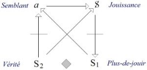
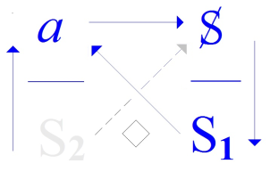
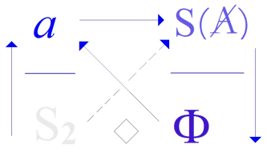
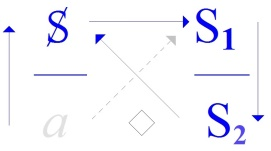
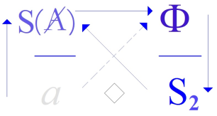
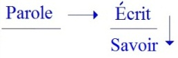
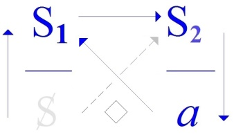
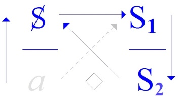

# Leçon 04 | 09 Janvier 1973

  

    <label><input type="checkbox" data-lacan-toggle="original" checked> 原文</label>
    <label><input type="checkbox" data-lacan-toggle="notes" checked> 注释</label>
    <label><input type="checkbox" data-lacan-toggle="commentary" checked> 个人解读评论</label>
  

  <form class="lacan-tool-search" role="search">
    <input class="lacan-tool-search-input" type="search" placeholder="搜索全文" aria-label="搜索全文">
    <button class="lacan-tool-button" type="submit" title="搜索">搜索</button>
  </form>
  <button class="lacan-tool-button lacan-back-to-top" type="button" title="回到页面最上方" aria-label="回到页面最上方">↑</button>

<section class="parallel-paragraph" data-paragraph-ids="s20-04-0001">

s20-04-0001

原文 · s20-04-0001

Bon, ben je vais vous souhaiter la bonne année. C’est pas encore tout à fait l’heure...

[无对应译文]

</section>

<section class="parallel-paragraph" data-paragraph-ids="s20-04-0002">

s20-04-0002

原文 · s20-04-0002

Je vais me passer de commentaires à propos de ces... de ces vœux qu’après tout on peut considérer comme vagues.

[无对应译文]

</section>

<section class="parallel-paragraph" data-paragraph-ids="s20-04-0003">

s20-04-0003

原文 · s20-04-0003

Et puis je vais entrer tout doucement dans ce que je vous ai réservé pour aujourd’hui, qui est à mes risques, qui comme vous allez le voir, ou peut-être ne pas le voir - qui sait ? - en tout cas, moi, avant de commencer, il me parait casse-gueule.

[无对应译文]

</section>

<section class="parallel-paragraph" data-paragraph-ids="s20-04-0004">

s20-04-0004

原文 · s20-04-0004

Pour mettre un titre comme ça, ce que je vais vous dire va être centré, puisqu’en somme

[无对应译文]

</section>

<section class="parallel-paragraph" data-paragraph-ids="s20-04-0005">

s20-04-0005

原文 · s20-04-0005

- il s’agit encore de quelque chose qui est *le discours analytique,*

[无对应译文]

</section>

<section class="parallel-paragraph" data-paragraph-ids="s20-04-0006">

s20-04-0006

原文 · s20-04-0006

- il s’agit de la façon dont, dans ce discours, nous avons à situer *la fonction de l’écrit*.

[无对应译文]

</section>

<section class="parallel-paragraph" data-paragraph-ids="s20-04-0007">

s20-04-0007

原文 · s20-04-0007

Évidemment y’a là-dedans de l’anecdote, à savoir qu’un jour j’ai écrit sur la page d’un recueil que je sortais...

[无对应译文]

</section>

<section class="parallel-paragraph" data-paragraph-ids="s20-04-0008">

s20-04-0008

原文 · s20-04-0008

> ce que j’ai appelé « *la poubellication* » ...j’ai pas trouvé mieux à écrire, sur la page d’enveloppe de ce recueil, que le mot « *Écrits »*.

[无对应译文]

</section>

<section class="parallel-paragraph" data-paragraph-ids="s20-04-0009">

s20-04-0009

原文 · s20-04-0009

Ces « *Écrits »* il est assez connu - disons - qu’ils ne se lisent pas facilement.

[无对应译文]

</section>

<section class="parallel-paragraph" data-paragraph-ids="s20-04-0010">

s20-04-0010

原文 · s20-04-0010

Je peux vous faire, comme ça, un petit aveu autobiographique : c’est qu’en écrivant « *Écrits »,* c’est très précisément ce que je pensais.

[无对应译文]

</section>

<section class="parallel-paragraph" data-paragraph-ids="s20-04-0011">

s20-04-0011

原文 · s20-04-0011

Ça va peut-être même jusque-là : que j’ai pensé *qu’ils n’étaient pas à lire*. En tout cas c’est un bon départ.

[无对应译文]

</section>

<section class="parallel-paragraph" data-paragraph-ids="s20-04-0012">

s20-04-0012

原文 · s20-04-0012

Bien entendu que « *la lettre ça se lit »*.

[无对应译文]

</section>

<section class="parallel-paragraph" data-paragraph-ids="s20-04-0013">

s20-04-0013

原文 · s20-04-0013

Ça semble même être fait comme ça dans le prolongement du mot : « *se lit* » et « *littéralement* ».

[无对应译文]

</section>

<section class="parallel-paragraph" data-paragraph-ids="s20-04-0014">

s20-04-0014

原文 · s20-04-0014

Mais justement ce n’est peut-être pas du tout la même chose de *« lire une lettre »* ou bien de *« lire ».*

[无对应译文]

</section>

<section class="parallel-paragraph" data-paragraph-ids="s20-04-0015">

s20-04-0015

原文 · s20-04-0015

Pour introduire ça d’une façon qui fasse image, je vais pas partir tout de suite du discours analytique.

[无对应译文]

</section>

<section class="parallel-paragraph" data-paragraph-ids="s20-04-0016">

s20-04-0016

原文 · s20-04-0016

Il est bien évident pourtant que dans le discours analytique il ne s’agit que de ça, *de ce qui se lit,* *de ce qui se lit* *au-delà* de ce que vous avez incité le sujet à *dire*, qui est...

[无对应译文]

</section>

<section class="parallel-paragraph" data-paragraph-ids="s20-04-0017">

s20-04-0017

原文 · s20-04-0017

> comme je l’ai souligné, je pense, au passage, la dernière fois ...qui est pas tellement de tout dire, que de dire n’importe quoi, et j’ai poussé la chose plus loin : ne pas hésiter, car c’est la règle, ne pas hésiter à dire...

[无对应译文]

</section>

<section class="parallel-paragraph" data-paragraph-ids="s20-04-0018">

s20-04-0018

原文 · s20-04-0018

> ce dont j’ai introduit cette année la *dit-mension* comme étant *essentielle au discours analytique* ...à *dire des* *bêtises*. \[**S1** « *hors-sens *», « *non-sens *», « *nonsense* »...\]

[无对应译文]

</section>

<section class="parallel-paragraph" data-paragraph-ids="s20-04-0019">

s20-04-0019

原文 · s20-04-0019

[无对应译文]

</section>

<section class="parallel-paragraph" data-paragraph-ids="s20-04-0020">

s20-04-0020

原文 · s20-04-0020

> *Discours analytique*

[无对应译文]

</section>

<section class="parallel-paragraph" data-paragraph-ids="s20-04-0021">

s20-04-0021

原文 · s20-04-0021

Naturellement, ça suppose que nous développions cette *dit-mension*, et ceci ne peut pas se faire sans le *dire*.

[无对应译文]

</section>

<section class="parallel-paragraph" data-paragraph-ids="s20-04-0022">

s20-04-0022

原文 · s20-04-0022

Qu’est-ce que c’est que *la dit-mension de la bêtise* ?

[无对应译文]

</section>

<section class="parallel-paragraph" data-paragraph-ids="s20-04-0023">

s20-04-0023

原文 · s20-04-0023

*La bêtise*, au moins celle-ci qu’on peut proférer, c’est que la bêtise ne va pas loin : dans le discours, le discours courant, elle tourne court.

[无对应译文]

</section>

<section class="parallel-paragraph" data-paragraph-ids="s20-04-0024">

s20-04-0024

原文 · s20-04-0024

C’est bien sûr ce quelque chose dont, si je puis dire, je m’assure quand je fais cette chose que je ne fais jamais sans tremblement, à savoir de retourner à ce que - dans le temps - j’ai proféré.

[无对应译文]

</section>

<section class="parallel-paragraph" data-paragraph-ids="s20-04-0025">

s20-04-0025

原文 · s20-04-0025

Ça me fait toujours une sainte peur, la peur justement d’avoir dit des *bêtises*, c’est-à-dire *quelque chose* que, en raison de ce que j’avance maintenant, je pourrais considérer comme *ne tenant pas le coup.*

[无对应译文]

</section>

<section class="parallel-paragraph" data-paragraph-ids="s20-04-0026">

s20-04-0026

原文 · s20-04-0026

Grâce à quelqu’un qui a repris ce séminaire annoncé, le 1er de l’École Normale qui va sortir bientôt[^35], j’ai pu avoir...

[无对应译文]

</section>

<section class="parallel-paragraph" data-paragraph-ids="s20-04-0027">

s20-04-0027

原文 · s20-04-0027

> ce qui ne m’est pas souvent réservé puisque comme je vous le dis j’en évite moi-même le risque ...j’ai pu avoir le sentiment...

[无对应译文]

</section>

<section class="parallel-paragraph" data-paragraph-ids="s20-04-0028">

s20-04-0028

原文 · s20-04-0028

> que je rencontre quelquefois à l’épreuve ...que ce que dans cette année là par exemple j’ai avancé, n’était pas si bête, ne l’était pas moins, tant que de m’avoir permis d’avancer d’autres choses, dont il me semble, parce que j’y suis maintenant, qu’elles se tiennent.

[无对应译文]

</section>

<section class="parallel-paragraph" data-paragraph-ids="s20-04-0029">

s20-04-0029

原文 · s20-04-0029

Il n’en reste pas moins que ce *« se relire »* représente une *dit-mension,* une *dit-mension* qui est à situer proprement dans ce que c’est que - au regard du *discours analytique* - *la fonction de ce qui se lit.*

[无对应译文]

</section>

<section class="parallel-paragraph" data-paragraph-ids="s20-04-0030">

s20-04-0030

原文 · s20-04-0030

Le discours analytique a à cet égard un privilège : il paraît difficile.

[无对应译文]

</section>

<section class="parallel-paragraph" data-paragraph-ids="s20-04-0031">

s20-04-0031

原文 · s20-04-0031

Et c’est de là que je suis parti, dans ce qui m’a fait date, « *de ce que j’enseigne* », comme je me suis exprimé, qui ne veut peut-être pas tout à fait dire ce que ça avait l’air d’énoncer, à savoir qui mette l’accent sur le « *je* », à savoir ce que je puis proférer, mais peut-être aussi de mettre l’accent sur le « *de* », c’est-à-dire *d’où ça vient*, un enseignement dont je suis l’effet.

[无对应译文]

</section>

<section class="parallel-paragraph" data-paragraph-ids="s20-04-0032">

s20-04-0032

原文 · s20-04-0032

Depuis, j’ai mis l’accent sur ce que j’ai fondé d’une articulation précise, celle qui *s’écrit* justement, *s’écrit* au tableau

[无对应译文]

</section>

<section class="parallel-paragraph" data-paragraph-ids="s20-04-0033">

s20-04-0033

原文 · s20-04-0033

- de 4 *lettres*,

[无对应译文]

</section>

<section class="parallel-paragraph" data-paragraph-ids="s20-04-0034">

s20-04-0034

原文 · s20-04-0034

- de 2 *barres,*

[无对应译文]

</section>

<section class="parallel-paragraph" data-paragraph-ids="s20-04-0035">

s20-04-0035

原文 · s20-04-0035

- et de *quelque traits* - nommément 5 - qui relient chacune de ces lettres.

[无对应译文]

</section>

<section class="parallel-paragraph" data-paragraph-ids="s20-04-0036">

s20-04-0036

原文 · s20-04-0036

Une de ces barres \[*traits*\]...

[无对应译文]

</section>

<section class="parallel-paragraph" data-paragraph-ids="s20-04-0037">

s20-04-0037

原文 · s20-04-0037

> puisqu’il y en a 4 \[*lettres*\], il devrait y en avoir 6: 6 barres \[*traits*\] ...une de ces barres y manque \[◊\].

[无对应译文]

</section>

<section class="parallel-paragraph" data-paragraph-ids="s20-04-0038">

s20-04-0038

原文 · s20-04-0038

 

[无对应译文]

</section>

<section class="parallel-paragraph" data-paragraph-ids="s20-04-0039">

s20-04-0039

原文 · s20-04-0039

Ce qui, de cette façon de s’écrire que j’appelle *« discours analytique »,* ceci est partie d’un rappel, d’un rappel initial, d’un rappel premier : c’est à savoir que le discours analytique est ce mode de rapport nouveau qui s’est fondé seulement de ce qui fonctionne comme *parole*, et ce dans quelque chose qu’on peut définir comme *un champ*, « *Fonction et champ...* ai-je écrit justement, ...*de la parole et du langage...* j’ai terminé : *en psy­chanalyse. »*[^36] \[*la fonction de la parole dans le discours analytique mène à la production de* S1, *de signifiants de la « bêtise », porteurs d’aucun message, d’aucun signifié, d’aucun sens,* *mais c’est dans leurs « non-sens », ceux du symptôme, du lapsus, du rêve... que se trouvent leurs significations de jouissance *→ *dans une écriture à déchiffrer.*

[无对应译文]

</section>

<section class="parallel-paragraph" data-paragraph-ids="s20-04-0040">

s20-04-0040

原文 · s20-04-0040

*La fonction du langage renvoie à la linguistique, au couplage signifiant-signifié, avec le signifiant comme support du trait distinctif (phonème), et le signifié comme message.*\]

[无对应译文]

</section>

<section class="parallel-paragraph" data-paragraph-ids="s20-04-0041">

s20-04-0041

原文 · s20-04-0041

Ce qui était désigner... désigner ce qui fait l’originalité d’un certain *discours* \[**A**\] qui n’est pas *homogène* à un certain nombre d’autres \[*discours* **H**,**U**,**M**\] qui *font office* [^37], et que seulement de ce fait nous allons distinguer d’être *discours officiels*.

[无对应译文]

</section>

<section class="parallel-paragraph" data-paragraph-ids="s20-04-0042">

s20-04-0042

原文 · s20-04-0042

\[*les discours* **H**,**U**,**M** « *font office », « tiennent lieu » d’un rapport sexuel seulement « possible » limité à la jouissance phallique,* *à la place, au lieu de « la faille » (impossibilité du rapport sexuel) qu’ils tentent de combler*\]

[无对应译文]

</section>

<section class="parallel-paragraph" data-paragraph-ids="s20-04-0043">

s20-04-0043

原文 · s20-04-0043

Il s’agit jusqu’à un certain point de discerner quel est l’*office* du discours analytique, et de le rendre lui aussi, sinon officiel, du moins *officiant*.

[无对应译文]

</section>

<section class="parallel-paragraph" data-paragraph-ids="s20-04-0044">

s20-04-0044

原文 · s20-04-0044

C’est dans ce discours, tel qu’il est dans sa fonction et son office, qu’il s’agit *d’y cerner...*

[无对应译文]

</section>

<section class="parallel-paragraph" data-paragraph-ids="s20-04-0045">

s20-04-0045

原文 · s20-04-0045

> c’est aujourd’hui la voie que je prends *...*ce que peut ce discours révèler de la situation très particulière de *<u>l’écrit</u>* quant à ce qui est *du langage*.

[无对应译文]

</section>

<section class="parallel-paragraph" data-paragraph-ids="s20-04-0046">

s20-04-0046

原文 · s20-04-0046

C’est une question qui est très à l’ordre du jour, si je puis m’exprimer ainsi.

[无对应译文]

</section>

<section class="parallel-paragraph" data-paragraph-ids="s20-04-0047">

s20-04-0047

原文 · s20-04-0047

Néanmoins ça n’est pas à cette pointe d’actualité que je voudrais tout de suite en venir.

[无对应译文]

</section>

<section class="parallel-paragraph" data-paragraph-ids="s20-04-0048">

s20-04-0048

原文 · s20-04-0048

J’entends particulièrement préciser quelle peut être, si elle est spécifique, quelle peut être la fonction de l’écrit dans le discours analytique.

[无对应译文]

</section>

<section class="parallel-paragraph" data-paragraph-ids="s20-04-0049">

s20-04-0049

原文 · s20-04-0049

Chacun sait que j’ai produit, avancé, l’usage...

[无对应译文]

</section>

<section class="parallel-paragraph" data-paragraph-ids="s20-04-0050">

s20-04-0050

原文 · s20-04-0050

pour permettre d’expliquer *les fonctions de ce discours* \[*fonction de la parole et fonction du langage dans leur rapport à la fonction de l’écrit*\] ...d’un certain nombre de lettres.

[无对应译文]

</section>

<section class="parallel-paragraph" data-paragraph-ids="s20-04-0051">

s20-04-0051

原文 · s20-04-0051

Très nommément pour les réécrire, les réécrire au tableau :

[无对应译文]

</section>

<section class="parallel-paragraph" data-paragraph-ids="s20-04-0052">

s20-04-0052

原文 · s20-04-0052

- le *a* que j’appelle *« objet »*, mais qui quand même, *n’est rien qu’une lettre*,

[无对应译文]

</section>

<section class="parallel-paragraph" data-paragraph-ids="s20-04-0053">

s20-04-0053

原文 · s20-04-0053

- le A que je fais fonctionner dans ce qui, de la proposition, n’a pris que formule écrite, est production de *la logico­-mathématique* ou de *la mathématico-logique* comme vous voudrez l’énoncer.

[无对应译文]

</section>

<section class="parallel-paragraph" data-paragraph-ids="s20-04-0054">

s20-04-0054

原文 · s20-04-0054

Ce A je n’en ai pas fait n’importe quoi, j’en désigne ce qui d’abord est un lieu, une place, j’ai dit : le lieu de l’Autre, comme tel désigné par *une lettre*.

[无对应译文]

</section>

<section class="parallel-paragraph" data-paragraph-ids="s20-04-0055">

s20-04-0055

原文 · s20-04-0055

En quoi [*une let**tre*](#Retour_bourbaki) peut-elle servir à désigner un lieu ?

[无对应译文]

</section>

<section class="parallel-paragraph" data-paragraph-ids="s20-04-0056">

s20-04-0056

原文 · s20-04-0056

Il est clair qu’il y a là quelque chose d’abusif et que quand vous ouvrez par exemple la 1ère page de ce qui a été enfin réuni sous la forme d’une édition définitive sous le titre de « *la théorie des ensembles »,* et sous le chef d’auteurs fictifs qui se dénomment du nom de Nicolas Bourbaki, ce que vous voyez c’est la mise en jeu d’un certain nombre de signes logiques.

[无对应译文]

</section>

<section class="parallel-paragraph" data-paragraph-ids="s20-04-0057">

s20-04-0057

原文 · s20-04-0057

Ces signes logiques précisément désignent, en particulier l’un d’entre eux, la fonction « *place* » comme telle.

[无对应译文]

</section>

<section class="parallel-paragraph" data-paragraph-ids="s20-04-0058">

s20-04-0058

原文 · s20-04-0058

Ce signe logique est désigné à l’écrit par un petit carré : □. Je n’ai donc pas d’abord, à proprement parler, fait un usage strict de la lettre quand j’ai dit que *le lieu de l’Autre* se symbolisait par la lettre A.

[无对应译文]

</section>

<section class="parallel-paragraph" data-paragraph-ids="s20-04-0059">

s20-04-0059

原文 · s20-04-0059

Par contre, je l’ai marqué en le redoublant de ce S qui ici veut dire *signifiant*, signifiant du A en tant qu’il est barré : S(**A**). Par là j’ai articulé dans *l’écrit*, dans *la lettre*, quelque chose qui ajoute une dimension à ce *lieu du* A, et très précisément en montrant *que comme <u>lieu</u> il ne tient pas* :

[无对应译文]

</section>

<section class="parallel-paragraph" data-paragraph-ids="s20-04-0060">

s20-04-0060

原文 · s20-04-0060

- qu’il y a en ce lieu, en ce lieu désigné de *l’Autre*, *une faille, un trou, un lieu de perte* \[→S(**A**) *spécifie la fonction de la parole*\],

[无对应译文]

</section>

<section class="parallel-paragraph" data-paragraph-ids="s20-04-0061">

s20-04-0061

原文 · s20-04-0061

- et c’est précisément de ce qui au niveau de *l’objet(a)* vient fonctionner au regard de cette *perte,* que quelque chose est avancé de tout à fait essentiel à *la fonction du langage.* \[→ *a spécifie la fonction du langage*\]

[无对应译文]

</section>

<section class="parallel-paragraph" data-paragraph-ids="s20-04-0062">

s20-04-0062

原文 · s20-04-0062

J’ai usé aussi de cette lettre : Φ, je parle de ce que j’ai introduit qui fonctionne comme lettre, qui introduit comme telle une dimension nouvelle \[*le* Φ *comme l’au-delà du signifiant asémantique* S1*, en ce que* Φ *s’est écrit*\].

[无对应译文]

</section>

<section class="parallel-paragraph" data-paragraph-ids="s20-04-0063">

s20-04-0063

原文 · s20-04-0063

J’ai utilisé...

[无对应译文]

</section>

<section class="parallel-paragraph" data-paragraph-ids="s20-04-0064">

s20-04-0064

原文 · s20-04-0064

> le distinguant \[*le* Φ\] de la fonction seulement signifiante
>
> qui se promeut dans la théorie analytique jusque-là, du terme du *« phallus »* ...j’ai avancé Φ comme constituant quelque chose d’original, quelque chose que je spécifie ici aujourd’hui :

[无对应译文]

</section>

<section class="parallel-paragraph" data-paragraph-ids="s20-04-0065">

s20-04-0065

原文 · s20-04-0065

- d’être précisé dans son relief par *l’écrit même*. \[→ Φ *spécifie la fonction de l’écrit*\]

[无对应译文]

</section>

<section class="parallel-paragraph" data-paragraph-ids="s20-04-0066">

s20-04-0066

原文 · s20-04-0066

 →  

[无对应译文]

</section>

<section class="parallel-paragraph" data-paragraph-ids="s20-04-0067">

s20-04-0067

原文 · s20-04-0067

\[*le trajet du discours* A *décrit, « répète » un trajet fondateur : d’une jouissance de l’Autre qui a laissé un trace, qui s’est inscrite, qui s’est écrite en* Φ : *le sujet emprunte au langage (*: *a inter-dit) et engage son corps dans une parole, pour tenter de « combler » la faille* *de l’Autre (*S(A) *) et re-suciter quelque chose qui s’écrive,* *mais la fonction de la parole n’amène l’analysant qu’à produire des « essaims » de* S1, *signifiants asémantiques (qui - au-delà - désignent* Φ) *impuissants à rejoindre* S2, → *sans nouvelle jouissance de l’Autre* → *sans nouvelle écriture (*→ *ce qui ne cesse pas de ne pas s’écrire)* → *changements de discours, puis nouvelle impuissance*→ *ronde des discours*\]

[无对应译文]

</section>

<section class="parallel-paragraph" data-paragraph-ids="s20-04-0068">

s20-04-0068

原文 · s20-04-0068

C’est *une lettre* \[Φ\] dont la fonction se distingue des autres, c’est d’ailleurs bien pour cela que *ces trois lettres sont différentes* : elles n’ont pas la même fonction, comme déjà vous pouvez l’avoir senti de ce que j’ai d’abord énoncé S(**A**) et du *a*.

[无对应译文]

</section>

<section class="parallel-paragraph" data-paragraph-ids="s20-04-0069">

s20-04-0069

原文 · s20-04-0069

Elle est \[Φ\] d’une fonction différente et pourtant elle reste une lettre.

[无对应译文]

</section>

<section class="parallel-paragraph" data-paragraph-ids="s20-04-0070">

s20-04-0070

原文 · s20-04-0070

C’est très précisément de montrer le rapport, que de ce que ces lettres introduisent dans la fonction du signifiant, qu’il s’agit aujourd’hui de discerner ce que nous pouvons - à reprendre le fil du *discours analytique* - en avancer.

[无对应译文]

</section>

<section class="parallel-paragraph" data-paragraph-ids="s20-04-0071">

s20-04-0071

原文 · s20-04-0071

- \[*a <u>comme lettre</u> spécifie la fonction du langage(*→ *le fantasme),*

[无对应译文]

</section>

<section class="parallel-paragraph" data-paragraph-ids="s20-04-0072">

s20-04-0072

原文 · s20-04-0072

- S(**A**) *<u>comme lettre</u> spécifie la fonction de la parole (*→ *jouissance de l’Autre)*,

[无对应译文]

</section>

<section class="parallel-paragraph" data-paragraph-ids="s20-04-0073">

s20-04-0073

原文 · s20-04-0073

- Φ *<u>comme lettre</u> spécifie la fonction de l’écrit (*→ *ce qui cesse de ne pas s’écrire)*\]

[无对应译文]

</section>

<section class="parallel-paragraph" data-paragraph-ids="s20-04-0074">

s20-04-0074

原文 · s20-04-0074

Je propose... je propose ceci, c’est que vous considériez *<u>l’écrit</u> comme n’étant nullement du même registre*, du même tabac...

[无对应译文]

</section>

<section class="parallel-paragraph" data-paragraph-ids="s20-04-0075">

s20-04-0075

原文 · s20-04-0075

> si vous me permettez cette sorte d’expressions qui peuvent avoir bien leur utilité, ...que ce qu’on appelle *« le signifiant »*.

[无对应译文]

</section>

<section class="parallel-paragraph" data-paragraph-ids="s20-04-0076">

s20-04-0076

原文 · s20-04-0076

*Le signifiant* c’est une dimension qui a été introduite de la linguistique, c’est-à-dire de quelque chose qui dans le champ où se produit *la parole*, ne va pas de soi : un discours le soutient, qui est *le discours scientifique*.

[无对应译文]

</section>

<section class="parallel-paragraph" data-paragraph-ids="s20-04-0077">

s20-04-0077

原文 · s20-04-0077

 →  

[无对应译文]

</section>

<section class="parallel-paragraph" data-paragraph-ids="s20-04-0078">

s20-04-0078

原文 · s20-04-0078

Un certain ordre de dissociation, de division, est introduit par la linguistique, grâce à quoi se fonde la distinction de ce qui semble pourtant aller de soi, c’est que quand on parle ça *signifie*, ça comporte le *signifié.*

[无对应译文]

</section>

<section class="parallel-paragraph" data-paragraph-ids="s20-04-0079">

s20-04-0079

原文 · s20-04-0079

Bien plus, jusqu’à un certain point ça ne se supporte que de la fonction de *signification*.

[无对应译文]

</section>

<section class="parallel-paragraph" data-paragraph-ids="s20-04-0080">

s20-04-0080

原文 · s20-04-0080

\[*Le « signifiant de la linguistique » est toujours là pour signifier un message, pour traduire une « pensée » → très différent du « signifiant sans signifié » du discours* A.

[无对应译文]

</section>

<section class="parallel-paragraph" data-paragraph-ids="s20-04-0081">

s20-04-0081

原文 · s20-04-0081

*Le « signifiant de la linguistique » relève du discours* H *(scientifique) : il produit un savoir de certitude* (S1/S2 *contingent*)*, mais pour cela il doit se couper de sa Vérité : a*\]

[无对应译文]

</section>

<section class="parallel-paragraph" data-paragraph-ids="s20-04-0082">

s20-04-0082

原文 · s20-04-0082

Introduire, distinguer la dimension du signifiant, c’est quelque chose qui ne prend relief précisément que de poser que le *signifiant comme tel,* très précisément *ce que vous entendez*...

[无对应译文]

</section>

<section class="parallel-paragraph" data-paragraph-ids="s20-04-0083">

s20-04-0083

原文 · s20-04-0083

> au sens je dirai littéralement *auditif* du terme \[*phonologique*\],
>
> au moment ou ici, et là où je suis... de là où je suis, je vous parle \[*cf.* « *Je parle avec mon corps* »\] ...c’est poser très précisément ceci, mais par un acte original, *que ce que vous entendez* a avec ce que ça signifie... *n’a avec ce que ça signifie aucun rapport.* \[*dans ce discours l’univocité du signifié exclut ce que la parole pourrait véhiculer d’autre que l’« information »,* → *exclut* *a* (*discours* *scientifique *: S *→* S1 *→* S2 ◊ *a*)\]

[无对应译文]

</section>

<section class="parallel-paragraph" data-paragraph-ids="s20-04-0084">

s20-04-0084

原文 · s20-04-0084

C’est là un *acte* qui ne s’institue que d’un discours dit « *discours scientifique »*. Cela ne va pas de soi.

[无对应译文]

</section>

<section class="parallel-paragraph" data-paragraph-ids="s20-04-0085">

s20-04-0085

原文 · s20-04-0085

Et ça va même tellement peu de soi que ce que vous voyez sortir d’un dialogue qui n’est pas d’une mauvaise plume puisque c’est le « *Cratyle »* du nommé Platon, ça va tellement peu de soi que tout ce discours est fait de l’effort de faire que justement ce *rapport*, ce rapport qui fait que ce qui sénonce c’est fait pour *signifier* et que ça doit bien avoir quelque rapport... tout ce dialogue est *tentative*...

[无对应译文]

</section>

<section class="parallel-paragraph" data-paragraph-ids="s20-04-0086">

s20-04-0086

原文 · s20-04-0086

> que nous pouvons dire, d’où nous sommes, être *désespérée* ...pour faire que ce signifiant, de soi-même, soit présumé *vouloir dire quelque chose*. \[*le signifiant, parce qu’il « ressemble » au monde, permet de signifier le monde : ils ont une forme commune.*

[无对应译文]

</section>

<section class="parallel-paragraph" data-paragraph-ids="s20-04-0087">

s20-04-0087

原文 · s20-04-0087

*Ceci dans une vision cosmologique où le monde humain serait une sorte de modèle réduit et impermanent, d’un monde plus vaste et éternel*\]

[无对应译文]

</section>

<section class="parallel-paragraph" data-paragraph-ids="s20-04-0088">

s20-04-0088

原文 · s20-04-0088

Cette tentative désespérée est d’ailleurs marquée de l’échec puisque c’est d’un autre discours...

[无对应译文]

</section>

<section class="parallel-paragraph" data-paragraph-ids="s20-04-0089">

s20-04-0089

原文 · s20-04-0089

> mais d’un discours qui comporte sa dimension originale : *discours scientifique* ...qu’il se promeut, qu’il se produit...

[无对应译文]

</section>

<section class="parallel-paragraph" data-paragraph-ids="s20-04-0090">

s20-04-0090

原文 · s20-04-0090

> et d’une façon, si je puis dire, dont il n’y a pas à chercher l’histoire ...qu’il se produit, de l’instauration même de ce discours \[*scientifique*\], que le signifiant ne se pose que d’avoir aucun rapport.

[无对应译文]

</section>

<section class="parallel-paragraph" data-paragraph-ids="s20-04-0091">

s20-04-0091

原文 · s20-04-0091

Les termes là, dont on use, sont toujours eux-mêmes glissants.

[无对应译文]

</section>

<section class="parallel-paragraph" data-paragraph-ids="s20-04-0092">

s20-04-0092

原文 · s20-04-0092

Même un linguiste aussi pertinent que peut l’être... qu’a pu l’être Ferdinand de Saussure, parle d’« *arbitraire »*.

[无对应译文]

</section>

<section class="parallel-paragraph" data-paragraph-ids="s20-04-0093">

s20-04-0093

原文 · s20-04-0093

Mais c’est là glissement, glissement dans un autre discours, le discours du décret, ou pour mieux dire *le discours du maître* pour l’appe­ler par son nom. L’*« arbitraire »* n’est pas ce qui convient.

[无对应译文]

</section>

<section class="parallel-paragraph" data-paragraph-ids="s20-04-0094">

s20-04-0094

原文 · s20-04-0094

\[*« <u>n’avoir aucun rapport</u> » n’implique en rien que le rapport soit arbitraire.*

[无对应译文]

</section>

<section class="parallel-paragraph" data-paragraph-ids="s20-04-0095">

s20-04-0095

原文 · s20-04-0095

*Ferdinand de Saussure glisse du discours scientifique *: *« aucun rapport » au discours du maître *: *« le rapport relève de l’arbitraire du maître ».*

[无对应译文]

</section>

<section class="parallel-paragraph" data-paragraph-ids="s20-04-0096">

s20-04-0096

原文 · s20-04-0096

*(malgré lui ? → cf. les 99 cahiers d’anagrammes et de mythographies que Saussure produit, avant et pendant le « Cours de Linguistique Générale »)* \].

[无对应译文]

</section>

<section class="parallel-paragraph" data-paragraph-ids="s20-04-0097">

s20-04-0097

原文 · s20-04-0097

Mais d’un autre coté nous devons toujours faire attention quand nous développons un discours, si nous voulons rester dans son champ même, et ne pas perpétuellement produire ces effets de *rechute,* si je puis dire, dans un autre discours, nous devons tenter de donner à chaque discours sa *consistance*, et pour maintenir sa *consistance* n’en sortir qu’à bon escient.

[无对应译文]

</section>

<section class="parallel-paragraph" data-paragraph-ids="s20-04-0098">

s20-04-0098

原文 · s20-04-0098

Dire que *« le signifiant est arbitraire »* n’a pas la même portée, que de dire simplement que* le signifiant n’a pas de rapport avec son effet de signifié*.

[无对应译文]

</section>

<section class="parallel-paragraph" data-paragraph-ids="s20-04-0099">

s20-04-0099

原文 · s20-04-0099

C’est ainsi qu’à chaque instant...

[无对应译文]

</section>

<section class="parallel-paragraph" data-paragraph-ids="s20-04-0100">

s20-04-0100

原文 · s20-04-0100

> et plus que jamais dans le cas où il s’agit d’avancer comme *fonction,* ce qu’est un *discours* ...nous devons au moins à chaque fois, à chaque instant, noter ce en quoi nous glissons dans une autre *référence*.

[无对应译文]

</section>

<section class="parallel-paragraph" data-paragraph-ids="s20-04-0101">

s20-04-0101

原文 · s20-04-0101

Le mot *référence* en l’occasion ne pouvant se situer que de ce que constitue comme *lien* le discours comme tel.

[无对应译文]

</section>

<section class="parallel-paragraph" data-paragraph-ids="s20-04-0102">

s20-04-0102

原文 · s20-04-0102

Il n’y a rien à quoi le signifiant comme tel se réfère, si ce n’est à un *discours*, à un mode de fonctionnement du langage, à une utilisation - comme *lien* - du langage \[*fonction phallique*\].

[无对应译文]

</section>

<section class="parallel-paragraph" data-paragraph-ids="s20-04-0103">

s20-04-0103

原文 · s20-04-0103

Encore faut-il préciser à cette occasion ce que veut dire, ce que veut dire « *le lien » *: l*e lien*...

[无对应译文]

</section>

<section class="parallel-paragraph" data-paragraph-ids="s20-04-0104">

s20-04-0104

原文 · s20-04-0104

> bien sûr nous ne pouvons qu’y glisser immédiatement ...c’est *un lien entre ceux qui parlent* \[*chacun des quatre discours* : H, U, M, A, *crée un type de lien*\].

[无对应译文]

</section>

<section class="parallel-paragraph" data-paragraph-ids="s20-04-0105">

s20-04-0105

原文 · s20-04-0105

Et vous voyez tout de suite où nous allons, à savoir que « *ceux qui parlent »*, bien sûr ce n’est pas n’importe qui, *ce sont des êtres* que nous sommes habitués à qualifier de *vivants*, et peut-être est-il très difficile d’exclure de *ceux qui parlent*, cette dimension qui est celle de la vie, à moins que nous ne nous apercevions aussitôt - ce qui se touche du doigt - que dans le champ de « *ceux qui parlent »*, il nous est très difficile de faire entrer *la fonction de la vie* sans faire en même temps entrer *la fonction de la mort*, et que de là résulte une ambiguïté signifiante justement, qui est tout à fait radicale, de ce qui peut être avancé comme étant *fonction de vie* ou bien *de mort*.

[无对应译文]

</section>

<section class="parallel-paragraph" data-paragraph-ids="s20-04-0106">

s20-04-0106

原文 · s20-04-0106

\[→ *de « ceux qui parlent » peut-on exclure la dimension du vivant ?*

[无对应译文]

</section>

<section class="parallel-paragraph" data-paragraph-ids="s20-04-0107">

s20-04-0107

原文 · s20-04-0107

- *Parlent-ils « avec » le langage, (cf. Aristote : « l’homme pense avec son âme ») ?*

[无对应译文]

</section>

<section class="parallel-paragraph" data-paragraph-ids="s20-04-0108">

s20-04-0108

原文 · s20-04-0108

- *Ou sont-ils « parlés par » le langage, → sont-ils la forme transitoire où parle « une forme éternelle »  *?\]

[无对应译文]

</section>

<section class="parallel-paragraph" data-paragraph-ids="s20-04-0109">

s20-04-0109

原文 · s20-04-0109

Il est tout à fait clair que rien ne conduit de façon plus directe à ceci : que le quelque chose d’où seulement la vie peut se définir, à savoir la reproduction d’un corps, cette fonction de reproduction elle-même ne peut s’intituler

[无对应译文]

</section>

<section class="parallel-paragraph" data-paragraph-ids="s20-04-0110">

s20-04-0110

原文 · s20-04-0110

- ni spécialement *de la vie*,

[无对应译文]

</section>

<section class="parallel-paragraph" data-paragraph-ids="s20-04-0111">

s20-04-0111

原文 · s20-04-0111

- ni spécialement *de la mort*, puisque comme telle - en tant que cette reproduction est sexuée - comme telle elle comporte les deux : *vie et mort*. \[*définir la vie comme « la reproduction du corps » ne résout pas la question puisque la reproduction sexuée implique la dimension de la mort : le fait d’être mortel est ce qui détermine la reproduction, seul moyen de pérennité - mais de quoi ? (les « êtres éternels » n’ont pas à se reproduire *: *cf. les débats des « scholastiques » sur le sexe des anges)*\]

[无对应译文]

</section>

<section class="parallel-paragraph" data-paragraph-ids="s20-04-0112">

s20-04-0112

原文 · s20-04-0112

Mais déjà rien qu’à nous avancer dans ce quelque chose qui est déjà dans le fil, dans le courant du discours analytique, nous avons fait ce saut, ce glissement qui s’appelle « *conception du monde* », qui doit bien pourtant être, pour nous, considéré comme ce qu’il y a de plus comique \[*à défaut de cosmique*\], à savoir que nous devons toujours faire très attention que ce terme *conception du monde* *suppose lui-même un tout autre discours* :

[无对应译文]

</section>

<section class="parallel-paragraph" data-paragraph-ids="s20-04-0113">

s20-04-0113

原文 · s20-04-0113

- qu’il est, qu’il fait partie de celui de *la philosophie* \[*→ discours du maître*\],

[无对应译文]

</section>

<section class="parallel-paragraph" data-paragraph-ids="s20-04-0114">

s20-04-0114

原文 · s20-04-0114

- que rien après tout n’est moins assuré, si l’on sort du *discours philosophique,* que *l’existence comme telle d’un monde*,

[无对应译文]

</section>

<section class="parallel-paragraph" data-paragraph-ids="s20-04-0115">

s20-04-0115

原文 · s20-04-0115

- qu’il n’y a souvent que l’occasion, l’occasion de sourire, dans ce qui est avancé par exemple du *discours analytique* comme comportant quelque chose qui soit de l’ordre d’une telle conception. \[*le discours* *analytique, au* S1*, au signifiant privé de sens → en faire « une conception du monde » peut prêter à sourire (sourire d’ange ?)*\]

[无对应译文]

</section>

<section class="parallel-paragraph" data-paragraph-ids="s20-04-0116">

s20-04-0116

原文 · s20-04-0116

Je dirai même plus loin, que jusqu’à un certain point, il mérite aussi qu’on sourie de voir avancer un tel terme pour désigner par exemple disons ce qui s’appelle « *marxisme »*. Le marxisme ne me semble pas...

[无对应译文]

</section>

<section class="parallel-paragraph" data-paragraph-ids="s20-04-0117">

s20-04-0117

原文 · s20-04-0117

> et à quelque examen que ce soit, fut-ce le plus approximatif ...ne peut passer pour *conception du monde*.

[无对应译文]

</section>

<section class="parallel-paragraph" data-paragraph-ids="s20-04-0118">

s20-04-0118

原文 · s20-04-0118

Il est au contraire, par toutes sortes de coordon­nées tout à fait frappantes, de l’énoncé de ce que dit Marx...

[无对应译文]

</section>

<section class="parallel-paragraph" data-paragraph-ids="s20-04-0119">

s20-04-0119

原文 · s20-04-0119

> ce qui ne se confond pas obligatoirement avec *la conception du monde* marxiste ...c’est à proprement parler autre chose, que j’appel­lerai plus formellement un « *Évangile* », à savoir une *annonce* \[*du grec* εὐαγγέλιον (*évangelion*) : *« bonne nouvelle »*\], une *annonce* que quelque chose qui s’appelle l’Histoire, instaure une autre dimension du discours, en d’autres termes la possibilité de subvertir complètement la fonction du discours comme tel, j’entends à proprement parler du *discours philosophique,* en tant que sur lui repose *une conception du monde* \[*celle du discours du maître*\].

[无对应译文]

</section>

<section class="parallel-paragraph" data-paragraph-ids="s20-04-0120">

s20-04-0120

原文 · s20-04-0120

*Le langage* s’avère donc beaucoup plus vaste comme champ, beaucoup plus riche de ressources que d’être simplement celui où puisse s’inscrire un discours qui est celui qui, au cours des temps, s’est instauré du *discours philosophique* \[M\].

[无对应译文]

</section>

<section class="parallel-paragraph" data-paragraph-ids="s20-04-0121">

s20-04-0121

原文 · s20-04-0121

Ce n’est pas parce que il nous est difficile de ne pas du tout en tenir compte...

[无对应译文]

</section>

<section class="parallel-paragraph" data-paragraph-ids="s20-04-0122">

s20-04-0122

原文 · s20-04-0122

> pour autant que de ce discours - *discours philosophique* - certains points de repère sont énoncés
>
> et qui sont difficiles à éliminer complètement de tout usage du langage ...ce n’est pas à cause de cela que nous devons à tout prix nous en passer, à condition de nous apercevoir qu’il n’y a rien de plus facile que de retomber dans ce que j’ai appelé ironiquement, voire avec la note comique : *conception du monde*, *c’est ce qui a un nom modéré, bien plus précis et qui s’appelle* *l’ontologie*.

[无对应译文]

</section>

<section class="parallel-paragraph" data-paragraph-ids="s20-04-0123">

s20-04-0123

原文 · s20-04-0123

L’ontologie est spécialement ceci qui, d’un certain usage du langage, a mis en valeur, a produit d’une façon accentuée, a produit l’usage dans le langage de *la copule*, d’une façon telle qu’elle ait été en somme *isolée comme signifiant*.

[无对应译文]

</section>

<section class="parallel-paragraph" data-paragraph-ids="s20-04-0124">

s20-04-0124

原文 · s20-04-0124

S’arrêter au verbe « *être »*, ce verbe qui n’est même pas, dans le champ complet de la diversité des langues, d’un usage qu’on puisse qualifier d’universel, le produire comme tel est queque chose qui comporte une *accentuation*, *une accentuation* qui est pleine de risques.

[无对应译文]

</section>

<section class="parallel-paragraph" data-paragraph-ids="s20-04-0125">

s20-04-0125

原文 · s20-04-0125

Pour, si l’on peut dire, la détecter, et même jusqu’à un certain point l’exorciser \[*l’accentuation*\], il suffirait peut-être d’avancer que rien n’oblige...

[无对应译文]

</section>

<section class="parallel-paragraph" data-paragraph-ids="s20-04-0126">

s20-04-0126

原文 · s20-04-0126

> quand on dit que : « quoi que ce soit*, c’est ce que c’est* » ...d’aucune façon ce « *être* » de l’*isoler*, de l’*accentuer*.

[无对应译文]

</section>

<section class="parallel-paragraph" data-paragraph-ids="s20-04-0127">

s20-04-0127

原文 · s20-04-0127

Ça se prononce « *c’est ce que c’est* » et ça pourrait aussi bien s’écrire « *s,e,s,k,e,c,e* », qu’on n’y verrait...

[无对应译文]

</section>

<section class="parallel-paragraph" data-paragraph-ids="s20-04-0128">

s20-04-0128

原文 · s20-04-0128

> à cet usage de la copule ...on n’y verrait, si je puis dire que du feu. On n’y verrait que du feu si un discours, qui est *le discours du maître* \- *discours du maître* qui ici peut aussi bien s’écrire « *m’être* » - ce qui met, ce qui met l’accent sur le verbe « *être* ».

[无对应译文]

</section>

<section class="parallel-paragraph" data-paragraph-ids="s20-04-0129">

s20-04-0129

原文 · s20-04-0129

C’est ce quelque chose qu’Aristote lui-même regarde à deux fois à avancer, puisque pour ce qui est de *l’être,* qu’il oppose au τό τί ἑστι \[to ti esti\], à *la quiddité*, à « *ce que ça est* », il va jusqu’à employer le τό τί ἦν εἶναι \[to ti ên einaï\] à savoir : « *ce qui se serait bien produit, si c’était venu à être tout court, ce qui était à être* » \[*Cf. Aristote livre Zêta des Métaphysiques*\]

[无对应译文]

</section>

<section class="parallel-paragraph" data-paragraph-ids="s20-04-0130">

s20-04-0130

原文 · s20-04-0130

Et il semble que là *le pédicule* se conserve qui nous permette de situer d’où se produit ce *discours de l’être* \[*discours* M\].

[无对应译文]

</section>

<section class="parallel-paragraph" data-paragraph-ids="s20-04-0131">

s20-04-0131

原文 · s20-04-0131

Il est tout simplement celui

[无对应译文]

</section>

<section class="parallel-paragraph" data-paragraph-ids="s20-04-0132">

s20-04-0132

原文 · s20-04-0132

- *de « l’être à la botte »,*

[无对应译文]

</section>

<section class="parallel-paragraph" data-paragraph-ids="s20-04-0133">

s20-04-0133

原文 · s20-04-0133

- *de « l’être aux ordres »,*

[无对应译文]

</section>

<section class="parallel-paragraph" data-paragraph-ids="s20-04-0134">

s20-04-0134

原文 · s20-04-0134

- « *ce qui allait être si tu avais entendu ce que je t’ordonne* ». \[« *être* » ≡ « *être sujet *» ≡ « *assujetti* »\]

[无对应译文]

</section>

<section class="parallel-paragraph" data-paragraph-ids="s20-04-0135">

s20-04-0135

原文 · s20-04-0135

Toute dimension de l’*être* se produit de quelque chose qui est dans le fil, dans le courant du *discours du maître*, de celui qui proférant le signifiant, en attend ce qui est un de ses *effets de lien* assurément à ne pas négliger, qui est fait de ceci : que *le signifiant commande*. *Le signifiant est d’abord*, et de sa dimension, *impératif.*

[无对应译文]

</section>

<section class="parallel-paragraph" data-paragraph-ids="s20-04-0136">

s20-04-0136

原文 · s20-04-0136

\[*l’être se produit comme plus-de-jouir quand* S1 *(signifiant maître) commande à* S2 *(savoir esclave) et qu’en résulte un être (a)* : maître *→ m’être*\]

[无对应译文]

</section>

<section class="parallel-paragraph" data-paragraph-ids="s20-04-0137">

s20-04-0137

原文 · s20-04-0137

[无对应译文]

</section>

<section class="parallel-paragraph" data-paragraph-ids="s20-04-0138">

s20-04-0138

原文 · s20-04-0138

Comment, comment retourner - si ce n’est d’un discours spécial - à ce que je pourrais avancer d’*une réalité pré­discursive* ?

[无对应译文]

</section>

<section class="parallel-paragraph" data-paragraph-ids="s20-04-0139">

s20-04-0139

原文 · s20-04-0139

C’est là ce qui bien entendu est le rêve, le rêve fondateur de toute idée de connaissance, mais ce qui aussi bien est à considérer comme mythi­que : *il n’y a aucune réalité pré-discursive*.

[无对应译文]

</section>

<section class="parallel-paragraph" data-paragraph-ids="s20-04-0140">

s20-04-0140

原文 · s20-04-0140

Chaque réalité se fonde et se définit d’un discours.

[无对应译文]

</section>

<section class="parallel-paragraph" data-paragraph-ids="s20-04-0141">

s20-04-0141

原文 · s20-04-0141

Et c’est bien en cela qu’il importe que nous nous apercevions de quoi est fait le discours analytique, et de ne pas méconnaître ce qui sans doute n’y a qu’une place, une place limitée, à savoir - mon Dieu... - qu’on y parle de ce que le verbe *« foutre » *énonce parfaitement, on y parle de « *foutre »*, je veux dire le verbe *« to fuck »,* n’est-ce pas, et on y dit que « *ça ne va pas* »

[无对应译文]

</section>

<section class="parallel-paragraph" data-paragraph-ids="s20-04-0142">

s20-04-0142

原文 · s20-04-0142

\[C’est une part importante de ce qui se confie dans le discours analytique, et il importe très précisément de souligner que ce n’est pas son privilège.

[无对应译文]

</section>

<section class="parallel-paragraph" data-paragraph-ids="s20-04-0143">

s20-04-0143

原文 · s20-04-0143

Il est clair que dans ce que j’ai appelé tout à l’heure *le discours courant* et en l’écrivant presque en un seul mot :

[无对应译文]

</section>

<section class="parallel-paragraph" data-paragraph-ids="s20-04-0144">

s20-04-0144

原文 · s20-04-0144

- le *disque*... le « *disque-ourcourant* »,

[无对应译文]

</section>

<section class="parallel-paragraph" data-paragraph-ids="s20-04-0145">

s20-04-0145

原文 · s20-04-0145

- *le disque* aussi hors-champ, hors jeu de tout discours, à savoir *le disque* tout court.

[无对应译文]

</section>

<section class="parallel-paragraph" data-paragraph-ids="s20-04-0146">

s20-04-0146

原文 · s20-04-0146

Dans *le disque* qui est bien après tout l’angle sous lequel nous pouvons considérer tout un champ du langage, celui qui en effet donne bien *sa substance, son étoffe*, à être considérer comme disque, à savoir que ça tourne, et que ça tourne très exactement pour rien, ce disque est exactement ce qui se trouve dans le champ, dans le champ d’où les discours se spécifient, le champ où tout ça se noie, où tout un chacun est capable \- tout aussi capable - de s’en énoncer autant, mais par un souci de ce que nous appellerons à très juste titre *décence*, le fait - mon Dieu... - le moins possible.

[无对应译文]

</section>

<section class="parallel-paragraph" data-paragraph-ids="s20-04-0147">

s20-04-0147

原文 · s20-04-0147

Ce qui fait le fond de la vie en effet, c’est que tout ce qu’il en est des rapports des hommes et des femmes, ce qu’on appelle « collectivité », « *ça ne va pas* ». *« Ça ne va pas »* et tout le monde en parle, et une grande partie de notre activité se passe à le dire.

[无对应译文]

</section>

<section class="parallel-paragraph" data-paragraph-ids="s20-04-0148">

s20-04-0148

原文 · s20-04-0148

Il n’empêche qu’il n’y a rien de sérieux si ce n’est ce qui s’ordonne d’une autre façon comme discours, jusques et y compris ceci : que précisément ce rapport, ce rapport sexuel en tant qu’il « *ne va pas* », il va quand même, grâce à un certain nombre de conventions, d’interdits, d’inhibitions, de toutes sortes de choses

[无对应译文]

</section>

<section class="parallel-paragraph" data-paragraph-ids="s20-04-0149">

s20-04-0149

原文 · s20-04-0149

- qui sont *l’effet du langage*,

[无对应译文]

</section>

<section class="parallel-paragraph" data-paragraph-ids="s20-04-0150">

s20-04-0150

原文 · s20-04-0150

- qui ne sont à prendre que de cette étoffe et de ce registre,

[无对应译文]

</section>

<section class="parallel-paragraph" data-paragraph-ids="s20-04-0151">

s20-04-0151

原文 · s20-04-0151

- et qui se réduisent très précisément à ceci qui tout d’un coup nous fait revenir, nous fait revenir comme il convient, au champ du discours.

[无对应译文]

</section>

<section class="parallel-paragraph" data-paragraph-ids="s20-04-0152">

s20-04-0152

原文 · s20-04-0152

Il n’y a pas la moindre réalité pré-discursive, pour la bonne raison que ce qui fait collectivité, et que j’ai appelé en l’évocant à l’instant « *les hommes, les femmes et les enfants* », ça ne veut très exactement rien dire comme *réalité pré-discursive* : *« les hommes, les femmes et les enfants »*, ce ne sont que des signifiants.

[无对应译文]

</section>

<section class="parallel-paragraph" data-paragraph-ids="s20-04-0153">

s20-04-0153

原文 · s20-04-0153

Un homme ce n’est rien d’autre qu’un signifiant, une femme cherche un homme au titre de signifiant.

[无对应译文]

</section>

<section class="parallel-paragraph" data-paragraph-ids="s20-04-0154">

s20-04-0154

原文 · s20-04-0154

Un homme cherche une femme au titre...

[无对应译文]

</section>

<section class="parallel-paragraph" data-paragraph-ids="s20-04-0155">

s20-04-0155

原文 · s20-04-0155

> ça va paraître curieux \[*Rires*\] ...au titre de *ce qui ne se situe que du discours*, puisque si ce que j’avance est vrai, à savoir que la femme n’est *« pas toute »*, il y a toujours *quelque chose qui chez elle échappe au discours.* \[« *ce qui ne se situe que du discours » <u>et</u> ce « qui chez elle échappe au discours » *: *→ a*\]

[无对应译文]

</section>

<section class="parallel-paragraph" data-paragraph-ids="s20-04-0156">

s20-04-0156

原文 · s20-04-0156

Alors il s’agit de savoir dans tout cela *ce qui dans un discours se produit de l’effet de l’écrit*.

[无对应译文]

</section>

<section class="parallel-paragraph" data-paragraph-ids="s20-04-0157">

s20-04-0157

原文 · s20-04-0157

Vous le savez... Vous le savez peut-être... Vous le savez en tout cas si vous avez lu ce que *j’écris* : le signifiant et le signifié, c’est pas seulement que la linguistique les ait distingués.

[无对应译文]

</section>

<section class="parallel-paragraph" data-paragraph-ids="s20-04-0158">

s20-04-0158

原文 · s20-04-0158

Chose qui peut-être vous paraît aller de soi...

[无对应译文]

</section>

<section class="parallel-paragraph" data-paragraph-ids="s20-04-0159">

s20-04-0159

原文 · s20-04-0159

Mais justement c’est à considérer que les choses vont de soi* *qu’on ne voit rien de ce qu’on a pourtant devant les yeux, et devant les yeux concernant justement *l’écrit*.

[无对应译文]

</section>

<section class="parallel-paragraph" data-paragraph-ids="s20-04-0160">

s20-04-0160

原文 · s20-04-0160

S’il y a quelque chose qui peut nous introduire à la dimen­sion de *l’écrit* comme tel, c’est nous apercevoir que pas plus que le *signifié,* - *pas le signifiant* - n’a affaire avec les oreilles, mais seulement avec *la lecture*, à savoir de *ce qu’on « entend » de signifié*.

[无对应译文]

</section>

<section class="parallel-paragraph" data-paragraph-ids="s20-04-0161">

s20-04-0161

原文 · s20-04-0161

Mais *le signifié* c’est justement pas ce qu’on entend.

[无对应译文]

</section>

<section class="parallel-paragraph" data-paragraph-ids="s20-04-0162">

s20-04-0162

原文 · s20-04-0162

Ce qu’on entend c’est *le signifiant*.

[无对应译文]

</section>

<section class="parallel-paragraph" data-paragraph-ids="s20-04-0163">

s20-04-0163

原文 · s20-04-0163

Et *le signifié* c’est l’effet du signifiant.

[无对应译文]

</section>

<section class="parallel-paragraph" data-paragraph-ids="s20-04-0164">

s20-04-0164

原文 · s20-04-0164

Il y a quelque chose qui n’est que l’effet du discours, l’effet du discours en tant que tel, c’est-à-dire de quelque chose qui fonctionne déjà comme *lien*.

[无对应译文]

</section>

<section class="parallel-paragraph" data-paragraph-ids="s20-04-0165">

s20-04-0165

原文 · s20-04-0165

Eh bien c’est ce quelque chose qui au niveau d’un *écrit*, effet de *dis­cours scientifique* \[*la linguistique* S/*s*\] :

[无对应译文]

</section>

<section class="parallel-paragraph" data-paragraph-ids="s20-04-0166">

s20-04-0166

原文 · s20-04-0166

- du S, fait pour connoter *la place* du *signifiant*,

[无对应译文]

</section>

<section class="parallel-paragraph" data-paragraph-ids="s20-04-0167">

s20-04-0167

原文 · s20-04-0167

- et du *s* dont se connote comme *place* le *signifié,* cette fonction de *place* n’est créée que *par le discours* lui-même : « *chacun à sa place* » *ça ne fonctionne que dans le discours.*

[无对应译文]

</section>

<section class="parallel-paragraph" data-paragraph-ids="s20-04-0168">

s20-04-0168

原文 · s20-04-0168

[无对应译文]

</section>

<section class="parallel-paragraph" data-paragraph-ids="s20-04-0169">

s20-04-0169

原文 · s20-04-0169

Eh bien entre les deux, il y a *la barre* \[S1*/*S2\].

[无对应译文]

</section>

<section class="parallel-paragraph" data-paragraph-ids="s20-04-0170">

s20-04-0170

原文 · s20-04-0170

Et ça n’a l’air de rien quand vous écrivez une barre, faut expliquer.

[无对应译文]

</section>

<section class="parallel-paragraph" data-paragraph-ids="s20-04-0171">

s20-04-0171

原文 · s20-04-0171

Ce mot « *expliquer* » a toute son importance parce que y’a rien moyen de comprendre à une barre, même quand elle est réservée à signifier *la négation* \[/,....\].

[无对应译文]

</section>

<section class="parallel-paragraph" data-paragraph-ids="s20-04-0172">

s20-04-0172

原文 · s20-04-0172

Il est très difficile de comprendre ce que ça veut dire, *la négation*.

[无对应译文]

</section>

<section class="parallel-paragraph" data-paragraph-ids="s20-04-0173">

s20-04-0173

原文 · s20-04-0173

Si on y regarde d’un tout petit peu près, on s’apercevra en particulier que *y’en a une très grande variété de négations*, et *qu’il est tout à fait impossible de réunir toutes les négations sous le même concept *:

[无对应译文]

</section>

<section class="parallel-paragraph" data-paragraph-ids="s20-04-0174">

s20-04-0174

原文 · s20-04-0174

> la négation de *l’existence* \[/\],
>
> ce n’est pas du tout la même chose que la négation de *la totalité* \[.\], pour me limiter à l’usage que j’ai pu faire de la négation.

[无对应译文]

</section>

<section class="parallel-paragraph" data-paragraph-ids="s20-04-0175">

s20-04-0175

原文 · s20-04-0175

Mais il y autre chose qui est en tout cas encore plus certaine, c’est que le fait d’ajouter la barre à la notation S et *s*, qui déjà se distinguent très suffisament, *pourrait* se soutenir d’*être* seulement marqué par *la distance de l’écrit*.

[无对应译文]

</section>

<section class="parallel-paragraph" data-paragraph-ids="s20-04-0176">

s20-04-0176

原文 · s20-04-0176

Y ajouter la barre a quelque chose de superflu, voire de futile, et qu’en tout cas, comme tout ce qui est de l’écrit, comme tout ce qui est de l’écrit ne se supporte que de ceci : *c’est que justement l’écrit ça n’est pas à comprendre* \[*pas de sens*\].

[无对应译文]

</section>

<section class="parallel-paragraph" data-paragraph-ids="s20-04-0177">

s20-04-0177

原文 · s20-04-0177

C’est bien pour ça que vous n’êtes pas forcés de comprendre les miens.

[无对应译文]

</section>

<section class="parallel-paragraph" data-paragraph-ids="s20-04-0178">

s20-04-0178

原文 · s20-04-0178

Si vous ne les comprenez pas c’est un bon signe, tant mieux, ça vous donnera justement l’occasion de les expliquer \[*Rires*\].

[无对应译文]

</section>

<section class="parallel-paragraph" data-paragraph-ids="s20-04-0179">

s20-04-0179

原文 · s20-04-0179

Eh ben la barre c’est pareil.

[无对应译文]

</section>

<section class="parallel-paragraph" data-paragraph-ids="s20-04-0180">

s20-04-0180

原文 · s20-04-0180

La barre c’est très précisément le point où dans tout usage du langage, y’aura occasion à ce que se produise l’*écrit*.

[无对应译文]

</section>

<section class="parallel-paragraph" data-paragraph-ids="s20-04-0181">

s20-04-0181

原文 · s20-04-0181

Si dans Saussure même, S c’est : *barre* au-dessus de *s *\[S/*s*\] , c’est grâce à ça que dans « *L’instance de la lettre... »*, qui fait partie de mes *Écrits* j’ai pu démontrer...

[无对应译文]

</section>

<section class="parallel-paragraph" data-paragraph-ids="s20-04-0182">

s20-04-0182

原文 · s20-04-0182

> d’une façon qui s’*écrit*, rien de plus, n’est-ce pas ...que rien ne se sup­porte des *effets* dits « *de l’inconscient* », si grâce à cette *barre*...

[无对应译文]

</section>

<section class="parallel-paragraph" data-paragraph-ids="s20-04-0183">

s20-04-0183

原文 · s20-04-0183

> s’il n’y avait pas cette barre, rien ne pourrait en être expliqué *...y’a de l’inconsc...* \[*lapsus*\]... y’a du... du signifiant*... y’a du signifiant...*

[无对应译文]

</section>

<section class="parallel-paragraph" data-paragraph-ids="s20-04-0184">

s20-04-0184

原文 · s20-04-0184

> je répète parce que j’ai écourté *...y’a du signifiant qui passe sous la barre*.

[无对应译文]

</section>

<section class="parallel-paragraph" data-paragraph-ids="s20-04-0185">

s20-04-0185

原文 · s20-04-0185

S’il n’y avait pas de barre vous ne pourriez pas voir *qu’il y a du signifiant qui s’injecte dans le signifié* \[*lapsus, oublis*…\].

[无对应译文]

</section>

<section class="parallel-paragraph" data-paragraph-ids="s20-04-0186">

s20-04-0186

原文 · s20-04-0186

Grâce à *l’écrit* se manifeste, se manifeste ceci qui n’est qu’*effet de discours*...

[无对应译文]

</section>

<section class="parallel-paragraph" data-paragraph-ids="s20-04-0187">

s20-04-0187

原文 · s20-04-0187

> car s’il n’y avait pas de *discours analytique*, vous continueriez à parler très exactement comme des étourneaux,
>
> c’est-à-dire à dire ce que je qualifie du *disque-ourcourant*, c’est-à-dire de continuer le disque,
>
> le disque continuant ce quelque chose qui est le point le plus important que révèle le *discours analytique <u>seulemen</u>*<u>t</u> ...c’est à savoir ceci, c’est à savoir ceci qui ne peut s’articuler que grâce à toute la construction du discours analytique : c’est que très précisément, *il n’y a pas*...\[*de rapport sexuel*\]...

[无对应译文]

</section>

<section class="parallel-paragraph" data-paragraph-ids="s20-04-0188">

s20-04-0188

原文 · s20-04-0188

> je reviens là-dessus puisque après tout c’est *la formule* que je vous serine ...mais de vous la seriner, faut-il encore que je l’explique parce qu’elle *ne se sup­porte que de l’écrit* précisément, et de l’écrit en ceci : « *que le rapport sexuel ne peut pas s’écrire* ». C’est ce que ça veut dire.

[无对应译文]

</section>

<section class="parallel-paragraph" data-paragraph-ids="s20-04-0189">

s20-04-0189

原文 · s20-04-0189

Ou plus exactement que tout ce qui est *écrit* est conditionné de façon telle que ça part du fait qu’il sera à jamais *impossible d’écrire* comme tel *le rapport sexuel*.

[无对应译文]

</section>

<section class="parallel-paragraph" data-paragraph-ids="s20-04-0190">

s20-04-0190

原文 · s20-04-0190

Que *l’écriture* comme telle est possible, à savoir qu’il y a un certain effet du discours qui s’appelle *l’écriture*.

[无对应译文]

</section>

<section class="parallel-paragraph" data-paragraph-ids="s20-04-0191">

s20-04-0191

原文 · s20-04-0191

Voyez-vous, on peut à la rigueur écrire  « x R y » et dire : x *c’est l’homme*, y *c’est la femme*, et R *c’est le rapport sexuel* \[*Rires*\].

[无对应译文]

</section>

<section class="parallel-paragraph" data-paragraph-ids="s20-04-0192">

s20-04-0192

原文 · s20-04-0192

Pourquoi pas ? Seulement voilà, c’est ce que je vous disais tout à l’heure : c’est *une bêtise *!

[无对应译文]

</section>

<section class="parallel-paragraph" data-paragraph-ids="s20-04-0193">

s20-04-0193

原文 · s20-04-0193

C’est *une bêtise* parce que ce qui se supporte *sous la fonction de signifiants* de homme et de femme, *ce ne sont que des signifiants,* ce ne sont que des signifiants tout à fait liés à cet usage *courcourant *du langage \[*discours courant* - *disque courcourant*\].

[无对应译文]

</section>

<section class="parallel-paragraph" data-paragraph-ids="s20-04-0194">

s20-04-0194

原文 · s20-04-0194

Et s’il y a un discours qui vous le démontre, c’est que la femme ne sera jamais prise...

[无对应译文]

</section>

<section class="parallel-paragraph" data-paragraph-ids="s20-04-0195">

s20-04-0195

原文 · s20-04-0195

> c’est ce que le discours analytique met en jeu ...que *« quoad matrem »*, c’est-à-dire que « *la femme* » n’entrera en fonction dans le rapport sexuel qu’en tant que *« la mère »*.

[无对应译文]

</section>

<section class="parallel-paragraph" data-paragraph-ids="s20-04-0196">

s20-04-0196

原文 · s20-04-0196

Ça c’est des vérités massives et qui, quand nous y regarderons plus près, bien entendu nous mèneront plus loin.

[无对应译文]

</section>

<section class="parallel-paragraph" data-paragraph-ids="s20-04-0197">

s20-04-0197

原文 · s20-04-0197

Mais grâce à quoi ?

[无对应译文]

</section>

<section class="parallel-paragraph" data-paragraph-ids="s20-04-0198">

s20-04-0198

原文 · s20-04-0198

Grâce à *l’écriture* qui d’ailleurs ne fera pas objection à cette première approxi­mation, puisque justement c’est par là qu’elle montrera que c’est une suppléance de ce *« pas-toute »* sur quoi repose - quoi ? - *la jouissance* de la femme.

[无对应译文]

</section>

<section class="parallel-paragraph" data-paragraph-ids="s20-04-0199">

s20-04-0199

原文 · s20-04-0199

C’est à savoir que cette *jouissance...* *qu’elle n’est pas-toute*, c’est-à-dire qui quelque part la fait *absente d’elle-même*, absente en tant que sujet, qu’elle y trouvera le bouchon de ce (*a*) que sera son enfant.

[无对应译文]

</section>

<section class="parallel-paragraph" data-paragraph-ids="s20-04-0200">

s20-04-0200

原文 · s20-04-0200

Et d’un autre côté, *du côté de x*, à savoir de ce qui serait *l’homme* si ce rapport sexuel pouvait *s’écrire* d’une façon soutenable, soutenable dans un discours, vous verrez que *l’homme n’est qu’un signifiant* parce que là où il entre en jeu comme *signifiant*, il n’y entre que *quoad castrationem,* c’est-à-dire *en tant qu’il a un rapport* - un rapport quelquonque - *avec la jouissance phallique*.

[无对应译文]

</section>

<section class="parallel-paragraph" data-paragraph-ids="s20-04-0201">

s20-04-0201

原文 · s20-04-0201

De sorte que c’est à partir du moment où de quelque part...

[无对应译文]

</section>

<section class="parallel-paragraph" data-paragraph-ids="s20-04-0202">

s20-04-0202

原文 · s20-04-0202

d’un discours qui aborde la question sérieusement : le *discours analytique...*que c’est à partir du moment où ce qui est la condition de *l’écrit,* à savoir qu’il se soutienne d’un discours \[H,U,M,A\], que *tout se dérobera et que le rapport sexuel vous pourrez jamais l’écrire*, naturellement dans la mesure où il s’agit d’un vrai écrit, c’est-à-dire de *l’écrit* en tant que *c’est ce qui du langage se conditionne d’un discours*. *La lettre, radicalement, est effet de discours*.

[无对应译文]

</section>

<section class="parallel-paragraph" data-paragraph-ids="s20-04-0203">

s20-04-0203

原文 · s20-04-0203

Ce qu’il y a de bien...

[无对应译文]

</section>

<section class="parallel-paragraph" data-paragraph-ids="s20-04-0204">

s20-04-0204

原文 · s20-04-0204

> n’est-ce pas, si vous me permettez ...ce qu’il y a de bien dans ce que je raconte, c’est que c’est toujours la même chose \[*Rires*\], c’est à savoir...

[无对应译文]

</section>

<section class="parallel-paragraph" data-paragraph-ids="s20-04-0205">

s20-04-0205

原文 · s20-04-0205

> non pas, bien sûr, que je me répète, c’est pas là la question ...c’est que ce que j’ai dit antérieurement, la première fois, autant que je me souvienne, que j’ai parlé de *la lettre*...

[无对应译文]

</section>

<section class="parallel-paragraph" data-paragraph-ids="s20-04-0206">

s20-04-0206

原文 · s20-04-0206

> j’ai sorti ça je ne sais plus quand, maintenant je vais plus rechercher, je vous dis : j’ai horreur
>
> de me relire, mais il doit bien y avoir 15 ans, quelque part à Sainte-Anne \[*L’identification, séance du 20-12-1961*\] ...j’ai essayé de faire remarquer cette petite chose que tout le monde connaît bien sûr...

[无对应译文]

</section>

<section class="parallel-paragraph" data-paragraph-ids="s20-04-0207">

s20-04-0207

原文 · s20-04-0207

> que tout le monde connaît quand on lit un peu, ce qui n’arrive pas à tout le monde ...qu’un nommé Sir [Flinders Petrie](http://fr.wikipedia.org/wiki/William_Matthew_Flinders_Petrie)[^38] par exemple avait cru remarquer que les lettres de l’alphabet phénicien se trouvaient, bien avant le temps de la Phénicie, sur de menues poteries égyptiennes où elles servaient de marques de fabrique.

[无对应译文]

</section>

<section class="parallel-paragraph" data-paragraph-ids="s20-04-0208">

s20-04-0208

原文 · s20-04-0208

Ce qui veut dire... ce qui veut dire simplement ceci, que le marché...

[无对应译文]

</section>

<section class="parallel-paragraph" data-paragraph-ids="s20-04-0209">

s20-04-0209

原文 · s20-04-0209

> qui est typiquement un *effet de discours* ...c’est là que d’abord est sortie la lettre, avant que quiconque ait songé à user des lettres. Pour faire quoi ?

[无对应译文]

</section>

<section class="parallel-paragraph" data-paragraph-ids="s20-04-0210">

s20-04-0210

原文 · s20-04-0210

Quelque chose qui n’a rien à faire, qui n’a rien à faire avec *la connotation du signifiant*, mais qui l’élabore, qui le perfectionne.

[无对应译文]

</section>

<section class="parallel-paragraph" data-paragraph-ids="s20-04-0211">

s20-04-0211

原文 · s20-04-0211

Il faudrait bien sûr prendre les choses au niveau de l’histoire de chaque langue.

[无对应译文]

</section>

<section class="parallel-paragraph" data-paragraph-ids="s20-04-0212">

s20-04-0212

原文 · s20-04-0212

Parce qu’il est clair que *la lettre chinoise*...

[无对应译文]

</section>

<section class="parallel-paragraph" data-paragraph-ids="s20-04-0213">

s20-04-0213

原文 · s20-04-0213

celle qui nous affole tellement que nous appelons ça, Dieu sait pourquoi, d’un nom différent : de « *caractère* » ...à savoir *que la lettre chinoise* il est manifeste qu’elle est sortie du discours chinois très ancien, d’une façon toute différente de la façon dont sont sorties nos lettres.

[无对应译文]

</section>

<section class="parallel-paragraph" data-paragraph-ids="s20-04-0214">

s20-04-0214

原文 · s20-04-0214

À savoir qu’en somme les lettres, les lettres qu’ici je sors, elles ont une valeur différente...

[无对应译文]

</section>

<section class="parallel-paragraph" data-paragraph-ids="s20-04-0215">

s20-04-0215

原文 · s20-04-0215

> différentes comme lettres parce qu’elles sortent du discours analytique ...de ce qui peut sortir comme lettres par exemple de la théorie des ensembles, à savoir l’usage qu’on en fait, et qui pourtant - c’est là l’intérêt - n’est pas sans avoir de rapport, un certain rapport de convergence sur lequel j’aurai certainement, dans ce qui sera la suite, l’occasion d’apporter quelques développements.

[无对应译文]

</section>

<section class="parallel-paragraph" data-paragraph-ids="s20-04-0216">

s20-04-0216

原文 · s20-04-0216

La lettre en tant qu’*effet *: n’importe quel *effet de discours* a ceci de bon qu’il *fait de la lettre*.

[无对应译文]

</section>

<section class="parallel-paragraph" data-paragraph-ids="s20-04-0217">

s20-04-0217

原文 · s20-04-0217

Alors mon Dieu pour terminer, pour terminer aujourd’hui ce qui n’est qu’une amorce que j’aurai l’occasion de développer, ce que je reprendrai à propos, en vous distinguant, discernant par exemple la différence qu’il y a :

[无对应译文]

</section>

<section class="parallel-paragraph" data-paragraph-ids="s20-04-0218">

s20-04-0218

原文 · s20-04-0218

- de l’usage de *la lettre dans l’algèbre*,

[无对应译文]

</section>

<section class="parallel-paragraph" data-paragraph-ids="s20-04-0219">

s20-04-0219

原文 · s20-04-0219

- ou de l’usage de *la lettre dans la théorie des ensembles*, parce que ceci nous intéresse directement.

[无对应译文]

</section>

<section class="parallel-paragraph" data-paragraph-ids="s20-04-0220">

s20-04-0220

原文 · s20-04-0220

Pour l’instant je veux simplement vous faire remar­quer que : il se produit quand même quelque chose qui est corrélatif de l’émergence au monde, *au monde* - c’est le cas de le dire - *au monde en décomposition* - Dieu merci – au monde que nous voyons ne plus tenir, puisque même dans le discours scien­tifique il est clair qu’il n’y a pas le moindre monde, à partir du moment où vous pouvez ajouter aux atomes un truc qui s’appelle le *quark*, et que vous trouvez que...

[无对应译文]

</section>

<section class="parallel-paragraph" data-paragraph-ids="s20-04-0221">

s20-04-0221

原文 · s20-04-0221

Est-ce que c’est là le vrai fil du discours scientifique ?

[无对应译文]

</section>

<section class="parallel-paragraph" data-paragraph-ids="s20-04-0222">

s20-04-0222

原文 · s20-04-0222

Vous devez quand même vous rendre compte qu’il s’agit d’autre chose : il s’agit de voir d’où on parle \[H,U,M,A\].

[无对应译文]

</section>

<section class="parallel-paragraph" data-paragraph-ids="s20-04-0223">

s20-04-0223

原文 · s20-04-0223

Eh bien référez-vous quand même, parce que c’est un bonne lecture, il faut que vous vous mettiez tout de même à lire un peu des auteurs, je ne dirai pas de votre temps...

[无对应译文]

</section>

<section class="parallel-paragraph" data-paragraph-ids="s20-04-0224">

s20-04-0224

原文 · s20-04-0224

> je ne vous dirai pas de lire Philippe Sollers, il est illisible, comme moi, ...oui, lire Joyce par exemple.

[无对应译文]

</section>

<section class="parallel-paragraph" data-paragraph-ids="s20-04-0225">

s20-04-0225

原文 · s20-04-0225

Alors là vous verrez comment ça a commencé de se produire.

[无对应译文]

</section>

<section class="parallel-paragraph" data-paragraph-ids="s20-04-0226">

s20-04-0226

原文 · s20-04-0226

Vous verrez que le langage se perfectionne et sait jouer... et sait jouer avec l’écriture.

[无对应译文]

</section>

<section class="parallel-paragraph" data-paragraph-ids="s20-04-0227">

s20-04-0227

原文 · s20-04-0227

Joyce, moi je veux bien que ça soit pas lisible. C’est certainement pas traductible en chinois !

[无对应译文]

</section>

<section class="parallel-paragraph" data-paragraph-ids="s20-04-0228">

s20-04-0228

原文 · s20-04-0228

Seulement Joyce qu’est-ce c’est ?

[无对应译文]

</section>

<section class="parallel-paragraph" data-paragraph-ids="s20-04-0229">

s20-04-0229

原文 · s20-04-0229

C’est exactement ce que je vous ai dit tout à l’heure : c’est le signifiant qui vient *truffer* le *signifié*.

[无对应译文]

</section>

<section class="parallel-paragraph" data-paragraph-ids="s20-04-0230">

s20-04-0230

原文 · s20-04-0230

Joyce c’est... c’est un long texte écrit...

[无对应译文]

</section>

<section class="parallel-paragraph" data-paragraph-ids="s20-04-0231">

s20-04-0231

原文 · s20-04-0231

> lisez « *Finnegan’s Wake »...*c’est un long texte écrit dont le sens provient de ceci : c’est que c’est du fait que les signifiants s’emboîtent, se com­posent si vous voulez...

[无对应译文]

</section>

<section class="parallel-paragraph" data-paragraph-ids="s20-04-0232">

s20-04-0232

原文 · s20-04-0232

> pour faire image pour ceux qui n’ont même pas l’idée de ce que c’est ...se télescopent, que c’est avec ça que se produit quelque chose qui, comme *signifié,* peut paraître énigmatique, mais qui est bien ce qu’il y a de plus proche de ce dont nous autres analystes...

[无对应译文]

</section>

<section class="parallel-paragraph" data-paragraph-ids="s20-04-0233">

s20-04-0233

原文 · s20-04-0233

> grâce au discours analytique nous savons le *lire* ...qui est ce qu’il y a de plus proche du *lapsus*.

[无对应译文]

</section>

<section class="parallel-paragraph" data-paragraph-ids="s20-04-0234">

s20-04-0234

原文 · s20-04-0234

Et c’est au titre de *lapsus* que ça *si­gnifie* *quelque chose*, c’est-à-dire que ça peut se lire d’une infinité de façons différentes.

[无对应译文]

</section>

<section class="parallel-paragraph" data-paragraph-ids="s20-04-0235">

s20-04-0235

原文 · s20-04-0235

Mais c’est justement pour ça que ça se lit mal, ou que ça se lit de travers, ou que ça ne se lit pas.

[无对应译文]

</section>

<section class="parallel-paragraph" data-paragraph-ids="s20-04-0236">

s20-04-0236

原文 · s20-04-0236

Mais cette dimension du « *se lire* », est-ce que ce n’est pas suffisant pour montrer que nous sommes dans le registre du *discours analytique* ?

[无对应译文]

</section>

<section class="parallel-paragraph" data-paragraph-ids="s20-04-0237">

s20-04-0237

原文 · s20-04-0237

Que ce dont il s’agit dans le *discours analytique* c’est toujours...

[无对应译文]

</section>

<section class="parallel-paragraph" data-paragraph-ids="s20-04-0238">

s20-04-0238

原文 · s20-04-0238

> à ce qui s’énonce du signifiant, ...que vous donniez une autre lecture que ce qu’il *signifie*.

[无对应译文]

</section>

<section class="parallel-paragraph" data-paragraph-ids="s20-04-0239">

s20-04-0239

原文 · s20-04-0239

Mais c’est là que commence la question, parce que, voyons, pour me faire comprendre je vais prendre une référence dans ce que vous lisez dans le grand livre du monde.

[无对应译文]

</section>

<section class="parallel-paragraph" data-paragraph-ids="s20-04-0240">

s20-04-0240

原文 · s20-04-0240

Par exemple vous voyez *le vol d’une abeille*.

[无对应译文]

</section>

<section class="parallel-paragraph" data-paragraph-ids="s20-04-0241">

s20-04-0241

原文 · s20-04-0241

L’abeille vole, elle va, elle butine, elle va de fleur en fleur.

[无对应译文]

</section>

<section class="parallel-paragraph" data-paragraph-ids="s20-04-0242">

s20-04-0242

原文 · s20-04-0242

Ce que vous apprenez, c’est qu’elle va transporter au bout de ses pattes le pollen d’une fleur sur le pistil, et du même coup aux œufs d’une autre fleur.

[无对应译文]

</section>

<section class="parallel-paragraph" data-paragraph-ids="s20-04-0243">

s20-04-0243

原文 · s20-04-0243

Ça, c’est ce que vous lisez dans *le vol de l’abeille*, ou n’importe quoi d’autre.

[无对应译文]

</section>

<section class="parallel-paragraph" data-paragraph-ids="s20-04-0244">

s20-04-0244

原文 · s20-04-0244

Vous voyez… je sais pas moi… quelque chose que vous appelez tout d’un coup, comme ça : un vol d’oiseau qui vole bas, vous appelez ça un vol, c’est un groupe en réalité, un groupe à un certain niveau vous y lisez qu’il va faire de l’orage.

[无对应译文]

</section>

<section class="parallel-paragraph" data-paragraph-ids="s20-04-0245">

s20-04-0245

原文 · s20-04-0245

Mais est-ce qu’eux ils lisent ?

[无对应译文]

</section>

<section class="parallel-paragraph" data-paragraph-ids="s20-04-0246">

s20-04-0246

原文 · s20-04-0246

Est-ce que l’abeille lit qu’elle sert à la reproduction des plantes phanérogamiques ?

[无对应译文]

</section>

<section class="parallel-paragraph" data-paragraph-ids="s20-04-0247">

s20-04-0247

原文 · s20-04-0247

Est-ce que l’oiseau lit l’augure de la fortune, comme on disait autrefois, c’est-à-dire de la tempête ?

[无对应译文]

</section>

<section class="parallel-paragraph" data-paragraph-ids="s20-04-0248">

s20-04-0248

原文 · s20-04-0248

Toute la question est là.

[无对应译文]

</section>

<section class="parallel-paragraph" data-paragraph-ids="s20-04-0249">

s20-04-0249

原文 · s20-04-0249

C’est pas exclu après tout que l’hirondelle ne lise pas la tempête, mais c’est pas sûr non plus.

[无对应译文]

</section>

<section class="parallel-paragraph" data-paragraph-ids="s20-04-0250">

s20-04-0250

原文 · s20-04-0250

Ce qu’il y a dans le discours analytique, c’est que le sujet, le sujet de l’inconscient vous le supposez savoir lire.

[无对应译文]

</section>

<section class="parallel-paragraph" data-paragraph-ids="s20-04-0251">

s20-04-0251

原文 · s20-04-0251

Et ça n’est rien d’autre, votre histoire de l’inconscient.

[无对应译文]

</section>

<section class="parallel-paragraph" data-paragraph-ids="s20-04-0252">

s20-04-0252

原文 · s20-04-0252

C’est que non seu­lement vous le supposez savoir lire, mais vous le supposez pouvoir apprendre à lire.

[无对应译文]

</section>

<section class="parallel-paragraph" data-paragraph-ids="s20-04-0253">

s20-04-0253

原文 · s20-04-0253

Seulement *ce que vous lui apprenez à lire* n’a alors absolument rien à faire, en aucun cas, avec ce que vous pouvez en écrire.

[无对应译文]

</section>

<section class="note-block original-notes">

## Notes

[^35]: Jacques Lacan, Jacques Alain Miller, (*transcription et édition*), Le Séminaire, Livre XI : *Les quatre concepts fondamentaux de la psychanalyse*, Seuil, 1973

[^36]: « *Fonction et champ de la parole et du langage en psychanalyse* » dans *« Écrits* », Paris: Seuil, 1966.

[^37]: Faire office : tenir lieu, faire fonction.

[^38]: Sir Flinders Petrie : *The formation of the alphabet*, London, Macmillan, 1912.

</section>
