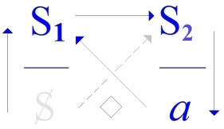
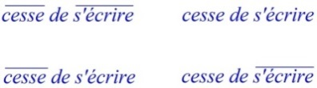

# Leçon 06 | 13 Février 1973

  

    <label><input type="checkbox" data-lacan-toggle="original" checked> 原文</label>
    <label><input type="checkbox" data-lacan-toggle="notes" checked> 注释</label>
    <label><input type="checkbox" data-lacan-toggle="commentary" checked> 个人解读评论</label>
  

  <form class="lacan-tool-search" role="search">
    <input class="lacan-tool-search-input" type="search" placeholder="搜索全文" aria-label="搜索全文">
    <button class="lacan-tool-button" type="submit" title="搜索">搜索</button>
  </form>
  <button class="lacan-tool-button lacan-back-to-top" type="button" title="回到页面最上方" aria-label="回到页面最上方">↑</button>

<section class="parallel-paragraph" data-paragraph-ids="s20-06-0001">

s20-06-0001

原文 · s20-06-0001

Tous les besoins, tous les besoins de l’être parlant sont contaminés par le fait d’être impliqués dans *<u>une autre satisfaction</u>...*

[无对应译文]

</section>

<section class="parallel-paragraph" data-paragraph-ids="s20-06-0002">

s20-06-0002

原文 · s20-06-0002

> soulignez ces trois mots ...à quoi ils peuvent faire défaut, les dits « *besoins »* j’entends.

[无对应译文]

</section>

<section class="parallel-paragraph" data-paragraph-ids="s20-06-0003">

s20-06-0003

原文 · s20-06-0003

Comment ça peut-il se faire ?

[无对应译文]

</section>

<section class="parallel-paragraph" data-paragraph-ids="s20-06-0004">

s20-06-0004

原文 · s20-06-0004

Cette 1ère phrase...

[无对应译文]

</section>

<section class="parallel-paragraph" data-paragraph-ids="s20-06-0005">

s20-06-0005

原文 · s20-06-0005

> que, mon Dieu, en me réveillant ce matin je l’ai mise sur le papier comme ça, pour que vous l’écriviez ...cette 1ère phrase emporte l’opposition des besoins...

[无对应译文]

</section>

<section class="parallel-paragraph" data-paragraph-ids="s20-06-0006">

s20-06-0006

原文 · s20-06-0006

> si tant est que ce terme - dont le recours est commun, vous le savez –
>
> puisse si aisément se saisir, puisqu’après tout il ne se saisit qu’à faire défaut ...à ce que je viens d’avancer comme cette *autre satisfaction*.

[无对应译文]

</section>

<section class="parallel-paragraph" data-paragraph-ids="s20-06-0007">

s20-06-0007

原文 · s20-06-0007

> \[*1er registre : la satisfaction-besoin →* *plaisir-déplaisir*\]

[无对应译文]

</section>

<section class="parallel-paragraph" data-paragraph-ids="s20-06-0008">

s20-06-0008

原文 · s20-06-0008

L’*autre satisfaction*...

[无对应译文]

</section>

<section class="parallel-paragraph" data-paragraph-ids="s20-06-0009">

s20-06-0009

原文 · s20-06-0009

tout de même vous devez l’entendre ...c’est bien ce qui se satisfait au niveau de *l’inconscient*, et pour autant que quelque chose s’y dit, et ne s’y dit pas, s’il est bien vrai qu’il *est structuré comme un langage*.

[无对应译文]

</section>

<section class="parallel-paragraph" data-paragraph-ids="s20-06-0010">

s20-06-0010

原文 · s20-06-0010

Je reprends là, c’est-à-dire d’une certaine distance de ce à quoi depuis un moment je me réfère, c’est à savoir *la jouissance* dont dépend cette *« autre satisfaction »* : *celle qui se supporte du langage*.

[无对应译文]

</section>

<section class="parallel-paragraph" data-paragraph-ids="s20-06-0011">

s20-06-0011

原文 · s20-06-0011

> \[*2ème registre : l’autre satisfaction (avec le langage) met en jeu l’inconscient→ symptôme, lapsus, rêve…*\]

[无对应译文]

</section>

<section class="parallel-paragraph" data-paragraph-ids="s20-06-0012">

s20-06-0012

原文 · s20-06-0012

Si, comme ça, enfin dans l’intervalle, dans l’intervalle des temps de ce que j’énonce ici \[*i.e. entre deux séances du séminaire*\] il vous arrive... ça pourrait vous arriver, ça pourrait même vous être indiqué par des échos que vous auriez, de ce qu’en traitant il y a longtemps, il y a très longtemps : 58-59 \[*en fait* : 1959-60\] – « *L’éthique de la psychanalyse »* j’ai désigné, enfin ce sur quoi j’ai insisté, en partant de rien de moins que l’« *Éthique à Nicomaque »* d’Aristote. *Ça peut se lire !*

[无对应译文]

</section>

<section class="parallel-paragraph" data-paragraph-ids="s20-06-0013">

s20-06-0013

原文 · s20-06-0013

Il n’y a qu’un malheur, pour un certain nombre ici, c’est que ça ne peut pas se lire en français: c’est manifestement intraduisible.

[无对应译文]

</section>

<section class="parallel-paragraph" data-paragraph-ids="s20-06-0014">

s20-06-0014

原文 · s20-06-0014

Il m’est arrivé, il m’est arrivé de m’assurer...

[无对应译文]

</section>

<section class="parallel-paragraph" data-paragraph-ids="s20-06-0015">

s20-06-0015

原文 · s20-06-0015

> je ne le soupçonnais pas jusqu’à présent ...en m’en faisant venir un exemplaire pendant que j’étais à la montagne...

[无对应译文]

</section>

<section class="parallel-paragraph" data-paragraph-ids="s20-06-0016">

s20-06-0016

原文 · s20-06-0016

> en m’en faisant venir un exemplaire qu’on a pu me trouver, ...grâce à je ne sais quoi qui arrive dans l’édition - les éditeurs m’enragent !

[无对应译文]

</section>

<section class="parallel-paragraph" data-paragraph-ids="s20-06-0017">

s20-06-0017

原文 · s20-06-0017

Ce n’est pas une raison pour que je leur fasse de la réclame, en en parlant justement de ce qui m’enrage...

[无对应译文]

</section>

<section class="parallel-paragraph" data-paragraph-ids="s20-06-0018">

s20-06-0018

原文 · s20-06-0018

> dans l’occasion c’est pas ça qui m’enrageait du tout ...simplement une traduction qui bien sûr m’avait servi, à moi comme aux autres...

[无对应译文]

</section>

<section class="parallel-paragraph" data-paragraph-ids="s20-06-0019">

s20-06-0019

原文 · s20-06-0019

> faut pas croire que je lis comme ça aisément, enfin, le grec ...et alors la traduction, quand elle est en face, donne un petit support, comme ça. Ouais...

[无对应译文]

</section>

<section class="parallel-paragraph" data-paragraph-ids="s20-06-0020">

s20-06-0020

原文 · s20-06-0020

Enfin bref, il y avait chez Garnier autrefois une chose qui a pu me faire croire qu’il y avait une traduction, d’un nommé Voillequin, ou Voilquin, je ne sais pas comment ça se prononce.

[无对应译文]

</section>

<section class="parallel-paragraph" data-paragraph-ids="s20-06-0021">

s20-06-0021

原文 · s20-06-0021

C’est *un universitaire* évidemment. C’est pas de sa faute \[*Rires*\], c’est pas de sa faute si le grec ne se traduit pas en français !

[无对应译文]

</section>

<section class="parallel-paragraph" data-paragraph-ids="s20-06-0022">

s20-06-0022

原文 · s20-06-0022

Quoi qu’il en soit, pour avoir eu cette traduction toute seule...

[无对应译文]

</section>

<section class="parallel-paragraph" data-paragraph-ids="s20-06-0023">

s20-06-0023

原文 · s20-06-0023

> depuis quelques temps les choses s’étant *condensées* de façon telle
>
> qu’on ne vous donne plus chez Garnier que - qui s’est en plus réuni à Flammarion \[*Rires*\], ouais... ...on ne donne plus chez Garnier que le texte français. Ouais...

[无对应译文]

</section>

<section class="parallel-paragraph" data-paragraph-ids="s20-06-0024">

s20-06-0024

原文 · s20-06-0024

Alors quand vous lisez ça, vous n’en sortez pas, c’est à proprement parler inintelligible.

[无对应译文]

</section>

<section class="parallel-paragraph" data-paragraph-ids="s20-06-0025">

s20-06-0025

原文 · s20-06-0025

> « *Tout art et toute recherche* - je sais pas... je commence, hein ? - *de même que toute action et toute délibération réfléchie* - quel rapport entre ces quatre trucs là ? - *tendent semble-t-il vers quelque bien. Aussi a-t-on eu parfois parfaitement raison de définir le bien :*
>
> *ce à quoi on tend en toutes circonstances. Toutefois* - ça vient là-dessus comme des cheveux sur la soupe, on n’en a pas encore parlé –
>
> *il paraît bien qu’il y a une différence entre les fins* [^47]».
>
> \[Πᾶσα τέχνη καὶ πᾶσα μέθοδος, ὁμοίως δὲ πρᾶξίς τε καὶ προαίρεσις, ἀγαθοῦ τινὸς ἐϕίεσθαι δοκεῖ· διὸ καλῶς ἀπεϕήναντο τἀγαθόν, οὗ πάντ᾽ ἐϕίεται. Διαφορὰ δέ τις φαίνεται τῶν τελῶν·\]

[无对应译文]

</section>

<section class="parallel-paragraph" data-paragraph-ids="s20-06-0026">

s20-06-0026

原文 · s20-06-0026

Je défie quiconque pourra, de ce texte, s’en débrouiller sans d’abondants commentaires, et qui ne peuvent pas ne pas faire référence...

[无对应译文]

</section>

<section class="parallel-paragraph" data-paragraph-ids="s20-06-0027">

s20-06-0027

原文 · s20-06-0027

> et je vous assure très péniblement toujours ...au texte grec, pour éclairer cette masse épaisse, dont pourtant il est impossible de penser que c’est simplement parce que c’est des notes mal prises.

[无对应译文]

</section>

<section class="parallel-paragraph" data-paragraph-ids="s20-06-0028">

s20-06-0028

原文 · s20-06-0028

En réalité, bien sûr, parce qu’il vient, il vient comme ça avec le temps quelques lucioles dans l’esprit des commentateurs, il leur vient à l’idée que, s’ils sont forcés de *se donner tant de peine*, il y a peut-être à ça une raison !

[无对应译文]

</section>

<section class="parallel-paragraph" data-paragraph-ids="s20-06-0029">

s20-06-0029

原文 · s20-06-0029

C’est pas forcé du tout qu’Aristote \[-384, -322\] ce soit impensable. J’y reviendrai.

[无对应译文]

</section>

<section class="parallel-paragraph" data-paragraph-ids="s20-06-0030">

s20-06-0030

原文 · s20-06-0030

Moi ce que j’avais écrit, *sous la forme comme ça de ce qui se tape* \[*depuis Janvier 1954 une sténotypiste « tape » ce que dit Lacan dans ses séminaires*\] ce qui se trouvait écrit de ce que j’avais dit de *L’éthique*, a paru plus qu’utilisable aux gens mêmes qui justement, à ce moment-là s’occupaient de me faire... *de me désigner à l’attention de l’Internationale de Psychanalyse*, *avec le résultat que l’on sait*.

[无对应译文]

</section>

<section class="parallel-paragraph" data-paragraph-ids="s20-06-0031">

s20-06-0031

原文 · s20-06-0031

Mais du même coup, enfin... enfin ç’aurait été très bien, si de tout ça il avait quand même flotté ces quelques réflexions sur ce que la psychanalyse comporte d’*éthique* : ç’aurait été en quelque sorte tout profit !

[无对应译文]

</section>

<section class="parallel-paragraph" data-paragraph-ids="s20-06-0032">

s20-06-0032

原文 · s20-06-0032

J’aurais fait, moi, plouf... et puis « *L’éthique de la psychanalyse »* aurait surnagé. Voilà un exemple...

[无对应译文]

</section>

<section class="parallel-paragraph" data-paragraph-ids="s20-06-0033">

s20-06-0033

原文 · s20-06-0033

> enfin, il faut prendre les choses toujours au plus près ...un exemple de ceci que le calcul ne suffit pas : parce que, parce que moi j’ai empêché cette *« Éthique de la psychanalyse »* de paraître!

[无对应译文]

</section>

<section class="parallel-paragraph" data-paragraph-ids="s20-06-0034">

s20-06-0034

原文 · s20-06-0034

Je m’y suis refusé simplement, à partir de l’idée que, mon Dieu...

[无对应译文]

</section>

<section class="parallel-paragraph" data-paragraph-ids="s20-06-0035">

s20-06-0035

原文 · s20-06-0035

- les gens qui ne veulent pas de moi,

[无对应译文]

</section>

<section class="parallel-paragraph" data-paragraph-ids="s20-06-0036">

s20-06-0036

原文 · s20-06-0036

- moi je ne cherche pas à les convaincre.

[无对应译文]

</section>

<section class="parallel-paragraph" data-paragraph-ids="s20-06-0037">

s20-06-0037

原文 · s20-06-0037

Il ne faut pas convaincre : le propre de la psychanalyse, c’est de ne pas vaincre, con ou pas ! \[*Rires*\]

[无对应译文]

</section>

<section class="parallel-paragraph" data-paragraph-ids="s20-06-0038">

s20-06-0038

原文 · s20-06-0038

C’était quand même un séminaire pas mal du tout ! \[*Rires*\]

[无对应译文]

</section>

<section class="parallel-paragraph" data-paragraph-ids="s20-06-0039">

s20-06-0039

原文 · s20-06-0039

À tout prendre, et parce que la chose avait été déjà, comme ça, une fois *écrite*, et par les soins de quelqu’un[^48] qui ne participait pas du tout à ce calcul de tout à l’heure, qui – lui - avait fait ça comme ça : franc-jeu comme argent, de tout cœur, qui l’avait – lui - alors... qui en avait fait un écrit, un écrit de lui.

[无对应译文]

</section>

<section class="parallel-paragraph" data-paragraph-ids="s20-06-0040">

s20-06-0040

原文 · s20-06-0040

Il ne songeait d’ailleurs pas du tout, bien sûr, à me le ravir.

[无对应译文]

</section>

<section class="parallel-paragraph" data-paragraph-ids="s20-06-0041">

s20-06-0041

原文 · s20-06-0041

Il l’aurait produit tel que, si j’avais bien voulu... Bon ! Alors j’ai pas voulu.

[无对应译文]

</section>

<section class="parallel-paragraph" data-paragraph-ids="s20-06-0042">

s20-06-0042

原文 · s20-06-0042

Mais ça n’empêche pas que c’est peut-être, *de tous les séminaires*, le seul que je réécrirai moi-même, et dont je ferai un écrit. Il faut bien que j’en fasse un, quoi ! Pourquoi ne pas choisir celui-là ?

[无对应译文]

</section>

<section class="parallel-paragraph" data-paragraph-ids="s20-06-0043">

s20-06-0043

原文 · s20-06-0043

Bon ! Vous voyez que ce que j’essaie, ce qu’il faut faire n’est-ce pas, c’est quand même...

[无对应译文]

</section>

<section class="parallel-paragraph" data-paragraph-ids="s20-06-0044">

s20-06-0044

原文 · s20-06-0044

Disons, y’a pas de raison de ne pas se mettre à l’épreuve de voir une chose comme ça par exemple, en quoi Freud, en posant certains termes comme il a pu, en *pensant* ce qu’il découvrait, comment... comment ce terrain, d’autres le voyaient avant lui ?

[无对应译文]

</section>

<section class="parallel-paragraph" data-paragraph-ids="s20-06-0045">

s20-06-0045

原文 · s20-06-0045

C’est ça que je dis, une preuve de plus, une façon autre d’éprouver ce dont il s’agit, c’est que ce terrain n’est pensable que grâce aux instruments dont on opère, et que les seuls instruments dont nous pouvions voir se véhiculer le témoignage, eh bien c’est des *écrits*.

[无对应译文]

</section>

<section class="parallel-paragraph" data-paragraph-ids="s20-06-0046">

s20-06-0046

原文 · s20-06-0046

Il est tout à fait clair, il est rendu sensible par une épreuve toute simple, qui même à le lire dans la traduction française, l’*Éthique à Nicomaque*, n’est-ce pas...

[无对应译文]

</section>

<section class="parallel-paragraph" data-paragraph-ids="s20-06-0047">

s20-06-0047

原文 · s20-06-0047

> vous n’y comprendrez rien bien sûr, mais pas plus qu’à ce que je dis, donc ça suffit quand même ...vous verrez qu’Aristote c’est pas plus compréhensible que ce que je vous raconte, et que ça l’est même plutôt moins parce qu’il remue plus de choses, et des choses qui nous sont plus lointaines.

[无对应译文]

</section>

<section class="parallel-paragraph" data-paragraph-ids="s20-06-0048">

s20-06-0048

原文 · s20-06-0048

Mais il est clair que cette « *autre satisfaction »* dont je parlais à l’instant, eh bien c’est exactement celle, repérable de surgir...

[无对应译文]

</section>

<section class="parallel-paragraph" data-paragraph-ids="s20-06-0049">

s20-06-0049

原文 · s20-06-0049

> de quoi? - eh bien mes bons amis, impossible d’y échapper ...si vous ne mettez là au pied du truc - n’est-ce pas - des *Universaux*[^49] : du *Bien*, du *Vrai*, du *Beau*.

[无对应译文]

</section>

<section class="parallel-paragraph" data-paragraph-ids="s20-06-0050">

s20-06-0050

原文 · s20-06-0050

Qu’il y ait ces trois significations, spécifications, donne un aspect pathétique à l’approche qu’en font certains textes, comme ça, ceux qui relèvent d’une pensée *« autorisée »*.

[无对应译文]

</section>

<section class="parallel-paragraph" data-paragraph-ids="s20-06-0051">

s20-06-0051

原文 · s20-06-0051

Je dis « *autorisée »* avec le sens, *entre guillemets*, que je donne à ce terme : léguée avec un nom d’auteur.

[无对应译文]

</section>

<section class="parallel-paragraph" data-paragraph-ids="s20-06-0052">

s20-06-0052

原文 · s20-06-0052

Il y a certains textes qui nous viennent, comme ça, de ce que je regarde à deux fois à appeler « *une culture très ancienne* », parce qu’il est clair que c’est pas de « *la culture* »,

[无对应译文]

</section>

<section class="parallel-paragraph" data-paragraph-ids="s20-06-0053">

s20-06-0053

原文 · s20-06-0053

- *la culture* en tant que distincte de la société, ça n’existe pas.

[无对应译文]

</section>

<section class="parallel-paragraph" data-paragraph-ids="s20-06-0054">

s20-06-0054

原文 · s20-06-0054

- *la culture* c’est justement ça d’ancien, que nous n’avons plus sur le dos que comme une vermine.

[无对应译文]

</section>

<section class="parallel-paragraph" data-paragraph-ids="s20-06-0055">

s20-06-0055

原文 · s20-06-0055

Parce que nous ne savons pas qu’en faire sinon nous en épouiller.

[无对应译文]

</section>

<section class="parallel-paragraph" data-paragraph-ids="s20-06-0056">

s20-06-0056

原文 · s20-06-0056

Moi je vous conseille de la garder parce que ça chatouille, ça réveille.

[无对应译文]

</section>

<section class="parallel-paragraph" data-paragraph-ids="s20-06-0057">

s20-06-0057

原文 · s20-06-0057

Ça réveillera vos sentiments qui tendent plutôt à devenir un peu abrutis sous l’influence des circonstances ambiantes, c’est-à-dire de ce que les autres, qui viendront après, appelleront votre *culture* à vous.

[无对应译文]

</section>

<section class="parallel-paragraph" data-paragraph-ids="s20-06-0058">

s20-06-0058

原文 · s20-06-0058

*La culture*, *la culture* qui sera devenue pour eux de la culture, parce que depuis longtemps vous serez là-dessous, est tout ce que vous supportez de *lien social*, car en fin de compte il n’y a que ça : ce *lien social* que je désigne du terme de « *discours »*, parce qu’il n’y a pas d’autre moyen de le désigner, dès qu’on s’est aperçu que le lien social ne s’instaure que de s’ancrer dans une certaine façon dont le langage *s’imprime,* se situe, *se situe sur cette grouille, c’est-à-dire l’être parlant*.

[无对应译文]

</section>

<section class="parallel-paragraph" data-paragraph-ids="s20-06-0059">

s20-06-0059

原文 · s20-06-0059

> \[*le lien social (discours) qui s’imprime (fonction* Φ *de l’écrit) sur l’être parlant, dépend des discours qui l’ont précédé et produit→ Aristote.*

[无对应译文]

</section>

<section class="parallel-paragraph" data-paragraph-ids="s20-06-0060">

s20-06-0060

原文 · s20-06-0060

*Le changement de discours (dépassement du discours du maître) qui s’est produit avec Kant et Sade, « contient » les éléments du discours précédent : les Universaux* \]

[无对应译文]

</section>

<section class="parallel-paragraph" data-paragraph-ids="s20-06-0061">

s20-06-0061

原文 · s20-06-0061

Faut pas s’étonner, faut pas s’étonner que des discours antérieurs - et puis y’en aura d’autres - des discours antérieurs ne soient plus pensables pour nous, ou très difficilement.

[无对应译文]

</section>

<section class="parallel-paragraph" data-paragraph-ids="s20-06-0062">

s20-06-0062

原文 · s20-06-0062

Bon... Je veux dire qu’en fin de compte

[无对应译文]

</section>

<section class="parallel-paragraph" data-paragraph-ids="s20-06-0063">

s20-06-0063

原文 · s20-06-0063

- de la même façon que, moi le discours que j’essaie d’amener au jour, il ne vous est pas, comme ça, tout de suite accessible de l’entendre,

[无对应译文]

</section>

<section class="parallel-paragraph" data-paragraph-ids="s20-06-0064">

s20-06-0064

原文 · s20-06-0064

- d’où nous sommes, il n’est pas non plus très facile d’entendre le discours d’Aristote.

[无对应译文]

</section>

<section class="parallel-paragraph" data-paragraph-ids="s20-06-0065">

s20-06-0065

原文 · s20-06-0065

Mais est-ce que c’est une raison pour qu’il ne soit pas pensable ?

[无对应译文]

</section>

<section class="parallel-paragraph" data-paragraph-ids="s20-06-0066">

s20-06-0066

原文 · s20-06-0066

Il est tout à fait clair qu’il l’est !

[无对应译文]

</section>

<section class="parallel-paragraph" data-paragraph-ids="s20-06-0067">

s20-06-0067

原文 · s20-06-0067

C’est simplement quand, quand nous imaginons, enfin, qu’Aristote veut dire quelque chose, enfin que nous nous inquiétons de *ce qu’il entoure*.

[无对应译文]

</section>

<section class="parallel-paragraph" data-paragraph-ids="s20-06-0068">

s20-06-0068

原文 · s20-06-0068

Parce qu’après tout *ce qu’il entoure*...

[无对应译文]

</section>

<section class="parallel-paragraph" data-paragraph-ids="s20-06-0069">

s20-06-0069

原文 · s20-06-0069

> ce qu’il prend dans son filet, dans son réseau, ce qu’il retire,
>
> ce qu’il manie, à quoi il a affaire, avec qui il se bat...

[无对应译文]

</section>

<section class="parallel-paragraph" data-paragraph-ids="s20-06-0070">

s20-06-0070

原文 · s20-06-0070

Qu’est-ce qu’il... qu’est-ce qu’il soutient, qu’est-ce qu’il supporte, qu’est-ce qu’il travaille, qu’est-ce qu’il poursuit ?

[无对应译文]

</section>

<section class="parallel-paragraph" data-paragraph-ids="s20-06-0071">

s20-06-0071

原文 · s20-06-0071

Mais évidemment, après tout, ce que je venais de vous lire tout à l’heure : les quatre premières lignes, vous entendez bien les mots, vous supposez bien que ça veut dire quelque chose comme ça, quelque chose, vous ne savez pas quoi naturellement !

[无对应译文]

</section>

<section class="parallel-paragraph" data-paragraph-ids="s20-06-0072">

s20-06-0072

原文 · s20-06-0072

« *Tout art* » ou « *toute recherche* », « *toute action* », tout ça : qu’est-ce que ça veut dire chacun de ces mots ?

[无对应译文]

</section>

<section class="parallel-paragraph" data-paragraph-ids="s20-06-0073">

s20-06-0073

原文 · s20-06-0073

C’est quand même parce qu’il en a mis beaucoup à la suite...

[无对应译文]

</section>

<section class="parallel-paragraph" data-paragraph-ids="s20-06-0074">

s20-06-0074

原文 · s20-06-0074

> et puis que ça nous parvient imprimé après avoir été écrit, comme ça, pendant longtemps ...qu’on suppose qu’il y a quelque chose qui fait, qui fait prise au milieu de tout ça.

[无对应译文]

</section>

<section class="parallel-paragraph" data-paragraph-ids="s20-06-0075">

s20-06-0075

原文 · s20-06-0075

Et c’est bien à partir du moment où nous nous posons la question, la seule : *où est-ce que ça les satisfaisait des trucs comme ça ?*

[无对应译文]

</section>

<section class="parallel-paragraph" data-paragraph-ids="s20-06-0076">

s20-06-0076

原文 · s20-06-0076

Peu importe quel en fut alors l’usage : on sait que ça se véhiculait, qu’il y avait des volumes d’Aristote...

[无对应译文]

</section>

<section class="parallel-paragraph" data-paragraph-ids="s20-06-0077">

s20-06-0077

原文 · s20-06-0077

Ça nous déroute quand même, et très précisément en ceci « *où est-ce que ça les satisfaisait ?* » n’est traduisible que de cette façon : « *où est-ce qu’il y aurait eu faute à une certaine jouissance ?* ».

[无对应译文]

</section>

<section class="parallel-paragraph" data-paragraph-ids="s20-06-0078">

s20-06-0078

原文 · s20-06-0078

Autrement dit, pourquoi dans un texte comme ceci, pourquoi est-ce qu’ils se tracassaient comme ça ?

[无对应译文]

</section>

<section class="parallel-paragraph" data-paragraph-ids="s20-06-0079">

s20-06-0079

原文 · s20-06-0079

Vous avez bien entendu : « *faute », défaut, quelque chose qui ne va pas, quelque chose qui dérape dans ce qui manifestement est visé*, et puis ça commence comme ça tout de suite, au début, le *Bien* et le *Bonheur* : « *Du Bi, Du Bien, Du Benêt* [^50] » !

[无对应译文]

</section>

<section class="parallel-paragraph" data-paragraph-ids="s20-06-0080">

s20-06-0080

原文 · s20-06-0080

> \[*dans* *le discours du maître, la fonction phallique soutient le* S1→S2 *comme « possible » *:
>
> S1 → S2 (*« Du Bi »*),
>
> *mène bien au Produit :* *a* (*« Du Bien »*),
>
> *mais aboutit à l’impuissance* (« *Du Benêt »*)* : a* **◊ S**\]

[无对应译文]

</section>

<section class="parallel-paragraph" data-paragraph-ids="s20-06-0081">

s20-06-0081

原文 · s20-06-0081

[无对应译文]

</section>

<section class="parallel-paragraph" data-paragraph-ids="s20-06-0082">

s20-06-0082

原文 · s20-06-0082

La réalité est abordée avec *les appareils de la jouissance* \[S1→ S2→ *a*\], voilà encore une formule que je vous propose, si tant est que nous nous centrions bien sur ceci : *que d’« appareil » il n’y en a pas d’autre que le langage*.

[无对应译文]

</section>

<section class="parallel-paragraph" data-paragraph-ids="s20-06-0083">

s20-06-0083

原文 · s20-06-0083

C’est comme ça que chez l’être parlant *la jouissance* est appareillée, et c’est ça ce que dit Freud, bien sûr si nous corrigeons cet énoncé qui est celui où je vais en venir tout à l’heure pour l’accrocher, à savoir celui du « *principe du plaisir »*.

[无对应译文]

</section>

<section class="parallel-paragraph" data-paragraph-ids="s20-06-0084">

s20-06-0084

原文 · s20-06-0084

Ce que ça veut dire ? Pourquoi il l’a dit comme ça ?

[无对应译文]

</section>

<section class="parallel-paragraph" data-paragraph-ids="s20-06-0085">

s20-06-0085

原文 · s20-06-0085

Il l’a dit comme ça parce qu’il y en avait d’autres qui avaient parlé avant lui, et que c’était la façon qui lui paraissait la plus audible.

[无对应译文]

</section>

<section class="parallel-paragraph" data-paragraph-ids="s20-06-0086">

s20-06-0086

原文 · s20-06-0086

C’est très facile à repérer en fin de compte, et cette conjonction d’Aristote avec Freud, ça aide à ce repérage.

[无对应译文]

</section>

<section class="parallel-paragraph" data-paragraph-ids="s20-06-0087">

s20-06-0087

原文 · s20-06-0087

Si je pousse plus loin au point où maintenant ça peut se faire : si l’inconscient est bien ce que je dis : « *structuré comme un langage »*, à savoir,

[无对应译文]

</section>

<section class="parallel-paragraph" data-paragraph-ids="s20-06-0088">

s20-06-0088

原文 · s20-06-0088

- qu’à partir de là ce langage s’éclaire sans doute de se poser comme *appareil de la jouissance*,

[无对应译文]

</section>

<section class="parallel-paragraph" data-paragraph-ids="s20-06-0089">

s20-06-0089

原文 · s20-06-0089

- mais inversement *la jouissance* aussi, peut-être qu’en elle-même aussi elle montre qu’elle *est en défaut*, que pour que ce soit comme ça, *il faut quelque chose* de son côté *qui boite*.

[无对应译文]

</section>

<section class="parallel-paragraph" data-paragraph-ids="s20-06-0090">

s20-06-0090

原文 · s20-06-0090

Qu’est-ce que je vous ai dit : la réalité est abordée avec ça, avec les appareils de jouissance.

[无对应译文]

</section>

<section class="parallel-paragraph" data-paragraph-ids="s20-06-0091">

s20-06-0091

原文 · s20-06-0091

Et oui, ça veut pas dire que la jouissance est antérieure à la réalité, c’est là aussi un point où Freud a prêté à malentendu, quelque part.

[无对应译文]

</section>

<section class="parallel-paragraph" data-paragraph-ids="s20-06-0092">

s20-06-0092

原文 · s20-06-0092

Et vous trouverez dans ce qui est classé en français dans les « *Essais de Psychanalyse »* [^51], je vous dis ça pour que vous vous repériez, parce que si je vous donne simplement l’indication bibliographique, vous saurez même pas où c’est, c’est dans les « *Essais de Psychanalyse »*.

[无对应译文]

</section>

<section class="parallel-paragraph" data-paragraph-ids="s20-06-0093">

s20-06-0093

原文 · s20-06-0093

Il y a quelque chose qui ressemble à l’idée d’un *développement,* n’est-ce pas ? \[(I) *principe de plaisir*→(II) *principe de réalité* \]

[无对应译文]

</section>

<section class="parallel-paragraph" data-paragraph-ids="s20-06-0094">

s20-06-0094

原文 · s20-06-0094

Il y a un *Lust-Ich* avant un *Real-Ich*.

[无对应译文]

</section>

<section class="parallel-paragraph" data-paragraph-ids="s20-06-0095">

s20-06-0095

原文 · s20-06-0095

C’est un glissement, c’est un retour à l’ornière, cette ornière que j’appelle *« le développement »,* et qui n’est qu’une hypothèse de la maîtrise. \[*discours du maître :* S1→S2→ *a, avec son ornière : a* **◊ S** → *jouissance phallique, soutenue du fantasme*\]

[无对应译文]

</section>

<section class="parallel-paragraph" data-paragraph-ids="s20-06-0096">

s20-06-0096

原文 · s20-06-0096

Soit disant que le bébé : rien à faire avec le *Real-Ich !*

[无对应译文]

</section>

<section class="parallel-paragraph" data-paragraph-ids="s20-06-0097">

s20-06-0097

原文 · s20-06-0097

Pauvre lardon, incapable d’avoir la moindre idée de ce que c’est que le *réel *!

[无对应译文]

</section>

<section class="parallel-paragraph" data-paragraph-ids="s20-06-0098">

s20-06-0098

原文 · s20-06-0098

C’est réservé aux gens que nous connaissons, à ces « *adultes* » dont par ailleurs il est expressément dit *qu’ils ne peuvent jamais arriver à se réveiller*.

[无对应译文]

</section>

<section class="parallel-paragraph" data-paragraph-ids="s20-06-0099">

s20-06-0099

原文 · s20-06-0099

C’est-à-dire que quand il arrive dans leur rêve quelque chose qui menacerait de passer au *réel*, ça les affole tellement aussitôt qu’ils se réveillent, c’est-à-dire qu’ils continuent à rêver !

[无对应译文]

</section>

<section class="parallel-paragraph" data-paragraph-ids="s20-06-0100">

s20-06-0100

原文 · s20-06-0100

Il suffit de lire, il suffit d’y être un peu, il suffit de les voir vivre, il suffit de les avoir en psychanalyse \[*Rires*\] Ouais*...*

[无对应译文]

</section>

<section class="parallel-paragraph" data-paragraph-ids="s20-06-0101">

s20-06-0101

原文 · s20-06-0101

pour s’apercevoir ce que ça veut dire donc que le « *développement* ».

[无对应译文]

</section>

<section class="parallel-paragraph" data-paragraph-ids="s20-06-0102">

s20-06-0102

原文 · s20-06-0102

Quand on dit *primaire* et *secondaire* pour les *processus*, il y a peut-être là une sorte de façon de dire qui fait illusion.

[无对应译文]

</section>

<section class="parallel-paragraph" data-paragraph-ids="s20-06-0103">

s20-06-0103

原文 · s20-06-0103

En tout cas, disons que c’est pas parce qu’un processus est dit « *primaire* »...

[无对应译文]

</section>

<section class="parallel-paragraph" data-paragraph-ids="s20-06-0104">

s20-06-0104

原文 · s20-06-0104

on peut bien les appeler comme on veut après tout ...qu’il apparaît le *premier*.

[无对应译文]

</section>

<section class="parallel-paragraph" data-paragraph-ids="s20-06-0105">

s20-06-0105

原文 · s20-06-0105

Quant à moi, j’ai jamais regardé un bébé sans... en ayant le sentiment qu’il n’y avait pas pour lui de monde extérieur : il est tout à fait manifeste qu’il ne regarde que ça, et que ça l’excite manifestement !

[无对应译文]

</section>

<section class="parallel-paragraph" data-paragraph-ids="s20-06-0106">

s20-06-0106

原文 · s20-06-0106

Et ce - mon Dieu - dans la proportion exacte où il ne parle pas encore.

[无对应译文]

</section>

<section class="parallel-paragraph" data-paragraph-ids="s20-06-0107">

s20-06-0107

原文 · s20-06-0107

À partir du moment où *il parle*, eh ben...

[无对应译文]

</section>

<section class="parallel-paragraph" data-paragraph-ids="s20-06-0108">

s20-06-0108

原文 · s20-06-0108

> à partir de ce moment là, très exactement, pas avant ...je comprends qu’il y ait du refoulement.

[无对应译文]

</section>

<section class="parallel-paragraph" data-paragraph-ids="s20-06-0109">

s20-06-0109

原文 · s20-06-0109

Le processus est peut-être primaire - du *Lust-Ich* - et pourquoi pas ?

[无对应译文]

</section>

<section class="parallel-paragraph" data-paragraph-ids="s20-06-0110">

s20-06-0110

原文 · s20-06-0110

Il est évidemment primaire dès que nous commencerons à penser, et il est certainement pas le premier.

[无对应译文]

</section>

<section class="parallel-paragraph" data-paragraph-ids="s20-06-0111">

s20-06-0111

原文 · s20-06-0111

Cette idée du développement qui se confond - avec quoi ? - avec le développement de *la maîtrise*, je l’ai dit tout à l’heure, c’est là qu’il faut quand même avoir un petit peu, enfin un peu *d’oreille,* comme pour la musique :

[无对应译文]

</section>

<section class="parallel-paragraph" data-paragraph-ids="s20-06-0112">

s20-06-0112

原文 · s20-06-0112

- je suis *m’être*,

[无对应译文]

</section>

<section class="parallel-paragraph" data-paragraph-ids="s20-06-0113">

s20-06-0113

原文 · s20-06-0113

- je progresse dans la *m’êtrise*, le développement c’est quand on devient de *plus en plus* *m’être*,

[无对应译文]

</section>

<section class="parallel-paragraph" data-paragraph-ids="s20-06-0114">

s20-06-0114

原文 · s20-06-0114

- *je suis m’être* de moi comme de l’Univers.

[无对应译文]

</section>

<section class="parallel-paragraph" data-paragraph-ids="s20-06-0115">

s20-06-0115

原文 · s20-06-0115

Ouais, c’est bien là ce dont je parlais tout à l’heure : de con-vaincu. \[*l’être comme produit : (a)*\]

[无对应译文]

</section>

<section class="parallel-paragraph" data-paragraph-ids="s20-06-0116">

s20-06-0116

原文 · s20-06-0116

L’« *univers* »...

[无对应译文]

</section>

<section class="parallel-paragraph" data-paragraph-ids="s20-06-0117">

s20-06-0117

原文 · s20-06-0117

à partir de certaines petites, comme ça, lumières, un peu... que j’ai essayé de vous donner ...l’« *univers* », *l’« univers » c’est une fleur de rhétorique*.

[无对应译文]

</section>

<section class="parallel-paragraph" data-paragraph-ids="s20-06-0118">

s20-06-0118

原文 · s20-06-0118

Alors ça pourrait peut-être aider à comprendre que...

[无对应译文]

</section>

<section class="parallel-paragraph" data-paragraph-ids="s20-06-0119">

s20-06-0119

原文 · s20-06-0119

> avec cet écho littéraire ...*que le « moi », peut-être aussi l’est, fleur de rhétorique* sans doute, qui pousse du pot du *« principe du plaisir »*, de ce que Freud appelle *Lustprinzip*, et de ce que je définis : « *de ce qui se satisfait du blablabla *».

[无对应译文]

</section>

<section class="parallel-paragraph" data-paragraph-ids="s20-06-0120">

s20-06-0120

原文 · s20-06-0120

Car c’est ça que je dis... quand je dis que « *l’inconscient est structuré comme un langage »*.

[无对应译文]

</section>

<section class="parallel-paragraph" data-paragraph-ids="s20-06-0121">

s20-06-0121

原文 · s20-06-0121

Faut que je mette les points sur les i !

[无对应译文]

</section>

<section class="parallel-paragraph" data-paragraph-ids="s20-06-0122">

s20-06-0122

原文 · s20-06-0122

*L’« univers »*...

[无对应译文]

</section>

<section class="parallel-paragraph" data-paragraph-ids="s20-06-0123">

s20-06-0123

原文 · s20-06-0123

> vous pouvez peut-être tout de même maintenant vous rendre compte, à cause de la façon
>
> dont j’ai accentué l’usage de certains mots, leur application différente dans les deux sexes,
>
> à savoir ce que j’ai *accentué* du *« tout »*\[;\] et du *« pas tout »* \[.\] *...l’« univers », c’est là où de dire « tout » réussit...* \[; ! *par l’ex-sistence de l’exception :* : §\]

[无对应译文]

</section>

<section class="parallel-paragraph" data-paragraph-ids="s20-06-0124">

s20-06-0124

原文 · s20-06-0124

Ouais... Est-ce que je vais me mettre à faire là du William James ?

[无对应译文]

</section>

<section class="parallel-paragraph" data-paragraph-ids="s20-06-0125">

s20-06-0125

原文 · s20-06-0125

...*réussit à quoi ?*

[无对应译文]

</section>

<section class="parallel-paragraph" data-paragraph-ids="s20-06-0126">

s20-06-0126

原文 · s20-06-0126

La réponse : ...

[无对应译文]

</section>

<section class="parallel-paragraph" data-paragraph-ids="s20-06-0127">

s20-06-0127

原文 · s20-06-0127

grâce au point où avec le temps j’ai fini par vous faire arriver, où j’espère avoir fini par vous faire arriver...

[无对应译文]

</section>

<section class="parallel-paragraph" data-paragraph-ids="s20-06-0128">

s20-06-0128

原文 · s20-06-0128

*...réussit à faire rater le rapport sexuel de la façon mâle* \[; !*vise l’impossible (ex-sistence) de* : § et aboutit à **S ◊** *a (formule du fantasme)*\].

[无对应译文]

</section>

<section class="parallel-paragraph" data-paragraph-ids="s20-06-0129">

s20-06-0129

原文 · s20-06-0129

Normalement je devrais recueillir ici des ricanements \[*Rires*\], hélas rien de pareil !

[无对应译文]

</section>

<section class="parallel-paragraph" data-paragraph-ids="s20-06-0130">

s20-06-0130

原文 · s20-06-0130

Les ricanements devraient vouloir dire : Ah ! vous voilà donc pris : deux manières de la rater l’*affaire*, le *rapport sexuel*. C’est comme ça que se module *la musique de l’[épithalame](https://www.cnrtl.fr/definition/%C3%A9pithalame)*.

[无对应译文]

</section>

<section class="parallel-paragraph" data-paragraph-ids="s20-06-0131">

s20-06-0131

原文 · s20-06-0131

L’épithalame, le duo...

[无对应译文]

</section>

<section class="parallel-paragraph" data-paragraph-ids="s20-06-0132">

s20-06-0132

原文 · s20-06-0132

> parce qu’il faut quand même distinguer le « duo » du dialogue ...l’alternance, la lettre d’amour, ce n’est pas *<u>le rapport</u>* sexuel.

[无对应译文]

</section>

<section class="parallel-paragraph" data-paragraph-ids="s20-06-0133">

s20-06-0133

原文 · s20-06-0133

Ils *tournent autour* du fait *qu’il n’y a pas de rapport sexuel*.

[无对应译文]

</section>

<section class="parallel-paragraph" data-paragraph-ids="s20-06-0134">

s20-06-0134

原文 · s20-06-0134

Qu’il y ait donc *la façon mâle de tourner autour* et puis l’autre...

[无对应译文]

</section>

<section class="parallel-paragraph" data-paragraph-ids="s20-06-0135">

s20-06-0135

原文 · s20-06-0135

> que je ne désigne pas autrement, parce que *c’est ça que cette année je suis en train d’élaborer* ...*à savoir comment de la façon femelle, ça s’élabore du « pas tout »*.

[无对应译文]

</section>

<section class="parallel-paragraph" data-paragraph-ids="s20-06-0136">

s20-06-0136

原文 · s20-06-0136

Seulement comme jusqu’ici ça n’a pas beaucoup été exploré le *pas tout*, c’est ça qui évidemment me donne un peu de mal.

[无对应译文]

</section>

<section class="parallel-paragraph" data-paragraph-ids="s20-06-0137">

s20-06-0137

原文 · s20-06-0137

Là-dessus je vais vous en raconter « une bien bonne » \[*Rires*\], pour vous distraire un peu.

[无对应译文]

</section>

<section class="parallel-paragraph" data-paragraph-ids="s20-06-0138">

s20-06-0138

原文 · s20-06-0138

Ouais, c’est qu’au milieu de mes sports d’hiver j’ai cru devoir, pour tenir une parole, me véhiculer jusqu’à Milan, à une heure à vol d’oiseau rapide de Milan que c’était, par le chemin de fer ça faisait une journée entière d’y aller.

[无对应译文]

</section>

<section class="parallel-paragraph" data-paragraph-ids="s20-06-0139">

s20-06-0139

原文 · s20-06-0139

Bon enfin bref, j’ai été à Milan et comme moi je peux jamais quitter...

[无对应译文]

</section>

<section class="parallel-paragraph" data-paragraph-ids="s20-06-0140">

s20-06-0140

原文 · s20-06-0140

> parce que je suis comme ça, vous comprenez,
>
> j’ai dit que je referai *L’éthique de la psychanalyse*, mais c’est parce que je la ré-extrais ...je ne peux pas ne pas rester au point où j’en suis, de sorte que de donner ce titre absolument fou pour une conférence aux milanais qui n’ont jamais entendu parler de ça : « *la psychanalyse dans sa référence au rapport sexuel ».*

[无对应译文]

</section>

<section class="parallel-paragraph" data-paragraph-ids="s20-06-0141">

s20-06-0141

原文 · s20-06-0141

Ben ils sont très intelligents... Ils ont tellement bien entendu qu’aussitôt, le soir même dans le journal il était écrit : « *Pour le Docteur Lacan, les dames, les « donne », n’existent pas* ! » \[*Rires*\]

[无对应译文]

</section>

<section class="parallel-paragraph" data-paragraph-ids="s20-06-0142">

s20-06-0142

原文 · s20-06-0142

Ben c’est vrai, que voulez-vous, si le rapport sexuel n’existe pas, ben, y a pas de dames quoi, hein ! \[*Rires*\]

[无对应译文]

</section>

<section class="parallel-paragraph" data-paragraph-ids="s20-06-0143">

s20-06-0143

原文 · s20-06-0143

Il y avait une personne qui était furieuse, c’était une dame du M.L.F. de là-bas \[*Rires*\].

[无对应译文]

</section>

<section class="parallel-paragraph" data-paragraph-ids="s20-06-0144">

s20-06-0144

原文 · s20-06-0144

Et même qu’il a fallu que je leur explique, et j’ai pris le soin de leur expliquer.

[无对应译文]

</section>

<section class="parallel-paragraph" data-paragraph-ids="s20-06-0145">

s20-06-0145

原文 · s20-06-0145

Il y en avait en tout cas une qui était vraiment... ah oui ! Je lui ai dit : « *Venez demain matin, je vous expliquerai de quoi il s’agit, je vous expliquerai que c’est justement de ça que je parle* ! ».

[无对应译文]

</section>

<section class="parallel-paragraph" data-paragraph-ids="s20-06-0146">

s20-06-0146

原文 · s20-06-0146

J’essaie d’élaborer ce qu’il en est de cette affaire du rapport sexuel à partir de ceci : que s’il y a un point d’où ça pourrait s’éclairer...

[无对应译文]

</section>

<section class="parallel-paragraph" data-paragraph-ids="s20-06-0147">

s20-06-0147

原文 · s20-06-0147

> puisque justement il y a *quelque chose* là qui ne se réunit pas ...c’est justement du côté des dames, pour autant que c’est de *l’élaboration du pas tout* \[.\] *qu’il s’agit*, qu’il s’agit de frayer la voie, *ce qui est mon vrai sujet de cette année*, derrière cet *Encore* qui est... ben voilà : un des sens, que j’essaie encore et après d’autres.

[无对应译文]

</section>

<section class="parallel-paragraph" data-paragraph-ids="s20-06-0148">

s20-06-0148

原文 · s20-06-0148

Ça veut dire que c’est peut-être par une autre voie que j’arriverai à faire sortir quelque chose, qui ne soit pas tout à fait ce qui s’est sorti jusqu’à présent sur la sexualité féminine.

[无对应译文]

</section>

<section class="parallel-paragraph" data-paragraph-ids="s20-06-0149">

s20-06-0149

原文 · s20-06-0149

Parce que quand même, c’est bien intéressant, et *il est même frappant* que... il y a une chose en tout cas, qui, de ce « *pas tout »,* donne un témoignage éclatant, avec une de ces nuances, une de ces oscillations de signification qui se produit, parce que la langue ça doit tout de même nous habituer à ça.

[无对应译文]

</section>

<section class="parallel-paragraph" data-paragraph-ids="s20-06-0150">

s20-06-0150

原文 · s20-06-0150

Vous voyez ce que ça change de sens, le « *pas tout »*, quand je vous dis : « *Nos collègues analystes, sur la sexualité féminine, elles ne nous disent pas tout!* ».

[无对应译文]

</section>

<section class="parallel-paragraph" data-paragraph-ids="s20-06-0151">

s20-06-0151

原文 · s20-06-0151

*C’est même tout à fait frappant*, parce qu’on ne peut pas dire que ce soit elles qui aient fait avancer d’un bout la question...

[无对应译文]

</section>

<section class="parallel-paragraph" data-paragraph-ids="s20-06-0152">

s20-06-0152

原文 · s20-06-0152

> je parle de *la sexualité féminine* ...elles n’ont pas plus de raisons que les autres de ne pas en savoir un bout, il doit y avoir à ça une raison plus interne, liée justement à cette structure de l’appareil de la jouissance.

[无对应译文]

</section>

<section class="parallel-paragraph" data-paragraph-ids="s20-06-0153">

s20-06-0153

原文 · s20-06-0153

Bon alors, pour en revenir donc à ce que tout à l’heure je me soulevais à moi-même - bien tout seul - comme objection, à savoir que : qu’il y avait une façon de rater *« mâle »,* et puis *une autre* - je parle de *rater le rapport sexuel –* ce qui en est la seule forme de réalisation, si comme je le pose : *il n’y a pas de rapport sexuel*.

[无对应译文]

</section>

<section class="parallel-paragraph" data-paragraph-ids="s20-06-0154">

s20-06-0154

原文 · s20-06-0154

Alors donc quand je dis que dire « *tout* » \[;\] réussit, ça n’empêche pas de dire *pas tout* \[.\] et de réussir aussi, à condition que ce soit de la même manière, *c’est-à-dire que ça rate*.

[无对应译文]

</section>

<section class="parallel-paragraph" data-paragraph-ids="s20-06-0155">

s20-06-0155

原文 · s20-06-0155

Il ne s’agit pas d’analyser comment ça réussit, il s’agit de répéter jusqu’à plus soif pourquoi ça rate.

[无对应译文]

</section>

<section class="parallel-paragraph" data-paragraph-ids="s20-06-0156">

s20-06-0156

原文 · s20-06-0156

Pourquoi ça rate, *c’est objectif*. J’y ai déjà insisté.

[无对应译文]

</section>

<section class="parallel-paragraph" data-paragraph-ids="s20-06-0157">

s20-06-0157

原文 · s20-06-0157

C’est même tellement frappant que « *c’est objectif* », que c’est là-dessus qu’il faut centrer, dans *le discours analytique,* ce qu’il en est de *l’objet*.

[无对应译文]

</section>

<section class="parallel-paragraph" data-paragraph-ids="s20-06-0158">

s20-06-0158

原文 · s20-06-0158

C’est *l’objet*.

[无对应译文]

</section>

<section class="parallel-paragraph" data-paragraph-ids="s20-06-0159">

s20-06-0159

原文 · s20-06-0159

C’est pas la peine de chercher...

[无对应译文]

</section>

<section class="parallel-paragraph" data-paragraph-ids="s20-06-0160">

s20-06-0160

原文 · s20-06-0160

> comme je l’ai déjà dit depuis longtemps ...le « bon » et le « mauvais objet », et en quoi ils diffèrent : l’objet n’est ni bon...

[无对应译文]

</section>

<section class="parallel-paragraph" data-paragraph-ids="s20-06-0161">

s20-06-0161

原文 · s20-06-0161

Il y a le Bon, il y a le mauvais - *oh la la*… Justement, aujourd’hui j’essaie d’en partir - hein - de ce qui a affaire avec *le Bon*, *le Bien...* et ce qu’énonce Freud.

[无对应译文]

</section>

<section class="parallel-paragraph" data-paragraph-ids="s20-06-0162">

s20-06-0162

原文 · s20-06-0162

Mais *l’objet* c’est un raté, c’est l’essence de *l’objet *: le ratage. \[*l’objet(a) n’atteint au mieux qu’une jouissance phallique insuffisante, à travers* S◊*a* \]

[无对应译文]

</section>

<section class="parallel-paragraph" data-paragraph-ids="s20-06-0163">

s20-06-0163

原文 · s20-06-0163

Vous remarquerez - hein ? - que j’ai parlé de « *l’essence* » tout comme Aristote \[οὐσία (*oussia*)\].

[无对应译文]

</section>

<section class="parallel-paragraph" data-paragraph-ids="s20-06-0164">

s20-06-0164

原文 · s20-06-0164

Et puis après !

[无对应译文]

</section>

<section class="parallel-paragraph" data-paragraph-ids="s20-06-0165">

s20-06-0165

原文 · s20-06-0165

Ça veut dire que ces vieux mots sont tout à fait utilisables.

[无对应译文]

</section>

<section class="parallel-paragraph" data-paragraph-ids="s20-06-0166">

s20-06-0166

原文 · s20-06-0166

Enfin, dans un temps où je piétinais moins qu’aujourd’hui...

[无对应译文]

</section>

<section class="parallel-paragraph" data-paragraph-ids="s20-06-0167">

s20-06-0167

原文 · s20-06-0167

> c’est même là que j’en suis passé, tout de suite après Aristote ...j’ai dit que si quelque chose avait un peu aéré l’atmosphère après tout ce piétinement grec autour de *l’eudémonisme*...

[无对应译文]

</section>

<section class="parallel-paragraph" data-paragraph-ids="s20-06-0168">

s20-06-0168

原文 · s20-06-0168

> ça veut dire *le bonheur* tout simplement : ça, ça se traduit ...si quelque chose les avait tirés de là, c’était la découverte de l’*utilitarisme*.

[无对应译文]

</section>

<section class="parallel-paragraph" data-paragraph-ids="s20-06-0169">

s20-06-0169

原文 · s20-06-0169

Ça a fait sur les auditeurs que j’avais alors ni chaud ni froid, parce que l’*utilitarisme* ils n’en avaient jamais entendu parler, de sorte qu’ils ne pouvaient pas faire d’erreur et qu’ils ne pouvaient pas croire que c’était le recours à l’utilitaire.

[无对应译文]

</section>

<section class="parallel-paragraph" data-paragraph-ids="s20-06-0170">

s20-06-0170

原文 · s20-06-0170

Je leur ai expliqué ce que c’était que l’*utilitarisme* au niveau de Bentham, c’est-à-dire pas du tout ce qu’on croit, et qu’il faut pour ça lire la théorie, « *Theory of fictions »* [^52] , et que l’utilitarisme ça ne veut pas dire autre chose que ça : c’est que *les vieux mots...*

[无对应译文]

</section>

<section class="parallel-paragraph" data-paragraph-ids="s20-06-0171">

s20-06-0171

原文 · s20-06-0171

> c’est de ça qu’il s’agit : ceux qui servent déjà *...*eh ben c’est *à quoi ils servent,* qu’il faut penser, rien de plus.

[无对应译文]

</section>

<section class="parallel-paragraph" data-paragraph-ids="s20-06-0172">

s20-06-0172

原文 · s20-06-0172

\[*Cf. séminaire* 1959-60: *« L’éthique », séance du* 18-11-1959 : « *La vérité a structure de fiction* »\]

[无对应译文]

</section>

<section class="parallel-paragraph" data-paragraph-ids="s20-06-0173">

s20-06-0173

原文 · s20-06-0173

Et ne pas s’étonner du résultat quand on s’en sert, on sait à quoi ils servent : à ce qu’il y ait la jouissance *qu’il faut *», si vous me suivez jusqu’à présent, à ceci près que grâce à quelque chose...

[无对应译文]

</section>

<section class="parallel-paragraph" data-paragraph-ids="s20-06-0174">

s20-06-0174

原文 · s20-06-0174

> je ne peux tout de même pas toujours tout ré-évoquer ...de ce que j’ai mis d’accent sur l’équivoque entre « *faillir »* et « *falloir »* [^53].

[无对应译文]

</section>

<section class="parallel-paragraph" data-paragraph-ids="s20-06-0175">

s20-06-0175

原文 · s20-06-0175

Ceci nous mène « *à ce qu’il y ait la jouissance <u>qu’il faut</u>* », à la traduire : « *à ce qu’il y ait la jouissance qu’il ne faut pas* ».

[无对应译文]

</section>

<section class="parallel-paragraph" data-paragraph-ids="s20-06-0176">

s20-06-0176

原文 · s20-06-0176

Oui j’enseigne là quelque chose de positif comme on dit, à ceci près que ça s’exprime par une négation.

[无对应译文]

</section>

<section class="parallel-paragraph" data-paragraph-ids="s20-06-0177">

s20-06-0177

原文 · s20-06-0177

Et pourquoi ça serait pas aussi positif qu’autre chose ?

[无对应译文]

</section>

<section class="parallel-paragraph" data-paragraph-ids="s20-06-0178">

s20-06-0178

原文 · s20-06-0178

Le *« nécessaire »*...

[无对应译文]

</section>

<section class="parallel-paragraph" data-paragraph-ids="s20-06-0179">

s20-06-0179

原文 · s20-06-0179

ce que je vous propose d’accentuer de ce mode *...ce qui ne cesse* - de quoi ? - eh ben justement : *de s’écrire*, \[***ne cesse** → **nécessaire*\]

[无对应译文]

</section>

<section class="parallel-paragraph" data-paragraph-ids="s20-06-0180">

s20-06-0180

原文 · s20-06-0180

C’est une très bonne façon de répartir au moins 4 catégories *modales* \[*nécessaire, impossible, contingent, possible*\].

[无对应译文]

</section>

<section class="parallel-paragraph" data-paragraph-ids="s20-06-0181">

s20-06-0181

原文 · s20-06-0181

Je vous expliquerai ça une autre fois, mais je vous en donne un petit bout de plus pour cette fois-ci.

[无对应译文]

</section>

<section class="parallel-paragraph" data-paragraph-ids="s20-06-0182">

s20-06-0182

原文 · s20-06-0182

[无对应译文]

</section>

<section class="parallel-paragraph" data-paragraph-ids="s20-06-0183">

s20-06-0183

原文 · s20-06-0183

> \[les 4 catégories de la logique modale d’Aristote : *Nécessaire, Impossible, Contingent, Possible,*

[无对应译文]

</section>

<section class="parallel-paragraph" data-paragraph-ids="s20-06-0184">

s20-06-0184

原文 · s20-06-0184

- *Nécessaire → ce qui ne cesse pas de s’écrire *: *ce qui pose un dire dans le dit→ ce qui manifeste l’ex-sistence.*

[无对应译文]

</section>

<section class="parallel-paragraph" data-paragraph-ids="s20-06-0185">

s20-06-0185

原文 · s20-06-0185

- *Impossible → ce qui ne cesse pas de ne pas s’écrire *: *le rapport sexuel.*

[无对应译文]

</section>

<section class="parallel-paragraph" data-paragraph-ids="s20-06-0186">

s20-06-0186

原文 · s20-06-0186

- *Contingent → ce qui cesse de ne pas s’écrire *: *la première écriture *: Φ.

[无对应译文]

</section>

<section class="parallel-paragraph" data-paragraph-ids="s20-06-0187">

s20-06-0187

原文 · s20-06-0187

- *Possible → ce qui cesse de s’écrire.*\]

[无对应译文]

</section>

<section class="parallel-paragraph" data-paragraph-ids="s20-06-0188">

s20-06-0188

原文 · s20-06-0188

*Ce qui ne cesse de ne pas s’écrire*, c’est une catégorie modale qui n’est justement pas celle que vous auriez attendue pour s’opposer au *nécessaire*, qui aurait été plutôt *le contingent.*

[无对应译文]

</section>

<section class="parallel-paragraph" data-paragraph-ids="s20-06-0189">

s20-06-0189

原文 · s20-06-0189

Mais figurez-vous que *le nécessaire* est conjugué à *l’impossible*, et ce « *ne cesse de ne pas s’écrire* » c’en est l’articulation.

[无对应译文]

</section>

<section class="parallel-paragraph" data-paragraph-ids="s20-06-0190">

s20-06-0190

原文 · s20-06-0190

Mais laissons !

[无对应译文]

</section>

<section class="parallel-paragraph" data-paragraph-ids="s20-06-0191">

s20-06-0191

原文 · s20-06-0191

*Le nécessaire en tant qu’il ne cesse de s’écrire* \[*fonction phallique*\], c’est que ce qui se produit, c’est « *la jouissance qu’il ne faudrait pas* ».

[无对应译文]

</section>

<section class="parallel-paragraph" data-paragraph-ids="s20-06-0192">

s20-06-0192

原文 · s20-06-0192

C’est là le corrélat de ce *qu’il n’y ait pas de rapport sexuel*. Et c’est le substantiel de la fonction phallique.

[无对应译文]

</section>

<section class="parallel-paragraph" data-paragraph-ids="s20-06-0193">

s20-06-0193

原文 · s20-06-0193

Alors maintenant je reprends au niveau du texte.

[无对应译文]

</section>

<section class="parallel-paragraph" data-paragraph-ids="s20-06-0194">

s20-06-0194

原文 · s20-06-0194

C’est « *la jouissance qu’il ne faudrait pas* », que j’ai cru dire conditionnel.

[无对应译文]

</section>

<section class="parallel-paragraph" data-paragraph-ids="s20-06-0195">

s20-06-0195

原文 · s20-06-0195

Ce qui nous suggère pour son emploi *la protase, l’apodose*[^54] : c’est « *s’il n’y avait pas ça* \[*protase*\]*, ça irait mieux* \[*apodose*\] », conditionnel dans la 2nde partie : l’implication matérielle, celle dont les Stoïciens se sont aperçus que c’était peut-être ce qu’il y avait de plus solide dans la logique.

[无对应译文]

</section>

<section class="parallel-paragraph" data-paragraph-ids="s20-06-0196">

s20-06-0196

原文 · s20-06-0196

*« La jouissance »* donc, comment allons-nous exprimer ce « *qu’il ne faudrait pas* » à son propos, sinon par ceci : *s’il y en avait une autre* que la jouissance phallique...

[无对应译文]

</section>

<section class="parallel-paragraph" data-paragraph-ids="s20-06-0197">

s20-06-0197

原文 · s20-06-0197

> là, comme ça, pour que vous ne perdiez pas la corde,
>
> c’est affreux mais si je vous parle comme ça, comme j’ai pris mes notes ce matin, vous perdrez le fil ...*s’il y en avait une autre,* *il ne faudrait pas que ce soit celle-là*.

[无对应译文]

</section>

<section class="parallel-paragraph" data-paragraph-ids="s20-06-0198">

s20-06-0198

原文 · s20-06-0198

> C’est très joli. Il faut *user*, hein... il faut *user*, mais *user* vraiment, savoir *user*, user jusqu’à la corde
>
> de choses comme ça, bêtes comme chou, des vieux mots. C’est ça l’utilitarisme.
>
> Et ça a permis un grand pas pour décoller des vieilles histoires, là, d’*Universaux* où on était engagé
>
> depuis Platon et Aristote, et où ça avait traîné pendant tout le Moyen-âge,
>
> et où ça étouffe encore Leibniz, au point qu’on se demande comment il a été aussi intelligent.

[无对应译文]

</section>

<section class="parallel-paragraph" data-paragraph-ids="s20-06-0199">

s20-06-0199

原文 · s20-06-0199

Oui, *s’il y en avait une autre,* *il ne faudrait pas que ce soit celle-là*.

[无对应译文]

</section>

<section class="parallel-paragraph" data-paragraph-ids="s20-06-0200">

s20-06-0200

原文 · s20-06-0200

Écoutez ça !

[无对应译文]

</section>

<section class="parallel-paragraph" data-paragraph-ids="s20-06-0201">

s20-06-0201

原文 · s20-06-0201

Qu’est-ce que ça désigne « *celle-là* » ?

[无对应译文]

</section>

<section class="parallel-paragraph" data-paragraph-ids="s20-06-0202">

s20-06-0202

原文 · s20-06-0202

Ça désigne

[无对应译文]

</section>

<section class="parallel-paragraph" data-paragraph-ids="s20-06-0203">

s20-06-0203

原文 · s20-06-0203

- ce qui dans la phrase est *« l’autre »,*

[无对应译文]

</section>

<section class="parallel-paragraph" data-paragraph-ids="s20-06-0204">

s20-06-0204

原文 · s20-06-0204

- ou celle d’où nous sommes partis pour désigner cette autre, comme « autre » ?

[无对应译文]

</section>

<section class="parallel-paragraph" data-paragraph-ids="s20-06-0205">

s20-06-0205

原文 · s20-06-0205

Parce qu’enfin si je dis ça, qui se soutient au niveau de *l’implication matérielle*, parce qu’en somme la 1ère partie désigne quelque chose de faux *« s’il y en avait une autre » *: *il n’y en a pas d’autre que la jouissance phallique...*

[无对应译文]

</section>

<section class="parallel-paragraph" data-paragraph-ids="s20-06-0206">

s20-06-0206

原文 · s20-06-0206

*Sauf celle sur laquelle la femme ne souffle mot*... \[*jouissance, qui « faute » de pouvoir être dite, ne peut être « vraie », dans l’espace de la Vérité*\]

[无对应译文]

</section>

<section class="parallel-paragraph" data-paragraph-ids="s20-06-0207">

s20-06-0207

原文 · s20-06-0207

> peut-être parce qu’elle ne la connaît pas ...celle qui la fait *« pas toute »* en tout cas.

[无对应译文]

</section>

<section class="parallel-paragraph" data-paragraph-ids="s20-06-0208">

s20-06-0208

原文 · s20-06-0208

Il est donc « faux », hein, qu’il y en ait une autre.

[无对应译文]

</section>

<section class="parallel-paragraph" data-paragraph-ids="s20-06-0209">

s20-06-0209

原文 · s20-06-0209

Ce qui n’empêche pas la suite d’être vraie, à savoir qu’*« il ne faudrait pas que ce soit celle-là ».*

[无对应译文]

</section>

<section class="parallel-paragraph" data-paragraph-ids="s20-06-0210">

s20-06-0210

原文 · s20-06-0210

\[*d’une prémisse fausse (fiction) peut se déduire du vrai (implication matérielle) → jouissance, mais laquelle est-ce ?*\]

[无对应译文]

</section>

<section class="parallel-paragraph" data-paragraph-ids="s20-06-0211">

s20-06-0211

原文 · s20-06-0211

Vous savez que c’est tout à fait correct, que quand le vrai se déduit du faux c’est valable : ça colle, l’implication.

[无对应译文]

</section>

<section class="parallel-paragraph" data-paragraph-ids="s20-06-0212">

s20-06-0212

原文 · s20-06-0212

La seule chose qu’on ne peut pas admettre, c’est que du vrai suive le faux. Pas mal foutue la logique !

[无对应译文]

</section>

<section class="parallel-paragraph" data-paragraph-ids="s20-06-0213">

s20-06-0213

原文 · s20-06-0213

Qu’ils se soient aperçus de ça tous seuls, ces Stoïciens !

[无对应译文]

</section>

<section class="parallel-paragraph" data-paragraph-ids="s20-06-0214">

s20-06-0214

原文 · s20-06-0214

Il y avait Chrysippe[^55], et puis il y en avait un autre qui n’était pas du même avis.

[无对应译文]

</section>

<section class="parallel-paragraph" data-paragraph-ids="s20-06-0215">

s20-06-0215

原文 · s20-06-0215

Mais quand même, il ne faut pas croire que c’était des choses qui n’avaient pas de rapport avec *la jouissance*.

[无对应译文]

</section>

<section class="parallel-paragraph" data-paragraph-ids="s20-06-0216">

s20-06-0216

原文 · s20-06-0216

Il suffit de faire réhabiliter ces termes.

[无对应译文]

</section>

<section class="parallel-paragraph" data-paragraph-ids="s20-06-0217">

s20-06-0217

原文 · s20-06-0217

Il est donc faux « *qu’il y en ait une autre* », ce qui ne nous empêchera pas de jouer une fois de plus de *l’équivoque,*

[无对应译文]

</section>

<section class="parallel-paragraph" data-paragraph-ids="s20-06-0218">

s20-06-0218

原文 · s20-06-0218

- et à partir non pas de *« faillir »* mais de *« faux* » \[« *faux* *qu’il y en ait une autre* »→ « *faut qu’il y en ait une autre* »…\],

[无对应译文]

</section>

<section class="parallel-paragraph" data-paragraph-ids="s20-06-0219">

s20-06-0219

原文 · s20-06-0219

- et de dire qu’*« il ne faudrait pas que ce soit celle-là* ».

[无对应译文]

</section>

<section class="parallel-paragraph" data-paragraph-ids="s20-06-0220">

s20-06-0220

原文 · s20-06-0220

À supposer « *qu’il y en ait une autre* »... Mais justement il n’y en a pas, et du même coup c’est pas parce qu’il n’y en a pas...

[无对应译文]

</section>

<section class="parallel-paragraph" data-paragraph-ids="s20-06-0221">

s20-06-0221

原文 · s20-06-0221

> et que c’est de ça que dépend le « *il ne faudrait pas* » ...que le couperet n’en tombe pas moins sûr.

[无对应译文]

</section>

<section class="parallel-paragraph" data-paragraph-ids="s20-06-0222">

s20-06-0222

原文 · s20-06-0222

Eh bien *celle-là*, qui n’est pas l’autre, celle dont nous sommes partis, il faut que *celle-là* soit *faute*, entendez-le « *culpabilité »* \[*coupable → coupure*\], et *faute de l’autre*, de celle qui n’est pas.

[无对应译文]

</section>

<section class="parallel-paragraph" data-paragraph-ids="s20-06-0223">

s20-06-0223

原文 · s20-06-0223

Ce qui nous ouvre, comme ça latéralement...

[无对应译文]

</section>

<section class="parallel-paragraph" data-paragraph-ids="s20-06-0224">

s20-06-0224

原文 · s20-06-0224

> je vous le dis comme ça, au passage ...ce petit aperçu qui a tout son poids dans une métaphysique.

[无对应译文]

</section>

<section class="parallel-paragraph" data-paragraph-ids="s20-06-0225">

s20-06-0225

原文 · s20-06-0225

Il peut arriver des cas, où ça soit pas seulement nous qui allions chercher un truc pour nous rassurer dans cette mangeoire de la métaphysique, nous pouvons aussi – nous - lui refiler quelque chose...

[无对应译文]

</section>

<section class="parallel-paragraph" data-paragraph-ids="s20-06-0226">

s20-06-0226

原文 · s20-06-0226

Eh bien, « *que le non-être ne soit pas* » il faut quand même pas oublier qu’à tout instant, ceci...

[无对应译文]

</section>

<section class="parallel-paragraph" data-paragraph-ids="s20-06-0227">

s20-06-0227

原文 · s20-06-0227

> que j’ai dit : « *que le non-être ne soit pas *» ...ceci est porté par la parole au compte de l’être, dont c’est la faute... dont c’est la faute « *que le non-être ne soit pas* » ...et c’est bien vrai d’ailleurs que c’est sa faute, parce que si *l’être* n’existait pas, on serait bien plus tranquille avec cette question du *non-être*, et c’est donc bien mérité qu’on le lui reproche, à savoir qu’il soit en faute. \[*la question est de savoir si ce qui fonde l’être est que « l’être est, et le non-être n’est pas », ou bien que le non-être est (*Φ *comme fiction) et que l’être n’est pas, sauf à ex-sister*\]

[无对应译文]

</section>

<section class="parallel-paragraph" data-paragraph-ids="s20-06-0228">

s20-06-0228

原文 · s20-06-0228

Oui... C’est bien pour ça aussi que, si c’est bien vrai ce que je vous débite, qui me met en rage à l’occasion...

[无对应译文]

</section>

<section class="parallel-paragraph" data-paragraph-ids="s20-06-0229">

s20-06-0229

原文 · s20-06-0229

> ce dont je suis parti, je suppose que vous ne vous en souvenez pas,
>
> *c’est que quand je m’oublie au point de… de « poublier », c’est-à-dire « tout-blier »,* il y a du « *tout »*  là-dedans ...eh bien je mérite d’écoper \[« *retour de bâton »*\]... d’écoper que ce soit de moi qu’on parle, et pas du tout de mon livre.

[无对应译文]

</section>

<section class="parallel-paragraph" data-paragraph-ids="s20-06-0230">

s20-06-0230

原文 · s20-06-0230

Exactement comme ça se passait...

[无对应译文]

</section>

<section class="parallel-paragraph" data-paragraph-ids="s20-06-0231">

s20-06-0231

原文 · s20-06-0231

> enfin c’est partout pareil ! ...à Milan où c’est peut-être pas tout à fait de moi qu’on parlait...

[无对应译文]

</section>

<section class="parallel-paragraph" data-paragraph-ids="s20-06-0232">

s20-06-0232

原文 · s20-06-0232

> quand on disait que « *pour moi les dames n’existent pas* » ...mais c’est certainement pas de ce que je venais de dire.

[无对应译文]

</section>

<section class="parallel-paragraph" data-paragraph-ids="s20-06-0233">

s20-06-0233

原文 · s20-06-0233

Bon, alors revenons-en à notre Aristote, après cet éclaircissement que nous avons fait : qu’en somme *cette jouissance,* *cette jouissance* c’est-à-dire *ce qui vient à celui qui parle*...

[无对应译文]

</section>

<section class="parallel-paragraph" data-paragraph-ids="s20-06-0234">

s20-06-0234

原文 · s20-06-0234

> et pas pour rien ...c’est parce que déjà, parce que c’est *un petit prématuré*, il a quelque chose à faire avec ce fameux *rapport sexuel...*

[无对应译文]

</section>

<section class="parallel-paragraph" data-paragraph-ids="s20-06-0235">

s20-06-0235

原文 · s20-06-0235

> dont il n’aura que trop l’occasion de s’apercevoir qu’il n’existe pas ...c’est donc bien, plutôt *en second* - en second qu’en premier...

[无对应译文]

</section>

<section class="parallel-paragraph" data-paragraph-ids="s20-06-0236">

s20-06-0236

原文 · s20-06-0236

> et dans Freud il y en a la marque, il y en a des traces : s’il a parlé d’*Urverdrängung,* de *refoulement primordial,*
>
> c’est bien parce que justement le vrai, le bon, le refoulement de tous les jours,
>
> eh ben justement il n’est pas premier, il est second ...on la refoule la dite *jouissance*, ben parce qu’il ne convient pas qu’elle soit *dite*, et ceci pour la raison justement que *le dire* n’en peut être que ceci :

[无对应译文]

</section>

<section class="parallel-paragraph" data-paragraph-ids="s20-06-0237">

s20-06-0237

原文 · s20-06-0237

- « *comme jouissance, elle ne convient pas »*,

[无对应译文]

</section>

<section class="parallel-paragraph" data-paragraph-ids="s20-06-0238">

s20-06-0238

原文 · s20-06-0238

- ce que j’ai déjà avancé tout à l’heure par ce biais : qu’elle n’est pas celle qu’il faut, *qu’elle est celle qu’il ne faut pas*.

[无对应译文]

</section>

<section class="parallel-paragraph" data-paragraph-ids="s20-06-0239">

s20-06-0239

原文 · s20-06-0239

> \[*le refoulement primordial (Urverdrängung) a créé irrémédiablement « la faille », il n’est pas du même ordre que les refoulements secondaires et leurs « retours du refoulé » sur le mode de la fonction phallique dans une tentative désespérée de récupération d’une mythique « jouissance perdue »,*
>
> *qui n’aboutit qu’à la jouissance qui ne convient pas : « ça n’est pas ça ».*\]

[无对应译文]

</section>

<section class="parallel-paragraph" data-paragraph-ids="s20-06-0240">

s20-06-0240

原文 · s20-06-0240

Le refoulement ne se produit qu’à attester dans tous les dires, dans le moindre des dires, ce qu’il y a d’impliqué de ce dire que je viens d’énoncer : que *la jouissance ne convient pas : « non decet »*.

[无对应译文]

</section>

<section class="parallel-paragraph" data-paragraph-ids="s20-06-0241">

s20-06-0241

原文 · s20-06-0241

Ne convient pas à quoi ?

[无对应译文]

</section>

<section class="parallel-paragraph" data-paragraph-ids="s20-06-0242">

s20-06-0242

原文 · s20-06-0242

Au *rapport sexuel* en ce sens qu’à cause de ce qu’elle parle, ladite jouissance, lui - le *rapport sexuel* - n’est pas.

[无对应译文]

</section>

<section class="parallel-paragraph" data-paragraph-ids="s20-06-0243">

s20-06-0243

原文 · s20-06-0243

\[*la fonction phallique (la jouissance qui parle) n’aboutit (côté H) qu’à la jouissance phallique réduite aux objets(a) → « non decet », mais à se taire c’est pire*...\]

[无对应译文]

</section>

<section class="parallel-paragraph" data-paragraph-ids="s20-06-0244">

s20-06-0244

原文 · s20-06-0244

C’est bien pour ça qu’elle fait... elle fait mieux de se taire, avec le résultat que ça rend le *rapport sexuel,* dans son absence même, encore un peu plus lourd, ou plus lourde si c’est de l’absence qu’il s’agit.

[无对应译文]

</section>

<section class="parallel-paragraph" data-paragraph-ids="s20-06-0245">

s20-06-0245

原文 · s20-06-0245

C’est bien pour ça que, qu’en fin de compte elle ne se tait pas, et que le premier effet du refoulement c’est que, c’est *qu’elle parle d’autre chose*.

[无对应译文]

</section>

<section class="parallel-paragraph" data-paragraph-ids="s20-06-0246">

s20-06-0246

原文 · s20-06-0246

Et c’est ce qui fait le ressort...

[无对应译文]

</section>

<section class="parallel-paragraph" data-paragraph-ids="s20-06-0247">

s20-06-0247

原文 · s20-06-0247

> comme je l’ai lourdement indiqué ...c’est ce qui fait de *la métaphore* le ressort.

[无对应译文]

</section>

<section class="parallel-paragraph" data-paragraph-ids="s20-06-0248">

s20-06-0248

原文 · s20-06-0248

Voilà !

[无对应译文]

</section>

<section class="parallel-paragraph" data-paragraph-ids="s20-06-0249">

s20-06-0249

原文 · s20-06-0249

Vous voyez le rapport de tout ça avec *l’utilité*, cet *utilitaire* ça vous rend capable *de servir à quelque chose*.

[无对应译文]

</section>

<section class="parallel-paragraph" data-paragraph-ids="s20-06-0250">

s20-06-0250

原文 · s20-06-0250

Et ceci faute de savoir jouir autrement qu’à être*... qu’à être joui,* ou *« joué *» puisque c’est justement *la jouissance qu’il ne faudrait pas*. \[*« ça n’est pas ça ».*\]

[无对应译文]

</section>

<section class="parallel-paragraph" data-paragraph-ids="s20-06-0251">

s20-06-0251

原文 · s20-06-0251

Eh bien c’est à partir de là...

[无对应译文]

</section>

<section class="parallel-paragraph" data-paragraph-ids="s20-06-0252">

s20-06-0252

原文 · s20-06-0252

> c’est à partir de ce « *pas à pas »* qui m’a fait aujourd’hui scander quelque chose d’essentiel, ...qu’il nous faut aborder...

[无对应译文]

</section>

<section class="parallel-paragraph" data-paragraph-ids="s20-06-0253">

s20-06-0253

原文 · s20-06-0253

> et je vous en laisserai le temps, à vous congédier maintenant ...qu’il nous faut aborder cet éclairage que peuvent prendre l’un de l’autre, Aristote et Freud, d’interroger comment pourrait bien s’épingler, de se traverser l’un l’autre, ce dont Aristote au *Livre* VII de la dite *Éthique de Nicomaque* pose la question à propos... à propos... à propos du plaisir.

[无对应译文]

</section>

<section class="parallel-paragraph" data-paragraph-ids="s20-06-0254">

s20-06-0254

原文 · s20-06-0254

Comme le plaisir c’est, de façon non douteuse, ce qui lui paraît le plus sûr à se référer à *la jouissance,* ni plus ni moins, il pense sans aucun doute, que c’est là quelque chose qui ne peut que se distinguer du besoin, ces besoins dont je suis parti dans ma première phrase.

[无对应译文]

</section>

<section class="parallel-paragraph" data-paragraph-ids="s20-06-0255">

s20-06-0255

原文 · s20-06-0255

\[« *Tous les besoins, tous les besoins de l’être parlant sont contaminés par le fait d’être impliqués dans <u>une autre satisfaction</u> - soulignez ces trois mots –* *à quoi ils peuvent faire défaut, les dits « besoins » j’entends*. »\]

[无对应译文]

</section>

<section class="parallel-paragraph" data-paragraph-ids="s20-06-0256">

s20-06-0256

原文 · s20-06-0256

Là il s’agit - dit-il - de ce qu’il encadre de « *la génération »*, c’est-à-dire de ce qui se rapporte au *mouvement*.

[无对应译文]

</section>

<section class="parallel-paragraph" data-paragraph-ids="s20-06-0257">

s20-06-0257

原文 · s20-06-0257

Pour lui, Aristote, *le mouvement*, en raison de ce qu’il a mis au centre de son monde...

[无对应译文]

</section>

<section class="parallel-paragraph" data-paragraph-ids="s20-06-0258">

s20-06-0258

原文 · s20-06-0258

> de ce monde à jamais maintenant foutu le camp à vau-l’eau ...de ce qu’il ait mis au centre « *le moteur immobile »* [^56],

[无对应译文]

</section>

<section class="parallel-paragraph" data-paragraph-ids="s20-06-0259">

s20-06-0259

原文 · s20-06-0259

- c’est dans la ligne de ce qui suit immédiatement, à savoir *le mouvement* que ce moteur immobile sait causer,

[无对应译文]

</section>

<section class="parallel-paragraph" data-paragraph-ids="s20-06-0260">

s20-06-0260

原文 · s20-06-0260

- c’est un peu plus loin encore pour ce qu’il en est *de ce qui naît et de ce qui meurt*, *de ce qui s’engendre et se corrompt,* que les besoins bien sûr se situent : *les besoins ça se satisfait par le mouvement*.

[无对应译文]

</section>

<section class="parallel-paragraph" data-paragraph-ids="s20-06-0261">

s20-06-0261

原文 · s20-06-0261

*Chose étrange*, comment se fait-il que nous devions, sous la plume de Freud, précisément retrouver ça dans l’articulation de ce qu’il en est du *principe du plaisir* ?

[无对应译文]

</section>

<section class="parallel-paragraph" data-paragraph-ids="s20-06-0262">

s20-06-0262

原文 · s20-06-0262

Quelle équivoque fait que, dans Freud, le *principe du plaisir* ne s’évoque que de ce qui vient d’*excitation*, et de ce que cette excitation *provoque de mouvement pour s’y dérober* ?

[无对应译文]

</section>

<section class="parallel-paragraph" data-paragraph-ids="s20-06-0263">

s20-06-0263

原文 · s20-06-0263

*Quelle chose étrange* que ce soit là ce qui vient sous la plume de Freud à devoir être traduit par « *principe du plaisir »*, quand dans Aristote, assurément il y a là quelque chose qui ne peut être considéré que comme *une atténuation de peine*, mais sûrement pas comme un plaisir.

[无对应译文]

</section>

<section class="parallel-paragraph" data-paragraph-ids="s20-06-0264">

s20-06-0264

原文 · s20-06-0264

Si Aristote vient à épingler quelque part ce qui est du plaisir, ça ne saurait être que dans ce qu’il appelle...

[无对应译文]

</section>

<section class="parallel-paragraph" data-paragraph-ids="s20-06-0265">

s20-06-0265

原文 · s20-06-0265

> et qu’on ne peut traduire en français que comme une « *activité* » ...ce qu’il appelle ἐνέργεια \[energeïa\], et dans l’occasion, encore n’y en a-t-il que de choisies, qu’il peut promouvoir à cette fonction d’éclairer ce qu’il en est du plaisir.

[无对应译文]

</section>

<section class="parallel-paragraph" data-paragraph-ids="s20-06-0266">

s20-06-0266

原文 · s20-06-0266

*Chose très étrange*, *chose très étrange* les exemples qu’il en donne - et bien sûr non sans cohérence - ce sont le « *voir* ».

[无对应译文]

</section>

<section class="parallel-paragraph" data-paragraph-ids="s20-06-0267">

s20-06-0267

原文 · s20-06-0267

C’est là pour lui où réside le plaisir suprême, et en même temps celui qu’il distingue du niveau où il plaçait la γἐνεσις \[genesis\] la *génération* de quelque chose, celle qu’il repousse, du cœur, du centre, du pur plaisir.

[无对应译文]

</section>

<section class="parallel-paragraph" data-paragraph-ids="s20-06-0268">

s20-06-0268

原文 · s20-06-0268

Nulle *peine* n’a besoin de précéder le fait que nous « *voyons* », pour que « *voir* » soit un plaisir.

[无对应译文]

</section>

<section class="parallel-paragraph" data-paragraph-ids="s20-06-0269">

s20-06-0269

原文 · s20-06-0269

C’est amusant que mis sur ce pied, mis sur cette voie, posée comme ça, la question, il lui faille...

[无对应译文]

</section>

<section class="parallel-paragraph" data-paragraph-ids="s20-06-0270">

s20-06-0270

原文 · s20-06-0270

> consultez toujours le Livre VII ...mettre en avant - quoi ? - ce que le français ne peut traduire autrement, faute de mot qui soit équivoque, que « *odorer* ».

[无对应译文]

</section>

<section class="parallel-paragraph" data-paragraph-ids="s20-06-0271">

s20-06-0271

原文 · s20-06-0271

Ici Aristote met sur le même plan l’olfaction - ce qui est *étrange* - l’olfaction et la vision.

[无对应译文]

</section>

<section class="parallel-paragraph" data-paragraph-ids="s20-06-0272">

s20-06-0272

原文 · s20-06-0272

Et il en a un vif sentiment de la diversité de la chose, et aussi que le plaisir...

[无对应译文]

</section>

<section class="parallel-paragraph" data-paragraph-ids="s20-06-0273">

s20-06-0273

原文 · s20-06-0273

> si opposé que semble ce second sens au premier ...le plaisir s’en trouvait supporté.

[无对应译文]

</section>

<section class="parallel-paragraph" data-paragraph-ids="s20-06-0274">

s20-06-0274

原文 · s20-06-0274

Et il y ajoute troisièmement : l’« *entendre* »...

[无对应译文]

</section>

<section class="parallel-paragraph" data-paragraph-ids="s20-06-0275">

s20-06-0275

原文 · s20-06-0275

Bon, puisque nous arrivons tout près de 45 \[13h 45\] je peux bien amorcer, ne pas vous laisser en devinette, la remarque qu’à s’avancer sur cette voie, mais ne reconnaissez-vous pas que sur cette voie...

[无对应译文]

</section>

<section class="parallel-paragraph" data-paragraph-ids="s20-06-0276">

s20-06-0276

原文 · s20-06-0276

> dont après tout il faut que nous ayons déjà fait le pas que je vous ai dit tout à l’heure,
>
> de voir que la jouissance se réfère centralement à *celle-là qu’il ne faut pas*,
>
> « *qu’il faudrait* » pour qu’il y ait du rapport sexuel, mais qui y reste toute entière accrochée ...ce qui surgit sous la pointe, sous l’épinglage dont le désigne Aristote - c’est quoi ? – c’est très exactement ce que l’expérience analytique nous permet de repérer comme étant...

[无对应译文]

</section>

<section class="parallel-paragraph" data-paragraph-ids="s20-06-0277">

s20-06-0277

原文 · s20-06-0277

> d’au-moins un côté de l’identification sexuelle, le côté mâle pour le nommer ...ce qui se repère d’être *l’objet* justement.

[无对应译文]

</section>

<section class="parallel-paragraph" data-paragraph-ids="s20-06-0278">

s20-06-0278

原文 · s20-06-0278

*L’objet qui se met à la place de ce qui de l’Autre ne saurait être aperçu*.

[无对应译文]

</section>

<section class="parallel-paragraph" data-paragraph-ids="s20-06-0279">

s20-06-0279

原文 · s20-06-0279

C’est pour autant que *l’objet(a) joue* quelque part...

[无对应译文]

</section>

<section class="parallel-paragraph" data-paragraph-ids="s20-06-0280">

s20-06-0280

原文 · s20-06-0280

> et d’un départ, d’un seul : du mâle ...*le rôle de ce qui vient à la place du partenaire manquant*, que se constitue - mais quoi ? – ce dont nous avons l’usage de le voir surgir aussi *à la place du réel*, à savoir : *le fantasme* \[**S ◊** *a*\].

[无对应译文]

</section>

<section class="parallel-paragraph" data-paragraph-ids="s20-06-0281">

s20-06-0281

原文 · s20-06-0281

Mais je suis presque au regret d’en avoir, de cette façon, dit assez, ce qui veut dire toujours trop dit, puisque si l’on ne voit pas la différence, la différence radicale de ce qui se produit de l’autre côté, à savoir à partir, je ne peux pas dire de « *La femme »...*

[无对应译文]

</section>

<section class="parallel-paragraph" data-paragraph-ids="s20-06-0282">

s20-06-0282

原文 · s20-06-0282

> puisque justement ce que la prochaine fois j’essaierai d’énoncer d’une façon qui se tienne,
>
> qui se tienne et soit assez complète pour que puissiez vous en supporter le temps
>
> que durera ensuite la reprise, c’est-à-dire un demi-mois ...que du côté de  *femme*...

[无对应译文]

</section>

<section class="parallel-paragraph" data-paragraph-ids="s20-06-0283">

s20-06-0283

原文 · s20-06-0283

> mais marquez ce *« La »* de ce trait oblique
>
> dont je désigne chaque fois que j’en ai l’occasion ce qui doit se barrer ...*à partir de*  *femme, c’est d’autre chose que de* *l’objet(a)*...

[无对应译文]

</section>

<section class="parallel-paragraph" data-paragraph-ids="s20-06-0284">

s20-06-0284

原文 · s20-06-0284

> je vous l’énoncerai la prochaine fois ...*qu’il s’agit dans ce qui vient à suppléer à - ce rapport sexuel - n’être pas*.

[无对应译文]

</section>

<section class="note-block original-notes">

## Notes

[^47]: Aristote : *Éthique de Nicomaque*, traduction Jean Voilquin, Paris, GF, 1965, p. 21 ; ou Classiques Garnier,1940 (*Texte grec + traduction*) p. 5.

[^48]: Mustapha Safouan.

[^49]: Cf. : - Alain de Libera : *La querelle des Universaux*, Seuil, 1996.

    \- Victor Cousin : *[Du Vrai, du Beau et du Bien](http://gallica.bnf.fr/ark:/12148/bpt6k27294s.r=Victor+Cousin+Du+Vrai%2C+du+Beau+et+du+Bien.langFR),* 1853

[^50]: Cf. le slogan publicitaire des années 50 et 60 : « DUBO - DUBON- DUBONNET » et le triptyque platonicien : du *Beau*, du *Bien*, du *Vrai*…

[^51]: S. Freud : *Essais de Psychanalyse*, Paris, Petite bibliothèque Payot, 1981.

[^52]: J. Bentham : - *Bentham’s theory of fictions* (textes rassemblés par C.K. Ogden), *Théorie des fictions*, éd. de l’A.F.I. Paris, 1996.

    \- *De l’ontologie et autres textes sur les fictions*, Points Seuil n° 353, 1997.

[^53]: Le verbe « *faillir* » se conjugue au présent :

    « je faillis », ou « je faux »,

    « tu faillis » ou « tu faux »,

    « il faillit* »* ou « il faut »...

    donc comme « *falloir* » : « il faut ».

[^54]: Apodose : Nom féminin. Seconde partie de la phrase dans l’analyse mélodique, et d’intonation inverse à la protase.

    Proposition, qui *après la subordonnée conditionnelle* indique la conséquence, le résultat. Ex : « *s’il n’y avait pas ça* » (*protase*) *ça irait mieux* » (*apodose*).

[^55]: *Chrysippe, Œuvre philosophique*, trad. Richard Dufour, Les belles lettres, Paris, 2004.

[^56]: Cf. *L’argument du mouvement d’après Aristote*, in Sylvain Roux : *La recherche du principe chez Platon, Aristote et Plotin*, éd. Vrin, 2004.

</section>
