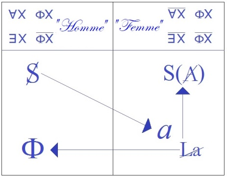
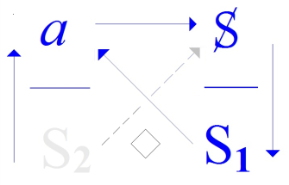
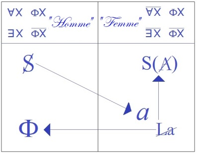
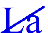
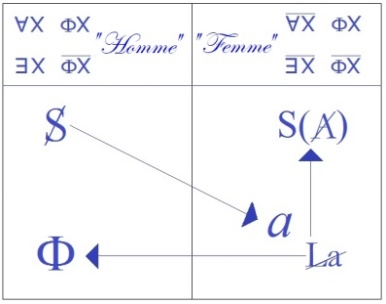
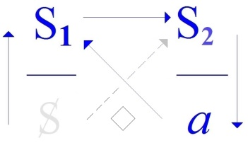
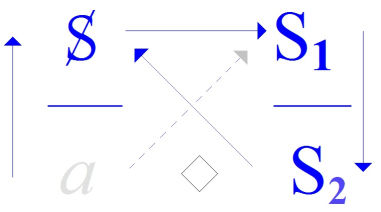

# Leçon 08 | 13 Mars 1973

  <label><input type="checkbox" data-lacan-toggle="original" checked> 原文</label>
  <label><input type="checkbox" data-lacan-toggle="notes" checked> 注释</label>
  <label><input type="checkbox" data-lacan-toggle="commentary" checked> 个人解读评论</label>

<section class="parallel-paragraph" data-paragraph-ids="s20-08-0001">

s20-08-0001

[无对应译文]

原文 · s20-08-0001

</section>

<section class="parallel-paragraph" data-paragraph-ids="s20-08-0002">

s20-08-0002

[无对应译文]

原文 · s20-08-0002

Après ce que je viens de vous mettre au tableau, vous pourriez croire que vous savez tout.

</section>

<section class="parallel-paragraph" data-paragraph-ids="s20-08-0003">

s20-08-0003

[无对应译文]

原文 · s20-08-0003

Il faut vous en garder justement, parce que nous allons aujourd’hui essayer de parler du savoir.

</section>

<section class="parallel-paragraph" data-paragraph-ids="s20-08-0004">

s20-08-0004

[无对应译文]

原文 · s20-08-0004

De ce savoir que dans l’inscription des discours...

</section>

<section class="parallel-paragraph" data-paragraph-ids="s20-08-0005">

s20-08-0005

[无对应译文]

原文 · s20-08-0005

> ceux dont j’ai cru pouvoir vous exemplifier que se supporte le lien social ...dans cette inscription des discours, j’ai mis, j’ai écrit S2 pour symboliser ce *savoir*.

</section>

<section class="parallel-paragraph" data-paragraph-ids="s20-08-0006">

s20-08-0006

[无对应译文]

原文 · s20-08-0006

   

</section>

<section class="parallel-paragraph" data-paragraph-ids="s20-08-0007">

s20-08-0007

[无对应译文]

原文 · s20-08-0007

*Discours du Maître Discours de l’Hystérique Discours Universitaire Discours analytique*

</section>

<section class="parallel-paragraph" data-paragraph-ids="s20-08-0008">

s20-08-0008

[无对应译文]

原文 · s20-08-0008

Peut-être arriverai-je à vous faire sentir pourquoi, pourquoi ça va plus loin qu’une *secondarité*...

</section>

<section class="parallel-paragraph" data-paragraph-ids="s20-08-0009">

s20-08-0009

[无对应译文]

原文 · s20-08-0009

> par rapport au *signifiant pur*, à celui qui s’inscrit du S1 ...que c’est plus qu’une *secondarité* \[S2\], que c’est une désarticulation fondamentale. \[*à poser la relation de* S1 *à* S2 *on aboutit à une impasse pour chaque produit du discours* : S2 ◊ a (H), a ◊ S (M), S ◊ S1 (U)\]

</section>

<section class="parallel-paragraph" data-paragraph-ids="s20-08-0010">

s20-08-0010

[无对应译文]

原文 · s20-08-0010

Quoi qu’il en soit, puisque j’ai pris le parti de vous donner ce support de cette inscription au tableau.

</section>

<section class="parallel-paragraph" data-paragraph-ids="s20-08-0011">

s20-08-0011

[无对应译文]

原文 · s20-08-0011

Je vais la commenter, j’espère brièvement.

</section>

<section class="parallel-paragraph" data-paragraph-ids="s20-08-0012">

s20-08-0012

[无对应译文]

原文 · s20-08-0012

D’ailleurs je ne l’ai - il faut que je vous l’avoue - nulle part écrite, nulle part préparée, elle ne me paraît pas exemplaire sinon, comme d’habitude, à produire des malentendus.

</section>

<section class="parallel-paragraph" data-paragraph-ids="s20-08-0013">

s20-08-0013

[无对应译文]

原文 · s20-08-0013

</section>

<section class="parallel-paragraph" data-paragraph-ids="s20-08-0014">

s20-08-0014

[无对应译文]

原文 · s20-08-0014

Néanmoins, puisqu’en somme la situation qui résulte *d’un discours comme l’analytique*, qui vise au « sens », il est tout à fait clair que *je ne puis vous livrer* à chacun, *que ce que de sens, vous êtes en route d’absorber*, et ça a une limite.

</section>

<section class="parallel-paragraph" data-paragraph-ids="s20-08-0015">

s20-08-0015

[无对应译文]

原文 · s20-08-0015

Ça a une limite qui est donnée par... par le sens où vous vivez, et qui - on peut bien le dire – ce n’est pas trop dire que de dire qu’il ne va pas loin \[*cf. le disque-coucourant, mais aussi le fantasme :* S ◊ a\].

</section>

<section class="parallel-paragraph" data-paragraph-ids="s20-08-0016">

s20-08-0016

[无对应译文]

原文 · s20-08-0016

Ce que *le discours analytique* fait surgir, c’est justement l’idée que *ce « sens » est de semblant*.

</section>

<section class="parallel-paragraph" data-paragraph-ids="s20-08-0017">

s20-08-0017

[无对应译文]

原文 · s20-08-0017

S’il indique - le *discours analytique* - s’il indique que ce sens \[S1\] est sexuel, ce ne peut être justement qu’à - je dirai - rendre raison de sa limite \[S1 ◊ S2\].

</section>

<section class="parallel-paragraph" data-paragraph-ids="s20-08-0018">

s20-08-0018

[无对应译文]

原文 · s20-08-0018

Il n’y a nulle part de dernier mot, si ce n’est au sens : « *mot »* c’est *« motus »*, j’y ai déjà insisté : « *pas de réponse, mot* » dit quelque part La Fontaine[^71] si je m’en souviens encore.

</section>

<section class="parallel-paragraph" data-paragraph-ids="s20-08-0019">

s20-08-0019

[无对应译文]

原文 · s20-08-0019

Le « sens » indique très précisément la direction vers laquelle il échoue.

</section>

<section class="parallel-paragraph" data-paragraph-ids="s20-08-0020">

s20-08-0020

[无对应译文]

原文 · s20-08-0020

Ceci étant posé, qui doit vous garder...

</section>

<section class="parallel-paragraph" data-paragraph-ids="s20-08-0021">

s20-08-0021

[无对应译文]

原文 · s20-08-0021

> jusqu’au point où je pourrai en pousser mon élucidation cette année, ...de comprendre trop vite ce qui se supporte de cette inscription.

</section>

<section class="parallel-paragraph" data-paragraph-ids="s20-08-0022">

s20-08-0022

[无对应译文]

原文 · s20-08-0022

À partir de là, c’est-à-dire prises toutes ces précautions qui sont de prudence...

</section>

<section class="parallel-paragraph" data-paragraph-ids="s20-08-0023">

s20-08-0023

[无对应译文]

原文 · s20-08-0023

> de φρόνησις \[phronesis\], comme on s’exprime dans la langue grecque, où bien des choses ont été dites,
>
> mais qui sont restées loin en somme de ce que *le discours analytique* nous permet d’articuler ...prises donc ces précautions de prudence, voici à peu près ce qui est inscrit au tableau.

</section>

<section class="parallel-paragraph" data-paragraph-ids="s20-08-0024">

s20-08-0024

[无对应译文]

原文 · s20-08-0024

</section>

<section class="parallel-paragraph" data-paragraph-ids="s20-08-0025">

s20-08-0025

[无对应译文]

原文 · s20-08-0025

Le rappel des termes propositionnels, au sens mathématique, par où qui que ce soit de *l’être parlant* s’inscrit à gauche \[« *Homme* »\], ou bien à droite \[« *Femme* »\].

</section>

<section class="parallel-paragraph" data-paragraph-ids="s20-08-0026">

s20-08-0026

[无对应译文]

原文 · s20-08-0026

Cette inscription étant dominée par le fait qu’à gauche... à gauche ce qui répond au « *tout homme »* \[;\], c’est en *fonction* dite ! qu’il prend comme « *tout »* son inscription : ; !, à ceci près que cette fonction trouve *sa limite* dans l’existence d’un X par quoi la fonction ! est niée : :§.

</section>

<section class="parallel-paragraph" data-paragraph-ids="s20-08-0027">

s20-08-0027

[无对应译文]

原文 · s20-08-0027

C’est ce qu’on appelle « *la fonction du père »* d’où procède, en somme par cette négation de la proposition !, ce qui fonde l’exercice de *ce qui supplée au rapport sexuel* \[*fonction phallique*\] - en tant que celui-ci *n’est d’aucune façon inscriptible*, *ce qui y supplée par la castration. Le « tout » repose donc ici sur l’exception posée comme terme, sur ce qui* - ce ! *- intégralement le nie*.

</section>

<section class="parallel-paragraph" data-paragraph-ids="s20-08-0028">

s20-08-0028

[无对应译文]

原文 · s20-08-0028

Par contre, en face vous avez l’inscription de ceci : que pour une part des êtres parlants, et aussi bien à tout être parlant...

</section>

<section class="parallel-paragraph" data-paragraph-ids="s20-08-0029">

s20-08-0029

[无对应译文]

原文 · s20-08-0029

> comme il se formule expressément dans la théorie freudienne ...à tout être parlant il est permis, quel qu’il soit : pourvu ou non des attributs de la masculinité...

</section>

<section class="parallel-paragraph" data-paragraph-ids="s20-08-0030">

s20-08-0030

[无对应译文]

原文 · s20-08-0030

> attributs qui restent à déterminer ...pourvu ou non de ces attributs, il peut s’inscrire dans l’autre part, et *ce* comme quoi il s’inscrit c’est justement de ne permettre aucune universalité, d’être ce « *pas tout* » \[.\], en tant qu’il a en somme le choix

</section>

<section class="parallel-paragraph" data-paragraph-ids="s20-08-0031">

s20-08-0031

[无对应译文]

原文 · s20-08-0031

- de se poser dans le !,

</section>

<section class="parallel-paragraph" data-paragraph-ids="s20-08-0032">

s20-08-0032

[无对应译文]

原文 · s20-08-0032

- ou bien de n’en pas être.

</section>

<section class="parallel-paragraph" data-paragraph-ids="s20-08-0033">

s20-08-0033

[无对应译文]

原文 · s20-08-0033

Telles sont les seules définitions possibles de la part dite « *homme »* ou bien « *femme »,* dans ce qui se trouve être dans cette position d’*habiter le langage*.

</section>

<section class="parallel-paragraph" data-paragraph-ids="s20-08-0034">

s20-08-0034

[无对应译文]

原文 · s20-08-0034

</section>

<section class="parallel-paragraph" data-paragraph-ids="s20-08-0035">

s20-08-0035

[无对应译文]

原文 · s20-08-0035

Au-dessous, sous la barre, la barre transversale où se croise la division verticale de ce qu’on appelle improprement « l’humanité » en tant qu’elle se répartirait en identifications sexuelles, vous avez l’indication, l’indication scandée, de ce dont il s’agit, c’est à savoir qu’à la place du partenaire sexuel du côté de l’homme, de cet homme que j’ai...

</section>

<section class="parallel-paragraph" data-paragraph-ids="s20-08-0036">

s20-08-0036

[无对应译文]

原文 · s20-08-0036

> non certes pour le privilégier d’aucune façon ...inscrit ici du S, et de ce Φ qui le supporte comme *signifiant* \[**S1**\] :

</section>

<section class="parallel-paragraph" data-paragraph-ids="s20-08-0037">

s20-08-0037

[无对应译文]

原文 · s20-08-0037

- Ce Φ qui aussi bien s’incarne dans le S1, d’être entre tous les signifiants celui qui paradoxalement, à ne jouer le rôle que de la fonction dans le ! \[!: ; !\] - est justement *ce signifiant dont il n’y a pas de signifié*, qui quant au *sens* en symbolise l’échec, le *mé-sens*, qui est *l’indé-sens* par excellence, ou si vous voulez encore le *réti-sens*.

</section>

<section class="parallel-paragraph" data-paragraph-ids="s20-08-0038">

s20-08-0038

[无对应译文]

原文 · s20-08-0038

- ce S ainsi doublé de ce signifiant \[Φ\] dont en somme il ne dépend même pas \[**S** : : §\], *ce* S n’a jamais affaire, en tant que partenaire, qu’à cet *objet(a)* \[S◊a\] inscrit comme tel de l’autre côté de la barre.

</section>

<section class="parallel-paragraph" data-paragraph-ids="s20-08-0039">

s20-08-0039

[无对应译文]

原文 · s20-08-0039

Il ne lui est donné d’atteindre ce partenaire...

</section>

<section class="parallel-paragraph" data-paragraph-ids="s20-08-0040">

s20-08-0040

[无对应译文]

原文 · s20-08-0040

> ce partenaire qui est l’Autre, l’Autre avec un grand A ...que par l’intermédiaire de ceci : *qu’il est la cause de son désir*, mais qu’à ce titre

</section>

<section class="parallel-paragraph" data-paragraph-ids="s20-08-0041">

s20-08-0041

[无对应译文]

原文 · s20-08-0041

> comme l’indique ailleurs dans mes graphes la conjonction pointée de ce S et de ce *a* \[S◊a\] ...qu’il n’est rien d’autre que *fantasme*.

</section>

<section class="parallel-paragraph" data-paragraph-ids="s20-08-0042">

s20-08-0042

[无对应译文]

原文 · s20-08-0042

Ce *fantasme* fait aussi bien pour ce sujet...

</section>

<section class="parallel-paragraph" data-paragraph-ids="s20-08-0043">

s20-08-0043

[无对应译文]

原文 · s20-08-0043

> en tant qu’il y est pris comme tel ...le support de ce qu’on appelle expressément dans la théorie freudienne « *le principe de réalité »*.

</section>

<section class="parallel-paragraph" data-paragraph-ids="s20-08-0044">

s20-08-0044

[无对应译文]

原文 · s20-08-0044

Ce que j’aborde cette année \[*l’autre côté*\] est très précisément ceci que la théorie...

</section>

<section class="parallel-paragraph" data-paragraph-ids="s20-08-0045">

s20-08-0045

[无对应译文]

原文 · s20-08-0045

> l’articulation théorique de Freud, ...très précisément ceci que dans Freud est laissé de côté, est laissé de côté expressément, d’une façon avouée, le *« Was will das Weib ? »,* le *« Que veut la Femme ? »,* que la théorie de Freud comme telle expressément avoue ignorer.

</section>

<section class="parallel-paragraph" data-paragraph-ids="s20-08-0046">

s20-08-0046

[无对应译文]

原文 · s20-08-0046

Freud avance qu’il n’y a de *libido* que masculine.

</section>

<section class="parallel-paragraph" data-paragraph-ids="s20-08-0047">

s20-08-0047

[无对应译文]

原文 · s20-08-0047

Qu’est-ce à dire, sinon qu’un champ qui n’est tout de même pas rien, celui de tous les êtres qui, comme on dit, d’*assumer*...

</section>

<section class="parallel-paragraph" data-paragraph-ids="s20-08-0048">

s20-08-0048

[无对应译文]

原文 · s20-08-0048

> si l’on peut dire et si tant est que cet être assume, assume quoi que ce soit de son sort ...ce qui s’appelle *improprement* \[*La femme*\], puisqu’ici je vous rappelle ce que j’ai souligné la dernière fois, c’est que ce « La » de « La femme », à partir du moment où il ne s’énonce que d’un « *pas tout* », ne peut s’écrire... qu’il n’y a ici de « La » que barré : 

</section>

<section class="parallel-paragraph" data-paragraph-ids="s20-08-0049">

s20-08-0049

[无对应译文]

原文 · s20-08-0049

*Ce* *, expressément est ce qui a rapport*...

</section>

<section class="parallel-paragraph" data-paragraph-ids="s20-08-0050">

s20-08-0050

[无对应译文]

原文 · s20-08-0050

> et ce que je vous illustrerai aujourd’hui, du moins je l’espère ...*avec ce « signifiant de A en tant que barré » *: *S(A), en tant que ce lieu de l’Autre lui-même...*

</section>

<section class="parallel-paragraph" data-paragraph-ids="s20-08-0051">

s20-08-0051

[无对应译文]

原文 · s20-08-0051

> là où vient s’inscrire tout ce qui peut s’articuler du signifiant \[*mais* S(A), → *tout ne peut s’y articuler*\], *...est dans son fondement, de par sa nature, si radicalement l’Autre*, que c’est cet Autre qu’il importe d’interroger.

</section>

<section class="parallel-paragraph" data-paragraph-ids="s20-08-0052">

s20-08-0052

[无对应译文]

原文 · s20-08-0052

S’il n’est pas simplement ce lieu où la vérité balbutie, mais s’il mérite de quelque façon de représenter ce à quoi...

</section>

<section class="parallel-paragraph" data-paragraph-ids="s20-08-0053">

s20-08-0053

[无对应译文]

原文 · s20-08-0053

> comme la dernière fois, et de façon en quelque sorte *métaphorique,* je vous ai adressé ceci :
>
> que du départ, du départ dont s’articule l’inconscient,  femme...
>
>  femme comme nous n’en avons assurément que des témoignages sporadiques,
>
> c’est pour cela que je les ai pris la dernière fois dans leur fonction de métaphore ... *femme a foncièrement ce rapport à l’Autre que d’être, dans le rapport sexuel*...

</section>

<section class="parallel-paragraph" data-paragraph-ids="s20-08-0054">

s20-08-0054

[无对应译文]

原文 · s20-08-0054

> par rapport à ce qui s’énonce, à ce qui peut se dire de l’inconscient ...*radicalement l’Autre*, *elle est ce qui a rapport à cet Autre*.

</section>

<section class="parallel-paragraph" data-paragraph-ids="s20-08-0055">

s20-08-0055

[无对应译文]

原文 · s20-08-0055

Et c’est là ce qu’aujourd’hui je voudrais tenter d’articuler de plus près.

</section>

<section class="parallel-paragraph" data-paragraph-ids="s20-08-0056">

s20-08-0056

[无对应译文]

原文 · s20-08-0056

C’est au signifiant de cet Autre, en tant que comme Autre je dirai, il ne peut rester que toujours Autre, assurément, ici, nous ne pouvons que procéder que d’un frayage aussi difficile qu’il est possible d’en appréhender aucun.

</section>

<section class="parallel-paragraph" data-paragraph-ids="s20-08-0057">

s20-08-0057

[无对应译文]

原文 · s20-08-0057

Et c’est pourquoi en m’y aventurant comme je fais à chaque fois devant vous, je ne puis ici que supposer que vous évoquerez...

</section>

<section class="parallel-paragraph" data-paragraph-ids="s20-08-0058">

s20-08-0058

[无对应译文]

原文 · s20-08-0058

> et pour cela il faut que je vous le rappelle ...qu’*il n’y a pas d’Autre de l’Autre*, que c’est pour cela que ce signifiant, avec cette parenthèse ouverte : S(A), marque cet Autre comme *barré*.

</section>

<section class="parallel-paragraph" data-paragraph-ids="s20-08-0059">

s20-08-0059

[无对应译文]

原文 · s20-08-0059

> \[*que des* **S1** « *en essaim* » : **S1**, **S1**, **S1**, **S1**, **S1**, **S1**, **S1**, **S1**... *ad libitum*,
>
> *mais jamais de* **S2** *qui viendrait* « *faire pièce* » *au* **S1**, *sauf comme semblant de* **S2** *dans l’Autre du langage*,
>
> *mais* *jamais d’Autre de l’Autre, jamais d*e **S2** *de* *La Femme*, → « *<u>La</u> Femme n’existe pas* », *seulement **L** femme*\]

</section>

<section class="parallel-paragraph" data-paragraph-ids="s20-08-0060">

s20-08-0060

[无对应译文]

原文 · s20-08-0060

Comment pouvons-nous donc approcher, concevoir que ce rapport à l’Autre puisse être quelque part ce qui détermine qu’une moitié...

</section>

<section class="parallel-paragraph" data-paragraph-ids="s20-08-0061">

s20-08-0061

[无对应译文]

原文 · s20-08-0061

> puisqu’aussi bien c’est grossièrement la proportion biologique ...qu’une moitié de l’être parlant se réfère ?

</section>

<section class="parallel-paragraph" data-paragraph-ids="s20-08-0062">

s20-08-0062

[无对应译文]

原文 · s20-08-0062

</section>

<section class="parallel-paragraph" data-paragraph-ids="s20-08-0063">

s20-08-0063

[无对应译文]

原文 · s20-08-0063

C’est pourtant ce qui est là écrit au tableau par cette flèche partant du , de ce  qui ne peut se dire.

</section>

<section class="parallel-paragraph" data-paragraph-ids="s20-08-0064">

s20-08-0064

[无对应译文]

原文 · s20-08-0064

Rien ne peut se dire de «  *femme* ».

</section>

<section class="parallel-paragraph" data-paragraph-ids="s20-08-0065">

s20-08-0065

[无对应译文]

原文 · s20-08-0065

«  *femme »* a un rapport :

</section>

<section class="parallel-paragraph" data-paragraph-ids="s20-08-0066">

s20-08-0066

[无对应译文]

原文 · s20-08-0066

- rapport à ce S(A) d’une part,

</section>

<section class="parallel-paragraph" data-paragraph-ids="s20-08-0067">

s20-08-0067

[无对应译文]

原文 · s20-08-0067

- et c’est en cela déjà qu’elle se dédouble, qu’elle n’est *« pas toute »*, puisque d’autre part elle peut avoir ce rapport

</section>

<section class="parallel-paragraph" data-paragraph-ids="s20-08-0068">

s20-08-0068

[无对应译文]

原文 · s20-08-0068

> avec ce grand Φ que dans la théorie analytique nous désignons de ce *phallus,*
>
> tel que je le précise d’être le signifiant, le signifiant qui n’a pas de signifié \[**S1**\].

</section>

<section class="parallel-paragraph" data-paragraph-ids="s20-08-0069">

s20-08-0069

[无对应译文]

原文 · s20-08-0069

Celui-là même qui se supporte, qui se supporte chez l’homme de *cette jouissance*, de *cette jouissance* dont, comme ça pour la pointer, je vous dirai, j’avancerai aujourd’hui que ce qui le mieux le symbolise, qu’est-ce après tout sinon ceci...

</section>

<section class="parallel-paragraph" data-paragraph-ids="s20-08-0070">

s20-08-0070

[无对应译文]

原文 · s20-08-0070

> que l’importance de la masturbation suffisamment dans notre pratique souligne ...qu’est-ce qu’elle est sinon ceci qui n’est rien d’autre - dans les cas si je puis dire favorables - que *la jouissance de l’idiot* ?

</section>

<section class="parallel-paragraph" data-paragraph-ids="s20-08-0071">

s20-08-0071

[无对应译文]

原文 · s20-08-0071

Léger mouvement ! \[*Rires*\] Après ça, pour vous remettre \[*Rires*\], il ne me reste plus qu’à vous parler d’*amour*. \[*Rires*\]

</section>

<section class="parallel-paragraph" data-paragraph-ids="s20-08-0072">

s20-08-0072

[无对应译文]

原文 · s20-08-0072

Quel sens cela peut-il avoir, quel sens y a-t-il à ce que j’en vienne à vous parler *d’amour* ? \[*l’amour est le signe du changement de discours*\]

</section>

<section class="parallel-paragraph" data-paragraph-ids="s20-08-0073">

s20-08-0073

[无对应译文]

原文 · s20-08-0073

Je dois dire que c’est *peu compatible* avec la position d’où ici je vous énonce...

</section>

<section class="parallel-paragraph" data-paragraph-ids="s20-08-0074">

s20-08-0074

[无对应译文]

原文 · s20-08-0074

*Qu’est-ce qu’il y a, ça ne va pas ? Et comme ça, comme ça, ça va mieux ? Est-ce que ceux du fond entendent ? Non !*

</section>

<section class="parallel-paragraph" data-paragraph-ids="s20-08-0075">

s20-08-0075

[无对应译文]

原文 · s20-08-0075

Ceci est peu - disais-je - compatible avec ce qu’il faut bien dire que - depuis le temps ! - je ne cesse de poursuivre, c’est-à-dire cette direction d’où le discours analytique peut faire *semblant* de quelque chose qui serait *science*.

</section>

<section class="parallel-paragraph" data-paragraph-ids="s20-08-0076">

s20-08-0076

[无对应译文]

原文 · s20-08-0076

Car enfin ce *« qui serait science »* vous en êtes très peu conscients, bien sûr vous avez quelques repères.

</section>

<section class="parallel-paragraph" data-paragraph-ids="s20-08-0077">

s20-08-0077

[无对应译文]

原文 · s20-08-0077

\[*l’amour n’est pas objet « sérieux » de science, cf. L’étourdit : « science sans conscience » et la référence au « gay sçavoir » de Rabelais*\]

</section>

<section class="parallel-paragraph" data-paragraph-ids="s20-08-0078">

s20-08-0078

[无对应译文]

原文 · s20-08-0078

Vous savez, j’y ai mis... parce que je croyais que c’était une bonne étape à vous le faire repérer dans l’histoire, vous savez qu’il y a eu un moment où on a – non sans fondement – pu se décerner cette assurance que le discours scientifique, ça, c’était fondé.

</section>

<section class="parallel-paragraph" data-paragraph-ids="s20-08-0079">

s20-08-0079

[无对应译文]

原文 · s20-08-0079

Le point tournant galiléen, j’y ai - il me semble - suffisamment insisté pour supposer, qu’à tout le moins, certains de vous ont été aux sources, là où ça se repère : l’œuvre de Koyré Alexandre, depuis le temps, je pense, est au moins de la pratique d’une partie de cette assemblée.

</section>

<section class="parallel-paragraph" data-paragraph-ids="s20-08-0080">

s20-08-0080

[无对应译文]

原文 · s20-08-0080

Mais ce qu’il faut voir c’est à quel point c’est un pas, un pas vraiment subversif, au regard de ce qui jusque là s’est intitulé *« connaissance »*.

</section>

<section class="parallel-paragraph" data-paragraph-ids="s20-08-0081">

s20-08-0081

[无对应译文]

原文 · s20-08-0081

Il est très difficile de soutenir, de maintenir également présents ces deux termes \[*amour* (**S1**→ *bêtises*) *et science* (**S2**)\], à savoir que le discours scientifique a engendré toutes sortes d’instruments qu’il nous faut bien, du point de vue dont il s’agit ici, qualifier de ce qu’ils sont :

</section>

<section class="parallel-paragraph" data-paragraph-ids="s20-08-0082">

s20-08-0082

[无对应译文]

原文 · s20-08-0082

- tous ces « *gadgets* » dont vous êtes désormais les sujets - infiniment plus loin que vous ne le pensez,

</section>

<section class="parallel-paragraph" data-paragraph-ids="s20-08-0083">

s20-08-0083

[无对应译文]

原文 · s20-08-0083

- tous ces *instruments* qui - mon Dieu - du microscope jusqu’à la radio-télé, n’est-ce pas ? - deviennent des éléments, des éléments de votre existence. \[*→ objets a substitutifs (« Plus de jouir ») visant à suppléer à l’absence du rapport sexuel, → pas de place pour l’amour*\]

</section>

<section class="parallel-paragraph" data-paragraph-ids="s20-08-0084">

s20-08-0084

[无对应译文]

原文 · s20-08-0084

Ceci dont vous ne pouvez actuellement même pas mesurer la portée mais qui n’en fait pas moins partie de ce que j’appelle « *le discours scientifique »*, pour autant qu’un discours c’est ce qui détermine comme telle une forme, une forme complètement renouvelée de lien social. \[*passage du discours* M : S1→ S2→↓a ◊ S, *au discours* H *(scientifique) *: S→ S1→↓S2 ◊ a\]

</section>

<section class="parallel-paragraph" data-paragraph-ids="s20-08-0085">

s20-08-0085

[无对应译文]

原文 · s20-08-0085

Le joint qui ne se fait pas, c’est ceci : c’est que ce que j’ai appelé tout à l’heure *subversion de la connaissance* s’indique de ceci : que jusqu’alors, rien de la connaissance - il faut le dire - ne s’est conçu *sans que rien de ce qui s’est écrit sur cette connaissance ne participe*...

</section>

<section class="parallel-paragraph" data-paragraph-ids="s20-08-0086">

s20-08-0086

[无对应译文]

原文 · s20-08-0086

> et l’on ne peut pas même dire que les sujets de la théorie antique de la connaissance ne l’aient pas su ...*sans que rien de cette théorie* - dis-je - *ne participe du fantasme d’une inscription du lien sexuel*. \[*disc.* M *aboutit au fantasme *: a ◊ S\]

</section>

<section class="parallel-paragraph" data-paragraph-ids="s20-08-0087">

s20-08-0087

[无对应译文]

原文 · s20-08-0087

Les termes d’« *actif »* et de *« passif »* par exemple qui, on peut le dire, dominent tout ce qui a été cogité des rapports de *la forme* et de *la matière*...

</section>

<section class="parallel-paragraph" data-paragraph-ids="s20-08-0088">

s20-08-0088

[无对应译文]

原文 · s20-08-0088

> ce rapport si fondamental auquel se réfère chaque pas platonicien puis aristotélicien,
>
> concernant disons ce qu’il en est de la nature des choses ...il est visible, il est touchable, à chaque pas de ces énoncés, que ce qui les supporte c’est *un fantasme* par *où il est tenté de suppléer à ce qui d’aucune façon ne peut se dire*...

</section>

<section class="parallel-paragraph" data-paragraph-ids="s20-08-0089">

s20-08-0089

[无对应译文]

原文 · s20-08-0089

> c’est là ce que je vous propose comme *dire* ...*à savoir le rapport sexuel*.

</section>

<section class="parallel-paragraph" data-paragraph-ids="s20-08-0090">

s20-08-0090

[无对应译文]

原文 · s20-08-0090

L’étrange est que tout de même, à l’intérieur de cette grossière polarité...

</section>

<section class="parallel-paragraph" data-paragraph-ids="s20-08-0091">

s20-08-0091

[无对应译文]

原文 · s20-08-0091

> celle qui *de la matière fait le passif de la forme, l’agent qui l’anime* \[*cf. « la sphère immobile » d’Aristote comme « âme » : anima*\] ...quelque chose, mais quelque chose d’ambigu, a passé, c’est à savoir que cette « *animation* » \[*Cf. [Aristote : De anima (De l’âme)](http://remacle.org/bloodwolf/philosophes/Aristote/tableame.htm)*\] ce n’est rien d’autre que ce *a* dont *l’agent* « *anime* » - quoi ? - il « *n’anime* » rien : il prend l’*« autre »* pour son *« âme »*.

</section>

<section class="parallel-paragraph" data-paragraph-ids="s20-08-0092">

s20-08-0092

[无对应译文]

原文 · s20-08-0092

\[*Parallèle entre*

</section>

<section class="parallel-paragraph" data-paragraph-ids="s20-08-0093">

s20-08-0093

[无对应译文]

原文 · s20-08-0093

- *la sphère immobile, agent qui anime le monde sublunaire,*

</section>

<section class="parallel-paragraph" data-paragraph-ids="s20-08-0094">

s20-08-0094

[无对应译文]

原文 · s20-08-0094

- *et l’analyste en place de (a) comme agent qui anime le discours de l’analysant* \]

</section>

<section class="parallel-paragraph" data-paragraph-ids="s20-08-0095">

s20-08-0095

[无对应译文]

原文 · s20-08-0095

Mais que d’un autre côté, si nous suivons ce qui progresse au cours des âges de l’idée d’un *être par excellence*, d’un Dieu...

</section>

<section class="parallel-paragraph" data-paragraph-ids="s20-08-0096">

s20-08-0096

[无对应译文]

原文 · s20-08-0096

> qui est bien loin d’être conçu comme le Dieu de la foi chrétienne, puisqu’aussi bien vous le savez c’est *le moteur immobile, la sphère suprême*, ...que dans l’idée que le « *Bien »* c’est ce quelque chose qui fait que tous les autres êtres - moins *être* que celui-là - ils ne peuvent avoir d’autre visée que d’être « *le plus être »* qu’ils peuvent être.

</section>

<section class="parallel-paragraph" data-paragraph-ids="s20-08-0097">

s20-08-0097

[无对应译文]

原文 · s20-08-0097

Et c’est là tout le fondement de l’idée du « *Bien »* dans cette *Éthique* d’Aristote, dont c’est pas pour rien que je vous ai rappelé que non seulement je l’avais traitée, mais que je vous incitais à vous y reporter pour en saisir les impasses.

</section>

<section class="parallel-paragraph" data-paragraph-ids="s20-08-0098">

s20-08-0098

[无对应译文]

原文 · s20-08-0098

Il se trouve tout de même que ce *quelque chose* \[*a comme* *« âme »*\], si nous suivons le support des inscriptions à ce tableau

</section>

<section class="parallel-paragraph" data-paragraph-ids="s20-08-0099">

s20-08-0099

[无对应译文]

原文 · s20-08-0099

</section>

<section class="parallel-paragraph" data-paragraph-ids="s20-08-0100">

s20-08-0100

[无对应译文]

原文 · s20-08-0100

il se révèle que c’est tout de même dans cette opacité, de ce où j’ai la dernière fois expressément désigné qu’était *la jouissance* de cet Autre...

</section>

<section class="parallel-paragraph" data-paragraph-ids="s20-08-0101">

s20-08-0101

[无对应译文]

原文 · s20-08-0101

> *de cet Autre en tant que pourrait l’être, si elle existait, « <u>La</u> femme »* ...que c’est bien à la place de *la jouissance* de cet Autre qu’est désigné cet être mythique...

</section>

<section class="parallel-paragraph" data-paragraph-ids="s20-08-0102">

s20-08-0102

[无对应译文]

原文 · s20-08-0102

> mythique manifestement chez Aristote ...de « *l’être suprême »*, de « *la sphère immobile »* d’où procèdent tous les mouvements quels qu’ils soient : changements, générations, mouvements, translations, augmentations, etc. \[*sur la sphère terrestre*\].

</section>

<section class="parallel-paragraph" data-paragraph-ids="s20-08-0103">

s20-08-0103

[无对应译文]

原文 · s20-08-0103

Comment faire pour approcher dans cette « *ambiguïté* » \[*entre a et* A\], approcher - en somme quoi ? - en l’interprétant, en l’interprétant selon ce qu’il est de notre fonction dans le discours analytique, \[*a* *comme agent* *du discours*\] c’est-à-dire enregistrer, scander ce qui peut se dire comme allant, allant à l’échec, vers la formulation du rapport sexuel.

</section>

<section class="parallel-paragraph" data-paragraph-ids="s20-08-0104">

s20-08-0104

[无对应译文]

原文 · s20-08-0104

Que si nous arrivons à dissocier ceci : que c’est en tant que *sa jouissance* est radicalement Autre que - en somme – **L** *femme a plus rapport à Dieu que tout ce qui* peut se dire en suivant la voie - de quoi ? - de ce qui manifestement dans toute la spéculation antique *ne s’articule que comme « le Bien de l’Homme ».*

</section>

<section class="parallel-paragraph" data-paragraph-ids="s20-08-0105">

s20-08-0105

[无对应译文]

原文 · s20-08-0105

\[*a comme* ἄγαλμα \[agalma\] → L *femme plus proche de* A *que de (a)*\]

</section>

<section class="parallel-paragraph" data-paragraph-ids="s20-08-0106">

s20-08-0106

[无对应译文]

原文 · s20-08-0106

Si en d’autres termes nous pouvons...

</section>

<section class="parallel-paragraph" data-paragraph-ids="s20-08-0107">

s20-08-0107

[无对应译文]

原文 · s20-08-0107

<u>*ce qui est notre fin*,</u> la fin de notre enseignement pour autant qu’il poursuit que ce qui se peut se dire et s’énoncer *<u>du discours analytique, c’est de dissocier ce petit (a) et ce grand A</u>* :

</section>

<section class="parallel-paragraph" data-paragraph-ids="s20-08-0108">

s20-08-0108

[无对应译文]

原文 · s20-08-0108

- en réduisant le premier à ce qui est de l’*imaginaire*,

</section>

<section class="parallel-paragraph" data-paragraph-ids="s20-08-0109">

s20-08-0109

[无对应译文]

原文 · s20-08-0109

- et l’autre à ce qui est du *symbolique*.

</section>

<section class="parallel-paragraph" data-paragraph-ids="s20-08-0110">

s20-08-0110

[无对应译文]

原文 · s20-08-0110

*Que le symbolique soit* le support de *ce qui a été fait Dieu,* *c’est hors de doute*. \[*cf. aussi *: *Durkheim*, *Les formes élémentaires de la vie religieuse*\]

</section>

<section class="parallel-paragraph" data-paragraph-ids="s20-08-0111">

s20-08-0111

[无对应译文]

原文 · s20-08-0111

*Que* ce qu’il en est de *l’imaginaire c’est* ce qui se supporte de *ce « reflet » du semblable au semblable*, c’est ce qui est certain.

</section>

<section class="parallel-paragraph" data-paragraph-ids="s20-08-0112">

s20-08-0112

[无对应译文]

原文 · s20-08-0112

Comment en somme ce *a* - de s’inscrire juste au-dessous de ce S(A) - ait pu...

</section>

<section class="parallel-paragraph" data-paragraph-ids="s20-08-0113">

s20-08-0113

[无对应译文]

原文 · s20-08-0113

> dans notre inscription au tableau ...*ait pu* jusqu’à un certain terme, *prêter* en somme *à confusion*, et ceci très exactement *par l’intermédiaire de la fonction de l’être*.

</section>

<section class="parallel-paragraph" data-paragraph-ids="s20-08-0114">

s20-08-0114

[无对应译文]

原文 · s20-08-0114

C’est assurément ce en quoi *quelque chose*, si je puis dire, *reste à décoller, reste à scinder*, et précisément en ce point où la psychanalyse est autre chose qu’une psychologie.

</section>

<section class="parallel-paragraph" data-paragraph-ids="s20-08-0115">

s20-08-0115

[无对应译文]

原文 · s20-08-0115

La psychologie, c’est cette scission non encore faite.

</section>

<section class="parallel-paragraph" data-paragraph-ids="s20-08-0116">

s20-08-0116

[无对应译文]

原文 · s20-08-0116

\[*confusion de* *a* *avec* A *→ fondement de l’être dans la Raison, la Conscience, etc. → « l’inconscient » comme ce qui n’est pas (encore) su, cf. Hegel et le « savoir absolu »*\]

</section>

<section class="parallel-paragraph" data-paragraph-ids="s20-08-0117">

s20-08-0117

[无对应译文]

原文 · s20-08-0117

Et là pour me reposer, je vais me permettre - mon Dieu - de vous faire part...

</section>

<section class="parallel-paragraph" data-paragraph-ids="s20-08-0118">

s20-08-0118

[无对应译文]

原文 · s20-08-0118

> je ne dis pas à proprement parler *de vous lire,*
>
> parce que je ne suis jamais sûr de *« lire »* jamais quoi que ce soit, ...de vous lire tout de même ce que je vous ai, il y a quelque temps *écrit*, *écrit* justement - *écrit* sur quoi ? - *écrit* là seulement d’où il se peut qu’on *parle d’amour*.

</section>

<section class="parallel-paragraph" data-paragraph-ids="s20-08-0119">

s20-08-0119

[无对应译文]

原文 · s20-08-0119

Car *parler d’amour* on ne fait que ça dans le *discours analytique*.

</section>

<section class="parallel-paragraph" data-paragraph-ids="s20-08-0120">

s20-08-0120

[无对应译文]

原文 · s20-08-0120

Et après la découverte du *discours scientifique,* comment ne pas sentir, toucher du doigt que c’est une perte de temps, très exactement perte de temps au regard de tout ce qui peut s’articuler de scientifique.

</section>

<section class="parallel-paragraph" data-paragraph-ids="s20-08-0121">

s20-08-0121

[无对应译文]

原文 · s20-08-0121

Mais que ce que le *discours analytique* apporte...

</section>

<section class="parallel-paragraph" data-paragraph-ids="s20-08-0122">

s20-08-0122

[无对应译文]

原文 · s20-08-0122

> et c’est peut-être ça après tout la raison de son émergence en un certain point du discours scientifique, ...c’est que parler d’amour est en soi une jouissance.

</section>

<section class="parallel-paragraph" data-paragraph-ids="s20-08-0123">

s20-08-0123

[无对应译文]

原文 · s20-08-0123

Ce qui se confirme assurément de cet effet, effet tangible, que « *dire n’importe quoi »*...

</section>

<section class="parallel-paragraph" data-paragraph-ids="s20-08-0124">

s20-08-0124

[无对应译文]

原文 · s20-08-0124

> consigne même du discours de l’analysant ...*est ce qui mène au Lustprinzip*, et ce qui y mène de la façon la plus directe, et sans avoir aucun besoin de cette accession aux sphères supérieures, qui est le fondement de l’éthique aristotélicienne pour autant que...

</section>

<section class="parallel-paragraph" data-paragraph-ids="s20-08-0125">

s20-08-0125

[无对应译文]

原文 · s20-08-0125

> je vous l’évoquais tout à l’heure brièvement ...en tant qu’en somme elle ne se fonde que de la coalescence, que de la confusion de ce *(a)* avec le S(A).

</section>

<section class="parallel-paragraph" data-paragraph-ids="s20-08-0126">

s20-08-0126

[无对应译文]

原文 · s20-08-0126

Il n’est *barré*, bien sûr, que par nous. Ça ne veut pas dire qu’il suffise de barrer *pour que rien n’en ex-siste *: il est certain que si <u>*ce* S(A) *je n’en désigne rien d’autre que la jouissance de* </u> *<u>femme</u>*, c’est bien assurément parce que c’est là que je pointe que Dieu n’a pas encore fait son *exit*.

</section>

<section class="parallel-paragraph" data-paragraph-ids="s20-08-0127">

s20-08-0127

[无对应译文]

原文 · s20-08-0127

\[*si Dieu exit* →/ §*, mais il reste le « pas tout » *: . !\]

</section>

<section class="parallel-paragraph" data-paragraph-ids="s20-08-0128">

s20-08-0128

[无对应译文]

原文 · s20-08-0128

Alors voici à peu près ce que j’écrivais à votre usage, je vous écrivais quoi en somme ?

</section>

<section class="parallel-paragraph" data-paragraph-ids="s20-08-0129">

s20-08-0129

[无对应译文]

原文 · s20-08-0129

La seule chose qu’on puisse faire d’un peu sérieux : *la lettre d’amour*.

</section>

<section class="parallel-paragraph" data-paragraph-ids="s20-08-0130">

s20-08-0130

[无对应译文]

原文 · s20-08-0130

Les supposés psychologiques grâce à quoi tout ceci a duré si longtemps, eh bien je suis de ceux qui ne leur font pas une bonne réputation.

</section>

<section class="parallel-paragraph" data-paragraph-ids="s20-08-0131">

s20-08-0131

[无对应译文]

原文 · s20-08-0131

On ne voit pas pourtant, pourquoi le fait d’avoir *une âme* serait un scandale pour la pensée, si c’était vrai.

</section>

<section class="parallel-paragraph" data-paragraph-ids="s20-08-0132">

s20-08-0132

[无对应译文]

原文 · s20-08-0132

Si c’était vrai l’âme ne pourrait se *dire*...

</section>

<section class="parallel-paragraph" data-paragraph-ids="s20-08-0133">

s20-08-0133

[无对应译文]

原文 · s20-08-0133

> c’est ça que je vous ai écrit ...que de ce qui permet à un *être*...

</section>

<section class="parallel-paragraph" data-paragraph-ids="s20-08-0134">

s20-08-0134

[无对应译文]

原文 · s20-08-0134

> à *l’être parlant* pour l’appeler par son nom ...de supporter l’intolérable de son monde, ce qui la suppose d’y être *étrangère*, c’est-à-dire *fantasmatique*.

</section>

<section class="parallel-paragraph" data-paragraph-ids="s20-08-0135">

s20-08-0135

[无对应译文]

原文 · s20-08-0135

Ce qui - cette *âme* - ne l’y considère - « *l’y* » : dans ce monde - que de sa patience et de son courage à y faire tête, ceci s’affirme de ce que jusqu’à nos jours, elle n’a, *l’âme,* jamais eu d’autre sens.

</section>

<section class="parallel-paragraph" data-paragraph-ids="s20-08-0136">

s20-08-0136

[无对应译文]

原文 · s20-08-0136

Eh bien c’est là que le français doit m’apporter *une aide*, non pas comme il arrive dans la langue quelquefois, *d’homonymie...*

</section>

<section class="parallel-paragraph" data-paragraph-ids="s20-08-0137">

s20-08-0137

[无对应译文]

原文 · s20-08-0137

> de ce *d’eux (d, apostrophe)* avec le *deux (d.e.u.x),*
>
> de ce que, avec le *peut (p.e.u.t et p.e.u*), il peut peu, qui est tout de même là bien pour nous servir à quelque chose ...et c’est là que la langue sert : *l’âme en français*, au point où j’en suis, je ne peux m’en servir qu’à dire que *c’est ce qu’on âme* : *j’âme*, *tu âmes*, *il âme*, vous voyez là que nous ne pouvons nous servir que de l’écriture, même à y inclure jamais: *j’âmais.*

</section>

<section class="parallel-paragraph" data-paragraph-ids="s20-08-0138">

s20-08-0138

[无对应译文]

原文 · s20-08-0138

Son existence donc, *à l’âme,* peut être certes *mise en cause* \[*(a) comme « objet » cause du désir*\], c’est le terme propre à se demander si ce n’est pas *un effet de l’amour.*

</section>

<section class="parallel-paragraph" data-paragraph-ids="s20-08-0139">

s20-08-0139

[无对应译文]

原文 · s20-08-0139

Tant - en effet - que *l’âme « âme » l’âme* \[*narcissisme*\], il n’y a pas de sexe dans l’affaire \[*hors sexe*\], le sexe n’y compte pas \[*le sexe amène l’hétéros*\].

</section>

<section class="parallel-paragraph" data-paragraph-ids="s20-08-0140">

s20-08-0140

[无对应译文]

原文 · s20-08-0140

L’élaboration dont elle résulte est *hommo...*

</section>

<section class="parallel-paragraph" data-paragraph-ids="s20-08-0141">

s20-08-0141

[无对应译文]

原文 · s20-08-0141

> avec deux *m* \[*Homme indifférencié, non sexué* \] ...*hommosexuelle*, comme cela est parfaitement lisible dans l’histoire.

</section>

<section class="parallel-paragraph" data-paragraph-ids="s20-08-0142">

s20-08-0142

[无对应译文]

原文 · s20-08-0142

Et ce que j’ai dit tout à l’heure, de ce courage, de cette patience à supporter le monde, c’est le vrai répondant de ce qui fait un Aristote déboucher dans *sa recherche du* *Bien*, comme ne pouvant se faire que de l’admission de ceci :

</section>

<section class="parallel-paragraph" data-paragraph-ids="s20-08-0143">

s20-08-0143

[无对应译文]

原文 · s20-08-0143

- que dans tous les êtres qui sont au monde, il y a déjà assez d’*« être interne »* si je puis m’exprimer ainsi,

</section>

<section class="parallel-paragraph" data-paragraph-ids="s20-08-0144">

s20-08-0144

[无对应译文]

原文 · s20-08-0144

- que, ils ne peuvent - cet *être* - l’orienter vers *le plus grand être*, que de confondre son *Bien* - son *Bien* propre -

</section>

<section class="parallel-paragraph" data-paragraph-ids="s20-08-0145">

s20-08-0145

[无对应译文]

原文 · s20-08-0145

> avec celui même dont rayonnerait l’Être Suprême \[*confusion de a et* A\].

</section>

<section class="parallel-paragraph" data-paragraph-ids="s20-08-0146">

s20-08-0146

[无对应译文]

原文 · s20-08-0146

Qu’à l’intérieur de cela, il nous évoque la φιλία \[philia\] comme représentant *la possibilité d’un lien d’amour entre deux de ces êtres*, c’est bien là ce qui, à manifester *la tension vers* l’Être Suprême, peut aussi bien se renverser, du mode dont je l’ai exprimé, à savoir que c’est le courage à supporter cette relation intolérable à l’Être Suprême, que les amis, les φιλοι \[philoï\] se reconnaissent et se choisissent.

</section>

<section class="parallel-paragraph" data-paragraph-ids="s20-08-0147">

s20-08-0147

[无对应译文]

原文 · s20-08-0147

*L’hors-sexe* de cette éthique est manifeste, au point que je voudrais lui donner l’accent que Maupassant lui donne à quelque part énoncer cet étrange terme du « *Horla »* : *L’horsexe*, voilà *l’Homme* sur quoi l’*âme* spécula. Voilà !

</section>

<section class="parallel-paragraph" data-paragraph-ids="s20-08-0148">

s20-08-0148

[无对应译文]

原文 · s20-08-0148

\[*l’amour fondé sur les objets pulsionnels (les 4 objets(a) : oral, anal, vocal, scopique), le* S→ a *du tableau* (H→F : *structure du fantasme*) → *coalescence du **a** et du* S(A)\]

</section>

<section class="parallel-paragraph" data-paragraph-ids="s20-08-0149">

s20-08-0149

[无对应译文]

原文 · s20-08-0149

</section>

<section class="parallel-paragraph" data-paragraph-ids="s20-08-0150">

s20-08-0150

[无对应译文]

原文 · s20-08-0150

Mais il se trouve, il se trouve que les femmes aussi sont *âmoureuses*, c’est-à-dire qu’*elles âment l’âme*.

</section>

<section class="parallel-paragraph" data-paragraph-ids="s20-08-0151">

s20-08-0151

[无对应译文]

原文 · s20-08-0151

Qu’est-ce que ça peut bien être que *cette âme qu’elles âment* dans le partenaire, pourtant *hommo* jusqu’à la garde \[*Rires*\], et dont elles ne se sortiront pas ?

</section>

<section class="parallel-paragraph" data-paragraph-ids="s20-08-0152">

s20-08-0152

[无对应译文]

原文 · s20-08-0152

Ça ne peut en effet les conduire qu’à ce terme *ultime*...

</section>

<section class="parallel-paragraph" data-paragraph-ids="s20-08-0153">

s20-08-0153

[无对应译文]

原文 · s20-08-0153

> et c’est pas pour rien que je l’appelle comme ça ...ὔστερον \[*hysteron *: *le dernier*\] que ça se dit en grec de l’« *hystérie »*, soit de « *faire l’homme* » comme je l’ai dit, à être de ce fait *« hommosexuelles »,* si je puis m’exprimer ainsi, ou *« horsexe »* elles aussi. \[*le* S → *a du tableau (structure du fantasme)* → *coalescence du a et du* S(A) *pour elles aussi* → *l’hystérique « fait l’homme »*\]

</section>

<section class="parallel-paragraph" data-paragraph-ids="s20-08-0154">

s20-08-0154

[无对应译文]

原文 · s20-08-0154

Leur étant difficile de ne pas sentir dès lors l’impasse qui consiste à ce qu’elles se « *mêment* » dans l’autre, car enfin il n’y a pas besoin de se savoir *autre* pour en être, puisque là d’où *l’âme* trouve à *être*, on l’en *diff*... on l’en différencie, elle la femme, et ça d’origine n’est-ce pas : on la « *dit-femme* » \[*Rires*\].

</section>

<section class="parallel-paragraph" data-paragraph-ids="s20-08-0155">

s20-08-0155

[无对应译文]

原文 · s20-08-0155

\[*Elle sort parfois (**→* S(A)*) du rôle qui lui est assigné d’objet du désir S◊a, alors on la diffame*\].

</section>

<section class="parallel-paragraph" data-paragraph-ids="s20-08-0156">

s20-08-0156

[无对应译文]

原文 · s20-08-0156

Ce qu’il y a de plus fameux dans l’Histoire, à rester des femmes, c’est à proprement parler tout ce qu’on peut en dire d’infamant \[*Rires*\].

</section>

<section class="parallel-paragraph" data-paragraph-ids="s20-08-0157">

s20-08-0157

[无对应译文]

原文 · s20-08-0157

\[*dans* *la position hystérique elles ne se limitent pas à « faire l’homme », elles « contrent » par*  → Φ, → ; § : *féminisme, M.L.F…*\]

</section>

<section class="parallel-paragraph" data-paragraph-ids="s20-08-0158">

s20-08-0158

[无对应译文]

原文 · s20-08-0158

Il est vrai qu’il lui reste l’honneur de Cornélie, mère des Gracques.

</section>

<section class="parallel-paragraph" data-paragraph-ids="s20-08-0159">

s20-08-0159

[无对应译文]

原文 · s20-08-0159

Mais c’est justement ce qui pour nous autres *analystes*, j’ai pas besoin de parler de Cornélie à laquelle les analystes ne songent guère, mais parlez à un analyste d’une Cornélie quelconque, il vous dira que ça ne réussira pas très bien à ses enfants, les Gracques !

</section>

<section class="parallel-paragraph" data-paragraph-ids="s20-08-0160">

s20-08-0160

[无对应译文]

原文 · s20-08-0160

Ils feront des *« gracques »* \[*Rires*\] jusqu’à la fin de leur existence.

</section>

<section class="parallel-paragraph" data-paragraph-ids="s20-08-0161">

s20-08-0161

[无对应译文]

原文 · s20-08-0161

Ben voilà, c’était ça le début de ma lettre, c’était un *« âmusement »* ! Ouais...

</section>

<section class="parallel-paragraph" data-paragraph-ids="s20-08-0162">

s20-08-0162

[无对应译文]

原文 · s20-08-0162

Alors bien sûr, là j’aurais pu...

</section>

<section class="parallel-paragraph" data-paragraph-ids="s20-08-0163">

s20-08-0163

[无对应译文]

原文 · s20-08-0163

je l’ai fait d’ailleurs, mais j’ai pas le temps ...bref, j’ai refait une allusion à cet *amour courtois*.

</section>

<section class="parallel-paragraph" data-paragraph-ids="s20-08-0164">

s20-08-0164

[无对应译文]

原文 · s20-08-0164

*À cet amour courtois* où quand même, *au point où c’en était parvenu cet « âmusement hommosexuel »*, au point où ça en était parvenu, on était tombé dans la suprême décadence, dans cette espèce de mauvais rêve impossible dit de « la féodalité ».

</section>

<section class="parallel-paragraph" data-paragraph-ids="s20-08-0165">

s20-08-0165

[无对应译文]

原文 · s20-08-0165

À ce niveau de dégénérescence politique il est évident qu’il devait paraître *quelque chose*, qu’il devait paraître *quelque chose*, et ce *quelque chose* c’est justement la perception que la femme, de ce côté-là, il y avait quelque chose qui ne pouvait plus du tout marcher.

</section>

<section class="parallel-paragraph" data-paragraph-ids="s20-08-0166">

s20-08-0166

[无对应译文]

原文 · s20-08-0166

Alors l’invention de *l’amour courtois*, c’est pas du tout le fruit de ce qu’on a l’habitude, comme ça dans l’histoire, de symboliser « *de la thèse, de l’antithèse et de la synthèse » *: *il n’y a pas la moindre synthèse, bien entendu, il n’y en a jamais*.

</section>

<section class="parallel-paragraph" data-paragraph-ids="s20-08-0167">

s20-08-0167

[无对应译文]

原文 · s20-08-0167

Tout ce qu’on a vu après...

</section>

<section class="parallel-paragraph" data-paragraph-ids="s20-08-0168">

s20-08-0168

[无对应译文]

原文 · s20-08-0168

> *l’amour courtois*, c’est quelque chose qui a brillé comme ça dans l’histoire,
>
> comme un météore resté complètement énigmatique *...*et puis après ça on a vu revenir tout le bric-à-brac d’une « *Renaissance* » prétendue des vieilleries antiques.

</section>

<section class="parallel-paragraph" data-paragraph-ids="s20-08-0169">

s20-08-0169

[无对应译文]

原文 · s20-08-0169

Oui il y a là une petite parenthèse, comme ça, c’est que quand Un fait 2, ben y’a jamais de retour, ça ne revient pas à faire de nouveau « Un », même « Un » *nouveau*.

</section>

<section class="parallel-paragraph" data-paragraph-ids="s20-08-0170">

s20-08-0170

[无对应译文]

原文 · s20-08-0170

L’*Aufhebung*, c’est encore *un de ces jolis rêves* de la philosophie. \[*cf. supra *: *« il n’y a pas la moindre synthèse, bien entendu, il n’y en a jamais. »*\]

</section>

<section class="parallel-paragraph" data-paragraph-ids="s20-08-0171">

s20-08-0171

[无对应译文]

原文 · s20-08-0171

C’est très évidemment, si on a eu ce météore de *l’amour courtois,* c’est évidemment d’un troisième...

</section>

<section class="parallel-paragraph" data-paragraph-ids="s20-08-0172">

s20-08-0172

[无对应译文]

原文 · s20-08-0172

chu d’une toute autre partition ...qu’est venu ce quelque chose qui a rejeté tout à sa futilité première. Ouais...

</section>

<section class="parallel-paragraph" data-paragraph-ids="s20-08-0173">

s20-08-0173

[无对应译文]

原文 · s20-08-0173

C’est pour ça qu’il a fallu tout à fait *autre chose *: il a fallu rien de moins que *le discours scientifique*...

</section>

<section class="parallel-paragraph" data-paragraph-ids="s20-08-0174">

s20-08-0174

[无对应译文]

原文 · s20-08-0174

> soit quelque chose qui ne doit rien aux supposés de *l’âme* antique*,...pour qu’en surgisse ce qu’est la psychanalyse,* à savoir *l’objectivation de ce que l’être,* d’être parlant, passe encore de temps à parler...

</section>

<section class="parallel-paragraph" data-paragraph-ids="s20-08-0175">

s20-08-0175

[无对应译文]

原文 · s20-08-0175

> en pure perte, je vous l’ai dit ...passe encore de temps à parler pour cet office des plus courts \[*l’amour*\]

</section>

<section class="parallel-paragraph" data-paragraph-ids="s20-08-0176">

s20-08-0176

[无对应译文]

原文 · s20-08-0176

> « *des plus courts* » dis-je, de ce fait qu’il ne va pas plus loin que d’être en cours, encore \[*et en corps*\], ...c’est-à-dire le temps qu’il faut pour que ça se résolve enfin...

</section>

<section class="parallel-paragraph" data-paragraph-ids="s20-08-0177">

s20-08-0177

[无对应译文]

原文 · s20-08-0177

> car après tout c’est là ce qui nous pend au nez ...pour que ça se résolve enfin *démographiquement*. Ouais...

</section>

<section class="parallel-paragraph" data-paragraph-ids="s20-08-0178">

s20-08-0178

[无对应译文]

原文 · s20-08-0178

Il est bien clair que c’est pas ça du tout \[*« l’être parlant en pure perte »* → *avant le disc.* A\] qui arrangera *les rapports de l’homme aux femmes*. C’est ça le génie de Freud, c’est que il a été porté par ce tournant.

</section>

<section class="parallel-paragraph" data-paragraph-ids="s20-08-0179">

s20-08-0179

[无对应译文]

原文 · s20-08-0179

Ce tournant… enfin, il a mis le temps bien sûr, je veux dire : mis le temps à venir \[*le tournant*\].

</section>

<section class="parallel-paragraph" data-paragraph-ids="s20-08-0180">

s20-08-0180

[无对应译文]

原文 · s20-08-0180

Il y a eu un Freud, c’est un nom qui mérite bien, n’est-ce pas, Freud : enfin *c’est un nom rigolard* : *Kraft durch freudig* \[*la force par la joie*\], c’est le saut le plus rigolard de la sainte farce de l’histoire.

</section>

<section class="parallel-paragraph" data-paragraph-ids="s20-08-0181">

s20-08-0181

[无对应译文]

原文 · s20-08-0181

On pourrait peut-être, pendant que ça dure \[*ce tournant*\], en voir un petit éclair, un petit éclair de quelque chose qui concernerait l’Autre, l’Autre en tant que c’est à ça que  femme a affaire \[**L**→ S(A)\]. Ouais...

</section>

<section class="parallel-paragraph" data-paragraph-ids="s20-08-0182">

s20-08-0182

[无对应译文]

原文 · s20-08-0182

Il y a quelque chose d’essentiel dans ce que j’apporte comme complément à ce qui a été très bien vu...

</section>

<section class="parallel-paragraph" data-paragraph-ids="s20-08-0183">

s20-08-0183

[无对应译文]

原文 · s20-08-0183

> vu par des voies que ça éclairerait de voir que c’est ça qui s’est vu ...ce qui s’est vu, c’est rien que du côté de *l’homme*, à savoir :

</section>

<section class="parallel-paragraph" data-paragraph-ids="s20-08-0184">

s20-08-0184

[无对应译文]

原文 · s20-08-0184

- que ce à quoi l’homme avait affaire c’était à *l’objet(a)*,

</section>

<section class="parallel-paragraph" data-paragraph-ids="s20-08-0185">

s20-08-0185

[无对应译文]

原文 · s20-08-0185

- que toute sa « *réalisation* » de ce *« rapport sexuel »* aboutissait au *fantasme* \[S◊a\], ...et on l’a vu, bien sûr, à propos des névrosés : « *Comment les névrosés font-ils l’amour ?* » c’est de là qu’on est parti.

</section>

<section class="parallel-paragraph" data-paragraph-ids="s20-08-0186">

s20-08-0186

[无对应译文]

原文 · s20-08-0186

Là-dessus, bien sûr on n’a pas pu manquer de s’apercevoir que, il y avait un corrélat avec les perversions, ce qui vient à l’appui de mon *petit(a)*, puisque le *petit(a)*, c’est celui qui...

</section>

<section class="parallel-paragraph" data-paragraph-ids="s20-08-0187">

s20-08-0187

[无对应译文]

原文 · s20-08-0187

> quelles qu’elles soient, les dites « *perversions* » ...en est là comme la cause. Ouais...

</section>

<section class="parallel-paragraph" data-paragraph-ids="s20-08-0188">

s20-08-0188

[无对应译文]

原文 · s20-08-0188

On a d’abord vu ça, c’était déjà pas mal, hein ?

</section>

<section class="parallel-paragraph" data-paragraph-ids="s20-08-0189">

s20-08-0189

[无对应译文]

原文 · s20-08-0189

L’amusant - *n’est-ce pas ?* - c’est que... c’est que Freud les a primitivement attribuées à la femme.

</section>

<section class="parallel-paragraph" data-paragraph-ids="s20-08-0190">

s20-08-0190

[无对应译文]

原文 · s20-08-0190

C’est... c’est... c’est très, très amusant de voir ça dans les « *Trois essais »*.

</section>

<section class="parallel-paragraph" data-paragraph-ids="s20-08-0191">

s20-08-0191

[无对应译文]

原文 · s20-08-0191

C’est vraiment une confirmation, enfin que, qu’on voit dans le partenaire, quand on est *homme*, exactement ce dont on se supporte soi-même, si je puis m’exprimer ainsi, ce dont on se supporte narcissiquement.

</section>

<section class="parallel-paragraph" data-paragraph-ids="s20-08-0192">

s20-08-0192

[无对应译文]

原文 · s20-08-0192

Heureusement, il a eu dans la suite, enfin l’occasion de s’apercevoir que les perversions c’est...

</section>

<section class="parallel-paragraph" data-paragraph-ids="s20-08-0193">

s20-08-0193

[无对应译文]

原文 · s20-08-0193

> les perversions telles qu’on les appréhende dans la névrose, telles qu’on croit les repérer ...c’est pas du tout ça la névrose.

</section>

<section class="parallel-paragraph" data-paragraph-ids="s20-08-0194">

s20-08-0194

[无对应译文]

原文 · s20-08-0194

C’est *le rêve* plutôt que la perversion - la névrose j’entends !

</section>

<section class="parallel-paragraph" data-paragraph-ids="s20-08-0195">

s20-08-0195

[无对应译文]

原文 · s20-08-0195

Que les névrosés n’ont aucun des caractères du pervers c’est certain, simplement *ils en rêvent*, ce qui est bien naturel, car sans ça comment atteindre au partenaire.

</section>

<section class="parallel-paragraph" data-paragraph-ids="s20-08-0196">

s20-08-0196

[无对应译文]

原文 · s20-08-0196

Les pervers, on a commencé quand même à en rencontrer n’est-ce pas, ceux-là que ne voulaient absolument à aucun prix voir Aristote \[τερατῶδες : *tératodès (monstruosités)*\].

</section>

<section class="parallel-paragraph" data-paragraph-ids="s20-08-0197">

s20-08-0197

[无对应译文]

原文 · s20-08-0197

On a vu là qu’il y a une subversion de la conduite, appuyée...

</section>

<section class="parallel-paragraph" data-paragraph-ids="s20-08-0198">

s20-08-0198

[无对应译文]

原文 · s20-08-0198

> si je puis dire ...sur un savoir-faire qui est lié tout à fait à un savoir, et au savoir - mon Dieu - de la nature des choses, un embrayage direct...

</section>

<section class="parallel-paragraph" data-paragraph-ids="s20-08-0199">

s20-08-0199

[无对应译文]

原文 · s20-08-0199

> si je puis dire ...de la conduite sexuelle sur...

</section>

<section class="parallel-paragraph" data-paragraph-ids="s20-08-0200">

s20-08-0200

[无对应译文]

原文 · s20-08-0200

> il faut bien le dire ...ce qui est sa vérité à la conduite sexuelle, à savoir son amoralité.

</section>

<section class="parallel-paragraph" data-paragraph-ids="s20-08-0201">

s20-08-0201

[无对应译文]

原文 · s20-08-0201

Mettez de *l’âme* au départ là-dedans si vous voulez : *âme-moralité*. \[*Rires*\]

</section>

<section class="parallel-paragraph" data-paragraph-ids="s20-08-0202">

s20-08-0202

[无对应译文]

原文 · s20-08-0202

Il y a une moralité, voilà la conséquence, une moralité de la conduite sexuelle qui est le sous-entendu de tout ce qui s’est dit du *Bien*.

</section>

<section class="parallel-paragraph" data-paragraph-ids="s20-08-0203">

s20-08-0203

[无对应译文]

原文 · s20-08-0203

Seulement à force de dire, de dire du bien, eh bien ça aboutit à Kant, où la moralité...

</section>

<section class="parallel-paragraph" data-paragraph-ids="s20-08-0204">

s20-08-0204

[无对应译文]

原文 · s20-08-0204

> en deux mots cette fois ...la moralité avoue ce qu’elle est...

</section>

<section class="parallel-paragraph" data-paragraph-ids="s20-08-0205">

s20-08-0205

[无对应译文]

原文 · s20-08-0205

> et c’est ce que j’ai cru devoir avancer dans un petit article : *Kant avec Sade* [^72] ...elle avoue qu’elle est *sade*[^73] la moralité. \[*Universalité : du Bien (Aristote), de l’Éthique (Kant), du Droit à la jouissance(Sade)*\]

</section>

<section class="parallel-paragraph" data-paragraph-ids="s20-08-0206">

s20-08-0206

[无对应译文]

原文 · s20-08-0206

Vous écrirez Sade comme vous voudrez :

</section>

<section class="parallel-paragraph" data-paragraph-ids="s20-08-0207">

s20-08-0207

[无对应译文]

原文 · s20-08-0207

- soit avec un grand S \[Sade\], pour faire *un hommage à ce pauvre idiot qui nous a donné là-dessus d’interminables écrits*,

</section>

<section class="parallel-paragraph" data-paragraph-ids="s20-08-0208">

s20-08-0208

[无对应译文]

原文 · s20-08-0208

- soit avec un petit s \[*sade*\] pour dire que c’est en fin de compte sa façon à elle d’être agréable n’est-ce pas, puisque c’est un vieux mot français qui veut dire ça,

</section>

<section class="parallel-paragraph" data-paragraph-ids="s20-08-0209">

s20-08-0209

[无对应译文]

原文 · s20-08-0209

- soit - mieux ! - *c.cédille.a.d.e* : « *çade* », à savoir que la moralité, il faut tout de même bien dire que ça se termine au niveau du « *Ça* », et que ceci est assez court.

</section>

<section class="parallel-paragraph" data-paragraph-ids="s20-08-0210">

s20-08-0210

[无对应译文]

原文 · s20-08-0210

Autrement dit que ce dont il s’agit c’est

</section>

<section class="parallel-paragraph" data-paragraph-ids="s20-08-0211">

s20-08-0211

[无对应译文]

原文 · s20-08-0211

- que l’amour soit impossible, ouais...

</section>

<section class="parallel-paragraph" data-paragraph-ids="s20-08-0212">

s20-08-0212

[无对应译文]

原文 · s20-08-0212

- et que le rapport sexuel s’abîme dans le non-sens, ce qui ne diminue en rien l’intérêt que nous pouvons avoir pour l’autre.

</section>

<section class="parallel-paragraph" data-paragraph-ids="s20-08-0213">

s20-08-0213

[无对应译文]

原文 · s20-08-0213

C’est parce que - il faut le dire - la question est ceci : dans ce qui constitue *la jouissance féminine*, pour autant qu’elle n’est *« pas toute »* occupée de l’homme, et même dirai-je, que comme telle elle ne l’est pas du tout, la question est de savoir justement ce qu’il en est de *son savoir*.

</section>

<section class="parallel-paragraph" data-paragraph-ids="s20-08-0214">

s20-08-0214

[无对应译文]

原文 · s20-08-0214

Si l’inconscient nous a appris tant de choses, c’est d’abord ceci : quelque part dans l’Autre *ça sait*, *ça sait* parce que ça se supporte justement de ces signifiants dont se constitue le sujet.

</section>

<section class="parallel-paragraph" data-paragraph-ids="s20-08-0215">

s20-08-0215

[无对应译文]

原文 · s20-08-0215

C’est là que ça prête à confusion, parce qu’il est difficile à qui « *âme* », de ne pas penser que tout par le monde sait ce qu’il a à faire \[*tout « étant » a sa cause finale en lui*\].

</section>

<section class="parallel-paragraph" data-paragraph-ids="s20-08-0216">

s20-08-0216

[无对应译文]

原文 · s20-08-0216

*« La sphère immobile »* dont se supportait le dieu aristotélicien, si elle est demandée par Aristote pour suivre son *Bien,* à son image si je puis dire, c’est parce qu’elle est censée *savoir son Bien* \[M : S2 *→ ↓a*\].

</section>

<section class="parallel-paragraph" data-paragraph-ids="s20-08-0217">

s20-08-0217

[无对应译文]

原文 · s20-08-0217

Seulement là c’est justement quelque chose dont après tout la faille du *discours scientifique*, je ne dirai pas « *nous permet* », nous *oblige* à nous passer \[ Disc. H : S2 ◊ *a*\] .

</section>

<section class="parallel-paragraph" data-paragraph-ids="s20-08-0218">

s20-08-0218

[无对应译文]

原文 · s20-08-0218

 ↔ 

</section>

<section class="parallel-paragraph" data-paragraph-ids="s20-08-0219">

s20-08-0219

[无对应译文]

原文 · s20-08-0219

> Aristote Science
>
> (discours du maître) (discours hystérique) \[*dans le discours* M : S1 *(le maître)* *→* S2 *(l’esclave *: *le savoir)* *→ a (le produit) → pas de barrière entre le savoir et son « Bien »* *dans le discours* H : S *(le sujet)* *→* S1 *(le maître) →* , *mais* S2 ◊ *a (le produit) *: S2 ◊ *a est <u>la faille du discours scientifique</u>* : *le savoir ne sait plus rien de son « Bien »*\]

</section>

<section class="parallel-paragraph" data-paragraph-ids="s20-08-0220">

s20-08-0220

[无对应译文]

原文 · s20-08-0220

Il n’y a aucun besoin de savoir pourquoi ce dont Aristote part à l’origine...

</section>

<section class="parallel-paragraph" data-paragraph-ids="s20-08-0221">

s20-08-0221

[无对应译文]

原文 · s20-08-0221

Nous n’avons plus aucun besoin de savoir que d’imputer à la pierre qu’elle sait le lieu qu’elle doit rejoindre, pour nous expliquer les effets de la gravitation.

</section>

<section class="parallel-paragraph" data-paragraph-ids="s20-08-0222">

s20-08-0222

[无对应译文]

原文 · s20-08-0222

\[*le discours scientifique ne peut pas « savoir son Bien » (coupé de son objet *: S2◊*a) → si la cause finale est inhérente à l’objet, elle ne peut pas être sue dans ce discours*\]

</section>

<section class="parallel-paragraph" data-paragraph-ids="s20-08-0223">

s20-08-0223

[无对应译文]

原文 · s20-08-0223

L’imputation à l’*animal*...

</section>

<section class="parallel-paragraph" data-paragraph-ids="s20-08-0224">

s20-08-0224

[无对应译文]

原文 · s20-08-0224

> c’est très sensible à lire dans Aristote le traité « *De l’âme »* [^74] ...c’est cette pointe qui fait du *savoir* l’acte par excellence - de quoi ? - de quelque chose que...

</section>

<section class="parallel-paragraph" data-paragraph-ids="s20-08-0225">

s20-08-0225

[无对应译文]

原文 · s20-08-0225

> il ne faut pas croire qu’Aristote était si à côté de la plaque ...de quelque chose qu’il voit comme n’étant rien que *le corps*, à ceci près que *le corps* est fait pour une activité, une ἑνέργεια \[energeia\] et quelque part l’*entéléchie*[^75] de ce corps peut se supporter de cette *substance* qu’il appelle l’*âme*.

</section>

<section class="parallel-paragraph" data-paragraph-ids="s20-08-0226">

s20-08-0226

[无对应译文]

原文 · s20-08-0226

L’analyse, à cet égard prête à cette confusion, de nous restituer *la cause finale*, de nous faire dire que pour tout ce qui concerne au moins l’être parlant : « *la réalité est comme ça* » - c’est-à-dire *fantasmatique* - pour qu’elle soit comme ça !

</section>

<section class="parallel-paragraph" data-paragraph-ids="s20-08-0227">

s20-08-0227

[无对应译文]

原文 · s20-08-0227

\[*pour Aristote (discours* M*) la cause finale est inhérente à l’objet → l’être parlant (du discours* A*) contient-il aussi sa cause finale ?*\]

</section>

<section class="parallel-paragraph" data-paragraph-ids="s20-08-0228">

s20-08-0228

[无对应译文]

原文 · s20-08-0228

Il s’agirait tout de même de savoir si c’est là *quelque chose* qui d’une façon quelconque, *puisse satisfaire au discours scientifique*.

</section>

<section class="parallel-paragraph" data-paragraph-ids="s20-08-0229">

s20-08-0229

[无对应译文]

原文 · s20-08-0229

Ce n’est pas parce qu’il y a des animaux, qui se trouvent *parlants*, pour qui d’habiter le signifiant, il résulte qu’ils en sont sujets, et que tout pour eux se joue au niveau du *fantasme*...

</section>

<section class="parallel-paragraph" data-paragraph-ids="s20-08-0230">

s20-08-0230

[无对应译文]

原文 · s20-08-0230

> et d’un *fantasme* parfaitement *désarticulable* \[*décoller* **S** *de* *a mais aussi a de* S(A)\]
>
> d’une façon qui rende compte de ceci : qu’il en sait beaucoup plus qu’il ne croit quand il agit, lui, ...il ne suffit pas qu’il en soit ainsi pour que nous ayons là l’amorce d’une cosmologie.

</section>

<section class="parallel-paragraph" data-paragraph-ids="s20-08-0231">

s20-08-0231

[无对应译文]

原文 · s20-08-0231

C’est l’éternelle ambiguïté du terme « *inconscient* », n’est-ce pas.

</section>

<section class="parallel-paragraph" data-paragraph-ids="s20-08-0232">

s20-08-0232

[无对应译文]

原文 · s20-08-0232

L’inconscient est *« supposé »* sous prétexte que l’être parlant, y’a quelque part quelque chose qui en sait plus que lui, et bien sûr ce qu’il sait a des limites bien sûr, l’être de l’inconscient.

</section>

<section class="parallel-paragraph" data-paragraph-ids="s20-08-0233">

s20-08-0233

[无对应译文]

原文 · s20-08-0233

Mais enfin ça n’est pas là un modèle recevable du monde.

</section>

<section class="parallel-paragraph" data-paragraph-ids="s20-08-0234">

s20-08-0234

[无对应译文]

原文 · s20-08-0234

En d’autres termes, c’est pas parce qu’il suffit qu’il rêve pour qu’il voie ressortir cet immense bric-à-brac, ce garde-meubles avec lequel il a, lui particulièrement, à se débrouiller, ce qui en fait assurément une *âme*, et une *âme* à l’occasion « *aimable »* quand quelque chose veut bien l’aimer.

</section>

<section class="parallel-paragraph" data-paragraph-ids="s20-08-0235">

s20-08-0235

[无对应译文]

原文 · s20-08-0235

La femme ne peut *aimer* en l’homme, ai-je dit, que la façon dont il fait face *<u>au savoir dont il « (a)-me »</u>* \[*l’homme captivé dans* S◊*a* \].

</section>

<section class="parallel-paragraph" data-paragraph-ids="s20-08-0236">

s20-08-0236

[无对应译文]

原文 · s20-08-0236

Mais pour *<u>le savoir dont il « est »</u>*, la question se pose \[S(A) ?\].

</section>

<section class="parallel-paragraph" data-paragraph-ids="s20-08-0237">

s20-08-0237

[无对应译文]

原文 · s20-08-0237

La question se pose à partir de ceci qu’il y a *quelque chose*...

</section>

<section class="parallel-paragraph" data-paragraph-ids="s20-08-0238">

s20-08-0238

[无对应译文]

原文 · s20-08-0238

> si ce que j’avance est fondé ...qu’il y a *quelque chose* dont il n’est pas possible de dire *si ce quelque chose* - qui est jouissance - *elle peut quelque chose en dire*, en d’autres termes *<u>ce qu’elle en sait</u>*.

</section>

<section class="parallel-paragraph" data-paragraph-ids="s20-08-0239">

s20-08-0239

[无对应译文]

原文 · s20-08-0239

Et c’est là où je vous propose au terme de cette conférence d’aujourd’hui, c’est-à-dire comme toujours j’arrive au bord de ce qui polarisait tout mon sujet, c’est à savoir si la question peut se poser de *<u>ce qu’elle en sait</u>*.

</section>

<section class="parallel-paragraph" data-paragraph-ids="s20-08-0240">

s20-08-0240

[无对应译文]

原文 · s20-08-0240

Ce n’est pas une toute autre question, à savoir :

</section>

<section class="parallel-paragraph" data-paragraph-ids="s20-08-0241">

s20-08-0241

[无对应译文]

原文 · s20-08-0241

- si ce terme dont elle *jouit,* au-delà de tout ce « *jouer* » qui fait son rapport à l’homme,

</section>

<section class="parallel-paragraph" data-paragraph-ids="s20-08-0242">

s20-08-0242

[无对应译文]

原文 · s20-08-0242

- si ce terme que j’appelle l’Autre en le signifiant du A,

</section>

<section class="parallel-paragraph" data-paragraph-ids="s20-08-0243">

s20-08-0243

[无对应译文]

原文 · s20-08-0243

- si ce terme, lui, *sait quelque chose*, car c’est en cela qu’elle est elle-même *sujette à l’Autre*, tout autant que l’homme.

</section>

<section class="parallel-paragraph" data-paragraph-ids="s20-08-0244">

s20-08-0244

[无对应译文]

原文 · s20-08-0244

Est-ce que l’Autre sait ?

</section>

<section class="parallel-paragraph" data-paragraph-ids="s20-08-0245">

s20-08-0245

[无对应译文]

原文 · s20-08-0245

Il y avait un nommé Empédocle...

</section>

<section class="parallel-paragraph" data-paragraph-ids="s20-08-0246">

s20-08-0246

[无对应译文]

原文 · s20-08-0246

> dont comme par hasard Freud, comme ça, se sert de temps en temps comme d’un tire-bouchon ...il y avait un nommé Empédocle dont nous ne savons là-dessus que trois vers, mais dont Aristote tire très bien les conséquences quand il énonce qu’en somme pour Empédocle, le Dieu, *le Dieu était le plus ignorant de tous les êtres*, et ceci très précisément *de ne point connaître* *la haine*.

</section>

<section class="parallel-paragraph" data-paragraph-ids="s20-08-0247">

s20-08-0247

[无对应译文]

原文 · s20-08-0247

C’est ce que les chrétiens plus tard ont transformé dans des déluges d’amour.

</section>

<section class="parallel-paragraph" data-paragraph-ids="s20-08-0248">

s20-08-0248

[无对应译文]

原文 · s20-08-0248

Malheureusement ça ne colle pas, parce que ne point connaître *la haine* c’est ne point connaître *l’amour* non plus.

</section>

<section class="parallel-paragraph" data-paragraph-ids="s20-08-0249">

s20-08-0249

[无对应译文]

原文 · s20-08-0249

Si Dieu ne connaît pas *la haine*, il est clair pour Empédocle qu’il en sait moins que les mortels.

</section>

<section class="parallel-paragraph" data-paragraph-ids="s20-08-0250">

s20-08-0250

[无对应译文]

原文 · s20-08-0250

De sorte qu’on pourrait dire que : *plus l’homme peut prêter* - à la femme - *à confusion avec Dieu,* c’est-à-dire ce dont elle jouit, *moins il hait*...

</section>

<section class="parallel-paragraph" data-paragraph-ids="s20-08-0251">

s20-08-0251

[无对应译文]

原文 · s20-08-0251

> les deux orthographes « *h.a.i.t* » et « *e.s.t* » ...et dans cette affaire aussi, puisqu’après tout il n’y a pas d’amour sans haine : *moins il aime*.

</section>

<section class="note-block original-notes">

## Notes

[^71]: Jean de La Fontaine : [« *L’ Âne et le Chien* », Livre VIII, Fable 17](https://fr.wikisource.org/wiki/L%E2%80%99%C3%82ne_et_le_Chien).

[^72]: « *Kant avec Sade* », in *Écrits*, p. 765.

[^73]: Sade : (adjectif) mot qui n’est plus en usage, et qui signifiait autrefois gentil, agréable. C’est de *sade* que vient « *maussade* ».

[^74]: Aristote : [*De l’âme*](http://remacle.org/bloodwolf/philosophes/Aristote/table.htm#AME) (*De Anima*), Paris, Belles Lettres 2002.

[^75]: Entéléchie : principe créateur de l’être, par lequel l’être trouve sa perfection en passant de la puissance à l’acte.

</section>
