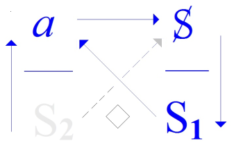
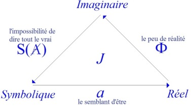
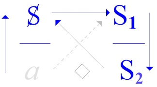
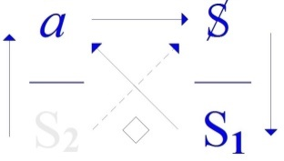

# Leçon 09 | 20 Mars 1973

  

    <label><input type="checkbox" data-lacan-toggle="original" checked> 原文</label>
    <label><input type="checkbox" data-lacan-toggle="notes" checked> 注释</label>
    <label><input type="checkbox" data-lacan-toggle="commentary" checked> 个人解读评论</label>
  

  <form class="lacan-tool-search" role="search">
    <input class="lacan-tool-search-input" type="search" placeholder="搜索全文" aria-label="搜索全文">
    <button class="lacan-tool-button" type="submit" title="搜索">搜索</button>
  </form>
  <button class="lacan-tool-button lacan-back-to-top" type="button" title="回到页面最上方" aria-label="回到页面最上方">↑</button>

<section class="parallel-paragraph" data-paragraph-ids="s20-09-0001">

s20-09-0001

原文 · s20-09-0001

Moi j’aimerais bien que, de temps en temps, j’aie une réponse, voire une protestation.

[无对应译文]

</section>

<section class="parallel-paragraph" data-paragraph-ids="s20-09-0002">

s20-09-0002

原文 · s20-09-0002

J’ai pas beaucoup d’espoir puisque, une des personnes qui m’a donné autrefois cette satisfaction, il est vrai que je ne l’ai suppliée de tenir ce rôle qu’il y a une demi-heure, me prie d’y renoncer.

[无对应译文]

</section>

<section class="parallel-paragraph" data-paragraph-ids="s20-09-0003">

s20-09-0003

原文 · s20-09-0003

Mais s’il y avait quelqu’un par hasard, qui dans ce que j’ai dit la dernière fois...

[无对应译文]

</section>

<section class="parallel-paragraph" data-paragraph-ids="s20-09-0004">

s20-09-0004

原文 · s20-09-0004

> la dernière fois dont, dont je suis sorti moi-même, disons seulement assez inquiet pour ne pas dire plus,
>
> et ce qui se trouve à ma relecture s’avérer - enfin, pour moi-même - tout à fait supportable,
>
> disons c’est ma façon à moi de dire que c’était très bien ...je ne serais pas mécontent si quand même quelqu’un pouvait me donner le témoignage *d’en avoir entendu quelque chose*.

[无对应译文]

</section>

<section class="parallel-paragraph" data-paragraph-ids="s20-09-0005">

s20-09-0005

原文 · s20-09-0005

Il suffirait que... qu’une main se lève, pour qu’à cette main, si je puis dire, je donne la parole.

[无对应译文]

</section>

<section class="parallel-paragraph" data-paragraph-ids="s20-09-0006">

s20-09-0006

原文 · s20-09-0006

Je vois qu’il n’en est rien, de sorte qu’il faut donc que je continue. Ça sera peut-être moins bien cette fois-ci, hein ?

[无对应译文]

</section>

<section class="parallel-paragraph" data-paragraph-ids="s20-09-0007">

s20-09-0007

原文 · s20-09-0007

Je voudrais partir d’une remarque, de quelques remarques,

[无对应译文]

</section>

<section class="parallel-paragraph" data-paragraph-ids="s20-09-0008">

s20-09-0008

原文 · s20-09-0008

- dont les deux premières vont consister à rappeler ce qu’il en est du *savoir*,

[无对应译文]

</section>

<section class="parallel-paragraph" data-paragraph-ids="s20-09-0009">

s20-09-0009

原文 · s20-09-0009

- et puis à essayer de faire le joint, à ce que pour vous aujourd’hui j’écrirais volontiers de l’« *hainamoration* » qu’il faut écrire : *h.a.i.n.a.m.o.r.a.t.i.o.n.*

[无对应译文]

</section>

<section class="parallel-paragraph" data-paragraph-ids="s20-09-0010">

s20-09-0010

原文 · s20-09-0010

C’est le relief, vous le savez, qu’a su introduire la psychanalyse pour situer, pour y situer la zone de son expérience.

[无对应译文]

</section>

<section class="parallel-paragraph" data-paragraph-ids="s20-09-0011">

s20-09-0011

原文 · s20-09-0011

C’est de sa part un témoignage, si je puis dire, de bonne volonté.

[无对应译文]

</section>

<section class="parallel-paragraph" data-paragraph-ids="s20-09-0012">

s20-09-0012

原文 · s20-09-0012

Si l’*hainamoration* justement, elle avait su l’appeler d’un autre terme que de celui - bâtard - de l’« *ambivalence »*, peut-être, peut-être aurait-elle mieux réussi à réveiller le contexte de l’époque où elle s’insère.

[无对应译文]

</section>

<section class="parallel-paragraph" data-paragraph-ids="s20-09-0013">

s20-09-0013

原文 · s20-09-0013

Peut-être aussi est-ce modestie de sa part.

[无对应译文]

</section>

<section class="parallel-paragraph" data-paragraph-ids="s20-09-0014">

s20-09-0014

原文 · s20-09-0014

Et en effet si j’ai terminé sur quelque chose...

[无对应译文]

</section>

<section class="parallel-paragraph" data-paragraph-ids="s20-09-0015">

s20-09-0015

原文 · s20-09-0015

> ce quelque chose grâce à quoi peut faire qu’aborder ce qui m’avait polarisé
>
> pendant toute mon énonciation de la dernière fois ...j’avais énoncé de ce dernier paragraphe qu’il y avait un nommé Empédocle, et j’avais fait remarquer que ce n’est pas pour rien que Freud s’en arme : que pour Empédocle Dieu devait être le plus ignorant de tous les êtres...

[无对应译文]

</section>

<section class="parallel-paragraph" data-paragraph-ids="s20-09-0016">

s20-09-0016

原文 · s20-09-0016

> ce qui nous conjoint à la question du *savoir* ...et ceci très précisément disais-je, de ne point connaître la haine.

[无对应译文]

</section>

<section class="parallel-paragraph" data-paragraph-ids="s20-09-0017">

s20-09-0017

原文 · s20-09-0017

J’y ajoutais que les chrétiens plus tard ont transformé cette *non-haine* de Dieu, en une marque d’amour.

[无对应译文]

</section>

<section class="parallel-paragraph" data-paragraph-ids="s20-09-0018">

s20-09-0018

原文 · s20-09-0018

C’est là que l’analyse du *corrélat* qu’elle établit *entre haine et amour* nous incite, nous incite à ce quelque chose d’un rappel, où je reviendrai tout à l’heure et qui est exactement celui-ci : *qu’on ne connaît point d’amour sans haine*.

[无对应译文]

</section>

<section class="parallel-paragraph" data-paragraph-ids="s20-09-0019">

s20-09-0019

原文 · s20-09-0019

C’est à dire que, s’il y a *connaissance* de quelque chose, si cette *connaissance* nous déçoit...

[无对应译文]

</section>

<section class="parallel-paragraph" data-paragraph-ids="s20-09-0020">

s20-09-0020

原文 · s20-09-0020

> qui a été fomentée au cours des siècles, et qui fait qu’il nous faut rénover la fonction du savoir *...*c’est bien peut-être que *la haine* n’y a point été mise à sa place.

[无对应译文]

</section>

<section class="parallel-paragraph" data-paragraph-ids="s20-09-0021">

s20-09-0021

原文 · s20-09-0021

Il est vrai que là-dessus, ce n’est point non plus ce qu’il semble le plus désirable d’évoquer.

[无对应译文]

</section>

<section class="parallel-paragraph" data-paragraph-ids="s20-09-0022">

s20-09-0022

原文 · s20-09-0022

Et c’est pour ça que j’ai terminé de cette phrase : on pourrait dire que *plus l’homme prête à la femme de le confondre avec Dieu*...

[无对应译文]

</section>

<section class="parallel-paragraph" data-paragraph-ids="s20-09-0023">

s20-09-0023

原文 · s20-09-0023

> c’est à dire *ce dont elle jouit*, rappelez-vous mon schéma de la dernière fois, je vais pas le refaire ...*moins il hait*, *et du même coup* disais-je...

[无对应译文]

</section>

<section class="parallel-paragraph" data-paragraph-ids="s20-09-0024">

s20-09-0024

原文 · s20-09-0024

> d’avoir équivoqué sur le *h.a.i.t.* et le *e.s.t.* en français ...c’est à dire que dans cette affaire, aussi bien, *moins il aime*.

[无对应译文]

</section>

<section class="parallel-paragraph" data-paragraph-ids="s20-09-0025">

s20-09-0025

原文 · s20-09-0025

J’étais pas très heureux d’avoir terminé là-dessus, qui est pourtant une vérité.

[无对应译文]

</section>

<section class="parallel-paragraph" data-paragraph-ids="s20-09-0026">

s20-09-0026

原文 · s20-09-0026

C’est bien ce qui me fera aujourd’hui m’interroger une fois de plus sur ce qui se confond apparemment du *vrai* et du *réel*,

[无对应译文]

</section>

<section class="parallel-paragraph" data-paragraph-ids="s20-09-0027">

s20-09-0027

原文 · s20-09-0027

- tel que j’en ai apporté la notion,

[无对应译文]

</section>

<section class="parallel-paragraph" data-paragraph-ids="s20-09-0028">

s20-09-0028

原文 · s20-09-0028

- telle qu’elle s’esquisse dans l’expérience analytique, et ce qu’il y a bien en effet à ne pas confondre.

[无对应译文]

</section>

<section class="parallel-paragraph" data-paragraph-ids="s20-09-0029">

s20-09-0029

原文 · s20-09-0029

*Bien sûr que le vrai s’affirme comme visant le réel*.

[无对应译文]

</section>

<section class="parallel-paragraph" data-paragraph-ids="s20-09-0030">

s20-09-0030

原文 · s20-09-0030

*Mais ce n’est là énoncé que* comme fruit d’une longue élaboration, et je dirai plus : *d’une réduction des prétentions à la vérité*.

[无对应译文]

</section>

<section class="parallel-paragraph" data-paragraph-ids="s20-09-0031">

s20-09-0031

原文 · s20-09-0031

Partout où nous la voyons se présenter, s’affirmer elle-même comme d’un idéal, de quelque chose dont la parole peut être le support, nous voyons que *la vérité* n’est pas quelque chose qui s’atteigne si aisément.

[无对应译文]

</section>

<section class="parallel-paragraph" data-paragraph-ids="s20-09-0032">

s20-09-0032

原文 · s20-09-0032

> \[« *dont la parole peut être le support* *» *: *chacun des 4 discours positionne la vérité comme ne pouvant pas être atteinte*,
>
> → *chaque discours va buter sur son* *« impuissance »* → H : *science sans (**a**)me,* U : *sujet sans pouvoir,* M: *plus-de-jouir sans sujet*\]

[无对应译文]

</section>

<section class="parallel-paragraph" data-paragraph-ids="s20-09-0033">

s20-09-0033

原文 · s20-09-0033

Dirai-je que si l’analyse se pose d’une présomption, c’est qu’il puisse s’en constituer *un savoir sur la vérité *?

[无对应译文]

</section>

<section class="parallel-paragraph" data-paragraph-ids="s20-09-0034">

s20-09-0034

原文 · s20-09-0034

[无对应译文]

</section>

<section class="parallel-paragraph" data-paragraph-ids="s20-09-0035">

s20-09-0035

原文 · s20-09-0035

Dans le schéma, le petit *gramme* que je vous ai donné du discours analytique :

[无对应译文]

</section>

<section class="parallel-paragraph" data-paragraph-ids="s20-09-0036">

s20-09-0036

原文 · s20-09-0036

- le *a* s’écrit en haut à gauche,

[无对应译文]

</section>

<section class="parallel-paragraph" data-paragraph-ids="s20-09-0037">

s20-09-0037

原文 · s20-09-0037

- qui se soutient de cet S2 : *savoir* en tant qu’il est à la place de *la vérité*,

[无对应译文]

</section>

<section class="parallel-paragraph" data-paragraph-ids="s20-09-0038">

s20-09-0038

原文 · s20-09-0038

- c’est là où l’interpelle le **S**, prié de dire ce «* n’importe quoi* »,

[无对应译文]

</section>

<section class="parallel-paragraph" data-paragraph-ids="s20-09-0039">

s20-09-0039

原文 · s20-09-0039

- qui doit aboutir à la production du S1, *du signifiant dont puisse se résoudre* - quoi ? - justement *son rapport à* *la vérité*.

[无对应译文]

</section>

<section class="parallel-paragraph" data-paragraph-ids="s20-09-0040">

s20-09-0040

原文 · s20-09-0040

*La vérité*, disons pour trancher dans le vif, est d’origine ἀλήθεια \[alétèia\], sur laquelle tant a spéculé Heidegger, אמת \[emet\], le terme hébreu, qui comme tout usage de ce terme de *vérité*, a origine juridique : de nos jours encore le témoin est prié de dire *« *la vérité, rien que la vérité » et qui plus est « toute* »...*

[无对应译文]

</section>

<section class="parallel-paragraph" data-paragraph-ids="s20-09-0041">

s20-09-0041

原文 · s20-09-0041

> s’il peut, comment hélas pourrait-il ? *...*« toute la vérité » sur ce qu’il *sait*.

[无对应译文]

</section>

<section class="parallel-paragraph" data-paragraph-ids="s20-09-0042">

s20-09-0042

原文 · s20-09-0042

*Mais ce qui est cherché*, et justement plus qu’en tout autre, dans le témoignage juridique, c’est quoi ?

[无对应译文]

</section>

<section class="parallel-paragraph" data-paragraph-ids="s20-09-0043">

s20-09-0043

原文 · s20-09-0043

C’est de pouvoir juger ce qu’il en est de la *jouissance*, et je dirai plus loin : *c’est que la jouissance s’avoue*, et justement en ceci qu’elle peut être inavouable, que *la vérité* cherchée c’est justement celle-là plus que toute autre, en regard de la loi qui, cette *jouissance,* la règle.

[无对应译文]

</section>

<section class="parallel-paragraph" data-paragraph-ids="s20-09-0044">

s20-09-0044

原文 · s20-09-0044

C’est aussi bien en quoi, aux termes de Kant, le problème s’évoque, \[*Kant : Critique de la raison pratique*\] s’évoque de ce que doit faire l’homme libre au regard du tyran, du tyran qui lui propose toutes les jouissances en échange de ceci : qu’il dénonce l’ennemi dont le tyran redoute qu’il soit, en ce qui est de la jouissance, celui qui la lui dispute.

[无对应译文]

</section>

<section class="parallel-paragraph" data-paragraph-ids="s20-09-0045">

s20-09-0045

原文 · s20-09-0045

Comment ne se voit-il pas que la question d’ailleurs que... qui s’évoque de cet *impératif*, au nom de rien de ce qui est de l’ordre du *pathique,* ne doit diriger le témoignage de ce qui s’en évoque après tout, et si ce dont l’homme libre est prié de dénoncer l’ennemi, le rival : si c’était vrai, doit-il le faire ?

[无对应译文]

</section>

<section class="parallel-paragraph" data-paragraph-ids="s20-09-0046">

s20-09-0046

原文 · s20-09-0046

Est-ce qu’il ne se voit pas, rien qu’à ce problème évoqué, que s’il est quelque chose qui assurément nous inspire toute la réserve qui est bien celle que nous avons toutes, que nous avons tous, c’est que « *toute la vérité* »

[无对应译文]

</section>

<section class="parallel-paragraph" data-paragraph-ids="s20-09-0047">

s20-09-0047

原文 · s20-09-0047

- c’est ce qui ne peut pas se dire,

[无对应译文]

</section>

<section class="parallel-paragraph" data-paragraph-ids="s20-09-0048">

s20-09-0048

原文 · s20-09-0048

- c’est ce qui ne peut se dire qu’à condition de... de ne la pas pousser jusqu’au bout, de ne faire que la *mi-dire*.

[无对应译文]

</section>

<section class="parallel-paragraph" data-paragraph-ids="s20-09-0049">

s20-09-0049

原文 · s20-09-0049

Il y a autre chose qui nous ligote quant à ce qui en est de *la vérité*, c’est que *la jouissance c’est une limite*.

[无对应译文]

</section>

<section class="parallel-paragraph" data-paragraph-ids="s20-09-0050">

s20-09-0050

原文 · s20-09-0050

C’est quelque chose qui tient à la structure même qu’évoquaient, au temps où je les ai construits pour vous, mes « *quadripodes *» : c’est que *la jouissance ne s’interpelle, ne s’évoque, ne se traque, ne s’élabore qu’à partir d’un semblant*.

[无对应译文]

</section>

<section class="parallel-paragraph" data-paragraph-ids="s20-09-0051">

s20-09-0051

原文 · s20-09-0051

*L’amour lui-même,* ai-je souligné la dernière fois, *s’adresse au semblant*.

[无对应译文]

</section>

<section class="parallel-paragraph" data-paragraph-ids="s20-09-0052">

s20-09-0052

原文 · s20-09-0052

*Il s’adresse au semblant et aussi bien...*

[无对应译文]

</section>

<section class="parallel-paragraph" data-paragraph-ids="s20-09-0053">

s20-09-0053

原文 · s20-09-0053

*s’il est bien vrai que l’Autre ne s’atteint qu’à s’accoler* - comme je l’ai dit la dernière fois - *au (a) cause du désir...c’est aussi bien au semblant d’être qu’il s’adresse.*

[无对应译文]

</section>

<section class="parallel-paragraph" data-paragraph-ids="s20-09-0054">

s20-09-0054

原文 · s20-09-0054

*Cet « être » là* n’est pas rien : il *est supposé* à ce quelque chose, *à cet objet qu’est le a*.

[无对应译文]

</section>

<section class="parallel-paragraph" data-paragraph-ids="s20-09-0055">

s20-09-0055

原文 · s20-09-0055

\[l’amour s’adresse du semblant (identification à l’objet d’amour) au *semblant d’être* : *a* « accolé » à l’Autre (lieu du langage)→ *a* proche de S(**A**)).

[无对应译文]

</section>

<section class="parallel-paragraph" data-paragraph-ids="s20-09-0056">

s20-09-0056

原文 · s20-09-0056

*Un être est supposé à* « *ce qui parle* » (S1← S2), ce qui parle et qui « comme tel » produit un *a* (S : sujet, *subjectum* : *sub-posé*, ὑποχείμενον : *upokeimenon*)\]

[无对应译文]

</section>

<section class="parallel-paragraph" data-paragraph-ids="s20-09-0057">

s20-09-0057

原文 · s20-09-0057

Mais ici ne devons-nous pas retrouver cette trace: qu’en tant que tel il réponde à quelque *imaginaire* ? \[(*a*) *en place de* -φ\]

[无对应译文]

</section>

<section class="parallel-paragraph" data-paragraph-ids="s20-09-0058">

s20-09-0058

原文 · s20-09-0058

Assurément cet « ***i-maginaire* » je l’ai désigné expressément de l’***i***, du petit ***i***, mis ici isolé du terme « *imaginaire* », et que c’est ce en quoi ce n’est que de l’habillement*...*

[无对应译文]

</section>

<section class="parallel-paragraph" data-paragraph-ids="s20-09-0059">

s20-09-0059

原文 · s20-09-0059

> de l’habillement de *l’image de soi* qui vient envelopper *l’objet cause du désir* \[*Cf. supra la perruche de Picasso*\] que se soutient le plus souvent...

[无对应译文]

</section>

<section class="parallel-paragraph" data-paragraph-ids="s20-09-0060">

s20-09-0060

原文 · s20-09-0060

> c’est l’articulation même de l’analyse ...que se soutient le plus souvent le « rapport objectal ». \[*l’amour s’adresse au semblant, à l’Autre, mais l’amour n’atteint l’Autre que si, à cet Autre un a est (a)ccolé comme fiction d’un petit autre, d’un a’ imaginaire au miroir,* *qui viendrait habiller l’Autre et supporter, « soutenir », le sujet comme* S *dans ce champ d’ex-sistence, permettant ainsi la réciprocité (imaginaire aussi) de l’amour* \]

[无对应译文]

</section>

<section class="parallel-paragraph" data-paragraph-ids="s20-09-0061">

s20-09-0061

原文 · s20-09-0061

Cette affinité du (*a*) à cette *enveloppe*, c’est là un joint - il faut le dire - un de ces joints majeurs à avoir été avancés par la psychanalyse, et qui pour nous est le point de suspicion qu’elle introduit essentiellement.

[无对应译文]

</section>

<section class="parallel-paragraph" data-paragraph-ids="s20-09-0062">

s20-09-0062

原文 · s20-09-0062

C’est là, que ce qui peut nous venir à *dire* du *réel,* se distingue, *car le réel* \[*l’impossible*\]*...*

[无对应译文]

</section>

<section class="parallel-paragraph" data-paragraph-ids="s20-09-0063">

s20-09-0063

原文 · s20-09-0063

> si vous le prenez tel que j’ai cru, au cours des temps, temps qui sont ceux de mon expérience *...le réel ne saurait s’inscrire que d’une impasse* \[◊\] *de la formalisation.* \[*trace du réel* : *impasse logique, cf. les 4 impossibles des 4 discours *: *inconsistance* (H)*, incomplétude* (M)*, indémontrable* (U)*, indécidable* (A)\]

[无对应译文]

</section>

<section class="parallel-paragraph" data-paragraph-ids="s20-09-0064">

s20-09-0064

原文 · s20-09-0064

Et c’est en quoi j’ai cru pouvoir en dessiner le modèle de la formalisation mathématique, en tant qu’elle est l’élaboration la plus poussée qu’il nous ait été donné de produire, l’élaboration la plus poussée de la signifiance.

[无对应译文]

</section>

<section class="parallel-paragraph" data-paragraph-ids="s20-09-0065">

s20-09-0065

原文 · s20-09-0065

D’une signifiance dont en somme*...*

[无对应译文]

</section>

<section class="parallel-paragraph" data-paragraph-ids="s20-09-0066">

s20-09-0066

原文 · s20-09-0066

je parle de la formalisation mathématique *...*on peut dire qu’elle se fait *au contraire du sens*. J’allais presque dire ; *à contre-sens*.

[无对应译文]

</section>

<section class="parallel-paragraph" data-paragraph-ids="s20-09-0067">

s20-09-0067

原文 · s20-09-0067

Le « *ça ne veut rien dire* » concernant *les mathématiques*, c’est ce que disent - de notre temps - *les philosophes des mathématiques*, fussent-ils *mathématiciens* eux-mêmes : j’ai assez souligné les *Principia* de Russell. \[*A.N. Whitehead, B. Russell *: *« [Principia mathematica](http://fr.wikipedia.org/wiki/Principia_Mathematica) »*\]

[无对应译文]

</section>

<section class="parallel-paragraph" data-paragraph-ids="s20-09-0068">

s20-09-0068

原文 · s20-09-0068

Et pourtant *ne peut-on pas dire* que ce réseau si loin poussé de la logique mathématique précisément...

[无对应译文]

</section>

<section class="parallel-paragraph" data-paragraph-ids="s20-09-0069">

s20-09-0069

原文 · s20-09-0069

> pour autant qu’au regard de ce qui a trouvé sa pointe d’une philosophie
>
> bien forcée de sortir de ses propres retranchements : le sommet c’est Hegel ...*ne peut-on pas dire* qu’au regard de cette plénitude des contrastes dialectisés dans l’idée d’une progression historique...

[无对应译文]

</section>

<section class="parallel-paragraph" data-paragraph-ids="s20-09-0070">

s20-09-0070

原文 · s20-09-0070

> dont il faut dire que rien ne nous atteste la substance ...*ne peut-on pas dire* qu’au regard de cela, ce qui s’énonce de cette formalisation si bien faite à ne se supporter que de *l’écrit,* soit quelque chose qui ne nous sert*...*

[无对应译文]

</section>

<section class="parallel-paragraph" data-paragraph-ids="s20-09-0071">

s20-09-0071

原文 · s20-09-0071

> ne nous servirait s’il le fallait dans le procès analytique *...*que de ce que s’y désigne *« ça »* qui retient les corps invisiblement ?

[无对应译文]

</section>

<section class="parallel-paragraph" data-paragraph-ids="s20-09-0072">

s20-09-0072

原文 · s20-09-0072

> \[« *ça qui retient les corps » *: *l’habit imaginaire (et scintillant) qui « enveloppe les corps » (cf. la perruche amoureuse de la veste de Picasso), *
>
> *la trace sur l’« a-mur », l’écriture d’une jouissance qui les soutient au champ de l’Autre*\]

[无对应译文]

</section>

<section class="parallel-paragraph" data-paragraph-ids="s20-09-0073">

s20-09-0073

原文 · s20-09-0073

Et s’il m’était permis d’en donner *une image*, je la prendrais aisément de ce qui dans la nature *paraisse* le plus se rapprocher, de ce qui fait que *l’écrit* exige en quelque sorte cette réduction aux dimensions - dimensions 2 - de la surface, et qui d’une certaine façon se trouve supporté, dirais-je, dans la nature de ce quelque chose dont déjà s’émerveillait Spinoza, c’est à savoir le travail de texte qui sort du ventre de l’araignée.

[无对应译文]

</section>

<section class="parallel-paragraph" data-paragraph-ids="s20-09-0074">

s20-09-0074

原文 · s20-09-0074

La toile d’araignée, fonction vraiment miraculeuse à voir en quelque sorte s’en supporter déjà, en ce point opaque de cet étrange être, les paraîtres de la surface elle-même, celle qui, pour nous, permet le dessin de la trace de ces *écrits,* et qui sont, en fin, le seul point où nous trouvions saisissables : *ces limites, ces points d’impasse, de « sans-issue »* qui, *le réel,* le font entendre comme s’accédant du *symbolique* à son point le plus extrême. \[*là où l’impasse de la formalisation ne peut s’inscrire que de lettres* \]

[无对应译文]

</section>

<section class="parallel-paragraph" data-paragraph-ids="s20-09-0075">

s20-09-0075

原文 · s20-09-0075

C’est en cela que je ne crois pas vain qu’après un travail d’élaboration...

[无对应译文]

</section>

<section class="parallel-paragraph" data-paragraph-ids="s20-09-0076">

s20-09-0076

原文 · s20-09-0076

> dont je n’ai point à rappeler la date ici, ni maintenant, ...*j’en sois venu à l’écriture* :

[无对应译文]

</section>

<section class="parallel-paragraph" data-paragraph-ids="s20-09-0077">

s20-09-0077

原文 · s20-09-0077

- de ce *a*, \[*discours* M : *a* ◊ S *(fonction de parole)*\]

[无对应译文]

</section>

<section class="parallel-paragraph" data-paragraph-ids="s20-09-0078">

s20-09-0078

原文 · s20-09-0078

- de ce S(**A**) \[*discours* H :: S2◊*a* → S(A) *(fonction de langage)*\],

[无对应译文]

</section>

<section class="parallel-paragraph" data-paragraph-ids="s20-09-0079">

s20-09-0079

原文 · s20-09-0079

- et du grand Φ \[*discours* A : S1◊S2 *(fonction d’écriture)*\]. \[*chaque discours* *vient buter sur le « pas tout » d’une vérité qui va inscrire* *en « lettres » ce qui ne peut s’en saisir par la parole »* :

[无对应译文]

</section>

<section class="parallel-paragraph" data-paragraph-ids="s20-09-0080">

s20-09-0080

原文 · s20-09-0080

H  : S2◊ *a* → S(A), M : *a* ◊ S → *a*, A  : S1 ◊ S2 → Φ\]

[无对应译文]

</section>

<section class="parallel-paragraph" data-paragraph-ids="s20-09-0081">

s20-09-0081

原文 · s20-09-0081

Leur *écriture* même, constitue le support qui va *au-delà de la parole* \[*au-delà du mi-dit de la vérité*\] qui pourtant ne sort pas des effets mêmes du langage, et où se désigne

[无对应译文]

</section>

<section class="parallel-paragraph" data-paragraph-ids="s20-09-0082">

s20-09-0082

原文 · s20-09-0082

- quelque chose où centrer *le symbolique*,

[无对应译文]

</section>

<section class="parallel-paragraph" data-paragraph-ids="s20-09-0083">

s20-09-0083

原文 · s20-09-0083

- quelque chose qui importe, à condition bien sûr de savoir s’en servir.

[无对应译文]

</section>

<section class="parallel-paragraph" data-paragraph-ids="s20-09-0084">

s20-09-0084

原文 · s20-09-0084

Mais s’en servir pour quoi ?

[无对应译文]

</section>

<section class="parallel-paragraph" data-paragraph-ids="s20-09-0085">

s20-09-0085

原文 · s20-09-0085

Pour retenir une vérité congrue.

[无对应译文]

</section>

<section class="parallel-paragraph" data-paragraph-ids="s20-09-0086">

s20-09-0086

原文 · s20-09-0086

Non pas cette *vérité* qui se prétend être *toute *:

[无对应译文]

</section>

<section class="parallel-paragraph" data-paragraph-ids="s20-09-0087">

s20-09-0087

原文 · s20-09-0087

- celle justement, celle à laquelle nous avons affaire d’un *mi-dire,*

[无对应译文]

</section>

<section class="parallel-paragraph" data-paragraph-ids="s20-09-0088">

s20-09-0088

原文 · s20-09-0088

- celle qui s’avère se mettre en garde d’aller jusqu’à l’aveu, l’aveu qui serait *le pire*,

[无对应译文]

</section>

<section class="parallel-paragraph" data-paragraph-ids="s20-09-0089">

s20-09-0089

原文 · s20-09-0089

- celle qui se met en garde dès *la cause du désir* \[*a*\].

[无对应译文]

</section>

<section class="parallel-paragraph" data-paragraph-ids="s20-09-0090">

s20-09-0090

原文 · s20-09-0090

Elle le présume ce désir, *inscrit* d’une *contingence corporelle*.

[无对应译文]

</section>

<section class="parallel-paragraph" data-paragraph-ids="s20-09-0091">

s20-09-0091

原文 · s20-09-0091

Je vous rappelle la façon dont je supporte ce terme de « *contingence* ».

[无对应译文]

</section>

<section class="parallel-paragraph" data-paragraph-ids="s20-09-0092">

s20-09-0092

原文 · s20-09-0092

On peut dire que le *phallus* \[Φ\]...

[无对应译文]

</section>

<section class="parallel-paragraph" data-paragraph-ids="s20-09-0093">

s20-09-0093

原文 · s20-09-0093

tel que dans l’expérience analytique il s’aborde comme le point-clé, le point extrême, de ce qui s’énonce comme *cause du désir* ...on peut dire que l’expérience analytique *cesse de ne pas de l’écrire* \[*production de* S1 *asémantiques*\].

[无对应译文]

</section>

<section class="parallel-paragraph" data-paragraph-ids="s20-09-0094">

s20-09-0094

原文 · s20-09-0094

Or si je l’appelle \[Φ\] *contingence*, c’est pour autant que c’est là que l’expérience analytique rencontre son terme \[S1◊ S2\], que tout ce qu’elle peut produire c’est ce S1, ce signifiant.

[无对应译文]

</section>

<section class="parallel-paragraph" data-paragraph-ids="s20-09-0095">

s20-09-0095

原文 · s20-09-0095

Ce signifiant dont la dernière fois, je pense que vous avez encore le souvenir de la rumeur que j’ai réussi à produire de cet auditoire en le qualifiant comme *signifiant de la jouissance*, même la plus *idiote* et - on me l’a fait remarquer - dans les deux sens du terme :

[无对应译文]

</section>

<section class="parallel-paragraph" data-paragraph-ids="s20-09-0096">

s20-09-0096

原文 · s20-09-0096

- celle de l’idiot d’une part, qui a bien ici sa fonction de référence,

[无对应译文]

</section>

<section class="parallel-paragraph" data-paragraph-ids="s20-09-0097">

s20-09-0097

原文 · s20-09-0097

- et celle aussi qui est la plus *singulière*.

[无对应译文]

</section>

<section class="parallel-paragraph" data-paragraph-ids="s20-09-0098">

s20-09-0098

原文 · s20-09-0098

C’est dans ce « *cesse de ne pas s’écrire* » \[S1\] que réside la pointe de ce que j’ai appelé « *contingence »* \[Φ\].

[无对应译文]

</section>

<section class="parallel-paragraph" data-paragraph-ids="s20-09-0099">

s20-09-0099

原文 · s20-09-0099

*La contingence*, si comme je le dis *elle s’oppose à* *l’impossible*, c’est pour autant que *le nécessaire...*

[无对应译文]

</section>

<section class="parallel-paragraph" data-paragraph-ids="s20-09-0100">

s20-09-0100

原文 · s20-09-0100

> c’est le « *ne cesse pas de ne pas s’écrire* » \[lapsus\]... Je vous demande pardon :
>
> c’est le *nécessaire* qui ici nous introduit ce « *ne cesse pas* », mais le « *ne cesse pas* » du *nécessaire* ...*c’est le « ne cesse pas de s’écrire »*.

[无对应译文]

</section>

<section class="parallel-paragraph" data-paragraph-ids="s20-09-0101">

s20-09-0101

原文 · s20-09-0101

Or c’est bien là l’apparente *nécessité* à quoi nous mène l’analyse de la référence au *phallus*.

[无对应译文]

</section>

<section class="parallel-paragraph" data-paragraph-ids="s20-09-0102">

s20-09-0102

原文 · s20-09-0102

\[*dans le nécessaire du* S1 *qui ne cesse pas de s’écrire (en essaim...) « réside » la pointe* *de la contingence* : Φ *cesse de ne pas s’écrire*\]

[无对应译文]

</section>

<section class="parallel-paragraph" data-paragraph-ids="s20-09-0103">

s20-09-0103

原文 · s20-09-0103

Le « *ne cesse pas de ne pas s’écrire* »...

[无对应译文]

</section>

<section class="parallel-paragraph" data-paragraph-ids="s20-09-0104">

s20-09-0104

原文 · s20-09-0104

> que j’ai dit par lapsus à l’instant ...*c’est l’impossible*, *l’impossible* tel que je le définis de ce qu’il ne puisse en aucun cas s’écrire.

[无对应译文]

</section>

<section class="parallel-paragraph" data-paragraph-ids="s20-09-0105">

s20-09-0105

原文 · s20-09-0105

C’est en quoi je désigne ce qu’il en est du *rapport sexuel *: *il ne cesse pas de ne pas s’écrire*, mais la correction que de ce fait il nous permet d’apporter *à l’apparente nécessité de la fonction phallique*, c’est ceci : c’est que c’est *réellement* en tant que mode du *contingent*, c’est-à-dire que le « *ne cesse pas de s’écrire* » doit s’écrire « *cesse* - justement - *de ne pas s’écrire* ».

[无对应译文]

</section>

<section class="parallel-paragraph" data-paragraph-ids="s20-09-0106">

s20-09-0106

原文 · s20-09-0106

C’est comme *contingence, contingence* en quoi se résume tout ce qu’il en est de ce qui, pour nous, soumet le rapport sexuel à n’être pour l’être parlant que le régime de « *la rencontre* ».

[无对应译文]

</section>

<section class="parallel-paragraph" data-paragraph-ids="s20-09-0107">

s20-09-0107

原文 · s20-09-0107

\[→ *du hasard *: *cf. Aristote *: τύχη *(tuké) → *εὐτυχία *(eutukia *: *heureuse rencontre) ou* δυστυχία *(dustukia *: *malheureuse rencontre)*

[无对应译文]

</section>

<section class="parallel-paragraph" data-paragraph-ids="s20-09-0108">

s20-09-0108

原文 · s20-09-0108

C’est en ce sens qu’on peut dire que *par la psychanalyse le phallus...*

[无对应译文]

</section>

<section class="parallel-paragraph" data-paragraph-ids="s20-09-0109">

s20-09-0109

原文 · s20-09-0109

> le *phallus* réservé, aux temps antiques, aux « *mystères »...a cessé de ne pas s’écrire*, rien de plus.

[无对应译文]

</section>

<section class="parallel-paragraph" data-paragraph-ids="s20-09-0110">

s20-09-0110

原文 · s20-09-0110

Il n’est pas entré dans le « *ne cesse pas* », *dans le champ d’où dépendent la nécessité* d’une part, et plus haut *l’impossibilité*.

[无对应译文]

</section>

<section class="parallel-paragraph" data-paragraph-ids="s20-09-0111">

s20-09-0111

原文 · s20-09-0111

*Le vrai* donc, ici témoigne qu’à mettre en garde comme il le fait contre *l’imaginaire*, il a beaucoup à faire avec l’*a-natomie*.

[无对应译文]

</section>

<section class="parallel-paragraph" data-paragraph-ids="s20-09-0112">

s20-09-0112

原文 · s20-09-0112

C’est en fin de compte ces 3 termes, ceux que j’inscris

[无对应译文]

</section>

<section class="parallel-paragraph" data-paragraph-ids="s20-09-0113">

s20-09-0113

原文 · s20-09-0113

- du *a*,

[无对应译文]

</section>

<section class="parallel-paragraph" data-paragraph-ids="s20-09-0114">

s20-09-0114

原文 · s20-09-0114

- du S(**A**),

[无对应译文]

</section>

<section class="parallel-paragraph" data-paragraph-ids="s20-09-0115">

s20-09-0115

原文 · s20-09-0115

- et du grand Φ, c’est sous un angle dépréciatif que je les apporte.

[无对应译文]

</section>

<section class="parallel-paragraph" data-paragraph-ids="s20-09-0116">

s20-09-0116

原文 · s20-09-0116

Ce que nous démontre la conjonction de ces trois termes, c’est justement ce qui s’inscrit de ce triangle, de ce triangle constitué *de l’imaginaire, du symbolique et du réel*, et où se désigne de leur jonction - quoi ?

[无对应译文]

</section>

<section class="parallel-paragraph" data-paragraph-ids="s20-09-0117">

s20-09-0117

原文 · s20-09-0117

[无对应译文]

</section>

<section class="parallel-paragraph" data-paragraph-ids="s20-09-0118">

s20-09-0118

原文 · s20-09-0118

- À droite *le peu de réalité* \[Φ\] dont se supporte ce principe qu’a promu Freud comme étant celui qui s’élabore d’un progrès, lequel serait dans son fond celui du *principe du plaisir*,

[无对应译文]

</section>

<section class="parallel-paragraph" data-paragraph-ids="s20-09-0119">

s20-09-0119

原文 · s20-09-0119

> *le peu de réalité*, c’est-à-dire ceci :
>
> *que tout ce qu’il nous est permis d’aborder de réalité reste enraciné dans le fantasme* \[*a* ◊ S, *butée du discours du Maître*\].

[无对应译文]

</section>

<section class="parallel-paragraph" data-paragraph-ids="s20-09-0120">

s20-09-0120

原文 · s20-09-0120

- D’autre part S(**A**), qu’est-ce d’autre que *l’impossibilité de dire tout le vrai* dont je parlais tout à l’heure ?

[无对应译文]

</section>

<section class="parallel-paragraph" data-paragraph-ids="s20-09-0121">

s20-09-0121

原文 · s20-09-0121

- Et enfin, 3ème terme, ceci, ceci par quoi le *symbolique*, à se diriger vers le *réel,* nous démontre la vraie nature de cet *objet*(*a*) que tout à l’heure j’ai qualifié de « *semblant d’être »*, non au hasard : c’est bien *de ce qu’il semble nous donner le support de l’être*.

[无对应译文]

</section>

<section class="parallel-paragraph" data-paragraph-ids="s20-09-0122">

s20-09-0122

原文 · s20-09-0122

C’est bien aussi de ce qui se confirme de tout ce qui s’est élaboré comme tel, et quoi que ce soit de l’*être*, de l’*être* et même de *l’essence,* que nous pouvons...

[无对应译文]

</section>

<section class="parallel-paragraph" data-paragraph-ids="s20-09-0123">

s20-09-0123

原文 · s20-09-0123

> à le *lire* à partir de l’expérience analytique, à lire Aristote par exemple, ...voir que ce dont il s’agit c’est de l’ *objet*(*a*).

[无对应译文]

</section>

<section class="parallel-paragraph" data-paragraph-ids="s20-09-0124">

s20-09-0124

原文 · s20-09-0124

Que *la contemplation,* par exemple, aristotélicienne est le fait de ce *regard* tel que je l’ai défini dans « *Les quatre concepts*... » comme représentant un des 4 supports qui font *la cause du désir*. \[*oral, anal, vocal, scopique*\]

[无对应译文]

</section>

<section class="parallel-paragraph" data-paragraph-ids="s20-09-0125">

s20-09-0125

原文 · s20-09-0125

C’est donc d’une des « *graphicisations* » *...*

[无对应译文]

</section>

<section class="parallel-paragraph" data-paragraph-ids="s20-09-0126">

s20-09-0126

原文 · s20-09-0126

> pour ne pas parler de graphe, puisqu’aussi bien *un graphe*
>
> c’est un terme qui a un sens très précis dans la logique mathématique *...*dans cette « *graphicisation* » que se montrent ces correspondances qui font du *réel* un *ouvert* entre *le semblant* qui résulte du *symbolique,* et *la réalité* telle qu’elle se supporte dans le concret de la vie humaine:

[无对应译文]

</section>

<section class="parallel-paragraph" data-paragraph-ids="s20-09-0127">

s20-09-0127

原文 · s20-09-0127

- dans ce qui mène les hommes,

[无对应译文]

</section>

<section class="parallel-paragraph" data-paragraph-ids="s20-09-0128">

s20-09-0128

原文 · s20-09-0128

- dans ce qui les fait foncer toujours par les mêmes voies,

[无对应译文]

</section>

<section class="parallel-paragraph" data-paragraph-ids="s20-09-0129">

s20-09-0129

原文 · s20-09-0129

- dans ce qui les fait encore produire d’autres hommes,

[无对应译文]

</section>

<section class="parallel-paragraph" data-paragraph-ids="s20-09-0130">

s20-09-0130

原文 · s20-09-0130

- dans ce qui fait que, à jamais, « *l’encore à naître* » ne donnera rien que *« l’encorné »*. \[*Rires*\]

[无对应译文]

</section>

<section class="parallel-paragraph" data-paragraph-ids="s20-09-0131">

s20-09-0131

原文 · s20-09-0131

De l’autre côté ce *a*, ce *a* qui, lui, d’être dans la bonne voie somme toute, nous ferait prendre pour *être*, au nom de ceci qu’il est apparemment bien quelque chose qui ne se résout en fin de compte que de son échec, que de justement ne pouvoir s’inscrire d’aucune façon, complètement, à l’abord du *réel*.

[无对应译文]

</section>

<section class="parallel-paragraph" data-paragraph-ids="s20-09-0132">

s20-09-0132

原文 · s20-09-0132

Le *vrai* alors, bien sûr c’est cela, à ceci près que ça ne s’atteint jamais que par des voies tordues, et que tout ce à quoi le *vrai* auquel couramment nous sommes amenés à faire appel, c’est simplement à rappeler ceci : qu’il ne faut pas se tromper, qu’il ne faut pas croire qu’on est déjà même dans *le semblant*, qu’avant *le semblant...*

[无对应译文]

</section>

<section class="parallel-paragraph" data-paragraph-ids="s20-09-0133">

s20-09-0133

原文 · s20-09-0133

> dont en effet tout se supporte pour rebondir dans *le fantasme...*qu’avant cela, il y a à faire une distinction sévère de *l’imaginaire* et du *réel*, qu’il ne faut pas croire que ce *semblant*, ce soit d’aucune façon nous-mêmes qui le supportions même.

[无对应译文]

</section>

<section class="parallel-paragraph" data-paragraph-ids="s20-09-0134">

s20-09-0134

原文 · s20-09-0134

Nous ne sommes même pas « *semblant »*.

[无对应译文]

</section>

<section class="parallel-paragraph" data-paragraph-ids="s20-09-0135">

s20-09-0135

原文 · s20-09-0135

Nous sommes, à l’occasion, ce qui peut en occuper la place, et y faire régner - quoi ? - ce qui assurément*...*

[无对应译文]

</section>

<section class="parallel-paragraph" data-paragraph-ids="s20-09-0136">

s20-09-0136

原文 · s20-09-0136

> pour nous en tenir à cet immédiat d’aujourd’hui *...*nous permet de dire qu’après tout l’analyste, dans tous les ordres de discours, qui sont ceux en tout cas qui se soutiennent actuellement*...*

[无对应译文]

</section>

<section class="parallel-paragraph" data-paragraph-ids="s20-09-0137">

s20-09-0137

原文 · s20-09-0137

> et ce mot « *actuellement* » n’est pas rien, si nous donnons à « l’*acte* » son plein sens aristotélicien *...*de tous les discours qui se soutiennent actuellement, c’est bien l’analyste qui, à mettre l’*objet*(*a*) à la place du *semblant*, est dans la position la plus convenable à faire ce qu’il est juste de faire, à savoir interroger comme du *« savoir »,* ce qu’il en est de *la vérité*.

[无对应译文]

</section>

<section class="parallel-paragraph" data-paragraph-ids="s20-09-0138">

s20-09-0138

原文 · s20-09-0138

Qu’est-ce c’est que le « *savoir »* ?

[无对应译文]

</section>

<section class="parallel-paragraph" data-paragraph-ids="s20-09-0139">

s20-09-0139

原文 · s20-09-0139

[无对应译文]

</section>

<section class="parallel-paragraph" data-paragraph-ids="s20-09-0140">

s20-09-0140

原文 · s20-09-0140

> *Discours scientifique* : **H**

[无对应译文]

</section>

<section class="parallel-paragraph" data-paragraph-ids="s20-09-0141">

s20-09-0141

原文 · s20-09-0141

Il est étrange que, mis à part Descartes*...*

[无对应译文]

</section>

<section class="parallel-paragraph" data-paragraph-ids="s20-09-0142">

s20-09-0142

原文 · s20-09-0142

> dont ce n’est pas pour rien qu’il est à l’orée de *la science moderne*, pas le seul mais qu’il l’est tout de même *...*qu’avant Descartes, la question du *savoir* n’ait jamais été posée. \[*discours scientifique* : **H**\]

[无对应译文]

</section>

<section class="parallel-paragraph" data-paragraph-ids="s20-09-0143">

s20-09-0143

原文 · s20-09-0143

[无对应译文]

</section>

<section class="parallel-paragraph" data-paragraph-ids="s20-09-0144">

s20-09-0144

原文 · s20-09-0144

> *Discours Analytique*

[无对应译文]

</section>

<section class="parallel-paragraph" data-paragraph-ids="s20-09-0145">

s20-09-0145

原文 · s20-09-0145

Qu’il ait fallu en quelque sorte ce quelque chose qui est l’analyse et qui est venu nous annoncer

[无对应译文]

</section>

<section class="parallel-paragraph" data-paragraph-ids="s20-09-0146">

s20-09-0146

原文 · s20-09-0146

- *qu’il y a du savoir qui ne se sait pas* \[S1◊ S2\]

[无对应译文]

</section>

<section class="parallel-paragraph" data-paragraph-ids="s20-09-0147">

s20-09-0147

原文 · s20-09-0147

- et que c’est à proprement parler *un savoir* qui se supporte du signifiant comme tel,

[无对应译文]

</section>

<section class="parallel-paragraph" data-paragraph-ids="s20-09-0148">

s20-09-0148

原文 · s20-09-0148

- qu’un rêve ça n’introduit à aucune expérience insondable, à aucune mystique, que *ça se lit dans ce qui s’en dit.* \[

[无对应译文]

</section>

<section class="parallel-paragraph" data-paragraph-ids="s20-09-0149">

s20-09-0149

原文 · s20-09-0149

Et qu’on pourra même aller plus loin : à en prendre les équivoques au sens le plus anagrammatique du mot, que c’est à ce point du langage où un Saussure se posait la question de savoir si même dans les vers saturniens...

[无对应译文]

</section>

<section class="parallel-paragraph" data-paragraph-ids="s20-09-0150">

s20-09-0150

原文 · s20-09-0150

> où il trouvait les plus étranges ponctuations d’*écrit*, ...c’était ou non intentionnel. \[*discours scientifique* : **H**\]

[无对应译文]

</section>

<section class="parallel-paragraph" data-paragraph-ids="s20-09-0151">

s20-09-0151

原文 · s20-09-0151

C’est là où Saussure en quelque sorte attend Freud.

[无对应译文]

</section>

<section class="parallel-paragraph" data-paragraph-ids="s20-09-0152">

s20-09-0152

原文 · s20-09-0152

C’est là que se renouvelle la question du *savoir*.

[无对应译文]

</section>

<section class="parallel-paragraph" data-paragraph-ids="s20-09-0153">

s20-09-0153

原文 · s20-09-0153

Si vous voulez bien ici pardonner quelque chose que j’emprunterai à un tout autre registre, celui des « *vertus »* inaugurées par la religion chrétienne \[*Foi, Espérance, Charité* \]*...*

[无对应译文]

</section>

<section class="parallel-paragraph" data-paragraph-ids="s20-09-0154">

s20-09-0154

原文 · s20-09-0154

> mais vous verrez que ce n’est pas déplacé puisque,
>
> il faudra bien que nous en venions à en parler de la dite religion *...*il y a là une sorte d’effet tardif, de rejet, de surgeon, de « *charité »*.

[无对应译文]

</section>

<section class="parallel-paragraph" data-paragraph-ids="s20-09-0155">

s20-09-0155

原文 · s20-09-0155

Qu’est-ce qui a bien pu*…*

[无对应译文]

</section>

<section class="parallel-paragraph" data-paragraph-ids="s20-09-0156">

s20-09-0156

原文 · s20-09-0156

> si ce n’est je ne sais quelle parenté, affinité avec ce qui, dans le genre de *cet animal* qui est *parlant* *…*participer du « *don »,* comme on dit ?

[无对应译文]

</section>

<section class="parallel-paragraph" data-paragraph-ids="s20-09-0157">

s20-09-0157

原文 · s20-09-0157

Je ne le vois pas ailleurs que dans ce *« don »* de Freud : nous avoir dit *que l’inconscient ça avait au moins ce petit degré d’amorçage*, grâce à quoi la misère \[*des êtres parlants*\] pouvait se dire *qu’il y avait quelque chose qui là* *vraiment*...

[无对应译文]

</section>

<section class="parallel-paragraph" data-paragraph-ids="s20-09-0158">

s20-09-0158

原文 · s20-09-0158

et non pas comme on l’avait dit jusque là \[*cf. Kant et le « noumène », la « chose en soi »...*\] ...*transcendait* :

[无对应译文]

</section>

<section class="parallel-paragraph" data-paragraph-ids="s20-09-0159">

s20-09-0159

原文 · s20-09-0159

- rien d’autre que *ce langage qu’elle habite,* cette espèce,

[无对应译文]

</section>

<section class="parallel-paragraph" data-paragraph-ids="s20-09-0160">

s20-09-0160

原文 · s20-09-0160

- rien d’autre que *ce langage,* et que de *ce langage* elle se trouvait en somme avoir, dans ce qu’il en est de sa vie quotidienne, support de plus de raison qu’il n’en pouvait apparaître, à savoir que *cette poursuite vaine d’une sagesse inattingible* et toujours vouée à l’échec : il y en avait déjà là \[*savoir non su*\].

[无对应译文]

</section>

<section class="parallel-paragraph" data-paragraph-ids="s20-09-0161">

s20-09-0161

原文 · s20-09-0161

Mais alors, est-ce qu’il me faut tout *ce détour* pour poser *la question*, *la question du savoir* sous la forme : « *Qu’est-ce qui sait* » ?

[无对应译文]

</section>

<section class="parallel-paragraph" data-paragraph-ids="s20-09-0162">

s20-09-0162

原文 · s20-09-0162

Se rend-on compte que c’est l’Autre, l’Autre avec un grand A, tel qu’au départ je l’ai posé comme rien d’autre que *le lieu où le signifiant se pose*, et sans lequel rien ne nous indique qu’il n’y ait nulle part une *dit-mansion de vérité*...

[无对应译文]

</section>

<section class="parallel-paragraph" data-paragraph-ids="s20-09-0163">

s20-09-0163

原文 · s20-09-0163

> « *dit-mansion *» en deux mots : *la résidence du dit...*le *dit* dont le savoir pose l’Autre comme *lieu*.

[无对应译文]

</section>

<section class="parallel-paragraph" data-paragraph-ids="s20-09-0164">

s20-09-0164

原文 · s20-09-0164

Le statut du savoir implique comme tel qu’il y en a déjà du *savoir*, et dans l’Autre, qu’il est *à prendre* - en 2 mots - c’est pourquoi il est fait *d’apprendre,* en un seul \[*mot*\].

[无对应译文]

</section>

<section class="parallel-paragraph" data-paragraph-ids="s20-09-0165">

s20-09-0165

原文 · s20-09-0165

*Le sujet* résulte de ce qu’il doive être *appris* ce savoir, et même *mis à prix* (*p.r.i.x.*), c’est-à-dire que c’est son coût qui l’évalue non pas comme \[*valeur*\] *d’échange* mais comme \[*valeur*\] *d’usage*.

[无对应译文]

</section>

<section class="parallel-paragraph" data-paragraph-ids="s20-09-0166">

s20-09-0166

原文 · s20-09-0166

\[*ce savoir ne s’achète pas (pas de valeur d’échange), sa valeur (d’usage) vient de ce qu’il en coûte de l’acquérir*\]

[无对应译文]

</section>

<section class="parallel-paragraph" data-paragraph-ids="s20-09-0167">

s20-09-0167

原文 · s20-09-0167

*Le savoir* vaut juste autant qu’il coûte *beau coût...*

[无对应译文]

</section>

<section class="parallel-paragraph" data-paragraph-ids="s20-09-0168">

s20-09-0168

原文 · s20-09-0168

> en deux mots et *c.o.û.t.* avec accent grave *...beau coût* de ce qu’il faille y mettre de sa peau, de ce qu’il soit difficile, difficile, difficile de quoi ? - et bien, moins de l’acquérir que d’en *jouir*.

[无对应译文]

</section>

<section class="parallel-paragraph" data-paragraph-ids="s20-09-0169">

s20-09-0169

原文 · s20-09-0169

Là, dans le *jouir*, sa conquête à ce *savoir*, sa conquête se renouvelle dans le « *chaque fois* » que ce *savoir* est exercé.

[无对应译文]

</section>

<section class="parallel-paragraph" data-paragraph-ids="s20-09-0170">

s20-09-0170

原文 · s20-09-0170

Le pouvoir qu’il donne, restant toujours tourné vers sa *jouissance*.

[无对应译文]

</section>

<section class="parallel-paragraph" data-paragraph-ids="s20-09-0171">

s20-09-0171

原文 · s20-09-0171

Il est étrange

[无对应译文]

</section>

<section class="parallel-paragraph" data-paragraph-ids="s20-09-0172">

s20-09-0172

原文 · s20-09-0172

- que ceci n’ait jamais été mis en relief,

[无对应译文]

</section>

<section class="parallel-paragraph" data-paragraph-ids="s20-09-0173">

s20-09-0173

原文 · s20-09-0173

- que le sens de « *savoir* » soit tout entier là,

[无对应译文]

</section>

<section class="parallel-paragraph" data-paragraph-ids="s20-09-0174">

s20-09-0174

原文 · s20-09-0174

- que la difficulté de son exercice lui-même, c’est cela qui rehausse celle de son acquisition.

[无对应译文]

</section>

<section class="parallel-paragraph" data-paragraph-ids="s20-09-0175">

s20-09-0175

原文 · s20-09-0175

C’est de ce que, à chaque exercice de cette acquisition, se répète qu’il ne fait pas question de laquelle de ces répétitions, de laquelle est à poser comme 1ère, dans son *appris*.

[无对应译文]

</section>

<section class="parallel-paragraph" data-paragraph-ids="s20-09-0176">

s20-09-0176

原文 · s20-09-0176

Bien sûr qu’il y a des choses qui courent et qui ont tout à fait l’air de marcher comme des petites machines, et on appelle ça des ordinateurs, mais *qui est-ce qui va dire...*

[无对应译文]

</section>

<section class="parallel-paragraph" data-paragraph-ids="s20-09-0177">

s20-09-0177

原文 · s20-09-0177

> qu’un ordinateur *pense *: moi je le veux bien *...*mais qu’il *sache*, *qui est-ce qui va le dire ?*

[无对应译文]

</section>

<section class="parallel-paragraph" data-paragraph-ids="s20-09-0178">

s20-09-0178

原文 · s20-09-0178

*La fondation d’un savoir* c’est ce que je viens de dire : *c’est que la jouissance de son exercice, c’est la même que celle de son acquisition*.

[无对应译文]

</section>

<section class="parallel-paragraph" data-paragraph-ids="s20-09-0179">

s20-09-0179

原文 · s20-09-0179

C’est ainsi, puisque, comme vous le voyez, là se rencontre de façon sûre...

[无对应译文]

</section>

<section class="parallel-paragraph" data-paragraph-ids="s20-09-0180">

s20-09-0180

原文 · s20-09-0180

> plus sûre que dans Marx lui-même, ...ce qu’il en est d’*une valeur d’usage*, puisqu’aussi bien, dans Marx, elle n’est là que pour faire *point idéal* par rapport à *la valeur d’échange* où tout se résume.

[无对应译文]

</section>

<section class="parallel-paragraph" data-paragraph-ids="s20-09-0181">

s20-09-0181

原文 · s20-09-0181

Et justement parlons-en

[无对应译文]

</section>

<section class="parallel-paragraph" data-paragraph-ids="s20-09-0182">

s20-09-0182

原文 · s20-09-0182

- de cet « *appris* » qui ne repose pas sur l’échange \[*marchand*\],

[无对应译文]

</section>

<section class="parallel-paragraph" data-paragraph-ids="s20-09-0183">

s20-09-0183

原文 · s20-09-0183

- du *savoir* d’un Marx lui-même, puisque je viens de l’évoquer.

[无对应译文]

</section>

<section class="parallel-paragraph" data-paragraph-ids="s20-09-0184">

s20-09-0184

原文 · s20-09-0184

Eh bien du *savoir* d’un Marx lui-même dans la politique - qui n’est pas rien -

[无对应译文]

</section>

<section class="parallel-paragraph" data-paragraph-ids="s20-09-0185">

s20-09-0185

原文 · s20-09-0185

- eh ben *on ne fait pas* « *Commarxe* » si vous me permettez,

[无对应译文]

</section>

<section class="parallel-paragraph" data-paragraph-ids="s20-09-0186">

s20-09-0186

原文 · s20-09-0186

- pas plus *qu’on ne peut* de celui de Freud, *faire* « *fraude »*. \[*faire « comme si », c’est user d’un savoir sans l’avoir acquis *: *psittacisme → fraude*\]

[无对应译文]

</section>

<section class="parallel-paragraph" data-paragraph-ids="s20-09-0187">

s20-09-0187

原文 · s20-09-0187

Il n’y a qu’à regarder pour voir que partout où ne les retrouve pas - ces savoirs - se les être fait entrer dans la peau par de dures expériences, eh ben ça retombe sec :

[无对应译文]

</section>

<section class="parallel-paragraph" data-paragraph-ids="s20-09-0188">

s20-09-0188

原文 · s20-09-0188

- *ça ne s’importe ni ne s’exporte*, \[*pas de valeur d’échange*\]

[无对应译文]

</section>

<section class="parallel-paragraph" data-paragraph-ids="s20-09-0189">

s20-09-0189

原文 · s20-09-0189

- il n’y a pas *d’information* qui tienne, sinon de la mesure d’un « *formé à l’usage* » \[*seule la valeur d’usage...*\].

[无对应译文]

</section>

<section class="parallel-paragraph" data-paragraph-ids="s20-09-0190">

s20-09-0190

原文 · s20-09-0190

Ainsi se déduit...

[无对应译文]

</section>

<section class="parallel-paragraph" data-paragraph-ids="s20-09-0191">

s20-09-0191

原文 · s20-09-0191

du fait que *le savoir est dans l’Autre* ...qu’il ne doive rien à « *l’être »*, si ce n’est que celui-ci en ait véhiculé la *« lettre »*.

[无对应译文]

</section>

<section class="parallel-paragraph" data-paragraph-ids="s20-09-0192">

s20-09-0192

原文 · s20-09-0192

D’où il résulte que *l’être* puisse tuer, là où *la lettre* reproduit, *mais ne reproduit jamais le même, jamais le même être de savoir*.

[无对应译文]

</section>

<section class="parallel-paragraph" data-paragraph-ids="s20-09-0193">

s20-09-0193

原文 · s20-09-0193

Je pense que vous sentez là - hein ? - quant au *savoir,* la fonction que je donne à « *la lettre » *:

[无对应译文]

</section>

<section class="parallel-paragraph" data-paragraph-ids="s20-09-0194">

s20-09-0194

原文 · s20-09-0194

- c’est celle à propos de quoi je vous prie de ne pas trop vite glisser du côté des prétendus « *messages »,*

<!-- -->

[无对应译文]

</section>

<section class="parallel-paragraph" data-paragraph-ids="s20-09-0195">

s20-09-0195

原文 · s20-09-0195

- c’est celle qui la fait analogue d’un *germen*, ce *germen* que nous devons si sévèrement*...*

[无对应译文]

</section>

<section class="parallel-paragraph" data-paragraph-ids="s20-09-0196">

s20-09-0196

原文 · s20-09-0196

> si nous sommes dans la ligne de la physique... de la physiologie moléculaire
>
> *...*que nous devons si sévèrement séparer des corps auprès desquels il véhicule vie et mort tout ensemble.

[无对应译文]

</section>

<section class="parallel-paragraph" data-paragraph-ids="s20-09-0197">

s20-09-0197

原文 · s20-09-0197

Marx et Lénine, Freud et Lacan, \[*Rires*\] ne sont pas couplés dans *l’être,* c’est par *la lettre* qu’ils ont trouvée dans l’Autre, que comme *être de savoir* ils procèdent, deux par deux, dans un Autre supposé. \[*Marx lu par Lénine, Freud lu par Lacan*\]

[无对应译文]

</section>

<section class="parallel-paragraph" data-paragraph-ids="s20-09-0198">

s20-09-0198

原文 · s20-09-0198

Le nouveau de leur *savoir*, c’est que n’en est pas supposé - quoi ? - que l’Autre en sache rien !

[无对应译文]

</section>

<section class="parallel-paragraph" data-paragraph-ids="s20-09-0199">

s20-09-0199

原文 · s20-09-0199

Non pas, bien sûr, « *l’être qui y a fait lettre* », *car c’est bien de l’Autre qu’il a fait lettre* à ses dépens, au prix de son être, au prix de son être - mon Dieu - pour chacun :

[无对应译文]

</section>

<section class="parallel-paragraph" data-paragraph-ids="s20-09-0200">

s20-09-0200

原文 · s20-09-0200

- pas de « *rien du tout* »,

[无对应译文]

</section>

<section class="parallel-paragraph" data-paragraph-ids="s20-09-0201">

s20-09-0201

原文 · s20-09-0201

- mais non plus pas de « *très beaucoup* ».

[无对应译文]

</section>

<section class="parallel-paragraph" data-paragraph-ids="s20-09-0202">

s20-09-0202

原文 · s20-09-0202

Pour dire la vérité, *ces êtres d’où se fait « la lettre »*, je vais vous faire sur eux une petite confidence : je pense pas*...*

[无对应译文]

</section>

<section class="parallel-paragraph" data-paragraph-ids="s20-09-0203">

s20-09-0203

原文 · s20-09-0203

malgré tout ce qu’on a pu raconter par exemple de Lénine *...*que la haine ni l’amour, que *l’hainamoration* ça en ait vraiment étouffé aucun.

[无对应译文]

</section>

<section class="parallel-paragraph" data-paragraph-ids="s20-09-0204">

s20-09-0204

原文 · s20-09-0204

Qu’on ne me raconte pas d’histoires à propos de Madame Freud, hein ?

[无对应译文]

</section>

<section class="parallel-paragraph" data-paragraph-ids="s20-09-0205">

s20-09-0205

原文 · s20-09-0205

Là-dessus j’ai le témoignage de Jung, il disait la vérité, c’était même son tort : il ne disait que ça \[*Rires*\].

[无对应译文]

</section>

<section class="parallel-paragraph" data-paragraph-ids="s20-09-0206">

s20-09-0206

原文 · s20-09-0206

Ceux qui arrivent à faire ces sortes de « *rejets d’être »*, encore, c’est plutôt ceux qui participent du « *méprix* », que je vous ferai écrire cette fois*...*

[无对应译文]

</section>

<section class="parallel-paragraph" data-paragraph-ids="s20-09-0207">

s20-09-0207

原文 · s20-09-0207

> puisqu’aujourd’hui je m’amuse avec l’*a-prix,* et le reste... ...*m.é.p.r.i.x.*, ça fait « *Uniprix »* \[*Rires*\]... nous sommes quand même au temps des « *supermarkets* », alors il faut savoir ce qu’on est capable de produire, même en fait d’*être*. Ouais...

[无对应译文]

</section>

<section class="parallel-paragraph" data-paragraph-ids="s20-09-0208">

s20-09-0208

原文 · s20-09-0208

*L’embêtant* est ceci, *c’est que l’Autre - le lieu – lui,* comme je vous l’ai dit, *ne sache rien*.

[无对应译文]

</section>

<section class="parallel-paragraph" data-paragraph-ids="s20-09-0209">

s20-09-0209

原文 · s20-09-0209

On peut plus haïr Dieu si lui-même *ne sait rien*, rien de ce qui se passe notamment.

[无对应译文]

</section>

<section class="parallel-paragraph" data-paragraph-ids="s20-09-0210">

s20-09-0210

原文 · s20-09-0210

Quand on pouvait le haïr, on pouvait croire qu’il nous aimait, puisqu’il nous le rendait pas.

[无对应译文]

</section>

<section class="parallel-paragraph" data-paragraph-ids="s20-09-0211">

s20-09-0211

原文 · s20-09-0211

C’était pas apparent, malgré que dans certains cas... on y a mis toute la gomme.

[无对应译文]

</section>

<section class="parallel-paragraph" data-paragraph-ids="s20-09-0212">

s20-09-0212

原文 · s20-09-0212

Enfin comme j’arrive au bout de ces discours que j’ai le courage de poursuivre devant vous, je voudrais...

[无对应译文]

</section>

<section class="parallel-paragraph" data-paragraph-ids="s20-09-0213">

s20-09-0213

原文 · s20-09-0213

> puisque c’est là une idée qui me vient et qu’après tout
>
> c’est une idée aussi à laquelle j’ai un tout petit peu réfléchi - n’est-ce pas ? ...c’est que le Christ, en somme, dont on nous explique le malheur par une idée de sauver les hommes, je trouve plutôt que c’est de sauver Dieu qu’il s’agissait, en redonnant enfin un peu de présence, d’actualité, à cette haine de Dieu, sur laquelle, bien sûr, nous sommes - pour cause - plutôt mous.

[无对应译文]

</section>

<section class="parallel-paragraph" data-paragraph-ids="s20-09-0214">

s20-09-0214

原文 · s20-09-0214

C’est de là que je dis *que l’imputation de l’inconscient*, n’est-ce pas, *est un fait de charité incroyable* : ils savent, ils savent *les sujets*, mais enfin tout de même, ils ne savent *pas tout*.

[无对应译文]

</section>

<section class="parallel-paragraph" data-paragraph-ids="s20-09-0215">

s20-09-0215

原文 · s20-09-0215

Au niveau de ce *« pas tout », il n’y a plus que l’Autre à ne pas savoir*.

[无对应译文]

</section>

<section class="parallel-paragraph" data-paragraph-ids="s20-09-0216">

s20-09-0216

原文 · s20-09-0216

C’est l’Autre qui fait le *pas tout*, justement en ce qu’il est la part du « *pas savant du tout* » dans ce *pas tout*.

[无对应译文]

</section>

<section class="parallel-paragraph" data-paragraph-ids="s20-09-0217">

s20-09-0217

原文 · s20-09-0217

Alors - momentanément, bien sûr - ça peut être commode de le rendre responsable, de le rendre responsable de ceci, à quoi aboutit l’analyse de la façon la plus avouée...

[无对应译文]

</section>

<section class="parallel-paragraph" data-paragraph-ids="s20-09-0218">

s20-09-0218

原文 · s20-09-0218

> à part ceci que personne ne s’en aperçoit ...c’est qu’en somme *si le désir, la libido, est masculine*, eh bien *la chère femme, c’est justement que de là où elle est « toute »*, c’est-à-dire là d’où la voit l’homme, *et rien que là, qu’elle peut avoir un inconscient*.

[无对应译文]

</section>

<section class="parallel-paragraph" data-paragraph-ids="s20-09-0219">

s20-09-0219

原文 · s20-09-0219

Et à quoi ça lui sert ? Ben ça lui sert - comme chacun sait - *à faire parler l’être parlant*, ici réduit à l’homme, c’est-à-dire*...*

[无对应译文]

</section>

<section class="parallel-paragraph" data-paragraph-ids="s20-09-0220">

s20-09-0220

原文 · s20-09-0220

> je ne sais pas si vous l’avez bien remarqué dans la théorie analytique *...*à n’exister que comme mère.

[无对应译文]

</section>

<section class="parallel-paragraph" data-paragraph-ids="s20-09-0221">

s20-09-0221

原文 · s20-09-0221

Elle a des *effets d’inconscient*, mais son inconscient, à la limite où elle n’est pas responsable enfin de l’inconscient de tout le monde n’est-ce pas, c’est-à-dire au point où l’Autre à qui elle a affaire - *le grand Autre* - où *l’Autre fait qu’elle ne sait rien*, parce que lui *l’Autre* - c’est trop clair - *sait d’autant moins* que c’est très difficile de soutenir son existence, n’est-ce pas, eh ben on ne peut pas dire que tout ceci lui fasse la part belle. Ouais...

[无对应译文]

</section>

<section class="parallel-paragraph" data-paragraph-ids="s20-09-0222">

s20-09-0222

原文 · s20-09-0222

J’ai joué en somme la dernière fois*...*

[无对应译文]

</section>

<section class="parallel-paragraph" data-paragraph-ids="s20-09-0223">

s20-09-0223

原文 · s20-09-0223

> comme je me le permets ...sur l’équivoque un peu tirée par les cheveux de « *il hait* » et « *il est* ».

[无对应译文]

</section>

<section class="parallel-paragraph" data-paragraph-ids="s20-09-0224">

s20-09-0224

原文 · s20-09-0224

Je n’en jouis pas, sinon à poser la question qu’elle \[*l’équivoque*\] soit digne de la paire de ciseaux.

[无对应译文]

</section>

<section class="parallel-paragraph" data-paragraph-ids="s20-09-0225">

s20-09-0225

原文 · s20-09-0225

C’est justement de quoi il s’agit dans la castration \[*Rire de Lacan*\].

[无对应译文]

</section>

<section class="parallel-paragraph" data-paragraph-ids="s20-09-0226">

s20-09-0226

原文 · s20-09-0226

Que *l’être* provoque la haine - comme telle ! - n’est disons *pas exclu*.

[无对应译文]

</section>

<section class="parallel-paragraph" data-paragraph-ids="s20-09-0227">

s20-09-0227

原文 · s20-09-0227

Parce que si toute l’affaire d’Aristote ça a été de concevoir *l’être* comme étant ce par quoi les *êtres « moins êtres »* participent au *plus haut des êtres*, c’est formidable... c’est si formidable que Saint Thomas a réussi à réintroduire ça dans une tradition chrétienne, qui bien entendu pour s’être répandue chez les « *Gentils* », enfin était bien forcée de s’y être toute entière formée, de sorte qu’il avait qu’à tirer sur les ficelles pour que ça remarche.

[无对应译文]

</section>

<section class="parallel-paragraph" data-paragraph-ids="s20-09-0228">

s20-09-0228

原文 · s20-09-0228

Mais enfin se rend-on compte que dans la tradition juive, la coupure ne passe pas du *plus parfait* au *moins parfait*, que le *moins parfait* est tout simplement ce qu’il est, à savoir radicalement imparfait, et qu’il n’y a strictement qu’à obéir au doigt et à l’œil - si j’ose m’exprimer ainsi - à celui qui porte un nom : Jahvè, avec d’ailleurs quelques autres noms dans l’entourage, qui ne sont pas exclus comme tels, mais celui-ci a fait le choix de son peuple et y’a pas à aller contre.

[无对应译文]

</section>

<section class="parallel-paragraph" data-paragraph-ids="s20-09-0229">

s20-09-0229

原文 · s20-09-0229

Est-ce que là ne se dénude pas que c’est bien mieux que de « *l’être-haïr* », de « *le trahir »* à l’occasion ?

[无对应译文]

</section>

<section class="parallel-paragraph" data-paragraph-ids="s20-09-0230">

s20-09-0230

原文 · s20-09-0230

Et c’est ce dont, bien évidemment, les Juifs ne se sont pas privés, ils ne pouvaient pas en sortir autrement.

[无对应译文]

</section>

<section class="parallel-paragraph" data-paragraph-ids="s20-09-0231">

s20-09-0231

原文 · s20-09-0231

Nous en sommes, sur ce sujet de *la haine*, si étouffés que personne ne s’aperçoit qu’une haine, une haine solide, ça s’adresse à *l’être*, à *l’être même* de quelqu’un qui n’est pas forcément Dieu.

[无对应译文]

</section>

<section class="parallel-paragraph" data-paragraph-ids="s20-09-0232">

s20-09-0232

原文 · s20-09-0232

On en reste*...*

[无对应译文]

</section>

<section class="parallel-paragraph" data-paragraph-ids="s20-09-0233">

s20-09-0233

原文 · s20-09-0233

et c’est bien en quoi j’ai dit que *le (a) est un semblant d’être...*on en reste à la notion*...*

[无对应译文]

</section>

<section class="parallel-paragraph" data-paragraph-ids="s20-09-0234">

s20-09-0234

原文 · s20-09-0234

et c’est là que l’analyse, comme toujours, enfin est un petit peu boiteuse *...*on en reste à la haine jalouse, celle qui jaillit de la « *jalouissance* », de celle qui « s’*imageaillisse* » du regard, chez Saint Augustin qui l’observe le petit bonhomme, il est là en tiers, *...*il observe le petit bonhomme et il voit que « *pallidus »,* il en pâlit d’observer, suspendu à la tétine, son *conlactaneum suum*.

[无对应译文]

</section>

<section class="parallel-paragraph" data-paragraph-ids="s20-09-0235">

s20-09-0235

原文 · s20-09-0235

Oui heureusement que c’est la *jouissance substitutive* première, n’est-ce pas, dans l’énonciation freudienne, le désir évoqué d’une métonymie, qui s’inscrit d’une demande supposée adressée à l’*Autre*, de ce noyau de ce que j’ai appelé « *Ding* », dans mon article... dans mon séminaire sur la psychanalyse*...*

[无对应译文]

</section>

<section class="parallel-paragraph" data-paragraph-ids="s20-09-0236">

s20-09-0236

原文 · s20-09-0236

sur *L’éthique de la psychanalyse, La chose freudienne* [^76]en d’autres termes.

[无对应译文]

</section>

<section class="parallel-paragraph" data-paragraph-ids="s20-09-0237">

s20-09-0237

原文 · s20-09-0237

Le « *prochain »* même, que Freud se refuse à aimer au-delà de certaines limites, n’est-ce pas.

[无对应译文]

</section>

<section class="parallel-paragraph" data-paragraph-ids="s20-09-0238">

s20-09-0238

原文 · s20-09-0238

L’enfant regardé, lui, l’a le (*a*)! Est-ce qu’*avoir* l’(*a*), c’est l’*être* ?

[无对应译文]

</section>

<section class="parallel-paragraph" data-paragraph-ids="s20-09-0239">

s20-09-0239

原文 · s20-09-0239

Voilà *la question* sur laquelle je vous laisse aujourd’hui, et si vous voulez lire, d’ici la prochaine fois que je vous verrai...

[无对应译文]

</section>

<section class="parallel-paragraph" data-paragraph-ids="s20-09-0240">

s20-09-0240

原文 · s20-09-0240

> c’est-à-dire si mon souvenir est bon le 10 avril ...ce que j’ai écrit sur la *Bedeutung des phallus*, sur *La signification du phallus*[^77] en français, si vous voulez le lire, vous verrez à quoi conduit la dernière question sur laquelle je vous laisse.

[无对应译文]

</section>

<section class="note-block original-notes">

## Notes

[^76]: *La chose freudienne*, in *Écrits*, p. 401.

[^77]: *La signification du phallus*, *Die Bedeutung des Phallus*, in *Écrits*, p. 685.

</section>
