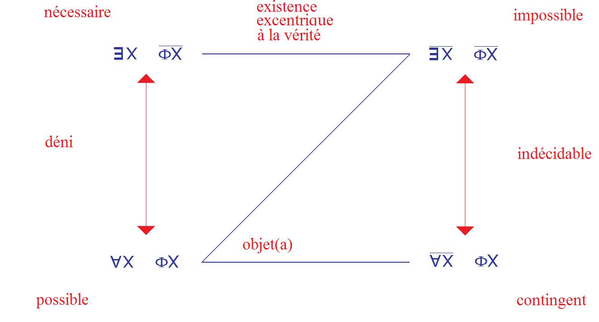
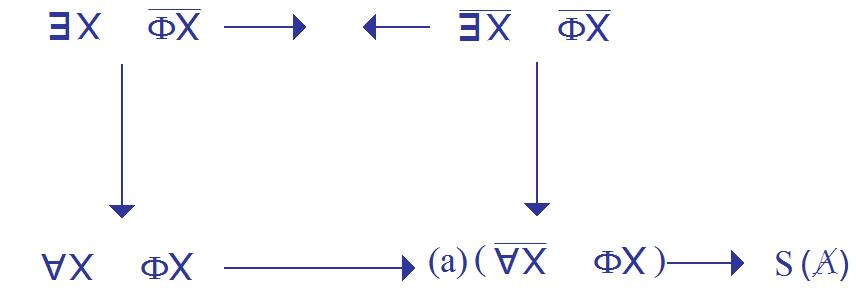
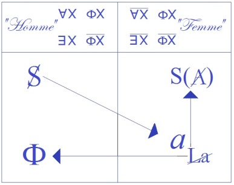
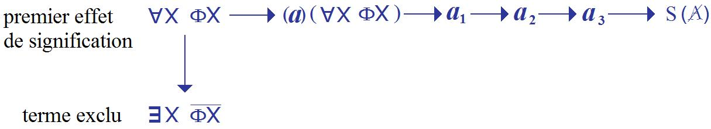
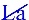

# Leçon 10 | 10 Avril 1973

  <label><input type="checkbox" data-lacan-toggle="original" checked> 原文</label>
  <label><input type="checkbox" data-lacan-toggle="notes" checked> 注释</label>
  <label><input type="checkbox" data-lacan-toggle="commentary" checked> 个人解读评论</label>

<section class="parallel-paragraph" data-paragraph-ids="s20-10-0001">

s20-10-0001

[无对应译文]

原文 · s20-10-0001

[Milner](#Milner10_04) [Récanati](#RecanatiAvril10)

</section>

<section class="parallel-paragraph" data-paragraph-ids="s20-10-0002">

s20-10-0002

[无对应译文]

原文 · s20-10-0002

Lacan

</section>

<section class="parallel-paragraph" data-paragraph-ids="s20-10-0003">

s20-10-0003

[无对应译文]

原文 · s20-10-0003

Je ne vous parle guère de ce qui paraît quand il s’agit de quelque chose de moi, d’autant plus qu’il me faut en général assez l’attendre pour que, pour moi, l’intérêt s’en distancie.

</section>

<section class="parallel-paragraph" data-paragraph-ids="s20-10-0004">

s20-10-0004

[无对应译文]

原文 · s20-10-0004

Néanmoins, il ne serait pas mauvais, pour la prochaine fois qui sera le 8 Mai...

</section>

<section class="parallel-paragraph" data-paragraph-ids="s20-10-0005">

s20-10-0005

[无对应译文]

原文 · s20-10-0005

> pas avant, puisque le 17 de ce mois sera en pleines vacances de Pâques,
>
> je vous préviens donc que le prochain rendez-vous est le 8 Mai ...il ne serait pas mauvais que vous ayez lu quelque chose que j’ai intitulé *L’étourdit*, en l’écrivant *d.i.t.,* et qui part de la distance qu’il y a du *dire* au *dit*.

</section>

<section class="parallel-paragraph" data-paragraph-ids="s20-10-0006">

s20-10-0006

[无对应译文]

原文 · s20-10-0006

Qu’il n’y ait d’*être* que dans le dit, c’est une question, que nous laisserons en suspens.

</section>

<section class="parallel-paragraph" data-paragraph-ids="s20-10-0007">

s20-10-0007

[无对应译文]

原文 · s20-10-0007

Il est certain qu’il n’y a du dit que de l’*être*, mais cela n’impose pas la réciproque.

</section>

<section class="parallel-paragraph" data-paragraph-ids="s20-10-0008">

s20-10-0008

[无对应译文]

原文 · s20-10-0008

Par contre ce qui est mon *dire* c’est « *qu’il n’y a de l’inconscient que du* *dit »*, ça c’est *un dire*.

</section>

<section class="parallel-paragraph" data-paragraph-ids="s20-10-0009">

s20-10-0009

[无对应译文]

原文 · s20-10-0009

Comment *dire* ?

</section>

<section class="parallel-paragraph" data-paragraph-ids="s20-10-0010">

s20-10-0010

[无对应译文]

原文 · s20-10-0010

C’est là la question !

</section>

<section class="parallel-paragraph" data-paragraph-ids="s20-10-0011">

s20-10-0011

[无对应译文]

原文 · s20-10-0011

On ne peut pas *dire * n’importe comment et c’est le problème de qui habite le langage, à savoir de nous tous.

</section>

<section class="parallel-paragraph" data-paragraph-ids="s20-10-0012">

s20-10-0012

[无对应译文]

原文 · s20-10-0012

C’est bien pourquoi aujourd’hui et à propos de cette *béance* que j’ai voulu exprimer un jour en distinguant de *la linguistique*, ce que je fais ici, c’est-à-dire de la « *linguisterie* », à savoir ce qui se fonde dans ce que je viens d’énoncer tout d’abord, et qui est assuré, que nous ne pouvons traiter de l’inconscient qu’à partir du *dit*, et du *dit* de l’analysant.

</section>

<section class="parallel-paragraph" data-paragraph-ids="s20-10-0013">

s20-10-0013

[无对应译文]

原文 · s20-10-0013

C’est bien dans cette référence que j’ai demandé à quelqu’un...

</section>

<section class="parallel-paragraph" data-paragraph-ids="s20-10-0014">

s20-10-0014

[无对应译文]

原文 · s20-10-0014

> qui, à ma grande reconnaissance a bien voulu y accéder ...c’est-à-dire un linguiste, de venir dire aujourd’hui devant vous...

</section>

<section class="parallel-paragraph" data-paragraph-ids="s20-10-0015">

s20-10-0015

[无对应译文]

原文 · s20-10-0015

> et je suis sûr que vous en tirerez profit, ...ce qu’il en est actuellement de la position du linguiste.

</section>

<section class="parallel-paragraph" data-paragraph-ids="s20-10-0016">

s20-10-0016

[无对应译文]

原文 · s20-10-0016

Je ne veux même pas indiquer ce qui ne peut pas manquer dans un tel énoncé de vous intéresser : que quelqu’un m’ait écrit...

</section>

<section class="parallel-paragraph" data-paragraph-ids="s20-10-0017">

s20-10-0017

[无对应译文]

原文 · s20-10-0017

> à propos d’un article comme ça qui était paru quelque part ...que quelqu’un m’ait écrit qu’il y a dans la position du linguiste quelque chose qui se déplace.

</section>

<section class="parallel-paragraph" data-paragraph-ids="s20-10-0018">

s20-10-0018

[无对应译文]

原文 · s20-10-0018

C’est ce que j’ai souhaité qu’aujourd’hui quelqu’un vous informe, et personne n’en est plus qualifié que celui que je vous présente, à savoir Jean-Claude Milner, un linguiste.

</section>

<section class="parallel-paragraph" data-paragraph-ids="s20-10-0019">

s20-10-0019

[无对应译文]

原文 · s20-10-0019

[Jean-Claude Milner](#Avril10) [^78]

</section>

<section class="parallel-paragraph" data-paragraph-ids="s20-10-0020">

s20-10-0020

[无对应译文]

原文 · s20-10-0020

De la grammaire, il y en a toujours eu, il y en a eu avant les modernes et il y en aura sans doute après nous.

</section>

<section class="parallel-paragraph" data-paragraph-ids="s20-10-0021">

s20-10-0021

[无对应译文]

原文 · s20-10-0021

Pour la linguistique c’est autre chose si l’on entend par linguistique ce qu’il faut entendre : quelque chose d’assez précis, c’est-à-dire un champ, un discours qui considère le langage comme *objet de science*.

</section>

<section class="parallel-paragraph" data-paragraph-ids="s20-10-0022">

s20-10-0022

[无对应译文]

原文 · s20-10-0022

Que le langage - peu importe le nom - que le langage soit objet de science, c’est une proposition qui n’a rien de trivial, et qui est même, d’un certain point de vue, hautement invraisemblable. Néanmoins une discipline s’est constituée autour de cette hypothèse, et on sait généralement à quel prix, par quelles voies, cette discipline s’est constituée.

</section>

<section class="parallel-paragraph" data-paragraph-ids="s20-10-0023">

s20-10-0023

[无对应译文]

原文 · s20-10-0023

Historiquement et d’un point de vue systématique, le départ c’est le cours de linguistique de Saussure, qui articule donc la linguistique comme science autour d’un certain nombre de *propositions* enchaînées.

</section>

<section class="parallel-paragraph" data-paragraph-ids="s20-10-0024">

s20-10-0024

[无对应译文]

原文 · s20-10-0024

De ces propositions, j’en retiendrai trois pour, disons résumer le premier abord de la linguistique prise comme science.

</section>

<section class="parallel-paragraph" data-paragraph-ids="s20-10-0025">

s20-10-0025

[无对应译文]

原文 · s20-10-0025

La 1ère de ces propositions c’est que le langage, en tant qu’il est objet de la linguistique, n’a comme propriétés que celles qui se déduisent analytiquement de sa nature de *signe*.

</section>

<section class="parallel-paragraph" data-paragraph-ids="s20-10-0026">

s20-10-0026

[无对应译文]

原文 · s20-10-0026

Cette proposition peut s’analyser en deux sous-propositions :

</section>

<section class="parallel-paragraph" data-paragraph-ids="s20-10-0027">

s20-10-0027

[无对应译文]

原文 · s20-10-0027

- la première c’est que le langage n’a pas de propriétés spécifiques par rapport à d’autres systèmes de signes.

</section>

<section class="parallel-paragraph" data-paragraph-ids="s20-10-0028">

s20-10-0028

[无对应译文]

原文 · s20-10-0028

- la deuxième, c’est que la notion de *signe* est essentielle à la linguistique.

</section>

<section class="parallel-paragraph" data-paragraph-ids="s20-10-0029">

s20-10-0029

[无对应译文]

原文 · s20-10-0029

Autrement dit, on peut définir la linguistique comme le type général de toute théorie des systèmes signifiants.

</section>

<section class="parallel-paragraph" data-paragraph-ids="s20-10-0030">

s20-10-0030

[无对应译文]

原文 · s20-10-0030

La 2ème grande proposition, qui s’enchaîne à la 1ère, c’est que les propriétés de tout système de *signes* peuvent être décrites par des opérations assez simples, ces opérations étant elles-mêmes justifiées par la nature même du signe, essentiellement sa nature

</section>

<section class="parallel-paragraph" data-paragraph-ids="s20-10-0031">

s20-10-0031

[无对应译文]

原文 · s20-10-0031

- d’être biface,

</section>

<section class="parallel-paragraph" data-paragraph-ids="s20-10-0032">

s20-10-0032

[无对应译文]

原文 · s20-10-0032

- et d’être arbitraire.

</section>

<section class="parallel-paragraph" data-paragraph-ids="s20-10-0033">

s20-10-0033

[无对应译文]

原文 · s20-10-0033

Par exemple, parmi ces opérations, une qui est bien connue : *la commutation*.

</section>

<section class="parallel-paragraph" data-paragraph-ids="s20-10-0034">

s20-10-0034

[无对应译文]

原文 · s20-10-0034

Ces opérations n’ont *rien de spécifique au langage*, elles pourraient être appliquées, et ont été appliquées, à d’autres systèmes.

</section>

<section class="parallel-paragraph" data-paragraph-ids="s20-10-0035">

s20-10-0035

[无对应译文]

原文 · s20-10-0035

La 3ème proposition c’est que l’ensemble des propriétés de la langue, donc l’objet de la linguistique,

</section>

<section class="parallel-paragraph" data-paragraph-ids="s20-10-0036">

s20-10-0036

[无对应译文]

原文 · s20-10-0036

- ce qu’on peut appeler cet ensemble,

</section>

<section class="parallel-paragraph" data-paragraph-ids="s20-10-0037">

s20-10-0037

[无对应译文]

原文 · s20-10-0037

- ce qu’on peut appeler la structure, est en quelque sorte de même tissus que les données observables.

</section>

<section class="parallel-paragraph" data-paragraph-ids="s20-10-0038">

s20-10-0038

[无对应译文]

原文 · s20-10-0038

Cette structure n’a rien qui soit caché, rien qui soit secret, elle s’offre à l’observation, et les opérations du linguiste ne font qu’élucider, expliciter ce qui est coprésent aux données elles-mêmes.

</section>

<section class="parallel-paragraph" data-paragraph-ids="s20-10-0039">

s20-10-0039

[无对应译文]

原文 · s20-10-0039

Ces trois propositions ont donné naissance à un type de linguistique bien connu, la linguistique structurale.

</section>

<section class="parallel-paragraph" data-paragraph-ids="s20-10-0040">

s20-10-0040

[无对应译文]

原文 · s20-10-0040

C’est un fait important que ces trois propositions ont été, toutes les trois, réfutées.

</section>

<section class="parallel-paragraph" data-paragraph-ids="s20-10-0041">

s20-10-0041

[无对应译文]

原文 · s20-10-0041

Autrement dit, dans le mouvement même de la linguistique considérée comme science, une autre hypothèse, une autre théorie du champ s’est proposée, qui s’articule par trois propositions également, qui prennent le contre-pied de celles que je viens d’énoncer.

</section>

<section class="parallel-paragraph" data-paragraph-ids="s20-10-0042">

s20-10-0042

[无对应译文]

原文 · s20-10-0042

Je commencerai par la dernière : pour analyser...

</section>

<section class="parallel-paragraph" data-paragraph-ids="s20-10-0043">

s20-10-0043

[无对应译文]

原文 · s20-10-0043

> Non ! 1ère proposition de cette nouvelle théorie qui correspond
>
> au contre-pied de la 3ème que j’ai énoncée précédemment ...pour analyser une langue, on a besoin de faire intervenir des relations abstraites, qui ne sont pas forcément représentées dans les données elles-mêmes.

</section>

<section class="parallel-paragraph" data-paragraph-ids="s20-10-0044">

s20-10-0044

[无对应译文]

原文 · s20-10-0044

Autrement dit, il n’y a pas une seule structure qui serait coprésente aux données, mais il y a au moins deux structures:

</section>

<section class="parallel-paragraph" data-paragraph-ids="s20-10-0045">

s20-10-0045

[无对应译文]

原文 · s20-10-0045

- une qui est observable qu’on appelle « *la structure de surface* »,

</section>

<section class="parallel-paragraph" data-paragraph-ids="s20-10-0046">

s20-10-0046

[无对应译文]

原文 · s20-10-0046

- et l’autre, ou plusieurs autres, qui ne sont pas observables, dont *la structure* est dite « *profonde »*. 2ème proposition articulée, qui prend donc le contre-pied de la 2ème proposition structuraliste, ces deux structures, *structure de surface* et *structure profonde*, sont reliées entre elles par des opérations complexes, en tout cas trop complexes pour être tirées de la nature même du signe, par exemple ce qu’on appelle généralement « *les transformations* ».

</section>

<section class="parallel-paragraph" data-paragraph-ids="s20-10-0047">

s20-10-0047

[无对应译文]

原文 · s20-10-0047

Et la 1ère proposition structuraliste trouve son contre-pied dans la 3ème proposition *transformationnelle*, *transformationnaliste* : ces transformations sont spécifiques au langage.

</section>

<section class="parallel-paragraph" data-paragraph-ids="s20-10-0048">

s20-10-0048

[无对应译文]

原文 · s20-10-0048

Autrement dit, aucun autre système connu ne présente des opérations du type des *transformations*, autrement dit encore, il y a des propriétés spécifiques au langage.

</section>

<section class="parallel-paragraph" data-paragraph-ids="s20-10-0049">

s20-10-0049

[无对应译文]

原文 · s20-10-0049

Un corollaire que je n’explicite pas, dont je n’explicite pas les raisons, c’est que la notion de *signe* comme telle n’est aucunement nécessaire à la linguistique.

</section>

<section class="parallel-paragraph" data-paragraph-ids="s20-10-0050">

s20-10-0050

[无对应译文]

原文 · s20-10-0050

On peut parfaitement développer la linguistique comme science sans faire usage

</section>

<section class="parallel-paragraph" data-paragraph-ids="s20-10-0051">

s20-10-0051

[无对应译文]

原文 · s20-10-0051

- de la notion de *signe saussurien*,

</section>

<section class="parallel-paragraph" data-paragraph-ids="s20-10-0052">

s20-10-0052

[无对应译文]

原文 · s20-10-0052

- de la notion de *signifiant* par opposition au *signifié*, ce qui, disons par parenthèse, rend quelque peu comique certaine assertion récente suivant laquelle c’est du côté de la linguistique qu’il faudrait se tourner pour comprendre la notion de signifiant.

</section>

<section class="parallel-paragraph" data-paragraph-ids="s20-10-0053">

s20-10-0053

[无对应译文]

原文 · s20-10-0053

Ce changement, à l’intérieur de la linguistique, a toutes les apparences extérieures de ce qu’on a appelé une refonte, c’est-à-dire le passage d’une certaine configuration du champ d’une science à une autre configuration de ce champ, cette seconde configuration intégrant la première et la présentant comme un cas particulier de sa propre analyse.

</section>

<section class="parallel-paragraph" data-paragraph-ids="s20-10-0054">

s20-10-0054

[无对应译文]

原文 · s20-10-0054

Et ainsi, la linguistique structuraliste est réfutée par la linguistique transformationnelle, mais en même temps elle y est intégrée puisque la linguistique structurale apparaît comme un cas particulier, plus restrictif, de la linguistique transformationnelle.

</section>

<section class="parallel-paragraph" data-paragraph-ids="s20-10-0055">

s20-10-0055

[无对应译文]

原文 · s20-10-0055

Loin donc, que ce passage d’une linguistique à une autre puisse se qualifier comme une difficulté ou comme une crise, le fait que ce type de refonte soit possible paraît plutôt une preuve que *la linguistique est bien intégrée au champ des sciences*.

</section>

<section class="parallel-paragraph" data-paragraph-ids="s20-10-0056">

s20-10-0056

[无对应译文]

原文 · s20-10-0056

Voilà en gros la présentation la plus courante que l’on peut faire du système de la linguistique.

</section>

<section class="parallel-paragraph" data-paragraph-ids="s20-10-0057">

s20-10-0057

[无对应译文]

原文 · s20-10-0057

Ce que je vais essayer de montrer c’est qu’en réalité la situation est toute différente, il n’y a pas... dans les « *difficultés* », il y a premièrement des difficultés aujourd’hui dans le champ de la linguistique, et ces difficultés ne se présentent pas comme les signes avant-coureurs d’une refonte, c’est-à-dire comme les signes avant-coureurs d’une nouvelle figure de la linguistique qui intégrerait la précédente, mais comme les signes d’une difficulté de fond, ce qu’on appelle couramment une crise, et j’essaierai de montrer en dernier lieu le noyau, le principe de cette crise.

</section>

<section class="parallel-paragraph" data-paragraph-ids="s20-10-0058">

s20-10-0058

[无对应译文]

原文 · s20-10-0058

Je vais donc considérer successivement quelques problèmes de brouillage, d’antinomie qui sont recouverts par la linguistique dite transformationnelle.

</section>

<section class="parallel-paragraph" data-paragraph-ids="s20-10-0059">

s20-10-0059

[无对应译文]

原文 · s20-10-0059

La première sera l’antinomie, la... - comment dire ? – la possibilité d’interpréter de deux manières différentes l’opposition de *la structure de surface* à *la structure de profondeur*.

</section>

<section class="parallel-paragraph" data-paragraph-ids="s20-10-0060">

s20-10-0060

[无对应译文]

原文 · s20-10-0060

Pour présenter de façon simple le problème, on peut considérer que le « *donner à expliquer* »...

</section>

<section class="parallel-paragraph" data-paragraph-ids="s20-10-0061">

s20-10-0061

[无对应译文]

原文 · s20-10-0061

> pour une grammaire transformationnelle ...c’est, mettons, un ensemble de phrases que l’on considérera comme appartenant à un ensemble bien formé.

</section>

<section class="parallel-paragraph" data-paragraph-ids="s20-10-0062">

s20-10-0062

[无对应译文]

原文 · s20-10-0062

Par exemple, je prends un exemple tout à fait abstrait : une phrase positive, assertive, active, sera reliée et sera classée

</section>

<section class="parallel-paragraph" data-paragraph-ids="s20-10-0063">

s20-10-0063

[无对应译文]

原文 · s20-10-0063

- dans le même ensemble que la version *négative* de cette même phrase,

</section>

<section class="parallel-paragraph" data-paragraph-ids="s20-10-0064">

s20-10-0064

[无对应译文]

原文 · s20-10-0064

- dans le même ensemble que la version *interrogative* de cette même phrase,

</section>

<section class="parallel-paragraph" data-paragraph-ids="s20-10-0065">

s20-10-0065

[无对应译文]

原文 · s20-10-0065

- et dans le même ensemble que la version *passive* de cette même phrase.

</section>

<section class="parallel-paragraph" data-paragraph-ids="s20-10-0066">

s20-10-0066

[无对应译文]

原文 · s20-10-0066

On a donc *un ensemble*, on peut se poser des questions sur la façon dont *l’ensemble* sera construit, mais enfin on a le deux. Eh bien, cet ensemble, on peut admettre que s’il est bien formé, il se justifie par une propriété commune à tous les éléments de l’ensemble, opération très simple.

</section>

<section class="parallel-paragraph" data-paragraph-ids="s20-10-0067">

s20-10-0067

[无对应译文]

原文 · s20-10-0067

Question : cette propriété commune est-elle une réalité ou un *flatus* *vocis*[^79] ?

</section>

<section class="parallel-paragraph" data-paragraph-ids="s20-10-0068">

s20-10-0068

[无对应译文]

原文 · s20-10-0068

Autrement dit, l’interprétation de cette proposition : « *il y a une propriété commune aux ensembles, aux phrases de l’ensemble* »

</section>

<section class="parallel-paragraph" data-paragraph-ids="s20-10-0069">

s20-10-0069

[无对应译文]

原文 · s20-10-0069

- peut avoir une version « *réaliste »,*

</section>

<section class="parallel-paragraph" data-paragraph-ids="s20-10-0070">

s20-10-0070

[无对应译文]

原文 · s20-10-0070

- ou une version « *nominaliste »*.

</section>

<section class="parallel-paragraph" data-paragraph-ids="s20-10-0071">

s20-10-0071

[无对应译文]

原文 · s20-10-0071

Si on adopte l’interprétation *réaliste*, cela revient à dire que, on a une réalité, que cette propriété commune est une réalité, cette réalité est de type langagier, linguistique, autrement dit que la propriété commune à toutes les phrases de l’ensemble se représentera sous la forme d’une structure linguistique, cette structure étant évidemment qualifiée pour être *la structure profonde* des phrases appartenant à l’ensemble.

</section>

<section class="parallel-paragraph" data-paragraph-ids="s20-10-0072">

s20-10-0072

[无对应译文]

原文 · s20-10-0072

À partir de cette structure, il suffira de construire un certain nombre de règles, des transformations, qui permettront d’obtenir donc, à partir de la structure commune, par une série d’opérations différentes, tel et tel élément différencié de l’ensemble initial.

</section>

<section class="parallel-paragraph" data-paragraph-ids="s20-10-0073">

s20-10-0073

[无对应译文]

原文 · s20-10-0073

Autre interprétation : interprétation *nominaliste*.

</section>

<section class="parallel-paragraph" data-paragraph-ids="s20-10-0074">

s20-10-0074

[无对应译文]

原文 · s20-10-0074

Dans ce cas-là, il n’y a aucune réalité qui *représente* la propriété comme telle, il n’y a comme réalité que la classe que l’on a pu construire, la classe de phrases que l’on a pu construire, et de ce point de vue, *le système transformationnel n’a plus de structure de départ* sur laquelle il aura à opérer des modifications.

</section>

<section class="parallel-paragraph" data-paragraph-ids="s20-10-0075">

s20-10-0075

[无对应译文]

原文 · s20-10-0075

2ème *divergence* possible concernant les transformations elles-mêmes, disons *l’ensemble de la grammaire dite transformationnelle* : étant donnée une transformation, ou étant donnée toute assertion grammaticale de la théorie grammaticale, on pourra l’envisager soit « *en* *extension »*, soit « *en* *intention »*.

</section>

<section class="parallel-paragraph" data-paragraph-ids="s20-10-0076">

s20-10-0076

[无对应译文]

原文 · s20-10-0076

Par exemple, en *extension* : une transformation consiste en une paire de phrases que l’on affirme être liées, par exemple la phrase active et la phrase passive, et la transformation ne sera rien d’autre que le couple que l’on aura pu construire : *phrase active - phrase passive*.

</section>

<section class="parallel-paragraph" data-paragraph-ids="s20-10-0077">

s20-10-0077

[无对应译文]

原文 · s20-10-0077

Si l’on adopte le point de vue *intentionnel* : eh bien la transformation ne se réduit pas à la paire de phrases, mais devient une propriété de cette paire qui ne se confond pas avec la paire elle-même.

</section>

<section class="parallel-paragraph" data-paragraph-ids="s20-10-0078">

s20-10-0078

[无对应译文]

原文 · s20-10-0078

Cette opposition, cette divergence peut entraîner un certain nombre de différences tout à fait sensibles dans la théorie. Prenons par exemple une structure comme il en existe beaucoup dans les langues où la présence d’un élément peut être prévue à partir de la présence d’un autre.

</section>

<section class="parallel-paragraph" data-paragraph-ids="s20-10-0079">

s20-10-0079

[无对应译文]

原文 · s20-10-0079

Par exemple, en français, il n’y a pas d’article qui ne soit suivi...

</section>

<section class="parallel-paragraph" data-paragraph-ids="s20-10-0080">

s20-10-0080

[无对应译文]

原文 · s20-10-0080

> de près ou de loin, enfin immédiatement ou non ...d’un substantif.

</section>

<section class="parallel-paragraph" data-paragraph-ids="s20-10-0081">

s20-10-0081

[无对应译文]

原文 · s20-10-0081

Autrement dit, lorsque l’on dit d’une structure qu’elle comporte un article, on dit la même chose que lorsqu’on dit que cette structure comporte un article suivi d’un substantif, bien évidemment. Autrement dit encore, la classe des séquences comportant un article, est identique à la classe des séquences comportant un article plus un substantif.

</section>

<section class="parallel-paragraph" data-paragraph-ids="s20-10-0082">

s20-10-0082

[无对应译文]

原文 · s20-10-0082

Dans une approche *extensionnelle*, toute expression ayant la même extension qu’une autre expression peut être librement substituée à cette autre expression. Dans le cas particulier, cela voudra dire qu’une expression du type « *structure comportant un article* » sera librement substituable à  « *structure comportant un article plus un substantif* ».

</section>

<section class="parallel-paragraph" data-paragraph-ids="s20-10-0083">

s20-10-0083

[无对应译文]

原文 · s20-10-0083

Mais dans l’approche *intentionnelle*, il n’est pas nécessairement vrai que deux expressions ayant la même extension soient substituables.

</section>

<section class="parallel-paragraph" data-paragraph-ids="s20-10-0084">

s20-10-0084

[无对应译文]

原文 · s20-10-0084

Par exemple, pour prendre un exemple de Quine, entre la propriété :

</section>

<section class="parallel-paragraph" data-paragraph-ids="s20-10-0085">

s20-10-0085

[无对应译文]

原文 · s20-10-0085

- « *être un animal marin vivant en 1940* »,

</section>

<section class="parallel-paragraph" data-paragraph-ids="s20-10-0086">

s20-10-0086

[无对应译文]

原文 · s20-10-0086

- et la propriété : « *être un cétacé vivant en 1940* ».

</section>

<section class="parallel-paragraph" data-paragraph-ids="s20-10-0087">

s20-10-0087

[无对应译文]

原文 · s20-10-0087

L’extension pourra bien être la même - admettons... – mais il n’est pas évident pour autant que les deux propriétés soient les mêmes, et soient substituables l’une à l’autre en préservant la synonymie des énoncés.

</section>

<section class="parallel-paragraph" data-paragraph-ids="s20-10-0088">

s20-10-0088

[无对应译文]

原文 · s20-10-0088

Par conséquent dans le cas qui nous occupe, il peut très bien y avoir une différence entre :

</section>

<section class="parallel-paragraph" data-paragraph-ids="s20-10-0089">

s20-10-0089

[无对应译文]

原文 · s20-10-0089

- la propriété « *être analysable en un article* »,

</section>

<section class="parallel-paragraph" data-paragraph-ids="s20-10-0090">

s20-10-0090

[无对应译文]

原文 · s20-10-0090

- et la propriété « *être analysable entre article plus nom* ».

</section>

<section class="parallel-paragraph" data-paragraph-ids="s20-10-0091">

s20-10-0091

[无对应译文]

原文 · s20-10-0091

Et l’on peut parfaitement imaginer des règles qui seront correctement présentées suivant l’une de ces propositions, et ne le seraient pas suivant l’autre de ces propositions.

</section>

<section class="parallel-paragraph" data-paragraph-ids="s20-10-0092">

s20-10-0092

[无对应译文]

原文 · s20-10-0092

Jacques Lacan – *Mammifère*...

</section>

<section class="parallel-paragraph" data-paragraph-ids="s20-10-0093">

s20-10-0093

[无对应译文]

原文 · s20-10-0093

Jean-Claude Milner

</section>

<section class="parallel-paragraph" data-paragraph-ids="s20-10-0094">

s20-10-0094

[无对应译文]

原文 · s20-10-0094

Oui c’est ça, *Mammifère*, ah oui !

</section>

<section class="parallel-paragraph" data-paragraph-ids="s20-10-0095">

s20-10-0095

[无对应译文]

原文 · s20-10-0095

Pour être complet, il faudrait ajouter les pinnipèdes aux cétacés : il y a deux, deux sous-groupes parmi les animaux mammifères marins.

</section>

<section class="parallel-paragraph" data-paragraph-ids="s20-10-0096">

s20-10-0096

[无对应译文]

原文 · s20-10-0096

Autrement dit, là encore on a une bifidité, un clivage entre 2 interprétations possibles de la notion de *transformation*.

</section>

<section class="parallel-paragraph" data-paragraph-ids="s20-10-0097">

s20-10-0097

[无对应译文]

原文 · s20-10-0097

En général, les théories linguistiques combinent

</section>

<section class="parallel-paragraph" data-paragraph-ids="s20-10-0098">

s20-10-0098

[无对应译文]

原文 · s20-10-0098

- *le point de vue intentionnel* sur les transformations,

</section>

<section class="parallel-paragraph" data-paragraph-ids="s20-10-0099">

s20-10-0099

[无对应译文]

原文 · s20-10-0099

- et *le point de vue réaliste* concernant la structure profonde.

</section>

<section class="parallel-paragraph" data-paragraph-ids="s20-10-0100">

s20-10-0100

[无对应译文]

原文 · s20-10-0100

Et celles qui adoptent *le point de vue extensionnel* concernant les transformations, adoptent *le point de vue nominaliste* sur la structure profonde.

</section>

<section class="parallel-paragraph" data-paragraph-ids="s20-10-0101">

s20-10-0101

[无对应译文]

原文 · s20-10-0101

Je ne m’attarderai pas sur ce fait, il n’est sûrement pas dû au hasard, je prendrai simplement la situation telle qu’elle est. On a donc deux possibilités pour la théorie linguistique transformationnelle :

</section>

<section class="parallel-paragraph" data-paragraph-ids="s20-10-0102">

s20-10-0102

[无对应译文]

原文 · s20-10-0102

- d’une part être *intentionnelle réaliste*,

</section>

<section class="parallel-paragraph" data-paragraph-ids="s20-10-0103">

s20-10-0103

[无对应译文]

原文 · s20-10-0103

- et d’autre part être *extensionnelle nominaliste*.

</section>

<section class="parallel-paragraph" data-paragraph-ids="s20-10-0104">

s20-10-0104

[无对应译文]

原文 · s20-10-0104

Si on adopte le point de vue *extensionnel réaliste*... le point de vue *extensionnel nominaliste*, pardon, *la structure profonde* devient, étant simplement une classe, les règles de la grammaire étant purement extensionnelles sont elles aussi purement des classes.

</section>

<section class="parallel-paragraph" data-paragraph-ids="s20-10-0105">

s20-10-0105

[无对应译文]

原文 · s20-10-0105

Autrement dit les démonstrations de cette théorie consisteront tout simplement à trouver des procédures de construction des classes bien formées.

</section>

<section class="parallel-paragraph" data-paragraph-ids="s20-10-0106">

s20-10-0106

[无对应译文]

原文 · s20-10-0106

Et on aura démontré une thèse dans cette grammaire si l’on a trouvé la procédure constructive effective, permettant de montrer que la classe visée est bien formée, est exhaustive, etc.

</section>

<section class="parallel-paragraph" data-paragraph-ids="s20-10-0107">

s20-10-0107

[无对应译文]

原文 · s20-10-0107

Inversement dans l’autre hypothèse, la version donc *intentionnelle nominaliste* [^80], la structure profonde est une *structure réelle* et c’est de plus une *structure cachée*.

</section>

<section class="parallel-paragraph" data-paragraph-ids="s20-10-0108">

s20-10-0108

[无对应译文]

原文 · s20-10-0108

Pour la reconstituer, on est obligé de s’appuyer sur des indices donnés par l’observation.

</section>

<section class="parallel-paragraph" data-paragraph-ids="s20-10-0109">

s20-10-0109

[无对应译文]

原文 · s20-10-0109

D’autre part, les transformations sont formulées en termes de propriétés, essentiellement à partir de l’énoncé suivant, le principe suivant : « *Deux phrases sont en relation de transformation si elles ont les mêmes propriétés* ».

</section>

<section class="parallel-paragraph" data-paragraph-ids="s20-10-0110">

s20-10-0110

[无对应译文]

原文 · s20-10-0110

Il faudra donc toute une série de raisonnements montrant :

</section>

<section class="parallel-paragraph" data-paragraph-ids="s20-10-0111">

s20-10-0111

[无对应译文]

原文 · s20-10-0111

- que telle propriété est bien *représentée sur deux phrases*,

</section>

<section class="parallel-paragraph" data-paragraph-ids="s20-10-0112">

s20-10-0112

[无对应译文]

原文 · s20-10-0112

- que cette propriété est la même *dans les deux cas*,

</section>

<section class="parallel-paragraph" data-paragraph-ids="s20-10-0113">

s20-10-0113

[无对应译文]

原文 · s20-10-0113

- que d’autre part, le fait que cette propriété soit la même est un argument suffisant pour combiner les deux phrases par une transformation, etc.

</section>

<section class="parallel-paragraph" data-paragraph-ids="s20-10-0114">

s20-10-0114

[无对应译文]

原文 · s20-10-0114

Autrement dit la forme de la démonstration sera, non pas de l’ordre de la construction des classes, mais de l’ordre de l’argumentation à partir d’indices ou à partir de raisons.

</section>

<section class="parallel-paragraph" data-paragraph-ids="s20-10-0115">

s20-10-0115

[无对应译文]

原文 · s20-10-0115

Le type de la certitude

</section>

<section class="parallel-paragraph" data-paragraph-ids="s20-10-0116">

s20-10-0116

[无对应译文]

原文 · s20-10-0116

- dans un cas, sera donc de l’ordre des dénombrements exhaustifs,

</section>

<section class="parallel-paragraph" data-paragraph-ids="s20-10-0117">

s20-10-0117

[无对应译文]

原文 · s20-10-0117

- dans l’autre cas, il sera de l’ordre des raisons combinées, de la force relative des indices, etc.

</section>

<section class="parallel-paragraph" data-paragraph-ids="s20-10-0118">

s20-10-0118

[无对应译文]

原文 · s20-10-0118

Conclusion : de même qu’il n’y a pas donc une interprétation univoque des notions fondamentales de la linguistique, de même il n’y a pas de type unique de démonstration et de certitude.

</section>

<section class="parallel-paragraph" data-paragraph-ids="s20-10-0119">

s20-10-0119

[无对应译文]

原文 · s20-10-0119

Est-ce que néanmoins on peut maintenir que, sur la notion de « *propriété du langage* » ...

</section>

<section class="parallel-paragraph" data-paragraph-ids="s20-10-0120">

s20-10-0120

[无对应译文]

原文 · s20-10-0120

> nous avons vu qu’elle était singulière dans la théorie transformationnelle ...est-ce que l’on peut dire qu’il y a accord ?

</section>

<section class="parallel-paragraph" data-paragraph-ids="s20-10-0121">

s20-10-0121

[无对应译文]

原文 · s20-10-0121

Le problème est d’importance dans la mesure où, si l’on admet que le langage a des propriétés spécifiques, l’objet de la linguistique sera évidemment de découvrir ces propriétés spécifiques, et il ne peut pas y en avoir d’autres.

</section>

<section class="parallel-paragraph" data-paragraph-ids="s20-10-0122">

s20-10-0122

[无对应译文]

原文 · s20-10-0122

Si donc il apparaît que sur la notion de *propriété du langage* il y a ambivalence, ambiguïté, on en sera amené à conclure qu’il n’y a pas de notion univoque de l’objet de la linguistique.

</section>

<section class="parallel-paragraph" data-paragraph-ids="s20-10-0123">

s20-10-0123

[无对应译文]

原文 · s20-10-0123

Eh bien en fait, on peut effectivement montrer qu’il y a ambivalence de la notion même de propriété.

</section>

<section class="parallel-paragraph" data-paragraph-ids="s20-10-0124">

s20-10-0124

[无对应译文]

原文 · s20-10-0124

Prenons l’exemple des transformations.

</section>

<section class="parallel-paragraph" data-paragraph-ids="s20-10-0125">

s20-10-0125

[无对应译文]

原文 · s20-10-0125

C’est une spécificité - admettons-le - des systèmes linguistiques que d’être articulables en termes de transformations.

</section>

<section class="parallel-paragraph" data-paragraph-ids="s20-10-0126">

s20-10-0126

[无对应译文]

原文 · s20-10-0126

Eh bien il existe une interprétation suivant laquelle on dira : « C*e qui me garantit que c’est une propriété,* *c’est justement que l’on puisse imaginer a priori toute une série de systèmes formels, non pourvus de transformations* »

</section>

<section class="parallel-paragraph" data-paragraph-ids="s20-10-0127">

s20-10-0127

[无对应译文]

原文 · s20-10-0127

Autrement dit, *a priori* rien ne m’empêche de représenter un système par des transformations, mais qu’en fait, « *eh bien c’est comme ça* » il y a des transformations dans les noms.

</section>

<section class="parallel-paragraph" data-paragraph-ids="s20-10-0128">

s20-10-0128

[无对应译文]

原文 · s20-10-0128

La notion de *propriété* est alors liée au « *c’est comme ça* » : à l’*indéductible a priori* et à l’*observable* *a posteriori*.

</section>

<section class="parallel-paragraph" data-paragraph-ids="s20-10-0129">

s20-10-0129

[无对应译文]

原文 · s20-10-0129

C’est en particulier la position de Chomsky, et pour ceux qui pratiquent les raisonnements, enfin les argumentations, les discussions de la grammaire du type chomskien, ils reconnaîtront très fréquemment des arguments du genre :

</section>

<section class="parallel-paragraph" data-paragraph-ids="s20-10-0130">

s20-10-0130

[无对应译文]

原文 · s20-10-0130

> « *Il n’y a aucune raison a priori pour que telle structure soit présente dans les langues, or elle y est présente, donc j’ai une propriété,*
>
> *et ayant une propriété reconnaissable à ce critère qu’elle est indéductible a priori,*
>
> *j’ai atteint la thèse ultime de ma théorie, et j’ai atteint mon objet* ».

</section>

<section class="parallel-paragraph" data-paragraph-ids="s20-10-0131">

s20-10-0131

[无对应译文]

原文 · s20-10-0131

Mais on peut imaginer une interprétation tout à fait différente qui dira : « *Eh bien il n’y a aucune raison de ne pas appliquer le principe de raison au phénomène que l’on a découvert,* *par exemple l’existence des transformations* » et l’on cherchera à dire : « *Eh bien s’il y a des transformations dans les langues, eh bien cela tient à leur essence, quelle que soit cette essence,* *par exemple celle d’être des instruments de communication,* *ou par exemple celle de représenter des situations objectives, ou toute essence qu’on pourrait s’imaginer de ce côté-là* ».

</section>

<section class="parallel-paragraph" data-paragraph-ids="s20-10-0132">

s20-10-0132

[无对应译文]

原文 · s20-10-0132

Peu importe le détail, ce qui est important c’est que dans une interprétation de ce genre, le critère d’une propriété ce n’est pas qu’elle soit *in-déductible* *a priori*, mais c’est qu’elle soit au contraire *déductible* à partir d’un principe fondamental, qui articulerait, n’est-ce pas, qui formulerait l’essence même de la langue prise comme telle.

</section>

<section class="parallel-paragraph" data-paragraph-ids="s20-10-0133">

s20-10-0133

[无对应译文]

原文 · s20-10-0133

Vous voyez que dans ce cas là on a deux théories linguistiques tout à fait différentes, et que l’objet de la linguistique ne se formulera pas du tout de la même façon, puisque :

</section>

<section class="parallel-paragraph" data-paragraph-ids="s20-10-0134">

s20-10-0134

[无对应译文]

原文 · s20-10-0134

- dans un cas l’objet de la linguistique sera d’enregistrer, de chercher à découvrir tout l’ensemble des propriétés en quelque sorte inexplicables *a priori* des langues, que l’on peut simplement enregistrer comme des données,

</section>

<section class="parallel-paragraph" data-paragraph-ids="s20-10-0135">

s20-10-0135

[无对应译文]

原文 · s20-10-0135

- dans l’autre cas l’objet de la linguistique sera d’essayer de ramener l’ensemble des propriétés que l’on aura pu découvrir objectivement, à *une essence* du langage quelle qu’en soit la définition.

</section>

<section class="parallel-paragraph" data-paragraph-ids="s20-10-0136">

s20-10-0136

[无对应译文]

原文 · s20-10-0136

Eh bien, me semble-t-il, lorsque dans une théorie,

</section>

<section class="parallel-paragraph" data-paragraph-ids="s20-10-0137">

s20-10-0137

[无对应译文]

原文 · s20-10-0137

- on a divergence sur l’objet,

</section>

<section class="parallel-paragraph" data-paragraph-ids="s20-10-0138">

s20-10-0138

[无对应译文]

原文 · s20-10-0138

- qu’on a divergence sur la nature des démonstrations,

</section>

<section class="parallel-paragraph" data-paragraph-ids="s20-10-0139">

s20-10-0139

[无对应译文]

原文 · s20-10-0139

- sur la nature de la certitude, il y a manifestement quelque chose qui est en cause.

</section>

<section class="parallel-paragraph" data-paragraph-ids="s20-10-0140">

s20-10-0140

[无对应译文]

原文 · s20-10-0140

Eh bien, si l’on observe ce qui se passe, on s’aperçoit que, pour choisir entre les diverses interprétations, à chaque moment de l’ambivalence, des ambivalences successives, le linguiste, les linguistes n’ont d’autre principe - en tout cas, qu’on puisse reconnaître - que leur propre vision du monde.

</section>

<section class="parallel-paragraph" data-paragraph-ids="s20-10-0141">

s20-10-0141

[无对应译文]

原文 · s20-10-0141

Ils choisiront par exemple sur le dernier point l’hypothèse

</section>

<section class="parallel-paragraph" data-paragraph-ids="s20-10-0142">

s20-10-0142

[无对应译文]

原文 · s20-10-0142

- de l’inexplicable *a priori*

</section>

<section class="parallel-paragraph" data-paragraph-ids="s20-10-0143">

s20-10-0143

[无对应译文]

原文 · s20-10-0143

- ou au contraire de l’explicable *a priori,* uniquement en fonction de leur conception du principe de raison.

</section>

<section class="parallel-paragraph" data-paragraph-ids="s20-10-0144">

s20-10-0144

[无对应译文]

原文 · s20-10-0144

Et ainsi de suite, concernant le choix entre le nominalisme ou le réalisme, bien des discussions de cet ordre reviennent simplement à une sélection en termes de « *vision du monde* » :

</section>

<section class="parallel-paragraph" data-paragraph-ids="s20-10-0145">

s20-10-0145

[无对应译文]

原文 · s20-10-0145

- qu’est-ce que je préfère, le *nominalisme* ou le *réalisme* ?

</section>

<section class="parallel-paragraph" data-paragraph-ids="s20-10-0146">

s20-10-0146

[无对应译文]

原文 · s20-10-0146

- Ou, qu’est-ce que je préfère : l’*extension* ou l’*intention* ?

</section>

<section class="parallel-paragraph" data-paragraph-ids="s20-10-0147">

s20-10-0147

[无对应译文]

原文 · s20-10-0147

Ceci peut être masqué par un certain nombre d’assertions sur la nature de la science, qui doit être ou mesurable ou pas mesurable, etc. Peu importe !

</section>

<section class="parallel-paragraph" data-paragraph-ids="s20-10-0148">

s20-10-0148

[无对应译文]

原文 · s20-10-0148

Le fond c’est une question de vision du monde.

</section>

<section class="parallel-paragraph" data-paragraph-ids="s20-10-0149">

s20-10-0149

[无对应译文]

原文 · s20-10-0149

Il me semble que l’on peut avancer sans invraisemblance la thèse que lorsque dans un champ appartenant à la science, la sélection entre des théories concurrentes se fait en termes de *vision du monde*, on peut appeler ça *une crise*.

</section>

<section class="parallel-paragraph" data-paragraph-ids="s20-10-0150">

s20-10-0150

[无对应译文]

原文 · s20-10-0150

Eh bien, cette crise on pourrait simplement la constater, il me semble que le noyau, le principe fondamental, peut néanmoins en être articulé plus précisément.

</section>

<section class="parallel-paragraph" data-paragraph-ids="s20-10-0151">

s20-10-0151

[无对应译文]

原文 · s20-10-0151

Quelque chose est en cause en ce moment, dans le système de la théorie linguistique, qui met en question sa nature même de science.

</section>

<section class="parallel-paragraph" data-paragraph-ids="s20-10-0152">

s20-10-0152

[无对应译文]

原文 · s20-10-0152

Entre le passage, disons dans le passage du *saussurisme* au *transformationnalisme*, dont nous avons vu qu’il repose sur des inversions de propositions, il y avait quelque chose que je n’ai pas décrit, qui est resté intangible, c’est ce que je pourrais appeler le modèle du *sujet syntaxique*.

</section>

<section class="parallel-paragraph" data-paragraph-ids="s20-10-0153">

s20-10-0153

[无对应译文]

原文 · s20-10-0153

Qu’est-ce que c’est que ce modèle ?

</section>

<section class="parallel-paragraph" data-paragraph-ids="s20-10-0154">

s20-10-0154

[无对应译文]

原文 · s20-10-0154

Eh bien Saussure le décrit de façon très simple, c’est une relation à deux termes : entre *le locuteur* et *l’interlocuteur*.

</section>

<section class="parallel-paragraph" data-paragraph-ids="s20-10-0155">

s20-10-0155

[无对应译文]

原文 · s20-10-0155

On connaît, tout le monde connaît le schéma saussurien : on a un point de départ qui est A, un point d’arrivée qui est B. Le propre de ce modèle c’est qu’un *interlocuteur* ne fonctionne comme tel dans le système, que s’il prouve qu’il a la capacité d’être à son tour un *locuteur* à un autre moment du système.

</section>

<section class="parallel-paragraph" data-paragraph-ids="s20-10-0156">

s20-10-0156

[无对应译文]

原文 · s20-10-0156

Autrement dit on a deux termes qui sont symétriques et différents, à peu près comme *la main droite* et *la main gauche*, mais qui sont - comme la main droite et la main gauche - d’un certain point de vue, homogènes.

</section>

<section class="parallel-paragraph" data-paragraph-ids="s20-10-0157">

s20-10-0157

[无对应译文]

原文 · s20-10-0157

Et l’on peut parler de l’interlocuteur ou du locuteur linguistique au singulier, ayant comme propriété distinctive de se re-dupliquer dans la réalité, la réalité des corps, de même que l’on peut parler de la main au singulier, dont chacun sait la propriété de se re–dupliquer dans le corps humain.

</section>

<section class="parallel-paragraph" data-paragraph-ids="s20-10-0158">

s20-10-0158

[无对应译文]

原文 · s20-10-0158

Eh bien ce passage, enfin cette structure, ce modèle, est absolument inchangé dans le chomskisme, la référence que Chomsky, d’ailleurs, fait à Saussure sur ce point est explicite, et l’on peut montrer de façon assez simple qu’en dehors d’un tel modèle, l’intégration du langage à la science, au champ de la science, est absolument impossible.

</section>

<section class="parallel-paragraph" data-paragraph-ids="s20-10-0159">

s20-10-0159

[无对应译文]

原文 · s20-10-0159

La question qui se pose ça n’est pas tellement de savoir : qu’est-ce qu’on fait tomber lorsque l’on propose un tel modèle, parce qu’après tout, pratiquement on peut montrer sur tous les discours scientifiques qu’ils payent un certain prix, qui est le prix de leur scientificité. Ça n’est pas là le problème.

</section>

<section class="parallel-paragraph" data-paragraph-ids="s20-10-0160">

s20-10-0160

[无对应译文]

原文 · s20-10-0160

Le problème c’est de savoir si *dans le mouvement même* de son exploration positive du champ des phénomènes langagiers, donc en s’appuyant sur ce qui rend possible cette exploration positive, donc ce modèle, la linguistique n’est pas amenée à être confrontée devant des données qui sont proprement inexplicables, impossibles à élucider, si elle continue de s’appuyer sur ce modèle.

</section>

<section class="parallel-paragraph" data-paragraph-ids="s20-10-0161">

s20-10-0161

[无对应译文]

原文 · s20-10-0161

Autrement dit, le point c’est de savoir si dans le mouvement même de son exploration scientifique, la linguistique ne rencontre pas de quoi dissoudre ce qui avait rendu cette exploration scientifique possible.

</section>

<section class="parallel-paragraph" data-paragraph-ids="s20-10-0162">

s20-10-0162

[无对应译文]

原文 · s20-10-0162

Eh bien, sans entrer dans les détails, il semble que c’est bien là la situation.

</section>

<section class="parallel-paragraph" data-paragraph-ids="s20-10-0163">

s20-10-0163

[无对应译文]

原文 · s20-10-0163

Autrement dit, on peut montrer, on pourrait montrer que la linguistique...

</section>

<section class="parallel-paragraph" data-paragraph-ids="s20-10-0164">

s20-10-0164

[无对应译文]

原文 · s20-10-0164

> et c’est en ce moment que cela se passe ...est mise en face...

</section>

<section class="parallel-paragraph" data-paragraph-ids="s20-10-0165">

s20-10-0165

[无对应译文]

原文 · s20-10-0165

> par simplement le mouvement de son exploration syntaxique, donc la plus positive possible ...est mise en face de phénomènes incontournables et dont la pure syntaxe...

</section>

<section class="parallel-paragraph" data-paragraph-ids="s20-10-0166">

s20-10-0166

[无对应译文]

原文 · s20-10-0166

> la syntaxe fondée sur la formalisation si j’ose dire, sur le - disons - le formalisable ...dont la pure syntaxe ne peut pas rendre compte si elle continue à poser deux sujets absolument symétriques, absolument homogènes l’un à l’autre, dont l’un sera *le locuteur* et l’autre *l’interlocuteur*.

</section>

<section class="parallel-paragraph" data-paragraph-ids="s20-10-0167">

s20-10-0167

[无对应译文]

原文 · s20-10-0167

Je renvoie, pour une illustration de ce genre de problème, au récent livre de Ducrot « *Dire et ne pas dire »*[^81], qui montre à l’évidence qu’il y a toute une série de phénomènes parfaitement repérables en termes positifs...

</section>

<section class="parallel-paragraph" data-paragraph-ids="s20-10-0168">

s20-10-0168

[无对应译文]

原文 · s20-10-0168

> qui se repèrent en termes de structure grammaticale,
>
> de mots, de choses tout à fait enregistrables par des données ...que tous ces phénomènes ne peuvent pas être compris, si l’on ne pose pas *au moins deux sujets*, *hétérogènes* l’un à l’autre, dont l’un exerce sur l’autre ce que Ducrot appelle *une relation de pouvoir*, un exercice de pouvoir.

</section>

<section class="parallel-paragraph" data-paragraph-ids="s20-10-0169">

s20-10-0169

[无对应译文]

原文 · s20-10-0169

Autrement dit, le point de la crise c’est que pour continuer l’exploration qu’elle est nécessitée à faire...

</section>

<section class="parallel-paragraph" data-paragraph-ids="s20-10-0170">

s20-10-0170

[无对应译文]

原文 · s20-10-0170

> de par sa définition même, c’est-à-dire comme intégration du langage au champ des sciences ...la linguistique doit maintenant... est en passe de payer un prix qui lui est impossible de payer, parce que si elle le paye, c’est en fait sa déconstruction en tant que science qui commence.

</section>

<section class="parallel-paragraph" data-paragraph-ids="s20-10-0171">

s20-10-0171

[无对应译文]

原文 · s20-10-0171

Que dire pour conclure, eh bien quelque chose comme ceci : c’est que le jour approche où la linguistique...

</section>

<section class="parallel-paragraph" data-paragraph-ids="s20-10-0172">

s20-10-0172

[无对应译文]

原文 · s20-10-0172

> et c’est déjà présent chez Ducrot ...commence, commencera à se percevoir comme contemporaine de la psychanalyse, mais que, il n’est pas évident que ce jour venu, la linguistique soit toujours là pour le voir.

</section>

<section class="parallel-paragraph" data-paragraph-ids="s20-10-0173">

s20-10-0173

[无对应译文]

原文 · s20-10-0173

\[Applaudissements\]

</section>

<section class="parallel-paragraph" data-paragraph-ids="s20-10-0174">

s20-10-0174

[无对应译文]

原文 · s20-10-0174

Jacques Lacan

</section>

<section class="parallel-paragraph" data-paragraph-ids="s20-10-0175">

s20-10-0175

[无对应译文]

原文 · s20-10-0175

– Bon, alors je serais très heureux de concentrer aujourd’hui les interventions que je puisse souhaiter.

</section>

<section class="parallel-paragraph" data-paragraph-ids="s20-10-0176">

s20-10-0176

[无对应译文]

原文 · s20-10-0176

Je pense que François Récanati va bien vouloir...

</section>

<section class="parallel-paragraph" data-paragraph-ids="s20-10-0177">

s20-10-0177

[无对应译文]

原文 · s20-10-0177

> puisque en somme l’orateur qui le précède
>
> est resté dans des limites de temps très étroites, à son intention ...je serais heureux de savoir ce qu’il peut apporter aujourd’hui comme contribution.

</section>

<section class="parallel-paragraph" data-paragraph-ids="s20-10-0178">

s20-10-0178

[无对应译文]

原文 · s20-10-0178

</section>

<section class="parallel-paragraph" data-paragraph-ids="s20-10-0179">

s20-10-0179

[无对应译文]

原文 · s20-10-0179

[François Récanati](#Avril10)

</section>

<section class="parallel-paragraph" data-paragraph-ids="s20-10-0180">

s20-10-0180

[无对应译文]

原文 · s20-10-0180

Je ne reviendrai pas sur ce qui vient d’être dit.

</section>

<section class="parallel-paragraph" data-paragraph-ids="s20-10-0181">

s20-10-0181

[无对应译文]

原文 · s20-10-0181

Je pense qu’un certain temps de méditation est un peu nécessaire.

</section>

<section class="parallel-paragraph" data-paragraph-ids="s20-10-0182">

s20-10-0182

[无对应译文]

原文 · s20-10-0182

Mais il me paraît évident que ce qui a été présenté ici comme *conception du monde*...

</section>

<section class="parallel-paragraph" data-paragraph-ids="s20-10-0183">

s20-10-0183

[无对应译文]

原文 · s20-10-0183

> réglant d’une certaine manière le destin actuel,
>
> c’est-à-dire non pas l’évolution de ce qui se présente comme science, comme la linguistique,
>
> ces choix qui doivent se faire entre nominalisme et réalisme d’une part,
>
> et d’autre part deux principes de raison,
>
> ou plutôt un principe qui est l’*indéductibilité* *a priori,*
>
> et l’autre le vieux principe de raison ...ceci précisément relève d’une certaine manière de ce qu’on peut appeler *linguisterie*, mais à un niveau, en quelque sorte où c’est ces choix qui se constituent...

</section>

<section class="parallel-paragraph" data-paragraph-ids="s20-10-0184">

s20-10-0184

[无对应译文]

原文 · s20-10-0184

> dans la mesure où ils s’articulent ...ces choix se constituent comme objets.

</section>

<section class="parallel-paragraph" data-paragraph-ids="s20-10-0185">

s20-10-0185

[无对应译文]

原文 · s20-10-0185

Et d’une certaine manière, ce que je vais dire là qui n’était pas prévu pour s’articuler à ce qui vient de se dire, néanmoins ça aura un certain rapport avec la possibilité de ces choix, avec le fonctionnement de quelque chose comme justement l’*in-déductibilité* *a priori* fonctionnant comme *principe de raison*.

</section>

<section class="parallel-paragraph" data-paragraph-ids="s20-10-0186">

s20-10-0186

[无对应译文]

原文 · s20-10-0186

Ceci, peut-être alors apparaîtra-t-il tout seul, je ne chercherai pas particulièrement à le montrer.

</section>

<section class="parallel-paragraph" data-paragraph-ids="s20-10-0187">

s20-10-0187

[无对应译文]

原文 · s20-10-0187

En général, je signale que ça va avoir trait à tout ce qu’a développé ces derniers temps Lacan à propos du « *pas toute* » et de la jouissance féminine, et que plus particulièrement il s’agit d’une question que je voudrais poser, et afin de la poser, je vais tâcher de l’illustrer, ce qui ne va pas sans risque dans la mesure où précisément il s’agit du mode de figuration possible d’un rapport, et que cette illustration que je tâcherai peut-être un peu métaphoriquement de donner, d’une certaine manière, peut-être empiète-t-elle un peu sur le fait même de cette figuration que j’attends.

</section>

<section class="parallel-paragraph" data-paragraph-ids="s20-10-0188">

s20-10-0188

[无对应译文]

原文 · s20-10-0188

Je vais d’abord tracer un schéma :

</section>

<section class="parallel-paragraph" data-paragraph-ids="s20-10-0189">

s20-10-0189

[无对应译文]

原文 · s20-10-0189

 

</section>

<section class="parallel-paragraph" data-paragraph-ids="s20-10-0190">

s20-10-0190

[无对应译文]

原文 · s20-10-0190

Oui, j’en ai un autre mais il va venir un peu plus tard .

</section>

<section class="parallel-paragraph" data-paragraph-ids="s20-10-0191">

s20-10-0191

[无对应译文]

原文 · s20-10-0191

Alors la question que j’ai posée au Dr Lacan et qu’ici je vais illustrer, c’est précisément celle-ci : comment articuler le rapport entre

</section>

<section class="parallel-paragraph" data-paragraph-ids="s20-10-0192">

s20-10-0192

[无对应译文]

原文 · s20-10-0192

- *la fonction père* d’une part, *la fonction père* comme supportant *l’universalité de la fonction phallique* chez l’homme,

</section>

<section class="parallel-paragraph" data-paragraph-ids="s20-10-0193">

s20-10-0193

[无对应译文]

原文 · s20-10-0193

- et d’autre part la jouissance féminine supplémentaire qui s’épingle de ce **L**→ S(**A**) constituant ce qu’on pourrait appeler l’*in-universalité* ou plutôt l’*in-exhaustivité*...

</section>

<section class="parallel-paragraph" data-paragraph-ids="s20-10-0194">

s20-10-0194

[无对应译文]

原文 · s20-10-0194

> et ce n’est pas exactement le même sens
>
> ...de la femme au regard de Φ, ainsi que sa position dans le désir de l’homme sous les espèces de *l’objet(a) ?*

</section>

<section class="parallel-paragraph" data-paragraph-ids="s20-10-0195">

s20-10-0195

[无对应译文]

原文 · s20-10-0195

Comment figurer ces deux termes dont *la biglerie* - a dit Lacan - est qu’ils se conjoignent tous deux au lieu de l’Autre ?

</section>

<section class="parallel-paragraph" data-paragraph-ids="s20-10-0196">

s20-10-0196

[无对应译文]

原文 · s20-10-0196

Comment peut-on les figurer ?

</section>

<section class="parallel-paragraph" data-paragraph-ids="s20-10-0197">

s20-10-0197

[无对应译文]

原文 · s20-10-0197

Et d’autre part, peut-on dire qu’effectivement...

</section>

<section class="parallel-paragraph" data-paragraph-ids="s20-10-0198">

s20-10-0198

[无对应译文]

原文 · s20-10-0198

> c’est à peu près la même chose que la première question ...qu’effectivement ils soient <u>deux</u>, si tant est que si Régine avait un Dieu, peut-être n’était-il pas le même...

</section>

<section class="parallel-paragraph" data-paragraph-ids="s20-10-0199">

s20-10-0199

[无对应译文]

原文 · s20-10-0199

> certainement pas le même ...que celui de Kierkegaard.

</section>

<section class="parallel-paragraph" data-paragraph-ids="s20-10-0200">

s20-10-0200

[无对应译文]

原文 · s20-10-0200

Mais d’autre part, a dit Lacan, il n’est pas sûr non plus qu’on puisse dire qu’ils étaient deux.

</section>

<section class="parallel-paragraph" data-paragraph-ids="s20-10-0201">

s20-10-0201

[无对应译文]

原文 · s20-10-0201

Je vais donner là quelques jalons, qui ne seront pas exactement des jalons pour l’abord de cette question que je pose, mais plus précisément pour l’abord que je voudrais éviter.

</section>

<section class="parallel-paragraph" data-paragraph-ids="s20-10-0202">

s20-10-0202

[无对应译文]

原文 · s20-10-0202

Dans la mesure où, dès qu’il est question du *pas toute*, je crois qu’il y a deux manières de l’envisager :

</section>

<section class="parallel-paragraph" data-paragraph-ids="s20-10-0203">

s20-10-0203

[无对应译文]

原文 · s20-10-0203

- et que précisément une de ces manières est complètement silencieuse, dans la mesure où dès qu’on y accède, en quelque sorte, il y a un silence, il n’en est plus question,

</section>

<section class="parallel-paragraph" data-paragraph-ids="s20-10-0204">

s20-10-0204

[无对应译文]

原文 · s20-10-0204

- et une autre de ces manières évacue en quelque sorte le problème, et c’est « *la manière qui évacue* » que je vais d’abord, par certains jalons, rappeler pour montrer qu’elle laisse tout à fait intacte la question de la jouissance féminine.

</section>

<section class="parallel-paragraph" data-paragraph-ids="s20-10-0205">

s20-10-0205

[无对应译文]

原文 · s20-10-0205

Vous vous souvenez que ce il existe x qui dise non, tel que non phi de x (: §), c’est ce qui permet à *l’universelle* : pour tout x phi de x (; !), de tenir.

</section>

<section class="parallel-paragraph" data-paragraph-ids="s20-10-0206">

s20-10-0206

[无对应译文]

原文 · s20-10-0206

C’est la limite, c’est la fonction bordante, c’est l’enveloppement par le *Un,* qui permet à un ensemble de se poser en rapport à la castration.

</section>

<section class="parallel-paragraph" data-paragraph-ids="s20-10-0207">

s20-10-0207

[无对应译文]

原文 · s20-10-0207

Selon une symétrie inversée...

</section>

<section class="parallel-paragraph" data-paragraph-ids="s20-10-0208">

s20-10-0208

[无对应译文]

原文 · s20-10-0208

> et qui n’est d’ailleurs pas une symétrie ...c’est parce que rien chez la femme ne vient *dire non*, ne vient dénier la *fonction* Φ, que rien précisément de décisif ne peut chez elle s’instaurer.

</section>

<section class="parallel-paragraph" data-paragraph-ids="s20-10-0209">

s20-10-0209

[无对应译文]

原文 · s20-10-0209

Dans la mesure où il n’existe pas d’x tel que non phi de x (/ §), *la femme étant à plein dans la fonction* Φ, elle ne se signale que par ce qui de supplémentaire dépasse cette fonction.

</section>

<section class="parallel-paragraph" data-paragraph-ids="s20-10-0210">

s20-10-0210

[无对应译文]

原文 · s20-10-0210

Rien n’objecte à la *fonction* Φ, c’est-à-dire il n’existe pas d’x qui dise non à phi de x (/ §) implique que la femme se situe par rapport à *autre chose* que la limite de l’universel masculin qui est *la fonction père* : il existe x tel que non phi de x (: §).

</section>

<section class="parallel-paragraph" data-paragraph-ids="s20-10-0211">

s20-10-0211

[无对应译文]

原文 · s20-10-0211

Cette autre chose s’épingle de son rapport à l’Autre comme barré, **A**.

</section>

<section class="parallel-paragraph" data-paragraph-ids="s20-10-0212">

s20-10-0212

[无对应译文]

原文 · s20-10-0212

Au regard de la *fonction* Φ, la femme ne peut s’inscrire que comme *pas toute*.

</section>

<section class="parallel-paragraph" data-paragraph-ids="s20-10-0213">

s20-10-0213

[无对应译文]

原文 · s20-10-0213

Mais ce « il existe x tel que non phi de x » (: §) est dans la position d’une altérité radicale par rapport à Φ \[*ex-sistence*\], dans une position décrochée, certes c’est une existence nécessaire, mais elle se pose aussi bien nécessairement en dehors du champ couvert par Φ.

</section>

<section class="parallel-paragraph" data-paragraph-ids="s20-10-0214">

s20-10-0214

[无对应译文]

原文 · s20-10-0214

Dans la *fonction père*, la *fonction* Φ...

</section>

<section class="parallel-paragraph" data-paragraph-ids="s20-10-0215">

s20-10-0215

[无对应译文]

原文 · s20-10-0215

> dans la mesure où c’est sur elle que porte la négation ...est vidée, de ne pouvoir plus s’indicer d’aucune vérité logique.

</section>

<section class="parallel-paragraph" data-paragraph-ids="s20-10-0216">

s20-10-0216

[无对应译文]

原文 · s20-10-0216

À l’opposé, dans il n’existe pas d’x tel que non phi de x (/ §), la fonction est plus que remplie, elle déborde, et le jeu du vrai et du faux, de la même façon est rendu impossible.

</section>

<section class="parallel-paragraph" data-paragraph-ids="s20-10-0217">

s20-10-0217

[无对应译文]

原文 · s20-10-0217

Dans les deux cas que je voudrais signaler comme étant les deux cas d’existence, l’existence est dans une position excentrique par rapport à ce qui dans Φ a valeur régulatrice, c’est-à-dire la fonction de vérité qui peut s’y investir.

</section>

<section class="parallel-paragraph" data-paragraph-ids="s20-10-0218">

s20-10-0218

[无对应译文]

原文 · s20-10-0218

Ce qui se joue, ai-je dit, entre

</section>

<section class="parallel-paragraph" data-paragraph-ids="s20-10-0219">

s20-10-0219

[无对应译文]

原文 · s20-10-0219

- *il existe x tel que non phi de x* (: §),

</section>

<section class="parallel-paragraph" data-paragraph-ids="s20-10-0220">

s20-10-0220

[无对应译文]

原文 · s20-10-0220

- et d’autre part *il n’existe pas d’x tel que non phi de x* (/ §), c’est l’*existence*, et l’existence se pose dans ce double décrochement de par rapport à Φ.

</section>

<section class="parallel-paragraph" data-paragraph-ids="s20-10-0221">

s20-10-0221

[无对应译文]

原文 · s20-10-0221

L’existence sort certainement de la contradiction entre les deux :

</section>

<section class="parallel-paragraph" data-paragraph-ids="s20-10-0222">

s20-10-0222

[无对应译文]

原文 · s20-10-0222

- entre la *fonction père,*

</section>

<section class="parallel-paragraph" data-paragraph-ids="s20-10-0223">

s20-10-0223

[无对应译文]

原文 · s20-10-0223

- et ce qu’on pourrait dire peut-être la *fonction vierge*, c’est-à-dire il n’existe pas d’x tel que non phi de x (/ §).

</section>

<section class="parallel-paragraph" data-paragraph-ids="s20-10-0224">

s20-10-0224

[无对应译文]

原文 · s20-10-0224

Les deux se signalent par leur in-essentialité au regard de Φ, l’un ne peut pas s’inscrire dans Φ, l’autre ne peut pas ne pas s’y inscrire :

</section>

<section class="parallel-paragraph" data-paragraph-ids="s20-10-0225">

s20-10-0225

[无对应译文]

原文 · s20-10-0225

- d’un côté, *le nécessaire* : il existe x tel que non phi de x (: §),

</section>

<section class="parallel-paragraph" data-paragraph-ids="s20-10-0226">

s20-10-0226

[无对应译文]

原文 · s20-10-0226

- de l’autre, je dis là *l’impossible* pour aller vite, en fait il y aurait une variante à y ajouter : il n’existe pas d’x tel que non phi de x (/ §).

</section>

<section class="parallel-paragraph" data-paragraph-ids="s20-10-0227">

s20-10-0227

[无对应译文]

原文 · s20-10-0227

L’*impossible* est bien plutôt ce qui se passe entre les deux, et il n’existe pas d’x tel que non phi de x (/ §) pourrait s’appeler l’impuissance si ce terme n’avait pas déjà servi à d’autres fins.

</section>

<section class="parallel-paragraph" data-paragraph-ids="s20-10-0228">

s20-10-0228

[无对应译文]

原文 · s20-10-0228

La disjonction entre les deux est radicale.

</section>

<section class="parallel-paragraph" data-paragraph-ids="s20-10-0229">

s20-10-0229

[无对应译文]

原文 · s20-10-0229

Tous deux ne sont pas décrochés l’un d’avec l’autre, mais tous deux sont décrochés par rapport à Φ, et les deux décrochements eux-mêmes sont en *discordance*.

</section>

<section class="parallel-paragraph" data-paragraph-ids="s20-10-0230">

s20-10-0230

[无对应译文]

原文 · s20-10-0230

En aucune façon ils ne sont commensurables.

</section>

<section class="parallel-paragraph" data-paragraph-ids="s20-10-0231">

s20-10-0231

[无对应译文]

原文 · s20-10-0231

On peut même dire plus : tant que **L** femme...

</section>

<section class="parallel-paragraph" data-paragraph-ids="s20-10-0232">

s20-10-0232

[无对应译文]

原文 · s20-10-0232

> **L** femme toujours ce La barré ...reste définie par ce *il n’existe pas d’x tel que non phi de x* (/ §) elle se situe entre 0 et 1, « entre centre et absence » \[*cf. « Lituraterre »*\], et n’est pas dénombrable.

</section>

<section class="parallel-paragraph" data-paragraph-ids="s20-10-0233">

s20-10-0233

[无对应译文]

原文 · s20-10-0233

Elle ne peut en aucune façon s’accrocher au *Un* du il existe x tel que non phi de x (: §), même pas de la façon déjà tordue, dont le pour tout x phi de x (; !) s’y accroche.

</section>

<section class="parallel-paragraph" data-paragraph-ids="s20-10-0234">

s20-10-0234

[无对应译文]

原文 · s20-10-0234

Si j’ai appelé il existe x tel que non phi de x (: §) le *Un*, pourquoi ne pas l’appeler le zéro, donc même pas de la façon déjà tordue dont le zéro s’y accroche, c’est-à-dire par ce que j’ai appelé là *le déni*.

</section>

<section class="parallel-paragraph" data-paragraph-ids="s20-10-0235">

s20-10-0235

[无对应译文]

原文 · s20-10-0235

</section>

<section class="parallel-paragraph" data-paragraph-ids="s20-10-0236">

s20-10-0236

[无对应译文]

原文 · s20-10-0236

C’est ici qu’il faut situer - à regarder le schéma d’à côté - la vérité qu’il n’y a pas de rapport sexuel, mais ce pourquoi j’ai avancé ceci, était afin de marquer que *l’existence ne se pose*, par rapport à Φ, *que dans cette altérité*.

</section>

<section class="parallel-paragraph" data-paragraph-ids="s20-10-0237">

s20-10-0237

[无对应译文]

原文 · s20-10-0237

Et le fait que l’un et l’autre, *existence* et *altérité*, soient, à ce point, dissociables, implique les errements qui vont suivre, notamment le destin du désir de l’homme.

</section>

<section class="parallel-paragraph" data-paragraph-ids="s20-10-0238">

s20-10-0238

[无对应译文]

原文 · s20-10-0238

Si l’on examine maintenant les rapports verticaux entre les formules, et en reprenant ces marques que j’ai dites 0 et Un, le Un du il existe x tel que non phi de x (: §) permet, par sa nécessité, à pour tout x phi de x (; !) de se constituer comme *possible*, disons au titre de zéro.

</section>

<section class="parallel-paragraph" data-paragraph-ids="s20-10-0239">

s20-10-0239

[无对应译文]

原文 · s20-10-0239

Il n’en va absolument pas de même de l’autre côté malgré la symétrie apparente, car de l’autre côté c’est du il n’existe pas d’x tel que non phi de x (/ §) que s’origine pour *pas tout x phi de x* (. !). Or ici, c’est bien plutôt le il n’existe pas d’x tel que non phi de x (/ §) qui joue le rôle de l’indéterminé, c’est-à-dire du zéro avant sa constitution par le Un, c’est-à-dire d’une sorte de non-zéro, de pas tout à fait zéro.

</section>

<section class="parallel-paragraph" data-paragraph-ids="s20-10-0240">

s20-10-0240

[无对应译文]

原文 · s20-10-0240

Et de ce point de vue là, c’est le pour *pas tout x phi de x* (. !) qui jouerait - au conditionnel - le rôle du Un, c’est-à-dire la possibilité, l’ouverture de quelque chose comme une supplémentarité, d’un Un *en plus* possible.

</section>

<section class="parallel-paragraph" data-paragraph-ids="s20-10-0241">

s20-10-0241

[无对应译文]

原文 · s20-10-0241

Mais bien sûr, ce pseudo Un en plus s’abîme immédiatement dans l’indétermination du il n’existe pas d’x tel que non phi de x (/ §) qu’aucune *existence*, qu’aucun *support* ne vient soutenir, qu’aucun *dire-que-non* ne vient soutenir.

</section>

<section class="parallel-paragraph" data-paragraph-ids="s20-10-0242">

s20-10-0242

[无对应译文]

原文 · s20-10-0242

*Tant qu’aucun x ne viendra nier phi de x pour* **L** femme, le Un *en plus* dont le « *pas tout* » se sent porteur reste fantomatique. Aucune production n’est possible à partir du il n’existe pas d’x tel que non phi de x (/ §), mais seulement une circulation de l’indéterminé initial.

</section>

<section class="parallel-paragraph" data-paragraph-ids="s20-10-0243">

s20-10-0243

[无对应译文]

原文 · s20-10-0243

Entre les 2 termes il n’existe pas d’x tel que non phi de x (/ §) et pour pas tout x phi de x (. !), il y a l’indécidable.

</section>

<section class="parallel-paragraph" data-paragraph-ids="s20-10-0244">

s20-10-0244

[无对应译文]

原文 · s20-10-0244

L’indécidable en question se cristallise de la façon suivante : la femme n’approche pas l’Un, elle n’est pas l’Un, ce qui n’implique pas qu’elle soit l’Autre.

</section>

<section class="parallel-paragraph" data-paragraph-ids="s20-10-0245">

s20-10-0245

[无对应译文]

原文 · s20-10-0245

En un mot, elle est dans un rapport indécidable à l’Autre barré, elle n’est ni l’Un ni l’Autre, avec deux majuscules.

</section>

<section class="parallel-paragraph" data-paragraph-ids="s20-10-0246">

s20-10-0246

[无对应译文]

原文 · s20-10-0246

Le *pas toute* est supporté par le *pas Un*.

</section>

<section class="parallel-paragraph" data-paragraph-ids="s20-10-0247">

s20-10-0247

[无对应译文]

原文 · s20-10-0247

Puisque il n’existe pas d’x tel que non phi de x (/ §) ça ne veut pas dire autre chose que *pas Un*.

</section>

<section class="parallel-paragraph" data-paragraph-ids="s20-10-0248">

s20-10-0248

[无对应译文]

原文 · s20-10-0248

Et le *tout homme*, le ; !...

</section>

<section class="parallel-paragraph" data-paragraph-ids="s20-10-0249">

s20-10-0249

[无对应译文]

原文 · s20-10-0249

> qui, lui, se supporte justement du Un, de l’existence de ce Un, du *il existe x tel que non phi de x* (: §) ...le *tout homme* se sert de L femme en tant que *pas toute* pour avoir précisément rapport à l’Un, ou plutôt rapport à l’Autre, selon un procédé tout à fait particulier.

</section>

<section class="parallel-paragraph" data-paragraph-ids="s20-10-0250">

s20-10-0250

[无对应译文]

原文 · s20-10-0250

Puisque le Un est banni de son *tous* dans le temps qui le constitue, il considère les deux comme antinomiques en répétant *une négation*, alors que cette *négation* porte sur ce que j’appellerai un complexe, c’est-à-dire le complexe de l’*existence* et de l’*altérité* et toujours elle se voit déplacée de par rapport à la visée du ;.

</section>

<section class="parallel-paragraph" data-paragraph-ids="s20-10-0251">

s20-10-0251

[无对应译文]

原文 · s20-10-0251

Il croit, à travers le *pas toute* de **L** femme, retrouver l’Autre, alors qu’en aucune manière on ne peut identifier les deux négations de l’Un.

</section>

<section class="parallel-paragraph" data-paragraph-ids="s20-10-0252">

s20-10-0252

[无对应译文]

原文 · s20-10-0252

Car d’un côté c’est l’existence nécessaire du Un qui fonde, qui borne l’espace du ;, tandis que de l’autre c’est l’inexistence, c’est la négation de l’existence du Un qui supporte l’indécidable de la relation de **L** femme à l’*Autre barré* (**A**).

</section>

<section class="parallel-paragraph" data-paragraph-ids="s20-10-0253">

s20-10-0253

[无对应译文]

原文 · s20-10-0253

C’est ici que se situe la relation imaginaire de l’homme à la femme.

</section>

<section class="parallel-paragraph" data-paragraph-ids="s20-10-0254">

s20-10-0254

[无对应译文]

原文 · s20-10-0254

L’homme comme ; est en proie constituante à l’altérité de l’existence du Un.

</section>

<section class="parallel-paragraph" data-paragraph-ids="s20-10-0255">

s20-10-0255

[无对应译文]

原文 · s20-10-0255

Nous avons vu que les deux sont indissociables.

</section>

<section class="parallel-paragraph" data-paragraph-ids="s20-10-0256">

s20-10-0256

[无对应译文]

原文 · s20-10-0256

En répétant le détachement constitutif du *il existe x tel que non phi de x* (: §), mais à l’envers, se crée en quelque sorte le modèle imaginaire d’un *Autre de l’Autre*, et dans ce temps en quelque sorte intermédiaire, *la femme est pour l’homme le signifiant de l’Autre en tant qu’elle n’est pas toute dans la fonction* Φ.

</section>

<section class="parallel-paragraph" data-paragraph-ids="s20-10-0257">

s20-10-0257

[无对应译文]

原文 · s20-10-0257

C’est-à-dire qu’un rapport est sur le point de s’établir entre ce *tout* et ce *pas toute*, mais entre *tous* et *pas toute*, entre le *tout homme* et le *pas toute* de L femme, *il y a une absence, il y a une faille* qui est nommément l’absence de toute existence qui supporte ce rapport.

</section>

<section class="parallel-paragraph" data-paragraph-ids="s20-10-0258">

s20-10-0258

[无对应译文]

原文 · s20-10-0258

L’homme n’appréhende ***L** femme* que dans le défilé des *objets(a),* au terme de quoi seulement est censé se trouver l’Autre.

</section>

<section class="parallel-paragraph" data-paragraph-ids="s20-10-0259">

s20-10-0259

[无对应译文]

原文 · s20-10-0259

C’est-à-dire que c’est après l’épuisement du rapport à **L** femme, c’est-à-dire après la résorption *impossible* des *objets(a),* que l’homme est censé accéder à l’Autre, et par suite **L** *femme devient le signifiant de l’Autre barré* (S(**A**)) *comme barré*, de *l’Autre barré* (**A**) *en tant que barré*, c’est-à-dire de ce cursus infini.

</section>

<section class="parallel-paragraph" data-paragraph-ids="s20-10-0260">

s20-10-0260

[无对应译文]

原文 · s20-10-0260

Jacques Lacan – Vous nous avez indiqué, de ce... ?

</section>

<section class="parallel-paragraph" data-paragraph-ids="s20-10-0261">

s20-10-0261

[无对应译文]

原文 · s20-10-0261

François Récanati - ...cursus infini.

</section>

<section class="parallel-paragraph" data-paragraph-ids="s20-10-0262">

s20-10-0262

[无对应译文]

原文 · s20-10-0262

Le fantasme de Don Juan...

</section>

<section class="parallel-paragraph" data-paragraph-ids="s20-10-0263">

s20-10-0263

[无对应译文]

原文 · s20-10-0263

> je ne le cite que pour ce qui va venir ...illustre très bien cette quête infinie et son terme hypothétique aussi bien, soit précisément le retour d’une statue, de ce qui ne devrait n’être que statue à la vie, et le châtiment immédiat pour l’auteur du réveil.

</section>

<section class="parallel-paragraph" data-paragraph-ids="s20-10-0264">

s20-10-0264

[无对应译文]

原文 · s20-10-0264

J’avais posé une question en quelque sorte subsidiaire au Dr Lacan à propos du rapport entre

</section>

<section class="parallel-paragraph" data-paragraph-ids="s20-10-0265">

s20-10-0265

[无对应译文]

原文 · s20-10-0265

- *la jouissance de Don Juan* présentée comme ceci,

</section>

<section class="parallel-paragraph" data-paragraph-ids="s20-10-0266">

s20-10-0266

[无对应译文]

原文 · s20-10-0266

- et d’autre part la fonction constituante de ce qu’il a appelé *la jouissance de l’idiot*, c’est-à-dire la masturbation.

</section>

<section class="parallel-paragraph" data-paragraph-ids="s20-10-0267">

s20-10-0267

[无对应译文]

原文 · s20-10-0267

Dans ce développement que je viens de résumer, certes il est question du *pas toute*, mais c’est plus précisément de la fonction de ce *pas toute* dans l’imaginaire masculin, si l’on peut s’exprimer ainsi, qu’il s’est agi, alors que ma question initiale, que je maintiens, portait sur le rapport entre *la jouissance féminine supplémentaire* et la *fonction père* du point de vue de **L** femme, ce qui, d’une certaine manière, pose avant tout l’autre question : y a-t-il un point de vue de **L** femme ?

</section>

<section class="parallel-paragraph" data-paragraph-ids="s20-10-0268">

s20-10-0268

[无对应译文]

原文 · s20-10-0268

Ce qui en pose encore une autre : peut-on parler de perspectives en psychanalyse, y a-t-il des points de vue, notamment qu’en est-il de l’*imaginaire* chez la femme, puisque son rapport au grand Autre n’apparaît privilégié que du point de vue de l’homme qui la considère comme le représentant, s’il ne les confond pas tous les deux ?

</section>

<section class="parallel-paragraph" data-paragraph-ids="s20-10-0269">

s20-10-0269

[无对应译文]

原文 · s20-10-0269

Peut-être, bien sûr, cette question est celle qui n’a pas de réponse, ce qui - si c’était décidable - serait certainement fructueux en ce sens qu’on pourrait au moins détecter les réponses qui sont fausses.

</section>

<section class="parallel-paragraph" data-paragraph-ids="s20-10-0270">

s20-10-0270

[无对应译文]

原文 · s20-10-0270

La femme comme *pas toute*, nous l’avons vu, c’est le signifiant du complexe : *« existence »*-« *Un* »-« *Autre* » (Autre barré bien sûr : (**A**)) pour l’homme.

</section>

<section class="parallel-paragraph" data-paragraph-ids="s20-10-0271">

s20-10-0271

[无对应译文]

原文 · s20-10-0271

La triade du désir de l’homme peut ainsi s’écrire avec le triangle sémiotique, et c’est mon 3ème schéma.

</section>

<section class="parallel-paragraph" data-paragraph-ids="s20-10-0272">

s20-10-0272

[无对应译文]

原文 · s20-10-0272

</section>

<section class="parallel-paragraph" data-paragraph-ids="s20-10-0273">

s20-10-0273

[无对应译文]

原文 · s20-10-0273

Si j’ai pris ce schéma là, c’est parce que vous vous souvenez, j’espère, de ce qu’il supporte, donc je n’aurai pas à y revenir et je pourrai me contenter d’un certain nombre d’allusions, non pas que je transporte les termes du problème dans la configuration sémiotique pour y voir en quelque sorte ce qui reste posé comme problématique à l’endroit de la jouissance féminine, mais je veux quand même prendre \[*l’exemple de*\] quelqu’un, qu’on peut appeler un sémioticien, disons que c’est un des plus importants théoriciens modernes de *l’arbitraire du signe*, je veux parler de Berkeley.

</section>

<section class="parallel-paragraph" data-paragraph-ids="s20-10-0274">

s20-10-0274

[无对应译文]

原文 · s20-10-0274

Que dit-il ? Qu’il y a du langage, c’est-à-dire des signifiants, qui ont des *effets de signifié*.

</section>

<section class="parallel-paragraph" data-paragraph-ids="s20-10-0275">

s20-10-0275

[无对应译文]

原文 · s20-10-0275

Or à partir du moment où ils ont des *effets de signifié*, ce qui ne va pas de soi du tout pour Berkeley, ces signifiants...

</section>

<section class="parallel-paragraph" data-paragraph-ids="s20-10-0276">

s20-10-0276

[无对应译文]

原文 · s20-10-0276

> quand Berkeley dit signifiant, enfin quand il ne le dit pas mais quand je le dis à sa place,
>
> ça veut dire : n’importe quoi, chose, etc. ...ces signifiants sont tenus de déployer - dès lors qu’ils ont des effets de signifié – leur existence ailleurs que sur la scène du signifié.

</section>

<section class="parallel-paragraph" data-paragraph-ids="s20-10-0277">

s20-10-0277

[无对应译文]

原文 · s20-10-0277

L’évacuation matérielle des signifiants permet aux signifiés de continuer leur ronde.

</section>

<section class="parallel-paragraph" data-paragraph-ids="s20-10-0278">

s20-10-0278

[无对应译文]

原文 · s20-10-0278

*La chaîne signifiante* \[*lapsus*\] est l’effet - toujours selon Berkeley - de la rencontre fortuite...

</section>

<section class="parallel-paragraph" data-paragraph-ids="s20-10-0279">

s20-10-0279

[无对应译文]

原文 · s20-10-0279

*La chaîne des signifiés*...

</section>

<section class="parallel-paragraph" data-paragraph-ids="s20-10-0280">

s20-10-0280

[无对应译文]

原文 · s20-10-0280

> peut-être n’ai-je pas dit... j’ai dit *des signifiants* ? ...*la chaîne des signifiés* est l’effet de la rencontre fortuite entre

</section>

<section class="parallel-paragraph" data-paragraph-ids="s20-10-0281">

s20-10-0281

[无对应译文]

原文 · s20-10-0281

- la chaîne des signifiants d’une part,

</section>

<section class="parallel-paragraph" data-paragraph-ids="s20-10-0282">

s20-10-0282

[无对应译文]

原文 · s20-10-0282

- et d’autre part – quoi ? - certainement pas la chaîne des signifiés puisqu’on voit qu’elle en est originaire, mais bien plutôt ce qu’on pourrait appeler *les sujets*, c’est-à-dire ce qui devient, à partir de cette rencontre, des sujets, et qui n’étaient jusque là que des signifiants comme les autres.

</section>

<section class="parallel-paragraph" data-paragraph-ids="s20-10-0283">

s20-10-0283

[无对应译文]

原文 · s20-10-0283

Dès que des signifiants rencontrent des sujets, c’est-à-dire dès qu’il y a production de sujets par *un choc de signifiants*, ceux-ci sont décalés, les sujets sont décalés par rapport à l’existence qui est *l’existence matérielle des signifiants.*

</section>

<section class="parallel-paragraph" data-paragraph-ids="s20-10-0284">

s20-10-0284

[无对应译文]

原文 · s20-10-0284

Ils cessent de participer de la vie matérielle des signifiants pour rentrer dans le domaine du signifié, c’est-à-dire pour être assujettis aux signifiants, qui comme on l’a vu, leur sont devenus excentriques et inaccessibles.

</section>

<section class="parallel-paragraph" data-paragraph-ids="s20-10-0285">

s20-10-0285

[无对应译文]

原文 · s20-10-0285

La perte des signifiants pour le sujet borne l’espace de ce que Berkeley appelle *la signification*, *signification qui s’universalise*. Du point de vue universel de la *signification*, *l’évacuation du signifiant dans ses effets* est quelque chose d’absolument nécessaire, c’est un *a priori* du champ de *la signification*.

</section>

<section class="parallel-paragraph" data-paragraph-ids="s20-10-0286">

s20-10-0286

[无对应译文]

原文 · s20-10-0286

Mais du point de vue du nécessaire lui-même, c’est-à-dire du *signifiant*, rien n’est plus contingent, rien n’est plus supplétif, que *la signification* elle-même.

</section>

<section class="parallel-paragraph" data-paragraph-ids="s20-10-0287">

s20-10-0287

[无对应译文]

原文 · s20-10-0287

Du point de vue de la nécessité intrinsèque du signifiant, la signification est même impossible, c’est le mot qu’emploie Berkeley, c’est-à-dire qu’elle est sans aucun rapport avec la raison interne du signifiant.

</section>

<section class="parallel-paragraph" data-paragraph-ids="s20-10-0288">

s20-10-0288

[无对应译文]

原文 · s20-10-0288

Mais cette impossibilité se réalise quand même.

</section>

<section class="parallel-paragraph" data-paragraph-ids="s20-10-0289">

s20-10-0289

[无对应译文]

原文 · s20-10-0289

De même, dit Berkeley à la première page du *Traité sur la vision*, la distance est imperceptible et pourtant elle est perçue.

</section>

<section class="parallel-paragraph" data-paragraph-ids="s20-10-0290">

s20-10-0290

[无对应译文]

原文 · s20-10-0290

La distance est imperceptible, c’est-à-dire que rien, dans le signifiant « *distance* » ne « *noumène* »...

</section>

<section class="parallel-paragraph" data-paragraph-ids="s20-10-0291">

s20-10-0291

[无对应译文]

原文 · s20-10-0291

> à écrire en un seul mot comme vous le faites ...ne « *noumène »* à *la signification de cette* *distance*, c’est-à-dire à l’exclusion interne du sujet à ce signifiant, le signifiant *distance*.

</section>

<section class="parallel-paragraph" data-paragraph-ids="s20-10-0292">

s20-10-0292

[无对应译文]

原文 · s20-10-0292

Rien ne nous y mène. La distance est imperceptible, et néanmoins elle est perçue.

</section>

<section class="parallel-paragraph" data-paragraph-ids="s20-10-0293">

s20-10-0293

[无对应译文]

原文 · s20-10-0293

Comment comprendre cela sinon, à la façon de Berkeley, suivant un schéma triadique ?

</section>

<section class="parallel-paragraph" data-paragraph-ids="s20-10-0294">

s20-10-0294

[无对应译文]

原文 · s20-10-0294

Du point de vue de la signification comme donnée, le détachement directif du signifiant est quelque chose de nécessaire, du point de vue du signifiant lui-même, son expansion en signification est absolument impossible.

</section>

<section class="parallel-paragraph" data-paragraph-ids="s20-10-0295">

s20-10-0295

[无对应译文]

原文 · s20-10-0295

Il y a là une disjonction à quoi Lacan nous a habitués, celle du « *pas-sans* », c’est-à-dire pas l’un sans l’autre, mais l’autre sans l’un.

</section>

<section class="parallel-paragraph" data-paragraph-ids="s20-10-0296">

s20-10-0296

[无对应译文]

原文 · s20-10-0296

Vous vous souvenez que l’exemple qui était donné de cette troisième figure de la disjonction était « *la bourse ou la vie* », c’est-à-dire il n’y a pas l’un sans l’autre, mais l’autre sans l’un. Cette figure que Berkeley a remarquablement isolée, il l’appelle l’arbitraire, c’est *l’arbitraire des signes* qui n’est autre, dit-il, que l’arbitraire divin.

</section>

<section class="parallel-paragraph" data-paragraph-ids="s20-10-0297">

s20-10-0297

[无对应译文]

原文 · s20-10-0297

Bien plus : l’arbitraire des signes est une preuve, pour Berkeley, de l’existence de Dieu, c’est même la preuve fondamentale de son système.

</section>

<section class="parallel-paragraph" data-paragraph-ids="s20-10-0298">

s20-10-0298

[无对应译文]

原文 · s20-10-0298

Quelque chose est *impossible* et pourtant c’est effectif.

</section>

<section class="parallel-paragraph" data-paragraph-ids="s20-10-0299">

s20-10-0299

[无对应译文]

原文 · s20-10-0299

Cela signifie que la conjonction de *l’impossibilité* et de la réalité effective...

</section>

<section class="parallel-paragraph" data-paragraph-ids="s20-10-0300">

s20-10-0300

[无对应译文]

原文 · s20-10-0300

> qui est l’espace humain, ...est une manifestation de la Providence, c’est tout à fait *providentiel* que ces 2 trucs divergents se réunissent quand même, et que l’interprétation de ce rapport...

</section>

<section class="parallel-paragraph" data-paragraph-ids="s20-10-0301">

s20-10-0301

[无对应译文]

原文 · s20-10-0301

> interprétation de ce rapport suivant le schéma triadique, c’est-à-dire deux termes posés ici ...cette interprétation infinie, à son terme inaccessible, conduit à Dieu.

</section>

<section class="parallel-paragraph" data-paragraph-ids="s20-10-0302">

s20-10-0302

[无对应译文]

原文 · s20-10-0302

Mais aussi, et pour des raisons évidentes, l’homme ne peut en aucune manière mener à son terme cette interprétation infinie qui serait une transgression de son espace, puisque lui-même est originaire, en quelque sorte, du mouvement de la convergence de ces deux termes posés au départ comme séparés. Tout ce qu’il peut faire est

</section>

<section class="parallel-paragraph" data-paragraph-ids="s20-10-0303">

s20-10-0303

[无对应译文]

原文 · s20-10-0303

- d’idéaliser un point de convergence,

</section>

<section class="parallel-paragraph" data-paragraph-ids="s20-10-0304">

s20-10-0304

[无对应译文]

原文 · s20-10-0304

- et d’en former ce que Berkeley appelle « *une idée de Dieu* ».

</section>

<section class="parallel-paragraph" data-paragraph-ids="s20-10-0305">

s20-10-0305

[无对应译文]

原文 · s20-10-0305

Nous nous trouvons maintenant en présence d’un système quaternaire qui est le classique système quaternaire du signe dont j’avais déjà parlé. Les quatre termes sont là

</section>

<section class="parallel-paragraph" data-paragraph-ids="s20-10-0306">

s20-10-0306

[无对应译文]

原文 · s20-10-0306

- le signifiant matériel d’une part,

</section>

<section class="parallel-paragraph" data-paragraph-ids="s20-10-0307">

s20-10-0307

[无对应译文]

原文 · s20-10-0307

- le signifié d’autre part,

</section>

<section class="parallel-paragraph" data-paragraph-ids="s20-10-0308">

s20-10-0308

[无对应译文]

原文 · s20-10-0308

- l’idée de Dieu,

</section>

<section class="parallel-paragraph" data-paragraph-ids="s20-10-0309">

s20-10-0309

[无对应译文]

原文 · s20-10-0309

- et Dieu.

</section>

<section class="parallel-paragraph" data-paragraph-ids="s20-10-0310">

s20-10-0310

[无对应译文]

原文 · s20-10-0310

Le signifiant - je résume un peu les positions de Berkeley -le signifiant c’est le matériel, l’être ponctuel de la chose brute.

</section>

<section class="parallel-paragraph" data-paragraph-ids="s20-10-0311">

s20-10-0311

[无对应译文]

原文 · s20-10-0311

Le signifié...

</section>

<section class="parallel-paragraph" data-paragraph-ids="s20-10-0312">

s20-10-0312

[无对应译文]

原文 · s20-10-0312

Jacques Lacan – l’être ponctuel... ?

</section>

<section class="parallel-paragraph" data-paragraph-ids="s20-10-0313">

s20-10-0313

[无对应译文]

原文 · s20-10-0313

François Récanati – ...de la chose brute.

</section>

<section class="parallel-paragraph" data-paragraph-ids="s20-10-0314">

s20-10-0314

[无对应译文]

原文 · s20-10-0314

Le signifié c’est l’appropriation distanciée du matériel idéalisé, corrélatif du détachement limite de la perte du signifiant, c’est le langage, le langage compris dans ses effets bien sûr, la temporalité opposée à la ponctualité.

</section>

<section class="parallel-paragraph" data-paragraph-ids="s20-10-0315">

s20-10-0315

[无对应译文]

原文 · s20-10-0315

Dieu c’est *la ponctualité temporelle*, la temporalité condensée, c’est l’éternité, l’épanouissement supérieur des contradictions.

</section>

<section class="parallel-paragraph" data-paragraph-ids="s20-10-0316">

s20-10-0316

[无对应译文]

原文 · s20-10-0316

Quant à l’idée de Dieu c’est le signifiant de l’éternité, c’est-à-dire la renonciation au langage par le langage, la prise en vue temporelle de l’éternité. C’est l’instant mystique de la grâce, la répétition de la renonciation au signifiant, en renonciation à cette renonciation même. C’est un déni de la temporalité qui est présentée comme si elle n’existait pas.

</section>

<section class="parallel-paragraph" data-paragraph-ids="s20-10-0317">

s20-10-0317

[无对应译文]

原文 · s20-10-0317

C’est-à-dire que la prise en vue langagière de l’éternité se veut absente de l’éternité représentée, tout en étant bien sûr assez présente pour que celle-ci, c’est-à-dire l’éternité représentée, vaille comme *pseudo-transgression* comme le prouve assez que, de cet instant mystique, de cet instant supérieur de la grâce, on en jouisse.

</section>

<section class="parallel-paragraph" data-paragraph-ids="s20-10-0318">

s20-10-0318

[无对应译文]

原文 · s20-10-0318

Or l’instant de la grâce c’est très exactement la représentation, du point de vue temporel du langage, de la ponctualité perdue du signifiant.

</section>

<section class="parallel-paragraph" data-paragraph-ids="s20-10-0319">

s20-10-0319

[无对应译文]

原文 · s20-10-0319

Jacques Lacan – De la... ?

</section>

<section class="parallel-paragraph" data-paragraph-ids="s20-10-0320">

s20-10-0320

[无对应译文]

原文 · s20-10-0320

François Récanati - ...de la ponctualité perdue du signifiant.

</section>

<section class="parallel-paragraph" data-paragraph-ids="s20-10-0321">

s20-10-0321

[无对应译文]

原文 · s20-10-0321

*L’universel du langage et de la signification* ne tient même que par cette traduction ratée du ponctuel sans cesse recommencée. C’est ici que se résout *le paradoxe de l’impossible au réalisé*, et il se résout d’une façon qui a marqué la philosophie moderne, qui est le fait en partie de Berkeley, en partie également de Locke.

</section>

<section class="parallel-paragraph" data-paragraph-ids="s20-10-0322">

s20-10-0322

[无对应译文]

原文 · s20-10-0322

Le ponctuel ou le signifiant ne peut pas avoir de rapport à ce qui serait le temporel ou le signifié.

</section>

<section class="parallel-paragraph" data-paragraph-ids="s20-10-0323">

s20-10-0323

[无对应译文]

原文 · s20-10-0323

Ce rapport, dans la mesure où ils n’ont rien de commun, est impossible.

</section>

<section class="parallel-paragraph" data-paragraph-ids="s20-10-0324">

s20-10-0324

[无对应译文]

原文 · s20-10-0324

Mais ils peuvent avoir un rapport à ce rapport lui-même.

</section>

<section class="parallel-paragraph" data-paragraph-ids="s20-10-0325">

s20-10-0325

[无对应译文]

原文 · s20-10-0325

Or qu’est-il, ce rapport, sinon l’impossibilité ?

</section>

<section class="parallel-paragraph" data-paragraph-ids="s20-10-0326">

s20-10-0326

[无对应译文]

原文 · s20-10-0326

C’est-à-dire que les figures imaginaires de la mystique ne sont ainsi que la série limite des représentations perverses de cet impossible qu’enrobe le langage, c’est-à-dire de ce trou qui passe entre

</section>

<section class="parallel-paragraph" data-paragraph-ids="s20-10-0327">

s20-10-0327

[无对应译文]

原文 · s20-10-0327

- l’universel de la signification,

</section>

<section class="parallel-paragraph" data-paragraph-ids="s20-10-0328">

s20-10-0328

[无对应译文]

原文 · s20-10-0328

- et la corporalité fermée du signifiant.

</section>

<section class="parallel-paragraph" data-paragraph-ids="s20-10-0329">

s20-10-0329

[无对应译文]

原文 · s20-10-0329

*L’Autre barré* apparaît donc comme le point de convergence de la série des figures de l’absence de l’*Un* existant, la série de la dérive, en quelque sorte, de la *fonction père*, la dérivation infinie de ses effets à partir d’une rupture initiale.

</section>

<section class="parallel-paragraph" data-paragraph-ids="s20-10-0330">

s20-10-0330

[无对应译文]

原文 · s20-10-0330

Le trajet du mystique vers Dieu c’est donc l’épuisement impossible de ce qui déjà...

</section>

<section class="parallel-paragraph" data-paragraph-ids="s20-10-0331">

s20-10-0331

[无对应译文]

原文 · s20-10-0331

- entre l’universel et l’existence exclue qui le fonde,

</section>

<section class="parallel-paragraph" data-paragraph-ids="s20-10-0332">

s20-10-0332

[无对应译文]

原文 · s20-10-0332

- *entre le zéro et le Un*, ...de ce qui déjà y passe. Or bien sûr…

</section>

<section class="parallel-paragraph" data-paragraph-ids="s20-10-0333">

s20-10-0333

[无对应译文]

原文 · s20-10-0333

Jacques Lacan – entre le zéro et le Un... ?

</section>

<section class="parallel-paragraph" data-paragraph-ids="s20-10-0334">

s20-10-0334

[无对应译文]

原文 · s20-10-0334

François Récanati ...de ce qui déjà passe entre l’universel et l’existence, entre le zéro et le Un. J’avais oublié le verbe, je l’ai réintroduit !

</section>

<section class="parallel-paragraph" data-paragraph-ids="s20-10-0335">

s20-10-0335

[无对应译文]

原文 · s20-10-0335

C’est bien sûr là...

</section>

<section class="parallel-paragraph" data-paragraph-ids="s20-10-0336">

s20-10-0336

[无对应译文]

原文 · s20-10-0336

> puisque je parle de zéro et de Un, pour vous faire sentir une analogie ...c’est bien sûr là que le mystique rencontre L *femme*, comme signifiant justement de ce *pas toute* qui supporte sa quête.

</section>

<section class="parallel-paragraph" data-paragraph-ids="s20-10-0337">

s20-10-0337

[无对应译文]

原文 · s20-10-0337

Mais on voit que ça n’a finalement rien changé ce nouveau développement, et que la question se repose telle qu’elle était initialement, c’est-à-dire qu’est-ce donc que cette *jouissance* féminine supplémentaire, à part le signifiant de ce *fatum* masculin ?

</section>

<section class="parallel-paragraph" data-paragraph-ids="s20-10-0338">

s20-10-0338

[无对应译文]

原文 · s20-10-0338

On peut prendre les choses d’un autre biais pour voir que toujours la question...

</section>

<section class="parallel-paragraph" data-paragraph-ids="s20-10-0339">

s20-10-0339

[无对应译文]

原文 · s20-10-0339

Jacques Lacan – à part le signifiant de ce... ?

</section>

<section class="parallel-paragraph" data-paragraph-ids="s20-10-0340">

s20-10-0340

[无对应译文]

原文 · s20-10-0340

François Récanati ...*fatum* masculin.

</section>

<section class="parallel-paragraph" data-paragraph-ids="s20-10-0341">

s20-10-0341

[无对应译文]

原文 · s20-10-0341

La question d’un autre biais, en considérant peut-être quelque chose qui, on est déjà... on s’est approché de la mystique, et qui va nous servir, je veux parler de Kierkegaard et de son histoire avec Régine.

</section>

<section class="parallel-paragraph" data-paragraph-ids="s20-10-0342">

s20-10-0342

[无对应译文]

原文 · s20-10-0342

Peut-être aussi Régine avait-elle un Dieu, nous a dit Lacan, qui aurait été autre que celui de Kierkegaard.

</section>

<section class="parallel-paragraph" data-paragraph-ids="s20-10-0343">

s20-10-0343

[无对应译文]

原文 · s20-10-0343

Ce qui va de soi, c’est que ce n’est pas Kierkegaard qui nous le dira, mais à prendre en quelque sorte sa position à lui, telle qu’il l’a longuement développée, on pourra voir la place qu’il réserve à Régine, et que cette place n’est pas si erronée qu’elle y paraît.

</section>

<section class="parallel-paragraph" data-paragraph-ids="s20-10-0344">

s20-10-0344

[无对应译文]

原文 · s20-10-0344

Jacques Lacan – n’est pas... ?

</section>

<section class="parallel-paragraph" data-paragraph-ids="s20-10-0345">

s20-10-0345

[无对应译文]

原文 · s20-10-0345

François Récanati – ...si erronée qu’elle y paraît.

</section>

<section class="parallel-paragraph" data-paragraph-ids="s20-10-0346">

s20-10-0346

[无对应译文]

原文 · s20-10-0346

Il faut, dit-il, se situer - c’est Kierkegaard qui dit ça - se situer

</section>

<section class="parallel-paragraph" data-paragraph-ids="s20-10-0347">

s20-10-0347

[无对应译文]

原文 · s20-10-0347

- ou bien dans la perspective temporelle,

</section>

<section class="parallel-paragraph" data-paragraph-ids="s20-10-0348">

s20-10-0348

[无对应译文]

原文 · s20-10-0348

- ou bien dans la perspective éternelle.

</section>

<section class="parallel-paragraph" data-paragraph-ids="s20-10-0349">

s20-10-0349

[无对应译文]

原文 · s20-10-0349

Cette distinction prend ses effets dans la *temporalité* même, c’est-à-dire dans la vie sociale, c’est-à-dire par rapport à ce qu’il appelle la masse :

</section>

<section class="parallel-paragraph" data-paragraph-ids="s20-10-0350">

s20-10-0350

[无对应译文]

原文 · s20-10-0350

- soit on est un simple individu et l’on se reconnaît comme participant de la masse, de l’ordre établi, et grâce à cette reconnaissance, on s’évite d’être confondu avec elle,

</section>

<section class="parallel-paragraph" data-paragraph-ids="s20-10-0351">

s20-10-0351

[无对应译文]

原文 · s20-10-0351

- soit on est ce que Kierkegaard appelle de *différents noms* : *soit génie, soit individu particulier, soit individu extraordinaire*, soit l’on est un individu extraordinaire et alors on a le devoir, au regard de l’éternité, de *dire non* à la masse, à l’ordre établi, car c’est seulement par l’intermédiaire de ces *génies* qui font son histoire, que la masse reste en relation avec l’éternité.

</section>

<section class="parallel-paragraph" data-paragraph-ids="s20-10-0352">

s20-10-0352

[无对应译文]

原文 · s20-10-0352

La génialité se présente comme la répétition de l’*acte* du Christ par où il s’est séparé de la masse, ou encore la répétition de l’acte du propre père de Kierkegaard qui aurait, nous laisse-t-on entendre, en transgressant la loi du *noli tangere matrem*, provoqué Dieu à garder sans cesse le regard sur lui et ainsi à le particulariser.

</section>

<section class="parallel-paragraph" data-paragraph-ids="s20-10-0353">

s20-10-0353

[无对应译文]

原文 · s20-10-0353

L’individu extraordinaire est dans un rapport personnel avec Dieu.

</section>

<section class="parallel-paragraph" data-paragraph-ids="s20-10-0354">

s20-10-0354

[无对应译文]

原文 · s20-10-0354

Or Kierkegaard pensait avoir reçu de son père ce rapport qu’il devait assumer par le génie.

</section>

<section class="parallel-paragraph" data-paragraph-ids="s20-10-0355">

s20-10-0355

[无对应译文]

原文 · s20-10-0355

Or c’est précisément là pour lui l’explication de la rupture des fiançailles avec Régine.

</section>

<section class="parallel-paragraph" data-paragraph-ids="s20-10-0356">

s20-10-0356

[无对应译文]

原文 · s20-10-0356

C’est que s’il s’était marié, dit-il, avec Régine, après le mariage il aurait été forcé

</section>

<section class="parallel-paragraph" data-paragraph-ids="s20-10-0357">

s20-10-0357

[无对应译文]

原文 · s20-10-0357

- ou bien de faire entrer Régine dans le secret de ce rapport personnel à Dieu, et c’eut été trahir ce rapport,

</section>

<section class="parallel-paragraph" data-paragraph-ids="s20-10-0358">

s20-10-0358

[无对应译文]

原文 · s20-10-0358

- ou bien de n’en rien faire, et c’eut été trahir le rapport du couple à Dieu.

</section>

<section class="parallel-paragraph" data-paragraph-ids="s20-10-0359">

s20-10-0359

[无对应译文]

原文 · s20-10-0359

Devant ce paradoxe, Kierkegaard a décidé de rompre quand même, et le génie de Régine a été de lui en faire reproche justement au nom, ce qui lui était permis : au nom du Christ et du père de Kierkegaard, c’est-à-dire qu’il y avait là une double impasse dont il était impossible pour Kierkegaard de sortir.

</section>

<section class="parallel-paragraph" data-paragraph-ids="s20-10-0360">

s20-10-0360

[无对应译文]

原文 · s20-10-0360

Ce que montre toute cette histoire, c’est que sans doute il n’y a pas deux Dieux, celui de Régine et celui de Kierkegaard, mais du moins y a-t-il, pour Kierkegaard seulement, deux voies à suivre, et l’opposition étant celle du deux à un, c’est-à-dire que pour Kierkegaard il y a deux voies à suivre, pas pour Régine, c’est-à-dire les deux voies sont :

</section>

<section class="parallel-paragraph" data-paragraph-ids="s20-10-0361">

s20-10-0361

[无对应译文]

原文 · s20-10-0361

- soit se mettre, pour Kierkegaard, dans la position de l’exclu, *dire non* au *tout x* et vivre comme s’il était déjà mort, déjà sujet de l’éternité,

</section>

<section class="parallel-paragraph" data-paragraph-ids="s20-10-0362">

s20-10-0362

[无对应译文]

原文 · s20-10-0362

- soit chercher Dieu dans la relation médiate, par l’intermédiaire de son semblable.

</section>

<section class="parallel-paragraph" data-paragraph-ids="s20-10-0363">

s20-10-0363

[无对应译文]

原文 · s20-10-0363

J’espère que ça vous rappelle quelque chose.

</section>

<section class="parallel-paragraph" data-paragraph-ids="s20-10-0364">

s20-10-0364

[无对应译文]

原文 · s20-10-0364

L’important dans ce dilemme, mais c’est surtout que Kierkegaard reproche à Régine de n’en être pas la proie, c’est-à-dire de ne pas choisir dans l’alternative qu’il propose comme étant celle de l’éthique et de l’esthétique.

</section>

<section class="parallel-paragraph" data-paragraph-ids="s20-10-0365">

s20-10-0365

[无对应译文]

原文 · s20-10-0365

Or ce choix...

</section>

<section class="parallel-paragraph" data-paragraph-ids="s20-10-0366">

s20-10-0366

[无对应译文]

原文 · s20-10-0366

on le voit en lisant par exemple la biographie de Kierkegaard ...c’est tout simplement d’être ou de ne pas être dans Φ.

</section>

<section class="parallel-paragraph" data-paragraph-ids="s20-10-0367">

s20-10-0367

[无对应译文]

原文 · s20-10-0367

On comprend bien sûr que ce choix ne se soit pas posé à Régine, qui comme femme y est sans y être.

</section>

<section class="parallel-paragraph" data-paragraph-ids="s20-10-0368">

s20-10-0368

[无对应译文]

原文 · s20-10-0368

Jacques Lacan – qui comme femme... ?

</section>

<section class="parallel-paragraph" data-paragraph-ids="s20-10-0369">

s20-10-0369

[无对应译文]

原文 · s20-10-0369

François Récanati – ...*qui comme femme y est sans y être*. Autrement dit, là encore le silence.

</section>

<section class="parallel-paragraph" data-paragraph-ids="s20-10-0370">

s20-10-0370

[无对应译文]

原文 · s20-10-0370

Quand Kierkegaard parle du Dieu de Régine, il croit qu’elle a déjà fait le choix de l’esthétique contre l’éthique.

</section>

<section class="parallel-paragraph" data-paragraph-ids="s20-10-0371">

s20-10-0371

[无对应译文]

原文 · s20-10-0371

Il dit : pour elle, Dieu est une espèce de grand-père débonnaire assez bienveillant.

</section>

<section class="parallel-paragraph" data-paragraph-ids="s20-10-0372">

s20-10-0372

[无对应译文]

原文 · s20-10-0372

Alors qu’en fait ce choix ne se pose pas : elle est en-deçà ou au-delà de ce choix qui se pose à Kierkegaard seulement.

</section>

<section class="parallel-paragraph" data-paragraph-ids="s20-10-0373">

s20-10-0373

[无对应译文]

原文 · s20-10-0373

La question que pose Kierkegaard, et qu’après lui je répéterai au Dr Lacan, c’est :

</section>

<section class="parallel-paragraph" data-paragraph-ids="s20-10-0374">

s20-10-0374

[无对应译文]

原文 · s20-10-0374

- y a-t-il une alternative pour  femme, L barré, et quelle est-elle ?

</section>

<section class="parallel-paragraph" data-paragraph-ids="s20-10-0375">

s20-10-0375

[无对应译文]

原文 · s20-10-0375

Le choix passe-t-il

</section>

<section class="parallel-paragraph" data-paragraph-ids="s20-10-0376">

s20-10-0376

[无对应译文]

原文 · s20-10-0376

- entre le savoir et le semblant,

</section>

<section class="parallel-paragraph" data-paragraph-ids="s20-10-0377">

s20-10-0377

[无对应译文]

原文 · s20-10-0377

- entre être ou ne pas être hystérique ?

</section>

<section class="parallel-paragraph" data-paragraph-ids="s20-10-0378">

s20-10-0378

[无对应译文]

原文 · s20-10-0378

La disjonction qui passe entre l’homme et la femme, entre *le tout* et *le pas tout*, risque de rester...

</section>

<section class="parallel-paragraph" data-paragraph-ids="s20-10-0379">

s20-10-0379

[无对应译文]

原文 · s20-10-0379

> tant que n’aura pas été déterminée la relation imaginaire de la femme à l’Autre,
>
> et la place de l’homme dans cette relation ...risque de rester en singulière analogie avec ce que j’ai nommé la 3ème figure de la disjonction, la disjonction de « *la bourse ou la vie* », c’est-à-dire :

</section>

<section class="parallel-paragraph" data-paragraph-ids="s20-10-0380">

s20-10-0380

[无对应译文]

原文 · s20-10-0380

- pas de relation de l’homme à l’Autre sans le *pas toute* de la femme,

</section>

<section class="parallel-paragraph" data-paragraph-ids="s20-10-0381">

s20-10-0381

[无对应译文]

原文 · s20-10-0381

- mais par contre une jouissance féminine supplémentaire, rapport privilégié à l’Autre, une jouissance personnelle de Dieu.

</section>

<section class="parallel-paragraph" data-paragraph-ids="s20-10-0382">

s20-10-0382

[无对应译文]

原文 · s20-10-0382

\[Applaudissements\]

</section>

<section class="parallel-paragraph" data-paragraph-ids="s20-10-0383">

s20-10-0383

[无对应译文]

原文 · s20-10-0383

Lacan

</section>

<section class="parallel-paragraph" data-paragraph-ids="s20-10-0384">

s20-10-0384

[无对应译文]

原文 · s20-10-0384

Quelle heure est-il ? Oui, il me reste un quart d’heure, il me reste un quart d’heure.

</section>

<section class="parallel-paragraph" data-paragraph-ids="s20-10-0385">

s20-10-0385

[无对应译文]

原文 · s20-10-0385

Je ne sais pas ce que je peux faire dans ce quart d’heure, et je pense que c’est une notion éthique.

</section>

<section class="parallel-paragraph" data-paragraph-ids="s20-10-0386">

s20-10-0386

[无对应译文]

原文 · s20-10-0386

L’éthique...

</section>

<section class="parallel-paragraph" data-paragraph-ids="s20-10-0387">

s20-10-0387

[无对应译文]

原文 · s20-10-0387

comme vous pouvez peut-être enfin l’entrevoir, ou tout au moins ceux qui m’ont entendu parler autrefois de l’éthique ...l’éthique bien sûr a le plus grand rapport avec notre habitation du langage, et...

</section>

<section class="parallel-paragraph" data-paragraph-ids="s20-10-0388">

s20-10-0388

[无对应译文]

原文 · s20-10-0388

> comme je le disais tout à l’heure à ce cher Jean-Claude Milner, comme ça sur le ton de la confidence,
>
> et puis frayé aussi par un certain auteur que je ré-évoquerai une autre fois ...l’éthique c’est de l’ordre du *geste*.

</section>

<section class="parallel-paragraph" data-paragraph-ids="s20-10-0389">

s20-10-0389

[无对应译文]

原文 · s20-10-0389

Quand on habite le langage, il y a des *gestes* qu’on fait...

</section>

<section class="parallel-paragraph" data-paragraph-ids="s20-10-0390">

s20-10-0390

[无对应译文]

原文 · s20-10-0390

- *gestes* de salutation,

</section>

<section class="parallel-paragraph" data-paragraph-ids="s20-10-0391">

s20-10-0391

[无对应译文]

原文 · s20-10-0391

- de prosternation à l’occasion,

</section>

<section class="parallel-paragraph" data-paragraph-ids="s20-10-0392">

s20-10-0392

[无对应译文]

原文 · s20-10-0392

- d’admiration quand il s’agit d’un autre point de fuite, le Beau ...ce que je disais là implique que ça, ça ne va pas au-delà : *on fait un* *geste* et puis on se conduit comme tout le monde, c’est-à-dire comme le reste des canailles.

</section>

<section class="parallel-paragraph" data-paragraph-ids="s20-10-0393">

s20-10-0393

[无对应译文]

原文 · s20-10-0393

Néanmoins enfin il y a *geste* et geste, et le premier geste qui m’est littéralement dicté par ce... cette référence éthique, ça doit être celui de remercier *premièrement* Jean-Claude Milner pour ce qu’il nous a donné du point présent de la faille qui s’ouvre dans la linguistique elle-même et, peut-être qu’après tout, qui nous justifie enfin de...

</section>

<section class="parallel-paragraph" data-paragraph-ids="s20-10-0394">

s20-10-0394

[无对应译文]

原文 · s20-10-0394

dans un certain nombre de conduites que nous ne devons peut-être - je parle de moi - que nous ne devons peut-être qu’à une certaine distance, où nous étions de cette science en ascension, quand elle croyait pouvoir le devenir.

</section>

<section class="parallel-paragraph" data-paragraph-ids="s20-10-0395">

s20-10-0395

[无对应译文]

原文 · s20-10-0395

Il est certain que la référence que nous y avons prise était pour nous de toute urgence parce que, il est quand même très difficile de ne pas s’apercevoir que, pour ce qui est de la technique analytique, si « *il ne dit rien* », le sujet qui est en face de nous c’est une difficulté - le moins qu’on puisse dire - tout à fait spéciale.

</section>

<section class="parallel-paragraph" data-paragraph-ids="s20-10-0396">

s20-10-0396

[无对应译文]

原文 · s20-10-0396

Ce que nous a indiqué en particulier Jean-Claude Milner concernant la différence radicale, c’est celle que j’ai essayé de vous faire surgir l’année dernière en écrivant *lalangue* en un seul mot, c’est que ce que j’avançais sous ce chef, ce chef d’un accolement entre deux mots, c’était bien là ce par quoi je me distingue...

</section>

<section class="parallel-paragraph" data-paragraph-ids="s20-10-0397">

s20-10-0397

[无对应译文]

原文 · s20-10-0397

et ça, ça me paraît être une des nombreuses lumières qu’a projetées Jean-Claude Milner ...en quoi je me distingue du structuralisme, et nommément pour autant qu’il intégrerait le langage à la sémiologie, que comme l’indique le petit livre que je vous ai fait lire sous le titre du « *Titre de la lettre »*[^82], c’est bien d’une subordination de ce *signe* au regard du *signifiant* qu’il s’agit, qu’il s’agit dans tout ce que j’ai avancé.

</section>

<section class="parallel-paragraph" data-paragraph-ids="s20-10-0398">

s20-10-0398

[无对应译文]

原文 · s20-10-0398

Je ne peux pas m’étendre là-dessus, soyez sûrs que j’y reviendrai.

</section>

<section class="parallel-paragraph" data-paragraph-ids="s20-10-0399">

s20-10-0399

[无对应译文]

原文 · s20-10-0399

Il faut aussi que je prenne le temps de faire hommage à Récanati qui assurément m’a prouvé enfin que *j’étais bien entendu*.

</section>

<section class="parallel-paragraph" data-paragraph-ids="s20-10-0400">

s20-10-0400

[无对应译文]

原文 · s20-10-0400

On ne peut voir dans tout ce qu’il a avancé comme questions en pointe...

</section>

<section class="parallel-paragraph" data-paragraph-ids="s20-10-0401">

s20-10-0401

[无对应译文]

原文 · s20-10-0401

> qui sont celles en quelque sorte qui... dans lesquelles il me reste, cette fin d’année, à faire le frayage, autrement dit à vous fournir ce que j’ai dès maintenant comme réponse, n’est-ce pas,
>
> qu’il ait terminé sur la question de Kierkegaard et de Régine est absolument exemplaire,
>
> et comme je n’y ai fait qu’une brève allusion, c’est bien là de son cru ...on ne peut pas mieux, je pense, illustrer...

</section>

<section class="parallel-paragraph" data-paragraph-ids="s20-10-0402">

s20-10-0402

[无对应译文]

原文 · s20-10-0402

> au point où j’en suis enfin de ce frayage que je fais devant vous, ...on ne peut pas mieux illustrer enfin cet *effet de résonance* qui est simplement que quelqu’un pige, pige de quoi il s’agit, et par les questions qu’il m’a proposées assurément, je serai aidé dans ce que j’ai à vous dire dans la suite, je lui demanderai - je lui dis dès à présent - son texte pour que je puisse très précisément m’y référer quand il se trouvera que je puisse y répondre.

</section>

<section class="parallel-paragraph" data-paragraph-ids="s20-10-0403">

s20-10-0403

[无对应译文]

原文 · s20-10-0403

Qu’il se soit référé à Berkeley, par contre, il n’en avait aucune indication dans ce que j’ai énoncé devant vous, et c’est bien en quoi je lui suis, alors, *encore plus reconnaissant* s’il est possible, parce que pour tout vous dire, enfin j’ai même pris soin tout récemment de m’en procurer une édition, « *originale* » figurez-vous parce que je suis aussi bibliophile, mais j’ai cette sorte de bibliophilie qui me tient, qu’il n’y a que les livres que j’ai envie de lire que j’essaye de me procurer dans leur original.

</section>

<section class="parallel-paragraph" data-paragraph-ids="s20-10-0404">

s20-10-0404

[无对应译文]

原文 · s20-10-0404

J’ai revu à cette occasion dimanche dernier ce...

</section>

<section class="parallel-paragraph" data-paragraph-ids="s20-10-0405">

s20-10-0405

[无对应译文]

原文 · s20-10-0405

> je sais plus, je ne sais pas très bien comment ça se prononce en anglais « *menute »*,
>
> ce *menu* philosophe, ce *menute philosopher*

</section>

<section class="parallel-paragraph" data-paragraph-ids="s20-10-0406">

s20-10-0406

[无对应译文]

原文 · s20-10-0406

...Alciphron encore qu’on l’appelle, à quoi assurément, enfin il est certain que si Berkeley n’avait pas été ma nourriture la plus ancienne, probablement que bien des choses...

</section>

<section class="parallel-paragraph" data-paragraph-ids="s20-10-0407">

s20-10-0407

[无对应译文]

原文 · s20-10-0407

> y compris ma désinvolture à me servir des références linguistiques ...n’auraient pas été possibles.

</section>

<section class="parallel-paragraph" data-paragraph-ids="s20-10-0408">

s20-10-0408

[无对应译文]

原文 · s20-10-0408

Il me reste encore 2 minutes. Je voudrais, je voudrais quand même dire quelque chose concernant le schéma que malheureusement Récanati a dû effacer tout à l’heure : *c’est vraiment la question*

</section>

<section class="parallel-paragraph" data-paragraph-ids="s20-10-0409">

s20-10-0409

[无对应译文]

原文 · s20-10-0409

- *être hystérique ou pas, y en a-t-il* *Un* *ou pas *?

</section>

<section class="parallel-paragraph" data-paragraph-ids="s20-10-0410">

s20-10-0410

[无对应译文]

原文 · s20-10-0410

En d’autres termes ce « *pas toute »* - dans une logique qui est la logique classique - semble impliquer l’existence du *Un* qui fait exception.

</section>

<section class="parallel-paragraph" data-paragraph-ids="s20-10-0411">

s20-10-0411

[无对应译文]

原文 · s20-10-0411

De sorte que ça serait là que nous verrions le surgissement, le surgissement en abîme...

</section>

<section class="parallel-paragraph" data-paragraph-ids="s20-10-0412">

s20-10-0412

[无对应译文]

原文 · s20-10-0412

> et vous allez voir pourquoi je le qualifie ainsi ...le surgissement de cette existence, cette « *au moins* *une »* existence qui, au regard de la *fonction *!, s’inscrit pour la *dire*,

</section>

<section class="parallel-paragraph" data-paragraph-ids="s20-10-0413">

s20-10-0413

[无对应译文]

原文 · s20-10-0413

- car si le propre du dit c’est *l’être* - je vous disais tout à l’heure,

</section>

<section class="parallel-paragraph" data-paragraph-ids="s20-10-0414">

s20-10-0414

[无对应译文]

原文 · s20-10-0414

- le propre du *dire* c’est d’*ex-sister* par rapport à quelque dit que ce soit.

</section>

<section class="parallel-paragraph" data-paragraph-ids="s20-10-0415">

s20-10-0415

[无对应译文]

原文 · s20-10-0415

Mais alors la question de savoir, en effet, si d’un *pas tout*, *d’une objection à l’universel* peut résulter ceci qui s’énoncerait d’une particularité qui y contredit, vous voyez là que je reste au niveau de la logique aristotélicienne.

</section>

<section class="parallel-paragraph" data-paragraph-ids="s20-10-0416">

s20-10-0416

[无对应译文]

原文 · s20-10-0416

Seulement voilà :

</section>

<section class="parallel-paragraph" data-paragraph-ids="s20-10-0417">

s20-10-0417

[无对应译文]

原文 · s20-10-0417

- qu’on puisse écrire *pas tout x* (.) *ne s’inscrit dans phi de x* (!),

</section>

<section class="parallel-paragraph" data-paragraph-ids="s20-10-0418">

s20-10-0418

[无对应译文]

原文 · s20-10-0418

- qu’il puisse s’en déduire par voie d’implication *qu’il y a un x qui y contredit*, c’est *vrai* mais à une seule condition : c’est que dans le « *tout »* ou le « *pas tout »* dont il s’agit, il s’agisse du fini.

</section>

<section class="parallel-paragraph" data-paragraph-ids="s20-10-0419">

s20-10-0419

[无对应译文]

原文 · s20-10-0419

Pour ce qui est du fini, il y a non seulement *implication* mais *équivalence *: il suffit qu’il y en ait un qui y contredise, à la formule universalisante, pour que nous devions l’abolir et la transformer en particulière.

</section>

<section class="parallel-paragraph" data-paragraph-ids="s20-10-0420">

s20-10-0420

[无对应译文]

原文 · s20-10-0420

Ce « *pas tout »* devient l’équivalent de ce qui en logique aristotélicienne s’énonce du particulier : il y a l’exception.

</section>

<section class="parallel-paragraph" data-paragraph-ids="s20-10-0421">

s20-10-0421

[无对应译文]

原文 · s20-10-0421

Seulement c’est justement du fait que nous pouvons avoir affaire non pas à quoi que ce soit de fini, mais au contraire que nous soyons dans l’infini, à savoir que le « *pas toute »*, là ce n’est plus du côté de l’extension que nous devons le prendre, et c’est bien en effet de cela qu’il s’agit quand je dis que  femme n’est *pas toute* et que *c’est pour ça que je ne peux pas dire* <u>La</u> femme, c’est précisément parce que c’est ce que je mets en question, à savoir d’une jouissance qui au regard de tout ce qui se sert \[*se serre *: (*a*)\]dans la fonction du ! est de l’ordre de l’infini.

</section>

<section class="parallel-paragraph" data-paragraph-ids="s20-10-0422">

s20-10-0422

[无对应译文]

原文 · s20-10-0422

Or dès que vous avez affaire à un ensemble infini, vous ne sauriez poser que *pas tout* comporte l’*ex-sistence* de quelque chose qui se produise d’une négation, d’une contradiction.

</section>

<section class="parallel-paragraph" data-paragraph-ids="s20-10-0423">

s20-10-0423

[无对应译文]

原文 · s20-10-0423

Vous pouvez à la rigueur le poser comme d’une existence tout à fait indéterminée, seulement on sait par l’extension de la logique mathématique, celle qui se qualifie précisément d’« *intuitionniste »*, que pour poser un :, il faut aussi pouvoir le construire, c’est-à-dire savoir trouver où est cette *ex-sistence*.

</section>

<section class="parallel-paragraph" data-paragraph-ids="s20-10-0424">

s20-10-0424

[无对应译文]

原文 · s20-10-0424

C’est sur ce pied que je me fonde pour produire cet écartèlement, à la ligne supérieure de ce que je pose d’une *ex-sistence* très, très bien qualifiée par Récanati d’ « *excentrique »* à la vérité, c’est entre :

</section>

<section class="parallel-paragraph" data-paragraph-ids="s20-10-0425">

s20-10-0425

[无对应译文]

原文 · s20-10-0425

- le : tout simple,

</section>

<section class="parallel-paragraph" data-paragraph-ids="s20-10-0426">

s20-10-0426

[无对应译文]

原文 · s20-10-0426

- et le: marqué d’une barre (/), que se situe la suspension de cette indétermination entre une existence qui se trouve de s’affirmer,

</section>

<section class="parallel-paragraph" data-paragraph-ids="s20-10-0427">

s20-10-0427

[无对应译文]

原文 · s20-10-0427

L femme en ceci peut être dite « *qu’elle ne se trouve pas* », ce que confirme le cas de Régine.

</section>

<section class="parallel-paragraph" data-paragraph-ids="s20-10-0428">

s20-10-0428

[无对应译文]

原文 · s20-10-0428

Et pour terminer, mon Dieu, je vous dirai quelque chose qui va faire comme ça, selon mon mode, un tout petit peu énigme, si vous relisez quelque part cette chose que j’ai écrite sous le nom de *La Chose freudienne*[^83], entendez-y ceci : que il n’y a qu’une manière de pouvoir écrire - sans barrer le « la » de l’article dont on vous parlait tout à l’heure - de pouvoir écrire <u>La</u> femme sans avoir à barrer le « La », c’est au niveau où <u>La</u> femme c’est *la vérité*.

</section>

<section class="parallel-paragraph" data-paragraph-ids="s20-10-0429">

s20-10-0429

[无对应译文]

原文 · s20-10-0429

Et c’est pour ça qu’on ne peut qu’en *mi-dire*.

</section>

<section class="note-block original-notes">

## Notes

[^78]: Jean-Claude Milner : « *Arguments linguistiques »*, Paris, Mame, Série bleue, Coll. Repères, 1973, pp. 179-217 : « *Écoles de Cambridge et de Pennsylvanie :*

    *deux théories de la transformation* ».

[^79]: Flatus vocis : littéralement « *un souffle de voix* » qualifie « *une Vérité qui s’évanouit avec la voix* ».

[^80]: Lapsus de Jean-Claude Milner. Il faut ici lire « *réaliste* ».

[^81]: Oswald Ducrot : *Dire et ne pas dire* (1972 ), Paris, éd. Hermann, 1993.

[^82]: P. Lacoue-Labarthe, J. L. Nancy : *Le titre de la lettre*.

[^83]: La Chose freudienne in *Écrits*, pp 401-436.

</section>
