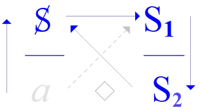
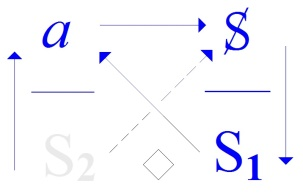
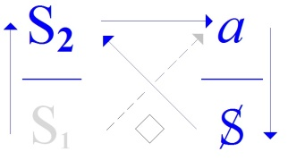

# Leçon 11 | 08 Mai 1973

  

    <label><input type="checkbox" data-lacan-toggle="original" checked> 原文</label>
    <label><input type="checkbox" data-lacan-toggle="notes" checked> 注释</label>
    <label><input type="checkbox" data-lacan-toggle="commentary" checked> 个人解读评论</label>
  

  <form class="lacan-tool-search" role="search">
    <input class="lacan-tool-search-input" type="search" placeholder="搜索全文" aria-label="搜索全文">
    <button class="lacan-tool-button" type="submit" title="搜索">搜索</button>
  </form>
  <button class="lacan-tool-button lacan-back-to-top" type="button" title="回到页面最上方" aria-label="回到页面最上方">↑</button>

<section class="parallel-paragraph" data-paragraph-ids="s20-11-0001">

s20-11-0001

原文 · s20-11-0001

*Je pense à vous* \[C.O.I.\], ça ne veut pas dire que *je vous pense* \[C.O.D.\].

[无对应译文]

</section>

<section class="parallel-paragraph" data-paragraph-ids="s20-11-0002">

s20-11-0002

原文 · s20-11-0002

Quelqu’un ici, peut-être se souvient de ce que j’ai parlé d’une langue où l’on dirait...

[无对应译文]

</section>

<section class="parallel-paragraph" data-paragraph-ids="s20-11-0003">

s20-11-0003

原文 · s20-11-0003

> si j’en crois ce qu’on me rapporte de sa forme ...où l’on dirait *« j’aime à vous ».*

[无对应译文]

</section>

<section class="parallel-paragraph" data-paragraph-ids="s20-11-0004">

s20-11-0004

原文 · s20-11-0004

C’est bien en quoi elle se modèle mieux qu’une autre sur le caractère indirect de cette atteinte qui s’appelle *l’amour.*

[无对应译文]

</section>

<section class="parallel-paragraph" data-paragraph-ids="s20-11-0005">

s20-11-0005

原文 · s20-11-0005

\[*distinction entre « penser l’objet » (compréhension directe selon Aristote → C.O.D.)* *et « penser à l’objet », l’explication - indirecte→ C.O.I. par la science formalisée moderne*)\]

[无对应译文]

</section>

<section class="parallel-paragraph" data-paragraph-ids="s20-11-0006">

s20-11-0006

原文 · s20-11-0006

Je *pense à vous*.

[无对应译文]

</section>

<section class="parallel-paragraph" data-paragraph-ids="s20-11-0007">

s20-11-0007

原文 · s20-11-0007

C’est bien déjà faire objection à tout ce qui pourrait s’appeler *sciences humaines* dans une certaine conception de la science,

[无对应译文]

</section>

<section class="parallel-paragraph" data-paragraph-ids="s20-11-0008">

s20-11-0008

原文 · s20-11-0008

- non pas celle qui se fait depuis seulement quelques siècles,

[无对应译文]

</section>

<section class="parallel-paragraph" data-paragraph-ids="s20-11-0009">

s20-11-0009

原文 · s20-11-0009

- mais de celle qui s’est, avec Aristote, définie d’une certaine façon.

[无对应译文]

</section>

<section class="parallel-paragraph" data-paragraph-ids="s20-11-0010">

s20-11-0010

原文 · s20-11-0010

D’où il résulte qu’il faille se demander, sur le fondement, sur le principe de ce que nous a apporté le *discours analytique*, par quelle voie peut bien passer cette « *science nouvelle* » qui est la nôtre \[*la psychanalyse*\].

[无对应译文]

</section>

<section class="parallel-paragraph" data-paragraph-ids="s20-11-0011">

s20-11-0011

原文 · s20-11-0011

\[*Aristote aurait objecté que les sciences humaines (formalisées) expliquent mais <u>ne comprennent pas</u>, <u>ne « saisissent » pas</u> leur objet : « l’homme », → rôle du discours analytique*\]

[无对应译文]

</section>

<section class="parallel-paragraph" data-paragraph-ids="s20-11-0012">

s20-11-0012

原文 · s20-11-0012

Ceci implique que je formule d’abord d’où nous partons.

[无对应译文]

</section>

<section class="parallel-paragraph" data-paragraph-ids="s20-11-0013">

s20-11-0013

原文 · s20-11-0013

D’où nous partons c’est de ce que nous donne ce *discours analytique*, c’est à savoir *l’inconscient*.

[无对应译文]

</section>

<section class="parallel-paragraph" data-paragraph-ids="s20-11-0014">

s20-11-0014

原文 · s20-11-0014

C’est pourquoi je vous donnerai d’abord quelques formules, peut-être un peu serrées, concernant ce qu’on peut dire de ce qu’il en est de l’inconscient, et justement au regard de cette science traditionnelle qui nous fait nous poser la question : *« comment une science encore - après ce qu’on peut dire de l’inconscient - est-elle possible ?* ».

[无对应译文]

</section>

<section class="parallel-paragraph" data-paragraph-ids="s20-11-0015">

s20-11-0015

原文 · s20-11-0015

Je vous annonce déjà que, si surprenant que cela puisse vous paraître d’abord, mais vous verrez que ça ne l’est pas, ceci me conduira aujourd’hui à vous parler du christianisme. \[*et de la « partition » qu’y fait Descartes pour fonder le discours de la science (cf. Koyré)*\]

[无对应译文]

</section>

<section class="parallel-paragraph" data-paragraph-ids="s20-11-0016">

s20-11-0016

原文 · s20-11-0016

 

[无对应译文]

</section>

<section class="parallel-paragraph" data-paragraph-ids="s20-11-0017">

s20-11-0017

原文 · s20-11-0017

> *Discours scientifique Discours analytique*

[无对应译文]

</section>

<section class="parallel-paragraph" data-paragraph-ids="s20-11-0018">

s20-11-0018

原文 · s20-11-0018

- \[*Dans* *le discours scientifique : l’objet (a) ne peut être atteint qu’indirectement (C.O.I.) par le savoir* (S2), *la science produit un savoir coupé de son objet* (*formalisation mathématique → «  je pense* (S2) *où je ne suis pas* (◊ *a*) »).

[无对应译文]

</section>

<section class="parallel-paragraph" data-paragraph-ids="s20-11-0019">

s20-11-0019

原文 · s20-11-0019

- *Dans* *le discours analytique, l’objet (a) est au départ (C.O.D.) mais c’est le savoir* (S2) *sur* S1 *qui ne peut être atteint* : *l’analyse produit un essaim de* S1 *asémantiques, coupés du savoir* S2→ *« non-sens ». → « je suis* (S1) *où je ne pense pas* (◊S2) »\]

[无对应译文]

</section>

<section class="parallel-paragraph" data-paragraph-ids="s20-11-0020">

s20-11-0020

原文 · s20-11-0020

*L’inconscient*...

[无对应译文]

</section>

<section class="parallel-paragraph" data-paragraph-ids="s20-11-0021">

s20-11-0021

原文 · s20-11-0021

> je commence par les formules difficiles... que je suppose devoir être telles, ...*l’inconscient*...

[无对应译文]

</section>

<section class="parallel-paragraph" data-paragraph-ids="s20-11-0022">

s20-11-0022

原文 · s20-11-0022

> tout ce que, aujourd’hui, je développerai à vous le rendre plus accessible, mais je donne ici mes formules, ...*l’inconscient* ce n’est pas que « l’être pense »... comme l’implique pourtant ce qu’on en dit, ceci dans la science traditionnelle ...*l’inconscient c’est*...

[无对应译文]

</section>

<section class="parallel-paragraph" data-paragraph-ids="s20-11-0023">

s20-11-0023

原文 · s20-11-0023

> après avoir dit ce que ça n’est pas, je dis ce que c’est ...*c’est que l’être en parlant* - quand c’est un être qui parle - *c’est que l’être en parlant jouisse*, et j’ajoute : *ne veuille rien... rien en savoir de plus.* J’ajoute que cela veut dire : *ne rien savoir du tout*. \[*discours* : (*Semblant*) *→* (*Jouissance*)*→* ↓(*Plus-de-jouir*) ◊ S2 (*Vérité*)\]

[无对应译文]

</section>

<section class="parallel-paragraph" data-paragraph-ids="s20-11-0024">

s20-11-0024

原文 · s20-11-0024

Pour abattre tout de suite une carte que j’aurais pu vous faire attendre un peu : qu’il n’y a pas *de désir de savoir*, qu’il n’y a pas ce fameux *Wissentrieb* que quelque part pointe Freud.

[无对应译文]

</section>

<section class="parallel-paragraph" data-paragraph-ids="s20-11-0025">

s20-11-0025

原文 · s20-11-0025

Là Freud se contredit.

[无对应译文]

</section>

<section class="parallel-paragraph" data-paragraph-ids="s20-11-0026">

s20-11-0026

原文 · s20-11-0026

> \[*dans le discours scientifique (où s’inscrivait Freud) le savoir* (S2) *est coupé de l’objet(a)* *→ le désir de savoir qui anime la science est « passion de l’ignorance » (de a)*\]

[无对应译文]

</section>

<section class="parallel-paragraph" data-paragraph-ids="s20-11-0027">

s20-11-0027

原文 · s20-11-0027

Tout indique...

[无对应译文]

</section>

<section class="parallel-paragraph" data-paragraph-ids="s20-11-0028">

s20-11-0028

原文 · s20-11-0028

*c’est là le sens de l’inconscient* ...non seulement *que l’homme sait déjà tout ce qu’il a à savoir*, mais *que ce savoir est parfaitement limité à cette jouissance insuffisante que constitue qu’il parle*.

[无对应译文]

</section>

<section class="parallel-paragraph" data-paragraph-ids="s20-11-0029">

s20-11-0029

原文 · s20-11-0029

Vous voyez bien que ceci comporte une question sur ce qu’il en est de cette science effective que nous possédons bien sous le nom d’une « *physique* ».

[无对应译文]

</section>

<section class="parallel-paragraph" data-paragraph-ids="s20-11-0030">

s20-11-0030

原文 · s20-11-0030

En quoi cette nouvelle science concerne-t-elle *le réel* ?

[无对应译文]

</section>

<section class="parallel-paragraph" data-paragraph-ids="s20-11-0031">

s20-11-0031

原文 · s20-11-0031

*La faute de* *la science*...

[无对应译文]

</section>

<section class="parallel-paragraph" data-paragraph-ids="s20-11-0032">

s20-11-0032

原文 · s20-11-0032

> que je qualifie de « traditionnelle* »,* pour être celle qui nous vient de la pensée d’Aristote, ...cette « *faute* » ai-je dit, c’est d’impliquer que *« l’être pense »*, que la pensée soit telle que le *pensé* soit à son image \[C.O.D.\], c’est-à-dire que l’être pense.

[无对应译文]

</section>

<section class="parallel-paragraph" data-paragraph-ids="s20-11-0033">

s20-11-0033

原文 · s20-11-0033

\[Aristote : « *L’homme pense avec son âme* » : que « l’être pense » implique que le sujet (l’être) et son prédicat (pense) soient homogènes, qu’il y ait équivalence de « la pensée » et du « pensé » (cf. Parménide : « *Car la pensée est la même chose que l’être*.» « Τὸ γὰρ αὐτὸ νοεῖν ἐστίν τε καὶ εἶναι. »\]

[无对应译文]

</section>

<section class="parallel-paragraph" data-paragraph-ids="s20-11-0034">

s20-11-0034

原文 · s20-11-0034

Pour aller à un exemple qui vous soit le plus proche, j’avancerai que ce qui rend ce qu’on appelle « rapports humains » vivables, ce n’est pas d’y penser.

[无对应译文]

</section>

<section class="parallel-paragraph" data-paragraph-ids="s20-11-0035">

s20-11-0035

原文 · s20-11-0035

Et c’est là-dessus qu’en somme s’est fondé ce qu’on appelle comiquement *le behaviorisme* : *la conduite* - à son dire - pourrait être observée de telle sorte qu’elle *s’éclaire par sa fin*.

[无对应译文]

</section>

<section class="parallel-paragraph" data-paragraph-ids="s20-11-0036">

s20-11-0036

原文 · s20-11-0036

C’est là-dessus qu’on a espéré fonder *les sciences humaines *: envelopper tout comportement...

[无对应译文]

</section>

<section class="parallel-paragraph" data-paragraph-ids="s20-11-0037">

s20-11-0037

原文 · s20-11-0037

> n’y étant supposée l’intention d’aucun sujet ...*d’une finalité posée comme de ce comportement faisant « objet »*, rien de plus facile...

[无对应译文]

</section>

<section class="parallel-paragraph" data-paragraph-ids="s20-11-0038">

s20-11-0038

原文 · s20-11-0038

> cet « *objet* » ayant sa propre régulation ...que de l’imaginer dans le système nerveux.

[无对应译文]

</section>

<section class="parallel-paragraph" data-paragraph-ids="s20-11-0039">

s20-11-0039

原文 · s20-11-0039

L’ennui, c’est qu’il \[*le behaviorisme*\] ne fait rien de plus que d’y injecter tout ce qui s’est élaboré philosophiquement, aristotéliciennement, *de l’âme.* Rien n’est changé. Ce qui se touche de ce que le behaviorisme ne s’est distingué, que je sache, par aucun bouleversement de l’éthique, c’est-à-dire des habitudes mentales.

[无对应译文]

</section>

<section class="parallel-paragraph" data-paragraph-ids="s20-11-0040">

s20-11-0040

原文 · s20-11-0040

*L’habitude fondamentale étant qu’un objet ça sert à une fin*, se fonde...

[无对应译文]

</section>

<section class="parallel-paragraph" data-paragraph-ids="s20-11-0041">

s20-11-0041

原文 · s20-11-0041

> quoi qu’on en pense c’est toujours là ...de sa *cause finale*, laquelle est *vivre* dans l’occasion, plus exactement *survivre* c’est-à-dire *atermoyer la mort* et dominer le rival.

[无对应译文]

</section>

<section class="parallel-paragraph" data-paragraph-ids="s20-11-0042">

s20-11-0042

原文 · s20-11-0042

Vous le voyez, il est clair que le nombre des pensées implicites dans une telle *conception du monde*...

[无对应译文]

</section>

<section class="parallel-paragraph" data-paragraph-ids="s20-11-0043">

s20-11-0043

原文 · s20-11-0043

> *Weltanschauung*, comme on dit ...est proprement incalculable. C’est toujours de l’équivalence de *la pensée* et du *pensé* qu’il s’agit.

[无对应译文]

</section>

<section class="parallel-paragraph" data-paragraph-ids="s20-11-0044">

s20-11-0044

原文 · s20-11-0044

Ce qui est le plus certain de ce mode de penser : la science traditionnelle,

[无对应译文]

</section>

<section class="parallel-paragraph" data-paragraph-ids="s20-11-0045">

s20-11-0045

原文 · s20-11-0045

- c’est ce qu’on appelle « *son classicisme » *:

[无对应译文]

</section>

<section class="parallel-paragraph" data-paragraph-ids="s20-11-0046">

s20-11-0046

原文 · s20-11-0046

> *le règne aristotélicien de la classe*, c’est-à-dire du *genre* et de *l’espèce* autrement dit *de l’individu considéré comme spécifique*,

[无对应译文]

</section>

<section class="parallel-paragraph" data-paragraph-ids="s20-11-0047">

s20-11-0047

原文 · s20-11-0047

- c’est *l’esthétique* aussi qui en résulte,

[无对应译文]

</section>

<section class="parallel-paragraph" data-paragraph-ids="s20-11-0048">

s20-11-0048

原文 · s20-11-0048

- et *l’éthique* qui s’en ordonne.

[无对应译文]

</section>

<section class="parallel-paragraph" data-paragraph-ids="s20-11-0049">

s20-11-0049

原文 · s20-11-0049

Je la qualifierai d’une façon simple, trop simple et qui risque de vous faire voir rouge...

[无对应译文]

</section>

<section class="parallel-paragraph" data-paragraph-ids="s20-11-0050">

s20-11-0050

原文 · s20-11-0050

> c’est le cas de le dire, mais vous auriez tort de voir trop vite ...quoi qu’il en soit je dis ma formule :

[无对应译文]

</section>

<section class="parallel-paragraph" data-paragraph-ids="s20-11-0051">

s20-11-0051

原文 · s20-11-0051

- *la pensée est du côté du manche*, \[*disc. M *: S1 → S2 → ↓***a***\]

[无对应译文]

</section>

<section class="parallel-paragraph" data-paragraph-ids="s20-11-0052">

s20-11-0052

原文 · s20-11-0052

- *et le pensé de l’autre côté*. \[*disc. M *: ...**◊ S**\]

[无对应译文]

</section>

<section class="parallel-paragraph" data-paragraph-ids="s20-11-0053">

s20-11-0053

原文 · s20-11-0053

Ce qui se lit: de ce que *le manche est la parole* \[*du maître*\], lui seul explique et rend raison.

[无对应译文]

</section>

<section class="parallel-paragraph" data-paragraph-ids="s20-11-0054">

s20-11-0054

原文 · s20-11-0054

En cela le behaviorisme ne sort pas du *« *classique* » *: c’est *dit-manche* \[*Rires*\], à écrire comme j’écris *dit-mansion*, « *Le Dimanche de la vie »* [^84] comme dit Queneau, non sans du même coup en révéler l’être d’abrutissement \[...**◊ S**\], pas évident au premier abord.

[无对应译文]

</section>

<section class="parallel-paragraph" data-paragraph-ids="s20-11-0055">

s20-11-0055

原文 · s20-11-0055

Mais ce que j’en relève, c’est que ce *« dimanche »* a été lu et approuvé par quelqu’un qui dans « *l’histoire de la pensée* » en savait un bout - Kojève nommément - qui a applaudi à ce « *Dimanche de la vie »*, en y reconnaissant rien de moins que *le savoir absolu* tel qu’il nous est promis par Hegel.

[无对应译文]

</section>

<section class="parallel-paragraph" data-paragraph-ids="s20-11-0056">

s20-11-0056

原文 · s20-11-0056

> \[*la « dialectique du maître et de l’esclave »* \[S1 → S2\] *doit aboutir (par « Aufhebung » successives)*
>
> *au « dimanche de la vie » du « savoir absolu », dans une lecture kojévienne, et à « la fin de l’Histoire », etc.*\]

[无对应译文]

</section>

<section class="parallel-paragraph" data-paragraph-ids="s20-11-0057">

s20-11-0057

原文 · s20-11-0057

Comme quelqu’un l’a perçu récemment, je me range...

[无对应译文]

</section>

<section class="parallel-paragraph" data-paragraph-ids="s20-11-0058">

s20-11-0058

原文 · s20-11-0058

Qui me range ? Est-ce que c’est lui ou est-ce que c’est moi : finesse de la langue ...je me range plutôt du côté du *baroque*, c’est un épinglage emprunté à l’histoire de l’art.

[无对应译文]

</section>

<section class="parallel-paragraph" data-paragraph-ids="s20-11-0059">

s20-11-0059

原文 · s20-11-0059

Comme l’histoire de l’art, tout comme l’histoire et tout comme l’art, sont affaire non pas *du manche* mais *de la manche*, c’est-à-dire du tour de passe-passe.

[无对应译文]

</section>

<section class="parallel-paragraph" data-paragraph-ids="s20-11-0060">

s20-11-0060

原文 · s20-11-0060

Il faut avant de continuer, que je dise ce que j’entends par là...

[无对应译文]

</section>

<section class="parallel-paragraph" data-paragraph-ids="s20-11-0061">

s20-11-0061

原文 · s20-11-0061

> le sujet « *je* » n’étant pas plus actif dans ce *« j’entends »* que dans *« je me range plutôt du côté du baroque »*. ...et c’est ce qui va me faire plonger dans l’histoire du christianisme.

[无对应译文]

</section>

<section class="parallel-paragraph" data-paragraph-ids="s20-11-0062">

s20-11-0062

原文 · s20-11-0062

Vous ne vous y attendiez pas hein ?

[无对应译文]

</section>

<section class="parallel-paragraph" data-paragraph-ids="s20-11-0063">

s20-11-0063

原文 · s20-11-0063

Pourtant je vais le faire : plouf, voilà \[*Rires*\].

[无对应译文]

</section>

<section class="parallel-paragraph" data-paragraph-ids="s20-11-0064">

s20-11-0064

原文 · s20-11-0064

\[*le tour de passe-passe « du manche » à « la manche » concerne le passage du discours du maître au discours de la science, concomitant du Baroque et du « siècle des génies » *: *Descartes* (1596-1650)*, Pascal* (1623-1662) *etc. mais aussi le passage des formules masculines aux formules féminines de la sexuation *: : §→/ §\]

[无对应译文]

</section>

<section class="parallel-paragraph" data-paragraph-ids="s20-11-0065">

s20-11-0065

原文 · s20-11-0065

Le baroque c’est au départ l’historiole...

[无对应译文]

</section>

<section class="parallel-paragraph" data-paragraph-ids="s20-11-0066">

s20-11-0066

原文 · s20-11-0066

> l’historiole : petite histoire ...du Christ, je veux dire ce que raconte l’histoire d’un homme \[: §\]...

[无对应译文]

</section>

<section class="parallel-paragraph" data-paragraph-ids="s20-11-0067">

s20-11-0067

原文 · s20-11-0067

> ne vous frappez pas : c’est lui-même qui s’est désigné comme *« le Fils de l’Homme » !...*ce que racontent quatre textes dits « *évangéliques »* \[εὐαγγέλιον, de [εὖ](https://fr.wiktionary.org/wiki/%CE%B5%E1%BD%96) : *bon*, et [ἄγγελος](https://fr.wiktionary.org/wiki/%E1%BC%84%CE%B3%CE%B3%CE%B5%CE%BB%CE%BF%CF%82), *anggelos : messager*\] d’être pas tellement « *bonne nouvelle* » que « *annonceurs bons* » pour leur sorte de nouvelle \[: §\], ça peut aussi s’entendre comme ça, et ça me paraît plus approprié.

[无对应译文]

</section>

<section class="parallel-paragraph" data-paragraph-ids="s20-11-0068">

s20-11-0068

原文 · s20-11-0068

Ceux-là écrivent d’une façon telle qu’il n’y a pas un seul fait qui ne puisse y être contesté...

[无对应译文]

</section>

<section class="parallel-paragraph" data-paragraph-ids="s20-11-0069">

s20-11-0069

原文 · s20-11-0069

> et Dieu sait que naturellement on a foncé dans « *la muleta »*, on ne s’en est pas privé ...mais que ces textes n’en soient pas moins ce qui va au cœur de *la vérité*, de *la vérité* comme telle, jusques et y compris le fait que moi j’énonce : qu’on ne peut *la dire qu’à moitié*.

[无对应译文]

</section>

<section class="parallel-paragraph" data-paragraph-ids="s20-11-0070">

s20-11-0070

原文 · s20-11-0070

C’est une simple indication, n’est-ce pas...

[无对应译文]

</section>

<section class="parallel-paragraph" data-paragraph-ids="s20-11-0071">

s20-11-0071

原文 · s20-11-0071

Cette ébouriffante réussite impliquerait que je prenne les textes et que je vous fasse des leçons sur les Évangiles, vous voyez où ça nous entraînerait ! \[*Rires*\]

[无对应译文]

</section>

<section class="parallel-paragraph" data-paragraph-ids="s20-11-0072">

s20-11-0072

原文 · s20-11-0072

Ceci pour vous montrer qu’ils ne se serrent au plus près qu’à la lumière *des catégories* que j’ai essayé de dégager de la pratique analytique, nommément : *le symbolique, l’imaginaire et le réel*.

[无对应译文]

</section>

<section class="parallel-paragraph" data-paragraph-ids="s20-11-0073">

s20-11-0073

原文 · s20-11-0073

Pour nous en tenir à la première, j’ai énoncé que *la vérité c’est la* *dit-mention* \[*cf. La chose freudienne : « Moi la Vérité, je parle »*, *Écrits, p. 409*\], un petit tiret et *d.i.t.* au départ, la *dit-mention* proprement dite, la mention du dit.

[无对应译文]

</section>

<section class="parallel-paragraph" data-paragraph-ids="s20-11-0074">

s20-11-0074

原文 · s20-11-0074

Dans ce genre les Évangiles, on ne peut pas mieux dire, on ne peut mieux dire de *la vérité...*

[无对应译文]

</section>

<section class="parallel-paragraph" data-paragraph-ids="s20-11-0075">

s20-11-0075

原文 · s20-11-0075

> c’est de cela qu’il résulte que ce sont des Évangiles ...on ne peut pas même mieux faire jouer *la dit-mension de la vérité*,

[无对应译文]

</section>

<section class="parallel-paragraph" data-paragraph-ids="s20-11-0076">

s20-11-0076

原文 · s20-11-0076

- c’est-à-dire mieux repousser la réalité dans *le fantasme* (**S ◊ *a***). \[*disc. M *: S1 → S2 → ↓***a* ◊ S**\]

[无对应译文]

</section>

<section class="parallel-paragraph" data-paragraph-ids="s20-11-0077">

s20-11-0077

原文 · s20-11-0077

Après tout, la suite a suffisamment démontré...

[无对应译文]

</section>

<section class="parallel-paragraph" data-paragraph-ids="s20-11-0078">

s20-11-0078

原文 · s20-11-0078

> puisque je laisse les textes, je m’en tiendrai à l’effet ...que cette *dit-mension* se soutienne.

[无对应译文]

</section>

<section class="parallel-paragraph" data-paragraph-ids="s20-11-0079">

s20-11-0079

原文 · s20-11-0079

Elle a inondé ce qu’on appelle « *le monde* » en le restituant à sa *vérité d’immondice* \[*le* (*a*) *comme déchet*\].

[无对应译文]

</section>

<section class="parallel-paragraph" data-paragraph-ids="s20-11-0080">

s20-11-0080

原文 · s20-11-0080

C’est-à-dire qu’elle a *relayé* ce que le romain...

[无对应译文]

</section>

<section class="parallel-paragraph" data-paragraph-ids="s20-11-0081">

s20-11-0081

原文 · s20-11-0081

> maçon comme pas un ...avait fondé d’un équilibre miraculeux d’universel, avec en plus enfin des « *bains de jouissance »* que symbolisent suffisamment ces fameux « Thermes », dont il nous reste des bouts écroulés, dont nous ne pouvons avoir aucune espèce d’idée à quel point ça, pour ce qui est de jouir, c’était le pompon \[*Rires*\] !

[无对应译文]

</section>

<section class="parallel-paragraph" data-paragraph-ids="s20-11-0082">

s20-11-0082

原文 · s20-11-0082

Ouais ! Le christianisme a rejeté tout ça à *l’abjection* considérée comme *monde*, c’est ainsi que ce n’est pas sans une affinité intime au problème du « *vrai »* que le christianisme subsiste.

[无对应译文]

</section>

<section class="parallel-paragraph" data-paragraph-ids="s20-11-0083">

s20-11-0083

原文 · s20-11-0083

Qu’il soit « la vraie religion », comme il prétend, n’est pas une prétention excessive, et ce d’autant plus qu’à examiner *le vrai* de près, c’est ce qu’on peut en *dire* de *pire*.

[无对应译文]

</section>

<section class="parallel-paragraph" data-paragraph-ids="s20-11-0084">

s20-11-0084

原文 · s20-11-0084

En particulier que dans ce registre, celui du *vrai*, quand on y entre on n’en sort plus.

[无对应译文]

</section>

<section class="parallel-paragraph" data-paragraph-ids="s20-11-0085">

s20-11-0085

原文 · s20-11-0085

Pour minoriser la vérité, comme elle le mérite, il faut être entré dans le discours analytique.

[无对应译文]

</section>

<section class="parallel-paragraph" data-paragraph-ids="s20-11-0086">

s20-11-0086

原文 · s20-11-0086

Ce que le discours analytique déloge, met *la vérité* à sa place, mais ne l’ébranle pas.

[无对应译文]

</section>

<section class="parallel-paragraph" data-paragraph-ids="s20-11-0087">

s20-11-0087

原文 · s20-11-0087

Elle est réduite mais indispensable, tout est là et rien ne prévaudra contre cette consolidation, sauf ce qui subsiste des « *Sagesses »*, mais qui ne s’y sont pas affrontées.

[无对应译文]

</section>

<section class="parallel-paragraph" data-paragraph-ids="s20-11-0088">

s20-11-0088

原文 · s20-11-0088

Le taoïsme par exemple, ou d’autres doctrines de salut pour qui l’affaire n’est pas de *vérité* mais de « *voie »*...

[无对应译文]

</section>

<section class="parallel-paragraph" data-paragraph-ids="s20-11-0089">

s20-11-0089

原文 · s20-11-0089

> comme le nom « *Tao »* l’indique ...de « *voie »* si elles parviennent à prolonger quelque chose qui y ressemble.

[无对应译文]

</section>

<section class="parallel-paragraph" data-paragraph-ids="s20-11-0090">

s20-11-0090

原文 · s20-11-0090

Il est vrai que l’historiole du Christ n’a selon toute apparence, et comme je l’ai énoncé en clair...

[无对应译文]

</section>

<section class="parallel-paragraph" data-paragraph-ids="s20-11-0091">

s20-11-0091

原文 · s20-11-0091

> avec même pour effet que... il y a des gens qui sont gentils, ils font comme les chiens,
>
> ils ramassent la balle et me la rapportent, on me l’a rapportée ...*l’historiole* disais-je donc, se présente non pas comme l’entreprise de sauver les hommes, mais comme celle *de sauver Dieu.* \[*les hommes ne sont pas en péril dans *; !, *mais il s’agit de sauver Dieu comme exception *: : §\]

[无对应译文]

</section>

<section class="parallel-paragraph" data-paragraph-ids="s20-11-0092">

s20-11-0092

原文 · s20-11-0092

Il faut reconnaître que pour celui qui s’est chargé de cette entreprise, le Christ nommément...

[无对应译文]

</section>

<section class="parallel-paragraph" data-paragraph-ids="s20-11-0093">

s20-11-0093

原文 · s20-11-0093

> pour ceux qui seraient tout à fait sourds, n’est-ce pas... ...et ben il y a mis le prix, c’est le moins qu’on puisse dire, et que le résultat, on doit bien s’étonner qu’il paraisse satisfaire.

[无对应译文]

</section>

<section class="parallel-paragraph" data-paragraph-ids="s20-11-0094">

s20-11-0094

原文 · s20-11-0094

Car que Dieu soit 3 *indissolublement*, est de nature tout de même à nous faire préjuger que le compte « 1,2,3 » lui préexiste. De deux choses l’une :

[无对应译文]

</section>

<section class="parallel-paragraph" data-paragraph-ids="s20-11-0095">

s20-11-0095

原文 · s20-11-0095

- ou il ne prend compte que de l’après-coup de la révélation christique, et c’est son *être* qui en prend un coup,

[无对应译文]

</section>

<section class="parallel-paragraph" data-paragraph-ids="s20-11-0096">

s20-11-0096

原文 · s20-11-0096

- ou si le 3 lui est antérieur, c’est son *unité* qui écope, d’où devient concevable que le *salut de Dieu* soit précaire, livré en somme au bon vouloir des chrétiens.

[无对应译文]

</section>

<section class="parallel-paragraph" data-paragraph-ids="s20-11-0097">

s20-11-0097

原文 · s20-11-0097

L’amusant est évidemment...

[无对应译文]

</section>

<section class="parallel-paragraph" data-paragraph-ids="s20-11-0098">

s20-11-0098

原文 · s20-11-0098

> je vous ai déjà raconté ça, mais vous n’avez pas entendu. Bon, enfin je vous ai déjà raconté ça... ...l’amusant c’est que l’athéisme ne soit soutenable que par les clercs, beaucoup plus difficile chez les laïques dont l’innocence en la matière reste totale.

[无对应译文]

</section>

<section class="parallel-paragraph" data-paragraph-ids="s20-11-0099">

s20-11-0099

原文 · s20-11-0099

Rappelez-vous ce pauvre Voltaire : c’était un type malin, agile, rusé, extraordinairement sautilleur, et tout à fait digne en somme d’entrer là, vous savez : le *vide-poches d’en face* là, le Panthéon là. \[*Rires*\]

[无对应译文]

</section>

<section class="parallel-paragraph" data-paragraph-ids="s20-11-0100">

s20-11-0100

原文 · s20-11-0100

Freud, heureusement, nous a donné une interprétation nécessaire*...*

[无对应译文]

</section>

<section class="parallel-paragraph" data-paragraph-ids="s20-11-0101">

s20-11-0101

原文 · s20-11-0101

> *qui <u>ne cesse</u> pas de s’écrire* comme je définis *le <u>nécess</u>aire...*une interprétation nécessaire du meurtre du fils comme fondateur de la religion de la grâce.

[无对应译文]

</section>

<section class="parallel-paragraph" data-paragraph-ids="s20-11-0102">

s20-11-0102

原文 · s20-11-0102

Il ne l’a pas dit tout à fait comme ça, mais il a bien marqué que c’était un mode de dénégation qui constitue une forme possible de *l’aveu de la vérité*.

[无对应译文]

</section>

<section class="parallel-paragraph" data-paragraph-ids="s20-11-0103">

s20-11-0103

原文 · s20-11-0103

C’est ainsi que Freud re-sauve le père !

[无对应译文]

</section>

<section class="parallel-paragraph" data-paragraph-ids="s20-11-0104">

s20-11-0104

原文 · s20-11-0104

En quoi il imite Jésus-Christ \[*Rires*\], modestement sans doute, il n’y met pas toute la gomme, mais il y contribue pour sa petite part, comme ce qu’il est, à savoir « *un bon juif pas tout à fait à la page* », c’est excessivement répandu \[*Rires*\], il faut qu’on les regroupe pour qu’ils prennent le mors aux dents.

[无对应译文]

</section>

<section class="parallel-paragraph" data-paragraph-ids="s20-11-0105">

s20-11-0105

原文 · s20-11-0105

Combien de temps est-ce que ça durera ?

[无对应译文]

</section>

<section class="parallel-paragraph" data-paragraph-ids="s20-11-0106">

s20-11-0106

原文 · s20-11-0106

Parce que, y’a quand même quelque chose que je voudrais plus approcher, concernant l’essence du christianisme.

[无对应译文]

</section>

<section class="parallel-paragraph" data-paragraph-ids="s20-11-0107">

s20-11-0107

原文 · s20-11-0107

Vous allez aujourd’hui là-dessus en baver !

[无对应译文]

</section>

<section class="parallel-paragraph" data-paragraph-ids="s20-11-0108">

s20-11-0108

原文 · s20-11-0108

Pour ça faut que je reprenne plus haut.

[无对应译文]

</section>

<section class="parallel-paragraph" data-paragraph-ids="s20-11-0109">

s20-11-0109

原文 · s20-11-0109

*L’âme*...

[无对应译文]

</section>

<section class="parallel-paragraph" data-paragraph-ids="s20-11-0110">

s20-11-0110

原文 · s20-11-0110

il faut lire Aristote, vous savez que c’est une bonne lecture ...c’est évidemment à quoi aboutit *la pensée du manche.*

[无对应译文]

</section>

<section class="parallel-paragraph" data-paragraph-ids="s20-11-0111">

s20-11-0111

原文 · s20-11-0111

C’est d’autant plus *<u>nécess</u>aire*, c’est à dire *<u>ne cess</u>ant pas de s’écrire,* que ce qu’elle élabore là, la pensée dite, en question, ce sont des pensées sur le corps. Le corps ça devrait vous épater plus ! Ouais...

[无对应译文]

</section>

<section class="parallel-paragraph" data-paragraph-ids="s20-11-0112">

s20-11-0112

原文 · s20-11-0112

En fait c’est bien ce qui épate la science classique : comment ça peut-il marcher comme ça ?

[无对应译文]

</section>

<section class="parallel-paragraph" data-paragraph-ids="s20-11-0113">

s20-11-0113

原文 · s20-11-0113

À savoir à la fois un corps, le vôtre, n’importe quel autre d’ailleurs corps baladeur, c’est la même chose, vous êtes au même point, il faut à la fois :

[无对应译文]

</section>

<section class="parallel-paragraph" data-paragraph-ids="s20-11-0114">

s20-11-0114

原文 · s20-11-0114

- que ça se suffise comme ça - quelque chose m’a fait penser comme ça, un petit syndrome que j’ai vu sortir de mon ignorance, enfin qui m’a été rappelé : que si par hasard les larmes ça tarissait, *l’œil ça marchait plus très bien*. C’est ce que j’appelle « *les miracles du corps* », ça se sent tout de suite déjà.

[无对应译文]

</section>

<section class="parallel-paragraph" data-paragraph-ids="s20-11-0115">

s20-11-0115

原文 · s20-11-0115

> Supposez que ça pleure plus, que ça jute plus, la glande lacrymale, vous aurez des emmerdements,

[无对应译文]

</section>

<section class="parallel-paragraph" data-paragraph-ids="s20-11-0116">

s20-11-0116

原文 · s20-11-0116

- et d’autre part, c’est un fait que ça *pleurniche* - et pourquoi diable ? - dès que corporellement, imaginairement

[无对应译文]

</section>

<section class="parallel-paragraph" data-paragraph-ids="s20-11-0117">

s20-11-0117

原文 · s20-11-0117

> ou symboliquement, on vous marche sur le pied : on vous « *affecte* » on appelle ça \[*Rires*\]. Ouais...

[无对应译文]

</section>

<section class="parallel-paragraph" data-paragraph-ids="s20-11-0118">

s20-11-0118

原文 · s20-11-0118

Quel rapport y-a-t-il entre cette pleurnicherie et le fait qu’implique de parer à l’imprévu, c’est-à-dire « *qu’on se barre *» ?

[无对应译文]

</section>

<section class="parallel-paragraph" data-paragraph-ids="s20-11-0119">

s20-11-0119

原文 · s20-11-0119

C’est une formule vulgaire, mais qui dit bien ce qu’elle veut dire, parce qu’elle rejoint exactement *le sujet barré* \[S\] dont ici vous avez entendu quelque consonance. *Le sujet se barre* en effet comme je l’ai dit et plus souvent qu’à son tour.

[无对应译文]

</section>

<section class="parallel-paragraph" data-paragraph-ids="s20-11-0120">

s20-11-0120

原文 · s20-11-0120

Constatez, là seulement, qu’il y a tout avantage à unifier l’expression pour *le symbolique, l’imaginaire* et *le réel*, comme - je vous le dis entre parenthèses - le faisait Aristote qui ne distinguait pas

[无对应译文]

</section>

<section class="parallel-paragraph" data-paragraph-ids="s20-11-0121">

s20-11-0121

原文 · s20-11-0121

- *le mouvement* de l’αλλοίωσις \[alloïosis\],

[无对应译文]

</section>

<section class="parallel-paragraph" data-paragraph-ids="s20-11-0122">

s20-11-0122

原文 · s20-11-0122

- *le changement* et *la motion dans l’espace*, c’était, pour lui, mais il le savait pas, c’était - pour lui - que *le sujet se barre*.

[无对应译文]

</section>

<section class="parallel-paragraph" data-paragraph-ids="s20-11-0123">

s20-11-0123

原文 · s20-11-0123

Évidemment, il ne possédait pas les vraies catégories, mais quand même il sentait bien les choses...

[无对应译文]

</section>

<section class="parallel-paragraph" data-paragraph-ids="s20-11-0124">

s20-11-0124

原文 · s20-11-0124

En d’autres termes, l’important c’est que tout ça colle assez pour que le corps subsiste, sauf accident, comme on dit, *externe* ou *interne*, c’est-à-dire que le corps est pris pour ce qu’il se présente être : un corps fermé \[*une unité*\], comme on dit.

[无对应译文]

</section>

<section class="parallel-paragraph" data-paragraph-ids="s20-11-0125">

s20-11-0125

原文 · s20-11-0125

Qui ne voit que *l’âme,* ce n’est rien d’autre que son identité supposée à lui-même \[*au corps*\], avec tout ce qu’on pense pour l’expliquer.

[无对应译文]

</section>

<section class="parallel-paragraph" data-paragraph-ids="s20-11-0126">

s20-11-0126

原文 · s20-11-0126

> \[*si « la pensée est la même chose que l’être » alors « l’âme » est le principe du corps *: *de son unité, de son unicité, de son mouvement, de son altération*
>
> *(cf. Aristote « De anima »). Dans le discours du maître, de la même façon que le maître commande ses esclaves, la pensée est ce qui commande le corps (<u>avec</u> l’âme),*
>
> *ce qui est « du côté du manche »* → *le* *signifiant maître* : S1 *est au principe de tout discours*, *commande tout mouvement du corps,*
>
> *en ordonne (met en forme) toute action* → *l’âme est ce qui fait du corps un dispositif pulsionnel orienté vers la recherche du « Bien »*\]

[无对应译文]

</section>

<section class="parallel-paragraph" data-paragraph-ids="s20-11-0127">

s20-11-0127

原文 · s20-11-0127

Bref *l’âme* c’est ce qu’on pense à propos du corps, *du côté du manche,* et on se rassure à penser qu’il pense de même, d’où la diversité de ces explications :

[无对应译文]

</section>

<section class="parallel-paragraph" data-paragraph-ids="s20-11-0128">

s20-11-0128

原文 · s20-11-0128

- quand il est supposé penser *secret,* il a des *sécrétions*,

[无对应译文]

</section>

<section class="parallel-paragraph" data-paragraph-ids="s20-11-0129">

s20-11-0129

原文 · s20-11-0129

- quand il est supposé penser *concret,* il a des *concrétions*,

[无对应译文]

</section>

<section class="parallel-paragraph" data-paragraph-ids="s20-11-0130">

s20-11-0130

原文 · s20-11-0130

- quand il est supposé penser *information* il a des *hormones*, ou bien encore il s’adonne à l’A.D.N., ce qui fait אֲדֹנָי \[ADoNaï\][^85], ADoNis \[*Adonaï : le « Bien », Adonis : le « Beau »*\]. \[*Rires*\]

[无对应译文]

</section>

<section class="parallel-paragraph" data-paragraph-ids="s20-11-0131">

s20-11-0131

原文 · s20-11-0131

> \[*penser concret* → *concrétions, penser secret* → *sécrétions...* → *la pensée est homogène avec le corps (marqué du signifiant*→ *objets(a)) et détermine le corps dans ses mouvements, dans ses productions, tous orientés vers la recherche du « Bien » (dispositif pulsionnel),* → *la substance de l’âme est la jouissance*\]

[无对应译文]

</section>

<section class="parallel-paragraph" data-paragraph-ids="s20-11-0132">

s20-11-0132

原文 · s20-11-0132

Tout ceci pour vous amener à ceci...

[无对应译文]

</section>

<section class="parallel-paragraph" data-paragraph-ids="s20-11-0133">

s20-11-0133

原文 · s20-11-0133

> que j’ai quand même annoncé au départ sur le sujet de l’inconscient,
>
> puisque je ne parle pas uniquement comme ça, comme on flûte ...qu’il est vraiment curieux qu’il ne soit pas mis en cause dans la psychologie, que *la structure de la pensée repose sur le langage,* lequel *langage...*

[无对应译文]

</section>

<section class="parallel-paragraph" data-paragraph-ids="s20-11-0134">

s20-11-0134

原文 · s20-11-0134

> c’est là tout le nouveau de ce terme de « *structure* », ...les autres \[« *structuralistes* »\], qualifiés de cette étiquette, ils en font ce qu’ils en veulent, mais moi, ce que je fais remarquer c’est que *le langage comporte une inertie* considérable, ce qui se voit à comparer son fonctionnement à ces *signes* qu’on appelle *mathématiques *: *mathèmes*, uniquement de ce fait : qu’eux se transmettent intégralement.

[无对应译文]

</section>

<section class="parallel-paragraph" data-paragraph-ids="s20-11-0135">

s20-11-0135

原文 · s20-11-0135

On ne sait absolument pas ce qu’ils veulent dire, mais ils se transmettent.

[无对应译文]

</section>

<section class="parallel-paragraph" data-paragraph-ids="s20-11-0136">

s20-11-0136

原文 · s20-11-0136

Il n’en reste pas moins qu’ils ne se transmettent qu’avec l’aide du langage, et c’est ce qui fait toute *la boiterie* de l’affaire.

[无对应译文]

</section>

<section class="parallel-paragraph" data-paragraph-ids="s20-11-0137">

s20-11-0137

原文 · s20-11-0137

*Qu’il y ait quelque chose qui fonde l’être, c’est assurément le corps.* Là-dessus Aristote ne s’y est pas trompé.

[无对应译文]

</section>

<section class="parallel-paragraph" data-paragraph-ids="s20-11-0138">

s20-11-0138

原文 · s20-11-0138

Il en a débrouillé beaucoup, un par un - *l’histoire des animaux* – mais il n’arrive pas - lisez-le bien - à faire le joint avec son affirmation.

[无对应译文]

</section>

<section class="parallel-paragraph" data-paragraph-ids="s20-11-0139">

s20-11-0139

原文 · s20-11-0139

Il s’agit de ce qu’il affirme...

[无对应译文]

</section>

<section class="parallel-paragraph" data-paragraph-ids="s20-11-0140">

s20-11-0140

原文 · s20-11-0140

> vous n’avez jamais lu naturellement le « *De Anima »* malgré mes supplications ...mais ce qu’il affirme c’est que *l’homme pense <u>avec</u> instrument, <u>avec</u> son âme,* c’est-à-dire comme je viens de vous le dire, je pourrais le dire en résumé rapidement : *« les mécanismes »* \[*pulsionnels*\] *supposés, dont se supporte son corps*.

[无对应译文]

</section>

<section class="parallel-paragraph" data-paragraph-ids="s20-11-0141">

s20-11-0141

原文 · s20-11-0141

> \[« *l’homme pense avec son (a)me »,* S1 *unifiant* *les objets(a) comme dispositif pulsionnel → avec le langage ordonnant les mécanismes du « corps de jouissance »*
>
> *→ les « traces » sur le corps des inscriptions (engrammes) des expériences de jouissances passées, lors des identifications successives :* α, β, γ, δ *et les quatre objets(a)*\]

[无对应译文]

</section>

<section class="parallel-paragraph" data-paragraph-ids="s20-11-0142">

s20-11-0142

原文 · s20-11-0142

Naturellement, faites attention : c’est nous qui en sommes aux mécanismes à cause de notre physique...

[无对应译文]

</section>

<section class="parallel-paragraph" data-paragraph-ids="s20-11-0143">

s20-11-0143

原文 · s20-11-0143

> mais notre physique d’ailleurs est une physique déjà à la gare, sur une voie de garage je veux dire, parce que, il y a eu la physique quantique depuis : les mécanismes ça saute... ...enfin Aristote, qui n’était pas entré dans *les défilés du mécanisme*, ça veut simplement dire justement ça, ce qu’il en pensait. Alors, « *l’homme pense avec son âme* » ça veut dire qu’il pense avec la pensée d’Aristote, en quoi la pensée est naturellement du coté du manche \[→ *dans le discours du maître*\].

[无对应译文]

</section>

<section class="parallel-paragraph" data-paragraph-ids="s20-11-0144">

s20-11-0144

原文 · s20-11-0144

Il est évident qu’on avait quand même essayé de faire mieux n’est-ce-pas ? \[*du discours du maître (Aristote) au discours de la science*\]

[无对应译文]

</section>

<section class="parallel-paragraph" data-paragraph-ids="s20-11-0145">

s20-11-0145

原文 · s20-11-0145

C’est... il y a encore autre chose avant *la physique quantique*, il y a *l’énergétisme* et l’idée d’*homéostase*.

[无对应译文]

</section>

<section class="parallel-paragraph" data-paragraph-ids="s20-11-0146">

s20-11-0146

原文 · s20-11-0146

Mais tout ceci nous entraînerait - ouais... - nous entraînerait vers ceci, nous entraînerait vers ceci que *l’inconscient c’est tout autre chose* \[*du discours de la science au discours analytique*\], et si j’ai resserré la chose autour de ceci, que j’ai énoncé d’abord, c’est à savoir ce que j’ai appelé « *l’inertie dans la fonction du langage »*, ce qui fait que *toute parole* est cette énergie encore non prise dans une énergétique, parce que cette énergétique elle n’est pas commode à mesurer.

[无对应译文]

</section>

<section class="parallel-paragraph" data-paragraph-ids="s20-11-0147">

s20-11-0147

原文 · s20-11-0147

\[*la parole peut véhiculer une énergie de jouissance (a) inter-dite entre* S1 → S2  *→ jouissance phallique, ou celle des lapsus, rêves…*, *non codifiée par la structure linguistique *\]

[无对应译文]

</section>

<section class="parallel-paragraph" data-paragraph-ids="s20-11-0148">

s20-11-0148

原文 · s20-11-0148

Pour faire sortir de là, non pas des quantités mais *des chiffres*, qui tels qu’ils soient choisis, enfin d’une façon \- remarquez ! - complètement arbitraire, on s’arrange à ce qu’il reste toujours quelque part *une constante,* car c’est là le fondement de l’énergétique, et ben c’est pas commode. \[*cf. [les constantes de la physique](http://www.astrosurf.com/luxorion/constante-physique.htm)* (G, c, h, e, k,...)\] \[*du discours du maître (pensée globale de l’être) au discours de la science (formalisation mathématico-logique) quelque chose se perd, car même la structure mathématico-logique* *relève du langage qui ne peut « saisir » que la partie formalisable de l’objet (littoral littéral), mais l’objet lui-même y reste inerte. C’est ce qui donne lieu à l’écriture d’une lettre* *« au lieu » de l’objet (cf. les constantes en physique) et au dépassement du discours scientifique par le discours analytique. Le discours analytique prend cette lettre (a)* *comme point de départ dans un dispositif* (*a* → S : «* dites tout ce qui vous passe par la tête même si ça n’a aucun sens *») *qui aboutit à la production de* S1 « *en essaims* ».\]

[无对应译文]

</section>

<section class="parallel-paragraph" data-paragraph-ids="s20-11-0149">

s20-11-0149

原文 · s20-11-0149

Pour « *l’inertie »* en question nous sommes forcés de la prendre au niveau du langage lui-même.

[无对应译文]

</section>

<section class="parallel-paragraph" data-paragraph-ids="s20-11-0150">

s20-11-0150

原文 · s20-11-0150

Quel rapport peut-il bien y avoir entre

[无对应译文]

</section>

<section class="parallel-paragraph" data-paragraph-ids="s20-11-0151">

s20-11-0151

原文 · s20-11-0151

- l’articulation qui constitue le langage,

[无对应译文]

</section>

<section class="parallel-paragraph" data-paragraph-ids="s20-11-0152">

s20-11-0152

原文 · s20-11-0152

- et *une jouissance* qui se révèle être la *substance de la pensée,* qui fait de cette pensée, si aisément reflétée

[无对应译文]

</section>

<section class="parallel-paragraph" data-paragraph-ids="s20-11-0153">

s20-11-0153

原文 · s20-11-0153

> dans le monde par la science traditionnelle, celle qui fait que Dieu c’est l’*Être Suprême*, et que cet Être Suprême
>
> ne peut - dixit Aristote - n’être rien d’autre que *le lieu d’où se sait quel est le Bien de tous* les autres.

[无对应译文]

</section>

<section class="parallel-paragraph" data-paragraph-ids="s20-11-0154">

s20-11-0154

原文 · s20-11-0154

Ça fait quelque chose qui n’a pas grand rapport avec *la pensée*, si nous la considérons comme avant tout dominée par cette *inertie du langage*.

[无对应译文]

</section>

<section class="parallel-paragraph" data-paragraph-ids="s20-11-0155">

s20-11-0155

原文 · s20-11-0155

> \[*la jouissance qui peut être retenue (jouissance phallique) par « le filet », « la chaîne », le réseau du langage, au travers de la fonction phallique*
>
> *qui en soutenant* S1→ S2 *va poser un « sens » métaphorique de l’objet perdu (dit-mention), cette jouissance n’est pas celle qu’il faut,*
>
> *celle qu’on tente indéfiniment de re-susciter par des essaims de* S1, *par les irruptions des « formations de l’inconscient » qui viennent trouer le discours.*\]

[无对应译文]

</section>

<section class="parallel-paragraph" data-paragraph-ids="s20-11-0156">

s20-11-0156

原文 · s20-11-0156

C’est pas très étonnant qu’on n’ait pas su comment *serrer, coincer, faire couiner* *la jouissance*, en nous servant de ce qui paraît le mieux à supporter ce que j’appelle *l’inertie du langage*, c’est à savoir l’idée de *la chaîne*, des bouts de ficelles autrement dit, des bouts de ficelles qui font des ronds et qui, on ne sait trop comment, se prennent les unes avec les autres.

[无对应译文]

</section>

<section class="parallel-paragraph" data-paragraph-ids="s20-11-0157">

s20-11-0157

原文 · s20-11-0157

Je vous ai déjà une fois avancé ça, j’essaierai bien sûr de faire mieux, à propos d’une leçon dont je m’étonne moi-même à mesure que j’avance en âge, que les choses de l’année dernière me paraissent il y a 100 ans.

[无对应译文]

</section>

<section class="parallel-paragraph" data-paragraph-ids="s20-11-0158">

s20-11-0158

原文 · s20-11-0158

C’était donc l’année dernière[^86] que j’ai pris pour thème la formule*...*

[无对应译文]

</section>

<section class="parallel-paragraph" data-paragraph-ids="s20-11-0159">

s20-11-0159

原文 · s20-11-0159

que j’ai cru pouvoir supporter d’un nœud bien connu et qu’on appelle *« le nœud borroméen »...*la formule : « *Je te demande de refuser ce que je t’offre, parce que ça n’est pas ça* ».

[无对应译文]

</section>

<section class="parallel-paragraph" data-paragraph-ids="s20-11-0160">

s20-11-0160

原文 · s20-11-0160

C’est une formule soigneusement adaptée à son effet comme toutes celles que je profère.

[无对应译文]

</section>

<section class="parallel-paragraph" data-paragraph-ids="s20-11-0161">

s20-11-0161

原文 · s20-11-0161

Voyez « *L’étourdit »*, j’ai pas dit : « *le dire reste oublié....* », j’ai dit : « *qu’on dise*... ».

[无对应译文]

</section>

<section class="parallel-paragraph" data-paragraph-ids="s20-11-0162">

s20-11-0162

原文 · s20-11-0162

De même ici je n’ai pas dit : « *parce que ça n’est que ça* ».

[无对应译文]

</section>

<section class="parallel-paragraph" data-paragraph-ids="s20-11-0163">

s20-11-0163

原文 · s20-11-0163

« Ce n’est pas ça ! »

[无对应译文]

</section>

<section class="parallel-paragraph" data-paragraph-ids="s20-11-0164">

s20-11-0164

原文 · s20-11-0164

- c’est le cri par où se distingue la *jouissance obtenue* de *celle attendue*,

[无对应译文]

</section>

<section class="parallel-paragraph" data-paragraph-ids="s20-11-0165">

s20-11-0165

原文 · s20-11-0165

- c’est où se spécifie ce qui peut se *dire* dans le langage.

[无对应译文]

</section>

<section class="parallel-paragraph" data-paragraph-ids="s20-11-0166">

s20-11-0166

原文 · s20-11-0166

La négation a toute semblance de venir de là, mais rien de plus.

[无对应译文]

</section>

<section class="parallel-paragraph" data-paragraph-ids="s20-11-0167">

s20-11-0167

原文 · s20-11-0167

La structure pour s’y brancher ne démontre rien, sinon qu’elle est du texte même de *la jouissance*, en tant qu’à marquer de quelle distance elle manque celle dont il s’agirait « *si c’était ça »* \[*la jouissance qu’il faut*\], elle ne la suppose pas seulement « *celle qui serait ça »*, elle en supporte une autre. Voilà !

[无对应译文]

</section>

<section class="parallel-paragraph" data-paragraph-ids="s20-11-0168">

s20-11-0168

原文 · s20-11-0168

> \[*le langage a la même structure que « lalangue » (générée par la combinatoire des* α, β, γ, δ *« comme un langage »).*
>
> *La structure supporte la jouissance qui faut (faillir) et non la jouissance qu’il faut (falloir) ou qu’il faudrait,*
>
> *celle dont « lalangue » est le texte même : tentatives d’écrire la jouissance éprouvée d’expériences passées*\]

[无对应译文]

</section>

<section class="parallel-paragraph" data-paragraph-ids="s20-11-0169">

s20-11-0169

原文 · s20-11-0169

Cette *dit-mention* \[*la fonction phallique*\]...

[无对应译文]

</section>

<section class="parallel-paragraph" data-paragraph-ids="s20-11-0170">

s20-11-0170

原文 · s20-11-0170

> là *je me répète*, mais nous sommes dans un domaine où justement la loi c’est *la répétition...cette dit-mention c’est le dire de* Freud, c’est même la preuve de l’existence de Freud : dans un certain nombre d’années il en faudra une \[*Rires*\].

[无对应译文]

</section>

<section class="parallel-paragraph" data-paragraph-ids="s20-11-0171">

s20-11-0171

原文 · s20-11-0171

Tout à l’heure je l’ai rapproché comme ça d’un p’tit copain : je l’ai rapproché du Christ.

[无对应译文]

</section>

<section class="parallel-paragraph" data-paragraph-ids="s20-11-0172">

s20-11-0172

原文 · s20-11-0172

Bon, ben évidemment, il faut aussi qu’on ait la preuve de l’existence du Christ, elle est évidente : c’est le *christianisme*.

[无对应译文]

</section>

<section class="parallel-paragraph" data-paragraph-ids="s20-11-0173">

s20-11-0173

原文 · s20-11-0173

Le *christianisme* est le fait que vous savez : c’est accroché là...

[无对应译文]

</section>

<section class="parallel-paragraph" data-paragraph-ids="s20-11-0174">

s20-11-0174

原文 · s20-11-0174

Enfin pour l’instant on a « *Les Trois Essais sur la sexualité »* [^87] auxquels je vous prie de vous reporter d’ailleurs, dont j’aurai à faire usage, comme j’ai fait autrefois usage de ces écrits[^88] sur ce que j’appelle *« la dérive »* - pour traduire *Trieb -* *la dérive de la jouissance*.

[无对应译文]

</section>

<section class="parallel-paragraph" data-paragraph-ids="s20-11-0175">

s20-11-0175

原文 · s20-11-0175

Oui, tout ça en somme, tout ça - j’y insiste - c’est proprement ce qui a été *collabé* pendant toute l’antiquité philosophique par l’idée de *la connaissance*. Dieu merci, Aristote était assez intelligent pour isoler dans *l’intellect-agent* ce dont il s’agit dans la fonction du *symbolique*. Il a simplement vu que c’était là que - *le symbolique* - c’est là que l’intellect devait agir.

[无对应译文]

</section>

<section class="parallel-paragraph" data-paragraph-ids="s20-11-0176">

s20-11-0176

原文 · s20-11-0176

Mais il n’était pas assez intelligent...

[无对应译文]

</section>

<section class="parallel-paragraph" data-paragraph-ids="s20-11-0177">

s20-11-0177

原文 · s20-11-0177

> pas assez parce que n’ayant pas joui de la révélation chrétienne ...pour penser *qu’une parole*...

[无对应译文]

</section>

<section class="parallel-paragraph" data-paragraph-ids="s20-11-0178">

s20-11-0178

原文 · s20-11-0178

> fût-ce la sienne, à désigner ce νοῦς \[nouss\] qui ne se supporte que du langage ...*concerne la jouissance*, qui pourtant se désigne chez lui métaphoriquement partout, parce que toute cette histoire de *la matière* et de *la forme*, qu’est-ce que tout ça, qu’est-ce que ça suggère comme vieille histoire concernant la copulation ! \[« *l’âme » fait du corps un dispositif pulsionnel orienté vers la recherche du « Bien »* → S2 *(la forme) in-forme le corps (la matière) en dispositif pulsionnel*\]

[无对应译文]

</section>

<section class="parallel-paragraph" data-paragraph-ids="s20-11-0179">

s20-11-0179

原文 · s20-11-0179

Ça \[*la révélation chrétienne*\] lui aurait permis de voir, ben que c’est pas du tout ça, qu’il n’y a pas la moindre connaissance, le moins qu’on puisse dire c’est que *les jouissances* \[*les (a)*\] qui en supportent le *semblant* \[S2 *des discours* H,U,M \], c’est quelque chose comme le spectre de la lumière blanche. À cette seule condition qu’on voie :

[无对应译文]

</section>

<section class="parallel-paragraph" data-paragraph-ids="s20-11-0180">

s20-11-0180

原文 · s20-11-0180

- que *la jouissance* dont il s’agit \[*la lumière blanche*\] est hors du champ de ce spectre \[*qui n’a que des (a)* → «  *objets partiels* »*, illusion d’arc en ciel, faute de* S1 *unificateur :* S2 → *a* → S◊S1 \],

[无对应译文]

</section>

<section class="parallel-paragraph" data-paragraph-ids="s20-11-0181">

s20-11-0181

原文 · s20-11-0181

- qu’il s’agit de *métaphore* \[*joui-sens*\],

[无对应译文]

</section>

<section class="parallel-paragraph" data-paragraph-ids="s20-11-0182">

s20-11-0182

原文 · s20-11-0182

- qu’il faut mettre tout ce qu’il en est de *la jouissance,* la fausse finalité \[*viser* S1 *et n’atteindre que* (*a*)\]

[无对应译文]

</section>

<section class="parallel-paragraph" data-paragraph-ids="s20-11-0183">

s20-11-0183

原文 · s20-11-0183

> comme répondant à ce qui n’est que pure fallace d’une *jouissance* qui serait apte au rapport sexuel
>
> \[*fallace qui n’a affaire qu’à des (a) et n’atteint pas à l’Autre*\], et qu’à ce titre *toutes les jouissances* ne sont que des rivales
>
> de la finalité que ça serait si *la jouissance* avait le moindre rapport avec le rapport sexuel.

[无对应译文]

</section>

<section class="parallel-paragraph" data-paragraph-ids="s20-11-0184">

s20-11-0184

原文 · s20-11-0184

Je vais en remettre, comme ça, une petite coulée sur le Christ, parce que c’était un personnage important et puis parce que ça vient là pour commenter *le baroque*.

[无对应译文]

</section>

<section class="parallel-paragraph" data-paragraph-ids="s20-11-0185">

s20-11-0185

原文 · s20-11-0185

*Le baroque *: c’est pas pour rien qu’on dit que mon discours participe du *baroque.*

[无对应译文]

</section>

<section class="parallel-paragraph" data-paragraph-ids="s20-11-0186">

s20-11-0186

原文 · s20-11-0186

Je vais vous poser une question : quelle importance peut-il y avoir dans la doctrine chrétienne à ce que le Christ ait une *âme ?*

[无对应译文]

</section>

<section class="parallel-paragraph" data-paragraph-ids="s20-11-0187">

s20-11-0187

原文 · s20-11-0187

Cette doctrine ne parle que de l’incarnation de Dieu dans un corps, il faut bien que *la passion* soufferte en cette personne ait fait *la jouissance* d’une autre.

[无对应译文]

</section>

<section class="parallel-paragraph" data-paragraph-ids="s20-11-0188">

s20-11-0188

原文 · s20-11-0188

Il n’y a rien qui ici manque, pas d’âme notamment.

[无对应译文]

</section>

<section class="parallel-paragraph" data-paragraph-ids="s20-11-0189">

s20-11-0189

原文 · s20-11-0189

Le Christ même ressuscité vaut par son corps, et son corps est le truchement par où la communion à sa présence est *in-corps-poration*, *pulsion orale*, dont l’épouse du Christ - *Église* comme on l’appelle - se contente fort bien, n’ayant rien à attendre d’une copulation.\[*Rires*\]

[无对应译文]

</section>

<section class="parallel-paragraph" data-paragraph-ids="s20-11-0190">

s20-11-0190

原文 · s20-11-0190

Tout ce qui a déferlé des effets du christianisme, dans l’art notamment...

[无对应译文]

</section>

<section class="parallel-paragraph" data-paragraph-ids="s20-11-0191">

s20-11-0191

原文 · s20-11-0191

> et c’est en cela que je rejoins ce baroquisme dont j’accepte d’être habillé, n’est-ce pas ...voyez le témoignage de quelqu’un qui revient d’une orgie d’églises en Italie \[*i.e. Lacan*\] : *tout est exhibition de corps évoquant la jouissance*, à la copulation près, qui si elle n’est pas présente, c’est pas pour des prunes.

[无对应译文]

</section>

<section class="parallel-paragraph" data-paragraph-ids="s20-11-0192">

s20-11-0192

原文 · s20-11-0192

[无对应译文]

</section>

<section class="parallel-paragraph" data-paragraph-ids="s20-11-0193">

s20-11-0193

原文 · s20-11-0193

\[*une doctrine* (S2) *vise la jouissance hors-sexe qui est celle des « objets partiels » du « corps morcelé », les objets (a) : oral, anal, vocal, scopique,* *produisant comme plus-de-jouir un sujet* S, *mais sans la finalité* S1 *pour en unifier le champ car *S◊S1, → *hétérogénéité de l’être et du pensé, de « la pensée » et du « pensé »* \]

[无对应译文]

</section>

<section class="parallel-paragraph" data-paragraph-ids="s20-11-0194">

s20-11-0194

原文 · s20-11-0194

Elle \[*la copulation*\] est aussi hors-champ qu’elle l’est dans la réalité humaine qu’elle sustente, qu’elle sustente pourtant *des fantasmes* \[S◊*a dans le discours* M\] dont elle est constituée \[*a* →S *dans le discours* U, *celui de la doctrine chrétienne*\]. Nulle part, dans aucune ère culturelle, cette exclusion ne s’est avouée de façon plus nue.

[无对应译文]

</section>

<section class="parallel-paragraph" data-paragraph-ids="s20-11-0195">

s20-11-0195

原文 · s20-11-0195

Je dirai un peu plus...

[无对应译文]

</section>

<section class="parallel-paragraph" data-paragraph-ids="s20-11-0196">

s20-11-0196

原文 · s20-11-0196

> et ne croyez pas que mes dires je ne vous les dose pas ...j’irai jusque là que de vous dire que *nulle part comme dans le christianisme l’œuvre d’art comme telle ne s’avère de façon plus patente pour ce qu’elle est de toujours et partout : obscénité*. \[*obscœnus : « de mauvaise augure » (Bloch et v. Wartburg)*\]

[无对应译文]

</section>

<section class="parallel-paragraph" data-paragraph-ids="s20-11-0197">

s20-11-0197

原文 · s20-11-0197

*La « dit-mension » de l’obscénité* \[*discours* U : S2→ *a* →S\] voilà ce par quoi le christianisme ravive la religion des hommes.

[无对应译文]

</section>

<section class="parallel-paragraph" data-paragraph-ids="s20-11-0198">

s20-11-0198

原文 · s20-11-0198

Je ne vais pas vous donner une définition de la religion, parce qu’il n’y a pas plus *d’histoire de la religion* que *d’histoire de l’art.*

[无对应译文]

</section>

<section class="parallel-paragraph" data-paragraph-ids="s20-11-0199">

s20-11-0199

原文 · s20-11-0199

*Les* *religions* c’est comme *les* *arts*, c’est une poubelle, ça n’a pas la moindre homogénéité.

[无对应译文]

</section>

<section class="parallel-paragraph" data-paragraph-ids="s20-11-0200">

s20-11-0200

原文 · s20-11-0200

Il y a quand même *quelque chose* dans ces ustensiles qu’on fabrique à qui mieux mieux \[*pas d’unité* (S1) *dans les objets substitutifs du* *a*\].

[无对应译文]

</section>

<section class="parallel-paragraph" data-paragraph-ids="s20-11-0201">

s20-11-0201

原文 · s20-11-0201

Ce dont il s’agit c’est l’urgence...

[无对应译文]

</section>

<section class="parallel-paragraph" data-paragraph-ids="s20-11-0202">

s20-11-0202

原文 · s20-11-0202

> pour ces êtres qui de nature \[*Sic* \] parlent ...l’urgence que constitue qu’ils aillent au *déduit amoureux* sous des modes exclus...

[无对应译文]

</section>

<section class="parallel-paragraph" data-paragraph-ids="s20-11-0203">

s20-11-0203

原文 · s20-11-0203

> de ce que je pourrais appeler, si c’était concevable,
>
> au sens que j’ai donné tout à l’heure au mot « *âme* », à savoir ce qui fait que ça fonctionne ...exclus de ce qui serait l’*âme* de la copulation, si j’ose supporter de ce mot ce qui...

[无对应译文]

</section>

<section class="parallel-paragraph" data-paragraph-ids="s20-11-0204">

s20-11-0204

原文 · s20-11-0204

> à les y pousser effectivement si « *Ça* » était l’*âme* de la copulation ...serait élaborable par ce que j’appelle « *une physique* » qui dans l’occasion n’est rien que ceci : *une pensée supposable au penser*.

[无对应译文]

</section>

<section class="parallel-paragraph" data-paragraph-ids="s20-11-0205">

s20-11-0205

原文 · s20-11-0205

Il y a là un trou et ce trou s’appelle l’Autre, du moins est-ce ainsi que j’ai cru pouvoir le dénommer.

[无对应译文]

</section>

<section class="parallel-paragraph" data-paragraph-ids="s20-11-0206">

s20-11-0206

原文 · s20-11-0206

L’Autre en tant que *lieu* où la parole d’être *<u>déposée</u>* [^89]...

[无对应译文]

</section>

<section class="parallel-paragraph" data-paragraph-ids="s20-11-0207">

s20-11-0207

原文 · s20-11-0207

> vous ferez attention - hein ? - aux résonnances ...fonde *la vérité* et avec elle « *le pacte* » qui supplée à l’inexistence du *rapport sexuel* en tant

[无对应译文]

</section>

<section class="parallel-paragraph" data-paragraph-ids="s20-11-0208">

s20-11-0208

原文 · s20-11-0208

- *qu’il serait pensé, pensée, pensable,*

[无对应译文]

</section>

<section class="parallel-paragraph" data-paragraph-ids="s20-11-0209">

s20-11-0209

原文 · s20-11-0209

- *que le discours ne serait pas réduit à ne partir - vous vous en souvenez du titre d’un des séminaires - à ne partir que du semblant* [^90].

[无对应译文]

</section>

<section class="parallel-paragraph" data-paragraph-ids="s20-11-0210">

s20-11-0210

原文 · s20-11-0210

Que *la pensée* n’agisse dans le sens d’une science, qu’à être supposée au *penser*, c’est-à-dire que l’être soit supposé penser, c’est ce qui fonde la tradition philosophique à partir de Parménide.

[无对应译文]

</section>

<section class="parallel-paragraph" data-paragraph-ids="s20-11-0211">

s20-11-0211

原文 · s20-11-0211

Parménide *avait tort et* Héraclite *raison*, c’est bien ce qui se signe à ce que quelque part Parménide \[*lapsus*\][^91] énonce :

[无对应译文]

</section>

<section class="parallel-paragraph" data-paragraph-ids="s20-11-0212">

s20-11-0212

原文 · s20-11-0212

- Οὔτε λέγει οὔτε κρύπτει \[*outè legei outè kruptei*\] : *il n’avoue ni ne cache*,

[无对应译文]

</section>

<section class="parallel-paragraph" data-paragraph-ids="s20-11-0213">

s20-11-0213

原文 · s20-11-0213

- ἀλλὰ σημαίνει \[*alla semaïnei*\] : *il signifie*,

[无对应译文]

</section>

<section class="parallel-paragraph" data-paragraph-ids="s20-11-0214">

s20-11-0214

原文 · s20-11-0214

> remettant à sa place le discours du manche \[*du maître*\] lui-même, de ce qu’il appelle comme ça :

[无对应译文]

</section>

<section class="parallel-paragraph" data-paragraph-ids="s20-11-0215">

s20-11-0215

原文 · s20-11-0215

- ὁ ἄναξ οὗ τὸ μαντεῖόν ἐστι τὸ ἐν Δελφοῖς \[*o anax ou to manteion esti to en Delphoïs*\] : *le prince* (*le manche*) *qui vaticine à Delphes.*

[无对应译文]

</section>

<section class="parallel-paragraph" data-paragraph-ids="s20-11-0216">

s20-11-0216

原文 · s20-11-0216

\[ὁ ἄναξ οὗ τὸ μαντεῖόν ἐστι τὸ ἐν Δελφοῖς, οὔτε λέγει οὔτε κρύπτει ἀλλὰ σημαίνει \].

[无对应译文]

</section>

<section class="parallel-paragraph" data-paragraph-ids="s20-11-0217">

s20-11-0217

原文 · s20-11-0217

Le plus invraisemblable, l’histoire folle, celle qui fait, quant à moi, le délire de mon admiration, je me mets en huit par terre quand je lis Saint Thomas \[1224-1274\], parce que c’est rudement bien foutu.

[无对应译文]

</section>

<section class="parallel-paragraph" data-paragraph-ids="s20-11-0218">

s20-11-0218

原文 · s20-11-0218

Pour que la philosophie d’Aristote ait été par Saint Thomas réinjectée dans ce qu’on pourrait appeler « *la conscience chrétienne* » si ça avait un sens, c’est quelque chose qui ne peut s’expliquer que parce que celle-ci...

[无对应译文]

</section>

<section class="parallel-paragraph" data-paragraph-ids="s20-11-0219">

s20-11-0219

原文 · s20-11-0219

enfin c’est comme pour les psychanalystes : les chrétiens *ont horreur de ce qui leur a été révélé*, et ils ont bien raison ! \[*Rires*\]

[无对应译文]

</section>

<section class="parallel-paragraph" data-paragraph-ids="s20-11-0220">

s20-11-0220

原文 · s20-11-0220

Cette *béance* inscrite au statut même de *la jouissance* en tant que *dit-mension* du corps, ceci chez l’être parlant, voilà ce qui rejaillit avec Freud par ce test - je ne dis rien de plus - qu’est l’existence de la parole.

[无对应译文]

</section>

<section class="parallel-paragraph" data-paragraph-ids="s20-11-0221">

s20-11-0221

原文 · s20-11-0221

*Là où ça parle ça jouit*, et ça veut pas dire que ça sache rien, parce que quand même, jusqu’à nouvel ordre, l’inconscient ne nous a rien révélé sur la physiologie du système nerveux - non ? - ni même sur le fonctionnement du *« bandage* » ni de l’éjaculation précoce.

[无对应译文]

</section>

<section class="parallel-paragraph" data-paragraph-ids="s20-11-0222">

s20-11-0222

原文 · s20-11-0222

\[cf. supra : « *l’inconscient c’est que l’être en parlant, jouisse, et* *ne veuille rien en savoir de plus, ne rien en savoir du Tout »*\]

[无对应译文]

</section>

<section class="parallel-paragraph" data-paragraph-ids="s20-11-0223">

s20-11-0223

原文 · s20-11-0223

Pour en finir avec cette histoire de « *la vraie religion* », je pointerai quand même, pendant qu’il en est encore temps, que Dieu ne se manifeste que des *Écritures* qui sont dites « *Saintes »*.

[无对应译文]

</section>

<section class="parallel-paragraph" data-paragraph-ids="s20-11-0224">

s20-11-0224

原文 · s20-11-0224

Elles sont « *Saintes* » - en quoi ? - en ce qu’elles ne cessent pas de répéter l’échec...

[无对应译文]

</section>

<section class="parallel-paragraph" data-paragraph-ids="s20-11-0225">

s20-11-0225

原文 · s20-11-0225

> lisez Salomon quand même, c’est le maître des maîtres,
>
> c’est le « *senti-maître* » \[*Rires*\], un type dans mon genre \[*Rires*\] ...l’échec des tentatives d’une sagesse dont l’être serait le témoignage.

[无对应译文]

</section>

<section class="parallel-paragraph" data-paragraph-ids="s20-11-0226">

s20-11-0226

原文 · s20-11-0226

Ben tout ça ne veut pas dire, mes petits amis, qu’il y ait pas eu des trucs de temps en temps, grâce auxquels *la jouissance*...

[无对应译文]

</section>

<section class="parallel-paragraph" data-paragraph-ids="s20-11-0227">

s20-11-0227

原文 · s20-11-0227

> sans compter quoi il ne saurait y avoir de sagesse *...*a pu se croire venue à cette fin de satisfaire la pensée de *l’être*.

[无对应译文]

</section>

<section class="parallel-paragraph" data-paragraph-ids="s20-11-0228">

s20-11-0228

原文 · s20-11-0228

Seulement voilà, j’ajoute : cette fin n’a été satisfaite qu’au prix d’une castration.

[无对应译文]

</section>

<section class="parallel-paragraph" data-paragraph-ids="s20-11-0229">

s20-11-0229

原文 · s20-11-0229

Dans le Taoïsme par exemple...

[无对应译文]

</section>

<section class="parallel-paragraph" data-paragraph-ids="s20-11-0230">

s20-11-0230

原文 · s20-11-0230

> vous ne savez pas ce que c’est, bien sûr, très peu le savent,
>
> enfin moi je l’ai pratiqué, j’ai pratiqué les textes bien sûr \[*Rires*\] ...dans le Taoïsme est l’exemple patent dans la pratique même du sexe : il faut retenir son foutre pour être bien.

[无对应译文]

</section>

<section class="parallel-paragraph" data-paragraph-ids="s20-11-0231">

s20-11-0231

原文 · s20-11-0231

Le Bouddhisme, lui, bien sûr est l’exemple trivial par son renoncement à la pensée elle-même.

[无对应译文]

</section>

<section class="parallel-paragraph" data-paragraph-ids="s20-11-0232">

s20-11-0232

原文 · s20-11-0232

Parce que ce qu’il y a de mieux dans le bouddhisme c’est le Zen...

[无对应译文]

</section>

<section class="parallel-paragraph" data-paragraph-ids="s20-11-0233">

s20-11-0233

原文 · s20-11-0233

> et le Zen ça consiste à ça, à te répondre par un aboiement, mon petit ami ...c’est ce qu’il y a de mieux quand on veut naturellement sortir de cette *« affaire infernale »* comme disait Freud.

[无对应译文]

</section>

<section class="parallel-paragraph" data-paragraph-ids="s20-11-0234">

s20-11-0234

原文 · s20-11-0234

Il est plus que probable que la fabulation antique, « *la mythologie »*...

[无对应译文]

</section>

<section class="parallel-paragraph" data-paragraph-ids="s20-11-0235">

s20-11-0235

原文 · s20-11-0235

> comme vous appelez ça, ou Claude Lévi-Strauss aussi appelait ça comme ça ...*la mythologie* de l’ère méditerranéenne entre autre, c’est justement celle à laquelle on ne touche pas parce que c’est la plus foisonnante, et puis surtout parce qu’on en a fait de tels jus qu’on ne sait plus par quel bout la prendre.

[无对应译文]

</section>

<section class="parallel-paragraph" data-paragraph-ids="s20-11-0236">

s20-11-0236

原文 · s20-11-0236

Eh ben cette *mythologie* est parvenue aussi à quelque chose, à quelque chose dans le genre de la psychanalyse: vous comprenez, ces dieux comme ça, il y en avait à la pelle des dieux, il suffisait de trouver le bon, il suffisait de trouver le bon et ça faisait ce truc, ce truc contingent, qui fait que quelquefois après une analyse, nous aboutissons à ce qu’« *un chacun* » baise convenablement sa « *une chacune* ».

[无对应译文]

</section>

<section class="parallel-paragraph" data-paragraph-ids="s20-11-0237">

s20-11-0237

原文 · s20-11-0237

C’étaient quand même des dieux, c’est-à-dire des représentations un petit peu *consistantes* de l’Autre.

[无对应译文]

</section>

<section class="parallel-paragraph" data-paragraph-ids="s20-11-0238">

s20-11-0238

原文 · s20-11-0238

Parce que naturellement, passons sur la faiblesse de l’opération analytique, il y a une chose très, très singulière, c’est que ceci est si parfaitement compatible avec la croyance chrétienne, que de ce polythéisme nous avons vu *la renaissance*, à l’époque épinglée du même nom.

[无对应译文]

</section>

<section class="parallel-paragraph" data-paragraph-ids="s20-11-0239">

s20-11-0239

原文 · s20-11-0239

Je vous dis tout ça parce que justement je reviens des musées, et qu’en somme la Contre Réforme...

[无对应译文]

</section>

<section class="parallel-paragraph" data-paragraph-ids="s20-11-0240">

s20-11-0240

原文 · s20-11-0240

*ah la Contre Réforme* !

[无对应译文]

</section>

<section class="parallel-paragraph" data-paragraph-ids="s20-11-0241">

s20-11-0241

原文 · s20-11-0241

...c’était revenir aux sources, et que le baroque c’en est l’étalage, c’est la régulation de l’âme par *la scopie corporelle* \[*a*\].

[无对应译文]

</section>

<section class="parallel-paragraph" data-paragraph-ids="s20-11-0242">

s20-11-0242

原文 · s20-11-0242

Il faudra qu’une fois...

[无对应译文]

</section>

<section class="parallel-paragraph" data-paragraph-ids="s20-11-0243">

s20-11-0243

原文 · s20-11-0243

> enfin je ne sais pas si j’aurai jamais le temps ...parler de la musique \[*baroque*\] dans les marges.

[无对应译文]

</section>

<section class="parallel-paragraph" data-paragraph-ids="s20-11-0244">

s20-11-0244

原文 · s20-11-0244

Mais je parle seulement de ce qui se voit dans toutes les églises de Rome,

[无对应译文]

</section>

<section class="parallel-paragraph" data-paragraph-ids="s20-11-0245">

s20-11-0245

原文 · s20-11-0245

- tout ce qui *s’accroche aux murs*,

[无对应译文]

</section>

<section class="parallel-paragraph" data-paragraph-ids="s20-11-0246">

s20-11-0246

原文 · s20-11-0246

- tout ce qui *croule*,

[无对应译文]

</section>

<section class="parallel-paragraph" data-paragraph-ids="s20-11-0247">

s20-11-0247

原文 · s20-11-0247

- tout ce qui *délice*,

[无对应译文]

</section>

<section class="parallel-paragraph" data-paragraph-ids="s20-11-0248">

s20-11-0248

原文 · s20-11-0248

- tout ce qui *délire* enfin ce que j’ai appelé tout à l’heure « *l’obscénité »*, mais exaltée.

[无对应译文]

</section>

<section class="parallel-paragraph" data-paragraph-ids="s20-11-0249">

s20-11-0249

原文 · s20-11-0249

Je me demande, pour quelqu’un qui viendrait comme ça du fin fond de la Chine, quel effet ça doit pouvoir lui faire ce ruissellement de représentations de martyrs.

[无对应译文]

</section>

<section class="parallel-paragraph" data-paragraph-ids="s20-11-0250">

s20-11-0250

原文 · s20-11-0250

Et je dirais que ça se renverse ces représentations qui sont elles-mêmes martyrs…

[无对应译文]

</section>

<section class="parallel-paragraph" data-paragraph-ids="s20-11-0251">

s20-11-0251

原文 · s20-11-0251

> vous savez que « *martyr* » ça veut dire « *témoin* » ...martyrs *d’une souffrance* plus ou moins pure, c’est notre peinture jusqu’à ce qu’on ait fait le vide en commençant sérieusement à s’occuper de petits carrés \[*i.e. le cubisme, Vasarely, etc.*\].

[无对应译文]

</section>

<section class="parallel-paragraph" data-paragraph-ids="s20-11-0252">

s20-11-0252

原文 · s20-11-0252

Il y en a après, une *réduction* de l’espèce humaine, c’est ce qui motive sans doute que ce nom « *humaine* » ça résonne comme « *humeur malsaine* », il y a un reste, ça fait « *malheur* »[^92], oui.

[无对应译文]

</section>

<section class="parallel-paragraph" data-paragraph-ids="s20-11-0253">

s20-11-0253

原文 · s20-11-0253

Cette *réduction* c’est le terme par où l’Église entend porter l’espèce justement jusqu’à la fin des temps.

[无对应译文]

</section>

<section class="parallel-paragraph" data-paragraph-ids="s20-11-0254">

s20-11-0254

原文 · s20-11-0254

Et elle est si fondée dans *la béance* propre à la sexualité de l’être parlant, qu’elle risque d’être au moins aussi fondée...

[无对应译文]

</section>

<section class="parallel-paragraph" data-paragraph-ids="s20-11-0255">

s20-11-0255

原文 · s20-11-0255

> disons, parce que quand même je ne veux pas désespérer de rien ...au moins aussi fondée que « *L’Avenir de la science »* [^93], c’est le titre - vous savez - qu’a donné à un de ses bouquins cet autre cureton qui s’appelait Ernest Renan et qui était un serviteur de *la vérité* lui aussi, à tout crin.

[无对应译文]

</section>

<section class="parallel-paragraph" data-paragraph-ids="s20-11-0256">

s20-11-0256

原文 · s20-11-0256

Il n’en exigeait qu’une chose...

[无对应译文]

</section>

<section class="parallel-paragraph" data-paragraph-ids="s20-11-0257">

s20-11-0257

原文 · s20-11-0257

> et ça c’était absolument premier, sans ça c’était la panique ...c’est qu’elle n’ait aucune conséquence. \[*Rires*\] Ouais...

[无对应译文]

</section>

<section class="parallel-paragraph" data-paragraph-ids="s20-11-0258">

s20-11-0258

原文 · s20-11-0258

L’économie de *la jouissance*, voilà ce qui n’est pas encore près du bout de nos doigts, il est important tout de même - ça aurait son petit intérêt - qu’on y arrive.

[无对应译文]

</section>

<section class="parallel-paragraph" data-paragraph-ids="s20-11-0259">

s20-11-0259

原文 · s20-11-0259

Mais vous dire ce qu’il en est de ce qu’on peut en voir à partir du discours analytique, c’est ce que peut-être on a une petite chance de trouver de temps en temps, par des voies essentiellement contingentes.

[无对应译文]

</section>

<section class="parallel-paragraph" data-paragraph-ids="s20-11-0260">

s20-11-0260

原文 · s20-11-0260

Si mon discours d’aujourd’hui n’était pas quelque chose absolument entièrement négatif, je tremblerais d’être rentré dans le discours philosophique.

[无对应译文]

</section>

<section class="parallel-paragraph" data-paragraph-ids="s20-11-0261">

s20-11-0261

原文 · s20-11-0261

Mais, quand même, *il y a une voie* : puisque déjà nous avons vu quelques sagesses qui ont duré un petit bout de temps, pourquoi est-ce qu’avec *le discours analytique*, on ne retrouverait pas quelque chose qui donnerait aperçu d’un truc précis, et après tout qu’est-ce que l’énergétique si ce n’est aussi un truc mathématique.

[无对应译文]

</section>

<section class="parallel-paragraph" data-paragraph-ids="s20-11-0262">

s20-11-0262

原文 · s20-11-0262

Celui-là ne sera pas mathématique, c’est bien pour ça que le discours de l’analyste se distingue du discours scientifique.

[无对应译文]

</section>

<section class="parallel-paragraph" data-paragraph-ids="s20-11-0263">

s20-11-0263

原文 · s20-11-0263

Enfin, cette chance, mettons-là sous le signe d’« *au petit bonheur* », *encore*.

[无对应译文]

</section>

<section class="note-block original-notes">

## Notes

[^84]: Raymond Queneau : *Le dimanche de la vie*, Paris, 2003, Gallimard.

[^85]: Adonaï : Nom de Dieu dans le judaïsme. Dans la prière, le Tétragramme אֲדֹנָי est remplacé par Adonaï.

[^86]: Cf. Séminaire 1971-72 : *...Ou Pire*, séance du 09-02-1972.

[^87]: Sigmund Freud : *Trois essais sur la théorie de la sexualité*, Gallimard, 1962.

[^88]: « *ces écrits* » : « *Trois essais*... » ou « *Pulsion et destin des pulsions* » in « *Métapsychologie* » ?

[^89]: Cf. « *L'étourdit* » (14-07-1972), *Autres écrits, *Seuil, p. 490. : « *Une langue entre autres n’est rien de plus que l’intégrale des équivoques que son histoire y a laissé persister.*

    \[...\] *y a fait <u>dépôt</u> au cours des âges*. »\]

[^90]: Cf. séminaire 1970-71 : « *D’un discours qui ne serait pas du semblant*  ».

[^91]: Lapsus de Lacan, il s’agit bien d’[Héraclite](http://philoctetes.free.fr/heraclitefraneng.htm) (Fragment 93) :

    « ὁ ἄναξ οὗ τὸ μαντεῖόν ἐστι τὸ ἐν Δελφοῖς, οὔτε λέγει οὔτε κρύπτει ἀλλὰ σημαίνει. ».

    «  *Le dieu dont l’oracle est à Delphes, ne révèle pas, ne cache pas, mais il indique.* », *i e « il fait signe ».*

[^92]: « *hum*-eur mals-*aine* » → « *humaine* », et un reste : ...*heur* *mal*... → « *malheur »*.

[^93]: Renan E. : *L’Avenir de la science*, Paris, Garnier Flammarion, 1995.

</section>
