# Leçon 12 | 15 Mai 1973

  

    <label><input type="checkbox" data-lacan-toggle="original" checked> 原文</label>
    <label><input type="checkbox" data-lacan-toggle="notes" checked> 注释</label>
    <label><input type="checkbox" data-lacan-toggle="commentary" checked> 个人解读评论</label>
  

  <form class="lacan-tool-search" role="search">
    <input class="lacan-tool-search-input" type="search" placeholder="搜索全文" aria-label="搜索全文">
    <button class="lacan-tool-button" type="submit" title="搜索">搜索</button>
  </form>
  <button class="lacan-tool-button lacan-back-to-top" type="button" title="回到页面最上方" aria-label="回到页面最上方">↑</button>

<section class="parallel-paragraph" data-paragraph-ids="s20-12-0001">

s20-12-0001

原文 · s20-12-0001

On m’a averti ce matin pendant que je travaillais...

[无对应译文]

</section>

<section class="parallel-paragraph" data-paragraph-ids="s20-12-0002">

s20-12-0002

原文 · s20-12-0002

> comme toujours pour tout le monde : au dernier moment que je travaille... ...on m’a averti que le 12 juin...

[无对应译文]

</section>

<section class="parallel-paragraph" data-paragraph-ids="s20-12-0003">

s20-12-0003

原文 · s20-12-0003

> le 12 juin qui n’est pas, bien que ce soit le second mardi,
>
> qui n’est pas en principe celui auquel j’espérais vous donner rendez-vous ...on m’a averti que le 12 juin la salle serait occuppée par ce qu’on appelle des examens oraux, et que dès lors on ne pouvait pas me répondre de ceci qu’elle serait libre à telle ou telle heure, étant donné que les examens oraux on ne sait pas comment ça s’étend, comment ça se termine, ni quand.

[无对应译文]

</section>

<section class="parallel-paragraph" data-paragraph-ids="s20-12-0004">

s20-12-0004

原文 · s20-12-0004

De toute façon je n’avais pas l’intention, comme je viens de vous le dire, de vous donner rendez-vous le 12 juin puisque c’est le *mardi de la Pentecôte* \[*Rires*\]. J’avais par contre l’intention de vous donner rendez-vous le 19 juin, 3ème mardi. Le 19 juin les examens continueront \[*Rires*\].

[无对应译文]

</section>

<section class="parallel-paragraph" data-paragraph-ids="s20-12-0005">

s20-12-0005

原文 · s20-12-0005

Donc je ne peux pas prévoir...

[无对应译文]

</section>

<section class="parallel-paragraph" data-paragraph-ids="s20-12-0006">

s20-12-0006

原文 · s20-12-0006

> malgré que j’ai élevé, enfin... quelque objection à ce régime ...je ne peux pas prévoir donc si le 19 juin je pourrai continuer ce que je vous énonce cette année.

[无对应译文]

</section>

<section class="parallel-paragraph" data-paragraph-ids="s20-12-0007">

s20-12-0007

原文 · s20-12-0007

Vous ferez comme vous voudrez, vous en courrerez la chance, vous ferez une pétition, je sais pas, vous ferez ce qu’il vous plaira. Voilà donc le point.

[无对应译文]

</section>

<section class="parallel-paragraph" data-paragraph-ids="s20-12-0008">

s20-12-0008

原文 · s20-12-0008

Il est évident que, comme c’est ce matin même qu’on m’en a averti, je n’ai pas pu mijoter les choses d’une façon telle que je fasse aujourd’hui ma conclusion, si tant est qu’à aucune de mes années il y ait à proprement parler une conclusion, puisque forcément ce que je vous énonce ne peut toujours que rester jusqu’à un certain point ouvert, ce nest pas mon privilège, les choses, comme chaque année, restent ouvertes sur un certain nombre de points *en suspens*.

[无对应译文]

</section>

<section class="parallel-paragraph" data-paragraph-ids="s20-12-0009">

s20-12-0009

原文 · s20-12-0009

Ce sera d’ailleurs ce sur quoi aujourd’hui j’aurai amplement à m’étendre.

[无对应译文]

</section>

<section class="parallel-paragraph" data-paragraph-ids="s20-12-0010">

s20-12-0010

原文 · s20-12-0010

J’avais rêvé cette nuit que quand je venais ici, il y avait personne \[*Rires*\].

[无对应译文]

</section>

<section class="parallel-paragraph" data-paragraph-ids="s20-12-0011">

s20-12-0011

原文 · s20-12-0011

C’est où se confirme le caractère de vœu du rêve.

[无对应译文]

</section>

<section class="parallel-paragraph" data-paragraph-ids="s20-12-0012">

s20-12-0012

原文 · s20-12-0012

Malgré, bien entendu, que j’étais...

[无对应译文]

</section>

<section class="parallel-paragraph" data-paragraph-ids="s20-12-0013">

s20-12-0013

原文 · s20-12-0013

> puisque j’avais déjà travaillé dans la nuit ...j’étais assez outré, puisque je me souvenais aussi, dans mon rêve, que j’avais travaillé à quatre heures et demie du matin, j’étais assez outré que tout ça ne doive servir à rien, mais c’était quand même la satisfaction d’un vœu, à savoir que dès lors, je n’avais plus qu’à me les rouler. Voilà ! \[*ce qui remplit la salle c’est un dire, ce qui viderait la salle c’est que « tout » ait été dit, que le dit de Lacan se soit clos → vœu du rêve*\]

[无对应译文]

</section>

<section class="parallel-paragraph" data-paragraph-ids="s20-12-0014">

s20-12-0014

原文 · s20-12-0014

Je vais *dire*...

[无对应译文]

</section>

<section class="parallel-paragraph" data-paragraph-ids="s20-12-0015">

s20-12-0015

原文 · s20-12-0015

Je vais *dire,* c’est ma fonction...

[无对应译文]

</section>

<section class="parallel-paragraph" data-paragraph-ids="s20-12-0016">

s20-12-0016

原文 · s20-12-0016

Je vais le *dire* une fois de plus, je me répète...

[无对应译文]

</section>

<section class="parallel-paragraph" data-paragraph-ids="s20-12-0017">

s20-12-0017

原文 · s20-12-0017

Je vais *dire* une fois de plus ce qui est de *mon dire,* et qui s’énonce « *il n’y a pas de métalangage* ».

[无对应译文]

</section>

<section class="parallel-paragraph" data-paragraph-ids="s20-12-0018">

s20-12-0018

原文 · s20-12-0018

\[*répétition de « dire »→ le dire est à reprendre toujours → ne peut jamais se clore dans un dit définitif : il n’y a pas de métalangage*\].

[无对应译文]

</section>

<section class="parallel-paragraph" data-paragraph-ids="s20-12-0019">

s20-12-0019

原文 · s20-12-0019

Quand je dis ça, je parle apparemment « *le langage de l’être »* \[*Parménide : penser c’est être*\].

[无对应译文]

</section>

<section class="parallel-paragraph" data-paragraph-ids="s20-12-0020">

s20-12-0020

原文 · s20-12-0020

À part, bien entendu, que comme je l’ai fait remarquer la dernière fois, ce que je dis c’est *ce qu’il n’y a pas*.

[无对应译文]

</section>

<section class="parallel-paragraph" data-paragraph-ids="s20-12-0021">

s20-12-0021

原文 · s20-12-0021

\[*il n’y a « dire » que du manque*\]

[无对应译文]

</section>

<section class="parallel-paragraph" data-paragraph-ids="s20-12-0022">

s20-12-0022

原文 · s20-12-0022

*« L’être est... -* comme on dit - *...le non-être n’est pas »* \[*Parménide*\].

[无对应译文]

</section>

<section class="parallel-paragraph" data-paragraph-ids="s20-12-0023">

s20-12-0023

原文 · s20-12-0023

*Il y a*, ou *il n’y a pas* : pour moi ce n’est qu’un fait de dit.

[无对应译文]

</section>

<section class="parallel-paragraph" data-paragraph-ids="s20-12-0024">

s20-12-0024

原文 · s20-12-0024

On suppose *l’être* à certains mots, « *individu* » par exemple, ou « *substance* », c’est même fait pour dire ça : qu’on suppose *l’être* à l’individu entre autres.

[无对应译文]

</section>

<section class="parallel-paragraph" data-paragraph-ids="s20-12-0025">

s20-12-0025

原文 · s20-12-0025

\[*la dit-mension de l’être c’est « l’écriture » de ce qui a été perdu* → *non-être (* *le symbolique comme support de l’ex-sistence d’un dire)*\]

[无对应译文]

</section>

<section class="parallel-paragraph" data-paragraph-ids="s20-12-0026">

s20-12-0026

原文 · s20-12-0026

Le mot « *sujet »* que j’emploie...

[无对应译文]

</section>

<section class="parallel-paragraph" data-paragraph-ids="s20-12-0027">

s20-12-0027

原文 · s20-12-0027

> vous allez le voir, j’y reviendrai ...prend évidemment un accent différent du fait de mon discours \[*discours* A\].

[无对应译文]

</section>

<section class="parallel-paragraph" data-paragraph-ids="s20-12-0028">

s20-12-0028

原文 · s20-12-0028

*Pour tout dire* \[*vœu du rêve*\], je préviens : je me distingue du « *langage de l’être* ».

[无对应译文]

</section>

<section class="parallel-paragraph" data-paragraph-ids="s20-12-0029">

s20-12-0029

原文 · s20-12-0029

Ceci implique qu’il puisse y avoir « *fiction de mot* », je veux dire : à partir du « *mot »* \[*la dit-mension offre au sujet la structure du fantasme *: S ◊ *a, la fiction de mots*\].

[无对应译文]

</section>

<section class="parallel-paragraph" data-paragraph-ids="s20-12-0030">

s20-12-0030

原文 · s20-12-0030

Et comme certains peut-être s’en souviennent, c’est de là que je suis parti quand j’ai parlé de l’*Éthique*.

[无对应译文]

</section>

<section class="parallel-paragraph" data-paragraph-ids="s20-12-0031">

s20-12-0031

原文 · s20-12-0031

Ce n’est pas parce que j’ai écrit des choses qui *font fonction de formes du langage* \[*formalisation*\] que j’assure *l’être* du *métalangage*.

[无对应译文]

</section>

<section class="parallel-paragraph" data-paragraph-ids="s20-12-0032">

s20-12-0032

原文 · s20-12-0032

Car cet être il faudrait que je le présente comme subsistant par soi, par soi tout seul* :* *langage de l’être*.

[无对应译文]

</section>

<section class="parallel-paragraph" data-paragraph-ids="s20-12-0033">

s20-12-0033

原文 · s20-12-0033

\[*la formalisation en mathèmes ne se résout pas en un métalangage qui permettrait de fonder, de clore « le dire de l’être », d’en dire la substance*\]

[无对应译文]

</section>

<section class="parallel-paragraph" data-paragraph-ids="s20-12-0034">

s20-12-0034

原文 · s20-12-0034

La formalisation mathématique...

[无对应译文]

</section>

<section class="parallel-paragraph" data-paragraph-ids="s20-12-0035">

s20-12-0035

原文 · s20-12-0035

> qui est notre but, notre idéal - pourquoi ? - parce que seule elle, est *mathème*,
>
> c’est-à-dire capable de se transmettre intégralement ...la formalisation mathématique c’est de l’*écrit*, et c’est là dedans que je vais essayer d’avancer aujourd’hui.

[无对应译文]

</section>

<section class="parallel-paragraph" data-paragraph-ids="s20-12-0036">

s20-12-0036

原文 · s20-12-0036

Or elle ne subsiste, cette formalisation mathématique, que si j’emploie à la présenter, la langue dont j’use.

[无对应译文]

</section>

<section class="parallel-paragraph" data-paragraph-ids="s20-12-0037">

s20-12-0037

原文 · s20-12-0037

C’est là qu’est l’objection \[*au métalangage*\] : *nulle formalisation de la langue* n’est transmissible sans l’usage de la langue elle-même.

[无对应译文]

</section>

<section class="parallel-paragraph" data-paragraph-ids="s20-12-0038">

s20-12-0038

原文 · s20-12-0038

\[*il n’y a pas de métalangage qui donnerait le principe formel exhaustif de la langue, car même les mathématiques nécessitent le langage pour prendre sens*\]

[无对应译文]

</section>

<section class="parallel-paragraph" data-paragraph-ids="s20-12-0039">

s20-12-0039

原文 · s20-12-0039

C’est par *mon dire* que cette formalisation \[*cf. les* α, β, γ, δ, *de « La lettre volée »*\] - *idéal métalangage* - je la fais ex-sister (*ex tiret sister*).

[无对应译文]

</section>

<section class="parallel-paragraph" data-paragraph-ids="s20-12-0040">

s20-12-0040

原文 · s20-12-0040

C’est ainsi que *le symbolique* ne se confond pas - loin de là - avec *l’être*, mais qu’il subsiste comme *ex-sistence du dire*.

[无对应译文]

</section>

<section class="parallel-paragraph" data-paragraph-ids="s20-12-0041">

s20-12-0041

原文 · s20-12-0041

C’est ce que j’ai souligné...

[无对应译文]

</section>

<section class="parallel-paragraph" data-paragraph-ids="s20-12-0042">

s20-12-0042

原文 · s20-12-0042

> dans le texte dit « *L’étourdit »* : *d - i - t* ...c’est ce que j’ai souligné de *dire* que *le symbolique* ne supporte que *l’ex-sistence*. \[*de cette jouissance perdue qui a fondé l’être, ne subsiste que la trace ex-sistante, supportée du symbolique* \]

[无对应译文]

</section>

<section class="parallel-paragraph" data-paragraph-ids="s20-12-0043">

s20-12-0043

原文 · s20-12-0043

En quoi ? Je l’ai rappelé la dernière fois, c’est une des choses importantes que j’ai dites dans cet exercice que comme d’habitude je fais, plus ou moins pour obtenir de me faire entendre, mais il serait peut-être quand même important que vous vous souveniez de l’essentiel.

[无对应译文]

</section>

<section class="parallel-paragraph" data-paragraph-ids="s20-12-0044">

s20-12-0044

原文 · s20-12-0044

L’esssentiel, je vous l’ai rappelé encore une fois à propos de l’inconscient : l’inconscient se distingue...

[无对应译文]

</section>

<section class="parallel-paragraph" data-paragraph-ids="s20-12-0045">

s20-12-0045

原文 · s20-12-0045

> entre tout ce qui a été produit jusqu’alors de dis­cours ...en ce qu’il énonce ceci, qui est l’os de mon enseignement, que :

[无对应译文]

</section>

<section class="parallel-paragraph" data-paragraph-ids="s20-12-0046">

s20-12-0046

原文 · s20-12-0046

- *Je parle sans le savoir.*

[无对应译文]

</section>

<section class="parallel-paragraph" data-paragraph-ids="s20-12-0047">

s20-12-0047

原文 · s20-12-0047

- *Je parle avec mon corps,* *et ceci sans le savoir.*

[无对应译文]

</section>

<section class="parallel-paragraph" data-paragraph-ids="s20-12-0048">

s20-12-0048

原文 · s20-12-0048

- *Je dis donc toujours plus que je n’en sais*.

[无对应译文]

</section>

<section class="parallel-paragraph" data-paragraph-ids="s20-12-0049">

s20-12-0049

原文 · s20-12-0049

C’est là que j’arrive au sens du mot « *sujet* » dans cet autre discours \[*discours* A\] : *ce qui parle sans le savoir* me fait *« je », « sujet »* \[*sujet → assujetti*\], sujet du verbe \[*être*\] certes, mais ça ne suffit pas à me faire *« être »*.

[无对应译文]

</section>

<section class="parallel-paragraph" data-paragraph-ids="s20-12-0050">

s20-12-0050

原文 · s20-12-0050

Ça n’a rien à faire avec ce que je suis forcé de mettre dans *l’être* suffisamment de *savoir* pour se tenir, mais pas une goutte de plus. Et c’est ce que jusqu’alors on a appelé « *la forme* ».

[无对应译文]

</section>

<section class="parallel-paragraph" data-paragraph-ids="s20-12-0051">

s20-12-0051

原文 · s20-12-0051

Dans Platon, *la forme* c’est ce *savoir* qui remplit *l’être*.

[无对应译文]

</section>

<section class="parallel-paragraph" data-paragraph-ids="s20-12-0052">

s20-12-0052

原文 · s20-12-0052

*La forme* n’en sait pas plus qu’elle ne dit. \[*identité de l’être à lui-même (consistance) → « tout peut être dit »*\]

[无对应译文]

</section>

<section class="parallel-paragraph" data-paragraph-ids="s20-12-0053">

s20-12-0053

原文 · s20-12-0053

Elle est réelle - viens-je de dire - en ce sens qu’elle tient *l’être* dans sa coupe, mais à ras bord \[*rien ne se perd : pas de reste*\].

[无对应译文]

</section>

<section class="parallel-paragraph" data-paragraph-ids="s20-12-0054">

s20-12-0054

原文 · s20-12-0054

Elle est le *savoir de l’être*. Le discours de *l’être* \[*Parménide*\] suppose que *l’être* sait, et c’est ce qui le tient \[*discours* M : S2 *tient a*\].

[无对应译文]

</section>

<section class="parallel-paragraph" data-paragraph-ids="s20-12-0055">

s20-12-0055

原文 · s20-12-0055

Il y a du rapport d*’être* qui ne peut pas se savoir, c’est lui dont, dans mon enseignement, j’interroge la structure en tant que *ce savoir* - je viens de le dire - *impossible,* est par là *« inter-dit »*.

[无对应译文]

</section>

<section class="parallel-paragraph" data-paragraph-ids="s20-12-0056">

s20-12-0056

原文 · s20-12-0056

\[*discours* A : *les* S1*, signifiants asémantiques, sont coupés du savoir *: S1◊ S2\]

[无对应译文]

</section>

<section class="parallel-paragraph" data-paragraph-ids="s20-12-0057">

s20-12-0057

原文 · s20-12-0057

Et c’est ici que je joue de l’équi­voque, de l’équivoque qui de *ce savoir impossible* nous dit qu’il est « *censuré* », « *défendu* ».

[无对应译文]

</section>

<section class="parallel-paragraph" data-paragraph-ids="s20-12-0058">

s20-12-0058

原文 · s20-12-0058

Il ne l’est pas \[*censuré, défendu*\], si vous écrivez convenablement cet *inter-dit*, d’un trait d’union entre *l’inter* et le *dit,* c’est qu’il est dit *« entre »* les mots \[*ex-sistence*\], entre les lignes, et que c’est ça qu’il s’agit d’énoncer: à quelle sorte de *réel* il nous permet l’accès.

[无对应译文]

</section>

<section class="parallel-paragraph" data-paragraph-ids="s20-12-0059">

s20-12-0059

原文 · s20-12-0059

Il s’agit de *montrer* où va sa mise en *forme,* ce métalangage qui n’est pas, et que *« je »* \[*sujet du discours*\] fait ex-sister \[*par le discours*\]. Ce qui ne peut être démontré suggère quelque chose qui peut en être dit de *vrai* sur le sujet, par exemple - entre autre - *de l’indémontrable*.

[无对应译文]

</section>

<section class="parallel-paragraph" data-paragraph-ids="s20-12-0060">

s20-12-0060

原文 · s20-12-0060

C’est ainsi que s’ouvre cette sorte de *vérité,* la seule qui nous soit accessible \[*à l’analyste*\], et qui porte par exemple sur *le non­-savoir-faire*.

[无对应译文]

</section>

<section class="parallel-paragraph" data-paragraph-ids="s20-12-0061">

s20-12-0061

原文 · s20-12-0061

Je sais pas comment m’y prendre - pourquoi pas le dire - avec *la vérité* pas plus qu’avec *la femme,* puisque j’ai dit que l’une et l’autre, au moins pour l’homme, c’était la même chose, ça fait le même embarras.

[无对应译文]

</section>

<section class="parallel-paragraph" data-paragraph-ids="s20-12-0062">

s20-12-0062

原文 · s20-12-0062

Il se trouve - c’est accident - que j’ai du goût aussi bien pour l’une que pour l’autre, malgré tout ce qu’on en dit \[*Rires*\].

[无对应译文]

</section>

<section class="parallel-paragraph" data-paragraph-ids="s20-12-0063">

s20-12-0063

原文 · s20-12-0063

Cette discordance du *savoir* et de *l’être* \[*discours* A : S1◊ S2\], c’est ce qui est notre sujet.

[无对应译文]

</section>

<section class="parallel-paragraph" data-paragraph-ids="s20-12-0064">

s20-12-0064

原文 · s20-12-0064

Ça n’empêche pas qu’on peut dire aussi qu’il n’y en a pas de discordance quant à ce qui mène le jeu, selon mon titre de cette année, « *Encore »*.

[无对应译文]

</section>

<section class="parallel-paragraph" data-paragraph-ids="s20-12-0065">

s20-12-0065

原文 · s20-12-0065

C’est l’insuffisance du savoir par quoi nous sommes *encore* pris, et c’est par là que ce jeu d’« *en-corps »* se mène, non pas qu’à en savoir plus il nous mènerait mieux, mais peut-être qu’il y aurait meilleure jouissance, accord de la jouis­sance et de sa *fin*.

[无对应译文]

</section>

<section class="parallel-paragraph" data-paragraph-ids="s20-12-0066">

s20-12-0066

原文 · s20-12-0066

Or « *la fin de la jouissance »*...

[无对应译文]

</section>

<section class="parallel-paragraph" data-paragraph-ids="s20-12-0067">

s20-12-0067

原文 · s20-12-0067

c’est ce que nous enseigne tout ce qu’arti­cule Freud de ce qu’il appelle inconsidérément *« pulsions partielles* » ...« *la fin de la jouissance »* est *« à côté »* de ce à quoi elle aboutit, c’est à savoir que nous nous reproduisions.

[无对应译文]

</section>

<section class="parallel-paragraph" data-paragraph-ids="s20-12-0068">

s20-12-0068

原文 · s20-12-0068

Le « *je* » n’est pas un *être*, c’est un *« supposé* *à ce qui parle ».* \[S : *sujet, subjectum : sub-posé ,* ὑποχείμενον : upokeimenon\]

[无对应译文]

</section>

<section class="parallel-paragraph" data-paragraph-ids="s20-12-0069">

s20-12-0069

原文 · s20-12-0069

*« Ce qui parle » n’a affaire qu’avec* *la solitude* \[*i.e. l’ex-sistence* ::§, *ce qui parle* *ne trouve pas l’Autre mais des objets(a)*\] *sur le point du rapport* \[*sexuel*\], que je ne puis définir qu’à dire comme je l’ai fait* :* *qu’il ne peut pas s’écrire* \[« *ce qui ne cesse pas de ne pas s’écrire* »\].

[无对应译文]

</section>

<section class="parallel-paragraph" data-paragraph-ids="s20-12-0070">

s20-12-0070

原文 · s20-12-0070

*Cette solitude*, elle, *de rupture du savoir*, \[*l’ex-sistence :* :§, S1 *ne trouve pas l’Autre → coupé du savoir* S2\] non seulement elle peut s’écrire, mais elle est même *ce qui s’écrit* par excellence : *ce qui d’une rupture de l’être laisse trace*. \[*division de « l’être » entre* S *et* *a *: S ◊ *a* \]

[无对应译文]

</section>

<section class="parallel-paragraph" data-paragraph-ids="s20-12-0071">

s20-12-0071

原文 · s20-12-0071

C’est ce que j’ai dit dans un texte, certes non sans imperfections, que j’ai appelé *« Lituraterre »* : « *La nuée du langage* - me suis-je exprimé métaphorique­ment - *fait écriture*. »

[无对应译文]

</section>

<section class="parallel-paragraph" data-paragraph-ids="s20-12-0072">

s20-12-0072

原文 · s20-12-0072

Qui sait si le fait que nous pouvons lire ces ruisseaux que je regardais, au retour du Japon, sur la Sibérie \[*cf.* 12-05-1971\] comme trace métaphorique de *l’écriture*, n’est pas lié...

[无对应译文]

</section>

<section class="parallel-paragraph" data-paragraph-ids="s20-12-0073">

s20-12-0073

原文 · s20-12-0073

> « *lier* » et « *lire* », c’est les mêmes lettres, faites-y attention ...n’est pas lié à quelque chose qui va au-delà de *l’effet de pluie*, dont il n’y a aucune chance que l’animal le lise comme tel ?

[无对应译文]

</section>

<section class="parallel-paragraph" data-paragraph-ids="s20-12-0074">

s20-12-0074

原文 · s20-12-0074

Bien plutôt est-il lié à cette forme d’« *idéa­lisme* » \[*fiction de mots*\] que je voudrais vous faire entrer dans la tête,

[无对应译文]

</section>

<section class="parallel-paragraph" data-paragraph-ids="s20-12-0075">

s20-12-0075

原文 · s20-12-0075

- non pas certes celui dont parle Berkeley, à vivre dans un temps où *le sujet avait pris son indé­pendance* \[*discours* M→ H\],

[无对应译文]

</section>

<section class="parallel-paragraph" data-paragraph-ids="s20-12-0076">

s20-12-0076

原文 · s20-12-0076

- non pas que tout ce que nous connaissons soit représentation, mais bien plutôt cet *idéa­lisme* qui ressortit à *l’impossible d’inscrire la relation sexuelle* entre deux corps de sexes différents. \[*fiction de mots, dit-mension, comme « rapport sexuel », rapport non à l’Autre mais au même, aux « objets partiels » : objet(a)*\]

[无对应译文]

</section>

<section class="parallel-paragraph" data-paragraph-ids="s20-12-0077">

s20-12-0077

原文 · s20-12-0077

C’est par là \[*l’objet(a)*\] que se fait l’ouverture par quoi c’est « *le monde* » qui vient à nous faire son partenaire.

[无对应译文]

</section>

<section class="parallel-paragraph" data-paragraph-ids="s20-12-0078">

s20-12-0078

原文 · s20-12-0078

C’est *le corps parlant* en tant qu’il ne peut réussir à se reproduire que grâce à un malentendu sur *sa jouissance*, et cela c’est dire qu’il ne se reproduit que grâce à un *ratage de ce qu’il veut dire*.

[无对应译文]

</section>

<section class="parallel-paragraph" data-paragraph-ids="s20-12-0079">

s20-12-0079

原文 · s20-12-0079

Car *ce qu’il veut dire* \[*i.e. attrapper, saisir par la parole le corps parlant de l’objet(a), cette « chose de jouissance » (perdue) hétérogène à tout langage*\], comme le dit bien le français : son sens, est *sa jouissance effective*, et c’est à la *rater*, c’est-à-dire à *baiser*, car c’est justement ça qu’il ne veut pas faire, en fin de compte \[*cf. aussi « l’amour courtois »*\].

[无对应译文]

</section>

<section class="parallel-paragraph" data-paragraph-ids="s20-12-0080">

s20-12-0080

原文 · s20-12-0080

La preuve c’est que, quand on le laisse tout seul, il sublime tout le temps à tour de bras : il voit la *Beauté*, le *Bien,* sans compter le *Vrai*, c’est encore là, comme je viens de le dire, qu’il est le plus près de ce dont il s’agit.

[无对应译文]

</section>

<section class="parallel-paragraph" data-paragraph-ids="s20-12-0081">

s20-12-0081

原文 · s20-12-0081

Mais ce qui est vrai, c’est que le partenaire de *l’autre sexe* reste l’*Autre*, c’est donc à la rater qu’il réussit à être *encore* \[*et en-corps*\] reproduit, sans rien savoir de ce qui le reproduit.

[无对应译文]

</section>

<section class="parallel-paragraph" data-paragraph-ids="s20-12-0082">

s20-12-0082

原文 · s20-12-0082

> \[*« ce qui le reproduit » *: *l’en-corps de la reproduction,*
>
> *« ce qui le reproduit » *: *l’« encore » de la réitération du dire → « saisir » l’impossible à « saisir »*\]

[无对应译文]

</section>

<section class="parallel-paragraph" data-paragraph-ids="s20-12-0083">

s20-12-0083

原文 · s20-12-0083

Notamment...

[无对应译文]

</section>

<section class="parallel-paragraph" data-paragraph-ids="s20-12-0084">

s20-12-0084

原文 · s20-12-0084

ceci est dans Freud parfaitement sensible, bien sûr ce n’est qu’un bafouillage mais nous ne pouvons pas faire mieux ...il ne sait pas si *ce qui le reproduit,* c’est la vie \[« *l’être de jouissance* » : *existence*\] ou la mort \[« *l’être du symbolique* » (*écriture*) : *ex-sistence*\].

[无对应译文]

</section>

<section class="parallel-paragraph" data-paragraph-ids="s20-12-0085">

s20-12-0085

原文 · s20-12-0085

J’ai pas dit : « *ce qu’il*... », q.u. apostrophe i.l., j’ai dit : « *ce qui* *le* » q.u.i. l.e., mots séparés.

[无对应译文]

</section>

<section class="parallel-paragraph" data-paragraph-ids="s20-12-0086">

s20-12-0086

原文 · s20-12-0086

Il me faut pourtant dire « *ce qu’il y a de* » *métalangage*, et en quoi il se confond avec *la trace laissée par le langage*.

[无对应译文]

</section>

<section class="parallel-paragraph" data-paragraph-ids="s20-12-0087">

s20-12-0087

原文 · s20-12-0087

\[*par le langage, une trace s’écrit* (α, β, γ, δ) *de chacune des identifications d’objet, cette trace qui ex-siste fonde une combinatoire *: *« lalangue »→ ce qu’il y a de* « *métalangage »*\]

[无对应译文]

</section>

<section class="parallel-paragraph" data-paragraph-ids="s20-12-0088">

s20-12-0088

原文 · s20-12-0088

C’est par là qu’il fait retour à la révélation du *corrélat de la langue,* ce *savoir en plus* \[S2\] *de l’être,* *sa petite chance d’aller à l’Autre* dont j’ai pourtant fait remarquer la dernière fois - c’est l’autre point essentiel - qu’il est*, ce savoir en plus, passion de l’ignorance,* et que justement c’est de cela qu’il ne veut rien savoir : de *l’être de l’Autre* \[*a*\] il ne veut rien savoir. \[*discours* (H) : S2◊*a*\].

[无对应译文]

</section>

<section class="parallel-paragraph" data-paragraph-ids="s20-12-0089">

s20-12-0089

原文 · s20-12-0089

C’est bien pour ça que les deux autres passions sont celles qui s’appellent :

[无对应译文]

</section>

<section class="parallel-paragraph" data-paragraph-ids="s20-12-0090">

s20-12-0090

原文 · s20-12-0090

- *l’amour*, qui n’a rien à faire - contrairement à ce que la philosophie a élucubré - avec le savoir,

[无对应译文]

</section>

<section class="parallel-paragraph" data-paragraph-ids="s20-12-0091">

s20-12-0091

原文 · s20-12-0091

> \[*la philosophie vise l’Autre, le* **S(A)**, *qu’elle cherche à compléter, mais elle n’atteint que* (***a***) *en lieu et place de* **S(A)** \]

[无对应译文]

</section>

<section class="parallel-paragraph" data-paragraph-ids="s20-12-0092">

s20-12-0092

原文 · s20-12-0092

- *et la haine,* qui est bien ce qui a le plus de rapports avec *l’être*, ce qui s’en approche le plus, que j’appelle *l’ex-sister*. <u>*Rien ne concentre plus de haine que ce dire où se situe ce que j’appelle l’ex-sistence*.</u>

[无对应译文]

</section>

<section class="parallel-paragraph" data-paragraph-ids="s20-12-0093">

s20-12-0093

原文 · s20-12-0093

*L’écriture est une trace où se lit un effet de langage*...

[无对应译文]

</section>

<section class="parallel-paragraph" data-paragraph-ids="s20-12-0094">

s20-12-0094

原文 · s20-12-0094

> quand vous gribouillez quelque chose - moi aussi je m’en prive certes pas :
>
> c’est avec ça que je prépare ce que j’ai à dire, et c’est remarquable qu’il faille, de l’écriture, s’assurer ...c*’est pas le métalangage*, quoiqu’on puisse lui faire remplir une fonction *qui y ressemble*, mais qui n’en reste pas moins...

[无对应译文]

</section>

<section class="parallel-paragraph" data-paragraph-ids="s20-12-0095">

s20-12-0095

原文 · s20-12-0095

> au regard de l’Autre, où le langage s’inscrit comme *vérité* ...qui n’en reste pas moins tout à fait *seconde*.

[无对应译文]

</section>

<section class="parallel-paragraph" data-paragraph-ids="s20-12-0096">

s20-12-0096

原文 · s20-12-0096

Car rien de ce que je pourrais au tableau vous écrire des formules générales qui lient, au point où nous en sommes, l’énergie à la matière...

[无对应译文]

</section>

<section class="parallel-paragraph" data-paragraph-ids="s20-12-0097">

s20-12-0097

原文 · s20-12-0097

> par exemple les dernières for­mules d’Heisenberg ...rien ne tiendra de tout ça, si je ne le soutiens pas

[无对应译文]

</section>

<section class="parallel-paragraph" data-paragraph-ids="s20-12-0098">

s20-12-0098

原文 · s20-12-0098

- d’un *dire* qui est celui de la langue,

[无对应译文]

</section>

<section class="parallel-paragraph" data-paragraph-ids="s20-12-0099">

s20-12-0099

原文 · s20-12-0099

- et d’une pratique qui est celle de gens qui donnent des ordres au nom d’un certain *savoir* \[*disc.* U\].

[无对应译文]

</section>

<section class="parallel-paragraph" data-paragraph-ids="s20-12-0100">

s20-12-0100

原文 · s20-12-0100

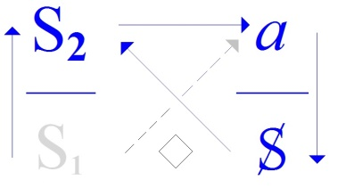

[无对应译文]

</section>

<section class="parallel-paragraph" data-paragraph-ids="s20-12-0101">

s20-12-0101

原文 · s20-12-0101

Alors quand vous gribouillez, ma foi, comme on dit c’est toujours sur une page et c’est avec des lignes.

[无对应译文]

</section>

<section class="parallel-paragraph" data-paragraph-ids="s20-12-0102">

s20-12-0102

原文 · s20-12-0102

Et nous voilà plongés tout de suite dans l’his­toire des dimensions.

[无对应译文]

</section>

<section class="parallel-paragraph" data-paragraph-ids="s20-12-0103">

s20-12-0103

原文 · s20-12-0103

- Comme ce qui coupe une ligne c’est le point, et que *le point* a 0 dimension, la ligne sera définie d’en avoir deux \[*lapsus*\]. Comme ce qui coupe... *La ligne* sera définie d’en avoir 1 !

[无对应译文]

</section>

<section class="parallel-paragraph" data-paragraph-ids="s20-12-0104">

s20-12-0104

原文 · s20-12-0104

- Comme ce que coupe la ligne c’est une surface, *la surface* sera définie d’en avoir 2.

[无对应译文]

</section>

<section class="parallel-paragraph" data-paragraph-ids="s20-12-0105">

s20-12-0105

原文 · s20-12-0105

- Comme ce que coupe la surface c’est l’espace, *l’espace* en aura 3.

[无对应译文]

</section>

<section class="parallel-paragraph" data-paragraph-ids="s20-12-0106">

s20-12-0106

原文 · s20-12-0106

Seulement c’est là que prend sa valeur le petit signe que j’ai écrit au tableau.

[无对应译文]

</section>

<section class="parallel-paragraph" data-paragraph-ids="s20-12-0107">

s20-12-0107

原文 · s20-12-0107

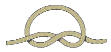

[无对应译文]

</section>

<section class="parallel-paragraph" data-paragraph-ids="s20-12-0108">

s20-12-0108

原文 · s20-12-0108

Je veux dire celui qu’il faut que je distingue de celui que j’ai écrit au dessous, ils sont séparés.

[无对应译文]

</section>

<section class="parallel-paragraph" data-paragraph-ids="s20-12-0109">

s20-12-0109

原文 · s20-12-0109

[无对应译文]

</section>

<section class="parallel-paragraph" data-paragraph-ids="s20-12-0110">

s20-12-0110

原文 · s20-12-0110

Vous pouvez remarquer que c’est une chose qui ait tous les caractères d’*écriture*, ça pourrait aussi bien être une *lettre*. Seule­ment, comme vous écrivez cursivement, il vous vient pas à l’idée *d’arrê­ter la ligne avant qu’elle en rencontre une autre*, pour la faire passer dessous, la *supposer* passer dessous, parce qu’il s’agit dans l’écriture de tout autre chose que de l’espace à 3 dimensions :

[无对应译文]

</section>

<section class="parallel-paragraph" data-paragraph-ids="s20-12-0111">

s20-12-0111

原文 · s20-12-0111

- cette ligne coupée ici, ai-je dit, veut dire qu’elle passe sous l’autre,

[无对应译文]

</section>

<section class="parallel-paragraph" data-paragraph-ids="s20-12-0112">

s20-12-0112

原文 · s20-12-0112

- ici c’est au-dessus, parce que c’est l’autre qui s’interrompt.

[无对应译文]

</section>

<section class="parallel-paragraph" data-paragraph-ids="s20-12-0113">

s20-12-0113

原文 · s20-12-0113

C’est ce qui produit...

[无对应译文]

</section>

<section class="parallel-paragraph" data-paragraph-ids="s20-12-0114">

s20-12-0114

原文 · s20-12-0114

> encore qu’il n’y ait ici qu’une ligne ...cette chose qui se distingue de ce que serait un simple rond, un rond de ficelle si ça existait, ça s’en distingue en ce sens que quoiqu’il n’y ait qu’une seule ficelle, ça fait *un nœud*.

[无对应译文]

</section>

<section class="parallel-paragraph" data-paragraph-ids="s20-12-0115">

s20-12-0115

原文 · s20-12-0115

C’est quand même tout autre chose - cette ligne - que la définition que nous en avons donnée tout à l’heure au regard de l’espace, c’est-à-dire en somme une coupure : ce qui fait un trou, un intérieur, un extérieur de la ligne.

[无对应译文]

</section>

<section class="parallel-paragraph" data-paragraph-ids="s20-12-0116">

s20-12-0116

原文 · s20-12-0116

Cette *autre* ligne, cette *ficelle* comme je l’ai appelée, ça ne *s’incarne* pas si facilement dans l’espace.

[无对应译文]

</section>

<section class="parallel-paragraph" data-paragraph-ids="s20-12-0117">

s20-12-0117

原文 · s20-12-0117

La preuve, c’est que la *ficelle* idéale, la plus simple, ça serait un *tore*.

[无对应译文]

</section>

<section class="parallel-paragraph" data-paragraph-ids="s20-12-0118">

s20-12-0118

原文 · s20-12-0118

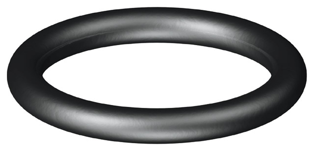

[无对应译文]

</section>

<section class="parallel-paragraph" data-paragraph-ids="s20-12-0119">

s20-12-0119

原文 · s20-12-0119

Et on a mis très longtemps à s’apercevoir, grâce à la topologie, que ce qui s’enferme dans un *tore* c’est quelque chose qui n’a absolument rien à voir avec ce qui s’enferme dans une *bulle* \[*sphère*\].

[无对应译文]

</section>

<section class="parallel-paragraph" data-paragraph-ids="s20-12-0120">

s20-12-0120

原文 · s20-12-0120

Il ne s’agit pas de couper le *tore*, car quoi que vous fassiez avec la surface d’un *tore*, vous ne ferez pas un nœud.

[无对应译文]

</section>

<section class="parallel-paragraph" data-paragraph-ids="s20-12-0121">

s20-12-0121

原文 · s20-12-0121

Mais par contre, avec le *lieu* du *tore*, comme ceci vous le démontre, vous pouvez faire un nœud.

[无对应译文]

</section>

<section class="parallel-paragraph" data-paragraph-ids="s20-12-0122">

s20-12-0122

原文 · s20-12-0122

C’est en quoi, permettez-moi de vous le dire : *le tore c’est la raison* \[*Rires*\], c’est ce qui permet le nœud.

[无对应译文]

</section>

<section class="parallel-paragraph" data-paragraph-ids="s20-12-0123">

s20-12-0123

原文 · s20-12-0123

C’est bien en quoi ce que je vous montre, ce *tore* tortillé, c’est l’image, aussi simple, aussi sec que je peux vous la donner, que j’ai évoquée l’autre jour comme *la trinité* : 1 et 3 d’un seul jet.

[无对应译文]

</section>

<section class="parallel-paragraph" data-paragraph-ids="s20-12-0124">

s20-12-0124

原文 · s20-12-0124

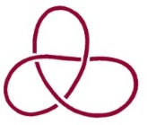 → 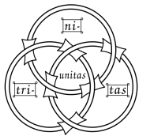

[无对应译文]

</section>

<section class="parallel-paragraph" data-paragraph-ids="s20-12-0125">

s20-12-0125

原文 · s20-12-0125

Il n’en reste pas moins que c’est à en refaire *trois tores*, par le petit truc que je vous ai déjà montré sous le nom de « *nœud borroméen* », que nous allons pouvoir opérer, dire quelque chose sur ce qu’il en est de l’usage du premier nœud.

[无对应译文]

</section>

<section class="parallel-paragraph" data-paragraph-ids="s20-12-0126">

s20-12-0126

原文 · s20-12-0126

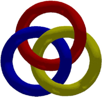

[无对应译文]

</section>

<section class="parallel-paragraph" data-paragraph-ids="s20-12-0127">

s20-12-0127

原文 · s20-12-0127

Naturellement, il y en a qui n’étaient pas là quand j’ai parlé - l’année dernière, vers février - du *nœud borroméen*.

[无对应译文]

</section>

<section class="parallel-paragraph" data-paragraph-ids="s20-12-0128">

s20-12-0128

原文 · s20-12-0128

Nous allons tâcher aujourd’hui de vous faire sentir l’impor­tance de cette histoire, et en quoi elle a affaire à *l’écriture* pour autant que je l’ai définie comme* « ce que laisse de trace le langage »*.

[无对应译文]

</section>

<section class="parallel-paragraph" data-paragraph-ids="s20-12-0129">

s20-12-0129

原文 · s20-12-0129

Le *nœud borroméen* consiste en ceci : nous y avons affaire avec ce qui ne se voit nulle part, à savoir un vrai *rond de ficelle*. Parce que figurez-vous que quand on trace une ficelle, on n’arrive jamais à ce que sa trace joigne ses deux bouts.

[无对应译文]

</section>

<section class="parallel-paragraph" data-paragraph-ids="s20-12-0130">

s20-12-0130

原文 · s20-12-0130

Pour que vous ayez un rond de ficelle, faut que vous fassiez un nœud, nœud marin de préférence. \[*Rires*\]

[无对应译文]

</section>

<section class="parallel-paragraph" data-paragraph-ids="s20-12-0131">

s20-12-0131

原文 · s20-12-0131

Je sais pas ce que ça vous... Ah, faisons le nœud marin... si vous croyez que c’est facile \[*Rires*\], essayez vous-même, ça fait toujours un certain *embarras*. \[*Rires*\]

[无对应译文]

</section>

<section class="parallel-paragraph" data-paragraph-ids="s20-12-0132">

s20-12-0132

原文 · s20-12-0132

Bon, enfin, malgré tout j’ai essayé ces jours-ci d’en prendre l’habitude \[*Rires*\], et il y a rien de plus facile que de le rater \[*Rires*\].

[无对应译文]

</section>

<section class="parallel-paragraph" data-paragraph-ids="s20-12-0133">

s20-12-0133

原文 · s20-12-0133

Voilà ! \[*Rires et applaudissements*\]

[无对应译文]

</section>

<section class="parallel-paragraph" data-paragraph-ids="s20-12-0134">

s20-12-0134

原文 · s20-12-0134

[无对应译文]

</section>

<section class="parallel-paragraph" data-paragraph-ids="s20-12-0135">

s20-12-0135

原文 · s20-12-0135

Grâce au nœud marin, vous avez là un rond de ficelle.

[无对应译文]

</section>

<section class="parallel-paragraph" data-paragraph-ids="s20-12-0136">

s20-12-0136

原文 · s20-12-0136

Le problème qui est posé par le *nœud borroméen* est celui-ci : comment faire, quand vous avez fait vos *ronds de ficelle*, pour que quelque chose dans le genre de ce que vous voyez dans le haut, à savoir un nœud, pour que ces trois ronds de ficelle tiennent ensemble et de façon telle, de façon telle que si vous en coupez un, ils soient tous libres, je veux dire les trois ?

[无对应译文]

</section>

<section class="parallel-paragraph" data-paragraph-ids="s20-12-0137">

s20-12-0137

原文 · s20-12-0137

Les trois, ce qui n’est rien, car le problème c’est de faire qu’avec un nombre quelconque de ronds de ficelle, quand vous en coupez un, tous les autres, sans exception, soient désormais libres, indépendants.

[无对应译文]

</section>

<section class="parallel-paragraph" data-paragraph-ids="s20-12-0138">

s20-12-0138

原文 · s20-12-0138

 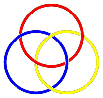

[无对应译文]

</section>

<section class="parallel-paragraph" data-paragraph-ids="s20-12-0139">

s20-12-0139

原文 · s20-12-0139

Voici par exemple le cas.

[无对应译文]

</section>

<section class="parallel-paragraph" data-paragraph-ids="s20-12-0140">

s20-12-0140

原文 · s20-12-0140

J’ai déjà, l’année dernière, mis ça au tableau.

[无对应译文]

</section>

<section class="parallel-paragraph" data-paragraph-ids="s20-12-0141">

s20-12-0141

原文 · s20-12-0141

Naturellement, j’ai fait une petite faute \[*Rires*\]...

[无对应译文]

</section>

<section class="parallel-paragraph" data-paragraph-ids="s20-12-0142">

s20-12-0142

原文 · s20-12-0142

Ce n’est pas tout à fait satisfaisant mais ça va le devenir, rien n’est plus facile dans cet ordre que de faire une faute. Encore une faute...

[无对应译文]

</section>

<section class="parallel-paragraph" data-paragraph-ids="s20-12-0143">

s20-12-0143

原文 · s20-12-0143

Tel que vous le voyez là inscrit, il vous est facile de voir que comme ces deux *ronds de ficelle* sont construits de telle sorte qu’ils sont pas noués l’un à l’autre, c’est uniquement par le 3ème qu’ils se tiennent.

[无对应译文]

</section>

<section class="parallel-paragraph" data-paragraph-ids="s20-12-0144">

s20-12-0144

原文 · s20-12-0144

C’est ce que curieusement, je ne suis pas arrivé à reproduire avec mes ronds de ficelle \[*Rires*\].

[无对应译文]

</section>

<section class="parallel-paragraph" data-paragraph-ids="s20-12-0145">

s20-12-0145

原文 · s20-12-0145

Mais Dieu merci, j’ai quand même un autre moyen de le faire que de reproduire ce que j’ai fait au tableau, à savoir de le manquer.

[无对应译文]

</section>

<section class="parallel-paragraph" data-paragraph-ids="s20-12-0146">

s20-12-0146

原文 · s20-12-0146

Je vais tout de suite vous donner le moyen, de façon complètement rationnelle et compréhensible...

[无对应译文]

</section>

<section class="parallel-paragraph" data-paragraph-ids="s20-12-0147">

s20-12-0147

原文 · s20-12-0147

Voilà ! Voilà donc un rond de ficelle. En voilà un autre.

[无对应译文]

</section>

<section class="parallel-paragraph" data-paragraph-ids="s20-12-0148">

s20-12-0148

原文 · s20-12-0148

Vous passez le second rond dans le premier, et vous le pliez comme ça :

[无对应译文]

</section>

<section class="parallel-paragraph" data-paragraph-ids="s20-12-0149">

s20-12-0149

原文 · s20-12-0149

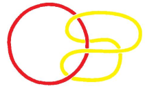

[无对应译文]

</section>

<section class="parallel-paragraph" data-paragraph-ids="s20-12-0150">

s20-12-0150

原文 · s20-12-0150

Il suffira dès lors que, d’un troisième rond vous preniez le second, pour que ces trois soient noués, et noués de telle sorte qu’il suffit bien évidemment que vous sectionniez 1 des 3 pour que les 2 autres soient libres. \[Rires\]

[无对应译文]

</section>

<section class="parallel-paragraph" data-paragraph-ids="s20-12-0151">

s20-12-0151

原文 · s20-12-0151

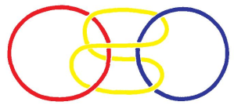

[无对应译文]

</section>

<section class="parallel-paragraph" data-paragraph-ids="s20-12-0152">

s20-12-0152

原文 · s20-12-0152

Supposez, supposez cher ami \[*Lacan s’adresse à la personne manipulant les ronds de ficelle*\] que je vous enlève celui-ci.

[无对应译文]

</section>

<section class="parallel-paragraph" data-paragraph-ids="s20-12-0153">

s20-12-0153

原文 · s20-12-0153

C’est celui-là que vous voulez ? C’est tout à fait la même chose pour la simple raison que celui-là, que je vous ai représenté comme plié et qui a en somme deux oreilles, dans lequel passe le 3ème, il est absolument symétrique de l’autre coté, à savoir que par rapport au 3ème, il a aussi deux oreilles que prend le 1er.

[无对应译文]

</section>

<section class="parallel-paragraph" data-paragraph-ids="s20-12-0154">

s20-12-0154

原文 · s20-12-0154

Non seulement ceci, ne croyez pas, vous savez, que ce soit inutile, n’est-ce pas,  tous ces petits cafouillages, ce n’est pas si familier que la façon dont je suis arrivé à l’expliquer, avec des ratages justement, ne soit pas ce qui peut vous le faire entrer dans la tête, car il faut que je vous le montre parce qu’après tout, il n’y a que comme ça que ça peut entrer !

[无对应译文]

</section>

<section class="parallel-paragraph" data-paragraph-ids="s20-12-0155">

s20-12-0155

原文 · s20-12-0155

Après le premier pliage, vous pouvez avec le 3ème...

[无对应译文]

</section>

<section class="parallel-paragraph" data-paragraph-ids="s20-12-0156">

s20-12-0156

原文 · s20-12-0156

> à condition ici de faire un nœud ...faire un pliage nouveau, et à celui-ci un 4ème qui est comme le premier, étant ajouté.

[无对应译文]

</section>

<section class="parallel-paragraph" data-paragraph-ids="s20-12-0157">

s20-12-0157

原文 · s20-12-0157

Vous voyez qu’il reste tout aussi vrai avec 4 qu’avec 3, qu’il suffit de couper un de ces nœuds pour que tous les autres soient libres entre eux.

[无对应译文]

</section>

<section class="parallel-paragraph" data-paragraph-ids="s20-12-0158">

s20-12-0158

原文 · s20-12-0158

Vous pouvez en mettre un nombre absolument infini, ce sera tou­jours vrai.

[无对应译文]

</section>

<section class="parallel-paragraph" data-paragraph-ids="s20-12-0159">

s20-12-0159

原文 · s20-12-0159

Néanmoins cette histoire qui rend simple *le nœud borroméen* en ce sens qu’ici par exemple, vous pouvez parfaitement toucher en quoi ce sont les deux parties de cet élément qui font « *oreilles* », celle-ci et celle-ci, et qu’en somme en le tirant avec l’autre, c’est ce rond qui se plie en deux, ici et ici passent, sont les deux oreilles, que ce cercle là qui ira lui, laissant celui que nous pouvons en cette occasion, mais uniquement dans cette occasion, appeler premier qui restera à l’état de rond, de rond « soutien », premier rond plié.

[无对应译文]

</section>

<section class="parallel-paragraph" data-paragraph-ids="s20-12-0160">

s20-12-0160

原文 · s20-12-0160

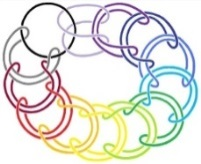

[无对应译文]

</section>

<section class="parallel-paragraph" data-paragraph-ids="s20-12-0161">

s20-12-0161

原文 · s20-12-0161

À cette intuition sensible en quelque sorte de *la fonction des ronds*, *vous pouvez constater qu’il suffit d’en couper un quelquonque*...

[无对应译文]

</section>

<section class="parallel-paragraph" data-paragraph-ids="s20-12-0162">

s20-12-0162

原文 · s20-12-0162

que ce soit un du milieu ou un des deux extrémités ...pour que tout ce qu’il y a de nœuds pliés, du même coup soit d’entre-soi libérés.

[无对应译文]

</section>

<section class="parallel-paragraph" data-paragraph-ids="s20-12-0163">

s20-12-0163

原文 · s20-12-0163

La solution est donc absolument générale.

[无对应译文]

</section>

<section class="parallel-paragraph" data-paragraph-ids="s20-12-0164">

s20-12-0164

原文 · s20-12-0164

Cela ne veut pas dire que pour un nombre quelquonque de ronds de ficelles, on pourra faire une disposition aussi... enfin, relativement élégante par sa relative symétrie, que celle que j’ai faite au tableau, à savoir que ces trois ronds soient strictement, les uns par rapport aux autres d’une forme équivalente, ça sera certainement plus compliqué - et ceci dès qu’on sera arrivé à quatre, cela nous montrera bien souvent *les effets de torsion* qui ne nous permettent pas de les maintenir à l’état de rond.

[无对应译文]

</section>

<section class="parallel-paragraph" data-paragraph-ids="s20-12-0165">

s20-12-0165

原文 · s20-12-0165

Néanmoins, ce que je veux à cette occasion vous faire sentir, c’est que partant des ronds, nous avons affaire à quelque chose qui ne se distingue que d’être l’*Un*.

[无对应译文]

</section>

<section class="parallel-paragraph" data-paragraph-ids="s20-12-0166">

s20-12-0166

原文 · s20-12-0166

C’est très précisément d’ailleurs en quoi un vrai rond de ficelle sans nœud, c’est très difficile à faire, mais c’est certainement la plus éminente représentation de quelque chose qui ne se soutient que de l’*Un*, très précisément en ce sens que ça n’enferme rien qu’un trou !

[无对应译文]

</section>

<section class="parallel-paragraph" data-paragraph-ids="s20-12-0167">

s20-12-0167

原文 · s20-12-0167

Et pourquoi ai-je fait intervenir dans l’ancien temps le *nœud borroméen* ?

[无对应译文]

</section>

<section class="parallel-paragraph" data-paragraph-ids="s20-12-0168">

s20-12-0168

原文 · s20-12-0168

C’est très précisément pour traduire la formule :

[无对应译文]

</section>

<section class="parallel-paragraph" data-paragraph-ids="s20-12-0169">

s20-12-0169

原文 · s20-12-0169

> *- je te demande* - *quoi ?* \[*objet(a) oral :* H\]
>
> \- *de refuser ce que* - *quoi ?* \[*objet(a) anal :* M\]
>
> \- *ce que je t’offre* \[*objet(a) scopique :* U\] » *...*c’est-à-dire *quelque chose* qui, au regard de ce dont il s’agit, et vous savez ce que c’est : c’est à savoir *l’objet(a),* *l’objet(a) n’est aucun être.*

[无对应译文]

</section>

<section class="parallel-paragraph" data-paragraph-ids="s20-12-0170">

s20-12-0170

原文 · s20-12-0170

*L’objet(a)* c’est *ce que suppose de vide une demande* dont en fin de compte ce n’est qu’à la définir comme située par *la méto­nymie*, c’est-à-dire par la pure continuité assurée du commencement au début de la phrase, que nous pouvons imaginer ce qu’il peut en être d’*un désir qu’aucun être ne supporte*, je veux dire qui est sans autre substance que celle qui s’assure des nœuds mêmes.

[无对应译文]

</section>

<section class="parallel-paragraph" data-paragraph-ids="s20-12-0171">

s20-12-0171

原文 · s20-12-0171

Et la preuve c’est que, énonçant cette phrase « *je te demande de refuser ce que je t’offre...* » je n’ai pu que la motiver de ce « *ce n’est pas ça* » dont j’ai parlé, que j’ai repris la dernière fois, et qui veut dire que dans le désir de toute demande, il n’y a que la requête de ce *quelque chose* qui, au regard de la jouissance qui serait satisfaisante, qui serait la *Lustbefriedigung* supposée dans ce qu’on appelle...

[无对应译文]

</section>

<section class="parallel-paragraph" data-paragraph-ids="s20-12-0172">

s20-12-0172

原文 · s20-12-0172

> également improprement dans le discours psychanalytique ...« *la pulsion génitale* », celle où s’inscrirait un rapport qui serait le rapport plein, le rapport inscriptible, entre ce qu’il en est de l’*Un* avec ce qui reste irréductiblement l’*Autre*.

[无对应译文]

</section>

<section class="parallel-paragraph" data-paragraph-ids="s20-12-0173">

s20-12-0173

原文 · s20-12-0173

C’est en quoi j’ai insisté sur ceci : c’est que le par­tenaire de ce *« je » qui est le « sujet »*, sujet de toute phrase de demande, c’est que ce partenaire est non pas *l’Autre,* mais ce quelque chose qui vient se substituer à lui sous la forme *de cette cause du désir* \[*(a) semblant de rapport sexuel*\], que j’ai cru pouvoir diversifier...

[无对应译文]

</section>

<section class="parallel-paragraph" data-paragraph-ids="s20-12-0174">

s20-12-0174

原文 · s20-12-0174

> ce n’est pas sans raisons ...en quatre, en tant qu’ils se constituent selon la découverte freudienne, en tant qu’ils se constituent diversement :

[无对应译文]

</section>

<section class="parallel-paragraph" data-paragraph-ids="s20-12-0175">

s20-12-0175

原文 · s20-12-0175

- *de l’objet de la succion,*

[无对应译文]

</section>

<section class="parallel-paragraph" data-paragraph-ids="s20-12-0176">

s20-12-0176

原文 · s20-12-0176

- *de l’objet de l’excrétion,*

[无对应译文]

</section>

<section class="parallel-paragraph" data-paragraph-ids="s20-12-0177">

s20-12-0177

原文 · s20-12-0177

- *du regard,*

[无对应译文]

</section>

<section class="parallel-paragraph" data-paragraph-ids="s20-12-0178">

s20-12-0178

原文 · s20-12-0178

- *et* aussi bien *de la voix*.

[无对应译文]

</section>

<section class="parallel-paragraph" data-paragraph-ids="s20-12-0179">

s20-12-0179

原文 · s20-12-0179

*C’est en tant que substituts* de ce qu’il en est *de l’Autre, que ces objets sont réclamés, sont faits cause du désir.*

[无对应译文]

</section>

<section class="parallel-paragraph" data-paragraph-ids="s20-12-0180">

s20-12-0180

原文 · s20-12-0180

Comme je l’ai dit tout à l’heure, il semble que le sujet se représente les objets inanimés, très précisément en fonction de ceci *qu’il n’y a pas de relation sexuelle*.

[无对应译文]

</section>

<section class="parallel-paragraph" data-paragraph-ids="s20-12-0181">

s20-12-0181

原文 · s20-12-0181

*Il n’y a que les corps parlants* - ai-je dit - qui se font une idée du *monde* comme tel.

[无对应译文]

</section>

<section class="parallel-paragraph" data-paragraph-ids="s20-12-0182">

s20-12-0182

原文 · s20-12-0182

Et à cet endroit on peut le dire : le conte, le monde comme tel, le monde de l’être plein de savoir, ce n’est qu’un rêve, un rêve du corps en tant qu’il parle : il n’y a pas de sujet connaissant.

[无对应译文]

</section>

<section class="parallel-paragraph" data-paragraph-ids="s20-12-0183">

s20-12-0183

原文 · s20-12-0183

Il y a des sujets qui se donnent des corrélats dans *l’objet(a)*, corrélats de *parole jouissante* en tant que *jouis­sance de parole*.

[无对应译文]

</section>

<section class="parallel-paragraph" data-paragraph-ids="s20-12-0184">

s20-12-0184

原文 · s20-12-0184

Que *coince-t-elle d’autre* que d’autres *Uns* ?

[无对应译文]

</section>

<section class="parallel-paragraph" data-paragraph-ids="s20-12-0185">

s20-12-0185

原文 · s20-12-0185

Car je vous l’ai fait remarquer tout à l’heure, il est clair que cette « *bi-lobulation* », cette transforma­tion du rond de ficelle en *oreilles, il* peut se faire de façon strictement symétrique.

[无对应译文]

</section>

<section class="parallel-paragraph" data-paragraph-ids="s20-12-0186">

s20-12-0186

原文 · s20-12-0186

C’est même ce qui arrive dès qu’on arrive au niveau de 4, c’est-à-dire que les deux ronds que représentent mes doigts à l’extrèmité de ceux-ci seraient *en fonction*, il y en aurait 4.

[无对应译文]

</section>

<section class="parallel-paragraph" data-paragraph-ids="s20-12-0187">

s20-12-0187

原文 · s20-12-0187

*La réciprocité*, pour tout dire, *entre le sujet et l’objet(a) est totale*.

[无对应译文]

</section>

<section class="parallel-paragraph" data-paragraph-ids="s20-12-0188">

s20-12-0188

原文 · s20-12-0188

Pour tout *être parlant*, la cause de son désir est strictement, quant à la structure, équivalente si je puis dire *à sa pliure*, à ce que j’ai appelé sa *division de sujet*.

[无对应译文]

</section>

<section class="parallel-paragraph" data-paragraph-ids="s20-12-0189">

s20-12-0189

原文 · s20-12-0189

Et c’est bien ce qui nous explique que si longtemps le sujet a pu croire que le monde en savait autant que lui, *c’est qu’il est symétrique, c’est que le monde, ce que j’ai appelé la dernière fois la pensée, c’est l’équivalent, c’est l’image en miroir de la pensée*.

[无对应译文]

</section>

<section class="parallel-paragraph" data-paragraph-ids="s20-12-0190">

s20-12-0190

原文 · s20-12-0190

C’est bien pourquoi le sujet pour autant qu’il fantasme, il n’y a...

[无对应译文]

</section>

<section class="parallel-paragraph" data-paragraph-ids="s20-12-0191">

s20-12-0191

原文 · s20-12-0191

> jusqu’à l’avènement de la science la plus moderne ...il n’y a rien eu que *fantasme* quant à la connaissance.

[无对应译文]

</section>

<section class="parallel-paragraph" data-paragraph-ids="s20-12-0192">

s20-12-0192

原文 · s20-12-0192

Et c’est bien ce qui a permis cette *« échelle d’êtres »,* grâce à quoi était supposé dans *un être*, dit « *être suprême »*, ce qui était *« le bien de tous »*.

[无对应译文]

</section>

<section class="parallel-paragraph" data-paragraph-ids="s20-12-0193">

s20-12-0193

原文 · s20-12-0193

Ce qui est aussi bien l’équivalent, l’équivalent de ceci, que *l’objet(a)* peut être dit - comme son nom l’indique : écrivez le *a* entre parenthèses : *(a)*, mettez « *sexué »* après : *(a)sexué*, et vous avez que *l’Autre* ne se présente pour le sujet que sous une forme *(a)sexuée*.

[无对应译文]

</section>

<section class="parallel-paragraph" data-paragraph-ids="s20-12-0194">

s20-12-0194

原文 · s20-12-0194

C’est-à-dire que tout ce qui a été le support, le support-substitut, substi­tut de l’*Autre* sous la forme de *l’objet de désir*, tout ce qui s’est fait de cet ordre est *(a)sexué*.

[无对应译文]

</section>

<section class="parallel-paragraph" data-paragraph-ids="s20-12-0195">

s20-12-0195

原文 · s20-12-0195

Et c’est très précisément en quoi *l’Autre,* comme tel, reste...

[无对应译文]

</section>

<section class="parallel-paragraph" data-paragraph-ids="s20-12-0196">

s20-12-0196

原文 · s20-12-0196

non sans que nous puissions y avancer un peu plus ...reste dans la doctrine, la théorie freudienne, un problème, celui qui s’est exprimé en ceci que répétait Freud : «  *Que veut la femme* ? ».

[无对应译文]

</section>

<section class="parallel-paragraph" data-paragraph-ids="s20-12-0197">

s20-12-0197

原文 · s20-12-0197

*La femme* étant dans l’occasion, l’équivalent de *la vérité*.

[无对应译文]

</section>

<section class="parallel-paragraph" data-paragraph-ids="s20-12-0198">

s20-12-0198

原文 · s20-12-0198

C’est en quoi cette équivalence que j’ai produite est justifiée.

[无对应译文]

</section>

<section class="parallel-paragraph" data-paragraph-ids="s20-12-0199">

s20-12-0199

原文 · s20-12-0199

Est-ce que nous ne pouvons pas pourtant, par cette voie de ce que j’ai distingué comme l’*Un* à prendre comme tel, en ce sens qu’il n’y a rien d’autre dans cette figure du *rond de ficelle*, qui a pourtant son intérêt de nous offrir le quelque chose que rejoint sans doute l’écriture.

[无对应译文]

</section>

<section class="parallel-paragraph" data-paragraph-ids="s20-12-0200">

s20-12-0200

原文 · s20-12-0200

L’exigence en effet que j’ai produite sous le nom de *nœud borroméen*, à savoir de trouver une *forme*, cette *forme* supportée par ce support mythique qu’est *le rond de ficelle*.

[无对应译文]

</section>

<section class="parallel-paragraph" data-paragraph-ids="s20-12-0201">

s20-12-0201

原文 · s20-12-0201

Mythique, ai-je dit, car on ne fait pas de rond de ficelle fermé, c’est un point tout à fait important.

[无对应译文]

</section>

<section class="parallel-paragraph" data-paragraph-ids="s20-12-0202">

s20-12-0202

原文 · s20-12-0202

Quelle est cette exigence que j’ai énoncée sous le nom de *nœud borroméen* ?

[无对应译文]

</section>

<section class="parallel-paragraph" data-paragraph-ids="s20-12-0203">

s20-12-0203

原文 · s20-12-0203

C’est très précisément ceci qui distingue ce que nous trouvons dans le langage, dans la langue courante, et qui supporte *la métaphore* très répandue de « *la chaîne* ».

[无对应译文]

</section>

<section class="parallel-paragraph" data-paragraph-ids="s20-12-0204">

s20-12-0204

原文 · s20-12-0204

Contrairement aux *ronds de ficelle*, *des éléments de chaîne ça se forge*.

[无对应译文]

</section>

<section class="parallel-paragraph" data-paragraph-ids="s20-12-0205">

s20-12-0205

原文 · s20-12-0205

 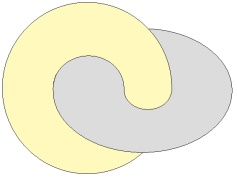

[无对应译文]

</section>

<section class="parallel-paragraph" data-paragraph-ids="s20-12-0206">

s20-12-0206

原文 · s20-12-0206

> \[*La chaîne : chaque anneau vient remplir le vide de l’anneau qui le précède et donc combler le trou par « un objet du monde ».*
>
> *Le nœud borroméen : les trois anneaux se nouent sans qu’aucun ne vienne combler le trou, mais le nœud se noue*\]

[无对应译文]

</section>

<section class="parallel-paragraph" data-paragraph-ids="s20-12-0207">

s20-12-0207

原文 · s20-12-0207

Il n’est pas très difficile d’imaginer comment ça se fait : on tord du métal jusqu’au moment où on peut arriver à le souder, et *la chaîne* est ainsi quelque chose qui peut avoir sa fonction pour représenter l’usage de la langue.

[无对应译文]

</section>

<section class="parallel-paragraph" data-paragraph-ids="s20-12-0208">

s20-12-0208

原文 · s20-12-0208

Sans doute n’est-ce pas un support simple, il faudrait dans cette chaîne faire des chaînons qui iraient s’accrocher à un autre chaînon un peu plus loin avec deux, trois chaînons flottants intermédiaires, et comprendre aussi pour­quoi une phrase a une durée limitée.

[无对应译文]

</section>

<section class="parallel-paragraph" data-paragraph-ids="s20-12-0209">

s20-12-0209

原文 · s20-12-0209

Or tout ceci, la métaphore ne peut pas nous le donner.

[无对应译文]

</section>

<section class="parallel-paragraph" data-paragraph-ids="s20-12-0210">

s20-12-0210

原文 · s20-12-0210

Il est néanmoins frappant qu’à prendre les supports de *ronds de ficelle* que je vous ai dit, il y en avait quand même, dans ce que je vous ai rendu sensible, un premier et un dernier.

[无对应译文]

</section>

<section class="parallel-paragraph" data-paragraph-ids="s20-12-0211">

s20-12-0211

原文 · s20-12-0211

Ce premier et ce dernier étaient des ronds simples, qui franchissaient, perçaient, si je puis dire, les deux que j’appelle...

[无对应译文]

</section>

<section class="parallel-paragraph" data-paragraph-ids="s20-12-0212">

s20-12-0212

原文 · s20-12-0212

> vous voyez la difficulté de parler de ces choses ...ce que j’appelle « *les lobes d’oreille »*, des ronds repliés, c’était donc deux nœuds simples, qui à la fin se trouvaient faire quelque chose comme le début et la fin de la chaîne.

[无对应译文]

</section>

<section class="parallel-paragraph" data-paragraph-ids="s20-12-0213">

s20-12-0213

原文 · s20-12-0213

Il reste ceci, il reste ceci : c’est que ces deux ronds, initiaux et terminaux, rien ne nous empêcherait de les confondre, c’est à savoir que les ayant coupés...

[无对应译文]

</section>

<section class="parallel-paragraph" data-paragraph-ids="s20-12-0214">

s20-12-0214

原文 · s20-12-0214

> « *coupés* » c’est imaginaire : de les défaire ...d’en faire passer un seul, à prendre les quatres lobes ainsi résumés dans un cas où il n’y en a que deux, mais la situation serait exactement la même s’il y en avait un nombre infini.

[无对应译文]

</section>

<section class="parallel-paragraph" data-paragraph-ids="s20-12-0215">

s20-12-0215

原文 · s20-12-0215

Chose à remarquer, nous n’aurions - pour m’exprimer vite - nous n’aurions dans ce cas quand même encore *une différence*.

[无对应译文]

</section>

<section class="parallel-paragraph" data-paragraph-ids="s20-12-0216">

s20-12-0216

原文 · s20-12-0216

Ce n’est pas parce que nous aurions conjoint les deux derniers nœuds que toutes les articulations seraient les mêmes, car ici ils sont affrontés deux par deux, il y a donc quatre brins à faire nœuds, alors qu’ici, à prendre mon cercle unique, vous auriez le support de ce cercle et quatre brins à passer, ce qui ferait un affrontement non pas de 2 à 2 qui font 4, mais de 4 à 1 qui font 5.

[无对应译文]

</section>

<section class="parallel-paragraph" data-paragraph-ids="s20-12-0217">

s20-12-0217

原文 · s20-12-0217

Et donc on pourrait dire que même ce qui serait alors...

[无对应译文]

</section>

<section class="parallel-paragraph" data-paragraph-ids="s20-12-0218">

s20-12-0218

原文 · s20-12-0218

puisqu’ici vous n’avez que deux éléments ...le 3ème élément, dans son rapport topologique, n’aurait pas le même rapport avec les deux autres, que les deux autres entre eux, et comme tel, par simple inspection des nœuds en jonction, le 3ème élément se distinguerait des autres.

[无对应译文]

</section>

<section class="parallel-paragraph" data-paragraph-ids="s20-12-0219">

s20-12-0219

原文 · s20-12-0219

Je pense en avoir assez dit sur la symétrie des rapports du 1er et du 2ème, puisque le dernier je l’ai appelé 3ème.

[无对应译文]

</section>

<section class="parallel-paragraph" data-paragraph-ids="s20-12-0220">

s20-12-0220

原文 · s20-12-0220

Cette symétrie tient encore si vous unifiez le 3ème rond avec un quelquonque des deux autres, simplement vous aurez alors *une figure* comme celle-ci, celle qui affronte un simple rond avec *ce que j’appelle le* *huit intérieur*.

[无对应译文]

</section>

<section class="parallel-paragraph" data-paragraph-ids="s20-12-0221">

s20-12-0221

原文 · s20-12-0221

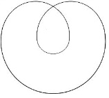

[无对应译文]

</section>

<section class="parallel-paragraph" data-paragraph-ids="s20-12-0222">

s20-12-0222

原文 · s20-12-0222

Vous aurez donc eu l’évanouissement de l’Autre, mais au prix de la surgescence de quelque chose qui est le *huit intérieur* et qui, comme vous le savez, est ce dans quoi je supporte *la bande de Mœbius*. Autrement dit ce en quoi \- dans un strict support de cette voie que j’essaie pour vous de frayer de *la fonction du nœud* - s’exprime par le *huit intérieur*.

[无对应译文]

</section>

<section class="parallel-paragraph" data-paragraph-ids="s20-12-0223">

s20-12-0223

原文 · s20-12-0223

Je ne peux ici que l’amorcer - pourquoi ? - parce que j’ai encore à avancer quelque chose qui me paraît, avant que je vous quitte, capital. Si je vous ai donné la solution des *nœud borroméens* par cette enfi­lade de chaînes, sous la forme de ces ronds qui redeviennent totalement indépendants pour peu que vous en coupiez un seul, à quoi ceci peut-il servir ?

[无对应译文]

</section>

<section class="parallel-paragraph" data-paragraph-ids="s20-12-0224">

s20-12-0224

原文 · s20-12-0224

Contrairement à ce que vous voyez dans le langage, c’est à savoir ce qui vous est très simplement matérialisé, et ce qui n’est pas non plus très difficile... très difficile d’en trouver un exemple - et pas pour rien - dans la psychose.

[无对应译文]

</section>

<section class="parallel-paragraph" data-paragraph-ids="s20-12-0225">

s20-12-0225

原文 · s20-12-0225

Souvenez-vous de ce qui hallucinatoirement peuple la solitude de Schreber :

[无对应译文]

</section>

<section class="parallel-paragraph" data-paragraph-ids="s20-12-0226">

s20-12-0226

原文 · s20-12-0226

- « *Nun will ich mich...* », que je traduis : « *maintenant je vais me...* » - c’est un futur.

[无对应译文]

</section>

<section class="parallel-paragraph" data-paragraph-ids="s20-12-0227">

s20-12-0227

原文 · s20-12-0227

- Ou encore « *Sie sollen nämlich...* » : « *vous devez quant à vous...* ».

[无对应译文]

</section>

<section class="parallel-paragraph" data-paragraph-ids="s20-12-0228">

s20-12-0228

原文 · s20-12-0228

Ces *phrases in­terrompues...*

[无对应译文]

</section>

<section class="parallel-paragraph" data-paragraph-ids="s20-12-0229">

s20-12-0229

原文 · s20-12-0229

> que j’ai appelées *messages de code,...*ces *phrases in­terrompues* laissent en suspens je ne sais quelle *substance*.

[无对应译文]

</section>

<section class="parallel-paragraph" data-paragraph-ids="s20-12-0230">

s20-12-0230

原文 · s20-12-0230

À quoi peut nous servir cette exigence d’une phrase quelle qu’elle ­soit, qui soit telle qu’ayant sectionné l’Un, c’est à dire retiré l’Un de chacun de ses *chaînons*, tous les autres du même coup soient libres.

[无对应译文]

</section>

<section class="parallel-paragraph" data-paragraph-ids="s20-12-0231">

s20-12-0231

原文 · s20-12-0231

Est-ce que ce n’est pas là le meilleur support que nous puissions donner de ce par quoi procède ce langage que j’ai appelé « *mathématique »* ?

[无对应译文]

</section>

<section class="parallel-paragraph" data-paragraph-ids="s20-12-0232">

s20-12-0232

原文 · s20-12-0232

Le propre du *langage mathématique*, une fois qu’il est suffisamment resserré quant à ses exigences de pure démonstration, est très précisément ceci que tout ce qui s’en avance...

[无对应译文]

</section>

<section class="parallel-paragraph" data-paragraph-ids="s20-12-0233">

s20-12-0233

原文 · s20-12-0233

> « s’en avance » non pas tant dans le commentaire parlé, mais dans le maniement des *lettres...*suppose ceci : qu’il suffit qu’*une* ne tienne pas pour que tout le reste, tout le reste des autres *lettres*, non seulement ne constituent par leur agencement rien de valable, mais se dispersent.

[无对应译文]

</section>

<section class="parallel-paragraph" data-paragraph-ids="s20-12-0234">

s20-12-0234

原文 · s20-12-0234

Et c’est très précisément en ceci que *le nœud borroméen* peut nous servir de meilleure méta­phore quant à ce qu’il en est d’une exigence qui est celle-ci : c’est que nous ne procédons que de l’Un.

[无对应译文]

</section>

<section class="parallel-paragraph" data-paragraph-ids="s20-12-0235">

s20-12-0235

原文 · s20-12-0235

L’Un engendre la science, non pas au sens \[*Fin de l’enregistrement*\] où quoi que ce soit s’en mesure \[l’«1» *unité de mesure*\], ce n’est pas ce qui se mesure dans la science, contrairement à ce qu’on croit, qui est l’important.

[无对应译文]

</section>

<section class="parallel-paragraph" data-paragraph-ids="s20-12-0236">

s20-12-0236

原文 · s20-12-0236

Ce qui fait le nerf original, ce qui distingue la science - *la science moderne –* de *la science de la réciprocité* entre le νοῦς \[nouss\] et *le monde,* entre *« ce qui pense »* et « *ce qui est pensé »*, c’est justement cette fonction de l’Un, en tant que l’Un n’est là, pouvons-nous supposer, que pour représenter

[无对应译文]

</section>

<section class="parallel-paragraph" data-paragraph-ids="s20-12-0237">

s20-12-0237

原文 · s20-12-0237

- ce qu’il en est justement de ce que l’Un *est seul*,

[无对应译文]

</section>

<section class="parallel-paragraph" data-paragraph-ids="s20-12-0238">

s20-12-0238

原文 · s20-12-0238

- de ce que l’Un *ne se noue véritablement avec rien de ce qui ressemble à l’Autre sexuel,* que c’est au contraire de *la chaîne entre des uns* qui sont tous faits de la même façon, de n’être rien d’autre que de l’Un.

[无对应译文]

</section>

<section class="parallel-paragraph" data-paragraph-ids="s20-12-0239">

s20-12-0239

原文 · s20-12-0239

Quand j’ai dit *y’a d’l’Un* et que j’y ai insisté, que j’ai vraiment piétiné ça comme un éléphant *pendant toute* *l’année dernière*, vous voyez ce que je fraye et ce à quoi je vous introduis.

[无对应译文]

</section>

<section class="parallel-paragraph" data-paragraph-ids="s20-12-0240">

s20-12-0240

原文 · s20-12-0240

- Comment alors quelque part mettre comme telle *la fonction de l’*Autre,

[无对应译文]

</section>

<section class="parallel-paragraph" data-paragraph-ids="s20-12-0241">

s20-12-0241

原文 · s20-12-0241

- comment, si jusqu’à un certain point c’est simplement des nœuds de l’Un, que se supporte ce qui reste, quand ça s’écrit, de tout langage,

[无对应译文]

</section>

<section class="parallel-paragraph" data-paragraph-ids="s20-12-0242">

s20-12-0242

原文 · s20-12-0242

- comment *poser une différence,* car il est clair que l’Autre *ne s’additionne pas à* l’Un, l’Autre *seulement s’en différencie*.

[无对应译文]

</section>

<section class="parallel-paragraph" data-paragraph-ids="s20-12-0243">

s20-12-0243

原文 · s20-12-0243

S’il y a quelque chose par quoi il \[l’Autre\] participe à l’Un c’est que, bien loin qu’il s’additionne, ce dont il s’agit concernant l’Autre c’est...

[无对应译文]

</section>

<section class="parallel-paragraph" data-paragraph-ids="s20-12-0244">

s20-12-0244

原文 · s20-12-0244

> comme je l’ai dit déjà, mais il n’est pas sûr que vous l’ayez entendu ...c’est que *l’*Autre c’est l’Un *en moins*.

[无对应译文]

</section>

<section class="parallel-paragraph" data-paragraph-ids="s20-12-0245">

s20-12-0245

原文 · s20-12-0245

C’est pour ça que dans *tout rapport de l’homme avec une femme*, celle qui est en cause c’est sous l’angle de l’Une *en moins* qu’elle doit être prise.

[无对应译文]

</section>

<section class="parallel-paragraph" data-paragraph-ids="s20-12-0246">

s20-12-0246

原文 · s20-12-0246

Je vous avais déjà indiqué ça un petit peu à propos de Don Juan, mais bien entendu il n’y a qu’une seule personne, je crois - ma fille nommément - qui s’en soit aperçu.

[无对应译文]

</section>

<section class="parallel-paragraph" data-paragraph-ids="s20-12-0247">

s20-12-0247

原文 · s20-12-0247

Néanmoins pour simplement aujourd’hui *amorcer ce que je pourrais vous dire d’autre*, je vais vous montrer quelque chose. Car il ne suffit pas d’avoir trouvé une solution générale à ce qu’il en est du problème pour un nombre infini des nœuds borroméens, il faudrait que nous ayons le moyen de montrer que c’est la seule solution.

[无对应译文]

</section>

<section class="parallel-paragraph" data-paragraph-ids="s20-12-0248">

s20-12-0248

原文 · s20-12-0248

Or nous en sommes à ceci jusqu’à ce jour qu’il n’y a aucune *théorie des nœuds*.

[无对应译文]

</section>

<section class="parallel-paragraph" data-paragraph-ids="s20-12-0249">

s20-12-0249

原文 · s20-12-0249

Qu’est-ce que ça veut dire ?

[无对应译文]

</section>

<section class="parallel-paragraph" data-paragraph-ids="s20-12-0250">

s20-12-0250

原文 · s20-12-0250

Ça veut dire ceci, que très précisément, *au nœud ne s’applique jusqu’à ce jour aucune formalisation mathématique qui permette*...

[无对应译文]

</section>

<section class="parallel-paragraph" data-paragraph-ids="s20-12-0251">

s20-12-0251

原文 · s20-12-0251

> en dehors de quelques petites fabrications, de petits exemples tels que ceux que je vous ai montrés ...de prévoir qu’une solution, celle que je viens de donner, n’est pas simplement une solution ex-sistante, mais qu’elle est nécessaire, qu’elle ne cesse pas...

[无对应译文]

</section>

<section class="parallel-paragraph" data-paragraph-ids="s20-12-0252">

s20-12-0252

原文 · s20-12-0252

> comme je le dis pour définir *le nécessaire* ...*qu’elle ne cesse pas de s’écrire*.

[无对应译文]

</section>

<section class="parallel-paragraph" data-paragraph-ids="s20-12-0253">

s20-12-0253

原文 · s20-12-0253

Or il suffit que tout de suite je vous montre quelque chose, que bien sûr je n’ai pas pu écrire au tableau, *parce que vous ne savez pas le tintouin que ça me donne de mettre tout ça sur le papier* d’une façon que je tiens à votre disposition, qui sera aussi bien photographié dans un prochain article, mais qui en demande un certain \[*tintouin*\].

[无对应译文]

</section>

<section class="parallel-paragraph" data-paragraph-ids="s20-12-0254">

s20-12-0254

原文 · s20-12-0254

Il suffit que je vous fasse ça :

[无对应译文]

</section>

<section class="parallel-paragraph" data-paragraph-ids="s20-12-0255">

s20-12-0255

原文 · s20-12-0255

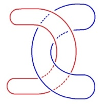

[无对应译文]

</section>

<section class="parallel-paragraph" data-paragraph-ids="s20-12-0256">

s20-12-0256

原文 · s20-12-0256

hein, embêtant que les autres, les autres nœuds, soient là ...regardez ça : je viens de faire passer deux de ces ronds l’un dans l’autre, d’une façon telle qu’ils font ici, non pas du tout ce repliage que je vous ai montré tout à l’heure, mais simplement un nœud marin.

[无对应译文]

</section>

<section class="parallel-paragraph" data-paragraph-ids="s20-12-0257">

s20-12-0257

原文 · s20-12-0257

Comme ils sont de ce fait même...

[无对应译文]

</section>

<section class="parallel-paragraph" data-paragraph-ids="s20-12-0258">

s20-12-0258

原文 · s20-12-0258

> puisque je viens de les agencer fermés ...comme ils sont de ce fait même parfaitement séparables l’un de l’autre, vous devez penser que, si simplement...

[无对应译文]

</section>

<section class="parallel-paragraph" data-paragraph-ids="s20-12-0259">

s20-12-0259

原文 · s20-12-0259

> ce qui m’est tout aussi possible ...je fais - avec un cercle qui suit - le même nœud marin, il suffit que j’approche de ceux-là un autre...

[无对应译文]

</section>

<section class="parallel-paragraph" data-paragraph-ids="s20-12-0260">

s20-12-0260

原文 · s20-12-0260

> voilà le nœud marin ...ici je peux faire la même chose avec un 3ème rond, j’aurai encore un nœud marin.

[无对应译文]

</section>

<section class="parallel-paragraph" data-paragraph-ids="s20-12-0261">

s20-12-0261

原文 · s20-12-0261

Peu importe qu’il soit face à face avec le 1er ou qu’il soit strictement dans la file, c’est-à-dire que ce qui passe devant, passe devant également le suivant - je peux en faire un nombre infini et même fermer le cercle que cela fera, le fermer simplement pour le dernier.

[无对应译文]

</section>

<section class="parallel-paragraph" data-paragraph-ids="s20-12-0262">

s20-12-0262

原文 · s20-12-0262

Pour le dernier bien sûr, il ne sera pas séparable, il faudra que ce dernier je le passe entre les deux du bout de ce que j’aurai déjà construit, et que je le passe en faisant un nœud, et non pas en l’introduisant comme je viens de faire pour ces deux-là.

[无对应译文]

</section>

<section class="parallel-paragraph" data-paragraph-ids="s20-12-0263">

s20-12-0263

原文 · s20-12-0263

Il n’en restera pas moins que voilà une autre solution tout aussi valable que la 1ère, car que je sectionne un quelconque de ceux que j’aurai agencés ainsi, tous les autres du même coup seront libres, et pourtant ce ne sera pas la même sorte de nœud.

[无对应译文]

</section>

<section class="parallel-paragraph" data-paragraph-ids="s20-12-0264">

s20-12-0264

原文 · s20-12-0264

Je vous ai passé à l’occasion ceci : que tout à l’heure, pour le nœud que je vous ai montré ainsi, en vous disant qu’aussi bien il y avait quelque nécessité, que celui dans lequel j’ai conjoint le 1er et le dernier rond, quelque nécessité d’une différence, il n’en est, en réalité, rien.

[无对应译文]

</section>

<section class="parallel-paragraph" data-paragraph-ids="s20-12-0265">

s20-12-0265

原文 · s20-12-0265

Car je vous le fais remarquer, au moment où je viens de vous montrer les autres, à savoir ce que j’ai appelé *la prise en forme de nœud marin*, vous voyez très bien à ceci que même le dernier...

[无对应译文]

</section>

<section class="parallel-paragraph" data-paragraph-ids="s20-12-0266">

s20-12-0266

原文 · s20-12-0266

> ce dernier dont je vous ai dit que l’affrontement était de 1 à 4,
>
> et que du même coup il y avait 5 brins dans le coup ...que même le dernier je peux le faire exactement semblable à tous ceux-là, qu’il n’y a à ça aucune difficulté, et qu’ainsi j’aurai aussi de cette façon résolu, sans introduire aucun point privilégié, la question du nœud borroméen, pour un nombre x, et aussi bien *infini* de ronds de ficelle.

[无对应译文]

</section>

<section class="parallel-paragraph" data-paragraph-ids="s20-12-0267">

s20-12-0267

原文 · s20-12-0267

Est-ce que ce n’est pas dans cette possibilité de différence...

[无对应译文]

</section>

<section class="parallel-paragraph" data-paragraph-ids="s20-12-0268">

s20-12-0268

原文 · s20-12-0268

puisque aussi bien qu’il n’y a aucune analogie topologique entre l’une et l’autre de ces façons de nouer les ronds de ficelle ...est-ce que c’est dans cette topologie différente...

[无对应译文]

</section>

<section class="parallel-paragraph" data-paragraph-ids="s20-12-0269">

s20-12-0269

原文 · s20-12-0269

> une que nous pouvons exprimer ici à propos des nœuds marins comme une topologie de torsion, disons,
>
> par rapport aux autres qui seraient simplement de flexion ...est-ce que nous pouvons user de ceci pour...

[无对应译文]

</section>

<section class="parallel-paragraph" data-paragraph-ids="s20-12-0270">

s20-12-0270

原文 · s20-12-0270

> car il ne serait pas contradictoire de prendre même ceci dans un nœud marin, c’est très facile à faire,
>
> faites-en l’épreuve, très exactement voici la façon dont la chose fléchie se prends comme nœud marin ...où mettre la limite de cet usage des nœuds pour arriver à la solution de ce que ceci, la section d’un quelconque de ces ronds de ficelle entraîne la libération de tous les autres, c’est à dire nous donne le modèle de ce qu’il en est à partir de cette *formalisation mathématique*, celle qui substitue à la fonction d’un *nombre* quelconque d’*Uns* ce qu’on appelle « *une lettre* ».

[无对应译文]

</section>

<section class="parallel-paragraph" data-paragraph-ids="s20-12-0271">

s20-12-0271

原文 · s20-12-0271

Car la formalisation mathématique ce n’est pas autre chose.

[无对应译文]

</section>

<section class="parallel-paragraph" data-paragraph-ids="s20-12-0272">

s20-12-0272

原文 · s20-12-0272

Que vous écriviez que quelque chose, que l’énergie[^94] ce soit ½ de mv2.

[无对应译文]

</section>

<section class="parallel-paragraph" data-paragraph-ids="s20-12-0273">

s20-12-0273

原文 · s20-12-0273

Qu’est que ça veut dire ? Ça veut dire que quelque soit le nombre d’*Uns* que vous mettiez sous chacune de ces lettres, vous êtes soumis à un certain nombre de lois qui sont des lois de groupe telles que l’addition, la multiplication...

[无对应译文]

</section>

<section class="parallel-paragraph" data-paragraph-ids="s20-12-0274">

s20-12-0274

原文 · s20-12-0274

Voilà la question que j’ouvre et qui est faite pour vous annoncer - s’il se peut, ce que j’espère - ce que je peux éventuellement vous transmettre concernant ce qui s’écrit.

[无对应译文]

</section>

<section class="parallel-paragraph" data-paragraph-ids="s20-12-0275">

s20-12-0275

原文 · s20-12-0275

- *Ce qui s’écrit*, en somme - qu’est-ce que ça serait ? - *les conditions de la jouissance*, \[*la lettre*\]

[无对应译文]

</section>

<section class="parallel-paragraph" data-paragraph-ids="s20-12-0276">

s20-12-0276

原文 · s20-12-0276

- et *ce qui se compte* - qu’est-ce que ça serait ? - *les résidus de la jouissance!* \[(*a*)\]

[无对应译文]

</section>

<section class="parallel-paragraph" data-paragraph-ids="s20-12-0277">

s20-12-0277

原文 · s20-12-0277

Car aussi bien cet *a*, *a-sexué*, est-ce que ce n’est pas de le conjoindre avec ce qu’elle a de *plus de jouir*, étant l’Autre...

[无对应译文]

</section>

<section class="parallel-paragraph" data-paragraph-ids="s20-12-0278">

s20-12-0278

原文 · s20-12-0278

> de ne pouvoir être dite qu’Autre ...que la femme l’offre sous l’espèce de *l’objet*(*a*) ?

[无对应译文]

</section>

<section class="parallel-paragraph" data-paragraph-ids="s20-12-0279">

s20-12-0279

原文 · s20-12-0279

L’homme *croit créer*...

[无对应译文]

</section>

<section class="parallel-paragraph" data-paragraph-ids="s20-12-0280">

s20-12-0280

原文 · s20-12-0280

> croyez bien que je ne dis pas ça au hasard ...*il* *croit, croit, croit*... bon, *il crée, crée, crée...* et *il crée, crée, crée... la femme*.

[无对应译文]

</section>

<section class="parallel-paragraph" data-paragraph-ids="s20-12-0281">

s20-12-0281

原文 · s20-12-0281

Ouais ! En réalité il la met au travail, mais au travail de l’Un \[*La Femme* →***L*** *Femme* → (*a*)\] et c’est bien en quoi cet Autre...

[无对应译文]

</section>

<section class="parallel-paragraph" data-paragraph-ids="s20-12-0282">

s20-12-0282

原文 · s20-12-0282

> pour autant que s’y inscrit l’articulation du langage, c’est-à-dire la vérité ...l’Autre pourra être barré, barré de ceci que j’ai qualifié tout à l’heure de « *l’**1** en moins* », où le S de A, de A en tant qu’il est barré \[S(**A**)\], c’est bien cela que ça veut dire, et c’est en quoi nous en arrivons à poser la question de faire de l’Un quelque chose qui se tienne, c’est-à-dire qui se compte sans être. \[« ...*qualifier de l’Un* \[...\] *ce qui a 0 dimension, c’est-à-dire ce qui n’existe pas*. » S20 p. 119\]

[无对应译文]

</section>

<section class="parallel-paragraph" data-paragraph-ids="s20-12-0283">

s20-12-0283

原文 · s20-12-0283

La mathématisation seule atteint à *un réel*...

[无对应译文]

</section>

<section class="parallel-paragraph" data-paragraph-ids="s20-12-0284">

s20-12-0284

原文 · s20-12-0284

> et c’est en quoi c’est compatible avec notre discours, discours analytique, ...*un réel qui* précisément *s’évade* \[*ex-siste*\], qui n’a rien à faire avec ce que la connaissance traditionnelle a supporté, c’est-à-dire non pas ce qu’elle croit : la réalité, mais bien *le fantasme*.

[无对应译文]

</section>

<section class="parallel-paragraph" data-paragraph-ids="s20-12-0285">

s20-12-0285

原文 · s20-12-0285

Le réel c’est le mystère du corps parlant, c’est le mystère de l’inconscient.

[无对应译文]

</section>

<section class="note-block original-notes">

## Notes

[^94]: Dans les cas non relativistes (*v petit comparé à la vitesse de la lumière*), l’*énergie cinétique* *E*c peut être approchée par : *E*c = ½ *mv*2 (*m* : *masse*, *v* : *vitesse*).

</section>
