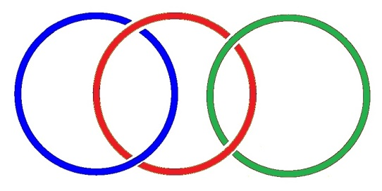
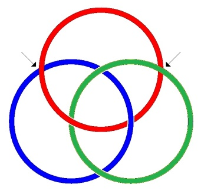
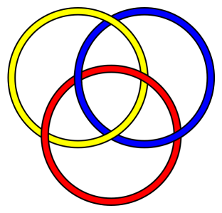
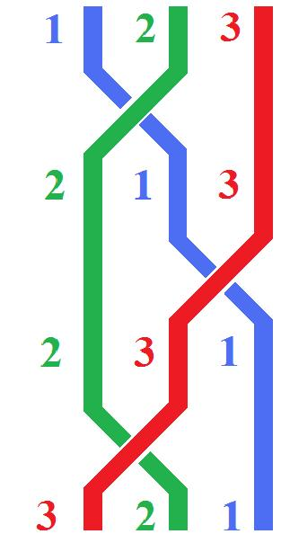

# Leçon 04 | 18 Décembre 1973

  

    <label><input type="checkbox" data-lacan-toggle="original" checked> 原文</label>
    <label><input type="checkbox" data-lacan-toggle="notes" checked> 注释</label>
    <label><input type="checkbox" data-lacan-toggle="commentary" checked> 个人解读评论</label>
  

  <form class="lacan-tool-search" role="search">
    <input class="lacan-tool-search-input" type="search" placeholder="搜索全文" aria-label="搜索全文">
    <button class="lacan-tool-button" type="submit" title="搜索">搜索</button>
  </form>
  <button class="lacan-tool-button lacan-back-to-top" type="button" title="回到页面最上方" aria-label="回到页面最上方">↑</button>

<section class="parallel-paragraph" data-paragraph-ids="s21-04-0001">

s21-04-0001

原文 · s21-04-0001

Il est certain qu’en me faisant vainement éle­ver la voix, là en voulant me taquiner, me chatouiller avant que je commence mon truc d’aujourd’hui, on n’améliorera pas la chose.

[无对应译文]

</section>

<section class="parallel-paragraph" data-paragraph-ids="s21-04-0002">

s21-04-0002

原文 · s21-04-0002

Enfin, on ne l’aura pas améliorée, du moins je suppose. Voilà !

[无对应译文]

</section>

<section class="parallel-paragraph" data-paragraph-ids="s21-04-0003">

s21-04-0003

原文 · s21-04-0003

Parce que tout de même, la dernière fois, j’ai fait un effort, et qu’aujourd’hui j’aurais voulu seulement, enfin, étendre de ces *marges*, si je puis dire, enfin dire des choses *mezzo voce* comme on dit.

[无对应译文]

</section>

<section class="parallel-paragraph" data-paragraph-ids="s21-04-0004">

s21-04-0004

原文 · s21-04-0004

Peut-être pour essayer de vous en éclaircir pour vous - enfin, je dis pour vous-mêmes - la résonance.

[无对应译文]

</section>

<section class="parallel-paragraph" data-paragraph-ids="s21-04-0005">

s21-04-0005

原文 · s21-04-0005

Cette résonance, après tout, je la présume, puisque ce que j’ai dit c’était fait pour l’obtenir.

[无对应译文]

</section>

<section class="parallel-paragraph" data-paragraph-ids="s21-04-0006">

s21-04-0006

原文 · s21-04-0006

J’en ai eu des échos, mais je vois pas pourquoi, aussi bien, je dirais pas ce que j’ai voulu obtenir.

[无对应译文]

</section>

<section class="parallel-paragraph" data-paragraph-ids="s21-04-0007">

s21-04-0007

原文 · s21-04-0007

Mon dit a été celui de ce nœud que j’ai pas introduit d’hier, et dont la portée méritait qu’on y insiste, ça veut dire : ne pouvait pas apparaître tout de suite.

[无对应译文]

</section>

<section class="parallel-paragraph" data-paragraph-ids="s21-04-0008">

s21-04-0008

原文 · s21-04-0008

C’est pas tellement ce nœud qui est important, c’est *son dire.*

[无对应译文]

</section>

<section class="parallel-paragraph" data-paragraph-ids="s21-04-0009">

s21-04-0009

原文 · s21-04-0009

*Son dire* qu’en somme, la dernière fois, j’ai tenté de supporter comme ça, suffisamment.

[无对应译文]

</section>

<section class="parallel-paragraph" data-paragraph-ids="s21-04-0010">

s21-04-0010

原文 · s21-04-0010

Ce qu’il a de bien ce nœud, c’est qu’il met justement tout à fait en évidence que ce *dire*, en tant qu’il est le mien, y est impliqué.

[无对应译文]

</section>

<section class="parallel-paragraph" data-paragraph-ids="s21-04-0011">

s21-04-0011

原文 · s21-04-0011

Ça veut dire que de ce côté par où... remarquez, j’ai pas dit *la parole*, j’ai dit « *le dire »* : toute parole n’est pas un dire, sans quoi toute parole serait un événement, ce qui n’est pas le cas, sans ça on ne parlerait pas de *vaines paroles* !

[无对应译文]

</section>

<section class="parallel-paragraph" data-paragraph-ids="s21-04-0012">

s21-04-0012

原文 · s21-04-0012

*Un dire* est de l’ordre de *l’événement *:

[无对应译文]

</section>

<section class="parallel-paragraph" data-paragraph-ids="s21-04-0013">

s21-04-0013

原文 · s21-04-0013

- c’est pas un événement survo­lant,

[无对应译文]

</section>

<section class="parallel-paragraph" data-paragraph-ids="s21-04-0014">

s21-04-0014

原文 · s21-04-0014

- c’est pas un moment du connaître, pour tout dire,

[无对应译文]

</section>

<section class="parallel-paragraph" data-paragraph-ids="s21-04-0015">

s21-04-0015

原文 · s21-04-0015

- c’est pas de la philosophie.

[无对应译文]

</section>

<section class="parallel-paragraph" data-paragraph-ids="s21-04-0016">

s21-04-0016

原文 · s21-04-0016

C’est quelque chose qui est dans le coup : dans le coup  de ce qui nous détermine en tant que c’est pas tout à fait ce qu’on croit.

[无对应译文]

</section>

<section class="parallel-paragraph" data-paragraph-ids="s21-04-0017">

s21-04-0017

原文 · s21-04-0017

C’est pas toute sorte de conditions locales, de ceci, de cela, de ce après quoi on bâille... du *Réel*, c’est pas ça qui - nous, êtres parlants - nous détermine.

[无对应译文]

</section>

<section class="parallel-paragraph" data-paragraph-ids="s21-04-0018">

s21-04-0018

原文 · s21-04-0018

Et ceci tient très précisément à *ce pédicule de savoir*, court certes, mais toujours parfaitement noué, qui s’appelle notre *inconscient*, en tant que pour chacun de nous, ce nœud a des supports bien particu­liers.

[无对应译文]

</section>

<section class="parallel-paragraph" data-paragraph-ids="s21-04-0019">

s21-04-0019

原文 · s21-04-0019

C’est ainsi que, cahin-caha, comme j’ai pu, j’ai construit cette topologie, par où j’ose cliver autrement ce que Freud supportait de ces termes : « *la réalité psychique ».*

[无对应译文]

</section>

<section class="parallel-paragraph" data-paragraph-ids="s21-04-0020">

s21-04-0020

原文 · s21-04-0020

Car enfin ma topologie n’est pas la même.

[无对应译文]

</section>

<section class="parallel-paragraph" data-paragraph-ids="s21-04-0021">

s21-04-0021

原文 · s21-04-0021

Quelqu’un, parmi les gens qui viennent avec moi causer, a mis mon nœud borroméen au même stade, si je puis dire, que le fameux œuf foutu de quelque chose qui...

[无对应译文]

</section>

<section class="parallel-paragraph" data-paragraph-ids="s21-04-0022">

s21-04-0022

原文 · s21-04-0022

vous savez que c’est Freud qui a fait ça ...évidemment on pourrait faire la métaphore de la réserve nutritive avec ce qu’elle est censée nourrir :

[无对应译文]

</section>

<section class="parallel-paragraph" data-paragraph-ids="s21-04-0023">

s21-04-0023

原文 · s21-04-0023

- avec *la jouissance* d’une part,

[无对应译文]

</section>

<section class="parallel-paragraph" data-paragraph-ids="s21-04-0024">

s21-04-0024

原文 · s21-04-0024

- et ce que vous voudrez de l’autre : *l’embryologie de l’âme*...

[无对应译文]

</section>

<section class="parallel-paragraph" data-paragraph-ids="s21-04-0025">

s21-04-0025

原文 · s21-04-0025

Je voudrais faire une remarque concernant ce qu’on appelle *l’amour*.

[无对应译文]

</section>

<section class="parallel-paragraph" data-paragraph-ids="s21-04-0026">

s21-04-0026

原文 · s21-04-0026

Parce que c’est ça ce que j’ai appelé tout à l’heure *la résonance*...

[无对应译文]

</section>

<section class="parallel-paragraph" data-paragraph-ids="s21-04-0027">

s21-04-0027

原文 · s21-04-0027

> *la résonance* chez vous, que vous le sachiez ou pas ...de ce que la derniè­re fois j’ai supporté de mon nœud borroméen, de mon dire.

[无对应译文]

</section>

<section class="parallel-paragraph" data-paragraph-ids="s21-04-0028">

s21-04-0028

原文 · s21-04-0028

L’*amour*...

[无对应译文]

</section>

<section class="parallel-paragraph" data-paragraph-ids="s21-04-0029">

s21-04-0029

原文 · s21-04-0029

dans tout ce qu’on s’est permis de *bavocher* dessus jusqu’à présent ...c’est tout de même quelque chose qui se heurte à l’ob­jection qu’on ne conçoit pas comment l’*être*...

[无对应译文]

</section>

<section class="parallel-paragraph" data-paragraph-ids="s21-04-0030">

s21-04-0030

原文 · s21-04-0030

si bien entendu vous avez de ça déjà entendu parler, enfin, on vous en rebat les oreilles dans la métaphysique et même ailleurs, enfin, dans les sermons, on ne parle que de ça ...comment l’ *être* serait à manipuler à partir d’aucun *étant*.

[无对应译文]

</section>

<section class="parallel-paragraph" data-paragraph-ids="s21-04-0031">

s21-04-0031

原文 · s21-04-0031

Ceci présente une grande difficulté logique, puisque l’être quand on vous en parle, ce n’est pas rien, et ça débouche dans cette aspiration, qui serait faite à partir de Dieu, de *l’amour*.

[无对应译文]

</section>

<section class="parallel-paragraph" data-paragraph-ids="s21-04-0032">

s21-04-0032

原文 · s21-04-0032

Je sais bien que vous n’êtes pas croyants, n’est-ce pas ?

[无对应译文]

</section>

<section class="parallel-paragraph" data-paragraph-ids="s21-04-0033">

s21-04-0033

原文 · s21-04-0033

Mais vous êtes encore plus cons...

[无对应译文]

</section>

<section class="parallel-paragraph" data-paragraph-ids="s21-04-0034">

s21-04-0034

原文 · s21-04-0034

> comme j’ai déjà eu l’occasion de vous le dire la dernière fois ...parce que, même si vous n’êtes pas croyants, à cette aspiration...

[无对应译文]

</section>

<section class="parallel-paragraph" data-paragraph-ids="s21-04-0035">

s21-04-0035

原文 · s21-04-0035

> je vous le montrerai tout, au cours de ce que je vais vous dire aujourd’hui ...à cette aspiration vous y croyez. Je ne dirai pas que vous la supposez : elle vous suppose.

[无对应译文]

</section>

<section class="parallel-paragraph" data-paragraph-ids="s21-04-0036">

s21-04-0036

原文 · s21-04-0036

On essaie, en somme, de vider tout ça - ou de le remplir, qu’impor­te - en le schématisant dans la vieille métaphore du *connaître*. On connaît à qui on a affaire... celui avec qui on a affaire, *on le connaît* dans l’amour.

[无对应译文]

</section>

<section class="parallel-paragraph" data-paragraph-ids="s21-04-0037">

s21-04-0037

原文 · s21-04-0037

Seulement, j’objecte : qu’est-ce que c’est que l’être, sinon l’af­faire aseptisée des perfections imaginaires dont on rêve, dont vous-même - je viens de vous le dire : quoi que vous en sachiez - vous rêvez, vous en rêvez l’échelle.

[无对应译文]

</section>

<section class="parallel-paragraph" data-paragraph-ids="s21-04-0038">

s21-04-0038

原文 · s21-04-0038

L’échelle dont le dernier échelon sera, ou non, ce Dieu dont j’ai parlé tout à l’heure, mais si c’est pas celui-là, c’est un autre.

[无对应译文]

</section>

<section class="parallel-paragraph" data-paragraph-ids="s21-04-0039">

s21-04-0039

原文 · s21-04-0039

C’est ce qu’on appelle « *rêve éveillé »*.

[无对应译文]

</section>

<section class="parallel-paragraph" data-paragraph-ids="s21-04-0040">

s21-04-0040

原文 · s21-04-0040

Seulement ce que démontre juste­ment l’étude du rêve, du vrai, de celui qu’on fait quand on dort et qui vous sonne les cloches, ça n’a - quoi qu’on en dise - absolument rien à faire avec votre rêve, éveillé ou pas.

[无对应译文]

</section>

<section class="parallel-paragraph" data-paragraph-ids="s21-04-0041">

s21-04-0041

原文 · s21-04-0041

C’est même ce qui vous distingue comme êtres parlants : *qu’il y a un savoir* que vous entendez dans le rêve, qui n’a rien à faire avec ce qui vous en reste quand vous êtes prétendument vigiles.

[无对应译文]

</section>

<section class="parallel-paragraph" data-paragraph-ids="s21-04-0042">

s21-04-0042

原文 · s21-04-0042

C’est bien pour ça qu’il est si important, ce rêve...

[无对应译文]

</section>

<section class="parallel-paragraph" data-paragraph-ids="s21-04-0043">

s21-04-0043

原文 · s21-04-0043

ce rêve que vous ne faites que dans certain temps ...de le déchiffrer.

[无对应译文]

</section>

<section class="parallel-paragraph" data-paragraph-ids="s21-04-0044">

s21-04-0044

原文 · s21-04-0044

Jusque-là vous n’en êtes - ça a duré un temps - mais vous n’en êtes pas tou­jours si loin, croyez-le bien,

[无对应译文]

</section>

<section class="parallel-paragraph" data-paragraph-ids="s21-04-0045">

s21-04-0045

原文 · s21-04-0045

- du temps de la *signatura rerum,*

<!-- -->

[无对应译文]

</section>

<section class="parallel-paragraph" data-paragraph-ids="s21-04-0046">

s21-04-0046

原文 · s21-04-0046

- de la lectu­re du rêve éveillé,

[无对应译文]

</section>

<section class="parallel-paragraph" data-paragraph-ids="s21-04-0047">

s21-04-0047

原文 · s21-04-0047

- de la lisibilité du monde, croyez pas du tout que, parce que c’est plus les curés qui vous la dictent, que vous n’en soyez pas au même point !

[无对应译文]

</section>

<section class="parallel-paragraph" data-paragraph-ids="s21-04-0048">

s21-04-0048

原文 · s21-04-0048

*L’amour*, s’il est bien là la métaphore de quelque chose, il s’agit de savoir à quoi il se réfère.

[无对应译文]

</section>

<section class="parallel-paragraph" data-paragraph-ids="s21-04-0049">

s21-04-0049

原文 · s21-04-0049

Il faut partir de ce que j’ai dit tout à l’heure, *de l’événement*.

[无对应译文]

</section>

<section class="parallel-paragraph" data-paragraph-ids="s21-04-0050">

s21-04-0050

原文 · s21-04-0050

Il se réfère, rien de plus...

[无对应译文]

</section>

<section class="parallel-paragraph" data-paragraph-ids="s21-04-0051">

s21-04-0051

原文 · s21-04-0051

> en tout cas c’est à ça que je me limiterai aujourd’hui,
>
> simplement pour décaler ce que je viens de tracer, de la tradition, de la métaphore du « *connaître »* ...disons qu’il se réfère d’abord à l’*événement*, à ces choses qui arrivent, disons quand un homme rencontre une femme.

[无对应译文]

</section>

<section class="parallel-paragraph" data-paragraph-ids="s21-04-0052">

s21-04-0052

原文 · s21-04-0052

Et pourquoi pas ? Parce que c’est en général le poisson qu’on tente de noyer.

[无对应译文]

</section>

<section class="parallel-paragraph" data-paragraph-ids="s21-04-0053">

s21-04-0053

原文 · s21-04-0053

Quand je dis « *quand un homme rencontre une femme* », c’est parce que je suis modeste, je veux dire par là que je ne prétends pas aller jusqu’à parler de ce qui arrive *quand une femme rencontre un homme*...

[无对应译文]

</section>

<section class="parallel-paragraph" data-paragraph-ids="s21-04-0054">

s21-04-0054

原文 · s21-04-0054

parce que mon expérience est limitée.

[无对应译文]

</section>

<section class="parallel-paragraph" data-paragraph-ids="s21-04-0055">

s21-04-0055

原文 · s21-04-0055

Je voudrais vous suggérer ceci...

[无对应译文]

</section>

<section class="parallel-paragraph" data-paragraph-ids="s21-04-0056">

s21-04-0056

原文 · s21-04-0056

> puisque nous sommes partis de deux points extrêmes ...je vous propose, à propos du commandement de *l’amour divin*...

[无对应译文]

</section>

<section class="parallel-paragraph" data-paragraph-ids="s21-04-0057">

s21-04-0057

原文 · s21-04-0057

> que je vous ai évoqué la dernière fois en vous interpellant pour vous dire : « *oui ou non, ça fait* **2** *ou* **3** ? »,
>
> vous vous en souvenez peut-être, enfin, ceux qui étaient là ...alors je le modifie légè­rement : quel effet ça vous fait si je l’énonce « *tu aimeras ta prochaine comme toi-même* » ?

[无对应译文]

</section>

<section class="parallel-paragraph" data-paragraph-ids="s21-04-0058">

s21-04-0058

原文 · s21-04-0058

Ça fait tout de même sentir quelque chose, c’est *que ce précepte fonde l’abolition de la différence des sexes*.

[无对应译文]

</section>

<section class="parallel-paragraph" data-paragraph-ids="s21-04-0059">

s21-04-0059

原文 · s21-04-0059

Quand je vous dis *qu’il n’y a pas de rapport sexuel*, j’ai pas dit que les sexes se confondent, bien loin de là !

[无对应译文]

</section>

<section class="parallel-paragraph" data-paragraph-ids="s21-04-0060">

s21-04-0060

原文 · s21-04-0060

Sans ça - quand même ! - comment même pourrais-je dire *qu’il n’y a pas de rapport sexuel*, qu’est-ce que ça vou­drait dire ?

[无对应译文]

</section>

<section class="parallel-paragraph" data-paragraph-ids="s21-04-0061">

s21-04-0061

原文 · s21-04-0061

C’est important à situer. Vous ne l’avez sûrement pas encore fait !

[无对应译文]

</section>

<section class="parallel-paragraph" data-paragraph-ids="s21-04-0062">

s21-04-0062

原文 · s21-04-0062

Comme ça, pour le situer d’une façon exacte, je fais une petite remarque, puisque aujourd’hui je me commente : *il n’y a pas de rapport sexuel*, c’est du même ordre que ce que j’ai conclu de ma 2ème conférence, *celle qui n’a pas été tellement* *comprise*.

[无对应译文]

</section>

<section class="parallel-paragraph" data-paragraph-ids="s21-04-0063">

s21-04-0063

原文 · s21-04-0063

J’ai beaucoup parlé de l’*occulte*...

[无对应译文]

</section>

<section class="parallel-paragraph" data-paragraph-ids="s21-04-0064">

s21-04-0064

原文 · s21-04-0064

> et croyez le bien, je me mets à la même place ...j’ai beaucoup parlé de l’*occulte* mais le point important...

[无对应译文]

</section>

<section class="parallel-paragraph" data-paragraph-ids="s21-04-0065">

s21-04-0065

原文 · s21-04-0065

> il y en a eu un ou deux à le remarquer ...c’est que j’ai dit qu’il n’y a pas d’*initiation*.

[无对应译文]

</section>

<section class="parallel-paragraph" data-paragraph-ids="s21-04-0066">

s21-04-0066

原文 · s21-04-0066

C’est la même chose que de dire : « *il n’y a pas de rapport sexuel »*. Ce qui ne veut pas dire que l’ *initiation*, ça soit le rapport sexuel, parce qu’il ne suffit pas que deux choses n’existent pas pour qu’elles soient les mêmes ! Ouais...

[无对应译文]

</section>

<section class="parallel-paragraph" data-paragraph-ids="s21-04-0067">

s21-04-0067

原文 · s21-04-0067

*Il est clair que l’amour*, en somme...

[无对应译文]

</section>

<section class="parallel-paragraph" data-paragraph-ids="s21-04-0068">

s21-04-0068

原文 · s21-04-0068

> c’est là le problème dont retentit ce que j’ai dit la dernière fois ...*c’est tout* de même un fait, qu’on appelle *le rapport complexe* - c’est le moins qu’on puisse dire - *d’un homme et d’une femme*.

[无对应译文]

</section>

<section class="parallel-paragraph" data-paragraph-ids="s21-04-0069">

s21-04-0069

原文 · s21-04-0069

Alors là, peut-être que je peux raccrocher ceci, qui est au cœur de mon titre, sur lequel j’avais avancé un 1er linéament dans mon 1er séminaire : est-ce que le rapport...

[无对应译文]

</section>

<section class="parallel-paragraph" data-paragraph-ids="s21-04-0070">

s21-04-0070

原文 · s21-04-0070

> dit « complexe » à juste titre ...d’un homme et d’une femme, on va le mettre au compte simple­ment *d’avoir fait ensemble* ce que j’ai appelé, je le remarque,

[无对应译文]

</section>

<section class="parallel-paragraph" data-paragraph-ids="s21-04-0071">

s21-04-0071

原文 · s21-04-0071

- non pas « *erreur »*, mais « *errance »*,

[无对应译文]

</section>

<section class="parallel-paragraph" data-paragraph-ids="s21-04-0072">

s21-04-0072

原文 · s21-04-0072

- *viator* ai-je articulé, *le voyage* sur cette terre, la catégorie - comiquement - qui justement nous exclut du monde, ...est-ce que l’amour c’est ça : d’avoir fait un bout du chemin ensemble ?

[无对应译文]

</section>

<section class="parallel-paragraph" data-paragraph-ids="s21-04-0073">

s21-04-0073

原文 · s21-04-0073

Vous voyez où ça va :

[无对应译文]

</section>

<section class="parallel-paragraph" data-paragraph-ids="s21-04-0074">

s21-04-0074

原文 · s21-04-0074

- on se sera entraidés...

[无对应译文]

</section>

<section class="parallel-paragraph" data-paragraph-ids="s21-04-0075">

s21-04-0075

原文 · s21-04-0075

- Il y aurait toujours, à l’horizon cette *promesse*...

[无对应译文]

</section>

<section class="parallel-paragraph" data-paragraph-ids="s21-04-0076">

s21-04-0076

原文 · s21-04-0076

Et puis c’est vrai qu’il y a du vrai là-dedans.

[无对应译文]

</section>

<section class="parallel-paragraph" data-paragraph-ids="s21-04-0077">

s21-04-0077

原文 · s21-04-0077

Quand on est un bonhomme et une bonne femme...

[无对应译文]

</section>

<section class="parallel-paragraph" data-paragraph-ids="s21-04-0078">

s21-04-0078

原文 · s21-04-0078

> comme ils disaient autrefois les existentialistes - je parle de la *bonne femme*,
>
> il ne leur venait pas à l’idée de parler du *bonhomme*, Dieu sait pourquoi, c’est pourtant le meilleur ...un bonhomme et une bonne femme qui auraient fait un bout de chemin ensemble, il y aurait, à l’horizon de l’amour, le grand-père et la grand-mère.

[无对应译文]

</section>

<section class="parallel-paragraph" data-paragraph-ids="s21-04-0079">

s21-04-0079

原文 · s21-04-0079

Il y a ça dans l’inconscient, il y a ça aussi.

[无对应译文]

</section>

<section class="parallel-paragraph" data-paragraph-ids="s21-04-0080">

s21-04-0080

原文 · s21-04-0080

Je voudrais quand même suggérer que c’est peut-être pas tout.

[无对应译文]

</section>

<section class="parallel-paragraph" data-paragraph-ids="s21-04-0081">

s21-04-0081

原文 · s21-04-0081

La question que je pose : « *par quelle voie aime-t-on une femme* ? ».

[无对应译文]

</section>

<section class="parallel-paragraph" data-paragraph-ids="s21-04-0082">

s21-04-0082

原文 · s21-04-0082

Si je pose la question...

[无对应译文]

</section>

<section class="parallel-paragraph" data-paragraph-ids="s21-04-0083">

s21-04-0083

原文 · s21-04-0083

> ça c’est un « bateau » lacanien ...c’est sans doute que j’ai la répon­se. Mais il y en a beaucoup, il n’y a même pas une question qui ait plus de réponses.

[无对应译文]

</section>

<section class="parallel-paragraph" data-paragraph-ids="s21-04-0084">

s21-04-0084

原文 · s21-04-0084

Naturellement vous n’en savez aucune, parce que vous vous laissez mener par le truc, par le tourbillon.

[无对应译文]

</section>

<section class="parallel-paragraph" data-paragraph-ids="s21-04-0085">

s21-04-0085

原文 · s21-04-0085

Si on a d’abord les réponses, la première chose à faire c’est de les compter, hein ?

[无对应译文]

</section>

<section class="parallel-paragraph" data-paragraph-ids="s21-04-0086">

s21-04-0086

原文 · s21-04-0086

Et il y en a une que je trouve très bonne : « *Comment un homme aime-t-il une femme* ? » : *par hasard !*

[无对应译文]

</section>

<section class="parallel-paragraph" data-paragraph-ids="s21-04-0087">

s21-04-0087

原文 · s21-04-0087

Ouais, celle-là, je vous l’ai déjà donnée, c’est l’« *heur* » dont je parle comme ça depuis... depuis pas tellement de temps, quand je dis que le « bon*heur* » : que ça ruisselle, qu’il y en a partout, que vous connaissez que ça, même !

[无对应译文]

</section>

<section class="parallel-paragraph" data-paragraph-ids="s21-04-0088">

s21-04-0088

原文 · s21-04-0088

*X dans la salle – Je pense bien !*

[无对应译文]

</section>

<section class="parallel-paragraph" data-paragraph-ids="s21-04-0089">

s21-04-0089

原文 · s21-04-0089

Il s’agirait seulement d’en avoir un petit peu plus le sentiment, que vous êtes livrés à ce « bon*heur* ».

[无对应译文]

</section>

<section class="parallel-paragraph" data-paragraph-ids="s21-04-0090">

s21-04-0090

原文 · s21-04-0090

Parce qu’enfin, il faut bien le dire...

[无对应译文]

</section>

<section class="parallel-paragraph" data-paragraph-ids="s21-04-0091">

s21-04-0091

原文 · s21-04-0091

> pour prendre ma référence de tout à l’heure ...les circonstances ne sont pas tou­jours à l’entraide, quand il arrive que se produise, entre un homme et une femme, l’*amour*.

[无对应译文]

</section>

<section class="parallel-paragraph" data-paragraph-ids="s21-04-0092">

s21-04-0092

原文 · s21-04-0092

Et puis, puisque j’ai entendu tout à l’heure une petite voix, là-bas, qui poussait sa chansonnette, \[*référence à X dans la salle*\] là, je voudrais tout de même faire remarquer, en marge, que « *le compagnon de route »*, ça devrait éveiller plus d’échos que vous ne croyez dans vos chères petites âmes, ça fait partie d’une certain vocabulaire, le vocabulaire du coin où on parle de « *l’imagination au pouvoir* ».

[无对应译文]

</section>

<section class="parallel-paragraph" data-paragraph-ids="s21-04-0093">

s21-04-0093

原文 · s21-04-0093

Je dois vous le dire, le gauchisme, ça me paraît tout ce qu’il y a de plus traditionnel.

[无对应译文]

</section>

<section class="parallel-paragraph" data-paragraph-ids="s21-04-0094">

s21-04-0094

原文 · s21-04-0094

Et la métaphore du « *compagnon de route »*, ça ne me paraît pas suffire, si ce n’est dans le registre précisément chrétien du *viator.*

[无对应译文]

</section>

<section class="parallel-paragraph" data-paragraph-ids="s21-04-0095">

s21-04-0095

原文 · s21-04-0095

Pour « *l’imagination au pouvoir* », c’est pas moi qui le leur fais dire !

[无对应译文]

</section>

<section class="parallel-paragraph" data-paragraph-ids="s21-04-0096">

s21-04-0096

原文 · s21-04-0096

Pas plus d’ailleurs que je ne fais dire quoi que ce soit à personne.

[无对应译文]

</section>

<section class="parallel-paragraph" data-paragraph-ids="s21-04-0097">

s21-04-0097

原文 · s21-04-0097

Ma fonction c’est plutôt d’*écouter*.

[无对应译文]

</section>

<section class="parallel-paragraph" data-paragraph-ids="s21-04-0098">

s21-04-0098

原文 · s21-04-0098

Naturellement, enfin ici je relance, mais c’est plutôt parce que ce que j’écoute me sort par les oreilles !

[无对应译文]

</section>

<section class="parallel-paragraph" data-paragraph-ids="s21-04-0099">

s21-04-0099

原文 · s21-04-0099

Bon... Qu’est-ce que je fais maintenant, hein ?

[无对应译文]

</section>

<section class="parallel-paragraph" data-paragraph-ids="s21-04-0100">

s21-04-0100

原文 · s21-04-0100

Je vous donne un *flash*, comme ça, d’une autre réponse.

[无对应译文]

</section>

<section class="parallel-paragraph" data-paragraph-ids="s21-04-0101">

s21-04-0101

原文 · s21-04-0101

D’une autre réponse qui est celle qui motive ma question.

[无对应译文]

</section>

<section class="parallel-paragraph" data-paragraph-ids="s21-04-0102">

s21-04-0102

原文 · s21-04-0102

Il est évident que je peux y regarder à deux fois.

[无对应译文]

</section>

<section class="parallel-paragraph" data-paragraph-ids="s21-04-0103">

s21-04-0103

原文 · s21-04-0103

Parce que si le *dire* est un *événement*, Dieu sait ce que ça peut avoir comme conséquences !

[无对应译文]

</section>

<section class="parallel-paragraph" data-paragraph-ids="s21-04-0104">

s21-04-0104

原文 · s21-04-0104

Bah, je vais quand même vous la donner :

[无对应译文]

</section>

<section class="parallel-paragraph" data-paragraph-ids="s21-04-0105">

s21-04-0105

原文 · s21-04-0105

- *l’amour ce n’est rien de plus qu’un dire*, en tant qu’*événement* : *un dire sans bavures*

[无对应译文]

</section>

<section class="parallel-paragraph" data-paragraph-ids="s21-04-0106">

s21-04-0106

原文 · s21-04-0106

- *qu’il n’a, l’amour, rien à faire avec la vérité *: c’est beaucoup dire, puisque tout de même ce qu’il démontre c’est qu’*elle ne peut pas se dire toute*.

[无对应译文]

</section>

<section class="parallel-paragraph" data-paragraph-ids="s21-04-0107">

s21-04-0107

原文 · s21-04-0107

Ce *dire*, *ce dire de l’amour s’adresse au savoir* en tant qu’il est là, dans ce qu’il faut bien appeler l’*inconscient*.

[无对应译文]

</section>

<section class="parallel-paragraph" data-paragraph-ids="s21-04-0108">

s21-04-0108

原文 · s21-04-0108

Disons dans ce *nœud d’être*, si vous voulez, mais dans un tout autre sens que ce qui d’abord partait de la confusion, ce *nœud*, j’ai dit...

[无对应译文]

</section>

<section class="parallel-paragraph" data-paragraph-ids="s21-04-0109">

s21-04-0109

原文 · s21-04-0109

c’est le mot « *nœud »* qui est important ...c’est pas l’être, l’être de ce nœud, que j’ai dessiné la dernière fois, et que ne motive que l’inconscient.

[无对应译文]

</section>

<section class="parallel-paragraph" data-paragraph-ids="s21-04-0110">

s21-04-0110

原文 · s21-04-0110

Ça implique donc - tout y compris - justement ce *dire* de la dernière fois, en tant que s’y rend compte de *la place de ce savoir*.

[无对应译文]

</section>

<section class="parallel-paragraph" data-paragraph-ids="s21-04-0111">

s21-04-0111

原文 · s21-04-0111

Ce qui constitue *ce dire n’est pas la connaissance*, il n’est... d’aucune façon - ce nœud - il n’est *une connais­sance* de *quoi que ce soit*.

[无对应译文]

</section>

<section class="parallel-paragraph" data-paragraph-ids="s21-04-0112">

s21-04-0112

原文 · s21-04-0112

Il implique mon *dire* comme *événement* dans ce qu’il est, avec ses trois faces :

[无对应译文]

</section>

<section class="parallel-paragraph" data-paragraph-ids="s21-04-0113">

s21-04-0113

原文 · s21-04-0113

- que c’est *imaginable,* puisque j’en ai fait image effective,

[无对应译文]

</section>

<section class="parallel-paragraph" data-paragraph-ids="s21-04-0114">

s21-04-0114

原文 · s21-04-0114

- que c’est *symbolique,* puisque je peux le définir comme nœud,

[无对应译文]

</section>

<section class="parallel-paragraph" data-paragraph-ids="s21-04-0115">

s21-04-0115

原文 · s21-04-0115

- que c’est tout à fait *réel,* de *l’événement* même de ce *dire*,

[无对应译文]

</section>

<section class="parallel-paragraph" data-paragraph-ids="s21-04-0116">

s21-04-0116

原文 · s21-04-0116

> lequel événement consiste à ce que, quoi qu’il en soit, chacun de vous peut lui donner du sens qu’il a.

[无对应译文]

</section>

<section class="parallel-paragraph" data-paragraph-ids="s21-04-0117">

s21-04-0117

原文 · s21-04-0117

Et c’est en quoi, comme toujours, je vous supplie de ne pas le com­prendre trop vite.

[无对应译文]

</section>

<section class="parallel-paragraph" data-paragraph-ids="s21-04-0118">

s21-04-0118

原文 · s21-04-0118

Parce qu’évidemment il faut que je pare - comme on dit - à toute sorte de précipitation.

[无对应译文]

</section>

<section class="parallel-paragraph" data-paragraph-ids="s21-04-0119">

s21-04-0119

原文 · s21-04-0119

C’est ce qui fait, à l’occasion, ma len­teur.

[无对应译文]

</section>

<section class="parallel-paragraph" data-paragraph-ids="s21-04-0120">

s21-04-0120

原文 · s21-04-0120

Je suis ici le « *Maître Jacques* » de ce qu’il faille parer à toutes les inter­prétations précipitées.

[无对应译文]

</section>

<section class="parallel-paragraph" data-paragraph-ids="s21-04-0121">

s21-04-0121

原文 · s21-04-0121

C’est rien qu’en ça que constitue ce qu’il peut - dans ce *dire* - y avoir d’*exploit*.

[无对应译文]

</section>

<section class="parallel-paragraph" data-paragraph-ids="s21-04-0122">

s21-04-0122

原文 · s21-04-0122

C’est pour ça qu’il faut que je tranche, et ça veut dire que j’abrège.

[无对应译文]

</section>

<section class="parallel-paragraph" data-paragraph-ids="s21-04-0123">

s21-04-0123

原文 · s21-04-0123

La portée de ce nœud borroméen, c’est que c’est *de chacun* des 3 ronds de ficelle, que sa rupture d’ensemble s’ensuit.

[无对应译文]

</section>

<section class="parallel-paragraph" data-paragraph-ids="s21-04-0124">

s21-04-0124

原文 · s21-04-0124

Alors que dans une chaîne simple, je vais vous la mettre au tableau.

[无对应译文]

</section>

<section class="parallel-paragraph" data-paragraph-ids="s21-04-0125">

s21-04-0125

原文 · s21-04-0125

*Dessinez Gloria - je vous en prie - une chaîne, une chaîne avec 3 ronds simplement, et faites-le correctement, hein ?*

[无对应译文]

</section>

<section class="parallel-paragraph" data-paragraph-ids="s21-04-0126">

s21-04-0126

原文 · s21-04-0126

*Bon, comme ça... Oui alors là il faut que vous vous arrêtiez comme ça, après ça...*

[无对应译文]

</section>

<section class="parallel-paragraph" data-paragraph-ids="s21-04-0127">

s21-04-0127

原文 · s21-04-0127

*et là aussi que vous vous arrêtiez pour faire comme ça.*

[无对应译文]

</section>

<section class="parallel-paragraph" data-paragraph-ids="s21-04-0128">

s21-04-0128

原文 · s21-04-0128

[无对应译文]

</section>

<section class="parallel-paragraph" data-paragraph-ids="s21-04-0129">

s21-04-0129

原文 · s21-04-0129

> *nœud olympique ouvert*

[无对应译文]

</section>

<section class="parallel-paragraph" data-paragraph-ids="s21-04-0130">

s21-04-0130

原文 · s21-04-0130

Une chaîne simple de 3 : ce n’est que du rond du milieu que vous pouvez rompre les extrêmes.

[无对应译文]

</section>

<section class="parallel-paragraph" data-paragraph-ids="s21-04-0131">

s21-04-0131

原文 · s21-04-0131

Sans ça, si vous prenez d’abord un des deux extrêmes, les deux autres restent noués.

[无对应译文]

</section>

<section class="parallel-paragraph" data-paragraph-ids="s21-04-0132">

s21-04-0132

原文 · s21-04-0132

 

[无对应译文]

</section>

<section class="parallel-paragraph" data-paragraph-ids="s21-04-0133">

s21-04-0133

原文 · s21-04-0133

> *nœud borroméen nœud olympique*

[无对应译文]

</section>

<section class="parallel-paragraph" data-paragraph-ids="s21-04-0134">

s21-04-0134

原文 · s21-04-0134

C’est justement en ça que consiste la différence du *nœud borroméen* avec le *nœud olympique*, c’est que dans le *nœud olympique*, aussi paradoxal que ça paraisse, cette fois c’est d’enlever un quelconque des trois, que les deux autres restent noués. Mais c’est seulement symétrique de ce qui se passe dans celui-ci pour le rond du milieu.

[无对应译文]

</section>

<section class="parallel-paragraph" data-paragraph-ids="s21-04-0135">

s21-04-0135

原文 · s21-04-0135

La consistance de tout ça, certes, n’est qu’*imaginaire,* sinon que nous la redoublons du *Symbolique*, seulement à l’imaginer en tant que nœud, et qu’est-ce que c’est, l’imaginer d’une part... mais le formuler en tant que nœud : ça nous pousse vers les formules mathématiques.

[无对应译文]

</section>

<section class="parallel-paragraph" data-paragraph-ids="s21-04-0136">

s21-04-0136

原文 · s21-04-0136

Celles de ce qui est seulement à peine ébauché, à savoir *la théorie des nœuds*, à ceci près que tout de même ceci est bien le représentant du langage, et que *lalangue* - écrite comme je le fais - le reflète dans sa formation même.

[无对应译文]

</section>

<section class="parallel-paragraph" data-paragraph-ids="s21-04-0137">

s21-04-0137

原文 · s21-04-0137

Que plus - pour tout dire - nous nous enfonçons à en *parler*, plus nous confir­mons ce qui va de soi, que nous sommes aussi bien dans le *Symbolique*, et après quoi comment ne pas admettre le *Réel*, réel du fait que dans cette affaire nous y mettons *notre peau*.

[无对应译文]

</section>

<section class="parallel-paragraph" data-paragraph-ids="s21-04-0138">

s21-04-0138

原文 · s21-04-0138

C’est-à-dire ce qu’il peut y avoir de plus efficace - et aussi loin qu’on aille - de *notre présence réelle*.

[无对应译文]

</section>

<section class="parallel-paragraph" data-paragraph-ids="s21-04-0139">

s21-04-0139

原文 · s21-04-0139

Cette « *présence réelle* » disons, rien de plus, enfin qu’après tout il n’y a pas besoin du « *hasch »* pour vous la révéler par sa transformation en une substance légère.

[无对应译文]

</section>

<section class="parallel-paragraph" data-paragraph-ids="s21-04-0140">

s21-04-0140

原文 · s21-04-0140

Nous y sommes assez, dans cette affaire, pour qu’on puisse dire que l’important de ce qui là fait nœud, c’est que ces ronds de ficelle, c’est : *ce qui fait consistance*...

[无对应译文]

</section>

<section class="parallel-paragraph" data-paragraph-ids="s21-04-0141">

s21-04-0141

原文 · s21-04-0141

> dans chacun de ces termes que je distingue de trois catégories ...ce qui fait consistance est strictement équivalent.

[无对应译文]

</section>

<section class="parallel-paragraph" data-paragraph-ids="s21-04-0142">

s21-04-0142

原文 · s21-04-0142

Puisque... - *donnez-moi mes petits ustensiles* \[*Lacan s’adresse à Gloria*\] je vais vous faire un cadeau, là pen­dant que j’y suis !

[无对应译文]

</section>

<section class="parallel-paragraph" data-paragraph-ids="s21-04-0143">

s21-04-0143

原文 · s21-04-0143

\[*Lacan lance les ronds de ficelle dans l’assemblée*\]

[无对应译文]

</section>

<section class="parallel-paragraph" data-paragraph-ids="s21-04-0144">

s21-04-0144

原文 · s21-04-0144

Si je dis que...

[无对应译文]

</section>

<section class="parallel-paragraph" data-paragraph-ids="s21-04-0145">

s21-04-0145

原文 · s21-04-0145

> comme je vous l’ai montré la dernière fois, non sans qu’on me l’a fait remarquer : quelqu’un qui a bien voulu m’écrire une petite note sur ces sujets qui démontrait que la personne n’y avait pas compris grand-chose, mais qui quand même m’a fait remarquer incidemment, que ce n’était pas sans maladresse que je vous avais mani­pulé ces ustensiles, ...si c’est vrai ce que je dis, à savoir que le nœud borroméen a cette curieuse propriété : qu’on peut dans cette construction mettre chacun à la même place strictement que n’importe lequel des deux autres... quoique ça ne saute pas aux yeux tout de suite, d’abord ...eh bien, si chacun peut dans cette fonction être qualifié pour sa consistance, de strictement équivalent, qu’il soit considéré comme *Réel* ou comme *Imaginaire* ou comme *Symbolique*, alors avec ce rond, qui consiste justement en un nœud borroméen, je peux faire un nœud borroméen, en simplement, si j’avais le temps, enchaîner ces trois nœuds borroméens.

[无对应译文]

</section>

<section class="parallel-paragraph" data-paragraph-ids="s21-04-0146">

s21-04-0146

原文 · s21-04-0146

Je voudrais quand même que vous les regardiez d’un petit peu de près, comme ça, que vous en foutiez quelque chose.

[无对应译文]

</section>

<section class="parallel-paragraph" data-paragraph-ids="s21-04-0147">

s21-04-0147

原文 · s21-04-0147

Ce qui est important, à savoir qu’ils soient distincts, ça n’a justement d’importance qu’ils soient distincts qu’en tant qu’il faut qu’ils fassent 3.

[无对应译文]

</section>

<section class="parallel-paragraph" data-paragraph-ids="s21-04-0148">

s21-04-0148

原文 · s21-04-0148

Ils consistent d’abord et avant tout dans leur *différence*.

[无对应译文]

</section>

<section class="parallel-paragraph" data-paragraph-ids="s21-04-0149">

s21-04-0149

原文 · s21-04-0149

Comme ça, si une mouche me piquait, je vous écrirais quelque chose au tableau auquel j’ai pas tellement envie, vu mon humeur d’au­jourd’hui, de donner un statut spécial, à savoir de vous mettre ça dans une signifiance qui soit plus qu’ébauchée.

[无对应译文]

</section>

<section class="parallel-paragraph" data-paragraph-ids="s21-04-0150">

s21-04-0150

原文 · s21-04-0150

Voilà : **2**

[无对应译文]

</section>

<section class="parallel-paragraph" data-paragraph-ids="s21-04-0151">

s21-04-0151

原文 · s21-04-0151

Je ne vais pas mettre autour quelque chose qui l’isole, comme ça, qui l’aseptise par précaution, je le mets tout cru : **2**

[无对应译文]

</section>

<section class="parallel-paragraph" data-paragraph-ids="s21-04-0152">

s21-04-0152

原文 · s21-04-0152

Chiffre de l’amour, hein ?

[无对应译文]

</section>

<section class="parallel-paragraph" data-paragraph-ids="s21-04-0153">

s21-04-0153

原文 · s21-04-0153

« *Ils sont hors deux* » - je vous l’ai dit, c’est *lalangue*, enfin, qui exprime la *mathématique*, hein ?

[无对应译文]

</section>

<section class="parallel-paragraph" data-paragraph-ids="s21-04-0154">

s21-04-0154

原文 · s21-04-0154

2 = 1 ou 3

[无对应译文]

</section>

<section class="parallel-paragraph" data-paragraph-ids="s21-04-0155">

s21-04-0155

原文 · s21-04-0155

Ah ! Ça c’est simplement idiot.

[无对应译文]

</section>

<section class="parallel-paragraph" data-paragraph-ids="s21-04-0156">

s21-04-0156

原文 · s21-04-0156

Mais c’est pas idiot si on met... là il faut bien que je mette quelques signes usités dans la logique, à savoir la parenthèse, et que je me serve là du *signe de l’implication équivalente*, qui est justement comme vous le savez ce qui fonde l’équivalence.

[无对应译文]

</section>

<section class="parallel-paragraph" data-paragraph-ids="s21-04-0157">

s21-04-0157

原文 · s21-04-0157

À quoi est-ce équivalent ? C’est équivalent à ceci que « 2 *ou* 1 » est égal à « 2 *ou* 3 ».

[无对应译文]

</section>

<section class="parallel-paragraph" data-paragraph-ids="s21-04-0158">

s21-04-0158

原文 · s21-04-0158

2 = 1 v 3 ⇔ 2 v 1 = 2 v 3

[无对应译文]

</section>

<section class="parallel-paragraph" data-paragraph-ids="s21-04-0159">

s21-04-0159

原文 · s21-04-0159

Ce qui est une formule sur laquelle... que vous essaierez de situer dans *ce qui est donné dans* *les prémisses de la logique propositionnelle*. Vous en ferez ce que vous voudrez, je laisse ça à vos soins.

[无对应译文]

</section>

<section class="parallel-paragraph" data-paragraph-ids="s21-04-0160">

s21-04-0160

原文 · s21-04-0160

Je laisse ça à vos soins parce qu’il faut que j’avance dans les propriétésdu triple, du triple auquel nous avons affaire.

[无对应译文]

</section>

<section class="parallel-paragraph" data-paragraph-ids="s21-04-0161">

s21-04-0161

原文 · s21-04-0161

Oui, dans ces propriétés du triple, il y a ceci : que puisque cha­cun des termes de ces 3 du *nœud borroméen* libère les deux autres, je sais bien qu’il y a un *rapport*...

[无对应译文]

</section>

<section class="parallel-paragraph" data-paragraph-ids="s21-04-0162">

s21-04-0162

原文 · s21-04-0162

> un rapport réel, en tout cas symboli­sable ...avec ce moyen, ce « *moyen* » qui lui, laisse bien vidés de toute-puissance les deux « *extrême*s ».

[无对应译文]

</section>

<section class="parallel-paragraph" data-paragraph-ids="s21-04-0163">

s21-04-0163

原文 · s21-04-0163

Mais dans le cas du *nœud borroméen*, les deux extrêmes ont la même, alors, nous pouvons les considérer sous l’angle d’en faire de chacun, moyen.

[无对应译文]

</section>

<section class="parallel-paragraph" data-paragraph-ids="s21-04-0164">

s21-04-0164

原文 · s21-04-0164

*X dans la salle - Qu’est-ce que ça veut dire le « *v »*, Monsieur ?*

[无对应译文]

</section>

<section class="parallel-paragraph" data-paragraph-ids="s21-04-0165">

s21-04-0165

原文 · s21-04-0165

Qu’est-ce qu’il dit ? C’est un *vel * !

[无对应译文]

</section>

<section class="parallel-paragraph" data-paragraph-ids="s21-04-0166">

s21-04-0166

原文 · s21-04-0166

*X dans la salle - Ça veut dire quoi ?*

[无对应译文]

</section>

<section class="parallel-paragraph" data-paragraph-ids="s21-04-0167">

s21-04-0167

原文 · s21-04-0167

C’est un « *ou* » : « l’un « *ou* »  l’autre » !

[无对应译文]

</section>

<section class="parallel-paragraph" data-paragraph-ids="s21-04-0168">

s21-04-0168

原文 · s21-04-0168

C’est usité en logique, en logique, comme ça, écrite, on met un petit v pour dire *ou*.

[无对应译文]

</section>

<section class="parallel-paragraph" data-paragraph-ids="s21-04-0169">

s21-04-0169

原文 · s21-04-0169

Ça se lit 2 égale 1 ou 3, ceci implique l’égalité de 2 ou 1 avec 2 ou 3.

[无对应译文]

</section>

<section class="parallel-paragraph" data-paragraph-ids="s21-04-0170">

s21-04-0170

原文 · s21-04-0170

Pour vous en montrer l’intérêt, à savoir l’intérêt de ceci : de prendre dans le nœud borroméen...

[无对应译文]

</section>

<section class="parallel-paragraph" data-paragraph-ids="s21-04-0171">

s21-04-0171

原文 · s21-04-0171

> que je vais quand même vous dessiner puis­qu’il y a des gens qui ont l’air de prendre intérêt à ce que je dis,
>
> bon, que je vais vous dessiner comme ça, je ne sais pas si vous vous en souvenez, c’est ça, et voilà ...l’intérêt de les prendre chacun comme « *moyen* »...

[无对应译文]

</section>

<section class="parallel-paragraph" data-paragraph-ids="s21-04-0172">

s21-04-0172

原文 · s21-04-0172

> puis­que aujourd’hui c’est de *sens* que je parle, ...c’est de vous les pousser en avant, comme ça, interprétés. Voilà.

[无对应译文]

</section>

<section class="parallel-paragraph" data-paragraph-ids="s21-04-0173">

s21-04-0173

原文 · s21-04-0173

> 

[无对应译文]

</section>

<section class="parallel-paragraph" data-paragraph-ids="s21-04-0174">

s21-04-0174

原文 · s21-04-0174

Je suis assez tranquille sur ceci : que je prends garde à ce que vous ne donniez pas trop de *sens* et trop vite à ce que je dis.

[无对应译文]

</section>

<section class="parallel-paragraph" data-paragraph-ids="s21-04-0175">

s21-04-0175

原文 · s21-04-0175

Il y a aussi un bon moyen pour obtenir le même résultat, c’est de vous en donner assez pour que vous le vomissiez.

[无对应译文]

</section>

<section class="parallel-paragraph" data-paragraph-ids="s21-04-0176">

s21-04-0176

原文 · s21-04-0176

C’est-à-dire que je vais pas y procéder avec le dos de la cuillère.

[无对应译文]

</section>

<section class="parallel-paragraph" data-paragraph-ids="s21-04-0177">

s21-04-0177

原文 · s21-04-0177

Je vais vous dire des choses à vomir, et puis après tout vous aurez le temps de les ravaler, comme le chien de l’Écri­ture [^8].

[无对应译文]

</section>

<section class="parallel-paragraph" data-paragraph-ids="s21-04-0178">

s21-04-0178

原文 · s21-04-0178

C’est même là quelque chose pour quoi il n’y a pas à reculer.

[无对应译文]

</section>

<section class="parallel-paragraph" data-paragraph-ids="s21-04-0179">

s21-04-0179

原文 · s21-04-0179

Si je veux donner à ça exactement sa portée, il faut bien y aller.

[无对应译文]

</section>

<section class="parallel-paragraph" data-paragraph-ids="s21-04-0180">

s21-04-0180

原文 · s21-04-0180

Prenons ceci pour *le Symbolique*, celui-là pour *le Réel*, celui-là pour *l’Imaginaire*.

[无对应译文]

</section>

<section class="parallel-paragraph" data-paragraph-ids="s21-04-0181">

s21-04-0181

原文 · s21-04-0181

Si nous prenons ce *Symbolique* comme jouant le rôle de « *moyen* », entre *le Réel* et *l’Imaginaire* \[**R S I**\], nous y voilà au cœur de ce que c’est que cet *amour* dont je parlais tout à l’heure sous le nom de *l’amour divin*.

[无对应译文]

</section>

<section class="parallel-paragraph" data-paragraph-ids="s21-04-0182">

s21-04-0182

原文 · s21-04-0182

Il y suffit pour cela que *ce Symbolique pris en tant qu’amour, qu’amour divin*...

[无对应译文]

</section>

<section class="parallel-paragraph" data-paragraph-ids="s21-04-0183">

s21-04-0183

原文 · s21-04-0183

> ça lui va bien ...il est sous la forme de ce commandement qui met au pinacle *l’être et l’amour.*

[无对应译文]

</section>

<section class="parallel-paragraph" data-paragraph-ids="s21-04-0184">

s21-04-0184

原文 · s21-04-0184

Pour qu’il conjoigne quelque chose en tant *« qu’être »* et en tant *« qu’amour »*, ces deux choses ne peuvent se dire qu’à supporter

[无对应译文]

</section>

<section class="parallel-paragraph" data-paragraph-ids="s21-04-0185">

s21-04-0185

原文 · s21-04-0185

- *le Réel* d’une part,

[无对应译文]

</section>

<section class="parallel-paragraph" data-paragraph-ids="s21-04-0186">

s21-04-0186

原文 · s21-04-0186

- *l’Imaginaire* de l’autre, respectivement, en commençant par le dernier :

[无对应译文]

</section>

<section class="parallel-paragraph" data-paragraph-ids="s21-04-0187">

s21-04-0187

原文 · s21-04-0187

- du corps \[*l’imaginaire*\],

[无对应译文]

</section>

<section class="parallel-paragraph" data-paragraph-ids="s21-04-0188">

s21-04-0188

原文 · s21-04-0188

- et l’autre : *le Réel* de la mort.

[无对应译文]

</section>

<section class="parallel-paragraph" data-paragraph-ids="s21-04-0189">

s21-04-0189

原文 · s21-04-0189

C’est bien là que se situe le nerf de la religion en tant qu’elle prêche l’amour divin.

[无对应译文]

</section>

<section class="parallel-paragraph" data-paragraph-ids="s21-04-0190">

s21-04-0190

原文 · s21-04-0190

C’est bien là aussi que se réalise cette chose folle, de ce vidage de ce qu’il en est de l’amour sexuel dans le *« voyage »*.

[无对应译文]

</section>

<section class="parallel-paragraph" data-paragraph-ids="s21-04-0191">

s21-04-0191

原文 · s21-04-0191

Cette perversion de l’Autre comme tel, instaure dans l’histoire sadique de la faute originelle...

[无对应译文]

</section>

<section class="parallel-paragraph" data-paragraph-ids="s21-04-0192">

s21-04-0192

原文 · s21-04-0192

> et dans tout ce qui s’ensuit, d’avoir adopté bien sûr ce mythe pré-chrétien, pourquoi pas,
>
> il est peut-être aussi bon qu’un autre ...instaure dans *l’Imaginaire*, dans le corps, justement cette sorte de lévitation, d’insensibilisation de ce qui le concerne, qui est après tout - je n’ai pas besoin d’y insister plus - toute l’histoire de ce qu’on a appelé *l’arianisme,* voire *le marcionisme* [^9].

[无对应译文]

</section>

<section class="parallel-paragraph" data-paragraph-ids="s21-04-0193">

s21-04-0193

原文 · s21-04-0193

Voilà d’où s’*impérative* la dimension du « *Tu aimeras ton prochain comme toi-même* ».

[无对应译文]

</section>

<section class="parallel-paragraph" data-paragraph-ids="s21-04-0194">

s21-04-0194

原文 · s21-04-0194

Soyez-en dupe, vous n’errerez pas, je dois le dire.

[无对应译文]

</section>

<section class="parallel-paragraph" data-paragraph-ids="s21-04-0195">

s21-04-0195

原文 · s21-04-0195

Parce qu’on ne peut pas dire que pareille religion, ce soit rien.

[无对应译文]

</section>

<section class="parallel-paragraph" data-paragraph-ids="s21-04-0196">

s21-04-0196

原文 · s21-04-0196

Puisque, je vous l’ai dit la der­nière fois : *c’est la vraie*, *c’est la vraie puisqu’elle a inventé cette chose sublime : la Trinité*.

[无对应译文]

</section>

<section class="parallel-paragraph" data-paragraph-ids="s21-04-0197">

s21-04-0197

原文 · s21-04-0197

Elle a vu qu’il en fallait trois.

[无对应译文]

</section>

<section class="parallel-paragraph" data-paragraph-ids="s21-04-0198">

s21-04-0198

原文 · s21-04-0198

Qu’il fallait trois ronds de ficelle de consistance strictement égale pour que « *<u>rien</u>* » fonctionne.

[无对应译文]

</section>

<section class="parallel-paragraph" data-paragraph-ids="s21-04-0199">

s21-04-0199

原文 · s21-04-0199

C’est quand même bien curieux que, à toutes fins, ça pro­duise ça quant à l’amour.

[无对应译文]

</section>

<section class="parallel-paragraph" data-paragraph-ids="s21-04-0200">

s21-04-0200

原文 · s21-04-0200

Mais lisez « *Vie et règne de l’amour »* [^10], dans Kierkegaard, ça vient de paraître chez Aubier.

[无对应译文]

</section>

<section class="parallel-paragraph" data-paragraph-ids="s21-04-0201">

s21-04-0201

原文 · s21-04-0201

Vous êtes nombreux, vous allez tous vous ruer chez Aubier en sortant, parce que d’habi­tude quand je dis qu’il faut lire un livre, ça a des effets !

[无对应译文]

</section>

<section class="parallel-paragraph" data-paragraph-ids="s21-04-0202">

s21-04-0202

原文 · s21-04-0202

Moi j’en ai un, déjà, alors... vous pouvez épuiser l’édition. Mais lisez ça !

[无对应译文]

</section>

<section class="parallel-paragraph" data-paragraph-ids="s21-04-0203">

s21-04-0203

原文 · s21-04-0203

Lisez ça parce qu’il n’y a pas de logique plus implacable, on n’a jamais rien articulé de mieux sur *l’amour*, *l’amour divin* s’entend.

[无对应译文]

</section>

<section class="parallel-paragraph" data-paragraph-ids="s21-04-0204">

s21-04-0204

原文 · s21-04-0204

Il n’y a pas la moindre *erran­ce*, tout est tracé logiquement.

[无对应译文]

</section>

<section class="parallel-paragraph" data-paragraph-ids="s21-04-0205">

s21-04-0205

原文 · s21-04-0205

L’amour est *charité*... *femme* – *curieux lap­sus !* – est *charité, foi et espérance,* et grâce à ça *la charité* est - vous le voyez dans l’art - assez lamentablement symbolisée par cette femme aux seins innombrables à laquelle sont pendus d’innombrables moutards.

[无对应译文]

</section>

<section class="parallel-paragraph" data-paragraph-ids="s21-04-0206">

s21-04-0206

原文 · s21-04-0206

Mais c’est quand même quelque chose de faire ça - justement, *c’est là l’origine de mon lapsus* - de faire ça de l’image de la femme.

[无对应译文]

</section>

<section class="parallel-paragraph" data-paragraph-ids="s21-04-0207">

s21-04-0207

原文 · s21-04-0207

La finalité, la finalité en tant qu’il y a *deux extrêmes et un moyen*, je vous le fais remarquer, toute la spécification de fins, et d’ailleurs de fins qui sont toujours articulables de ré... je n’ose pas dire le mot *réciprocité*, il n’est pas juste en l’occasion.

[无对应译文]

</section>

<section class="parallel-paragraph" data-paragraph-ids="s21-04-0208">

s21-04-0208

原文 · s21-04-0208

Mais je veux dire que, aussi bien ce qui est le départ devient la fin, que la fin fait fonction de départ.

[无对应译文]

</section>

<section class="parallel-paragraph" data-paragraph-ids="s21-04-0209">

s21-04-0209

原文 · s21-04-0209

Le rapport du corps et de la mort est articulé par l’amour divin d’une façon telle qu’il fait que

[无对应译文]

</section>

<section class="parallel-paragraph" data-paragraph-ids="s21-04-0210">

s21-04-0210

原文 · s21-04-0210

- d’une part que le corps devient mort,

[无对应译文]

</section>

<section class="parallel-paragraph" data-paragraph-ids="s21-04-0211">

s21-04-0211

原文 · s21-04-0211

- que la mort devient corps d’autre part, et que c’est par le moyen de l’amour.

[无对应译文]

</section>

<section class="parallel-paragraph" data-paragraph-ids="s21-04-0212">

s21-04-0212

原文 · s21-04-0212

Mais c’est tout à fait général que l’idée même de *finalité* soit quelque chose qui soit attaché à *l’intermédiaire du désir*.

[无对应译文]

</section>

<section class="parallel-paragraph" data-paragraph-ids="s21-04-0213">

s21-04-0213

原文 · s21-04-0213

L’amour de Dieu est la supposition qu’il désire ce qui s’accomplit à toutes fins, si je puis dire.

[无对应译文]

</section>

<section class="parallel-paragraph" data-paragraph-ids="s21-04-0214">

s21-04-0214

原文 · s21-04-0214

C’est la définition de la téléologie en elle-même.

[无对应译文]

</section>

<section class="parallel-paragraph" data-paragraph-ids="s21-04-0215">

s21-04-0215

原文 · s21-04-0215

C’est une transforma­tion du terme *désir* en terme *fin.*

[无对应译文]

</section>

<section class="parallel-paragraph" data-paragraph-ids="s21-04-0216">

s21-04-0216

原文 · s21-04-0216

Mais dans cette articulation, ce qui fait la *fin*, c’est le moyen, dans l’articulation du nœud borroméen, il y a confusion du moyen et de la fin : toute fin peut servir de moyen.

[无对应译文]

</section>

<section class="parallel-paragraph" data-paragraph-ids="s21-04-0217">

s21-04-0217

原文 · s21-04-0217

Faisons ici, justement, cette simple parenthèse : qu’en prenant cette place, l’amour divin a chassé ce que je viens de définir comme le désir.

[无对应译文]

</section>

<section class="parallel-paragraph" data-paragraph-ids="s21-04-0218">

s21-04-0218

原文 · s21-04-0218

Avec ce gain d’une vérité, la vérité du trois, qui, si je puis dire, paye la chose et la compense : ce qui est à pro­prement parler situable à cette place, à la place du *Symbolique* en tant qu’il ne devient que *moyen*, c’est *le désir*.

[无对应译文]

</section>

<section class="parallel-paragraph" data-paragraph-ids="s21-04-0219">

s21-04-0219

原文 · s21-04-0219

Je vous le note en passant, l’amour chrétien n’a pas éteint, bien loin de là, le désir.

[无对应译文]

</section>

<section class="parallel-paragraph" data-paragraph-ids="s21-04-0220">

s21-04-0220

原文 · s21-04-0220

Ce rapport du corps à la mort, il l’a - si je puis dire - baptisé amour.

[无对应译文]

</section>

<section class="parallel-paragraph" data-paragraph-ids="s21-04-0221">

s21-04-0221

原文 · s21-04-0221

Mais je n’insiste pas plus pour l’instant, je prends un autre joint : très exactement ce qui peut résulter de prendre, cette fois non plus le *Symbolique*, mais l’*Imaginaire* comme « *moyen* ». \[**R I S**\]

[无对应译文]

</section>

<section class="parallel-paragraph" data-paragraph-ids="s21-04-0222">

s21-04-0222

原文 · s21-04-0222

Si comme tout à l’heure...

[无对应译文]

</section>

<section class="parallel-paragraph" data-paragraph-ids="s21-04-0223">

s21-04-0223

原文 · s21-04-0223

> et c’est en cela que s’épingle ce que je vous ai articulé comme *à vomir* ...je donne toujours ce sens sommaire de la mort au *Réel*, comme constituant son noyau, et au *Symbolique*...

[无对应译文]

</section>

<section class="parallel-paragraph" data-paragraph-ids="s21-04-0224">

s21-04-0224

原文 · s21-04-0224

> car jusqu’ici je n’ai pas eu à l’avancer ...au *Symbolique* ce qu’il nous révèle par son usage dans la parole, et spécia­lement dans la parole de l’amour,de supporter...

[无对应译文]

</section>

<section class="parallel-paragraph" data-paragraph-ids="s21-04-0225">

s21-04-0225

原文 · s21-04-0225

> ce qu’en effet toute l’ana­lyse nous fait sentir ...de supporter *la jouissance*.

[无对应译文]

</section>

<section class="parallel-paragraph" data-paragraph-ids="s21-04-0226">

s21-04-0226

原文 · s21-04-0226

Alors, qu’est-ce que nous démontre le rond de ficelle de l’*Imaginaire* pris comme « *moyen* » ?

[无对应译文]

</section>

<section class="parallel-paragraph" data-paragraph-ids="s21-04-0227">

s21-04-0227

原文 · s21-04-0227

C’est que ce qu’il supporte ce n’est rien de moins que ce qu’il faut bien appeler l’*amour*.

[无对应译文]

</section>

<section class="parallel-paragraph" data-paragraph-ids="s21-04-0228">

s21-04-0228

原文 · s21-04-0228

L’*amour*, si je puis dire, à sa place, celle qu’il a eue depuis toujours.

[无对应译文]

</section>

<section class="parallel-paragraph" data-paragraph-ids="s21-04-0229">

s21-04-0229

原文 · s21-04-0229

Et si, un temps dans mon *Éthique,* j’ai fait état de l’*amour courtois* dans ce qu’il imagine de *la jouissance* et de *la mort*, c’est là quelque chose dont il est, j’allais dire *miraculeux,* *très surprenant* mais bien fait pour nous retenir, que la féodalité l’ait produit cet ordre de l’*amour courtois*.

[无对应译文]

</section>

<section class="parallel-paragraph" data-paragraph-ids="s21-04-0230">

s21-04-0230

原文 · s21-04-0230

Non pas que je croie que ce qui s’y témoigne c’est quelque chose d’une rectification, d’une contre-théorie de l’amour divin, d’une compensation, mais bien plutôt d’un *ordre antique* par où se témoigne justement combien restait plus qu’on ne croit de cet *ordre antique* dans la féodalité. Car l’*ordre antique* n’a rien à faire avec celui que nous connaissons.

[无对应译文]

</section>

<section class="parallel-paragraph" data-paragraph-ids="s21-04-0231">

s21-04-0231

原文 · s21-04-0231

Il est...

[无对应译文]

</section>

<section class="parallel-paragraph" data-paragraph-ids="s21-04-0232">

s21-04-0232

原文 · s21-04-0232

Je ne vois pas d’ailleurs pourquoi quelque économiste me contredirait

[无对应译文]

</section>

<section class="parallel-paragraph" data-paragraph-ids="s21-04-0233">

s21-04-0233

原文 · s21-04-0233

> puis­qu’au delà de l’âge féodal, il ne veut plus rien connaître ...il est ce qui se conservait dans l’aire féodale.

[无对应译文]

</section>

<section class="parallel-paragraph" data-paragraph-ids="s21-04-0234">

s21-04-0234

原文 · s21-04-0234

Et pour tout dire, je vous prie de le véri­fier,

[无对应译文]

</section>

<section class="parallel-paragraph" data-paragraph-ids="s21-04-0235">

s21-04-0235

原文 · s21-04-0235

- je ne vois aucune distinction, quant à l’accent, quant au sens de l’amour, entre ce qui nous en reste : les théories fort élégantes de l’*amour courtois* et tout le roman qui se déploie autour,

[无对应译文]

</section>

<section class="parallel-paragraph" data-paragraph-ids="s21-04-0236">

s21-04-0236

原文 · s21-04-0236

- je ne vois aucu­ne différence entre cela et ce dont nous témoigne la littérature de [Catulle et « *L’hommage à Lesbie*](http://agoraclass.fltr.ucl.ac.be/concordances/Catulle_poemes/lecture/default.htm) », toute prostituée qu’elle fût.

[无对应译文]

</section>

<section class="parallel-paragraph" data-paragraph-ids="s21-04-0237">

s21-04-0237

原文 · s21-04-0237

Je pense qu’ici - c’est-à-dire *l’Imaginaire* pris comme moyen - c’est là le fondement de la vraie place de l’amour.

[无对应译文]

</section>

<section class="parallel-paragraph" data-paragraph-ids="s21-04-0238">

s21-04-0238

原文 · s21-04-0238

Comment a pu se produire ce déplacement, après tout fécond, qui dans l’amour chrétien situe l’amour à la place...

[无对应译文]

</section>

<section class="parallel-paragraph" data-paragraph-ids="s21-04-0239">

s21-04-0239

原文 · s21-04-0239

> vous verrez à la fin pourquoi ...à la place qui me semble être celle du désir ?

[无对应译文]

</section>

<section class="parallel-paragraph" data-paragraph-ids="s21-04-0240">

s21-04-0240

原文 · s21-04-0240

La chose n’a été possible...

[无对应译文]

</section>

<section class="parallel-paragraph" data-paragraph-ids="s21-04-0241">

s21-04-0241

原文 · s21-04-0241

> et c’est en cela que je parle de quelque chose à quoi j’ai un peu pensé ...c’est de ce que le Christ enseigne. Je parle pas de sa Passion, qui est la passion du signifiant, je parle de son *dire*.

[无对应译文]

</section>

<section class="parallel-paragraph" data-paragraph-ids="s21-04-0242">

s21-04-0242

原文 · s21-04-0242

Je parle de son *dire* : « *Imitez le lys des champs* *il ne tisse ni ne file* **²*** »* dit-il.

[无对应译文]

</section>

<section class="parallel-paragraph" data-paragraph-ids="s21-04-0243">

s21-04-0243

原文 · s21-04-0243

Et c’est là le point important : cette méconnaissance de la présen­ce dans la nature, de ce que le savoir a mis quelque temps à découvrir, à savoir que : qu’est-ce qui a plus tissé et plus filé que le *lys des champs* ?

[无对应译文]

</section>

<section class="parallel-paragraph" data-paragraph-ids="s21-04-0244">

s21-04-0244

原文 · s21-04-0244

Proférer, articuler ceci comme modèle, c’est là proprement ajouter à la méconnaissance...

[无对应译文]

</section>

<section class="parallel-paragraph" data-paragraph-ids="s21-04-0245">

s21-04-0245

原文 · s21-04-0245

> et ce n’est pas pareil ...ajouter à la méconnaissance la dénégation...

[无对应译文]

</section>

<section class="parallel-paragraph" data-paragraph-ids="s21-04-0246">

s21-04-0246

原文 · s21-04-0246

> et la dénégation de quoi, puisque ce n’est qu’une *métaphore* ...la dénégation de l’inconscient.

[无对应译文]

</section>

<section class="parallel-paragraph" data-paragraph-ids="s21-04-0247">

s21-04-0247

原文 · s21-04-0247

À savoir de ce qu’il tisse et qu’il file ce savoir, sans quoi il n’y a pas de juste situation de l’amour, si ce en quoi consiste l’amour, c’est très précisément ce *dire*, ce dire qui part, remarquez-le, de *l’Imaginaire* pris comme moyen.

[无对应译文]

</section>

<section class="parallel-paragraph" data-paragraph-ids="s21-04-0248">

s21-04-0248

原文 · s21-04-0248

Ce qu’il y a dans l’*amour courtois*, c’est que ce qui restait encore dans Platon sus­pendu à « *l’imaginaire du Beau* », c’est cela qui se cristallise, qui dans l’amour comme *moyen*, prend corps, à l’opposé si je puis dire...

[无对应译文]

</section>

<section class="parallel-paragraph" data-paragraph-ids="s21-04-0249">

s21-04-0249

原文 · s21-04-0249

car tout ceci peut se faire, s’articuler par une série triple d’oppositions, à *l’Imaginaire de l’amour* tel qu’il s’articule dans *Le Banquet* ...s’oppose à le prendre comme moyen de ce qu’il en est de l’*amour courtois*. Chose qui mérite d’être avancée.

[无对应译文]

</section>

<section class="parallel-paragraph" data-paragraph-ids="s21-04-0250">

s21-04-0250

原文 · s21-04-0250

Ne croyez pas que, si j’ai dit que l’amour divin a pris la place du désir, ça veuille dire que ce soit tout simple, qu’il faille les remettre à leur place, à savoir que chacun repren­ne la sienne : c’est pas du tout ce qui est arrivé.

[无对应译文]

</section>

<section class="parallel-paragraph" data-paragraph-ids="s21-04-0251">

s21-04-0251

原文 · s21-04-0251

Si l’*amour courtois* a été, si je puis dire, vidé de sa place, pour à la place du désir présider à l’as­cension d’un amour chrétien, ça ne veut pas dire que le désir est échan­gé : il a été poussé ailleurs.

[无对应译文]

</section>

<section class="parallel-paragraph" data-paragraph-ids="s21-04-0252">

s21-04-0252

原文 · s21-04-0252

Il a été poussé ailleurs, à savoir là où *le Réel* lui-même est pris comme moyen entre *le Symbolique et l’Imaginaire*. \[**S R I**\]

[无对应译文]

</section>

<section class="parallel-paragraph" data-paragraph-ids="s21-04-0253">

s21-04-0253

原文 · s21-04-0253

Et si ce *Réel*...

[无对应译文]

</section>

<section class="parallel-paragraph" data-paragraph-ids="s21-04-0254">

s21-04-0254

原文 · s21-04-0254

> c’est là l’audace de mon interprétation d’aujourd’hui, enfin de ce soir ...et si ce *Réel* est bien la mort... c’est une figuration grossière ...mais si ce *Réel* est bien la mort, là où le désir fut chassé... si vous me per­mettez de parler en termes d’événement ...là où le désir fut chassé, ce que nous avons c’est *le masochisme*.

[无对应译文]

</section>

<section class="parallel-paragraph" data-paragraph-ids="s21-04-0255">

s21-04-0255

原文 · s21-04-0255

Non certes, bien sûr, en tant qu’il serait, en quoi que ce soit, le véhicule de la mort...

[无对应译文]

</section>

<section class="parallel-paragraph" data-paragraph-ids="s21-04-0256">

s21-04-0256

原文 · s21-04-0256

> ça il n’y a que les psy­chanalystes pour le croire, les pauvres petits : *instinct de vie, ins­tinct de mort*,
>
> il n’y a que de ça qu’ils s’occupent dans leur interpréta­tion, ils sont tout à fait à côté de la plaque ...mais que ce soit *le masochisme* qui là les ait suscités, ça ne fait aucun doute : la jonction, l’emploi comme moyen...

[无对应译文]

</section>

<section class="parallel-paragraph" data-paragraph-ids="s21-04-0257">

s21-04-0257

原文 · s21-04-0257

> comme moyen pour unir, pour unir *la jouissance et le corps* ...l’emploi comme moyen de cette perversion, est certes ce qui les attache.

[无对应译文]

</section>

<section class="parallel-paragraph" data-paragraph-ids="s21-04-0258">

s21-04-0258

原文 · s21-04-0258

Ce qui les attache, si je puis dire, pour un temps, irrémé­diablement, ce sur quoi une partie de leur théorie est construite.

[无对应译文]

</section>

<section class="parallel-paragraph" data-paragraph-ids="s21-04-0259">

s21-04-0259

原文 · s21-04-0259

Il n’en reste pas moins que *l’amour est le rapport du réel au savoir*.

[无对应译文]

</section>

<section class="parallel-paragraph" data-paragraph-ids="s21-04-0260">

s21-04-0260

原文 · s21-04-0260

Et la psy­chanalyse,

[无对应译文]

</section>

<section class="parallel-paragraph" data-paragraph-ids="s21-04-0261">

s21-04-0261

原文 · s21-04-0261

- il faut qu’elle se corrige de ce déplacement, de ce déplacement qui tient à ce qu’après tout elle n’a fait que suivre le virage hors place du désir,

[无对应译文]

</section>

<section class="parallel-paragraph" data-paragraph-ids="s21-04-0262">

s21-04-0262

原文 · s21-04-0262

- il faut bien qu’elle sache que si *la psychanalyse* est un *moyen*, c’est à la place de l’amour qu’elle se tient.

[无对应译文]

</section>

<section class="parallel-paragraph" data-paragraph-ids="s21-04-0263">

s21-04-0263

原文 · s21-04-0263

C’est à *l’imaginaire du beau* qu’elle a à s’affronter, et c’est à frayer la voie à un refleurissement de l’amour en tant que *l’(a)mur*...

[无对应译文]

</section>

<section class="parallel-paragraph" data-paragraph-ids="s21-04-0264">

s21-04-0264

原文 · s21-04-0264

> comme je l’ai dit un jour, en l’écrivant de *l’objet(a)* entre parenthèses, plus le mot *mur* ...puisque *l’(a)mur* c’est ce qui limite.

[无对应译文]

</section>

<section class="parallel-paragraph" data-paragraph-ids="s21-04-0265">

s21-04-0265

原文 · s21-04-0265

*L’amour est l’imaginaire spécifique de chacun*, ce qui ne l’unit qu’à un certain nombre de personnes pas choisies du tout au hasard.

[无对应译文]

</section>

<section class="parallel-paragraph" data-paragraph-ids="s21-04-0266">

s21-04-0266

原文 · s21-04-0266

Il y a là le ressort du *plus-de-jouir*.

[无对应译文]

</section>

<section class="parallel-paragraph" data-paragraph-ids="s21-04-0267">

s21-04-0267

原文 · s21-04-0267

Il y a le rapport de *réel* d’un certain *savoir* et l’amour bouche le trou.

[无对应译文]

</section>

<section class="parallel-paragraph" data-paragraph-ids="s21-04-0268">

s21-04-0268

原文 · s21-04-0268

Comme vous le voyez, hein, c’est un peu coton.

[无对应译文]

</section>

<section class="parallel-paragraph" data-paragraph-ids="s21-04-0269">

s21-04-0269

原文 · s21-04-0269

C’est un peu coton mais quand même, ce qu’il faut que je vous dise pour terminer...

[无对应译文]

</section>

<section class="parallel-paragraph" data-paragraph-ids="s21-04-0270">

s21-04-0270

原文 · s21-04-0270

> parce que après tout, ça ne se termine pas, tous ces trucs ...ce qu’il faut que je vous montre pour terminer c’est quelque chose qui va répondre à ce que la dernière fois je vous ai dit de la structure de ce nœud, du *nœud borroméen* que vous avez maintenant entre vos mains.

[无对应译文]

</section>

<section class="parallel-paragraph" data-paragraph-ids="s21-04-0271">

s21-04-0271

原文 · s21-04-0271

C’est à savoir qu’à partir d’un certain point mal choisi, il n’y a aucun moyen d’en sortir.

[无对应译文]

</section>

<section class="parallel-paragraph" data-paragraph-ids="s21-04-0272">

s21-04-0272

原文 · s21-04-0272

Tout ceci voudrait dire que chacun tisse son nœud.

[无对应译文]

</section>

<section class="parallel-paragraph" data-paragraph-ids="s21-04-0273">

s21-04-0273

原文 · s21-04-0273

Il y a quelque chose que je veux vous montrer, pour vous montrer com­ment le ratage se produit.

[无对应译文]

</section>

<section class="parallel-paragraph" data-paragraph-ids="s21-04-0274">

s21-04-0274

原文 · s21-04-0274

Parce qu’il y a tout de même un inverse ! J’ai paru vous chanter le λόσις \[losis\] de l’amour, oui...

[无对应译文]

</section>

<section class="parallel-paragraph" data-paragraph-ids="s21-04-0275">

s21-04-0275

原文 · s21-04-0275

Il y a un inverse : c’est que vous allez voir comment, si l’amour devient réellement le moyen par quoi

[无对应译文]

</section>

<section class="parallel-paragraph" data-paragraph-ids="s21-04-0276">

s21-04-0276

原文 · s21-04-0276

- la mort s’unit à *la jouissance*,

[无对应译文]

</section>

<section class="parallel-paragraph" data-paragraph-ids="s21-04-0277">

s21-04-0277

原文 · s21-04-0277

- l’homme et la femme,

[无对应译文]

</section>

<section class="parallel-paragraph" data-paragraph-ids="s21-04-0278">

s21-04-0278

原文 · s21-04-0278

- l’être au savoir, s’il devient réellement le moyen, l’amour ne se définit plus comme ratage.

[无对应译文]

</section>

<section class="parallel-paragraph" data-paragraph-ids="s21-04-0279">

s21-04-0279

原文 · s21-04-0279

Parce qu’il n’y a plus vraiment que le moyen qui puisse dénouer l’un de l’autre.

[无对应译文]

</section>

<section class="parallel-paragraph" data-paragraph-ids="s21-04-0280">

s21-04-0280

原文 · s21-04-0280

Et ceci se produit de la façon que je vais vous montrer qui est la suivante.

[无对应译文]

</section>

<section class="parallel-paragraph" data-paragraph-ids="s21-04-0281">

s21-04-0281

原文 · s21-04-0281

Le *nœud borroméen*...

[无对应译文]

</section>

<section class="parallel-paragraph" data-paragraph-ids="s21-04-0282">

s21-04-0282

原文 · s21-04-0282

> c’est quelqu’un de charmant, qui m’écoute, qui m’a envoyé tout un papier là-dessus ...le nœud borroméen, ça a été abordé par des voies mathématiques, et comme vous le savez, je vous l’ai dit, la théorie des nœuds en est encore au « *b, a, ba* ».

[无对应译文]

</section>

<section class="parallel-paragraph" data-paragraph-ids="s21-04-0283">

s21-04-0283

原文 · s21-04-0283

L’amusant c’est qu’il s’est découvert, non pas à prendre les choses au niveau des nœuds, mais à celui de la tresse.

[无对应译文]

</section>

<section class="parallel-paragraph" data-paragraph-ids="s21-04-0284">

s21-04-0284

原文 · s21-04-0284

Ah ! Qu’est-ce que c’est qu’une tresse ?

[无对应译文]

</section>

<section class="parallel-paragraph" data-paragraph-ids="s21-04-0285">

s21-04-0285

原文 · s21-04-0285

D’abord, ça a des rapports avec *trois*, sans ça, ça s’appellerait pas tresse : 1,2,3… Comment est-ce que je fais avec ça une tres­se ?

[无对应译文]

</section>

<section class="parallel-paragraph" data-paragraph-ids="s21-04-0286">

s21-04-0286

原文 · s21-04-0286

N’importe qui s’est occupé des cheveux d’une femme peut quand même le savoir, mais naturellement vous ne le savez pas puisque mainte­nant les femmes ont des cheveux courts.

[无对应译文]

</section>

<section class="parallel-paragraph" data-paragraph-ids="s21-04-0287">

s21-04-0287

原文 · s21-04-0287

Alors une tresse ça se fait comme ça, à savoir vous changez la place du **2** dans la place du **1** et le **3** étant dans son coin.

[无对应译文]

</section>

<section class="parallel-paragraph" data-paragraph-ids="s21-04-0288">

s21-04-0288

原文 · s21-04-0288

[无对应译文]

</section>

<section class="parallel-paragraph" data-paragraph-ids="s21-04-0289">

s21-04-0289

原文 · s21-04-0289

Bon, il faut vraiment marquer la place du résultat parce que sans ça vous y comprendrez rien.

[无对应译文]

</section>

<section class="parallel-paragraph" data-paragraph-ids="s21-04-0290">

s21-04-0290

原文 · s21-04-0290

Si je renoue ça trop vite vous ne pourrez pas voir où se font les coupures, j’ai dû moi-même, bien sûr, me heurter à ce tintouin, mais je vous l’évite.

[无对应译文]

</section>

<section class="parallel-paragraph" data-paragraph-ids="s21-04-0291">

s21-04-0291

原文 · s21-04-0291

Alors maintenant, changez la place du 3 avec la place du 2. Vous avez eu là - ici c’est 1,2,3 - vous avez eu là 2,1,3.

[无对应译文]

</section>

<section class="parallel-paragraph" data-paragraph-ids="s21-04-0292">

s21-04-0292

原文 · s21-04-0292

Après ça donc vous aurez là 2,3,1 et si vous continuez encore une fois le truc, vous aurez là, au *bi du bout* 3,2,1.

[无对应译文]

</section>

<section class="parallel-paragraph" data-paragraph-ids="s21-04-0293">

s21-04-0293

原文 · s21-04-0293

Bon. Figurez-vous qu’ils sont dans l’ordre, l’ordre de départ : entre 1,2,3 et 3,2,1 c’est l’ordre inverse, il n’y a rien de plus facile que de les conjoindre, il y suffit en somme de prendre le procédé...

[无对应译文]

</section>

<section class="parallel-paragraph" data-paragraph-ids="s21-04-0294">

s21-04-0294

原文 · s21-04-0294

> comme s’en est très bien aperçu la charmante personne qui m’a écrit sur ce truc ...il s’agit de procéder comme dans *la bande de Mœbius*.

[无对应译文]

</section>

<section class="parallel-paragraph" data-paragraph-ids="s21-04-0295">

s21-04-0295

原文 · s21-04-0295

Le drôle, c’est que quand vous regardez là ce qui circule - du moins je l’espère - à savoir mes *nœuds borroméens* de tout à l’heure, tripotez-le vous verrez qu’entre

[无对应译文]

</section>

<section class="parallel-paragraph" data-paragraph-ids="s21-04-0296">

s21-04-0296

原文 · s21-04-0296

- les endroits où ça paraît faire nœud,

[无对应译文]

</section>

<section class="parallel-paragraph" data-paragraph-ids="s21-04-0297">

s21-04-0297

原文 · s21-04-0297

- et les endroits où ça peut se mettre à plat, c’est une question, bien sûr, de choix, ça peut varier infiniment, mais ça se met, naturellement en trois temps, si je puis dire.

[无对应译文]

</section>

<section class="parallel-paragraph" data-paragraph-ids="s21-04-0298">

s21-04-0298

原文 · s21-04-0298

Vous pouvez vous imaginer que le nœud borroméen c’est fait de trois de ces échanges, et seulement de trois.

[无对应译文]

</section>

<section class="parallel-paragraph" data-paragraph-ids="s21-04-0299">

s21-04-0299

原文 · s21-04-0299

Eh bien pas du tout, pas du tout.

[无对应译文]

</section>

<section class="parallel-paragraph" data-paragraph-ids="s21-04-0300">

s21-04-0300

原文 · s21-04-0300

Si vous n’en faites que trois, c’est-à-dire si vous procédez en recollant le 1,2,3 à 3,2,1, c’est-à-dire sans attendre que si seulement vous faites six temps, vous avez le 1,2,3 dans le bon sens, et que c’est comme ça, et sagement, qu’on obtient le nœud borroméen : faites l’essai.

[无对应译文]

</section>

<section class="parallel-paragraph" data-paragraph-ids="s21-04-0301">

s21-04-0301

原文 · s21-04-0301

Faites l’essai de ceci, à savoir de ne faire que 3 temps de la tresse, ce que vous obtiendrez ce n’est pas le *nœud borroméen,* c’est ça.

[无对应译文]

</section>

<section class="parallel-paragraph" data-paragraph-ids="s21-04-0302">

s21-04-0302

原文 · s21-04-0302

Ceci pour vous dire à quel point il est facile de tomber dans le moyen.

[无对应译文]

</section>

<section class="parallel-paragraph" data-paragraph-ids="s21-04-0303">

s21-04-0303

原文 · s21-04-0303

Et que la face équivalente de ce que j’ai situé de l’amour comme étant ce lien essentiel du *Réel* et du *Symbolique*, c’est que pris comme moyen, ça a toutes les chances d’être ce que c’est aussi du niveau de la finalité, à savoir ce qu’on appelle un pur *ratage*.

[无对应译文]

</section>

<section class="note-block original-notes">

## Notes

[^8]:
    ##  Cf. la Bible, Livre des proverbes : « *comme le chien retourne à ce qu'il a vomi, le sot réitère sa sottise*. »

[^9]: L’arianisme est un courant de pensée des débuts du christianisme, dû au théologien Arius (256-336) dont le point central est la nature de la trinité chrétienne

    et des positions respectives des concepts de « Dieu le père et de son fils Jésus ». L’arianisme défend la position que la divinité du Très-Haut est supérieure

    à celle de son fils fait homme.

    Marcion du Pont (85-160) : condamné comme hérétique par l’Église sous le pontificat de Pie Ier et chassé de l’Église de Rome, il fonda une Église dissidente.

    Sa doctrine reposait sur une lecture des épîtres de saint Paul, où il trouva une opposition entre la Loi et l’Évangile, entre la Justice et la foi en Jésus-Christ.

    Il pensait que Jésus avait abrogé la Loi pour la remplacer par celle de l’Évangile, donc que le père de Jésus était différent du dieu de l’Ancien Testament.

[^10]: Søren Kierkegaard : *Vie et règne de l'amour*, Aubier, 1946.

</section>
