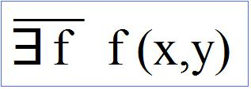
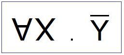
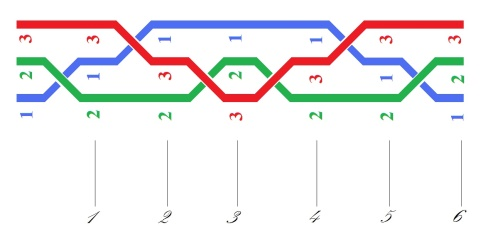
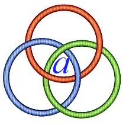

# Leçon 06 | 15 Janvier 1974

  <label><input type="checkbox" data-lacan-toggle="original" checked> 原文</label>
  <label><input type="checkbox" data-lacan-toggle="notes" checked> 注释</label>
  <label><input type="checkbox" data-lacan-toggle="commentary" checked> 个人解读评论</label>

<section class="parallel-paragraph" data-paragraph-ids="s21-06-0001">

s21-06-0001

[无对应译文]

原文 · s21-06-0001

Vous m’avez vu la dernière fois un petit peu dépassé par votre nombre.

</section>

<section class="parallel-paragraph" data-paragraph-ids="s21-06-0002">

s21-06-0002

[无对应译文]

原文 · s21-06-0002

Comme il est, ça me laisse l’espoir qu’il se réduise, alors je continue.

</section>

<section class="parallel-paragraph" data-paragraph-ids="s21-06-0003">

s21-06-0003

[无对应译文]

原文 · s21-06-0003

L’inconvénient de ce nombre c’est que - j’y pensais tout à l’heure - je suis amené, enfin à chaque fois, à pencher vers ceci que si je vous parle, ça ne peut être que pour la 1ère fois.

</section>

<section class="parallel-paragraph" data-paragraph-ids="s21-06-0004">

s21-06-0004

[无对应译文]

原文 · s21-06-0004

C’est-à­-dire que c’est une notion d’ordre. Cette notion d’ordre évidemment me gêne et c’est d’où j’essaie de sortir en vous montrant autre chose, c’est à savoir : qu’il y a *la nodalité*.

</section>

<section class="parallel-paragraph" data-paragraph-ids="s21-06-0005">

s21-06-0005

[无对应译文]

原文 · s21-06-0005

Pour le dire, la question est de savoir ce que le savoir inconscient...

</section>

<section class="parallel-paragraph" data-paragraph-ids="s21-06-0006">

s21-06-0006

[无对应译文]

原文 · s21-06-0006

> là forcément, je vois bien que j’en­chaîne ...à savoir que *le savoir inconscient* je le pose comme ce qui travaille, et ce qui travaille ne peut travailler... il n’y a de prise quelconque du travail que dans un *discours*. Il s’agit de fonder *ce qui travaille* *dans le discours analytique*.

</section>

<section class="parallel-paragraph" data-paragraph-ids="s21-06-0007">

s21-06-0007

[无对应译文]

原文 · s21-06-0007

S’il n’y avait pas de *lien social*, et de *lien social* en tant qu’il est fondé par un *discours*, le travail serait insaisissable.

</section>

<section class="parallel-paragraph" data-paragraph-ids="s21-06-0008">

s21-06-0008

[无对应译文]

原文 · s21-06-0008

Disons, avec l’ironie que ça comporte : dans la natu­re que ça ne travaille pas.

</section>

<section class="parallel-paragraph" data-paragraph-ids="s21-06-0009">

s21-06-0009

[无对应译文]

原文 · s21-06-0009

Alors, il semble bien que c’est d’ailleurs ce qui la fonde, la nature, l’idée que nous en avons : c’est le lieu où ça ne travaille pas.

</section>

<section class="parallel-paragraph" data-paragraph-ids="s21-06-0010">

s21-06-0010

[无对应译文]

原文 · s21-06-0010

Le savoir, le savoir en tant qu’inconscient - en tant que, en nous, ça travaille - semble donc impliquer une *supposition*.

</section>

<section class="parallel-paragraph" data-paragraph-ids="s21-06-0011">

s21-06-0011

[无对应译文]

原文 · s21-06-0011

C’est une *supposition*, me direz-vous, pour laquelle nous n’avons pas besoin de nous forcer, puisqu’en somme, c’est nous-même : le sujet, l’ὑποχείμενον \[*upokeimenon*\] tout ça veut dire exactement la même chose, à savoir qu’on *suppose* que quelque chose existe, qui s’appelle, que j’ai désigné comme « *l’être parlant »*.

</section>

<section class="parallel-paragraph" data-paragraph-ids="s21-06-0012">

s21-06-0012

[无对应译文]

原文 · s21-06-0012

Ce qui est un pléo­nasme, parce qu’il n’y a d’*être* que de parler, s’il n’y avait pas le verbe être, il n’y aurait pas d*’être* du tout.

</section>

<section class="parallel-paragraph" data-paragraph-ids="s21-06-0013">

s21-06-0013

[无对应译文]

原文 · s21-06-0013

Néanmoins, nous savons bien que le mot « *exister *» a pris un certain poids, en particulier par le le *quanteur de l’existence* \[:\].

</section>

<section class="parallel-paragraph" data-paragraph-ids="s21-06-0014">

s21-06-0014

[无对应译文]

原文 · s21-06-0014

Le *quanteur de l’existence*, en réalité, a tout à fait déplacé le sens de ce mot « *exister »*, et si même je peux l’écrire comme je l’écris : *ex, tiret, sister,* c’est jus­tement là en quoi se marque l’originalité de ce quanteur.

</section>

<section class="parallel-paragraph" data-paragraph-ids="s21-06-0015">

s21-06-0015

[无对应译文]

原文 · s21-06-0015

Seulement voilà ! L’originalité ne fait que déplacer l’ordre, à savoir que ce qui ex-siste, c’est cela qui serait originaire.

</section>

<section class="parallel-paragraph" data-paragraph-ids="s21-06-0016">

s21-06-0016

[无对应译文]

原文 · s21-06-0016

C’est *à partir* de l’*ex­-sistence* que nous nous trouvons réinterroger ce qu’il en est de *la supposition*.

</section>

<section class="parallel-paragraph" data-paragraph-ids="s21-06-0017">

s21-06-0017

[无对应译文]

原文 · s21-06-0017

Simple déplacement, en somme.

</section>

<section class="parallel-paragraph" data-paragraph-ids="s21-06-0018">

s21-06-0018

[无对应译文]

原文 · s21-06-0018

Et ce que j’essaie de faire, cette année, avec mes « *non-­dupes »*, c’est de voir de quoi, en somme, il faut être dupe, pour que tout ça tienne, et que ça tienne dans une consistance.

</section>

<section class="parallel-paragraph" data-paragraph-ids="s21-06-0019">

s21-06-0019

[无对应译文]

原文 · s21-06-0019

Et c’est en quoi j’introduis ce ternaire, ou plus exactement je m’aperçois qu’à partir, à être parti de ce ternaire : *du Symbolique, de l’Imaginaire et du Réel*, je pose une ques­tion, ou plus exactement, comme pour toute question, c’est de la réponse qu’elle est partie.

</section>

<section class="parallel-paragraph" data-paragraph-ids="s21-06-0020">

s21-06-0020

[无对应译文]

原文 · s21-06-0020

De la réponse qui, à maintenir, à maintenir comme distinct le *Réel*, nous fait nous poser la question : où se situe ce savoir, ce savoir inconscient dont nous sommes travaillés dans *le discours analytique*  ?

</section>

<section class="parallel-paragraph" data-paragraph-ids="s21-06-0021">

s21-06-0021

[无对应译文]

原文 · s21-06-0021

Il est bien certain que c’est *le discours* qui nous fait coller...

</section>

<section class="parallel-paragraph" data-paragraph-ids="s21-06-0022">

s21-06-0022

[无对应译文]

原文 · s21-06-0022

> *le discours analytique* ...qui nous fait coller à ce savoir d’une façon qui n’a pas de précédent dans l’Histoire.

</section>

<section class="parallel-paragraph" data-paragraph-ids="s21-06-0023">

s21-06-0023

[无对应译文]

原文 · s21-06-0023

Pourquoi après tout ne pourrions-nous pas considérer ce discours lui-même comme *contingent* puisqu’il part d’un *dire*, d’un *dire* qui fait événement, celui que j’essaie de prolonger devant vous, et la question de *la contingence de ce dire*, c’est bien autour de celle-là que nous tournons : si ce *dire* n’est que contingent...

</section>

<section class="parallel-paragraph" data-paragraph-ids="s21-06-0024">

s21-06-0024

[无对应译文]

原文 · s21-06-0024

> et aussi bien c’est de cela qu’il faut rendre compte ...*où se situe le Réel ? Est-ce que le Réel n’est jamais que supposé ?*

</section>

<section class="parallel-paragraph" data-paragraph-ids="s21-06-0025">

s21-06-0025

[无对应译文]

原文 · s21-06-0025

Dans ce nœud - ce nœud que je profère - dans ce nœud, ce nœud fait du *Symbolique* et de l’*Imaginaire* en tant que c’est seulement *quelque chose* qui *<u>avec</u>* fait **3** \[*fait « tresse »*\], qui les *noue*, c’est du *Réel* qu’il s’agit.

</section>

<section class="parallel-paragraph" data-paragraph-ids="s21-06-0026">

s21-06-0026

[无对应译文]

原文 · s21-06-0026

Qu’ils soient 3, c’est à cela que tient le *Réel*.

</section>

<section class="parallel-paragraph" data-paragraph-ids="s21-06-0027">

s21-06-0027

[无对应译文]

原文 · s21-06-0027

Pourquoi le *Réel* est-il 3 ?

</section>

<section class="parallel-paragraph" data-paragraph-ids="s21-06-0028">

s21-06-0028

[无对应译文]

原文 · s21-06-0028

C’est une question que je fonde, que je justifie de ceci : *qu’il n’y a pas de rapport sexuel*...

</section>

<section class="parallel-paragraph" data-paragraph-ids="s21-06-0029">

s21-06-0029

[无对应译文]

原文 · s21-06-0029

> en d’autres termes, que je le précise de ceci ...*qui puisse s’écrire*.

</section>

<section class="parallel-paragraph" data-paragraph-ids="s21-06-0030">

s21-06-0030

[无对应译文]

原文 · s21-06-0030

Moyennant quoi ce qui s’écrit, c’est que, par exemple, il n’existe pas de *f* tel qu’entre *x* et *y*...

</section>

<section class="parallel-paragraph" data-paragraph-ids="s21-06-0031">

s21-06-0031

[无对应译文]

原文 · s21-06-0031

> qui ici signifient le fondement de tels des êtres parlants, à se choisir comme de la partie mâle ou femelle,
>
> ceci, cette fonction qui ferait le rapport, cette fonction de l’homme par rapport à la femme,
>
> cette fonction de la femme par rapport à l’homme ...il n’en existe pas qui puisse s’écrire.

</section>

<section class="parallel-paragraph" data-paragraph-ids="s21-06-0032">

s21-06-0032

[无对应译文]

原文 · s21-06-0032

> 

</section>

<section class="parallel-paragraph" data-paragraph-ids="s21-06-0033">

s21-06-0033

[无对应译文]

原文 · s21-06-0033

C’est ça *la chose*, *la chose* que je produis devant vous, c’est ce que quelque part...

</section>

<section class="parallel-paragraph" data-paragraph-ids="s21-06-0034">

s21-06-0034

[无对应译文]

原文 · s21-06-0034

> car je me répète, comme tout le monde, il n’y a que vous pour ne pas vous en apercevoir ...c’est ça que j’ai déjà énoncé sous le nom de *La chose freudienne*.

</section>

<section class="parallel-paragraph" data-paragraph-ids="s21-06-0035">

s21-06-0035

[无对应译文]

原文 · s21-06-0035

Ça y est en long et en large, et bien sûr c’est tout à fait passé inaperçu, pour une simple raison, c’est que nous en res­tons dans cet *Imaginaire*.

</section>

<section class="parallel-paragraph" data-paragraph-ids="s21-06-0036">

s21-06-0036

[无对应译文]

原文 · s21-06-0036

Dans cet *Imaginaire* qui est justement ce que met en question la moindre expérience du discours analytique, c’est qu’il n’y a rien de plus flou que l’*appartenance* à un de ces deux côtés, celui que je désigne de *x* et l’autre de *y,* justement en ceci, que du même coup il faut que je marque qu’il n’y a nulle fonction qui les relie.

</section>

<section class="parallel-paragraph" data-paragraph-ids="s21-06-0037">

s21-06-0037

[无对应译文]

原文 · s21-06-0037

Alors, il s’agit de savoir comment, *tout de même*, ça fonctionne, à savoir que, *tout de même*, ça baise là-dedans.

</section>

<section class="parallel-paragraph" data-paragraph-ids="s21-06-0038">

s21-06-0038

[无对应译文]

原文 · s21-06-0038

En énonçant cela, ceci, il faut quand même que je décolle de quelque chose qui est *une supposition*, une *supposition* qu’il y ait un *sujet*, mâle ou femelle.

</section>

<section class="parallel-paragraph" data-paragraph-ids="s21-06-0039">

s21-06-0039

[无对应译文]

原文 · s21-06-0039

C’est une supposition que l’expérience rend très évidemment intenable, et qui implique que ce que j’avance en *énoncé* par mon énonciation...

</section>

<section class="parallel-paragraph" data-paragraph-ids="s21-06-0040">

s21-06-0040

[无对应译文]

原文 · s21-06-0040

> par l’énonciation dont je ne suis le sujet que pour autant que dans *le discours analytique* je travaille moi-même ...qu’il faut que je ne mette pas de *sujet* sous cet x et sous cet y.

</section>

<section class="parallel-paragraph" data-paragraph-ids="s21-06-0041">

s21-06-0041

[无对应译文]

原文 · s21-06-0041

Il faut donc que l’énoncé...

</section>

<section class="parallel-paragraph" data-paragraph-ids="s21-06-0042">

s21-06-0042

[无对应译文]

原文 · s21-06-0042

> et rien que déjà à écrire ceci au tableau ...il faut donc que mon énoncé n’implique pas de *sujet*.

</section>

<section class="parallel-paragraph" data-paragraph-ids="s21-06-0043">

s21-06-0043

[无对应译文]

原文 · s21-06-0043

S’il y a quelque chose qui se trouve là écrit, c’est que de sujet il n’est question *que* dans la fonction, et justement que ce que j’écris, c’est que sous cette fonction, justement de ce qu’elle soit niée, il n’y a nulle existence.

</section>

<section class="parallel-paragraph" data-paragraph-ids="s21-06-0044">

s21-06-0044

[无对应译文]

原文 · s21-06-0044

Le « *il n’existe pas* » \[/\] veut dire ça : il n’y a pas de fonction.

</section>

<section class="parallel-paragraph" data-paragraph-ids="s21-06-0045">

s21-06-0045

[无对应译文]

原文 · s21-06-0045

Ce dont il s’agit, c’est de démontrer que cette fonction, si elle n’a pas d’existence,

</section>

<section class="parallel-paragraph" data-paragraph-ids="s21-06-0046">

s21-06-0046

[无对应译文]

原文 · s21-06-0046

- ce n’est pas seulement affaire *contingente*,

</section>

<section class="parallel-paragraph" data-paragraph-ids="s21-06-0047">

s21-06-0047

[无对应译文]

原文 · s21-06-0047

- c’est affaire d’*impossible*.

</section>

<section class="parallel-paragraph" data-paragraph-ids="s21-06-0048">

s21-06-0048

[无对应译文]

原文 · s21-06-0048

C’est affaire d’*impossible*, et pour le démontrer, ce n’est pas une peti­te affaire.

</section>

<section class="parallel-paragraph" data-paragraph-ids="s21-06-0049">

s21-06-0049

[无对应译文]

原文 · s21-06-0049

Ce n’est pas une petite affaire simplement pour ceci : c’est que à simplement l’écrire, à simplement l’énoncer, même seulement dans l’écriture, la chose ne tient que jusqu’à preuve du contraire, à savoir jusqu’au moment où quelque chose de *contingent* s’ins­crive en faux contre ce dire, et par bon *heur*...

</section>

<section class="parallel-paragraph" data-paragraph-ids="s21-06-0050">

s21-06-0050

[无对应译文]

原文 · s21-06-0050

> si je puis dire : *bon heur*, les deux mots séparés ...s’écrive *f(x,y)* : il y a une fonction qui noue le x et le y, *et que ça a cessé de ne pas s’écrire.*

</section>

<section class="parallel-paragraph" data-paragraph-ids="s21-06-0051">

s21-06-0051

[无对应译文]

原文 · s21-06-0051

Pour que ça ait *cessé de ne pas s’écrire*, il faudrait que ça soit *possible*, et jusqu’à un certain point ça le reste, puisque ce que j’avance, c’est que ça a *cessé de s’écrire*. Pourquoi ça ne recommencerait-il pas ?

</section>

<section class="parallel-paragraph" data-paragraph-ids="s21-06-0052">

s21-06-0052

[无对应译文]

原文 · s21-06-0052

Non seu­lement il est *possible* qu’on écrive *f(x,y),* mais il est clair qu’on ne s’en est pas privés.

</section>

<section class="parallel-paragraph" data-paragraph-ids="s21-06-0053">

s21-06-0053

[无对应译文]

原文 · s21-06-0053

Pour démontrer donc l’*impossible*, il faut prendre fondement ailleurs.

</section>

<section class="parallel-paragraph" data-paragraph-ids="s21-06-0054">

s21-06-0054

[无对应译文]

原文 · s21-06-0054

Ailleurs que dans ces écritures précaires puisque après tout, elles ont cessé, et qu’à partir du moment où elles ont cessé, on pourrait croire que ça peut reprendre.

</section>

<section class="parallel-paragraph" data-paragraph-ids="s21-06-0055">

s21-06-0055

[无对应译文]

原文 · s21-06-0055

C’est bien le rapport du *possible* et du *contingent*.

</section>

<section class="parallel-paragraph" data-paragraph-ids="s21-06-0056">

s21-06-0056

[无对应译文]

原文 · s21-06-0056

À prendre appui sur le nœud pour que quelque chose de l’*impossible* se démontre, qu’est-ce que je fais ?

</section>

<section class="parallel-paragraph" data-paragraph-ids="s21-06-0057">

s21-06-0057

[无对应译文]

原文 · s21-06-0057

Je prends appui...

</section>

<section class="parallel-paragraph" data-paragraph-ids="s21-06-0058">

s21-06-0058

[无对应译文]

原文 · s21-06-0058

> peut-être la ques­tion mérite qu’on la soulève ...sur une topologie.

</section>

<section class="parallel-paragraph" data-paragraph-ids="s21-06-0059">

s21-06-0059

[无对应译文]

原文 · s21-06-0059

Puisque, pour ce qui est de l’*ordre*, eh bien on peut dire que c’est bien ce qui jusqu’à présent n’a pas manqué, à savoir que c’est à mettre de l’*ordre* qu’on supporte tout ce qui a pu s’avancer du *rapport* dit *sexuel*.

</section>

<section class="parallel-paragraph" data-paragraph-ids="s21-06-0060">

s21-06-0060

[无对应译文]

原文 · s21-06-0060

Il est vrai que cet *ordre*, on s’y embrouillait un tant soit peu les pattes, et qu’il est certain que ce n’est pas le même ordre, en tout cas, qu’instaure ce que *le discours analytique* avance, ou paraît avancer de ce qui concerne le rapport sexuel.

</section>

<section class="parallel-paragraph" data-paragraph-ids="s21-06-0061">

s21-06-0061

[无对应译文]

原文 · s21-06-0061

L’ordre **1,2,3** ben, il y en a un qui vient le premier et ce n’est pas par hasard...

</section>

<section class="parallel-paragraph" data-paragraph-ids="s21-06-0062">

s21-06-0062

[无对应译文]

原文 · s21-06-0062

> on ne sait d’ailleurs pas lequel vient le premier ...ce n’est pas par hasard que ce soit le **1**, puisque :

</section>

<section class="parallel-paragraph" data-paragraph-ids="s21-06-0063">

s21-06-0063

[无对应译文]

原文 · s21-06-0063

- le **2nd** le seconde,

</section>

<section class="parallel-paragraph" data-paragraph-ids="s21-06-0064">

s21-06-0064

[无对应译文]

原文 · s21-06-0064

- et que le **3ème** résulte de leur addition, simplement.

</section>

<section class="parallel-paragraph" data-paragraph-ids="s21-06-0065">

s21-06-0065

[无对应译文]

原文 · s21-06-0065

Ça fait une suite qu’on a pu qualifier de *natu­relle*.

</section>

<section class="parallel-paragraph" data-paragraph-ids="s21-06-0066">

s21-06-0066

[无对应译文]

原文 · s21-06-0066

Ce qui laisse à rêver. Ce qui laisse à rêver d’autant plus que la der­nière fois je vous ai fait la remarque qu’à les écrire à la suite, le privilège de ces trois premiers, c’est qu’il suffit de les prendre à revers pour que tous les ordres soient possibles.

</section>

<section class="parallel-paragraph" data-paragraph-ids="s21-06-0067">

s21-06-0067

[无对应译文]

原文 · s21-06-0067

Il suffit en effet qu’il y ait 1,2,3 ou 1,3,2...

</section>

<section class="parallel-paragraph" data-paragraph-ids="s21-06-0068">

s21-06-0068

[无对应译文]

原文 · s21-06-0068

> c’est ça que j’appelle *« les prendre à revers »* ...pour que les six autres façons d’arranger le 1,2,3 soient possibles.

</section>

<section class="parallel-paragraph" data-paragraph-ids="s21-06-0069">

s21-06-0069

[无对应译文]

原文 · s21-06-0069

L’idée de « *successeur »*...

</section>

<section class="parallel-paragraph" data-paragraph-ids="s21-06-0070">

s21-06-0070

[无对应译文]

原文 · s21-06-0070

> et que de *successeur* il n’y en ait qu’un dans la suite naturelle des nombres, ...c’est une idée qui ne s’est dégagée que tard, ce qui est assez curieux parce qu’il semblait bien que c’était là *la chose la plus tangible,* *la plus réelle* qui soit, concernant la suite naturelle. Pourquoi n’y aurait-il pas - de *successeurs* - une multitu­de ?

</section>

<section class="parallel-paragraph" data-paragraph-ids="s21-06-0071">

s21-06-0071

[无对应译文]

原文 · s21-06-0071

Ça ne va pas de soi.

</section>

<section class="parallel-paragraph" data-paragraph-ids="s21-06-0072">

s21-06-0072

[无对应译文]

原文 · s21-06-0072

Nous avons une foule d’exemples, celle de l’arbre notamment, de l’arbre que nous rencontrons partout, vers notre *descendance* comme vers notre *ascendance*, pourquoi l’idée de *successeur* serait-elle inhérente à une suite privilégiée de *successeurs* se fondant sur ceci : qu’il n’y en a qu’un ?

</section>

<section class="parallel-paragraph" data-paragraph-ids="s21-06-0073">

s21-06-0073

[无对应译文]

原文 · s21-06-0073

Qu’il y en ait **3** dans tel cas - tel cas privilégié - a certainement rap­port à ce qu’il y ait de l’*Un.*

</section>

<section class="parallel-paragraph" data-paragraph-ids="s21-06-0074">

s21-06-0074

[无对应译文]

原文 · s21-06-0074

*Yad’lun,* c’est comme ça que je me suis exprimé.

</section>

<section class="parallel-paragraph" data-paragraph-ids="s21-06-0075">

s21-06-0075

[无对应译文]

原文 · s21-06-0075

Mais il est tout à fait imaginable que le **3** ne soit pas pris dans l’*ordre*.

</section>

<section class="parallel-paragraph" data-paragraph-ids="s21-06-0076">

s21-06-0076

[无对应译文]

原文 · s21-06-0076

Ça c’est pas nouveau - hein ? - le fameux triangle dont les Grecs on tiré parti - le parti que vous savez - repose là-dessus, et avec lui toute la géométrie qu’ils en ont extraite, et par quoi long­temps l’idée *claire* a été première au regard du *distinct *: l’idée *claire et distincte*, qu’on dit !

</section>

<section class="parallel-paragraph" data-paragraph-ids="s21-06-0077">

s21-06-0077

[无对应译文]

原文 · s21-06-0077

Moyennant quoi c’est « *more geometrico »,* qu’on a *démontré* pendant des siècles, et que ça a été *un idéal* et que ça le reste encore.

</section>

<section class="parallel-paragraph" data-paragraph-ids="s21-06-0078">

s21-06-0078

[无对应译文]

原文 · s21-06-0078

Le lien de la mesure avec le *phénomène* de l’ombre, je souligne *phénomène,* c’est-à-dire avec l’*Imaginaire*, en tant qu’il *suppose la lumière*,

</section>

<section class="parallel-paragraph" data-paragraph-ids="s21-06-0079">

s21-06-0079

[无对应译文]

原文 · s21-06-0079

- a instauré cet *ordre* qu’on appelle *harmonique*,

</section>

<section class="parallel-paragraph" data-paragraph-ids="s21-06-0080">

s21-06-0080

[无对应译文]

原文 · s21-06-0080

- a instauré, fondé, tout ce qu’il en est de *la proportion* \[« *le rapport* »\], d’une *proportion* qui était le seul fondement de la mesure,

</section>

<section class="parallel-paragraph" data-paragraph-ids="s21-06-0081">

s21-06-0081

[无对应译文]

原文 · s21-06-0081

- et instauré un ordre, un ordre qui a servi à construire une Physique.

</section>

<section class="parallel-paragraph" data-paragraph-ids="s21-06-0082">

s21-06-0082

[无对应译文]

原文 · s21-06-0082

C’est de là qu’est partie cette idée de la *supposition*.

</section>

<section class="parallel-paragraph" data-paragraph-ids="s21-06-0083">

s21-06-0083

[无对应译文]

原文 · s21-06-0083

Parce qu’à fon­der les choses sur cet *Imaginaire*, il fallait qu’il y ait derrière autre chose : *une sub-stance*, c’est la même chose, c’est le même mot que *supposition*, *sujet,* et tout ce qui s’ensuit [^12].

</section>

<section class="parallel-paragraph" data-paragraph-ids="s21-06-0084">

s21-06-0084

[无对应译文]

原文 · s21-06-0084

Toute cette affaire était par trop - si je puis dire - par trop phénoménale.

</section>

<section class="parallel-paragraph" data-paragraph-ids="s21-06-0085">

s21-06-0085

[无对应译文]

原文 · s21-06-0085

Quand je témoigne, quand je dis que le nœud, c’est ça qui me cogite, et que mon discours...

</section>

<section class="parallel-paragraph" data-paragraph-ids="s21-06-0086">

s21-06-0086

[无对应译文]

原文 · s21-06-0086

> pour autant qu’il est le discours analytique ...mon discours en témoigne, il se trouve que...

</section>

<section class="parallel-paragraph" data-paragraph-ids="s21-06-0087">

s21-06-0087

[无对应译文]

原文 · s21-06-0087

> parce que j’ai fait quelques pas de plus que vous ...il est borroméen en l’occasion ce nœud, mais il pourrait être autre.

</section>

<section class="parallel-paragraph" data-paragraph-ids="s21-06-0088">

s21-06-0088

[无对应译文]

原文 · s21-06-0088

Même s’il était autre, ma question de savoir en quoi ça a rapport avec ce qui distingue *la topologie* de *l’espace* fondé par les Grecs, l’espace en tant qu’il a donné une première matière à décoller de la *supposition*.

</section>

<section class="parallel-paragraph" data-paragraph-ids="s21-06-0089">

s21-06-0089

[无对应译文]

原文 · s21-06-0089

Qu’est-ce que suppose la topologie ?

</section>

<section class="parallel-paragraph" data-paragraph-ids="s21-06-0090">

s21-06-0090

[无对应译文]

原文 · s21-06-0090

La topologie ne suppose, dans ce qu’il en est de l’espace, qu’une *consistance* : vous le savez ou vous ne le savez pas, en tous les cas je ne peux pas vous faire un cours de *topologie*.

</section>

<section class="parallel-paragraph" data-paragraph-ids="s21-06-0091">

s21-06-0091

[无对应译文]

原文 · s21-06-0091

Mais rien n’exclut que vous vous reportiez au texte mathé­matique où s’est élaborée cette notion, à partir de l’abandon de la mesu­re comme telle, à savoir quelle qu’en soit - de cette mesure - la relativité, puisque aussi bien elle ne se produit que d’homothétie, pour savoir l’heu­re et la hauteur du soleil, nous n’avons rien que le rapport de l’ombre avec le piquet qui la projette, que c’est sur un triangle que tout repose concernant la mesure.

</section>

<section class="parallel-paragraph" data-paragraph-ids="s21-06-0092">

s21-06-0092

[无对应译文]

原文 · s21-06-0092

La topologie elle, élabore un *espace* qui ne part que de ceci, de la définition du *voisinage*, de la *proximité*, ça a le même sens.

</section>

<section class="parallel-paragraph" data-paragraph-ids="s21-06-0093">

s21-06-0093

[无对应译文]

原文 · s21-06-0093

C’est une définition du *proche*, qui part d’un axiome, c’est à savoir que tout ce qui fait partie d’un espace topologique, s’il est à mettre dans un *voisinage*, implique qu’il y a quelque chose d’autre qui soit dans le même *voisinage*.

</section>

<section class="parallel-paragraph" data-paragraph-ids="s21-06-0094">

s21-06-0094

[无对应译文]

原文 · s21-06-0094

La notion pure de *voisinage* implique donc déjà triplicité, et ne se fonde sur rien qui unisse chacun des éléments triples, si ce n’est d’appartenir au *même voisinage*.

</section>

<section class="parallel-paragraph" data-paragraph-ids="s21-06-0095">

s21-06-0095

[无对应译文]

原文 · s21-06-0095

C’est un espace qui ne se sup­porte que de la continuité, qui s’en déduit, car il n’y a pas dans le topo­logique, d’autres rapports dits continus, que fondés sur le *voisinage* et qui du même coup impliquent ce que j’appellerai...

</section>

<section class="parallel-paragraph" data-paragraph-ids="s21-06-0096">

s21-06-0096

[无对应译文]

原文 · s21-06-0096

> ce qui n’est pas dit,et n’est pas énoncé, formulé comme tel dans la topologie ...ce que j’appellerai *la malléabilité*.

</section>

<section class="parallel-paragraph" data-paragraph-ids="s21-06-0097">

s21-06-0097

[无对应译文]

原文 · s21-06-0097

C’est ce qu’ils appellent, eux, les mathématiciens, *la défor­mation continue*.

</section>

<section class="parallel-paragraph" data-paragraph-ids="s21-06-0098">

s21-06-0098

[无对应译文]

原文 · s21-06-0098

Vous voyez que la référence au « *continu* » est dans le mot, et joint, accolé, au mot « *déformation* », lequel, pour être plus correct s’énonce : *transformation continue*.

</section>

<section class="parallel-paragraph" data-paragraph-ids="s21-06-0099">

s21-06-0099

[无对应译文]

原文 · s21-06-0099

Ce sont des images aussi. Mais il faut le dire, elles se saisissent moins bien.

</section>

<section class="parallel-paragraph" data-paragraph-ids="s21-06-0100">

s21-06-0100

[无对应译文]

原文 · s21-06-0100

Le fait que je parle de « saisir », *Begriff, begrifflich,* implique une référence à ce qui se saisit bien, c’est-à-dire le solide.

</section>

<section class="parallel-paragraph" data-paragraph-ids="s21-06-0101">

s21-06-0101

[无对应译文]

原文 · s21-06-0101

Le souple se saisit moins bien, à prendre dans la main.

</section>

<section class="parallel-paragraph" data-paragraph-ids="s21-06-0102">

s21-06-0102

[无对应译文]

原文 · s21-06-0102

L’idée, l’idée qui fonde la topologie, mathématiquement définie, est d’aborder ce qu’il en est de ce qu’elle supporte...

</section>

<section class="parallel-paragraph" data-paragraph-ids="s21-06-0103">

s21-06-0103

[无对应译文]

原文 · s21-06-0103

> c’est la topologie qui, là, supporte, ça n’est pas un sujet qui lui est supposé ...ce que la topologie supporte, *l’idée c’est de l’aborder sans image, de ne leur supposer à ces lettres*...

</section>

<section class="parallel-paragraph" data-paragraph-ids="s21-06-0104">

s21-06-0104

[无对应译文]

原文 · s21-06-0104

> telles qu’elles fondent la topologie ...*de ne leur supposer que le Réel*.

</section>

<section class="parallel-paragraph" data-paragraph-ids="s21-06-0105">

s21-06-0105

[无对应译文]

原文 · s21-06-0105

Le *Réel* en tant qu’il n’ajoute...

</section>

<section class="parallel-paragraph" data-paragraph-ids="s21-06-0106">

s21-06-0106

[无对应译文]

原文 · s21-06-0106

> est-ce que vous vous apercevez que ce terme est encore de trop, puisqu’il évoque l’addition ? ...qu’il n’ajoute...

</section>

<section class="parallel-paragraph" data-paragraph-ids="s21-06-0107">

s21-06-0107

[无对应译文]

原文 · s21-06-0107

> à ce que nous savons distinguer comme l’*Imaginaire* : cette souplesse liée au corps,
>
> ou comme *Symbolique* : le fait de dénommer le voisinage, la conti­nuité ...qu’il n’ajoute que quelque chose, *le Réel, et non pas de ce qu’il soit* **3ème**, *mais de ce qu’à eux tous ils fassent* **3**.

</section>

<section class="parallel-paragraph" data-paragraph-ids="s21-06-0108">

s21-06-0108

[无对应译文]

原文 · s21-06-0108

Et que *c’est tout ce qu’ils ont de Réel, rien de plus*.

</section>

<section class="parallel-paragraph" data-paragraph-ids="s21-06-0109">

s21-06-0109

[无对应译文]

原文 · s21-06-0109

Je veux dire : tout un chacun. C’est tout ce qu’ils ont de *Réel*.

</section>

<section class="parallel-paragraph" data-paragraph-ids="s21-06-0110">

s21-06-0110

[无对应译文]

原文 · s21-06-0110

Ça a l’air peu, mais ce n’est pas rien.

</section>

<section class="parallel-paragraph" data-paragraph-ids="s21-06-0111">

s21-06-0111

[无对应译文]

原文 · s21-06-0111

Ce n’est pas rien puisque, on l’a si bien senti de toujours que c’est jus­tement là-dessus que le *Réel* était *supposé*.

</section>

<section class="parallel-paragraph" data-paragraph-ids="s21-06-0112">

s21-06-0112

[无对应译文]

原文 · s21-06-0112

Il s’agit de le *débusquer* de cette position de *supposition* qui en fin de compte le *subordonne* à ce qu’on *imagine* ou à ce qu’on *symbolise*.

</section>

<section class="parallel-paragraph" data-paragraph-ids="s21-06-0113">

s21-06-0113

[无对应译文]

原文 · s21-06-0113

Tout ce qu’ils ont de *Réel* c’est que ça fasse 3.

</section>

<section class="parallel-paragraph" data-paragraph-ids="s21-06-0114">

s21-06-0114

[无对应译文]

原文 · s21-06-0114

Là, 3 n’est pas *une supposition* grâce au fait que nous avons - grâce à *la théorie des ensembles* - élaboré *le nombre cardinal* comme tel.

</section>

<section class="parallel-paragraph" data-paragraph-ids="s21-06-0115">

s21-06-0115

[无对应译文]

原文 · s21-06-0115

Ce qu’il faut voir, ce qu’il faut que vous supportiez, c’est ceci : c’est de mettre en question que ce n’est pas *un modèle*...

</section>

<section class="parallel-paragraph" data-paragraph-ids="s21-06-0116">

s21-06-0116

[无对应译文]

原文 · s21-06-0116

> ce qui serait de l’ordre de l’*Imaginaire* ...ce n’est pas un modèle parce que par rapport à ce 3, vous êtes...

</section>

<section class="parallel-paragraph" data-paragraph-ids="s21-06-0117">

s21-06-0117

[无对应译文]

原文 · s21-06-0117

> non pas son sujet l’imaginant ou le symbolisant, ...vous êtes : vous n’êtes, en tant que sujets, *vous n’êtes que les patients de cette triplicité*.

</section>

<section class="parallel-paragraph" data-paragraph-ids="s21-06-0118">

s21-06-0118

[无对应译文]

原文 · s21-06-0118

Vous êtes les patients d’abord parce que c’est déjà dans *la langue*...

</section>

<section class="parallel-paragraph" data-paragraph-ids="s21-06-0119">

s21-06-0119

[无对应译文]

原文 · s21-06-0119

> il n’y a pas de langue où le 3 ne s’énonce ...c’est dans *la langue*, et c’est aussi dans le fonctionnement qui s’appelle *le langage*, c’est-à-dire la structure logique telle que, tout naïvement, le pre­mier qui ait commencé là-dedans, par exemple...

</section>

<section class="parallel-paragraph" data-paragraph-ids="s21-06-0120">

s21-06-0120

[无对应译文]

原文 · s21-06-0120

> le premier à notre connaissance, bien sûr ...à savoir : Aristote, enfin celui dont on a justement des *écrits*, il a bien fallu qu’il manipule la chose avec des petites lettres, et ça ne peut pas se manipuler sans qu’il y en ait 3.

</section>

<section class="parallel-paragraph" data-paragraph-ids="s21-06-0121">

s21-06-0121

[无对应译文]

原文 · s21-06-0121

À part ceci, bien sûr, qu’il y restait quelque chose de la supposition du *Réel*, et que ce *Réel*, il n’a pas cru pouvoir le supporter d’autre chose que « *le particulier »*.

</section>

<section class="parallel-paragraph" data-paragraph-ids="s21-06-0122">

s21-06-0122

[无对应译文]

原文 · s21-06-0122

Le *particulier*...

</section>

<section class="parallel-paragraph" data-paragraph-ids="s21-06-0123">

s21-06-0123

[无对应译文]

原文 · s21-06-0123

dont il s’imagine que c’est l’individu, alors que justement, en le situant dans la logique comme *particulier*, il montre bien que de l’individu il ne se faisait qu’une notion toute *imaginaire* ...le *particulier* est une fonc­tion logique, et qu’il lui ait donné pour support *le corps individuel* est très précisément le signe qu’il lui fallait une *supposition*.

</section>

<section class="parallel-paragraph" data-paragraph-ids="s21-06-0124">

s21-06-0124

[无对应译文]

原文 · s21-06-0124

Un *dire* qui ne suppose rien, sinon que *triple* est le *Réel*...

</section>

<section class="parallel-paragraph" data-paragraph-ids="s21-06-0125">

s21-06-0125

[无对应译文]

原文 · s21-06-0125

> j’ai dit triple, c’est-à-dire 3, non pas 3ème ...c’est en quoi consiste le *dire* que je me trouve contraint d’avancer par la question du *non-rapport*, du *non-rapport* en tant qu’il touche spécifiquement à ce qu’il en est de la subjectivation du sexuel.

</section>

<section class="parallel-paragraph" data-paragraph-ids="s21-06-0126">

s21-06-0126

[无对应译文]

原文 · s21-06-0126

*Mon dire* consiste en ce *Réel* qui est ce dont le 3 insiste, insiste au point de s’être marqué dans la langue.

</section>

<section class="parallel-paragraph" data-paragraph-ids="s21-06-0127">

s21-06-0127

[无对应译文]

原文 · s21-06-0127

Il ne s’agit pas là d’une pensée, puisqu’en tant que pensée, elle est, si je puis dire, encore vierge.

</section>

<section class="parallel-paragraph" data-paragraph-ids="s21-06-0128">

s21-06-0128

[无对应译文]

原文 · s21-06-0128

Et aussi bien la pensée...

</section>

<section class="parallel-paragraph" data-paragraph-ids="s21-06-0129">

s21-06-0129

[无对应译文]

原文 · s21-06-0129

> au regard de ce qui se supporte de cette avancée du trois, du trois comme *nœud*, et comme rien d’autre ...*la pensée n’est* *que* ce que j’ai appelé tout à l’heure *ce qui se cogi­te, c’est-à-dire un rêve noir*, *celui dans lequel* communément *vous habi­tez*.

</section>

<section class="parallel-paragraph" data-paragraph-ids="s21-06-0130">

s21-06-0130

[无对应译文]

原文 · s21-06-0130

Car s’il y a quelque chose à quoi nous initie *l’expérience analytique*, c’est que *ce qu’il y a de plus près du vécu*, du vécu comme tel, *c’est le cauchemar*. Il n’y a rien de plus barrant de la pensée, même de la pensée qui se veut claire et distincte : *apprenez à lire Descartes comme un cau­chemar*, ça vous fera faire un petit progrès.

</section>

<section class="parallel-paragraph" data-paragraph-ids="s21-06-0131">

s21-06-0131

[无对应译文]

原文 · s21-06-0131

Comment même, pouvez vous ne pas apercevoir que ce type qui se dit « *je pense donc je suis *», c’est un mauvais rêve ?

</section>

<section class="parallel-paragraph" data-paragraph-ids="s21-06-0132">

s21-06-0132

[无对应译文]

原文 · s21-06-0132

*L’événement, lui, ne se produit que dans l’ordre du Symbolique : il n’y a d’événement que de dire.*

</section>

<section class="parallel-paragraph" data-paragraph-ids="s21-06-0133">

s21-06-0133

[无对应译文]

原文 · s21-06-0133

Je pense qu’au siècle où vous vivez, vous devez vous apercevoir quand même de ça tous les jours.

</section>

<section class="parallel-paragraph" data-paragraph-ids="s21-06-0134">

s21-06-0134

[无对应译文]

原文 · s21-06-0134

Cette pluie d’informations...

</section>

<section class="parallel-paragraph" data-paragraph-ids="s21-06-0135">

s21-06-0135

[无对应译文]

原文 · s21-06-0135

> si je puis dire, au milieu desquelles on peut s’étonner que vous subsistiez encore,
>
> que vous gardiez votre jugeo­te, à savoir que vous ne vous en fassiez finalement pas trop, de ce que le journal vous annonce tous les matins ...ben - Dieu merci ! - ça vous passe, comme on dit, comme de l’eau sur les plumes d’un canard ! Sans ça, où iriez-vous ?

</section>

<section class="parallel-paragraph" data-paragraph-ids="s21-06-0136">

s21-06-0136

[无对应译文]

原文 · s21-06-0136

Il faut tout de même bien qu’il y ait quelque chose de fallacieux dans lequel, hélas, le malentendu de mon *dire*...

</section>

<section class="parallel-paragraph" data-paragraph-ids="s21-06-0137">

s21-06-0137

[无对应译文]

原文 · s21-06-0137

> je veux dire celui même que je vous tiens ici, pour autant que j’en suis moi-même la victime ...auquel il faut donc qu’un certain *dire *: *le dire sur le dit*, ait contribué, pour que vous puissiez croire que dans ce qui fait tenir votre corps, c’est une circulation d’informations parties de je ne sais quels endroits...

</section>

<section class="parallel-paragraph" data-paragraph-ids="s21-06-0138">

s21-06-0138

[无对应译文]

原文 · s21-06-0138

> de prime abord de l’ADN qu’on nous dit, ou du DN je ne sais pas quoi ...que c’est de ça que vous vous supportiez, que tout ne soit en somme qu’une information, dont heureusement on nous avertit que cette information ne tient qu’à violer un des fondements mêmes de ce qui par ailleurs s’édifie comme *énergétique*.

</section>

<section class="parallel-paragraph" data-paragraph-ids="s21-06-0139">

s21-06-0139

[无对应译文]

原文 · s21-06-0139

Est-ce que tout cela n’est pas aussi de l’ordre de la cogitation ?

</section>

<section class="parallel-paragraph" data-paragraph-ids="s21-06-0140">

s21-06-0140

[无对应译文]

原文 · s21-06-0140

Est-ce que, dans d’autres termes, nous sommes obligés d’en tenir compte quand ce à quoi - dans le poli­tique – ce à quoi nous avons affaire, c’est à un type d’*informations* dont le sens n’a d’autre portée que l’impératif, à savoir *le signifiant Un *?

</section>

<section class="parallel-paragraph" data-paragraph-ids="s21-06-0141">

s21-06-0141

[无对应译文]

原文 · s21-06-0141

C’est pour nous commander, autrement dit, pour que le bout du nez suive, que toute *information*, à notre époque, est déversée comme telle. Dans - donc - *ce que je vous énonce d’un certain dire, l’important n’est rien que les conséquences qu’il peut avoir*.

</section>

<section class="parallel-paragraph" data-paragraph-ids="s21-06-0142">

s21-06-0142

[无对应译文]

原文 · s21-06-0142

Encore faut-il pour qu’il ait ses conséquences, que je m’en donne la peine.

</section>

<section class="parallel-paragraph" data-paragraph-ids="s21-06-0143">

s21-06-0143

[无对应译文]

原文 · s21-06-0143

*Ce dire n’est véritable*...

</section>

<section class="parallel-paragraph" data-paragraph-ids="s21-06-0144">

s21-06-0144

[无对应译文]

原文 · s21-06-0144

> ici, je le profère pour le cas plus que probable où vous ne vous en seriez pas aperçus ...il n’est véritable qu’en tant qu’il fait *limite* à la portée...

</section>

<section class="parallel-paragraph" data-paragraph-ids="s21-06-0145">

s21-06-0145

[无对应译文]

原文 · s21-06-0145

> à la portée de ce qui nous intéresse au premier chef nous autres, dans le discours analytique, ...*de ce qu’il fait limite à la portée de la vérité*.

</section>

<section class="parallel-paragraph" data-paragraph-ids="s21-06-0146">

s21-06-0146

[无对应译文]

原文 · s21-06-0146

Il y avait autrefois un... un garçon de bureau qui poussait des cris après chacun de mes séminaires, cris qui se résumaient dans « *Pourquoi est-ce qu’il ne dit pas le vrai sur le vrai* ? »

</section>

<section class="parallel-paragraph" data-paragraph-ids="s21-06-0147">

s21-06-0147

[无对应译文]

原文 · s21-06-0147

Ce personnage est bien connu, on lui a même confié le soin d’un *Vocabulaire*...[^13].

</section>

<section class="parallel-paragraph" data-paragraph-ids="s21-06-0148">

s21-06-0148

[无对应译文]

原文 · s21-06-0148

Je n’ai pas à dire « *le vrai sur le vrai »*, pour la raison que je ne peux en dire que ceci : c’est que le vrai c’est ce qui contredit le faux.

</section>

<section class="parallel-paragraph" data-paragraph-ids="s21-06-0149">

s21-06-0149

[无对应译文]

原文 · s21-06-0149

Mais par contre je peux dire...

</section>

<section class="parallel-paragraph" data-paragraph-ids="s21-06-0150">

s21-06-0150

[无对应译文]

原文 · s21-06-0150

> je peux dire, mais encore fallait-il que j’y mette le temps, car il y a un temps pour tout ...je peux dire *la vérité* sur *la vérité*.

</section>

<section class="parallel-paragraph" data-paragraph-ids="s21-06-0151">

s21-06-0151

[无对应译文]

原文 · s21-06-0151

*La vérité* c’est qu’on ne peut la dire, puisqu’*elle ne peut que se mi-­dire*.

</section>

<section class="parallel-paragraph" data-paragraph-ids="s21-06-0152">

s21-06-0152

[无对应译文]

原文 · s21-06-0152

*La vérité* ne se fonde, je viens de le dire, que sur la supposition du faux : elle est contradiction.

</section>

<section class="parallel-paragraph" data-paragraph-ids="s21-06-0153">

s21-06-0153

[无对应译文]

原文 · s21-06-0153

Elle ne se fonde que sur le non.

</section>

<section class="parallel-paragraph" data-paragraph-ids="s21-06-0154">

s21-06-0154

[无对应译文]

原文 · s21-06-0154

Son énoncé n’est que la dénonciation de la non-vérité.

</section>

<section class="parallel-paragraph" data-paragraph-ids="s21-06-0155">

s21-06-0155

[无对应译文]

原文 · s21-06-0155

Elle se dit rien que par le « *mi-* ».

</section>

<section class="parallel-paragraph" data-paragraph-ids="s21-06-0156">

s21-06-0156

[无对应译文]

原文 · s21-06-0156

Disons le mot, elle est « *mi-métique* », elle est de l’*Imaginaire*...

</section>

<section class="parallel-paragraph" data-paragraph-ids="s21-06-0157">

s21-06-0157

[无对应译文]

原文 · s21-06-0157

> et c’est bien pour ça que nous sommes forcés d’en passer par là ...elle est de l’*Imaginaire* en tant que l’*Imaginaire, c’est le faux* 2ème *par rap­port au Réel*, en tant que le mâle - chez l’être parlant - n’est pas la femel­le, et qu’il n’a pas d’autre biais par où se poser.

</section>

<section class="parallel-paragraph" data-paragraph-ids="s21-06-0158">

s21-06-0158

[无对应译文]

原文 · s21-06-0158

Seulement, ce ne sont pas là des biais dont nous puissions nous satisfaire.

</section>

<section class="parallel-paragraph" data-paragraph-ids="s21-06-0159">

s21-06-0159

[无对应译文]

原文 · s21-06-0159

C’en est au point qu’on peut dire que *l’inconscient* se définit de ceci, et rien que de ceci : qu’il en sait plus que cette *vérité*, et que l’homme n’est pas la femme.

</section>

<section class="parallel-paragraph" data-paragraph-ids="s21-06-0160">

s21-06-0160

[无对应译文]

原文 · s21-06-0160

Même Aristote n’a pas osé moufeter ça ! Comment est-ce qu’il aurait fait, d’abord, hein ?

</section>

<section class="parallel-paragraph" data-paragraph-ids="s21-06-0161">

s21-06-0161

[无对应译文]

原文 · s21-06-0161

Dire : « *aucun homme n’est femme* », ça, ça aurait été vachement culotté, surtout à son époque !

</section>

<section class="parallel-paragraph" data-paragraph-ids="s21-06-0162">

s21-06-0162

[无对应译文]

原文 · s21-06-0162

Alors il ne l’a pas fait. S’il avait dit : « *tout homme n’est pas femme* » hein ?

</section>

<section class="parallel-paragraph" data-paragraph-ids="s21-06-0163">

s21-06-0163

[无对应译文]

原文 · s21-06-0163

Eh bien, vous voyez - hein ? - voyez le sens que ça prend, celui d’une exception : « *il y en a quelques-uns qui ne le sont pas* ».

</section>

<section class="parallel-paragraph" data-paragraph-ids="s21-06-0164">

s21-06-0164

[无对应译文]

原文 · s21-06-0164

C’est en tant que « *tout* », qu’il n’est pas femme.

</section>

<section class="parallel-paragraph" data-paragraph-ids="s21-06-0165">

s21-06-0165

[无对应译文]

原文 · s21-06-0165

« A » là, le A du quanteur, A de x un point, et Y barré :

</section>

<section class="parallel-paragraph" data-paragraph-ids="s21-06-0166">

s21-06-0166

[无对应译文]

原文 · s21-06-0166

</section>

<section class="parallel-paragraph" data-paragraph-ids="s21-06-0167">

s21-06-0167

[无对应译文]

原文 · s21-06-0167

Seulement, l’ennuyeux, c’est que c’est pas vrai du tout, et que ça saute au yeux que ça ne soit pas vrai.

</section>

<section class="parallel-paragraph" data-paragraph-ids="s21-06-0168">

s21-06-0168

[无对应译文]

原文 · s21-06-0168

Et que la seule chose qu’on pourrait écrire, c’est que : *il n’existe pas de x dont on puisse dire qu’il ne soit pas vrai qu’être homme ce n’est pas être femme*.

</section>

<section class="parallel-paragraph" data-paragraph-ids="s21-06-0169">

s21-06-0169

[无对应译文]

原文 · s21-06-0169

*Tout ceci, bien sûr* - il faut le noter au passage - *suppose que le Un est triple*. À savoir que :

</section>

<section class="parallel-paragraph" data-paragraph-ids="s21-06-0170">

s21-06-0170

[无对应译文]

原文 · s21-06-0170

- *il y a le* Un *dont on fait le tout*, à savoir ce qui s’uni­fie comme tel,

</section>

<section class="parallel-paragraph" data-paragraph-ids="s21-06-0171">

s21-06-0171

[无对应译文]

原文 · s21-06-0171

- *il y a le* **1** *qui veut dire l’un quelconque*, à savoir ce que je vous dirai tout à l’heure,

</section>

<section class="parallel-paragraph" data-paragraph-ids="s21-06-0172">

s21-06-0172

[无对应译文]

原文 · s21-06-0172

- *et puis il y a le* **1** *unique*, qui seul, fonde le tout.

</section>

<section class="parallel-paragraph" data-paragraph-ids="s21-06-0173">

s21-06-0173

[无对应译文]

原文 · s21-06-0173

Nier l’**1** *unique*, c’est là le sens de la barre sur le quanteur de l’exis­tence \[/\].

</section>

<section class="parallel-paragraph" data-paragraph-ids="s21-06-0174">

s21-06-0174

[无对应译文]

原文 · s21-06-0174

Pour ce qui est de l’**1** quelconque, il nous faut bien le considérer comme un vide pur.

</section>

<section class="parallel-paragraph" data-paragraph-ids="s21-06-0175">

s21-06-0175

[无对应译文]

原文 · s21-06-0175

*Que le savoir inconscient soit topologique*, c’est-à-dire *qu’il ne tienne que* de la proximité *du voisinage, non de l’ordre* \[*non ordinal*\], *c’est en quoi j’essaie de dire*, de fonder là-dessus, *qu’il est nodal*.

</section>

<section class="parallel-paragraph" data-paragraph-ids="s21-06-0176">

s21-06-0176

[无对应译文]

原文 · s21-06-0176

Ce qui est à traduire de ceci, *qu’il s’écrit ou ne s’écrit pas*.

</section>

<section class="parallel-paragraph" data-paragraph-ids="s21-06-0177">

s21-06-0177

[无对应译文]

原文 · s21-06-0177

*Il s’écrit quand* je l’écris, que *je fais le nœud borroméen*, *et quand* vous essayez à cet instant de voir comment ça tient, c’est-à-dire que vous en faites... que *vous en cas­sez un, les deux autres se baladent : il ne s’écrit plus*.

</section>

<section class="parallel-paragraph" data-paragraph-ids="s21-06-0178">

s21-06-0178

[无对应译文]

原文 · s21-06-0178

*Et c’est là que se voit, que s’amorce la convergence du nodal et du modal.*

</section>

<section class="parallel-paragraph" data-paragraph-ids="s21-06-0179">

s21-06-0179

[无对应译文]

原文 · s21-06-0179

Donc ce savoir inconscient ne se supporte

</section>

<section class="parallel-paragraph" data-paragraph-ids="s21-06-0180">

s21-06-0180

[无对应译文]

原文 · s21-06-0180

- pas de ce qu’il insiste, mais des *traces* que cette insistance laisse,

</section>

<section class="parallel-paragraph" data-paragraph-ids="s21-06-0181">

s21-06-0181

[无对应译文]

原文 · s21-06-0181

- non pas de la vérité, mais de sa répétition en tant que c’est en tant que vérité qu’elle se module.

</section>

<section class="parallel-paragraph" data-paragraph-ids="s21-06-0182">

s21-06-0182

[无对应译文]

原文 · s21-06-0182

Ici, il faut que j’introduise ce dont se fonde *le voisinage* comme tel.

</section>

<section class="parallel-paragraph" data-paragraph-ids="s21-06-0183">

s21-06-0183

[无对应译文]

原文 · s21-06-0183

*Le voisi­nage* comme tel se fonde de la notion d’*ouvert*.

</section>

<section class="parallel-paragraph" data-paragraph-ids="s21-06-0184">

s21-06-0184

[无对应译文]

原文 · s21-06-0184

Ceci, *la topologie* en abat tout de suite la carte : *c’est d’ensembles en tant qu’ouverts, qu’elle se fonde*.

</section>

<section class="parallel-paragraph" data-paragraph-ids="s21-06-0185">

s21-06-0185

[无对应译文]

原文 · s21-06-0185

Et c’est bien en quoi elle aborde - elle aborde par le bon biais - ceci : *que la classe ne se ferme pas*.

</section>

<section class="parallel-paragraph" data-paragraph-ids="s21-06-0186">

s21-06-0186

[无对应译文]

原文 · s21-06-0186

C’est-à-dire qu’elle accepte le paradoxe, *le paradoxe qui n’est paradoxe que d’une logique prédicative*, à savoir que si la logique renonçait simplement à l’être, c’est-à-dire que soit rayée purement et simplement la *logique propositionnelle*, il n’y aurait pas de problème.

</section>

<section class="parallel-paragraph" data-paragraph-ids="s21-06-0187">

s21-06-0187

[无对应译文]

原文 · s21-06-0187

Le problème, s’il y en a un, problème désigné de *paradoxe*, étant seulement celui-ci : *que la classe Homme n’est pas un homme*.

</section>

<section class="parallel-paragraph" data-paragraph-ids="s21-06-0188">

s21-06-0188

[无对应译文]

原文 · s21-06-0188

Tous les paradoxes se ramènent à ça.

</section>

<section class="parallel-paragraph" data-paragraph-ids="s21-06-0189">

s21-06-0189

[无对应译文]

原文 · s21-06-0189

Qu’est-ce que ça veut dire, sinon qu’à la rigueur ce que nous pouvons désigner d’*Homme* est un ensemble ouvert, ce qui saute aux yeux !

</section>

<section class="parallel-paragraph" data-paragraph-ids="s21-06-0190">

s21-06-0190

[无对应译文]

原文 · s21-06-0190

Alors voyons bien ceci :

</section>

<section class="parallel-paragraph" data-paragraph-ids="s21-06-0191">

s21-06-0191

[无对应译文]

原文 · s21-06-0191

- *la vérité a une limite d’un côté*, et c’est pour ça qu’elle est *mi-dire*,

</section>

<section class="parallel-paragraph" data-paragraph-ids="s21-06-0192">

s21-06-0192

[无对应译文]

原文 · s21-06-0192

- mais de l’autre elle est *sans limite*, elle est ouver­te.

</section>

<section class="parallel-paragraph" data-paragraph-ids="s21-06-0193">

s21-06-0193

[无对应译文]

原文 · s21-06-0193

Et c’est bien en quoi peut l’habiter le savoir inconscient, parce que le savoir inconscient, c’est un ensemble ouvert.

</section>

<section class="parallel-paragraph" data-paragraph-ids="s21-06-0194">

s21-06-0194

[无对应译文]

原文 · s21-06-0194

Vous voyez, je l’étale, hein, que l’amour ça me tracasse.

</section>

<section class="parallel-paragraph" data-paragraph-ids="s21-06-0195">

s21-06-0195

[无对应译文]

原文 · s21-06-0195

Vous aussi, bien sûr. Mais pas comme moi !

</section>

<section class="parallel-paragraph" data-paragraph-ids="s21-06-0196">

s21-06-0196

[无对应译文]

原文 · s21-06-0196

C’est même pour ça que - une parenthèse - votre nombre me gêne : depuis quelque temps, je ne peux plus vous identifier à une femme. Ça m’emmerde.

</section>

<section class="parallel-paragraph" data-paragraph-ids="s21-06-0197">

s21-06-0197

[无对应译文]

原文 · s21-06-0197

Bon l’amour, dirai-je donc puisque - vous me pardonnerez que ça me tracasse :

</section>

<section class="parallel-paragraph" data-paragraph-ids="s21-06-0198">

s21-06-0198

[无对应译文]

原文 · s21-06-0198

- *l’amour c’est la vérité*, mais seulement en tant que c’est à partir d’elle, à partir d’une coupure, que commence un autre savoir que le savoir propositionnel, à savoir *le savoir inconscient*,

</section>

<section class="parallel-paragraph" data-paragraph-ids="s21-06-0199">

s21-06-0199

[无对应译文]

原文 · s21-06-0199

- *l’amour c’est la vérité* en tant qu’elle ne peut être dite du sujet, en tant que ce qui est supposé pouvoir être connu du partenaire sexuel,

</section>

<section class="parallel-paragraph" data-paragraph-ids="s21-06-0200">

s21-06-0200

[无对应译文]

原文 · s21-06-0200

- l’amour c’est deux *mi-dire* qui ne se recouvrent pas. Et c’est ce qui en fait le caractère fatal.

</section>

<section class="parallel-paragraph" data-paragraph-ids="s21-06-0201">

s21-06-0201

[无对应译文]

原文 · s21-06-0201

C’est la division irrémédiable, je veux dire : à quoi on ne peut pas remédier, ce qui implique que le « *médier* » serait déjà possible. Et justement, c’est non seulement irrémédiable, mais sans aucune médiation.

</section>

<section class="parallel-paragraph" data-paragraph-ids="s21-06-0202">

s21-06-0202

[无对应译文]

原文 · s21-06-0202

C’est la connexité entre deux savoirs en tant qu’ils sont irrémédiablement distincts.

</section>

<section class="parallel-paragraph" data-paragraph-ids="s21-06-0203">

s21-06-0203

[无对应译文]

原文 · s21-06-0203

Quand ça se produit, ça fait quelque chose de tout à fait privilégié.

</section>

<section class="parallel-paragraph" data-paragraph-ids="s21-06-0204">

s21-06-0204

[无对应译文]

原文 · s21-06-0204

Quand ça se recouvre, les deux savoirs inconscients, ça fait un sale méli-mélo.

</section>

<section class="parallel-paragraph" data-paragraph-ids="s21-06-0205">

s21-06-0205

[无对应译文]

原文 · s21-06-0205

Et là, je vais avancer, en fin de ce *laïus*...

</section>

<section class="parallel-paragraph" data-paragraph-ids="s21-06-0206">

s21-06-0206

[无对应译文]

原文 · s21-06-0206

> c’est bien le nom qui convient ...je vais avancer quelque chose qui est comme ça, enfin qui tranche : *le savoir masculin, chez l’être parlant, est irrémédiablement unaire, il est coupure, amorçant une fermeture*, justement celle du départ, c’est pas son privilège.

</section>

<section class="parallel-paragraph" data-paragraph-ids="s21-06-0207">

s21-06-0207

[无对应译文]

原文 · s21-06-0207

Mais il part pour se fermer, et c’est de ne pas y arriver qu’il finit par se clore sans s’en apercevoir.

</section>

<section class="parallel-paragraph" data-paragraph-ids="s21-06-0208">

s21-06-0208

[无对应译文]

原文 · s21-06-0208

*Ce savoir masculin, chez l’être parlant, c’est le rond de ficelle. Il tourne en rond*.

</section>

<section class="parallel-paragraph" data-paragraph-ids="s21-06-0209">

s21-06-0209

[无对应译文]

原文 · s21-06-0209

En lui il y a de l’1 au départ, comme trait qui se répète d’ailleurs sans se compter, et de tourner en rond il se clôt, sans même savoir que de ces ronds, il y en a 3.

</section>

<section class="parallel-paragraph" data-paragraph-ids="s21-06-0210">

s21-06-0210

[无对应译文]

原文 · s21-06-0210

Comment peut-il, comment pouvons-nous supposer qu’il y arrive à en connaître un bout de cette distinction élémentaire ?

</section>

<section class="parallel-paragraph" data-paragraph-ids="s21-06-0211">

s21-06-0211

[无对应译文]

原文 · s21-06-0211

Ben, heureusement, pour ça il y a *une femme*. Je vous ai déjà dit que la femme...

</section>

<section class="parallel-paragraph" data-paragraph-ids="s21-06-0212">

s21-06-0212

[无对应译文]

原文 · s21-06-0212

> naturellement c’est ce qui résulte de ce que j’ai déjà écrit au tableau ...que « *La femme* » ça n’existe pas, mais « *une femme* », ça, ça peut se pro­duire quand il y a nœud, ou plutôt *tresse*.

</section>

<section class="parallel-paragraph" data-paragraph-ids="s21-06-0213">

s21-06-0213

[无对应译文]

原文 · s21-06-0213

Chose curieuse, la *tresse*, elle ne se produit que de ce qu’elle imite l’être parlant mâle, parce qu’elle peut l’*imaginer*, elle le voit strangulé par ces 3 catégories qui l’étouffent. Il n’y a que lui à ne pas le savoir, jusque-là.

</section>

<section class="parallel-paragraph" data-paragraph-ids="s21-06-0214">

s21-06-0214

[无对应译文]

原文 · s21-06-0214

Elle le voit imaginairement, mais c’est une imagination de son unité, à savoir de ce à quoi l’homme lui-même s’*identifie*.

</section>

<section class="parallel-paragraph" data-paragraph-ids="s21-06-0215">

s21-06-0215

[无对应译文]

原文 · s21-06-0215

Non pas de son unité comme savoir inconscient, parce que le savoir inconscient, il reste plutôt ouvert.

</section>

<section class="parallel-paragraph" data-paragraph-ids="s21-06-0216">

s21-06-0216

[无对应译文]

原文 · s21-06-0216

Alors, avec cette unité, elle boucle une *tresse*.

</section>

<section class="parallel-paragraph" data-paragraph-ids="s21-06-0217">

s21-06-0217

[无对应译文]

原文 · s21-06-0217

</section>

<section class="parallel-paragraph" data-paragraph-ids="s21-06-0218">

s21-06-0218

[无对应译文]

原文 · s21-06-0218

*Pour faire un nœud borroméen*, je vous l’ai dit, *il faut faire 6 gestes*, et 6 gestes grâce à quoi ils sont dans le même ordre, à ceci près que justement, rien ne permet de les reconnaître.

</section>

<section class="parallel-paragraph" data-paragraph-ids="s21-06-0219">

s21-06-0219

[无对应译文]

原文 · s21-06-0219

- C’est bien pour ça qu’il faut en faire 6, à savoir épuiser l’ordre des *permutations* deux à deux, et savoir d’avance qu’il ne faut pas en faire plus, sans quoi on se trompe.

</section>

<section class="parallel-paragraph" data-paragraph-ids="s21-06-0220">

s21-06-0220

[无对应译文]

原文 · s21-06-0220

- C’est bien en quoi une femme n’est pas du tout forcément *tressée*, de sorte que c’est pas du tout forcément avec le même élément qu’el­le fait le rond au bout du compte.

</section>

<section class="parallel-paragraph" data-paragraph-ids="s21-06-0221">

s21-06-0221

[无对应译文]

原文 · s21-06-0221

- C’est même pourquoi elle reste une femme, entre autres, puisqu’elle est définie par la tresse dont elle est capable, eh bien cette *tresse*, il n’est pas du tout forcé qu’elle sache que ça soit qu’au bout de 6 que ça tienne le coup pour faire un *nœud bor­roméen*.

</section>

<section class="parallel-paragraph" data-paragraph-ids="s21-06-0222">

s21-06-0222

[无对应译文]

原文 · s21-06-0222

C’est pas du tout sûr qu’elle sache non plus que le **3** ça a un rapport au *Réel*, il peut lui en manquer la *distinction*, de sorte que ça fait un nœud, si je puis dire, encore plus noué, d’une unité encore plus *Une*.

</section>

<section class="parallel-paragraph" data-paragraph-ids="s21-06-0223">

s21-06-0223

[无对应译文]

原文 · s21-06-0223

Dans le meilleur cas - hein : dans le meilleur cas - il se peut que ça n’en fasse qu’une *de corde, de rond de ficelle*, au bout du compte.

</section>

<section class="parallel-paragraph" data-paragraph-ids="s21-06-0224">

s21-06-0224

[无对应译文]

原文 · s21-06-0224

Il suffit que vous imaginiez que le **1,2,3** se raboute au **2,3,1**.

</section>

<section class="parallel-paragraph" data-paragraph-ids="s21-06-0225">

s21-06-0225

[无对应译文]

原文 · s21-06-0225

Ça fera un nœud, encore bien plus beau, si je puis m’exprimer ainsi, n’est-ce pas ?

</section>

<section class="parallel-paragraph" data-paragraph-ids="s21-06-0226">

s21-06-0226

[无对应译文]

原文 · s21-06-0226

Je veux dire que tout se continue dans tout, et après tout ça n’en reste pas moins un nœud, parce que si vous avez fait une tresse, ça donne forcément quelque chose :

</section>

<section class="parallel-paragraph" data-paragraph-ids="s21-06-0227">

s21-06-0227

[无对应译文]

原文 · s21-06-0227

- quelque chose qui en noue forcé­ment au moins 2,

</section>

<section class="parallel-paragraph" data-paragraph-ids="s21-06-0228">

s21-06-0228

[无对应译文]

原文 · s21-06-0228

- et si 2 des brins se rejoignent, eh bien ça fera quelque chose qui se nouera, ou ne se nouera pas, au 3ème, la ques­tion n’est pas là.

</section>

<section class="parallel-paragraph" data-paragraph-ids="s21-06-0229">

s21-06-0229

[无对应译文]

原文 · s21-06-0229

Le ratage, si je puis dire, dans cette affaire, c’est-à-dire ce par quoi « *La* » femme n’existe pas, c’est bien en quoi, cela même, elle arri­ve à réussir l’union sexuelle.

</section>

<section class="parallel-paragraph" data-paragraph-ids="s21-06-0230">

s21-06-0230

[无对应译文]

原文 · s21-06-0230

Seulement cette union, c’est l’union de **1** avec **2**, \[**R** *avec* **S-I**\] ou de chacun avec chacun, de chacun de ces **3** brins.

</section>

<section class="parallel-paragraph" data-paragraph-ids="s21-06-0231">

s21-06-0231

[无对应译文]

原文 · s21-06-0231

L’union sexuelle, si je puis dire, est *interne* à son filage.

</section>

<section class="parallel-paragraph" data-paragraph-ids="s21-06-0232">

s21-06-0232

[无对应译文]

原文 · s21-06-0232

Et c’est là qu’el­le joue son rôle, à bien montrer ce que c’est qu’un nœud, c’est ce par quoi l’homme, lui, réussit à être **3**.

</section>

<section class="parallel-paragraph" data-paragraph-ids="s21-06-0233">

s21-06-0233

[无对应译文]

原文 · s21-06-0233

C’est-à-dire à ce que l’*Imaginaire*, le *Symbolique* et le *Réel* ne se distinguent que d’être **3**, tout brut.

</section>

<section class="parallel-paragraph" data-paragraph-ids="s21-06-0234">

s21-06-0234

[无对应译文]

原文 · s21-06-0234

C’est-à-dire que, sans que son sujet s’y retrouve, c’est à partir de cette triplicité dont une femme, parfois, fait sa réussite en la ratant, c’est-à­-dire dont elle se satisfait comme réalisant en elle-même l’union sexuelle, c’est à partir de là que l’homme commence à prendre d’une petite jugeo­te l’idée qu’un nœud ça sert à quelque chose.

</section>

<section class="parallel-paragraph" data-paragraph-ids="s21-06-0235">

s21-06-0235

[无对应译文]

原文 · s21-06-0235

Je vous avais dit que *l’hystérique fait l’homme*.

</section>

<section class="parallel-paragraph" data-paragraph-ids="s21-06-0236">

s21-06-0236

[无对应译文]

原文 · s21-06-0236

Mais c’est formé par l’hystérique, que l’homme part de l’idée...

</section>

<section class="parallel-paragraph" data-paragraph-ids="s21-06-0237">

s21-06-0237

[无对应译文]

原文 · s21-06-0237

> l’idée première, la bonne, celle qui lui laisse une petite chance ...part de l’idée qu’il ne sait rien.

</section>

<section class="parallel-paragraph" data-paragraph-ids="s21-06-0238">

s21-06-0238

[无对应译文]

原文 · s21-06-0238

Ce qui est son cas à elle, d’ailleurs, *puisqu’elle fait l’homme*.

</section>

<section class="parallel-paragraph" data-paragraph-ids="s21-06-0239">

s21-06-0239

[无对应译文]

原文 · s21-06-0239

Elle ne sait pas que l’union sexuelle n’existe qu’en elle et par hasard.

</section>

<section class="parallel-paragraph" data-paragraph-ids="s21-06-0240">

s21-06-0240

[无对应译文]

原文 · s21-06-0240

Elle ne sait rien, mais l’homme se trouve en contrecoup apercevoir ce nœud.

</section>

<section class="parallel-paragraph" data-paragraph-ids="s21-06-0241">

s21-06-0241

[无对应译文]

原文 · s21-06-0241

Et ça donne chez lui un résultat 2nd qui est tout différent en somme : *c’est qu’à refuser son savoir ouvert, du même coup, il le ferme.*

</section>

<section class="parallel-paragraph" data-paragraph-ids="s21-06-0242">

s21-06-0242

[无对应译文]

原文 · s21-06-0242

Il constitue le correct nœud borroméen.

</section>

<section class="parallel-paragraph" data-paragraph-ids="s21-06-0243">

s21-06-0243

[无对应译文]

原文 · s21-06-0243

Que le seul *Réel* qu’est le **3**, il y accède, il sait qu’il parle pour ne rien dire, mais pour obtenir des effets, qu’il imagine à tour de bras que ces effets sont effectifs, encore qu’ils tournent en rond, et que le *Réel* il le suppose, comme il convient, puisque le supposer n’engage à rien, à rien qu’à *conserver sa santé mentale*.

</section>

<section class="parallel-paragraph" data-paragraph-ids="s21-06-0244">

s21-06-0244

[无对应译文]

原文 · s21-06-0244

C’est-à-­dire être conforme à la norme de l’homme, à la norme de l’homme qui consiste en ceci qu’il sait qu’il y a de l’impossible et que, comme disait cette charmante femme que je vous ai déjà citée : « *Rien pour l’homme n’est impossible, ce qu’il ne peut pas faire, il le laisse* ».

</section>

<section class="parallel-paragraph" data-paragraph-ids="s21-06-0245">

s21-06-0245

[无对应译文]

原文 · s21-06-0245

*C’est ce qu’on appelle la santé mentale*.

</section>

<section class="parallel-paragraph" data-paragraph-ids="s21-06-0246">

s21-06-0246

[无对应译文]

原文 · s21-06-0246

Notamment *que de n’écrire jamais le rap­port sexuel en lui-même*, *sinon dans le manque de son désir, lequel n’est rien que son serrage dans le nœud borroméen*.

</section>

<section class="parallel-paragraph" data-paragraph-ids="s21-06-0247">

s21-06-0247

[无对应译文]

原文 · s21-06-0247

</section>

<section class="parallel-paragraph" data-paragraph-ids="s21-06-0248">

s21-06-0248

[无对应译文]

原文 · s21-06-0248

C’est pourquoi je l’ai exprimé pour la 1ère fois il y a un temps, mais il y a des gens qui ne s’en sont avertis que maintenant, j’ai pu le constater, il est vrai que c’est quelqu’un qui n’avait que des notes, enfin pour s’informer : « *Je te demande de refuser ce que je t’offre, parce que ça n’est pas ça* ».

</section>

<section class="parallel-paragraph" data-paragraph-ids="s21-06-0249">

s21-06-0249

[无对应译文]

原文 · s21-06-0249

*Pas ça que je désire que tu acceptes*, ni d’arriver à quoi que ce soit de cette espè­ce, car je n’ai affaire qu’à ce nœud même.

</section>

<section class="note-block original-notes">

## Notes

[^12]: sujet (sub-jet), sub-jectum, ὑποχείμενον \[upokeimenon\], supposé (sub-posé) etc.

[^13]: Laplanche et Pontalis, *Vocabulaire de la psychanalyse*, PUF, 1967.

</section>
