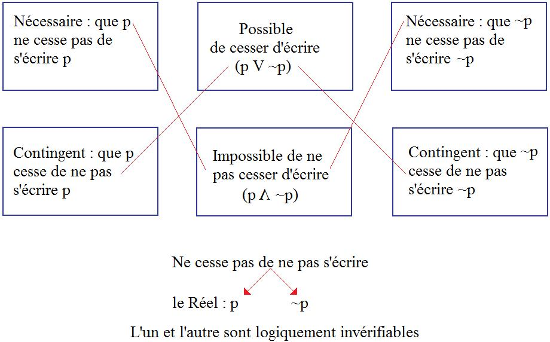

# Leçon 08 | 19 Février 1974

  <label><input type="checkbox" data-lacan-toggle="original" checked> 原文</label>
  <label><input type="checkbox" data-lacan-toggle="notes" checked> 注释</label>
  <label><input type="checkbox" data-lacan-toggle="commentary" checked> 个人解读评论</label>

<section class="parallel-paragraph" data-paragraph-ids="s21-08-0001">

s21-08-0001

[无对应译文]

原文 · s21-08-0001

Alors, cher Rondepierre, je vous l’ai barboté, hein ? Je vous l’ai barboté !

</section>

<section class="parallel-paragraph" data-paragraph-ids="s21-08-0002">

s21-08-0002

[无对应译文]

原文 · s21-08-0002

C’était vous qui l’aviez commandé, mais je l’ai pris. Voilà !

</section>

<section class="parallel-paragraph" data-paragraph-ids="s21-08-0003">

s21-08-0003

[无对应译文]

原文 · s21-08-0003

Alors, ce que j’ai barboté à Rondepierre, c’est un bouquin de Hintikka qui s’appelle « *Models for Modalities ».*

</section>

<section class="parallel-paragraph" data-paragraph-ids="s21-08-0004">

s21-08-0004

[无对应译文]

原文 · s21-08-0004

C’est une très bonne lec­ture... C’est une très bonne lecture qui est bien faite pour démontrer ce qu’il ne faut pas faire.

</section>

<section class="parallel-paragraph" data-paragraph-ids="s21-08-0005">

s21-08-0005

[无对应译文]

原文 · s21-08-0005

À cet égard, c’est utile. Bon. Voilà... Ouais... Quelle heure est-il ?

</section>

<section class="parallel-paragraph" data-paragraph-ids="s21-08-0006">

s21-08-0006

[无对应译文]

原文 · s21-08-0006

Ce Hintikka est un Finlandais, logicien, c’est pas parce qu’il a fait ce qu’il ne faut pas faire que - comme je viens de vous le dire - il n’est pas très très très utile. Il est justement particulièrement démonstratif. Si vous lisez ce que je viens d’écrire au tableau

</section>

<section class="parallel-paragraph" data-paragraph-ids="s21-08-0007">

s21-08-0007

[无对应译文]

原文 · s21-08-0007

</section>

<section class="parallel-paragraph" data-paragraph-ids="s21-08-0008">

s21-08-0008

[无对应译文]

原文 · s21-08-0008

Vous voyez peut-être où ça peut se placer, ce qu’il ne faut pas faire, vous le voyez peut-être.

</section>

<section class="parallel-paragraph" data-paragraph-ids="s21-08-0009">

s21-08-0009

[无对应译文]

原文 · s21-08-0009

Enfin, vous le verrez mieux quand j’en aurai dit un peu plus long. Ouais...

</section>

<section class="parallel-paragraph" data-paragraph-ids="s21-08-0010">

s21-08-0010

[无对应译文]

原文 · s21-08-0010

Par contre - puisque j’ai encore une petite minute - par contre, il y a un bon exemple de ce qu’on peut faire.

</section>

<section class="parallel-paragraph" data-paragraph-ids="s21-08-0011">

s21-08-0011

[无对应译文]

原文 · s21-08-0011

C’est un autre bouquin du même « Iaakko » - ça se dit, paraît-il - Jaakko Hintikka - Jacques, donc qu’il s’appelle - Jaakko Hintikka a fait un bouquin qui s’appelle « *Time and Necessity »,* avec comme sous-titre : « *Étude sur la théorie des modalités d’Aristote ».* Ça c’est pas mal.

</section>

<section class="parallel-paragraph" data-paragraph-ids="s21-08-0012">

s21-08-0012

[无对应译文]

原文 · s21-08-0012

C’est pas mal et ça suppose...

</section>

<section class="parallel-paragraph" data-paragraph-ids="s21-08-0013">

s21-08-0013

[无对应译文]

原文 · s21-08-0013

> je ne viens de l’avoir qu’il y a deux jours ...ça suppose que quelqu’un, le Hintikka en question, m’avait devancé...

</section>

<section class="parallel-paragraph" data-paragraph-ids="s21-08-0014">

s21-08-0014

[无对应译文]

原文 · s21-08-0014

> m’avait devancé depuis longtemps puisque son bouquin a non seulement été écrit, mais est sorti ...m’avait devancé depuis longtemps sur ce que je vous faisais remarquer la dernière fois, que l’*Organon* d’Aristote, ça vaut la peine d’être lu parce que le moins qu’on puisse dire c’est que ça vous cassera la tête, et que ce qui est difficile c’est bien de savoir...

</section>

<section class="parallel-paragraph" data-paragraph-ids="s21-08-0015">

s21-08-0015

[无对应译文]

原文 · s21-08-0015

> chez un « *frayeur »*, comme je l’ai appelé, comme Aristote ...c’est bien de savoir pourquoi il a choisi ces termes-là et pas d’autres. Voilà ! Il a choisi ceux-là et pas d’autres parce que...

</section>

<section class="parallel-paragraph" data-paragraph-ids="s21-08-0016">

s21-08-0016

[无对应译文]

原文 · s21-08-0016

C’est pas possible en fin de compte de dire pourquoi si je ne commence pas par articuler ce que j’ai à vous dire aujourd’hui.

</section>

<section class="parallel-paragraph" data-paragraph-ids="s21-08-0017">

s21-08-0017

[无对应译文]

原文 · s21-08-0017

Ce que j’ai fait la dernière fois, naturellement, c’est pas rien. Il faut le faire !

</section>

<section class="parallel-paragraph" data-paragraph-ids="s21-08-0018">

s21-08-0018

[无对应译文]

原文 · s21-08-0018

Naturellement ça a passé inaperçu à - j’imagine - plus d’une person­ne, mais enfin il y en a quelques-unes qui ont marqué le coup.

</section>

<section class="parallel-paragraph" data-paragraph-ids="s21-08-0019">

s21-08-0019

[无对应译文]

原文 · s21-08-0019

Bon, alors, si je n’erre pas - et j’ai pas l’air - comment joue le jeu qui me guide ?

</section>

<section class="parallel-paragraph" data-paragraph-ids="s21-08-0020">

s21-08-0020

[无对应译文]

原文 · s21-08-0020

Ça fait un verbe ça : « *jouljeu* » :

</section>

<section class="parallel-paragraph" data-paragraph-ids="s21-08-0021">

s21-08-0021

[无对应译文]

原文 · s21-08-0021

- tu *jouljeux*,

</section>

<section class="parallel-paragraph" data-paragraph-ids="s21-08-0022">

s21-08-0022

[无对应译文]

原文 · s21-08-0022

- ça continue, ça tient le coup à : *il jouljeut*.

</section>

<section class="parallel-paragraph" data-paragraph-ids="s21-08-0023">

s21-08-0023

[无对应译文]

原文 · s21-08-0023

- Et puis après ça flotte : nous *jouljouons*, ou le verbe « *jouljouer* », ça peut pas tenir.

</section>

<section class="parallel-paragraph" data-paragraph-ids="s21-08-0024">

s21-08-0024

[无对应译文]

原文 · s21-08-0024

Ça prouve qu’on ne *jouljeut* qu’au singulier. Au pluriel c’est douteux, ça ne se « *conjeugue* » pas au pluriel le « *jouljeu »*.

</section>

<section class="parallel-paragraph" data-paragraph-ids="s21-08-0025">

s21-08-0025

[无对应译文]

原文 · s21-08-0025

Et le fait qu’il n’y ait pas de pluriel n’empêche pas qu’il y ait tout de même plusieurs personnes au singulier.

</section>

<section class="parallel-paragraph" data-paragraph-ids="s21-08-0026">

s21-08-0026

[无对应译文]

原文 · s21-08-0026

Il y en a trois, justement. C’est à ça que se reconnaît le 3 du *Réel*, qui comme j’ai déjà essayé de vous le faire sentir : il *est* *trois*, hein, et même *étroit* comme *La Porte* [^16]*...*

</section>

<section class="parallel-paragraph" data-paragraph-ids="s21-08-0027">

s21-08-0027

[无对应译文]

原文 · s21-08-0027

Donc, ce que j’ai fait la dernière fois déplaçait quelque chose. Quelque chose... Quoi ?

</section>

<section class="parallel-paragraph" data-paragraph-ids="s21-08-0028">

s21-08-0028

[无对应译文]

原文 · s21-08-0028

Ce que je prétends, justement, c’est que ça ne déplace pas tout.

</section>

<section class="parallel-paragraph" data-paragraph-ids="s21-08-0029">

s21-08-0029

[无对应译文]

原文 · s21-08-0029

C’est même là ma chance d’être *sérieux *: ma chance d’être *sérieux* c’est que le *sérieux ne serre pas tout*, il serre de près la série.

</section>

<section class="parallel-paragraph" data-paragraph-ids="s21-08-0030">

s21-08-0030

[无对应译文]

原文 · s21-08-0030

Ce que j’ai avancé c’est ceci : c’est *qu’il y a déjà une logique*, et c’est même ce qui peut surprendre.

</section>

<section class="parallel-paragraph" data-paragraph-ids="s21-08-0031">

s21-08-0031

[无对应译文]

原文 · s21-08-0031

Si Aristote l’avait pas commencée elle serait pas là déjà.

</section>

<section class="parallel-paragraph" data-paragraph-ids="s21-08-0032">

s21-08-0032

[无对应译文]

原文 · s21-08-0032

Et alors, j’arrive là et je dis : *c’est le savoir du Réel*.

</section>

<section class="parallel-paragraph" data-paragraph-ids="s21-08-0033">

s21-08-0033

[无对应译文]

原文 · s21-08-0033

Je le démontre à tout bout de champ, c’est le cas de le dire.

</section>

<section class="parallel-paragraph" data-paragraph-ids="s21-08-0034">

s21-08-0034

[无对应译文]

原文 · s21-08-0034

J’y reconnais le **3**, mais le **3** *comme* *nœud *: *ma chère « structure »,* ma structure à la noix, *s’avère nœud borroméen*.

</section>

<section class="parallel-paragraph" data-paragraph-ids="s21-08-0035">

s21-08-0035

[无对应译文]

原文 · s21-08-0035

Naturellement, il ne suffit pas de le nommer, de l’appeler comme ça, parce qu’il ne suffit pas que vous sachiez que ça s’appelle *nœud borroméen* pour que vous sachiez en faire quelque chose.

</section>

<section class="parallel-paragraph" data-paragraph-ids="s21-08-0036">

s21-08-0036

[无对应译文]

原文 · s21-08-0036

C’est le cas de le dire, n’est-ce pas : « *faut le faire !* ».

</section>

<section class="parallel-paragraph" data-paragraph-ids="s21-08-0037">

s21-08-0037

[无对应译文]

原文 · s21-08-0037

Ici point une peti­te lumière sur ce que je fais : puisque c’est de là que je suis parti, je vais dire la vérité.

</section>

<section class="parallel-paragraph" data-paragraph-ids="s21-08-0038">

s21-08-0038

[无对应译文]

原文 · s21-08-0038

Ça prouve déjà que ça ne suffit pas de la dire, pour y être dans le vrai.

</section>

<section class="parallel-paragraph" data-paragraph-ids="s21-08-0039">

s21-08-0039

[无对应译文]

原文 · s21-08-0039

Et j’avance tout de suite un des points-pivots de ce dans quoi aujourd’hui j’entends avancer, dans ce que je fais ici comme analyste, puisque c’est de là que je parle : je ne découvre pas la vérité, je l’*invente*.

</section>

<section class="parallel-paragraph" data-paragraph-ids="s21-08-0040">

s21-08-0040

[无对应译文]

原文 · s21-08-0040

À quoi j’ajoute que c’est ça, *le savoir*.

</section>

<section class="parallel-paragraph" data-paragraph-ids="s21-08-0041">

s21-08-0041

[无对应译文]

原文 · s21-08-0041

Parce que chose drôle, c’est marrant : personne s’est jamais demandé ce que c’était *le savoir* ! Moi non plus !

</section>

<section class="parallel-paragraph" data-paragraph-ids="s21-08-0042">

s21-08-0042

[无对应译文]

原文 · s21-08-0042

Sauf le premier jour où, comme ça, happé par le bras, enfin, dans cette thèse qu’entre nous...

</section>

<section class="parallel-paragraph" data-paragraph-ids="s21-08-0043">

s21-08-0043

[无对应译文]

原文 · s21-08-0043

> où il est François Wahl ? Je sais pas mais enfin qu’importe, il est peut-être là, il n’y est peut-être pas ...mais enfin s’il est là je fais remarquer que j’ai promis un jour publiquement, comme ça, cédant à une pression tendre, que je la republierai cette thèse, je l’ai dit - ça leur suffit - au Seuil.

</section>

<section class="parallel-paragraph" data-paragraph-ids="s21-08-0044">

s21-08-0044

[无对应译文]

原文 · s21-08-0044

Pour la republier naturellement ils ne ces­saient de me mordiller les talons au départ, au moment où j’ai sorti les *Écrits*, pour que je la republie cette thèse, j’ai dit à ce moment-là que je voulais pas, j’ai changé d’avis, mais eux maintenant ils ne sont pas pres­sés. Bref, qu’importe !

</section>

<section class="parallel-paragraph" data-paragraph-ids="s21-08-0045">

s21-08-0045

[无对应译文]

原文 · s21-08-0045

Après tout j’ai promis, mais si ça ne se réalise pas, hein, c’est évidemment pas de ma faute.

</section>

<section class="parallel-paragraph" data-paragraph-ids="s21-08-0046">

s21-08-0046

[无对应译文]

原文 · s21-08-0046

Enfin c’est quand même comme ça que j’ai été mordillé par *quelque chose* qui m’a, comme ça, doucement fait glisser vers Freud.

</section>

<section class="parallel-paragraph" data-paragraph-ids="s21-08-0047">

s21-08-0047

[无对应译文]

原文 · s21-08-0047

C’était quelque chose qui avait d’ores et déjà, le plus grand rapport avec la question que je formule aujourd’hui.

</section>

<section class="parallel-paragraph" data-paragraph-ids="s21-08-0048">

s21-08-0048

[无对应译文]

原文 · s21-08-0048

C’est singulier, ça peut paraître frappant que ce soit comme ça, à propos de la psychose, que j’ai glissé vers cette question du... qu’il a fallu Freud, enfin pour que je me la pose vraiment, c’est : qu’est-ce que c’est que que *le savoir* ?

</section>

<section class="parallel-paragraph" data-paragraph-ids="s21-08-0049">

s21-08-0049

[无对应译文]

原文 · s21-08-0049

*Le savoir*, ça a l’air de découvrir, de *révéler* comme on dit : ἀλήθεια \[aléteia\] ma bien-aimée, je te montre au monde toute nue, je te dévoile. Le monde n’en peut mais, bien sûr !

</section>

<section class="parallel-paragraph" data-paragraph-ids="s21-08-0050">

s21-08-0050

[无对应译文]

原文 · s21-08-0050

Puisque c’est de lui qu’il s’agit : quand je la montre cette vérité-là - la bien-aimée - c’est lui que je montre.

</section>

<section class="parallel-paragraph" data-paragraph-ids="s21-08-0051">

s21-08-0051

[无对应译文]

原文 · s21-08-0051

Si j’ai dit que *la logique est la science du Réel*, ça a bien évidemment un rap­port, un rapport très serré avec ceci : que *la science peut être sans conscience*. Parce que justement, ça ne se dit guère que *la logique est la science du Réel*.

</section>

<section class="parallel-paragraph" data-paragraph-ids="s21-08-0052">

s21-08-0052

[无对应译文]

原文 · s21-08-0052

Que ça ne se dise guère, c’est quand même un signe, c’est *un signe* qu’on ne prend pas ça pour vrai.

</section>

<section class="parallel-paragraph" data-paragraph-ids="s21-08-0053">

s21-08-0053

[无对应译文]

原文 · s21-08-0053

Ce qu’il y a de curieux c’est que faute de le dire, on n’est pas foutu de dire quoi que ce soit qui vaille sur *ce que c’est que la logique*.

</section>

<section class="parallel-paragraph" data-paragraph-ids="s21-08-0054">

s21-08-0054

[无对应译文]

原文 · s21-08-0054

Ça se démontre en cours, mais quand on l’annonce, là au départ, ouvrez n’importe quel livre de *logique*, vous *verrez le vasouillage*.

</section>

<section class="parallel-paragraph" data-paragraph-ids="s21-08-0055">

s21-08-0055

[无对应译文]

原文 · s21-08-0055

C’est même tout à fait curieux. C’est certainement d’ailleurs pour ça qu’Aristote n’a pas du tout appelé son *Organon *: « *Logique* », et il est rentré dans le truc. L’étonnant est qu’il ait appelé ça *Organon.*

</section>

<section class="parallel-paragraph" data-paragraph-ids="s21-08-0056">

s21-08-0056

[无对应译文]

原文 · s21-08-0056

Quoi qu’il en soit, *science,* donc, *sans conscience*. Il y a quelqu’un qui a dit un jour...

</section>

<section class="parallel-paragraph" data-paragraph-ids="s21-08-0057">

s21-08-0057

[无对应译文]

原文 · s21-08-0057

> il s’appelait Rabelais, c’était quelqu’un de particulièrement astucieux,
>
> et il suffit de lire ce qu’il a écrit pour s’en apercevoir.
>
> Écrire ce qu’a écrit Rabelais, c’est comme pour ce que je *dis *: *« il faut le faire !* »

</section>

<section class="parallel-paragraph" data-paragraph-ids="s21-08-0058">

s21-08-0058

[无对应译文]

原文 · s21-08-0058

...« *Science sans conscience -* a-t-il dit - *n’est que ruine de l’âme* ».

</section>

<section class="parallel-paragraph" data-paragraph-ids="s21-08-0059">

s21-08-0059

[无对应译文]

原文 · s21-08-0059

Eh ben, c’est vrai. C’est à prendre seulement, non pas comme les curés le prennent, à savoir que ça fait des ravages dans cette *âme* qui comme chacun sait n’existe pas, mais ça fout *l’âme* par terre !

</section>

<section class="parallel-paragraph" data-paragraph-ids="s21-08-0060">

s21-08-0060

[无对应译文]

原文 · s21-08-0060

Vous ne vous aper­cevez sans doute pas que : que je dise que « *ça fout l’âme par terre »*...

</section>

<section class="parallel-paragraph" data-paragraph-ids="s21-08-0061">

s21-08-0061

[无对应译文]

原文 · s21-08-0061

> c’est-à-­dire que ça la rend complètement inutile ...c’est exactement la même chose que ce que je viens de vous dire en vous disant : *que révéler la vérité au monde, c’est révéler le monde à lui-même*. Ça veut dire qu’il n’y a pas plus de « *monde »* que d’« *âme »*.

</section>

<section class="parallel-paragraph" data-paragraph-ids="s21-08-0062">

s21-08-0062

[无对应译文]

原文 · s21-08-0062

Et que par conséquent, *chaque fois qu’on part d’un état du monde*, comme on dit, *pour y pointer* *la vérité*, on se fout le doigt dans l’œil ! Parce que « *le monde »*, eh ben ça suf­fit déjà de l’affirmer, c’est *une hypothèse* qui emporte tout le reste, y compris *l’âme*.

</section>

<section class="parallel-paragraph" data-paragraph-ids="s21-08-0063">

s21-08-0063

[无对应译文]

原文 · s21-08-0063

Et ça se voit bien à lire Aristote : le « *De l’âme » -* c’est comme pour Hintikka - je vous en conseille beaucoup la lecture.

</section>

<section class="parallel-paragraph" data-paragraph-ids="s21-08-0064">

s21-08-0064

[无对应译文]

原文 · s21-08-0064

S’il y a *savoir*, si la question peut se poser de ce que c’est que *le savoir*, ben c’est tout à fait naturel bien sûr, que j’y aie été happé, parce que la patiente de ma thèse, « *le cas Aimée », elle savait*, simplement *elle confirme* ce dont vous comprendrez que j’en sois parti. Elle *inventait*, bien sûr ça ne suffit pas à assurer, à *confirmer* que le savoir ça s’invente, parce que - comme on dit - « *elle débloquait* ». Seulement, c’est comme ça que le soupçon m’en est venu. Naturellement, je le savais pas !

</section>

<section class="parallel-paragraph" data-paragraph-ids="s21-08-0065">

s21-08-0065

[无对应译文]

原文 · s21-08-0065

C’est bien pour ça qu’il y faut un pas de plus dans la logique, et s’apercevoir que le *savoir*, contrairement à ce qu’avance *la logique épis­témique*, qui part de ceci : *de l’hypothèse*...

</section>

<section class="parallel-paragraph" data-paragraph-ids="s21-08-0066">

s21-08-0066

[无对应译文]

原文 · s21-08-0066

> c’est même là-dessus que repose le balayage qu’elle constitue, c’est de voir ce que ça va donner si vous écrivez,
>
> c’est comme ça qu’ils écrivent là-dedans : savoir de a, petit a...
>
> c’est pas si mal choisi, ce petit a, enfin c’est un hasard si c’est le même que le mien
>
> ...savoir de petit a, il faudrait évidemment le com­menter, là il désigne le sujet. Bien sûr qu’ils ne savent pas que le sujet c’est ce dont *petit(a)* est la cause, mais enfin c’est un fait qu’ils l’écrivent comme ça S de petit *a*, α  : S(*a,* α) ...la logique épistémique part de ceci que *le savoir* c’est forcément *savoir le vrai*.

</section>

<section class="parallel-paragraph" data-paragraph-ids="s21-08-0067">

s21-08-0067

[无对应译文]

原文 · s21-08-0067

Vous pouvez pas imaginer où ça mène. À des folies !

</section>

<section class="parallel-paragraph" data-paragraph-ids="s21-08-0068">

s21-08-0068

[无对应译文]

原文 · s21-08-0068

Ne serait-ce que celle-ci, en faux duquel s’inscrit le savoir inconscient : qu’il est impossible de savoir quoi que ce soit supposé vrai comme tel, sans le savoir. Je veux dire : *savoir qu’on sait*.

</section>

<section class="parallel-paragraph" data-paragraph-ids="s21-08-0069">

s21-08-0069

[无对应译文]

原文 · s21-08-0069

D’où il résulte qu’il est tout à fait impossible...

</section>

<section class="parallel-paragraph" data-paragraph-ids="s21-08-0070">

s21-08-0070

[无对应译文]

原文 · s21-08-0070

> c’est pas très difficile à obtenir, mais enfin il y a un mathématicien très sympathique,
>
> qui se rompt à Hintikka, et qui en effet fait la très jolie démonstration - on m’en a communiqué les notes ...que le savoir qui se supporterait de ce *qu’on ne sache pas qu’on sait* est strictement *inconsistant*, enfin, impos­sible à énoncer dans la logique épistémique. Ouais...

</section>

<section class="parallel-paragraph" data-paragraph-ids="s21-08-0071">

s21-08-0071

[无对应译文]

原文 · s21-08-0071

Vous pouvez là toucher du doigt que *le savoir*, ça s’invente, puisque cette *logique* c’est un *savoir*, un *savoir* comme un autre.

</section>

<section class="parallel-paragraph" data-paragraph-ids="s21-08-0072">

s21-08-0072

[无对应译文]

原文 · s21-08-0072

Et là je vou­drais vous ramener un peu les pieds sur terre, c’est sim­plement vous rappeler ce que c’est que le savoir inconscient. Ça mérite pleinement le titre de savoir, hein !

</section>

<section class="parallel-paragraph" data-paragraph-ids="s21-08-0073">

s21-08-0073

[无对应译文]

原文 · s21-08-0073

Et son rapport à *la vérité*, il faut bien le dire, Freud s’en inquiète, c’est même au point que ça le chamboule quand une de ses...

</section>

<section class="parallel-paragraph" data-paragraph-ids="s21-08-0074">

s21-08-0074

[无对应译文]

原文 · s21-08-0074

> on appelait ça « *patiente »* à ce moment­-là, on n’avait pas encore trouvé le terme d’*analysant* ...quand une de ses patientes lui apporte un rêve qui ment délibérément. C’est que c’est là qu’est la faille.

</section>

<section class="parallel-paragraph" data-paragraph-ids="s21-08-0075">

s21-08-0075

[无对应译文]

原文 · s21-08-0075

Il y a quelque chose dans Freud, qui prêtait à cette confusion qu’on a fait en fin de compte, en traduisant *Trieb* par « *instinct* ». Chacun sait que l’instinct c’est un *savoir* supposé naturel.

</section>

<section class="parallel-paragraph" data-paragraph-ids="s21-08-0076">

s21-08-0076

[无对应译文]

原文 · s21-08-0076

Mais il y a quelque chose quand même qui fait un pli, pour ce qui est de Freud, c’est *l’instinct de mort*.

</section>

<section class="parallel-paragraph" data-paragraph-ids="s21-08-0077">

s21-08-0077

[无对应译文]

原文 · s21-08-0077

Bien sûr, moi j’ai fait un *petit pas* de plus que lui, mais c’est *dans le mauvais sens*,

</section>

<section class="parallel-paragraph" data-paragraph-ids="s21-08-0078">

s21-08-0078

[无对应译文]

原文 · s21-08-0078

- lui, tourne autour,

</section>

<section class="parallel-paragraph" data-paragraph-ids="s21-08-0079">

s21-08-0079

[无对应译文]

原文 · s21-08-0079

- lui se rend bien compte.

</section>

<section class="parallel-paragraph" data-paragraph-ids="s21-08-0080">

s21-08-0080

[无对应译文]

原文 · s21-08-0080

Il faut que vous lisiez pour ça le fameux *Au-delà du principe du plaisir,* comme par hasard.

</section>

<section class="parallel-paragraph" data-paragraph-ids="s21-08-0081">

s21-08-0081

[无对应译文]

原文 · s21-08-0081

Dans cet *Au-delà...* il se tracasse comment quelque chose dont le modèle c’est de rester à un certain seuil : le moins de tension possible, c’est ça qui plaît à la vie, qu’il dit.

</section>

<section class="parallel-paragraph" data-paragraph-ids="s21-08-0082">

s21-08-0082

[无对应译文]

原文 · s21-08-0082

Seulement, il s’aperçoit dans la pratique que ça ne marche pas.

</section>

<section class="parallel-paragraph" data-paragraph-ids="s21-08-0083">

s21-08-0083

[无对应译文]

原文 · s21-08-0083

Alors il pense que ça passe plus bas que le seuil.

</section>

<section class="parallel-paragraph" data-paragraph-ids="s21-08-0084">

s21-08-0084

[无对应译文]

原文 · s21-08-0084

À savoir que cette vie qui maintient la tension à un certain seuil, elle se met tout d’un coup à lâcher, et que sous le seuil, la voilà qui succombe, qui suc­combe jusqu’à rejoindre la mort.

</section>

<section class="parallel-paragraph" data-paragraph-ids="s21-08-0085">

s21-08-0085

[无对应译文]

原文 · s21-08-0085

C’est comme ça qu’à la fin du comp­te, il fait passer le machin.

</section>

<section class="parallel-paragraph" data-paragraph-ids="s21-08-0086">

s21-08-0086

[无对应译文]

原文 · s21-08-0086

La vie c’est quelque chose qui s’est levé un jour*...*

</section>

<section class="parallel-paragraph" data-paragraph-ids="s21-08-0087">

s21-08-0087

[无对应译文]

原文 · s21-08-0087

> Dieu sait pourquoi, c’est le cas de le dire *...*et puis qui ne deman­de qu’à faire retour, comme tout le reste.

</section>

<section class="parallel-paragraph" data-paragraph-ids="s21-08-0088">

s21-08-0088

[无对应译文]

原文 · s21-08-0088

Il confond le monde inanimé avec la mort.

</section>

<section class="parallel-paragraph" data-paragraph-ids="s21-08-0089">

s21-08-0089

[无对应译文]

原文 · s21-08-0089

Il est inanimé, ça veut dire qu’il est *supposé ne rien savoir*.

</section>

<section class="parallel-paragraph" data-paragraph-ids="s21-08-0090">

s21-08-0090

[无对应译文]

原文 · s21-08-0090

Ça ne veut rien dire de plus, pour quiconque donne à l’âme son équiva­lent sensé.

</section>

<section class="parallel-paragraph" data-paragraph-ids="s21-08-0091">

s21-08-0091

[无对应译文]

原文 · s21-08-0091

Mais ce fait qu’il ne sache rien, ça ne prouve pas qu’il est mort.

</section>

<section class="parallel-paragraph" data-paragraph-ids="s21-08-0092">

s21-08-0092

[无对应译文]

原文 · s21-08-0092

Pourquoi le monde inanimé serait un monde mort ?

</section>

<section class="parallel-paragraph" data-paragraph-ids="s21-08-0093">

s21-08-0093

[无对应译文]

原文 · s21-08-0093

Ça veut pas dire grand-chose, certes, mais poser la question a aussi bien son sens.

</section>

<section class="parallel-paragraph" data-paragraph-ids="s21-08-0094">

s21-08-0094

[无对应译文]

原文 · s21-08-0094

Quoi qu’il en soit, corrélativement à cette question de l’*Au-delà du principe du plaisir,* Freud nage dans ceci, qui est beaucoup plus près de la question de la mort, à savoir de *ce que c’est*.

</section>

<section class="parallel-paragraph" data-paragraph-ids="s21-08-0095">

s21-08-0095

[无对应译文]

原文 · s21-08-0095

Il part*...*

</section>

<section class="parallel-paragraph" data-paragraph-ids="s21-08-0096">

s21-08-0096

[无对应译文]

原文 · s21-08-0096

il part et puis il lâche le truc, et c’est bien embêtant *...*il part de la question du *germen* et du *soma*.

</section>

<section class="parallel-paragraph" data-paragraph-ids="s21-08-0097">

s21-08-0097

[无对应译文]

原文 · s21-08-0097

Il l’attribue à Weismann*...* Je ne peux pas m’étendre : c’est pas tout à fait ça qu’a dit Weismann.

</section>

<section class="parallel-paragraph" data-paragraph-ids="s21-08-0098">

s21-08-0098

[无对应译文]

原文 · s21-08-0098

Celui qui est parti de la séparation du *germen* et du *soma*, c’est un type qui vivait un peu avant, et qui s’appelait Nussbaum.

</section>

<section class="parallel-paragraph" data-paragraph-ids="s21-08-0099">

s21-08-0099

[无对应译文]

原文 · s21-08-0099

D’ailleurs, pour ce que vous en faites, restons-en là, ça n’a pas grande importance.

</section>

<section class="parallel-paragraph" data-paragraph-ids="s21-08-0100">

s21-08-0100

[无对应译文]

原文 · s21-08-0100

Ce qui est important*...*

</section>

<section class="parallel-paragraph" data-paragraph-ids="s21-08-0101">

s21-08-0101

[无对应译文]

原文 · s21-08-0101

> et ce qu’*a frôlé* Freud à cette occasion *...*c’est qu’il n’y a de mort que là où il y a reproduction de type sexuel. C’est tout.

</section>

<section class="parallel-paragraph" data-paragraph-ids="s21-08-0102">

s21-08-0102

[无对应译文]

原文 · s21-08-0102

Si nous employons le terme d’Aristote, l’ὑπάρχειν \[uparkein\] en question, l’*ap­partenir à*, et si nous l’employons de la bonne façon, de la façon dont Aristote l’emploie, c’est-à-dire sans savoir par quel bout l’attraper, nous voyons que le sexe ὑπάρχειν \[uparkein\] *appartient* à la mort, à moins que la mort n’appartienne au sexe, et nous restons là, avec dans la main, précisément, le manche par où nous avons attrapé la chose. Ouais… Là où la faille se démontre dans ses conséquences, c’est que c’est à ce propos que Freud*...*

</section>

<section class="parallel-paragraph" data-paragraph-ids="s21-08-0103">

s21-08-0103

[无对应译文]

原文 · s21-08-0103

> sous ce prétexte qu’il y a *quelque chose* dans le monde qui montre que la vie quelquefois va à la mort *...* il conjoint ce qu’il est quand même difficile d’éliminer du sexe, c’est la jouissance, et que faisant le glissement...

</section>

<section class="parallel-paragraph" data-paragraph-ids="s21-08-0104">

s21-08-0104

[无对应译文]

原文 · s21-08-0104

> qu’il n’aurait pas fait s’il avait tenu ferme dans ses mains le nœud borroméen *...*il désigne de « *masochis­me* la prétendue conjonction de cette jouissance, jouissance sexuelle, et de la mort.

</section>

<section class="parallel-paragraph" data-paragraph-ids="s21-08-0105">

s21-08-0105

[无对应译文]

原文 · s21-08-0105

C’est un collapsus. Ouais...

</section>

<section class="parallel-paragraph" data-paragraph-ids="s21-08-0106">

s21-08-0106

[无对应译文]

原文 · s21-08-0106

S’il y a un endroit où la clinique, la pratique, nous montrent bien quelque chose*...*

</section>

<section class="parallel-paragraph" data-paragraph-ids="s21-08-0107">

s21-08-0107

[无对应译文]

原文 · s21-08-0107

> et c’est pourquoi j’en ai félicité, comme ça, au tournant, quelqu’un qui depuis a mal tourné *...*s’il y a quelque chose qui est bien évident, c’est que le *masochis­me* c’est du *chiqué*.

</section>

<section class="parallel-paragraph" data-paragraph-ids="s21-08-0108">

s21-08-0108

[无对应译文]

原文 · s21-08-0108

C’est un savoir, certes, un savoir-faire, même !

</section>

<section class="parallel-paragraph" data-paragraph-ids="s21-08-0109">

s21-08-0109

[无对应译文]

原文 · s21-08-0109

Mais s’il y a alors un savoir dont ça se touche du doigt que ça s’*invente*, que c’est pas *à la portée de tout le monde*, c’est bien là !

</section>

<section class="parallel-paragraph" data-paragraph-ids="s21-08-0110">

s21-08-0110

[无对应译文]

原文 · s21-08-0110

Faut dire que le personnage en question - là, que j’ai félicité au tournant c’était pas un clinicien, mais il avait seulement lu Sacher-Masoch [^17].

</section>

<section class="parallel-paragraph" data-paragraph-ids="s21-08-0111">

s21-08-0111

[无对应译文]

原文 · s21-08-0111

Si c’est là que ça se voit*...*

</section>

<section class="parallel-paragraph" data-paragraph-ids="s21-08-0112">

s21-08-0112

[无对应译文]

原文 · s21-08-0112

- que le masochisme ça s’*invente*,

</section>

<section class="parallel-paragraph" data-paragraph-ids="s21-08-0113">

s21-08-0113

[无对应译文]

原文 · s21-08-0113

- et que c’est pas à la portée de tout le monde,

</section>

<section class="parallel-paragraph" data-paragraph-ids="s21-08-0114">

s21-08-0114

[无对应译文]

原文 · s21-08-0114

- que c’est une façon d’éta­blir un rapport là où il n’y en a pas le moindre : entre la jouissance et la mort, *...*c’est bien clairement manifesté par le fait que - quand même ! - on n’y met que le petit bout du petit doigt, on se laisse pas happer comme ça dans la machine.

</section>

<section class="parallel-paragraph" data-paragraph-ids="s21-08-0115">

s21-08-0115

[无对应译文]

原文 · s21-08-0115

Alors c’est ce qui, quand même, permet tout de même d’envisager la portée de ce que j’énonce, c’est que *le savoir*, *le savoir* là où nous le saisissons pour la première fois, comme ça, maniable, maniable parce que *c’est pas nous qui savons, c’est pas nous qui savons*, que dit un de mes élèves, et qu’il appelle ça *le non-savoir*, pauvre gars !

</section>

<section class="parallel-paragraph" data-paragraph-ids="s21-08-0116">

s21-08-0116

[无对应译文]

原文 · s21-08-0116

Il s’imagine *qu’il ne sait pas* ! Quelle drôle d’histoire*...*

</section>

<section class="parallel-paragraph" data-paragraph-ids="s21-08-0117">

s21-08-0117

[无对应译文]

原文 · s21-08-0117

*Mais nous savons tous, parce que tous nous inventons un truc pour combler le trou dans le Réel*.

</section>

<section class="parallel-paragraph" data-paragraph-ids="s21-08-0118">

s21-08-0118

[无对应译文]

原文 · s21-08-0118

Là où il n’y a pas de rapport sexuel, ça fait « *troumatisme* ».

</section>

<section class="parallel-paragraph" data-paragraph-ids="s21-08-0119">

s21-08-0119

[无对应译文]

原文 · s21-08-0119

On invente ! On invente ce qu’on peut, bien sûr.

</section>

<section class="parallel-paragraph" data-paragraph-ids="s21-08-0120">

s21-08-0120

[无对应译文]

原文 · s21-08-0120

Quand on est pas malin, on invente le masochisme. Sacher-Masoch était un con !

</section>

<section class="parallel-paragraph" data-paragraph-ids="s21-08-0121">

s21-08-0121

[无对应译文]

原文 · s21-08-0121

Il faut voir aussi avec quelles pincettes*...*

</section>

<section class="parallel-paragraph" data-paragraph-ids="s21-08-0122">

s21-08-0122

[无对应译文]

原文 · s21-08-0122

> la personne qui voulait bien jouer le machin, comme ça, pour lui répondre *...*avec quelles pincettes elle le pre­nait, le Sacher-Masoch ! Elle ne savait pas qu’en faire.

</section>

<section class="parallel-paragraph" data-paragraph-ids="s21-08-0123">

s21-08-0123

[无对应译文]

原文 · s21-08-0123

Il n’avait que *Le Figaro* pour s’exprimer, c’est tout dire !

</section>

<section class="parallel-paragraph" data-paragraph-ids="s21-08-0124">

s21-08-0124

[无对应译文]

原文 · s21-08-0124

Enfin, laissons Sacher-Masoch !

</section>

<section class="parallel-paragraph" data-paragraph-ids="s21-08-0125">

s21-08-0125

[无对应译文]

原文 · s21-08-0125

Il y a des savoirs plus intelligemment inventés.

</section>

<section class="parallel-paragraph" data-paragraph-ids="s21-08-0126">

s21-08-0126

[无对应译文]

原文 · s21-08-0126

Et c’est bien en ça que je dis que le *Réel*, non seulement là où il y a un trou ça s’inven­te, mais que c’est pas impensable que ce soit pas par ce trou que nous avancions dans tout ce que nous *inventons* du *Réel*, qui n’est pas rien.

</section>

<section class="parallel-paragraph" data-paragraph-ids="s21-08-0127">

s21-08-0127

[无对应译文]

原文 · s21-08-0127

Parce qu’il est clair qu’il y a un endroit où ça marche, le *Réel*, c’est quand nous le faisons entrer comme **3**, cette chose bâtarde, parce qu’il est sûr que c’est difficile à manipuler logiquement cette connotation « **3** » pour le *Réel*.

</section>

<section class="parallel-paragraph" data-paragraph-ids="s21-08-0128">

s21-08-0128

[无对应译文]

原文 · s21-08-0128

Tout ce que nous savons

</section>

<section class="parallel-paragraph" data-paragraph-ids="s21-08-0129">

s21-08-0129

[无对应译文]

原文 · s21-08-0129

- c’est que « **1** » connote fort bien *la jouis­sance*,

</section>

<section class="parallel-paragraph" data-paragraph-ids="s21-08-0130">

s21-08-0130

[无对应译文]

原文 · s21-08-0130

- et que « **0** » ça veut dire « *y en a pas* » : ce qui manque, et que si **0** et **1** ça fait **2**, c’est pas ça qui rend moins hypothétique la conjonction de

</section>

<section class="parallel-paragraph" data-paragraph-ids="s21-08-0131">

s21-08-0131

[无对应译文]

原文 · s21-08-0131

- la jouissance d’un côté,

</section>

<section class="parallel-paragraph" data-paragraph-ids="s21-08-0132">

s21-08-0132

[无对应译文]

原文 · s21-08-0132

- avec la jouissance de l’autre. Ouais...

</section>

<section class="parallel-paragraph" data-paragraph-ids="s21-08-0133">

s21-08-0133

[无对应译文]

原文 · s21-08-0133

Non seulement ça ne la rend pas plus sûre, mais ça l’abîme.

</section>

<section class="parallel-paragraph" data-paragraph-ids="s21-08-0134">

s21-08-0134

[无对应译文]

原文 · s21-08-0134

Dans un monde ni fait ni à faire, un monde totalement énigmatique, dès qu’on essaie d’y faire entrer ce quelque chose qui serait modelé sur *la logique*, et dont se fonderait que dans l’espèce dite humaine on est ou *homme* ou *femme*.

</section>

<section class="parallel-paragraph" data-paragraph-ids="s21-08-0135">

s21-08-0135

[无对应译文]

原文 · s21-08-0135

C’est très spécialement ce contre quoi s’élève l’*expérience*.

</section>

<section class="parallel-paragraph" data-paragraph-ids="s21-08-0136">

s21-08-0136

[无对应译文]

原文 · s21-08-0136

Et j’ai pas besoin d’aller loin, quelqu’un m’a rapporté pas plus tard qu’il y a quelques heures, sa rencontre avec un chauffeur de taxi*...*

</section>

<section class="parallel-paragraph" data-paragraph-ids="s21-08-0137">

s21-08-0137

[无对应译文]

原文 · s21-08-0137

> ça court les rues, hein, c’est le cas de le dire ...dont non seulement il lui était impossible, à la personne qui parlait, de dire si c’était un homme ou une femme, mais même elle lui a demandé et lui n’a pas pu lui répondre. \[*Rires*\]

</section>

<section class="parallel-paragraph" data-paragraph-ids="s21-08-0138">

s21-08-0138

[无对应译文]

原文 · s21-08-0138

Quand je dis que « *ça court les rues »*, quand même, c’est pas rien !

</section>

<section class="parallel-paragraph" data-paragraph-ids="s21-08-0139">

s21-08-0139

[无对应译文]

原文 · s21-08-0139

Et même c’est de là que Freud part.

</section>

<section class="parallel-paragraph" data-paragraph-ids="s21-08-0140">

s21-08-0140

[无对应译文]

原文 · s21-08-0140

Il part, comme ça, en commentaire, l’expérience ne lui suffit pas parce qu’il faut qu’il s’accroche un peu partout à la science.

</section>

<section class="parallel-paragraph" data-paragraph-ids="s21-08-0141">

s21-08-0141

[无对应译文]

原文 · s21-08-0141

On démontre qu’il n’y a rien qui ressemble plus à un corps masculin qu’un corps féminin, si on sait regarder à un certain niveau, au niveau des tissus. Ça n’empêche pas qu’un œuf c’est pas un spermatozoïde, que c’est là que gît le truc du sexe.

</section>

<section class="parallel-paragraph" data-paragraph-ids="s21-08-0142">

s21-08-0142

[无对应译文]

原文 · s21-08-0142

C’est tout à fait superflu de faire remar­quer que pour le corps ça peut être ambigu, *comme dans le cas du chauffeur de tout à l’heure*.

</section>

<section class="parallel-paragraph" data-paragraph-ids="s21-08-0143">

s21-08-0143

[无对应译文]

原文 · s21-08-0143

C’est tout à fait superflu parce qu’on voit bien que ce qui détermine, c’est même pas un savoir, c’est un *dire*.

</section>

<section class="parallel-paragraph" data-paragraph-ids="s21-08-0144">

s21-08-0144

[无对应译文]

原文 · s21-08-0144

Ce n’est un savoir que parce que c’est un *dire* logiquement inscriptible.

</section>

<section class="parallel-paragraph" data-paragraph-ids="s21-08-0145">

s21-08-0145

[无对应译文]

原文 · s21-08-0145

C’est celui que je vous ai écrit, en toutes lettres, c’est le cas de le dire avec mon : : §.

</section>

<section class="parallel-paragraph" data-paragraph-ids="s21-08-0146">

s21-08-0146

[无对应译文]

原文 · s21-08-0146

À savoir *l’exception* autour de quoi pivote, que c’est dans la mesure où cette exception porte conséquence pour tous ceux qui croient qu’ils l’ont - qu’ils l’ont quoi ? - ce que nous n’osons même pas appeler *la queue*, nous appelons ça *le phallus*, et c’est ce qui reste à déterminer.

</section>

<section class="parallel-paragraph" data-paragraph-ids="s21-08-0147">

s21-08-0147

[无对应译文]

原文 · s21-08-0147

Alors que de l’autre côté c’est du *dire...*

</section>

<section class="parallel-paragraph" data-paragraph-ids="s21-08-0148">

s21-08-0148

[无对应译文]

原文 · s21-08-0148

> du *dire* formel quoique dire que personne *...*/ §, c’est-à-dire que ce n’est que pour tout autre qu’est niée la fonction Φx, que la négation - disons, pour illustrer - est lais­sée*...* je ne vais quand même pas dire : à Dieu...

</section>

<section class="parallel-paragraph" data-paragraph-ids="s21-08-0149">

s21-08-0149

[无对应译文]

原文 · s21-08-0149

> parce que ça nous emmerde cette histoire : le collage de l’Autre à Dieu ...mais quand même, pour qui réalise cette sorte *d’universalité* qu’il n’y a pas la négation de la fonction **Φx** \[/ §\], et c’est la seule forme d’universalité du *dire* d’une femme, quelle qu’elle soit.

</section>

<section class="parallel-paragraph" data-paragraph-ids="s21-08-0150">

s21-08-0150

[无对应译文]

原文 · s21-08-0150

Il n’en reste pas moins*...*

</section>

<section class="parallel-paragraph" data-paragraph-ids="s21-08-0151">

s21-08-0151

[无对应译文]

原文 · s21-08-0151

> je pense que vous vous souvenez quand même de ce que j’ai écrit au tableau,
>
> et que je vais pas être forcé de le récrire là *...*il n’en reste pas moins que dans cet ensemble, ce n’est « *pas tout »* \[.\] *dire* qui formule la fonction Φx.

</section>

<section class="parallel-paragraph" data-paragraph-ids="s21-08-0152">

s21-08-0152

[无对应译文]

原文 · s21-08-0152

En d’autres termes, qu’à ma petite barre que je mets sur le A inversé, signe du quantificateur univer­sel, la petite barre par quoi s’inscrit le *pas-tout* \[.\], ce qu’il faudrait substi­tuer, c’est le signe du dénombrable, à savoir : **א0** .

</section>

<section class="parallel-paragraph" data-paragraph-ids="s21-08-0153">

s21-08-0153

[无对应译文]

原文 · s21-08-0153

Ce qui s’oppose à l’*Un* du *tout* de L’homme...

</section>

<section class="parallel-paragraph" data-paragraph-ids="s21-08-0154">

s21-08-0154

[无对应译文]

原文 · s21-08-0154

> et il n’y en a qu’ *Un* comme chacun sait, la preuve c’est qu’on le désigne par l’article défini ...*ce qui s’oppose au « tout » de L’homme,* là, c’est - il faut bien le dire - *« les » femmes, en tant qu’il n’y a pas moyen d’en venir à bout*, sinon à les énumérer... je peux pas dire « *toutes* » parce que le propre du *dénom­brable*, c’est justement qu’*on n’en vient jamais au bout*.

</section>

<section class="parallel-paragraph" data-paragraph-ids="s21-08-0155">

s21-08-0155

[无对应译文]

原文 · s21-08-0155

Et si je vous donne ce repérage, c’est que faut que ça vous serve à quelque chose, faut que ça illustre ce que j’ai dit la dernière fois du *dire vrai*. Le *dire vrai* c’est ce qui *achoppe* sur ceci que pour, dans un « ou-ou » intenable, qui serait que tout ce qui n’est pas homme est femme et inversement, ce qui décide, ce qui fraye, n’est rien d’autre que ce *dire*, *ce dire qui s’engouffre dans ce qu’il en est du trou par où manque au Réel ce qui pourrait s’inscrire du rapport sexuel*.

</section>

<section class="parallel-paragraph" data-paragraph-ids="s21-08-0156">

s21-08-0156

[无对应译文]

原文 · s21-08-0156

Alors, alors. Qu’est-ce qu’il en est du savoir ? Bien sûr, je suis pas arrivé à cette heure-ci...

</section>

<section class="parallel-paragraph" data-paragraph-ids="s21-08-0157">

s21-08-0157

[无对应译文]

原文 · s21-08-0157

> c’est-à-dire une heure vingt, ou quelque chose comme ça, vingt-quatre ...je suis pas arrivé à cette heure-ci à même vous dire le quart de ce qu’il faut que je vous fasse passer dans les tripes...

</section>

<section class="parallel-paragraph" data-paragraph-ids="s21-08-0158">

s21-08-0158

[无对应译文]

原文 · s21-08-0158

> parce que c’est la fonction du *dire* : si je vous le dis pas il suffira pas que je l’écrive ...mais je vais quand même vous don­ner un petit échantillon de *ce qui peut s’écrire*, puisque sans cette réflexion sur l’*écrit*, *sans ce qui fait que* *le dire ça vient à s’écrire*, il n’y a pas moyen que je vous fasse sentir la dimension dont subsiste *le savoir inconscient*.

</section>

<section class="parallel-paragraph" data-paragraph-ids="s21-08-0159">

s21-08-0159

[无对应译文]

原文 · s21-08-0159

Et ce qu’il faut que vous fassiez comme pas supplémentai­re, c’est de vous apercevoir que si ce que je vous rends sensible en vous disant que *l’inconscient ça ne découvre rien*...

</section>

<section class="parallel-paragraph" data-paragraph-ids="s21-08-0160">

s21-08-0160

[无对应译文]

原文 · s21-08-0160

> puisqu’il y a rien à décou­vrir, *il y a rien à découvrir dans le Réel, puisque là il y a un trou* ...si l’in­conscient, là, *invente*, c’est d’autant plus précieux de vous apercevoir que *dans la logique c’est la même chose*.

</section>

<section class="parallel-paragraph" data-paragraph-ids="s21-08-0161">

s21-08-0161

[无对应译文]

原文 · s21-08-0161

À savoir que si Aristote ne l’avait pas *inventé* son premier frayage, à savoir : fait passer du *dire* dans ce concas­sage de l’être grâce à quoi il fait des *syllogismes*...

</section>

<section class="parallel-paragraph" data-paragraph-ids="s21-08-0162">

s21-08-0162

[无对应译文]

原文 · s21-08-0162

> bien sûr on avait fait du syllogisme avant lui, simplement on ne savait pas que c’étaient des syllogismes ...pour s’en apercevoir, il faut l’*inventer* : *pour voir où est le trou, il faut voir le bord du Réel*.

</section>

<section class="parallel-paragraph" data-paragraph-ids="s21-08-0163">

s21-08-0163

[无对应译文]

原文 · s21-08-0163

Et comme nous sommes déjà bien avant, et que je suis pas arrivé à vous en dire le quart...

</section>

<section class="parallel-paragraph" data-paragraph-ids="s21-08-0164">

s21-08-0164

[无对应译文]

原文 · s21-08-0164

> ça sera tant pis, ça meublera ce qui vien­dra ensuite ...il faut quand même que je vous fasse sentir la portée d’une certaine façon dont moi je fraye la logique modale.

</section>

<section class="parallel-paragraph" data-paragraph-ids="s21-08-0165">

s21-08-0165

[无对应译文]

原文 · s21-08-0165

Le plus fort c’est que bien sûr, pour ce qui est de construire, pour ce qui est d’inventer...

</section>

<section class="parallel-paragraph" data-paragraph-ids="s21-08-0166">

s21-08-0166

[无对应译文]

原文 · s21-08-0166

> et voyez là tous les échos d’intuitionnisme qu’il vous plaira, si tant est que vous sachiez ce que c’est ...je vous ai tra­duit un jour le *<u>nécessaire</u>* par *ce qui <u>ne cesse</u> pas de s’écrire.*

</section>

<section class="parallel-paragraph" data-paragraph-ids="s21-08-0167">

s21-08-0167

[无对应译文]

原文 · s21-08-0167

Bon. Sachez-le, il y a une trace dans Aristote, que la logique propositionnel­le...

</section>

<section class="parallel-paragraph" data-paragraph-ids="s21-08-0168">

s21-08-0168

[无对应译文]

原文 · s21-08-0168

> à savoir que quelque chose est vrai ou faux, ce qui se note 0 ou 1 selon les cas ...il y a une petite trace, il y a un endroit où Aristote dérape...

</section>

<section class="parallel-paragraph" data-paragraph-ids="s21-08-0169">

s21-08-0169

[无对应译文]

原文 · s21-08-0169

> je vous montrerai ça quand vous voudrez ...dans le Περὶ Ἑρμηνείας \[*Peri ermeneias*\] comme par hasard : « *De l’interprétation »,* pour ceux qui ne l’entravent pas, il y a un endroit où ça fuse, que la logique propositionnelle est tout aussi *modale* que les autres.

</section>

<section class="parallel-paragraph" data-paragraph-ids="s21-08-0170">

s21-08-0170

[无对应译文]

原文 · s21-08-0170

Il est vrai que, si c’est vrai que ça ne se situe que là où je vous le dis, c’est-à-dire là où la *contradiction n’est en fin de compte qu’artifice*, artifice de suppléance, mais qui n’en reste pas pour ça moins vrai, le vrai jouant là le rôle de quelque chose dont on part pour inventer les autres modes. C’est à savoir que « *nécessaire que : p* » - quelque vérité que ce soit - ne peut se traduire que par : « *que ça* *ne cesse pas de s’écrire* ». Chacun voit entre ce fait, ce fait que quelque chose ne cesse pas de s’écrire, entendez par là *que ça se répète, que c’est tou­jours le même symptôme*, que ça tombe toujours dans le même godant.

</section>

<section class="parallel-paragraph" data-paragraph-ids="s21-08-0171">

s21-08-0171

[无对应译文]

原文 · s21-08-0171

</section>

<section class="parallel-paragraph" data-paragraph-ids="s21-08-0172">

s21-08-0172

[无对应译文]

原文 · s21-08-0172

Vous voyez bien qu’entre le « *ne cesse pas de s’écrire : p* » et le « *ne cesse pas de s’écrire : non-p* », nous sommes là dans l’*artefact* dont témoigne justement, et qui témoigne en même temps de cette béance concernant la vérité, et que l’ordre du *possible* est - comme l’indique Aristote - connecté au *nécessaire*.

</section>

<section class="parallel-paragraph" data-paragraph-ids="s21-08-0173">

s21-08-0173

[无对应译文]

原文 · s21-08-0173

Ce qui cesse de s’écrire, c’est *p* ou *non-p.*

</section>

<section class="parallel-paragraph" data-paragraph-ids="s21-08-0174">

s21-08-0174

[无对应译文]

原文 · s21-08-0174

En ce sens, le *possible* témoigne de la faille de *la vérité*.

</section>

<section class="parallel-paragraph" data-paragraph-ids="s21-08-0175">

s21-08-0175

[无对应译文]

原文 · s21-08-0175

À ceci près qu’il y a rien à en tirer.

</section>

<section class="parallel-paragraph" data-paragraph-ids="s21-08-0176">

s21-08-0176

[无对应译文]

原文 · s21-08-0176

Il y a rien à en tirer et Aristote lui-même en témoigne.

</section>

<section class="parallel-paragraph" data-paragraph-ids="s21-08-0177">

s21-08-0177

[无对应译文]

原文 · s21-08-0177

Il y témoigne de sa confusion à tout instant entre *le possible* et *le contingent*.

</section>

<section class="parallel-paragraph" data-paragraph-ids="s21-08-0178">

s21-08-0178

[无对应译文]

原文 · s21-08-0178

Ce qu’écrit ici mon V vers le bas, car après tout ce qui *cesse de s’écrire* peut aussi bien *cesser de ne pas s’écrire*, à savoir : venir au jour comme *vérité* du truc.

</section>

<section class="parallel-paragraph" data-paragraph-ids="s21-08-0179">

s21-08-0179

[无对应译文]

原文 · s21-08-0179

Il peut arriver que j’aime une femme, comme à chacun d’entre vous...

</section>

<section class="parallel-paragraph" data-paragraph-ids="s21-08-0180">

s21-08-0180

[无对应译文]

原文 · s21-08-0180

> c’est ces sortes d’aventures dans lesquelles vous pouvez glisser ...ça ne donne pourtant aucune assurance concernant *l’identification sexuelle* de la personne que j’aime, pas plus que de la mien­ne.

</section>

<section class="parallel-paragraph" data-paragraph-ids="s21-08-0181">

s21-08-0181

[无对应译文]

原文 · s21-08-0181

Seulement il y a quelque chose qui, entre toutes ces *contingences*, pourrait bien témoigner de la présence du *Réel*.

</section>

<section class="parallel-paragraph" data-paragraph-ids="s21-08-0182">

s21-08-0182

[无对应译文]

原文 · s21-08-0182

Et ça c’est bien ce qui ne s’avance que du *dire* pour autant qu’il se supporte du *principe de contra­diction*.

</section>

<section class="parallel-paragraph" data-paragraph-ids="s21-08-0183">

s21-08-0183

[无对应译文]

原文 · s21-08-0183

Ce qui bien sûr, naturellement, n’est pas du *dire* courant de tous les jours, non seulement dans le dire courant de tous les jours vous vous contredisez sans cesse, c’est-à-dire que vous ne faites aucune attention à ce *principe de contradiction*, mais il n’y a vraiment que la logique qui l’élève à la dignité d’un principe, et qui vous permette, non pas bien sûr d’assurer aucun *Réel*, mais de *vous y retrouver* dans ce qu’il pourrait être quand vous l’aurez inventé.

</section>

<section class="parallel-paragraph" data-paragraph-ids="s21-08-0184">

s21-08-0184

[无对应译文]

原文 · s21-08-0184

Et c’est bien en quoi ce que j’ai marqué concernant l’*impossible*, c’est­-à-dire ce qui sépare, mais autrement que ne fait le possible, ce n’est pas un « *ou-ou* », c’est un « *et-et *». En d’autres termes, que ce soit à la fois *p* et *non­-p*, c’est impossible, c’est très précisément ce que vous rejetez au nom du *principe de contra­diction*.

</section>

<section class="parallel-paragraph" data-paragraph-ids="s21-08-0185">

s21-08-0185

[无对应译文]

原文 · s21-08-0185

C’est pourtant le *Réel* puisque c’est de là que je pars, à savoir que pour tout savoir il faut qu’il y ait *invention*, que c’est ça qui se passe dans toute rencontre, dans toute rencontre première avec le rapport sexuel.

</section>

<section class="parallel-paragraph" data-paragraph-ids="s21-08-0186">

s21-08-0186

[无对应译文]

原文 · s21-08-0186

La condition pour que ça passe au *Réel*, la logique, et c’est en ça qu’el­le s’*invente*, et que la logique c’est le plus beau recours de ce qu’il en est du *savoir inconscient*. À savoir de ce avec quoi nous nous guidons dans *le pot au noir*.

</section>

<section class="parallel-paragraph" data-paragraph-ids="s21-08-0187">

s21-08-0187

[无对应译文]

原文 · s21-08-0187

Ce que la logique est arrivée à élucubrer, c’est non pas de s’en tenir à ceci : qu’entre p et *non-p, il faut choisir*, et qu’à cheminer selon la veine du *principe de contra­diction*, nous arriverons à en sortir quant au savoir.

</section>

<section class="parallel-paragraph" data-paragraph-ids="s21-08-0188">

s21-08-0188

[无对应译文]

原文 · s21-08-0188

Ce qui est important, ce qui constitue le *Réel*, c’est que par la logique quelque chose se passe, qui démontre non pas qu’à la fois *p* et *non-p* soient faux, mais que *ni l’un ni l’autre ne puissent être vérifié logiquement* d’aucune façon.

</section>

<section class="parallel-paragraph" data-paragraph-ids="s21-08-0189">

s21-08-0189

[无对应译文]

原文 · s21-08-0189

C’est là le point, le point de re-départ, le point sur lequel la prochaine fois je reprendrai : cet *impossible* de part et d’autre, c’est là *le Réel tel que nous le permet de le définir la logique*, et *la logique* ne nous permet de le définir que si nous sommes capables, cette réfutation de l’un et de l’autre, de l’inventer.

</section>

<section class="note-block original-notes">

## Notes

[^16]: Référence à l’ouvrage d’André Gide : [*La porte étroite*](http://www.ebooksgratuits.com/pdf/gide_porte_etroite.pdf) (1909).

[^17]:
    #  Gilles Deleuze : *Présentation de Sacher-Masoch, Le froid et le cruel*, éd. de Minuit, 2007.

</section>
