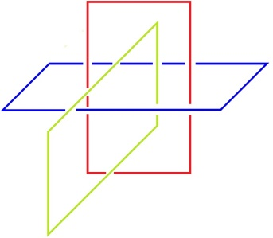
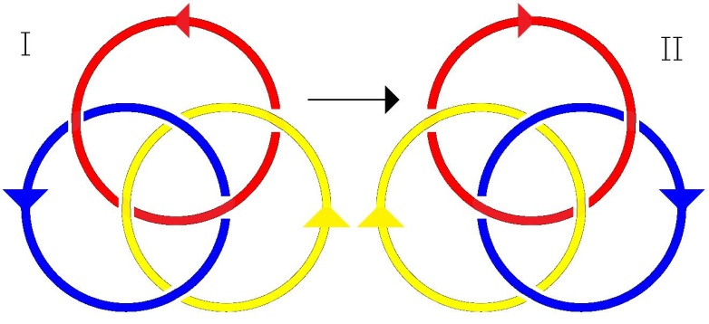
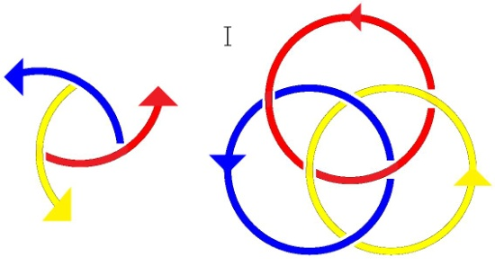
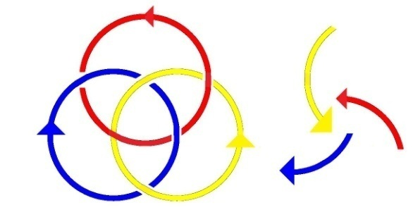
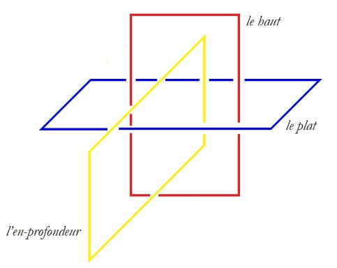
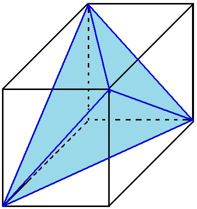
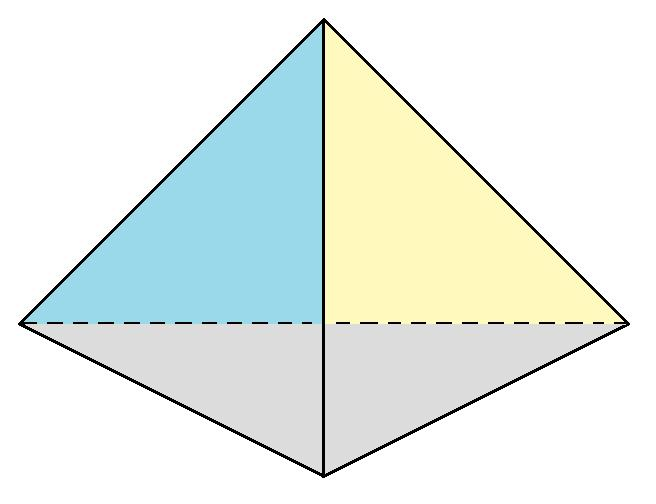

# Leçon 13 | 14 Mai 1974

  

    <label><input type="checkbox" data-lacan-toggle="original" checked> 原文</label>
    <label><input type="checkbox" data-lacan-toggle="notes" checked> 注释</label>
    <label><input type="checkbox" data-lacan-toggle="commentary" checked> 个人解读评论</label>
  

  <form class="lacan-tool-search" role="search">
    <input class="lacan-tool-search-input" type="search" placeholder="搜索全文" aria-label="搜索全文">
    <button class="lacan-tool-button" type="submit" title="搜索">搜索</button>
  </form>
  <button class="lacan-tool-button lacan-back-to-top" type="button" title="回到页面最上方" aria-label="回到页面最上方">↑</button>

<section class="parallel-paragraph" data-paragraph-ids="s21-13-0001">

s21-13-0001

原文 · s21-13-0001

Les *non-dupes* errent...

[无对应译文]

</section>

<section class="parallel-paragraph" data-paragraph-ids="s21-13-0002">

s21-13-0002

原文 · s21-13-0002

Ça ne veut pas dire que les dupes n’errent pas.

[无对应译文]

</section>

<section class="parallel-paragraph" data-paragraph-ids="s21-13-0003">

s21-13-0003

原文 · s21-13-0003

Si nous partons de ce qui se propose comme une affirmation, disons que c’est introduire par cette affirmation que les non-non-dupes « *pourraient bien* » - sans plus - ne pas errer.

[无对应译文]

</section>

<section class="parallel-paragraph" data-paragraph-ids="s21-13-0004">

s21-13-0004

原文 · s21-13-0004

*Mais déjà ceci nous introduit à la question que pose la double négation*.

[无对应译文]

</section>

<section class="parallel-paragraph" data-paragraph-ids="s21-13-0005">

s21-13-0005

原文 · s21-13-0005

N’être pas non-dupe, est-ce que ça se ramène à être dupe ? Ceci suppose, et ne suppose rien de moins :

[无对应译文]

</section>

<section class="parallel-paragraph" data-paragraph-ids="s21-13-0006">

s21-13-0006

原文 · s21-13-0006

- qu’il y a un *univers*,

[无对应译文]

</section>

<section class="parallel-paragraph" data-paragraph-ids="s21-13-0007">

s21-13-0007

原文 · s21-13-0007

- qu’on puisse avancer que l’*univers*, tout énoncé le divise

[无对应译文]

</section>

<section class="parallel-paragraph" data-paragraph-ids="s21-13-0008">

s21-13-0008

原文 · s21-13-0008

- qu’on puisse dire : « *l’hom­me* », et que si on le dit, je veux dire : de le dire tout le reste devient *« non-homme »*.

[无对应译文]

</section>

<section class="parallel-paragraph" data-paragraph-ids="s21-13-0009">

s21-13-0009

原文 · s21-13-0009

Un logicien...

[无对应译文]

</section>

<section class="parallel-paragraph" data-paragraph-ids="s21-13-0010">

s21-13-0010

原文 · s21-13-0010

> puisque j’avance que *la logique c’est la science du Réel* ...un logicien a fait un pas, bien longtemps après Aristote.

[无对应译文]

</section>

<section class="parallel-paragraph" data-paragraph-ids="s21-13-0011">

s21-13-0011

原文 · s21-13-0011

Qu’il ait fallu attendre [Boole](http://serge.mehl.free.fr/chrono/Boole.html) pour qu’en 1853 sorte « *An Investigation of Laws of Thought », Une Investigation sur les Lois de la pensée* [^27], qui sur Aristote a déjà cet avantage d’être un pas, une tentative de coller à ce qu’il prétend *observer, fonder en somme a posteriori,* comme constituant « *Les lois de la pensée »*. Que fait-il ?

[无对应译文]

</section>

<section class="parallel-paragraph" data-paragraph-ids="s21-13-0012">

s21-13-0012

原文 · s21-13-0012

Il écrit très précisément ce que je viens de vous dire, c’est à savoir qu’à partir de quoi que ce soit qui se dise, qui s’énonce...

[无对应译文]

</section>

<section class="parallel-paragraph" data-paragraph-ids="s21-13-0013">

s21-13-0013

原文 · s21-13-0013

> et les choses pour lui sont telles qu’il ne peut faire que d’avancer l’idée de *l’univers* ...il la symbolise par un chiffre, un chiffre qui convient, c’est le chiffre **1**.

[无对应译文]

</section>

<section class="parallel-paragraph" data-paragraph-ids="s21-13-0014">

s21-13-0014

原文 · s21-13-0014

Il écrira donc...

[无对应译文]

</section>

<section class="parallel-paragraph" data-paragraph-ids="s21-13-0015">

s21-13-0015

原文 · s21-13-0015

> de tout ce qui se propose comme notable dans cet *univers* ...il écrira donc x... il le laisse vide cet « x », puisque c’est là le principe de l’usage de cette lettre, c’est : « quoi que ce soit qui soit notable dans l’univers ». ...« *x* *multiplié par* 1-*x, ceci ne peut que s’égaler à zéro* » : *x* (*1-x* ) *= 0*

[无对应译文]

</section>

<section class="parallel-paragraph" data-paragraph-ids="s21-13-0016">

s21-13-0016

原文 · s21-13-0016

Ceci ne peut, pour peu qu’on donne ce sens à la *multiplication,* que noter l’*intersection*.

[无对应译文]

</section>

<section class="parallel-paragraph" data-paragraph-ids="s21-13-0017">

s21-13-0017

原文 · s21-13-0017

C’est de là qu’il part.

[无对应译文]

</section>

<section class="parallel-paragraph" data-paragraph-ids="s21-13-0018">

s21-13-0018

原文 · s21-13-0018

C’est en tant que x est *notable* dans l’univers, que quelque chose se sustente seulement du « *non* » : aux *hommes* s’opposant les « *non-hommes* » comme tels, tout ce qui subsiste comme *notable* étant là considéré comme subsistant comme tel.

[无对应译文]

</section>

<section class="parallel-paragraph" data-paragraph-ids="s21-13-0019">

s21-13-0019

原文 · s21-13-0019

Or, il est clair que ce qui est *notable* n’est pas comme tel *individuel*, que déjà dans cette façon de poser *l’ex-sistence logique,* il y a quelque chose, qui dès le départ, paraît fâcheux : comment se fait-il qu’il soit posé sans critique le thème de « *l’univers »* ?

[无对应译文]

</section>

<section class="parallel-paragraph" data-paragraph-ids="s21-13-0020">

s21-13-0020

原文 · s21-13-0020

Si je crois pouvoir cette année supporter du nœud borro­méen quelque chose, qui certes n’est pas une définition du sujet, du sujet comme tel d’un univers, c’est en cela - fais-je une fois de plus remarquer - que ma tentative n’a rien de *métaphysique*, je veux dire à ce propos que *la métaphysique est ce qui se dis­tingue de supposer comme tel le sujet, le sujet d’une connaissance*.

[无对应译文]

</section>

<section class="parallel-paragraph" data-paragraph-ids="s21-13-0021">

s21-13-0021

原文 · s21-13-0021

C’est en tant qu’elle suppose un sujet, que la *métaphysique* se distingue de ce dont ici j’essaie d’articuler les éléments, à savoir ceux d’une pratique, et ceci dans le fil de l’avoir définie comme se distinguant de quelque chose qui est de *pure place*, de *pure topologie*, et qui fait de là s’engendrer la définition...

[无对应译文]

</section>

<section class="parallel-paragraph" data-paragraph-ids="s21-13-0022">

s21-13-0022

原文 · s21-13-0022

> située seulement de la place de cette pratique ...de ce qui s’annonce dès lors, s’avance comme étant *trois autres discours*. \[*Discours du Maître, Discours Universitaire, Discours de l’Hystérique (science)*\]

[无对应译文]

</section>

<section class="parallel-paragraph" data-paragraph-ids="s21-13-0023">

s21-13-0023

原文 · s21-13-0023

C’est là un fait, un fait de *discours*, un fait par lequel j’es­saie de donner au *discours analytique* sa place d’*ex-sistence*.

[无对应译文]

</section>

<section class="parallel-paragraph" data-paragraph-ids="s21-13-0024">

s21-13-0024

原文 · s21-13-0024

Qu’est-ce qui, à proprement parler, *ex-siste* ?

[无对应译文]

</section>

<section class="parallel-paragraph" data-paragraph-ids="s21-13-0025">

s21-13-0025

原文 · s21-13-0025

N’*ex-siste*...

[无对应译文]

</section>

<section class="parallel-paragraph" data-paragraph-ids="s21-13-0026">

s21-13-0026

原文 · s21-13-0026

> comme l’or­thographe dont je modifie ce terme le marque ...*n’ex-siste* dans toute pra­tique, que ce qui fait fondement du *dire*, je veux dire : ce que *le dire* appor­te comme *instance* dans cette pratique.

[无对应译文]

</section>

<section class="parallel-paragraph" data-paragraph-ids="s21-13-0027">

s21-13-0027

原文 · s21-13-0027

C’est à ce titre que j’essaie de situer sous ces trois termes, *le Symbolique, l’Imaginaire et le Réel*, la triple catégorie qui fait *nœud*, et par là donne son sens à cette pratique. Car cette pratique non seulement a un sens, mais fait surgir « *un type de sens »* qui éclaire les autres sens au point de les remettre en cause, je veux dire de *les suspendre*.

[无对应译文]

</section>

<section class="parallel-paragraph" data-paragraph-ids="s21-13-0028">

s21-13-0028

原文 · s21-13-0028

À quoi, comme articulation...

[无对应译文]

</section>

<section class="parallel-paragraph" data-paragraph-ids="s21-13-0029">

s21-13-0029

原文 · s21-13-0029

> articulation dont au terme d’un progrès fait pour susciter, chez ceux qui soutiennent cette pratique,
>
> l’idée de ce qu’est pour eux le *Réel* ...je dis : *<u>le Réel c’est l’écri­ture</u>*.

[无对应译文]

</section>

<section class="parallel-paragraph" data-paragraph-ids="s21-13-0030">

s21-13-0030

原文 · s21-13-0030

*L’écriture de* rien d’autre que *ce nœud* *tel qu’il s’écrit pour le dire*, tel qu’il s’écrit *quand il est, selon la loi de l’écriture, mis à plat*.

[无对应译文]

</section>

<section class="parallel-paragraph" data-paragraph-ids="s21-13-0031">

s21-13-0031

原文 · s21-13-0031

Et je sou­mets ce que j’énonce, à cette épreuve de *mettre en suspens la distinction*...

[无对应译文]

</section>

<section class="parallel-paragraph" data-paragraph-ids="s21-13-0032">

s21-13-0032

原文 · s21-13-0032

> la distinction justement subjective ...de *l’Imaginaire, du Symbolique et du Réel*, en tant qu’ils pourraient en quelque sorte déjà porter avec eux un sens, un sens qui les hiérarchiserait, en ferait un 1,2,3... \[*suspension du sens → « non ordinal », que du sériel cantorien → « cardinal »*\]

[无对应译文]

</section>

<section class="parallel-paragraph" data-paragraph-ids="s21-13-0033">

s21-13-0033

原文 · s21-13-0033

Bien sûr ceci n’évitera pas que nous ne retombions sur un autre sens, comme déjà il a pu vous apparaître du fait de ce que j’accentue de l’association :

[无对应译文]

</section>

<section class="parallel-paragraph" data-paragraph-ids="s21-13-0034">

s21-13-0034

原文 · s21-13-0034

- du *Réel* avec un **3**,

[无对应译文]

</section>

<section class="parallel-paragraph" data-paragraph-ids="s21-13-0035">

s21-13-0035

原文 · s21-13-0035

- de l’*Imaginaire* avec un **2**,

[无对应译文]

</section>

<section class="parallel-paragraph" data-paragraph-ids="s21-13-0036">

s21-13-0036

原文 · s21-13-0036

- et *du Réel justement* \[*lap­sus*\]... et du *Symbolique* justement, avec l’**1**.

[无对应译文]

</section>

<section class="parallel-paragraph" data-paragraph-ids="s21-13-0037">

s21-13-0037

原文 · s21-13-0037

Quelque chose dans les termes du *Symbolique*, se pose comme **1** : *est-ce un* **1** *soutenable d’aucune individuation dans* *l’univers* ?

[无对应译文]

</section>

<section class="parallel-paragraph" data-paragraph-ids="s21-13-0038">

s21-13-0038

原文 · s21-13-0038

C’est la question que je pose, et dès maintenant je l’avancerai sous cette forme, c’est à savoir de poser *la question*, à propos de l’écritu­re de Boole : si le **1** que Boole avance comme suffisant à répartir la véri­té, s’il y a *x*, il n’est pas vrai que l’*x soustrait du* **1** \[1-*x* \] soit autre chose que tout le reste de nommable ?

[无对应译文]

</section>

<section class="parallel-paragraph" data-paragraph-ids="s21-13-0039">

s21-13-0039

原文 · s21-13-0039

Il n’y a là rien que de saisissant, à constater que Boole lui-même...

[无对应译文]

</section>

<section class="parallel-paragraph" data-paragraph-ids="s21-13-0040">

s21-13-0040

原文 · s21-13-0040

> à écrire ce qui résulte de l’écriture de ces termes dans une formule mathématique ...soit amené à y fonder que le propre de *tout x* \[;\] - de *tout x* en tant qu’énon­cé - c’est que *x – x* 2 = 0 , ce qui s’écrit : *x* = *x* 2*...* ...je veux dire à se supporter d’une formule mathématique.

[无对应译文]

</section>

<section class="parallel-paragraph" data-paragraph-ids="s21-13-0041">

s21-13-0041

原文 · s21-13-0041

Il est étrange que là une note de son livre, livre dont je vous ai donné tout à l’heure la date, la date majeure en ce sens que c’est à partir de là qu’un nouveau départ de la spéculation logique s’est pris, et qu’un nommé Charles Sanders Peirce...

[无对应译文]

</section>

<section class="parallel-paragraph" data-paragraph-ids="s21-13-0042">

s21-13-0042

原文 · s21-13-0042

> dont je vous ai déjà parlé ...peut par exemple améliorer, à son dire, la formulation de Boole en en montrant qu’en certains points, il puisse en résulter qu’elle se fourvoie, disons.

[无对应译文]

</section>

<section class="parallel-paragraph" data-paragraph-ids="s21-13-0043">

s21-13-0043

原文 · s21-13-0043

Ceci à mettre en évidence ce qui résulte des *fonctions à deux variables*, à savoir non pas seulement *x*, mais *x* et *y*, et en y montrant ce où moi-même j’ai cru devoir prendre que la fonction dite « *du rapport* » peut là servir à nous montrer que - pour ce qui est du sexuel - ce rapport ne peut pas s’écrire.

[无对应译文]

</section>

<section class="parallel-paragraph" data-paragraph-ids="s21-13-0044">

s21-13-0044

原文 · s21-13-0044

*Pourquoi* - se demande Boole - *plutôt que d’écrire* : *x* = *x* 2 *et l’inverse*, *ne pourrait-on écrire *: *x* = *x* 3 ?

[无对应译文]

</section>

<section class="parallel-paragraph" data-paragraph-ids="s21-13-0045">

s21-13-0045

原文 · s21-13-0045

Il est frappant que Boole...

[无对应译文]

</section>

<section class="parallel-paragraph" data-paragraph-ids="s21-13-0046">

s21-13-0046

原文 · s21-13-0046

> et ceci à par­tir de la notion de *la vérité* comme séparant radicalement
>
> ce qu’il en est de l’**1** et du **0**, car c’est du **0** qu’il connote l’*erreur* ...il est frap­pant que cet *univers*, dès lors solidaire comme tel de la fonction de *la vérité,* lui paraisse limiter l’écriture...

[无对应译文]

</section>

<section class="parallel-paragraph" data-paragraph-ids="s21-13-0047">

s21-13-0047

原文 · s21-13-0047

> l’écriture de ce qu’il en est de la fonc­tion logique ...à la *puissance **2*** de *x*, quand la *puissance **3*** il se la refuse.

[无对应译文]

</section>

<section class="parallel-paragraph" data-paragraph-ids="s21-13-0048">

s21-13-0048

原文 · s21-13-0048

Il se la refuse pour ceci : que mathématiquement *elle ne serait sup­posable dans l’écriture* que d’y ajouter un nouveau terme du produit, ce qu’il ne se refuse certes pas quand il s’agit de faire fonctionner l’opéra­tion multiplication, il écrit à l’occasion *x y z* , et il peut, selon les cas, marquer que *x y z*...

[无对应译文]

</section>

<section class="parallel-paragraph" data-paragraph-ids="s21-13-0049">

s21-13-0049

原文 · s21-13-0049

tels que les variables ont été situées d’une certaine fonction ...que *x y z* par exemple égale aussi zéro \[*x . y . z* = 0\].

[无对应译文]

</section>

<section class="parallel-paragraph" data-paragraph-ids="s21-13-0050">

s21-13-0050

原文 · s21-13-0050

Mais puisqu’il se limite à des valeurs **0** et **1**, elle peut aussi bien prendre la fonction...

[无对应译文]

</section>

<section class="parallel-paragraph" data-paragraph-ids="s21-13-0051">

s21-13-0051

原文 · s21-13-0051

> la fonction prenant sa valeur d’un certain chiffrage **0** et **1** pour chacun des trois ...il peut, à faire *x, y* et *z* cha­cun égal à **1**, s’apercevoir que ça n’est pas **0** qui en est le fruit.

[无对应译文]

</section>

<section class="parallel-paragraph" data-paragraph-ids="s21-13-0052">

s21-13-0052

原文 · s21-13-0052

Ainsi, qu’est-ce qui peut l’empêcher d’ajouter à son 1*–* *x* , un 1*+x,* et de l’ajouter non pas comme addition, de l’ajouter comme terme de la multiplication ?

[无对应译文]

</section>

<section class="parallel-paragraph" data-paragraph-ids="s21-13-0053">

s21-13-0053

原文 · s21-13-0053

Il voit alors très bien que (1 *–* x) multiplié par (1+x) donnant 1 *–* x2, il aboutira - je n’ai pas besoin de vous le souligner - à ceci : c’est que *x – x* 3 sera égal à 0 et que de ce fait *x* s’égalera à *x* 3 : *x* (1 *– x*) (1 *+ x*) = *0,  x – x* 3 = *0, x* = *x* 3.

[无对应译文]

</section>

<section class="parallel-paragraph" data-paragraph-ids="s21-13-0054">

s21-13-0054

原文 · s21-13-0054

Pourquoi s’arrête-t-il - dans quoi ? - dans *l’interprétation de* ce que pourrait être cet *x* en tant justement qu’*<u>ajouté</u>* à *l’univers* [^28].

[无对应译文]

</section>

<section class="parallel-paragraph" data-paragraph-ids="s21-13-0055">

s21-13-0055

原文 · s21-13-0055

*Est­-ce que ce n’est pas le propre de ce qui, à l’univers <u>ex-siste</u>, que de s’y ajouter ?*

[无对应译文]

</section>

<section class="parallel-paragraph" data-paragraph-ids="s21-13-0056">

s21-13-0056

原文 · s21-13-0056

C’est proprement ce que nous faisons tous les jours, et juste­ment ce que je désigne d’un plus \[+\] à le supporter de *l’objet(a)*.

[无对应译文]

</section>

<section class="parallel-paragraph" data-paragraph-ids="s21-13-0057">

s21-13-0057

原文 · s21-13-0057

Mais alors ceci nous suggère, nous suggère ceci : c’est à savoir de nous deman­der si le *Un* dont il s’agit, c’est bel et bien l’*univers*, à considérer en tant qu’*ensemble,* *collection* *de tout ce qui y est individuable*.

[无对应译文]

</section>

<section class="parallel-paragraph" data-paragraph-ids="s21-13-0058">

s21-13-0058

原文 · s21-13-0058

*Je suggère...*

[无对应译文]

</section>

<section class="parallel-paragraph" data-paragraph-ids="s21-13-0059">

s21-13-0059

原文 · s21-13-0059

il m’est suggéré disons *...*à propos de cette *écriture* de Boole, de fonder ce qu’il institue de l’univers*...*

[无对应译文]

</section>

<section class="parallel-paragraph" data-paragraph-ids="s21-13-0060">

s21-13-0060

原文 · s21-13-0060

car c’est comme tel qu’il l’articule, qu’il lui donne son sens *...de supposer que ce Un, loin de sur­gir de l’univers, surgit de la jouissance*.

[无对应译文]

</section>

<section class="parallel-paragraph" data-paragraph-ids="s21-13-0061">

s21-13-0061

原文 · s21-13-0061

*De la jouissance* et pas de n’im­porte laquelle : *de la jouissance dite phallique*.

[无对应译文]

</section>

<section class="parallel-paragraph" data-paragraph-ids="s21-13-0062">

s21-13-0062

原文 · s21-13-0062

Et ceci pour autant que l’expérience analytique nous en démontre l’importance : que de cette suite ce qui se pose comme *logique*...

[无对应译文]

</section>

<section class="parallel-paragraph" data-paragraph-ids="s21-13-0063">

s21-13-0063

原文 · s21-13-0063

> comme signifiant mais *littéral*, je veux dire *inscriptible*, en tant que l’*inscription*
>
> c’est de là que surgit dans notre expérience, *la fonction du Réel,* du moins \[ *–* \] , si vous me suivez, ...que *quelque chose comme un x à cette jouissance puisse s’ajouter* \[+\], *et consti­tuer* ce que déjà j’ai défini comme fondant « *le* *plus-de-jouir »*.

[无对应译文]

</section>

<section class="parallel-paragraph" data-paragraph-ids="s21-13-0064">

s21-13-0064

原文 · s21-13-0064

Il reste que Boole est loin de ne pas indiquer que ce n’est pas seule­ment le rapport de *la jouissance* au *plus-de-jouir*, en tant que le *plus-de-jouir* ce serait justement ce qui *ex-siste* - *ex-siste* à quoi ? – justement *au nœud* dont j’essaie pour l’instant de vous éclairer l’usage et la fonction.

[无对应译文]

</section>

<section class="parallel-paragraph" data-paragraph-ids="s21-13-0065">

s21-13-0065

原文 · s21-13-0065

Il voit très bien que pour aboutir à la fonction *x* = *x* 3...

[无对应译文]

</section>

<section class="parallel-paragraph" data-paragraph-ids="s21-13-0066">

s21-13-0066

原文 · s21-13-0066

> et non plus seule­ment *x* 2 *...*il voit très bien que le tiers terme : le terme (1*+ x*) peut s’écrire autrement et nommément (*–*1 *– x*)...

[无对应译文]

</section>

<section class="parallel-paragraph" data-paragraph-ids="s21-13-0067">

s21-13-0067

原文 · s21-13-0067

> je veux dire (*–*1 *– x*) pris dans une parenthèse ...ce qui équivaut mathématiquement...

[无对应译文]

</section>

<section class="parallel-paragraph" data-paragraph-ids="s21-13-0068">

s21-13-0068

原文 · s21-13-0068

> je veux dire en tant que *l’écriture* est ce qui est mathématique ...ce qui peut s’inscrire ici d’un « *moins* » avant la parenthèse et de (-1- *x*) mis à l’intérieur : *–* (*–*1 *– x*).

[无对应译文]

</section>

<section class="parallel-paragraph" data-paragraph-ids="s21-13-0069">

s21-13-0069

原文 · s21-13-0069

J’écris : *–* (*–*1 *– x*) et je dis que c’est équivalent à l’addition ici de (1+*x*) et que Boole les ajoute pour les repousser, pour les repousser en tant que la logique serait destinée à assurer le statut de *la vérité*.

[无对应译文]

</section>

<section class="parallel-paragraph" data-paragraph-ids="s21-13-0070">

s21-13-0070

原文 · s21-13-0070

Mais pour l’instant ce à quoi nous visons, n’est pas de donner son sta­tut à *la vérité*, puisque *la vérité,* nous le disons, ne s’énonce jamais que du *mi-dire*, qu’il est proprement impensable - sinon au lieu du *dire* - de marquer qu’une proposition n’est pas vraie, et de la marquer d’une barre : une barre supérieure qui l’exclut et la marque du signe du faux.

[无对应译文]

</section>

<section class="parallel-paragraph" data-paragraph-ids="s21-13-0071">

s21-13-0071

原文 · s21-13-0071

Dans *l’ordre des choses*...

[无对应译文]

</section>

<section class="parallel-paragraph" data-paragraph-ids="s21-13-0072">

s21-13-0072

原文 · s21-13-0072

> en tant que le symbole est fait pour y *ex-sister* \[*ex-sister à « lordre des choses » : le symbole <u>s’écrit</u> comme l’impossible, exogène au signifiant* \] ...dans cet *ordre des choses*, il est proprement...

[无对应译文]

</section>

<section class="parallel-paragraph" data-paragraph-ids="s21-13-0073">

s21-13-0073

原文 · s21-13-0073

> quoi qu’en dise Boole, étudiant ou prétendant faire le statut de la pensée ...il est impensable justement

[无对应译文]

</section>

<section class="parallel-paragraph" data-paragraph-ids="s21-13-0074">

s21-13-0074

原文 · s21-13-0074

- de cliver quoi que ce soit de dénommable,

[无对应译文]

</section>

<section class="parallel-paragraph" data-paragraph-ids="s21-13-0075">

s21-13-0075

原文 · s21-13-0075

- de cliver d’un pur « *non* » pour désigner *ce qui n’est pas nommé*. \[→ : §\]

[无对应译文]

</section>

<section class="parallel-paragraph" data-paragraph-ids="s21-13-0076">

s21-13-0076

原文 · s21-13-0076

Est-ce à dire que nous devions mettre à l’épreuve ce qui résulte du *x* 3 = *x *?

[无对应译文]

</section>

<section class="parallel-paragraph" data-paragraph-ids="s21-13-0077">

s21-13-0077

原文 · s21-13-0077

Assurément c’est déjà quelque chose d’y voir fonctionner ce **3** dont je marque comme tel *le Réel*, et c’est ici que nous allons reprendre notre nœud borroméen.

[无对应译文]

</section>

<section class="parallel-paragraph" data-paragraph-ids="s21-13-0078">

s21-13-0078

原文 · s21-13-0078

Le nœud borroméen, si tant est

[无对应译文]

</section>

<section class="parallel-paragraph" data-paragraph-ids="s21-13-0079">

s21-13-0079

原文 · s21-13-0079

- que son énoncé *ex-siste* à la pratique analytique,

[无对应译文]

</section>

<section class="parallel-paragraph" data-paragraph-ids="s21-13-0080">

s21-13-0080

原文 · s21-13-0080

- que c’est lui qui permet de la supporter, je voudrais, à vous en montrer une fois de plus l’exemple, dans cet espace qui est le nôtre, sans que nous sachions à l’heure qu’il est - et ceci malgré les citations d’Aristote - quel est le nombre des dimensions de cet espace, j’entends celui-là même où, des choses, nous *nommons*.

[无对应译文]

</section>

<section class="parallel-paragraph" data-paragraph-ids="s21-13-0081">

s21-13-0081

原文 · s21-13-0081

Regardez, ceci est la même chose que ce que j’ai d’abord dessiné au tableau :

[无对应译文]

</section>

<section class="parallel-paragraph" data-paragraph-ids="s21-13-0082">

s21-13-0082

原文 · s21-13-0082

[无对应译文]

</section>

<section class="parallel-paragraph" data-paragraph-ids="s21-13-0083">

s21-13-0083

原文 · s21-13-0083

C’est à savoir que vous avez ici un rond, un rond de ficelle*...*

[无对应译文]

</section>

<section class="parallel-paragraph" data-paragraph-ids="s21-13-0084">

s21-13-0084

原文 · s21-13-0084

> comme on l’a appelé justement la première fois que j’ai introduit cette fonction ...ce rond de ficelle, ces 3 ronds de ficelle, les voici.

[无对应译文]

</section>

<section class="parallel-paragraph" data-paragraph-ids="s21-13-0085">

s21-13-0085

原文 · s21-13-0085

Vous voyez qu’ils tiennent ensemble pour autant qu’il y en a un que j’ai mis ici horizontal, les deux autres étant verticaux et les verticaux se croisant.

[无对应译文]

</section>

<section class="parallel-paragraph" data-paragraph-ids="s21-13-0086">

s21-13-0086

原文 · s21-13-0086

Il est évident que ceci n’est pas nouable... \[lapsus\] n’est pas *dénouable*.

[无对应译文]

</section>

<section class="parallel-paragraph" data-paragraph-ids="s21-13-0087">

s21-13-0087

原文 · s21-13-0087

Le nœud borroméen a fait, comme tel, travailler beaucoup de personnes ici, qui m’en ont même envoyé des témoignages.

[无对应译文]

</section>

<section class="parallel-paragraph" data-paragraph-ids="s21-13-0088">

s21-13-0088

原文 · s21-13-0088

Celui-ci est sa forme la plus simple.

[无对应译文]

</section>

<section class="parallel-paragraph" data-paragraph-ids="s21-13-0089">

s21-13-0089

原文 · s21-13-0089

Il est frappant que dans les travaux...

[无对应译文]

</section>

<section class="parallel-paragraph" data-paragraph-ids="s21-13-0090">

s21-13-0090

原文 · s21-13-0090

> ce sont de véritables travaux qui m’ont été envoyés sur ce point ...travaux qui font leur part à toutes sortes *d’autres façons* - *il y en a d’innombrables* - *de nouer ces* 3 de façon telle qu’ils permettent, avec le dénouement d’1 seul de ces 3 ronds, de libérer exactement tous les autres, et je vous l’ai dit, quel qu’en soit le nombre.

[无对应译文]

</section>

<section class="parallel-paragraph" data-paragraph-ids="s21-13-0091">

s21-13-0091

原文 · s21-13-0091

Mais pour nous limiter au **3**, puisque ce **3** colle avec nos **3** fonctions de *l’Imaginaire, du Symbolique et du Réel*, ceci très précisément de ne pas les distinguer, de voir jusqu’où le fait qu’ils soient **3**, et de ce fait d’en faire la logique même du *Réel*, à savoir de voir à quel moment nous allons pouvoir voir surgir...

[无对应译文]

</section>

<section class="parallel-paragraph" data-paragraph-ids="s21-13-0092">

s21-13-0092

原文 · s21-13-0092

> simplement de ces **3**, strictement équivalents, comme vous pouvez immédiatement le percevoir ...de ces **3** de faire surgir l’amorce de ce qui y serait diffé­renciation.

[无对应译文]

</section>

<section class="parallel-paragraph" data-paragraph-ids="s21-13-0093">

s21-13-0093

原文 · s21-13-0093

La différenciation s’amorce de ceci, dont je suis étonné que dans ces travaux que j’ai reçus, personne ne me l’ait fait remarquer, voici : par ces 3, tels qu’ils sont ici disposés, sont déter­minés, disons 8 quadrants : 1, 2, 3, 4, 5, 6, 7, 8.

[无对应译文]

</section>

<section class="parallel-paragraph" data-paragraph-ids="s21-13-0094">

s21-13-0094

原文 · s21-13-0094

J’en prends un quel­conque et de ce quadrant je tire la mise à plat, celle qu’ici vous allez voir...

[无对应译文]

</section>

<section class="parallel-paragraph" data-paragraph-ids="s21-13-0095">

s21-13-0095

原文 · s21-13-0095

> vous allez voir de là où vous êtes, mais à être où je suis, c’est certai­nement exactement pareil ...c’est à savoir que vous voyez que quelque chose s’y trouve déjà, du fait de la mise à plat, s’y trouve déjà orienté.

[无对应译文]

</section>

<section class="parallel-paragraph" data-paragraph-ids="s21-13-0096">

s21-13-0096

原文 · s21-13-0096

Je veux dire que vous voyez certainement la même inscription du nœud qui est celle que je vois, c’est à savoir dans l’occasion, pour ce que je vous ai montré, à avoir pris mon nœud de la façon exhibée, c’est que par la mise à plat quelque chose se dessine qui s’inscrit à en suivre la forme, qui s’inscrit de la *dextrogyrie*.

[无对应译文]

</section>

<section class="parallel-paragraph" data-paragraph-ids="s21-13-0097">

s21-13-0097

原文 · s21-13-0097

Une fois mis à plat tel qu’il est et retourné, je sais d’avance que c’est la même *dextrogyrie*.

[无对应译文]

</section>

<section class="parallel-paragraph" data-paragraph-ids="s21-13-0098">

s21-13-0098

原文 · s21-13-0098

Il suffit de faire ce petit travail, enfin d’en imagi­ner *le retournement*, et ceci aussi peut s’écrire, *on verra que ça n’est pas l’image en miroir*, qu’à retourner le nœud borroméen *vous ne voyez pas quelque chose qui en est* *l’image en miroir*.

[无对应译文]

</section>

<section class="parallel-paragraph" data-paragraph-ids="s21-13-0099">

s21-13-0099

原文 · s21-13-0099

Est-ce que ceci ne rend pas d’au­tant plus frappant ce fait, c’est qu’à reprendre mes quadrants...

[无对应译文]

</section>

<section class="parallel-paragraph" data-paragraph-ids="s21-13-0100">

s21-13-0100

原文 · s21-13-0100

> met­tons que tout à l’heure j’ai choisi - je ne sais pas si c’est effectivement ce que j’ai fait - celui-là, pour vous :
>
> en haut à droite, si je prends celui que non seulement j’ai dit en haut et à droite mais je dis aussi en avant ...si je prends celui non plus en haut à droite et en avant, mais en bas à gauche et en arrière, celui qui lui est strictement opposé, et si c’est de là que je pars pour le mettre à plat de la même façon que j’ai fait précédemment, il est tout à fait notable, et vous pourrez le vérifier, que ce qui résultera de cette mise à plat sera une façon dont le nœud se coince, dont le nœud se serre, exactement inverse, c’est à savoir *lévogyre*.

[无对应译文]

</section>

<section class="parallel-paragraph" data-paragraph-ids="s21-13-0101">

s21-13-0101

原文 · s21-13-0101

Il sort donc du seul maniement déjà du nœud borroméen, il surgit une distinction qui est de l’ordre de l’*orientation*.

[无对应译文]

</section>

<section class="parallel-paragraph" data-paragraph-ids="s21-13-0102">

s21-13-0102

原文 · s21-13-0102

Si l’un est dans le sens des aiguilles d’une montre, l’autre sera dans le sens inverse.

[无对应译文]

</section>

<section class="parallel-paragraph" data-paragraph-ids="s21-13-0103">

s21-13-0103

原文 · s21-13-0103

Il ne faut certes pas nous étonner que quelque chose de cet ordre puisse se produire, puisque c’est dans la nature des choses que l’espace soit orien­té, c’est même de là que procède la fonction dite de « *l’image en miroir* » et de toute symétrie.

[无对应译文]

</section>

<section class="parallel-paragraph" data-paragraph-ids="s21-13-0104">

s21-13-0104

原文 · s21-13-0104

Je m’excuse de l’âpreté de ce que mon discours d’aujourd’hui implique.

[无对应译文]

</section>

<section class="parallel-paragraph" data-paragraph-ids="s21-13-0105">

s21-13-0105

原文 · s21-13-0105

Simplement, je vous note que ce fait de l’orientation pour les quadrants opposés est quelque chose qui nous indique déjà qu’il est conforme à la structure...

[无对应译文]

</section>

<section class="parallel-paragraph" data-paragraph-ids="s21-13-0106">

s21-13-0106

原文 · s21-13-0106

> du seul fait que l’orientation surgisse du seul support, du seul support *nodal* dont ici je prends arme ...il est concevable de ces ronds eux-mêmes y marquer un sens, c’est-à-dire une orientation.

[无对应译文]

</section>

<section class="parallel-paragraph" data-paragraph-ids="s21-13-0107">

s21-13-0107

原文 · s21-13-0107

En d’autres termes, pour prendre le dernier, celui qui est écrit ici \[I\], de nous poser la question de ce qui résulte de faire l’usage d’une orientation conforme à celle que nous avons obtenue de 2 espèces et de 2 seulement qui sont différentes, c’est à savoir de nous rendre compte qu’il en résultera une figure telle que sa périphérie marquera de ce fait la même orientation. Que faut-il pour qu’une de ces figures se trans­forme dans l’autre, à savoir celle-ci également complétée \[II\] ?

[无对应译文]

</section>

<section class="parallel-paragraph" data-paragraph-ids="s21-13-0108">

s21-13-0108

原文 · s21-13-0108

[无对应译文]

</section>

<section class="parallel-paragraph" data-paragraph-ids="s21-13-0109">

s21-13-0109

原文 · s21-13-0109

Vous avez vu, à mon hésitation, la marque même de la difficulté qui se rencontre dans le maniement des dits « *ronds de ficelle* ».

[无对应译文]

</section>

<section class="parallel-paragraph" data-paragraph-ids="s21-13-0110">

s21-13-0110

原文 · s21-13-0110

Celle-ci est l’image de l’autre en miroir.

[无对应译文]

</section>

<section class="parallel-paragraph" data-paragraph-ids="s21-13-0111">

s21-13-0111

原文 · s21-13-0111

Mais qu’est-ce qui suffit à transformer l’une dans l’autre ?

[无对应译文]

</section>

<section class="parallel-paragraph" data-paragraph-ids="s21-13-0112">

s21-13-0112

原文 · s21-13-0112

Quelque chose qui est définissable de la très simple façon suivante : c’est à savoir que tel que vous voyez le nœud borroméen s’étaler, vous voyez que l’un quelconque d’entre eux se manifeste de couper chacun des deux autres d’une façon telle *que l’un étant libéré, l’un étant sectionné, les deux autres soient libres*.

[无对应译文]

</section>

<section class="parallel-paragraph" data-paragraph-ids="s21-13-0113">

s21-13-0113

原文 · s21-13-0113

Ce qui veut dire que : *un de ces ronds peut tour­ner autour d’un des deux autres*, et que ceci à soi tout seul nous donne­ra un nouveau nœud borroméen.

[无对应译文]

</section>

<section class="parallel-paragraph" data-paragraph-ids="s21-13-0114">

s21-13-0114

原文 · s21-13-0114

La loi de ce qui se passe dans l’occa­sion est celle-ci : vous n’avez ici qu’à...

[无对应译文]

</section>

<section class="parallel-paragraph" data-paragraph-ids="s21-13-0115">

s21-13-0115

原文 · s21-13-0115

> je m’excuse de ne pas avoir de craie de couleur, ça serait mieux, je la crayonne ...qu’est-ce qui se passe si nous rabattons un de ces nœuds, un de ces ronds, autour d’un autre ?

[无对应译文]

</section>

<section class="parallel-paragraph" data-paragraph-ids="s21-13-0116">

s21-13-0116

原文 · s21-13-0116

C’est très exactement ceci que nous obtenons.

[无对应译文]

</section>

<section class="parallel-paragraph" data-paragraph-ids="s21-13-0117">

s21-13-0117

原文 · s21-13-0117

Nous obtenons de ce fait une nouvelle figure qui a pour propriété d’être de l’espèce de celle-ci, c’est à savoir que vous le voyez : la figure se pré­sente ainsi, nous avons ceci qui est resté invariable, et deux autres éléments.

[无对应译文]

</section>

<section class="parallel-paragraph" data-paragraph-ids="s21-13-0118">

s21-13-0118

原文 · s21-13-0118

 

[无对应译文]

</section>

<section class="parallel-paragraph" data-paragraph-ids="s21-13-0119">

s21-13-0119

原文 · s21-13-0119

Voilà : les deux autres éléments qui présentent la sorte d’orientation qui est celle qui est définie ici, c’est à savoir que par rapport à ceci : ceci étant marqué de *a* par exemple vous aurez à la suite une présentation comme ceci, c’est à savoir si ceci est *b*, vous aurez une inversion de sens du *b* et du *c* et une inversion d’orien­tation de leur courbe, les choses se complétant de la façon suivante. Voilà.

[无对应译文]

</section>

<section class="parallel-paragraph" data-paragraph-ids="s21-13-0120">

s21-13-0120

原文 · s21-13-0120

Ce qui importe est ceci : c’est de voir qu’à inverser le *a*, ce qui en résulte, c’est une orientation totalement différente du serrage du nœud, à savoir que du seul fait que nous ayons renversé un des ronds, les deux autres éléments...

[无对应译文]

</section>

<section class="parallel-paragraph" data-paragraph-ids="s21-13-0121">

s21-13-0121

原文 · s21-13-0121

ceux que nous n’avons pas inversés ...les deux autres élé­ments changent de direction.

[无对应译文]

</section>

<section class="parallel-paragraph" data-paragraph-ids="s21-13-0122">

s21-13-0122

原文 · s21-13-0122

Je veux dire que, comme il est concevable, le segment que je sectionne dans ce cafouillage, le segment qui se trouve sectionné par retournement de ce rond qui était d’abord là, le segment a changé de sens, c’est à savoir que à l’un, à celui-ci, cet autre segment et celui-ci viennent se raccorder d’une façon,

[无对应译文]

</section>

<section class="parallel-paragraph" data-paragraph-ids="s21-13-0123">

s21-13-0123

原文 · s21-13-0123

- que nous appellerons si vous le voulez bien, *centripète*,

[无对应译文]

</section>

<section class="parallel-paragraph" data-paragraph-ids="s21-13-0124">

s21-13-0124

原文 · s21-13-0124

- alors qu’auparavant les trois étaient *centrifuges*.

[无对应译文]

</section>

<section class="parallel-paragraph" data-paragraph-ids="s21-13-0125">

s21-13-0125

原文 · s21-13-0125

C’est bien en quoi, quand nous retournerons *un rond de ficelle* de plus, ce *rond de ficelle* restera dans son orientation primitive pour le segment lui-même que nous allons avoir à retourner, à savoir que si maintenant, après avoir retourné *a* nous retournons *b*, *b* se trouvera garder le sens *centripète*, mais alors ce sont les deux autres, à savoir un *centrifuge* et un *centripète*, qui s’inverseront de sorte que le résultat en sera : le *centripète* devenant *centrifuge* et le *centrifuge* deve­nant *centripète*, nous aurons de nouveau ici un *centrifuge* et deux *centripètes*. Mais celui qui sera *centrifuge* sera un des *centripètes* retournés.

[无对应译文]

</section>

<section class="parallel-paragraph" data-paragraph-ids="s21-13-0126">

s21-13-0126

原文 · s21-13-0126

Est-ce qu’il faut que je refasse tout, ou est-ce que quelqu’un a suivi ?

[无对应译文]

</section>

<section class="parallel-paragraph" data-paragraph-ids="s21-13-0127">

s21-13-0127

原文 · s21-13-0127

Je me suis exposé à ne même pas regarder de notes, pour cette simple raison, c’est que c’est la difficulté même du maniement, le *peu imaginable*, si on peut dire, de ce nœud borroméen dont nous essayons de tirer parti, c’est cela même que je ne suis pas mécontent de mettre en valeur, n’est-ce pas, \[Rires\] de mettre en valeur d’une façon...

[无对应译文]

</section>

<section class="parallel-paragraph" data-paragraph-ids="s21-13-0128">

s21-13-0128

原文 · s21-13-0128

voilà, après le 2ème tour, n’est-ce pas, un lévogyre comme le précédent qui s’est repro­duit, et c’est en tant que nous avons retourné le *b* après avoir retourné le *a* que nous obtenons ceci que nous avons

[无对应译文]

</section>

<section class="parallel-paragraph" data-paragraph-ids="s21-13-0129">

s21-13-0129

原文 · s21-13-0129

- un centripète à la place du centrifuge ici,

[无对应译文]

</section>

<section class="parallel-paragraph" data-paragraph-ids="s21-13-0130">

s21-13-0130

原文 · s21-13-0130

- et un centrifuge à la place du centripète qui est ici.

[无对应译文]

</section>

<section class="parallel-paragraph" data-paragraph-ids="s21-13-0131">

s21-13-0131

原文 · s21-13-0131

Par conséquent, nous avons ici c, a, et b.

[无对应译文]

</section>

<section class="parallel-paragraph" data-paragraph-ids="s21-13-0132">

s21-13-0132

原文 · s21-13-0132

On m’a posé la question...

[无对应译文]

</section>

<section class="parallel-paragraph" data-paragraph-ids="s21-13-0133">

s21-13-0133

原文 · s21-13-0133

> on m’a posé la question *dans un endroit où on travaillait* \[*sic*\] ...on m’a posé la question de savoir quel rapport avait ce nœud borroméen avec ce que j’avais énoncé des 4... je dirai options, dites « *d’identification sexuée* ». En d’autres termes, quel rapport pouvait avoir ceci avec le : : § / § ; ! . !

[无对应译文]

</section>

<section class="parallel-paragraph" data-paragraph-ids="s21-13-0134">

s21-13-0134

原文 · s21-13-0134

Je vais maintenant essayer de vous le dire.

[无对应译文]

</section>

<section class="parallel-paragraph" data-paragraph-ids="s21-13-0135">

s21-13-0135

原文 · s21-13-0135

Supposons que nous don­nions à ceci cette position en quadrant que nous désignons selon la marque dans les coordonnées cartésiennes, les 8 quadrants en ques­tion.

[无对应译文]

</section>

<section class="parallel-paragraph" data-paragraph-ids="s21-13-0136">

s21-13-0136

原文 · s21-13-0136

Vous devez voir, vous apercevoir que... prenons ici le quadrant en haut à droite et en avant, c’est par le rabattement du rond de ficelle ici marqué, je veux dire en tant que ce rond de ficelle, celui-ci donc, est tenu de celui-ci, à savoir celui que j’appellerai « *l’en-­profondeur* », nous appellerons celui-ci « *le* *haut* », et celui-ci « *le* *plat* ».

[无对应译文]

</section>

<section class="parallel-paragraph" data-paragraph-ids="s21-13-0137">

s21-13-0137

原文 · s21-13-0137

[无对应译文]

</section>

<section class="parallel-paragraph" data-paragraph-ids="s21-13-0138">

s21-13-0138

原文 · s21-13-0138

Bon, alors « *le plat* » vient ici, et c’est celui-ci qui vient là \[Lacan fait la démonstration sur un nœud tenu à la main\], donc : *vert, bleu, rouge*, c’est comme ça que les choses se présenteront. Bon, c’est un petit peu différent. Voilà. Vous vous donnerez un peu de mal vous-mêmes, pour faire les choses, parce qu’après tout, je m’aper­çois que ça ne va pas si aisément. Bon.

[无对应译文]

</section>

<section class="parallel-paragraph" data-paragraph-ids="s21-13-0139">

s21-13-0139

原文 · s21-13-0139

L’important est ceci : c’est de marquer que c’est à rabattre celui-là...

[无对应译文]

</section>

<section class="parallel-paragraph" data-paragraph-ids="s21-13-0140">

s21-13-0140

原文 · s21-13-0140

> nommément « *le vertical *» \[« *le haut* »\] vers « *l’en-­profondeur* », à rabattre celui-ci...

[无对应译文]

</section>

<section class="parallel-paragraph" data-paragraph-ids="s21-13-0141">

s21-13-0141

原文 · s21-13-0141

> c’est-à-dire celui qui était d’abord bien marqué à sa place ici ...c’est à le rabattre ainsi que nous allons obtenir le rond, *le nœud borroméen* tel qu’il se situe dans ce quadrant...

[无对应译文]

</section>

<section class="parallel-paragraph" data-paragraph-ids="s21-13-0142">

s21-13-0142

原文 · s21-13-0142

> à gauche du quadrant quelconque d’où nous sommes partis ...dans ce quadrant donc, avec inversion de *la lévogyrie*, c’est-à-dire passage à *la dextrogyrie*, puisque celui que j’ai fait en bas était un *lévogyre*.

[无对应译文]

</section>

<section class="parallel-paragraph" data-paragraph-ids="s21-13-0143">

s21-13-0143

原文 · s21-13-0143

Je l’ai pris ainsi parce que tels que les nœuds sont disposés, tels que *les ronds de ficelle* sont disposés, c’est ainsi que cela se noue.

[无对应译文]

</section>

<section class="parallel-paragraph" data-paragraph-ids="s21-13-0144">

s21-13-0144

原文 · s21-13-0144

Donc nous avons là *une inversion*. Ce qui veut dire que pour prendre les choses, à les placer comme ici par exemple,

[无对应译文]

</section>

<section class="parallel-paragraph" data-paragraph-ids="s21-13-0145">

s21-13-0145

原文 · s21-13-0145

- dans ce quadrant-là, nous avons - à passer dans celui-ci - nous avons *une première inversion*,

[无对应译文]

</section>

<section class="parallel-paragraph" data-paragraph-ids="s21-13-0146">

s21-13-0146

原文 · s21-13-0146

- à passer dans celui-ci, nous avons *une seconde inversion*, ...donc dans quelque direction, à condition que ce soit une direction de symétrie par rapport à un des plans d’intersection, nous avons aux trois extrémités, un changement sur *le nœud borroméen*, nous avons *une inversion*.

[无对应译文]

</section>

<section class="parallel-paragraph" data-paragraph-ids="s21-13-0147">

s21-13-0147

原文 · s21-13-0147

Bon, si nous passons par ici, c’est-à-dire que nous franchissons du haut en bas, nous avons *une nouvelle inversion*, c’est-à-dire un retour de ce qui était ici, du *lévogyre*. Ces opérations sont commutatives à savoir qu’à passer ainsi, nous arrivons au même retour.

[无对应译文]

</section>

<section class="parallel-paragraph" data-paragraph-ids="s21-13-0148">

s21-13-0148

原文 · s21-13-0148

[无对应译文]

</section>

<section class="parallel-paragraph" data-paragraph-ids="s21-13-0149">

s21-13-0149

原文 · s21-13-0149

En d’autres termes, c’est aux 4 points d’opposition, c’est-à-dire sur les huit quadrants, à quatre quadrants définissables par, si je puis dire *l’inscription dans le cube d’un tétraèdre*, c’est à cela que nous allons voir apparaître 4 figures homogènes, toutes les trois, dans l’occasion, *lévogyres*, puisque nous sommes partis d’un *lévogyre*. Bon. Qu’en résul­te-t-il ?

[无对应译文]

</section>

<section class="parallel-paragraph" data-paragraph-ids="s21-13-0150">

s21-13-0150

原文 · s21-13-0150

Comment considérer cette multiplication, si je puis dire par 4, de ce qui résulte de simplement la mise à plat, ou l’écriture, du nœud borroméen. Je propose simplement ceci...

[无对应译文]

</section>

<section class="parallel-paragraph" data-paragraph-ids="s21-13-0151">

s21-13-0151

原文 · s21-13-0151

> que vu l’heure je n’aurai à commenter que la prochaine fois ...c’est ceci : si, comme vous venez de le voir, c’est d’une figure tétraédrique qu’il s’agit, une figure tétraédrique en tant qu’elle est produite par la bascule de 2 des ronds de ficelle, et on peut dire 2 quels qu’ils soient.

[无对应译文]

</section>

<section class="parallel-paragraph" data-paragraph-ids="s21-13-0152">

s21-13-0152

原文 · s21-13-0152

Quels qu’ils soient, nous revenons à la figure *lévogyre* pour la spécifier.

[无对应译文]

</section>

<section class="parallel-paragraph" data-paragraph-ids="s21-13-0153">

s21-13-0153

原文 · s21-13-0153

Nous y revenons, quel que soit celui des deux qui a été rabattu, il en restera un qui n’a pas été rabattu.

[无对应译文]

</section>

<section class="parallel-paragraph" data-paragraph-ids="s21-13-0154">

s21-13-0154

原文 · s21-13-0154

Celui qui reste est évidemment le 3ème, je veux dire celui qui reste après que 2 autres aient été rabattus.

[无对应译文]

</section>

<section class="parallel-paragraph" data-paragraph-ids="s21-13-0155">

s21-13-0155

原文 · s21-13-0155

Que par exemple, si nous faisons de ces ronds de ficelle, *le Symbolique, l’Imaginaire et le Réel*, ce qui restera en fin, et qui restera dans une position centrifuge, ceci encore faut-il que vous le vérifiiez, je veux dire que vous vous aperceviez que c’est à basculer S et I qu’à la fin le R reste centrifuge.

[无对应译文]

</section>

<section class="parallel-paragraph" data-paragraph-ids="s21-13-0156">

s21-13-0156

原文 · s21-13-0156

Il y a pour cela une bonne raison, c’est que si vous avez bien vu la figure dernière, c’est le R, à savoir disons le *Réel*, qu’il faudra basculer pour obtenir la figure dernière, qui elle-même sera *dextrogyre* et sera tout entière centrifuge.

[无对应译文]

</section>

<section class="parallel-paragraph" data-paragraph-ids="s21-13-0157">

s21-13-0157

原文 · s21-13-0157

C’est une façon commode pour vous de retenir ce qu’il en est au deuxième temps de ce qui se passe après deux bascules, puisque vous devez, comme je vous l’ai montré, vous devez tout à l’heure retrouver dans le quadrant strictement opposé, celui dont je vous ai parlé quand je vous ai fait cette remarque, cette remarque de ce qui n’avait pas été trouvé, à savoir qu’en passant d’un quadrant au quadrant strictement opposé, au quadrant contradictoire, au quadrant diagonal, nous obtenons *un nœud* ...

[无对应译文]

</section>

<section class="parallel-paragraph" data-paragraph-ids="s21-13-0158">

s21-13-0158

原文 · s21-13-0158

> un nœud non plus si nous sommes partis du *lévogyre* ...nous obtenons *un nœud dextrogyre*. Bien.

[无对应译文]

</section>

<section class="parallel-paragraph" data-paragraph-ids="s21-13-0159">

s21-13-0159

原文 · s21-13-0159

Donc, vérifiez tout ceci à l’occasion, enfin, en faisant des petites mani­pulations comme celles que j’ai si bien ratées devant vous, et vous verrez en somme ceci : qu’à se maintenir dans le nœud lévogyre, nous obtenons ce que j’ai qualifié ou spécifié d’un tétraèdre, puisque vous voyez com­ment les choses se passent.

[无对应译文]

</section>

<section class="parallel-paragraph" data-paragraph-ids="s21-13-0160">

s21-13-0160

原文 · s21-13-0160

Vous pouvez faire, reconstituer : ici par exemple vous avez à prendre une des faces du carré, vous le tirez, vous reconstituerez le cube à partir de ceci, c’est que c’est toujours dans une disposition diagonale par rapport à une des faces du cube que se trouvent les quadrants qui sont de la même espèce d’orientation, et nommément dans l’occasion, de l’espèce *lévogyre*.

[无对应译文]

</section>

<section class="parallel-paragraph" data-paragraph-ids="s21-13-0161">

s21-13-0161

原文 · s21-13-0161

Je vais seulement vous suggérer ceci, c’est qu’il en sort...

[无对应译文]

</section>

<section class="parallel-paragraph" data-paragraph-ids="s21-13-0162">

s21-13-0162

原文 · s21-13-0162

> à partir de *la fonction de la jouissance* \[!\], ...il en sort ceci, c’est que quelque part dans une de ces extrémités du tétraèdre :

[无对应译文]

</section>

<section class="parallel-paragraph" data-paragraph-ids="s21-13-0163">

s21-13-0163

原文 · s21-13-0163

- quelque part se situe le / §. *Il n’y a pas de X à dire non à* !,

[无对应译文]

</section>

<section class="parallel-paragraph" data-paragraph-ids="s21-13-0164">

s21-13-0164

原文 · s21-13-0164

- quelque part - et nous allons le mettre : : § - *quelque part il y a quelque chose qui dit non à* !,

[无对应译文]

</section>

<section class="parallel-paragraph" data-paragraph-ids="s21-13-0165">

s21-13-0165

原文 · s21-13-0165

- quelque part il y a ; !. *À savoir que tous en font fonction*,

[无对应译文]

</section>

<section class="parallel-paragraph" data-paragraph-ids="s21-13-0166">

s21-13-0166

原文 · s21-13-0166

- et quelque part vous avez . !. *Pas toutes*...

[无对应译文]

</section>

<section class="parallel-paragraph" data-paragraph-ids="s21-13-0167">

s21-13-0167

原文 · s21-13-0167

Ce n’est pas pour rien que je l’ai mis sous cette forme, à savoir une forme de base si vous voulez :

[无对应译文]

</section>

<section class="parallel-paragraph" data-paragraph-ids="s21-13-0168">

s21-13-0168

原文 · s21-13-0168

[无对应译文]

</section>

<section class="parallel-paragraph" data-paragraph-ids="s21-13-0169">

s21-13-0169

原文 · s21-13-0169

: § / §

[无对应译文]

</section>

<section class="parallel-paragraph" data-paragraph-ids="s21-13-0170">

s21-13-0170

原文 · s21-13-0170

> ; ! . !

[无对应译文]

</section>

<section class="parallel-paragraph" data-paragraph-ids="s21-13-0171">

s21-13-0171

原文 · s21-13-0171

Nous aurons en quelque sorte à mettre en question ceci : le « pas », non pas « *le pas exclusif »* comme celui de tout à l’heure, le « pas » de ce qui existe à dire non à la fonction phallique.

[无对应译文]

</section>

<section class="parallel-paragraph" data-paragraph-ids="s21-13-0172">

s21-13-0172

原文 · s21-13-0172

Nous aurons d’autre part ce qui y dit oui, mais qui est dédoublé, à savoir :

[无对应译文]

</section>

<section class="parallel-paragraph" data-paragraph-ids="s21-13-0173">

s21-13-0173

原文 · s21-13-0173

- qu’il y a le *tous*, d’une part,

[无对应译文]

</section>

<section class="parallel-paragraph" data-paragraph-ids="s21-13-0174">

s21-13-0174

原文 · s21-13-0174

- et d’autre part le *pas-tous,* autrement dit ce que j’ai qualifié du « *pas-toutes »*.

[无对应译文]

</section>

<section class="parallel-paragraph" data-paragraph-ids="s21-13-0175">

s21-13-0175

原文 · s21-13-0175

Est-ce qu’il ne vous apparaît pas que c’est là un programme, à savoir prendre dans ce qui est sujet à l’examen, prendre la critique de ce qu’il en est du *pas*, de ce qu’implique le « *dire non* », c’est à savoir l’interdit, et très nom­mément, en fin de compte, ce qui se spécifiant de dire non à la fonction !, dit non à la fonction phallique.

[无对应译文]

</section>

<section class="parallel-paragraph" data-paragraph-ids="s21-13-0176">

s21-13-0176

原文 · s21-13-0176

Le *dire-non à la fonction phallique*, c’est ce que nous appelons dans le discours analytique, *la fonction de la castration* : : §

[无对应译文]

</section>

<section class="parallel-paragraph" data-paragraph-ids="s21-13-0177">

s21-13-0177

原文 · s21-13-0177

Il y a ce qui dit oui à la fonction phallique, et le dit en tant que *tout*, c’est-à-dire, très nommément un certain type qui est tout à fait nécessité par la définition de ce que nous appelons « l’homme ».

[无对应译文]

</section>

<section class="parallel-paragraph" data-paragraph-ids="s21-13-0178">

s21-13-0178

原文 · s21-13-0178

Vous savez que le *pas-tout* m’a très essentiellement servi à marquer qu’*il n’y a pas de* « *La femme »* \[car : / §\], c’est à savoir qu’il n’y en a, si je puis dire, que diverses, et en quelque sorte une par une, \[*dénombrement d’un ensemble infini ouvert*\] et que tout cela se trouve en quelque sorte dominé par la fonction privilégiée de ceci : qu’il n’y en a néanmoins pas une à représenter le dire qui interdit, à savoir *l’absolument-non*.

[无对应译文]

</section>

<section class="parallel-paragraph" data-paragraph-ids="s21-13-0179">

s21-13-0179

原文 · s21-13-0179

Voilà.

[无对应译文]

</section>

<section class="parallel-paragraph" data-paragraph-ids="s21-13-0180">

s21-13-0180

原文 · s21-13-0180

Alors, puisqu’il y a un examen maintenant, j’ai simplement amorcé la chose aujourd’hui.

[无对应译文]

</section>

<section class="parallel-paragraph" data-paragraph-ids="s21-13-0181">

s21-13-0181

原文 · s21-13-0181

Je vous demande pardon d’y avoir mis si longtemps, nous reprendrons la prochaine fois.

[无对应译文]

</section>

<section class="note-block original-notes">

## Notes

[^27]:
    #  George Boole : *Les lois de la pensée*, Vrin, Coll. Mathesis, 2002.

[^28]: Cf. l’exposé de Jacques-Alain Miller dans le cadre du séminaire 1966-67 : « *Logique du fantasme* », séance du 30-11-1966.

</section>
