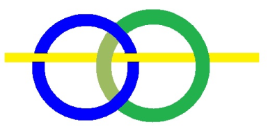
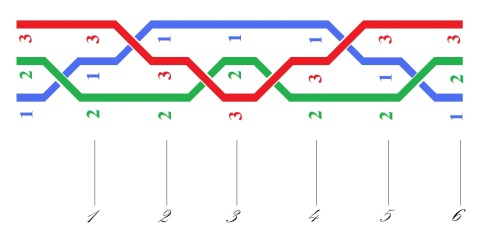
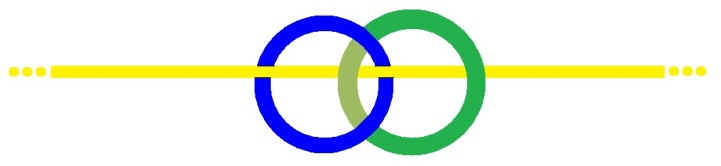
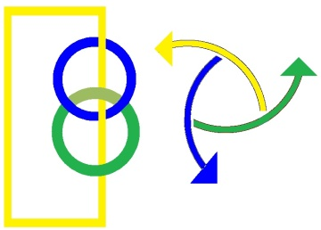
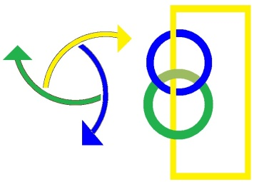
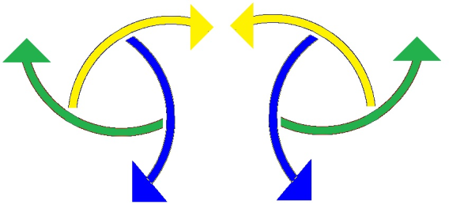

# Leçon 14 | 21 Mai 1974

  <label><input type="checkbox" data-lacan-toggle="original" checked> 原文</label>
  <label><input type="checkbox" data-lacan-toggle="notes" checked> 注释</label>
  <label><input type="checkbox" data-lacan-toggle="commentary" checked> 个人解读评论</label>

<section class="parallel-paragraph" data-paragraph-ids="s21-14-0001">

s21-14-0001

[无对应译文]

原文 · s21-14-0001

*Je m’excuse de ce retard et vous remercie de m’avoir attendu*.

</section>

<section class="parallel-paragraph" data-paragraph-ids="s21-14-0002">

s21-14-0002

[无对应译文]

原文 · s21-14-0002

Vous voyez que je persévère quant à ce fondement que cette année je donne à mon discours dans le nœud borroméen.

</section>

<section class="parallel-paragraph" data-paragraph-ids="s21-14-0003">

s21-14-0003

[无对应译文]

原文 · s21-14-0003

Le nœud borroméen est ici justifié de matérialiser, de présenter cette référence à *l’écriture*.

</section>

<section class="parallel-paragraph" data-paragraph-ids="s21-14-0004">

s21-14-0004

[无对应译文]

原文 · s21-14-0004

Le nœud borroméen n’est, dans l’occasion, que *mode d’écriture*.

</section>

<section class="parallel-paragraph" data-paragraph-ids="s21-14-0005">

s21-14-0005

[无对应译文]

原文 · s21-14-0005

Il se trouve en somme présentifier le registre du *Réel*.

</section>

<section class="parallel-paragraph" data-paragraph-ids="s21-14-0006">

s21-14-0006

[无对应译文]

原文 · s21-14-0006

Quand, au départ, je me suis interrogé sur ce qu’était l’inconscient, je n’ai entendu le prendre qu’au niveau de ce qui constitue effectivement l’expérience analytique.

</section>

<section class="parallel-paragraph" data-paragraph-ids="s21-14-0007">

s21-14-0007

[无对应译文]

原文 · s21-14-0007

À ce moment, je n’avais d’aucune façon élaboré *le discours* comme tel, la notion, *la fonction de* *discours* ne devait venir que plus tard. C’est pour autant que *ce discours* est <u>où</u> se situe un *lien social* et donc, il faut le dire, *politique*, c’est pour autant que ce *discours* le situe, que j’ai parlé de *discours*.

</section>

<section class="parallel-paragraph" data-paragraph-ids="s21-14-0008">

s21-14-0008

[无对应译文]

原文 · s21-14-0008

Mais je ne partais que de *l’expérience*, et dans cette *expérience*, il est clair que le langage, que quelque chose qui incontestablement s’impose de la pratique de l’analyse, que la pratique de l’analyse est fondée *sur un pathétique, sur un pathétique* qu’il s’agit de situer, et il s’agit de situer comment on y intervient.

</section>

<section class="parallel-paragraph" data-paragraph-ids="s21-14-0009">

s21-14-0009

[无对应译文]

原文 · s21-14-0009

Intervenir fait surgir la notion d’*acte*.

</section>

<section class="parallel-paragraph" data-paragraph-ids="s21-14-0010">

s21-14-0010

[无对应译文]

原文 · s21-14-0010

Il est essentiel également de la penser cette notion *d’acte*, et de démontrer comment il peut venir à consister d’un *dire*.

</section>

<section class="parallel-paragraph" data-paragraph-ids="s21-14-0011">

s21-14-0011

[无对应译文]

原文 · s21-14-0011

J’ai, « dans le temps » - comme on dit - cru devoir faire remarquer que l’analyste, non seulement n’opère que de parole, mais se spécifie de n’opérer que de cela.

</section>

<section class="parallel-paragraph" data-paragraph-ids="s21-14-0012">

s21-14-0012

[无对应译文]

原文 · s21-14-0012

Refusant cette intervention sur le corps, par exemple, qui passe par l’absorption, sous une forme quelconque, de substances qui entrent dès lors dans la dynamique chimique du corps par exemple « *les médicaments »*, on appelle ça.

</section>

<section class="parallel-paragraph" data-paragraph-ids="s21-14-0013">

s21-14-0013

[无对应译文]

原文 · s21-14-0013

Le point où j’en suis, c’est simplement quelque chose, le tour, c’est le cercle que vous voyez ici dessiné c’est qu’il y a *un lien* - mais il s’agit de savoir lequel - entre *le sexe et la parole*.

</section>

<section class="parallel-paragraph" data-paragraph-ids="s21-14-0014">

s21-14-0014

[无对应译文]

原文 · s21-14-0014

</section>

<section class="parallel-paragraph" data-paragraph-ids="s21-14-0015">

s21-14-0015

[无对应译文]

原文 · s21-14-0015

Il est clair que le sexe comporte la dua­lité de la structure corporelle, dualité qui se réfléchit en cascade, si on peut dire,

</section>

<section class="parallel-paragraph" data-paragraph-ids="s21-14-0016">

s21-14-0016

[无对应译文]

原文 · s21-14-0016

- sur la dualité par exemple du *soma* et du *germen*,

</section>

<section class="parallel-paragraph" data-paragraph-ids="s21-14-0017">

s21-14-0017

[无对应译文]

原文 · s21-14-0017

- sur l’oppo­sition du vivant au monde inanimé, etc.

</section>

<section class="parallel-paragraph" data-paragraph-ids="s21-14-0018">

s21-14-0018

[无对应译文]

原文 · s21-14-0018

La notion de *dua­lité* suffit-elle à homogénéiser tout ce qui est **2** ?

</section>

<section class="parallel-paragraph" data-paragraph-ids="s21-14-0019">

s21-14-0019

[无对应译文]

原文 · s21-14-0019

Vous voyez tout de suite que ce n’est pas vrai, la seule énumération que j’ai fait,

</section>

<section class="parallel-paragraph" data-paragraph-ids="s21-14-0020">

s21-14-0020

[无对应译文]

原文 · s21-14-0020

- de la dualité de structure corporelle,

</section>

<section class="parallel-paragraph" data-paragraph-ids="s21-14-0021">

s21-14-0021

[无对应译文]

原文 · s21-14-0021

- de la dualité du *soma* et du *germen*,

</section>

<section class="parallel-paragraph" data-paragraph-ids="s21-14-0022">

s21-14-0022

[无对应译文]

原文 · s21-14-0022

- de l’opposition du vivant au monde inanimé, ça doit vous suffire à voir que cette *polarité*, pour l’appeler par son nom, n’ho­mogénéise nullement *la série des pôles* dont il s’agit.

</section>

<section class="parallel-paragraph" data-paragraph-ids="s21-14-0023">

s21-14-0023

[无对应译文]

原文 · s21-14-0023

Elle ne suffit d’aucune façon à faire que la notion de *« monde »*, ou d’*« univers »*, soit corrélée à cette chose impensable qu’est *le sujet* en tant qu’il serait - quoi ? - *le reflet, la conscience du dit « monde »*.

</section>

<section class="parallel-paragraph" data-paragraph-ids="s21-14-0024">

s21-14-0024

[无对应译文]

原文 · s21-14-0024

Et ceci en raison de ce que j’appel­lerai *le pathétique des sens*.

</section>

<section class="parallel-paragraph" data-paragraph-ids="s21-14-0025">

s21-14-0025

[无对应译文]

原文 · s21-14-0025

Il n’y a pas lieu de s’émerveiller qu’il y ait un être pour « *connaître* » - quoi ? - le reste, et c’est évidemment de tout temps que la métaphore du rapport sexuel a été employée pour cette dualité patente.

</section>

<section class="parallel-paragraph" data-paragraph-ids="s21-14-0026">

s21-14-0026

[无对应译文]

原文 · s21-14-0026

Patente mais spécifiée, locale, distincte des autres duali­tés, d’où l’accent donné au mot « connaître » \[*au sens « biblique »*\].

</section>

<section class="parallel-paragraph" data-paragraph-ids="s21-14-0027">

s21-14-0027

[无对应译文]

原文 · s21-14-0027

D’où aussi l’idée d’*actif* et de *passif*, sans qu’on puisse savoir d’ailleurs dans cette polarité dite « *du sujet »* et *« du monde* », où est *l’actif*, où est *le passif*.

</section>

<section class="parallel-paragraph" data-paragraph-ids="s21-14-0028">

s21-14-0028

[无对应译文]

原文 · s21-14-0028

Il n’y a aucun besoin d’un actif pour que *le pathétique* subsiste et s’atteste dans notre vécu, comme on dit, nous souffrons.

</section>

<section class="parallel-paragraph" data-paragraph-ids="s21-14-0029">

s21-14-0029

[无对应译文]

原文 · s21-14-0029

C’est de ça qu’il s’agit, quand il s’agit de l’analyse.

</section>

<section class="parallel-paragraph" data-paragraph-ids="s21-14-0030">

s21-14-0030

[无对应译文]

原文 · s21-14-0030

Nous agissons aussi pour en sortir, de cette souffrance, et à l’occasion, nous nous y mettons à beaucoup.

</section>

<section class="parallel-paragraph" data-paragraph-ids="s21-14-0031">

s21-14-0031

[无对应译文]

原文 · s21-14-0031

Il s’agit de savoir ce que sont deux personnes, comme on dit...

</section>

<section class="parallel-paragraph" data-paragraph-ids="s21-14-0032">

s21-14-0032

[无对应译文]

原文 · s21-14-0032

> c’est-à-dire deux animaux situés d’une *organisation politique* très spécifiée par ce que j’ai appelé *un discours* ...il s’agit de savoir ce qu’est *le dire* d’un échange ritualisé de paroles, et ce qui est supposé être en jeu dans cet exercice, à savoir : *l’inconscient*.

</section>

<section class="parallel-paragraph" data-paragraph-ids="s21-14-0033">

s21-14-0033

[无对应译文]

原文 · s21-14-0033

Là, j’essaie de vous dire « *il y a du savoir dans le Réel »*, qui fonctionne sans que nous puissions savoir comment *l’articulation se fait* dans ce que nous sommes habitués à voir se réaliser.

</section>

<section class="parallel-paragraph" data-paragraph-ids="s21-14-0034">

s21-14-0034

[无对应译文]

原文 · s21-14-0034

Est-ce de cela qu’il s’agit et qu’il nous faudrait bien admettre comme relevant d’« *une pensée ordonnatrice* » ?

</section>

<section class="parallel-paragraph" data-paragraph-ids="s21-14-0035">

s21-14-0035

[无对应译文]

原文 · s21-14-0035

C’est le parti que prennent religion et métaphysique, qui sont en cela du même côté : elles se donnent la main dans les *suppositions* qu’elles ordonnent à l’être.

</section>

<section class="parallel-paragraph" data-paragraph-ids="s21-14-0036">

s21-14-0036

[无对应译文]

原文 · s21-14-0036

Alors ce que je veux dire, c’est que le *savoir inconscient*, celui que suppose Freud, se distingue de ce *savoir dans le* *Réel*...

</section>

<section class="parallel-paragraph" data-paragraph-ids="s21-14-0037">

s21-14-0037

[无对应译文]

原文 · s21-14-0037

> tel que, quoi qu’on en ait, même la science arrive à le faire providentiel, ce savoir ...c’est-à-dire que quelque chose - un sujet - l’assure comme harmonique.

</section>

<section class="parallel-paragraph" data-paragraph-ids="s21-14-0038">

s21-14-0038

[无对应译文]

原文 · s21-14-0038

Ce qu’avance Freud...

</section>

<section class="parallel-paragraph" data-paragraph-ids="s21-14-0039">

s21-14-0039

[无对应译文]

原文 · s21-14-0039

> mais ce n’est pas tout, je le note en passant ...c’est qu’il n’est pas providentiel, c’est qu’il est *dramatique*, fait de quelque chose qui part d’un défaut dans l’être, d’une *dysharmonie* entre la pensée et le monde.

</section>

<section class="parallel-paragraph" data-paragraph-ids="s21-14-0040">

s21-14-0040

[无对应译文]

原文 · s21-14-0040

Et que ce savoir est au cœur de ce quelque chose que nous dénommons « *ex-sistence »*, parce qu’elle insiste du dehors et qu’elle est dérangeante.

</section>

<section class="parallel-paragraph" data-paragraph-ids="s21-14-0041">

s21-14-0041

[无对应译文]

原文 · s21-14-0041

C’est en ce sens que *le rapport sexuel* se montre, chez l’être...

</section>

<section class="parallel-paragraph" data-paragraph-ids="s21-14-0042">

s21-14-0042

[无对应译文]

原文 · s21-14-0042

> que je ne suis pas le seul à caractériser d’« *être parlant »* ...se montre dérangé. Ceci en contraste avec tout ce qui semble se passer chez les autres êtres.

</section>

<section class="parallel-paragraph" data-paragraph-ids="s21-14-0043">

s21-14-0043

[无对应译文]

原文 · s21-14-0043

C’est même de là qu’est venue la distinction de la nature et de la culture.

</section>

<section class="parallel-paragraph" data-paragraph-ids="s21-14-0044">

s21-14-0044

[无对应译文]

原文 · s21-14-0044

Et très précisément cette nature, si je puis dire, il nous faut bien ici la caractériser de n’être pas si naturelle que ça.

</section>

<section class="parallel-paragraph" data-paragraph-ids="s21-14-0045">

s21-14-0045

[无对应译文]

原文 · s21-14-0045

Parce que de là où nous vivons, la nature ne s’impose pas, à nous ce qui s’impose c’est

</section>

<section class="parallel-paragraph" data-paragraph-ids="s21-14-0046">

s21-14-0046

[无对应译文]

原文 · s21-14-0046

- un autre mode de *savoir*,

</section>

<section class="parallel-paragraph" data-paragraph-ids="s21-14-0047">

s21-14-0047

[无对应译文]

原文 · s21-14-0047

- un *savoir* qui d’aucune façon n’est attribuable à un sujet qui présiderait à l’ordre,qui présiderait à l’harmonie, et c’est en cela que tout d’abord, dans mes premiers énoncés pour caractériser l’inconscient de Freud, il y avait une formule que je me trouve...

</section>

<section class="parallel-paragraph" data-paragraph-ids="s21-14-0048">

s21-14-0048

[无对应译文]

原文 · s21-14-0048

> où je suis revenu plusieurs fois ...que je me trouve avoir avancée à Sainte-Anne, qui est celle-ci :

</section>

<section class="parallel-paragraph" data-paragraph-ids="s21-14-0049">

s21-14-0049

[无对应译文]

原文 · s21-14-0049

« *Dieu ne croit pas en Dieu* ».

</section>

<section class="parallel-paragraph" data-paragraph-ids="s21-14-0050">

s21-14-0050

[无对应译文]

原文 · s21-14-0050

Dire « *Dieu ne croit pas en Dieu* » c’est exactement dire la même chose que de dire « *y’a d’l’inconscient* ».

</section>

<section class="parallel-paragraph" data-paragraph-ids="s21-14-0051">

s21-14-0051

[无对应译文]

原文 · s21-14-0051

Bien sûr, vu l’ordre d’auditoire que j’avais alors, à savoir les psychanalystes tels qu’ils pouvaient à cette époque se présenter, ça ne faisait aucun effet, ça ne faisait aucun effet mis à part ceci : qu’ils me posassent la question si moi j’y croyais.

</section>

<section class="parallel-paragraph" data-paragraph-ids="s21-14-0052">

s21-14-0052

[无对应译文]

原文 · s21-14-0052

Il y a quelqu’un depuis qui m’a défi­ni en disant que j’étais « *quelqu’un qui croyait qu’il était Lacan* », c’était la façon dont j’avais moi-même défini Napoléon, mais sur la fin de sa vie, au moment où en somme, il était fou, car croire en son propre nom, c’en est la définition même.

</section>

<section class="parallel-paragraph" data-paragraph-ids="s21-14-0053">

s21-14-0053

[无对应译文]

原文 · s21-14-0053

Contrairement à ce qu’imaginait le nommé Gabriel Marcel, je ne crois pas en Lacan.

</section>

<section class="parallel-paragraph" data-paragraph-ids="s21-14-0054">

s21-14-0054

[无对应译文]

原文 · s21-14-0054

Mais je pose la question de savoir s’il n’y a pas stricte consistance entre

</section>

<section class="parallel-paragraph" data-paragraph-ids="s21-14-0055">

s21-14-0055

[无对应译文]

原文 · s21-14-0055

- ce que Freud avance comme étant l’inconscient,

</section>

<section class="parallel-paragraph" data-paragraph-ids="s21-14-0056">

s21-14-0056

[无对应译文]

原文 · s21-14-0056

- et le fait que Dieu, il n’y ait personne pour y croire, sur­tout pas lui-même, car c’est en ça que consiste *le savoir de l’inconscient*.

</section>

<section class="parallel-paragraph" data-paragraph-ids="s21-14-0057">

s21-14-0057

[无对应译文]

原文 · s21-14-0057

*Le savoir de l’inconscient* est tout le contraire de l’instinct, c’est-à-dire de ce qui préside non seulement à l’idée de nature, mais à toute idée d’*harmonie*, c’est pour autant que quelque part il y a *cette faille* qui fait que *la chose la plus naturelle*, si l’on peut dire, celle qui nous paraît de notre point de vue, quand nous regardons - quoi ? - des animaux, soit de tout à fait « autres », des objets dans le monde, nous faisons là-dessus toutes les extrapolations que nous pouvons.

</section>

<section class="parallel-paragraph" data-paragraph-ids="s21-14-0058">

s21-14-0058

[无对应译文]

原文 · s21-14-0058

Ce que nous constatons c’est quelque chose qui, entre deux corps semble faire quelque chose qui incontestablement est tout à fait différent, d’ailleurs, chez la plupart des espèces, que le rapport du corps dit *masculin* à celui qui s’avoue *féminin*, à savoir qu’il y a en somme entre ces deux corps, je dirai très peu de ressemblance, alors que chez les animaux, ce qui est frappant c’est à quel point le mâle et la femelle...

</section>

<section class="parallel-paragraph" data-paragraph-ids="s21-14-0059">

s21-14-0059

[无对应译文]

原文 · s21-14-0059

> disons le mot pour aller vite et indiquer ma pensée ...sont narcissiques.

</section>

<section class="parallel-paragraph" data-paragraph-ids="s21-14-0060">

s21-14-0060

[无对应译文]

原文 · s21-14-0060

Alors je voudrais avancer aujourd’hui, parce qu’il faut quand même que j’avance quelque chose, quelque chose qui est *important.* C’est que si j’ai mis l’accent sur ceci : que ce qui au rapport sexuel fait obstacle, ce n’est rien d’autre que cette fonction que je me suis trouvé la dernière fois ré-écrire au tableau sous la forme !, et dont ce n’est pas pour rien que je l’ai écrite ainsi, mathématiquement : c’est pour autant que ce qui peut s’*écrire*, j’y fais confiance d’être dans la bonne direction pour en atteindre le *Réel*.

</section>

<section class="parallel-paragraph" data-paragraph-ids="s21-14-0061">

s21-14-0061

[无对应译文]

原文 · s21-14-0061

Qu’est-ce à dire ?

</section>

<section class="parallel-paragraph" data-paragraph-ids="s21-14-0062">

s21-14-0062

[无对应译文]

原文 · s21-14-0062

Est-ce que parce qu’ici il m’arrive quelquefois...

</section>

<section class="parallel-paragraph" data-paragraph-ids="s21-14-0063">

s21-14-0063

[无对应译文]

原文 · s21-14-0063

> dans toute la mesure où vous me le permettez à cause de ce micro ...*d’écrire* des choses au tableau, est-ce que c’est là ce qui supporte ma relation avec vous telle qu’elle s’instaure dans ce discours ?

</section>

<section class="parallel-paragraph" data-paragraph-ids="s21-14-0064">

s21-14-0064

[无对应译文]

原文 · s21-14-0064

Je ne le crois pas ! J’en pose sans cesse la question...

</section>

<section class="parallel-paragraph" data-paragraph-ids="s21-14-0065">

s21-14-0065

[无对应译文]

原文 · s21-14-0065

Ce que je veux pointer ici, c’est ceci qui importe, c’est que *je dis toujours la vérité*, et que cela s’inscrit dans *le Symbolique*.

</section>

<section class="parallel-paragraph" data-paragraph-ids="s21-14-0066">

s21-14-0066

[无对应译文]

原文 · s21-14-0066

*Je dis toujours la vérité*, non pas seulement que je la répète : *je fraye la voie qui fait exister* *un dire*, *et que votre rapport avec moi*, dans cette situation, *c’est que cela vous fait jouir*.

</section>

<section class="parallel-paragraph" data-paragraph-ids="s21-14-0067">

s21-14-0067

[无对应译文]

原文 · s21-14-0067

J’en ai plus d’une fois posé la question, je tourne autour, mais ce qui est certain c’est que là se trouve l’accent de ce *«* *juste dire* » que j’essaie d’énoncer pour autant qu’ailleurs sans doute, je prends appui sur *l’écriture*, mais que c’est du côté de *l’écriture* que se concentre ce où j’essaie d’interroger ce qu’il en est de *l’inconscient* quand je dis que *l’inconscient c’est quelque chose dans le Réel*.

</section>

<section class="parallel-paragraph" data-paragraph-ids="s21-14-0068">

s21-14-0068

[无对应译文]

原文 · s21-14-0068

J’ai dit « *savoir »* d’un autre côté, mais *j’ai aussi souligné ceci*, que si cette dimension de *savoir* touche aux *bords du* *Réel*...

</section>

<section class="parallel-paragraph" data-paragraph-ids="s21-14-0069">

s21-14-0069

[无对应译文]

原文 · s21-14-0069

> que c’est à saisir, à jouer avec ce que j’appellerai les fronces, *les bords du Réel* ...c’est pour autant *que je fais foi à ceci* : que *seule l’écriture supporte comme telle ce Réel*, que je peux dire quelque chose qui soit orienté simplement, simplement orienté.

</section>

<section class="parallel-paragraph" data-paragraph-ids="s21-14-0070">

s21-14-0070

[无对应译文]

原文 · s21-14-0070

Parce que « *dire la vérité »* c’est, si je puis dire, à la portée de tout le monde, et d’une certaine façon, *la vérité*, pour nous, dans l’expérience analytique, c’est notre étoffe.

</section>

<section class="parallel-paragraph" data-paragraph-ids="s21-14-0071">

s21-14-0071

[无对应译文]

原文 · s21-14-0071

C’est notre étoffe - en quoi ? - en ceci qu’elle est la vérité sur ce pathétique, sur cette souffrance que comme telle j’ai désignée, ce qui amène à ce cernage d’une expérience structurée comme un discours.

</section>

<section class="parallel-paragraph" data-paragraph-ids="s21-14-0072">

s21-14-0072

[无对应译文]

原文 · s21-14-0072

</section>

<section class="parallel-paragraph" data-paragraph-ids="s21-14-0073">

s21-14-0073

[无对应译文]

原文 · s21-14-0073

Et ces discours j’en ai tenté d’en faire l’articulation, mais *l’articulation écrite* : ce n’est qu’en cela que *quelque chose peut y témoigner du Réel*.

</section>

<section class="parallel-paragraph" data-paragraph-ids="s21-14-0074">

s21-14-0074

[无对应译文]

原文 · s21-14-0074

Alors de quoi s’agit-il quand la dernière fois je vous ai rappelé les *quatre termes*, les *quatre ponctuations*, ponctuations écrites de l’identification que je n’appellerai en l’occasion pas « *sexuelle* » mais « *sexuée* », quand j’ai rappelé que le nœud borroméen permettait de situer chacune de ces *écritures* dans quelque chose qui se repère à partir du *nœud primitif*, du nœud tel que je vous l’ai montré comme j’ai pu, avec *des ronds de ficelle* que je tenais dans la main, dans les quatre quadrants qu’ils déterminent à partir d’une 1ère mise à plat, en ceci qu’il faut que 2 de ces ronds...

</section>

<section class="parallel-paragraph" data-paragraph-ids="s21-14-0075">

s21-14-0075

[无对应译文]

原文 · s21-14-0075

> et j’ai dit 2 et pas le même puisque aussi bien, si c’était le même il reviendrait à la même place ...c’est à savoir qu’il en faut 2, 2 différents, pour qu’on parvienne à un quadrant qui s’homologue au premier mis à plat.

</section>

<section class="parallel-paragraph" data-paragraph-ids="s21-14-0076">

s21-14-0076

[无对应译文]

原文 · s21-14-0076

J’ai cru pouvoir à ce moment vous le montrer au tableau d’une façon qui était évidemment « aventurée », puisque comme vous avez pu le voir - et à ma grande exaspération - j’y ai pataugé, n’est-ce pas.

</section>

<section class="parallel-paragraph" data-paragraph-ids="s21-14-0077">

s21-14-0077

[无对应译文]

原文 · s21-14-0077

J’y ai pataugé parce que, chose curieuse, il y a en somme...

</section>

<section class="parallel-paragraph" data-paragraph-ids="s21-14-0078">

s21-14-0078

[无对应译文]

原文 · s21-14-0078

> c’est cela que cette expérience signifie ...il y a quelque chose de pas encore maîtrisé dans...

</section>

<section class="parallel-paragraph" data-paragraph-ids="s21-14-0079">

s21-14-0079

[无对应译文]

原文 · s21-14-0079

> vous le savez, je vous l’ai indiqué, je vous le rappelle ...de non encore maîtrisé dans ce qui est de *l’ordre des nœuds*.

</section>

<section class="parallel-paragraph" data-paragraph-ids="s21-14-0080">

s21-14-0080

[无对应译文]

原文 · s21-14-0080

C’est étrange, c’est singulier, quoique là déjà quelque chose a pu en être avancé : que le nœud borroméen ait été identifié à la tresse à six mouvements - six et pas trois, comme il semblerait pouvoir y paraître, c’est déjà quelque chose.

</section>

<section class="parallel-paragraph" data-paragraph-ids="s21-14-0081">

s21-14-0081

[无对应译文]

原文 · s21-14-0081

</section>

<section class="parallel-paragraph" data-paragraph-ids="s21-14-0082">

s21-14-0082

[无对应译文]

原文 · s21-14-0082

Et aujourd’hui ce que je vous montre, à rapporter à ce que je vous avais déjà marqué, déjà écrit comme étant la forme la plus simple du nœud borroméen, qui est très exactement celle-ci, c’est-à-dire celle où nulle part il n’y a un 3ème rond, le 3ème rond ici n’étant représenté que par une droite que vous me permettez de supposer infinie.

</section>

<section class="parallel-paragraph" data-paragraph-ids="s21-14-0083">

s21-14-0083

[无对应译文]

原文 · s21-14-0083

</section>

<section class="parallel-paragraph" data-paragraph-ids="s21-14-0084">

s21-14-0084

[无对应译文]

原文 · s21-14-0084

C’est une supposition tout à fait capitale, et en elle-même éclairante dirai-je, éclairante en ceci : qu’il est très connu, c’est la première remarque que toute élaboration des nœuds, celle d’un Artin [^29] par exemple...

</section>

<section class="parallel-paragraph" data-paragraph-ids="s21-14-0085">

s21-14-0085

[无对应译文]

原文 · s21-14-0085

> dont peut-être vous connaissez le volume, certains d’entre vous en tout cas se le sont sûrement procuré ...celle d’un Artin qui dit ceci : c’est qu’il n’y a qu’une seule façon sur une simple ligne d’affirmer que le nœud on ne peut pas le dénouer, c’est de deux choses l’une :

</section>

<section class="parallel-paragraph" data-paragraph-ids="s21-14-0086">

s21-14-0086

[无对应译文]

原文 · s21-14-0086

- ou que ses deux bouts s’étendent en effet à l’infini,

</section>

<section class="parallel-paragraph" data-paragraph-ids="s21-14-0087">

s21-14-0087

[无对应译文]

原文 · s21-14-0087

> ce qui rend impossible de méconnaître quoi que ce soit qui se soit formé en nœud,

</section>

<section class="parallel-paragraph" data-paragraph-ids="s21-14-0088">

s21-14-0088

[无对应译文]

原文 · s21-14-0088

- ou que les deux bouts s’en rejoignent, auquel cas il se contrôle si oui ou non c’est bien un nœud.

</section>

<section class="parallel-paragraph" data-paragraph-ids="s21-14-0089">

s21-14-0089

[无对应译文]

原文 · s21-14-0089

Qu’est-ce que ceci nous suggère comme remarque ?

</section>

<section class="parallel-paragraph" data-paragraph-ids="s21-14-0090">

s21-14-0090

[无对应译文]

原文 · s21-14-0090

C’est que si cette droite, cette droite dont consiste le nœud, borroméen en l’occasion, et qui se spécifie de ceci : de croiser les nœuds, je dirai d’une façon qui coupe le premier pour autant que le premier coupe le second, ce qui du même coup impose l’alternance, c’est à savoir qu’il coupera le premier et sera coupé par le second qu’il rencontre en tant que lui-même est interne au premier rond et qu’il coupera donc les deux fois le rond bleu de même qu’il sera coupé les deux fois par le rond vert, le rond bleu et le rond vert se distinguant de ceci : c’est que le rond bleu coupe le rond vert.

</section>

<section class="parallel-paragraph" data-paragraph-ids="s21-14-0091">

s21-14-0091

[无对应译文]

原文 · s21-14-0091

C’est donc d’un rapport triadique que se situe dans l’occasion ce qui fait le nœud, et vous pouvez voir que la droite infinie impose ceci : qu’on ne peut lui donner aucune orientation.

</section>

<section class="parallel-paragraph" data-paragraph-ids="s21-14-0092">

s21-14-0092

[无对应译文]

原文 · s21-14-0092

Car d’où part-elle ? Il faut savoir s’il y a un début pour que, par rapport à ce début, une orientation soit prise.

</section>

<section class="parallel-paragraph" data-paragraph-ids="s21-14-0093">

s21-14-0093

[无对应译文]

原文 · s21-14-0093

Par contre, il suffit que cette droite infinie soit raboutée en rond...

</section>

<section class="parallel-paragraph" data-paragraph-ids="s21-14-0094">

s21-14-0094

[无对应译文]

原文 · s21-14-0094

> pour nous exprimer d’une façon qui n’implique nulle forme géométrique mais seulement une consistance ...pour que du fait même que nous lui donnons consistance de rond, il apparaisse quelque chose qui est de l’ordre de l’*orientation*, non pas sur *ce que j’ai appelé à l’instant cette droite* *que* tout d’un coup *j’ai faite rond*, mais dans le nœud lui-même, car vous voyez...

</section>

<section class="parallel-paragraph" data-paragraph-ids="s21-14-0095">

s21-14-0095

[无对应译文]

原文 · s21-14-0095

> je vous l’ai marqué à chaque fois par une correspondance ...que c’est du fait que l’individu ici spécifié d’être orange ou jaune, c’est du fait qu’il est mis à plat sous la forme d’un rond, c’est de ce fait et de rien d’autre, qu’apparaît ici cette *orientation* que je peux appeler *lévogyre* :

</section>

<section class="parallel-paragraph" data-paragraph-ids="s21-14-0096">

s21-14-0096

[无对应译文]

原文 · s21-14-0096

</section>

<section class="parallel-paragraph" data-paragraph-ids="s21-14-0097">

s21-14-0097

[无对应译文]

原文 · s21-14-0097

Si je m’oblige à suivre la direction que m’indique chacun des trois, à l’extérieur du nœud qu’ils font, alors que de l’autre côté, c’est tout différemment, à savoir ici *dextrogyre*, que les ronds apparaissent :

</section>

<section class="parallel-paragraph" data-paragraph-ids="s21-14-0098">

s21-14-0098

[无对应译文]

原文 · s21-14-0098

</section>

<section class="parallel-paragraph" data-paragraph-ids="s21-14-0099">

s21-14-0099

[无对应译文]

原文 · s21-14-0099

C’est en tant qu’ici nous avons les choses sous cette forme que nous pouvons dire que ce qui, dans l’autre, s’est présenté sous un certain mode, est précisément dans l’autre forme, inversé.

</section>

<section class="parallel-paragraph" data-paragraph-ids="s21-14-0100">

s21-14-0100

[无对应译文]

原文 · s21-14-0100

Il est clair que c’est pour autant que nous prenons les choses sous cette forme, que nous avons ici une forme *dextrogyre*, de même que c’est pour autant que nous prenons ici les choses sous le côté opposé au point où nous avons rabattu la ligne orange, que nous avons ici une forme *lévogyre*. Ça veut dire que ce qui apparaît ici, c’est quelque chose de cet ordre-là.

</section>

<section class="parallel-paragraph" data-paragraph-ids="s21-14-0101">

s21-14-0101

[无对应译文]

原文 · s21-14-0101

Nous constatons du même coup ceci : c’est que par rapport à ce qui s’est inversé, à savoir la ligne orange, *il y a inversion de côté* :

</section>

<section class="parallel-paragraph" data-paragraph-ids="s21-14-0102">

s21-14-0102

[无对应译文]

原文 · s21-14-0102

- ici la ligne bleue est à droite,

</section>

<section class="parallel-paragraph" data-paragraph-ids="s21-14-0103">

s21-14-0103

[无对应译文]

原文 · s21-14-0103

- ici, elle est à gauche, et c’est dans un rapport d’extrémité par rapport à la ligne orange que la ligne verte se trouve :

</section>

<section class="parallel-paragraph" data-paragraph-ids="s21-14-0104">

s21-14-0104

[无对应译文]

原文 · s21-14-0104

</section>

<section class="parallel-paragraph" data-paragraph-ids="s21-14-0105">

s21-14-0105

[无对应译文]

原文 · s21-14-0105

C’est à savoir que il est facile de comprendre, c’est ce que j’ai essayé de vous montrer la dernière fois, à savoir qu’en rabattant un des ronds de ficelle par rapport aux deux autres, ce que nous trouvons c’est bien entendu que c’est ailleurs...

</section>

<section class="parallel-paragraph" data-paragraph-ids="s21-14-0106">

s21-14-0106

[无对应译文]

原文 · s21-14-0106

> ailleurs sur un de ces cercles, à savoir celui qui est ici le vert \[lapsus\]... que c’est celui qui est ici le bleu, ...que c’est ailleurs que nous nous trouvons le couper, autrement dit que la ligne jaune...

</section>

<section class="parallel-paragraph" data-paragraph-ids="s21-14-0107">

s21-14-0107

[无对应译文]

原文 · s21-14-0107

> pour autant que c’est celle que nous avons rabattue, ...se continue et coupe.

</section>

<section class="parallel-paragraph" data-paragraph-ids="s21-14-0108">

s21-14-0108

[无对应译文]

原文 · s21-14-0108

Il y a donc à chaque fois quelque chose qui change, qui change dans l’orientation du nœud.

</section>

<section class="parallel-paragraph" data-paragraph-ids="s21-14-0109">

s21-14-0109

[无对应译文]

原文 · s21-14-0109

Chaque fois que nous passons d’un quadrant dans un autre, il y a quelque chose qui change dans l’orientation du nœud.

</section>

<section class="parallel-paragraph" data-paragraph-ids="s21-14-0110">

s21-14-0110

[无对应译文]

原文 · s21-14-0110

Et c’est en ça que le nœud, les nœuds se spécifient quatre par quatre, qu’ils ont ce rapport entre eux que j’ai qualifié l’autre jour de *tétraédrique*, et où j’ai voulu reconnaître ce qu’il en est du mode des 4 places réservées aux modes *de l’identification* dite sexuée.

</section>

<section class="parallel-paragraph" data-paragraph-ids="s21-14-0111">

s21-14-0111

[无对应译文]

原文 · s21-14-0111

Il est évidemment frappant que vous voyez qu’aujourd’hui encore, n’est-ce pas, je me suis trouvé, même sous cette forme ultra-simple,

</section>

<section class="parallel-paragraph" data-paragraph-ids="s21-14-0112">

s21-14-0112

[无对应译文]

原文 · s21-14-0112

- en difficulté à vous faire sentir,

</section>

<section class="parallel-paragraph" data-paragraph-ids="s21-14-0113">

s21-14-0113

[无对应译文]

原文 · s21-14-0113

- en difficulté à le démontrer moi-même dans l’écriture, ce qu’il en est de l’effet de rabattement, pour autant que déjà ce dont il s’agit est un des termes, choisi comme tel et distingué des deux autres, en quelque sorte *préalablement*.

</section>

<section class="parallel-paragraph" data-paragraph-ids="s21-14-0114">

s21-14-0114

[无对应译文]

原文 · s21-14-0114

Il est certain que c’est en ceci que cet *objet d’écriture* nous présente quelque chose de particulièrement saisissant, c’est que voilà une écritu­re qu’en quelque sorte, je dirai, nous maîtrisons difficilement.

</section>

<section class="parallel-paragraph" data-paragraph-ids="s21-14-0115">

s21-14-0115

[无对应译文]

原文 · s21-14-0115

C’est assez frappant que déjà dans un second temps...

</section>

<section class="parallel-paragraph" data-paragraph-ids="s21-14-0116">

s21-14-0116

[无对应译文]

原文 · s21-14-0116

> c’est-à-dire après avoir cru que je m’en tirerai *bien à mon aise* par cet artifice, ...que je me suis trouvé de nouveau, avec cette écriture, m’embarrasser, m’embrouiller.

</section>

<section class="parallel-paragraph" data-paragraph-ids="s21-14-0117">

s21-14-0117

[无对应译文]

原文 · s21-14-0117

Est-ce que ce n’est pas là le signe de ce quelque chose qui a présidé à l’aversion...

</section>

<section class="parallel-paragraph" data-paragraph-ids="s21-14-0118">

s21-14-0118

[无对应译文]

原文 · s21-14-0118

> aversion tout à fait frappante quant aux mathématiques ...aversion qui s’est produite à l’égard de ce qu’il est des nœuds.

</section>

<section class="parallel-paragraph" data-paragraph-ids="s21-14-0119">

s21-14-0119

[无对应译文]

原文 · s21-14-0119

Car après tout, il n’aurait pas été inconcevable que ce quelque chose qui s’est dessiné dans une *géométrie* développée...

</section>

<section class="parallel-paragraph" data-paragraph-ids="s21-14-0120">

s21-14-0120

[无对应译文]

原文 · s21-14-0120

> qui a fonctionné effectivement tout à fait comme *écriture*,
>
> *écriture* par quoi s’est amorcée la science, je veux dire dans la géométrie grecque ...il est tout à fait frappant de voir que ç’aurait pu aussi bien être dans un effort concernant le *coinçage*, par exemple, qui se produit quand nous écartons ici ce nœud par rapport à la ligne qui sert à le constituer à proprement parler comme nœud.

</section>

<section class="parallel-paragraph" data-paragraph-ids="s21-14-0121">

s21-14-0121

[无对应译文]

原文 · s21-14-0121

De même qu’à le rabattre ici, nous voyons bien manifestement que nous coinçons quelque chose, coinçons - quoi dire - sinon ce dont il s’agit, c’est à savoir quelque chose de *coincé*, il n’y a rien à en dire de plus, et *c’est ce « coincé » qui est en cause, qui est en cause dans cette fonction* par quoi, pour dire *le rapport* du *Symbolique, de l’Imaginaire et du Réel*, je dis que c’est là qu’est pris *quelque chose*, *quelque chose qui* dans l’occasion *est bien*, en effet, *le sujet*.

</section>

<section class="parallel-paragraph" data-paragraph-ids="s21-14-0122">

s21-14-0122

[无对应译文]

原文 · s21-14-0122

Encore faut-il que ce *quelque chose*, je tente de l’éclairer en quelque sorte en individualisant ce qu’est bien chacun de ces ronds, c’est à savoir en quoi le *Symbolique* diffère de l’*Imaginaire* et diffère du *Réel*.

</section>

<section class="parallel-paragraph" data-paragraph-ids="s21-14-0123">

s21-14-0123

[无对应译文]

原文 · s21-14-0123

*Pour éclairer* très vite, comme je peux le faire - pas plus - *cette lanterne*, j’avancerai que *le Symbolique* est de l’ordre du 1, ce **1** que la dernière fois je vous ai déjà avancé comme constituant...

</section>

<section class="parallel-paragraph" data-paragraph-ids="s21-14-0124">

s21-14-0124

[无对应译文]

原文 · s21-14-0124

> dans *l’ordre logique* qu’essaie de construire notre Boole ...comme étant l’*univers*.

</section>

<section class="parallel-paragraph" data-paragraph-ids="s21-14-0125">

s21-14-0125

[无对应译文]

原文 · s21-14-0125

Je vous ai fait remarquer en même temps qu’il y a là quelque chose de contestable, car c’est déjà poser une hypothèse que de faire de l’univers quelque chose de **1**.

</section>

<section class="parallel-paragraph" data-paragraph-ids="s21-14-0126">

s21-14-0126

[无对应译文]

原文 · s21-14-0126

À l’encontre de ceci...

</section>

<section class="parallel-paragraph" data-paragraph-ids="s21-14-0127">

s21-14-0127

[无对应译文]

原文 · s21-14-0127

> et dans la ligne même où Boole procède *en posant la formule* *x* (1*- x*) = 0, à savoir : tout ce qui n’est pas *x*,
>
> c’est ce qui est *x* soustrait à *l’Univers*, et leur produit, leur intersection, leur rencontre est strictement égale à 0,
>
> c’est sur cette base que Boole croit pouvoir avancer une formalisation de ce qu’il en est de la logique. ...tout à son opposé, je propose de donner au **1** la valeur de ce dans quoi, par mon discours consiste...

</section>

<section class="parallel-paragraph" data-paragraph-ids="s21-14-0128">

s21-14-0128

[无对应译文]

原文 · s21-14-0128

> consiste *en tant que c’est elle qui fait obstacle au rapport sexuel* ...à savoir *la jouissance phallique*.

</section>

<section class="parallel-paragraph" data-paragraph-ids="s21-14-0129">

s21-14-0129

[无对应译文]

原文 · s21-14-0129

C’est pour autant que *la jouissance phallique*...

</section>

<section class="parallel-paragraph" data-paragraph-ids="s21-14-0130">

s21-14-0130

[无对应译文]

原文 · s21-14-0130

> et là, disons que je la fais organe, je la suppose *incarnée* par ce qui dans l’homme y correspond *comme organe* ...c’est pour autant que cette *jouissance* prend cet accent privilégié...

</section>

<section class="parallel-paragraph" data-paragraph-ids="s21-14-0131">

s21-14-0131

[无对应译文]

原文 · s21-14-0131

> privilégié telle qu’elle s’impose dans tout ce qui est de notre expérience, notre expérience analytique ...c’est là autour - et parce que ce n’est que là autour - autour de l’individu lui-même sexué qui le supporte, *c’est pour autant que cette jouissance est privilégiée, que toute l’expérience analytique s’ordonne*.

</section>

<section class="parallel-paragraph" data-paragraph-ids="s21-14-0132">

s21-14-0132

[无对应译文]

原文 · s21-14-0132

Et je propose ceci : que ce soit à elle de rapporter la fonction du **1** dans la formalisation logique telle que Boole la promeut.

</section>

<section class="parallel-paragraph" data-paragraph-ids="s21-14-0133">

s21-14-0133

[无对应译文]

原文 · s21-14-0133

En d’autres termes, que s’il y a signifiant... et signifiant ce n’est pas signe : le signifiant se distingue du signe en ceci que du signe nous pouvons faire circulation dans un monde objectivé, le signe c’est ce qui va de l’émetteur au récepteur et ce qui au récepteur fait signe de l’émetteur.

</section>

<section class="parallel-paragraph" data-paragraph-ids="s21-14-0134">

s21-14-0134

[无对应译文]

原文 · s21-14-0134

Mais c’est tout au contraire sous la forme de ce que j’ai appelé « *le messa­ge reçu sous une forme inversée* » que se pose le *signifiant,* pour qui c’est en tant qu’il a rapport à un autre *signifiant,* qu’il fait surgir *un sujet*, à savoir dans sa configuration.

</section>

<section class="parallel-paragraph" data-paragraph-ids="s21-14-0135">

s21-14-0135

[无对应译文]

原文 · s21-14-0135

Ce qui se suggère de ceci, *c’est que pour autant que quelque chose*...

</section>

<section class="parallel-paragraph" data-paragraph-ids="s21-14-0136">

s21-14-0136

[无对应译文]

原文 · s21-14-0136

> qui est désigné dans Boole par un *x...quelque chose se précipite comme signifiant*...

</section>

<section class="parallel-paragraph" data-paragraph-ids="s21-14-0137">

s21-14-0137

[无对应译文]

原文 · s21-14-0137

> ce signifiant est en quelque sorte *dérobé, soustrait, emprunté* à *la jouissance phallique* elle-même, *...et c’est en tant que le signifiant en est le substitut,* *que le signifiant même se trouve faire obstacle à ce que jamais s’en écrive ce que j’appelle « le rapport sexuel ».*

</section>

<section class="parallel-paragraph" data-paragraph-ids="s21-14-0138">

s21-14-0138

[无对应译文]

原文 · s21-14-0138

Je veux dire quelque chose qui serait supposé pouvoir être écrit : *x*, grand R, et puis *y* \[*x* R *y*\] à savoir que d’aucune façon ne puisse s’écrire d’une façon mathématique ce qu’il en est de ce qui se présente comme fonction au regard de la fonction phallique elle-même.

</section>

<section class="parallel-paragraph" data-paragraph-ids="s21-14-0139">

s21-14-0139

[无对应译文]

原文 · s21-14-0139

Je veux dire que *c’est pour autant que ce qui s’écrit c’est* :

</section>

<section class="parallel-paragraph" data-paragraph-ids="s21-14-0140">

s21-14-0140

[无对应译文]

原文 · s21-14-0140

- : §, négation de la fonction phallique elle-même,

</section>

<section class="parallel-paragraph" data-paragraph-ids="s21-14-0141">

s21-14-0141

[无对应译文]

原文 · s21-14-0141

- et tout à l’opposé qu’il n’y en ait pas, c’est à savoir *qu’il n’existe pas de x pour dénier la fonction* !, *pour s’y opposer* : / §.

</section>

<section class="parallel-paragraph" data-paragraph-ids="s21-14-0142">

s21-14-0142

[无对应译文]

原文 · s21-14-0142

Et qu’inversement j’introduise au niveau de l’*Universelle* ce quelque chose qui, adhérant à la fonction phallique, se caractérise

</section>

<section class="parallel-paragraph" data-paragraph-ids="s21-14-0143">

s21-14-0143

[无对应译文]

原文 · s21-14-0143

- d’un côté par un un grand A quanteur universel, un grand A inversé - vous savez que c’est ainsi que ça s’*écrit* : ; !,

</section>

<section class="parallel-paragraph" data-paragraph-ids="s21-14-0144">

s21-14-0144

[无对应译文]

原文 · s21-14-0144

- mais dans l’autre il met une barre négative : . !, c’est-à-dire il dit qu’il y a quelque part une fonction qui s’y distingue de n’être *« pas toute »* : . !.

</section>

<section class="parallel-paragraph" data-paragraph-ids="s21-14-0145">

s21-14-0145

[无对应译文]

原文 · s21-14-0145

*Pas toute*, qu’est-ce que cela veut dire ?

</section>

<section class="parallel-paragraph" data-paragraph-ids="s21-14-0146">

s21-14-0146

[无对应译文]

原文 · s21-14-0146

Le moins qu’on puisse dire c’est qu’il y en ait deux, c’est dans la mesure où au niveau où s’articule ce « *pas toute* », il n’y a pas qu’une jouissance.

</section>

<section class="parallel-paragraph" data-paragraph-ids="s21-14-0147">

s21-14-0147

[无对应译文]

原文 · s21-14-0147

Ici n’allez pas trop vite, et n’allez pas supposer que ce que je distingue, c’est je ne sais quoi, comme ce qui sexuellement répondrait à cette prétendue division de la *jouissance* dite « *clitoridienne* » à la *jouissance* dite « *vaginale* ».

</section>

<section class="parallel-paragraph" data-paragraph-ids="s21-14-0148">

s21-14-0148

[无对应译文]

原文 · s21-14-0148

Ce n’est pas cela dont il s’agit.

</section>

<section class="parallel-paragraph" data-paragraph-ids="s21-14-0149">

s21-14-0149

[无对应译文]

原文 · s21-14-0149

Ce dont je parle, c’est de cette distinction qu’il faut faire de *la jouissance phallique*...

</section>

<section class="parallel-paragraph" data-paragraph-ids="s21-14-0150">

s21-14-0150

[无对应译文]

原文 · s21-14-0150

> en tant que chez l’être parlant elle prévaut et *que c’est de là qu’est dérobée toute la fonction de la signifiance* ...qu’il y a une distinction à faire entre cette jouissance préva­lente...

</section>

<section class="parallel-paragraph" data-paragraph-ids="s21-14-0151">

s21-14-0151

[无对应译文]

原文 · s21-14-0151

> pour autant qu’elle fait obstacle à ce qu’il en est du rapport sexuel ...qu’il y a une distinction à faire de cette jouissance avec ceci que, à côté...

</section>

<section class="parallel-paragraph" data-paragraph-ids="s21-14-0152">

s21-14-0152

[无对应译文]

原文 · s21-14-0152

> je vous l’ai introduit l’autre jour, je pense suffisamment avec ce qu’il en était de l’arbre,
>
> de l’arbre dit de *la science*, de *la science du Bien et du Mal* ...il y a ceci qu’assurément l’animal, l’animal se distingue de sub­sister non seulement en un corps, mais que ce corps comme tel ne s’identifie, n’a d’identité,

</section>

<section class="parallel-paragraph" data-paragraph-ids="s21-14-0153">

s21-14-0153

[无对应译文]

原文 · s21-14-0153

- non pas comme on le dit depuis toujours traditionnellement, de la pensée, de ce je ne sais quoi qui de ce qu’il pense le ferait être,

</section>

<section class="parallel-paragraph" data-paragraph-ids="s21-14-0154">

s21-14-0154

[无对应译文]

原文 · s21-14-0154

- mais de ce qu’il *jouisse* de lui-même.

</section>

<section class="parallel-paragraph" data-paragraph-ids="s21-14-0155">

s21-14-0155

[无对应译文]

原文 · s21-14-0155

Je veux dire qu’il n’y a pas seulement cette *aperception, appréhension, sensation, pression, toucher, vue*, ou n’importe quel autre mode d’affectation par les sens.

</section>

<section class="parallel-paragraph" data-paragraph-ids="s21-14-0156">

s21-14-0156

[无对应译文]

原文 · s21-14-0156

Il y a que, en tant qu’il consiste et qu’il consiste en un corps, ce dont il s’agit c’est d’*une jouissance* et d’une jouissance qui se trouve, d’après notre expérience, être d’un ordre autre que ce qu’il en est de *la jouissance phallique*.

</section>

<section class="parallel-paragraph" data-paragraph-ids="s21-14-0157">

s21-14-0157

[无对应译文]

原文 · s21-14-0157

C’est ainsi que j’ai commencé dès le début de mon enseigne­ment par authentifier, par originaliser de la relation *imaginaire*...

</section>

<section class="parallel-paragraph" data-paragraph-ids="s21-14-0158">

s21-14-0158

[无对应译文]

原文 · s21-14-0158

> je faisais référence à ce que j’appellerai l’homologie, la ressemblance ...justement cette partie qui est tellement vacillante, quand il s’agit de l’être parlant, de l’homologie des corps.

</section>

<section class="parallel-paragraph" data-paragraph-ids="s21-14-0159">

s21-14-0159

[无对应译文]

原文 · s21-14-0159

Que chez l’animal il nous faille bien constater que *la jouissance phallique,* quelle qu’elle soit, n’a pas la même *prévalence*, n’a pas le même poids, le même poids en quelque sorte d’opposition, qu’il a au regard de *la jouissance* en tant que deux corps jouissent *l’un de l’autre*, c’est là qu’est la faille par où s’abîme, si l’on peut dire, dans l’expérience analytique tout ce qui s’ordonne de *l’amour*.

</section>

<section class="parallel-paragraph" data-paragraph-ids="s21-14-0160">

s21-14-0160

[无对应译文]

原文 · s21-14-0160

Que si l’on parle...

</section>

<section class="parallel-paragraph" data-paragraph-ids="s21-14-0161">

s21-14-0161

[无对应译文]

原文 · s21-14-0161

> comme je l’ai dit, je l’ai évoqué antérieurement ...que si l’on on parle de nœud, c’est faire allusion à l’embrassement, à l’étreinte.

</section>

<section class="parallel-paragraph" data-paragraph-ids="s21-14-0162">

s21-14-0162

[无对应译文]

原文 · s21-14-0162

Mais autre chose est la façon dont fait irruption dans la vie de chacun, cette jouissance qui, soit appartient, si l’on peut dire, à l’un de ces corps, mais à l’autre n’apparaît que sous cette forme, si l’on peut dire, de référence à un autre comme tel, même si *quelque chose dans le corps* peut lui donner un mince support, je veux dire au niveau de cet organe qui s’appelle le clitoris.

</section>

<section class="parallel-paragraph" data-paragraph-ids="s21-14-0163">

s21-14-0163

[无对应译文]

原文 · s21-14-0163

C’est en tant qu’il nous faut concevoir *le Symbolique comme dérobé, soustrait à l’ordre Un de la jouissance phallique* et en tant que le rapport des corps en tant que deux, de ce fait ne peut que passer par la référence, la réflexion, à quelque chose qui est *autre* que *le Symbolique*, qui en est distinct, et c’est à savoir ce qui d’ores et déjà du **3** apparaît dans la moindre *écriture*.

</section>

<section class="parallel-paragraph" data-paragraph-ids="s21-14-0164">

s21-14-0164

[无对应译文]

原文 · s21-14-0164

Ce que le langage en quelque sorte sanctionne, c’est le fait que dans sa formalisation *il impose* *autre chose* que la simple *homophonie du dire,* c’est que c’est dans une *lettre*...

</section>

<section class="parallel-paragraph" data-paragraph-ids="s21-14-0165">

s21-14-0165

[无对应译文]

原文 · s21-14-0165

> et c’est en cela que le signifiant montre cette « *précipitation* » par quoi l’être parlant peut avoir accès au *Réel* ...c’est pour autant que de toujours,

</section>

<section class="parallel-paragraph" data-paragraph-ids="s21-14-0166">

s21-14-0166

[无对应译文]

原文 · s21-14-0166

- chaque fois qu’il s’est agi de configurer quelque chose qui soit en quelque sorte la rencontre de ce qui s’émet, de ce qui s’émet comme plainte, comme énoncé d’une vérité,

</section>

<section class="parallel-paragraph" data-paragraph-ids="s21-14-0167">

s21-14-0167

[无对应译文]

原文 · s21-14-0167

- chaque fois qu’il s’agit de tout ce qu’il en est de ce mi-dire, mi-dire alterné, contrasté, *chant alterné,* de ce qui laisse séparé en deux moitiés l’être parlant,

<!-- -->

</section>

<section class="parallel-paragraph" data-paragraph-ids="s21-14-0168">

s21-14-0168

[无对应译文]

原文 · s21-14-0168

- chaque fois qu’il s’agit de cela c’est toujours d’une *référence à* *l’écriture* que ce qui dans le langage peut être situé, trouve son *Réel*.

</section>

<section class="parallel-paragraph" data-paragraph-ids="s21-14-0169">

s21-14-0169

[无对应译文]

原文 · s21-14-0169

Et c’est en tant que j’essaierai de vous pousser plus loin cette référence au *Réel*, au *Réel* comme tiers, que je laisserai cela aujourd’hui, m’excusant de n’avoir pas pu plus l’avancer.

</section>

<section class="note-block original-notes">

## Notes

[^29]:
    #  Emil Artin : *Algèbre géométrique*, éd. Jacques Gabay, 2000.

</section>
