# Leçon 02 | 10 Décembre 1974

  

    <label><input type="checkbox" data-lacan-toggle="original" checked> 原文</label>
    <label><input type="checkbox" data-lacan-toggle="notes" checked> 注释</label>
    <label><input type="checkbox" data-lacan-toggle="commentary" checked> 个人解读评论</label>
  

  <form class="lacan-tool-search" role="search">
    <input class="lacan-tool-search-input" type="search" placeholder="搜索全文" aria-label="搜索全文">
    <button class="lacan-tool-button" type="submit" title="搜索">搜索</button>
  </form>
  <button class="lacan-tool-button lacan-back-to-top" type="button" title="回到页面最上方" aria-label="回到页面最上方">↑</button>

<section class="parallel-paragraph" data-paragraph-ids="s22-02-0001">

s22-02-0001

原文 · s22-02-0001

Voilà ! Vous avez donc vu mon affiche, ça se lit comme ça : « *Rsi* », ça peut se lire comme ça.

[无对应译文]

</section>

<section class="parallel-paragraph" data-paragraph-ids="s22-02-0002">

s22-02-0002

原文 · s22-02-0002

Ça peut aussi se lire, puisque c’est en grandes lettres, ça peut se lire R S I.

[无对应译文]

</section>

<section class="parallel-paragraph" data-paragraph-ids="s22-02-0003">

s22-02-0003

原文 · s22-02-0003

Ce qui, peut-être, a suggéré à ceux qui sont avertis : le *Réel*, le *Symbolique* et l’*Imaginaire*.

[无对应译文]

</section>

<section class="parallel-paragraph" data-paragraph-ids="s22-02-0004">

s22-02-0004

原文 · s22-02-0004

Je voudrais cette année vous parler du *Réel*, et commencer par vous faire remarquer que ces trois mots : *Réel*, *Symbolique* et *Imaginaire,* ont un sens.

[无对应译文]

</section>

<section class="parallel-paragraph" data-paragraph-ids="s22-02-0005">

s22-02-0005

原文 · s22-02-0005

Ce sont 3 sens différents, mais vous pouvez aussi remarquer que j’ai dit 3 *sens*, comme ça parce que ça semble aller tout seul, mais s’ils sont différents, ça suffit-il pour qu’ils fassent 3, s’ils sont aussi différents que je le dis ?

[无对应译文]

</section>

<section class="parallel-paragraph" data-paragraph-ids="s22-02-0006">

s22-02-0006

原文 · s22-02-0006

D’où la notion de *commune mesure*, qui est difficile à saisir, sinon à y définir *l’unité comme fonction de mesure,* y’en a *tant *: 1,2,3.

[无对应译文]

</section>

<section class="parallel-paragraph" data-paragraph-ids="s22-02-0007">

s22-02-0007

原文 · s22-02-0007

Encore faut-il...

[无对应译文]

</section>

<section class="parallel-paragraph" data-paragraph-ids="s22-02-0008">

s22-02-0008

原文 · s22-02-0008

> pour qu’on puisse dire qu’il y en a tant ...encore faut-il fonder cette unité sur le *signe *:

[无对应译文]

</section>

<section class="parallel-paragraph" data-paragraph-ids="s22-02-0009">

s22-02-0009

原文 · s22-02-0009

- que ce soit un signe,

[无对应译文]

</section>

<section class="parallel-paragraph" data-paragraph-ids="s22-02-0010">

s22-02-0010

原文 · s22-02-0010

- ou que ce soit écrit « *égale* »,

[无对应译文]

</section>

<section class="parallel-paragraph" data-paragraph-ids="s22-02-0011">

s22-02-0011

原文 · s22-02-0011

- ou bien que vous fassiez deux petits traits pour signifier égale l’équivalence de ces unités.

[无对应译文]

</section>

<section class="parallel-paragraph" data-paragraph-ids="s22-02-0012">

s22-02-0012

原文 · s22-02-0012

Mais si par hasard ils étaient *« autres » -* si je puis dire - l’un à l’autre, nous serions bien embarrassés, et après tout, ce qui en témoignerait ce serait le sens lui-même du mot « *autre* ».

[无对应译文]

</section>

<section class="parallel-paragraph" data-paragraph-ids="s22-02-0013">

s22-02-0013

原文 · s22-02-0013

Encore faut-il distinguer, dans ce sens d’*autre,* l’autre fait d’une distinction définie par un rapport extérieur/intérieur par exemple, comme Freud le fait, qu’il le veuille ou pas, dans sa 2nde topique qui se supporte d’une « *géométrie du sac* » où vous voyez une chose...

[无对应译文]

</section>

<section class="parallel-paragraph" data-paragraph-ids="s22-02-0014">

s22-02-0014

原文 · s22-02-0014

> quelque part dans les « *Nouvelles Conférences... »...*une chose qui est censée contenir - contenir quoi ? - c’est drôle à dire : c’est les pulsions. C’est ça qu’il appelle le *Ça*.

[无对应译文]

</section>

<section class="parallel-paragraph" data-paragraph-ids="s22-02-0015">

s22-02-0015

原文 · s22-02-0015

Naturellement, ça le force à y rajouter un certain nombre d’ustensiles, une sorte de *lunule*, qui tout d’un coup transforme ça en une sorte de *vitellus* sur lequel se différencierait un embryon.

[无对应译文]

</section>

<section class="parallel-paragraph" data-paragraph-ids="s22-02-0016">

s22-02-0016

原文 · s22-02-0016

Ce n’est évidemment pas ce qu’il veut dire, mais c’est regrettable que ça le suggère.

[无对应译文]

</section>

<section class="parallel-paragraph" data-paragraph-ids="s22-02-0017">

s22-02-0017

原文 · s22-02-0017

Tels sont les désavantages des figurations imagées.

[无对应译文]

</section>

<section class="parallel-paragraph" data-paragraph-ids="s22-02-0018">

s22-02-0018

原文 · s22-02-0018

Je ne vous dis pas tout ce qu’il est forcé de rajouter encore, sans compter je ne sais quelles hachures qu’il intitule du *surmoi*.

[无对应译文]

</section>

<section class="parallel-paragraph" data-paragraph-ids="s22-02-0019">

s22-02-0019

原文 · s22-02-0019

Cette « *géométrie du sac* », c’est bien ce quelque chose à quoi nous avons affaire au niveau de la topologie.

[无对应译文]

</section>

<section class="parallel-paragraph" data-paragraph-ids="s22-02-0020">

s22-02-0020

原文 · s22-02-0020

À ceci près que - comme peut-être l’idée vous en est venue - ça se crayonne sur une *surface*, et que le sac, nous sommes forcés de l’y mettre : sur une surface ça fait un rond, et de ce rond il y a un intérieur et un extérieur.

[无对应译文]

</section>

<section class="parallel-paragraph" data-paragraph-ids="s22-02-0021">

s22-02-0021

原文 · s22-02-0021

C’est avec ça qu’on est amené à écrire l’*inclusion*, à savoir que quelque chose, I par exemple*, est inclus dans un* E, *un ensemble*.

[无对应译文]

</section>

<section class="parallel-paragraph" data-paragraph-ids="s22-02-0022">

s22-02-0022

原文 · s22-02-0022

L’inclusion, vous savez peut-être comment ça s’écrit, comme ça : ⊂, d’où l’on a déduit un peu vite qu’on pouvait glisser de *l’inclusion*, qui est là au-des­sus, *au signe « inférieur à »* \[ **\<** \], à savoir que I est plus petit que E, ce qui est une imbécillité manifeste.

[无对应译文]

</section>

<section class="parallel-paragraph" data-paragraph-ids="s22-02-0023">

s22-02-0023

原文 · s22-02-0023

Voilà donc le premier autre: « *autre »* défini de l’extérieur à l’intérieur.

[无对应译文]

</section>

<section class="parallel-paragraph" data-paragraph-ids="s22-02-0024">

s22-02-0024

原文 · s22-02-0024

Seulement, il y a un autre Autre...

[无对应译文]

</section>

<section class="parallel-paragraph" data-paragraph-ids="s22-02-0025">

s22-02-0025

原文 · s22-02-0025

> celui que j’ai marqué d’un grand A ...qui lui se définit de n’avoir pas le moindre rapport, si petit que vous l’imaginiez.

[无对应译文]

</section>

<section class="parallel-paragraph" data-paragraph-ids="s22-02-0026">

s22-02-0026

原文 · s22-02-0026

Quand on commence à se véhiculer avec des mots, on est tout de suite dans des chausses-trappes.

[无对应译文]

</section>

<section class="parallel-paragraph" data-paragraph-ids="s22-02-0027">

s22-02-0027

原文 · s22-02-0027

Parce que ce « *si petit que vous l’imaginiez* », eh ben ça remet dans le coup l’*Imaginaire*, et quand vous remettez dans le coup l’*Imaginaire*, vous avez toutes les chances de vous empêtrer.

[无对应译文]

</section>

<section class="parallel-paragraph" data-paragraph-ids="s22-02-0028">

s22-02-0028

原文 · s22-02-0028

C’est comme ça même qu’on est parti pour l’*infinitésimal*, il a fallu se donner un mal de chien pour le sortir de l’*Imaginaire*.

[无对应译文]

</section>

<section class="parallel-paragraph" data-paragraph-ids="s22-02-0029">

s22-02-0029

原文 · s22-02-0029

Qu’ils soient 3, ce *Réel*, ce *Symbolique* et cet *Imaginaire,* qu’est-ce que ça veut dire ?

[无对应译文]

</section>

<section class="parallel-paragraph" data-paragraph-ids="s22-02-0030">

s22-02-0030

原文 · s22-02-0030

Il y a deux pentes. Une pente qui nous entraîne à *les homogénéiser*, ce qui est raide !

[无对应译文]

</section>

<section class="parallel-paragraph" data-paragraph-ids="s22-02-0031">

s22-02-0031

原文 · s22-02-0031

Parce que quel rapport ont-ils entre eux ?

[无对应译文]

</section>

<section class="parallel-paragraph" data-paragraph-ids="s22-02-0032">

s22-02-0032

原文 · s22-02-0032

Eh bien, c’est justement là ce dans quoi cette année je voudrais vous frayer la voie.

[无对应译文]

</section>

<section class="parallel-paragraph" data-paragraph-ids="s22-02-0033">

s22-02-0033

原文 · s22-02-0033

On pourrait dire que le *Réel*, c’est ce qui est strictement impensable, ça serait au moins un départ.

[无对应译文]

</section>

<section class="parallel-paragraph" data-paragraph-ids="s22-02-0034">

s22-02-0034

原文 · s22-02-0034

Ça ferait un trou dans l’affaire, et ça nous permettrait d’interroger ce qu’il en est de ce dont - n’oubliez pas - je suis parti, à savoir de trois termes en tant qu’ils véhiculent *un sens*.

[无对应译文]

</section>

<section class="parallel-paragraph" data-paragraph-ids="s22-02-0035">

s22-02-0035

原文 · s22-02-0035

Qu’est-ce que c’est que cette histoire de *sens*, surtout si vous y intro­duisez ce que je m’efforce de vous faire sentir ?

[无对应译文]

</section>

<section class="parallel-paragraph" data-paragraph-ids="s22-02-0036">

s22-02-0036

原文 · s22-02-0036

C’est que pour ce qu’il en est de la pratique analytique, c’est de là que vous opérez, mais que d’un autre côté, ce sens, vous n’opérez qu’à le réduire, que c’est dans la mesure où l’inconscient se supporte de *ce quelque chose*...

[无对应译文]

</section>

<section class="parallel-paragraph" data-paragraph-ids="s22-02-0037">

s22-02-0037

原文 · s22-02-0037

> il faut bien le dire : le plus difficile de ce que j’ai eu à introduire ...*ce quelque chose* qui est par moi défini, structuré, comme le *Symbolique*, c’est de l’équi­voque, fondamentale à ce *ce quelque chose* dont il s’agit sous ce terme du *Symbolique*, que toujours vous opérez, je parle à ceux qui sont ici dignes du nom d’analyste.

[无对应译文]

</section>

<section class="parallel-paragraph" data-paragraph-ids="s22-02-0038">

s22-02-0038

原文 · s22-02-0038

L’équivoque ça n’est pas le sens.

[无对应译文]

</section>

<section class="parallel-paragraph" data-paragraph-ids="s22-02-0039">

s22-02-0039

原文 · s22-02-0039

Le sens c’est ce par quoi répond *ce quelque chose* qui est autre que *le Symbolique*, et *ce quelque chose*, il n’y a pas moyen de le supporter autrement que de *l’Imaginaire*.

[无对应译文]

</section>

<section class="parallel-paragraph" data-paragraph-ids="s22-02-0040">

s22-02-0040

原文 · s22-02-0040

Mais, qu’est-ce que c’est que *l’Imaginaire* ?

[无对应译文]

</section>

<section class="parallel-paragraph" data-paragraph-ids="s22-02-0041">

s22-02-0041

原文 · s22-02-0041

Est-ce que même ça existe, puisque vous soufflez dessus rien que de prononcer ce terme d’*Imaginaire*.

[无对应译文]

</section>

<section class="parallel-paragraph" data-paragraph-ids="s22-02-0042">

s22-02-0042

原文 · s22-02-0042

Il y a quelque chose qui fait que l’être parlant vous démontre voué à la débilité mentale.

[无对应译文]

</section>

<section class="parallel-paragraph" data-paragraph-ids="s22-02-0043">

s22-02-0043

原文 · s22-02-0043

Et ceci résulte de la seule notion d’*Imaginaire*, en tant que le départ de celle-ci est la référence au corps et au fait que sa *représentation*...

[无对应译文]

</section>

<section class="parallel-paragraph" data-paragraph-ids="s22-02-0044">

s22-02-0044

原文 · s22-02-0044

> je veux dire : tout ce qui pour lui se représente ...n’est que le reflet de son organisme.

[无对应译文]

</section>

<section class="parallel-paragraph" data-paragraph-ids="s22-02-0045">

s22-02-0045

原文 · s22-02-0045

C’est la moindre des suppositions qu’im­plique le corps.

[无对应译文]

</section>

<section class="parallel-paragraph" data-paragraph-ids="s22-02-0046">

s22-02-0046

原文 · s22-02-0046

Seulement là, il y a quelque chose qui tout de suite nous fait achop­per, c’est que dans cette notion de corps, il faut y impliquer tout de suite ceci qui est sa définition même : que c’est quelque chose dont on présume *qu’il a des fonctions spécifiées dans des organes*, de sorte qu’une auto­mobile, voire un ordinateur aux dernières nouvelles, c’est aussi un corps.

[无对应译文]

</section>

<section class="parallel-paragraph" data-paragraph-ids="s22-02-0047">

s22-02-0047

原文 · s22-02-0047

Ça ne va pas de soi, pour le dire, qu’un corps soit *vivant*.

[无对应译文]

</section>

<section class="parallel-paragraph" data-paragraph-ids="s22-02-0048">

s22-02-0048

原文 · s22-02-0048

De sorte que ce qui atteste le mieux qu’il soit *vivant*, c’est précisément ce « *mens »* à propos de quoi, ou plus exactement que j’ai introduit par la voie, le chemi­nement, de *la débilité mentale* : il n’est pas donné à tous les corps, en tant qu’ils fonctionnent, de suggérer la dimension de *l’imbécillité*.

[无对应译文]

</section>

<section class="parallel-paragraph" data-paragraph-ids="s22-02-0049">

s22-02-0049

原文 · s22-02-0049

Cette dimension s’introduit de ce quelque chose que la langue, et pas n’importe laquelle, la latine...

[无对应译文]

</section>

<section class="parallel-paragraph" data-paragraph-ids="s22-02-0050">

s22-02-0050

原文 · s22-02-0050

> ceci pour remettre à leur place ceux qui, à la latine, lui imputent justement cette imbécillité ...c’est justement la seule qui au lieu de foutre là *un terme opaque* comme le νοῦς \[nouss\], ou autre métaphore d’on ne sait quoi...

[无对应译文]

</section>

<section class="parallel-paragraph" data-paragraph-ids="s22-02-0051">

s22-02-0051

原文 · s22-02-0051

> d’un savoir dont lui, pour sûr, nous ne savons pas s’il existe, puisque c’est le savoir supposé par le *Réel*.
>
> Le savoir de Dieu, c’est certain qu’il *ex-siste*. Nous avons assez de peine à nous donner pour l’épeler,
>
> il existe, mais seulement au sens que j’inscris du terme « *ex-sistence »*, à l’écrire autrement qu’il ne se fait
>
> d’habitude : il « *siste* » peut-être, *mais on ne sait pas où*, tout ce qu’on peut dire,
>
> c’est que *ce qui consiste* n’en donne nul témoignage ...alors il y a quelque chose d’un tout petit peu frappant à voir que la langue soupçonnée d’être « *la plus bête* » est justement celle-là qui forge ce terme « *intelligere* »*, lire entre les lignes*, à savoir *ailleurs* que la façon dont le *Symbolique s’écrit*.

[无对应译文]

</section>

<section class="parallel-paragraph" data-paragraph-ids="s22-02-0052">

s22-02-0052

原文 · s22-02-0052

C’est dans cet *effet d’écriture du Symbolique* que tient *l’effet de sens*, autrement dit d’*imbécillité*, celui dont témoignent jusqu’à ce jour tous les systèmes dits « de la nature ».

[无对应译文]

</section>

<section class="parallel-paragraph" data-paragraph-ids="s22-02-0053">

s22-02-0053

原文 · s22-02-0053

Sans le langage, pas le moindre soup­çon ne pourrait nous venir de cette *imbécillité*, qui est aussi ce par quoi le support qu’est le corps nous témoigne...

[无对应译文]

</section>

<section class="parallel-paragraph" data-paragraph-ids="s22-02-0054">

s22-02-0054

原文 · s22-02-0054

> je vous le rappelle, de l’avoir dit tout à l’heure, mais ça vous a fait ni chaud ni froid ...nous témoigne d’être vivant.

[无对应译文]

</section>

<section class="parallel-paragraph" data-paragraph-ids="s22-02-0055">

s22-02-0055

原文 · s22-02-0055

À la vérité cette « *mens »* attestée de la débilité mentale, est quelque chose dont je n’espère pas - sous aucun mode - sortir : je ne vois pas pourquoi ce que je vous apporterais serait moins débi­le que le reste.

[无对应译文]

</section>

<section class="parallel-paragraph" data-paragraph-ids="s22-02-0056">

s22-02-0056

原文 · s22-02-0056

Ce serait bien là que prendrait son sens cette peau de banane qu’on m’a glissée sous le pied, en me coinçant comme ça au télé­phone, pour que j’aille faire à Nice une conférence.

[无对应译文]

</section>

<section class="parallel-paragraph" data-paragraph-ids="s22-02-0057">

s22-02-0057

原文 · s22-02-0057

Je vous le donne en mille, on m’a foutu le titre sous la patte « *le phénomène lacanien* » ! \[*Rires*\]

[无对应译文]

</section>

<section class="parallel-paragraph" data-paragraph-ids="s22-02-0058">

s22-02-0058

原文 · s22-02-0058

Eh oui ! Ce que je suis en train de vous dire, c’est que justement je ne m’attends pas à ce que ce soit un phénomène, à savoir que ce que je dis soit moins bête que tout le reste.

[无对应译文]

</section>

<section class="parallel-paragraph" data-paragraph-ids="s22-02-0059">

s22-02-0059

原文 · s22-02-0059

La seule chose qui fait que je persévère...

[无对应译文]

</section>

<section class="parallel-paragraph" data-paragraph-ids="s22-02-0060">

s22-02-0060

原文 · s22-02-0060

> et vous savez que je ne persé­vère pas sans y regarder à deux fois,
>
> je vous ai dit la dernière fois ce en quoi j’hésitais à remettre ça cette année ...c’est qu’il y a quelque chose que je crois avoir saisi...

[无对应译文]

</section>

<section class="parallel-paragraph" data-paragraph-ids="s22-02-0061">

s22-02-0061

原文 · s22-02-0061

> je peux même pas dire avec mes mains, avec mes pieds ...c’est l’entrée en jeu de cette trace que dessine, ce qui bien appa­remment n’est pas aisément supporté, notamment par les analystes, c’est l’expérience analytique.

[无对应译文]

</section>

<section class="parallel-paragraph" data-paragraph-ids="s22-02-0062">

s22-02-0062

原文 · s22-02-0062

De sorte que s’il y a un phénomène, ce ne peut être que le phénomène *laca-n’a-lyste* ou bien *laca-pas d’analyste.*

[无对应译文]

</section>

<section class="parallel-paragraph" data-paragraph-ids="s22-02-0063">

s22-02-0063

原文 · s22-02-0063

Il y a quelque chose qui s’est produit pourtant...

[无对应译文]

</section>

<section class="parallel-paragraph" data-paragraph-ids="s22-02-0064">

s22-02-0064

原文 · s22-02-0064

> je vous en fais part comme ça, parce que je me laisse entraîner ...naturellement je ne pouvais rien leur expliquer de tout ça, puisque pour eux j’étais un *phénomène*.

[无对应译文]

</section>

<section class="parallel-paragraph" data-paragraph-ids="s22-02-0065">

s22-02-0065

原文 · s22-02-0065

Les organisateurs, en fait ce qu’ils voulaient c’était l’attroupement, il y a toujours de l’attroupement pour regarder un phénomène.

[无对应译文]

</section>

<section class="parallel-paragraph" data-paragraph-ids="s22-02-0066">

s22-02-0066

原文 · s22-02-0066

Alors j’al­lais pas leur dire : « *Mais vous savez, je suis pas un phénomène !* », ç’au­rait été de la *Verneinung.*

[无对应译文]

</section>

<section class="parallel-paragraph" data-paragraph-ids="s22-02-0067">

s22-02-0067

原文 · s22-02-0067

Enfin, j’ai débloqué une bonne petite heure un quart.

[无对应译文]

</section>

<section class="parallel-paragraph" data-paragraph-ids="s22-02-0068">

s22-02-0068

原文 · s22-02-0068

Je peux pas dire que je sois content du tout de ce que je leur ai raconté, parce que : qu’est-ce que vous voulez raconter en une heure un quart ?

[无对应译文]

</section>

<section class="parallel-paragraph" data-paragraph-ids="s22-02-0069">

s22-02-0069

原文 · s22-02-0069

Moi, avec vous, je m’imagine bien sûr que j’ai un nombre d’heures, comme c’est *un tout petit peu plus que* 3, *c’est sans limite*.

[无对应译文]

</section>

<section class="parallel-paragraph" data-paragraph-ids="s22-02-0070">

s22-02-0070

原文 · s22-02-0070

J’ai bien tort, parce qu’en réalité, elles sont pas plus de 50, en mettant tout ce que j’aurai d’ici la fin de l’année, mais c’est ça qui aide à prendre le chemin.

[无对应译文]

</section>

<section class="parallel-paragraph" data-paragraph-ids="s22-02-0071">

s22-02-0071

原文 · s22-02-0071

Bref, au bout d’une heure un quart de déblocage, je leur ai posé des questions, je veux dire : je leur ai demandé de m’en poser. C’était une *demande*.

[无对应译文]

</section>

<section class="parallel-paragraph" data-paragraph-ids="s22-02-0072">

s22-02-0072

原文 · s22-02-0072

Eh bien, vous m’en croirez si vous voulez : contrairement à vous, ils m’en ont posées pendant trois quarts d’heure !

[无对应译文]

</section>

<section class="parallel-paragraph" data-paragraph-ids="s22-02-0073">

s22-02-0073

原文 · s22-02-0073

Et je dirai plus : ces questions avaient ceci de frappant, c’est qu’elles étaient des ques­tions pertinentes, pertinentes, bien sûr comme ça, dans une deuxième zone.

[无对应译文]

</section>

<section class="parallel-paragraph" data-paragraph-ids="s22-02-0074">

s22-02-0074

原文 · s22-02-0074

Enfin, c’était le témoignage de ceci que dans un certain contexte, celui où je n’insiste pas, il pouvait me venir des questions, et des ques­tions pas bêtes, des questions, en tout cas, qui m’imposaient de répondre.

[无对应译文]

</section>

<section class="parallel-paragraph" data-paragraph-ids="s22-02-0075">

s22-02-0075

原文 · s22-02-0075

De sorte que je me trouvais dans cette situation : sans avoir eu à récuser le « *phénomène lacanien* », de l’avoir démontré.

[无对应译文]

</section>

<section class="parallel-paragraph" data-paragraph-ids="s22-02-0076">

s22-02-0076

原文 · s22-02-0076

Ça, naturelle­ment, c’était même pas sûr qu’ils s’en aperçoivent eux-mêmes, que c’était ça le phénomène lacanien.

[无对应译文]

</section>

<section class="parallel-paragraph" data-paragraph-ids="s22-02-0077">

s22-02-0077

原文 · s22-02-0077

À savoir que j’étais « effet » pour un public, qui n’a entendu comme ça, par répercussion, que de très loin ce que je peux articuler dans cet endroit qui est ici, et où je fais mon ensei­gnement, mon enseignement pour frayer pour l’analyste, le discours même qui le supporte. Si tant est que ce soit bien du discours, et du dis­cours toujours : que *cette Chose,* que nous essayons de manipuler dans l’analyse, *pâtit d’un discours*. Je dis donc que c’est ça le phénomène.

[无对应译文]

</section>

<section class="parallel-paragraph" data-paragraph-ids="s22-02-0078">

s22-02-0078

原文 · s22-02-0078

Il est en somme de la vague...

[无对应译文]

</section>

<section class="parallel-paragraph" data-paragraph-ids="s22-02-0079">

s22-02-0079

原文 · s22-02-0079

> si vous me permettez d’employer un terme qui aurait pu me tenter ...d’écri­re les lettres dans un autre ordre, au lieu de RSI : « RIS », ça aurait fait un « *ris* », le fameux « *ris de l’eau* », sur lequel justement, quelque part dans mes *Écrits,* j’équivoque.

[无对应译文]

</section>

<section class="parallel-paragraph" data-paragraph-ids="s22-02-0080">

s22-02-0080

原文 · s22-02-0080

J’ai recherché la page tout à l’heure...

[无对应译文]

</section>

<section class="parallel-paragraph" data-paragraph-ids="s22-02-0081">

s22-02-0081

原文 · s22-02-0081

> il y avait quel­qu’un là, un copain du premier rang, qui les avait ces *Écrits...*je l’ai trou­vé : c’est à la page 166 que je joue sur ce *ris d’eau* \[*rideau*\], voire à y impliquer « *mon cher ami Leiris dominant...* » je ne sais pas quoi [^3].

[无对应译文]

</section>

<section class="parallel-paragraph" data-paragraph-ids="s22-02-0082">

s22-02-0082

原文 · s22-02-0082

Il faut évidemment que je me réconforte en me disant que ce phéno­mène n’est pas unique, il n’est que particulier.

[无对应译文]

</section>

<section class="parallel-paragraph" data-paragraph-ids="s22-02-0083">

s22-02-0083

原文 · s22-02-0083

Je veux dire qu’il se dis­tingue de l’universel.

[无对应译文]

</section>

<section class="parallel-paragraph" data-paragraph-ids="s22-02-0084">

s22-02-0084

原文 · s22-02-0084

L’ennuyeux c’est qu’il soit, jusqu’à ce jour, unique au niveau de l’analyste.

[无对应译文]

</section>

<section class="parallel-paragraph" data-paragraph-ids="s22-02-0085">

s22-02-0085

原文 · s22-02-0085

Il est pourtant indispensable que l’analyste soit au moins deux :

[无对应译文]

</section>

<section class="parallel-paragraph" data-paragraph-ids="s22-02-0086">

s22-02-0086

原文 · s22-02-0086

- l’analyste, pour avoir des effets,

[无对应译文]

</section>

<section class="parallel-paragraph" data-paragraph-ids="s22-02-0087">

s22-02-0087

原文 · s22-02-0087

- et l’analyste qui, ces effets, les théorise.

[无对应译文]

</section>

<section class="parallel-paragraph" data-paragraph-ids="s22-02-0088">

s22-02-0088

原文 · s22-02-0088

C’est bien en ça que m’était précieux que m’accom­pagne une personne, qui peut-être...

[无对应译文]

</section>

<section class="parallel-paragraph" data-paragraph-ids="s22-02-0089">

s22-02-0089

原文 · s22-02-0089

> je ne lui ai pas demandé ...à ce niveau précis du phénomène, du phénomène dit « *lacanien* » a pu s’apercevoir, pré­cisément là, au niveau de ce que j’avais à dire, de ce que je viens mainte­nant d’énoncer, à savoir que ce phénomène je l’ai simplement, cette fois-là, *démontré* par le fait que de là, de cette attroupement j’ai reçu des questions, et que *là seulement* est le phénomène.

[无对应译文]

</section>

<section class="parallel-paragraph" data-paragraph-ids="s22-02-0090">

s22-02-0090

原文 · s22-02-0090

Si cette personne...

[无对应译文]

</section>

<section class="parallel-paragraph" data-paragraph-ids="s22-02-0091">

s22-02-0091

原文 · s22-02-0091

ce dont je ne doute pas ...est analyste, elle a pu s’apercevoir que *ce phéno­mène je l’avais...*

[无对应译文]

</section>

<section class="parallel-paragraph" data-paragraph-ids="s22-02-0092">

s22-02-0092

原文 · s22-02-0092

de ce peu que j’ai dit, qui était, je vous le répète, détes­table *...démontré*.

[无对应译文]

</section>

<section class="parallel-paragraph" data-paragraph-ids="s22-02-0093">

s22-02-0093

原文 · s22-02-0093

Voici fermée la parenthèse, et je veux maintenant venir à ce dans quoi j’ai aujourd’hui à avancer.

[无对应译文]

</section>

<section class="parallel-paragraph" data-paragraph-ids="s22-02-0094">

s22-02-0094

原文 · s22-02-0094

C’est à savoir que je n’ai *trouvé* - pour dire le mot - qu’une seule façon de leur donner...

[无对应译文]

</section>

<section class="parallel-paragraph" data-paragraph-ids="s22-02-0095">

s22-02-0095

原文 · s22-02-0095

> à ces 3 termes : *Réel, Symbolique, Imaginaire,...*commune mesure, qu’à les nouer de ce nœud bobo, borroméen.

[无对应译文]

</section>

<section class="parallel-paragraph" data-paragraph-ids="s22-02-0096">

s22-02-0096

原文 · s22-02-0096

En d’autres termes, qu’il faut s’intéresser à ce que j’ai figuré là sur le tableau, et vous avez pu voir : pas sans mal, pour m’être plusieurs fois trompé de couleur.

[无对应译文]

</section>

<section class="parallel-paragraph" data-paragraph-ids="s22-02-0097">

s22-02-0097

原文 · s22-02-0097

Car c’est bien là que nous retrouverons tout le temps la question : qu’est-ce qui distingue ce en quoi *consiste* chacun...

[无对应译文]

</section>

<section class="parallel-paragraph" data-paragraph-ids="s22-02-0098">

s22-02-0098

原文 · s22-02-0098

> de ces choses que dans un temps, j’ai désignées de « ronds de ficelle* »...*qu’est-ce qui distingue chacun des autres ?

[无对应译文]

</section>

<section class="parallel-paragraph" data-paragraph-ids="s22-02-0099">

s22-02-0099

原文 · s22-02-0099

Absolument rien que le *sens*.

[无对应译文]

</section>

<section class="parallel-paragraph" data-paragraph-ids="s22-02-0100">

s22-02-0100

原文 · s22-02-0100

Et c’est en quoi nous avons l’espoir*...*

[无对应译文]

</section>

<section class="parallel-paragraph" data-paragraph-ids="s22-02-0101">

s22-02-0101

原文 · s22-02-0101

> un espoir - mon Dieu - sur quoi vous pouvez faire fonds, parce que l’espoir il n’est que pour moi
>
> dans cette affaire. Et si je n’avais pas la réponse, comme vous le savez, je ne poserais pas la question *...*nous avons l’espoir...

[无对应译文]

</section>

<section class="parallel-paragraph" data-paragraph-ids="s22-02-0102">

s22-02-0102

原文 · s22-02-0102

> je vous laisse l’espoir à court terme, il n’y en a pas d’autre ...que nous fassions cette année un pas ensemble, un pas qui seulement consiste en ceci :

[无对应译文]

</section>

<section class="parallel-paragraph" data-paragraph-ids="s22-02-0103">

s22-02-0103

原文 · s22-02-0103

- que si vous avons gagné quelque part quelque chose, c’est forcément - c’est sûr - au dépens d’autre chose,

[无对应译文]

</section>

<section class="parallel-paragraph" data-paragraph-ids="s22-02-0104">

s22-02-0104

原文 · s22-02-0104

- qu’en d’autres termes, si *le discours analytique* fonctionne, c’est sûrement que nous y perdions quelque chose ailleurs.

[无对应译文]

</section>

<section class="parallel-paragraph" data-paragraph-ids="s22-02-0105">

s22-02-0105

原文 · s22-02-0105

D’ailleurs, qu’est-ce que nous pour­rions bien perdre, si vraiment ce que je viens de dire, à savoir que tous les systèmes de la nature, jusqu’ici surgis, sont marqués de la débilité mentale, à quoi bon tellement y tenir !

[无对应译文]

</section>

<section class="parallel-paragraph" data-paragraph-ids="s22-02-0106">

s22-02-0106

原文 · s22-02-0106

Il nous reste quand même ces appareils-pivots dont la manipulation peut nous permettre de rendre compte de notre propre – j’entends à nous analystes – opération.

[无对应译文]

</section>

<section class="parallel-paragraph" data-paragraph-ids="s22-02-0107">

s22-02-0107

原文 · s22-02-0107

Sur le nœud borroméen, je voudrais un instant vous retenir.

[无对应译文]

</section>

<section class="parallel-paragraph" data-paragraph-ids="s22-02-0108">

s22-02-0108

原文 · s22-02-0108

Le nœud borroméen consiste en strictement ceci que 3 en est le minimum.

[无对应译文]

</section>

<section class="parallel-paragraph" data-paragraph-ids="s22-02-0109">

s22-02-0109

原文 · s22-02-0109

Si vous faites une *chaîne,* avec ce que ce mot pour vous a de sens ordinaire, si vous dénouez deux anneaux de la chaîne, les autres anneaux demeurent noués :

[无对应译文]

</section>

<section class="parallel-paragraph" data-paragraph-ids="s22-02-0110">

s22-02-0110

原文 · s22-02-0110

[无对应译文]

</section>

<section class="parallel-paragraph" data-paragraph-ids="s22-02-0111">

s22-02-0111

原文 · s22-02-0111

La définition du nœud borroméen part de 3. C’est à savoir que si des 3, vous rompez un des anneaux, ils sont libres tous les 3, c’est-à-dire que les deux autres anneaux sont libérés.

[无对应译文]

</section>

<section class="parallel-paragraph" data-paragraph-ids="s22-02-0112">

s22-02-0112

原文 · s22-02-0112

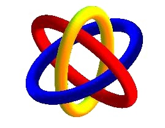

[无对应译文]

</section>

<section class="parallel-paragraph" data-paragraph-ids="s22-02-0113">

s22-02-0113

原文 · s22-02-0113

Le remarquable dans ceci, qui est un fait de *consistance*, c’est que d’an­neaux - à partir de là - vous pouvez en mettre un nombre indéfini, il sera toujours vrai que si vous rompez un de ces anneaux, tous les autres - si nombreux soient-ils - seront libres.

[无对应译文]

</section>

<section class="parallel-paragraph" data-paragraph-ids="s22-02-0114">

s22-02-0114

原文 · s22-02-0114

Je vous ai déjà, je pense, suffisam­ment fait sentir, dans un temps déjà périmé, que pour prendre l’exemple d’un anneau ainsi fabriqué :

[无对应译文]

</section>

<section class="parallel-paragraph" data-paragraph-ids="s22-02-0115">

s22-02-0115

原文 · s22-02-0115

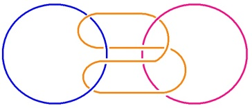

[无对应译文]

</section>

<section class="parallel-paragraph" data-paragraph-ids="s22-02-0116">

s22-02-0116

原文 · s22-02-0116

il est tout à fait concevable qu’un autre vienne passer dans la boucle qui consiste, qui est réalisée par *le plia­ge de ce petit cercle* :

[无对应译文]

</section>

<section class="parallel-paragraph" data-paragraph-ids="s22-02-0117">

s22-02-0117

原文 · s22-02-0117

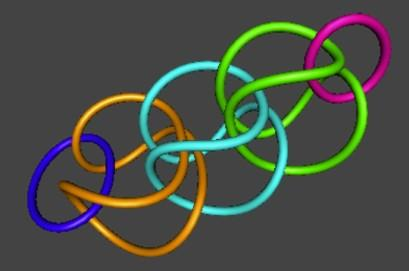

[无对应译文]

</section>

<section class="parallel-paragraph" data-paragraph-ids="s22-02-0118">

s22-02-0118

原文 · s22-02-0118

et que vous saisissez immédiatement, qu’à simplement rompre le cercle qui ici empêche le tiers de se libérer, la boucle pliée va glisser de ceci, et qu’à mettre un nombre indéfini de ces cercles pliés, vous voyez par quel mécanisme vraiment sensible, immédiatement imaginable, tous les anneaux se libèrent, quel qu’en soit le nombre.

[无对应译文]

</section>

<section class="parallel-paragraph" data-paragraph-ids="s22-02-0119">

s22-02-0119

原文 · s22-02-0119

Cette propriété est à elle seule ce qui homogénéise tout ce qu’il y a de nombre à partir de 3.

[无对应译文]

</section>

<section class="parallel-paragraph" data-paragraph-ids="s22-02-0120">

s22-02-0120

原文 · s22-02-0120

Ce qui veut dire que *dans la suite des nombres entiers, 1 et 2 sont détachés*.

[无对应译文]

</section>

<section class="parallel-paragraph" data-paragraph-ids="s22-02-0121">

s22-02-0121

原文 · s22-02-0121

*Quelque chose commence à 3, qui inclut tous les nombres, aussi loin qu’ils soient dénombrables*, et c’est bien ce sur quoi j’ai entendu mettre l’accent, dans mon séminaire, notamment de l’année dernière.

[无对应译文]

</section>

<section class="parallel-paragraph" data-paragraph-ids="s22-02-0122">

s22-02-0122

原文 · s22-02-0122

Ce n’est pas tout.

[无对应译文]

</section>

<section class="parallel-paragraph" data-paragraph-ids="s22-02-0123">

s22-02-0123

原文 · s22-02-0123

Pour « *borroméaniser* » un certain nombre de tores consistants, il y a beaucoup plus d’une seule manière.

[无对应译文]

</section>

<section class="parallel-paragraph" data-paragraph-ids="s22-02-0124">

s22-02-0124

原文 · s22-02-0124

Je vous l’ai indiqué déjà en son temps : il y a très probablement une quantité qu’il n’y a aucune raison de ne pas qualifier d’*infinie*...

[无对应译文]

</section>

<section class="parallel-paragraph" data-paragraph-ids="s22-02-0125">

s22-02-0125

原文 · s22-02-0125

> *d’infinie au sens du numérable* ...puisque vous n’avez un instant qu’à supposer la façon suivante de faire une boucle : pour vous apercevoir que vous pouvez la multiplier indéfiniment. Vous y êtes ?

[无对应译文]

</section>

<section class="parallel-paragraph" data-paragraph-ids="s22-02-0126">

s22-02-0126

原文 · s22-02-0126

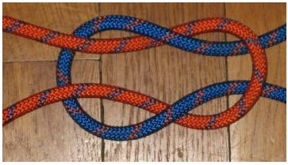 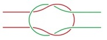

[无对应译文]

</section>

<section class="parallel-paragraph" data-paragraph-ids="s22-02-0127">

s22-02-0127

原文 · s22-02-0127

À savoir en faire, de ces boucles, autant de tours que vous voulez pour nouer ensemble deux tores, et qu’il n’y a aucune limite plausible à cet arran­gement, et que par conséquent, rien que déjà dans cette dimension, il y a moyen de nouer ensemble l’un à l’autre autant de façons qu’il est pos­sible d’en rêver à l’occasion.

[无对应译文]

</section>

<section class="parallel-paragraph" data-paragraph-ids="s22-02-0128">

s22-02-0128

原文 · s22-02-0128

Que vous pouvez même en trouver d’autres, qu’il n’en sera pas moins vrai que le nœud borroméen, quel qu’il soit, a pour limite inférieure le nombre 3, que c’est toujours de 3 que le nœud borroméen portera la marque, et qu’à ce titre vous avez tout de suite à vous poser la question : à quel registre appartient le nœud borroméen ?

[无对应译文]

</section>

<section class="parallel-paragraph" data-paragraph-ids="s22-02-0129">

s22-02-0129

原文 · s22-02-0129

Est-ce au *Symbolique*, à l’*Imaginaire* ou au *Réel* ?

[无对应译文]

</section>

<section class="parallel-paragraph" data-paragraph-ids="s22-02-0130">

s22-02-0130

原文 · s22-02-0130

J’avance dès aujourd’hui...

[无对应译文]

</section>

<section class="parallel-paragraph" data-paragraph-ids="s22-02-0131">

s22-02-0131

原文 · s22-02-0131

> ce que dans la suite je me permettrai de démontrer ...j’avance ceci : *le nœud borroméen*, en tant qu’il se suppor­te du nombre 3*, est du registre de l’Imaginaire*.

[无对应译文]

</section>

<section class="parallel-paragraph" data-paragraph-ids="s22-02-0132">

s22-02-0132

原文 · s22-02-0132

C’est en tant que *l’Imaginaire s’enracine des 3 dimensions de l’espace...*

[无对应译文]

</section>

<section class="parallel-paragraph" data-paragraph-ids="s22-02-0133">

s22-02-0133

原文 · s22-02-0133

> j’avance ceci qui ne va nulle part se conjurer avec une « esthétique transcendantale » *...*c’est au contraire parce que le nœud borroméen appartient à l’*Imaginaire*, c’est-à-dire supporte la triade de *l’Imaginaire, du Symbolique et du Réel*, c’est en tant que cette triade existe de ce que s’y conjoigne l’addition de l’*Imaginaire,* que l’espace en tant que sen­sible se trouve réduit à ce minimum de 3 dimensions, soit de son attache au *Symbolique* et au *Réel*.

[无对应译文]

</section>

<section class="parallel-paragraph" data-paragraph-ids="s22-02-0134">

s22-02-0134

原文 · s22-02-0134

D’autres dimensions sont imaginables, et elles ont été imaginées.

[无对应译文]

</section>

<section class="parallel-paragraph" data-paragraph-ids="s22-02-0135">

s22-02-0135

原文 · s22-02-0135

C’est pour tenir au *Symbolique* et au *Réel* que l’*Imaginaire* se réduit à ce qui n’est pas un maximum, imposé par le sac du corps, ce qui n’est pas un maximum, mais au contrai­re se définit d’un minimum, celui qui fait qu’il n’y a de nœud borro­méen que de ce qu’il en ait au moins 3.

[无对应译文]

</section>

<section class="parallel-paragraph" data-paragraph-ids="s22-02-0136">

s22-02-0136

原文 · s22-02-0136

Je vais ici, avant de vous quitter, vous donner une petite indication, quelques points, quelques ponctuations de ce que nous allons avoir cette année, à démontrer. Si tant est qu’ici :

[无对应译文]

</section>

<section class="parallel-paragraph" data-paragraph-ids="s22-02-0137">

s22-02-0137

原文 · s22-02-0137

- du rond bleu, j’ai figuré *le Réel*,

[无对应译文]

</section>

<section class="parallel-paragraph" data-paragraph-ids="s22-02-0138">

s22-02-0138

原文 · s22-02-0138

- du rond blanc, *le Symbolique*,

[无对应译文]

</section>

<section class="parallel-paragraph" data-paragraph-ids="s22-02-0139">

s22-02-0139

原文 · s22-02-0139

- et du rond rouge, celui qui se trouve se supporter du 3, être figuré ici, les dominant.

[无对应译文]

</section>

<section class="parallel-paragraph" data-paragraph-ids="s22-02-0140">

s22-02-0140

原文 · s22-02-0140

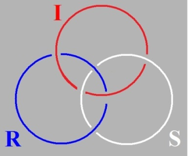

[无对应译文]

</section>

<section class="parallel-paragraph" data-paragraph-ids="s22-02-0141">

s22-02-0141

原文 · s22-02-0141

Je voudrais vous faire remarquer qu’il n’est nullement impliqué dans la notion du nœud comme tel, du nœud borroméen...

[无对应译文]

</section>

<section class="parallel-paragraph" data-paragraph-ids="s22-02-0142">

s22-02-0142

原文 · s22-02-0142

> qu’il s’agisse de ronds de ficelle ou de tores ...qu’il est tout aussi concevable que conformément à l’intui­tion qui fut celle de Desargues dans la géométrie ordinaire, ces ronds s’ouvrent, ou pour le dire simplement, deviennent des cordes censées...

[无对应译文]

</section>

<section class="parallel-paragraph" data-paragraph-ids="s22-02-0143">

s22-02-0143

原文 · s22-02-0143

> pourquoi pas ? Rien ne nous empêche de le poser comme un postulat ...se rejoindre - pourquoi pas ? - à l’infini.

[无对应译文]

</section>

<section class="parallel-paragraph" data-paragraph-ids="s22-02-0144">

s22-02-0144

原文 · s22-02-0144

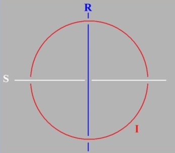

[无对应译文]

</section>

<section class="parallel-paragraph" data-paragraph-ids="s22-02-0145">

s22-02-0145

原文 · s22-02-0145

Il n’y en a pas moins, moyen de définir ce qu’on appelle un *point*, à savoir ce quelque chose d’étrange que la géométrie euclidienne ne défi­nit pas, et pourtant dont elle se sert comme support puisqu’à l’occasion, elle y ponctue l’individu.

[无对应译文]

</section>

<section class="parallel-paragraph" data-paragraph-ids="s22-02-0146">

s22-02-0146

原文 · s22-02-0146

C’est à savoir que le point, dans la géométrie euclidienne, n’a pas de dimension du tout, qu’il a zéro dimension, contrairement à la ligne, à la surface, voire au volume, qui respective­ment en ont une, deux, trois.

[无对应译文]

</section>

<section class="parallel-paragraph" data-paragraph-ids="s22-02-0147">

s22-02-0147

原文 · s22-02-0147

Est-ce qu’il n’y a pas...

[无对应译文]

</section>

<section class="parallel-paragraph" data-paragraph-ids="s22-02-0148">

s22-02-0148

原文 · s22-02-0148

> dans la définition que donne la géométrie euclidienne, du point comme de l’intersection de deux droites ...quelque chose... je me permettrai de dire : quelque chose qui pèche ?

[无对应译文]

</section>

<section class="parallel-paragraph" data-paragraph-ids="s22-02-0149">

s22-02-0149

原文 · s22-02-0149

C’est-à-dire, qu’est-ce qui empêche deux droites de glisser l’une sur l’autre ?

[无对应译文]

</section>

<section class="parallel-paragraph" data-paragraph-ids="s22-02-0150">

s22-02-0150

原文 · s22-02-0150

Seul peut permettre de définir comme tel un point, ce qui se présente comme ceci :

[无对应译文]

</section>

<section class="parallel-paragraph" data-paragraph-ids="s22-02-0151">

s22-02-0151

原文 · s22-02-0151

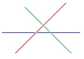

[无对应译文]

</section>

<section class="parallel-paragraph" data-paragraph-ids="s22-02-0152">

s22-02-0152

原文 · s22-02-0152

À savoir 3 droites qui ne sont pas ici de simples arêtes, des traits de scie, des ombres, mais qui sont effectivement 3 droites consis­tantes qui, au point ici central, réalisent ce qui fait l’essence du nœud bor­roméen, c’est-à-dire qui déterminent un point comme tel, à savoir quelque chose pour quoi alors il nous faut inventer autre chose que simplement l’indication d’une dimension qui soit 0, c’est-à-dire qui ne « *dimense* » pas. Je vous suggère de faire l’essai de ceci, qu’il n’y a pas là simplement trait banal, à savoir que ceci se supporte aussi bien de trois surfaces :

[无对应译文]

</section>

<section class="parallel-paragraph" data-paragraph-ids="s22-02-0153">

s22-02-0153

原文 · s22-02-0153

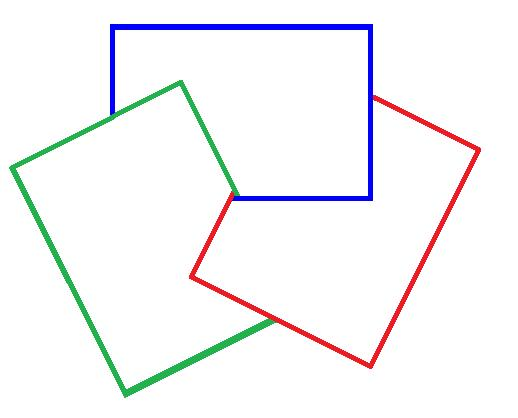

[无对应译文]

</section>

<section class="parallel-paragraph" data-paragraph-ids="s22-02-0154">

s22-02-0154

原文 · s22-02-0154

Je veux dire :

[无对应译文]

</section>

<section class="parallel-paragraph" data-paragraph-ids="s22-02-0155">

s22-02-0155

原文 · s22-02-0155

- qu’avec 3 surfaces vous obtenez l’effet dit *« de point »* d’une façon aussi valable que celle figurée ici, disons, avec 3 cordes,

[无对应译文]

</section>

<section class="parallel-paragraph" data-paragraph-ids="s22-02-0156">

s22-02-0156

原文 · s22-02-0156

- que d’autre part, vous pouvez rendre sensible que ces droites ici, ces cordes, vous les obtiendriez de jeu libre, c’est-à-dire sur 3 surfaces ne se coinçant pas si vous partiez non pas de la chaîne telle qu’elle est consti­tuée dans le nœud borroméen, mais de cette chaîne 2 par 2, dont j’ai évoqué tout à l’heure le fantôme au passage : qu’à dénouer des boucles nouées 2 par 2, ce que vous obtenez ce sont 3 droites libres l’une sur l’autre, c’est-à-dire ne se coinçant pas, ne définissant pas le point comme tel.

[无对应译文]

</section>

<section class="parallel-paragraph" data-paragraph-ids="s22-02-0157">

s22-02-0157

原文 · s22-02-0157

Ce que je veux, avant de vous quitter, vous annoncer, c’est donc ceci.

[无对应译文]

</section>

<section class="parallel-paragraph" data-paragraph-ids="s22-02-0158">

s22-02-0158

原文 · s22-02-0158

C’est clair ici, du fait que nous pouvons voir que, avec deux droites infinies, nous pouvons, à nouer un seul rond de ficelle, maintenir la propriété du nœud borroméen, à cette seule condition que les 2 droites ne sauraient...

[无对应译文]

</section>

<section class="parallel-paragraph" data-paragraph-ids="s22-02-0159">

s22-02-0159

原文 · s22-02-0159

> quelque part, entre ce nœud et l’infini ...se recouper que d’une seule façon :

[无对应译文]

</section>

<section class="parallel-paragraph" data-paragraph-ids="s22-02-0160">

s22-02-0160

原文 · s22-02-0160

- c’est à savoir que pour prendre la ligne droite R, il faut la tirer, si je puis dire, en avant,

[无对应译文]

</section>

<section class="parallel-paragraph" data-paragraph-ids="s22-02-0161">

s22-02-0161

原文 · s22-02-0161

- alors que la ligne S de la figure de droite, on ne peut la tirer qu’en arrière, ...qu’il ne faut pas en quelque sorte qu’elles soient ame­nées à se boucler deux à deux.

[无对应译文]

</section>

<section class="parallel-paragraph" data-paragraph-ids="s22-02-0162">

s22-02-0162

原文 · s22-02-0162

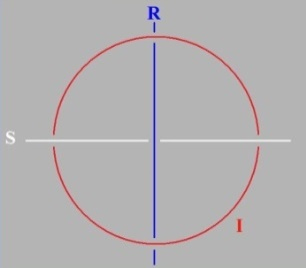

[无对应译文]

</section>

<section class="parallel-paragraph" data-paragraph-ids="s22-02-0163">

s22-02-0163

原文 · s22-02-0163

Ce que, de toute façon, exclut la figure centrale, qui ayant déjà fait qu’une des boucles, qu’un des ronds, soit le rond blanc sur le rond rouge, définit de ce seul fait - quel que soit son sort ultérieur – la position stricte de la droite infinie bleue qui doit passer sous ce qui est dessous et sur ce qui est dessus, pour m’exprimer d’une façon simple ! À cette condition, le nœud borroméen fonctionne.

[无对应译文]

</section>

<section class="parallel-paragraph" data-paragraph-ids="s22-02-0164">

s22-02-0164

原文 · s22-02-0164

Je voudrais vous indiquer ceci : c’est que

[无对应译文]

</section>

<section class="parallel-paragraph" data-paragraph-ids="s22-02-0165">

s22-02-0165

原文 · s22-02-0165

- si nous situons ce rond bleu du *Réel,*

[无对应译文]

</section>

<section class="parallel-paragraph" data-paragraph-ids="s22-02-0166">

s22-02-0166

原文 · s22-02-0166

- si nous situons ce rond du *Symbolique,*

[无对应译文]

</section>

<section class="parallel-paragraph" data-paragraph-ids="s22-02-0167">

s22-02-0167

原文 · s22-02-0167

- et celui-ci de l’*Imaginaire,* ...je me permets de vous indiquer qu’ils se situent d’une mise à plat \[2 *dimensions*\], autrement dit d’une réduction de l’*Imaginaire,* car il est clair que l’*Imaginaire* toujours tend à se réduire d’une mise à plat, que c’est là-dessus que se fonde toute figuration.

[无对应译文]

</section>

<section class="parallel-paragraph" data-paragraph-ids="s22-02-0168">

s22-02-0168

原文 · s22-02-0168

Étant bien entendu que ça n’est pas parce que nous aurions *chiffonné* ces 3 ronds de ficelle, qu’ils seraient moins noués borro­méennement dans le *Réel*, c’est-à-dire au regard de ceci : que chacun d’eux dénoué, libère les deux autres, la chose serait toujours vraie.

[无对应译文]

</section>

<section class="parallel-paragraph" data-paragraph-ids="s22-02-0169">

s22-02-0169

原文 · s22-02-0169

Comment se fait-il qu’il nous faille cette mise à plat pour pouvoir figu­rer une topologie quelconque ?

[无对应译文]

</section>

<section class="parallel-paragraph" data-paragraph-ids="s22-02-0170">

s22-02-0170

原文 · s22-02-0170

C’est très certainement une question qui attient à celle de la débilité que j’ai qualifiée de mentale, pour autant qu’elle est enracinée du corps lui-même.

[无对应译文]

</section>

<section class="parallel-paragraph" data-paragraph-ids="s22-02-0171">

s22-02-0171

原文 · s22-02-0171

- *Petit(a)*, ai-je écrit ici, soit dans l’*Imaginaire* mais aussi bien dans le *Symbolique*, j’inscris la fonction dite du *sens*.

[无对应译文]

</section>

<section class="parallel-paragraph" data-paragraph-ids="s22-02-0172">

s22-02-0172

原文 · s22-02-0172

- Les deux autres fonctions, celles qui relèvent de ce qui est à définir comme au regard du point central permettant d’y ajouter trois autres points, ceci est quelque chose à définir.

[无对应译文]

</section>

<section class="parallel-paragraph" data-paragraph-ids="s22-02-0173">

s22-02-0173

原文 · s22-02-0173

Nous avons : *jouissance*. Il s’agit de savoir - ces deux jouissances :

[无对应译文]

</section>

<section class="parallel-paragraph" data-paragraph-ids="s22-02-0174">

s22-02-0174

原文 · s22-02-0174

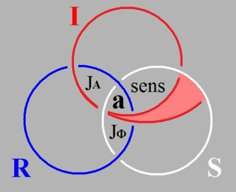

[无对应译文]

</section>

<section class="parallel-paragraph" data-paragraph-ids="s22-02-0175">

s22-02-0175

原文 · s22-02-0175

\- par exemple, une, nous pourrions la définir - mais laquelle ? - « jouir de la vie », si le *Réel* c’est la vie...

[无对应译文]

</section>

<section class="parallel-paragraph" data-paragraph-ids="s22-02-0176">

s22-02-0176

原文 · s22-02-0176

> nous sommes amenés à l’y référer, mais est-ce sûr ? *...*si le *Réel* c’est la vie, la jouissance, pour autant qu’elle participe de l’*Imaginaire* du sens, le jouir de la vie pour tout dire, c’est quelque chose que nous pouvons situer dans ceci, qui notons-le, n’est pas moins un point que le point central, le point dit de *l’objet(a),* puisqu’il conjoint à l’occasion trois surfaces qui également se coincent.

[无对应译文]

</section>

<section class="parallel-paragraph" data-paragraph-ids="s22-02-0177">

s22-02-0177

原文 · s22-02-0177

- Qu’en est-il d’autre part de cet autre mode de *jouissance*, celui qui se figure d’un recoupement, d’un serrage où vient ici le *Réel* le coincer à la périphérie de deux autres ronds de ficelle ?

[无对应译文]

</section>

<section class="parallel-paragraph" data-paragraph-ids="s22-02-0178">

s22-02-0178

原文 · s22-02-0178

- Qu’en est-il de cette *jouissance* ? Ce sont des traits, des points que nous aurons à élaborer, puisque aussi bien ce sont ceux qui vous interrogent.

[无对应译文]

</section>

<section class="parallel-paragraph" data-paragraph-ids="s22-02-0179">

s22-02-0179

原文 · s22-02-0179

Un point que je suggère est d’ores et déjà celui-ci, pour revenir à Freud, c’est à savoir que quelque chose de triadique, il l’a énoncé « *Inhibition, Symptôme, Angoisse ».*

[无对应译文]

</section>

<section class="parallel-paragraph" data-paragraph-ids="s22-02-0180">

s22-02-0180

原文 · s22-02-0180

Je dirai que l’inhibition, comme Freud lui-même l’articule, est tou­jours affaire de corps, soit de fonction.

[无对应译文]

</section>

<section class="parallel-paragraph" data-paragraph-ids="s22-02-0181">

s22-02-0181

原文 · s22-02-0181

Et pour l’indiquer déjà sur ce schéma, je dirai que l’inhibition, c’est ce qui quelque part s’arrête de s’immiscer, si je puis dire, dans une figure qui est figure de trou, de trou du *Symbolique*.

[无对应译文]

</section>

<section class="parallel-paragraph" data-paragraph-ids="s22-02-0182">

s22-02-0182

原文 · s22-02-0182

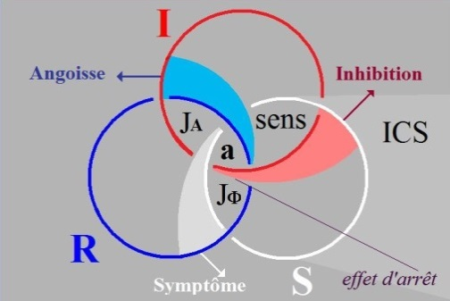

[无对应译文]

</section>

<section class="parallel-paragraph" data-paragraph-ids="s22-02-0183">

s22-02-0183

原文 · s22-02-0183

Nous aurons à discuter cette *inhibition* pour savoir si ce qui se rencontre chez l’animal, où il y a dans le système ner­veux des centres inhibiteurs, est quelque chose qui est du même ordre que cet arrêt du fonctionnement en tant qu’*Imaginaire*, en tant que spé­cifié chez l’être parlant, s’il est concevable que quelque chose soit du même ordre, à savoir la mise en fonction dans le névraxe, dans le systè­me nerveux central, d’une activité positive en tant qu’inhibitrice.

[无对应译文]

</section>

<section class="parallel-paragraph" data-paragraph-ids="s22-02-0184">

s22-02-0184

原文 · s22-02-0184

Comment est-il concevable que l’être, présumé n’avoir pas le langage, se trouve conjoindre dans le terme d’*inhibition* quelque chose du même ordre que ce que nous saisissons là, au niveau de l’extériorité du sens, que ce que nous saisissons là comme relevant de ce qui se trouve en somme extérieur au corps...

[无对应译文]

</section>

<section class="parallel-paragraph" data-paragraph-ids="s22-02-0185">

s22-02-0185

原文 · s22-02-0185

> à savoir cette surface, pour la topologiser de la façon dont je vous ai dit
>
> que c’est assurément seulement sur deux dimensions que ceci se figure ...comment l’*inhibition* peut avoir affaire à ce qui est effet d’arrêt qui résulte de son intrusion dans le champ du *Symbolique*.

[无对应译文]

</section>

<section class="parallel-paragraph" data-paragraph-ids="s22-02-0186">

s22-02-0186

原文 · s22-02-0186

Il est, à partir de ceci - et pas seulement à partir - il est tout à fait saisis­sant de voir que l’*angoisse,* en tant qu’elle est quelque chose qui part du *Réel*, il est tout à fait sensible de voir que c’est cette *angoisse* qui va don­ner son sens à la nature de la *jouissance* qui se produit ici \[JΦ\] du recoupement mis en surface, du recoupement eulérien, du *Réel* et du *Symbolique*.

[无对应译文]

</section>

<section class="parallel-paragraph" data-paragraph-ids="s22-02-0187">

s22-02-0187

原文 · s22-02-0187

Enfin, pour définir le 3ème terme, c’est dans le *symptôme* que nous identifions ce qui se produit dans le champ du *Réel *:

[无对应译文]

</section>

<section class="parallel-paragraph" data-paragraph-ids="s22-02-0188">

s22-02-0188

原文 · s22-02-0188

- si le *Réel* se manifeste dans l’analyse, et pas seulement dans l’analyse,

[无对应译文]

</section>

<section class="parallel-paragraph" data-paragraph-ids="s22-02-0189">

s22-02-0189

原文 · s22-02-0189

- si la notion de « *symptôme »* a été introduite, bien avant Freud, par Marx de façon à en faire le signe de quelque chose qui est ce qui ne va pas dans le *Réel*,

[无对应译文]

</section>

<section class="parallel-paragraph" data-paragraph-ids="s22-02-0190">

s22-02-0190

原文 · s22-02-0190

- si en d’autres termes, nous sommes capables d’opérer sur le *symptôme*, c’est pour autant que le *symptôme* est de l’effet du *Symbolique* dans le *Réel*.

[无对应译文]

</section>

<section class="parallel-paragraph" data-paragraph-ids="s22-02-0191">

s22-02-0191

原文 · s22-02-0191

C’est pour autant que ce *Symbolique*...

[无对应译文]

</section>

<section class="parallel-paragraph" data-paragraph-ids="s22-02-0192">

s22-02-0192

原文 · s22-02-0192

> tel que je l’ai dessiné ici, doit se compléter ici, et pourquoi est-ce extérieur : c’est ce que j’aurai à manipuler pour vous dans la suite ...c’est pour autant que *l’inconscient* est pour tout dire ce qui répond du *symptôme*.

[无对应译文]

</section>

<section class="parallel-paragraph" data-paragraph-ids="s22-02-0193">

s22-02-0193

原文 · s22-02-0193

C’est pour autant que ce nœud...

[无对应译文]

</section>

<section class="parallel-paragraph" data-paragraph-ids="s22-02-0194">

s22-02-0194

原文 · s22-02-0194

> ce nœud, lui bien réel quoique seulement reflété dans l’*Imaginaire...*c’est pour autant que ce nœud rend compte d’un certain nombre d’inscriptions par quoi des surfaces se répondent, que nous verrons que l’inconscient peut être responsable de la réduction du *symptôme*.

[无对应译文]

</section>

<section class="note-block original-notes">

## Notes

[^3]: *Écrits* pp. 166-67 : « *Le mot n’est pas signe, mais nœud de signification. Et que je dise le mot « rideau » par exemple, ce n’est pas seulement par convention,*

    *désigner l’usage d’un objet que peuvent diversifier de mille manières les intentions sous lesquelles il est perçu par l’ouvrier, par le marchand, par le peintre ou par le psychologue*

    *gestaltiste, comme travail, valeur d’échange, physionomie colorée ou structure spatiale. C’est par métaphore un rideau d’arbres; par calembour les rides et les ris de l’eau,*

    *et mon ami Leiris dominant mieux que moi ces jeux glossolaliques*. »

</section>
