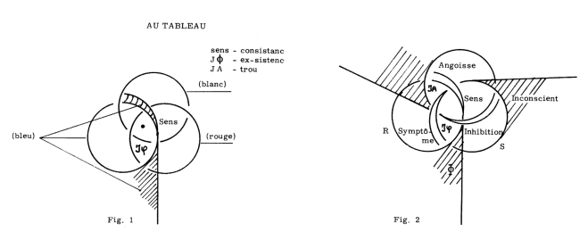
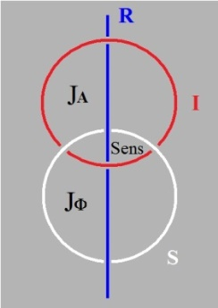
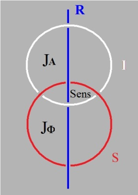
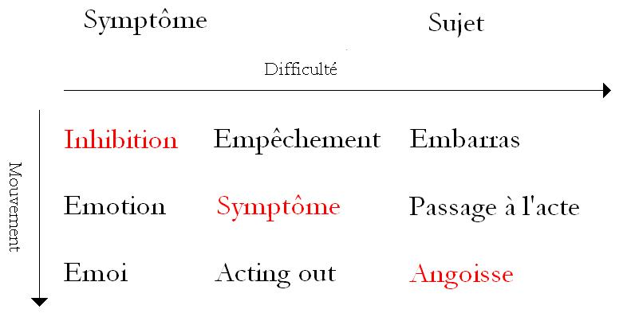

# Leçon 03 | 17 Décembre 1974

  <label><input type="checkbox" data-lacan-toggle="original" checked> 原文</label>
  <label><input type="checkbox" data-lacan-toggle="notes" checked> 注释</label>
  <label><input type="checkbox" data-lacan-toggle="commentary" checked> 个人解读评论</label>

<section class="parallel-paragraph" data-paragraph-ids="s22-03-0001">

s22-03-0001

[无对应译文]

原文 · s22-03-0001

Allocution précédant le séminaire R.S.I. du 17 Décembre 1974. Ornicar ?, 1975, n° 2, pp. 98-99.

</section>

<section class="parallel-paragraph" data-paragraph-ids="s22-03-0002">

s22-03-0002

[无对应译文]

原文 · s22-03-0002

Je parle ici de la débilité mentale des systèmes de pensée qui supposent...

</section>

<section class="parallel-paragraph" data-paragraph-ids="s22-03-0003">

s22-03-0003

[无对应译文]

原文 · s22-03-0003

> sans le dire, sauf aux temps bénits du Tao, voire de l’ancienne Égypte,
>
> où cela s’articule avec tout l’abêtissement nécessaire ...qui supposent donc la métaphore du rapport sexuel...

</section>

<section class="parallel-paragraph" data-paragraph-ids="s22-03-0004">

s22-03-0004

[无对应译文]

原文 · s22-03-0004

> non ex-sistant sous aucune forme ...sous celle de la copulation...

</section>

<section class="parallel-paragraph" data-paragraph-ids="s22-03-0005">

s22-03-0005

[无对应译文]

原文 · s22-03-0005

> particulièrement « grotesque » chez le parlêtre, ...qui est censée « représenter » le rapport que je dis ne pas ex-sister humainement.

</section>

<section class="parallel-paragraph" data-paragraph-ids="s22-03-0006">

s22-03-0006

[无对应译文]

原文 · s22-03-0006

La mise au point qui résulte d’une certaine ventilation de ladite métaphore, élaborée sous le nom de philosophie, ne va pas pour autant bien loin, pas plus loin que le christianisme, fruit de la Triade qu’en « l’adorant » il dénonce dans sa vrai « nature » : Dieu est le *pas-tout* qu’il a le mérite de distinguer, en se refusant à le confondre avec l’idée imbécile de l’univers.

</section>

<section class="parallel-paragraph" data-paragraph-ids="s22-03-0007">

s22-03-0007

[无对应译文]

原文 · s22-03-0007

Mais c’est bien ainsi qu’il permet de l’identifier à ce que je dénonce comme ce à quoi aucune ex-sistence n’est permise parce que c’est le trou en tant que tel, le trou que le nœud borroméen permet d’en distinguer, distinguer de l’ex-sistence comme définie par le nœud lui-même, à savoir l’ex-sistence d’une consistance soumise à la nécessité...

</section>

<section class="parallel-paragraph" data-paragraph-ids="s22-03-0008">

s22-03-0008

[无对应译文]

原文 · s22-03-0008

> = ne cessant pas de s’écrire ...de ce qu’elle ne puisse entrer dans le trou sans nécessairement en ressortir, et dès « la fois » suivante : « la fois » dont le croisement de sa mise à plat fait foi.

</section>

<section class="parallel-paragraph" data-paragraph-ids="s22-03-0009">

s22-03-0009

[无对应译文]

原文 · s22-03-0009

D’où *la correspondance* que je tente d’abord *du trou avec un réel* qui se trouvera plus tard conditionné de l’ex-sistence.

</section>

<section class="parallel-paragraph" data-paragraph-ids="s22-03-0010">

s22-03-0010

[无对应译文]

原文 · s22-03-0010

Comment en effet ménager l’approche de cette vérité à un auditoire aussi maladroit que m’en témoigne la maladresse que je démontre moi-même à manier la mise à plat du nœud, plus encore son réel, c’est à dire son ex-sistence ?

</section>

<section class="parallel-paragraph" data-paragraph-ids="s22-03-0011">

s22-03-0011

[无对应译文]

原文 · s22-03-0011

Je laisse donc ça là, sans le corriger, pour témoigner de la difficulté de l’abord d’un discours commandé par une toute nouvelle nécessité (cf. plus haut).

</section>

<section class="parallel-paragraph" data-paragraph-ids="s22-03-0012">

s22-03-0012

[无对应译文]

原文 · s22-03-0012

Ce qu’il me faut démontrer en effet, c’est qu’il n’y a pas de jouissance de l’Autre, génitif objectif, et comment y parvenir si je frappe d’emblée si juste que le sens étant atteint, la jouissance y consonne, qui met en jeu le damné *phallus*...

</section>

<section class="parallel-paragraph" data-paragraph-ids="s22-03-0013">

s22-03-0013

[无对应译文]

原文 · s22-03-0013

= l’ex-sistence même du réel, soit à prendre mon registre : R à la puissance deux ...ou encore ce à quoi la philosophie vise à donner célébration.

</section>

<section class="parallel-paragraph" data-paragraph-ids="s22-03-0014">

s22-03-0014

[无对应译文]

原文 · s22-03-0014

C’est dire que j’en suis tout empêtré encore, je parle de la philo, non du phallo.

</section>

<section class="parallel-paragraph" data-paragraph-ids="s22-03-0015">

s22-03-0015

[无对应译文]

原文 · s22-03-0015

Mais il y a temps pour quoi il ne faut pas se hâter, faute de quoi ce n’est seulement de rater qu’il s’agit, mais plutôt de l’erre irrémédiable, c’est-à-dire d’« *aimer la sagesse* », nécessité de L’homme. À corriger.

</section>

<section class="parallel-paragraph" data-paragraph-ids="s22-03-0016">

s22-03-0016

[无对应译文]

原文 · s22-03-0016

Ce pourquoi il faut la patience à quoi m’exerce le D.A. (lire discours analytique).

</section>

<section class="parallel-paragraph" data-paragraph-ids="s22-03-0017">

s22-03-0017

[无对应译文]

原文 · s22-03-0017

Il reste toujours le recours à la connerie religieuse, à quoi Freud ne manque jamais : ce que je dis au passage quoique poliment (nous lui devons tout).

</section>

<section class="parallel-paragraph" data-paragraph-ids="s22-03-0018">

s22-03-0018

[无对应译文]

原文 · s22-03-0018

</section>

<section class="parallel-paragraph" data-paragraph-ids="s22-03-0019">

s22-03-0019

[无对应译文]

原文 · s22-03-0019

Comme j’aime pas beaucoup écrire au tableau, je vous écris le minimum, ce minimum est assez pour que vous y recon­naissiez à gauche le nœud borroméen :

</section>

<section class="parallel-paragraph" data-paragraph-ids="s22-03-0020">

s22-03-0020

[无对应译文]

原文 · s22-03-0020

</section>

<section class="parallel-paragraph" data-paragraph-ids="s22-03-0021">

s22-03-0021

[无对应译文]

原文 · s22-03-0021

Il me semble...

</section>

<section class="parallel-paragraph" data-paragraph-ids="s22-03-0022">

s22-03-0022

[无对应译文]

原文 · s22-03-0022

enfin, pour autant que vous vous souveniez de ce que je dis, enfin vous prenez des notes, tout au moins certains *...*il me semble que j’ai justifié en quoi le nœud borroméen peut s’*écrire*, puisque *c’est une* *écriture*, *une écriture qui supporte un* *Réel*.

</section>

<section class="parallel-paragraph" data-paragraph-ids="s22-03-0023">

s22-03-0023

[无对应译文]

原文 · s22-03-0023

Ceci déjà à soi tout seul désigne ceci : c’est que non seule­ment le *Réel* peut se supporter d’une *écriture,* mais que : il n’y a pas d’autre idée sensible du *Réel*.

</section>

<section class="parallel-paragraph" data-paragraph-ids="s22-03-0024">

s22-03-0024

[无对应译文]

原文 · s22-03-0024

Ce *Réel*...

</section>

<section class="parallel-paragraph" data-paragraph-ids="s22-03-0025">

s22-03-0025

[无对应译文]

原文 · s22-03-0025

ce *Réel* qu’est le nœud, nœud qui est une construction ...ce *Réel* se suffit à laisser ouvert ce trait, ce trait d’*écrit* (d, apostrophe), ce trait qui est écrit, qui du *Réel* supporte l’idée.

</section>

<section class="parallel-paragraph" data-paragraph-ids="s22-03-0026">

s22-03-0026

[无对应译文]

原文 · s22-03-0026

Ceci, de ce fait que le nœud n’étant fait que de ce que chacun de ses éléments n’est noué que par un troisième, on peut, l’un de ces 3, le laisser ouvert, puisque c’est un fait que j’ai mis en valeur*...*

</section>

<section class="parallel-paragraph" data-paragraph-ids="s22-03-0027">

s22-03-0027

[无对应译文]

原文 · s22-03-0027

> que je crois avoir remis en valeur la dernière fois *...*que chacun de ses éléments peut avoir deux formes :

</section>

<section class="parallel-paragraph" data-paragraph-ids="s22-03-0028">

s22-03-0028

[无对应译文]

原文 · s22-03-0028

- la forme de droite infinie,

</section>

<section class="parallel-paragraph" data-paragraph-ids="s22-03-0029">

s22-03-0029

[无对应译文]

原文 · s22-03-0029

- et la forme que je désigne - parce que ça me semble la meilleure pour votre imagi­naire - que je désigne du rond de ficelle, ce qui s’avère à l’étude être celle d’un tore.

</section>

<section class="parallel-paragraph" data-paragraph-ids="s22-03-0030">

s22-03-0030

[无对应译文]

原文 · s22-03-0030

Ayant fait ce petit bout de nœud avec ce que j’ai dit la dernière fois, histoire de vous le faire resurgir, je me trouve, comme ça ce matin, avoir préféré, plutôt que de vous lire ce que j’ai élaboré à votre intention, il me semble qu’il y a des remarques, des remarques en somme préliminaires, qui pourraient bien vous servir à répondre, à justifier, comme questions, des questions que je suppose que vous avez dû vous poser.

</section>

<section class="parallel-paragraph" data-paragraph-ids="s22-03-0031">

s22-03-0031

[无对应译文]

原文 · s22-03-0031

Alors ces remarques préliminaires, je vais pas les faire nombreuses, je vais en faire 3.

</section>

<section class="parallel-paragraph" data-paragraph-ids="s22-03-0032">

s22-03-0032

[无对应译文]

原文 · s22-03-0032

Ça peut venir à l’esprit, enfin de certains qui ouvrent des bouquins...

</section>

<section class="parallel-paragraph" data-paragraph-ids="s22-03-0033">

s22-03-0033

[无对应译文]

原文 · s22-03-0033

> ils n’ont même pas besoin de les ouvrir, ça traîne sur les couvertures ...ils peuvent se demander : ce nœud que je profère au titre d’y unir le R.S.I. de la façon la plus certaine...

</section>

<section class="parallel-paragraph" data-paragraph-ids="s22-03-0034">

s22-03-0034

[无对应译文]

原文 · s22-03-0034

> à savoir quand le **S**, c’est le rond blanc que vous voyez là, et que l’*Imaginaire* c’est le rond rouge :

</section>

<section class="parallel-paragraph" data-paragraph-ids="s22-03-0035">

s22-03-0035

[无对应译文]

原文 · s22-03-0035

</section>

<section class="parallel-paragraph" data-paragraph-ids="s22-03-0036">

s22-03-0036

[无对应译文]

原文 · s22-03-0036

...ce nœud se tient d’être suf­fisamment défini, de ne pas présenter d’ambiguïté, quand il est traversé, quand les 2 ronds sont traversés par le *Réel*, d’une façon telle - comme je l’ai énoncé la dernière fois - que ce *Réel* le traverse :

</section>

<section class="parallel-paragraph" data-paragraph-ids="s22-03-0037">

s22-03-0037

[无对应译文]

原文 · s22-03-0037

- d’être sous celui de ces deux ronds qui est dessous,

</section>

<section class="parallel-paragraph" data-paragraph-ids="s22-03-0038">

s22-03-0038

[无对应译文]

原文 · s22-03-0038

- et d’être dessus celui qui est dessus.

</section>

<section class="parallel-paragraph" data-paragraph-ids="s22-03-0039">

s22-03-0039

[无对应译文]

原文 · s22-03-0039

Ceci suffit au coincement, que vous le fassiez à gauche ou à droite.

</section>

<section class="parallel-paragraph" data-paragraph-ids="s22-03-0040">

s22-03-0040

[无对应译文]

原文 · s22-03-0040

Je vous signale en passant que cette gauche comme cette droite, il est *impossible*, de ce seul nœud d’en donner caractérisation, sans ça nous aurions le miracle attendu qui nous permettrait de faire message de la différence de la gauche et de la droite à d’éventuels sujets capables de recevoir le dit message.

</section>

<section class="parallel-paragraph" data-paragraph-ids="s22-03-0041">

s22-03-0041

[无对应译文]

原文 · s22-03-0041

Le nœud borro­méen ne peut en rien servir de base à un dit message, celui qui permettrait la transmission d’une différence entre la gauche et la droite.

</section>

<section class="parallel-paragraph" data-paragraph-ids="s22-03-0042">

s22-03-0042

[无对应译文]

原文 · s22-03-0042

Il est donc indifférent de placer à droite ou à gauche ce qui résulte du fait de ce nœud : c’est à savoir quelque chose que nous désignerons comme externe, d’être *le sens*, en tant que c’est à partir de lui que se définissent les termes *Réel*, *Symbolique* et *Imaginaire*.

</section>

<section class="parallel-paragraph" data-paragraph-ids="s22-03-0043">

s22-03-0043

[无对应译文]

原文 · s22-03-0043

Le seul fait que je m’avance en ces termes est quelque chose qui doit vous faire poser la question, me semble-t-il, je veux dire, à seulement avoir lu quelques titres de livres : le nœud est-il un modèle, un modèle au sens où cela s’entend par exemple des modèles mathématiques, ceux qui fré­quemment nous servent à extrapoler quant au *Réel* ?

</section>

<section class="parallel-paragraph" data-paragraph-ids="s22-03-0044">

s22-03-0044

[无对应译文]

原文 · s22-03-0044

C’est-à-dire, comme dans ce cas, à fonder d’une écriture ce qui peut être imaginé du fait même de cette écriture, et qui trouve dès lors à permettre de rendre compte des interrogations qui seront portées par l’expérience à ce *Réel* lui-même, qui de toute façon, n’est là que supposition, supposition qui consiste dans ce sens du mot « *Réel* ».

</section>

<section class="parallel-paragraph" data-paragraph-ids="s22-03-0045">

s22-03-0045

[无对应译文]

原文 · s22-03-0045

Je prétends pour ce nœud répudier la qualification de « modèle ».

</section>

<section class="parallel-paragraph" data-paragraph-ids="s22-03-0046">

s22-03-0046

[无对应译文]

原文 · s22-03-0046

Ceci au nom du fait de ce qu’il faut que nous supposions au « modèle » : le modèle comme je viens de le dire - et ce, du fait de son écriture - se situe de l’*Imaginaire*.

</section>

<section class="parallel-paragraph" data-paragraph-ids="s22-03-0047">

s22-03-0047

[无对应译文]

原文 · s22-03-0047

Il n’y a pas d’*Imaginaire* qui ne suppose une *substance*.

</section>

<section class="parallel-paragraph" data-paragraph-ids="s22-03-0048">

s22-03-0048

[无对应译文]

原文 · s22-03-0048

C’est là un fait étrange, mais c’est toujours dans l’*Imaginaire,* à partir de l’*esprit* qui fait *substance* à ce modèle, que les questions qui s’en formu­lent sont secondement posées au *Réel*.

</section>

<section class="parallel-paragraph" data-paragraph-ids="s22-03-0049">

s22-03-0049

[无对应译文]

原文 · s22-03-0049

Et c’est en cela que je prétends que cet apparent *« *modèle » qui consiste dans ce nœud, ce nœud borroméen, fait *exception*...

</section>

<section class="parallel-paragraph" data-paragraph-ids="s22-03-0050">

s22-03-0050

[无对应译文]

原文 · s22-03-0050

> quoique situé lui aussi dans l’*Imaginaire...*fait *exception* à cette supposition, de ceci que ce qu’il propose c’est que les 3 qui sont là fonctionnent comme *pure consistance*, c’est à savoir que ce n’est que de tenir entre eux qu’ils *consistent *: les 3 tiennent entre eux *réellement*.

</section>

<section class="parallel-paragraph" data-paragraph-ids="s22-03-0051">

s22-03-0051

[无对应译文]

原文 · s22-03-0051

Ce qui y implique la métaphore tout de même, et ce qui pose la question de quelle est l’erre*...*

</section>

<section class="parallel-paragraph" data-paragraph-ids="s22-03-0052">

s22-03-0052

[无对应译文]

原文 · s22-03-0052

> au sens où je l’entendais l’année dernière *...*quelle est l’erre de la méta­phore ?

</section>

<section class="parallel-paragraph" data-paragraph-ids="s22-03-0053">

s22-03-0053

[无对应译文]

原文 · s22-03-0053

Car si j’énonce...

</section>

<section class="parallel-paragraph" data-paragraph-ids="s22-03-0054">

s22-03-0054

[无对应译文]

原文 · s22-03-0054

ce qui ne saurait se faire que du *symbolique*, de la parole *...*que leur consistance à ces trois ronds, ne se supporte que du *Réel*, c’est bien que j’use de *l’écart de sens* qui est permis entre R I S comme individualisant ces 3 ronds, les spécifiant comme tels.

</section>

<section class="parallel-paragraph" data-paragraph-ids="s22-03-0055">

s22-03-0055

[无对应译文]

原文 · s22-03-0055

L’écart de sens est là supposé pris d’un certain maximum.

</section>

<section class="parallel-paragraph" data-paragraph-ids="s22-03-0056">

s22-03-0056

[无对应译文]

原文 · s22-03-0056

Quel est le maximum admis d’écart de sens ?

</section>

<section class="parallel-paragraph" data-paragraph-ids="s22-03-0057">

s22-03-0057

[无对应译文]

原文 · s22-03-0057

C’est là une question que je ne peux, dans l’état actuel des choses, que poser au linguiste.

</section>

<section class="parallel-paragraph" data-paragraph-ids="s22-03-0058">

s22-03-0058

[无对应译文]

原文 · s22-03-0058

Comment le linguiste...

</section>

<section class="parallel-paragraph" data-paragraph-ids="s22-03-0059">

s22-03-0059

[无对应译文]

原文 · s22-03-0059

> et j’en ai un qui m’honore aujourd’hui de sa présence au premier rang *...*com­ment un linguiste saurait-il définir les limites de la métaphore ?

</section>

<section class="parallel-paragraph" data-paragraph-ids="s22-03-0060">

s22-03-0060

[无对应译文]

原文 · s22-03-0060

Qu’est ce qui peut définir un maximum de l’écart de la métaphore, au sens où je l’ai énoncé*...*

</section>

<section class="parallel-paragraph" data-paragraph-ids="s22-03-0061">

s22-03-0061

[无对应译文]

原文 · s22-03-0061

> référence à « *L’instance de la lettre »* dans mes « *Écrits »...*quel est le maximum permis de la substitution d’un signifiant à un autre ?

</section>

<section class="parallel-paragraph" data-paragraph-ids="s22-03-0062">

s22-03-0062

[无对应译文]

原文 · s22-03-0062

Je m’excuse, peut-être ai-je là été un peu vite, mais il est certain que nous ne pouvons pas traîner.

</section>

<section class="parallel-paragraph" data-paragraph-ids="s22-03-0063">

s22-03-0063

[无对应译文]

原文 · s22-03-0063

Nous ne pouvons pas traîner, et de ce fait il faut que je passe à ma deuxième remarque.

</section>

<section class="parallel-paragraph" data-paragraph-ids="s22-03-0064">

s22-03-0064

[无对应译文]

原文 · s22-03-0064

Pour opérer avec ce nœud d’une façon qui convienne, il faut que vous vous fondiez sur un peu de bêtise.

</section>

<section class="parallel-paragraph" data-paragraph-ids="s22-03-0065">

s22-03-0065

[无对应译文]

原文 · s22-03-0065

Le mieux est encore d’en user bête­ment, ce qui veut dire d’en être dupe.

</section>

<section class="parallel-paragraph" data-paragraph-ids="s22-03-0066">

s22-03-0066

[无对应译文]

原文 · s22-03-0066

Il ne faut pas entrer à son sujet dans le doute obsessionnel, ni trop chipoter.

</section>

<section class="parallel-paragraph" data-paragraph-ids="s22-03-0067">

s22-03-0067

[无对应译文]

原文 · s22-03-0067

Une chose m’a frappé à la lecture d’un ouvrage dont il se trouve que ma fille avait eu vent, par son travail sur Buffon.

</section>

<section class="parallel-paragraph" data-paragraph-ids="s22-03-0068">

s22-03-0068

[无对应译文]

原文 · s22-03-0068

Elle l’a réclamé à une personne qui lui a d’ailleurs promptement donné des indications sur la parution de ce texte.

</section>

<section class="parallel-paragraph" data-paragraph-ids="s22-03-0069">

s22-03-0069

[无对应译文]

原文 · s22-03-0069

Ce texte est donc de Maupertuis[^4], lequel à l’Académie de Berlin fait, sous le titre de « *La Vénus Physique »,* une relation de ce qui en somme est à la pointe, à son époque, de ce qui est connu sur le phénomène de *la reproduction des corps vivants*.

</section>

<section class="parallel-paragraph" data-paragraph-ids="s22-03-0070">

s22-03-0070

[无对应译文]

原文 · s22-03-0070

Pour qu’il l’ait introduit du terme de « *La Vénus Physique* », c’est qu’il se plaît à ne faire état que de la reproduction sexuée.

</section>

<section class="parallel-paragraph" data-paragraph-ids="s22-03-0071">

s22-03-0071

[无对应译文]

原文 · s22-03-0071

Il est tout à fait frappant, à mes yeux tout au moins, de voir à cette lecture que Maupertuis, qui dans l’occasion, pour quelqu’un qui se repère dans l’histoire*...*

</section>

<section class="parallel-paragraph" data-paragraph-ids="s22-03-0072">

s22-03-0072

[无对应译文]

原文 · s22-03-0072

et certainement la 1ère chose qui s’impose, c’est la date de cet énoncé : 1756, et le témoignage du temps qu’ont mis ces bêtes parlantes que sont les hommes...

</section>

<section class="parallel-paragraph" data-paragraph-ids="s22-03-0073">

s22-03-0073

[无对应译文]

原文 · s22-03-0073

> tenons-les pour ainsi définis ...du temps qu’elles ont mis ces bêtes, pour se rendre compte du spécifique de la reproduction sexuée.

</section>

<section class="parallel-paragraph" data-paragraph-ids="s22-03-0074">

s22-03-0074

[无对应译文]

原文 · s22-03-0074

Il est à mes yeux tout à fait clair que c’est de ne pas être simplement dupe, de ne pas s’en tenir à ce que son temps lui fournit comme matériel.

</section>

<section class="parallel-paragraph" data-paragraph-ids="s22-03-0075">

s22-03-0075

[无对应译文]

原文 · s22-03-0075

C’est à savoir, déjà beaucoup : le repérage au microscope par Leeuwenhoek et Swammerdam, de ce qu’il en est de ce qu’on appelle à l’époque les animalcules, c’est-à-dire les spermatozoïdes et les œufs d’autre part.

</section>

<section class="parallel-paragraph" data-paragraph-ids="s22-03-0076">

s22-03-0076

[无对应译文]

原文 · s22-03-0076

C’est à savoir ce qui est ordinairement supporté par 2 corps, qui de ce fait se définissent d’être de sexes opposés, sauf exception bien sûr, à savoir que le même corps - *ce qui arrive aux escargots comme vous ne l’ignorez pas,* puisse supporter les 2.

</section>

<section class="parallel-paragraph" data-paragraph-ids="s22-03-0077">

s22-03-0077

[无对应译文]

原文 · s22-03-0077

C’est assurément de ne pas se tenir à ce massif de la distinction de l’*animalcule* et de l’*œuf*, pourtant d’ores et déjà présente dans la simple diversité des théories, que Maupertuis*...*

</section>

<section class="parallel-paragraph" data-paragraph-ids="s22-03-0078">

s22-03-0078

[无对应译文]

原文 · s22-03-0078

> de n’être pas dupe, de ne pas s’en tenir à ce fait massif, et pour tout dire de ne pas être assez bête *...*ne sent pas le point, à proprement parler de découverte, que consti­tue pour ce qu’il en est d’une appréhension réelle de la distinction des sexes, ne s’en tient pas à ce qui lui est apporté.

</section>

<section class="parallel-paragraph" data-paragraph-ids="s22-03-0079">

s22-03-0079

[无对应译文]

原文 · s22-03-0079

S’il était plus dupe, il errerait moins.

</section>

<section class="parallel-paragraph" data-paragraph-ids="s22-03-0080">

s22-03-0080

[无对应译文]

原文 · s22-03-0080

Non pas certes que son erre soit sotte, car il arrive à quelque chose qui est en quelque sorte la préfiguration, si l’on peut dire, de ce qui s’est, à un examen ultérieur, à de plus puissants microscopes, révélé comme constituant l’existence des gènes.

</section>

<section class="parallel-paragraph" data-paragraph-ids="s22-03-0081">

s22-03-0081

[无对应译文]

原文 · s22-03-0081

Entre l’« ovisme » et l’« animalculisme » à savoir ce qui met tout l’accent sur un de ces élé­ments ou tout l’accent sur l’autre, il va jusqu’à imaginer que des faits d’attraction et de répulsion peuvent mener les choses à cette composi­tion dont par ailleurs l’expérience...

</section>

<section class="parallel-paragraph" data-paragraph-ids="s22-03-0082">

s22-03-0082

[无对应译文]

原文 · s22-03-0082

> l’expérience menée par Harvey, sur l’examen de ce qui s’énonce comme existant d’une première mani­festation de ce qu’il appelle le point vivant au fond de l’utérus des biches que Charles II a mis, au dit Harvey, à sa disposition *...*il arrive certes à se faire une idée, à la suggérer tout au moins, de ce qui peut se passer, et dont on pourrait dire que ça se passe effectivement au niveau de ce qui serait une *morula* par exemple, voire à un stade plus loin qui est celui de *gas­trula,* mais justement à deviner, à deviner il n’avance pas.

</section>

<section class="parallel-paragraph" data-paragraph-ids="s22-03-0083">

s22-03-0083

[无对应译文]

原文 · s22-03-0083

C’est à savoir que ce qui lui échappe c’est que chaque cellule de ce qu’un Harvey découvre...

</section>

<section class="parallel-paragraph" data-paragraph-ids="s22-03-0084">

s22-03-0084

[无对应译文]

原文 · s22-03-0084

> et pour, lui, s’en aveugler ...comme étant la substance de l’em­bryon, est le puzzle, la bigarrure apparemment qu’on pourrait en imagi­ner, c’est à savoir ceci...

</section>

<section class="parallel-paragraph" data-paragraph-ids="s22-03-0085">

s22-03-0085

[无对应译文]

原文 · s22-03-0085

> et que Maupertuis ne manque pas d’imaginer ...c’est que dans ce puzzle, dans ces éléments cellulaires, il y en aurait de mâles, et d’autres de femelles.

</section>

<section class="parallel-paragraph" data-paragraph-ids="s22-03-0086">

s22-03-0086

[无对应译文]

原文 · s22-03-0086

Ce qui n’est certainement pas vrai. Il faut que soit poussé beaucoup plus loin, et à vrai dire d’une façon telle que de ce que le point soit vivant ne puisse d’aucune façon se reconnaître, c’est à savoir que nous en soyons, au niveau de ces gènes distinguables dans le caryosome, au plus intime de la cellule.

</section>

<section class="parallel-paragraph" data-paragraph-ids="s22-03-0087">

s22-03-0087

[无对应译文]

原文 · s22-03-0087

C’est parce qu’il faut en venir là que l’idée de la bigarrure vers laquelle verse Maupertuis, est une idée simplement prématurée, non pas une erre, justement !

</section>

<section class="parallel-paragraph" data-paragraph-ids="s22-03-0088">

s22-03-0088

[无对应译文]

原文 · s22-03-0088

C’est, si je puis dire, d’être non-dupe qu’il imagine fort mal.

</section>

<section class="parallel-paragraph" data-paragraph-ids="s22-03-0089">

s22-03-0089

[无对应译文]

原文 · s22-03-0089

*Il n’est pas dupe* dans la mesure où il ne s’en tient pas strictement à ce qui lui est fourni, qu’*il fait* en somme *des hypothèses*.

</section>

<section class="parallel-paragraph" data-paragraph-ids="s22-03-0090">

s22-03-0090

[无对应译文]

原文 · s22-03-0090

L’*Hypotheses non fingere* [^5], la répudiation des hypothèses me paraît être ce qui convient, et ce que je désigne proprement de ce conseil d’être assez bête pour ne pas se poser de questions concernant l’usage de mon nœud, par exemple.

</section>

<section class="parallel-paragraph" data-paragraph-ids="s22-03-0091">

s22-03-0091

[无对应译文]

原文 · s22-03-0091

Ce n’est certainement pas à l’aide de ce nœud qu’on peut aller plus loin que de là d’où il sort, à savoir de l’expérience analytique. C’est de l’expérience analytique qu’il rend compte, et c’est en cela qu’est son prix.

</section>

<section class="parallel-paragraph" data-paragraph-ids="s22-03-0092">

s22-03-0092

[无对应译文]

原文 · s22-03-0092

3ème remarque - préliminaire également.

</section>

<section class="parallel-paragraph" data-paragraph-ids="s22-03-0093">

s22-03-0093

[无对应译文]

原文 · s22-03-0093

En quoi consiste dans ce nœud tel qu’il se présente, ce quelque chose qui de première remarque, a pu me faire poser la question de savoir si c’est un modèle ? C’est bien entendu qu’apparemment, y domine l’*Imaginaire*.

</section>

<section class="parallel-paragraph" data-paragraph-ids="s22-03-0094">

s22-03-0094

[无对应译文]

原文 · s22-03-0094

« *Y domine l’Imaginaire* » est quelque chose en effet qui repose sur le fait que ça en fonde la consistance.

</section>

<section class="parallel-paragraph" data-paragraph-ids="s22-03-0095">

s22-03-0095

[无对应译文]

原文 · s22-03-0095

Ce que j’introduis par cette remarque est ceci : c’est que *la jouissance*, au regard de cette *consis­tance imaginaire*, ne peut rien faire qu’*ex-sister*.

</section>

<section class="parallel-paragraph" data-paragraph-ids="s22-03-0096">

s22-03-0096

[无对应译文]

原文 · s22-03-0096

Soit parodier ceci : c’est qu’au regard du *Réel* c’est d’autre chose que de *sens* qu’il s’agit dans *la jouissance*.

</section>

<section class="parallel-paragraph" data-paragraph-ids="s22-03-0097">

s22-03-0097

[无对应译文]

原文 · s22-03-0097

À quoi le signifiant est ce qui reste.

</section>

<section class="parallel-paragraph" data-paragraph-ids="s22-03-0098">

s22-03-0098

[无对应译文]

原文 · s22-03-0098

Car si le signifiant, de ce fait est dépourvu de sens, c’est que le signifiant...

</section>

<section class="parallel-paragraph" data-paragraph-ids="s22-03-0099">

s22-03-0099

[无对应译文]

原文 · s22-03-0099

> tout ce qui reste ...vient à se proposer comme intervenant dans cette *jouissance*.

</section>

<section class="parallel-paragraph" data-paragraph-ids="s22-03-0100">

s22-03-0100

[无对应译文]

原文 · s22-03-0100

Non certes que le « *Je pense* » suffise à assurer l’existence...

</section>

<section class="parallel-paragraph" data-paragraph-ids="s22-03-0101">

s22-03-0101

[无对应译文]

原文 · s22-03-0101

> ce n’est pas pour rien que Descartes a là achoppé ...mais jusqu’à un certain point *c’est tout de même vrai que ce ne soit qu’à effacer tout sens que l’existence se définisse*.

</section>

<section class="parallel-paragraph" data-paragraph-ids="s22-03-0102">

s22-03-0102

[无对应译文]

原文 · s22-03-0102

Aussi bien d’ailleurs, lui-même a-t-il flotté entre le *Sum*, *ergo*, et l’*Existo*.

</section>

<section class="parallel-paragraph" data-paragraph-ids="s22-03-0103">

s22-03-0103

[无对应译文]

原文 · s22-03-0103

Assurément la notion de l’*ex-sistence* n’était pas assurée alors.

</section>

<section class="parallel-paragraph" data-paragraph-ids="s22-03-0104">

s22-03-0104

[无对应译文]

原文 · s22-03-0104

Pour que quelque chose *ex-siste*, il faut qu’il y ait quelque part *un trou*.

</section>

<section class="parallel-paragraph" data-paragraph-ids="s22-03-0105">

s22-03-0105

[无对应译文]

原文 · s22-03-0105

C’est autour de *ce trou* simulé par le « *Je pense* » de Descartes*...*

</section>

<section class="parallel-paragraph" data-paragraph-ids="s22-03-0106">

s22-03-0106

[无对应译文]

原文 · s22-03-0106

> puisque ce « *Je pense* » il le vide *...*c’est autour de ce trou que se suggère l’*ex-sistence*.

</section>

<section class="parallel-paragraph" data-paragraph-ids="s22-03-0107">

s22-03-0107

[无对应译文]

原文 · s22-03-0107

Assurément ces trous, nous les avons ici au cœur de chacun de ces ronds, puisque sans ce trou il ne serait même pas pensable que quelque chose se noue.

</section>

<section class="parallel-paragraph" data-paragraph-ids="s22-03-0108">

s22-03-0108

[无对应译文]

原文 · s22-03-0108

Il s’agit de situer, non pas ce qu’a pensé Descartes, mais ce que Freud a touché, et pour cela je propose que ce qui *ex-siste* au *Réel,* au *Réel* du trou, soit symbolisé dans l’*écriture* par un champ intermédiaire, inter­médiaire comme mise à plat, parce que c’est tout ce que *l’écriture* nous permet.

</section>

<section class="parallel-paragraph" data-paragraph-ids="s22-03-0109">

s22-03-0109

[无对应译文]

原文 · s22-03-0109

Il est tout à fait frappant en effet que *l’écriture impose*, comme telle, *cette mise à plat*.

</section>

<section class="parallel-paragraph" data-paragraph-ids="s22-03-0110">

s22-03-0110

[无对应译文]

原文 · s22-03-0110

Et si ici je suggère que quelque chose suppose, incarne dirais-je, que le *Symbolique* par exemple, montre dans l’espace à deux dimensions défini par ceci : que *quelque chose ex-siste* *de n’être suppo­sable dans l’écriture* *que de l’ouverture*, l’ouverture *du rond en cette droite indéfinie :*

</section>

<section class="parallel-paragraph" data-paragraph-ids="s22-03-0111">

s22-03-0111

[无对应译文]

原文 · s22-03-0111

</section>

<section class="parallel-paragraph" data-paragraph-ids="s22-03-0112">

s22-03-0112

[无对应译文]

原文 · s22-03-0112

&nbsp;

</section>

<section class="parallel-paragraph" data-paragraph-ids="s22-03-0113">

s22-03-0113

[无对应译文]

原文 · s22-03-0113

Ceci est là ce qui...

</section>

<section class="parallel-paragraph" data-paragraph-ids="s22-03-0114">

s22-03-0114

[无对应译文]

原文 · s22-03-0114

> aussi bien par rapport à l’un des élé­ments du nœud, qu’à tous les autres *...*ce qui permet de situer ce qui relève de l’*ex-sistence*.

</section>

<section class="parallel-paragraph" data-paragraph-ids="s22-03-0115">

s22-03-0115

[无对应译文]

原文 · s22-03-0115

Pourquoi donc, à droite ai-je marqué que *ce qui est de l’ex-sistence* est quelque chose qui *se métaphorise de la jouissance phallique* \[JΦ\] ? Ceci est une proposition, qui suppose que j’en dise plus sur cette *jouissance*.

</section>

<section class="parallel-paragraph" data-paragraph-ids="s22-03-0116">

s22-03-0116

[无对应译文]

原文 · s22-03-0116

Pour la situer d’une façon qui ne fasse pas d’ambiguïté,

</section>

<section class="parallel-paragraph" data-paragraph-ids="s22-03-0117">

s22-03-0117

[无对应译文]

原文 · s22-03-0117

- c’est d’un trait bleu que je dessine ce qu’il en est du *Réel,*

</section>

<section class="parallel-paragraph" data-paragraph-ids="s22-03-0118">

s22-03-0118

[无对应译文]

原文 · s22-03-0118

- et d’un trait rouge, du *Symbolique*.

</section>

<section class="parallel-paragraph" data-paragraph-ids="s22-03-0119">

s22-03-0119

[无对应译文]

原文 · s22-03-0119

Je propose...

</section>

<section class="parallel-paragraph" data-paragraph-ids="s22-03-0120">

s22-03-0120

[无对应译文]

原文 · s22-03-0120

fût-ce à dessein de le compléter ultérieurement ...de situer ici \[JΦ\] comme telle, *la jouissance phallique* en tant qu’elle est en relation à ce qui au *Réel* *ex-siste*, à savoir ce qui se pose du champ pro­duit de ce que le rond *Réel...*

</section>

<section class="parallel-paragraph" data-paragraph-ids="s22-03-0121">

s22-03-0121

[无对应译文]

原文 · s22-03-0121

> j’appelle comme ça *le rond connoté du Réel...*de ce qu’il s’ouvre à se poser comme cette droite infinie, isolée si l’on peut dire, dans sa consistance.

</section>

<section class="parallel-paragraph" data-paragraph-ids="s22-03-0122">

s22-03-0122

[无对应译文]

原文 · s22-03-0122

C’est au *Réel* comme faisant *trou*, que la jouissance *ex-siste*.

</section>

<section class="parallel-paragraph" data-paragraph-ids="s22-03-0123">

s22-03-0123

[无对应译文]

原文 · s22-03-0123

Ceci est le fait de ce que l’expérience analytique nous a apporté comme telle.

</section>

<section class="parallel-paragraph" data-paragraph-ids="s22-03-0124">

s22-03-0124

[无对应译文]

原文 · s22-03-0124

Il y a dans Freud...

</section>

<section class="parallel-paragraph" data-paragraph-ids="s22-03-0125">

s22-03-0125

[无对应译文]

原文 · s22-03-0125

> je ne vais pas... tout simplement faute de les avoir ici recueillis ...il y a dans Freud « prosternation* »*, si je puis dire, devant *la jouissance phallique*, comme telle.

</section>

<section class="parallel-paragraph" data-paragraph-ids="s22-03-0126">

s22-03-0126

[无对应译文]

原文 · s22-03-0126

C’est ce que découvre l’ex­périence analytique : la fonction nodale de cette jouissance en tant que phallique.

</section>

<section class="parallel-paragraph" data-paragraph-ids="s22-03-0127">

s22-03-0127

[无对应译文]

原文 · s22-03-0127

Et c’est autour d’elle que se fonde ce qu’il en est *de cette sorte de Réel auquel l’analyse a affaire*.

</section>

<section class="parallel-paragraph" data-paragraph-ids="s22-03-0128">

s22-03-0128

[无对应译文]

原文 · s22-03-0128

Ce qui est important à voir, c’est que s’il y a quelque chose dont le nœud se supporte, c’est justement qu’il y ait, au regard de cette *jouissan­ce phallique,* comme *Réel* ce quelque chose qui ne la situe, la dite jouissance, que du coin­cement qui résulte de la « nodalité* »*, si je puis dire, la nodalité propre au nœud borroméen, et en ceci que quelque chose qui ici se dessine du rond, du rond de ficelle, du rond en tant que consistance que constitue le *Symbolique*.

</section>

<section class="parallel-paragraph" data-paragraph-ids="s22-03-0129">

s22-03-0129

[无对应译文]

原文 · s22-03-0129

C’est dans la mesure où un point tiers...

</section>

<section class="parallel-paragraph" data-paragraph-ids="s22-03-0130">

s22-03-0130

[无对应译文]

原文 · s22-03-0130

> qui se définit comme se définit le sens ...est extérieur au plus central des points de cette *nodalité*, c’est en ce sens que se produit ce qui s’appelle *jouissance phal­lique*.

</section>

<section class="parallel-paragraph" data-paragraph-ids="s22-03-0131">

s22-03-0131

[无对应译文]

原文 · s22-03-0131

*La jouissan­ce phallique* intéresse toujours le nœud qui se fait avec *le rond du* *Symbolique*, pour ne le nommer que tel qu’il doit se faire.

</section>

<section class="parallel-paragraph" data-paragraph-ids="s22-03-0132">

s22-03-0132

[无对应译文]

原文 · s22-03-0132

*Que cette jouissance* comme telle *soit liée à la production de l’ex-sisten­ce*, c’est ce quelque chose que je vous propose cette année de mettre à l’épreuve.

</section>

<section class="parallel-paragraph" data-paragraph-ids="s22-03-0133">

s22-03-0133

[无对应译文]

原文 · s22-03-0133

Car vous voyez ce qui en résulte : c’est que ce nœud, tel que je l’énon­ce, ce nœud se redouble d’une autre triplicité, celle due au *sens*, en tant que c’est du sens que partent la distinction des sens qui de ces termes font trois termes \[R S I\].

</section>

<section class="parallel-paragraph" data-paragraph-ids="s22-03-0134">

s22-03-0134

[无对应译文]

原文 · s22-03-0134

C’est de là que nous devons, pouvons partir : *pour que le nœud consiste* comme tel, il y a 3 éléments, et c’est comme 3 que ces éléments se supportent.

</section>

<section class="parallel-paragraph" data-paragraph-ids="s22-03-0135">

s22-03-0135

[无对应译文]

原文 · s22-03-0135

Nous les réduisons à être 3 : là seulement est ce qui fait leur sens.

</section>

<section class="parallel-paragraph" data-paragraph-ids="s22-03-0136">

s22-03-0136

[无对应译文]

原文 · s22-03-0136

Par contre, à titre d’*ex-sistence*, ils sont chacun distincts, et aussi bien est-ce à propos de la *jouissance* comme *Réel* qu’ils se différencient, et qu’à ce niveau ce que nous apporte l’expérience ana­lytique, c’est que c’est dans la mesure où *la jouissance est ce qui ex-siste*, qu’elle fait le *Réel,* qu’elle le justifie justement de ceci : *d’ex-sister*.

</section>

<section class="parallel-paragraph" data-paragraph-ids="s22-03-0137">

s22-03-0137

[无对应译文]

原文 · s22-03-0137

Assurément, il y a là-dessus un passage qui importe, car *à quoi* *ex-siste* *l’ex-sistence* ?

</section>

<section class="parallel-paragraph" data-paragraph-ids="s22-03-0138">

s22-03-0138

[无对应译文]

原文 · s22-03-0138

Certainement pas à ce qui *consiste*.

</section>

<section class="parallel-paragraph" data-paragraph-ids="s22-03-0139">

s22-03-0139

[无对应译文]

原文 · s22-03-0139

L’*ex-sistence* comme telle se définit, se supporte de ce qui, dans chacun de ces termes R S I , fait trou.

</section>

<section class="parallel-paragraph" data-paragraph-ids="s22-03-0140">

s22-03-0140

[无对应译文]

原文 · s22-03-0140

Il y a dans chacun, quelque chose par quoi c’est du cercle - d’une circularité fondamentale - qu’il se définit, et ce quelque chose est ce qui est à nommer.

</section>

<section class="parallel-paragraph" data-paragraph-ids="s22-03-0141">

s22-03-0141

[无对应译文]

原文 · s22-03-0141

Il est frappant qu’au temps de Freud, ce qui ne s’en nomme n’est qu’*Imaginaire*.

</section>

<section class="parallel-paragraph" data-paragraph-ids="s22-03-0142">

s22-03-0142

[无对应译文]

原文 · s22-03-0142

Je veux dire que la fonction, par exemple, dite du « *moi* » est ce quelque chose dont Freud*...*

</section>

<section class="parallel-paragraph" data-paragraph-ids="s22-03-0143">

s22-03-0143

[无对应译文]

原文 · s22-03-0143

> conformément à cette nécessité, à ce pen­chant qui fait que *c’est à l’Imaginaire que va la substance* comme telle

</section>

<section class="parallel-paragraph" data-paragraph-ids="s22-03-0144">

s22-03-0144

[无对应译文]

原文 · s22-03-0144

*...*Freud désigne du *moi* - quoi ? - rien d’autre que ce qui dans la représenta­tion fait trou*...*

</section>

<section class="parallel-paragraph" data-paragraph-ids="s22-03-0145">

s22-03-0145

[无对应译文]

原文 · s22-03-0145

> il ne va pas jusqu’à le dire mais il le représente dans cette topique fantasmatique qui est la 2nde,
>
> alors que la 1ère marquait toute sa distance émerveillée auprès de ce qu’il découvrait de l’incons­cient *...*c’est dans le *sac*, le sac du corps, c’est de ce sac que se trouve figu­ré le *moi*, en quoi d’ailleurs ceci l’induit à devoir, sur ce *moi*

</section>

<section class="parallel-paragraph" data-paragraph-ids="s22-03-0146">

s22-03-0146

[无对应译文]

原文 · s22-03-0146

- spécifier quelque chose qui justement y ferait trou d’y laisser rentrer le monde,

</section>

<section class="parallel-paragraph" data-paragraph-ids="s22-03-0147">

s22-03-0147

[无对应译文]

原文 · s22-03-0147

- de nécessiter que ce sac soit en quelque sorte bouché de la perception.

</section>

<section class="parallel-paragraph" data-paragraph-ids="s22-03-0148">

s22-03-0148

[无对应译文]

原文 · s22-03-0148

C’est en tant que tel que Freud, non pas désigne, mais trahit que le *moi* n’est qu’un trou.

</section>

<section class="parallel-paragraph" data-paragraph-ids="s22-03-0149">

s22-03-0149

[无对应译文]

原文 · s22-03-0149

Quels sont les trous qui constituent d’une part le* Réel* et de l’autre le *Symbolique* ?

</section>

<section class="parallel-paragraph" data-paragraph-ids="s22-03-0150">

s22-03-0150

[无对应译文]

原文 · s22-03-0150

C’est ce qu’il nous faudra assurément examiner de très près.

</section>

<section class="parallel-paragraph" data-paragraph-ids="s22-03-0151">

s22-03-0151

[无对应译文]

原文 · s22-03-0151

Car quelque chose s’ouvre bien sûr à nous, qui semble en quelque sorte aller de soi : c’est à savoir, *ce trou du Réel, de le désigner de « la vie ».*

</section>

<section class="parallel-paragraph" data-paragraph-ids="s22-03-0152">

s22-03-0152

[无对应译文]

原文 · s22-03-0152

Et aussi bien est-ce une pente à quoi Freud lui-même n’a pas résisté, opposant « instincts de vie » aux « instincts de mort ».

</section>

<section class="parallel-paragraph" data-paragraph-ids="s22-03-0153">

s22-03-0153

[无对应译文]

原文 · s22-03-0153

Je remarque qu’à interroger par notre nœud ce qu’il en est de la structure nécessitée par Freud, *c’est du côté de la mort que se trouve la fonction du Symbolique*.

</section>

<section class="parallel-paragraph" data-paragraph-ids="s22-03-0154">

s22-03-0154

[无对应译文]

原文 · s22-03-0154

C’est en tant que *quelque chose est* *urverdrängt* dans le *Symbolique,* qu’il y a quelque chose à quoi nous ne don­nons jamais de *sens*, bien que nous soyons...

</section>

<section class="parallel-paragraph" data-paragraph-ids="s22-03-0155">

s22-03-0155

[无对应译文]

原文 · s22-03-0155

> c’est presque rengaine que de l’énoncer ...que nous soyons capables logiquement de dire que : « *Tous les hommes sont mortels* ».

</section>

<section class="parallel-paragraph" data-paragraph-ids="s22-03-0156">

s22-03-0156

[无对应译文]

原文 · s22-03-0156

C’est en tant que « *Tous les hommes sont mortels* » n’a - du fait même de ce « *tous* » - à proprement parler aucun sens,

</section>

<section class="parallel-paragraph" data-paragraph-ids="s22-03-0157">

s22-03-0157

[无对应译文]

原文 · s22-03-0157

- qu’il faut au moins que la peste se propage à Thèbes pour que ce *« tous »* devienne quelque chose d’*imaginable* et non pas de pur *Symbolique*,

</section>

<section class="parallel-paragraph" data-paragraph-ids="s22-03-0158">

s22-03-0158

[无对应译文]

原文 · s22-03-0158

- qu’il faut que chacun se sente concerné en particulier par la menace de la peste, que se révè­le du même coup ce qu’a supposé ceci : à savoir que si Œdipe a forcé quelque chose, c’est tout à fait *sans le savoir*, c’est si je puis dire, qu’il n’a tué son père que faute d’avoir - si vous me permettez de le dire – faute d’avoir pris le temps de « *laïusser* ».

</section>

<section class="parallel-paragraph" data-paragraph-ids="s22-03-0159">

s22-03-0159

[无对应译文]

原文 · s22-03-0159

S’il l’avait fait, *le temps qu’il fallait*, mais il aurait fallu certaine­ment un temps qui aurait été à peu près *le temps d’une analyse*, puisque lui-même, c’était justement pour ça qu’il était sur les routes, à savoir qu’il croyait - par un rêve justement - qu’il allait tuer celui qui sous le nom de Polybe [^6] était bel et bien son véritable père.

</section>

<section class="parallel-paragraph" data-paragraph-ids="s22-03-0160">

s22-03-0160

[无对应译文]

原文 · s22-03-0160

Ce que Freud nous apporte concernant ce qu’il en est de l’Autre, c’est justement ceci :

</section>

<section class="parallel-paragraph" data-paragraph-ids="s22-03-0161">

s22-03-0161

[无对应译文]

原文 · s22-03-0161

- qu’il n’y a d’autre qu’à le dire,

</section>

<section class="parallel-paragraph" data-paragraph-ids="s22-03-0162">

s22-03-0162

[无对应译文]

原文 · s22-03-0162

- mais que *ce Tout-Autre,* il est tout à fait impossible de le dire complètement, qu’il y a un *urver­drängt*, *un inconscient* irréductible, et que celui-là, de le dire c’est à pro­prement parler ce qui non seulement se définit comme *impossible,* mais introduit comme telle la catégorie de l’*impossible.*

</section>

<section class="parallel-paragraph" data-paragraph-ids="s22-03-0163">

s22-03-0163

[无对应译文]

原文 · s22-03-0163

Que la religion soit *vraie*, c’est ce que j’ai dit à l’occasion.

</section>

<section class="parallel-paragraph" data-paragraph-ids="s22-03-0164">

s22-03-0164

[无对应译文]

原文 · s22-03-0164

Elle est sûrement plus *vraie* que la névrose, en ceci :

</section>

<section class="parallel-paragraph" data-paragraph-ids="s22-03-0165">

s22-03-0165

[无对应译文]

原文 · s22-03-0165

- qu’elle refoule ce fait que ce n’est pas vrai que Dieu « *soit* » seulement, si je puis dire, ce que Voltaire croyait dur comme fer,

</section>

<section class="parallel-paragraph" data-paragraph-ids="s22-03-0166">

s22-03-0166

[无对应译文]

原文 · s22-03-0166

- elle dit qu’il *ex-siste*, qu’*il est l’ex-sistence* par excellence, c’est-à-dire qu’en somme il est le *refoulement en personne*, il est même *la personne supposée au refoulement*, et c’est en ça *qu’elle est vraie*.

</section>

<section class="parallel-paragraph" data-paragraph-ids="s22-03-0167">

s22-03-0167

[无对应译文]

原文 · s22-03-0167

Dieu n’est rien d’autre que ce qui fait qu’à partir du langage, il ne saurait s’établir de rapport entre sexués.

</section>

<section class="parallel-paragraph" data-paragraph-ids="s22-03-0168">

s22-03-0168

[无对应译文]

原文 · s22-03-0168

Où est Dieu là-dedans ? Je n’ai jamais dit qu’il soit dans le langage.

</section>

<section class="parallel-paragraph" data-paragraph-ids="s22-03-0169">

s22-03-0169

[无对应译文]

原文 · s22-03-0169

Le langage...

</section>

<section class="parallel-paragraph" data-paragraph-ids="s22-03-0170">

s22-03-0170

[无对应译文]

原文 · s22-03-0170

eh bien justement, c’est ce sur quoi nous aurons à nous interroger cette année ...d’où ça peut-il bien venir ?

</section>

<section class="parallel-paragraph" data-paragraph-ids="s22-03-0171">

s22-03-0171

[无对应译文]

原文 · s22-03-0171

Je n’ai certes pas dit que ça venait pour boucher un *trou*, celui constitué par le *non-rapport*, le *non-rapport* constitutif du sexuel, parce que ce *non-rapport*, il n’est suspendu qu’à lui.

</section>

<section class="parallel-paragraph" data-paragraph-ids="s22-03-0172">

s22-03-0172

[无对应译文]

原文 · s22-03-0172

Le langage n’est donc pas simplement un bouchon, il est ce dans quoi s’inscrit ce non-rapport.

</section>

<section class="parallel-paragraph" data-paragraph-ids="s22-03-0173">

s22-03-0173

[无对应译文]

原文 · s22-03-0173

C’est tout ce que nous pouvons en dire.

</section>

<section class="parallel-paragraph" data-paragraph-ids="s22-03-0174">

s22-03-0174

[无对应译文]

原文 · s22-03-0174

Dieu, lui, comporte l’ensemble des *effets de langage*, y compris les effets psychanalytiques, ce qui n’est pas peu dire !

</section>

<section class="parallel-paragraph" data-paragraph-ids="s22-03-0175">

s22-03-0175

[无对应译文]

原文 · s22-03-0175

Pour fixer les choses...

</section>

<section class="parallel-paragraph" data-paragraph-ids="s22-03-0176">

s22-03-0176

[无对应译文]

原文 · s22-03-0176

> qu’on appelle des idées, et qui ne sont pas du tout des idées ...pour fixer les choses là où elles méritent d’être fixées, c’est-à-dire dans la logique : Freud ne croit pas en Dieu.

</section>

<section class="parallel-paragraph" data-paragraph-ids="s22-03-0177">

s22-03-0177

[无对应译文]

原文 · s22-03-0177

Parce qu’il opère dans sa ligne à lui, comme en témoigne la poudre qu’il nous jette aux yeux pour nous « en-Moïser ».

</section>

<section class="parallel-paragraph" data-paragraph-ids="s22-03-0178">

s22-03-0178

[无对应译文]

原文 · s22-03-0178

L’« en-Moïsement » peut être aussi bien l’en-moisement dont je parlais tout à l’heure.

</section>

<section class="parallel-paragraph" data-paragraph-ids="s22-03-0179">

s22-03-0179

[无对应译文]

原文 · s22-03-0179

Non seulement il perpétue la religion, mais il la consacre comme névrose idéale.

</section>

<section class="parallel-paragraph" data-paragraph-ids="s22-03-0180">

s22-03-0180

[无对应译文]

原文 · s22-03-0180

C’est bien ce qu’il en dit d’ailleurs, en la rattachant à la névrose obsessionnelle qui est la névrose idéale, qui mérite d’être appelée « *idéale* » à proprement parler.

</section>

<section class="parallel-paragraph" data-paragraph-ids="s22-03-0181">

s22-03-0181

[无对应译文]

原文 · s22-03-0181

Et il ne peut pas faire autrement parce que c’est *impossible*, c’est-à-dire qu’*il est dupe* - lui - *de la bonne façon*, *celle qui n’erre pas*.

</section>

<section class="parallel-paragraph" data-paragraph-ids="s22-03-0182">

s22-03-0182

[无对应译文]

原文 · s22-03-0182

C’est pas comme moi !

</section>

<section class="parallel-paragraph" data-paragraph-ids="s22-03-0183">

s22-03-0183

[无对应译文]

原文 · s22-03-0183

Moi je ne peux que témoigner que j’erre.

</section>

<section class="parallel-paragraph" data-paragraph-ids="s22-03-0184">

s22-03-0184

[无对应译文]

原文 · s22-03-0184

J’erre dans ces intervalles que j’essaie de vous situer du *Sens*, de la *Jouissance Phallique*, voire du *Tiers Terme* que je n’ai pas éclairé parce que c’est lui qui nous donne la clé du trou, du trou tel que je le désigne.

</section>

<section class="parallel-paragraph" data-paragraph-ids="s22-03-0185">

s22-03-0185

[无对应译文]

原文 · s22-03-0185

C’est *la jouissance* en tant qu’elle intéresserait, non pas l’Autre du signifiant, mais l’Autre du corps, l’autre de l’autre sexe.

</section>

<section class="parallel-paragraph" data-paragraph-ids="s22-03-0186">

s22-03-0186

[无对应译文]

原文 · s22-03-0186

Est-ce que quand je dis, j’énonce, j’annonce, qu’il n’y a pas de rapport sexuel, ceci ne veut pas dire ce fait, qui est dans l’expérience, que tout le monde sait, mais dont il faut savoir pourquoi Freud n’en a pas rendu compte.

</section>

<section class="parallel-paragraph" data-paragraph-ids="s22-03-0187">

s22-03-0187

[无对应译文]

原文 · s22-03-0187

Pourquoi Freud a qualifié de l’*Un,* l’Ἔρως \[Éros\], en se livrant au mythe du corps, du corps uni, du corps à deux dos, du corps tout rond, en osant se référer à cette énormité platonicienne ?

</section>

<section class="parallel-paragraph" data-paragraph-ids="s22-03-0188">

s22-03-0188

[无对应译文]

原文 · s22-03-0188

Est-ce que ce n’est pas le fait que d’un autre corps, quel qu’il soit, nous avons beau l’étreindre, ce n’est rien de plus que le signe du plus extrême embarras ?

</section>

<section class="parallel-paragraph" data-paragraph-ids="s22-03-0189">

s22-03-0189

[无对应译文]

原文 · s22-03-0189

Il arrive que - grâce à un fait que Freud catalogue bien évidemment comme il s’impose, de la « régression » - nous le suçotions par-dessus le marché, qu’est-ce que ça peut bien faire ?

</section>

<section class="parallel-paragraph" data-paragraph-ids="s22-03-0190">

s22-03-0190

[无对应译文]

原文 · s22-03-0190

Mis à part de le mettre en morceaux, on ne voit pas vrai­ment ce qu’on peut faire d’un autre corps, j’entends d’un autre corps dit humain.

</section>

<section class="parallel-paragraph" data-paragraph-ids="s22-03-0191">

s22-03-0191

[无对应译文]

原文 · s22-03-0191

S’y justifie que si nous cherchons *de quoi peut être bordée cette* *jouissance* *de* *l’Autre corps*, en tant que celle-là sûrement fait trou, ce que nous trouvons c’est l’*angoisse*.

</section>

<section class="parallel-paragraph" data-paragraph-ids="s22-03-0192">

s22-03-0192

[无对应译文]

原文 · s22-03-0192

C’est bien en quoi dans un temps où c’était pas pour rien que j’avais choisi ce thème de l’*angoisse*, je l’avais choisi parce que je savais que ça durerait pas.

</section>

<section class="parallel-paragraph" data-paragraph-ids="s22-03-0193">

s22-03-0193

[无对应译文]

原文 · s22-03-0193

Je savais que ça ne durerait pas parce que j’avais des « *fidèles* » qui s’employaient à faire surgir les motions d’ordre qui pouvaient dans la suite me rendre déclaré inapte à transmettre la théorie analytique.

</section>

<section class="parallel-paragraph" data-paragraph-ids="s22-03-0194">

s22-03-0194

[无对应译文]

原文 · s22-03-0194

C’est pas du tout que ça m’ait angoissé, ni même embarras­sé, ça peut revenir tous les jours, *ça ne m’angoisse, ni ne m’em­barrasse*. Mais je voulais quand même, justement à ce propos de l’an­goisse, de l’« *Inhibition, Symptôme, Angoisse »*, dire certaines choses qui doivent maintenant enfin témoigner de ceci : qu’il est tout à fait compa­tible*...*

</section>

<section class="parallel-paragraph" data-paragraph-ids="s22-03-0195">

s22-03-0195

[无对应译文]

原文 · s22-03-0195

> avec l’idée que l’inconscient soit conditionné *par* le langage *...*qu’il est tout à fait compa­tible

</section>

<section class="parallel-paragraph" data-paragraph-ids="s22-03-0196">

s22-03-0196

[无对应译文]

原文 · s22-03-0196

- non seulement d’y situer des *affects* : ça veut simplement dire ceci, c’est que c’est au langa­ge et que *c’est du langage que nous sommes* - manifestement et d’une façon tout à fait prévalente - *affectés*,

</section>

<section class="parallel-paragraph" data-paragraph-ids="s22-03-0197">

s22-03-0197

[无对应译文]

原文 · s22-03-0197

- et en plus, dans ce temps de mon séminaire sur *L’angoisse*, si j’ai introduit quelque chose, c’est justement *des qualités d’affect*, qu’il y avait longtemps que *les affectueux*, là, *les affectionnés*, il y avait longtemps qu’ils ne les avaient non seulement pas trouvés, mais qu’ils étaient tout à fait exclus de pouvoir même les entre­voir.

</section>

<section class="parallel-paragraph" data-paragraph-ids="s22-03-0198">

s22-03-0198

[无对应译文]

原文 · s22-03-0198

C’est bien pourquoi, vous pouvez trouver dans le repérage que j’ai fait à l’époque, de ce qu’il en est d’*Angoisse*, *Inhibition*, *Symptôme* que j’ai décalé sur trois plans, pour pouvoir justement démontrer ce qui est, dès cette époque, sensible.

</section>

<section class="parallel-paragraph" data-paragraph-ids="s22-03-0199">

s22-03-0199

[无对应译文]

原文 · s22-03-0199

</section>

<section class="parallel-paragraph" data-paragraph-ids="s22-03-0200">

s22-03-0200

[无对应译文]

原文 · s22-03-0200

C’est à savoir que ces trois termes, *inhibition, symptôme, angoisse*, sont entre eux aussi hétérogènes que mes termes de *Réel*, de *Symbolique* et d’*Imaginaire*, et que nommément l’angoisse c’est ça, c’est ce qui est évident, c’est ce qui de l’intérieur du corps *ex-siste*, *ex-siste* quand il y a quelque chose qui l’éveille, qui le tourmente.

</section>

<section class="parallel-paragraph" data-paragraph-ids="s22-03-0201">

s22-03-0201

[无对应译文]

原文 · s22-03-0201

Voyez le « Petit Hans », quand il se trouve que se rend sensible l’association à un corps...

</section>

<section class="parallel-paragraph" data-paragraph-ids="s22-03-0202">

s22-03-0202

[无对应译文]

原文 · s22-03-0202

> nommément mâle dans l’occasion, défini comme mâle *...*l’association à un corps, d’une *jouissance phallique*.

</section>

<section class="parallel-paragraph" data-paragraph-ids="s22-03-0203">

s22-03-0203

[无对应译文]

原文 · s22-03-0203

Si le « Petit Hans » se rue dans la phobie, c’est évidemment pour donner corps*...*

</section>

<section class="parallel-paragraph" data-paragraph-ids="s22-03-0204">

s22-03-0204

[无对应译文]

原文 · s22-03-0204

> je l’ai démontré pendant tout une année *...*pour donner corps à « *l’embarras* » qu’il a de ce *phallus*, et pour lequel il s’invente toute une série d’équivalents diversement piaffants sous la forme de la phobie dite *des chevaux*.

</section>

<section class="parallel-paragraph" data-paragraph-ids="s22-03-0205">

s22-03-0205

[无对应译文]

原文 · s22-03-0205

Le Petit Hans, dans son angoisse, principe de la phobie...

</section>

<section class="parallel-paragraph" data-paragraph-ids="s22-03-0206">

s22-03-0206

[无对应译文]

原文 · s22-03-0206

> principe de la phobie et en ce sens qu’à la lui rendre cette angoisse si l’on peut dire « pure* »*, qu’on arrive à le faire s’accommoder de ce *phallus* dont, en fin de compte, comme tous ceux qui se trouvent en avoir la charge, celle que j’ai un jour qualifiée de « la bandoulière » ...ben, il faut bien qu’il s’en accommode, à savoir qu’il soit marié avec ce *phallus*. Ça c’est ce à quoi l’homme ne peut rien.

</section>

<section class="parallel-paragraph" data-paragraph-ids="s22-03-0207">

s22-03-0207

[无对应译文]

原文 · s22-03-0207

*La femme* - *qui n’ex-siste pas* - elle peut rêver à en avoir un, mais *l’homme*, il en est affligé. \[*Rires*\]

</section>

<section class="parallel-paragraph" data-paragraph-ids="s22-03-0208">

s22-03-0208

[无对应译文]

原文 · s22-03-0208

Il n’a pas d’autre femme que ça.

</section>

<section class="parallel-paragraph" data-paragraph-ids="s22-03-0209">

s22-03-0209

[无对应译文]

原文 · s22-03-0209

C’est ce que Freud a dit sur tous les tons.

</section>

<section class="parallel-paragraph" data-paragraph-ids="s22-03-0210">

s22-03-0210

[无对应译文]

原文 · s22-03-0210

Qu’est-ce qu’il dit, en disant que la pulsion phallique c’est pas la pulsion génitale, si ce n’est ceci : que la pulsion génitale, chez l’homme - c’est bien le cas de le dire - elle n’est pas *naturelle* du tout.

</section>

<section class="parallel-paragraph" data-paragraph-ids="s22-03-0211">

s22-03-0211

[无对应译文]

原文 · s22-03-0211

Non seulement elle est pas naturelle, mais s’il n’y avait pas ce diable de *symbolisme* à le pous­ser au derrière, pour *qu’en fin de compte* il éjacule et que ça serve à quelque chose, mais il y a longtemps qu’il n’y en aurait plus de ces *parlêtres*, de ces êtres qui ne parlent pas seulement à être, mais *qui sont par l’être*.

</section>

<section class="parallel-paragraph" data-paragraph-ids="s22-03-0212">

s22-03-0212

[无对应译文]

原文 · s22-03-0212

Ce qui est vraiment le comble du comble de la futilité.

</section>

<section class="parallel-paragraph" data-paragraph-ids="s22-03-0213">

s22-03-0213

[无对应译文]

原文 · s22-03-0213

Bon ! Ben*...* il est deux heures moins le quart. Moi je trouve qu’aujour­d’hui...

</section>

<section class="parallel-paragraph" data-paragraph-ids="s22-03-0214">

s22-03-0214

[无对应译文]

原文 · s22-03-0214

> comme je vous ai à peu près tout improvisé de ce que je vous raconte *...*je suis assez fatigué comme ça.

</section>

<section class="parallel-paragraph" data-paragraph-ids="s22-03-0215">

s22-03-0215

[无对应译文]

原文 · s22-03-0215

Tout ça paraîtra sous une autre forme, puisque après tout de celle-ci je ne suis pas tellement satisfait.

</section>

<section class="note-block original-notes">

## Notes

[^4]: [Pierre Louis Moreau de Maupertuis](http://fr.wikisource.org/wiki/V%C3%A9nus_physique) : *La Vénus physique*, éd. Diderot Arts et Sciences, 1997, Coll. Latitudes.

[^5]: Cf. « *Hypotheses non fingo* » (je n’avance pas d’hypothèses) formule employée par Isaac Newton quand on lui demande de donner une explication

    de la gravité ou de la gravitation : «  *Je n’ai pu arriver à déduire des phénomènes la raison des propriétés de la gravité et n’imagine point d’hypothèses, hypotheses non fingo.*

    *Car ce qui ne se déduit point des phénomènes est une hypothèse ; et les hypothèses, soit métaphysiques, soit physiques, soit des suppositions de qualités occultes, soit des suppositions*

    *de mécanique, n’ont point lieu dans la philosophie expérimentale. Dans cette philosophie, on tire les propositions des phénomènes et on les rend ensuite générales par induction.* »

    Isaac Newton, 1726, *Philosophiae Naturalis Principia Mathematica*, *General Scholium*, 3ème éd. 1726, page 943, trad. de la Marquise du Châtelet, ou Dunod 2005.

[^6]: Lapsus : Œdipe tue Laïos son vrai père. Polybe - roi de Corinthe - a recueilli Œdipe et l’a élevé comme son fils.

</section>
