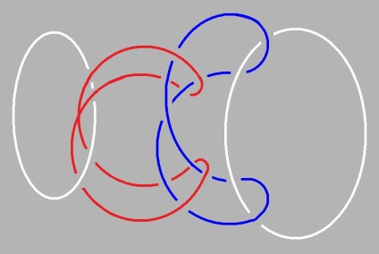
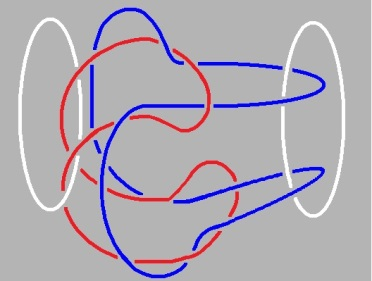
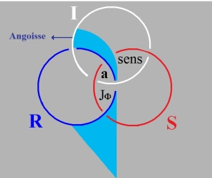
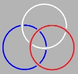
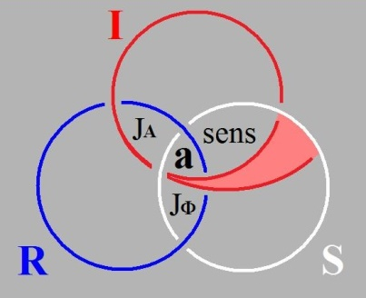
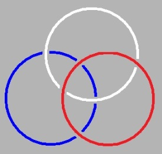
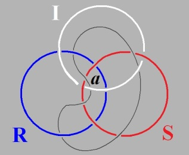
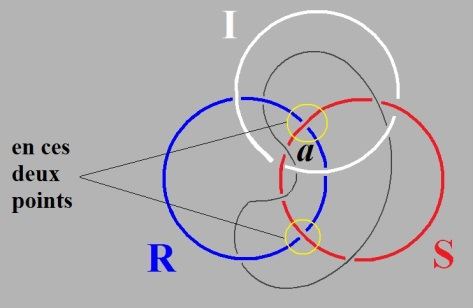

# Leçon 04 | 14 Janvier 1975

  <label><input type="checkbox" data-lacan-toggle="original" checked> 原文</label>
  <label><input type="checkbox" data-lacan-toggle="notes" checked> 注释</label>
  <label><input type="checkbox" data-lacan-toggle="commentary" checked> 个人解读评论</label>

<section class="parallel-paragraph" data-paragraph-ids="s22-04-0001">

s22-04-0001

[无对应译文]

原文 · s22-04-0001

Voilà ! Ce que je dis, ça intéresse - vous en êtes la preuve - ça intéresse tout le monde.

</section>

<section class="parallel-paragraph" data-paragraph-ids="s22-04-0002">

s22-04-0002

[无对应译文]

原文 · s22-04-0002

Ça ne m’intéresse, moi, pas comme tout le monde.

</section>

<section class="parallel-paragraph" data-paragraph-ids="s22-04-0003">

s22-04-0003

[无对应译文]

原文 · s22-04-0003

Et c’est bien pour ça que ça intéresse tout le monde, c’est que ça se sent dans ce que je dis.

</section>

<section class="parallel-paragraph" data-paragraph-ids="s22-04-0004">

s22-04-0004

[无对应译文]

原文 · s22-04-0004

Pourquoi est-ce que ça se sent ?

</section>

<section class="parallel-paragraph" data-paragraph-ids="s22-04-0005">

s22-04-0005

[无对应译文]

原文 · s22-04-0005

Parce que ce que je dis est un frayage qui concerne ma pratique, un frayage qui part de cette question*...*

</section>

<section class="parallel-paragraph" data-paragraph-ids="s22-04-0006">

s22-04-0006

[无对应译文]

原文 · s22-04-0006

> que bien sûr je ne me poserais pas si je n’avais pas dans ma pra­tique la réponse *...*c’est « *qu’est-ce qu’implique que la psychanalyse opère ?* »

</section>

<section class="parallel-paragraph" data-paragraph-ids="s22-04-0007">

s22-04-0007

[无对应译文]

原文 · s22-04-0007

Vous venez de me voir...

</section>

<section class="parallel-paragraph" data-paragraph-ids="s22-04-0008">

s22-04-0008

[无对应译文]

原文 · s22-04-0008

> mais ça n’a rien à faire avec ce que je fais de psychanalyse ...vous venez de me voir opérer au tableau.

</section>

<section class="parallel-paragraph" data-paragraph-ids="s22-04-0009">

s22-04-0009

[无对应译文]

原文 · s22-04-0009

Ça n’a certes pas été, comme vous avez pu le voir, une petite affaire.

</section>

<section class="parallel-paragraph" data-paragraph-ids="s22-04-0010">

s22-04-0010

[无对应译文]

原文 · s22-04-0010

Je m’y suis repris à trente-six fois, encore que j’avais un petit papier dans ma poche pour me guider, sans ça je me serais encore plus foutu dedans, j’aurais encore plus cafouillé que je n’ai fait ! Effectivement*...*

</section>

<section class="parallel-paragraph" data-paragraph-ids="s22-04-0011">

s22-04-0011

[无对应译文]

原文 · s22-04-0011

Ce que vous voyez à droite, c’est ce bon petit nœud bor­roméen pépère, nœud bor­roméen à 4 dont il est facile, immédiat, de voir que si vous coupez 1 quelconque de ces ronds de ficelle, les 3 autres sont libres.

</section>

<section class="parallel-paragraph" data-paragraph-ids="s22-04-0012">

s22-04-0012

[无对应译文]

原文 · s22-04-0012

Il n’y a donc pas la moindre complication à faire un nœud bor­roméen aussi long que vous voudrez, c’est-à-dire à nouer l’un à l’autre un nombre quelconque de ronds de ficelle.

</section>

<section class="parallel-paragraph" data-paragraph-ids="s22-04-0013">

s22-04-0013

[无对应译文]

原文 · s22-04-0013

Tel que...

</section>

<section class="parallel-paragraph" data-paragraph-ids="s22-04-0014">

s22-04-0014

[无对应译文]

原文 · s22-04-0014

et j’ai déjà fait la remarque ...tel que je le dessine là, le nombre de ronds de ficelle n’est pas, si je puis dire, homogène.

</section>

<section class="parallel-paragraph" data-paragraph-ids="s22-04-0015">

s22-04-0015

[无对应译文]

原文 · s22-04-0015

Comme vous pouvez le voir, rien qu’à regarder ce schéma, il y en a ce que vous appelleriez un *premier* et un *dernier*.

</section>

<section class="parallel-paragraph" data-paragraph-ids="s22-04-0016">

s22-04-0016

[无对应译文]

原文 · s22-04-0016

</section>

<section class="parallel-paragraph" data-paragraph-ids="s22-04-0017">

s22-04-0017

[无对应译文]

原文 · s22-04-0017

Tel que c’est fait comme ça, il ne peut pas y en avoir plus de 4 et si je procède de la même façon, pour qu’il y en ait 5, il faudra en quelque sorte que je donne à celui que...

</section>

<section class="parallel-paragraph" data-paragraph-ids="s22-04-0018">

s22-04-0018

[无对应译文]

原文 · s22-04-0018

> si vous voulez, celui tout à fait à droite ...que nous appellerons le *dernier*, une autre façon de se nouer.

</section>

<section class="parallel-paragraph" data-paragraph-ids="s22-04-0019">

s22-04-0019

[无对应译文]

原文 · s22-04-0019

Parce qu’en fin de compte, c’est le dernier qui tient toute la chaîne, qui fait qu’il y en a là 4, et si je pro­cède un peu plus loin, il y en aura 5, à condition que je ne donne pas au dernier le même rôle, puisqu’il en tiendra 5 au lieu de 4.

</section>

<section class="parallel-paragraph" data-paragraph-ids="s22-04-0020">

s22-04-0020

[无对应译文]

原文 · s22-04-0020

Vous le savez par...

</section>

<section class="parallel-paragraph" data-paragraph-ids="s22-04-0021">

s22-04-0021

[无对应译文]

原文 · s22-04-0021

> j’ai dû au passage y faire allusion ...la façon d’arti­culer l’essence du nombre qu’a faite Peano au moyen d’un certain nombre d’axiomes, il semble qu’ici le n+1, le « *successeur* » que Peano met en valeur comme structurant le nombre entier, ceci à une seule condi­tion : c’est qu’il y en ait un au départ qui ne soit le *« successeur »* de per­sonne, c’est-à-dire ce qu’imite fort bien ce rond de ficelle, ce qu’il désigne par le *zéro*.

</section>

<section class="parallel-paragraph" data-paragraph-ids="s22-04-0022">

s22-04-0022

[无对应译文]

原文 · s22-04-0022

C’est *de façon* *axiomatique* que Peano fait son énonciation, c’est-à-dire qu’il pose un certain nombre d’*axiomes* et que c’est de là, conformément à l’exigence mathématique - arithmétique en l’occasion - qu’il construit quelque chose qui nous donne la définition d’une série, qui sera aux nombres...

</section>

<section class="parallel-paragraph" data-paragraph-ids="s22-04-0023">

s22-04-0023

[无对应译文]

原文 · s22-04-0023

aux nombres entiers, disons - parce que nous sommes ici \[arithmétique\] ...homologique. C’est-à-dire que tout ce qui sera fait au moyen de tels axiomes sera homologique à *la série des nombres entiers.*

</section>

<section class="parallel-paragraph" data-paragraph-ids="s22-04-0024">

s22-04-0024

[无对应译文]

原文 · s22-04-0024

Mais qu’est-ce que je vous montre là ?

</section>

<section class="parallel-paragraph" data-paragraph-ids="s22-04-0025">

s22-04-0025

[无对应译文]

原文 · s22-04-0025

Quelque chose d’autre \[*le nœud borroméen*\], puisque là se spécifie la fonction de ce +1 comme tel.

</section>

<section class="parallel-paragraph" data-paragraph-ids="s22-04-0026">

s22-04-0026

[无对应译文]

原文 · s22-04-0026

C’est ce +1 qui fait que, supprimé - lui par exemple - il n’y a plus ici de chaîne, il n’y a plus de série, puisque du seul fait de la section de ce « *un-entre-autres* », tous les autres, disons, se libèrent comme uns.

</section>

<section class="parallel-paragraph" data-paragraph-ids="s22-04-0027">

s22-04-0027

[无对应译文]

原文 · s22-04-0027

C’est une façon - la dirais-je *matérielle* ? - *de faire sentir que* 1 *n’est pas un nombre*, quoique cette suite de nombres soit faite d’une suite de 1.

</section>

<section class="parallel-paragraph" data-paragraph-ids="s22-04-0028">

s22-04-0028

[无对应译文]

原文 · s22-04-0028

À me servir *de ronds de ficelle*, disons que j’illustre quelque chose qui n’est pas sans rapport avec cette suite des nombres que \- vous le savez - on a la plus grande peine à ne pas tenir pour constituante du *Réel*.

</section>

<section class="parallel-paragraph" data-paragraph-ids="s22-04-0029">

s22-04-0029

[无对应译文]

原文 · s22-04-0029

Tout abord du *Réel* rend très difficile de ne pas tenir compte du *nombre*, le *nombre* semble...

</section>

<section class="parallel-paragraph" data-paragraph-ids="s22-04-0030">

s22-04-0030

[无对应译文]

原文 · s22-04-0030

> pourquoi ne pas accueillir ce mot qui me vient ici pré­maturément ...*tout abord du Réel est tissé par le nombre*.

</section>

<section class="parallel-paragraph" data-paragraph-ids="s22-04-0031">

s22-04-0031

[无对应译文]

原文 · s22-04-0031

Il y a dans le *nombre* une *consistance* qui est bien d’une nature que nous pouvons dire *pas naturelle* du tout.

</section>

<section class="parallel-paragraph" data-paragraph-ids="s22-04-0032">

s22-04-0032

[无对应译文]

原文 · s22-04-0032

Puisque, pour que je vous fasse sentir que j’aborde cette catégorie du *Réel* en tant qu’il y a quelque chose qui noue ce à quoi je suis amené à donner aussi consistance : l’*Imaginaire* et le *Symbolique*.

</section>

<section class="parallel-paragraph" data-paragraph-ids="s22-04-0033">

s22-04-0033

[无对应译文]

原文 · s22-04-0033

Comment se fait-il que ceci, si je puis dire, me pousse d’abord à me servir du nœud ?

</section>

<section class="parallel-paragraph" data-paragraph-ids="s22-04-0034">

s22-04-0034

[无对应译文]

原文 · s22-04-0034

C’est au titre d’être la même, la même *consistance*...

</section>

<section class="parallel-paragraph" data-paragraph-ids="s22-04-0035">

s22-04-0035

[无对应译文]

原文 · s22-04-0035

> dans ces trois « *quelque chose* » que j’originalise du *Symbolique*, de l’*Imaginaire* et du *Réel* ...c’est à ce titre d’être la même, la même *consistance,* que je produis...

</section>

<section class="parallel-paragraph" data-paragraph-ids="s22-04-0036">

s22-04-0036

[无对应译文]

原文 · s22-04-0036

> et ce, pourquoi ? - pour rendre raison de ma pratique ...que je produis ce nœud borro­méen.

</section>

<section class="parallel-paragraph" data-paragraph-ids="s22-04-0037">

s22-04-0037

[无对应译文]

原文 · s22-04-0037

On n’a jamais fait ça, qui consiste - en quoi ?- : faire abstraction de *la* *consistance* comme telle.

</section>

<section class="parallel-paragraph" data-paragraph-ids="s22-04-0038">

s22-04-0038

[无对应译文]

原文 · s22-04-0038

J’isole *la consistance* comme « *quelque chose* », que j’appellerai comme ça pour vous, pour faire image, car de faire image je ne m’en prive pas.

</section>

<section class="parallel-paragraph" data-paragraph-ids="s22-04-0039">

s22-04-0039

[无对应译文]

原文 · s22-04-0039

Qu’est-ce que c’est ce qu’il y a là au tableau, si ce n’est des images, dont le plus étonnant, c’est que vous vous y repériez.

</section>

<section class="parallel-paragraph" data-paragraph-ids="s22-04-0040">

s22-04-0040

[无对应译文]

原文 · s22-04-0040

Car ne croyez pas que ces images aillent toutes seules !

</section>

<section class="parallel-paragraph" data-paragraph-ids="s22-04-0041">

s22-04-0041

[无对应译文]

原文 · s22-04-0041

Sans doute, vous avez l’habitude du tableau noir, mais qu’est-ce que vous y voyez ?

</section>

<section class="parallel-paragraph" data-paragraph-ids="s22-04-0042">

s22-04-0042

[无对应译文]

原文 · s22-04-0042

La peine même que vous avez vue qu’il a fallu que je me donne pour ces images, qui ont cette propriété que mises à plat, néanmoins il faut qu’une ligne passe dessus, *crossing-over*, ou passe dessous, *under-crossing.*

</section>

<section class="parallel-paragraph" data-paragraph-ids="s22-04-0043">

s22-04-0043

[无对应译文]

原文 · s22-04-0043

 

</section>

<section class="parallel-paragraph" data-paragraph-ids="s22-04-0044">

s22-04-0044

[无对应译文]

原文 · s22-04-0044

*Crossing-over under-crossing*

</section>

<section class="parallel-paragraph" data-paragraph-ids="s22-04-0045">

s22-04-0045

[无对应译文]

原文 · s22-04-0045

Que ça *fasse image* est déjà en soi-même miraculeux, je ne suis d’ailleurs pas tout à fait sûr que ces deux *images*, vous les saisissiez si aisément que cela. Vous voyez bien qu’il y a une différence.

</section>

<section class="parallel-paragraph" data-paragraph-ids="s22-04-0046">

s22-04-0046

[无对应译文]

原文 · s22-04-0046

Néanmoins je vous pose le pro­blème : est-ce que tel que c’est là, ce nœud-ci, tel qu’il est fait de la façon pépère que je vous avais déjà depuis longtemps signalée, *est-ce que c’est le même* ?

</section>

<section class="parallel-paragraph" data-paragraph-ids="s22-04-0047">

s22-04-0047

[无对应译文]

原文 · s22-04-0047

Autrement dit : à simplement trifouiller le machin, est-ce que vous pouvez en celui-là, je ne dirais pas le transformer, puisque ce serait le même ? Imposez-vous ça comme petit exercice.

</section>

<section class="parallel-paragraph" data-paragraph-ids="s22-04-0048">

s22-04-0048

[无对应译文]

原文 · s22-04-0048

Est-ce qu’en d’autres termes...

</section>

<section class="parallel-paragraph" data-paragraph-ids="s22-04-0049">

s22-04-0049

[无对应译文]

原文 · s22-04-0049

> c’est le sens de ce que je vous demande ...à quatre ça marche, c’est le même nœud ? Ou est-ce qu’il en faut un de plus ?

</section>

<section class="parallel-paragraph" data-paragraph-ids="s22-04-0050">

s22-04-0050

[无对应译文]

原文 · s22-04-0050

Car je vous dis déjà que dans une chaîne faite comme celle-là, la transformation, ça s’obtient.

</section>

<section class="parallel-paragraph" data-paragraph-ids="s22-04-0051">

s22-04-0051

[无对应译文]

原文 · s22-04-0051

Mais je ne vous dis pas...

</section>

<section class="parallel-paragraph" data-paragraph-ids="s22-04-0052">

s22-04-0052

[无对应译文]

原文 · s22-04-0052

pour vous en laisser à vous-mêmes le régal ...je ne vous dis pas à partir de combien.

</section>

<section class="parallel-paragraph" data-paragraph-ids="s22-04-0053">

s22-04-0053

[无对应译文]

原文 · s22-04-0053

Car il y a une chose qui est certaine, c’est qu’avec 3, vous ne produirez pas cette petite *complique* très particuliè­re qui distingue apparemment la figure de *gauche* de la figure de *droite*.

</section>

<section class="parallel-paragraph" data-paragraph-ids="s22-04-0054">

s22-04-0054

[无对应译文]

原文 · s22-04-0054

S’il y a quelque chose qui illustre que la *consistance*...

</section>

<section class="parallel-paragraph" data-paragraph-ids="s22-04-0055">

s22-04-0055

[无对应译文]

原文 · s22-04-0055

> ce *quelque chose* qui est en quelque sorte sous-jacent- à quoi ? – à tout ce que nous disons,
>
> que cette *consistance* est autre chose que ce qu’on qualifie, dans le lan­gage, de la « *non-contradiction* », ...c’est bien cette sorte de figure, en tant qu’elle a ce *quelque chose* que je suis bien forcé d’appeler une *consis­tance réelle*, puisque c’est ça qui est supposé : c’est qu’une corde, ça tient.

</section>

<section class="parallel-paragraph" data-paragraph-ids="s22-04-0056">

s22-04-0056

[无对应译文]

原文 · s22-04-0056

On n’y pense jamais, on ne pense jamais à ce qu’il y a de métaphore dans le terme de *consistance*.

</section>

<section class="parallel-paragraph" data-paragraph-ids="s22-04-0057">

s22-04-0057

[无对应译文]

原文 · s22-04-0057

Il y a quelque chose qui est plus fort que ça, c’est que moi, cette *consis­tance réelle*, c’est par la voie d’une intuition, dont je peux tout de même dire que puisque je vous la transmets par l’image, c’est par la voie d’une intuition *imaginaire* que je vous la communique.

</section>

<section class="parallel-paragraph" data-paragraph-ids="s22-04-0058">

s22-04-0058

[无对应译文]

原文 · s22-04-0058

Et le fait que je suis sûr que vous ne soyez pas plus familiers que moi avec ces sortes de figures...

</section>

<section class="parallel-paragraph" data-paragraph-ids="s22-04-0059">

s22-04-0059

[无对应译文]

原文 · s22-04-0059

> les quelques frayages que je vous y donne, en la dessinant au tableau ...je suis sûr que pour, disons la grande majorité d’entre vous, la question que je pose, celle de la *transformation*, qui n’est pas une transformation, qui serait une transformation s’il fallait refaire le nœud pour que celle de gauche se transforme en celle de droite, ou inversement.

</section>

<section class="parallel-paragraph" data-paragraph-ids="s22-04-0060">

s22-04-0060

[无对应译文]

原文 · s22-04-0060

Je vous l’ai posée cette question : « *est-ce le même nœud?* »

</section>

<section class="parallel-paragraph" data-paragraph-ids="s22-04-0061">

s22-04-0061

[无对应译文]

原文 · s22-04-0061

Il y en a pas beaucoup qui puissent, tout à trac comme ça, me le dire.

</section>

<section class="parallel-paragraph" data-paragraph-ids="s22-04-0062">

s22-04-0062

[无对应译文]

原文 · s22-04-0062

Encore bien moins me dire pourquoi.

</section>

<section class="parallel-paragraph" data-paragraph-ids="s22-04-0063">

s22-04-0063

[无对应译文]

原文 · s22-04-0063

Nous voilà donc avec, si je puis dire, en main cette corde comme fon­dement supposé de la *consistance*, d’une façon telle qu’on ne puisse dire qu’il s’agisse là de quelque chose à quoi nous soyons déjà habitués, à savoir la ligne géométrique.

</section>

<section class="parallel-paragraph" data-paragraph-ids="s22-04-0064">

s22-04-0064

[无对应译文]

原文 · s22-04-0064

C’est tout de même bien autre chose, non seulement *la ligne géométrique* ça n’est pas ça, mais chacun sait que *ce qu’elle engendre*, c’est toutes sortes de problèmes concernant sa *conti­nuité*, qui ne sont pas rien, et qui ne sont pas rien pourquoi ?

</section>

<section class="parallel-paragraph" data-paragraph-ids="s22-04-0065">

s22-04-0065

[无对应译文]

原文 · s22-04-0065

Justement de ce qu’elle - la ligne - nous ne pouvons pas ne pas la supporter de *quelque chose* qui ait cette *consistance* justement, qui fasse corde, c’est même là le principe.

</section>

<section class="parallel-paragraph" data-paragraph-ids="s22-04-0066">

s22-04-0066

[无对应译文]

原文 · s22-04-0066

Le principe de ceci, dont la première poudre aux yeux qui fut donnée des fonctions dites « *continues* », il semblait qu’on ne pou­vait pas construire de ligne qui n’ait quelque part une tangente, que cette tangente fut droite ou courbe, d’ailleurs peu importait.

</section>

<section class="parallel-paragraph" data-paragraph-ids="s22-04-0067">

s22-04-0067

[无对应译文]

原文 · s22-04-0067

C’est de cette idée que la ligne n’était tout de même pas sans épaisseur que se sont pro­duits ces *mirages* avec lesquels les mathématiciens ont dû longtemps se battre, et que d’ailleurs il a fallu du temps pour qu’ils s’éveillent à ceci : qu’on pouvait faire une ligne parfaitement continue et qui n’eût pas de tangente.

</section>

<section class="parallel-paragraph" data-paragraph-ids="s22-04-0068">

s22-04-0068

[无对应译文]

原文 · s22-04-0068

C’est dire quand même l’importance qu’a cette image, mais est-ce bien une image ?

</section>

<section class="parallel-paragraph" data-paragraph-ids="s22-04-0069">

s22-04-0069

[无对应译文]

原文 · s22-04-0069

Après tout, c’est pas pour rien qu’on vous dit : « *Tenez bien la corde hein* ! ».

</section>

<section class="parallel-paragraph" data-paragraph-ids="s22-04-0070">

s22-04-0070

[无对应译文]

原文 · s22-04-0070

« *Tenez bien la corde* », ça veut dire qu’une corde, quand à l’autre bout c’est noué, on peut s’y tenir.

</section>

<section class="parallel-paragraph" data-paragraph-ids="s22-04-0071">

s22-04-0071

[无对应译文]

原文 · s22-04-0071

Ça a quelque chose à faire avec le *Réel*, et c’est bien là que - mon Dieu - ça ne me paraît pas à côté de la plaque de vous rappeler que dans sa « *Règle 10 »,* des « *Règles pour la direction de l’esprit »,* un nommé Descartes n’avait pas cru super­flu dans cette *Règle 10*, de faire la remarque que :

</section>

<section class="parallel-paragraph" data-paragraph-ids="s22-04-0072">

s22-04-0072

[无对应译文]

原文 · s22-04-0072

> « *...comme tous les esprits ne sont pas également portés à découvrir spontanément les choses par leurs propres forces,*
>
> *cette règle apprend qu’il ne faut pas s’occuper tout de suite des choses plus difficiles et ardues - moins importantes –*
>
> *mais qu’il faut approfondir tout d’abord les arts les moins importants et les plus simples, ceux surtout où l’ordre règne davantage,*
>
> *comme sont ceux des artisans qui font de la toile et des tapis, ou ceux des femmes qui brodent ou font de la dentelle,*
>
> *ainsi que toutes les combinaisons des nombres et toutes les opérations qui se rap­portent à l’arithmétique, et autres choses semblables..*. » [^7].

</section>

<section class="parallel-paragraph" data-paragraph-ids="s22-04-0073">

s22-04-0073

[无对应译文]

原文 · s22-04-0073

Il n’y a pas le moindre soupçon qu’en disant ces choses, Descartes eut le sentiment qu’il y a un rapport entre

</section>

<section class="parallel-paragraph" data-paragraph-ids="s22-04-0074">

s22-04-0074

[无对应译文]

原文 · s22-04-0074

- l’arithmétique

</section>

<section class="parallel-paragraph" data-paragraph-ids="s22-04-0075">

s22-04-0075

[无对应译文]

原文 · s22-04-0075

- et le fait que les femmes font de la dentelle,

</section>

<section class="parallel-paragraph" data-paragraph-ids="s22-04-0076">

s22-04-0076

[无对应译文]

原文 · s22-04-0076

- voire que les tapissiers font des *nœuds*.

</section>

<section class="parallel-paragraph" data-paragraph-ids="s22-04-0077">

s22-04-0077

[无对应译文]

原文 · s22-04-0077

Il est d’autre part certain que jamais Descartes ne s’est le moindrement du monde occupé des *nœuds*.

</section>

<section class="parallel-paragraph" data-paragraph-ids="s22-04-0078">

s22-04-0078

[无对应译文]

原文 · s22-04-0078

Il a fallu, bien au contraire, être déjà assez avancé dans le XXème siècle pour que quelque chose s’ébauche qui puisse s’appeler *théorie des nœuds*.

</section>

<section class="parallel-paragraph" data-paragraph-ids="s22-04-0079">

s22-04-0079

[无对应译文]

原文 · s22-04-0079

Vous savez d’autre part, parce que je vous l’ai dit, que cette *théorie des nœuds* est dans l’enfance, est extrê­mement maladroite.

</section>

<section class="parallel-paragraph" data-paragraph-ids="s22-04-0080">

s22-04-0080

[无对应译文]

原文 · s22-04-0080

Et que, telle qu’elle est fabriquée, il y a bien des cas où sur le vu de simples figures telles que celles que je viens de faire au tableau, vous ne pouvez d’aucune façon rendre raison de ceci : si oui ou non, l’embrouillis que vous avez tracé est ou n’est pas un nœud.

</section>

<section class="parallel-paragraph" data-paragraph-ids="s22-04-0081">

s22-04-0081

[无对应译文]

原文 · s22-04-0081

Ceci, quelles que soient *les conventions* que vous vous soyez données par avance pour rendre compte du *nœud* comme tel.

</section>

<section class="parallel-paragraph" data-paragraph-ids="s22-04-0082">

s22-04-0082

[无对应译文]

原文 · s22-04-0082

C’est qu’aussi bien il y a quelque chose qui vaut qu’on s’y arrête.

</section>

<section class="parallel-paragraph" data-paragraph-ids="s22-04-0083">

s22-04-0083

[无对应译文]

原文 · s22-04-0083

C’est ceci : c’est que...

</section>

<section class="parallel-paragraph" data-paragraph-ids="s22-04-0084">

s22-04-0084

[无对应译文]

原文 · s22-04-0084

> est-ce du fait de l’intui­tion ? ...mais ce que je vous démontre c’est que ça va bien plus loin que ça : c’est pas seulement que la vision fasse toujours plus ou moins surfa­ce, c’est pour des raisons plus profondes...

</section>

<section class="parallel-paragraph" data-paragraph-ids="s22-04-0085">

s22-04-0085

[无对应译文]

原文 · s22-04-0085

> et qu’en quelque sorte ces *nœuds* nous rendent tangibles ...c’est pour des raisons plus profondes, pour ce qui est de la *nature*, de la « *nature des choses* » comme on dit.

</section>

<section class="parallel-paragraph" data-paragraph-ids="s22-04-0086">

s22-04-0086

[无对应译文]

原文 · s22-04-0086

L’*être qui parle*...

</section>

<section class="parallel-paragraph" data-paragraph-ids="s22-04-0087">

s22-04-0087

[无对应译文]

原文 · s22-04-0087

puisque après tout nous ne pouvons pas dire grand chose des autres, au moins jusqu’à ce qu’on soit entré d’une façon un peu plus aiguë dans le biais de leur sens, ...l’*être qui parle* est toujours quelque part mal situé entre 2 et 3 dimensions.

</section>

<section class="parallel-paragraph" data-paragraph-ids="s22-04-0088">

s22-04-0088

[无对应译文]

原文 · s22-04-0088

C’est bien pourquoi, vous m’avez entendu produire ceci qui est la même chose que mon nœud, cette équivoque sur « *dit-mension* », que j’écris...

</section>

<section class="parallel-paragraph" data-paragraph-ids="s22-04-0089">

s22-04-0089

[无对应译文]

原文 · s22-04-0089

> vous le savez, parce que je vous l’ai seriné ...que j’écris : *d.i.t,* *tiret*, et puis *mension *: *mention* du *dire*.

</section>

<section class="parallel-paragraph" data-paragraph-ids="s22-04-0090">

s22-04-0090

[无对应译文]

原文 · s22-04-0090

On ne sait pas très bien si dans le *dire*, les 3 dimensions - écrites comme à l’accoutumée - nous les avons bien, je veux dire si nous sommes si aisés à nous y déplacer :

</section>

<section class="parallel-paragraph" data-paragraph-ids="s22-04-0091">

s22-04-0091

[无对应译文]

原文 · s22-04-0091

- τὰ ζῶα τρέχει \[Ta zoa trékei\][^8]. Et nous sommes assurément là,

</section>

<section class="parallel-paragraph" data-paragraph-ids="s22-04-0092">

s22-04-0092

[无对应译文]

原文 · s22-04-0092

- ζῷν \[zoon\], *nous marchons*.

</section>

<section class="parallel-paragraph" data-paragraph-ids="s22-04-0093">

s22-04-0093

[无对应译文]

原文 · s22-04-0093

Mais faut pas s’imaginer que, parce que nous marchons, nous faisons quelque chose qui a le moindre rapport avec *l’espace à* 3 *dimensions*.

</section>

<section class="parallel-paragraph" data-paragraph-ids="s22-04-0094">

s22-04-0094

[无对应译文]

原文 · s22-04-0094

Que notre corps soit à 3 *dimensions*, c’est ce qui ne fait aucun doute, pour peu que de ce corps on crève la boudouille.

</section>

<section class="parallel-paragraph" data-paragraph-ids="s22-04-0095">

s22-04-0095

[无对应译文]

原文 · s22-04-0095

Mais ça ne veut pas du tout dire que ce que nous appelons *espace*, ça ne soit pas toujours plus ou moins plat.

</section>

<section class="parallel-paragraph" data-paragraph-ids="s22-04-0096">

s22-04-0096

[无对应译文]

原文 · s22-04-0096

Il y a même des mathématiciens pour l’avoir écrit en toutes lettres : tout espace est plat.

</section>

<section class="parallel-paragraph" data-paragraph-ids="s22-04-0097">

s22-04-0097

[无对应译文]

原文 · s22-04-0097

Toute manipulation de quelque chose de réel se situe dans ce cas dans un espace, dont c’est un fait que nous savons très mal le manier, en dehors de techniques qui imposent cet espace à 3 dimensions.

</section>

<section class="parallel-paragraph" data-paragraph-ids="s22-04-0098">

s22-04-0098

[无对应译文]

原文 · s22-04-0098

C’est évidemment tout à fait frappant que ce soit une *technique* \[*la psychanalyse*\], une *technique* qu’on peut réduire à ce qu’elle est apparemment, à savoir *le jaspinage*, qui à moi me force la main sur cette *soupesée* - si je puis dire - *de l’espa­ce* comme tel.

</section>

<section class="parallel-paragraph" data-paragraph-ids="s22-04-0099">

s22-04-0099

[无对应译文]

原文 · s22-04-0099

Si nous repartons de *quelque chose* qu’il faut bien dire être *la science*, est-ce que *la science* ne nous permet pas de soupçonner, qu’à traiter l’es­pace de la même façon que celle qui s’impose du fait d’une technique qui s’impose, à moi, tout au moins, ce qu’elle rencontre c’est le para­doxe.

</section>

<section class="parallel-paragraph" data-paragraph-ids="s22-04-0100">

s22-04-0100

[无对应译文]

原文 · s22-04-0100

Car enfin, on ne peut dire que la matière...

</section>

<section class="parallel-paragraph" data-paragraph-ids="s22-04-0101">

s22-04-0101

[无对应译文]

原文 · s22-04-0101

> vous en avez un petit peu entendu parler ...que la matière ne lui fasse pas problème à tout instant.

</section>

<section class="parallel-paragraph" data-paragraph-ids="s22-04-0102">

s22-04-0102

[无对应译文]

原文 · s22-04-0102

« *Problème* » c’est-à-dire...

</section>

<section class="parallel-paragraph" data-paragraph-ids="s22-04-0103">

s22-04-0103

[无对应译文]

原文 · s22-04-0103

> c’est ça que ça veut dire « *Problème »...*défense avancée, chose à concasser pour qu’on arrive à voir ce que ça défend.

</section>

<section class="parallel-paragraph" data-paragraph-ids="s22-04-0104">

s22-04-0104

[无对应译文]

原文 · s22-04-0104

La science ne s’est peut-être pas encore tout à fait rendu compte que si elle traite la matière, c’est comme si elle avait un inconscient, ladite matière, comme si elle savait quelque part ce qu’elle faisait.

</section>

<section class="parallel-paragraph" data-paragraph-ids="s22-04-0105">

s22-04-0105

[无对应译文]

原文 · s22-04-0105

Naturellement, c’est une vérité qui s’est très rapidement éteinte.

</section>

<section class="parallel-paragraph" data-paragraph-ids="s22-04-0106">

s22-04-0106

[无对应译文]

原文 · s22-04-0106

On s’en est aperçu, il y a eu un petit moment de réveil, au moment de Newton, on lui a dit : « *Mais enfin cette histoire de cette sacrée gravitation que vous nous racontez, enfin !..*

</section>

<section class="parallel-paragraph" data-paragraph-ids="s22-04-0107">

s22-04-0107

[无对应译文]

原文 · s22-04-0107

> com­ment d’ailleurs pouvait-on se la représenter avant, mis à part le τόπος \[topos\] d’Aristote ...*enfin ! C’est à nous impensable !*

</section>

<section class="parallel-paragraph" data-paragraph-ids="s22-04-0108">

s22-04-0108

[无对应译文]

原文 · s22-04-0108

Impensable pourquoi ?

</section>

<section class="parallel-paragraph" data-paragraph-ids="s22-04-0109">

s22-04-0109

[无对应译文]

原文 · s22-04-0109

Parce que nous avons les petites formules de Newton, et que nous n’y comprenons rien, c’est ce qui en fait la valeur.

</section>

<section class="parallel-paragraph" data-paragraph-ids="s22-04-0110">

s22-04-0110

[无对应译文]

原文 · s22-04-0110

Car quand ces formules ont fait leur entrée, c’est tout de suite ça qu’on y a fait objection, c’est à savoir : « *mais comment est-ce que chacune de ces particules peut savoir à quelle distance elle est de toutes les autres* ? »

</section>

<section class="parallel-paragraph" data-paragraph-ids="s22-04-0111">

s22-04-0111

[无对应译文]

原文 · s22-04-0111

C’est-à-dire que ce qu’on évoquait c’est, c’était l’inconscient, enfin de la particule bien sûr !

</section>

<section class="parallel-paragraph" data-paragraph-ids="s22-04-0112">

s22-04-0112

[无对应译文]

原文 · s22-04-0112

Tout ça, tout ça s’est éteint.

</section>

<section class="parallel-paragraph" data-paragraph-ids="s22-04-0113">

s22-04-0113

[无对应译文]

原文 · s22-04-0113

Pourquoi ?

</section>

<section class="parallel-paragraph" data-paragraph-ids="s22-04-0114">

s22-04-0114

[无对应译文]

原文 · s22-04-0114

Parce qu’on a sim­plement renoncé à rien y comprendre, et que d’ailleurs c’est dans la mesure où on y est revenu, qu’on a pu parvenir à des formules plus com­pliquées, et nouant un petit peu plus de dimensions dans l’affaire, c’est bien le problème.

</section>

<section class="parallel-paragraph" data-paragraph-ids="s22-04-0115">

s22-04-0115

[无对应译文]

原文 · s22-04-0115

Qu’est-ce que c’est que cette « *analyse »*, au sens propre­ment de *ma technique*...

</section>

<section class="parallel-paragraph" data-paragraph-ids="s22-04-0116">

s22-04-0116

[无对应译文]

原文 · s22-04-0116

> celle que j’ai en commun avec un certain nombre de personnes qui sont ici ...et quelle place occupe *cette technique,* au regard de ce que fait la science ?

</section>

<section class="parallel-paragraph" data-paragraph-ids="s22-04-0117">

s22-04-0117

[无对应译文]

原文 · s22-04-0117

La science compte, elle compte la matiè­re.

</section>

<section class="parallel-paragraph" data-paragraph-ids="s22-04-0118">

s22-04-0118

[无对应译文]

原文 · s22-04-0118

Mais qu’est-ce qu’elle compte dans cette matière ?

</section>

<section class="parallel-paragraph" data-paragraph-ids="s22-04-0119">

s22-04-0119

[无对应译文]

原文 · s22-04-0119

À savoir, s’il n’y avait pas le langage qui déjà véhicule le nombre, quel sens ça aurait-il de compter ?

</section>

<section class="parallel-paragraph" data-paragraph-ids="s22-04-0120">

s22-04-0120

[无对应译文]

原文 · s22-04-0120

Est-ce que l’inconscient par exemple a du *comptable* en lui ?

</section>

<section class="parallel-paragraph" data-paragraph-ids="s22-04-0121">

s22-04-0121

[无对应译文]

原文 · s22-04-0121

Je ne dis pas quelque chose qu’on puisse compter, je dis *s’il y a un comptable* au sens du *personnage* que vous connaissez, qui scribouille des chiffres.

</section>

<section class="parallel-paragraph" data-paragraph-ids="s22-04-0122">

s22-04-0122

[无对应译文]

原文 · s22-04-0122

Est-ce qu’il y a du *comptable* dans l’inconscient ?

</section>

<section class="parallel-paragraph" data-paragraph-ids="s22-04-0123">

s22-04-0123

[无对应译文]

原文 · s22-04-0123

C’est tout à fait évident que oui.

</section>

<section class="parallel-paragraph" data-paragraph-ids="s22-04-0124">

s22-04-0124

[无对应译文]

原文 · s22-04-0124

Chaque inconscient n’est pas *du* comptable, est *un* comptable, et un comptable qui sait faire les additions.

</section>

<section class="parallel-paragraph" data-paragraph-ids="s22-04-0125">

s22-04-0125

[无对应译文]

原文 · s22-04-0125

Naturellement la multiplication, il n’en est pas encore là, bien sûr, c’est même bien ce qui l’embarrasse, mais pour ce qui est de compter les trucs, de compter les coups, je ne dirai pas qu’il sait y faire, il est extrêmement maladroit, mais il doit compter dans le genre, dans le genre de ces nœuds.

</section>

<section class="parallel-paragraph" data-paragraph-ids="s22-04-0126">

s22-04-0126

[无对应译文]

原文 · s22-04-0126

C’est de là que procède le fameux « *sentiment de culpabilité* » dont vous avez probablement quelquefois entendu parler.

</section>

<section class="parallel-paragraph" data-paragraph-ids="s22-04-0127">

s22-04-0127

[无对应译文]

原文 · s22-04-0127

Le sentiment de culpabilité est quelque chose qui fait les comptes, qui fait les comptes et bien entendu ne s’y retrouve pas, ne s’y retrouve jamais, il se perd dans ses comptes.

</section>

<section class="parallel-paragraph" data-paragraph-ids="s22-04-0128">

s22-04-0128

[无对应译文]

原文 · s22-04-0128

Mais c’est bien là où se touche qu’il y a au minimum un nœud, ce nœud dont, si vous me permettez de vous le dire, la nature a hor­reur.

</section>

<section class="parallel-paragraph" data-paragraph-ids="s22-04-0129">

s22-04-0129

[无对应译文]

原文 · s22-04-0129

J’entends, une autre chanson que « *la nature a horreur du vide* » : la nature a horreur du nœud.

</section>

<section class="parallel-paragraph" data-paragraph-ids="s22-04-0130">

s22-04-0130

[无对应译文]

原文 · s22-04-0130

La nature a horreur du nœud, tout spécia­lement borroméen et, chose étrange, c’est en cela que je vous repasse le machin.

</section>

<section class="parallel-paragraph" data-paragraph-ids="s22-04-0131">

s22-04-0131

[无对应译文]

原文 · s22-04-0131

Le machin, ça n’est rien de moins que *l’urverdrängt, le refoulé originaire, le refoulé primordial,* et c’est bien pour ça que je vous conseille de vous exercer avec mes deux petits machins, non pas que ça vous donnera quoique ce soit du *refoulé*, puisque *ce refoulé c’est le trou, jamais vous ne l’aurez*.

</section>

<section class="parallel-paragraph" data-paragraph-ids="s22-04-0132">

s22-04-0132

[无对应译文]

原文 · s22-04-0132

Mais en route, à manipuler ce petit nœud, vous vous familiariserez, au moins avec vos mains, avec ce quelque chose auquel de toute façon vous ne pouvez rien comprendre, puisqu’il est tout à fait exclu que ce nœud, vous le sachiez.

</section>

<section class="parallel-paragraph" data-paragraph-ids="s22-04-0133">

s22-04-0133

[无对应译文]

原文 · s22-04-0133

C’est même bien pour ça - l’histoire en témoigne - c’est bien pour ça que la géométrie est passée par tout : par les *cubes*, par les *pyramides*, les diverses formes de *hérissons* autour desquelles on a cogité, la rigueur c’est ce qui ne veut rien dire d’autre que les solides !

</section>

<section class="parallel-paragraph" data-paragraph-ids="s22-04-0134">

s22-04-0134

[无对应译文]

原文 · s22-04-0134

Alors qu’elle avait à la portée de sa main, quelque chose qui valait bien - mon Dieu - les pierres dont elle faisait le charroi, ou les champs justement, qu’on pouvait pas mesurer sans tendre des cordes.

</section>

<section class="parallel-paragraph" data-paragraph-ids="s22-04-0135">

s22-04-0135

[无对应译文]

原文 · s22-04-0135

Jamais à ces cordes, personne ne semble avoir réservé, avant une époque très moderne, la moindre attention.

</section>

<section class="parallel-paragraph" data-paragraph-ids="s22-04-0136">

s22-04-0136

[无对应译文]

原文 · s22-04-0136

En un certain sens, je dirai qu’il y a quelque chose de nouveau, à ce qu’on s’intéresse à des mots, à des termes comme celui par exemple de la mésologie : qu’est-ce qu’il y a « *entre* », entre quoi et quoi ?

</section>

<section class="parallel-paragraph" data-paragraph-ids="s22-04-0137">

s22-04-0137

[无对应译文]

原文 · s22-04-0137

Il s’agit de définir qu’est-ce que c’est « *entre* » : je *t’entre*, c’est mon *tentris­me* à moi.

</section>

<section class="parallel-paragraph" data-paragraph-ids="s22-04-0138">

s22-04-0138

[无对应译文]

原文 · s22-04-0138

« *Entre* » c’est une catégorie qui a fait son apparition, enfin tout récemment dans la mathématique, et c’est bien en cela, que de temps en temps je vais consulter un mathématicien pour qu’il me dise où ils en sont à cet égard.

</section>

<section class="parallel-paragraph" data-paragraph-ids="s22-04-0139">

s22-04-0139

[无对应译文]

原文 · s22-04-0139

Oui ! Il y a quelque chose que pour prendre...

</section>

<section class="parallel-paragraph" data-paragraph-ids="s22-04-0140">

s22-04-0140

[无对应译文]

原文 · s22-04-0140

Vous voyez *je fais des progrès*, je suis presque arrivé à dessiner un nœud *borroméen*, sans être forcé de faire des petits effaçages.

</section>

<section class="parallel-paragraph" data-paragraph-ids="s22-04-0141">

s22-04-0141

[无对应译文]

原文 · s22-04-0141

Je voudrais aujourd’hui, puisque déjà l’heure avance, annoncer ce que j’ai à dire, ce qui nous prendra notre année.

</section>

<section class="parallel-paragraph" data-paragraph-ids="s22-04-0142">

s22-04-0142

[无对应译文]

原文 · s22-04-0142

Ici au joint de l’*Imaginaire* et du *Symbolique* :

</section>

<section class="parallel-paragraph" data-paragraph-ids="s22-04-0143">

s22-04-0143

[无对应译文]

原文 · s22-04-0143

</section>

<section class="parallel-paragraph" data-paragraph-ids="s22-04-0144">

s22-04-0144

[无对应译文]

原文 · s22-04-0144

Et pas dans n’importe quel joint, dans ce joint-ci où vous pouvez confondre ces deux points...

</section>

<section class="parallel-paragraph" data-paragraph-ids="s22-04-0145">

s22-04-0145

[无对应译文]

原文 · s22-04-0145

> encore qu’ils ne procèdent pas du même mouvement,
>
> du même mouvement relatif de *l’Imaginaire et du Symbolique* ...ici dans ces deux points qui d’ailleurs se confondent, quand de l’*Imaginaire* et du *Symbolique,* le coincement se produit, en ces deux points il y a *le sens*.

</section>

<section class="parallel-paragraph" data-paragraph-ids="s22-04-0146">

s22-04-0146

[无对应译文]

原文 · s22-04-0146

Faut bien que je fende un peu les choses...

</section>

<section class="parallel-paragraph" data-paragraph-ids="s22-04-0147">

s22-04-0147

[无对应译文]

原文 · s22-04-0147

> puisque - je m’en excuse - j’ai dû traîner ...pour vous donner un peu une *dit-mension*, une *dit-mension* qui me tracasse, celle du nœud.

</section>

<section class="parallel-paragraph" data-paragraph-ids="s22-04-0148">

s22-04-0148

[无对应译文]

原文 · s22-04-0148

Ici et là...

</section>

<section class="parallel-paragraph" data-paragraph-ids="s22-04-0149">

s22-04-0149

[无对应译文]

原文 · s22-04-0149

vous voyez comme c’est difficile, faut quand même que je fignole un peu ...nous avons quelque chose qui s’appelle *la jouissance phallique* \[JΦ\]. Voilà !

</section>

<section class="parallel-paragraph" data-paragraph-ids="s22-04-0150">

s22-04-0150

[无对应译文]

原文 · s22-04-0150

Pourquoi est-ce que nous l’appelons *la jouissance phallique* ?

</section>

<section class="parallel-paragraph" data-paragraph-ids="s22-04-0151">

s22-04-0151

[无对应译文]

原文 · s22-04-0151

Parce qu’il y a quelque chose qui s’appelle *l’ex-sistence*.

</section>

<section class="parallel-paragraph" data-paragraph-ids="s22-04-0152">

s22-04-0152

[无对应译文]

原文 · s22-04-0152

*L’existence*, je dois dire que ça a une histoire.

</section>

<section class="parallel-paragraph" data-paragraph-ids="s22-04-0153">

s22-04-0153

[无对应译文]

原文 · s22-04-0153

C’est pas un mot qu’on employait si aisément, ni volontiers, au moins dans la tradition philoso­phique, et comme nous ne savons pas comment parlaient les gens des premiers siècles, je veux dire que nous avons certes des aperçus, sur une certaine langue latine, langue vulgaire.

</section>

<section class="parallel-paragraph" data-paragraph-ids="s22-04-0154">

s22-04-0154

[无对应译文]

原文 · s22-04-0154

Peut-être qu’elle a été parlée dans une surface considérable, cette langue-noyau d’où sont sorties par différenciation les langues romanes, cette langue latine vulgaire, nous n’avons aucun témoignage qu’on y employât l’*existo* ni l’*existere*.

</section>

<section class="parallel-paragraph" data-paragraph-ids="s22-04-0155">

s22-04-0155

[无对应译文]

原文 · s22-04-0155

Néanmoins, il est curieux que ce terme ait fait son émergence dans un champ que nous appellerons philosophico-reli­gieux. C’est tout à fait dans la mesure où la religion *humait*...

</section>

<section class="parallel-paragraph" data-paragraph-ids="s22-04-0156">

s22-04-0156

[无对应译文]

原文 · s22-04-0156

> *l’hu-mante religieuse...*où la religion humait la philosophie, que nous avons vu sor­tir ce mot d’*existence*, qui semble pourtant avoir eu - c’est le cas de le dire - bien des raisons d’être.

</section>

<section class="parallel-paragraph" data-paragraph-ids="s22-04-0157">

s22-04-0157

[无对应译文]

原文 · s22-04-0157

Qu’est-ce que c’est que cette *existence*, et où pouvons-nous bien la situer ?

</section>

<section class="parallel-paragraph" data-paragraph-ids="s22-04-0158">

s22-04-0158

[无对应译文]

原文 · s22-04-0158

Cette *existence* est très importante en soi.

</section>

<section class="parallel-paragraph" data-paragraph-ids="s22-04-0159">

s22-04-0159

[无对应译文]

原文 · s22-04-0159

Parce que si nous avons l’idée de *quelque chose* qui vient à la place *de cette espèce de production naïve,* et qui ne part que des mots, à savoir ce dans quoi on s’est avancé avec Aristote, à savoir que « *dictum de omni et nullo »* [^9] s’ex­prime-t-il quelque part, voilà ce qu’est l’*Universel* : « *ce qu’on dit de tout, peut aussi bien s’appliquer à quiconque »*.

</section>

<section class="parallel-paragraph" data-paragraph-ids="s22-04-0160">

s22-04-0160

[无对应译文]

原文 · s22-04-0160

C’est de là que le 1er débrouillage linguistique s’est fait.

</section>

<section class="parallel-paragraph" data-paragraph-ids="s22-04-0161">

s22-04-0161

[无对应译文]

原文 · s22-04-0161

Le grave, c’est que la suite a consisté à démontrer à Aristote...

</section>

<section class="parallel-paragraph" data-paragraph-ids="s22-04-0162">

s22-04-0162

[无对应译文]

原文 · s22-04-0162

> qui n’en pouvait mais depuis longtemps ...« *que l’universalité n’impliquait pas l’existence »*.

</section>

<section class="parallel-paragraph" data-paragraph-ids="s22-04-0163">

s22-04-0163

[无对应译文]

原文 · s22-04-0163

Mais c’est pas ça qu’il y a de grave dans une certaine appréhension des choses...

</section>

<section class="parallel-paragraph" data-paragraph-ids="s22-04-0164">

s22-04-0164

[无对应译文]

原文 · s22-04-0164

> *« que l’universalité n’implique pas l’existence »* nous en faisons le balayage tous les jours ...c’est que *l’existence* implique l’*universalité* qui est grave.

</section>

<section class="parallel-paragraph" data-paragraph-ids="s22-04-0165">

s22-04-0165

[无对应译文]

原文 · s22-04-0165

C’est que dans ce qui est l’*existence*, nous jaspinions quelque chose qui participe du général.

</section>

<section class="parallel-paragraph" data-paragraph-ids="s22-04-0166">

s22-04-0166

[无对应译文]

原文 · s22-04-0166

Alors que tout ce pour quoi c’est fait, mon petit nœud, là, bor­roméen, c’est pour vous montrer que l’*existence* c’est de sa nature *ce qui « ex » *: ce qui tourne autour du consistant, mais ce qui fait intervalle, et qui dans cet intervalle a trente-six façons de se nouer, justement dans la mesure où nous n’avons pas avec les nœuds, la moindre familiarité ni manuelle, ni mentale. C’est la même chose d’ailleurs !

</section>

<section class="parallel-paragraph" data-paragraph-ids="s22-04-0167">

s22-04-0167

[无对应译文]

原文 · s22-04-0167

Beaucoup de gens ont soupçonné que *l’homme n’est qu’une main*. S’il était encore *une main* !

</section>

<section class="parallel-paragraph" data-paragraph-ids="s22-04-0168">

s22-04-0168

[无对应译文]

原文 · s22-04-0168

Il y a tout son corps, il pense aussi avec ses pieds, je vous ai même conseillé de le faire, parce que c’est après tout ce qu’on peut vous souhaiter de mieux.

</section>

<section class="parallel-paragraph" data-paragraph-ids="s22-04-0169">

s22-04-0169

[无对应译文]

原文 · s22-04-0169

Là, qu’est-ce qui résiste à l’épreuve de l’*existence *: à prendre comme *ce qui se coince dans le nœud ?*

</section>

<section class="parallel-paragraph" data-paragraph-ids="s22-04-0170">

s22-04-0170

[无对应译文]

原文 · s22-04-0170

Il y a quand même là un frayage, le frayage fait par Freud.

</section>

<section class="parallel-paragraph" data-paragraph-ids="s22-04-0171">

s22-04-0171

[无对应译文]

原文 · s22-04-0171

Freud n’avait certainement pas de l’*Imaginaire*, du *Symbolique* et du *Réel* la notion que j’ai, parce que c’est le minimum qu’on puisse avoir.

</section>

<section class="parallel-paragraph" data-paragraph-ids="s22-04-0172">

s22-04-0172

[无对应译文]

原文 · s22-04-0172

Appelez-­les comme vous voudrez, pourvu qu’il y ait 3 *consistances*, vous aurez le nœud.

</section>

<section class="parallel-paragraph" data-paragraph-ids="s22-04-0173">

s22-04-0173

[无对应译文]

原文 · s22-04-0173

Ce que Freud a fait n’est pas sans se rapporter à l’*existence,* et de ce fait, à s’approcher du nœud.

</section>

<section class="parallel-paragraph" data-paragraph-ids="s22-04-0174">

s22-04-0174

[无对应译文]

原文 · s22-04-0174

Je vais...

</section>

<section class="parallel-paragraph" data-paragraph-ids="s22-04-0175">

s22-04-0175

[无对应译文]

原文 · s22-04-0175

comme ça, parce que je suis gentil, et parce que je vous ai assez emmerdés aujourd’hui ...je vais tout de même vous montrer un truc que je trouve moi assez rigolo et c’est naturellement de mon invention !

</section>

<section class="parallel-paragraph" data-paragraph-ids="s22-04-0176">

s22-04-0176

[无对应译文]

原文 · s22-04-0176

Et à mon avis, ça illustre bien quelque chose qui donne tout son prix à ce sur quoi je vous ai priés de vous interroger, à savoir si c’est le même nœud, les deux du milieu ?

</section>

<section class="parallel-paragraph" data-paragraph-ids="s22-04-0177">

s22-04-0177

[无对应译文]

原文 · s22-04-0177

 

</section>

<section class="parallel-paragraph" data-paragraph-ids="s22-04-0178">

s22-04-0178

[无对应译文]

原文 · s22-04-0178

*Crossing-over under-crossing*

</section>

<section class="parallel-paragraph" data-paragraph-ids="s22-04-0179">

s22-04-0179

[无对应译文]

原文 · s22-04-0179

Freud n’avait pas l’idée *du Symbolique de l’Imaginaire et du Réel*, mais il en avait quand même un soupçon.

</section>

<section class="parallel-paragraph" data-paragraph-ids="s22-04-0180">

s22-04-0180

[无对应译文]

原文 · s22-04-0180

Le fait que j’ai pu vous en extraire, avec le temps sans doute et de la patience, que j’ai commencé par *l’Imaginaire*, et qu’après ça, j’ai assez dû mâcher cette histoire de *Symbolique*...

</section>

<section class="parallel-paragraph" data-paragraph-ids="s22-04-0181">

s22-04-0181

[无对应译文]

原文 · s22-04-0181

avec toute cette référence linguistique sur laquelle j’ai pas effectivement trouvé tout ce qui m’aurait bien arrangé ...et puis, ce fameux *Réel* que je finis par vous sor­tir sous la forme même du nœud.

</section>

<section class="parallel-paragraph" data-paragraph-ids="s22-04-0182">

s22-04-0182

[无对应译文]

原文 · s22-04-0182

Il y a chez Freud une référence à quelque chose qu’il considère comme le *Réel*...

</section>

<section class="parallel-paragraph" data-paragraph-ids="s22-04-0183">

s22-04-0183

[无对应译文]

原文 · s22-04-0183

> c’est pas ce qu’on croit, c’est pas le « *Realitätsprinzip »*,
>
> parce qu’il est trop évident que ce « *Realitätsprinzip »* est une histoire de *dire*, c’est-à-dire *sociale* ...mais supposons qu’il ait eu le soupçon, simple­ment qu’il ne se soit pas dit que ça pouvait faire nœud.

</section>

<section class="parallel-paragraph" data-paragraph-ids="s22-04-0184">

s22-04-0184

[无对应译文]

原文 · s22-04-0184

Bref, Freud...

</section>

<section class="parallel-paragraph" data-paragraph-ids="s22-04-0185">

s22-04-0185

[无对应译文]

原文 · s22-04-0185

> contrairement à un nombre prodigieux de personnes, depuis Platon jus­qu’à Tolstoï

</section>

<section class="parallel-paragraph" data-paragraph-ids="s22-04-0186">

s22-04-0186

[无对应译文]

原文 · s22-04-0186

...Freud n’était pas lacanien, faut bien que je le dise.

</section>

<section class="parallel-paragraph" data-paragraph-ids="s22-04-0187">

s22-04-0187

[无对应译文]

原文 · s22-04-0187

Mais à lui glisser sous le pied cette peau de banane du R S I, *du Réel, du Symbolique et de l’Imaginaire*, essayons de voir comment il s’en est, mais *effectivement,* débrouillé.

</section>

<section class="parallel-paragraph" data-paragraph-ids="s22-04-0188">

s22-04-0188

[无对应译文]

原文 · s22-04-0188

</section>

<section class="parallel-paragraph" data-paragraph-ids="s22-04-0189">

s22-04-0189

[无对应译文]

原文 · s22-04-0189

Ceux-là ne tiennent pas, hein ? Je vous le fais remarquer, ils sont *posés* l’un sur l’autre. \[*le rouge sur le blanc, le blanc sur le bleu*\]

</section>

<section class="parallel-paragraph" data-paragraph-ids="s22-04-0190">

s22-04-0190

[无对应译文]

原文 · s22-04-0190

- le *Réel* est là \[en bleu\],

</section>

<section class="parallel-paragraph" data-paragraph-ids="s22-04-0191">

s22-04-0191

[无对应译文]

原文 · s22-04-0191

- *l’Imaginaire* est là \[en blanc\],

</section>

<section class="parallel-paragraph" data-paragraph-ids="s22-04-0192">

s22-04-0192

[无对应译文]

原文 · s22-04-0192

- et le *Symbolique* est là \[en rouge\], tout comme dans le schéma de tout à l’heure.

</section>

<section class="parallel-paragraph" data-paragraph-ids="s22-04-0193">

s22-04-0193

[无对应译文]

原文 · s22-04-0193

Qu’est-ce qu’il a fait Freud ?

</section>

<section class="parallel-paragraph" data-paragraph-ids="s22-04-0194">

s22-04-0194

[无对应译文]

原文 · s22-04-0194

Ah ! Je vais vous le dire : il a fait le nœud à 4 avec ces 3, ces trois que je lui suppose « *peau de bana­ne* *sous le pied* ».

</section>

<section class="parallel-paragraph" data-paragraph-ids="s22-04-0195">

s22-04-0195

[无对应译文]

原文 · s22-04-0195

Mais alors, voilà comment il a procédé : il a inventé quelque chose qu’il appelle « *réalité psychique »*.

</section>

<section class="parallel-paragraph" data-paragraph-ids="s22-04-0196">

s22-04-0196

[无对应译文]

原文 · s22-04-0196

Il conviendrait que j’aie mis ici le 3ème champ de *l’ex-sistence*, à savoir JA *la jouissance de l’Autre*.

</section>

<section class="parallel-paragraph" data-paragraph-ids="s22-04-0197">

s22-04-0197

[无对应译文]

原文 · s22-04-0197

</section>

<section class="parallel-paragraph" data-paragraph-ids="s22-04-0198">

s22-04-0198

[无对应译文]

原文 · s22-04-0198

Puisque ces deux figures - puisque figures il y a - ce sont les mêmes...

</section>

<section class="parallel-paragraph" data-paragraph-ids="s22-04-0199">

s22-04-0199

[无对应译文]

原文 · s22-04-0199

 

</section>

<section class="parallel-paragraph" data-paragraph-ids="s22-04-0200">

s22-04-0200

[无对应译文]

原文 · s22-04-0200

...vous voyez que c’est d’une ligne qui se trouve parcou­rir les champs...

</section>

<section class="parallel-paragraph" data-paragraph-ids="s22-04-0201">

s22-04-0201

[无对应译文]

原文 · s22-04-0201

> qui sont dessinés de *l’ex-sistence* de quelque chose autour de *la consistance* ...de parcourir tous ces *champs.*..

</section>

<section class="parallel-paragraph" data-paragraph-ids="s22-04-0202">

s22-04-0202

[无对应译文]

原文 · s22-04-0202

> à savoir ici d’être dans *la jouissance de l’Autre*, puis dans l’*Imaginaire*, puis dans le *sens*,
>
> puis du trou du *Symbolique* et le franchissant, d’être quelque part dans une *ex-sistence*
>
> qui est extérieure au *Symbolique* et au *Réel* ...qu’il fait retour vers ce point qui n’est autre que celui que le désigne de l’*objet(a).*

</section>

<section class="parallel-paragraph" data-paragraph-ids="s22-04-0203">

s22-04-0203

[无对应译文]

原文 · s22-04-0203

C’est ce qui peut nouer d’un 4ème terme, le *Symbolique*, l’*Imaginaire* et le *Réel*, en tant que *Symbolique*, *Imaginaire* et *Réel* sont laissés indépendants, sont à la dérive dans Freud.

</section>

<section class="parallel-paragraph" data-paragraph-ids="s22-04-0204">

s22-04-0204

[无对应译文]

原文 · s22-04-0204

C’est en tant que cela, qu’il lui faut « *une réalité psychique »* qui noue ces 3 consistances.

</section>

<section class="parallel-paragraph" data-paragraph-ids="s22-04-0205">

s22-04-0205

[无对应译文]

原文 · s22-04-0205

J’ai dit...

</section>

<section class="parallel-paragraph" data-paragraph-ids="s22-04-0206">

s22-04-0206

[无对应译文]

原文 · s22-04-0206

> j’ai dit ici, ou si ce n’est pas ici c’est ailleurs, c’est dans mon *« Dis­cours de Rome »,*
>
> le dernier que j’ai fait, celui que j’appelle *« La troisième »* ...j’ai dit que si j’avais fait « *Les Noms du père »* - écrits cette fois correctement - j’aurais énoncé *une consistance* telle qu’elle nous donnerait raison de certains glissements de Freud.

</section>

<section class="parallel-paragraph" data-paragraph-ids="s22-04-0207">

s22-04-0207

[无对应译文]

原文 · s22-04-0207

Il a fallu à Freud, non pas 3 - le mini­mum - mais 4 *consistances* pour que ça tienne, à le supposer initié à la consistance *du Symbolique, de l’Imaginaire et du Réel*.

</section>

<section class="parallel-paragraph" data-paragraph-ids="s22-04-0208">

s22-04-0208

[无对应译文]

原文 · s22-04-0208

Ce qu’il appelle « *la réalité psychique »* a parfaitement un nom, c’est ce qui s’appelle *« complexe d’Œdipe »*.

</section>

<section class="parallel-paragraph" data-paragraph-ids="s22-04-0209">

s22-04-0209

[无对应译文]

原文 · s22-04-0209

Sans le *complexe d’Œdipe* rien ne tient, rien ne tient de l’idée qu’il a, de la façon dont il se tient à la corde *du Symbolique, de l’Imaginaire et du Réel*.

</section>

<section class="parallel-paragraph" data-paragraph-ids="s22-04-0210">

s22-04-0210

[无对应译文]

原文 · s22-04-0210

Ce par quoi, avec le temps, j’ai tenu à procéder, vient de ceci : que je crois que de ce que Freud a énoncé, non pas - *non pas* dis-je - que le *complexe d’Œdipe* est à rejeter : *il est implicite*...

</section>

<section class="parallel-paragraph" data-paragraph-ids="s22-04-0211">

s22-04-0211

[无对应译文]

原文 · s22-04-0211

> et cette année je vous le montrerai ...*il est implicite*...

</section>

<section class="parallel-paragraph" data-paragraph-ids="s22-04-0212">

s22-04-0212

[无对应译文]

原文 · s22-04-0212

> dans le nœud tel que je le figure du Symbolique, de l’Imaginaire et du Réel ...*il est implicite*...

</section>

<section class="parallel-paragraph" data-paragraph-ids="s22-04-0213">

s22-04-0213

[无对应译文]

原文 · s22-04-0213

> et ceci se démontre, et chacun de ces points peut en lui-même se pré­ciser ...*il est implicite* en ceci que pour avoir le même effet, mais cette fois au minimum, il y suffit de faire passer <u>en ces deux points</u> ce qui était des­sous, dessus.

</section>

<section class="parallel-paragraph" data-paragraph-ids="s22-04-0214">

s22-04-0214

[无对应译文]

原文 · s22-04-0214

</section>

<section class="parallel-paragraph" data-paragraph-ids="s22-04-0215">

s22-04-0215

[无对应译文]

原文 · s22-04-0215

En d’autres termes il faut que le *Réel* sur­monte, si je puis dire, le *Symbolique* pour que le nœud borroméen soit réalisé.

</section>

<section class="parallel-paragraph" data-paragraph-ids="s22-04-0216">

s22-04-0216

[无对应译文]

原文 · s22-04-0216

C’est ce que - pour avoir 4 termes - Freud lui-même n’a pu faire, mais c’est très précisément ce dont il s’agit dans l’analyse, c’est de faire que le *Réel*...

</section>

<section class="parallel-paragraph" data-paragraph-ids="s22-04-0217">

s22-04-0217

[无对应译文]

原文 · s22-04-0217

> non pas la « *réalité* » au sens freudien ...que *le Réel* en deux points que je nommerai comme tels, que le *Réel* en deux points *sur­monte* le *Symbolique*.

</section>

<section class="parallel-paragraph" data-paragraph-ids="s22-04-0218">

s22-04-0218

[无对应译文]

原文 · s22-04-0218

Il est clair que ceci que j’énonce ici sous cette forme n’a rien à faire avec *un sur­montement au sens imaginaire*, que le *Réel* devrait, si je puis dire, dominer.

</section>

<section class="parallel-paragraph" data-paragraph-ids="s22-04-0219">

s22-04-0219

[无对应译文]

原文 · s22-04-0219

Parce qu’il suffit que vous retourniez ce petit machin pour que vous vous aperceviez que dans le sens contraire - bien sûr - ça ne marche pas.

</section>

<section class="parallel-paragraph" data-paragraph-ids="s22-04-0220">

s22-04-0220

[无对应译文]

原文 · s22-04-0220

Et on ne voit pas pourquoi le nœud borroméen en serait moins réel, si vous retournez le truc.

</section>

<section class="parallel-paragraph" data-paragraph-ids="s22-04-0221">

s22-04-0221

[无对应译文]

原文 · s22-04-0221

Je vous fais remarquer...

</section>

<section class="parallel-paragraph" data-paragraph-ids="s22-04-0222">

s22-04-0222

[无对应译文]

原文 · s22-04-0222

> je vous l’ai déjà dit une fois au passage ...que si vous le retournez il a toujours exac­tement le même aspect, c’est-à-dire que si vous le retournez, ce n’est pas à son image en miroir que vous avez affaire, c’est exactement le même machin *lévogyre* que vous avez dans *le nœud borroméen* que vous trou­vez au dos.

</section>

<section class="parallel-paragraph" data-paragraph-ids="s22-04-0223">

s22-04-0223

[无对应译文]

原文 · s22-04-0223

Ceci pour préciser qu’il ne s’agit pas, bien sûr, d’un changement *d’ordre*, d’un changement *de plan* entre le *Réel* et le *Symbolique*, c’est simplement qu’ils se nouent autrement.

</section>

<section class="parallel-paragraph" data-paragraph-ids="s22-04-0224">

s22-04-0224

[无对应译文]

原文 · s22-04-0224

*Se nouer autrement, c’est ça qui fait l’essentiel du complexe d’Œdipe*, et c’est très précisément ce en quoi opère l’analyse elle-même, c’est à entrer dans la finesse de ces champs d’*ex-sistence*, que cette année nous procéderons.

</section>

<section class="parallel-paragraph" data-paragraph-ids="s22-04-0225">

s22-04-0225

[无对应译文]

原文 · s22-04-0225

Il est déjà une heure assez avancée, je renonce...

</section>

<section class="parallel-paragraph" data-paragraph-ids="s22-04-0226">

s22-04-0226

[无对应译文]

原文 · s22-04-0226

> si je puis dire, vu la dif­ficulté, la lenteur de ce que je vous ai aujourd’hui présenté ...je renonce à aller plus loin, remettant à notre prochaine rencontre qui aura lieu dans huit jours, la suite de ce que je voulais vous dire aujourd’hui.

</section>

<section class="parallel-paragraph" data-paragraph-ids="s22-04-0227">

s22-04-0227

[无对应译文]

原文 · s22-04-0227

Je peux quand même marquer quelque chose,c’est que

</section>

<section class="parallel-paragraph" data-paragraph-ids="s22-04-0228">

s22-04-0228

[无对应译文]

原文 · s22-04-0228

- si l’*ex-sisten­ce* se définit par rapport à une certaine *consistance*,

</section>

<section class="parallel-paragraph" data-paragraph-ids="s22-04-0229">

s22-04-0229

[无对应译文]

原文 · s22-04-0229

- si l’*ex-sisten­ce* n’est, en fin de compte, que ce dehors qui n’est pas un « *non-dedans* »,

</section>

<section class="parallel-paragraph" data-paragraph-ids="s22-04-0230">

s22-04-0230

[无对应译文]

原文 · s22-04-0230

- si cette *ex-sisten­ce* est en quelque sorte, ce autour de quoi s’évapore une *substance*,

</section>

<section class="parallel-paragraph" data-paragraph-ids="s22-04-0231">

s22-04-0231

[无对应译文]

原文 · s22-04-0231

- si l’*ex-sisten­ce* , telle que un Kierkegaard nous l’avance est essentiellement pathétique, il n’en reste pas moins que la notion *d’une faille*, que la notion *d’un trou*...

</section>

<section class="parallel-paragraph" data-paragraph-ids="s22-04-0232">

s22-04-0232

[无对应译文]

原文 · s22-04-0232

> même dans quelque chose d’aussi exténué que l’*ex-sisten­ce* ...garde son sens.

</section>

<section class="parallel-paragraph" data-paragraph-ids="s22-04-0233">

s22-04-0233

[无对应译文]

原文 · s22-04-0233

Que si je vous dit d’abord :

</section>

<section class="parallel-paragraph" data-paragraph-ids="s22-04-0234">

s22-04-0234

[无对应译文]

原文 · s22-04-0234

- qu’il y a dans le *Symbolique,* un refoulé,

</section>

<section class="parallel-paragraph" data-paragraph-ids="s22-04-0235">

s22-04-0235

[无对应译文]

原文 · s22-04-0235

- il y a aussi dans le *Réel* quelque chose qui fait *trou*,

</section>

<section class="parallel-paragraph" data-paragraph-ids="s22-04-0236">

s22-04-0236

[无对应译文]

原文 · s22-04-0236

- il y en a aussi dans l’*Imaginaire*, Freud s’en est bien aperçu, et c’est bien pourquoi il a fignolé tout ce qu’il en est des pulsions dans le corps, comme étant centrées autour du passage d’un orifice à l’autre.

</section>

<section class="note-block original-notes">

## Notes

[^7]: René Descartes : *Œuvres et lettres*, Paris, 1953, Gallimard, La pléiade, *Règles pour la direction de l’esprit*, Règle 10, p.70.

[^8]: Il s’agit de la célèbre règle « τὰ ζῶα τρέχει » : « *les animaux courre\[nt\]* », où le sujet au neutre pluriel régit un verbe au singulier. La désinence « α »

    des noms pluriels (ζῶ-α) en grec, étant à l’origine héritée de l’indo-européen en tant que suffixe de collectif (le règne animal) et non en vrai pluriel.

[^9]: *Dictum de omni et nullo*: Principe logique de la déduction. Le *dictum de omni et nullo* est un principe qui gouverne les deux formes de la déduction, il est fondé sur le principe d’identité ou sur le principe de non contradiction, et comme eux il est indémontrable. - le *dictum de omni* : Ce qui est dit d’un sujet pris universellement et distributivement (c’est-à-dire avec tous ses inférieurs) doit être dit également de tous ses inférieurs (c’est-à-dire de tout ce qui se trouve compris sous ce sujet. - le *dictum de nullo* : Ce qui est nié d’un sujet pris universellement et distributivement (c’est-à-dire avec tous ses inférieurs) doit être nié également de tous ses inférieurs. François Chenique : *Éléments de logique classique*, Dunod, 1975.

</section>
