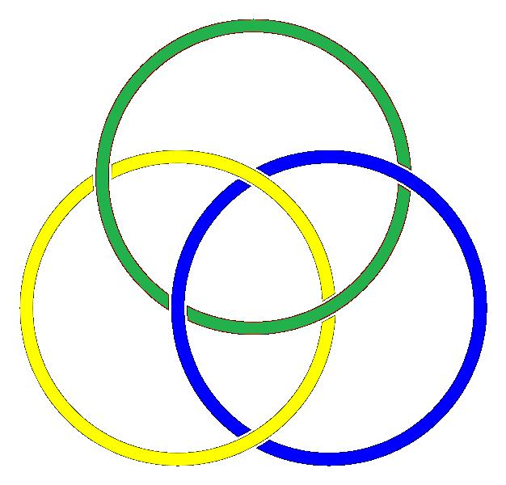
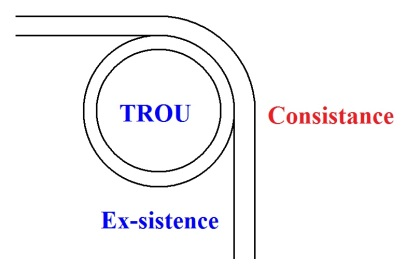
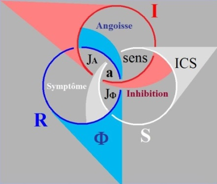

# Leçon 05 | 21 Janvier 1975

  <label><input type="checkbox" data-lacan-toggle="original" checked> 原文</label>
  <label><input type="checkbox" data-lacan-toggle="notes" checked> 注释</label>
  <label><input type="checkbox" data-lacan-toggle="commentary" checked> 个人解读评论</label>

<section class="parallel-paragraph" data-paragraph-ids="s22-05-0001">

s22-05-0001

[无对应译文]

原文 · s22-05-0001

Justement à cause de ce dont je vous parle : le nœud, je ne peux pas avoir, je ne peux pas m’assurer d’avoir un plan.

</section>

<section class="parallel-paragraph" data-paragraph-ids="s22-05-0002">

s22-05-0002

[无对应译文]

原文 · s22-05-0002

Parce que le nœud, si vous le voyez comme je l’ai dessiné là, tout à droite, je vous expliquerai après, pourquoi il prend cette forme-là, disons de trois pages.

</section>

<section class="parallel-paragraph" data-paragraph-ids="s22-05-0003">

s22-05-0003

[无对应译文]

原文 · s22-05-0003

Imaginons-les brochées, ficelées ici :

</section>

<section class="parallel-paragraph" data-paragraph-ids="s22-05-0004">

s22-05-0004

[无对应译文]

原文 · s22-05-0004

- voilà donc la 1ère, qui est un morceau de page, ceci pour me faire comprendre, ça semble aller de soi,

</section>

<section class="parallel-paragraph" data-paragraph-ids="s22-05-0005">

s22-05-0005

[无对应译文]

原文 · s22-05-0005

- la 2de, c’est **S** qui est juste dessous,

</section>

<section class="parallel-paragraph" data-paragraph-ids="s22-05-0006">

s22-05-0006

[无对应译文]

原文 · s22-05-0006

- et vous voyez qu’ici la 3ème qu’il vous est facile d’imaginer à partir de ce brochage à gauche, il est nécessaire que la 3ème refile sur la 1ère.

</section>

<section class="parallel-paragraph" data-paragraph-ids="s22-05-0007">

s22-05-0007

[无对应译文]

原文 · s22-05-0007

</section>

<section class="parallel-paragraph" data-paragraph-ids="s22-05-0008">

s22-05-0008

[无对应译文]

原文 · s22-05-0008

Néanmoins, il y a des endroits où à perforer les pages, vous n’en trouverez qu’une.

</section>

<section class="parallel-paragraph" data-paragraph-ids="s22-05-0009">

s22-05-0009

[无对应译文]

原文 · s22-05-0009

Il y en a trois :

</section>

<section class="parallel-paragraph" data-paragraph-ids="s22-05-0010">

s22-05-0010

[无对应译文]

原文 · s22-05-0010

- ici, vous ne trouverez que la page 2,

</section>

<section class="parallel-paragraph" data-paragraph-ids="s22-05-0011">

s22-05-0011

[无对应译文]

原文 · s22-05-0011

- ici que la page 1,

</section>

<section class="parallel-paragraph" data-paragraph-ids="s22-05-0012">

s22-05-0012

[无对应译文]

原文 · s22-05-0012

- et ici que la page 3.

</section>

<section class="parallel-paragraph" data-paragraph-ids="s22-05-0013">

s22-05-0013

[无对应译文]

原文 · s22-05-0013

Mais partout ailleurs vous trouverez les trois, ce qui m’empêche d’avoir *un plan*, puisqu’il y en a trois.

</section>

<section class="parallel-paragraph" data-paragraph-ids="s22-05-0014">

s22-05-0014

[无对应译文]

原文 · s22-05-0014

*Il y a plusieurs modes d’énoncer le sens, qui tous se rapportent au Réel dont il répond*...

</section>

<section class="parallel-paragraph" data-paragraph-ids="s22-05-0015">

s22-05-0015

[无对应译文]

原文 · s22-05-0015

> pour que vous ne vous embrouilliez pas quand même,

</section>

<section class="parallel-paragraph" data-paragraph-ids="s22-05-0016">

s22-05-0016

[无对应译文]

原文 · s22-05-0016

- je vous marque que *le Réel ici,* *il se marque du bord d’un trou*,

</section>

<section class="parallel-paragraph" data-paragraph-ids="s22-05-0017">

s22-05-0017

[无对应译文]

原文 · s22-05-0017

- l’*Imaginaire* ici,

</section>

<section class="parallel-paragraph" data-paragraph-ids="s22-05-0018">

s22-05-0018

[无对应译文]

原文 · s22-05-0018

- et là le *Symbolique,*

</section>

<section class="parallel-paragraph" data-paragraph-ids="s22-05-0019">

s22-05-0019

[无对应译文]

原文 · s22-05-0019

> ça c’est pour que vous suiviez ...*tous se rapportent - ces sens - au Réel, au Réel dont chacun répond*.

</section>

<section class="parallel-paragraph" data-paragraph-ids="s22-05-0020">

s22-05-0020

[无对应译文]

原文 · s22-05-0020

C’est là où se confirme la souplesse du nœud, qui fait aussi sa nécessité.

</section>

<section class="parallel-paragraph" data-paragraph-ids="s22-05-0021">

s22-05-0021

[无对应译文]

原文 · s22-05-0021

Le principe du nœud, c’est qu’il ne se défait pas, sauf à ce qu’on le brise.

</section>

<section class="parallel-paragraph" data-paragraph-ids="s22-05-0022">

s22-05-0022

[无对应译文]

原文 · s22-05-0022

Qu’est-ce que c’est que *ce dénouement du nœud*, qui est *impossible* ?

</section>

<section class="parallel-paragraph" data-paragraph-ids="s22-05-0023">

s22-05-0023

[无对应译文]

原文 · s22-05-0023

C’est le retour à une forme dite triviale et qui est celle du rond de ficelle, justement !

</section>

<section class="parallel-paragraph" data-paragraph-ids="s22-05-0024">

s22-05-0024

[无对应译文]

原文 · s22-05-0024

De sorte que c’est un nœud au 2nd *degré*.

</section>

<section class="parallel-paragraph" data-paragraph-ids="s22-05-0025">

s22-05-0025

[无对应译文]

原文 · s22-05-0025

C’est un nœud qui tient...

</section>

<section class="parallel-paragraph" data-paragraph-ids="s22-05-0026">

s22-05-0026

[无对应译文]

原文 · s22-05-0026

> comme vous l’avez déjà maintes fois entendu de ma voix - ...c’est un nœud qui tient à ce qu’il y ait 3 ronds.

</section>

<section class="parallel-paragraph" data-paragraph-ids="s22-05-0027">

s22-05-0027

[无对应译文]

原文 · s22-05-0027

</section>

<section class="parallel-paragraph" data-paragraph-ids="s22-05-0028">

s22-05-0028

[无对应译文]

原文 · s22-05-0028

Le vrai nœud, le nœud dont on s’occupe dans la théorie des nœuds, c’est ce qui...

</section>

<section class="parallel-paragraph" data-paragraph-ids="s22-05-0029">

s22-05-0029

[无对应译文]

原文 · s22-05-0029

> comme vous le voyez là sur la figure que je viens d’ajouter ...est justement ce qui ne se transforme pas, par une déformation continue, en la figure triviale du rond.

</section>

<section class="parallel-paragraph" data-paragraph-ids="s22-05-0030">

s22-05-0030

[无对应译文]

原文 · s22-05-0030

Si on parle d’un nœud fait avec 3 figures triviales, à savoir 3 ronds, c’est quelque chose qui se désigne ou plutôt se des­sine de ceci : c’est qu’à couper de cette façon quelque chose qui est, si on peut dire, le nœud borroméen lui-même, vous obtiendrez...

</section>

<section class="parallel-paragraph" data-paragraph-ids="s22-05-0031">

s22-05-0031

[无对应译文]

原文 · s22-05-0031

> en conjoi­gnant ce que vous avez coupé, à chaque fois ...vous obtiendrez la figure propre d’un nœud au sens propre du mot.

</section>

<section class="parallel-paragraph" data-paragraph-ids="s22-05-0032">

s22-05-0032

[无对应译文]

原文 · s22-05-0032

  

</section>

<section class="parallel-paragraph" data-paragraph-ids="s22-05-0033">

s22-05-0033

[无对应译文]

原文 · s22-05-0033

> nœud-trèfle

</section>

<section class="parallel-paragraph" data-paragraph-ids="s22-05-0034">

s22-05-0034

[无对应译文]

原文 · s22-05-0034

En quoi consiste la façon la plus commode de montrer qu’un nœud est un nœud ?

</section>

<section class="parallel-paragraph" data-paragraph-ids="s22-05-0035">

s22-05-0035

[无对应译文]

原文 · s22-05-0035

Car ce nœud-là, celui de droite, est le nœud le plus simple qui existe.

</section>

<section class="parallel-paragraph" data-paragraph-ids="s22-05-0036">

s22-05-0036

[无对应译文]

原文 · s22-05-0036

Vous l’obtenez à faire qu’à arrondir une corde et à la passer par exemple sur la droite du bout que vous tenez, c’est à faire rentrer la corde par la gauche à l’intérieur du rond qu’ainsi vous avez formé, que vous voyez se faire ce qui sur une corde s’appelle un nœud, un nœud que vous pouvez dénouer, mais qui ne se dénoue plus à partir de quand ?

</section>

<section class="parallel-paragraph" data-paragraph-ids="s22-05-0037">

s22-05-0037

[无对应译文]

原文 · s22-05-0037

À partir du moment où vous supposez que les deux bouts de la corde se rejoignent par une épissure, ou bien que vous supposez que cette corde n’a pas de fin, s’étend jusqu’aux limites pensables, ou plus exactement dépasse même ces limites.

</section>

<section class="parallel-paragraph" data-paragraph-ids="s22-05-0038">

s22-05-0038

[无对应译文]

原文 · s22-05-0038

Auquel cas, vous aurez affaire à proprement parler au nœud le plus simple, ce nœud qui quand vous le fermez, a la forme que vous voyez là à droite, c’est-à-dire est ce qu’on appelle un *nœud-trèfle*, « *clove hitch »* en anglais.

</section>

<section class="parallel-paragraph" data-paragraph-ids="s22-05-0039">

s22-05-0039

[无对应译文]

原文 · s22-05-0039

Il est trèfle en ceci qu’il est trois.

</section>

<section class="parallel-paragraph" data-paragraph-ids="s22-05-0040">

s22-05-0040

[无对应译文]

原文 · s22-05-0040

Il dessine - mis à plat - il permet de des­siner, non pas trois champs, mais quatre champs.

</section>

<section class="parallel-paragraph" data-paragraph-ids="s22-05-0041">

s22-05-0041

[无对应译文]

原文 · s22-05-0041

Ce sont ces champs que vous retrouvez dans la forme du nœud borroméen, celle qui n’est faite que de ceci, que l’un de chaque figure...

</section>

<section class="parallel-paragraph" data-paragraph-ids="s22-05-0042">

s22-05-0042

[无对应译文]

原文 · s22-05-0042

> que j’ai appelée trivia­le, rond de ficelle ...l’un de chacune de ces figures fait des 2 autres, nœud, c’est-à-dire que c’est d’être 3 qu’il y a un lien, un lien de nœud qui se constitue pour les 2 autres.

</section>

<section class="parallel-paragraph" data-paragraph-ids="s22-05-0043">

s22-05-0043

[无对应译文]

原文 · s22-05-0043

Si vous entendez parler quelquefois d’un monde à quatre dimensions, vous saurez que dans ce monde...

</section>

<section class="parallel-paragraph" data-paragraph-ids="s22-05-0044">

s22-05-0044

[无对应译文]

原文 · s22-05-0044

> calculable mais pas imaginable ...il ne saurait y avoir de *tels nœuds *: impossible d’y *nouer* une corde...

</section>

<section class="parallel-paragraph" data-paragraph-ids="s22-05-0045">

s22-05-0045

[无对应译文]

原文 · s22-05-0045

> si tant est que ce monde existe ...impossible d’y *nouer* une corde en raison de ceci :

</section>

<section class="parallel-paragraph" data-paragraph-ids="s22-05-0046">

s22-05-0046

[无对应译文]

原文 · s22-05-0046

- que toute figure, quelle qu’elle soit, se supporte non pas d’une ligne mais d’une *consistance* de corde,

</section>

<section class="parallel-paragraph" data-paragraph-ids="s22-05-0047">

s22-05-0047

[无对应译文]

原文 · s22-05-0047

- que toute figure de cette espèce est défor­mable dans n’importe quelle autre.

</section>

<section class="parallel-paragraph" data-paragraph-ids="s22-05-0048">

s22-05-0048

[无对应译文]

原文 · s22-05-0048

Néanmoins, si la chose vous était imaginable, il vous serait possible d’entendre, de savoir par ouï-dire...

</section>

<section class="parallel-paragraph" data-paragraph-ids="s22-05-0049">

s22-05-0049

[无对应译文]

原文 · s22-05-0049

> parce qu’aussi bien la démonstration n’en est pas simple mais qu’elle est faisable, ...c’est que dans un espace sup­posé être à quatre dimensions, ce sont non pas des *consistances* de lignes mais des surfaces qui peuvent faire nœud.

</section>

<section class="parallel-paragraph" data-paragraph-ids="s22-05-0050">

s22-05-0050

[无对应译文]

原文 · s22-05-0050

C’est-à-dire qu’il subsiste dans l’ordre indéfini des dimensions supposables, comme étant en nombre supérieur au 3 dont se constitue...

</section>

<section class="parallel-paragraph" data-paragraph-ids="s22-05-0051">

s22-05-0051

[无对应译文]

原文 · s22-05-0051

> c’est bien là qu’il faut que je m’arrête ...dont se constitue assurément notre *« monde* », c’est-à-dire notre représentation.

</section>

<section class="parallel-paragraph" data-paragraph-ids="s22-05-0052">

s22-05-0052

[无对应译文]

原文 · s22-05-0052

Au moment où je dis « *monde* », n’aurais-je pas dû dire notre *réel*, à cette seule condition, qu’on s’aperçoive que le « *monde* », ici comme *représentation*, dépend de la jonction de ces 3 consistances que je dénomme du *Symbolique*, de l’*Imaginaire* et du *Réel*, les consistances d’ailleurs leur étant supposées.

</section>

<section class="parallel-paragraph" data-paragraph-ids="s22-05-0053">

s22-05-0053

[无对应译文]

原文 · s22-05-0053

Mais qu’il s’agisse de 3 consis­tances et que ce soit d’elles que dépend toute *représentation*, est là quelque chose de bien fait pour nous suggérer qu’il y a plus dans l’expé­rience qui nécessite cette, je dirais *trivision*, cette division en 3 *de consistances diverses*.

</section>

<section class="parallel-paragraph" data-paragraph-ids="s22-05-0054">

s22-05-0054

[无对应译文]

原文 · s22-05-0054

Que c’est de là, sans que nous puissions en tran­cher, qu’est supposable que la conséquence soit *notre représentation* de l’espace tel qu’il est, soit à 3 dimensions.

</section>

<section class="parallel-paragraph" data-paragraph-ids="s22-05-0055">

s22-05-0055

[无对应译文]

原文 · s22-05-0055

La question qui s’évoque à ce temps de mon énoncé, c’est ceci qui répond à la notion de *consistance* : qu’est-ce que peut être *supposer*...

</section>

<section class="parallel-paragraph" data-paragraph-ids="s22-05-0056">

s22-05-0056

[无对应译文]

原文 · s22-05-0056

> puisque le terme de « consistance » suppose celui de « démonstration » ...qu’est­-ce que peut être *supposer une démonstration dans le Réel* ?

</section>

<section class="parallel-paragraph" data-paragraph-ids="s22-05-0057">

s22-05-0057

[无对应译文]

原文 · s22-05-0057

Rien d’autre ne le suppose que la consistance dont la corde est ici le support.

</section>

<section class="parallel-paragraph" data-paragraph-ids="s22-05-0058">

s22-05-0058

[无对应译文]

原文 · s22-05-0058

La corde ici est, si je puis dire, le fondement de l’accord.

</section>

<section class="parallel-paragraph" data-paragraph-ids="s22-05-0059">

s22-05-0059

[无对应译文]

原文 · s22-05-0059

Pour faire un saut dans ce qui, de ce que j’énonce, ne se produira qu’un peu plus tard, je dirai que la corde devient ainsi le *symptôme* de ce en quoi le *Symbolique* consiste.

</section>

<section class="parallel-paragraph" data-paragraph-ids="s22-05-0060">

s22-05-0060

[无对应译文]

原文 · s22-05-0060

Ce qui ne va pas mal, après tout, avec ceci dont nous témoigne le langage que la formule « *montrer la corde* »...

</section>

<section class="parallel-paragraph" data-paragraph-ids="s22-05-0061">

s22-05-0061

[无对应译文]

原文 · s22-05-0061

> en quoi se désigne l’usu­re du tissage ...a sa portée, puisqu’en fin de compte « *montrer la corde* » c’est dire que le tissage ne se camoufle plus...

</section>

<section class="parallel-paragraph" data-paragraph-ids="s22-05-0062">

s22-05-0062

[无对应译文]

原文 · s22-05-0062

> en ceci dont l’usage méta­phorique est aussi permanent ...ne se camoufle plus dans ce qu’on appel­le...

</section>

<section class="parallel-paragraph" data-paragraph-ids="s22-05-0063">

s22-05-0063

[无对应译文]

原文 · s22-05-0063

> avec l’idée qu’en disant ça, on dit quelque chose ...dans ce qu’on appelle l’*étoffe*.

</section>

<section class="parallel-paragraph" data-paragraph-ids="s22-05-0064">

s22-05-0064

[无对应译文]

原文 · s22-05-0064

L’*étoffe* de quelque chose est ce qui pour un rien ferait image de *substance*, et ce qui d’ailleurs est usuel dans l’emploi.

</section>

<section class="parallel-paragraph" data-paragraph-ids="s22-05-0065">

s22-05-0065

[无对应译文]

原文 · s22-05-0065

Il s’agit dans cette formule « *montrer la corde* » dont je parlais, de s’apercevoir *qu’il n’y a d’étoffe qui ne soit tissage*.

</section>

<section class="parallel-paragraph" data-paragraph-ids="s22-05-0066">

s22-05-0066

[无对应译文]

原文 · s22-05-0066

J’avais préparé pour vous sur un papier...

</section>

<section class="parallel-paragraph" data-paragraph-ids="s22-05-0067">

s22-05-0067

[无对应译文]

原文 · s22-05-0067

> parce que c’est trop compli­qué à dessiner au tableau fait tout un tissage, uniquement fait de *nœuds borroméens*. On peut en couvrir la surface du tableau noir.

</section>

<section class="parallel-paragraph" data-paragraph-ids="s22-05-0068">

s22-05-0068

[无对应译文]

原文 · s22-05-0068

Il est facile de s’apercevoir qu’on arrive à un tissu, si je puis dire, hexagonal.

</section>

<section class="parallel-paragraph" data-paragraph-ids="s22-05-0069">

s22-05-0069

[无对应译文]

原文 · s22-05-0069

Ne croyez pas que la section d’un quelconque des ronds de tissa­ge...

</section>

<section class="parallel-paragraph" data-paragraph-ids="s22-05-0070">

s22-05-0070

[无对应译文]

原文 · s22-05-0070

> appelons-les là comme ça ...libérera quoi que ce soit de ce à quoi il est noué, puisqu’à n’en couper qu’un seul, ils sont, ces six autres ronds libérés d’une coupure, retenus ailleurs, retenus par les - six fois trois - dix-huit autres ronds, avec lesquels il sont noués de façon borro­méenne.

</section>

<section class="parallel-paragraph" data-paragraph-ids="s22-05-0071">

s22-05-0071

[无对应译文]

原文 · s22-05-0071

Si j’ai tout à l’heure sorti prématurément...

</section>

<section class="parallel-paragraph" data-paragraph-ids="s22-05-0072">

s22-05-0072

[无对应译文]

原文 · s22-05-0072

> mais faut bien ! C’est même la loi du langage que quelque chose sorte avant d’être commentable ...si j’ai sorti le terme de *symptôme,* c’est bien parce que *le Symbolique* est ce qui de la consistance fait métaphore la plus simple.

</section>

<section class="parallel-paragraph" data-paragraph-ids="s22-05-0073">

s22-05-0073

[无对应译文]

原文 · s22-05-0073

Non pas que la figure circulaire ne soit premièrement une figure, c’est-à­-dire *imaginable*.

</section>

<section class="parallel-paragraph" data-paragraph-ids="s22-05-0074">

s22-05-0074

[无对应译文]

原文 · s22-05-0074

C’est même là qu’on a fondé la notion de la « *bonne forme* », et cette notion de la *« bonne forme »*, c’est bien ce qui est fait pour nous faire, si je puis dire, rentrer dans le *Réel* ce qu’il en est de l’*Imaginaire*.

</section>

<section class="parallel-paragraph" data-paragraph-ids="s22-05-0075">

s22-05-0075

[无对应译文]

原文 · s22-05-0075

Et je dirais plus : il y a parenté de *la bonne forme* avec *le sens*, ce qui est à remarquer.

</section>

<section class="parallel-paragraph" data-paragraph-ids="s22-05-0076">

s22-05-0076

[无对应译文]

原文 · s22-05-0076

L’ordre du sens se configure, si l’on peut dire, naturellement de ce que cette forme du cercle désigne.

</section>

<section class="parallel-paragraph" data-paragraph-ids="s22-05-0077">

s22-05-0077

[无对应译文]

原文 · s22-05-0077

La consis­tance supposée au *Symbolique* se fait accord de cette image, en quelque sorte primaire dont en somme il a fallu attendre la psychanalyse, pour qu’on s’aperçoive qu’elle est liée à l’ordre de ce corps à quoi est suspen­du l’*Imaginaire*.

</section>

<section class="parallel-paragraph" data-paragraph-ids="s22-05-0078">

s22-05-0078

[无对应译文]

原文 · s22-05-0078

Car qui doute...

</section>

<section class="parallel-paragraph" data-paragraph-ids="s22-05-0079">

s22-05-0079

[无对应译文]

原文 · s22-05-0079

c’est même sur ce mince fil qu’a vécu tout ce qu’on appelle philosophie jusqu’à ce jour, ...qui doute qu’il y ait un autre ordre que celui où le corps croit se déplacer ?

</section>

<section class="parallel-paragraph" data-paragraph-ids="s22-05-0080">

s22-05-0080

[无对应译文]

原文 · s22-05-0080

Mais cet *ordre du corps* ne s’en explique pas plus pour autant.

</section>

<section class="parallel-paragraph" data-paragraph-ids="s22-05-0081">

s22-05-0081

[无对应译文]

原文 · s22-05-0081

Pourquoi *l’œil voit-il « sphérique »* alors qu’il est incontestablement perçu comme sphère, tandis que l’oreille - remarquez-le - *entend « sphère* » tout autant, alors qu’elle, se présente sous une forme différente, dont cha­cun sait que c’est celle d’un *limaçon* ?

</section>

<section class="parallel-paragraph" data-paragraph-ids="s22-05-0082">

s22-05-0082

[无对应译文]

原文 · s22-05-0082

Alors est-ce que nous ne pouvons pas au moins questionner que, si ces deux organes si manifestement *[dif­féomorphiques](http://fr.wikipedia.org/wiki/Diff%C3%A9omorphisme),* si je puis m’exprimer ainsi, perçoivent de même « *sphéri­quement* », est-ce que...

</section>

<section class="parallel-paragraph" data-paragraph-ids="s22-05-0083">

s22-05-0083

[无对应译文]

原文 · s22-05-0083

> à prendre les choses à partir de mon « *objet »* dit *petit (a)* ...ce n’est pas par une *conjonction nécessaire* *qui enchaîne le* *petit (a)lui-même* *à faire* *boule* du fait que le *petit (a)* sous d’autres formes...

</section>

<section class="parallel-paragraph" data-paragraph-ids="s22-05-0084">

s22-05-0084

[无对应译文]

原文 · s22-05-0084

> à ceci près qu’il n’en a pas de forme, mais qu’il est pensable de façon dominante,
>
> oralement ou aussi bien, si je puis dire, *chialement* ...le facteur commun du *petit (a)* c’est d’être lié *aux orifices du corps*.

</section>

<section class="parallel-paragraph" data-paragraph-ids="s22-05-0085">

s22-05-0085

[无对应译文]

原文 · s22-05-0085

Et quelle est l’incidence du fait qu’œil et oreille soient orifices aussi, sur le fait que *la perception* soit pour tous deux *sphéroïdale* ?

</section>

<section class="parallel-paragraph" data-paragraph-ids="s22-05-0086">

s22-05-0086

[无对应译文]

原文 · s22-05-0086

Sans le *petit (a)*, quelque chose manque à toute théorie possible d’au­cune référence, d’aucune apparence d’*harmonie*, et *ceci du fait que le sujet, le sujet supposé...*

</section>

<section class="parallel-paragraph" data-paragraph-ids="s22-05-0087">

s22-05-0087

[无对应译文]

原文 · s22-05-0087

> *c’est sa condition de n’être que supposable...ne connaît quelque chose que d’être lui-même*, en tant que sujet, *causé par un « objet » qui n’est pas* *ce qu’il connaît*, ce qu’il imagine connaître, c’est-à­-dire *qui n’est pas l’Autre comme tel de la connaissance*, *mais qui au contraire - cet « objet », l’objet petit (a) - le raye, cet Autre*.

</section>

<section class="parallel-paragraph" data-paragraph-ids="s22-05-0088">

s22-05-0088

[无对应译文]

原文 · s22-05-0088

L’Autre est ainsi...

</section>

<section class="parallel-paragraph" data-paragraph-ids="s22-05-0089">

s22-05-0089

[无对应译文]

原文 · s22-05-0089

> l’Autre que j’écris avec le grand A ...l’Autre est ainsi matrice à double entrée,

</section>

<section class="parallel-paragraph" data-paragraph-ids="s22-05-0090">

s22-05-0090

[无对应译文]

原文 · s22-05-0090

- dont *petit (a) constitue l’une de ces entrées*,

</section>

<section class="parallel-paragraph" data-paragraph-ids="s22-05-0091">

s22-05-0091

[无对应译文]

原文 · s22-05-0091

- et dont l’autre... qu’allons-nous en dire : est-ce *l’Un* du signifiant ?

</section>

<section class="parallel-paragraph" data-paragraph-ids="s22-05-0092">

s22-05-0092

[无对应译文]

原文 · s22-05-0092

Commençons d’interroger si ce n’est pas là, *pensable*.

</section>

<section class="parallel-paragraph" data-paragraph-ids="s22-05-0093">

s22-05-0093

[无对应译文]

原文 · s22-05-0093

Je dirais que c’est même grâce à ça que j’ai pu un jour faire pour vous...

</section>

<section class="parallel-paragraph" data-paragraph-ids="s22-05-0094">

s22-05-0094

[无对应译文]

原文 · s22-05-0094

> si tant est que certains de ceux qui sont ici fussent là ...copuler le **1** et mon *petit (a)*, qu’à cette occasion j’avais mis au rapport de l’**1** à le supposer du *nombre d’or* [^10].

</section>

<section class="parallel-paragraph" data-paragraph-ids="s22-05-0095">

s22-05-0095

[无对应译文]

原文 · s22-05-0095

Ça m’a été assez utile pour introduire ce où déjà j’étais conduit par l’expérience, à savoir qu’il s’y lit assez bien qu’entre cet **1** et ce *petit (a)*, il n’y a strictement aucun rapport rationnellement détermi­nable.

</section>

<section class="parallel-paragraph" data-paragraph-ids="s22-05-0096">

s22-05-0096

[无对应译文]

原文 · s22-05-0096

Le *nombre d’or*, vous vous en souvenez, c’est : 1/*a* = 1+*a*.

</section>

<section class="parallel-paragraph" data-paragraph-ids="s22-05-0097">

s22-05-0097

[无对应译文]

原文 · s22-05-0097

Il en résul­te que jamais nulle proportion n’est saisissable entre le 1 et le (*a*), que la dif­férence du 1 au (*a*) sera toujours un (*a* 2) et ainsi de suite indéfiniment, une puissance de (*a*).

</section>

<section class="parallel-paragraph" data-paragraph-ids="s22-05-0098">

s22-05-0098

[无对应译文]

原文 · s22-05-0098

 

</section>

<section class="parallel-paragraph" data-paragraph-ids="s22-05-0099">

s22-05-0099

[无对应译文]

原文 · s22-05-0099

C’est-à­-dire qu’il n’y a jamais aucune raison que le recouvrement de l’un par l’autre se termine.

</section>

<section class="parallel-paragraph" data-paragraph-ids="s22-05-0100">

s22-05-0100

[无对应译文]

原文 · s22-05-0100

Que la différence sera aussi petite qu’on peut la *figurer*, qu’il y a même une limite, mais qu’à l’intérieur de cette limite, il n’y aura jamais conjonction, copulation quelconque du **1** au (*a*).

</section>

<section class="parallel-paragraph" data-paragraph-ids="s22-05-0101">

s22-05-0101

[无对应译文]

原文 · s22-05-0101

Est-ce à dire que l’*Un* *de sens* - car c’est cela que le *Symbolique* a pour effet de *signifiant* - est quelque chose qui ait affaire à ce que j’ai appelé *la matrice*, *la matrice* qui raye l’Autre de sa double entrée.

</section>

<section class="parallel-paragraph" data-paragraph-ids="s22-05-0102">

s22-05-0102

[无对应译文]

原文 · s22-05-0102

L’*Un* *de sens* ne se confond pas avec ce qui fait *l’*1 *de signifiant*.

</section>

<section class="parallel-paragraph" data-paragraph-ids="s22-05-0103">

s22-05-0103

[无对应译文]

原文 · s22-05-0103

L’*Un* *de sens* c’est l’être, l’être spécifié de l’*inconscient*, en tant qu’il *ex-siste*, qu’il *ex-siste* du moins au corps.

</section>

<section class="parallel-paragraph" data-paragraph-ids="s22-05-0104">

s22-05-0104

[无对应译文]

原文 · s22-05-0104

Car s’il y a une chose frappante, c’est qu’il *ex-siste* dans le dis-cord.

</section>

<section class="parallel-paragraph" data-paragraph-ids="s22-05-0105">

s22-05-0105

[无对应译文]

原文 · s22-05-0105

*Il n’y a rien dans l’inconscient* - s’il est fait tel que je vous l’énonce - *qui au corps fasse accord, l’inconscient est discordant*.

</section>

<section class="parallel-paragraph" data-paragraph-ids="s22-05-0106">

s22-05-0106

[无对应译文]

原文 · s22-05-0106

L’inconscient est ce qui, de parler, détermine le sujet en tant qu’*être*, mais *être* à rayer de cette métonymie, dont « *je* » supporte le désir, en tant qu’à tout jamais impos­sible à dire comme tel.

</section>

<section class="parallel-paragraph" data-paragraph-ids="s22-05-0107">

s22-05-0107

[无对应译文]

原文 · s22-05-0107

*Si je dis que le petit (a) est ce qui cause le désir, ça veut dire qu’il n’en est pas l’objet*.

</section>

<section class="parallel-paragraph" data-paragraph-ids="s22-05-0108">

s22-05-0108

[无对应译文]

原文 · s22-05-0108

*Il n’en est pas le complément direct ni indirect*, mais seu­lement cette cause qui...

</section>

<section class="parallel-paragraph" data-paragraph-ids="s22-05-0109">

s22-05-0109

[无对应译文]

原文 · s22-05-0109

> pour jouer du mot comme je l’ai fait dans mon premier *Discours de Rome* ...*cette cause qui cause toujours*.

</section>

<section class="parallel-paragraph" data-paragraph-ids="s22-05-0110">

s22-05-0110

[无对应译文]

原文 · s22-05-0110

*Le sujet est causé d’un « objet » qui n’est notable que d’une écriture*, et c’est bien en cela qu’un pas est fait dans la théorie.

</section>

<section class="parallel-paragraph" data-paragraph-ids="s22-05-0111">

s22-05-0111

[无对应译文]

原文 · s22-05-0111

L’irréductible de ceci...

</section>

<section class="parallel-paragraph" data-paragraph-ids="s22-05-0112">

s22-05-0112

[无对应译文]

原文 · s22-05-0112

> qui n’est pas *effet de langage*, car *l’effet du langage* c’est le παθείν \[pathein\] ...c’est la passion du corps.

</section>

<section class="parallel-paragraph" data-paragraph-ids="s22-05-0113">

s22-05-0113

[无对应译文]

原文 · s22-05-0113

*Mais du langage, est inscriptible*, est notable...

</section>

<section class="parallel-paragraph" data-paragraph-ids="s22-05-0114">

s22-05-0114

[无对应译文]

原文 · s22-05-0114

> en tant que le langa­ge n’a pas d’effet ...*cette abstraction radicale qui est l’objet*, l’*objet* que je désigne, que j’écris de la figure d’écriture *(a)*, *et dont rien n’est pensable, à ceci près que tout ce qui est sujet*...

</section>

<section class="parallel-paragraph" data-paragraph-ids="s22-05-0115">

s22-05-0115

[无对应译文]

原文 · s22-05-0115

> sujet de pensée qu’on imagine être « *Être »* ...*en est déterminé*.

</section>

<section class="parallel-paragraph" data-paragraph-ids="s22-05-0116">

s22-05-0116

[无对应译文]

原文 · s22-05-0116

L’*Un* *de sens* est si peu ici intéressé que ce qu’il est comme effet, *effet de l’*1 *de signifiant*, nous le savons et j’y insiste : *l’*1 *de signifiant* n’opère, n’opère en fait qu’à pouvoir être employé à désigner n’importe quel signifié.

</section>

<section class="parallel-paragraph" data-paragraph-ids="s22-05-0117">

s22-05-0117

[无对应译文]

原文 · s22-05-0117

L’*Imaginaire* et le *Réel*, ils sont ici noués à cet 1 *de signifiant*.

</section>

<section class="parallel-paragraph" data-paragraph-ids="s22-05-0118">

s22-05-0118

[无对应译文]

原文 · s22-05-0118

Qu’en dirons-nous sinon que pour ce qui est de leur *qualité*...

</section>

<section class="parallel-paragraph" data-paragraph-ids="s22-05-0119">

s22-05-0119

[无对应译文]

原文 · s22-05-0119

> ce que *Charles Sanders* Peirce appelle la *firstness* ...de ce qui les répartit comme qualités différentes ?

</section>

<section class="parallel-paragraph" data-paragraph-ids="s22-05-0120">

s22-05-0120

[无对应译文]

原文 · s22-05-0120

Où mettre par exemple, comment répartir entre eux à cette occasion quelque chose comme « *la vie* » ou bien « *la mort* » ?

</section>

<section class="parallel-paragraph" data-paragraph-ids="s22-05-0121">

s22-05-0121

[无对应译文]

原文 · s22-05-0121

Qui sait où les situer, puisque aussi bien *le signifiant,* *l’*1 *de signifiant* comme tel, *cause* aussi bien sur l’un ou l’autre des versants ?

</section>

<section class="parallel-paragraph" data-paragraph-ids="s22-05-0122">

s22-05-0122

[无对应译文]

原文 · s22-05-0122

On aurait tort de croire que des deux, du *Réel* et de l’*Imaginaire* :

</section>

<section class="parallel-paragraph" data-paragraph-ids="s22-05-0123">

s22-05-0123

[无对应译文]

原文 · s22-05-0123

- ce soit l’*Imaginaire* qui soit mortel,

</section>

<section class="parallel-paragraph" data-paragraph-ids="s22-05-0124">

s22-05-0124

[无对应译文]

原文 · s22-05-0124

- et ce soit le *Réel* qui soit le vivant.

</section>

<section class="parallel-paragraph" data-paragraph-ids="s22-05-0125">

s22-05-0125

[无对应译文]

原文 · s22-05-0125

*Seul l’ordinaire de l’usage d’un signifiant peut être dit arbitraire, mais d’où provient cet arbitraire, si ce n’est d’un discours structuré ?*

</section>

<section class="parallel-paragraph" data-paragraph-ids="s22-05-0126">

s22-05-0126

[无对应译文]

原文 · s22-05-0126

Évoquerais-je ici le titre d’une revue qu’à Vincennes, sous mes aus­pices, on voit paraître : *Ornicar*.

</section>

<section class="parallel-paragraph" data-paragraph-ids="s22-05-0127">

s22-05-0127

[无对应译文]

原文 · s22-05-0127

N’est-ce pas un exemple de ce que *le signifiant* détermine ?

</section>

<section class="parallel-paragraph" data-paragraph-ids="s22-05-0128">

s22-05-0128

[无对应译文]

原文 · s22-05-0128

Ici il le fait d’être agrammatical, ceci de ne figu­rer qu’une catégorie de la grammaire.

</section>

<section class="parallel-paragraph" data-paragraph-ids="s22-05-0129">

s22-05-0129

[无对应译文]

原文 · s22-05-0129

Mais c’est en cela qu’il démontre la configuration comme telle, Celle, si je puis dire, qui au regard d’Icare ne fait que l’*orner*. \[*qui Orne Icare ?* \]

</section>

<section class="parallel-paragraph" data-paragraph-ids="s22-05-0130">

s22-05-0130

[无对应译文]

原文 · s22-05-0130

Le langage n’est qu’une *ornure*.

</section>

<section class="parallel-paragraph" data-paragraph-ids="s22-05-0131">

s22-05-0131

[无对应译文]

原文 · s22-05-0131

Il n’y a que *rhétorique*, comme dans la Règle X, Descartes le souligne[^11].

</section>

<section class="parallel-paragraph" data-paragraph-ids="s22-05-0132">

s22-05-0132

[无对应译文]

原文 · s22-05-0132

La dialectique n’est supposable que de l’usage de ce qu’il égare vers un ordinaire mathématiquement ordonné, c’est-à-dire vers un discours, celui qui associe, non pas le phonème, même à entendre au sens large, mais le sujet déterminé par l’Être, c’est-à-dire par le désir.

</section>

<section class="parallel-paragraph" data-paragraph-ids="s22-05-0133">

s22-05-0133

[无对应译文]

原文 · s22-05-0133

Qu’est-ce que l’affect d’*ex-sister*, à partir de mes termes ?

</section>

<section class="parallel-paragraph" data-paragraph-ids="s22-05-0134">

s22-05-0134

[无对应译文]

原文 · s22-05-0134

C’est à voir, au regard de ce champ où je situe ici *l’inconscient*, c’est-à-dire cet inter­valle entre, si je puis dire, 2 *consistances*,

</section>

<section class="parallel-paragraph" data-paragraph-ids="s22-05-0135">

s22-05-0135

[无对应译文]

原文 · s22-05-0135

- celle qui ici se note d’un bord que j’ai fait bord de page,

</section>

<section class="parallel-paragraph" data-paragraph-ids="s22-05-0136">

s22-05-0136

[无对应译文]

原文 · s22-05-0136

- et celle qui ici se boucle, se boucle : se boucler impliquant *le trou* sans lequel il n’y a pas de nœud.

</section>

<section class="parallel-paragraph" data-paragraph-ids="s22-05-0137">

s22-05-0137

[无对应译文]

原文 · s22-05-0137

</section>

<section class="parallel-paragraph" data-paragraph-ids="s22-05-0138">

s22-05-0138

[无对应译文]

原文 · s22-05-0138

Qu’est-ce que l’affect d’*ex-sister* ?

</section>

<section class="parallel-paragraph" data-paragraph-ids="s22-05-0139">

s22-05-0139

[无对应译文]

原文 · s22-05-0139

Il concerne ce champ où...

</section>

<section class="parallel-paragraph" data-paragraph-ids="s22-05-0140">

s22-05-0140

[无对应译文]

原文 · s22-05-0140

> non pas n’importe quoi se dit, ...mais où déjà *la trame*, *le treillis* de ce que tout à l’heure je vous désignais d’une *double entrée *:

</section>

<section class="parallel-paragraph" data-paragraph-ids="s22-05-0141">

s22-05-0141

[无对应译文]

原文 · s22-05-0141

- du *croisement* du *petit (a),*

</section>

<section class="parallel-paragraph" data-paragraph-ids="s22-05-0142">

s22-05-0142

[无对应译文]

原文 · s22-05-0142

- avec ce qui du signifiant se définit comme « *être »*.

</section>

<section class="parallel-paragraph" data-paragraph-ids="s22-05-0143">

s22-05-0143

[无对应译文]

原文 · s22-05-0143

Qu’est-ce qui de cet *inconscient* fait *ex-sistence* ?

</section>

<section class="parallel-paragraph" data-paragraph-ids="s22-05-0144">

s22-05-0144

[无对应译文]

原文 · s22-05-0144

C’est ce que j’ai ici figuré : et ce que je souligne à l’instant même du support du *symptôme*.

</section>

<section class="parallel-paragraph" data-paragraph-ids="s22-05-0145">

s22-05-0145

[无对应译文]

原文 · s22-05-0145

</section>

<section class="parallel-paragraph" data-paragraph-ids="s22-05-0146">

s22-05-0146

[无对应译文]

原文 · s22-05-0146

Qu’est-ce que dire le *symptôme* ?

</section>

<section class="parallel-paragraph" data-paragraph-ids="s22-05-0147">

s22-05-0147

[无对应译文]

原文 · s22-05-0147

C’est *la fonction du symptôme*, fonction à entendre comme le ferait la formulation mathématique : *f(x)*.

</section>

<section class="parallel-paragraph" data-paragraph-ids="s22-05-0148">

s22-05-0148

[无对应译文]

原文 · s22-05-0148

Qu’est-ce que *ce x* ?

</section>

<section class="parallel-paragraph" data-paragraph-ids="s22-05-0149">

s22-05-0149

[无对应译文]

原文 · s22-05-0149

*C’est ce qui de l’inconscient peut se traduire par une lettre,* *en tant que seulement dans la lettre, l’identité de soi à soi est iso­lée* *de toute qualité.*

</section>

<section class="parallel-paragraph" data-paragraph-ids="s22-05-0150">

s22-05-0150

[无对应译文]

原文 · s22-05-0150

*De l’inconscient, tout* **1**...

</section>

<section class="parallel-paragraph" data-paragraph-ids="s22-05-0151">

s22-05-0151

[无对应译文]

原文 · s22-05-0151

> en tant qu’il sustente *le signifiant* en quoi l’inconscient consiste ...*tout* **1** *est susceptible de s’écrire d’une lettre*.

</section>

<section class="parallel-paragraph" data-paragraph-ids="s22-05-0152">

s22-05-0152

[无对应译文]

原文 · s22-05-0152

Sans doute, y faudrait-il convention.

</section>

<section class="parallel-paragraph" data-paragraph-ids="s22-05-0153">

s22-05-0153

[无对应译文]

原文 · s22-05-0153

Mais l’étrange, c’est que *c’est cela que le symptôme opère sauvagement : <u>ce qui ne cesse pas de s’écrire</u> dans le symptôme relève de là*.

</section>

<section class="parallel-paragraph" data-paragraph-ids="s22-05-0154">

s22-05-0154

[无对应译文]

原文 · s22-05-0154

Il y a pas longtemps que quelqu’un...

</section>

<section class="parallel-paragraph" data-paragraph-ids="s22-05-0155">

s22-05-0155

[无对应译文]

原文 · s22-05-0155

> quelqu’un que j’écoute dans ma *pratique*, et rien de ce que je vous dis ne vient d’ailleurs que de cette *pratique,*
>
> c’est bien ce qui en fait la difficulté, la difficulté que j’ai à vous la transmettre ...quelqu’un, au regard du *symptôme*, m’a articulé ce quelque chose qui le rapprocherait \[*le symptôme*\] des *points de suspension*.

</section>

<section class="parallel-paragraph" data-paragraph-ids="s22-05-0156">

s22-05-0156

[无对应译文]

原文 · s22-05-0156

L’important est la référence à l’*écri­ture*.

</section>

<section class="parallel-paragraph" data-paragraph-ids="s22-05-0157">

s22-05-0157

[无对应译文]

原文 · s22-05-0157

*La répétition du symptôme* est ce quelque chose dont je viens de dire que *« sauvagement » c’est écri­ture*.

</section>

<section class="parallel-paragraph" data-paragraph-ids="s22-05-0158">

s22-05-0158

[无对应译文]

原文 · s22-05-0158

Ceci pour ce qu’il en est du *symptôme* tel qu’il se présente dans ma pratique.

</section>

<section class="parallel-paragraph" data-paragraph-ids="s22-05-0159">

s22-05-0159

[无对应译文]

原文 · s22-05-0159

Que le terme soit sorti d’ailleurs...

</section>

<section class="parallel-paragraph" data-paragraph-ids="s22-05-0160">

s22-05-0160

[无对应译文]

原文 · s22-05-0160

> à savoir du symptôme tel que Marx l’a défini dans le social ...n’ôte rien au bien fondé de son emploi dans, si je puis dire, le privé.

</section>

<section class="parallel-paragraph" data-paragraph-ids="s22-05-0161">

s22-05-0161

[无对应译文]

原文 · s22-05-0161

Que le *symptôme,* dans le social, se définis­se de la déraison n’empêche pas que, pour ce qui est de chacun, il se signale de toutes sortes de rationalisations.

</section>

<section class="parallel-paragraph" data-paragraph-ids="s22-05-0162">

s22-05-0162

[无对应译文]

原文 · s22-05-0162

Toute rationalisation est un fait de rationnel particulier, c’est-à-dire non pas d’exception, mais de *n’importe qui*.

</section>

<section class="parallel-paragraph" data-paragraph-ids="s22-05-0163">

s22-05-0163

[无对应译文]

原文 · s22-05-0163

Il faut que *n’importe qui* puisse faire exception pour que la fonction de l’exception devienne modèle.

</section>

<section class="parallel-paragraph" data-paragraph-ids="s22-05-0164">

s22-05-0164

[无对应译文]

原文 · s22-05-0164

Mais *la réciproque n’est pas vraie* : il ne faut pas que l’exception traîne chez n’importe qui pour constituer, de ce fait, modèle.

</section>

<section class="parallel-paragraph" data-paragraph-ids="s22-05-0165">

s22-05-0165

[无对应译文]

原文 · s22-05-0165

Ceci est l’état ordinaire.

</section>

<section class="parallel-paragraph" data-paragraph-ids="s22-05-0166">

s22-05-0166

[无对应译文]

原文 · s22-05-0166

N’importe qui atteint *la fonction d’exception* qu’a le père.

</section>

<section class="parallel-paragraph" data-paragraph-ids="s22-05-0167">

s22-05-0167

[无对应译文]

原文 · s22-05-0167

On sait avec quel résultat, celui de sa *Verwerfung*, ou de son rejet, dans la plu­part des cas, par *la filiation* que le père engendre avec les résultats psy­chotiques que j’ai dénoncés.

</section>

<section class="parallel-paragraph" data-paragraph-ids="s22-05-0168">

s22-05-0168

[无对应译文]

原文 · s22-05-0168

Un père n’a droit au respect, sinon à l’amour, que si le dit amour, le dit respect, est...

</section>

<section class="parallel-paragraph" data-paragraph-ids="s22-05-0169">

s22-05-0169

[无对应译文]

原文 · s22-05-0169

> vous n’allez pas en croire vos oreilles ...« *père-versement »* orienté, c’est-à-dire fait d’une femme, *objet(a)* qui cause son désir.

</section>

<section class="parallel-paragraph" data-paragraph-ids="s22-05-0170">

s22-05-0170

[无对应译文]

原文 · s22-05-0170

Mais ce que cette femme en « *(a)-*cueille », si je puis m’exprimer ainsi, n’a rien à voir dans la question !

</section>

<section class="parallel-paragraph" data-paragraph-ids="s22-05-0171">

s22-05-0171

[无对应译文]

原文 · s22-05-0171

Ce dont elle s’occupe, c’est d’autres *objets(a)* qui sont les enfants auprès de qui le père pourtant intervient, exception­nellement, dans le bon cas, pour maintenir dans la répression, dans le juste *mi-Dieu* si vous me permettez, la version qui lui est propre de sa *père-version*, seule garantie de sa fonction de père, laquelle est *la fonction* *de symptôme* telle que je l’ai écrite là, *comme telle*.

</section>

<section class="parallel-paragraph" data-paragraph-ids="s22-05-0172">

s22-05-0172

[无对应译文]

原文 · s22-05-0172

Pour cela, il y suffit qu’il soit un modèle de *la fonction*.

</section>

<section class="parallel-paragraph" data-paragraph-ids="s22-05-0173">

s22-05-0173

[无对应译文]

原文 · s22-05-0173

Voilà ce que doit être le père, en tant qu’*il ne peut être qu’exception*.

</section>

<section class="parallel-paragraph" data-paragraph-ids="s22-05-0174">

s22-05-0174

[无对应译文]

原文 · s22-05-0174

Il ne peut être modèle de la fonc­tion qu’à en réaliser le type.

</section>

<section class="parallel-paragraph" data-paragraph-ids="s22-05-0175">

s22-05-0175

[无对应译文]

原文 · s22-05-0175

Peu importe qu’il ait des symptômes, s’il y ajoute celui de la *père-version* paternelle, c’est-à-dire que la cause en soit une femme

</section>

<section class="parallel-paragraph" data-paragraph-ids="s22-05-0176">

s22-05-0176

[无对应译文]

原文 · s22-05-0176

- qu’il se soit acquise pour lui faire des enfants,

</section>

<section class="parallel-paragraph" data-paragraph-ids="s22-05-0177">

s22-05-0177

[无对应译文]

原文 · s22-05-0177

- et que de ceux-ci, qu’il le veuille ou pas, il prenne *soin paternel*.

</section>

<section class="parallel-paragraph" data-paragraph-ids="s22-05-0178">

s22-05-0178

[无对应译文]

原文 · s22-05-0178

La normalité n’est pas la vertu paternelle par excellence, mais seulement le juste *mi-Dieure* dit à l’instant, soit le juste non-dire.

</section>

<section class="parallel-paragraph" data-paragraph-ids="s22-05-0179">

s22-05-0179

[无对应译文]

原文 · s22-05-0179

Naturellement à condition qu’il ne soit pas *cousu de fil blanc* ce non-dire, c’est-à-dire qu’on ne voie pas tout de suite - enfin ! - de quoi il s’agit dans ce qu’il ne dit pas.

</section>

<section class="parallel-paragraph" data-paragraph-ids="s22-05-0180">

s22-05-0180

[无对应译文]

原文 · s22-05-0180

C’est rare ! C’est rare et ça renouvellera le sujet, de dire que c’est rare qu’il réussisse ce juste *mi-Dieu* !

</section>

<section class="parallel-paragraph" data-paragraph-ids="s22-05-0181">

s22-05-0181

[无对应译文]

原文 · s22-05-0181

Ça renouvellera le sujet quand j’aurai le temps de vous le reprendre.

</section>

<section class="parallel-paragraph" data-paragraph-ids="s22-05-0182">

s22-05-0182

[无对应译文]

原文 · s22-05-0182

Je vous l’ai dit simplement au passage dans un article sur le Schreber.

</section>

<section class="parallel-paragraph" data-paragraph-ids="s22-05-0183">

s22-05-0183

[无对应译文]

原文 · s22-05-0183

Là rien de pire, rien de pire que le père qui pro­fère la loi sur tout : pas de père éducateur surtout, mais plutôt en retrait sur tous les magistères.

</section>

<section class="parallel-paragraph" data-paragraph-ids="s22-05-0184">

s22-05-0184

[无对应译文]

原文 · s22-05-0184

Je vais terminer comme ça à vous parler d’une femme.

</section>

<section class="parallel-paragraph" data-paragraph-ids="s22-05-0185">

s22-05-0185

[无对应译文]

原文 · s22-05-0185

Et ben, c’est bien là tout ce que je faisais pour éviter de parler d’une femme, puisque je vous dis que *La femme*, ça existe pas. Naturellement tous les jour­nalistes ont dit que j’avais dit que *les femmes*, ça n’existait pas !

</section>

<section class="parallel-paragraph" data-paragraph-ids="s22-05-0186">

s22-05-0186

[无对应译文]

原文 · s22-05-0186

Il y a des choses comme ça, qu’on ne peut pas... - les *« donne *» ! \[*en italien*\] – qu’ils se sont exprimées, enfin des choses comme ça qu’on... Ils sont même pas, même pas capables de s’apercevoir que dire *La femme*, c’est pas la même chose que de dire *les femmes*, alors que *La femme*, ils en ont *plein la bouche* tout le temps, enfin, n’est-ce pas !

</section>

<section class="parallel-paragraph" data-paragraph-ids="s22-05-0187">

s22-05-0187

[无对应译文]

原文 · s22-05-0187

*La femme*, c’est évidemment quelque chose de parfaitement dessinable.

</section>

<section class="parallel-paragraph" data-paragraph-ids="s22-05-0188">

s22-05-0188

[无对应译文]

原文 · s22-05-0188

« *Toutes les femmes* » comme on dit, mais moi je dis aussi que les femmes sont *pas-toutes,* alors ça fait un peu objection.

</section>

<section class="parallel-paragraph" data-paragraph-ids="s22-05-0189">

s22-05-0189

[无对应译文]

原文 · s22-05-0189

Mais *La femme* c’est... disons que c’est « *Toutes les femmes* », mais alors c’est *un ensemble vide*, parce que cette *théorie des ensembles*, c’est quand même quelque chose qui permet de mettre un peu de sérieux dans l’usage du terme « *tout* ».

</section>

<section class="parallel-paragraph" data-paragraph-ids="s22-05-0190">

s22-05-0190

[无对应译文]

原文 · s22-05-0190

Une femme d’abord, la question ne se pose que pour l’Autre, c’est-à-dire de celui pour lequel il y a un ensemble définissable par quelque chose qui est là inscrit au tableau.

</section>

<section class="parallel-paragraph" data-paragraph-ids="s22-05-0191">

s22-05-0191

[无对应译文]

原文 · s22-05-0191

</section>

<section class="parallel-paragraph" data-paragraph-ids="s22-05-0192">

s22-05-0192

[无对应译文]

原文 · s22-05-0192

C’est pas JΦ, c’est pas la jouissance phallique...

</section>

<section class="parallel-paragraph" data-paragraph-ids="s22-05-0193">

s22-05-0193

[无对应译文]

原文 · s22-05-0193

C’est ça : Φ, Φ ça *ex-siste*, Φ c’est *le phallus*.

</section>

<section class="parallel-paragraph" data-paragraph-ids="s22-05-0194">

s22-05-0194

[无对应译文]

原文 · s22-05-0194

Qu’est-ce que c’est que *le phallus* ?

</section>

<section class="parallel-paragraph" data-paragraph-ids="s22-05-0195">

s22-05-0195

[无对应译文]

原文 · s22-05-0195

Ben, comme bien sûr on traîne, enfin c’est moi qui traîne bien sûr, qui traîne tout ce charroi.

</section>

<section class="parallel-paragraph" data-paragraph-ids="s22-05-0196">

s22-05-0196

[无对应译文]

原文 · s22-05-0196

Alors je vous le dirai pas aujourd’hui ce que c’est que *le phallus*.

</section>

<section class="parallel-paragraph" data-paragraph-ids="s22-05-0197">

s22-05-0197

[无对应译文]

原文 · s22-05-0197

Enfin quand même, vous pouvez en avoir tout de même un petit soupçon : si la jouissance phallique est là, c’est que *le phallus*, ça doit être autre chose, hein ? Alors, *le phallus*, qu’est-ce que c’est ?

</section>

<section class="parallel-paragraph" data-paragraph-ids="s22-05-0198">

s22-05-0198

[无对应译文]

原文 · s22-05-0198

Enfin, je vous pose la question parce que je peux pas m’étendre comme ça aujourd’hui trop longtemps.

</section>

<section class="parallel-paragraph" data-paragraph-ids="s22-05-0199">

s22-05-0199

[无对应译文]

原文 · s22-05-0199

C’est la jouissance sans l’organe, ou l’organe sans la jouissance ?

</section>

<section class="parallel-paragraph" data-paragraph-ids="s22-05-0200">

s22-05-0200

[无对应译文]

原文 · s22-05-0200

Enfin, c’est sous cette forme que je vous interroge pour donner sens - hélas - à cette figure.

</section>

<section class="parallel-paragraph" data-paragraph-ids="s22-05-0201">

s22-05-0201

[无对应译文]

原文 · s22-05-0201

Enfin, je vais sauter le pas : *pour qui est encombré du phallus, « qu’est­-ce qu’une femme ? » : c’est un symptôme !*

</section>

<section class="parallel-paragraph" data-paragraph-ids="s22-05-0202">

s22-05-0202

[无对应译文]

原文 · s22-05-0202

C’est *un symptôme* et ça se voit, ça se voit de la structure là que je suis en train de vous expliquer.

</section>

<section class="parallel-paragraph" data-paragraph-ids="s22-05-0203">

s22-05-0203

[无对应译文]

原文 · s22-05-0203

Il est clair que s’il y a pas de *Jouissance de l’Autre* comme telle, c’est-à-dire s’il y a pas de garant rencontrable dans la jouissance du corps de l’Autre qui fasse que *jouir de l’Autre* comme tel ça existe - ici, est l’exemple le plus manifeste du *trou*, de ce qui ne se supporte que de l’*objet(a)* lui-même, mais par maldonne, par confusion.

</section>

<section class="parallel-paragraph" data-paragraph-ids="s22-05-0204">

s22-05-0204

[无对应译文]

原文 · s22-05-0204

Une femme, pas plus que l’homme, n’est un *objet(a)*. Elle a les siens \[*d’objets (a)*\], que j’ai dit tout à l’heure, dont elle s’occupe.

</section>

<section class="parallel-paragraph" data-paragraph-ids="s22-05-0205">

s22-05-0205

[无对应译文]

原文 · s22-05-0205

Ça n’a rien à faire avec celui \[*l’objet (a)*\] dont elle se sup­porte dans un désir quelconque.

</section>

<section class="parallel-paragraph" data-paragraph-ids="s22-05-0206">

s22-05-0206

[无对应译文]

原文 · s22-05-0206

La faire *symptôme*, cette « *une femme* » c’est tout de même la situer, dans cette articulation, au point où *la jouis­sance phallique,* comme telle, est aussi bien son affaire.

</section>

<section class="parallel-paragraph" data-paragraph-ids="s22-05-0207">

s22-05-0207

[无对应译文]

原文 · s22-05-0207

Contrairement à ce qui se raconte, la femme n’a à subir ni plus ni moins de castration que l’homme.

</section>

<section class="parallel-paragraph" data-paragraph-ids="s22-05-0208">

s22-05-0208

[无对应译文]

原文 · s22-05-0208

Elle est, au regard de ce dont il s’agit dans sa fonction de *symptôme*, tout à fait au même point que son homme.

</section>

<section class="parallel-paragraph" data-paragraph-ids="s22-05-0209">

s22-05-0209

[无对应译文]

原文 · s22-05-0209

Il y a simplement à dire *comment pour elle, cette ex-sistence, cette ex-sistence de Réel qu’est mon phallus* de tout à l’heure, celui sur lequel je vous ai laissés la langue pendante, *il s’agit de savoir ce qui y correspond pour elle*.

</section>

<section class="parallel-paragraph" data-paragraph-ids="s22-05-0210">

s22-05-0210

[无对应译文]

原文 · s22-05-0210

Vous imaginez pas que c’est le petit machin là dont parle Freud : ça n’a rien à faire avec ça !

</section>

<section class="parallel-paragraph" data-paragraph-ids="s22-05-0211">

s22-05-0211

[无对应译文]

原文 · s22-05-0211

*Ces « points de suspension » du symptôme sont en fait des points*, si je puis dire, *interrogatifs dans le non-rapport*.

</section>

<section class="parallel-paragraph" data-paragraph-ids="s22-05-0212">

s22-05-0212

[无对应译文]

原文 · s22-05-0212

Je voudrais quand même, pour *frayer* ce que là j’introduis, vous montrer par quel biais ça se justi­fie *cette définition du symptôme*.

</section>

<section class="parallel-paragraph" data-paragraph-ids="s22-05-0213">

s22-05-0213

[无对应译文]

原文 · s22-05-0213

Ce qu’il y a de frappant dans *le symptôme*...

</section>

<section class="parallel-paragraph" data-paragraph-ids="s22-05-0214">

s22-05-0214

[无对应译文]

原文 · s22-05-0214

> dans ce quelque chose qui, comme là, se bécote avec l’inconscient ...*c’est qu’on y croit*.

</section>

<section class="parallel-paragraph" data-paragraph-ids="s22-05-0215">

s22-05-0215

[无对应译文]

原文 · s22-05-0215

Il y a si peu de *rapports sexuels* que je vous recom­mande pour ça la lecture d’une chose qui est un très beau roman : *Ondine* [^12].

</section>

<section class="parallel-paragraph" data-paragraph-ids="s22-05-0216">

s22-05-0216

[无对应译文]

原文 · s22-05-0216

*Ondine* manifeste ce dont il s’agit : *une femme dans la vie de l’homme, c’est quelque chose à quoi il croit* :

</section>

<section class="parallel-paragraph" data-paragraph-ids="s22-05-0217">

s22-05-0217

[无对应译文]

原文 · s22-05-0217

- il croit qu’il y en a une, quelque fois 2, ou 3 - et c’est bien là d’ailleurs que c’est intéressant c’est qu’*il peut pas croire qu’à* *une,*

</section>

<section class="parallel-paragraph" data-paragraph-ids="s22-05-0218">

s22-05-0218

[无对应译文]

原文 · s22-05-0218

- il croit qu’il y a une *espèce*, dans le genre des *sylphes* ou des *ondins*.

</section>

<section class="parallel-paragraph" data-paragraph-ids="s22-05-0219">

s22-05-0219

[无对应译文]

原文 · s22-05-0219

Qu’est-ce que c’est que croire aux *sylphes* ou aux *ondins* ?

</section>

<section class="parallel-paragraph" data-paragraph-ids="s22-05-0220">

s22-05-0220

[无对应译文]

原文 · s22-05-0220

Je vous fais remarquer qu’*on dit « croire à » dans ce cas-là*.

</section>

<section class="parallel-paragraph" data-paragraph-ids="s22-05-0221">

s22-05-0221

[无对应译文]

原文 · s22-05-0221

Et même que *la langue française y ajoute ce renforcement* de ce que ce n’est pas « *croire à »*, mais *« croire y », croire là*.

</section>

<section class="parallel-paragraph" data-paragraph-ids="s22-05-0222">

s22-05-0222

[无对应译文]

原文 · s22-05-0222

*« Y croire » qu’est-ce que ça veut dire ?*

</section>

<section class="parallel-paragraph" data-paragraph-ids="s22-05-0223">

s22-05-0223

[无对应译文]

原文 · s22-05-0223

« *Y croire* » ça ne veut dire strictement que ceci, ça ne peut vouloir dire *sémantiquement* que ceci : *croire à des êtres en tant qu’ils peuvent <u>dire</u> quelque chose*.

</section>

<section class="parallel-paragraph" data-paragraph-ids="s22-05-0224">

s22-05-0224

[无对应译文]

原文 · s22-05-0224

Je vous demande de me trouver une exception à cette définition.

</section>

<section class="parallel-paragraph" data-paragraph-ids="s22-05-0225">

s22-05-0225

[无对应译文]

原文 · s22-05-0225

Si ce sont des êtres qui ne peuvent rien dire...

</section>

<section class="parallel-paragraph" data-paragraph-ids="s22-05-0226">

s22-05-0226

[无对应译文]

原文 · s22-05-0226

> *dire* à proprement parler, c’est-à-dire *énoncer ce qui se distingue comme vérité ou comme mensonge* ...ça ne peut rien vouloir dire.

</section>

<section class="parallel-paragraph" data-paragraph-ids="s22-05-0227">

s22-05-0227

[无对应译文]

原文 · s22-05-0227

Seulement, ça, la fragilité de cet « *Y croire* » ...

</section>

<section class="parallel-paragraph" data-paragraph-ids="s22-05-0228">

s22-05-0228

[无对应译文]

原文 · s22-05-0228

> à quoi manifestement réduit le fait du non-rapport tellement tangiblement
>
> recoupable de partout - je veux dire qu’il se recoupe ...il y a pas de doute : quiconque vient nous présenter *un symptôme,* *y croit*.

</section>

<section class="parallel-paragraph" data-paragraph-ids="s22-05-0229">

s22-05-0229

[无对应译文]

原文 · s22-05-0229

Qu’est-ce que ça veut *dire* ?

</section>

<section class="parallel-paragraph" data-paragraph-ids="s22-05-0230">

s22-05-0230

[无对应译文]

原文 · s22-05-0230

S’il nous demande notre aide, notre secours, c’est parce qu’il croit que le symptôme il est capable de *dire* quelque chose, qu’il faut seulement le déchiffrer.

</section>

<section class="parallel-paragraph" data-paragraph-ids="s22-05-0231">

s22-05-0231

[无对应译文]

原文 · s22-05-0231

C’est de même pour ce qu’il en est *d’une femme*, à ceci près...

</section>

<section class="parallel-paragraph" data-paragraph-ids="s22-05-0232">

s22-05-0232

[无对应译文]

原文 · s22-05-0232

> ce qui arrive, mais ce qui n’est pas évident ...c’est qu’on croit qu’elle *dit* effectivement *quelque chose*.

</section>

<section class="parallel-paragraph" data-paragraph-ids="s22-05-0233">

s22-05-0233

[无对应译文]

原文 · s22-05-0233

C’est là que joue le bouchon : pour « y » croire, on « la » croit, on croit ce qu’elle dit. C’est ce qui s’appelle l’*amour*.

</section>

<section class="parallel-paragraph" data-paragraph-ids="s22-05-0234">

s22-05-0234

[无对应译文]

原文 · s22-05-0234

Et c’est en quoi c’est un sentiment que j’ai qualifié à l’occasion de *comique*.

</section>

<section class="parallel-paragraph" data-paragraph-ids="s22-05-0235">

s22-05-0235

[无对应译文]

原文 · s22-05-0235

C’est le *comique* bien connu*, le comique de la psychose*, c’est pour ça qu’on nous dit couramment que l’amour est une *folie*.

</section>

<section class="parallel-paragraph" data-paragraph-ids="s22-05-0236">

s22-05-0236

[无对应译文]

原文 · s22-05-0236

La différence est pourtant manifeste entre « *Y croire* », au symptôme, ou « *le croire* ».

</section>

<section class="parallel-paragraph" data-paragraph-ids="s22-05-0237">

s22-05-0237

[无对应译文]

原文 · s22-05-0237

C’est ce qui fait la différence entre la névrose et la psychose.

</section>

<section class="parallel-paragraph" data-paragraph-ids="s22-05-0238">

s22-05-0238

[无对应译文]

原文 · s22-05-0238

Dans la psychose, *les voix* - tout est là - *ils y croient*.

</section>

<section class="parallel-paragraph" data-paragraph-ids="s22-05-0239">

s22-05-0239

[无对应译文]

原文 · s22-05-0239

Non seulement, ils « *y* » *croient*, mais ils « *les »* *croient*.

</section>

<section class="parallel-paragraph" data-paragraph-ids="s22-05-0240">

s22-05-0240

[无对应译文]

原文 · s22-05-0240

Or tout est là, dans cette limite.

</section>

<section class="parallel-paragraph" data-paragraph-ids="s22-05-0241">

s22-05-0241

[无对应译文]

原文 · s22-05-0241

« *La croire* » est un état - Dieu merci - répandu, parce que quand même ça fait de la compagnie... on n’est plus tout seul.

</section>

<section class="parallel-paragraph" data-paragraph-ids="s22-05-0242">

s22-05-0242

[无对应译文]

原文 · s22-05-0242

Et c’est en ça que l’amour est

</section>

<section class="parallel-paragraph" data-paragraph-ids="s22-05-0243">

s22-05-0243

[无对应译文]

原文 · s22-05-0243

- précieux,

</section>

<section class="parallel-paragraph" data-paragraph-ids="s22-05-0244">

s22-05-0244

[无对应译文]

原文 · s22-05-0244

- rarement réalisé,

</section>

<section class="parallel-paragraph" data-paragraph-ids="s22-05-0245">

s22-05-0245

[无对应译文]

原文 · s22-05-0245

- comme chacun sait : ne durant qu’un temps, et quand même fait de ceci : que c’est essentiellement de cette fracture du mur, où on ne peut se faire qu’une bosse au front, qu’il s’agit.

</section>

<section class="parallel-paragraph" data-paragraph-ids="s22-05-0246">

s22-05-0246

[无对应译文]

原文 · s22-05-0246

S’il n’y a pas de rapport sexuel, il est certain que l’amour se classifie selon un certain nombre de cas que Stendhal a fort bien effeuillés :

</section>

<section class="parallel-paragraph" data-paragraph-ids="s22-05-0247">

s22-05-0247

[无对应译文]

原文 · s22-05-0247

- il y a *l’amour-estime*, c’est ça enfin,

</section>

<section class="parallel-paragraph" data-paragraph-ids="s22-05-0248">

s22-05-0248

[无对应译文]

原文 · s22-05-0248

- c’est pas du tout *incompatible* avec *l’amour-passion,*

</section>

<section class="parallel-paragraph" data-paragraph-ids="s22-05-0249">

s22-05-0249

[无对应译文]

原文 · s22-05-0249

- ni non plus avec *l’amour-goût*,

</section>

<section class="parallel-paragraph" data-paragraph-ids="s22-05-0250">

s22-05-0250

[无对应译文]

原文 · s22-05-0250

- mais quand même *l’amour majeur*, c’est celui qui est fondé sur ceci : c’est qu’on *la croit*, qu’on *la croit* parce qu’on a jamais eu de preuve qu’elle ne soit pas absolument authentique.

</section>

<section class="parallel-paragraph" data-paragraph-ids="s22-05-0251">

s22-05-0251

[无对应译文]

原文 · s22-05-0251

Mais ce « *la croire »* est tout de même ce quelque chose sur quoi on s’aveugle totalement, qui sert de bouchon si je puis dire à « *y croire »*, qui est une chose qui peut être très sérieusement mise en question.

</section>

<section class="parallel-paragraph" data-paragraph-ids="s22-05-0252">

s22-05-0252

[无对应译文]

原文 · s22-05-0252

Car *croire qu’il y en a une*, Dieu sait où ça vous entraîne...

</section>

<section class="parallel-paragraph" data-paragraph-ids="s22-05-0253">

s22-05-0253

[无对应译文]

原文 · s22-05-0253

Ça vous entraîne jusqu’à *croire* qu’il y a « *La* », « *La* » qui est tout à fait une croyance fallacieu­se.

</section>

<section class="parallel-paragraph" data-paragraph-ids="s22-05-0254">

s22-05-0254

[无对应译文]

原文 · s22-05-0254

Personne ne dit *Le sylphe*, ou *L’ondine*, il y a *une ondine*, ou *un sylphe*, il y a un esprit, il y a des esprits pour certains.

</section>

<section class="parallel-paragraph" data-paragraph-ids="s22-05-0255">

s22-05-0255

[无对应译文]

原文 · s22-05-0255

Mais tout ça ne fait jamais qu’un pluriel. Il s’agit de savoir quel sens a « *d’y croire* » et s’il n’y a pas quelque chose de tout à fait nécessité dans le fait que, pour *y croire*, il n’y a pas meilleur moyen que de *la* *croire*.

</section>

<section class="parallel-paragraph" data-paragraph-ids="s22-05-0256">

s22-05-0256

[无对应译文]

原文 · s22-05-0256

Voilà ! Il est deux heures moins dix.

</section>

<section class="parallel-paragraph" data-paragraph-ids="s22-05-0257">

s22-05-0257

[无对应译文]

原文 · s22-05-0257

J’ai introduit aujourd’hui quelque chose que je crois pouvoir vous servir, parce que l’histoire des *points de suspension* de tout à l’heure, c’était quelqu’un qui m’a sorti ça à propos d’une connexion avec ce qu’il en est des femmes.

</section>

<section class="parallel-paragraph" data-paragraph-ids="s22-05-0258">

s22-05-0258

[无对应译文]

原文 · s22-05-0258

Et - mon Dieu - ça colle si bien dans la pratique de dire *qu’une femme c’est un symptôme*, que comme jamais personne ne l’avait fait jusqu’à présent, j’ai cru devoir le faire.

</section>

<section class="note-block original-notes">

## Notes

[^10]: Cf. *D’un Autre à l’autre*, Seuil, Paris, 2006, séances des 22-01 et 29-01 1969, et *L’envers de la psychanalyse*, séance du 10-06-1970.

[^11]: Cf. René Descartes : *Œuvres et lettres*, Paris, 1953, Gallimard Pléiade, *Règles pour la direction de l’esprit*, *Règle* X, p. 70, dernière phrase.

[^12]: Friedrich Heinrich Karl La Motte-Fouqué : *Ondine*, éd. José Corti, 1989.

    Jean Giraudoux : *Ondine*, Livre de Poche, 1975.

</section>
