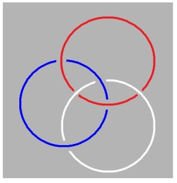
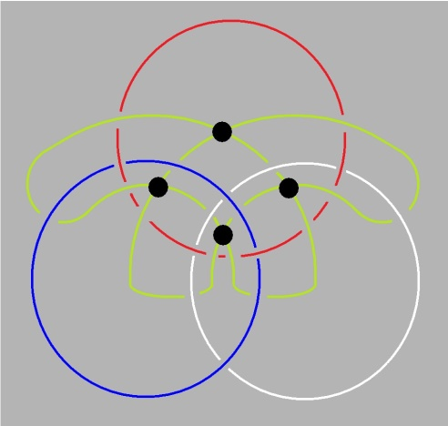
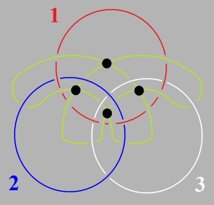
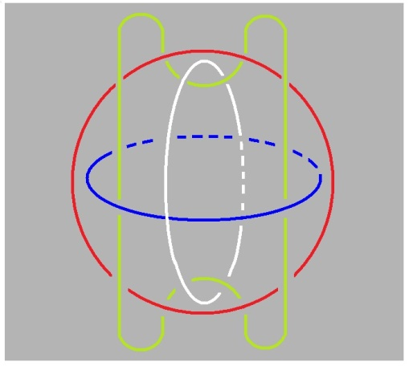
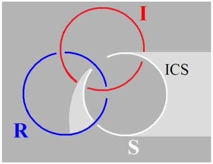

# Leçon 07 | 18 Février 1975

  <label><input type="checkbox" data-lacan-toggle="original" checked> 原文</label>
  <label><input type="checkbox" data-lacan-toggle="notes" checked> 注释</label>
  <label><input type="checkbox" data-lacan-toggle="commentary" checked> 个人解读评论</label>

<section class="parallel-paragraph" data-paragraph-ids="s22-07-0001">

s22-07-0001

[无对应译文]

原文 · s22-07-0001

La dernière fois, je vous ai témoigné de mes expériences errantes, et comme j’étais déçu que le Mardi-gras n’ait pas raréfié la plénitude de cette salle, comme j’en étais déçu, je me suis laissé glisser à vous raconter ce que je pense.

</section>

<section class="parallel-paragraph" data-paragraph-ids="s22-07-0002">

s22-07-0002

[无对应译文]

原文 · s22-07-0002

Néanmoins aujourd’hui...

</section>

<section class="parallel-paragraph" data-paragraph-ids="s22-07-0003">

s22-07-0003

[无对应译文]

原文 · s22-07-0003

pour des raisons qui me sont, je dois dire, per­sonnelles, pour la raison que mon travail a été un peu dérangé cette semai­ne ...j’aimerais bien prendre le relais de ce qui me semblait déjà s’imposer, et qui, après tout je peux le concevoir, demandait un temps.

</section>

<section class="parallel-paragraph" data-paragraph-ids="s22-07-0004">

s22-07-0004

[无对应译文]

原文 · s22-07-0004

Aujourd’hui ce temps me semble...

</section>

<section class="parallel-paragraph" data-paragraph-ids="s22-07-0005">

s22-07-0005

[无对应译文]

原文 · s22-07-0005

> je vous le répète, pour de simples raisons person­nelles ...ce temps pourrait bien venir, du moins je le souhaite, que cer­tains certains parmi vous me posent des questions, auxquelles, je vous le répète, je serais heureux au moins de pouvoir répondre, à ce dont il semblerait que dans l’état actuel j’ai la réponse.

</section>

<section class="parallel-paragraph" data-paragraph-ids="s22-07-0006">

s22-07-0006

[无对应译文]

原文 · s22-07-0006

Je serais vraiment très très reconnaissant à ces « *cer­tains »*...

</section>

<section class="parallel-paragraph" data-paragraph-ids="s22-07-0007">

s22-07-0007

[无对应译文]

原文 · s22-07-0007

> qui certainement au sens où je l’entends, *ex-sistent* ...à ces « *certains* » s’ils me lançaient la balle, si je puis dire, et à la personne qui s’y dévouerait la première, parce qu’après tout il suffit qu’un se décide pour que d’autres s’en trouvent frayer la voie.

</section>

<section class="parallel-paragraph" data-paragraph-ids="s22-07-0008">

s22-07-0008

[无对应译文]

原文 · s22-07-0008

Voilà ! Je fais appel à qui voudrait bien parler le premier ou la premiè­re.

</section>

<section class="parallel-paragraph" data-paragraph-ids="s22-07-0009">

s22-07-0009

[无对应译文]

原文 · s22-07-0009

J’aimerais beaucoup qu’on me pose une question.

</section>

<section class="parallel-paragraph" data-paragraph-ids="s22-07-0010">

s22-07-0010

[无对应译文]

原文 · s22-07-0010

D’abord ça me don­nerait la note de ce qui peut accrocher.

</section>

<section class="parallel-paragraph" data-paragraph-ids="s22-07-0011">

s22-07-0011

[无对应译文]

原文 · s22-07-0011

Il me semble que la dernière fois déjà, en avançant ce que j’ai dit d’un effort fait pour distinguer...

</section>

<section class="parallel-paragraph" data-paragraph-ids="s22-07-0012">

s22-07-0012

[无对应译文]

原文 · s22-07-0012

> non seu­lement distinguer ce dont je vous montrerai à l’occasion d’où ça part :
>
> ça part d’une mise à plat du nœud ...il faut dans le nœud distinguer ceci : c’est que si c’est très difficile d’en faire rentrer la théorie dans la mathé­matique, ceci au point que, disons, je n’ai pas trouvé quoique ce soit qui réponde à ce nœud, à ce nœud qui...

</section>

<section class="parallel-paragraph" data-paragraph-ids="s22-07-0013">

s22-07-0013

[无对应译文]

原文 · s22-07-0013

> j’y ai été mené, enfin, pas à pas ...à ce nœud à quoi j’ai abouti en tant que le nœud borroméen. Comment j’y ai abouti ?

</section>

<section class="parallel-paragraph" data-paragraph-ids="s22-07-0014">

s22-07-0014

[无对应译文]

原文 · s22-07-0014

Il est certain qu’actuellement - si moi bien sûr j’en sais la suite - seule pourra permettre d’en trouver le fil...

</section>

<section class="parallel-paragraph" data-paragraph-ids="s22-07-0015">

s22-07-0015

[无对应译文]

原文 · s22-07-0015

> c’est-à-dire ce qui en fait *la consistance* ...seule permettra d’en trouver le fil, la suite des séminaires...

</section>

<section class="parallel-paragraph" data-paragraph-ids="s22-07-0016">

s22-07-0016

[无对应译文]

原文 · s22-07-0016

> dont vous avez le premier et le dernier, grâce au soin de quel­qu’un,
>
> et aussi celui qui n’est pas le médian, celui qui est le XI ...c’est assurément ce qui en donnera ce que je désigne de *la consistance*.

</section>

<section class="parallel-paragraph" data-paragraph-ids="s22-07-0017">

s22-07-0017

[无对应译文]

原文 · s22-07-0017

Comment se fait-il que quelque chose qui - je l’ai évoqué - aurait pu être le départ d’un autre mode de « *penser avec rigueur* » : « *more geometrico »,* c’est ce qu’un Spinoza par exemple, se targuait de filer, de dédui­re quelque chose selon le mode et le modèle donné par les Anciens.

</section>

<section class="parallel-paragraph" data-paragraph-ids="s22-07-0018">

s22-07-0018

[无对应译文]

原文 · s22-07-0018

Il est clair que ce « *more geometrico »* définit un mode d’intuition qui est propre­ment le mathématique, et que ce mode d’intuition, après tout, ne va pas de soi.

</section>

<section class="parallel-paragraph" data-paragraph-ids="s22-07-0019">

s22-07-0019

[无对应译文]

原文 · s22-07-0019

La façon dont *le point* - *la ligne* - est en quelque sorte fomentée d’une fic­tion, et aussi bien *la surface* qui ne se soutient que de la *fente*, que de la cassure, d’une cassure sans doute spécifiée d’être à 2 dimen­sions...

</section>

<section class="parallel-paragraph" data-paragraph-ids="s22-07-0020">

s22-07-0020

[无对应译文]

原文 · s22-07-0020

> mais comme la ligne n’est une dimension que d’être sans consistan­ce à proprement parler,
>
> ce n’est pas beaucoup dire que de dire qu’on en ajoute une, ...et d’autre part la 3ème, celle qui en somme s’édifie d’une perpendiculaire à la surface, est quelque chose de bien étrange.

</section>

<section class="parallel-paragraph" data-paragraph-ids="s22-07-0021">

s22-07-0021

[无对应译文]

原文 · s22-07-0021

Comment sans que quelque chose donne support à ce qu’il faut bien dire être abstraction fondée sur un coup de scie, comment sans retrouver *la corde* - c’est le cas de le dire - faire tenir cette construction ?

</section>

<section class="parallel-paragraph" data-paragraph-ids="s22-07-0022">

s22-07-0022

[无对应译文]

原文 · s22-07-0022

Mais d’un autre côté, ce n’est pas non plus par hasard que les choses se sont ainsi produites.

</section>

<section class="parallel-paragraph" data-paragraph-ids="s22-07-0023">

s22-07-0023

[无对应译文]

原文 · s22-07-0023

Sans doute y a­-t-il là une nécessité qui est...

</section>

<section class="parallel-paragraph" data-paragraph-ids="s22-07-0024">

s22-07-0024

[无对应译文]

原文 · s22-07-0024

> disons, mon Dieu, parce que je ne trouve pas mieux ...qui est de la faiblesse d’un être manuel : *Homo Faber* comme on l’a dit.

</section>

<section class="parallel-paragraph" data-paragraph-ids="s22-07-0025">

s22-07-0025

[无对应译文]

原文 · s22-07-0025

Mais pourquoi cet être manuel, l’*Homo Faber* qui aussi bien...

</section>

<section class="parallel-paragraph" data-paragraph-ids="s22-07-0026">

s22-07-0026

[无对应译文]

原文 · s22-07-0026

> ne serait­-ce que pour - je l’ai fait remarquer - véhiculer ce à quoi il s’attaque, ce qu’il manipule ...part bien de quelque chose qui a consistance, part de *la corde* ?

</section>

<section class="parallel-paragraph" data-paragraph-ids="s22-07-0027">

s22-07-0027

[无对应译文]

原文 · s22-07-0027

Quelle nécessité fait que cette corde, cette corde dont, dans la 10ème Règle - celle de Descartes, que j’ai évoquée - Descartes évoque qu’aussi bien, après tout, l’art du tisserand, l’art de la tresse, l’art de la fileuse pourrait donner le modèle.

</section>

<section class="parallel-paragraph" data-paragraph-ids="s22-07-0028">

s22-07-0028

[无对应译文]

原文 · s22-07-0028

Comment se fait-il que des choses s’exténuent à ce point, que le fil en devienne inconsistant ?

</section>

<section class="parallel-paragraph" data-paragraph-ids="s22-07-0029">

s22-07-0029

[无对应译文]

原文 · s22-07-0029

Peut-être y a-t-il là quelque chose qui est en rapport avec un refou­lement ?

</section>

<section class="parallel-paragraph" data-paragraph-ids="s22-07-0030">

s22-07-0030

[无对应译文]

原文 · s22-07-0030

Avant de s’avancer jusqu’à dire que ce refoulé, c’est le primordial, c’est l’*Urverdrängt,* c’est ce que Freud désigne comme l’inaccessible de l’inconscient.

</section>

<section class="parallel-paragraph" data-paragraph-ids="s22-07-0031">

s22-07-0031

[无对应译文]

原文 · s22-07-0031

*X au fond de la salle : On n’entend pas !*

</section>

<section class="parallel-paragraph" data-paragraph-ids="s22-07-0032">

s22-07-0032

[无对应译文]

原文 · s22-07-0032

*Ce ne serait peut-être pas mal que quelqu’un du fond prenne la parole et me pose une question,* *ça me montrerait à quelle hauteur il faut élever la voix pour que moi j’entende, puisque les choses semblent mal fonctionner.*

</section>

<section class="parallel-paragraph" data-paragraph-ids="s22-07-0033">

s22-07-0033

[无对应译文]

原文 · s22-07-0033

*Est-ce que quelqu’un du fond ne pourrait pas frayer cette voie que j’ai souhaitée tout à l’heure ?*

</section>

<section class="parallel-paragraph" data-paragraph-ids="s22-07-0034">

s22-07-0034

[无对应译文]

原文 · s22-07-0034

Il faut partir de ceci : de combien aisément on rate la figu­ration de ce nœud, de *ce nœud spécial* que je désigne d’être *borroméen,* et qui a cette propriété singulière qu’il suffit de rompre quelque chose, qui pourtant s’y figure simplement, à savoir d’un tore dont justement il suffit de le couper, pour avoir en main cette épaisseur, cette consistance, à savoir ce qui fait *corde*.

</section>

<section class="parallel-paragraph" data-paragraph-ids="s22-07-0035">

s22-07-0035

[无对应译文]

原文 · s22-07-0035

C’est bien pourquoi, interrogeant mon nœud ainsi dessi­nable, et de fait dessiné :

</section>

<section class="parallel-paragraph" data-paragraph-ids="s22-07-0036">

s22-07-0036

[无对应译文]

原文 · s22-07-0036

</section>

<section class="parallel-paragraph" data-paragraph-ids="s22-07-0037">

s22-07-0037

[无对应译文]

原文 · s22-07-0037

j’ai marqué ceci, qu’il était pas moins dessinable et qu’il restait nœud à cette seule condition qu’une de ces boucles on l’ouvre et qu’elle se transforme en une droite :

</section>

<section class="parallel-paragraph" data-paragraph-ids="s22-07-0038">

s22-07-0038

[无对应译文]

原文 · s22-07-0038

</section>

<section class="parallel-paragraph" data-paragraph-ids="s22-07-0039">

s22-07-0039

[无对应译文]

原文 · s22-07-0039

Nous retrouvons la question que j’ai posée au départ : celle de la droite et de *son peu de consistance mathématique*, géométrique. Ici cette consistance restituée suppose que nous l’étendions à l’infini pour qu’elle continue à jouer sa fonction.

</section>

<section class="parallel-paragraph" data-paragraph-ids="s22-07-0040">

s22-07-0040

[无对应译文]

原文 · s22-07-0040

Il faut donc voir infiniment prolongée cette corde, en haut et en bas, pour que le nœud reste tel, reste nœud.

</section>

<section class="parallel-paragraph" data-paragraph-ids="s22-07-0041">

s22-07-0041

[无对应译文]

原文 · s22-07-0041

C’est bien en quoi je dis que la droite...

</section>

<section class="parallel-paragraph" data-paragraph-ids="s22-07-0042">

s22-07-0042

[无对应译文]

原文 · s22-07-0042

> la droite sur quoi en somme prend appui cette corde dans son état présent ...la droite n’est guère *consistante* et c’est bien là-des­sus d’ailleurs que la géométrie a, si l’on peut dire, glissé.

</section>

<section class="parallel-paragraph" data-paragraph-ids="s22-07-0043">

s22-07-0043

[无对应译文]

原文 · s22-07-0043

Soit à partir du moment où cette droite infinie on en a - dans une géométrie dite *sphérique -* restitué l’infini en en faisant un nouveau rond. Sans s’apercevoir que, dès la position du nœud borroméen, ce rond est impliqué et qu’il n’y avait donc pas peut-être à faire tout ce détour.

</section>

<section class="parallel-paragraph" data-paragraph-ids="s22-07-0044">

s22-07-0044

[无对应译文]

原文 · s22-07-0044

Quoi qu’il en soit, la dernière fois vous m’avez vu étendre cette géo­métrie du nœud borroméen à 3, à la figuration de ce qui est exigé pour que ça vaille pour 4.

</section>

<section class="parallel-paragraph" data-paragraph-ids="s22-07-0045">

s22-07-0045

[无对应译文]

原文 · s22-07-0045

C’était vous donner l’expérience de la difficulté de ce que j’ai appelé le nœud mental.

</section>

<section class="parallel-paragraph" data-paragraph-ids="s22-07-0046">

s22-07-0046

[无对应译文]

原文 · s22-07-0046

Mais je sais bien que c’est à la tenta­tive de *le mettre à plat ce nœud* *mental*, c’est-à-dire se sou­mettre à ce que la prétendue *pensée*, c’est-à-dire quelque chose qui colle à *l’étendue*, à une condition : bien loin d’en être séparée comme le suppose Descartes, la pensée n’est qu’*étendue*, et encore il lui faut une « *étendue »* - pas n’importe laquelle - une « *étendue »* à 2 dimensions, une « *étendue »* qui puisse se barbouiller.

</section>

<section class="parallel-paragraph" data-paragraph-ids="s22-07-0047">

s22-07-0047

[无对应译文]

原文 · s22-07-0047

Car c’est bien là la façon dont il ne serait pas dépla­cé, dont il ne serait pas inopportun, de définir cette surface...

</section>

<section class="parallel-paragraph" data-paragraph-ids="s22-07-0048">

s22-07-0048

[无对应译文]

原文 · s22-07-0048

> dont tout à l’heure je montrais dans la géométrie,
>
> celle qui *s’imagine*, qui s’est soute­nue essentiellement d’un *Imaginaire* ...c’est bien comme ça qu’on pourrait aussi bien la définir cette surface, ce trait de scie sur un solide : c’est que ça offre quelque chose, quelque chose à barbouiller.

</section>

<section class="parallel-paragraph" data-paragraph-ids="s22-07-0049">

s22-07-0049

[无对应译文]

原文 · s22-07-0049

Il est singulier que la seule façon dont on soit arrivé en somme - cette surface idéale - à la reproduire, ce soit justement ce devant quoi on recule, à savoir la *tresse d’une toile*, et que ce soit sur une toile *que le peintre ait en somme à barbouiller*, puisque c’est tout ce qu’il trouve à faire pour *dompter le regard*...

</section>

<section class="parallel-paragraph" data-paragraph-ids="s22-07-0050">

s22-07-0050

[无对应译文]

原文 · s22-07-0050

> comme j’ai exprimé dans un temps, ce qu’il en est de la fonction du peintre ...et qu’ici aussi, c’est sur quelque chose de spéci­fié : le tableau noir, que je me trouve forcément *mettre à plat* ce que j’ai à vous communiquer du nœud.

</section>

<section class="parallel-paragraph" data-paragraph-ids="s22-07-0051">

s22-07-0051

[无对应译文]

原文 · s22-07-0051

C’est bien là qu’en effet se sent d’une façon particulière, se sent ceci : c’est que ce nœud...

</section>

<section class="parallel-paragraph" data-paragraph-ids="s22-07-0052">

s22-07-0052

[无对应译文]

原文 · s22-07-0052

> que je vous ai d’autre part figuré grâce a votre imagination perspective,
>
> à savoir com­ment ça tient le nœud borroméen à 3, comment c’est fait ...c’est fait de 2 nœuds qui sont indépendants l’un de l’autre, et il s’agit de savoir par où passe le 3ème pour que ça fasse nœud.

</section>

<section class="parallel-paragraph" data-paragraph-ids="s22-07-0053">

s22-07-0053

[无对应译文]

原文 · s22-07-0053

Je vous ai posé la même question concernant ce qu’il faut pour que ça fasse nœud \[à 4\], même si au départ nous laissons les 3 ronds de ficelle du premier problème, nous les laissons indépendants, et je vous ai figuré en *le mettant à plat* également...

</section>

<section class="parallel-paragraph" data-paragraph-ids="s22-07-0054">

s22-07-0054

[无对应译文]

原文 · s22-07-0054

> quoique d’une façon qui en portait la perspec­tive

</section>

<section class="parallel-paragraph" data-paragraph-ids="s22-07-0055">

s22-07-0055

[无对应译文]

原文 · s22-07-0055

</section>

<section class="parallel-paragraph" data-paragraph-ids="s22-07-0056">

s22-07-0056

[无对应译文]

原文 · s22-07-0056

...en vous figurant ce qu’il en est de ce qui se passe pour ces trois ronds que j’ai dessinés indépendants, en me contentant - pour vous simplifier les choses - de montrer comment il faut les tracer pour que le 4ème, le 4ème que j’ai représenté un peu différemment de la façon que je le fais maintenant, la façon dont je le fais maintenant vous mettant en valeur la fonction quadruple du 4ème rond de ficelle.

</section>

<section class="parallel-paragraph" data-paragraph-ids="s22-07-0057">

s22-07-0057

[无对应译文]

原文 · s22-07-0057

</section>

<section class="parallel-paragraph" data-paragraph-ids="s22-07-0058">

s22-07-0058

[无对应译文]

原文 · s22-07-0058

Mais quand j’ai voulu *le mettre à plat* d’une façon qui reproduise en la modifiant, c’est-à-dire *en rendant* *indépendants* les 3 nœuds, les trois ronds de ficelle de départ : je me suis trouvé faire une erreur.

</section>

<section class="parallel-paragraph" data-paragraph-ids="s22-07-0059">

s22-07-0059

[无对应译文]

原文 · s22-07-0059

Et cette erreur, je puis dire que il s’agissait plutôt d’un ratage, lié à ceci qu’en étant las, las de me souvenir des trucs que je m’étais donné à moi-même pour correc­tement figurer ce qui résulte d’une *mise à plat* modelée sur celle du nœud à 3, j’ai omis, j’ai raté si je puis dire, j’ai raté exprès par lassitude, et aussi bien pour vous donner *l’exemple du peu de naturel* avec lequel ces choses fonctionnent, à savoir *la représentation du nœud*.

</section>

<section class="parallel-paragraph" data-paragraph-ids="s22-07-0060">

s22-07-0060

[无对应译文]

原文 · s22-07-0060

Voici donc, pour en prendre le truc mental, la façon d’abord dont ceci s’opère : si du supérieur à l’inférieur, vous notez par 1, 2, 3, : ce qui bien sûr n’a rien à faire avec un supérieur et un inférieur, puisqu’aussi bien il suffirait de les retourner pour que le problème se renouvelle.

</section>

<section class="parallel-paragraph" data-paragraph-ids="s22-07-0061">

s22-07-0061

[无对应译文]

原文 · s22-07-0061

</section>

<section class="parallel-paragraph" data-paragraph-ids="s22-07-0062">

s22-07-0062

[无对应译文]

原文 · s22-07-0062

Voici comment il convient de procéder, cela je le savais, mais justement c’est à le négliger du fait que je me suis trouvé opérer de la façon que vous avez vue, et qui laissait hors du nœud le cercle 1, mais du même coup aussi bien tous les autres.

</section>

<section class="parallel-paragraph" data-paragraph-ids="s22-07-0063">

s22-07-0063

[无对应译文]

原文 · s22-07-0063

Il convient de partir de ce qui, des trois cercles *mis à plat* de cette façon, et le 3 hors du 1 et de finir par le 3 dans le 2.

</section>

<section class="parallel-paragraph" data-paragraph-ids="s22-07-0064">

s22-07-0064

[无对应译文]

原文 · s22-07-0064

Quand on opère ainsi, les choses fonctionnent.

</section>

<section class="parallel-paragraph" data-paragraph-ids="s22-07-0065">

s22-07-0065

[无对应译文]

原文 · s22-07-0065

Il n’en est pas moins vrai qu’il est facile de voir qu’elles peuvent aussi fonctionner d’une autre façon, mais qu’il y en a une 3ème, justement celle que j’ai prise la dernière fois qui laisse un de ces nœuds libres et nommément le l, ce en quoi du même coup il laisse libre les autres.

</section>

<section class="parallel-paragraph" data-paragraph-ids="s22-07-0066">

s22-07-0066

[无对应译文]

原文 · s22-07-0066

Pourquoi en somme l’*acte manqué* ici a-t-il fonctionné, sinon pour témoigner que nulle - après tout - analyse n’évite que quelque chose ne résiste dans cette théorie du nœud.

</section>

<section class="parallel-paragraph" data-paragraph-ids="s22-07-0067">

s22-07-0067

[无对应译文]

原文 · s22-07-0067

Et c’est bien ce qu’après tout, je ne crois pas mal de vous l’avoir fait sentir, et de vous l’avoir fait ressentir, en quelque sorte d’une façon expérimentale.

</section>

<section class="parallel-paragraph" data-paragraph-ids="s22-07-0068">

s22-07-0068

[无对应译文]

原文 · s22-07-0068

Il est tout à fait clair que l’autre façon, qui se distingue de ceci, c’est que à inverser ces deux propositions, à savoir à partir de ce qui du 2 est hors du 1, mais ce que je fais là, et que je n’avais pas fait d’abord, embrouille, puisque aussi bien c’est vous figurer les choses d’une façon qui fait que les 2 ronds de ficel­le roses ont l’air de se recroiser.

</section>

<section class="parallel-paragraph" data-paragraph-ids="s22-07-0069">

s22-07-0069

[无对应译文]

原文 · s22-07-0069

Annuler simplement ces 4 points et vous verrez que dans chaque cas les deux façons de procéder conviennent bien.

</section>

<section class="parallel-paragraph" data-paragraph-ids="s22-07-0070">

s22-07-0070

[无对应译文]

原文 · s22-07-0070

En quoi conviennent-elles bien ? Elles conviennent bien en ceci, c’est que la fonction du 2 et celle du 3, comme l’autre figure, celle qui est en perspective, le démontre :

</section>

<section class="parallel-paragraph" data-paragraph-ids="s22-07-0071">

s22-07-0071

[无对应译文]

原文 · s22-07-0071

</section>

<section class="parallel-paragraph" data-paragraph-ids="s22-07-0072">

s22-07-0072

[无对应译文]

原文 · s22-07-0072

Comme l’autre figure le fait apparaître, la fonc­tion du 2 et du 3 sont strictement équivalentes, et qu’au regard du cercle qui serait ici désigné 1, ces deux autres s’équivalent strictement, à savoir que pour que ce qui est de la façon dont le rond rose les contourne, le mode est le même si nous adoptons cette figuration.

</section>

<section class="parallel-paragraph" data-paragraph-ids="s22-07-0073">

s22-07-0073

[无对应译文]

原文 · s22-07-0073

Que dire, sinon que ce que la figure centrale met en éviden­ce, c’est que la droite dite infinie qui s’y figure...

</section>

<section class="parallel-paragraph" data-paragraph-ids="s22-07-0074">

s22-07-0074

[无对应译文]

原文 · s22-07-0074

> mais dont j’ai fait remarquer à l’occasion tout ce que ça suppose, à savoir à propre­ment parler *l’impossible* ...que cette droite infinie s’oppose, s’oppose du fait de sa rupture...

</section>

<section class="parallel-paragraph" data-paragraph-ids="s22-07-0075">

s22-07-0075

[无对应译文]

原文 · s22-07-0075

> et cette rupture, comment ne pas la considérer comme
>
> affine à quelque chose qui est bien l’essentiel du nœud ...cette droite s’op­pose :

</section>

<section class="parallel-paragraph" data-paragraph-ids="s22-07-0076">

s22-07-0076

[无对应译文]

原文 · s22-07-0076

- *à ce qui fait « rond »*, comme ce que j’ai appelé *la consistance,*

</section>

<section class="parallel-paragraph" data-paragraph-ids="s22-07-0077">

s22-07-0077

[无对应译文]

原文 · s22-07-0077

- *à d’autre part* quelque chose sur quoi je n’ai pas appuyé la dernière fois et qui est bien ce qui fait l’essentiel de ce que nous appelons « *un rond* », et nommé­ment *un rond de ficelle,* c’est-à-dire *le trou qu’il y a au milieu*.

</section>

<section class="parallel-paragraph" data-paragraph-ids="s22-07-0078">

s22-07-0078

[无对应译文]

原文 · s22-07-0078

D’où l’in­terrogation que j’ai posée la dernière fois de savoir s’il n’y avait pas cor­respondance,

</section>

<section class="parallel-paragraph" data-paragraph-ids="s22-07-0079">

s22-07-0079

[无对应译文]

原文 · s22-07-0079

- *de la consistance, de l’ex-sistence, et du trou,*

</section>

<section class="parallel-paragraph" data-paragraph-ids="s22-07-0080">

s22-07-0080

[无对应译文]

原文 · s22-07-0080

- *à chacun même des termes* que j’avance comme : *Imaginaire, Symbolique et Réel*.

</section>

<section class="parallel-paragraph" data-paragraph-ids="s22-07-0081">

s22-07-0081

[无对应译文]

原文 · s22-07-0081

*Si la consistance est* bien, comme je l’ai énoncé la der­nière fois, *de l’ordre de l’Imaginaire *...

</section>

<section class="parallel-paragraph" data-paragraph-ids="s22-07-0082">

s22-07-0082

[无对应译文]

原文 · s22-07-0082

> puisque aussi bien c’est vers ce point de fuite de la ligne mathématique que la corde s’en va ...nous avons à nous interroger sur ce qu’il en est, de ce qui fait *le rond de ficelle* comme tel.

</section>

<section class="parallel-paragraph" data-paragraph-ids="s22-07-0083">

s22-07-0083

[无对应译文]

原文 · s22-07-0083

Et que si nous disons que c’est *le trou*, c’est un fait que nous n’en sommes pas satisfaits : qu’est-ce qu’un trou, si rien ne le cerne ?

</section>

<section class="parallel-paragraph" data-paragraph-ids="s22-07-0084">

s22-07-0084

[无对应译文]

原文 · s22-07-0084

Or la dernière fois, j’avais bien marqué que *l’ex-sistence*...

</section>

<section class="parallel-paragraph" data-paragraph-ids="s22-07-0085">

s22-07-0085

[无对应译文]

原文 · s22-07-0085

> à savoir ce quelque chose au regard de l’ouverture et de ce qui fait *trou* ...que *l’ex-sistence*...

</section>

<section class="parallel-paragraph" data-paragraph-ids="s22-07-0086">

s22-07-0086

[无对应译文]

原文 · s22-07-0086

> à savoir, pour mettre les choses à plat, ce quelque chose que nous devons, dans la mise à plat, figurer ...que *l’ex-sistence* appartient à ce champ qui est, si je puis dire, supposé par la rupture elle-même, et que c’est par là, c’est là dans dans *l’a* - écrivez « *l’a* » : *L*, *apostrophe*, *a* - que se joue, si l’on peut dire, le sort du nœud.

</section>

<section class="parallel-paragraph" data-paragraph-ids="s22-07-0087">

s22-07-0087

[无对应译文]

原文 · s22-07-0087

Que si le nœud a une *ex-­sistence*, c’est d’appartenir à ce champ et c’est bien en ceci que j’énonçais

</section>

<section class="parallel-paragraph" data-paragraph-ids="s22-07-0088">

s22-07-0088

[无对应译文]

原文 · s22-07-0088

- que *l’ex-­sistence est*, au regard de cette correspondance, *de l’ordre du Réel*,

</section>

<section class="parallel-paragraph" data-paragraph-ids="s22-07-0089">

s22-07-0089

[无对应译文]

原文 · s22-07-0089

- que *l’ex-sistence du nœud est réelle*, ...à tel point que j’ai pu dire, j’ai pu avancer, que le nœud mental, ça *ex-­siste*, que *le mens* se le figure ou pas, puisque ce que nous voyons c’est qu’il en est encore à explorer cette *ex-­sistence* du nœud, et à l’explorer non sans peine, puisque il n’y a pas à ma connaissance quoique ce soit... sauf à apprendre à le constituer et à l’apprendre par *la tresse*, ce qui assuré­ment n’est pas à proprement parler une façon mentale de résoudre la question, alors qu’il semble qu’il y ait à proprement parler résistance du *mens* à mentaliser ce nœud. Je vous en ai donné tout à l’heure un exemple.

</section>

<section class="parallel-paragraph" data-paragraph-ids="s22-07-0090">

s22-07-0090

[无对应译文]

原文 · s22-07-0090

Sans doute est-ce par un procédé qui est celui du *reste* et qui suppose comme fondamental l’ordre exploré,

</section>

<section class="parallel-paragraph" data-paragraph-ids="s22-07-0091">

s22-07-0091

[无对应译文]

原文 · s22-07-0091

- exploré à partir de *mon expérience*,

</section>

<section class="parallel-paragraph" data-paragraph-ids="s22-07-0092">

s22-07-0092

[无对应译文]

原文 · s22-07-0092

- exploré de l’expérience à proprement parler analytique dont j’ai dit qu’el­le m’a conduit à cette trinité infernale - appelons-la par son nom - cette trinité infernale

</section>

<section class="parallel-paragraph" data-paragraph-ids="s22-07-0093">

s22-07-0093

[无对应译文]

原文 · s22-07-0093

- *du Symbolique,*

</section>

<section class="parallel-paragraph" data-paragraph-ids="s22-07-0094">

s22-07-0094

[无对应译文]

原文 · s22-07-0094

- *de l’Imaginaire,*

</section>

<section class="parallel-paragraph" data-paragraph-ids="s22-07-0095">

s22-07-0095

[无对应译文]

原文 · s22-07-0095

- *et du Réel*.

</section>

<section class="parallel-paragraph" data-paragraph-ids="s22-07-0096">

s22-07-0096

[无对应译文]

原文 · s22-07-0096

Je ne pense pas ici jouer d’une corde qui ne soit pas freudienne si : « *Flectere si nequeo -* écrit en tête de la « *Traumdeutung »* le cher Freud - *Superos* *Acheronta move­bo »*.

</section>

<section class="parallel-paragraph" data-paragraph-ids="s22-07-0097">

s22-07-0097

[无对应译文]

原文 · s22-07-0097

Et c’est sans doute là que prend illustration ce que j’ai appelé *la vérité*, *la vérité* d’une certaine religion, pour laquelle je mettais en valeur que ce n’est pas tout à fait au hasard qu’elle arrive à une notion divine qui soit d’une *trinité*, ceci contrairement à la tradition sur laquelle elle-même se branche.

</section>

<section class="parallel-paragraph" data-paragraph-ids="s22-07-0098">

s22-07-0098

[无对应译文]

原文 · s22-07-0098

Je ne vous dis pas...

</section>

<section class="parallel-paragraph" data-paragraph-ids="s22-07-0099">

s22-07-0099

[无对应译文]

原文 · s22-07-0099

> comme je me suis laissé aller à en faire confi­dence à un auditoire qui n’était autre, si mon souvenir est bon,
>
> que celui - je crois - d’Angleterre, à moins que ce ne soit celui de Strasbourg, qu’im­porte d’ailleurs ...je n’ai pas été jusqu’à faire cette confidence que *le désir de l’homme* - ce qui est pourtant tangible - *c’est l’enfer*, « *l’enfer* » très précisément en ceci que c’est « *l’enfer* » qui lui manque !

</section>

<section class="parallel-paragraph" data-paragraph-ids="s22-07-0100">

s22-07-0100

[无对应译文]

原文 · s22-07-0100

Et avec cette consé­quence que c’est à quoi il aspire, et nous en avons *le témoignage dans la névrose* qui est très exactement ceci : c’est que le névrosé c’est quelqu’un qui n’arrive pas à ce qui pour lui est le mirage où il se trou­verait à se satisfaire, c’est à savoir une perversion, *qu’une névrose c’est une perversion ratée*.

</section>

<section class="parallel-paragraph" data-paragraph-ids="s22-07-0101">

s22-07-0101

[无对应译文]

原文 · s22-07-0101

Simple petite illustration du nœud et de ce pourquoi c’est au nœud que j’arrive pour essayer de soutenir si je puis dire, ce qui se pro­duit, et dont votre nombre est le témoignage, à savoir : quelque intérêt.

</section>

<section class="parallel-paragraph" data-paragraph-ids="s22-07-0102">

s22-07-0102

[无对应译文]

原文 · s22-07-0102

C’est bien parce que vous êtes beaucoup plus intéressés que vous le supposez chacun, dans cette nodalisation de *l’Imaginaire,* du *Symbolique* et du *Réel*, que vous êtes là, ce me semble.

</section>

<section class="parallel-paragraph" data-paragraph-ids="s22-07-0103">

s22-07-0103

[无对应译文]

原文 · s22-07-0103

Car aussi bien, pourquoi pren­driez-vous cette étrange satisfaction à entendre sur cette occasion mes bal­butiements.

</section>

<section class="parallel-paragraph" data-paragraph-ids="s22-07-0104">

s22-07-0104

[无对应译文]

原文 · s22-07-0104

Car aussi bien c’est ce à quoi aujourd’hui il faut me résoudre, c’est à savoir que je ne peux que *frayer* ce que ceci comporte comme conséquences.

</section>

<section class="parallel-paragraph" data-paragraph-ids="s22-07-0105">

s22-07-0105

[无对应译文]

原文 · s22-07-0105

Si c’est bien en effet sous ce mode que l’*ex-sistence* du nœud se supporte, à savoir de ce champ qui, mis à plat, est intermédiaire à ce qui du trou fait cette interrogation, intermédiaire à ce qui du trou fait corps, alors que ce qui supporte le corps, c’est bien autre chose : c’est la ligne de *la consistance*.

</section>

<section class="parallel-paragraph" data-paragraph-ids="s22-07-0106">

s22-07-0106

[无对应译文]

原文 · s22-07-0106

Un *corps*, tel que celui dont vous vous supportez, c’est très précisément ce quelque chose qui pour vous n’a d’aspect que d’être ce qui résiste*, ce qui consiste* avant de se dissoudre.

</section>

<section class="parallel-paragraph" data-paragraph-ids="s22-07-0107">

s22-07-0107

[无对应译文]

原文 · s22-07-0107

Et si le *Réel* est à localiser quelque part...

</section>

<section class="parallel-paragraph" data-paragraph-ids="s22-07-0108">

s22-07-0108

[无对应译文]

原文 · s22-07-0108

> à savoir dans ce champ intermédiaire de la mise à plat que j’ai figuré, dénoté, de *l’ex-sistence* ...il reste que ce ne peut être que par élimination que nous ferions...

</section>

<section class="parallel-paragraph" data-paragraph-ids="s22-07-0109">

s22-07-0109

[无对应译文]

原文 · s22-07-0109

> et c’est cela qui pour nous fait interro­gation ...que ce n’est qu’à nous poser la question de *savoir si le trou c’est bien ce qui est de l’ordre du Symbolique que j’ai fondé du signifiant,* c’est bien là le point que nous nous trouverons avoir au cours de cette année à trancher.

</section>

<section class="parallel-paragraph" data-paragraph-ids="s22-07-0110">

s22-07-0110

[无对应译文]

原文 · s22-07-0110

Nous nous trouvons donc actuellement :

</section>

<section class="parallel-paragraph" data-paragraph-ids="s22-07-0111">

s22-07-0111

[无对应译文]

原文 · s22-07-0111

- sous une forme interrogative, mettre ici *le trou* avec un point d’interrogation, et pas autre chose, d’autre question que *du Symbolique,*

</section>

<section class="parallel-paragraph" data-paragraph-ids="s22-07-0112">

s22-07-0112

[无对应译文]

原文 · s22-07-0112

- alors qu’ici le *Réel c’est* *l’ex-sistence*,

</section>

<section class="parallel-paragraph" data-paragraph-ids="s22-07-0113">

s22-07-0113

[无对应译文]

原文 · s22-07-0113

- et que *la consistance est* ici correspondante à l’*Imaginaire *:

</section>

<section class="parallel-paragraph" data-paragraph-ids="s22-07-0114">

s22-07-0114

[无对应译文]

原文 · s22-07-0114

</section>

<section class="parallel-paragraph" data-paragraph-ids="s22-07-0115">

s22-07-0115

[无对应译文]

原文 · s22-07-0115

Il est certain que ces catégories ne sont pas aisément maniables.

</section>

<section class="parallel-paragraph" data-paragraph-ids="s22-07-0116">

s22-07-0116

[无对应译文]

原文 · s22-07-0116

Elles ont pour elles pourtant d’avoir laissé quelques traces dans l’Histoire, à savoir que si c’est au bout du compte...

</section>

<section class="parallel-paragraph" data-paragraph-ids="s22-07-0117">

s22-07-0117

[无对应译文]

原文 · s22-07-0117

> du compte d’une exténuation philosophique traditionnelle dont le sommet est donné par Hegel ...que quelque chose a rejailli sous le nom d’un nommé Kierkegaard, dont vous savez combien j’ai dénoncé...

</section>

<section class="parallel-paragraph" data-paragraph-ids="s22-07-0118">

s22-07-0118

[无对应译文]

原文 · s22-07-0118

> comme convergente à l’expérience bien plus tard apparue d’un Freud ...combien j’ai dénoncé comme convergence sa promotion, comme telle, de *l’ex-sistence*.

</section>

<section class="parallel-paragraph" data-paragraph-ids="s22-07-0119">

s22-07-0119

[无对应译文]

原文 · s22-07-0119

Il y a là *quelque chose*, semble-t-il, dont on ne puisse dire, et dont on ne puis­se trouver dans Kierkegaard lui-même *témoignage*, que c’est pas seulement

</section>

<section class="parallel-paragraph" data-paragraph-ids="s22-07-0120">

s22-07-0120

[无对应译文]

原文 · s22-07-0120

- à la promotion de *« la répétition* » [^15] comme de quelque chose de plus fondamental dans l’expérience, que la résolution dite « *thèse, antithèse, synthèse* » sur quoi un Hegel tramait l’Histoire,

</section>

<section class="parallel-paragraph" data-paragraph-ids="s22-07-0121">

s22-07-0121

[无对应译文]

原文 · s22-07-0121

- la mise en valeur de cette *répétition* comme d’une fonction fondamentale dont l’étalon se trouve dans *la jouissance,* et dont les relations vécues par le Kierkegaard en question sont celles d’un *nœud*...

</section>

<section class="parallel-paragraph" data-paragraph-ids="s22-07-0122">

s22-07-0122

[无对应译文]

原文 · s22-07-0122

> sans doute jamais avoué, mais qui est celui de son père
>
> ...à la faute, à savoir l’introduction non pas de son expérience, mais de l’expérience de celui qui se trouve par rapport à lui occuper la place du père.

</section>

<section class="parallel-paragraph" data-paragraph-ids="s22-07-0123">

s22-07-0123

[无对应译文]

原文 · s22-07-0123

Que cette place du père, du même coup, ne devienne problématique, à savoir que...

</section>

<section class="parallel-paragraph" data-paragraph-ids="s22-07-0124">

s22-07-0124

[无对应译文]

原文 · s22-07-0124

> chose singulière pour une tradition qui manipulait le « *Abba *»[^16] à tort et à travers ...que ce soit à cette date, et à cette date seulement, que se promeuve en même temps l’*existence* comme telle...

</section>

<section class="parallel-paragraph" data-paragraph-ids="s22-07-0125">

s22-07-0125

[无对应译文]

原文 · s22-07-0125

> qui sans doute n’a pas le même accent que celui que j’y mets à la fragmenter d’un tiret ...que ce soit à cette époque que l’*existence* émerge si je puis dire, émerge pour moi, émerge pour que moi j’en fasse quelque chose qui s’écrit autrement, et que ce soit là ce qui soit touchable, tangible dans quelque chose qui se définisse du nœud.

</section>

<section class="parallel-paragraph" data-paragraph-ids="s22-07-0126">

s22-07-0126

[无对应译文]

原文 · s22-07-0126

Je ne crois pas que ce soit là quelque chose de nature à me mettre si je puis dire, en continuité avec une interrogation philosophique, mais bien plutôt dans un mode de rupture qui est aussi bien ce qui s’impose si l’émergence de l’inconscient comme d’un savoir...

</section>

<section class="parallel-paragraph" data-paragraph-ids="s22-07-0127">

s22-07-0127

[无对应译文]

原文 · s22-07-0127

> d’un savoir propre à chacun, à chacun particulier ...est de nature à changer complètement les conditions dans lesquelles la notion même de *savoir* a dominé, disons des temps plus antiques, disons même l’Antiquité.

</section>

<section class="parallel-paragraph" data-paragraph-ids="s22-07-0128">

s22-07-0128

[无对应译文]

原文 · s22-07-0128

Il est entré, ce caractère de *savoir,* par des voies qu’il faut que nous interrogions, que nous interrogions d’une façon qui de toute façon, remette en question sa *substance*.

</section>

<section class="parallel-paragraph" data-paragraph-ids="s22-07-0129">

s22-07-0129

[无对应译文]

原文 · s22-07-0129

Si le savoir est quelque chose d’aussi dépendant des rapports de la suite des générations au *Symbolique*...

</section>

<section class="parallel-paragraph" data-paragraph-ids="s22-07-0130">

s22-07-0130

[无对应译文]

原文 · s22-07-0130

> au *trou* dont je parlais tout à l’heure, pour l’appeler par son nom ...si il est aussi dépendant de ce que la suite des générations a fomenté comme *savoir*, comment ne pas réinterroger *son* *statut* ?

</section>

<section class="parallel-paragraph" data-paragraph-ids="s22-07-0131">

s22-07-0131

[无对应译文]

原文 · s22-07-0131

*Y a-t-il du savoir dans le Réel ?*

</section>

<section class="parallel-paragraph" data-paragraph-ids="s22-07-0132">

s22-07-0132

[无对应译文]

原文 · s22-07-0132

Il est bien clair que la supposition de toujours, mais une supposition qui n’était à proprement parler pas faite, pas avouée, c’est que *selon toute apparence il y en avait, puisque le Réel ça marchait, ça tournait rond*.

</section>

<section class="parallel-paragraph" data-paragraph-ids="s22-07-0133">

s22-07-0133

[无对应译文]

原文 · s22-07-0133

Et c’est bien ça qui manifeste que pour nous il y a un chan­gement, parce que ce *« dans le Réel »* nous y touchons un savoir sous une tout autre forme.

</section>

<section class="parallel-paragraph" data-paragraph-ids="s22-07-0134">

s22-07-0134

[无对应译文]

原文 · s22-07-0134

C’est nommément...

</section>

<section class="parallel-paragraph" data-paragraph-ids="s22-07-0135">

s22-07-0135

[无对应译文]

原文 · s22-07-0135

> pour reprendre ici ma construction ...c’est nommément ceci :

</section>

<section class="parallel-paragraph" data-paragraph-ids="s22-07-0136">

s22-07-0136

[无对应译文]

原文 · s22-07-0136

- que si nous tenons à ce *qu’un savoir ça ait pour support* - non pas, je ne dis pas *le trou* - *la consistance du Symbolique*,

</section>

<section class="parallel-paragraph" data-paragraph-ids="s22-07-0137">

s22-07-0137

[无对应译文]

原文 · s22-07-0137

- ce qui apparaît dans le *Réel*, c’est à proprement parler ceci, parce que peut-être vous souvenez-vous que *le Réel, le Symbolique* et *l’Imaginaire* se situent ainsi :

</section>

<section class="parallel-paragraph" data-paragraph-ids="s22-07-0138">

s22-07-0138

[无对应译文]

原文 · s22-07-0138

</section>

<section class="parallel-paragraph" data-paragraph-ids="s22-07-0139">

s22-07-0139

[无对应译文]

原文 · s22-07-0139

c’est le quelque chose qui mis à plat...

</section>

<section class="parallel-paragraph" data-paragraph-ids="s22-07-0140">

s22-07-0140

[无对应译文]

原文 · s22-07-0140

> mis à plat parce que nous pensons, ...qui mis à plat, apparaît dans le *Réel,* à savoir : *à l’intérieur* du domaine que la consistance du rond de ficelle permet seule de définir, \[*ici en gris clair, « la traine », « la queue de comète » du Symbolique <u>à l’intérieur</u> du Réel*\] :

</section>

<section class="parallel-paragraph" data-paragraph-ids="s22-07-0141">

s22-07-0141

[无对应译文]

原文 · s22-07-0141

- qui se présente non pas comme le savoir *immanent* au *Réel*,

</section>

<section class="parallel-paragraph" data-paragraph-ids="s22-07-0142">

s22-07-0142

[无对应译文]

原文 · s22-07-0142

- qu’il n’y a aucune façon de résoudre sinon à déjà l’y mettre sous la forme du νοῦς \[nouss\], sous la forme de quelque chose *« que le Réel saurait ce qu’il a à faire »*,

</section>

<section class="parallel-paragraph" data-paragraph-ids="s22-07-0143">

s22-07-0143

[无对应译文]

原文 · s22-07-0143

- et quand ce n’est pas le νοῦς \[nouss\], eh ben c’est « *la toute puissance et la sagesse de Dieu* » !

</section>

<section class="parallel-paragraph" data-paragraph-ids="s22-07-0144">

s22-07-0144

[无对应译文]

原文 · s22-07-0144

Je n’ai pas à revenir sur le fait que vous savez...

</section>

<section class="parallel-paragraph" data-paragraph-ids="s22-07-0145">

s22-07-0145

[无对应译文]

原文 · s22-07-0145

> que vous savez parce que je vous l’ai seriné ...à savoir que « *le monde* » n’est pas pensable sans « *Dieu* », je parle du monde newtonien, car :

</section>

<section class="parallel-paragraph" data-paragraph-ids="s22-07-0146">

s22-07-0146

[无对应译文]

原文 · s22-07-0146

« *Comment chacune des masses saurait-elle à quelle distance elle est de toutes les autres ?* ».

</section>

<section class="parallel-paragraph" data-paragraph-ids="s22-07-0147">

s22-07-0147

[无对应译文]

原文 · s22-07-0147

Il n’y a pas d’issue !

</section>

<section class="parallel-paragraph" data-paragraph-ids="s22-07-0148">

s22-07-0148

[无对应译文]

原文 · s22-07-0148

Voltaire croyait à l’Être Suprême. Je n’ai pas reçu ses confidences, je ne sais pas quelle idée il s’en faisait, mais ça ne pouvait guère être loin de l’idée de la « *toute-science »*, c’est à savoir que c’est lui qui faisait marcher la machine.

</section>

<section class="parallel-paragraph" data-paragraph-ids="s22-07-0149">

s22-07-0149

[无对应译文]

原文 · s22-07-0149

La vieille histoire du « *savoir dans le Réel* », on sait que c’est ce qui a - mon Dieu - soutenu enfin toutes ces vieilles métaphores.

</section>

<section class="parallel-paragraph" data-paragraph-ids="s22-07-0150">

s22-07-0150

[无对应译文]

原文 · s22-07-0150

« *Ces* *vieilles métaphores »* : en fin de compte il faut bien le dire, Aristote était populiste, c’est l’artisan qui lui donne le modèle pour toutes ses causes :

</section>

<section class="parallel-paragraph" data-paragraph-ids="s22-07-0151">

s22-07-0151

[无对应译文]

原文 · s22-07-0151

- sa *cause finale* si je puis m’exprimer ainsi,

</section>

<section class="parallel-paragraph" data-paragraph-ids="s22-07-0152">

s22-07-0152

[无对应译文]

原文 · s22-07-0152

- sa *cause formelle*,

</section>

<section class="parallel-paragraph" data-paragraph-ids="s22-07-0153">

s22-07-0153

[无对应译文]

原文 · s22-07-0153

- sa *cause*, ça cause à tour de bras,

</section>

<section class="parallel-paragraph" data-paragraph-ids="s22-07-0154">

s22-07-0154

[无对应译文]

原文 · s22-07-0154

- ça cause même *matériel* et ça n’en est que plus désespérant.

</section>

<section class="parallel-paragraph" data-paragraph-ids="s22-07-0155">

s22-07-0155

[无对应译文]

原文 · s22-07-0155

Il est certain qu’au niveau de la cause, de la cause physique, de ce qui est inscrit par lui dans sa *Physique,* toute la superbe du νοῦς \[nouss\] - du νοῦς présent au monde - se réduit à ce que j’ai qua­lifié d’artisanal, d’artisanal qui fait que ça a été accueilli les bras ouverts partout

</section>

<section class="parallel-paragraph" data-paragraph-ids="s22-07-0156">

s22-07-0156

[无对应译文]

原文 · s22-07-0156

- *où c’est la métaphore du potier qui prime,*

</section>

<section class="parallel-paragraph" data-paragraph-ids="s22-07-0157">

s22-07-0157

[无对应译文]

原文 · s22-07-0157

- *où c’est une main divine qui a fait le pot.*

</section>

<section class="parallel-paragraph" data-paragraph-ids="s22-07-0158">

s22-07-0158

[无对应译文]

原文 · s22-07-0158

Comment continue-t-il \[*le monde*\] à tourner pourtant tout seul ?

</section>

<section class="parallel-paragraph" data-paragraph-ids="s22-07-0159">

s22-07-0159

[无对应译文]

原文 · s22-07-0159

C’est bien là justement la question, et la question sur laquelle les raffinements de savoir

</section>

<section class="parallel-paragraph" data-paragraph-ids="s22-07-0160">

s22-07-0160

[无对应译文]

原文 · s22-07-0160

- s’il continue de s’en occuper, à savoir de le faire tourner,

</section>

<section class="parallel-paragraph" data-paragraph-ids="s22-07-0161">

s22-07-0161

[无对应译文]

原文 · s22-07-0161

- ou s’il le laisse tourner tout seul après l’avoir éjecté, ...est véritable­ment secondaire.

</section>

<section class="parallel-paragraph" data-paragraph-ids="s22-07-0162">

s22-07-0162

[无对应译文]

原文 · s22-07-0162

Mais toute *la question du* *savoir* est à reprendre seulement à partir de ceci *qu’un savoir n’est supposé que d’une relation au Symbolique*, c’est-à­-dire à *ce quelque chose qui s’incarne d’un matériel comme signifiant*, ce qui n’est pas à soi tout seul poser une mince question.

</section>

<section class="parallel-paragraph" data-paragraph-ids="s22-07-0163">

s22-07-0163

[无对应译文]

原文 · s22-07-0163

Car qu’est-ce qu’un « *matériel signifiant »* ?

</section>

<section class="parallel-paragraph" data-paragraph-ids="s22-07-0164">

s22-07-0164

[无对应译文]

原文 · s22-07-0164

Nous n’en avons que la pointe du museau chez Aristote, au niveau où il parle du στοιχεῖον \[stoikeion\], mais il est certain que l’idée même de *matière* n’est strictement pensable qu’issue du *matériel signifiant* où elle trouve ses premiers exemples.

</section>

<section class="parallel-paragraph" data-paragraph-ids="s22-07-0165">

s22-07-0165

[无对应译文]

原文 · s22-07-0165

Alors pour essayer simplement de noter quelque chose qui sera ce sur quoi se déroule ma notation : c’est certain que c’est d’une expérience de *la figuration du symptôme comme reflétant dans le Réel le fait qu’il y a quelque chose qui ne marche pas.*

</section>

<section class="parallel-paragraph" data-paragraph-ids="s22-07-0166">

s22-07-0166

[无对应译文]

原文 · s22-07-0166

Et où ? Pas dans le Réel bien sûr : *dans le champ du Réel* !

</section>

<section class="parallel-paragraph" data-paragraph-ids="s22-07-0167">

s22-07-0167

[无对应译文]

原文 · s22-07-0167

Ce *« quelque chose qui ne marche pas »* tient - tient à quoi ? -

</section>

<section class="parallel-paragraph" data-paragraph-ids="s22-07-0168">

s22-07-0168

[无对应译文]

原文 · s22-07-0168

- ne tient qu’à ce que je supporte dans mon langage : *du parlêtre*,

</section>

<section class="parallel-paragraph" data-paragraph-ids="s22-07-0169">

s22-07-0169

[无对应译文]

原文 · s22-07-0169

- de ce qui n’est que *parlêtre*, parce que s’il parlait pas il n’y aurait pas de mot « *être* »,

</section>

<section class="parallel-paragraph" data-paragraph-ids="s22-07-0170">

s22-07-0170

[无对应译文]

原文 · s22-07-0170

- et qu’à ce *parlêtre* il y a un champ, *un champ connexe au trou* que je figurerai ici :

</section>

<section class="parallel-paragraph" data-paragraph-ids="s22-07-0171">

s22-07-0171

[无对应译文]

原文 · s22-07-0171

</section>

<section class="parallel-paragraph" data-paragraph-ids="s22-07-0172">

s22-07-0172

[无对应译文]

原文 · s22-07-0172

*Je vous demande pardon, je ne tiens pas tout spé­cialement à ce que mes figures soient élégantes, ni symétriques.*

</section>

<section class="parallel-paragraph" data-paragraph-ids="s22-07-0173">

s22-07-0173

[无对应译文]

原文 · s22-07-0173

C’est dans la mesure où il y a ouverture possible, rupture, *consistance* issue de ce *trou*, lieu *d’ex-sistence*, *Réel*, que l’inconscient est là

</section>

<section class="parallel-paragraph" data-paragraph-ids="s22-07-0174">

s22-07-0174

[无对应译文]

原文 · s22-07-0174

> et que ce qui fait que nul, passant derrière *le trou du Réel*
>
> derrière sur cette figure, car si vous la retournez, c’est devant qu’il y a cohérence ...*qu’il y a consistance entre le symptôme et l’inconscient*.

</section>

<section class="parallel-paragraph" data-paragraph-ids="s22-07-0175">

s22-07-0175

[无对应译文]

原文 · s22-07-0175

À ceci près que *le symptôme* n’est pas définissable autrement que par *la façon dont chacun jouit de l’inconscient,* en tant que l’*inconscient* le détermine.

</section>

<section class="parallel-paragraph" data-paragraph-ids="s22-07-0176">

s22-07-0176

[无对应译文]

原文 · s22-07-0176

Chercher l’origine de la notion de « *symptôme »*, qui n’est pas du tout à chercher dans Hippocrate, qui est à chercher dans Marx, qui le premier dans la liaison qu’il fait entre le capitalisme et - quoi ? - le bon vieux temps, ce qu’on appelle, quand on veut tâcher de l’appeler autrement, « *le temps féodal* ».

</section>

<section class="parallel-paragraph" data-paragraph-ids="s22-07-0177">

s22-07-0177

[无对应译文]

原文 · s22-07-0177

Lisez là-dessus toute la littérature : le capitalisme est consi­déré comme ayant certains effets...

</section>

<section class="parallel-paragraph" data-paragraph-ids="s22-07-0178">

s22-07-0178

[无对应译文]

原文 · s22-07-0178

> et pourquoi en effet n’en aurait-il pas ? ...ces effets sont somme toute bénéfiques puisqu’il a l’avantage de réduire à rien *l’homme prolétaire*, grâce à quoi *l’homme prolétaire* réalise l’essen­ce de l’homme, et d’être dépouillé de tout, est chargé d’être le Messie du futur.

</section>

<section class="parallel-paragraph" data-paragraph-ids="s22-07-0179">

s22-07-0179

[无对应译文]

原文 · s22-07-0179

Telle est la façon dont Marx analyse la notion de « *symptôme »*.

</section>

<section class="parallel-paragraph" data-paragraph-ids="s22-07-0180">

s22-07-0180

[无对应译文]

原文 · s22-07-0180

Il donne bien sûr des foules d’autres *symptômes*, mais la relation de ceci avec une foi en l’homme est tout à fait incontestable.

</section>

<section class="parallel-paragraph" data-paragraph-ids="s22-07-0181">

s22-07-0181

[无对应译文]

原文 · s22-07-0181

Si nous faisons de l’*homme*, non plus quoique ce soit qui véhicule un futur idéal, mais si nous le déterminons de la particularité dans chaque cas de son inconscient, et de la façon dont il en jouit, le symptôme reste à la même place où l’a mis Marx, mais il prend un autre sens :

</section>

<section class="parallel-paragraph" data-paragraph-ids="s22-07-0182">

s22-07-0182

[无对应译文]

原文 · s22-07-0182

- il n’est pas un symptôme social,

</section>

<section class="parallel-paragraph" data-paragraph-ids="s22-07-0183">

s22-07-0183

[无对应译文]

原文 · s22-07-0183

- il est un symptôme *particulier*.

</section>

<section class="parallel-paragraph" data-paragraph-ids="s22-07-0184">

s22-07-0184

[无对应译文]

原文 · s22-07-0184

Sans doute, ces symptômes particuliers ont-ils des types, et le symptôme de l’*obsessionnel* n’est pas le symptôme de l’*hystérique*.

</section>

<section class="parallel-paragraph" data-paragraph-ids="s22-07-0185">

s22-07-0185

[无对应译文]

原文 · s22-07-0185

C’est très précisément ce que j’essaierai de faire porter pour vous dans la suite.

</section>

<section class="parallel-paragraph" data-paragraph-ids="s22-07-0186">

s22-07-0186

[无对应译文]

原文 · s22-07-0186

Pour l’obsessionnel pourtant - je le note tout de suite - il y a un symptô­me très particulier.

</section>

<section class="parallel-paragraph" data-paragraph-ids="s22-07-0187">

s22-07-0187

[无对应译文]

原文 · s22-07-0187

Personne, bien sûr, n’a la moindre appréhension de la mort...

</section>

<section class="parallel-paragraph" data-paragraph-ids="s22-07-0188">

s22-07-0188

[无对应译文]

原文 · s22-07-0188

> sans ça vous ne seriez pas là si tranquilles ...pour l’obsessionnel, la mort est un acte manqué.

</section>

<section class="parallel-paragraph" data-paragraph-ids="s22-07-0189">

s22-07-0189

[无对应译文]

原文 · s22-07-0189

C’est pas si bête, car la mort n’est abordable que par un acte, encore pour qu’il soit réussi faut-il que quelqu’un se suicide en sachant que c’est un acte, ce qui n’arrive que très rarement.

</section>

<section class="parallel-paragraph" data-paragraph-ids="s22-07-0190">

s22-07-0190

[无对应译文]

原文 · s22-07-0190

Encore que ç’ait été fort répandu à une certaine époque, à l’époque où la philosophie avait une certaine portée...

</section>

<section class="parallel-paragraph" data-paragraph-ids="s22-07-0191">

s22-07-0191

[无对应译文]

原文 · s22-07-0191

> une portée autre que de soutenir l’édifice social \[*la philosophie appartenant au disc.* M \] ...il y a eu quelques personnes qui sont arrivées à se grouper en « *École* » d’une façon qui avait des conséquences.

</section>

<section class="parallel-paragraph" data-paragraph-ids="s22-07-0192">

s22-07-0192

[无对应译文]

原文 · s22-07-0192

Mais il est bien *singulier* et bien de natu­re aussi à nous faire suspecter l’authenticité de l’engagement dans lesdites « Écoles », qu’il n’y ait pas du tout besoin d’avoir atteint une sagesse quel­conque, qu’il suffise d’être un bon *obsessionnel* pour savoir, savoir de source cer­taine que la mort est un acte manqué.

</section>

<section class="parallel-paragraph" data-paragraph-ids="s22-07-0193">

s22-07-0193

[无对应译文]

原文 · s22-07-0193

Non pas, bien sûr, que ça ne sup­pose que je ne donne là quelque développement, mais je m’en tiendrai là pour aujourd’hui, puisque aussi bien je n’ai même pas pu, comme il fallait s’y attendre, aborder l’os de ce que je voulais vous dire, à savoir si à force de dire que « *La* *femme n’existe pas* » - comme quelqu’un me l’a objecté - je ne *La* faisais pas exister ?

</section>

<section class="parallel-paragraph" data-paragraph-ids="s22-07-0194">

s22-07-0194

[无对应译文]

原文 · s22-07-0194

N’en croyez rien !

</section>

<section class="parallel-paragraph" data-paragraph-ids="s22-07-0195">

s22-07-0195

[无对应译文]

原文 · s22-07-0195

Ce sera la chose que j’abor­derai la prochaine fois.

</section>

<section class="parallel-paragraph" data-paragraph-ids="s22-07-0196">

s22-07-0196

[无对应译文]

原文 · s22-07-0196

Je pense pouvoir soutenir que c’est à l’état d’« *une* »...

</section>

<section class="parallel-paragraph" data-paragraph-ids="s22-07-0197">

s22-07-0197

[无对应译文]

原文 · s22-07-0197

> d’« *une* », je ne dirai pas « *innombrables »* mais d’« *une* » parfaitement *« dénombrables »...*que les femmes existent, et non pas à l’état de « *La* ».

</section>

<section class="note-block original-notes">

## Notes

[^15]: Cf. Søren Kierkegaard : - « *La répétition »*, in *Œuvres complètes* Tome V, éd. de L’Orante, 1972 (trad. Tissaud);

    \- ou « *La reprise »*, éd Robert Laffont, Coll. Bouquins, 1993 (trad. Tissaud) ;

    \- ou « *La reprise »*, GF-Flammarion, 1990 (trad. Viallaneix).

[^16]: *Abba* : « *Père* » en araméen (langue courante utilisée au Moyen-Orient, à l’époque de Jésus et des apôtres), ce terme exprime à la fois l’affection,

    la proximité et le respect.

</section>
