# Leçon 08 | 11 Mars 1975

  <label><input type="checkbox" data-lacan-toggle="original" checked> 原文</label>
  <label><input type="checkbox" data-lacan-toggle="notes" checked> 注释</label>
  <label><input type="checkbox" data-lacan-toggle="commentary" checked> 个人解读评论</label>

<section class="parallel-paragraph" data-paragraph-ids="s22-08-0001">

s22-08-0001

[无对应译文]

原文 · s22-08-0001

J’ai eu 2 raisons d’encouragement à prendre un biais autre que celui où vous m’avez vu la dernière fois : c’est que, comme j’ai eu la faiblesse d’autoriser la publication de ces séminaires dans un certain *bulletin*, j’ai eu du même coup, la contrainte de devoir regarder les 2 premiers qui devaient sortir dans le 2è­me numéro de ce *bulletin*, et que somme toute je me suis dit que malgré la difficulté qu’il y a, non pas bien sûr à m’orienter, mais à soutenir votre intérêt...

</section>

<section class="parallel-paragraph" data-paragraph-ids="s22-08-0002">

s22-08-0002

[无对应译文]

原文 · s22-08-0002

> à soutenir votre intérêt par ce que j’énonce cette année du R S I ...eh bien mon Dieu, même ces premiers frayages des 2 premiers séminaires n’étaient pas si insoutenables.

</section>

<section class="parallel-paragraph" data-paragraph-ids="s22-08-0003">

s22-08-0003

[无对应译文]

原文 · s22-08-0003

La 2ème raison d’encouragement m’a été apportée par la répon­se...

</section>

<section class="parallel-paragraph" data-paragraph-ids="s22-08-0004">

s22-08-0004

[无对应译文]

原文 · s22-08-0004

> enfin « la réponse », je ne suis pas sûr que ce soit simplement une réponse ...je veux dire que les personnes qui m’ont envoyé deux papiers sur les nœuds, et très spécialement les nœuds borroméens, à savoir Michel Thomé et Pierre Soury, leurs papiers avaient quelque chose de tout à fait digne d’intérêt.

</section>

<section class="parallel-paragraph" data-paragraph-ids="s22-08-0005">

s22-08-0005

[无对应译文]

原文 · s22-08-0005

C’est à ces papiers que répondent les petits dessins du rang inférieur.

</section>

<section class="parallel-paragraph" data-paragraph-ids="s22-08-0006">

s22-08-0006

[无对应译文]

原文 · s22-08-0006

Pour les premiers, ceux du premier rang, ils conti­nuent, font la suite de ce que j’ai à vous dire, de ce que je me suis pro­posé de vous dire cette année.

</section>

<section class="parallel-paragraph" data-paragraph-ids="s22-08-0007">

s22-08-0007

[无对应译文]

原文 · s22-08-0007

Donc R S I j’écris cette année en titre.

</section>

<section class="parallel-paragraph" data-paragraph-ids="s22-08-0008">

s22-08-0008

[无对应译文]

原文 · s22-08-0008

Ce ne sont que des lettres et comme telles, supposant une équivalence.

</section>

<section class="parallel-paragraph" data-paragraph-ids="s22-08-0009">

s22-08-0009

[无对应译文]

原文 · s22-08-0009

Qu’est-ce qui résulte de ce que je les parle ces *lettres*, à m’en servir comme initiales ?

</section>

<section class="parallel-paragraph" data-paragraph-ids="s22-08-0010">

s22-08-0010

[无对应译文]

原文 · s22-08-0010

Et si je les parle comme *Réel, Symbolique et Imaginaire* ça prend du sens, et cette question du sens c’est bien ce que - rien de moins - j’essaie de situer cette année.

</section>

<section class="parallel-paragraph" data-paragraph-ids="s22-08-0011">

s22-08-0011

[无对应译文]

原文 · s22-08-0011

Ça prend du sens, mais le propre du sens, c’est *qu’on y nomme* quelque chose.

</section>

<section class="parallel-paragraph" data-paragraph-ids="s22-08-0012">

s22-08-0012

[无对应译文]

原文 · s22-08-0012

Et ceci fait surgir *la dit-mansion* juste­ment de *cette chose vague* qu’on appelle *les choses*, et qui ne prennent leur assise que du *Réel*, c’est-à-dire d’un des 3 termes dont j’ai fait quelque chose qu’on pourrait appeler l’émergence du sens.

</section>

<section class="parallel-paragraph" data-paragraph-ids="s22-08-0013">

s22-08-0013

[无对应译文]

原文 · s22-08-0013

« *Les  nomme* », ai-je dit.

</section>

<section class="parallel-paragraph" data-paragraph-ids="s22-08-0014">

s22-08-0014

[无对应译文]

原文 · s22-08-0014

Ce que j’ai fait en...

</section>

<section class="parallel-paragraph" data-paragraph-ids="s22-08-0015">

s22-08-0015

[无对应译文]

原文 · s22-08-0015

> je ne dirai pas encore *en démontrant*, parce que ça se résume à quelque chose
>
> qui n’est pas plus *démontrable* que le nœud borroméen, ça se résume à *une monstration* ...si j’ai été amené à *la monstration* de ce nœud alors que ce que je cherchais c’était une démonstration d’un *faire*, le *faire* du *discours analytique*, c’est quand même assez... là dirai-je « *monstratif* » ou « *démonstratif* » ?

</section>

<section class="parallel-paragraph" data-paragraph-ids="s22-08-0016">

s22-08-0016

[无对应译文]

原文 · s22-08-0016

Quoi qu’il en soit, ce que je voudrais avancer aujourd’hui, c’est quelque chose dont je vous ai...

</section>

<section class="parallel-paragraph" data-paragraph-ids="s22-08-0017">

s22-08-0017

[无对应译文]

原文 · s22-08-0017

> ce n’est pas sans ruse, parce que je glisse toujours les choses comme ça, tout doucement,
>
> il y a quelque ruse là-dedans, et ce n’est pas rien non plus de la reconnaître, ...c’est ce que je vous ai indiqué un jour : que Freud ça tourne autour du *Nom-du-Père*.

</section>

<section class="parallel-paragraph" data-paragraph-ids="s22-08-0018">

s22-08-0018

[无对应译文]

原文 · s22-08-0018

Ça ne fait pas usage du tout du *Symbolique*, de l’*Imaginaire* ni du *Réel*, mais ça les implique pourtant.

</section>

<section class="parallel-paragraph" data-paragraph-ids="s22-08-0019">

s22-08-0019

[无对应译文]

原文 · s22-08-0019

Et ce que je veux vous dire, c’est que ce n’est pas pour rien que je n’ai pas parlé « *du* » *Nom-du-Père*, quand j’ai commencé...

</section>

<section class="parallel-paragraph" data-paragraph-ids="s22-08-0020">

s22-08-0020

[无对应译文]

原文 · s22-08-0020

> comme j’imagine que certains le savent, parce que je le ressasse assez ...j’ai parlé « *des* » *Noms-du-Père*. Eh ben *les Noms-du-Père* c’est ça : *le Symbolique, l’Imaginaire et le Réel*.

</section>

<section class="parallel-paragraph" data-paragraph-ids="s22-08-0021">

s22-08-0021

[无对应译文]

原文 · s22-08-0021

En tant qu’à mon sens...

</section>

<section class="parallel-paragraph" data-paragraph-ids="s22-08-0022">

s22-08-0022

[无对应译文]

原文 · s22-08-0022

> avec *le poids* que j’ai donné tout à l’heure au mot « *sens »* ...c’est ça les *Noms-du-Père*, les noms premiers en tant qu’ils nomment quelque chose, que - comme l’indique... oui, comme l’indique la Bible - à propos de cet extraordinaire *machin* qui y est appelé *Père,* le premier temps de cette imagination humaine qu’est Dieu, est consacré à donner un nom à quelque chose qui n’est pas indifférent, à savoir : un nom à chacun des animaux.

</section>

<section class="parallel-paragraph" data-paragraph-ids="s22-08-0023">

s22-08-0023

[无对应译文]

原文 · s22-08-0023

Bien sûr avant la Bible - c’est-à-dire *l’écriture* - il y avait une tradition, ça n’est pas venu de rien.

</section>

<section class="parallel-paragraph" data-paragraph-ids="s22-08-0024">

s22-08-0024

[无对应译文]

原文 · s22-08-0024

Il est sensible...

</section>

<section class="parallel-paragraph" data-paragraph-ids="s22-08-0025">

s22-08-0025

[无对应译文]

原文 · s22-08-0025

sensible au point que ça devrait frapper les amateurs de tradi­tion ...c’est qu’une tradition est toujours, ce que j’appelle « *conne »*.

</section>

<section class="parallel-paragraph" data-paragraph-ids="s22-08-0026">

s22-08-0026

[无对应译文]

原文 · s22-08-0026

C’est même pour ça qu’on y a dévotion, il y a pas d’autre manière de s’y rat­tacher que la dévotion, ça l’est toujours si affreusement, ce que je viens de dire.

</section>

<section class="parallel-paragraph" data-paragraph-ids="s22-08-0027">

s22-08-0027

[无对应译文]

原文 · s22-08-0027

Tout ce qu’on peut espérer d’une tradition, c’est qu’elle soit *moins conne* qu’une autre.

</section>

<section class="parallel-paragraph" data-paragraph-ids="s22-08-0028">

s22-08-0028

[无对应译文]

原文 · s22-08-0028

Comment ça se juge-t-il ?

</section>

<section class="parallel-paragraph" data-paragraph-ids="s22-08-0029">

s22-08-0029

[无对应译文]

原文 · s22-08-0029

Là nous ren­trons dans le *plus et le moins*.

</section>

<section class="parallel-paragraph" data-paragraph-ids="s22-08-0030">

s22-08-0030

[无对应译文]

原文 · s22-08-0030

Ça se juge au *plus-de-jouir* comme pro­duction.

</section>

<section class="parallel-paragraph" data-paragraph-ids="s22-08-0031">

s22-08-0031

[无对应译文]

原文 · s22-08-0031

Le *plus-de-jouir* c’est évidemment tout ce qu’on a à se mettre sous la dent.

</section>

<section class="parallel-paragraph" data-paragraph-ids="s22-08-0032">

s22-08-0032

[无对应译文]

原文 · s22-08-0032

C’est parce qu’il s’agit du *jouir* qu’on y croit.

</section>

<section class="parallel-paragraph" data-paragraph-ids="s22-08-0033">

s22-08-0033

[无对应译文]

原文 · s22-08-0033

Le *jouir*, si on peut dire, est à l’horizon de ce *plus* et de ce *moins* : c’est un point idéal.

</section>

<section class="parallel-paragraph" data-paragraph-ids="s22-08-0034">

s22-08-0034

[无对应译文]

原文 · s22-08-0034

*Point idéal* qu’on appelle comme on peut : *le phallus*, dont j’ai déjà souligné en son temps que chez le *parlêtre*, ça a toujours le rapport le plus étroit... c’est l’essence du comique.

</section>

<section class="parallel-paragraph" data-paragraph-ids="s22-08-0035">

s22-08-0035

[无对应译文]

原文 · s22-08-0035

Dès que vous parlez de quelque chose qui a rapport au *phallus*, c’est le comique.

</section>

<section class="parallel-paragraph" data-paragraph-ids="s22-08-0036">

s22-08-0036

[无对应译文]

原文 · s22-08-0036

Le comique n’a rien à faire avec le *mot d’esprit*, j’ai souligné ça en son temps quand j’ai parlé du *mot d’esprit* [^17].

</section>

<section class="parallel-paragraph" data-paragraph-ids="s22-08-0037">

s22-08-0037

[无对应译文]

原文 · s22-08-0037

Le *phallus*, c’est autre chose, c’est un comique.

</section>

<section class="parallel-paragraph" data-paragraph-ids="s22-08-0038">

s22-08-0038

[无对应译文]

原文 · s22-08-0038

Comme tous les comiques, c’est un comique triste.

</section>

<section class="parallel-paragraph" data-paragraph-ids="s22-08-0039">

s22-08-0039

[无对应译文]

原文 · s22-08-0039

Quand vous lisez *Lysistrata* [^18], vous pouvez le prendre des deux côtés : rire, ou la trouver amère.

</section>

<section class="parallel-paragraph" data-paragraph-ids="s22-08-0040">

s22-08-0040

[无对应译文]

原文 · s22-08-0040

Faut dire aussi que *le phallus* c’est ce qui donne corps à l’*Imaginaire*.

</section>

<section class="parallel-paragraph" data-paragraph-ids="s22-08-0041">

s22-08-0041

[无对应译文]

原文 · s22-08-0041

Je rappelle là quelque chose qui m’avait beaucoup frappé dans son temps.

</section>

<section class="parallel-paragraph" data-paragraph-ids="s22-08-0042">

s22-08-0042

[无对应译文]

原文 · s22-08-0042

J’avais vu un petit film qui m’avait été apporté par Jenny Aubry pour me le propo­ser au titre d’illustration de ce que j’appelais à ce moment « *Le stade du miroir »*. Il y avait un enfant devant le miroir, dont je ne sais plus si c’était une petite fille ou un petit garçon, c’est même bien frappant que je ne m’en souvienne plus… Quelqu’un ici s’en souvient peut-être ?

</section>

<section class="parallel-paragraph" data-paragraph-ids="s22-08-0043">

s22-08-0043

[无对应译文]

原文 · s22-08-0043

Mais ce qu’il y a de certain c’est que - petite fille ou petit garçon - j’y saisis dans un geste, quelque chose qui à mes yeux avait valeur de ceci que...

</section>

<section class="parallel-paragraph" data-paragraph-ids="s22-08-0044">

s22-08-0044

[无对应译文]

原文 · s22-08-0044

> à supposer comme je le fais sur des fondements peu assurés ...à savoir que ce *stade du miroir* consiste dans l’unité saisie, dans le rassemblement, dans la maîtrise assu­mée, du fait de l’image, de ceci : que ce corps de prématuré, d’incoordon­né jusque-là, se semble rassemblé.

</section>

<section class="parallel-paragraph" data-paragraph-ids="s22-08-0045">

s22-08-0045

[无对应译文]

原文 · s22-08-0045

En faire un corps, savoir qu’il le maî­trise, ce qui n’arrive pas...

</section>

<section class="parallel-paragraph" data-paragraph-ids="s22-08-0046">

s22-08-0046

[无对应译文]

原文 · s22-08-0046

> sans qu’on puisse bien sûr l’affirmer ...ce qui n’arrive pas au même degré chez les animaux qui naissent mûrs : il y a pas cette joie du *stade du miroir*, ce que j’ai appelé « *jubilation* ».

</section>

<section class="parallel-paragraph" data-paragraph-ids="s22-08-0047">

s22-08-0047

[无对应译文]

原文 · s22-08-0047

Eh bien, il y a vraiment un lien - un lien de ça à quelque chose - qui était rendu sensible dans ce film, par quelque chose qui, que ce fût un petit garçon ou une petite fille je vous le souligne, avait la même valeur : l’élision...

</section>

<section class="parallel-paragraph" data-paragraph-ids="s22-08-0048">

s22-08-0048

[无对应译文]

原文 · s22-08-0048

> sous la forme d’un geste : la main qui passe devant ...l’élision de ceci qui était peut-être un *phallus*, ou peut-être son absence.

</section>

<section class="parallel-paragraph" data-paragraph-ids="s22-08-0049">

s22-08-0049

[无对应译文]

原文 · s22-08-0049

Un geste, nettement, le retirait de l’*image*.

</section>

<section class="parallel-paragraph" data-paragraph-ids="s22-08-0050">

s22-08-0050

[无对应译文]

原文 · s22-08-0050

Et ça m’a été sensible comme *corrélat*, si je puis dire, à cette prématuration.

</section>

<section class="parallel-paragraph" data-paragraph-ids="s22-08-0051">

s22-08-0051

[无对应译文]

原文 · s22-08-0051

Il y a là quelque chose dont le lien est en quelque sorte primordial par rap­port à ceci qui s’appellera plus tard « *la pudeur* », mais dont il serait exces­sif de faire état à l’étape dite « *du miroir* ».

</section>

<section class="parallel-paragraph" data-paragraph-ids="s22-08-0052">

s22-08-0052

[无对应译文]

原文 · s22-08-0052

*Le phallus donc c’est le Réel, surtout en tant qu’on l’élide*.

</section>

<section class="parallel-paragraph" data-paragraph-ids="s22-08-0053">

s22-08-0053

[无对应译文]

原文 · s22-08-0053

Si vous revenez à ce que j’ai frayé cette année en essayant de vous faire conson­ner

</section>

<section class="parallel-paragraph" data-paragraph-ids="s22-08-0054">

s22-08-0054

[无对应译文]

原文 · s22-08-0054

- *consistance*, *ex-sistence* et *trou*,

</section>

<section class="parallel-paragraph" data-paragraph-ids="s22-08-0055">

s22-08-0055

[无对应译文]

原文 · s22-08-0055

- d’autre part à : *Imaginaire*, *Réel* (pour *l’ex-sistence*) et *Symbolique*, je dirai donc que *le phallus* ça n’est pas *l’ex-sistence* du *Réel*...

</section>

<section class="parallel-paragraph" data-paragraph-ids="s22-08-0056">

s22-08-0056

[无对应译文]

原文 · s22-08-0056

> il y a un *Réel* qui *ex-siste* à ce *phallus* qui s’appelle *la jouissance* ...mais c’en est plutôt *la consistance* : c’est le *concept,* si je puis dire, du *phallus*.

</section>

<section class="parallel-paragraph" data-paragraph-ids="s22-08-0057">

s22-08-0057

[无对应译文]

原文 · s22-08-0057

Avec « *le concept »* je fais écho au mot *Begriff,* ce qui ne va pas si mal puisqu’en somme c’est...

</section>

<section class="parallel-paragraph" data-paragraph-ids="s22-08-0058">

s22-08-0058

[无对应译文]

原文 · s22-08-0058

> ce *phallus* ...c’est ce qui se prend dans la main !

</section>

<section class="parallel-paragraph" data-paragraph-ids="s22-08-0059">

s22-08-0059

[无对应译文]

原文 · s22-08-0059

Il y a quelque chose dans le *concept* qui n’est pas sans rapport avec cette annonce, cette préfigu­ration d’un organe qui n’est pas encore pris comme *consistance* mais comme appendice, et qui est assez bien manifesté dans ce qui prépare l’homme, comme on nous le dit, enfin... ou ce qui lui ressemble, ce qui n’est pas loin, c’est-à-dire *le singe*.

</section>

<section class="parallel-paragraph" data-paragraph-ids="s22-08-0060">

s22-08-0060

[无对应译文]

原文 · s22-08-0060

Le singe se masturbe, c’est bien connu, et c’est en quoi il ressemble à l’homme, c’est bien certain !

</section>

<section class="parallel-paragraph" data-paragraph-ids="s22-08-0061">

s22-08-0061

[无对应译文]

原文 · s22-08-0061

Dans *le concept*, il y a toujours quelque chose de l’ordre de la *singerie*.

</section>

<section class="parallel-paragraph" data-paragraph-ids="s22-08-0062">

s22-08-0062

[无对应译文]

原文 · s22-08-0062

La seule différence entre le *singe* et l’homme, c’est que le *phallus* ne consis­te pas moins chez lui en ce qu’il a de femelle qu’en ce qu’il a de dit « mâle » : *un phallus*...

</section>

<section class="parallel-paragraph" data-paragraph-ids="s22-08-0063">

s22-08-0063

[无对应译文]

原文 · s22-08-0063

> comme je l’ai illustré par cette brève vision de tout à l’heu­re ...*valant son absence*.

</section>

<section class="parallel-paragraph" data-paragraph-ids="s22-08-0064">

s22-08-0064

[无对应译文]

原文 · s22-08-0064

D’où l’accent spécial que le *parlêtre* met sur le *phallus*, en ce sens que *la jouissance y* *ex-siste*, que c’est là l’accent propre du *Réel*. Le *Réel*, en tant qu’il *ex-siste*, c’est-à-dire le *Réel* comme *Réel*, le *Réel* à la puissan­ce deux.

</section>

<section class="parallel-paragraph" data-paragraph-ids="s22-08-0065">

s22-08-0065

[无对应译文]

原文 · s22-08-0065

C’est tout ce qu’il connaît du 2 ce parlêtre, c’est la puissan­ce, soit un *semblant* par quoi il reste l’1 seul.

</section>

<section class="parallel-paragraph" data-paragraph-ids="s22-08-0066">

s22-08-0066

[无对应译文]

原文 · s22-08-0066

C’est ce qu’on appelle l’être. Ceci de départ, un puissance deux égale un \[12 = 1\].

</section>

<section class="parallel-paragraph" data-paragraph-ids="s22-08-0067">

s22-08-0067

[无对应译文]

原文 · s22-08-0067

Il doit y avoir un lien...

</section>

<section class="parallel-paragraph" data-paragraph-ids="s22-08-0068">

s22-08-0068

[无对应译文]

原文 · s22-08-0068

> parce que je vous ai dit ça comme ça, indiqué dans son temps ...il doit y avoir un lien entre ça et le sens, soit ce par quoi le 1 s’applique si bien au 0.

</section>

<section class="parallel-paragraph" data-paragraph-ids="s22-08-0069">

s22-08-0069

[无对应译文]

原文 · s22-08-0069

C’est Frege[^19] qui en a fait la découverte, et j’ai jaspiné en son temps sur la différence entre *Sinn* et *Bedeutung,* c’est-à-dire quelque chose où se voit la différence de 0 à 1, tout en suggérant que *ce n’est pas une différence*, qu’il y a rien de si bien que l’ensemble vide, pour suggérer le 1. Voilà !

</section>

<section class="parallel-paragraph" data-paragraph-ids="s22-08-0070">

s22-08-0070

[无对应译文]

原文 · s22-08-0070

Alors, comment le *Symbolique*...

</section>

<section class="parallel-paragraph" data-paragraph-ids="s22-08-0071">

s22-08-0071

[无对应译文]

原文 · s22-08-0071

> le *Symbolique,* comme ça, dont j’ai fait remarquer simplement qu’il a son poids dans la pratique analytique, ...comment le *Symbolique*...

</section>

<section class="parallel-paragraph" data-paragraph-ids="s22-08-0072">

s22-08-0072

[无对应译文]

原文 · s22-08-0072

> c’est-à-dire ce que d’ordinaire on appelle le *bla-bla*, ou encore le *Verbe*, tout ça c’est pareil, ...comment cela cause-t-il le sens ?

</section>

<section class="parallel-paragraph" data-paragraph-ids="s22-08-0073">

s22-08-0073

[无对应译文]

原文 · s22-08-0073

Voilà *la question* que je ne vous pose qu’à en avoir *la réponse*.

</section>

<section class="parallel-paragraph" data-paragraph-ids="s22-08-0074">

s22-08-0074

[无对应译文]

原文 · s22-08-0074

Est-ce que c’est dans l’idée de *l’inconscient* ?

</section>

<section class="parallel-paragraph" data-paragraph-ids="s22-08-0075">

s22-08-0075

[无对应译文]

原文 · s22-08-0075

Est-ce que c’est ça que je dis depuis le 1er *discours de Rome* ?

</section>

<section class="parallel-paragraph" data-paragraph-ids="s22-08-0076">

s22-08-0076

[无对应译文]

原文 · s22-08-0076

Point d’interro­gation, hein !

</section>

<section class="parallel-paragraph" data-paragraph-ids="s22-08-0077">

s22-08-0077

[无对应译文]

原文 · s22-08-0077

C’est pas dans l’idée de *l’inconscient!*

</section>

<section class="parallel-paragraph" data-paragraph-ids="s22-08-0078">

s22-08-0078

[无对应译文]

原文 · s22-08-0078

C’est dans l’idée que l’inconscient *ex-siste*...

</section>

<section class="parallel-paragraph" data-paragraph-ids="s22-08-0079">

s22-08-0079

[无对应译文]

原文 · s22-08-0079

> écrit, comme je l’écris ...c’est-à-dire qu’il conditionne le *Réel* de cet être que je désigne du *parlêtre*.

</section>

<section class="parallel-paragraph" data-paragraph-ids="s22-08-0080">

s22-08-0080

[无对应译文]

原文 · s22-08-0080

Il nomme les choses...

</section>

<section class="parallel-paragraph" data-paragraph-ids="s22-08-0081">

s22-08-0081

[无对应译文]

原文 · s22-08-0081

> comme tout à l’heure je l’évoquais, là, à propos de ce batifolage premier de *la Bible* au Paradis Terrestre ...il nomme les choses pour ce *parlêtre*, c’est-à-dire cet *être* qui lui-même est une espèce animale, mais qui en diffère singulièrement.

</section>

<section class="parallel-paragraph" data-paragraph-ids="s22-08-0082">

s22-08-0082

[无对应译文]

原文 · s22-08-0082

Il n’est animal qu’en ceci - parce que ça veut rien dire animal, hein, ça ne veut rien dire que de caractériser l’animal par sa façon de se reproduire : *sexué* ou *pas sexué*, *un animal* c’est ça, c’est ce qui se *reproduit*.

</section>

<section class="parallel-paragraph" data-paragraph-ids="s22-08-0083">

s22-08-0083

[无对应译文]

原文 · s22-08-0083

Seulement, comment est-ce que cet animal est parasité par le *Symbolique*, par le *bla-bla* ?

</section>

<section class="parallel-paragraph" data-paragraph-ids="s22-08-0084">

s22-08-0084

[无对应译文]

原文 · s22-08-0084

Oui, là il me semble...

</section>

<section class="parallel-paragraph" data-paragraph-ids="s22-08-0085">

s22-08-0085

[无对应译文]

原文 · s22-08-0085

> il me semble, mais c’est peu probable ...que je me distingue des gens de la même espèce ani­male, qui de mémoire d’homme, c’est le cas de le dire, savent qu’ils parlent mais n’en font pas état exprès.

</section>

<section class="parallel-paragraph" data-paragraph-ids="s22-08-0086">

s22-08-0086

[无对应译文]

原文 · s22-08-0086

Et ce qui montre qu’ils n’en font pas état exprès, ce n’est pas, bien sûr, qu’ils l’aient pas dit, tout s’est dit dans le *bla-bla,* ils n’en font pas état exprès pour ceci : ils rêvent de n’être pas *les seuls*, ça, ça leur tient aux boyaux !

</section>

<section class="parallel-paragraph" data-paragraph-ids="s22-08-0087">

s22-08-0087

[无对应译文]

原文 · s22-08-0087

Écrivez « *laisseuls* » si vous voulez (*l.a.i.s.s.e.u.l.s.*) pour évoquer le « *laissés seuls* » dans ce *parlage*.

</section>

<section class="parallel-paragraph" data-paragraph-ids="s22-08-0088">

s22-08-0088

[无对应译文]

原文 · s22-08-0088

De nos jours ça se manifeste comme ça, par ce besoin frénétique de découvrir le langage chez les dauphins, chez les abeilles.

</section>

<section class="parallel-paragraph" data-paragraph-ids="s22-08-0089">

s22-08-0089

[无对应译文]

原文 · s22-08-0089

Enfin pour­quoi pas : *c’est toujours un rêve* !

</section>

<section class="parallel-paragraph" data-paragraph-ids="s22-08-0090">

s22-08-0090

[无对应译文]

原文 · s22-08-0090

Autrefois ça avait d’autres formes, ce qui montre bien que c’est toujours un rêve.

</section>

<section class="parallel-paragraph" data-paragraph-ids="s22-08-0091">

s22-08-0091

[无对应译文]

原文 · s22-08-0091

Ils rêvaient qu’il y a au moins un Dieu qui parle, et qui ne parle pas surtout sans que ça ait de l’effet... Qui cause !

</section>

<section class="parallel-paragraph" data-paragraph-ids="s22-08-0092">

s22-08-0092

[无对应译文]

原文 · s22-08-0092

L’inouï c’est cet embrouillage de pattes qui veut absolument qu’ils accotent ce Dieu, de « *sub-parleurs*, » des « *anges »* ils appellent ça, des commentateurs quoi !

</section>

<section class="parallel-paragraph" data-paragraph-ids="s22-08-0093">

s22-08-0093

[无对应译文]

原文 · s22-08-0093

Enfin, il y a quand même quelque chose de plus sérieux...

</section>

<section class="parallel-paragraph" data-paragraph-ids="s22-08-0094">

s22-08-0094

[无对应译文]

原文 · s22-08-0094

> et qui est venu de ce fait qu’il y a tout de même une toute petite avance,
>
> pas un progrès bien sûr, parce qu’il y a pas de raison qu’on ne conti­nue pas à s’embrouiller les pattes ...c’est que dans la linguistique - c’est-à-dire sur le *parlage* - on distingue tout de même

</section>

<section class="parallel-paragraph" data-paragraph-ids="s22-08-0095">

s22-08-0095

[无对应译文]

原文 · s22-08-0095

- le « *donner nom* » - le « *nommer* », le « *consacrer une chose* »,

</section>

<section class="parallel-paragraph" data-paragraph-ids="s22-08-0096">

s22-08-0096

[无对应译文]

原文 · s22-08-0096

- d’un nom de parlotte.

</section>

<section class="parallel-paragraph" data-paragraph-ids="s22-08-0097">

s22-08-0097

[无对应译文]

原文 · s22-08-0097

On voit quand même là, que c’est distinct de *la communication*.

</section>

<section class="parallel-paragraph" data-paragraph-ids="s22-08-0098">

s22-08-0098

[无对应译文]

原文 · s22-08-0098

Que c’est là que la parlotte à proprement parler, se noue à quelque chose *du Réel*.

</section>

<section class="parallel-paragraph" data-paragraph-ids="s22-08-0099">

s22-08-0099

[无对应译文]

原文 · s22-08-0099

*Naming,* oui *Naming...*

</section>

<section class="parallel-paragraph" data-paragraph-ids="s22-08-0100">

s22-08-0100

[无对应译文]

原文 · s22-08-0100

Quel est le rapport de ce *Naming -* comme le dit le titre d’un livre [^20] - avec *la nécessité* ?

</section>

<section class="parallel-paragraph" data-paragraph-ids="s22-08-0101">

s22-08-0101

[无对应译文]

原文 · s22-08-0101

L’inouï c’est que depuis longtemps il y avait un nommé Platon qui s’est rendu compte qu’il y fallait *le tiers*, le 3ème terme de *l’idée*, de l’εἶδος \[éidos\], qui est quand même un très bon mot grec pour traduire ce que j’appelle l’*Imaginaire*, parce que ça veut dire l’*ima­ge*. Il a très bien vu que sans l’εἶδος, il n’y avait aucune chance que les noms collent aux choses.

</section>

<section class="parallel-paragraph" data-paragraph-ids="s22-08-0102">

s22-08-0102

[无对应译文]

原文 · s22-08-0102

Ça n’allait pas jusqu’au point qu’il énonce le nœud borroméen des trois, du *Réel,* du *Symbolique,* de l*’Imaginaire*, mais c’est parce que le hasard ne le lui avait pas fourni. L’*idée* faisait, pour lui, la consistance *du Réel*.

</section>

<section class="parallel-paragraph" data-paragraph-ids="s22-08-0103">

s22-08-0103

[无对应译文]

原文 · s22-08-0103

Néanmoins l’*idée* n’étant rien de son temps que de nommable, il en résultait ce qu’on a déduit, bien sûr, avec le discours universitaire : « *le réalisme du nom »* !

</section>

<section class="parallel-paragraph" data-paragraph-ids="s22-08-0104">

s22-08-0104

[无对应译文]

原文 · s22-08-0104

Il faut le dire, « *le réalisme du nom »* ça vaut mieux que *le nominalis­me du Réel*.

</section>

<section class="parallel-paragraph" data-paragraph-ids="s22-08-0105">

s22-08-0105

[无对应译文]

原文 · s22-08-0105

C’est à savoir que le *nom*, ben mon Dieu, on y met n’importe lequel pour désigner le *Réel*.

</section>

<section class="parallel-paragraph" data-paragraph-ids="s22-08-0106">

s22-08-0106

[无对应译文]

原文 · s22-08-0106

Le nominalisme philosophique, comme ça...

</section>

<section class="parallel-paragraph" data-paragraph-ids="s22-08-0107">

s22-08-0107

[无对应译文]

原文 · s22-08-0107

> c’est pas pour que je marque une préférence, je marque simplement que le nominalisme est une énigme
>
> qui a ceci de sensible, qu’elle rend hommage à *l’effet du nom sur le Réel*,
>
> à savoir à ce que ça y ajoute qu’on le *nomme* ...tout ce que le nominalisme a pour se distinguer du réalisme du nom, fondé lui-même sur l’*Imaginaire,* c’est qu’il y a, en moins, *un dire*.

</section>

<section class="parallel-paragraph" data-paragraph-ids="s22-08-0108">

s22-08-0108

[无对应译文]

原文 · s22-08-0108

On s’interdit d’avouer cet hommage, ça se retrouve dans le prestige de l’Université, mais ça ne nous paraît pas à nous - à nous autres analystes - constituer un avantage.

</section>

<section class="parallel-paragraph" data-paragraph-ids="s22-08-0109">

s22-08-0109

[无对应译文]

原文 · s22-08-0109

Nous restons dans *la pensée*.

</section>

<section class="parallel-paragraph" data-paragraph-ids="s22-08-0110">

s22-08-0110

[无对应译文]

原文 · s22-08-0110

Vous me direz que je m’en paye, et même au point que ça vous fatigue, mais je ne vois pas pourquoi le fait de m’en payer, dans l’occasion, pourrait se traduire par autre chose qu’un effort pour m’en dépêtrer.

</section>

<section class="parallel-paragraph" data-paragraph-ids="s22-08-0111">

s22-08-0111

[无对应译文]

原文 · s22-08-0111

Me dépêtrer de ce qui est fondamental pour la pensée, à savoir ce que j’appellerai l’imbécillité typique du *mens,* de l’*humeur humaine* à l’endroit du *Réel* qu’elle a pourtant à traiter.

</section>

<section class="parallel-paragraph" data-paragraph-ids="s22-08-0112">

s22-08-0112

[无对应译文]

原文 · s22-08-0112

D’où l’urgence que le sens de ce mot « *Réel »* soit discernable.

</section>

<section class="parallel-paragraph" data-paragraph-ids="s22-08-0113">

s22-08-0113

[无对应译文]

原文 · s22-08-0113

Jusqu’à présent ce que j’ai dit là, à propos de la tradition, garde toute sa valeur.

</section>

<section class="parallel-paragraph" data-paragraph-ids="s22-08-0114">

s22-08-0114

[无对应译文]

原文 · s22-08-0114

Il y a pas de plus monnayable que la religion.

</section>

<section class="parallel-paragraph" data-paragraph-ids="s22-08-0115">

s22-08-0115

[无对应译文]

原文 · s22-08-0115

Le *green pasture,* pour aller là droit au but : l’*au moins un* Dieu, le vrai de vrai, c’est Lui (grand L) qui a appris au parlêtre à faire *nom* pour chaque chose.

</section>

<section class="parallel-paragraph" data-paragraph-ids="s22-08-0116">

s22-08-0116

[无对应译文]

原文 · s22-08-0116

Le non-dupe du *nom de nom de Nom-du-Père* : le *Non-dupe-erre* sans cela pour le *zist* ou le *zest* [^21]: éternité.

</section>

<section class="parallel-paragraph" data-paragraph-ids="s22-08-0117">

s22-08-0117

[无对应译文]

原文 · s22-08-0117

D’où il résulte tout de même, à prendre un peu de recul, que *le Réel c’est ce qui ex-siste au sens*, en tant que je le définis par l’effet de *lalangue* sur l’*idée*, soit sur l’*Imaginaire* supposé par Platon à l’animal *parlêtre,* entre autres animaux-corps ou diable-au-corps, comme vous vou­drez.

</section>

<section class="parallel-paragraph" data-paragraph-ids="s22-08-0118">

s22-08-0118

[无对应译文]

原文 · s22-08-0118

Car pourquoi pas, puisqu’on est dans la débilité mentale, un débile mental en vaut un autre, pourquoi pas Platon ?

</section>

<section class="parallel-paragraph" data-paragraph-ids="s22-08-0119">

s22-08-0119

[无对应译文]

原文 · s22-08-0119

Aristote qui lui argumente sur l’idée d’âne [^22], pour dire que *l’âne est un âne*, que c’est bien lui, et *qu’il n’y a pas d’Âne majuscule*, hein, et ben il « *anistote* » lui aussi !

</section>

<section class="parallel-paragraph" data-paragraph-ids="s22-08-0120">

s22-08-0120

[无对应译文]

原文 · s22-08-0120

Le *Réel*, faut concevoir que :

</section>

<section class="parallel-paragraph" data-paragraph-ids="s22-08-0121">

s22-08-0121

[无对应译文]

原文 · s22-08-0121

- c’est l’expulsé du sens.

</section>

<section class="parallel-paragraph" data-paragraph-ids="s22-08-0122">

s22-08-0122

[无对应译文]

原文 · s22-08-0122

- C’est l’impossible comme tel.

</section>

<section class="parallel-paragraph" data-paragraph-ids="s22-08-0123">

s22-08-0123

[无对应译文]

原文 · s22-08-0123

- C’est l’aversion (*L, apostrophe*) du sens.

</section>

<section class="parallel-paragraph" data-paragraph-ids="s22-08-0124">

s22-08-0124

[无对应译文]

原文 · s22-08-0124

- C’est aussi, si vous voulez, l’aversion du sens dans l’anti-sens et l’ante-sens.

</section>

<section class="parallel-paragraph" data-paragraph-ids="s22-08-0125">

s22-08-0125

[无对应译文]

原文 · s22-08-0125

- C’est le choc en retour du *Verbe*, en tant que le *Verbe* n’est là que pour *ça*.

</section>

<section class="parallel-paragraph" data-paragraph-ids="s22-08-0126">

s22-08-0126

[无对应译文]

原文 · s22-08-0126

Un « *ça* » qui n’est pas pour rien, s’il rend compte de ce dont il s’agit, à savoir de l’*im­mondice* dont le monde s’émonde, en principe, si tant est qu’il y a un monde.

</section>

<section class="parallel-paragraph" data-paragraph-ids="s22-08-0127">

s22-08-0127

[无对应译文]

原文 · s22-08-0127

Ça veut pas dire qu’il y arrive hein ! L’homme est toujours là.

</section>

<section class="parallel-paragraph" data-paragraph-ids="s22-08-0128">

s22-08-0128

[无对应译文]

原文 · s22-08-0128

L’ex-sistence de l’*immonde* - à savoir de ce qui n’est pas monde - voilà le *Réel* tout court !

</section>

<section class="parallel-paragraph" data-paragraph-ids="s22-08-0129">

s22-08-0129

[无对应译文]

原文 · s22-08-0129

Mais ça vaut bien de pousser ça jusqu’à l’élaboration du quanteur : : il *ex-siste* tel *x* qui...

</section>

<section class="parallel-paragraph" data-paragraph-ids="s22-08-0130">

s22-08-0130

[无对应译文]

原文 · s22-08-0130

> plutôt qu’*un x*, ça vaudrait mieux de dire *une x* ...pour qu’*elle ex-siste dès lors cette une, l’ex-sistence comme une.*

</section>

<section class="parallel-paragraph" data-paragraph-ids="s22-08-0131">

s22-08-0131

[无对应译文]

原文 · s22-08-0131

Voilà ce qu’il faut se demander, c’est : *à quoi elle ex-siste ?*

</section>

<section class="parallel-paragraph" data-paragraph-ids="s22-08-0132">

s22-08-0132

[无对应译文]

原文 · s22-08-0132

*Elle ex-siste à la consistance idéique du corps*, celle qui, ce corps, le reproduit, tout comme Platon le situe très bien, selon la formule, main­tenant que nous contaminons de l’idée du message prétendu des gènes.

</section>

<section class="parallel-paragraph" data-paragraph-ids="s22-08-0133">

s22-08-0133

[无对应译文]

原文 · s22-08-0133

*Elle ex-siste au Symbolique en tant que le Symbolique tourne en rond autour d’<u>un trou</u> inviolable*, sans quoi le nœud des trois ne serait pas borroméen.

</section>

<section class="parallel-paragraph" data-paragraph-ids="s22-08-0134">

s22-08-0134

[无对应译文]

原文 · s22-08-0134

Car c’est ça que ça veut dire le nœud borroméen, c’est que *le trou du Symbolique* est inviolable. Voilà !

</section>

<section class="parallel-paragraph" data-paragraph-ids="s22-08-0135">

s22-08-0135

[无对应译文]

原文 · s22-08-0135

Alors pourquoi ne pas l’écrire comme ça, dans l’ordre où c’est le plus simple à écrire :

</section>

<section class="parallel-paragraph" data-paragraph-ids="s22-08-0136">

s22-08-0136

[无对应译文]

原文 · s22-08-0136

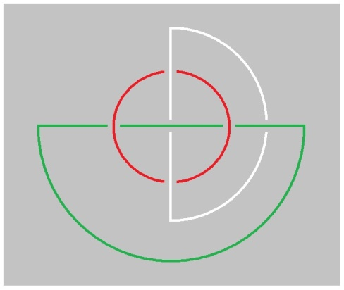

</section>

<section class="parallel-paragraph" data-paragraph-ids="s22-08-0137">

s22-08-0137

[无对应译文]

原文 · s22-08-0137

le *Symbolique* ici...

</section>

<section class="parallel-paragraph" data-paragraph-ids="s22-08-0138">

s22-08-0138

[无对应译文]

原文 · s22-08-0138

c’est lui que je mets en rond là ...le *Symbolique* s’imposant à l’*Imaginaire* que je mets en vert, couleur de l’espoir, hein ?

</section>

<section class="parallel-paragraph" data-paragraph-ids="s22-08-0139">

s22-08-0139

[无对应译文]

原文 · s22-08-0139

On voit comment le *Réel* y *ex-siste*, de ne pas plus se compromettre à se nouer avec le dit *Symbolique* en particulier, que ne le fait l’*Imaginaire*.

</section>

<section class="parallel-paragraph" data-paragraph-ids="s22-08-0140">

s22-08-0140

[无对应译文]

原文 · s22-08-0140

Alors là, je vous ai montré pendant que j’y étais, que quel que soit le sens dans lequel on fait tourner cet *Imaginaire* et ce *Réel*, ils se croiseront - comme il est ici mis à plat - de façon en tout cas à ne pas faire chaîne.

</section>

<section class="parallel-paragraph" data-paragraph-ids="s22-08-0141">

s22-08-0141

[无对应译文]

原文 · s22-08-0141

Car l’indication ici, dans cette forme de croisement, c’est aussi bien que ces deux *consistances* peuvent être *des droites à l’infini*, mais que ce qu’il faut bien préciser, c’est que de quelque façon qu’on conçoive *ce point à l’infini*...

</section>

<section class="parallel-paragraph" data-paragraph-ids="s22-08-0142">

s22-08-0142

[无对应译文]

原文 · s22-08-0142

> qui a été rêvé par Desargues comme *spéci­fique de la droite*, *une droite* qui fait retour d’un de ses bouts à l’autre ...il faut quand même mettre bien au point ceci : c’est qu’il n’est aucunement question qu’elle s’imagine se replier, sans que celle qui d’abord passait des­sus, passe encore dessus, dessus l’autre.

</section>

<section class="parallel-paragraph" data-paragraph-ids="s22-08-0143">

s22-08-0143

[无对应译文]

原文 · s22-08-0143

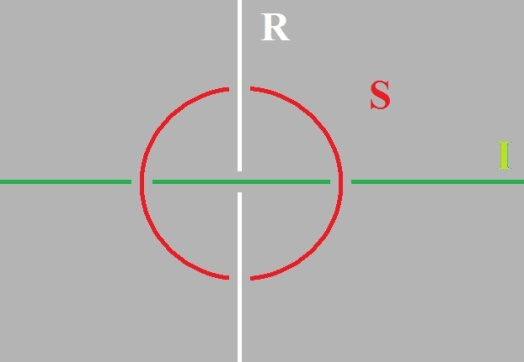

</section>

<section class="parallel-paragraph" data-paragraph-ids="s22-08-0144">

s22-08-0144

[无对应译文]

原文 · s22-08-0144

Alors ce à quoi nous venons, c’est que pour démontrer que le *Nom-du-Père* ça n’est rien d’autre que ce nœud, il y a pas d’autre façon de faire que de les supposer *dénoués*. Ne passons plus ce *Symbolique* devant l’*Imaginaire* faisons-le comme ça, c’est un peu petit, je m’excuse. Voilà dès lors ce que vous avez :

</section>

<section class="parallel-paragraph" data-paragraph-ids="s22-08-0145">

s22-08-0145

[无对应译文]

原文 · s22-08-0145

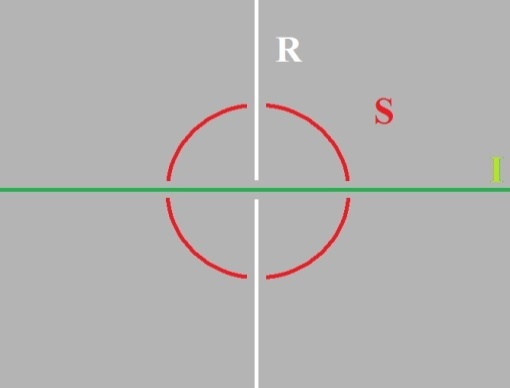

</section>

<section class="parallel-paragraph" data-paragraph-ids="s22-08-0146">

s22-08-0146

[无对应译文]

原文 · s22-08-0146

Et alors, quelle façon...

</section>

<section class="parallel-paragraph" data-paragraph-ids="s22-08-0147">

s22-08-0147

[无对应译文]

原文 · s22-08-0147

> ce que vous avez là ...quelle façon de les nouer, de les nouer d’un rond qui, ces trois consistances indépendantes, les noue ?

</section>

<section class="parallel-paragraph" data-paragraph-ids="s22-08-0148">

s22-08-0148

[无对应译文]

原文 · s22-08-0148

Il y a une façon qui est celle-là, que j’appelle du *Nom-du-Père*, c’est ce que fait Freud.

</section>

<section class="parallel-paragraph" data-paragraph-ids="s22-08-0149">

s22-08-0149

[无对应译文]

原文 · s22-08-0149

Et du même coup je réduis le *Nom-du-Père* à sa fonction radicale qui est de donner un nom aux choses.

</section>

<section class="parallel-paragraph" data-paragraph-ids="s22-08-0150">

s22-08-0150

[无对应译文]

原文 · s22-08-0150

Avec toutes les conséquences que ça comporte, parce que ça ne manque pas d’avoir des conséquences, et jusqu’au *jouir* notamment, ce que je vous ai indiqué tout à l’heure.

</section>

<section class="parallel-paragraph" data-paragraph-ids="s22-08-0151">

s22-08-0151

[无对应译文]

原文 · s22-08-0151

Je vous avais déjà fait un tracé, un tracé de ces quatre noués comme tels, j’en avais même fait un qui était raté, mais le grand, le bon, c’est celui-là que je vous reproduis aujourd’hui mais de profil, c’est-à-dire qu’au lieu de le voir sagittal, je le vois transversal.

</section>

<section class="parallel-paragraph" data-paragraph-ids="s22-08-0152">

s22-08-0152

[无对应译文]

原文 · s22-08-0152

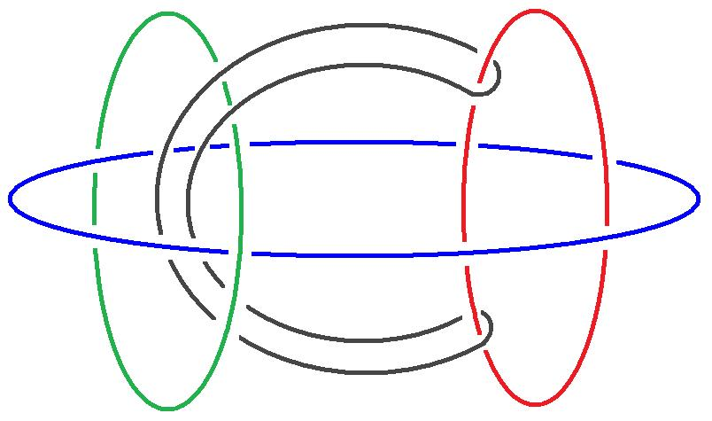

</section>

<section class="parallel-paragraph" data-paragraph-ids="s22-08-0153">

s22-08-0153

[无对应译文]

原文 · s22-08-0153

C’est celui-là, le grand cercle dont je vous ai montré qu’à distinguer ces trois cercles, comme ils sont dans une *sphère armillaire*, à savoir se contenant les uns les autres, on doit

</section>

<section class="parallel-paragraph" data-paragraph-ids="s22-08-0154">

s22-08-0154

[无对应译文]

原文 · s22-08-0154

- crocher le cercle le plus intérieur,

</section>

<section class="parallel-paragraph" data-paragraph-ids="s22-08-0155">

s22-08-0155

[无对应译文]

原文 · s22-08-0155

- passer par dessus le cercle le plus extérieur,

</section>

<section class="parallel-paragraph" data-paragraph-ids="s22-08-0156">

s22-08-0156

[无对应译文]

原文 · s22-08-0156

- en se mettant, avant de revenir sur ce cercle le plus exté­rieur, à l’intérieur du cercle moyen.

</section>

<section class="parallel-paragraph" data-paragraph-ids="s22-08-0157">

s22-08-0157

[无对应译文]

原文 · s22-08-0157

C’est ça qu’exprimait le premier schème que je vous avais livré.

</section>

<section class="parallel-paragraph" data-paragraph-ids="s22-08-0158">

s22-08-0158

[无对应译文]

原文 · s22-08-0158

Qui est-ce qui ne voit pas que cette histoire nous laisse dans le 3, à savoir que comme on peut s’y attendre, ce qu’il en est de la distinction dans le *Symbolique*, du *donner-nom* fait partie de ce *Symbolique*, comme le démontre ceci : que l’adjonction de ce 4 est en quelque sorte superflue.

</section>

<section class="parallel-paragraph" data-paragraph-ids="s22-08-0159">

s22-08-0159

[无对应译文]

原文 · s22-08-0159

C’est à savoir que ce que vous voyez là d’une façon particu­lièrement claire, je l’ai répété parce qu’ici ça ne saute peut-être pas aux yeux, c’est que le nœud borroméen c’est ça :

</section>

<section class="parallel-paragraph" data-paragraph-ids="s22-08-0160">

s22-08-0160

[无对应译文]

原文 · s22-08-0160

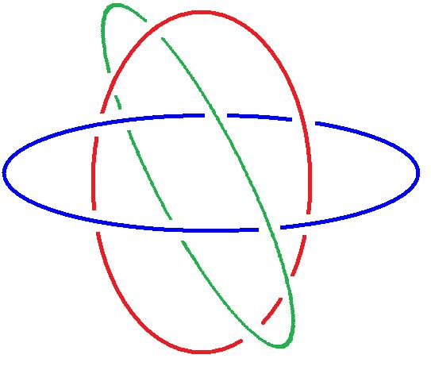 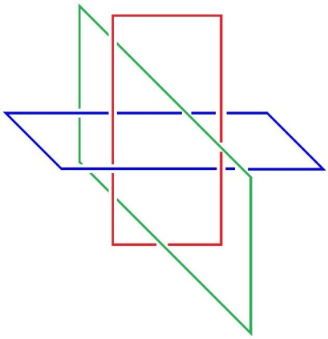

</section>

<section class="parallel-paragraph" data-paragraph-ids="s22-08-0161">

s22-08-0161

[无对应译文]

原文 · s22-08-0161

C’est ça avant sa mise à plat d’une façon quelconque.

</section>

<section class="parallel-paragraph" data-paragraph-ids="s22-08-0162">

s22-08-0162

[无对应译文]

原文 · s22-08-0162

Le nœud borroméen c’est ce qui, pour deux cercles qui se cernent l’un l’autre, intro­duit ce *tiers* pour pénétrer dans un des cercles de façon telle que l’autre, si je puis dire, soit par rapport au *tiers,* amené dans le même rapport qu’il est avec le premier cercle.

</section>

<section class="parallel-paragraph" data-paragraph-ids="s22-08-0163">

s22-08-0163

[无对应译文]

原文 · s22-08-0163

Est-ce qu’il y a ici un ordre discernable ?

</section>

<section class="parallel-paragraph" data-paragraph-ids="s22-08-0164">

s22-08-0164

[无对应译文]

原文 · s22-08-0164

Est-ce que *le nœud borroméen* est un tout - un tout concevable, c’est le cas de le dire - ou bien est ce *qu’il implique un ordre* ?

</section>

<section class="parallel-paragraph" data-paragraph-ids="s22-08-0165">

s22-08-0165

[无对应译文]

原文 · s22-08-0165

Au premier abord, on pourrait dire *qu’il implique un ordre* dans le cas où chacun de ces cercles reste « *colorié* »...

</section>

<section class="parallel-paragraph" data-paragraph-ids="s22-08-0166">

s22-08-0166

[无对应译文]

原文 · s22-08-0166

> comme s’est exprimé très justement quelqu’un qui m’a envoyé un texte où il emploie le mot « *colorié* » ...ce qui dans l’occasion veut dire : où chacun reste identifié à soi-même.

</section>

<section class="parallel-paragraph" data-paragraph-ids="s22-08-0167">

s22-08-0167

[无对应译文]

原文 · s22-08-0167

On pourrait dire que s’ils sont *coloriés*, il y a un ordre, que 1,2,3 n’est pas 1,3,2. La question pourtant est à laisser en suspens.

</section>

<section class="parallel-paragraph" data-paragraph-ids="s22-08-0168">

s22-08-0168

[无对应译文]

原文 · s22-08-0168

Il est peut-être au regard de tous *les effets du nœud* qu’il soit indifférent cet ordre : 1,2,3 - 1,3,2...

</section>

<section class="parallel-paragraph" data-paragraph-ids="s22-08-0169">

s22-08-0169

[无对应译文]

原文 · s22-08-0169

ce qui nous mettrait bien sur la voie qu’ils ne sont pas à identifier.

</section>

<section class="parallel-paragraph" data-paragraph-ids="s22-08-0170">

s22-08-0170

[无对应译文]

原文 · s22-08-0170

C’était en tant que trois faisant nœud, faisant nœud borroméen, c’est-à-dire dont aucun rond ne fait *chaîne* à aucun moment avec un autre des ronds, que c’est en tant que tel qu’il nous faut supporter l’idée du *Symbolique, de l’Imaginaire et du Réel*.

</section>

<section class="parallel-paragraph" data-paragraph-ids="s22-08-0171">

s22-08-0171

[无对应译文]

原文 · s22-08-0171

Ce qui me le suggère c’est ce que j’ai reçu d’un de ceux qui s’inté­ressent au nœud, je l’ai dit tout à l’heure : un nommé Michel Thomé m’a envoyé une petite lettre pour me montrer que dans une certaine figure...

</section>

<section class="parallel-paragraph" data-paragraph-ids="s22-08-0172">

s22-08-0172

[无对应译文]

原文 · s22-08-0172

> figure que je n’ai pas contrôlée et que je n’ai jamais dessinée ici en tout cas ...que dans une certaine figure, quelqu’un qui l’avait introduite dans la publication de mon séminaire XX, a fait ce qu’il appelle une erreur, et une erreur de perspect*ive*.

</section>

<section class="parallel-paragraph" data-paragraph-ids="s22-08-0173">

s22-08-0173

[无对应译文]

原文 · s22-08-0173

Il avait mis en valeur ceci : que d’un cercle à l’autre des 3, le 1er à être noué à lui, la forme la plus simple du nœud borroméen, était - comme je me suis servi du terme - « *le cercle plié en deux oreilles »*.

</section>

<section class="parallel-paragraph" data-paragraph-ids="s22-08-0174">

s22-08-0174

[无对应译文]

原文 · s22-08-0174

Celui qui a la bonté de m’éditer (*m,apostrophe*) a fait cette erreur de perspective :

</section>

<section class="parallel-paragraph" data-paragraph-ids="s22-08-0175">

s22-08-0175

[无对应译文]

原文 · s22-08-0175

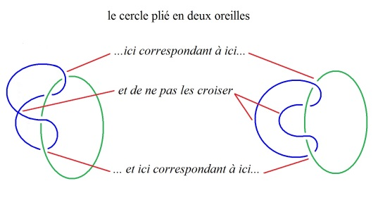

</section>

<section class="parallel-paragraph" data-paragraph-ids="s22-08-0176">

s22-08-0176

[无对应译文]

原文 · s22-08-0176

D’où il résulte aussitôt cette suite de conséquences que Michel Thomé a fort bien vu : c’est à savoir que ces nœuds *s’enlacent*, et que par conséquent, en coupant celui qui ici retiendrait ensemble ces deux boucles...

</section>

<section class="parallel-paragraph" data-paragraph-ids="s22-08-0177">

s22-08-0177

[无对应译文]

原文 · s22-08-0177

ces 2 *oreilles* dont je parlais tout à l’heure ...aboutirait à ce qu’il est facile de voir, *cette figure-ci* d’abord, voire celle-ci à l’extrême, *où l’on voit bien* *que ces nœuds sont enlacés* :

</section>

<section class="parallel-paragraph" data-paragraph-ids="s22-08-0178">

s22-08-0178

[无对应译文]

原文 · s22-08-0178

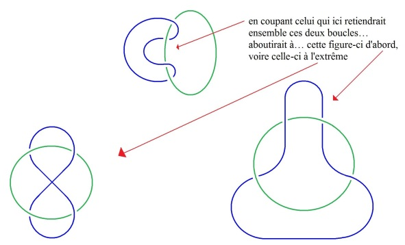

</section>

<section class="parallel-paragraph" data-paragraph-ids="s22-08-0179">

s22-08-0179

[无对应译文]

原文 · s22-08-0179

Mais ce n’est pas tout. Ce n’est pas tout car, comme tout de suite Michel Thomé en question l’a très bien déduit : c’est qu’il en résulterait un nœud borroméen d’un type spécial, qui serait tel que à nous limiter ici, par exemple, à 4.

</section>

<section class="parallel-paragraph" data-paragraph-ids="s22-08-0180">

s22-08-0180

[无对应译文]

原文 · s22-08-0180

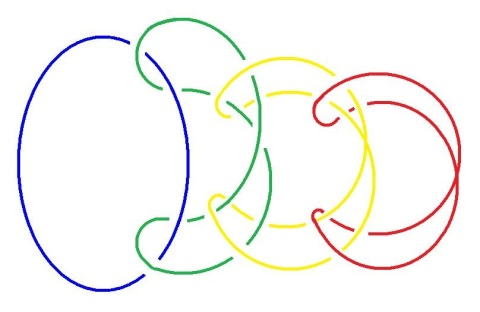

</section>

<section class="parallel-paragraph" data-paragraph-ids="s22-08-0181">

s22-08-0181

[无对应译文]

原文 · s22-08-0181

Mais vous pouvez voir que ça fonctionne aussi bien à trois puisque, je vous l’ai fait remarquer, ces deux–là restent noués, soit celui-ci, soit celui-là, restent noués, si l’on sectionne le troisième.

</section>

<section class="parallel-paragraph" data-paragraph-ids="s22-08-0182">

s22-08-0182

[无对应译文]

原文 · s22-08-0182

Pas besoin donc d’en mettre quatre pour s’apercevoir de ceci que les quatre mettent seulement en évi­dence, c’est qu’il n’y a moyen de manifester le borroméanisme de ce nœud - par exemple à quatre - qu’à trancher un seul d’entre eux, à savoir celui que nous pouvons appeler ici *le dernier*, moyennant quoi chacun des autres se libérera de son suivant jusqu’au premier.

</section>

<section class="parallel-paragraph" data-paragraph-ids="s22-08-0183">

s22-08-0183

[无对应译文]

原文 · s22-08-0183

Mais si l’on peut dire, il faut faire là une distinction, ils ne se libéreront pas ensemble, ils se libéreront l’un après l’autre.

</section>

<section class="parallel-paragraph" data-paragraph-ids="s22-08-0184">

s22-08-0184

[无对应译文]

原文 · s22-08-0184

Alors qu’au contraire, si vous commen­cez de couper celui que je viens d’appeler le premier, tous les autres jus­qu’au dernier resteront noués. Il y a là quelque chose de tout à fait inté­ressant, qui démontre quelque chose de particulier à *certains nœuds*, qu’on peut appeler borroméens dans *un sens* mais non *pas dans l’autre*, ce qui évoque déjà l’idée du cycle et de l’orientation.

</section>

<section class="parallel-paragraph" data-paragraph-ids="s22-08-0185">

s22-08-0185

[无对应译文]

原文 · s22-08-0185

Je n’insiste pas parce que je pense qu’il n’y a vraiment que ceux qui se vouent à une étude serrée de ce nœud, qui peuvent y prendre un véri­table intérêt.

</section>

<section class="parallel-paragraph" data-paragraph-ids="s22-08-0186">

s22-08-0186

[无对应译文]

原文 · s22-08-0186

Ici j’avais moi-même dessiné un nœud qui n’a d’intérêt que de ne pouvoir pas être produit de cette erreur de perspective à qui Michel Thomé a donné sa fécondité. Il n’est strictement productible que d’être fait exprès, si je puis dire, de la confusion des deux boucles qui tiennent de chaque côté les formes d’oreilles qui sont celles que j’ai pro­posées comme la forme la plus simple pour engendrer le nœud borroméen.

</section>

<section class="parallel-paragraph" data-paragraph-ids="s22-08-0187">

s22-08-0187

[无对应译文]

原文 · s22-08-0187

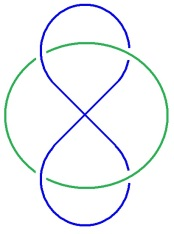

</section>

<section class="parallel-paragraph" data-paragraph-ids="s22-08-0188">

s22-08-0188

[无对应译文]

原文 · s22-08-0188

Vous le voyez, ici pourrait être un nœud externe, un rond externe qui tiendrait *ces deux boucles* - ces deux boucles d’oreilles, pour­quoi ne pas le dire - et ainsi de suite :

</section>

<section class="parallel-paragraph" data-paragraph-ids="s22-08-0189">

s22-08-0189

[无对应译文]

原文 · s22-08-0189

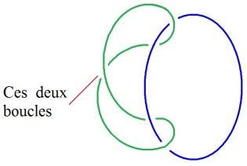

</section>

<section class="parallel-paragraph" data-paragraph-ids="s22-08-0190">

s22-08-0190

[无对应译文]

原文 · s22-08-0190

Si vous réunissez ces deux nœuds, ces deux ronds - j’y ai déjà fait allusion en son temps - vous obtenez la forme suivante :

</section>

<section class="parallel-paragraph" data-paragraph-ids="s22-08-0191">

s22-08-0191

[无对应译文]

原文 · s22-08-0191

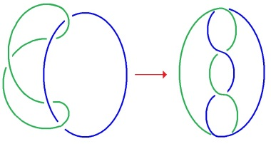

</section>

<section class="parallel-paragraph" data-paragraph-ids="s22-08-0192">

s22-08-0192

[无对应译文]

原文 · s22-08-0192

qui est une boucle tout à fait distincte des formes que j’appelle­rai à cette occasion, si je puis dire : *thoméennes*, c’est-à-dire celles qui sont produites d’une erreur de perspective telle que celle-ci, voire d’une erreur de perspective telle que celle-là qui n’est pas la même.

</section>

<section class="parallel-paragraph" data-paragraph-ids="s22-08-0193">

s22-08-0193

[无对应译文]

原文 · s22-08-0193

Je n’insiste pas et je poursuis ce qu’il en est du *Nom-du-Père*, pour le ramener à son *prototype* et dire que Dieu...

</section>

<section class="parallel-paragraph" data-paragraph-ids="s22-08-0194">

s22-08-0194

[无对应译文]

原文 · s22-08-0194

> Dieu dans l’élaboration que nous donnons à ce *Symbolique*, à cet *Imaginaire* et à ce *Réel*

</section>

<section class="parallel-paragraph" data-paragraph-ids="s22-08-0195">

s22-08-0195

[无对应译文]

原文 · s22-08-0195

...*Dieu est « La femme », rendue « toute »*. Je vous l’ai dit : elle n’est pas « *toute* ».

</section>

<section class="parallel-paragraph" data-paragraph-ids="s22-08-0196">

s22-08-0196

[无对应译文]

原文 · s22-08-0196

*Au cas où elle ex-sisterait « d’un discours qui ne serait pas de semblant »*, nous aurions cet...

</section>

<section class="parallel-paragraph" data-paragraph-ids="s22-08-0197">

s22-08-0197

[无对应译文]

原文 · s22-08-0197

> que je vous ai noté autrefois ...: tel que §, le Dieu de la castration.

</section>

<section class="parallel-paragraph" data-paragraph-ids="s22-08-0198">

s22-08-0198

[无对应译文]

原文 · s22-08-0198

C’est un vœu qui vient de l’Homme, avec un grand H, un vœu *qu’il* *ex-siste* des femmes qui *ordonneraient* la castration.

</section>

<section class="parallel-paragraph" data-paragraph-ids="s22-08-0199">

s22-08-0199

[无对应译文]

原文 · s22-08-0199

L’ennui c’est qu’il y en a pas, que conformément à ce que j’ai écrit dans une première formula­tion qui était corrélative de la « *pas-toute* » : il n’*ex-siste* pas « *La femme* », je l’ai dit.

</section>

<section class="parallel-paragraph" data-paragraph-ids="s22-08-0200">

s22-08-0200

[无对应译文]

原文 · s22-08-0200

> 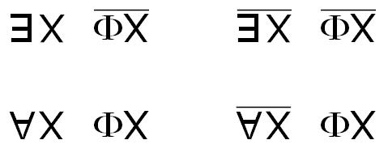

</section>

<section class="parallel-paragraph" data-paragraph-ids="s22-08-0201">

s22-08-0201

[无对应译文]

原文 · s22-08-0201

Mais le fait qu’il n’*ex-siste* pas « *La femme* », la femme « *toute* », n’implique pas, contrairement à la logique aristotélicienne, qu’il y en ait qui ordonnent la castration. « *Gardez ceci qui est le plus aimé* » qu’elles disent dans Rabelais.

</section>

<section class="parallel-paragraph" data-paragraph-ids="s22-08-0202">

s22-08-0202

[无对应译文]

原文 · s22-08-0202

Naturellement ça ressort du comique, comme je vous le disais tout à l’heure.

</section>

<section class="parallel-paragraph" data-paragraph-ids="s22-08-0203">

s22-08-0203

[无对应译文]

原文 · s22-08-0203

Ce néanmoins « *pas-toute* » ça ne veut pas dire qu’aucune dise le contrai­re : qu’il existe un X de *La* femme qui formule le « *ne le gardez pas* ».

</section>

<section class="parallel-paragraph" data-paragraph-ids="s22-08-0204">

s22-08-0204

[无对应译文]

原文 · s22-08-0204

*Très peu pour elles le dire que non : elles ne disent rien simplement*.

</section>

<section class="parallel-paragraph" data-paragraph-ids="s22-08-0205">

s22-08-0205

[无对应译文]

原文 · s22-08-0205

Elles ne disent rien, sinon en tant que « *la-toute* », dont j’ai dit que c’était Dieu tout à l’heure, « *la-toute* »... si elle existait.

</section>

<section class="parallel-paragraph" data-paragraph-ids="s22-08-0206">

s22-08-0206

[无对应译文]

原文 · s22-08-0206

Il n’y en a pas pour porter la castration pour l’Autre, et ceci est au point que *le phallus* tel que je l’ai indiqué tout à l’heure, ça n’empêche pas qu’elle se le voudrait, comme on dit.

</section>

<section class="parallel-paragraph" data-paragraph-ids="s22-08-0207">

s22-08-0207

[无对应译文]

原文 · s22-08-0207

Rien de plus *phallogocentrique*...

</section>

<section class="parallel-paragraph" data-paragraph-ids="s22-08-0208">

s22-08-0208

[无对应译文]

原文 · s22-08-0208

> comme on l’a écrit quelque part à mon propos ...rien de plus *phallogocentrique* qu’une femme, à ceci près qu’*aucune* « *ne-toute le veut* », ledit *phallus*.

</section>

<section class="parallel-paragraph" data-paragraph-ids="s22-08-0209">

s22-08-0209

[无对应译文]

原文 · s22-08-0209

Elles en veulent bien *chacune*, à ceci près que ça ne leur pèse pas trop lourd.

</section>

<section class="parallel-paragraph" data-paragraph-ids="s22-08-0210">

s22-08-0210

[无对应译文]

原文 · s22-08-0210

C’est tout à fait comme ce que j’ai mis en valeur dans le rêve dit de « *la belle bouchère* » : le saumon fumé, comme vous savez, elle en veut bien à condition de ne pas en servir.

</section>

<section class="parallel-paragraph" data-paragraph-ids="s22-08-0211">

s22-08-0211

[无对应译文]

原文 · s22-08-0211

Elle ne le donne qu’autant qu’elle ne l’a pas. C’est ce qu’on appelle l’amour.

</section>

<section class="parallel-paragraph" data-paragraph-ids="s22-08-0212">

s22-08-0212

[无对应译文]

原文 · s22-08-0212

C’est même la définition que j’en ai donné : donner ce qu’on n’a pas, c’est l’amour.

</section>

<section class="parallel-paragraph" data-paragraph-ids="s22-08-0213">

s22-08-0213

[无对应译文]

原文 · s22-08-0213

C’est l’amour des femmes pour autant, c’est-à-dire que c’est vrai que - une par une - elles *ex-sistent*.

</section>

<section class="parallel-paragraph" data-paragraph-ids="s22-08-0214">

s22-08-0214

[无对应译文]

原文 · s22-08-0214

Elles sont *réelles* et même terri­blement, elles ne sont même que ça, *elles ne consistent qu’en tant que le Symbolique ex-siste*, *c’est-à-dire* ce que je disais tout à l’heure : *l’incons­cient.*

</section>

<section class="parallel-paragraph" data-paragraph-ids="s22-08-0215">

s22-08-0215

[无对应译文]

原文 · s22-08-0215

C’est bien en quoi elles *ex-sistent* comme *symptôme*, dont cet inconscient provoque la *consistance*, ceci apparemment dans le champ mis à plat du *Réel*.

</section>

<section class="parallel-paragraph" data-paragraph-ids="s22-08-0216">

s22-08-0216

[无对应译文]

原文 · s22-08-0216

C’est ce qu’il faut appeler *« réellement », ce qui veut dire*...

</section>

<section class="parallel-paragraph" data-paragraph-ids="s22-08-0217">

s22-08-0217

[无对应译文]

原文 · s22-08-0217

> on ne fait pas assez attention à cette distinction de l’adverbe et de l’ad­jectif ...*à la façon du Réel, mais en réalité à la façon dont s’imagine dans le Réel*...

</section>

<section class="parallel-paragraph" data-paragraph-ids="s22-08-0218">

s22-08-0218

[无对应译文]

原文 · s22-08-0218

> je n’ai pas besoin de refaire le schéma, je pense ...*dont s’imagine dans le Réel l’effet du Symbolique*.

</section>

<section class="parallel-paragraph" data-paragraph-ids="s22-08-0219">

s22-08-0219

[无对应译文]

原文 · s22-08-0219

Ce qu’il faut quand même que je dessine - ouais - Voilà !

</section>

<section class="parallel-paragraph" data-paragraph-ids="s22-08-0220">

s22-08-0220

[无对应译文]

原文 · s22-08-0220

Voilà le *symptôme*, l’effet du *Symbolique*, en tant qu’il apparaît dans le *Réel*, et même c’est dans cette direction là :

</section>

<section class="parallel-paragraph" data-paragraph-ids="s22-08-0221">

s22-08-0221

[无对应译文]

原文 · s22-08-0221

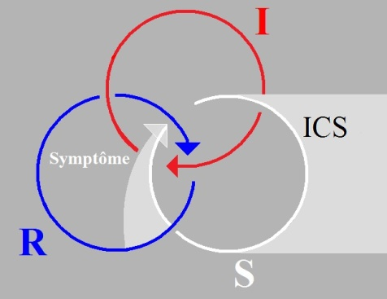

</section>

<section class="parallel-paragraph" data-paragraph-ids="s22-08-0222">

s22-08-0222

[无对应译文]

原文 · s22-08-0222

Je m’excuse auprès de Soury qui m’a envoyé un très beau petit sché­ma concernant le nœud borroméen dont je n’aurai pas le temps de par­ler aujourd’hui. Je vais quand même lui indiquer quelque chose : c’est que ces deux schémas qu’il m’envoie, justement comportent une orienta­tion, une direction.

</section>

<section class="parallel-paragraph" data-paragraph-ids="s22-08-0223">

s22-08-0223

[无对应译文]

原文 · s22-08-0223

En d’autres termes, que ces trois éléments essentiels du nœud borroméen sont orientés d’une façon, si je puis dire, *centrifu­ge*. À quoi il m’oppose la forme contraire, celle où les trois sont...

</section>

<section class="parallel-paragraph" data-paragraph-ids="s22-08-0224">

s22-08-0224

[无对应译文]

原文 · s22-08-0224

> j’ai dit tout à l’heure *centrifu­ge* ? C’est un lapsus : *centripètes !* ...à quoi il m’oppo­se la forme *centrifu­ge*.

</section>

<section class="parallel-paragraph" data-paragraph-ids="s22-08-0225">

s22-08-0225

[无对应译文]

原文 · s22-08-0225

Je lui fais remarquer ceci, comme ça au passage, c’est qu’à ne pas identifier, c’est-à-dire colorier ces trois ronds, à ne pas spécifier lequel est le *Symbolique*, lequel est le *Réel*, ces nœuds, bien loin d’être intransformables l’un dans l’autre, ne sont que *le même*, vu d’un autre côté. Je dois y ajouter ceci : que si vous faites de ceci le *Réel*, à prendre les choses de l’autre côté, le *Réel* et le *Symbolique* sont inversés, ce qui n’est pas prévu dans son schéma.

</section>

<section class="parallel-paragraph" data-paragraph-ids="s22-08-0226">

s22-08-0226

[无对应译文]

原文 · s22-08-0226

Et ce qui laisse pourtant intac­te la question de savoir...

</section>

<section class="parallel-paragraph" data-paragraph-ids="s22-08-0227">

s22-08-0227

[无对应译文]

原文 · s22-08-0227

> celle que j’ai posée tout à l’heure ...s’il est indiffé­rent que dans cette forme...

</section>

<section class="parallel-paragraph" data-paragraph-ids="s22-08-0228">

s22-08-0228

[无对应译文]

原文 · s22-08-0228

> cette forme non mise à plat ...que dans cette forme l’ordre *ex-siste* ou n’*ex-siste pas*.

</section>

<section class="parallel-paragraph" data-paragraph-ids="s22-08-0229">

s22-08-0229

[无对应译文]

原文 · s22-08-0229

Je me permets de lui signaler qu’il y a distinction entre l’ordre des trois termes, l’orienta­tion donnée à chacun, et l’équivalence des nœuds.

</section>

<section class="parallel-paragraph" data-paragraph-ids="s22-08-0230">

s22-08-0230

[无对应译文]

原文 · s22-08-0230

Ceci dit, je poursuis et je fais remarquer que l’idée de suppléer à « *La* *femme* » irréelle, ce n’est pas pour rien que *les imbéciles de « L’amour fou »* s’intitulaient eux-mêmes *surréalistes* : ils étaient eux-mêmes, je dois dire*, symptômes* de l’après-guerre de 14, à ceci près que *symp­tômes sociaux*.

</section>

<section class="parallel-paragraph" data-paragraph-ids="s22-08-0231">

s22-08-0231

[无对应译文]

原文 · s22-08-0231

Mais il n’est pas non plus dit que ce qui est social ne soit pas lié à *un nœud de ressemblance*.

</section>

<section class="parallel-paragraph" data-paragraph-ids="s22-08-0232">

s22-08-0232

[无对应译文]

原文 · s22-08-0232

Leur idée donc de suppléer à *La* femme qui *n’ex-siste* pas comme « *La* » ...

</section>

<section class="parallel-paragraph" data-paragraph-ids="s22-08-0233">

s22-08-0233

[无对应译文]

原文 · s22-08-0233

> à *La* femme dont j’ai dit que c’était bien là le type même de l’*errance* ...les remettait dans le biais, dans l’ornière du *Nom-du-Père*, du *Père* en tant que *nommant*, dont j’ai dit que c’était un truc émergé de la Bible, mais dont j’ajoute que c’est pour l’homme une façon de tirer son épingle phallique du jeu.

</section>

<section class="parallel-paragraph" data-paragraph-ids="s22-08-0234">

s22-08-0234

[无对应译文]

原文 · s22-08-0234

Qu’un Dieu - mon Dieu ! - aussi tribal que les autres, mais peut-être employé avec une plus grande pureté de moyens, n’empêche pas ceci qu’il nous faut toucher du soupèsement, de la façon même de jouer de ce nœud : c’est que ce Dieu tribal, qu’il soit celui-là ou bien un autre, n’est que le complément bien inutile...

</section>

<section class="parallel-paragraph" data-paragraph-ids="s22-08-0235">

s22-08-0235

[无对应译文]

原文 · s22-08-0235

> c’est ça que j’exprime de la conjugaison de ce nœud 4 au *Symbolique* ...c’est le com­plément bien inutile du fait que c’est le signifiant *Un*...

</section>

<section class="parallel-paragraph" data-paragraph-ids="s22-08-0236">

s22-08-0236

[无对应译文]

原文 · s22-08-0236

> et sans trou dont il soit permis de se servir dans le nœud borroméen ...qui, à un corps d’homme asexué par soi - Freud le souligne - donne le partenaire qui lui manque.

</section>

<section class="parallel-paragraph" data-paragraph-ids="s22-08-0237">

s22-08-0237

[无对应译文]

原文 · s22-08-0237

Qui lui manque comment ?

</section>

<section class="parallel-paragraph" data-paragraph-ids="s22-08-0238">

s22-08-0238

[无对应译文]

原文 · s22-08-0238

Du fait qu’il est, si je puis dire « aphligé » - à écrire comme ça – « aphligé » réellement d’un *phallus* qui est ce qui lui barre la jouissance du corps de l’Autre. Il lui faudrait *un Autre de l’Autre*

</section>

<section class="parallel-paragraph" data-paragraph-ids="s22-08-0239">

s22-08-0239

[无对应译文]

原文 · s22-08-0239

- pour que le corps de l’Autre ne soit pas pour le sien du semblant,

</section>

<section class="parallel-paragraph" data-paragraph-ids="s22-08-0240">

s22-08-0240

[无对应译文]

原文 · s22-08-0240

- pour que il ne soit pas si différent des animaux, que de ne pou­voir, comme tous les animaux sexués, faire de la femelle le Dieu de sa vie.

</section>

<section class="parallel-paragraph" data-paragraph-ids="s22-08-0241">

s22-08-0241

[无对应译文]

原文 · s22-08-0241

Il y a pour le mental de l’homme, c’est-à-dire l’*Imaginaire*, l’aphliction du *Réel* phallique à cause de quoi il se sait n’être que *semblant* de pouvoir.

</section>

<section class="parallel-paragraph" data-paragraph-ids="s22-08-0242">

s22-08-0242

[无对应译文]

原文 · s22-08-0242

Le *Réel* c’est le « *sens en blanc* », autrement dit : *le sens blanc par quoi le corps fait semblant*.

</section>

<section class="parallel-paragraph" data-paragraph-ids="s22-08-0243">

s22-08-0243

[无对应译文]

原文 · s22-08-0243

*Semblant* dont se fonde tout discours, au premier rang le discours du maître qui du *phallus* fait signifiant indice 1 \[**S1**\].

</section>

<section class="parallel-paragraph" data-paragraph-ids="s22-08-0244">

s22-08-0244

[无对应译文]

原文 · s22-08-0244

Ce qui n’em­pêche pas que si dans l’inconscient il n’y avait pas une foule de signi­fiants à copuler entre eux, à s’indexer de foisonner deux par deux, il n’y aurait aucune chance que l’idée d’un sujet, d’un *pathème du phallus* dont le signifiant c’est l’*Un* qui le divise essentiellement, vienne au jour.

</section>

<section class="parallel-paragraph" data-paragraph-ids="s22-08-0245">

s22-08-0245

[无对应译文]

原文 · s22-08-0245

Grâce à quoi il s’aperçoit qu’il y a du *savoir inconscient*, c’est-à-dire de la copulation inconsciente.

</section>

<section class="parallel-paragraph" data-paragraph-ids="s22-08-0246">

s22-08-0246

[无对应译文]

原文 · s22-08-0246

D’où l’idée folle de ce savoir en faire *semblant* à son tour, par rapport à quel partenaire, sinon le produit de ce qui se produit d’une copulation aveugle, c’est le cas de le dire, car seuls les signifiants copulent entre eux dans l’inconscient, mais les *sujets pathé­matiques* qui en résultent sous forme de corps sont conduits - mon Dieu - à en faire autant, « *baiser* » qu’ils appellent ça.

</section>

<section class="parallel-paragraph" data-paragraph-ids="s22-08-0247">

s22-08-0247

[无对应译文]

原文 · s22-08-0247

C’est pas une mauvaise for­mule.

</section>

<section class="parallel-paragraph" data-paragraph-ids="s22-08-0248">

s22-08-0248

[无对应译文]

原文 · s22-08-0248

Car quelque chose les avertit qu’ils ne peuvent faire mieux que de suçoter le corps signifié autre...

</section>

<section class="parallel-paragraph" data-paragraph-ids="s22-08-0249">

s22-08-0249

[无对应译文]

原文 · s22-08-0249

> autre seulement par quelque écrit d’état civil ...pour en *jouir*, ce qui s’appellerait en *jouir* comme tel, il faudrait le mettre en morceaux, hein ?

</section>

<section class="parallel-paragraph" data-paragraph-ids="s22-08-0250">

s22-08-0250

[无对应译文]

原文 · s22-08-0250

Non pas qu’il y ait pas pour cela chez l’autre corps des dispositions, comme ça, d’être né prématuré, c’est pas incon­cevable. Le concept là, ne manque pas. On appelle ça *le sado-masochis­me*, je sais pas pourquoi.

</section>

<section class="parallel-paragraph" data-paragraph-ids="s22-08-0251">

s22-08-0251

[无对应译文]

原文 · s22-08-0251

Mais ça ne peut que se rêver, *de l’inconscient*, naturellement puisque c’est la voie dont il faut dire que *c’est paumé de la dire royale.* « Roi » : un nom de plus dans l’*affaire* et dont chacun sait que ça rejaillit toujours de l’*affaire* du *Nom-du-Père*.

</section>

<section class="parallel-paragraph" data-paragraph-ids="s22-08-0252">

s22-08-0252

[无对应译文]

原文 · s22-08-0252

Mais c’est un nom à perdre comme les autres, à laisser tomber dans sa perpétuité.

</section>

<section class="parallel-paragraph" data-paragraph-ids="s22-08-0253">

s22-08-0253

[无对应译文]

原文 · s22-08-0253

Les *Noms-du-Père* - *Les Ânons du Père*, quel troupeau j’en aurais pré­paré pour lui faire, ou leur faire rentrer dans la gorge leur braiment si j’avais fait mon séminaire, j’aurais « *uni* » - mot qui vient de *une  *femme - quelque *ânerie* nouvelle.

</section>

<section class="parallel-paragraph" data-paragraph-ids="s22-08-0254">

s22-08-0254

[无对应译文]

原文 · s22-08-0254

C’est pourquoi *ces* « *ânes-à-liste* »...

</section>

<section class="parallel-paragraph" data-paragraph-ids="s22-08-0255">

s22-08-0255

[无对应译文]

原文 · s22-08-0255

> à liste d’atten­te bien entendu ...faisaient la queue aux portes de l’*Interfamiliale Analytique Association,* et Anna « freudonnait » en coulisse le retour au ber­ceau en me bricolant des motions d’ordre gratinées ! Je ne suis certes pas insensible à la fatigue *d’ex-sisterre*.

</section>

<section class="parallel-paragraph" data-paragraph-ids="s22-08-0256">

s22-08-0256

[无对应译文]

原文 · s22-08-0256

Terre ! Terre ! qu’on croit toujours atteindre enfin. Je n’ai depuis que persévéré dans mon erre : « *Laurent, serrez mon haire avec ma discipline* »[^23] car celle-ci en bénéficie.

</section>

<section class="parallel-paragraph" data-paragraph-ids="s22-08-0257">

s22-08-0257

[无对应译文]

原文 · s22-08-0257

\[*Aplaudissements* \]

</section>

<section class="note-block original-notes">

## Notes

[^17]: Cf. séminaire 1957-58 : « *Les formations de l’inconscient* », Le Seuil, 1998.

[^18]: Aristophane : [Lysistrata](http://remacle.org/bloodwolf/comediens/Aristophane/Lysistrata.htm). En 411 avant J.-C., dans *Lysistrata* (littéralement « *celle qui dissout les armées* »), Aristophane a imaginé pour les femmes

    un mot d’ordre efficace : « *Pour arrêter la guerre, refusez-vous à vos maris*. ».

[^19]: Gottlob Frege : *Sens et dénotation* in *Écrits logiques et philosophiques*, Seuil, 1971, ou Points Seuil 1994 (pp. 102-126).

[^20]: Saul A. Kripke : *Naming and necessity*, Harvard Press. Sur la base des conférences données à Princeton en 1970.

[^21]: *Être entre le zist et le zest* : se dit d’une personne indécise, incertaine, ou d’une chose qui n’est ni bonne ni mauvaise.

[^22]: Aristote, pour étudier les animaux alla jusqu’à en adopter la posture : « *il se mit à quatre pattes et promena sur son dos une très légère demoiselle*… ».

    Cf. Aristote : *Histoire des animaux, Les parties des animaux, Le mouvement des animaux, La progression des animaux, La génération des animaux.*

[^23]: Cf. Molière : *Tartuffe, ou l'imposteur* (1664), III, 2 : Tartuffe (apercevant Dorine)

    « *Laurent, serrez ma haire avec ma discipline,*

    *Et priez que toujours le Ciel vous illumine.*

    *Si l’on vient pour me voir, je vais - aux prisonniers,*

    *Des aumônes que j’ai - partager les deniers.* »

    Haire : nom féminin, petite chemise de crin ou de poil de chèvre, portée à même la peau par esprit de mortification et de pénitence.

</section>
