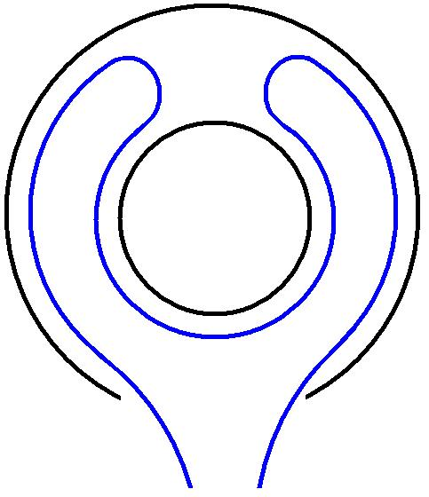
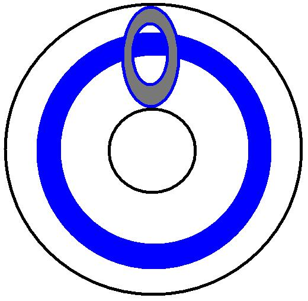
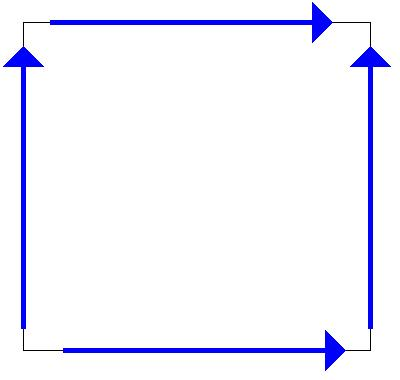
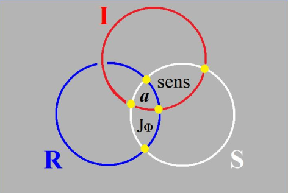
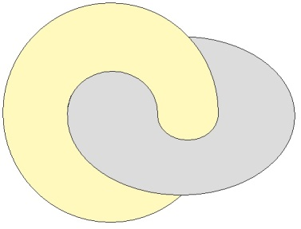
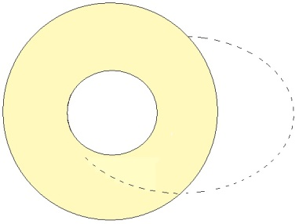

# Leçon 09 | 18 Mars 1975

  <label><input type="checkbox" data-lacan-toggle="original" checked> 原文</label>
  <label><input type="checkbox" data-lacan-toggle="notes" checked> 注释</label>
  <label><input type="checkbox" data-lacan-toggle="commentary" checked> 个人解读评论</label>

<section class="parallel-paragraph" data-paragraph-ids="s22-09-0001">

s22-09-0001

[无对应译文]

原文 · s22-09-0001

Lacan

</section>

<section class="parallel-paragraph" data-paragraph-ids="s22-09-0002">

s22-09-0002

[无对应译文]

原文 · s22-09-0002

Soury, où êtes-vous ? Bon, alors vous avez distribué. J’ai vu, hein ! Bon, vous en avez distribués combien ?

</section>

<section class="parallel-paragraph" data-paragraph-ids="s22-09-0003">

s22-09-0003

[无对应译文]

原文 · s22-09-0003

Pierre Soury - Il y a trois textes en cent cinquante exemplaires chacun.

</section>

<section class="parallel-paragraph" data-paragraph-ids="s22-09-0004">

s22-09-0004

[无对应译文]

原文 · s22-09-0004

Lacan – Comment ?

</section>

<section class="parallel-paragraph" data-paragraph-ids="s22-09-0005">

s22-09-0005

[无对应译文]

原文 · s22-09-0005

Pierre Soury - Il y a 3 textes en 150 exemplaires chacun.

</section>

<section class="parallel-paragraph" data-paragraph-ids="s22-09-0006">

s22-09-0006

[无对应译文]

原文 · s22-09-0006

Lacan

</section>

<section class="parallel-paragraph" data-paragraph-ids="s22-09-0007">

s22-09-0007

[无对应译文]

原文 · s22-09-0007

– Ouais... Alors personne n’en a ! \[*Rires*\] C’est bien ennuyeux ! Vous m’aviez dit que vous en feriez... distribueriez 500 ?

</section>

<section class="parallel-paragraph" data-paragraph-ids="s22-09-0008">

s22-09-0008

[无对应译文]

原文 · s22-09-0008

Pierre Soury - On peut en amener d’autres la prochaine fois, mais là on en a amené que cent cinquante.

</section>

<section class="parallel-paragraph" data-paragraph-ids="s22-09-0009">

s22-09-0009

[无对应译文]

原文 · s22-09-0009

Lacan

</section>

<section class="parallel-paragraph" data-paragraph-ids="s22-09-0010">

s22-09-0010

[无对应译文]

原文 · s22-09-0010

Oui, non mais c’est très gentil déjà de votre part, c’est pas un reproche que je vous fais, c’est très gentil déjà de votre part, seulement, il y en a à qui ça va manquer. Ça va leur manquer d’ailleurs uniquement parce que les autres l’ont ! \[*Rires*\]

</section>

<section class="parallel-paragraph" data-paragraph-ids="s22-09-0011">

s22-09-0011

[无对应译文]

原文 · s22-09-0011

Bon, alors je suis forcé de dire, pour ceux qui ne l’ont pas, ce qu’il y a dans ces papiers que Pierre Soury et Michel Thomé ont distribués. Il y a ce quelque chose dont vous avez vu la dernière fois, je ne peux pas dire l’explication, parce que justement je ne l’ai pas expliqué vraiment ce dessin, ce dessin qui...

</section>

<section class="parallel-paragraph" data-paragraph-ids="s22-09-0012">

s22-09-0012

[无对应译文]

原文 · s22-09-0012

> me semble-t-il, pour autant que j’en sache quelque chose ...qui est une trouvaille que Michel Thomé a fait sur une certaine « *figure VI* », qui est quelque part dans le dernier séminaire, celui qui s’appelle, qui est intitulé « *Encore »,* il a fait là la trouvaille d’une erreur, d’une erreur dans ce dessin.

</section>

<section class="parallel-paragraph" data-paragraph-ids="s22-09-0013">

s22-09-0013

[无对应译文]

原文 · s22-09-0013

Je présume - je peux pas en dire plus - je présume que c’est une erreur heureuse...

</section>

<section class="parallel-paragraph" data-paragraph-ids="s22-09-0014">

s22-09-0014

[无对应译文]

原文 · s22-09-0014

> *felix culpa,* comme on dit ...c’est une erreur heureuse si c’est à l’occasion de cette erreur que Michel Thomé - mais peut-être l’avait-il inventé tout seul - inventé tout seul ceci que j’ai indiqué la dernière fois, dans un de ces papiers que j’ai fait coller au tableau et qui démontre qu’il y a en somme, qu’il est possible de figu­rer...

</section>

<section class="parallel-paragraph" data-paragraph-ids="s22-09-0015">

s22-09-0015

[无对应译文]

原文 · s22-09-0015

> je ne dis pas *écrire* ...de figurer des nœuds borroméens tels...

</section>

<section class="parallel-paragraph" data-paragraph-ids="s22-09-0016">

s22-09-0016

[无对应译文]

原文 · s22-09-0016

> disons les choses rapidement ...qu’ils ne se défassent que par un bout, qu’à partir d’un bout.

</section>

<section class="parallel-paragraph" data-paragraph-ids="s22-09-0017">

s22-09-0017

[无对应译文]

原文 · s22-09-0017

Que si - c’est pas facile - que si on attaque donc un quelconque des ronds de ficelle qui sont noués d’une certaine façon, précisément d’une façon non borroméenne, puisque si elle était borroméenne, il suffirait de rompre un quelconque pour que tous les autres soient immédiatement indépendants les uns des autres, alors que la définition de ces nœuds, de ces nœuds tels qu’ils ne se défas­sent que par un bout, ça signifie qu’à attaquer n’importe lequel, ce n’est que dans un sens, et pas dans l’autre, que tous se dénouent.

</section>

<section class="parallel-paragraph" data-paragraph-ids="s22-09-0018">

s22-09-0018

[无对应译文]

原文 · s22-09-0018

Mais dans le sens où tous se dénouent, c’est *un par un* et non pas immédiatement qu’il convient de les dénouer.

</section>

<section class="parallel-paragraph" data-paragraph-ids="s22-09-0019">

s22-09-0019

[无对应译文]

原文 · s22-09-0019

Je ne sais pas si c’est à l’occasion de cette *erreur*, ou de son cru, que Michel Thomé a fait ce que j’appelais tout l’heure cette *trouvaille*. Il est peut-être là, alors qu’il le dise ! Il est là ? Vous l’avez faite à l’occasion de l’*erreur*, la *trouvaille* ?

</section>

<section class="parallel-paragraph" data-paragraph-ids="s22-09-0020">

s22-09-0020

[无对应译文]

原文 · s22-09-0020

C’est à l’oc­casion de l’erreur ? C’est bien ce que je dis, c’est une *heureuse erreur* !

</section>

<section class="parallel-paragraph" data-paragraph-ids="s22-09-0021">

s22-09-0021

[无对应译文]

原文 · s22-09-0021

Mais ceci prouve à tout le moins ceci, c’est que...

</section>

<section class="parallel-paragraph" data-paragraph-ids="s22-09-0022">

s22-09-0022

[无对应译文]

原文 · s22-09-0022

> je dois dire ma surprise parce que je n’en ai pas tous les jours des preuves ...je ne parle pas absolument sans effet.

</section>

<section class="parallel-paragraph" data-paragraph-ids="s22-09-0023">

s22-09-0023

[无对应译文]

原文 · s22-09-0023

Vous me direz que ces effets, je ne peux pas les mesurer puisque on ne m’en donne pas *trace*.

</section>

<section class="parallel-paragraph" data-paragraph-ids="s22-09-0024">

s22-09-0024

[无对应译文]

原文 · s22-09-0024

Mais enfin, justement, c’est ce dont je sais gré à ce couple d’amis, Soury et Thomé, c’est de m’en donner *trace*, c’est encourageant quand même ! J’aimerais bien en avoir de temps en temps *quelque autre trace* !

</section>

<section class="parallel-paragraph" data-paragraph-ids="s22-09-0025">

s22-09-0025

[无对应译文]

原文 · s22-09-0025

Il faut dire que on y regarde à deux fois avant de me les donner, non sans raison d’ailleurs, parce qu’il se pourrait très bien que les *traces* que j’en recueille soient pas aussi solides, soient pas aussi *faites nœuds*.

</section>

<section class="parallel-paragraph" data-paragraph-ids="s22-09-0026">

s22-09-0026

[无对应译文]

原文 · s22-09-0026

Ça donne évidemment une idée que ces nœuds, c’est quelque chose d’assez *original*, dirai-je, avec l’ambiguïté peut-être, je n’en suis pas sûr, de l’*originel*. Ce qu’ils confirmeraient, ça serait que ce n’est pas tellement facile d’y remonter, et puis ça ne veut pas dire - l’originel - que ça soit de ça qu’on parte.

</section>

<section class="parallel-paragraph" data-paragraph-ids="s22-09-0027">

s22-09-0027

[无对应译文]

原文 · s22-09-0027

Il est même tout à fait sûr qu’historiquement, ben disons : ça ne se trouve pas sous le pied d’un cheval, le nœud borro­méen !

</section>

<section class="parallel-paragraph" data-paragraph-ids="s22-09-0028">

s22-09-0028

[无对应译文]

原文 · s22-09-0028

On s’y est intéressé très tard. Disons que...

</section>

<section class="parallel-paragraph" data-paragraph-ids="s22-09-0029">

s22-09-0029

[无对应译文]

原文 · s22-09-0029

> si tant est que j’ai l’ombre d’un mérite, je sais pas ce que ça veut dire d’ailleurs « méri­te » ...c’est que quand j’ai eu vent de ce truc, le nœud borroméen...

</section>

<section class="parallel-paragraph" data-paragraph-ids="s22-09-0030">

s22-09-0030

[无对应译文]

原文 · s22-09-0030

> j’ai trouvé ça dans les notes d’une personne que je rencontre de temps en temps
>
> et qui l’avait recueilli en notes au séminaire de Guilbaud ...il y a une chose certaine, c’est que j’ai eu immédiatement la certitude que c’était là quelque chose de précieux pour moi, pour ce que j’avais à expliquer.

</section>

<section class="parallel-paragraph" data-paragraph-ids="s22-09-0031">

s22-09-0031

[无对应译文]

原文 · s22-09-0031

J’ai immédiatement fait le rapport de ce nœud borroméen avec ce qui dès lors, m’apparaissait comme des *ronds de ficelle*.

</section>

<section class="parallel-paragraph" data-paragraph-ids="s22-09-0032">

s22-09-0032

[无对应译文]

原文 · s22-09-0032

Quelque chose de pourvu d’une *consistance* particulière, qui reste à appuyer et qui était pour moi reconnaissable dans ce que j’avais énoncé dès le départ de mon enseignement.

</section>

<section class="parallel-paragraph" data-paragraph-ids="s22-09-0033">

s22-09-0033

[无对应译文]

原文 · s22-09-0033

Lequel sans doute je n’aurais pas émis...

</section>

<section class="parallel-paragraph" data-paragraph-ids="s22-09-0034">

s22-09-0034

[无对应译文]

原文 · s22-09-0034

> y étant peu porté de nature ...sans un appel, un appel lié d’une façon plus ou moins contingen­te à, disons une crise dans le discours analytique.

</section>

<section class="parallel-paragraph" data-paragraph-ids="s22-09-0035">

s22-09-0035

[无对应译文]

原文 · s22-09-0035

Il est possible qu’avec le temps, je me serai aperçu qu’il fallait quand même, cette crise, la dénouer, mais il a fallu des circonstances pour que je passe à l’acte.

</section>

<section class="parallel-paragraph" data-paragraph-ids="s22-09-0036">

s22-09-0036

[无对应译文]

原文 · s22-09-0036

Donc ces nœuds borroméens me sont venus comme bague au doigt, et j’ai tout de suite su que ça avait un rapport qui mettait *le Symbolique, l’Imaginaire et le Réel* dans une certaine position les uns par rapport aux autres, dont le nœud m’incitait à énoncer quelque chose, qui – comme je l’ai dit déjà ici – les homogénéisait.

</section>

<section class="parallel-paragraph" data-paragraph-ids="s22-09-0037">

s22-09-0037

[无对应译文]

原文 · s22-09-0037

Qu’est-ce que veut dire « *homogénéiser* » ?

</section>

<section class="parallel-paragraph" data-paragraph-ids="s22-09-0038">

s22-09-0038

[无对应译文]

原文 · s22-09-0038

C’est évidemment, comme le remarquait précédemment Pierre Soury dans une petite note qu’il m’a communiquée...

</section>

<section class="parallel-paragraph" data-paragraph-ids="s22-09-0039">

s22-09-0039

[无对应译文]

原文 · s22-09-0039

> parce que je tiens beaucoup rendre à chacun son dû ...qu’ils ont quelque chose de *pareil*.

</section>

<section class="parallel-paragraph" data-paragraph-ids="s22-09-0040">

s22-09-0040

[无对应译文]

原文 · s22-09-0040

Comme le même Pierre Soury me fai­sait remarquer :

</section>

<section class="parallel-paragraph" data-paragraph-ids="s22-09-0041">

s22-09-0041

[无对应译文]

原文 · s22-09-0041

> « *du pareil au même, il y a la place pour une différence* »

</section>

<section class="parallel-paragraph" data-paragraph-ids="s22-09-0042">

s22-09-0042

[无对应译文]

原文 · s22-09-0042

Mais mettre l’accent sur le *pareil*, c’est très précisément en ça que consiste *l’homogénéisation*, la poussée en avant de l’ὅμοιος \[omoïos\] qui n’est pas « *le même* », qui est « *le pareil* ».

</section>

<section class="parallel-paragraph" data-paragraph-ids="s22-09-0043">

s22-09-0043

[无对应译文]

原文 · s22-09-0043

Qu’est-ce qu’ils ont de « *pareil* » ?

</section>

<section class="parallel-paragraph" data-paragraph-ids="s22-09-0044">

s22-09-0044

[无对应译文]

原文 · s22-09-0044

Eh bien, c’est ce que je crois devoir désigner du terme de « *consistance »*, ce qui est déjà avancer quelque chose d’incroyable !

</section>

<section class="parallel-paragraph" data-paragraph-ids="s22-09-0045">

s22-09-0045

[无对应译文]

原文 · s22-09-0045

Qu’est-ce que la *consistance de l’Imaginaire*, celle du *Symbolique,* et celle du *Réel* peuvent avoir de commun ?

</section>

<section class="parallel-paragraph" data-paragraph-ids="s22-09-0046">

s22-09-0046

[无对应译文]

原文 · s22-09-0046

Est-ce que par ce mode, cet énoncé, je vous rend sensible...

</section>

<section class="parallel-paragraph" data-paragraph-ids="s22-09-0047">

s22-09-0047

[无对应译文]

原文 · s22-09-0047

> il me semble que c’est diffi­cile de vous le rendre plus sensible ...que le terme de « *consistance »* dès lors ressortit à *l’Imaginaire ?*

</section>

<section class="parallel-paragraph" data-paragraph-ids="s22-09-0048">

s22-09-0048

[无对应译文]

原文 · s22-09-0048

Ici je m’arrête pour faire une parenthèse destinée à vous mon­trer que le nœud, c’est pas facile de le figurer.

</section>

<section class="parallel-paragraph" data-paragraph-ids="s22-09-0049">

s22-09-0049

[无对应译文]

原文 · s22-09-0049

Je ne dis pas de *se* le figu­rer, parce que dans l’affaire j’élimine tout à fait le sujet qui se le figure, puisque je pars de la thèse que *le sujet* c’est ce qui est déterminé par la figure en question, déterminé, non pas d’aucune façon qu’il en soit le double, mais que c’est des coincements du *nœud*, de ce qui dans le *nœud* détermine des points triples, du fait du serrage du nœud, que le sujet se conditionne.

</section>

<section class="parallel-paragraph" data-paragraph-ids="s22-09-0050">

s22-09-0050

[无对应译文]

原文 · s22-09-0050

Je vais peut-être tout à l’heure vous le rappeler sous forme de dessin au tableau.

</section>

<section class="parallel-paragraph" data-paragraph-ids="s22-09-0051">

s22-09-0051

[无对应译文]

原文 · s22-09-0051

Quoi qu’il en soit, le *figurer* ce nœud, n’est pas commode.

</section>

<section class="parallel-paragraph" data-paragraph-ids="s22-09-0052">

s22-09-0052

[无对应译文]

原文 · s22-09-0052

Je vous en ai donné déjà des preuves en cafouillant plus ou moins moi-même à tel ou tel petit dessin que j’ai fait.

</section>

<section class="parallel-paragraph" data-paragraph-ids="s22-09-0053">

s22-09-0053

[无对应译文]

原文 · s22-09-0053

Quoi qu’il en soit, le dernier épisode de mes rapports avec le nommé Pierre Soury consiste - c’est bien le cas de le dire - en ceci qui est certainement bien étrange : c’est qu’après avoir accédé une première fois à ce qu’il avait avancé, avancé à très juste titre, à savoir qu’il y avait dans *le Réel* du nœud borroméen, un *Réel* auquel vous ajoutez ceci : que chacun des ronds vous l’orientez. L’orienter, c’est une affaire qui semble ne concerner que chacun des ronds.

</section>

<section class="parallel-paragraph" data-paragraph-ids="s22-09-0054">

s22-09-0054

[无对应译文]

原文 · s22-09-0054

Il y aurait une autre façon, ces ronds...

</section>

<section class="parallel-paragraph" data-paragraph-ids="s22-09-0055">

s22-09-0055

[无对应译文]

原文 · s22-09-0055

> ne disons pas de les recon­naître, car reconnaître, ça serait déjà entrer dans toutes sortes d’implica­tions ...disons de les *différencier*, ça serait de les colorier.

</section>

<section class="parallel-paragraph" data-paragraph-ids="s22-09-0056">

s22-09-0056

[无对应译文]

原文 · s22-09-0056

Vous sentez bien toute la distance qu’il y a entre le coloriage...

</section>

<section class="parallel-paragraph" data-paragraph-ids="s22-09-0057">

s22-09-0057

[无对应译文]

原文 · s22-09-0057

> et c’est là quelque chose qui devrait rentrer au niveau où Goethe a pris les choses :
>
> mais il y en a pas la moindre trace dans « *La théorie des couleurs »* ...il devrait y avoir un niveau où ce par quoi la couleur est quelque chose qui est gros de différenciation.

</section>

<section class="parallel-paragraph" data-paragraph-ids="s22-09-0058">

s22-09-0058

[无对应译文]

原文 · s22-09-0058

Évi­demment il y a une limite, à savoir qu’il n’y a pas un nombre infini de couleurs, il y a des nuances sans doute.

</section>

<section class="parallel-paragraph" data-paragraph-ids="s22-09-0059">

s22-09-0059

[无对应译文]

原文 · s22-09-0059

Mais grâce à la couleur il y a de la différence.

</section>

<section class="parallel-paragraph" data-paragraph-ids="s22-09-0060">

s22-09-0060

[无对应译文]

原文 · s22-09-0060

J’avais posé la question à un de mes précédents *séminaires* : si ces nœuds, j’en avais pris un, un peu plus compliqué que *le nœud borro­méen à* 3, non pas qu’ils ne fussent pas *trois*, mais j’avais posé la ques­tion de savoir si ce nœud n’était qu’un, à savoir si l’introduction de la différenciation dans le nœud, laissait le nœud non pas « *pareil* », mais toujours le « *même* ».

</section>

<section class="parallel-paragraph" data-paragraph-ids="s22-09-0061">

s22-09-0061

[无对应译文]

原文 · s22-09-0061

Il est effectivement *toujours le même*, mais il n’y a qu’une seule façon de *le démontrer*, c’est de démontrer que dans tous les cas...

</section>

<section class="parallel-paragraph" data-paragraph-ids="s22-09-0062">

s22-09-0062

[无对应译文]

原文 · s22-09-0062

> qu’est-ce que veut dire « *cas* » ? ...il est réductible au « pareil ».

</section>

<section class="parallel-paragraph" data-paragraph-ids="s22-09-0063">

s22-09-0063

[无对应译文]

原文 · s22-09-0063

C’est bien en effet ce qui est arrivé. C’est que j’étais en effet bien convaincu qu’il n’y a qu’un nœud colorié, mais j’ai eu un flottement - c’est ça que j’appelle « *ma dernière aventure* » - concernant le nœud orienté.

</section>

<section class="parallel-paragraph" data-paragraph-ids="s22-09-0064">

s22-09-0064

[无对应译文]

原文 · s22-09-0064

Parce qu’*orienté* ça concerne un *oui* ou un *non* pour chacun des nœuds et je me suis laissé, là, égarer par quelque chose qui tient au rap­port de chacun de ces *oui* ou *non* avec les deux autres.

</section>

<section class="parallel-paragraph" data-paragraph-ids="s22-09-0065">

s22-09-0065

[无对应译文]

原文 · s22-09-0065

Et pendant un moment, je me suis dit...

</section>

<section class="parallel-paragraph" data-paragraph-ids="s22-09-0066">

s22-09-0066

[无对应译文]

原文 · s22-09-0066

- je n’ai pas été jusqu’à me dire qu’il y avait 8 nœuds - je ne suis pas si bête ! - à savoir 2 x 2 x 2 : *(oui ou non)* x *(oui ou non)* x *(oui ou non),*

</section>

<section class="parallel-paragraph" data-paragraph-ids="s22-09-0067">

s22-09-0067

[无对应译文]

原文 · s22-09-0067

- j’ai même pas été jusqu’à penser qu’il y en avait 4 ...mais je ne sais pas pourquoi je me suis cassé la tête sur le fait qu’il y en avait 2.

</section>

<section class="parallel-paragraph" data-paragraph-ids="s22-09-0068">

s22-09-0068

[无对应译文]

原文 · s22-09-0068

Et ce n’est pas quand même quelque chose qui soit sans portée, qu’après l’avoir demandé de façon expresse, j’ai obtenu de Pierre Soury...

</section>

<section class="parallel-paragraph" data-paragraph-ids="s22-09-0069">

s22-09-0069

[无对应译文]

原文 · s22-09-0069

qui j’espère, vous en fera la dis­tribution la prochaine fois, j’ai obtenu...

</section>

<section class="parallel-paragraph" data-paragraph-ids="s22-09-0070">

s22-09-0070

[无对应译文]

原文 · s22-09-0070

vais-je dire la démonstration ?

</section>

<section class="parallel-paragraph" data-paragraph-ids="s22-09-0071">

s22-09-0071

[无对应译文]

原文 · s22-09-0071

...j’ai obtenu ce que je demandais, à savoir *la monstration* qu’il n’y a qu’un nœud bor­roméen *orienté*.

</section>

<section class="parallel-paragraph" data-paragraph-ids="s22-09-0072">

s22-09-0072

[无对应译文]

原文 · s22-09-0072

*La monstration* en question, que Pierre Soury m’a com­muniquée, et dans les délais, si je puis dire...

</section>

<section class="parallel-paragraph" data-paragraph-ids="s22-09-0073">

s22-09-0073

[无对应译文]

原文 · s22-09-0073

il n’y est pas sans mérite, il a fallu qu’il se... c’est cotonneux à démontrer ...il m’a fourni...

</section>

<section class="parallel-paragraph" data-paragraph-ids="s22-09-0074">

s22-09-0074

[无对应译文]

原文 · s22-09-0074

à temps pour que je le lise et que j’en sois bien convaincu ...*la monstration* ...

</section>

<section class="parallel-paragraph" data-paragraph-ids="s22-09-0075">

s22-09-0075

[无对应译文]

原文 · s22-09-0075

sinon la démonstration ...*la monstration* que le nœud orienté il n’y en a qu’un, bel et bien le même.

</section>

<section class="parallel-paragraph" data-paragraph-ids="s22-09-0076">

s22-09-0076

[无对应译文]

原文 · s22-09-0076

La seule chose à quoi ceci nous conduit, et là c’est lui que j’interpel­le, c’est ceci : c’est que ce « *pareil*  » qu’il réduit au « *même* », il ne peut le faire qu’à partir de ce quelque chose sur quoi j’interroge à cette occasion.

</section>

<section class="parallel-paragraph" data-paragraph-ids="s22-09-0077">

s22-09-0077

[无对应译文]

原文 · s22-09-0077

C’est à savoir, pourquoi il faut...

</section>

<section class="parallel-paragraph" data-paragraph-ids="s22-09-0078">

s22-09-0078

[无对应译文]

原文 · s22-09-0078

> pour qu’on la *figure*, cette monstration ...pour­quoi il faut en passer par ce que j’appelle, et que j’ai déjà appelé, « *la mise à plat du nœud »* ?

</section>

<section class="parallel-paragraph" data-paragraph-ids="s22-09-0079">

s22-09-0079

[无对应译文]

原文 · s22-09-0079

C’est quelque chose qui mérite d’être individualisé, cette mise à plat, parce que, comme je pense que vous l’avez déjà vu par un crayonnage qu’il a bien fallu que je fasse sur un tableau...

</section>

<section class="parallel-paragraph" data-paragraph-ids="s22-09-0080">

s22-09-0080

[无对应译文]

原文 · s22-09-0080

> c’est-à-dire *mise à plat *par un crayonnage perspectif ...vous avez bien pu voir que si ce nœud n’est pas du tout de sa nature un nœud plat - bien loin de là ! – le fait qu’il faille pas­ser par *la mise à plat* pour mettre en valeur la « *mêmeté* » du nœud, quelle que soit l’orientation que vous donnez à chacun...

</section>

<section class="parallel-paragraph" data-paragraph-ids="s22-09-0081">

s22-09-0081

[无对应译文]

原文 · s22-09-0081

> ce qui, je l’ai déjà fait sentir, indiqué, évoquerait qu’il y en aurait 8. J’ai dit : je m’y suis pas laissé prendre. Mais enfin, quand même je me suis encore empêtré à penser qu’il y en avait 2 ...cela prouve simplement *l’extraordi­naire débilité de la pensée* - au moins de la mienne - et d’une façon géné­rale que la pensée...

</section>

<section class="parallel-paragraph" data-paragraph-ids="s22-09-0082">

s22-09-0082

[无对应译文]

原文 · s22-09-0082

> celle qui procède par ce que j’ai dit tout à l’heure d’un *oui ou non* ...la pensée, il convient d’y regarder à deux fois avant d’accep­ter ce qu’il faut bien intituler du *verdict*.

</section>

<section class="parallel-paragraph" data-paragraph-ids="s22-09-0083">

s22-09-0083

[无对应译文]

原文 · s22-09-0083

Est-ce qu’il n’y a pas, si je puis dire, une sorte de *fatum* de la pensée qui, en l’attachant de trop près au vrai, *lui laisse glisser* *entre les doigts*, si je puis dire, le *Réel* ? C’est bien ce que j’ai fait surgir la dernière fois par une remarque sur le *concept* :

</section>

<section class="parallel-paragraph" data-paragraph-ids="s22-09-0084">

s22-09-0084

[无对应译文]

原文 · s22-09-0084

- en tant que ce n’est pas la même chose, le concept, que la vérité,

</section>

<section class="parallel-paragraph" data-paragraph-ids="s22-09-0085">

s22-09-0085

[无对应译文]

原文 · s22-09-0085

- en tant que le concept ça se limite à *la prise* \[*Cf. « Begriff »*\], comme le mot *capere* implique, et qu’une prise ce n’est pas suffisant pour s’assurer que c’est le *Réel* qu’on a en main. Voilà !

</section>

<section class="parallel-paragraph" data-paragraph-ids="s22-09-0086">

s22-09-0086

[无对应译文]

原文 · s22-09-0086

Ces propos que je vous tiens, que vous avez - je ne sais pas pour­quoi - la patience d’accepter, font qu’il m’est impossible de vous avertir à tout instant de ce que je fais en vous parlant.

</section>

<section class="parallel-paragraph" data-paragraph-ids="s22-09-0087">

s22-09-0087

[无对应译文]

原文 · s22-09-0087

Que je fasse quelque chose qui vous concerne, votre présence en est la preuve, mais ça ne suffit pas pour dire sous quel mode cela se passe.

</section>

<section class="parallel-paragraph" data-paragraph-ids="s22-09-0088">

s22-09-0088

[无对应译文]

原文 · s22-09-0088

Dire que vous y comprenez quelque chose n’est même pas certain, pas certain au niveau où se soutient ce que je dis.

</section>

<section class="parallel-paragraph" data-paragraph-ids="s22-09-0089">

s22-09-0089

[无对应译文]

原文 · s22-09-0089

Mais il y a quand même quelque chose qui est digne, et c’est bien pour situer ce quelque chose que je le dis sous cette *forme* : que « *on se comprend* ». Il est difficile de ne pas sentir, dans le texte même de ce qui est dit, dans le sens, que « *on se comprend* » n’a pas d’autre substrat que « *on s’embrasse* ».

</section>

<section class="parallel-paragraph" data-paragraph-ids="s22-09-0090">

s22-09-0090

[无对应译文]

原文 · s22-09-0090

Et je crois voir quand même que c’est pas là tout à fait ce que nous faisons, et qu’il y a là *une équivoque* qui, il faut le dire, comme toutes les équivoques, a une face de *saloperie*, pour appeler les choses par leur nom.

</section>

<section class="parallel-paragraph" data-paragraph-ids="s22-09-0091">

s22-09-0091

[无对应译文]

原文 · s22-09-0091

Et ce dont je m’efforce, disons que c’est de mettre un peu d’humour dans la reconnaissance de cette *saloperie comme présence*.

</section>

<section class="parallel-paragraph" data-paragraph-ids="s22-09-0092">

s22-09-0092

[无对应译文]

原文 · s22-09-0092

C’est bien ce qui donne son poids à la façon dont je tranche le nœud en énonçant ce point, dont il convient bien de préciser la portée : *qu’il n’y a pas de rapport sexuel*.

</section>

<section class="parallel-paragraph" data-paragraph-ids="s22-09-0093">

s22-09-0093

[无对应译文]

原文 · s22-09-0093

Qu’est-ce que ça veut dire, quand je le dis ?

</section>

<section class="parallel-paragraph" data-paragraph-ids="s22-09-0094">

s22-09-0094

[无对应译文]

原文 · s22-09-0094

Bien sûr, ça ne veut pas dire que le rapport sexuel il traîne pas les rues, et qu’en mettant en évidence qu’il faut tout recentrer sur ce *frotti-frotta,* ce *fricotage*, pour faire appel - à quoi ? - au *Réel*, au *Réel* du nœud, Freud n’a pas bien sûr fait un pas.

</section>

<section class="parallel-paragraph" data-paragraph-ids="s22-09-0095">

s22-09-0095

[无对应译文]

原文 · s22-09-0095

Un pas qui d’ailleurs ne consistait tout simplement qu’à s’apercevoir que depuis toujours on ne parlait que de ça : à savoir que tout ce qui s’était fait de philosophie suait le rapport sexuel à plein bord.

</section>

<section class="parallel-paragraph" data-paragraph-ids="s22-09-0096">

s22-09-0096

[无对应译文]

原文 · s22-09-0096

Alors, qu’est-ce que ça veut dire si j’énonce *qu’il n’y a pas de rapport sexuel* ?

</section>

<section class="parallel-paragraph" data-paragraph-ids="s22-09-0097">

s22-09-0097

[无对应译文]

原文 · s22-09-0097

C’est désigner un point très local, manifester la logique de la relation, marquer que R, pour désigner la relation : R à mettre entre *x* et *y,* c’est entrer d’ores et déjà dans le jeu de l’*écrit*, et que pour ce qui est du *rapport sexuel *:

</section>

<section class="parallel-paragraph" data-paragraph-ids="s22-09-0098">

s22-09-0098

[无对应译文]

原文 · s22-09-0098

- il est strictement *impossible d’écrire* : *x* R *y*, d’aucune façon,

</section>

<section class="parallel-paragraph" data-paragraph-ids="s22-09-0099">

s22-09-0099

[无对应译文]

原文 · s22-09-0099

- qu’il n’y a pas d’élaboration logicisable et du même coup mathé­matisable du *rapport sexuel *.

</section>

<section class="parallel-paragraph" data-paragraph-ids="s22-09-0100">

s22-09-0100

[无对应译文]

原文 · s22-09-0100

C’est exactement l’accent que je mets sur cet énoncé « *il n’y a pas de rapport sexuel* », et c’est donc dire que sans le recours à ces *consistances différentes*...

</section>

<section class="parallel-paragraph" data-paragraph-ids="s22-09-0101">

s22-09-0101

[无对应译文]

原文 · s22-09-0101

> que pour l’instant je ne prends que comme *consistances* à ces *consistances différentes*...

</section>

<section class="parallel-paragraph" data-paragraph-ids="s22-09-0102">

s22-09-0102

[无对应译文]

原文 · s22-09-0102

> qui pourtant se distinguent d’être nommées *Imaginaire, Symbolique,* et *Réel* ...sans le recours à ces *consistances* en tant qu’elles sont *différentes*, il n’y a pas de possibilité de *frotti-frotta*.

</section>

<section class="parallel-paragraph" data-paragraph-ids="s22-09-0103">

s22-09-0103

[无对应译文]

原文 · s22-09-0103

Qu’il n’y a aucune réduction possible de la différence de ces *consistances* à quelque chose qui s’écrirait simplement d’une façon qui se supporte, je veux dire qui résiste à l’épreuve de la mathématique et qui permette d’as­surer *le rapport sexuel.*

</section>

<section class="parallel-paragraph" data-paragraph-ids="s22-09-0104">

s22-09-0104

[无对应译文]

原文 · s22-09-0104

Ces modes qui sont ceux sous lesquels j’ai pris la parole [^24] : *Symbolique, Imaginaire* et *Réel*, je ne dirai pas du tout qu’ils soient évidents. Je m’ef­force simplement de les « *é-vider* », ce qui ne veut pas dire la même chose

</section>

<section class="parallel-paragraph" data-paragraph-ids="s22-09-0105">

s22-09-0105

[无对应译文]

原文 · s22-09-0105

- parce qu’*évider* repose sur *vide,*

</section>

<section class="parallel-paragraph" data-paragraph-ids="s22-09-0106">

s22-09-0106

[无对应译文]

原文 · s22-09-0106

- et qu’évidence repose sur *voir*.

</section>

<section class="parallel-paragraph" data-paragraph-ids="s22-09-0107">

s22-09-0107

[无对应译文]

原文 · s22-09-0107

Est-ce à dire que *« j’y crois* » ?

</section>

<section class="parallel-paragraph" data-paragraph-ids="s22-09-0108">

s22-09-0108

[无对应译文]

原文 · s22-09-0108

*« J’y crois »* dans le sens où ça m’affecte comme *symptôme*.

</section>

<section class="parallel-paragraph" data-paragraph-ids="s22-09-0109">

s22-09-0109

[无对应译文]

原文 · s22-09-0109

J’ai déjà dit ce que le *symptôme* doit à l’« *y croire »*.

</section>

<section class="parallel-paragraph" data-paragraph-ids="s22-09-0110">

s22-09-0110

[无对应译文]

原文 · s22-09-0110

Et ce à quoi je m’efforce, je m’essaie, c’est à donner à ce « *j’y crois* » une autre forme de crédibilité.

</section>

<section class="parallel-paragraph" data-paragraph-ids="s22-09-0111">

s22-09-0111

[无对应译文]

原文 · s22-09-0111

*Il est certain que j’y échouerai*. Ce n’est pas une raison pour ne pas l’entreprendre, ne serait-ce que pour démontrer - ce qui est l’amorce de *l’impossible -* déjà mon impuissance.

</section>

<section class="parallel-paragraph" data-paragraph-ids="s22-09-0112">

s22-09-0112

[无对应译文]

原文 · s22-09-0112

Le *nœud* est supposé par moi être le *Réel,* dans le fait de ce qu’il déter­mine comme *ex-sistence*, je veux dire dans *ce par quoi* il force un certain mode de « *tourne autour* », le mode sous lequel *ex-siste* un *rond de ficelle* à un autre, voilà sur quoi j’en arrive à déplacer la question, par elle-même insoluble, de l’objectivité.

</section>

<section class="parallel-paragraph" data-paragraph-ids="s22-09-0113">

s22-09-0113

[无对应译文]

原文 · s22-09-0113

Ça me semble moins bébête...

</section>

<section class="parallel-paragraph" data-paragraph-ids="s22-09-0114">

s22-09-0114

[无对应译文]

原文 · s22-09-0114

> l’objectivité ainsi déplacée ça me semble moins bébête que le *noumène*, parce que...

</section>

<section class="parallel-paragraph" data-paragraph-ids="s22-09-0115">

s22-09-0115

[无对应译文]

原文 · s22-09-0115

> tâchez de penser un peu ce sur quoi on s’obstine depuis plus de deux millénaires d’histoire ...le *noumène,* conçu par opposition au *phénomène,* il est strictement impossible de ne pas faire surgir à son propos...

</section>

<section class="parallel-paragraph" data-paragraph-ids="s22-09-0116">

s22-09-0116

[无对应译文]

原文 · s22-09-0116

> mais vous allez le voir c’est d’un *après-coup* ...de ne pas faire surgir à son propos la métaphore du *trou*.

</section>

<section class="parallel-paragraph" data-paragraph-ids="s22-09-0117">

s22-09-0117

[无对应译文]

原文 · s22-09-0117

Rien à dire sur le *noumène*, sinon que la perception a valeur de *trom­perie*.

</section>

<section class="parallel-paragraph" data-paragraph-ids="s22-09-0118">

s22-09-0118

[无对应译文]

原文 · s22-09-0118

Mais pourquoi - là - ne pas faire remarquer que c’est nous qui la disons « *tromperie »*, cette perception ?

</section>

<section class="parallel-paragraph" data-paragraph-ids="s22-09-0119">

s22-09-0119

[无对应译文]

原文 · s22-09-0119

Car la perception à proprement par­ler ne dit rien précisément.

</section>

<section class="parallel-paragraph" data-paragraph-ids="s22-09-0120">

s22-09-0120

[无对应译文]

原文 · s22-09-0120

Elle ne dit pas, c’est nous qui lui faisons *dire* : nous parlons tout seuls.

</section>

<section class="parallel-paragraph" data-paragraph-ids="s22-09-0121">

s22-09-0121

[无对应译文]

原文 · s22-09-0121

C’est bien ce que je dis à propos de n’importe quel *dire*, nous prêtons notre voix.

</section>

<section class="parallel-paragraph" data-paragraph-ids="s22-09-0122">

s22-09-0122

[无对应译文]

原文 · s22-09-0122

Ça c’est une conséquence : le dire ce n’est pas la voix, *le dire est un acte*.

</section>

<section class="parallel-paragraph" data-paragraph-ids="s22-09-0123">

s22-09-0123

[无对应译文]

原文 · s22-09-0123

Alors, si le *noumène* ce n’est rien d’autre que ce que je viens d’énon­cer comme *trou*, peut-être ce *trou*, de le retrouver dans notre *Symbolique* nommé comme tel, et à partir de la topologie du *tore*...

</section>

<section class="parallel-paragraph" data-paragraph-ids="s22-09-0124">

s22-09-0124

[无对应译文]

原文 · s22-09-0124

> du tore en tant que distingué de la sphère par un mode d’écriture
>
> dont se définissent aussi bien *homo*, que *homéo*, que *auto-morphisme* ...dont le fondement est toujours la possibilité de se fonder sur ce qu’on appelle une déformation continue, et une déformation qui se définit de rencon­trer ce qui fait obstacle d’une autre corde...

</section>

<section class="parallel-paragraph" data-paragraph-ids="s22-09-0125">

s22-09-0125

[无对应译文]

原文 · s22-09-0125

> c’est ça la *topologie* ! ...d’une autre corde sup­posée consister, c’est ça qui fait le *tore* (*t.o.r.e*) que j’appellerais bien à l’occasion le tore-boyau.

</section>

<section class="parallel-paragraph" data-paragraph-ids="s22-09-0126">

s22-09-0126

[无对应译文]

原文 · s22-09-0126

Est-ce que vous vous figurez le tore d’une façon qui soit bien sen­sible ? Voilà !

</section>

<section class="parallel-paragraph" data-paragraph-ids="s22-09-0127">

s22-09-0127

[无对应译文]

原文 · s22-09-0127

Un tore, faites-y un trou, introduisez la main et attrapez ce qui est au centre, au centre du tore :

</section>

<section class="parallel-paragraph" data-paragraph-ids="s22-09-0128">

s22-09-0128

[无对应译文]

原文 · s22-09-0128

</section>

<section class="parallel-paragraph" data-paragraph-ids="s22-09-0129">

s22-09-0129

[无对应译文]

原文 · s22-09-0129

Ça laisse un sentiment dont le moins qu’on puisse dire est qu’il y a dis­cordance entre cette main et ce qu’elle serre.

</section>

<section class="parallel-paragraph" data-paragraph-ids="s22-09-0130">

s22-09-0130

[无对应译文]

原文 · s22-09-0130

Il y a une autre façon, comme ça, de le montrer, ça serait *à l’intérieur* du tore de supposer un autre tore :

</section>

<section class="parallel-paragraph" data-paragraph-ids="s22-09-0131">

s22-09-0131

[无对应译文]

原文 · s22-09-0131

</section>

<section class="parallel-paragraph" data-paragraph-ids="s22-09-0132">

s22-09-0132

[无对应译文]

原文 · s22-09-0132

Jusqu’où peut-on aller comme ça ? Faut pas croire qu’il suffise ici d’en placer un autre à l’inté­rieur du second *tore*, car ça ne serait pas du tout quelque chose d’ho­mogène...

</section>

<section class="parallel-paragraph" data-paragraph-ids="s22-09-0133">

s22-09-0133

[无对应译文]

原文 · s22-09-0133

> malgré l’apparence donnée par la coupe ...ça ne serait pas quelque chose d’homogène à ce qui est figuré ici.

</section>

<section class="parallel-paragraph" data-paragraph-ids="s22-09-0134">

s22-09-0134

[无对应译文]

原文 · s22-09-0134

Comme le démontre bien la façon correcte de dessiner un tore, quand on le fait d’une façon mathématique :

</section>

<section class="parallel-paragraph" data-paragraph-ids="s22-09-0135">

s22-09-0135

[无对应译文]

原文 · s22-09-0135

</section>

<section class="parallel-paragraph" data-paragraph-ids="s22-09-0136">

s22-09-0136

[无对应译文]

原文 · s22-09-0136

il fau­drait que ce soit un autre rond placé ici :

</section>

<section class="parallel-paragraph" data-paragraph-ids="s22-09-0137">

s22-09-0137

[无对应译文]

原文 · s22-09-0137

</section>

<section class="parallel-paragraph" data-paragraph-ids="s22-09-0138">

s22-09-0138

[无对应译文]

原文 · s22-09-0138

pour qu’il soit, celui-là, équivalent à celui que j’ai coupé d’abord pour donner ici figure au tore.

</section>

<section class="parallel-paragraph" data-paragraph-ids="s22-09-0139">

s22-09-0139

[无对应译文]

原文 · s22-09-0139

Bref, ces cordes supposées *consister*, si elles donnent quelque support à la métaphore du *trou*, ce n’est qu’à partir de la topologie du *tore* en tant qu’elle élabore mathématiquement la différence entre

</section>

<section class="parallel-paragraph" data-paragraph-ids="s22-09-0140">

s22-09-0140

[无对应译文]

原文 · s22-09-0140

- *une topolo­gie implicite,*

</section>

<section class="parallel-paragraph" data-paragraph-ids="s22-09-0141">

s22-09-0141

[无对应译文]

原文 · s22-09-0141

- et *une topologie* qui, de s’en distinguer, devient *explicite*, à savoir la sphère : en tant que toute supposition d’*Imaginaire* participe d’abord implicitement de cette sphère en tant qu’elle rayonne.

</section>

<section class="parallel-paragraph" data-paragraph-ids="s22-09-0142">

s22-09-0142

[无对应译文]

原文 · s22-09-0142

*Que la lumière soit* ! Ça, ce n’est pas un *tore-boyau* !

</section>

<section class="parallel-paragraph" data-paragraph-ids="s22-09-0143">

s22-09-0143

[无对应译文]

原文 · s22-09-0143

L’ennuyeux c’est ce que l’analyse révèle, c’est que concernant ce qu’il en est de la consistance du corps, c’est au boyau qu’il faut en venir. Au lieu des polyèdres qui ont occupé l’imagination *timéenne*, *timéïque*, pendant des siècles, c’est ce que j’appelais tout à l’heure « *le tore-boyau »* qui prévaut, et quand je dis le *tore-boyau*, ça ne suffit pas...

</section>

<section class="parallel-paragraph" data-paragraph-ids="s22-09-0144">

s22-09-0144

[无对应译文]

原文 · s22-09-0144

> comme vous le voyez assez à ces dessins ...ça ne suffit pas à orienter les choses vers le *boyau*, c’est aussi bien un *sphincter*.

</section>

<section class="parallel-paragraph" data-paragraph-ids="s22-09-0145">

s22-09-0145

[无对应译文]

原文 · s22-09-0145

Nous voilà donc là dans ce qui rend plus sensible que tout, le rapport du corps à l’*Imaginaire*, et ce que je veux vous faire remarquer, c’est ceci : peut-on penser l’*Imaginaire*...

</section>

<section class="parallel-paragraph" data-paragraph-ids="s22-09-0146">

s22-09-0146

[无对应译文]

原文 · s22-09-0146

> l’*Imaginaire* lui-même en tant que nous y sommes pris par notre corps ...peut-on penser l’*Imaginaire* comme *Imaginaire* pour en réduire, si je puis dire, de quelque façon l’*imaginarité,* ou l’*imagerie* comme vous voulez ?

</section>

<section class="parallel-paragraph" data-paragraph-ids="s22-09-0147">

s22-09-0147

[无对应译文]

原文 · s22-09-0147

On est dans l’*Imaginaire*, c’est là ce qu’il y a à rappeler.

</section>

<section class="parallel-paragraph" data-paragraph-ids="s22-09-0148">

s22-09-0148

[无对应译文]

原文 · s22-09-0148

Si élaboré qu’on le fasse...

</section>

<section class="parallel-paragraph" data-paragraph-ids="s22-09-0149">

s22-09-0149

[无对应译文]

原文 · s22-09-0149

> c’est à quoi l’analyse vous ramène ...si élaboré qu’on le fasse, dans l’*Imaginaire* on y est.

</section>

<section class="parallel-paragraph" data-paragraph-ids="s22-09-0150">

s22-09-0150

[无对应译文]

原文 · s22-09-0150

Il y a pas moyen de le réduire dans son *imaginarité*.

</section>

<section class="parallel-paragraph" data-paragraph-ids="s22-09-0151">

s22-09-0151

[无对应译文]

原文 · s22-09-0151

C’est en ça que la topologie fait un pas.

</section>

<section class="parallel-paragraph" data-paragraph-ids="s22-09-0152">

s22-09-0152

[无对应译文]

原文 · s22-09-0152

Elle vous per­met de penser - mais c’est une pensée d’après-coup - que l’esthétique, que ce que vous sentez, autrement dit, n’est pas *en soi,* comme on dit, trans­cendantale : que c’est lié à ce que nous pouvons très bien concevoir comme contingence, à savoir que c’est cette topologie là qui vaut pour un corps.

</section>

<section class="parallel-paragraph" data-paragraph-ids="s22-09-0153">

s22-09-0153

[无对应译文]

原文 · s22-09-0153

Encore n’est-ce pas un corps tout seul ! S’il n’y avait pas de *Symbolique* et *d’ex-sistence du Réel,* ce corps n’aurait simplement pas d’esthétique du tout, parce que il n’aurait pas de *tore-boyau*.

</section>

<section class="parallel-paragraph" data-paragraph-ids="s22-09-0154">

s22-09-0154

[无对应译文]

原文 · s22-09-0154

Le *tore-boyau*...

</section>

<section class="parallel-paragraph" data-paragraph-ids="s22-09-0155">

s22-09-0155

[无对应译文]

原文 · s22-09-0155

*t.o.r.e.* et trait d’union comme je l’écris ...c’est une construction mathématique, c’est-à-dire faite de ce rapport *inex-sistant* qu’il y a entre le *Symbolique* et le *Réel*.

</section>

<section class="parallel-paragraph" data-paragraph-ids="s22-09-0156">

s22-09-0156

[无对应译文]

原文 · s22-09-0156

La notion de nœud que je promeus s’*imagine* sans doute, je l’ai dit, se *figure*, entre *Imaginaire, Symbolique et Réel*, sans perdre pour autant son poids de *Réel*, mais justement de quoi ?

</section>

<section class="parallel-paragraph" data-paragraph-ids="s22-09-0157">

s22-09-0157

[无对应译文]

原文 · s22-09-0157

De ce qu’il y ait nœud effectif, c’est-à-dire que les cordes se coincent, qu’il y ait des cas où l’*ex-sistence*, le « *tourne-autour* » ne se fait plus, à cause de ces points triples dont se supprime l’*ex-sistence*.

</section>

<section class="parallel-paragraph" data-paragraph-ids="s22-09-0158">

s22-09-0158

[无对应译文]

原文 · s22-09-0158

C’est cela que j’ai indiqué en vous disant que le *Réel* se démontre de n’avoir pas de sens, de n’avoir pas de sens parce qu’il com­mence - parce qu’il commence à quoi ? - au fait qu’ici si ce *Réel* pour l’indiquer, si ce *Symbolique* pour l’indiquer d’une autre couleur, je le fais ainsi, réduisant la place, celle que j’ai indiquée être du *petit(a),* je réduis le sens à ce *point triple* qui est ici. Seul *ce sens,* en tant qu’évanouissant, donne sens au terme de *Réel*.

</section>

<section class="parallel-paragraph" data-paragraph-ids="s22-09-0159">

s22-09-0159

[无对应译文]

原文 · s22-09-0159

</section>

<section class="parallel-paragraph" data-paragraph-ids="s22-09-0160">

s22-09-0160

[无对应译文]

原文 · s22-09-0160

De même ici, en cet autre *point triple* qui serait défini de ce coin, c’est la *jouissance* en tant que *phallique* \[**JΦ**\] qui implique sa liaison à l’*Imaginaire* comme *ex-sistence  *: l’*Imaginaire* c’est le « *pas-de-jouissance* ».

</section>

<section class="parallel-paragraph" data-paragraph-ids="s22-09-0161">

s22-09-0161

[无对应译文]

原文 · s22-09-0161

De même que pour le *Symbolique*, c’est très précisément qu’« *il n’y a pas d’Autre de l’Autre* » qui lui donne sa *consistance*.

</section>

<section class="parallel-paragraph" data-paragraph-ids="s22-09-0162">

s22-09-0162

[无对应译文]

原文 · s22-09-0162

Est-ce à dire que tout ceci ce sont des modèles ?

</section>

<section class="parallel-paragraph" data-paragraph-ids="s22-09-0163">

s22-09-0163

[无对应译文]

原文 · s22-09-0163

J’ai déjà dit et profé­ré - ce qui n’est pas raison pour que je ne le répète pas - que :

</section>

<section class="parallel-paragraph" data-paragraph-ids="s22-09-0164">

s22-09-0164

[无对应译文]

原文 · s22-09-0164

- les *modèles* recourent comme tels à l’*Imaginaire* pur,

</section>

<section class="parallel-paragraph" data-paragraph-ids="s22-09-0165">

s22-09-0165

[无对应译文]

原文 · s22-09-0165

- les *nœuds* recourent au *Réel* et prennent leur valeur de ceci qu’ils n’ont pas moins de portée dans le mental que le *Réel*, même si le mental est *Imaginaire* pour la bonne rai­son qu’ils ont leur portée dans les deux.

</section>

<section class="parallel-paragraph" data-paragraph-ids="s22-09-0166">

s22-09-0166

[无对应译文]

原文 · s22-09-0166

Tout couple, tout ce qu’il y a de couple se réduit à l’*Imaginaire*, la négation est aussi bien façon d’avouer...

</section>

<section class="parallel-paragraph" data-paragraph-ids="s22-09-0167">

s22-09-0167

[无对应译文]

原文 · s22-09-0167

> *Verneinung,* Freud y insiste dès le début ...façon d’avouer, là où seul l’aveu est possible, parce que l’*Imaginaire*, c’est la place où toute vérité s’énonce, et une vérité niée a autant de poids *Imaginaire* qu’une vérité avouée, *Verneinung* que *Bejahung.*

</section>

<section class="parallel-paragraph" data-paragraph-ids="s22-09-0168">

s22-09-0168

[无对应译文]

原文 · s22-09-0168

Comment se fait-il...

</section>

<section class="parallel-paragraph" data-paragraph-ids="s22-09-0169">

s22-09-0169

[无对应译文]

原文 · s22-09-0169

> c’est la question que je pose de vous apporter la réponse ...que le *Réel* ne commence qu’au chiffre 3 ?

</section>

<section class="parallel-paragraph" data-paragraph-ids="s22-09-0170">

s22-09-0170

[无对应译文]

原文 · s22-09-0170

Tout *Imaginaire* a du 2 dans le coup, si je puis dire, comme reste de ce 2 *effacé* du *Réel*.

</section>

<section class="parallel-paragraph" data-paragraph-ids="s22-09-0171">

s22-09-0171

[无对应译文]

原文 · s22-09-0171

 

</section>

<section class="parallel-paragraph" data-paragraph-ids="s22-09-0172">

s22-09-0172

[无对应译文]

原文 · s22-09-0172

C’est bien en cela que le 2 *ex-siste au Réel*, et qu’il n’est pas déplacé de confir­mer que *l’ex-sistence*, à savoir ce qui joue de chaque *corde* comme *ex-sistante*, a la consistance des autres, que cette *ex-sistence*, c’est-à-dire *ce jeu*, *ce champ limité*, ou le trajet...

</section>

<section class="parallel-paragraph" data-paragraph-ids="s22-09-0173">

s22-09-0173

[无对应译文]

原文 · s22-09-0173

> ou le lacet comme me disait récem­ment quelqu’un me parlant sur ce sujet, qui est encore Soury ...que l’*ex-sistence*, le jeu de la corde, jusqu’à ce que quelque chose la coince, c’est bien là la zone où l’on peut dire que la *consistance*, la consistance du *Réel*, à savoir ce sur quoi Freud a mis l’accent, a renouvelé l’accent, sans doute d’un terme antique : *le phallus*, mais comment savoir ce que les Mystères mettaient sous le terme du *phallus* ?

</section>

<section class="parallel-paragraph" data-paragraph-ids="s22-09-0174">

s22-09-0174

[无对应译文]

原文 · s22-09-0174

En l’accentuant, Freud s’y épuise, mais ce n’est pas d’une autre façon que de sa mise à plat.

</section>

<section class="parallel-paragraph" data-paragraph-ids="s22-09-0175">

s22-09-0175

[无对应译文]

原文 · s22-09-0175

Or ce dont il s’agit, c’est de donner tout son poids à cette *consistance*, non pas seulement *ex-sistence,* du *Réel*.

</section>

<section class="parallel-paragraph" data-paragraph-ids="s22-09-0176">

s22-09-0176

[无对应译文]

原文 · s22-09-0176

*« Nommer »...*

</section>

<section class="parallel-paragraph" data-paragraph-ids="s22-09-0177">

s22-09-0177

[无对应译文]

原文 · s22-09-0177

*nommer* qu’aussi bien vous pourriez écrire *n, apostrophe, h, o, deux m, e, r* : *n’hommer...*« *dire* » est un acte : ce par quoi *dire* est un acte c’est d’ajouter une dimen­sion, une dimension de *mise à plat*.

</section>

<section class="parallel-paragraph" data-paragraph-ids="s22-09-0178">

s22-09-0178

[无对应译文]

原文 · s22-09-0178

Sans doute, dans ce que j’incitais à l’instant Pierre Soury à nous faire part, à savoir de sa démonstration de ce qu’il n’y a qu’1 nœud, à le prendre comme *orienté*, il distingue toutes sortes d’éléments qui ne relè­vent que de *la mise à plat* :

</section>

<section class="parallel-paragraph" data-paragraph-ids="s22-09-0179">

s22-09-0179

[无对应译文]

原文 · s22-09-0179

- retournements de plans,

</section>

<section class="parallel-paragraph" data-paragraph-ids="s22-09-0180">

s22-09-0180

[无对应译文]

原文 · s22-09-0180

- retournements de ronds,

</section>

<section class="parallel-paragraph" data-paragraph-ids="s22-09-0181">

s22-09-0181

[无对应译文]

原文 · s22-09-0181

- retournements de bandes,

</section>

<section class="parallel-paragraph" data-paragraph-ids="s22-09-0182">

s22-09-0182

[无对应译文]

原文 · s22-09-0182

- voire : échange externe ou interne.

</section>

<section class="parallel-paragraph" data-paragraph-ids="s22-09-0183">

s22-09-0183

[无对应译文]

原文 · s22-09-0183

Ce ne sont là - vous le lirez, du moins je l’espère - ce ne sont là qu’effets de *mise à plat* dont il convient de mettre en valeur qu’il n’y a là qu’un recours exemplaire à la distance qu’il y a entre *le Réel* du nœud et cette conjonction de domaines, celle qui s’inscrit, tout à l’heure que j’inscrivais ici au tableau pour donner poids au sens.

</section>

<section class="parallel-paragraph" data-paragraph-ids="s22-09-0184">

s22-09-0184

[无对应译文]

原文 · s22-09-0184

Que tout ceci puis­se éclairer - éclaire en fait - la pratique du *discours* propre­ment dit *analytique*, c’est ce que je vous laisse à décider, sans faire plus aujourd’hui de concessions. J’en conviens, je n’en ai pas beaucoup faites.

</section>

<section class="parallel-paragraph" data-paragraph-ids="s22-09-0185">

s22-09-0185

[无对应译文]

原文 · s22-09-0185

Mais référez-vous simplement à des termes tels que ceux que Freud avance concernant ce qu’il appelle l’*identification*.

</section>

<section class="parallel-paragraph" data-paragraph-ids="s22-09-0186">

s22-09-0186

[无对应译文]

原文 · s22-09-0186

Je vous propose en clôture de cette séance d’aujourd’hui ceci : l’*identification*, l’*identification* *triple* telle qu’il l’avance, je vous formule la façon dont je la définis :

</section>

<section class="parallel-paragraph" data-paragraph-ids="s22-09-0187">

s22-09-0187

[无对应译文]

原文 · s22-09-0187

- s’il y a un Autre *réel*, il n’est pas ailleurs que dans le nœud même, et c’est en cela *qu’il n’y a pas d’Autre de l’Autre*.

<!-- -->

</section>

<section class="parallel-paragraph" data-paragraph-ids="s22-09-0188">

s22-09-0188

[无对应译文]

原文 · s22-09-0188

- *Cet Autre réel, *faites-vous identifier à son *Imaginaire *: vous avez alors *l’identification de l’hysté­rique au désir de l’Autre*, celle qui se passe ici en ce point central.

</section>

<section class="parallel-paragraph" data-paragraph-ids="s22-09-0189">

s22-09-0189

[无对应译文]

原文 · s22-09-0189

- Identifiez-vous au *Symbolique de l’Autre Réel* : vous avez alors *cette identification* que j’ai spécifiée de l’*einziger Zug, du trait unaire*.

</section>

<section class="parallel-paragraph" data-paragraph-ids="s22-09-0190">

s22-09-0190

[无对应译文]

原文 · s22-09-0190

- Identifiez-vous au *Réel* de *l’Autre réel* : vous obtenez ce que j’ai indiqué du *Nom-du-Père*, et c’est là que Freud *désigne ce que l’identification a à faire avec l’amour.*

</section>

<section class="parallel-paragraph" data-paragraph-ids="s22-09-0191">

s22-09-0191

[无对应译文]

原文 · s22-09-0191

Je parlerai la prochaine fois des 3 *formes de Noms-du-Père*, celles qui nomment comme tels *l’Imaginaire, le Symbolique et le Réel*, car c’est dans ces noms eux-mêmes que tient le nœud.

</section>

<section class="note-block original-notes">

## Notes

[^24]: En 1953, « *Fonction et champ de la parole et du langage en psychanalyse* » : 1er *discours de Rome.*

</section>
