# Leçon 02 | 09 Décembre 1975

  

    <label><input type="checkbox" data-lacan-toggle="original" checked> 原文</label>
    <label><input type="checkbox" data-lacan-toggle="notes" checked> 注释</label>
    <label><input type="checkbox" data-lacan-toggle="commentary" checked> 个人解读评论</label>
  

  <form class="lacan-tool-search" role="search">
    <input class="lacan-tool-search-input" type="search" placeholder="搜索全文" aria-label="搜索全文">
    <button class="lacan-tool-button" type="submit" title="搜索">搜索</button>
  </form>
  <button class="lacan-tool-button lacan-back-to-top" type="button" title="回到页面最上方" aria-label="回到页面最上方">↑</button>

<section class="parallel-paragraph" data-paragraph-ids="s23-02-0001">

s23-02-0001

原文 · s23-02-0001

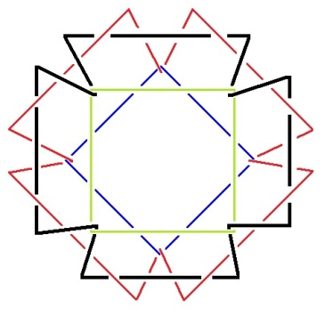

[无对应译文]

</section>

<section class="parallel-paragraph" data-paragraph-ids="s23-02-0002">

s23-02-0002

原文 · s23-02-0002

Ça ne peut pas durer comme ça !

[无对应译文]

</section>

<section class="parallel-paragraph" data-paragraph-ids="s23-02-0003">

s23-02-0003

原文 · s23-02-0003

Je veux dire que vous êtes trop nombreux.

[无对应译文]

</section>

<section class="parallel-paragraph" data-paragraph-ids="s23-02-0004">

s23-02-0004

原文 · s23-02-0004

Vous êtes trop nom­breux pour que...

[无对应译文]

</section>

<section class="parallel-paragraph" data-paragraph-ids="s23-02-0005">

s23-02-0005

原文 · s23-02-0005

Enfin, j’espère tout de même obtenir de vous ce que j’ai obtenu du public des États-Unis, où je viens d’aller.

[无对应译文]

</section>

<section class="parallel-paragraph" data-paragraph-ids="s23-02-0006">

s23-02-0006

原文 · s23-02-0006

J’y ai passé quinze jours pleins et j’ai pu m’y apercevoir d’un certain nombre de choses.

[无对应译文]

</section>

<section class="parallel-paragraph" data-paragraph-ids="s23-02-0007">

s23-02-0007

原文 · s23-02-0007

En particulier - si j’ai bien entendu - d’une certaine lassitude qui est ressentie, principalement par les analystes.

[无对应译文]

</section>

<section class="parallel-paragraph" data-paragraph-ids="s23-02-0008">

s23-02-0008

原文 · s23-02-0008

J’y ai été - mon Dieu ! - je ne puis que dire que j’y ai été très bien traité, mais ça n’est pas dire grand chose, n’est ce pas ? Je m’y suis senti plutôt...

[无对应译文]

</section>

<section class="parallel-paragraph" data-paragraph-ids="s23-02-0009">

s23-02-0009

原文 · s23-02-0009

> pour employer un terme qui est celui dont je me sers pour ce qu’il en est de l’homme ...j’y ai été « *humé »*, ou encore, si vous voulez bien l’entendre, *aspiré*, aspiré dans une sorte de tourbillon, qui évidemment ne trouve son répondant que dans ce que je mets en évidence par mon *nœud*.

[无对应译文]

</section>

<section class="parallel-paragraph" data-paragraph-ids="s23-02-0010">

s23-02-0010

原文 · s23-02-0010

C’est en effet pas par hasard - n’est ce pas ? - c’est peu à peu que vous avez vu...

[无对应译文]

</section>

<section class="parallel-paragraph" data-paragraph-ids="s23-02-0011">

s23-02-0011

原文 · s23-02-0011

enfin, ceux qui sont là depuis un certain temps ...que vous avez pu voir, c’est-à-dire entendre, pas à pas comment j’en suis venu à exprimer par la fonction du *nœud* ce que j’avais d’abord avancé comme, disons triplice du *symbolique*, de l’*imaginaire* et du *réel*.

[无对应译文]

</section>

<section class="parallel-paragraph" data-paragraph-ids="s23-02-0012">

s23-02-0012

原文 · s23-02-0012

Le *nœud* est fait dans l’esprit d’un nouveau *mores - mode*, n’est-ce pas, ou *mœurs -* d’un nouveau *mores geometricus.*

[无对应译文]

</section>

<section class="parallel-paragraph" data-paragraph-ids="s23-02-0013">

s23-02-0013

原文 · s23-02-0013

Nous sommes en effet, au départ toujours captivés par quelque chose qui est une géométrie, que j’ai qualifiée la dernière fois de comparable au sac, c’est-à-dire à la surface.

[无对应译文]

</section>

<section class="parallel-paragraph" data-paragraph-ids="s23-02-0014">

s23-02-0014

原文 · s23-02-0014

Il est très difficile - vous pouvez en faire l’essai - il est très difficile de penser...

[无对应译文]

</section>

<section class="parallel-paragraph" data-paragraph-ids="s23-02-0015">

s23-02-0015

原文 · s23-02-0015

chose qui s’opère le plus communément les yeux fermés ...il est très difficile de penser au *nœud*. On ne s’y retrouve pas.

[无对应译文]

</section>

<section class="parallel-paragraph" data-paragraph-ids="s23-02-0016">

s23-02-0016

原文 · s23-02-0016

Et je ne suis pas tellement sûr, quoiqu’il en ait à mes yeux toute apparence, de l’avoir correctement mis devant vous.

[无对应译文]

</section>

<section class="parallel-paragraph" data-paragraph-ids="s23-02-0017">

s23-02-0017

原文 · s23-02-0017

Il me semble qu’ici il y a une faute. Il y a une faute ici. Voilà. Parce que c’est ceci ce qu’il convient de supprimer.

[无对应译文]

</section>

<section class="parallel-paragraph" data-paragraph-ids="s23-02-0018">

s23-02-0018

原文 · s23-02-0018

C’est un nœud qui part de ceci que vous connaissez bien :

[无对应译文]

</section>

<section class="parallel-paragraph" data-paragraph-ids="s23-02-0019">

s23-02-0019

原文 · s23-02-0019

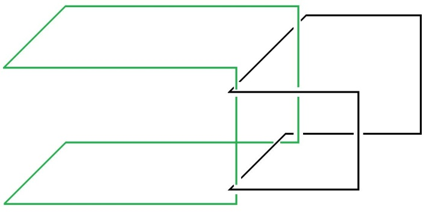

[无对应译文]

</section>

<section class="parallel-paragraph" data-paragraph-ids="s23-02-0020">

s23-02-0020

原文 · s23-02-0020

À savoir ce qui fait que dans *un nœud borroméen* vous avez cette forme qui est telle qu’à l’occasion elle se redouble et que vous devez la compléter par deux autres ronds :

[无对应译文]

</section>

<section class="parallel-paragraph" data-paragraph-ids="s23-02-0021">

s23-02-0021

原文 · s23-02-0021

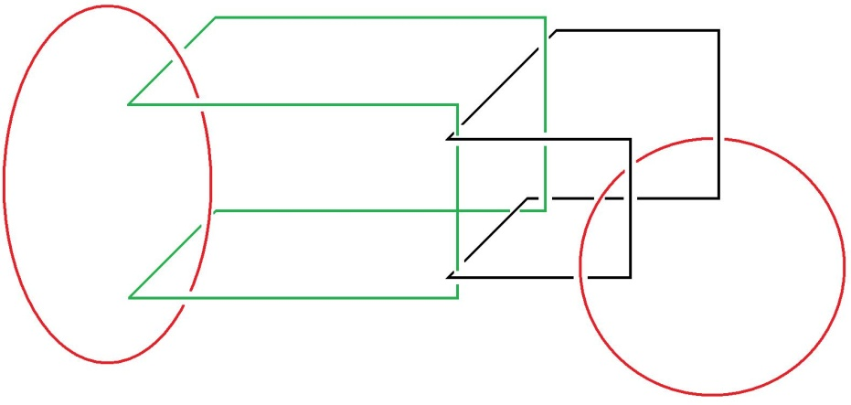

[无对应译文]

</section>

<section class="parallel-paragraph" data-paragraph-ids="s23-02-0022">

s23-02-0022

原文 · s23-02-0022

Il y a une autre façon de redoubler cette forme pliée - en somme, vous voyez que j’essaie de vous mettre au fait - cette forme pliée, cette forme liée qui s’accroche l’une à l’autre :

[无对应译文]

</section>

<section class="parallel-paragraph" data-paragraph-ids="s23-02-0023">

s23-02-0023

原文 · s23-02-0023

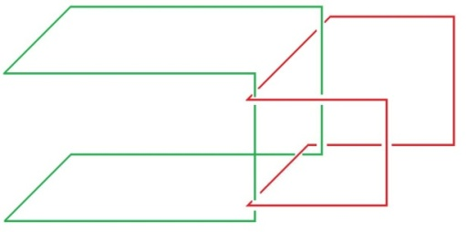

[无对应译文]

</section>

<section class="parallel-paragraph" data-paragraph-ids="s23-02-0024">

s23-02-0024

原文 · s23-02-0024

il y a une autre façon qui consiste à user de ce que je vous ai déjà montré une fois à l’occasion, à savoir de ceci :

[无对应译文]

</section>

<section class="parallel-paragraph" data-paragraph-ids="s23-02-0025">

s23-02-0025

原文 · s23-02-0025

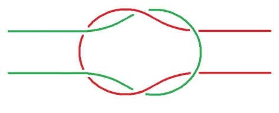

[无对应译文]

</section>

<section class="parallel-paragraph" data-paragraph-ids="s23-02-0026">

s23-02-0026

原文 · s23-02-0026

de ceci qui ne va pas sans constituer de soi un cercle fermé. Par contre, sous la forme suivante :

[无对应译文]

</section>

<section class="parallel-paragraph" data-paragraph-ids="s23-02-0027">

s23-02-0027

原文 · s23-02-0027

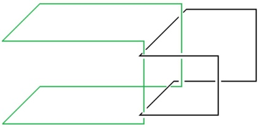

[无对应译文]

</section>

<section class="parallel-paragraph" data-paragraph-ids="s23-02-0028">

s23-02-0028

原文 · s23-02-0028

vous voyez que les deux circuits sont manipulables d’une façon telle qu’ils peuvent se libérer l’un de l’autre.

[无对应译文]

</section>

<section class="parallel-paragraph" data-paragraph-ids="s23-02-0029">

s23-02-0029

原文 · s23-02-0029

C’est même pour ça que les deux cercles, ici marqués en rouge, peuvent en constituer un nœud qui soit à proprement parler *borroméen*, c’est-­à-dire qui, du fait de la section d’un quelconque, libère tous les autres.

[无对应译文]

</section>

<section class="parallel-paragraph" data-paragraph-ids="s23-02-0030">

s23-02-0030

原文 · s23-02-0030

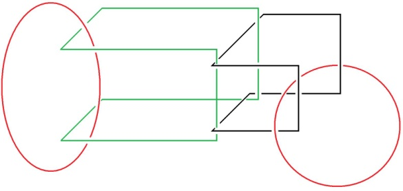

[无对应译文]

</section>

<section class="parallel-paragraph" data-paragraph-ids="s23-02-0031">

s23-02-0031

原文 · s23-02-0031

L’analyse est en somme la réduction de l’initiation à sa réalité, c’est-à-dire au fait qu’*il n’y a pas* à proprement parler d’*initiation*. Tout sujet y livre ceci : qu’il est toujours et n’est jamais qu’une *supposition*.

[无对应译文]

</section>

<section class="parallel-paragraph" data-paragraph-ids="s23-02-0032">

s23-02-0032

原文 · s23-02-0032

Néanmoins ce que l’expérience nous démontre, c’est que cette supposition est toujours livrée à ce que j’appellerai une ambiguïté.

[无对应译文]

</section>

<section class="parallel-paragraph" data-paragraph-ids="s23-02-0033">

s23-02-0033

原文 · s23-02-0033

Je veux dire que le sujet comme tel est toujours, non pas seulement double, mais *divisé*.

[无对应译文]

</section>

<section class="parallel-paragraph" data-paragraph-ids="s23-02-0034">

s23-02-0034

原文 · s23-02-0034

Il s’agit de rendre compte de ce qui, de cette *division,* fait le *réel*.

[无对应译文]

</section>

<section class="parallel-paragraph" data-paragraph-ids="s23-02-0035">

s23-02-0035

原文 · s23-02-0035

En quoi Freud...

[无对应译文]

</section>

<section class="parallel-paragraph" data-paragraph-ids="s23-02-0036">

s23-02-0036

原文 · s23-02-0036

puisque il nous faut y revenir : c’est lui qui a été le grand frayeur de cette appréhension ...en quoi Freud, dont en somme, si je l’ai bien lu - je crois d’ailleurs l’avoir bien lu...

[无对应译文]

</section>

<section class="parallel-paragraph" data-paragraph-ids="s23-02-0037">

s23-02-0037

原文 · s23-02-0037

si j’en crois le dernier Erich Fromm[^4], que vous pouvez vous procurer très aisément, si mon souvenir est bon, chez Gallimard, et qui s’intitule de quelque chose qui,

[无对应译文]

</section>

<section class="parallel-paragraph" data-paragraph-ids="s23-02-0038">

s23-02-0038

原文 · s23-02-0038

> au moins sur le dos du volume - s’énonce comme la psychanalyse appréhendée à travers son « père », entre guillemets, c’est-à-dire par Freud ...en quoi donc, si je l’ai bien lu, Freud - Freud un bourgeois, et un bourgeois bourré de préjugés - a-t-il atteint *quelque chose* qui fait la valeur propre de son *dire*, et qui n’est certes pas rien, qui est la visée de dire sur l’homme *la vérité*.

[无对应译文]

</section>

<section class="parallel-paragraph" data-paragraph-ids="s23-02-0039">

s23-02-0039

原文 · s23-02-0039

À quoi j’ai apporté cette correction qui n’a pas été pour moi sans peine, sans difficulté : *qu’il n’y a de vérité qu’elle ne puisse que se dire*...

[无对应译文]

</section>

<section class="parallel-paragraph" data-paragraph-ids="s23-02-0040">

s23-02-0040

原文 · s23-02-0040

tout comme le sujet qu’elle comporte ...*qui ne puisse se dire qu’à moitié, qui ne puisse*...

[无对应译文]

</section>

<section class="parallel-paragraph" data-paragraph-ids="s23-02-0041">

s23-02-0041

原文 · s23-02-0041

pour l’exprimer comme je l’ai énoncé ...*que se mi-dire.*

[无对应译文]

</section>

<section class="parallel-paragraph" data-paragraph-ids="s23-02-0042">

s23-02-0042

原文 · s23-02-0042

Je pars de ma condition qui est celle d’apporter à l’Homme ce que l’Écriture énonce comme, non pas une aide *à* lui, mais une aide *contre* lui.

[无对应译文]

</section>

<section class="parallel-paragraph" data-paragraph-ids="s23-02-0043">

s23-02-0043

原文 · s23-02-0043

Et de cette condition j’essaie de me repérer.

[无对应译文]

</section>

<section class="parallel-paragraph" data-paragraph-ids="s23-02-0044">

s23-02-0044

原文 · s23-02-0044

C’est bien pourquoi j’ai été...

[无对应译文]

</section>

<section class="parallel-paragraph" data-paragraph-ids="s23-02-0045">

s23-02-0045

原文 · s23-02-0045

vraiment d’une façon qui vaudrait remarque, ...j’ai été conduit à cette considération du *nœud*, qui comme je viens de vous le dire, est à proprement parler constitué par *une géométrie* qu’on peut bien dire *interdite à l’imaginaire*, qui ne s’imagine qu’à travers toutes sortes de résistances, voire de difficultés. *C’est* à proprement parler *ce que le nœud, en tant qu’il est borroméen, substantifie.*

[无对应译文]

</section>

<section class="parallel-paragraph" data-paragraph-ids="s23-02-0046">

s23-02-0046

原文 · s23-02-0046

Si nous partons en effet de l’analyse, nous constatons que c’est autre chose que d’observer.

[无对应译文]

</section>

<section class="parallel-paragraph" data-paragraph-ids="s23-02-0047">

s23-02-0047

原文 · s23-02-0047

Une des choses qui m’ont le plus frappé quand j’étais en Amérique, c’est ma rencontre...

[无对应译文]

</section>

<section class="parallel-paragraph" data-paragraph-ids="s23-02-0048">

s23-02-0048

原文 · s23-02-0048

> qui était certes pas par hasard, qui était tout à fait intentionnelle de ma part ...c’est ma rencontre avec Chomsky. J’en ai été, à proprement parler, je dirai *soufflé*. Je le lui ai dit.

[无对应译文]

</section>

<section class="parallel-paragraph" data-paragraph-ids="s23-02-0049">

s23-02-0049

原文 · s23-02-0049

L’idée dont je me suis rendu compte qu’elle était la sienne est en somme celle-ci...

[无对应译文]

</section>

<section class="parallel-paragraph" data-paragraph-ids="s23-02-0050">

s23-02-0050

原文 · s23-02-0050

> dont je ne peux pas dire qu’elle soit d’aucune façon réfutable, c’est même l’idée la plus commune,
>
> et c’est bien qu’il l’ait - devant mon oreille - simplement affirmée,
>
> qui m’a fait sentir toute la distance où j’étais de lui ...cette idée qui est l’idée en effet commune, est celle-ci, celle-ci qui me paraît précaire : la considération, en somme, de quelque chose qui se présente comme un corps, un corps conçu comme pourvu d’organes, ce qui implique dans cette conception que l’organe est un outil, outil de prise, outil d’appréhension, et que il n’y a aucune objection de principe à ce que l’outil s’appréhende lui-même comme tel, que par exemple le langage soit considéré par lui comme déterminé par un fait génétique... il l’a exprimé en ces propres termes devant moi ...en d’autres termes que le langage soit lui-même un organe.

[无对应译文]

</section>

<section class="parallel-paragraph" data-paragraph-ids="s23-02-0051">

s23-02-0051

原文 · s23-02-0051

Il me paraît tout à fait saisissant*...*

[无对应译文]

</section>

<section class="parallel-paragraph" data-paragraph-ids="s23-02-0052">

s23-02-0052

原文 · s23-02-0052

c’est ce que j’ai exprimé par le terme « *soufflé »...*il me paraît tout à fait saisissant que de ce langage, on puisse faire retour sur lui-même comme organe.

[无对应译文]

</section>

<section class="parallel-paragraph" data-paragraph-ids="s23-02-0053">

s23-02-0053

原文 · s23-02-0053

Si le langage n’est pas considéré sous ce biais : qu’il est lié, qu’il est lié à *quelque chose* qui dans le *réel* fait *trou*, il n’est pas simplement difficile, il est impossible d’en considérer le maniement.

[无对应译文]

</section>

<section class="parallel-paragraph" data-paragraph-ids="s23-02-0054">

s23-02-0054

原文 · s23-02-0054

La méthode « d’observation » ne saurait partir du langage sans admettre cette vérité principielle, que dans ce qu’on peut situer comme *réel*, le langage n’apparaisse comme faisant *trou*.

[无对应译文]

</section>

<section class="parallel-paragraph" data-paragraph-ids="s23-02-0055">

s23-02-0055

原文 · s23-02-0055

C’est de cette notion « *fonction du trou* » que le langage opère sa prise sur le *réel*.

[无对应译文]

</section>

<section class="parallel-paragraph" data-paragraph-ids="s23-02-0056">

s23-02-0056

原文 · s23-02-0056

Il ne m’est, bien entendu, pas aisé de faire peser de tout son poids cette conviction sur vous.

[无对应译文]

</section>

<section class="parallel-paragraph" data-paragraph-ids="s23-02-0057">

s23-02-0057

原文 · s23-02-0057

Elle m’apparaît inévitable de ce que il n’y a de *vérité,* comme telle, possible que d’*évider* ce *réel*.

[无对应译文]

</section>

<section class="parallel-paragraph" data-paragraph-ids="s23-02-0058">

s23-02-0058

原文 · s23-02-0058

Le langage, qui d’ailleurs *mange* ce *réel*, je veux dire qu’il ne permet d’aborder ce *réel...*

[无对应译文]

</section>

<section class="parallel-paragraph" data-paragraph-ids="s23-02-0059">

s23-02-0059

原文 · s23-02-0059

> ce « *réel génétique *» pour parler comme Chomsky *...*qu’en terme de *signe*, ou autrement dit de *message* qui part du gène moléculaire, en le réduisant à ce qui a fait la renommée de Krick et de Watson, à savoir cette double hélice, d’où sont censés partir ces divers niveaux qui organisent le corps à travers un certain nombre d’étages, qui sont d’abord de la division, du développement, de la spécialisation cellulaire, puis ensuite de cette spécialisation de partir des hormones qui sont autant d’éléments sur lesquels se véhiculent, pour la direction de l’information organique, autant de sortes de messages.

[无对应译文]

</section>

<section class="parallel-paragraph" data-paragraph-ids="s23-02-0060">

s23-02-0060

原文 · s23-02-0060

Toute cette subtilisation de ce qu’il en est du *réel* par tant de dits « *messages* », mais où ne se marque que le voile porté sur ce qu’il en est de l’efficace du langage, c’est-à-dire sur ceci que le langage n’est pas en lui-même un message, mais ne se sustente que de la fonction de ce que j’ai appelé *le trou dans le réel*.

[无对应译文]

</section>

<section class="parallel-paragraph" data-paragraph-ids="s23-02-0061">

s23-02-0061

原文 · s23-02-0061

Il y a pour cela la voie de notre nouveau *mos geometricus,* c’est-à­-dire de la substance qui résulte de *l’efficace,* de *l’efficace* propre du *langage*, et qui se supporte de cette *fonction du trou*.

[无对应译文]

</section>

<section class="parallel-paragraph" data-paragraph-ids="s23-02-0062">

s23-02-0062

原文 · s23-02-0062

Pour l’exprimer en terme de ce fameux *nœud borroméen* où je me fie, disons que il repose tout entier sur l’équivalence d’une droite infinie avec un cercle.

[无对应译文]

</section>

<section class="parallel-paragraph" data-paragraph-ids="s23-02-0063">

s23-02-0063

原文 · s23-02-0063

Le schéma du *nœud borroméen* est celui-ci :

[无对应译文]

</section>

<section class="parallel-paragraph" data-paragraph-ids="s23-02-0064">

s23-02-0064

原文 · s23-02-0064

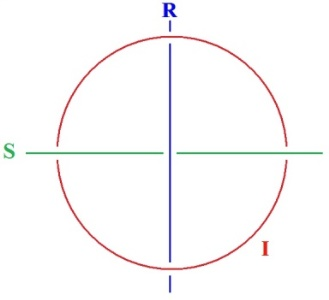

[无对应译文]

</section>

<section class="parallel-paragraph" data-paragraph-ids="s23-02-0065">

s23-02-0065

原文 · s23-02-0065

Je veux dire - pour le marquer - ceci tout autant que mon dessin ordinaire, celui qui s’articule ainsi :

[无对应译文]

</section>

<section class="parallel-paragraph" data-paragraph-ids="s23-02-0066">

s23-02-0066

原文 · s23-02-0066

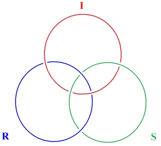

[无对应译文]

</section>

<section class="parallel-paragraph" data-paragraph-ids="s23-02-0067">

s23-02-0067

原文 · s23-02-0067

ceci tout autant que le dessin ordinaire est à proprement parler un *nœud borroméen*.

[无对应译文]

</section>

<section class="parallel-paragraph" data-paragraph-ids="s23-02-0068">

s23-02-0068

原文 · s23-02-0068

De ce fait il est également vrai que ceci en est un :

[无对应译文]

</section>

<section class="parallel-paragraph" data-paragraph-ids="s23-02-0069">

s23-02-0069

原文 · s23-02-0069

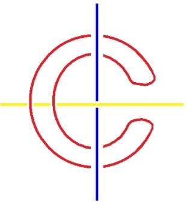

[无对应译文]

</section>

<section class="parallel-paragraph" data-paragraph-ids="s23-02-0070">

s23-02-0070

原文 · s23-02-0070

Je veux dire qu’à y substituer le couple d’une droite supposée infinie avec un cercle, on obtient le même *nœud borroméen*.

[无对应译文]

</section>

<section class="parallel-paragraph" data-paragraph-ids="s23-02-0071">

s23-02-0071

原文 · s23-02-0071

Il y a quelque chose qui répond de ce chiffre 3 qui est l’orée, si je puis dire, d’une exigence, laquelle est à proprement parler l’exigence propre du *nœud*.

[无对应译文]

</section>

<section class="parallel-paragraph" data-paragraph-ids="s23-02-0072">

s23-02-0072

原文 · s23-02-0072

Elle est liée à ce fait que pour rendre compte correctement du *nœud borroméen*, c’est à partir de 3 que spécialement s’origine une exigence.

[无对应译文]

</section>

<section class="parallel-paragraph" data-paragraph-ids="s23-02-0073">

s23-02-0073

原文 · s23-02-0073

Il est possible, avec une manipulation fort simple, de rendre ces trois droites infinies parallèles :

[无对应译文]

</section>

<section class="parallel-paragraph" data-paragraph-ids="s23-02-0074">

s23-02-0074

原文 · s23-02-0074

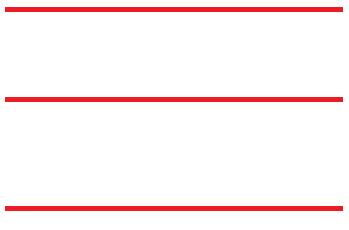

[无对应译文]

</section>

<section class="parallel-paragraph" data-paragraph-ids="s23-02-0075">

s23-02-0075

原文 · s23-02-0075

Il suffira pour ça d’assouplir je dirai, ce qu’il en est du faux cercle déjà plié : le cercle en rouge dans cette occasion.

[无对应译文]

</section>

<section class="parallel-paragraph" data-paragraph-ids="s23-02-0076">

s23-02-0076

原文 · s23-02-0076

C’est à partir de trois qu’il nous faut définir ce qu’il en est du point à l’infini de la droite comme ne prêtant pas - ne prêtant en aucun cas - à faire faute à ce que nous pouvons appeler leur concentricité.

[无对应译文]

</section>

<section class="parallel-paragraph" data-paragraph-ids="s23-02-0077">

s23-02-0077

原文 · s23-02-0077

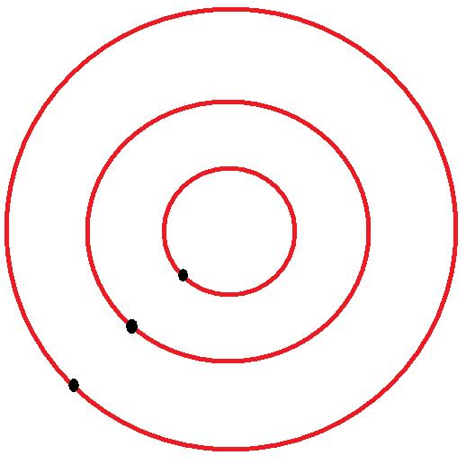

[无对应译文]

</section>

<section class="parallel-paragraph" data-paragraph-ids="s23-02-0078">

s23-02-0078

原文 · s23-02-0078

Je veux dire que ces 3 points à l’infini, mettons les ici par exemple, doivent être sous quelque forme que nous les supposions, et nous pouvons aussi bien inverser ces positions, je veux dire faire que cette première droite à l’infini si l’on peut dire, soit par rapport aux autres enveloppante au lieu d’être enveloppée.

[无对应译文]

</section>

<section class="parallel-paragraph" data-paragraph-ids="s23-02-0079">

s23-02-0079

原文 · s23-02-0079

C’est la caractéristique de ce point à l’infini, que de ne pouvoir être situé, comme on pourrait s’exprimer, d’aucun côté.

[无对应译文]

</section>

<section class="parallel-paragraph" data-paragraph-ids="s23-02-0080">

s23-02-0080

原文 · s23-02-0080

Mais ce qui est exigible à partir du nombre 3 c’est ceci, c’est que pour le figurer de cette façon imagée :

[无对应译文]

</section>

<section class="parallel-paragraph" data-paragraph-ids="s23-02-0081">

s23-02-0081

原文 · s23-02-0081

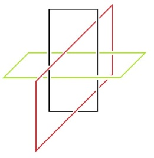

[无对应译文]

</section>

<section class="parallel-paragraph" data-paragraph-ids="s23-02-0082">

s23-02-0082

原文 · s23-02-0082

on doit énoncer, préciser, que de ces trois droites, complétées de leur point à l’infini, il ne s’en trouvera pas une...

[无对应译文]

</section>

<section class="parallel-paragraph" data-paragraph-ids="s23-02-0083">

s23-02-0083

原文 · s23-02-0083

> vous sentez bien que si je les ai mises ici toutes les trois en rouge,
>
> c’est qu’il y a des raisons pour lesquelles j’ai dû les tracer ici d’une couleur différente ...il n’y en aura pas une qui, d’être enveloppée par une autre, ne se trouvera enveloppante par rapport à l’autre.

[无对应译文]

</section>

<section class="parallel-paragraph" data-paragraph-ids="s23-02-0084">

s23-02-0084

原文 · s23-02-0084

Car c’est à proprement parler ceci qui constitue la propriété du *nœud borroméen*.

[无对应译文]

</section>

<section class="parallel-paragraph" data-paragraph-ids="s23-02-0085">

s23-02-0085

原文 · s23-02-0085

Je vous ai maintes fois familiarisés avec ceci, c’est que le *nœud borroméen*, si l’on peut dire dans la 3ème dimension, consiste dans ce rapport qui fait que ce qui est *enveloppé* par rapport à l’un de ces cercles, se trouve *enveloppant* par rapport à l’autre.

[无对应译文]

</section>

<section class="parallel-paragraph" data-paragraph-ids="s23-02-0086">

s23-02-0086

原文 · s23-02-0086

C’est en cela qu’est exemplaire ceci que vous voyez ordinairement sous la forme de la *sphère armillaire*, la sphère armillaire usée - dont on use - pour ce qu’il en est des sextants, se présente toujours ainsi :

[无对应译文]

</section>

<section class="parallel-paragraph" data-paragraph-ids="s23-02-0087">

s23-02-0087

原文 · s23-02-0087

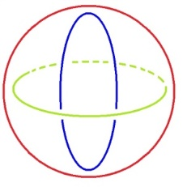

[无对应译文]

</section>

<section class="parallel-paragraph" data-paragraph-ids="s23-02-0088">

s23-02-0088

原文 · s23-02-0088

À savoir que pour le tracer d’une façon claire, le cercle bleu ira toujours se rabattre de la façon suivante autour du cercle qu’ici j’ai dessiné en vert, et que le cercle rouge - selon le rabattement de l’entraxe - doit être comme ça.

[无对应译文]

</section>

<section class="parallel-paragraph" data-paragraph-ids="s23-02-0089">

s23-02-0089

原文 · s23-02-0089

Je l’ai dit tout à l’heure. Voilà.

[无对应译文]

</section>

<section class="parallel-paragraph" data-paragraph-ids="s23-02-0090">

s23-02-0090

原文 · s23-02-0090

Par contre, la différence entre ce cercle et cette disposition ordinaire dans toute manipulation de la sphère armillaire, se trouvera distancée si, disons, ce cercle qui apparaît ici moyen se trouve, à ce cercle se trouve substituée la disposition suivante :

[无对应译文]

</section>

<section class="parallel-paragraph" data-paragraph-ids="s23-02-0091">

s23-02-0091

原文 · s23-02-0091

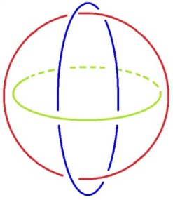

[无对应译文]

</section>

<section class="parallel-paragraph" data-paragraph-ids="s23-02-0092">

s23-02-0092

原文 · s23-02-0092

À savoir qu’il ne pourra pas être rabattu, parce que il sera enveloppant par rapport au cercle rouge, et enveloppé par rapport au cercle vert.

[无对应译文]

</section>

<section class="parallel-paragraph" data-paragraph-ids="s23-02-0093">

s23-02-0093

原文 · s23-02-0093

Je redessine ce qu’il en est.

[无对应译文]

</section>

<section class="parallel-paragraph" data-paragraph-ids="s23-02-0094">

s23-02-0094

原文 · s23-02-0094

Vous voyez qu’ici le cercle vert se trouve ainsi situé par rapport au cercle bleu et au cercle rouge.

[无对应译文]

</section>

<section class="parallel-paragraph" data-paragraph-ids="s23-02-0095">

s23-02-0095

原文 · s23-02-0095

Même mes hésitations sont ici significatives : elles manifestent la maladresse avec laquelle *nécessairement* ce qu’il en est du *nœud borroméen,* type même du nœud, est manipulé.

[无对应译文]

</section>

<section class="parallel-paragraph" data-paragraph-ids="s23-02-0096">

s23-02-0096

原文 · s23-02-0096

Le caractère fondamental de cette utilisation du nœud est de permettre d’illustrer la *triplicité* qui résulte d’une *consistance* qui n’est affectée :

[无对应译文]

</section>

<section class="parallel-paragraph" data-paragraph-ids="s23-02-0097">

s23-02-0097

原文 · s23-02-0097

- que de l’*imaginaire* \[ → *consistance*\],

[无对应译文]

</section>

<section class="parallel-paragraph" data-paragraph-ids="s23-02-0098">

s23-02-0098

原文 · s23-02-0098

- d’un *trou* comme *fondamental* qui ressortit au *symbolique*,

[无对应译文]

</section>

<section class="parallel-paragraph" data-paragraph-ids="s23-02-0099">

s23-02-0099

原文 · s23-02-0099

- et d’autre part d’une *ex-sistence* - écrit comme je le fais : *e.x.tiret.s.i.s.t.e.n.c.e* - qui elle, appartient au *réel,* qui en est le caractère fondamental.

[无对应译文]

</section>

<section class="parallel-paragraph" data-paragraph-ids="s23-02-0100">

s23-02-0100

原文 · s23-02-0100

Cette méthode - puisqu’il s’agit de méthode - est une méthode qui se présente comme sans espoir.

[无对应译文]

</section>

<section class="parallel-paragraph" data-paragraph-ids="s23-02-0101">

s23-02-0101

原文 · s23-02-0101

Sans espoir d’aucune façon de rompre le nœud constituant *du symbolique, de l’imaginaire et du réel*.

[无对应译文]

</section>

<section class="parallel-paragraph" data-paragraph-ids="s23-02-0102">

s23-02-0102

原文 · s23-02-0102

À cet égard, elle se refuse à ce qui constitue...

[无对应译文]

</section>

<section class="parallel-paragraph" data-paragraph-ids="s23-02-0103">

s23-02-0103

原文 · s23-02-0103

> il faut le dire, et d’une façon tout à fait lucide ...*une vertu*, une vertu même dite *théologale*, et c’est en cela que notre appréhension analytique de ce qu’il en est de ce nœud, est le négatif de la religion.

[无对应译文]

</section>

<section class="parallel-paragraph" data-paragraph-ids="s23-02-0104">

s23-02-0104

原文 · s23-02-0104

On ne croit plus à *l’objet* comme tel, et c’est en ceci que je nie que *l’objet* puisse être saisi par aucun organe, puisque l’organe lui-même est aperçu comme un outil, et qu’étant aperçu comme comme un outil, comme un outil séparé, il est à ce titre *conçu comme un objet*.

[无对应译文]

</section>

<section class="parallel-paragraph" data-paragraph-ids="s23-02-0105">

s23-02-0105

原文 · s23-02-0105

Dans la conception de Chomsky, *l’objet* n’est lui-même abordé que par un *objet*.

[无对应译文]

</section>

<section class="parallel-paragraph" data-paragraph-ids="s23-02-0106">

s23-02-0106

原文 · s23-02-0106

C’est à la restitution en tant que telle du sujet, en tant que lui-même ne peut être que divisé, divisé par l’opération elle-même, du *langage*, que l’analyse trouve sa diffusion.

[无对应译文]

</section>

<section class="parallel-paragraph" data-paragraph-ids="s23-02-0107">

s23-02-0107

原文 · s23-02-0107

Elle trouve sa diffusion en ceci qu’elle *met en question* la science comme telle.

[无对应译文]

</section>

<section class="parallel-paragraph" data-paragraph-ids="s23-02-0108">

s23-02-0108

原文 · s23-02-0108

Science pour autant qu’elle fait d’un *l’objet* un sujet, alors que c’est le sujet qui est de lui-même divisé.

[无对应译文]

</section>

<section class="parallel-paragraph" data-paragraph-ids="s23-02-0109">

s23-02-0109

原文 · s23-02-0109

Nous ne croyons pas à *l’objet*, mais nous constatons le *désir,* et de cette constatation du désir, nous induisons la cause comme objectivée.

[无对应译文]

</section>

<section class="parallel-paragraph" data-paragraph-ids="s23-02-0110">

s23-02-0110

原文 · s23-02-0110

Le désir de connaître rencontre des obstacles.

[无对应译文]

</section>

<section class="parallel-paragraph" data-paragraph-ids="s23-02-0111">

s23-02-0111

原文 · s23-02-0111

C’est pour incarner cet obstacle que j’ai inventé le *nœud,* et qu’au nœud il faut se rompre. Je veux dire :

[无对应译文]

</section>

<section class="parallel-paragraph" data-paragraph-ids="s23-02-0112">

s23-02-0112

原文 · s23-02-0112

- que c’est le nœud seul qui est le support concevable d’un rapport entre quoi que ce soit et quoi que ce soit,

[无对应译文]

</section>

<section class="parallel-paragraph" data-paragraph-ids="s23-02-0113">

s23-02-0113

原文 · s23-02-0113

- que le nœud, s’il est abstrait d’un côté, doit être pensé et conçu comme concret.

[无对应译文]

</section>

<section class="parallel-paragraph" data-paragraph-ids="s23-02-0114">

s23-02-0114

原文 · s23-02-0114

Ce dans quoi, puisque aujourd’hui vous le voyez bien, je suis fort las, fort las de cette épreuve américaine où comme je vous l’ai dit, j’ai été certainement récompensé, car j’ai pu...

[无对应译文]

</section>

<section class="parallel-paragraph" data-paragraph-ids="s23-02-0115">

s23-02-0115

原文 · s23-02-0115

> ces figures que vous voyez ici plus ou moins substantialisées par l’écrit, par le dessin ...j’ai pu en faire ce que j’appellerai *agitation*, *émotion*.

[无对应译文]

</section>

<section class="parallel-paragraph" data-paragraph-ids="s23-02-0116">

s23-02-0116

原文 · s23-02-0116

Le *senti* comme *mental*, le *sentimental* est débile, parce que toujours par quelque biais réductible à l’*imaginaire*.

[无对应译文]

</section>

<section class="parallel-paragraph" data-paragraph-ids="s23-02-0117">

s23-02-0117

原文 · s23-02-0117

L’imagination de *consistance* va tout droit à l’impossible de la cassure, mais c’est en cela que la cassure peut toujours être le *réel*, *le réel comme impossible,* et qui n’en est pas moins compatible avec la dite imagination, et la constitue même.

[无对应译文]

</section>

<section class="parallel-paragraph" data-paragraph-ids="s23-02-0118">

s23-02-0118

原文 · s23-02-0118

Je n’espère pas, d’aucune façon, sortir de la débilité que je signale de ce départ.

[无对应译文]

</section>

<section class="parallel-paragraph" data-paragraph-ids="s23-02-0119">

s23-02-0119

原文 · s23-02-0119

Je n’en sors, comme quiconque, que dans la mesure de mes moyens.

[无对应译文]

</section>

<section class="parallel-paragraph" data-paragraph-ids="s23-02-0120">

s23-02-0120

原文 · s23-02-0120

C’est-à-dire comme « *sur place* », « *sur* » ne s’assurant d’aucun progrès vérifiable autrement qu’à la longue.

[无对应译文]

</section>

<section class="parallel-paragraph" data-paragraph-ids="s23-02-0121">

s23-02-0121

原文 · s23-02-0121

C’est de façon fabulatoire que j’affirme que le *réel*...

[无对应译文]

</section>

<section class="parallel-paragraph" data-paragraph-ids="s23-02-0122">

s23-02-0122

原文 · s23-02-0122

tel que je le pense dans mon pen-se, dans mon pen-se léger ...ne va pas sans comporter réelle*ment*...

[无对应译文]

</section>

<section class="parallel-paragraph" data-paragraph-ids="s23-02-0123">

s23-02-0123

原文 · s23-02-0123

le *réel* *mentant* effectivement ...sans comporter réellement *le trou* qui y subsiste, de ce que *sa consistance* ne soit rien de plus que celle de l’ensemble du nœud qu’il fait avec le *symbolique* et l’*imaginaire*.

[无对应译文]

</section>

<section class="parallel-paragraph" data-paragraph-ids="s23-02-0124">

s23-02-0124

原文 · s23-02-0124

Nœud qualifiable du borroméen, soit intranchable sans dissoudre le mythe qu’il rend du sujet comme non supposé.

[无对应译文]

</section>

<section class="parallel-paragraph" data-paragraph-ids="s23-02-0125">

s23-02-0125

原文 · s23-02-0125

C’est-à-dire comme réel, pas plus divers que chaque corps signalable du *parlêtre*, corps qui n’a de statut respectable, au sens commun du mot, que de ce nœud.

[无对应译文]

</section>

<section class="parallel-paragraph" data-paragraph-ids="s23-02-0126">

s23-02-0126

原文 · s23-02-0126

Alors, après cette épuisante tentative, et puisque aujourd’hui je suis fort las, j’attends de vous ce que j’ai reçu plus aisément qu’ailleurs en Amérique, à savoir que quelqu’un me pose, à propos d’aujourd’hui, *une question, quelle qu’elle soit*.

[无对应译文]

</section>

<section class="parallel-paragraph" data-paragraph-ids="s23-02-0127">

s23-02-0127

原文 · s23-02-0127

Même si elle manifeste que dans mon discours d’aujourd’hui, discours que je reprendrai la prochaine fois, en abordant ceci que Joyce se trouve d’une façon privilégiée avoir visé par son art, le quart terme, celui que de diverses façons que vous voyez là figuré :

[无对应译文]

</section>

<section class="parallel-paragraph" data-paragraph-ids="s23-02-0128">

s23-02-0128

原文 · s23-02-0128

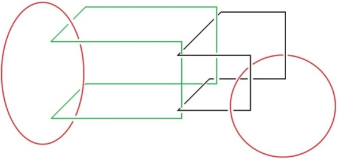

[无对应译文]

</section>

<section class="parallel-paragraph" data-paragraph-ids="s23-02-0129">

s23-02-0129

原文 · s23-02-0129

qu’il s’agisse du *rond rouge* qui est tout à l’extrême, à droite, ou qu’il s’agisse aussi bien du *rond noir* ici :

[无对应译文]

</section>

<section class="parallel-paragraph" data-paragraph-ids="s23-02-0130">

s23-02-0130

原文 · s23-02-0130

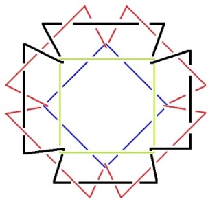

[无对应译文]

</section>

<section class="parallel-paragraph" data-paragraph-ids="s23-02-0131">

s23-02-0131

原文 · s23-02-0131

ou qu’il s’agisse encore de ceci :

[无对应译文]

</section>

<section class="parallel-paragraph" data-paragraph-ids="s23-02-0132">

s23-02-0132

原文 · s23-02-0132

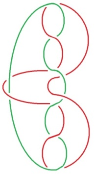

[无对应译文]

</section>

<section class="parallel-paragraph" data-paragraph-ids="s23-02-0133">

s23-02-0133

原文 · s23-02-0133

Vous voyez que c’est d’une façon particulière encore, particulière en ceci que c’est toujours le même cercle plié qui se trouve ici dans une position spéciale, à savoir deux fois infléchi, c’est-à-dire pris d’une façon qui est correspondante, qui se figure à peu près ainsi, pris 4 fois si l’on peut dire, avec lui-même.

[无对应译文]

</section>

<section class="parallel-paragraph" data-paragraph-ids="s23-02-0134">

s23-02-0134

原文 · s23-02-0134

Ce qui permet effectivement de s’apercevoir que, de même qu’ici c’est 2 fois que chacun de ces cercles coincent la boucle figurée par ce cercle plié, ici par contre, c’est quatre fois que ce petit cercle, ou le cercle vert, par exemple, celui qui est ici, ou le cercle bleu le coincent. Puisque aussi bien, c’est de coinçage *essentiellement* qu’il s’agit.

[无对应译文]

</section>

<section class="parallel-paragraph" data-paragraph-ids="s23-02-0135">

s23-02-0135

原文 · s23-02-0135

C’est donc de Joyce que ce 4ème terme...

[无对应译文]

</section>

<section class="parallel-paragraph" data-paragraph-ids="s23-02-0136">

s23-02-0136

原文 · s23-02-0136

ce 4ème terme en tant qu’il complète le nœud *de l’imaginaire,* *du symbolique et du réel* ...que j’avancerai que, par son art...

[无对应译文]

</section>

<section class="parallel-paragraph" data-paragraph-ids="s23-02-0137">

s23-02-0137

原文 · s23-02-0137

> et c’est là tout le problème : comment un art peut-il viser de façon expressément *divinatoire*
>
> à substantialiser dans sa *consistance* \[**I**\], sa *consistance* comme telle, mais aussi bien son *ex-sistence* \[**R**\] et aussi bien ce 3ème terme qui est le *trou* \[**S**\] ...comment par son art, quelqu’un a-t-il pu viser à rendre comme tel...

[无对应译文]

</section>

<section class="parallel-paragraph" data-paragraph-ids="s23-02-0138">

s23-02-0138

原文 · s23-02-0138

> au point de l’approcher d’aussi près qu’il est possible ...ce 4ème *terme*, celui à propos de quoi aujourd’hui j’ai voulu simplement vous montrer qu’il est essentiel au *nœud borroméen* lui-même ?

[无对应译文]

</section>

<section class="parallel-paragraph" data-paragraph-ids="s23-02-0139">

s23-02-0139

原文 · s23-02-0139

J’attends donc que s’élève une voix, quelle qu’elle soit.

[无对应译文]

</section>

<section class="parallel-paragraph" data-paragraph-ids="s23-02-0140">

s23-02-0140

原文 · s23-02-0140

QUESTIONS

[无对应译文]

</section>

<section class="parallel-paragraph" data-paragraph-ids="s23-02-0141">

s23-02-0141

原文 · s23-02-0141

Lacan

[无对应译文]

</section>

<section class="parallel-paragraph" data-paragraph-ids="s23-02-0142">

s23-02-0142

原文 · s23-02-0142

Alors ! Qu’est-ce qui a pu vous paraître discutable dans ce que j’ai avancé aujourd’hui ?

[无对应译文]

</section>

<section class="parallel-paragraph" data-paragraph-ids="s23-02-0143">

s23-02-0143

原文 · s23-02-0143

Stuart Schneiderman

[无对应译文]

</section>

<section class="parallel-paragraph" data-paragraph-ids="s23-02-0144">

s23-02-0144

原文 · s23-02-0144

Ce n’est pas une question sur le nœud lui-même, c’est une question plutôt historique.

[无对应译文]

</section>

<section class="parallel-paragraph" data-paragraph-ids="s23-02-0145">

s23-02-0145

原文 · s23-02-0145

Qu’est-ce qui vous a amené à croire au début, que vous trouveriez quelque chose chez Chomsky qui vous dirait ou qui vous rappellerait, pour moi, c’est quelque chose qui ne m’aurait jamais venu en tête.

[无对应译文]

</section>

<section class="parallel-paragraph" data-paragraph-ids="s23-02-0146">

s23-02-0146

原文 · s23-02-0146

Lacan

[无对应译文]

</section>

<section class="parallel-paragraph" data-paragraph-ids="s23-02-0147">

s23-02-0147

原文 · s23-02-0147

C’est bien pour ça que j’ai été *soufflé*, c’est certain. Oui, mais ça ne veut pas dire que je ne...

[无对应译文]

</section>

<section class="parallel-paragraph" data-paragraph-ids="s23-02-0148">

s23-02-0148

原文 · s23-02-0148

> on a toujours cette sorte de faiblesse - n’est-ce-pas ? - et il y a un reste d’espoir ...je veux dire que Chomsky s’occupant de linguistique, je pouvais espérer voir une pointe d’appréhension de ce que je montre concernant le *symbolique*, c’est-à-dire qu’il garde - même quand il est *faux* - quelque chose du *trou*. Qu’il est impossible par exemple de ne pas qualifier de « *faux trou* » l’ensemble constitué par le *symptôme* et le *symbolique*.

[无对应译文]

</section>

<section class="parallel-paragraph" data-paragraph-ids="s23-02-0149">

s23-02-0149

原文 · s23-02-0149

Mais que d’un autre côté, c’est en tant qu’il est *accroché au langage* que le *symptôme* subsiste, au moins si nous croyons que *par une manipulation dite interprétative,* c’est-à-dire jouant sur le sens, *nous pouvons modifier quelque chose* au *symptôme*.

[无对应译文]

</section>

<section class="parallel-paragraph" data-paragraph-ids="s23-02-0150">

s23-02-0150

原文 · s23-02-0150

Cette assimilation chez Chomsky de quelque chose, qui à mes yeux est de l’ordre du *symptôme*, c’est-à-dire qui confond le *symptôme* et le *Réel*, c’est très précisément ce qui m’a *soufflé*.

[无对应译文]

</section>

<section class="parallel-paragraph" data-paragraph-ids="s23-02-0151">

s23-02-0151

原文 · s23-02-0151

Stuart Schneiderman

[无对应译文]

</section>

<section class="parallel-paragraph" data-paragraph-ids="s23-02-0152">

s23-02-0152

原文 · s23-02-0152

Excusez-moi. C’est une question peut-être oisive sur...

[无对应译文]

</section>

<section class="parallel-paragraph" data-paragraph-ids="s23-02-0153">

s23-02-0153

原文 · s23-02-0153

Lacan – oiseuse ?

[无对应译文]

</section>

<section class="parallel-paragraph" data-paragraph-ids="s23-02-0154">

s23-02-0154

原文 · s23-02-0154

Stuart Schneiderman - Oisive. Étant Américain...

[无对应译文]

</section>

<section class="parallel-paragraph" data-paragraph-ids="s23-02-0155">

s23-02-0155

原文 · s23-02-0155

Lacan

[无对应译文]

</section>

<section class="parallel-paragraph" data-paragraph-ids="s23-02-0156">

s23-02-0156

原文 · s23-02-0156

Oui ! Vous êtes Américain. Et je vous remercie !

[无对应译文]

</section>

<section class="parallel-paragraph" data-paragraph-ids="s23-02-0157">

s23-02-0157

原文 · s23-02-0157

Je constate simplement qu’il n’y a, une fois de plus qu’un Américain pour m’interroger.

[无对应译文]

</section>

<section class="parallel-paragraph" data-paragraph-ids="s23-02-0158">

s23-02-0158

原文 · s23-02-0158

Enfin, je ne peux pas dire combien j’ai été comblé, si je puis dire, par le fait que - en Amérique - j’ai eu des gens qui avaient, qui me témoignaient par quelque côté que mon discours n’était pas vain.

[无对应译文]

</section>

<section class="parallel-paragraph" data-paragraph-ids="s23-02-0159">

s23-02-0159

原文 · s23-02-0159

Stuart Schneiderman

[无对应译文]

</section>

<section class="parallel-paragraph" data-paragraph-ids="s23-02-0160">

s23-02-0160

原文 · s23-02-0160

Alors, oui, pour moi, essayant de comprendre la possibilité de plusieurs discours à Paris, il me semble impossible que quelqu’un ait pu concevoir que Chomsky, éduqué dans la tradition nouvelle née de la logique mathématique et qu’il a pris chez Quine et Goodman, à Harvard...

[无对应译文]

</section>

<section class="parallel-paragraph" data-paragraph-ids="s23-02-0161">

s23-02-0161

原文 · s23-02-0161

Lacan - Mais Quine n’est pas bête du tout, hein !

[无对应译文]

</section>

<section class="parallel-paragraph" data-paragraph-ids="s23-02-0162">

s23-02-0162

原文 · s23-02-0162

Stuart Schneiderman

[无对应译文]

</section>

<section class="parallel-paragraph" data-paragraph-ids="s23-02-0163">

s23-02-0163

原文 · s23-02-0163

Non, mais il n’est pas non plus, me semble-t-il... Quine et Lacan, c’est deux noms que je n’aurais pas trouvés. Mais pour ce qui est de la réflexion sur le sujet, c’est les français qui pour trouver quelque chose de... pour trouver un tas d’images... il me manque une pensée comme ça...

[无对应译文]

</section>

<section class="parallel-paragraph" data-paragraph-ids="s23-02-0164">

s23-02-0164

原文 · s23-02-0164

Lacan - Est-ce que je peux attendre de quelqu’un de français quelque chose qui, enfin qui...

[无对应译文]

</section>

<section class="parallel-paragraph" data-paragraph-ids="s23-02-0165">

s23-02-0165

原文 · s23-02-0165

Roland Chemama

[无对应译文]

</section>

<section class="parallel-paragraph" data-paragraph-ids="s23-02-0166">

s23-02-0166

原文 · s23-02-0166

Moi je voulais vous interroger sur quelque chose...

[无对应译文]

</section>

<section class="parallel-paragraph" data-paragraph-ids="s23-02-0167">

s23-02-0167

原文 · s23-02-0167

C’est à propos de l’alternance finalement du corps et de la parole comme vous la vivez même aujourd’hui.

[无对应译文]

</section>

<section class="parallel-paragraph" data-paragraph-ids="s23-02-0168">

s23-02-0168

原文 · s23-02-0168

Parce qu’il y a quelque chose qui m’échappe un petit peu dans votre discours, c’est le fait que vous parliez effectivement pendant une heure trente, et qu’ensuite vous ayez le désir d’avoir un contact, finalement, plus direct avec quelqu’un.

[无对应译文]

</section>

<section class="parallel-paragraph" data-paragraph-ids="s23-02-0169">

s23-02-0169

原文 · s23-02-0169

Et je me suis demandé si, d’une façon plus générale, dans votre théorie, là, vous ne parliez pas strictement du langage, mais sans penser à ces moments où le corps sert lui aussi d’échange, et effectivement à ce moment-là, l’organe - c’est pas clair mais... - l’organe peut servir à *appréhender* le *réel*, d’une façon directe, sans le discours.

[无对应译文]

</section>

<section class="parallel-paragraph" data-paragraph-ids="s23-02-0170">

s23-02-0170

原文 · s23-02-0170

Est-ce qu’il n’y a pas une alternance des deux dans la vie d’un sujet ?

[无对应译文]

</section>

<section class="parallel-paragraph" data-paragraph-ids="s23-02-0171">

s23-02-0171

原文 · s23-02-0171

J’ai l’impression qu’il y a une *désincarnation du discours*. Le discours se reportant toujours...

[无对应译文]

</section>

<section class="parallel-paragraph" data-paragraph-ids="s23-02-0172">

s23-02-0172

原文 · s23-02-0172

Lacan - Comment dites-vous ? Une désincarnation...

[无对应译文]

</section>

<section class="parallel-paragraph" data-paragraph-ids="s23-02-0173">

s23-02-0173

原文 · s23-02-0173

Roland Chemama ...du discours, du corps, c’est ce que je veux dire.

[无对应译文]

</section>

<section class="parallel-paragraph" data-paragraph-ids="s23-02-0174">

s23-02-0174

原文 · s23-02-0174

Est-ce qu’il n’y a pas simplement *un jeu* effectivement d’alternance entre les deux... sans le langage ?

[无对应译文]

</section>

<section class="parallel-paragraph" data-paragraph-ids="s23-02-0175">

s23-02-0175

原文 · s23-02-0175

Est-ce que ce *trou* n’existerait pas du fait d’un engagement physique direct avec ce *Réel* ?

[无对应译文]

</section>

<section class="parallel-paragraph" data-paragraph-ids="s23-02-0176">

s23-02-0176

原文 · s23-02-0176

Et je parle de l’amour et de la jouissance.

[无对应译文]

</section>

<section class="parallel-paragraph" data-paragraph-ids="s23-02-0177">

s23-02-0177

原文 · s23-02-0177

Lacan

[无对应译文]

</section>

<section class="parallel-paragraph" data-paragraph-ids="s23-02-0178">

s23-02-0178

原文 · s23-02-0178

C’est bien là ce dont il s’agit.

[无对应译文]

</section>

<section class="parallel-paragraph" data-paragraph-ids="s23-02-0179">

s23-02-0179

原文 · s23-02-0179

Il est tout de même très difficile de ne pas considérer le *réel* dans cette occasion comme *un* *tiers*.

[无对应译文]

</section>

<section class="parallel-paragraph" data-paragraph-ids="s23-02-0180">

s23-02-0180

原文 · s23-02-0180

Et disons que ce que je peux solliciter comme réponse appartient à ceci qui est un appel au *Réel*, non pas comme lié au corps, n’est-ce-pas, mais comme différent.

[无对应译文]

</section>

<section class="parallel-paragraph" data-paragraph-ids="s23-02-0181">

s23-02-0181

原文 · s23-02-0181

Que loin du corps, il y a possibilité de ce que j’appelais la dernière fois *résonance*, ou *consonance*.

[无对应译文]

</section>

<section class="parallel-paragraph" data-paragraph-ids="s23-02-0182">

s23-02-0182

原文 · s23-02-0182

Que c’est au niveau du *réel* que peut se trouver cette *consonance*.

[无对应译文]

</section>

<section class="parallel-paragraph" data-paragraph-ids="s23-02-0183">

s23-02-0183

原文 · s23-02-0183

Que le *réel*...

[无对应译文]

</section>

<section class="parallel-paragraph" data-paragraph-ids="s23-02-0184">

s23-02-0184

原文 · s23-02-0184

par rapport à ces pôles que constituent le corps et d’autre part le langage ...que le *Réel* est là ce qui fait accord.

[无对应译文]

</section>

<section class="parallel-paragraph" data-paragraph-ids="s23-02-0185">

s23-02-0185

原文 · s23-02-0185

Qu’est-ce que je peux attendre de quelqu’un d’autre ?

[无对应译文]

</section>

<section class="parallel-paragraph" data-paragraph-ids="s23-02-0186">

s23-02-0186

原文 · s23-02-0186

X

[无对应译文]

</section>

<section class="parallel-paragraph" data-paragraph-ids="s23-02-0187">

s23-02-0187

原文 · s23-02-0187

Vous disiez tout à l’heure que Chomsky faisait du langage un organe, et vous parliez d’un *effet de soufflage*.

[无对应译文]

</section>

<section class="parallel-paragraph" data-paragraph-ids="s23-02-0188">

s23-02-0188

原文 · s23-02-0188

Ça vous avait *soufflé*.

[无对应译文]

</section>

<section class="parallel-paragraph" data-paragraph-ids="s23-02-0189">

s23-02-0189

原文 · s23-02-0189

Et je me demandais si ça ne tenait pas au fait que vous, ce que vous dites, ce dont vous faites un organe c’est la *libido*.

[无对应译文]

</section>

<section class="parallel-paragraph" data-paragraph-ids="s23-02-0190">

s23-02-0190

原文 · s23-02-0190

Je pense au « *mythe de la lamelle* », et je me demande si ça n’est pas le biais par lequel peut se poser, ici, précisément la question de l’âme. C’est-à-dire, je me demande si ce déplacement de l’un à l’autre, qui m’a été présent à l’esprit lorsque vous en aviez parlé, n’est pas ce par quoi on peut saisir encore qu’il y ait de l’âme.

[无对应译文]

</section>

<section class="parallel-paragraph" data-paragraph-ids="s23-02-0191">

s23-02-0191

原文 · s23-02-0191

Parce que, écarter l’idée de mettre un écart entre langage et organe, ça ne peut se récupérer dans le sens d’un art que si on - je pense qu’on coupe l’organe au niveau de là où vous le mettez, de la *libido*.

[无对应译文]

</section>

<section class="parallel-paragraph" data-paragraph-ids="s23-02-0192">

s23-02-0192

原文 · s23-02-0192

C’est pas simple, je veux dire, parce que la *libido* comme organe c’est pas...

[无对应译文]

</section>

<section class="parallel-paragraph" data-paragraph-ids="s23-02-0193">

s23-02-0193

原文 · s23-02-0193

Et je pense d’autre part, ce qui est étonnant c’est que...

[无对应译文]

</section>

<section class="parallel-paragraph" data-paragraph-ids="s23-02-0194">

s23-02-0194

原文 · s23-02-0194

Lacan

[无对应译文]

</section>

<section class="parallel-paragraph" data-paragraph-ids="s23-02-0195">

s23-02-0195

原文 · s23-02-0195

La *libido*, comme son nom l’indique, ne peut être que participant du *trou*, tout autant que des autres modes sous lesquels se présentent le corps et le *Réel* d’autre part. Ouais...

[无对应译文]

</section>

<section class="parallel-paragraph" data-paragraph-ids="s23-02-0196">

s23-02-0196

原文 · s23-02-0196

X - Ce qui est *très curieux*, c’est que lorsque vous parlez...

[无对应译文]

</section>

<section class="parallel-paragraph" data-paragraph-ids="s23-02-0197">

s23-02-0197

原文 · s23-02-0197

Lacan

[无对应译文]

</section>

<section class="parallel-paragraph" data-paragraph-ids="s23-02-0198">

s23-02-0198

原文 · s23-02-0198

C’est évidemment par là que j’essaie de rejoindre la fonction de l’art.

[无对应译文]

</section>

<section class="parallel-paragraph" data-paragraph-ids="s23-02-0199">

s23-02-0199

原文 · s23-02-0199

C’est en quelque sorte impliqué par ce qui est laissé en blanc comme *quatrième terme*.

[无对应译文]

</section>

<section class="parallel-paragraph" data-paragraph-ids="s23-02-0200">

s23-02-0200

原文 · s23-02-0200

Et quand je dis que *l’art* peut même atteindre le *symptôme*, c’est ce que je vais essayer de substantia­liser et c’est à juste titre que vous évoquez le mythe dit *lamelle.*

[无对应译文]

</section>

<section class="parallel-paragraph" data-paragraph-ids="s23-02-0201">

s23-02-0201

原文 · s23-02-0201

C’est tout à fait dans la bonne note, et je vous en remercie. C’est dans ce fil que j’espère continuer.

[无对应译文]

</section>

<section class="parallel-paragraph" data-paragraph-ids="s23-02-0202">

s23-02-0202

原文 · s23-02-0202

X

[无对应译文]

</section>

<section class="parallel-paragraph" data-paragraph-ids="s23-02-0203">

s23-02-0203

原文 · s23-02-0203

Je voudrais poser une petite question : lorsque vous parlez de la *libido*, dans ce texte, vous dites qu’elle est remarquable par un trajet d’invagination aller-retour.

[无对应译文]

</section>

<section class="parallel-paragraph" data-paragraph-ids="s23-02-0204">

s23-02-0204

原文 · s23-02-0204

Or cette image, aujourd’hui elle me semble pouvoir fonctionner comme celle de la corde qui est prise dans un phénomène de résonance et qui ondule.

[无对应译文]

</section>

<section class="parallel-paragraph" data-paragraph-ids="s23-02-0205">

s23-02-0205

原文 · s23-02-0205

C’est-à-dire qui fait un ventre qui s’abaisse et se lève et des nœuds. Je voudrais savoir si...

[无对应译文]

</section>

<section class="parallel-paragraph" data-paragraph-ids="s23-02-0206">

s23-02-0206

原文 · s23-02-0206

Lacan

[无对应译文]

</section>

<section class="parallel-paragraph" data-paragraph-ids="s23-02-0207">

s23-02-0207

原文 · s23-02-0207

Non mais ce n’est pas pour rien que dans une corde, la métaphore vient de ce qui fait *nœud*.

[无对应译文]

</section>

<section class="parallel-paragraph" data-paragraph-ids="s23-02-0208">

s23-02-0208

原文 · s23-02-0208

Ce que j’essaie, c’est de trouver à quoi se réfère cette métaphore.

[无对应译文]

</section>

<section class="parallel-paragraph" data-paragraph-ids="s23-02-0209">

s23-02-0209

原文 · s23-02-0209

S’il y a dans une corde vibrante des ventres et des nœuds, c’est pour autant que c’est au *nœud* qu’on se réfère.

[无对应译文]

</section>

<section class="parallel-paragraph" data-paragraph-ids="s23-02-0210">

s23-02-0210

原文 · s23-02-0210

Je veux dire qu’on use du langage d’une façon qui va plus loin que ce qui est effectivement dit.

[无对应译文]

</section>

<section class="parallel-paragraph" data-paragraph-ids="s23-02-0211">

s23-02-0211

原文 · s23-02-0211

On réduit toujours la portée de la métaphore comme telle, c’est-à-dire qu’on la réduit à une métonymie.

[无对应译文]

</section>

<section class="parallel-paragraph" data-paragraph-ids="s23-02-0212">

s23-02-0212

原文 · s23-02-0212

X

[无对应译文]

</section>

<section class="parallel-paragraph" data-paragraph-ids="s23-02-0213">

s23-02-0213

原文 · s23-02-0213

Lorsque vous passez du *nœud borroméen à trois* - *réel, imaginaire, symbolique* - à celui à quatre - où s’introduit le *symptôme,* le *nœud borroméen à trois* en tant que tel disparaît. Et...

[无对应译文]

</section>

<section class="parallel-paragraph" data-paragraph-ids="s23-02-0214">

s23-02-0214

原文 · s23-02-0214

Lacan - C’est tout à fait exact. II n’est plus un nœud. Il n’est tenu que par le *symptôme*.

[无对应译文]

</section>

<section class="parallel-paragraph" data-paragraph-ids="s23-02-0215">

s23-02-0215

原文 · s23-02-0215

X *-* Dans cette perspective, disons de l’espoir de cure, en matière d’analyse, ça semble poser problème...

[无对应译文]

</section>

<section class="parallel-paragraph" data-paragraph-ids="s23-02-0216">

s23-02-0216

原文 · s23-02-0216

Lacan

[无对应译文]

</section>

<section class="parallel-paragraph" data-paragraph-ids="s23-02-0217">

s23-02-0217

原文 · s23-02-0217

Il n’y a aucune réduction radicale du *quatrième terme*.

[无对应译文]

</section>

<section class="parallel-paragraph" data-paragraph-ids="s23-02-0218">

s23-02-0218

原文 · s23-02-0218

C’est-à-dire que même l’analyse, puisque Freud...

[无对应译文]

</section>

<section class="parallel-paragraph" data-paragraph-ids="s23-02-0219">

s23-02-0219

原文 · s23-02-0219

on ne sait pas par quelle voie ...a pu l’énoncer : *il y a une Urverdrängung, il y a un refoulement qui n’est jamais annulé*.

[无对应译文]

</section>

<section class="parallel-paragraph" data-paragraph-ids="s23-02-0220">

s23-02-0220

原文 · s23-02-0220

*Il est de la nature même du Symbolique de comporter ce trou,* *et c’est ce trou que je vise, que je reconnais dans l’Urverdrängung elle-même*.

[无对应译文]

</section>

<section class="parallel-paragraph" data-paragraph-ids="s23-02-0221">

s23-02-0221

原文 · s23-02-0221

X

[无对应译文]

</section>

<section class="parallel-paragraph" data-paragraph-ids="s23-02-0222">

s23-02-0222

原文 · s23-02-0222

D’autre part vous parlez du *nœud borroméen* en disant qu’il ne constitue pas *un modèle*.

[无对应译文]

</section>

<section class="parallel-paragraph" data-paragraph-ids="s23-02-0223">

s23-02-0223

原文 · s23-02-0223

Est-ce que vous pourriez préciser ?

[无对应译文]

</section>

<section class="parallel-paragraph" data-paragraph-ids="s23-02-0224">

s23-02-0224

原文 · s23-02-0224

Lacan

[无对应译文]

</section>

<section class="parallel-paragraph" data-paragraph-ids="s23-02-0225">

s23-02-0225

原文 · s23-02-0225

Il ne constitue pas un modèle sous le mode où il a quelque chose près de quoi l’imagination défaille.

[无对应译文]

</section>

<section class="parallel-paragraph" data-paragraph-ids="s23-02-0226">

s23-02-0226

原文 · s23-02-0226

Je veux dire qu’elle résiste à proprement parler, comme telle, à l’imagination du nœud.

[无对应译文]

</section>

<section class="parallel-paragraph" data-paragraph-ids="s23-02-0227">

s23-02-0227

原文 · s23-02-0227

Son abord mathématique dans la topologie est insuffisant.

[无对应译文]

</section>

<section class="parallel-paragraph" data-paragraph-ids="s23-02-0228">

s23-02-0228

原文 · s23-02-0228

J’ai - je peux quand même vous dire mes expériences de ces vacances - je me suis obstiné à penser à la façon dont ceci :

[无对应译文]

</section>

<section class="parallel-paragraph" data-paragraph-ids="s23-02-0229">

s23-02-0229

原文 · s23-02-0229

[无对应译文]

</section>

<section class="parallel-paragraph" data-paragraph-ids="s23-02-0230">

s23-02-0230

原文 · s23-02-0230

qui constitue un nœud, non pas un nœud entre deux éléments, car comme vous le voyez, il n’y en a qu’un seul. Comment ce nœud dit *nœud à trois*, le nœud le plus simple, le nœud que vous pouvez faire, c’est le même que celui-ci :

[无对应译文]

</section>

<section class="parallel-paragraph" data-paragraph-ids="s23-02-0231">

s23-02-0231

原文 · s23-02-0231

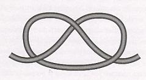

[无对应译文]

</section>

<section class="parallel-paragraph" data-paragraph-ids="s23-02-0232">

s23-02-0232

原文 · s23-02-0232

le nœud que vous pouvez faire avec n’importe quelle corde, la plus simple.

[无对应译文]

</section>

<section class="parallel-paragraph" data-paragraph-ids="s23-02-0233">

s23-02-0233

原文 · s23-02-0233

C’est le même nœud quoiqu’il n’ait pas le même aspect. Je me suis attaché à penser à ceci, dont j’avais fait, disons la trouvaille, à savoir qu’avec ce nœud, tel qu’il est montré là, il est facile de démontrer qu’il *ex-siste* un *nœud borroméen*.

[无对应译文]

</section>

<section class="parallel-paragraph" data-paragraph-ids="s23-02-0234">

s23-02-0234

原文 · s23-02-0234

Il suffit de penser que vous pouvez rendre *sous-jacent* sur une surface…

[无对应译文]

</section>

<section class="parallel-paragraph" data-paragraph-ids="s23-02-0235">

s23-02-0235

原文 · s23-02-0235

> qui est cette surface double sans laquelle nous ne saurions écrire quoi que ce soit concernant les nœuds …sur une surface donc *sous-jacente*, vous mettez *le même nœud*.

[无对应译文]

</section>

<section class="parallel-paragraph" data-paragraph-ids="s23-02-0236">

s23-02-0236

原文 · s23-02-0236

Il est très facile de réaliser - je veux dire par une écriture - ceci : qu’en faisant passer successivement \- je veux dire à chaque étape - un troisième *nœud à trois*, successivement...

[无对应译文]

</section>

<section class="parallel-paragraph" data-paragraph-ids="s23-02-0237">

s23-02-0237

原文 · s23-02-0237

> et c’est facile ça à imaginer. Ça s’imagine pas tout de suite il a fallu que j’en fasse la trouvaille ...faire passer un *nœud homologue* *sous* *le nœud sous-jacent*, et *sur* - à chaque étape - *le nœud* que j’appellerai là *sur-ja­cent*.

[无对应译文]

</section>

<section class="parallel-paragraph" data-paragraph-ids="s23-02-0238">

s23-02-0238

原文 · s23-02-0238

Ceci donc, réalise aisément un *nœud borroméen*.

[无对应译文]

</section>

<section class="parallel-paragraph" data-paragraph-ids="s23-02-0239">

s23-02-0239

原文 · s23-02-0239

→ 

[无对应译文]

</section>

<section class="parallel-paragraph" data-paragraph-ids="s23-02-0240">

s23-02-0240

原文 · s23-02-0240

Y a-t-il possibilité, avec ce *nœud à trois*, de réaliser un *nœud borroméen à quatre* ?

[无对应译文]

</section>

<section class="parallel-paragraph" data-paragraph-ids="s23-02-0241">

s23-02-0241

原文 · s23-02-0241

J’ai passé à peu près deux mois à me casser la tête sur cet objet - c’est bien là le cas de le dire – je n’ai pas réussi à démontrer qu’il *ex-siste* une façon de nouer *quatre nœuds à trois* d’une façon *borroméenne*.

[无对应译文]

</section>

<section class="parallel-paragraph" data-paragraph-ids="s23-02-0242">

s23-02-0242

原文 · s23-02-0242

Eh bien, ça ne prouve rien ! Ça ne prouve pas qu’il n’*ex-siste* pas !

[无对应译文]

</section>

<section class="parallel-paragraph" data-paragraph-ids="s23-02-0243">

s23-02-0243

原文 · s23-02-0243

Encore hier soir, je n’ai pensé qu’à ça : si j’avais pu y arriver à vous le démontrer qu’il *ex-siste*...

[无对应译文]

</section>

<section class="parallel-paragraph" data-paragraph-ids="s23-02-0244">

s23-02-0244

原文 · s23-02-0244

Ce qu’il y a de pire, c’est que je n’ai pas trouvé la raison démonstrative de ce qu’il n’*ex-siste pas*. Sim­plement, j’ai échoué.

[无对应译文]

</section>

<section class="parallel-paragraph" data-paragraph-ids="s23-02-0245">

s23-02-0245

原文 · s23-02-0245

Car même cela : que je ne puisse pas montrer que ce nœud à *quatre nœuds à trois*, en tant que *borroméen,* *ex-siste*, que je ne puisse pas le montrer ne prouve rien. Il faut que je démontre qu’il ne peut *ex-sister*.

[无对应译文]

</section>

<section class="parallel-paragraph" data-paragraph-ids="s23-02-0246">

s23-02-0246

原文 · s23-02-0246

En quoi, de cet *impossible*, un *réel* sera assuré. Le *réel* constitué par ceci : qu’il n’y a pas de *nœud borroméen* qui se constitue de *quatre nœuds à trois*. Ce serait là toucher un *réel*.

[无对应译文]

</section>

<section class="parallel-paragraph" data-paragraph-ids="s23-02-0247">

s23-02-0247

原文 · s23-02-0247

Pour vous dire ce que j’en pense, toujours avec ma façon de dire que c’est mon pen-se : *je crois qu’il ex-siste*.

[无对应译文]

</section>

<section class="parallel-paragraph" data-paragraph-ids="s23-02-0248">

s23-02-0248

原文 · s23-02-0248

Je veux dire que ce n’est pas là que *nous buterons* à un *réel*. Je ne désespère pas de le trouver.

[无对应译文]

</section>

<section class="parallel-paragraph" data-paragraph-ids="s23-02-0249">

s23-02-0249

原文 · s23-02-0249

Mais c’est un fait que je ne peux rien. Parce que dès que ça serait *démontré*, ça serait facile de vous le *montrer*. Mais il est un fait aussi, c’est que je ne peux rien de tel, vous montrer. Le rapport du montrer au démontrer est là nettement séparé.

[无对应译文]

</section>

<section class="parallel-paragraph" data-paragraph-ids="s23-02-0250">

s23-02-0250

原文 · s23-02-0250

X

[无对应译文]

</section>

<section class="parallel-paragraph" data-paragraph-ids="s23-02-0251">

s23-02-0251

原文 · s23-02-0251

Vous avez dit tout à l’heure que dans la perspective de Chomsky, le langage peut être un organe.

[无对应译文]

</section>

<section class="parallel-paragraph" data-paragraph-ids="s23-02-0252">

s23-02-0252

原文 · s23-02-0252

Et vous avez parlé de la main. Pourquoi ce mot « *main* » ?

[无对应译文]

</section>

<section class="parallel-paragraph" data-paragraph-ids="s23-02-0253">

s23-02-0253

原文 · s23-02-0253

Est-ce que sous ce mot main, il y a la référence à quelque chose de l’ordre...

[无对应译文]

</section>

<section class="parallel-paragraph" data-paragraph-ids="s23-02-0254">

s23-02-0254

原文 · s23-02-0254

qui a rapport à un objet qui n’est pas encore *technique* au sens *cartésien* du terme ?

[无对应译文]

</section>

<section class="parallel-paragraph" data-paragraph-ids="s23-02-0255">

s23-02-0255

原文 · s23-02-0255

C’est-à-dire une *technique* qui ignore le langage, qui ne parle plus d’une technique au sens cartésien du terme, c’est-à-dire une technique qui ignore le langage, qui ne parle plus d’une technique liée au langage, pour désigner le rapport du sujet au langage, est là pour montrer la nécessité d’une autre théorie de la technique que celle qui a lieu peut-être, chez Chomsky ?

[无对应译文]

</section>

<section class="parallel-paragraph" data-paragraph-ids="s23-02-0256">

s23-02-0256

原文 · s23-02-0256

Lacan

[无对应译文]

</section>

<section class="parallel-paragraph" data-paragraph-ids="s23-02-0257">

s23-02-0257

原文 · s23-02-0257

Oui, c’est ce que je prétends : malgré l’existence de poignées de mains, la main dans la poignée, dans l’acte de poigner, ne connaît pas l’autre main.

[无对应译文]

</section>

<section class="parallel-paragraph" data-paragraph-ids="s23-02-0258">

s23-02-0258

原文 · s23-02-0258

Quelqu’un attend pour un cours...

[无对应译文]

</section>

<section class="note-block original-notes">

## Notes

[^4]:
    #  Erich Fromm : *La Mission de Sigmund Freud*, éd. Complexe, Collection Textes, 1975.

</section>
