# Leçon 07 | 17 Février 1976

  <label><input type="checkbox" data-lacan-toggle="original" checked> 原文</label>
  <label><input type="checkbox" data-lacan-toggle="notes" checked> 注释</label>
  <label><input type="checkbox" data-lacan-toggle="commentary" checked> 个人解读评论</label>

<section class="parallel-paragraph" data-paragraph-ids="s23-07-0001">

s23-07-0001

[无对应译文]

原文 · s23-07-0001

J’avais un espoir...

</section>

<section class="parallel-paragraph" data-paragraph-ids="s23-07-0002">

s23-07-0002

[无对应译文]

原文 · s23-07-0002

> et ne vous faites pas l’idée qu’il s’agit de coquetterie, de titillage, comme ça ...j’avais un espoir, j’avais mis un espoir dans le fait des vacances.

</section>

<section class="parallel-paragraph" data-paragraph-ids="s23-07-0003">

s23-07-0003

[无对应译文]

原文 · s23-07-0003

Il y a beaucoup de monde qui s’en va. C’est vrai.

</section>

<section class="parallel-paragraph" data-paragraph-ids="s23-07-0004">

s23-07-0004

[无对应译文]

原文 · s23-07-0004

Dans ma clientèle c’est frappant, mais ici ça ne l’est pas.

</section>

<section class="parallel-paragraph" data-paragraph-ids="s23-07-0005">

s23-07-0005

[无对应译文]

原文 · s23-07-0005

Je veux dire que je vois toujours les portes aussi encombrées, et pour tout dire, j’espérais que la salle serait allégée.

</section>

<section class="parallel-paragraph" data-paragraph-ids="s23-07-0006">

s23-07-0006

[无对应译文]

原文 · s23-07-0006

Moyennant quoi...

</section>

<section class="parallel-paragraph" data-paragraph-ids="s23-07-0007">

s23-07-0007

[无对应译文]

原文 · s23-07-0007

> et puis en plus, tout ça, tout ça m’exaspère, parce que c’est pas de très bon ton. Enfin... ...moyennant quoi j’espérais passer aux confi­dences.

</section>

<section class="parallel-paragraph" data-paragraph-ids="s23-07-0008">

s23-07-0008

[无对应译文]

原文 · s23-07-0008

M’installer au milieu de - je sais pas - s’il y avait seulement la moitié de la salle, ça serait mieux.

</section>

<section class="parallel-paragraph" data-paragraph-ids="s23-07-0009">

s23-07-0009

[无对应译文]

原文 · s23-07-0009

Il va falloir que je retourne à un amphithéâtre qui était l’amphithéâtre 3 si je me souviens bien, comme ça je pourrai parler d’une façon un petit peu plus intime.

</section>

<section class="parallel-paragraph" data-paragraph-ids="s23-07-0010">

s23-07-0010

[无对应译文]

原文 · s23-07-0010

Ce serait quand même sympathique si je pouvais obtenir

</section>

<section class="parallel-paragraph" data-paragraph-ids="s23-07-0011">

s23-07-0011

[无对应译文]

原文 · s23-07-0011

- qu’on me réponde,

</section>

<section class="parallel-paragraph" data-paragraph-ids="s23-07-0012">

s23-07-0012

[无对应译文]

原文 · s23-07-0012

- qu’on collabore,

</section>

<section class="parallel-paragraph" data-paragraph-ids="s23-07-0013">

s23-07-0013

[无对应译文]

原文 · s23-07-0013

- qu’on s’intéresse...

</section>

<section class="parallel-paragraph" data-paragraph-ids="s23-07-0014">

s23-07-0014

[无对应译文]

原文 · s23-07-0014

Ça me semble difficile de s’intéresser à ce qui est en somme, à ce qui devient une recherche.

</section>

<section class="parallel-paragraph" data-paragraph-ids="s23-07-0015">

s23-07-0015

[无对应译文]

原文 · s23-07-0015

Je veux dire que je commence à faire ce qu’implique le mot « *recherche* » : à tourner en rond.

</section>

<section class="parallel-paragraph" data-paragraph-ids="s23-07-0016">

s23-07-0016

[无对应译文]

原文 · s23-07-0016

Il y avait un temps où j’étais un peu claironnant comme ça, je disais comme Picasso...

</section>

<section class="parallel-paragraph" data-paragraph-ids="s23-07-0017">

s23-07-0017

[无对应译文]

原文 · s23-07-0017

parce que c’est pas de moi ...« *je ne cherche pas, je trouve* » mais j’ai plus de peine maintenant à frayer mon chemin.

</section>

<section class="parallel-paragraph" data-paragraph-ids="s23-07-0018">

s23-07-0018

[无对应译文]

原文 · s23-07-0018

Bon, alors je vais quand même rentrer dans ce que je suppose...

</section>

<section class="parallel-paragraph" data-paragraph-ids="s23-07-0019">

s23-07-0019

[无对应译文]

原文 · s23-07-0019

> c’est une pure supposition, j’en suis réduit à supposer ...à ce que je suppose que vous avez entendu la dernière fois.

</section>

<section class="parallel-paragraph" data-paragraph-ids="s23-07-0020">

s23-07-0020

[无对应译文]

原文 · s23-07-0020

Et pour entrer dans le vif, je l’illustre. Voilà un nœud:

</section>

<section class="parallel-paragraph" data-paragraph-ids="s23-07-0021">

s23-07-0021

[无对应译文]

原文 · s23-07-0021

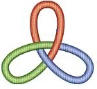

</section>

<section class="parallel-paragraph" data-paragraph-ids="s23-07-0022">

s23-07-0022

[无对应译文]

原文 · s23-07-0022

Alors, c’est le nœud qui se déduit de ce qui n’est pas un nœud, car le nœud borroméen, contrairement à son nom qui comme tous les noms reflète un sens, il a le sens qui permet dans la chaîne, dans la chaîne borroméenne, de situer quelque part *le sens*.

</section>

<section class="parallel-paragraph" data-paragraph-ids="s23-07-0023">

s23-07-0023

[无对应译文]

原文 · s23-07-0023

Il est certain que si nous appelons

</section>

<section class="parallel-paragraph" data-paragraph-ids="s23-07-0024">

s23-07-0024

[无对应译文]

原文 · s23-07-0024

- cet élément de la chaîne *l’Imaginaire*,

</section>

<section class="parallel-paragraph" data-paragraph-ids="s23-07-0025">

s23-07-0025

[无对应译文]

原文 · s23-07-0025

- cet autre *le Réel,*

</section>

<section class="parallel-paragraph" data-paragraph-ids="s23-07-0026">

s23-07-0026

[无对应译文]

原文 · s23-07-0026

- et celui-là, *le Symbolique*, *le sens* sera *là *:

</section>

<section class="parallel-paragraph" data-paragraph-ids="s23-07-0027">

s23-07-0027

[无对应译文]

原文 · s23-07-0027

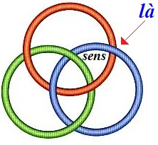

</section>

<section class="parallel-paragraph" data-paragraph-ids="s23-07-0028">

s23-07-0028

[无对应译文]

原文 · s23-07-0028

Nous ne pouvons pas espérer mieux...

</section>

<section class="parallel-paragraph" data-paragraph-ids="s23-07-0029">

s23-07-0029

[无对应译文]

原文 · s23-07-0029

> espérer de le placer ailleurs ...parce que tout ce que nous *pensons*, nous en sommes réduits à l’imaginer.

</section>

<section class="parallel-paragraph" data-paragraph-ids="s23-07-0030">

s23-07-0030

[无对应译文]

原文 · s23-07-0030

Seulement nous ne pensons pas sans mots, contrairement à ce que des psychologues, ceux de l’école de Würzburg, ont avancé.

</section>

<section class="parallel-paragraph" data-paragraph-ids="s23-07-0031">

s23-07-0031

[无对应译文]

原文 · s23-07-0031

Bon, comme vous le voyez, je suis un peu déçu, et j’ai de la peine à démarrer.

</section>

<section class="parallel-paragraph" data-paragraph-ids="s23-07-0032">

s23-07-0032

[无对应译文]

原文 · s23-07-0032

Alors, je vais entrer dans le vif, et dire ce qui peut arriver à ce qui fait nœud.

</section>

<section class="parallel-paragraph" data-paragraph-ids="s23-07-0033">

s23-07-0033

[无对应译文]

原文 · s23-07-0033

Pour ce qui fait nœud, c’est-à-dire, au minimum, le nœud à 3, celui dont je me contente puisque c’est le nœud qui se déduit de ceci que les trois ronds, les ronds de ficelle...

</section>

<section class="parallel-paragraph" data-paragraph-ids="s23-07-0034">

s23-07-0034

[无对应译文]

原文 · s23-07-0034

> comme autrefois j’avais avancé cette image ...les ronds de ficelle de *l’Imaginaire, du Réel et du Symbolique*, ben il est clair qu’ils font nœud.

</section>

<section class="parallel-paragraph" data-paragraph-ids="s23-07-0035">

s23-07-0035

[无对应译文]

原文 · s23-07-0035

Qu’ils font nœud, c’est à savoir que, ils ne se contentent pas de pouvoir isoler, déterminer un certain nombre de champs de coincement, d’endroits où si on met le doigt, on se pince.

</section>

<section class="parallel-paragraph" data-paragraph-ids="s23-07-0036">

s23-07-0036

[无对应译文]

原文 · s23-07-0036

On se pince aussi dans un nœud.

</section>

<section class="parallel-paragraph" data-paragraph-ids="s23-07-0037">

s23-07-0037

[无对应译文]

原文 · s23-07-0037

Seulement le nœud est d’une nature différente.

</section>

<section class="parallel-paragraph" data-paragraph-ids="s23-07-0038">

s23-07-0038

[无对应译文]

原文 · s23-07-0038

Alors, si vous vous souvenez bien...

</section>

<section class="parallel-paragraph" data-paragraph-ids="s23-07-0039">

s23-07-0039

[无对应译文]

原文 · s23-07-0039

> naturellement je n’en espère pas autant ...si vous vous souvenez bien, j’ai avancé la dernière fois cette remarque...

</section>

<section class="parallel-paragraph" data-paragraph-ids="s23-07-0040">

s23-07-0040

[无对应译文]

原文 · s23-07-0040

> cette remarque qui ne va pas de soi ...qu’il suffit qu’il y ait une erreur quelque part dans le nœud à 3, supposez par exemple, qu’au lieu de passer au-dessous ***ici***, ça passe au-dessus :

</section>

<section class="parallel-paragraph" data-paragraph-ids="s23-07-0041">

s23-07-0041

[无对应译文]

原文 · s23-07-0041

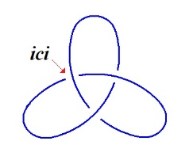 →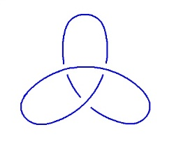

</section>

<section class="parallel-paragraph" data-paragraph-ids="s23-07-0042">

s23-07-0042

[无对应译文]

原文 · s23-07-0042

...ben, ça suffit à faire bien sûr - ça va de soi parce que chacun sait qu’il n’y a pas de nœud à deux - il suffit donc qu’il y ait *une* erreur quelque part, pour que ceci - je pense que ça vous saute aux yeux - se réduise à un seul rond.

</section>

<section class="parallel-paragraph" data-paragraph-ids="s23-07-0043">

s23-07-0043

[无对应译文]

原文 · s23-07-0043

 →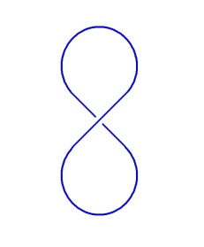 → 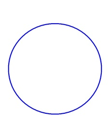

</section>

<section class="parallel-paragraph" data-paragraph-ids="s23-07-0044">

s23-07-0044

[无对应译文]

原文 · s23-07-0044

Ça ne va pas de soi, parce que si, par exemple, vous prenez le nœud à 5, celui-là...

</section>

<section class="parallel-paragraph" data-paragraph-ids="s23-07-0045">

s23-07-0045

[无对应译文]

原文 · s23-07-0045

> comme il y a un nœud à 4 qui est bien connu, qui s’appelle le nœud de Listing ...j’ai appelé celui-là, comme ça, idée loufoque... , « *le nœud de Lacan* »:

</section>

<section class="parallel-paragraph" data-paragraph-ids="s23-07-0046">

s23-07-0046

[无对应译文]

原文 · s23-07-0046

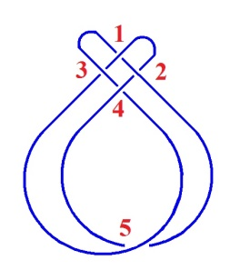

</section>

<section class="parallel-paragraph" data-paragraph-ids="s23-07-0047">

s23-07-0047

[无对应译文]

原文 · s23-07-0047

C’est en effet celui qui convient le mieux...

</section>

<section class="parallel-paragraph" data-paragraph-ids="s23-07-0048">

s23-07-0048

[无对应译文]

原文 · s23-07-0048

mais je vous dirai ça une autre fois ...c’est en effet celui qui convient le mieux. Ouais... C’est absolument sublime !

</section>

<section class="parallel-paragraph" data-paragraph-ids="s23-07-0049">

s23-07-0049

[无对应译文]

原文 · s23-07-0049

Comme chaque fois qu’on dessine un nœud on risque de se tromper : tout à l’heure au moment où je dessinais ces choses pour vous les présenter, j’ai eu affaire à quelque chose d’analogue, qui a forcé Gloria à remettre ici une pièce, quelque chose d’analogue, parce que, en dessinant comme ça, on se trompe.

</section>

<section class="parallel-paragraph" data-paragraph-ids="s23-07-0050">

s23-07-0050

[无对应译文]

原文 · s23-07-0050

Donc ce nœud-là, si vous vous trompez en un de ces deux points \[4,5\] c’est la même chose que pour le nœud à 3 : le tout se libère. Il est manifeste ici que ça ne fait qu’un rond.

</section>

<section class="parallel-paragraph" data-paragraph-ids="s23-07-0051">

s23-07-0051

[无对应译文]

原文 · s23-07-0051

Si par contre vous vous trompez en un de ces 3 points-là \[1,2,3\] vous pouvez constater que ça se maintient comme nœud, c’est-à-dire que ça reste un nœud à 3. Ceci pour vous dire que ça ne va pas de soi qu’en se trompant en 1 *point* d’un *nœud*, tout le nœud s’évapore, si je puis m’exprimer ainsi.

</section>

<section class="parallel-paragraph" data-paragraph-ids="s23-07-0052">

s23-07-0052

[无对应译文]

原文 · s23-07-0052

Bon, alors, ce que j’ai dit la dernière fois est ceci : faisant allusion au fait que le symptôme...

</section>

<section class="parallel-paragraph" data-paragraph-ids="s23-07-0053">

s23-07-0053

[无对应译文]

原文 · s23-07-0053

> ce que j’ai appelé cette année *le sinthome* ...que *le sinthome* est ce qui, dans le borroméen, la chaîne borroméenne, est ce qui permet dans cette chaîne borroméenne, si nous n’en faisons plus chaîne, c’est à savoir si ici nous faisons ce que j’ai appelé une « *erreur »,* ici et aussi ici :

</section>

<section class="parallel-paragraph" data-paragraph-ids="s23-07-0054">

s23-07-0054

[无对应译文]

原文 · s23-07-0054

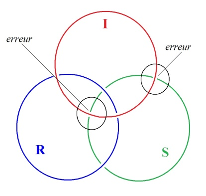

</section>

<section class="parallel-paragraph" data-paragraph-ids="s23-07-0055">

s23-07-0055

[无对应译文]

原文 · s23-07-0055

C’est-à-dire du même coup si *le Symbolique* se libère.

</section>

<section class="parallel-paragraph" data-paragraph-ids="s23-07-0056">

s23-07-0056

[无对应译文]

原文 · s23-07-0056

Comme je l’ai autrefois bien marqué, nous avons un moyen de réparer ça, c’est de faire ce que, pour la première fois j’ai défini comme *le sinthome* \[Σ\], à savoir le quelque chose qui permet au *Symbolique, à* *l’Imaginaire et au Réel*, de continuer de tenir ensemble, quoique là aucun ne tient plus avec l’autre, ceci grâce à deux erreurs.

</section>

<section class="parallel-paragraph" data-paragraph-ids="s23-07-0057">

s23-07-0057

[无对应译文]

原文 · s23-07-0057

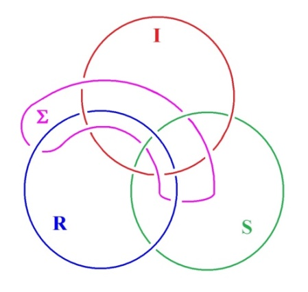

</section>

<section class="parallel-paragraph" data-paragraph-ids="s23-07-0058">

s23-07-0058

[无对应译文]

原文 · s23-07-0058

Je me suis permis de définir comme *sinthome* ce qui, non pas permet au nœud à 3 de faire encore nœud à 3, mais ce qu’il conserve dans une position telle qu’il ait l’air de faire nœud à 3.

</section>

<section class="parallel-paragraph" data-paragraph-ids="s23-07-0059">

s23-07-0059

[无对应译文]

原文 · s23-07-0059

Voilà ce que j’ai avancé tout doucement la dernière fois.

</section>

<section class="parallel-paragraph" data-paragraph-ids="s23-07-0060">

s23-07-0060

[无对应译文]

原文 · s23-07-0060

Et je vous le réévoque incidemment, j’ai pensé...

</section>

<section class="parallel-paragraph" data-paragraph-ids="s23-07-0061">

s23-07-0061

[无对应译文]

原文 · s23-07-0061

> faites-en ce que vous voudrez de ma pensée ...j’ai pensé que c’était là la clé de ce qui était arrivé à Joyce.

</section>

<section class="parallel-paragraph" data-paragraph-ids="s23-07-0062">

s23-07-0062

[无对应译文]

原文 · s23-07-0062

Que Joyce a un symptôme qui part de ceci : que son père était carent, radicalement carent, il ne parle que de ça.

</section>

<section class="parallel-paragraph" data-paragraph-ids="s23-07-0063">

s23-07-0063

[无对应译文]

原文 · s23-07-0063

J’ai centré la chose autour du *nom*, du *nom propre*.

</section>

<section class="parallel-paragraph" data-paragraph-ids="s23-07-0064">

s23-07-0064

[无对应译文]

原文 · s23-07-0064

Et j’ai pensé que...

</section>

<section class="parallel-paragraph" data-paragraph-ids="s23-07-0065">

s23-07-0065

[无对应译文]

原文 · s23-07-0065

> faites-en ce que vous voulez de cette pensée ...et j’ai pensé que c’est de se vouloir un nom, que Joyce a fait la compensation de la *carence paternelle*.

</section>

<section class="parallel-paragraph" data-paragraph-ids="s23-07-0066">

s23-07-0066

[无对应译文]

原文 · s23-07-0066

C’est tout au moins ce que j’ai dit, parce que je pouvais pas dire mieux.

</section>

<section class="parallel-paragraph" data-paragraph-ids="s23-07-0067">

s23-07-0067

[无对应译文]

原文 · s23-07-0067

J’essaierai d’articuler ça d’une façon plus précise, mais il est clair que l’art de Joyce est quelque chose de *tellement particulier*, que le terme *sinthome* est bien ce qui lui convient.

</section>

<section class="parallel-paragraph" data-paragraph-ids="s23-07-0068">

s23-07-0068

[无对应译文]

原文 · s23-07-0068

Il se trouve que vendredi, à ma « *présentation de*... quelque chose qu’on considère généralement comme « *un cas »*, un cas de folie assuré­ment. Un cas de folie qui a commencé par le *sinthome* : « *paroles imposées* ».

</section>

<section class="parallel-paragraph" data-paragraph-ids="s23-07-0069">

s23-07-0069

[无对应译文]

原文 · s23-07-0069

C’est tout au moins ainsi que le patient articule lui-même ce quelque chose qui paraît tout ce qu’il y a de plus sensé dans l’ordre d’une articulation que je peux dire être lacanienne.

</section>

<section class="parallel-paragraph" data-paragraph-ids="s23-07-0070">

s23-07-0070

[无对应译文]

原文 · s23-07-0070

Comment est-ce que nous ne sentons pas tous, que des paroles dont nous dépendons, nous sont en  quelque sorte imposées ?

</section>

<section class="parallel-paragraph" data-paragraph-ids="s23-07-0071">

s23-07-0071

[无对应译文]

原文 · s23-07-0071

C’est bien en quoi ce qu’on appelle un malade va quelquefois plus loin que ce qu’on appelle un homme normal.

</section>

<section class="parallel-paragraph" data-paragraph-ids="s23-07-0072">

s23-07-0072

[无对应译文]

原文 · s23-07-0072

La question est plutôt de savoir pourquoi est-ce qu’un homme normal - dit normal - ne s’aperçoit pas :

</section>

<section class="parallel-paragraph" data-paragraph-ids="s23-07-0073">

s23-07-0073

[无对应译文]

原文 · s23-07-0073

- que la parole est un parasite,

</section>

<section class="parallel-paragraph" data-paragraph-ids="s23-07-0074">

s23-07-0074

[无对应译文]

原文 · s23-07-0074

- que la parole est un placage,

</section>

<section class="parallel-paragraph" data-paragraph-ids="s23-07-0075">

s23-07-0075

[无对应译文]

原文 · s23-07-0075

- que la parole est la forme de cancer dont l’être humain est affligé.

</section>

<section class="parallel-paragraph" data-paragraph-ids="s23-07-0076">

s23-07-0076

[无对应译文]

原文 · s23-07-0076

Comment est-ce qu’il y en a qui vont jusqu’à le sentir ?

</section>

<section class="parallel-paragraph" data-paragraph-ids="s23-07-0077">

s23-07-0077

[无对应译文]

原文 · s23-07-0077

Il est certain que là-dessus, Joyce nous donne un petit soupçon.

</section>

<section class="parallel-paragraph" data-paragraph-ids="s23-07-0078">

s23-07-0078

[无对应译文]

原文 · s23-07-0078

Je veux dire que je n’ai pas parlé la dernière fois de sa fille Lucia...

</section>

<section class="parallel-paragraph" data-paragraph-ids="s23-07-0079">

s23-07-0079

[无对应译文]

原文 · s23-07-0079

> puisqu’il a donné à ses enfants des noms italiens ...je n’ai pas parlé de la fille Lucia par un dessein de ne pas donner dans ce qu’on peut appeler la petite histoire.

</section>

<section class="parallel-paragraph" data-paragraph-ids="s23-07-0080">

s23-07-0080

[无对应译文]

原文 · s23-07-0080

La fille, Lucia, vit encore. Elle est dans une maison de santé, en Angleterre.

</section>

<section class="parallel-paragraph" data-paragraph-ids="s23-07-0081">

s23-07-0081

[无对应译文]

原文 · s23-07-0081

Elle est ce qu’on appelle, comme ça, couramment, une schizophrène.

</section>

<section class="parallel-paragraph" data-paragraph-ids="s23-07-0082">

s23-07-0082

[无对应译文]

原文 · s23-07-0082

Mais la chose m’a été, lors de ma dernière présentation de cas, rappelée, en ceci que le cas que je présentais avait subi une aggravation.

</section>

<section class="parallel-paragraph" data-paragraph-ids="s23-07-0083">

s23-07-0083

[无对应译文]

原文 · s23-07-0083

Après avoir eu le sentiment...

</section>

<section class="parallel-paragraph" data-paragraph-ids="s23-07-0084">

s23-07-0084

[无对应译文]

原文 · s23-07-0084

> sentiment que je considère quant à moi comme sensé ...le sentiment de paroles qui lui étaient imposées, les choses se sont aggravées, et qu’il a eu le sentiment, non seulement que des paroles lui étaient imposées, mais qu’il était affecté de ce qu’il appelait lui-même « *télépathie »*... qui n’était pas ce qu’on appelle couramment de ce mot ...à savoir d’être averti de choses qui arrivent aux autres, mais que par contre tout le monde était averti de ce qu’il se formulait lui-même, à part lui, à savoir ses réflexions les plus intimes, et tout à fait spéciale­ment les réflexions qui lui venaient en marge des fameuses « *paroles imposées* ».

</section>

<section class="parallel-paragraph" data-paragraph-ids="s23-07-0085">

s23-07-0085

[无对应译文]

原文 · s23-07-0085

Car il entendait quelque chose : « *sale assassinat politique* » par exemple.

</section>

<section class="parallel-paragraph" data-paragraph-ids="s23-07-0086">

s23-07-0086

[无对应译文]

原文 · s23-07-0086

Ce qu’il faisait équivalent à « *sale assistanat politique* ».

</section>

<section class="parallel-paragraph" data-paragraph-ids="s23-07-0087">

s23-07-0087

[无对应译文]

原文 · s23-07-0087

On voit bien que là le signifiant se réduit à ce qu’il est, à l’équivoque, à une torsion de voix.

</section>

<section class="parallel-paragraph" data-paragraph-ids="s23-07-0088">

s23-07-0088

[无对应译文]

原文 · s23-07-0088

Mais à « *sale assistanat »* ou à « *sale assassinat »* dit « *politique »*, il se disait à lui-même, en réponse, quelque chose.

</section>

<section class="parallel-paragraph" data-paragraph-ids="s23-07-0089">

s23-07-0089

[无对应译文]

原文 · s23-07-0089

À savoir quelque chose qui commençait par un « *mais* », et qui était sa réflexion à ce sujet.

</section>

<section class="parallel-paragraph" data-paragraph-ids="s23-07-0090">

s23-07-0090

[无对应译文]

原文 · s23-07-0090

Et ce qui le rendait tout à fait affolé, c’était la pensée que ce qu’il se faisait comme réflexion en plus...

</section>

<section class="parallel-paragraph" data-paragraph-ids="s23-07-0091">

s23-07-0091

[无对应译文]

原文 · s23-07-0091

> en plus de ce qu’il considérait comme des paroles qui lui étaient imposées ...c’était cela qui était aussi connu de tous les autres.

</section>

<section class="parallel-paragraph" data-paragraph-ids="s23-07-0092">

s23-07-0092

[无对应译文]

原文 · s23-07-0092

Il était donc, comme il s’exprime, « *télépathe émetteur* ». Autrement dit, il n’avait plus de secret.

</section>

<section class="parallel-paragraph" data-paragraph-ids="s23-07-0093">

s23-07-0093

[无对应译文]

原文 · s23-07-0093

Et cela-même, c’est cela qui lui a fait commettre une tentative d’en finir...

</section>

<section class="parallel-paragraph" data-paragraph-ids="s23-07-0094">

s23-07-0094

[无对应译文]

原文 · s23-07-0094

> la vie lui étant de ce fait, de ce fait de n’avoir plus de secret, de n’avoir plus rien de réservé ...qui lui a fait commettre ce qu’on appelle « *une tentative de suicide* », qui était aussi bien ce pourquoi il était là, et ce pourquoi j’avais, en somme, à m’intéresser à lui.

</section>

<section class="parallel-paragraph" data-paragraph-ids="s23-07-0095">

s23-07-0095

[无对应译文]

原文 · s23-07-0095

Ce qui me pousse aujourd’hui à vous parler de la fille Lucia, est très exactement ceci...

</section>

<section class="parallel-paragraph" data-paragraph-ids="s23-07-0096">

s23-07-0096

[无对应译文]

原文 · s23-07-0096

> je m’en étais bien gardé la dernière fois, pour ne pas tomber dans la petite histoire ...c’est que Joyce...

</section>

<section class="parallel-paragraph" data-paragraph-ids="s23-07-0097">

s23-07-0097

[无对应译文]

原文 · s23-07-0097

> Joyce qui a défendu farouchement sa fille, sa fille la schizophrène,
>
> ce qu’on appelle schizo­phrène, contre la prise des médecins

</section>

<section class="parallel-paragraph" data-paragraph-ids="s23-07-0098">

s23-07-0098

[无对应译文]

原文 · s23-07-0098

...Joyce n’articulait qu’une chose, c’est que sa fille était une télépathe.

</section>

<section class="parallel-paragraph" data-paragraph-ids="s23-07-0099">

s23-07-0099

[无对应译文]

原文 · s23-07-0099

Je veux dire que dans les lettres qu’il écrit à son propos, il formule :

</section>

<section class="parallel-paragraph" data-paragraph-ids="s23-07-0100">

s23-07-0100

[无对应译文]

原文 · s23-07-0100

- qu’elle est beaucoup plus intelligente que tout le monde,

</section>

<section class="parallel-paragraph" data-paragraph-ids="s23-07-0101">

s23-07-0101

[无对应译文]

原文 · s23-07-0101

- qu’elle l’informe, *miraculeusement* est le mot sous-en­tendu, de tout ce qui arrive à un certain nombre de gens,

</section>

<section class="parallel-paragraph" data-paragraph-ids="s23-07-0102">

s23-07-0102

[无对应译文]

原文 · s23-07-0102

- que pour elle ces gens n’ont pas de secrets.

</section>

<section class="parallel-paragraph" data-paragraph-ids="s23-07-0103">

s23-07-0103

[无对应译文]

原文 · s23-07-0103

Est-ce qu’il n’y a pas là quelque chose de saisissant ?

</section>

<section class="parallel-paragraph" data-paragraph-ids="s23-07-0104">

s23-07-0104

[无对应译文]

原文 · s23-07-0104

Non pas du tout que je pense que Lucia fût effectivement une télépathe, qu’elle sût ce qui arrivait à des gens sur lesquels elle n’avait pas plus d’informations qu’une autre.

</section>

<section class="parallel-paragraph" data-paragraph-ids="s23-07-0105">

s23-07-0105

[无对应译文]

原文 · s23-07-0105

Mais que Joyce lui attribue cette vertu sur un certain nombre de signes, de déclarations, que lui il enten­dait d’une certaine façon, c’est bien le quelque chose où je vois que pour défendre - si on peut dire - sa fille, il lui attribue quelque chose qui est dans le prolongement de ce que j’appellerai momentanément *son pro­pre symptôme*.

</section>

<section class="parallel-paragraph" data-paragraph-ids="s23-07-0106">

s23-07-0106

[无对应译文]

原文 · s23-07-0106

C’est à savoir...

</section>

<section class="parallel-paragraph" data-paragraph-ids="s23-07-0107">

s23-07-0107

[无对应译文]

原文 · s23-07-0107

> il est difficile dans son cas de ne pas évoquer mon propre patient tel que chez lui ça avait commencé ...c’est à savoir qu’à l’endroit de la parole, on ne peut pas dire que quelque chose n’était pas à Joyce *imposé*.

</section>

<section class="parallel-paragraph" data-paragraph-ids="s23-07-0108">

s23-07-0108

[无对应译文]

原文 · s23-07-0108

Je veux dire que dans le progrès en quelque sorte continu qu’a constitué *son art, à savoir cette parole*...

</section>

<section class="parallel-paragraph" data-paragraph-ids="s23-07-0109">

s23-07-0109

[无对应译文]

原文 · s23-07-0109

*parole qui vient à être écrite* ...de la briser, de la démantibuler, de faire qu’à la fin ce qui - à le lire - paraît un progrès continu...

</section>

<section class="parallel-paragraph" data-paragraph-ids="s23-07-0110">

s23-07-0110

[无对应译文]

原文 · s23-07-0110

> depuis l’effort qu’il faisait dans ses premiers essais critiques, puis ensuite,
>
> dans le *Portrait de l’Artiste,* et enfin dans *Ulysse* pour terminer par *Finnegan’s Wake* ...*il est difficile de ne pas voir qu’un certain rapport à la parole lui est de plus en plus imposé*.

</section>

<section class="parallel-paragraph" data-paragraph-ids="s23-07-0111">

s23-07-0111

[无对应译文]

原文 · s23-07-0111

Imposé au point qu’il finit par « *dissoudre le langage même* », comme l’a noté fort bien Philippe Sollers...

</section>

<section class="parallel-paragraph" data-paragraph-ids="s23-07-0112">

s23-07-0112

[无对应译文]

原文 · s23-07-0112

je vous ai dit ça au début de l’année ...imposer au langage même une sorte de brisure, de décomposition qui fait que il n’y a plus d’identité phona­toire.

</section>

<section class="parallel-paragraph" data-paragraph-ids="s23-07-0113">

s23-07-0113

[无对应译文]

原文 · s23-07-0113

*Sans doute y a-t-il là une « réflexion » au niveau de l’écriture*.

</section>

<section class="parallel-paragraph" data-paragraph-ids="s23-07-0114">

s23-07-0114

[无对应译文]

原文 · s23-07-0114

Je veux dire *que c’est par l’intermédiaire de l’écriture que la parole se dé­compose en s’imposant*.

</section>

<section class="parallel-paragraph" data-paragraph-ids="s23-07-0115">

s23-07-0115

[无对应译文]

原文 · s23-07-0115

En s’imposant comme telle, à savoir dans une déformation dont reste ambigu de savoir si c’est de se libérer du para­site...

</section>

<section class="parallel-paragraph" data-paragraph-ids="s23-07-0116">

s23-07-0116

[无对应译文]

原文 · s23-07-0116

> du parasite parolier dont je parlais tout à l’heure ...qu’il s’agit, ou au contraire de quelque chose qui se laisse envahir par les propriétés d’ordre essentiellement *phonémiques* de la parole, par la polyphonie de la parole.

</section>

<section class="parallel-paragraph" data-paragraph-ids="s23-07-0117">

s23-07-0117

[无对应译文]

原文 · s23-07-0117

Quoiqu’il en soit, que Joyce articule à propos de Lucia - pour la défendre - qu’elle est une télépathe, me paraît...

</section>

<section class="parallel-paragraph" data-paragraph-ids="s23-07-0118">

s23-07-0118

[无对应译文]

原文 · s23-07-0118

en raison de ce malade dont je considérais le cas la dernière fois que j’ai fait ce qu’on appelle ma « *présentation à Sainte-Anne* » ...me paraît certainement indicatif, indicatif de quelque chose dont je dirai que Joyce témoigne en ce point même, qui est le point que j’ai désigné comme étant celui de la carence du père.

</section>

<section class="parallel-paragraph" data-paragraph-ids="s23-07-0119">

s23-07-0119

[无对应译文]

原文 · s23-07-0119

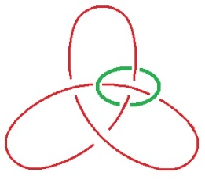

</section>

<section class="parallel-paragraph" data-paragraph-ids="s23-07-0120">

s23-07-0120

[无对应译文]

原文 · s23-07-0120

Ce que je voudrais marquer, c’est que ce que j’appelle, ce que je désigne, ce que je supporte du *sinthome* qui est ici marqué d’un rond, d’un rond de ficelle, ce qui est censé - par moi - se produire à la place même, où disons « le tracé » du nœud fait erreur.

</section>

<section class="parallel-paragraph" data-paragraph-ids="s23-07-0121">

s23-07-0121

[无对应译文]

原文 · s23-07-0121

Il nous est difficile de ne pas voir *que* *le lapsus est ce sur quoi, en partie, se fonde la notion de l’Inconscient.*

</section>

<section class="parallel-paragraph" data-paragraph-ids="s23-07-0122">

s23-07-0122

[无对应译文]

原文 · s23-07-0122

*Que le mot d’esprit* en soit aussi, *est à verser au même compte* si je puis dire.

</section>

<section class="parallel-paragraph" data-paragraph-ids="s23-07-0123">

s23-07-0123

[无对应译文]

原文 · s23-07-0123

Car après tout, *le mot d’esprit, il n’est pas impensable qu’il résulte d’un lapsus*.

</section>

<section class="parallel-paragraph" data-paragraph-ids="s23-07-0124">

s23-07-0124

[无对应译文]

原文 · s23-07-0124

C’est tout au moins *ainsi que Freud lui-même l’articule*, c’est à savoir que c’est un court-circuit, Que, comme il l’avance, *c’est une économie au regard d’un plaisir, d’une satisfaction*. *Que ce soit à la place où le nœud rate*, *où il y a* *une sorte de lapsus du nœud* lui-même, est quelque chose qui *est bien fait pour nous retenir*.

</section>

<section class="parallel-paragraph" data-paragraph-ids="s23-07-0125">

s23-07-0125

[无对应译文]

原文 · s23-07-0125

Que moi-même, il m’arrive comme je l’ai montré ici, de rater à l’occasion, c’est bien ce qui, en quelque sorte, confirme qu’un nœud ça se rate.

</section>

<section class="parallel-paragraph" data-paragraph-ids="s23-07-0126">

s23-07-0126

[无对应译文]

原文 · s23-07-0126

Ça se rate, tout aussi bien que l’inconscient est là pour nous montrer que c’est à partir de sa *consistance* à lui - à l’inconscient - qu’il y a des tas de ratés.

</section>

<section class="parallel-paragraph" data-paragraph-ids="s23-07-0127">

s23-07-0127

[无对应译文]

原文 · s23-07-0127

Mais, si ici se renouvelle la notion de faute, est-ce que la faute...

</section>

<section class="parallel-paragraph" data-paragraph-ids="s23-07-0128">

s23-07-0128

[无对应译文]

原文 · s23-07-0128

> ce dont la conscience fait *le péché* ...est de l’ordre du *lapsus* ?

</section>

<section class="parallel-paragraph" data-paragraph-ids="s23-07-0129">

s23-07-0129

[无对应译文]

原文 · s23-07-0129

L’équivoque du mot est aussi bien ce qui permet de le penser, de passer d’un sens à l’autre.

</section>

<section class="parallel-paragraph" data-paragraph-ids="s23-07-0130">

s23-07-0130

[无对应译文]

原文 · s23-07-0130

Est-ce qu’il y a dans la faute...

</section>

<section class="parallel-paragraph" data-paragraph-ids="s23-07-0131">

s23-07-0131

[无对应译文]

原文 · s23-07-0131

> cette faute première dont Joyce nous fait tellement état, ...est-ce qu’il y a quelque chose de l’ordre du *lapsus* ?

</section>

<section class="parallel-paragraph" data-paragraph-ids="s23-07-0132">

s23-07-0132

[无对应译文]

原文 · s23-07-0132

Ceci bien sûr, n’est pas sans évoquer tout un imbroglio.

</section>

<section class="parallel-paragraph" data-paragraph-ids="s23-07-0133">

s23-07-0133

[无对应译文]

原文 · s23-07-0133

Mais nous en sommes là, nous sommes dans le nœud, et du même coup dans l’embrouille.

</section>

<section class="parallel-paragraph" data-paragraph-ids="s23-07-0134">

s23-07-0134

[无对应译文]

原文 · s23-07-0134

Ce qu’il y a de remarquable, c’est qu’à vouloir corriger le *lapsus* au point même où il se produit...

</section>

<section class="parallel-paragraph" data-paragraph-ids="s23-07-0135">

s23-07-0135

[无对应译文]

原文 · s23-07-0135

> qu’est-ce que ça veut dire qu’il se produise là ? ...il y a équivoque puisque en deux autres points, nous avons la conséquence du lapsus qui s’est produit ailleurs.

</section>

<section class="parallel-paragraph" data-paragraph-ids="s23-07-0136">

s23-07-0136

[无对应译文]

原文 · s23-07-0136

Le frappant est que, *ailleurs* ça n’a pas *les mêmes conséquences*.

</section>

<section class="parallel-paragraph" data-paragraph-ids="s23-07-0137">

s23-07-0137

[无对应译文]

原文 · s23-07-0137

C’est ce que j’illustre de la façon qu’ici j’ai essayé de dessiner.

</section>

<section class="parallel-paragraph" data-paragraph-ids="s23-07-0138">

s23-07-0138

[无对应译文]

原文 · s23-07-0138

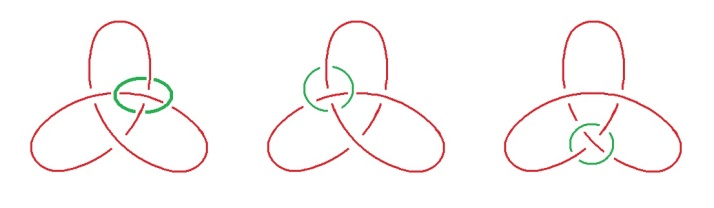

</section>

<section class="parallel-paragraph" data-paragraph-ids="s23-07-0139">

s23-07-0139

[无对应译文]

原文 · s23-07-0139

Vous pouvez, si vous faites attention, vous pouvez voir...

</section>

<section class="parallel-paragraph" data-paragraph-ids="s23-07-0140">

s23-07-0140

[无对应译文]

原文 · s23-07-0140

d’une façon dont le nœud répond ...vous pouvez voir *qu’à réparer par un sinthome au point même où le lapsus s’est produit*...

</section>

<section class="parallel-paragraph" data-paragraph-ids="s23-07-0141">

s23-07-0141

[无对应译文]

原文 · s23-07-0141

vous n’obtenez pas le même nœud en mettant le *sinthome* à la place même où s’est produite *la faute*, ou bien en corrigeant de même par un *sinthome* la chose en les deux autres points.

</section>

<section class="parallel-paragraph" data-paragraph-ids="s23-07-0142">

s23-07-0142

[无对应译文]

原文 · s23-07-0142

Car en corrigeant la chose, *le lapsus,* dans les deux autres points...

</section>

<section class="parallel-paragraph" data-paragraph-ids="s23-07-0143">

s23-07-0143

[无对应译文]

原文 · s23-07-0143

> ce qui est aussi concevable, puisque ce dont il s’agit,
>
> c’est de faire que quelque chose subsiste de la primitive structure du *nœud à trois* ...le quelque chose qui subsiste du fait de l’intervention du *sinthome*

</section>

<section class="parallel-paragraph" data-paragraph-ids="s23-07-0144">

s23-07-0144

[无对应译文]

原文 · s23-07-0144

- est différent quand ça se produit au point même du lapsus,

</section>

<section class="parallel-paragraph" data-paragraph-ids="s23-07-0145">

s23-07-0145

[无对应译文]

原文 · s23-07-0145

- est *différent de ce qui se produit* si, de la même façon, corrigée, dans les 2 autres points du nœud à 3 par un *sinthome*.

</section>

<section class="parallel-paragraph" data-paragraph-ids="s23-07-0146">

s23-07-0146

[无对应译文]

原文 · s23-07-0146

Chose frappante, il y a quelque chose de commun dans la façon dont se nouent les choses, il y a quelque chose qui se marque à une certaine direction, à une certaine orientation, à une certaine, disons *dextrogyrie*, de la compensation.

</section>

<section class="parallel-paragraph" data-paragraph-ids="s23-07-0147">

s23-07-0147

[无对应译文]

原文 · s23-07-0147

Mais il n’en reste pas moins clair qu’ici :

</section>

<section class="parallel-paragraph" data-paragraph-ids="s23-07-0148">

s23-07-0148

[无对应译文]

原文 · s23-07-0148

</section>

<section class="parallel-paragraph" data-paragraph-ids="s23-07-0149">

s23-07-0149

[无对应译文]

原文 · s23-07-0149

ce qui résulte de la compensation nouée, de la compensation par le *sinthome*, est différent de ce qui se produit ici et là :

</section>

<section class="parallel-paragraph" data-paragraph-ids="s23-07-0150">

s23-07-0150

[无对应译文]

原文 · s23-07-0150

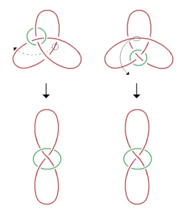

</section>

<section class="parallel-paragraph" data-paragraph-ids="s23-07-0151">

s23-07-0151

[无对应译文]

原文 · s23-07-0151

La nature de cette différence est ceci, c’est que entre ceci et ceci, à savoir le *sinthome* et la boucle qui se fait ici, si je puis dire spontanément, est inversible : que ceci à cela - à savoir *le huit*, disons *rouge* et *le rond vert* - est strictement équivalent.

</section>

<section class="parallel-paragraph" data-paragraph-ids="s23-07-0152">

s23-07-0152

[无对应译文]

原文 · s23-07-0152

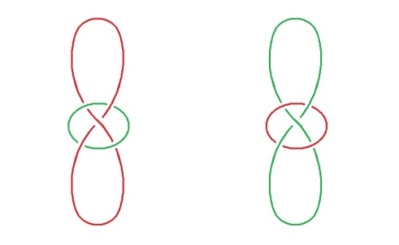

</section>

<section class="parallel-paragraph" data-paragraph-ids="s23-07-0153">

s23-07-0153

[无对应译文]

原文 · s23-07-0153

À l’inverse, vous n’avez qu’à prendre *un nœud de huit*, fait ainsi vous obtiendrez très aisément l’autre forme.

</section>

<section class="parallel-paragraph" data-paragraph-ids="s23-07-0154">

s23-07-0154

[无对应译文]

原文 · s23-07-0154

Il n’y a rien de plus simple. C’est même imaginable.

</section>

<section class="parallel-paragraph" data-paragraph-ids="s23-07-0155">

s23-07-0155

[无对应译文]

原文 · s23-07-0155

Il vous suffit de concevoir que vous tirez les choses de telle sorte...

</section>

<section class="parallel-paragraph" data-paragraph-ids="s23-07-0156">

s23-07-0156

[无对应译文]

原文 · s23-07-0156

> je parle : sur le rouge ...de sorte à faire que le rouge fasse ici un rond.

</section>

<section class="parallel-paragraph" data-paragraph-ids="s23-07-0157">

s23-07-0157

[无对应译文]

原文 · s23-07-0157

Rien de plus facile que de voir, de sentir, qu’il y a toutes les chances que ce qui est alors d’abord *rond vert* deviendra un *huit vert*. Et à l’usage, vous verrez que c’est un huit exactement de la même forme, de la même *dextrogyrie*.

</section>

<section class="parallel-paragraph" data-paragraph-ids="s23-07-0158">

s23-07-0158

[无对应译文]

原文 · s23-07-0158

Il y a donc strictement *équivalence,* et il n’est...

</section>

<section class="parallel-paragraph" data-paragraph-ids="s23-07-0159">

s23-07-0159

[无对应译文]

原文 · s23-07-0159

> après ce que j’ai frayé autour du *rapport sexuel...*il n’est pas difficile de suggérer que quand il y a équivalence, c’est bien en cela qu’il n’y a pas de *rapport*.

</section>

<section class="parallel-paragraph" data-paragraph-ids="s23-07-0160">

s23-07-0160

[无对应译文]

原文 · s23-07-0160

Si pour un instant, nous supposons que ce qu’il en est de ce qui dès lors est un ratage du nœud, du nœud à 3, *ce ratage est stricte­ment équivalent* - il n’y a pas besoin de le dire - *dans les deux sexes*.

</section>

<section class="parallel-paragraph" data-paragraph-ids="s23-07-0161">

s23-07-0161

[无对应译文]

原文 · s23-07-0161

Et si ce que nous voyons ici comme équivalent, est supporté du fait que, aussi bien dans un sexe que dans l’autre, il y a eu ratage, ratage du nœud, il est clair que *le résultat est ceci : que les deux sexes sont équivalents*.

</section>

<section class="parallel-paragraph" data-paragraph-ids="s23-07-0162">

s23-07-0162

[无对应译文]

原文 · s23-07-0162

À ceci près, pourtant, que si la faute est réparée à la place même :

</section>

<section class="parallel-paragraph" data-paragraph-ids="s23-07-0163">

s23-07-0163

[无对应译文]

原文 · s23-07-0163

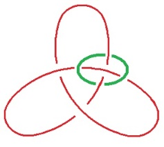

</section>

<section class="parallel-paragraph" data-paragraph-ids="s23-07-0164">

s23-07-0164

[无对应译文]

原文 · s23-07-0164

les deux sexes - ici symbolisés par les deux couleurs - les deux sexes ne le sont plus, équivalents.

</section>

<section class="parallel-paragraph" data-paragraph-ids="s23-07-0165">

s23-07-0165

[无对应译文]

原文 · s23-07-0165

Car ici vous voyez ce qui correspond à ce que j’ai appelé tout à l’heure l’équivalence, ce qui y correspond est ceci qui est loin d’être équivalent. Si ici, une couleur peut être remplacée par l’autre :

</section>

<section class="parallel-paragraph" data-paragraph-ids="s23-07-0166">

s23-07-0166

[无对应译文]

原文 · s23-07-0166

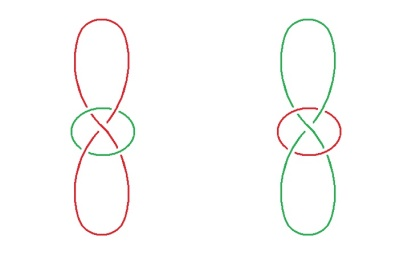

</section>

<section class="parallel-paragraph" data-paragraph-ids="s23-07-0167">

s23-07-0167

[无对应译文]

原文 · s23-07-0167

Inversement ici, vous voyez que le rond vert est, si je puis dire, interne à l’ensemble de ce qui est ici supporté par le double huit rouge et qui ici, se retrouve dans le double huit vert.

</section>

<section class="parallel-paragraph" data-paragraph-ids="s23-07-0168">

s23-07-0168

[无对应译文]

原文 · s23-07-0168

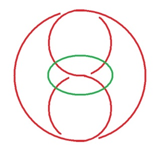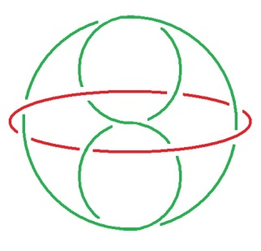

</section>

<section class="parallel-paragraph" data-paragraph-ids="s23-07-0169">

s23-07-0169

[无对应译文]

原文 · s23-07-0169

Ceux-là...

</section>

<section class="parallel-paragraph" data-paragraph-ids="s23-07-0170">

s23-07-0170

[无对应译文]

原文 · s23-07-0170

et c’est *intentionnellement* que je l’ai inscrit de cette façon, c’est pour que vous les reconnaissiez comme tels ...le vert à ce double huit, est interne, ici le rouge est externe. C’est même là-dessus que j’ai fait travailler notre cher Jacques-Alain Miller qui était à ma maison de campagne, en même temps que je cogitais ceci.

</section>

<section class="parallel-paragraph" data-paragraph-ids="s23-07-0171">

s23-07-0171

[无对应译文]

原文 · s23-07-0171

Je lui ai...

</section>

<section class="parallel-paragraph" data-paragraph-ids="s23-07-0172">

s23-07-0172

[无对应译文]

原文 · s23-07-0172

à juste titre, contrairement à ce que je lui ai dit ...je lui ai avancé cette forme, en le priant de découvrir l’équivalence qui aurait pu se produire.

</section>

<section class="parallel-paragraph" data-paragraph-ids="s23-07-0173">

s23-07-0173

[无对应译文]

原文 · s23-07-0173

Mais il est clair que *l’équivalence ne peut pas se produire* comme il apparaît de ceci, c’est que le vert, au regard du double huit et du huit rouge, est quelque chose qui ne saurait franchir, si je puis dire, la bande externe de ce double huit rouge.

</section>

<section class="parallel-paragraph" data-paragraph-ids="s23-07-0174">

s23-07-0174

[无对应译文]

原文 · s23-07-0174

Il n’y a donc pas - au niveau du *sinthome -* il n’y a pas *équivalence* du rapport du vert et du rouge, pour nous contenter de cette désignation simple.

</section>

<section class="parallel-paragraph" data-paragraph-ids="s23-07-0175">

s23-07-0175

[无对应译文]

原文 · s23-07-0175

C’est dans la mesure où il y a *sinthome* *qu’il n’y a pas* *équiva­lence sexuelle*, c’est-à-dire qu’il y a *rapport*.

</section>

<section class="parallel-paragraph" data-paragraph-ids="s23-07-0176">

s23-07-0176

[无对应译文]

原文 · s23-07-0176

Car il est bien sûr que si nous disons que le *non-rapport* relève de l’équivalence, c’est dans la mesure où il n’y a pas équivalence que se structure *le rapport*.

</section>

<section class="parallel-paragraph" data-paragraph-ids="s23-07-0177">

s23-07-0177

[无对应译文]

原文 · s23-07-0177

Il y a donc à la fois rapport sexuel et pas rapport.

</section>

<section class="parallel-paragraph" data-paragraph-ids="s23-07-0178">

s23-07-0178

[无对应译文]

原文 · s23-07-0178

À ceci près que *là où il y a rapport, c’est dans la mesure où il y a sinthome*, c’est-à-dire où, comme je l’ai dit, *c’est du sinthome qu’est supporté l’autre sexe.*

</section>

<section class="parallel-paragraph" data-paragraph-ids="s23-07-0179">

s23-07-0179

[无对应译文]

原文 · s23-07-0179

Je me suis permis de dire que le *sinthome*, c’est très précisément le sexe auquel je n’appartiens pas, c’est-à-dire *une* femme.

</section>

<section class="parallel-paragraph" data-paragraph-ids="s23-07-0180">

s23-07-0180

[无对应译文]

原文 · s23-07-0180

*Si une femme est un sinthome pour tout homme*, il est tout à fait clair qu’il y a besoin de trouver un autre nom pour ce qu’il en est de l’homme pour *une* femme, puisque justement le *sinthome* se caractérise de la *non-équiva­lence*.

</section>

<section class="parallel-paragraph" data-paragraph-ids="s23-07-0181">

s23-07-0181

[无对应译文]

原文 · s23-07-0181

*On peut dire que l’homme est pour une femme* tout ce qui vous plaira, à savoir une affliction pire qu’un *sinthome*, vous pouvez bien l’articuler comme il vous convient, *un ravage* même, mais s’il n’y a pas d’équivalence, vous êtes forcés de spécifier ce qu’il en est du *sinthome*.

</section>

<section class="parallel-paragraph" data-paragraph-ids="s23-07-0182">

s23-07-0182

[无对应译文]

原文 · s23-07-0182

Si il n’y a pas d’équivalence, c’est la seule chose, c’est le seul réduit où se supporte ce qu’on appelle chez le parlêtre, chez l’être humain, *le rapport sexuel*.

</section>

<section class="parallel-paragraph" data-paragraph-ids="s23-07-0183">

s23-07-0183

[无对应译文]

原文 · s23-07-0183

Est-ce que ce n’est pas ce que nous démontre ce qu’on appelle...

</section>

<section class="parallel-paragraph" data-paragraph-ids="s23-07-0184">

s23-07-0184

[无对应译文]

原文 · s23-07-0184

> c’est un autre usage du terme ...la clinique, c’est le cas de le dire, le lit ?

</section>

<section class="parallel-paragraph" data-paragraph-ids="s23-07-0185">

s23-07-0185

[无对应译文]

原文 · s23-07-0185

Quand nous voyons les êtres au lit, c’est quand même là...

</section>

<section class="parallel-paragraph" data-paragraph-ids="s23-07-0186">

s23-07-0186

[无对应译文]

原文 · s23-07-0186

> pas seulement dans les lits d’hôpital ...c’est tout de même là que nous pou­vons nous faire une idée de ce qu’il en est de ce fameux rapport.

</section>

<section class="parallel-paragraph" data-paragraph-ids="s23-07-0187">

s23-07-0187

[无对应译文]

原文 · s23-07-0187

*Ce rapport se lie*...

</section>

<section class="parallel-paragraph" data-paragraph-ids="s23-07-0188">

s23-07-0188

[无对应译文]

原文 · s23-07-0188

c’est le cas de le dire : *l,i,e*, cette fois-ci ...*ce rapport se lie* à quelque chose dont je ne saurais avancer...

</section>

<section class="parallel-paragraph" data-paragraph-ids="s23-07-0189">

s23-07-0189

[无对应译文]

原文 · s23-07-0189

> et c’est bien ce qui résulte - mon Dieu - de tout ce que j’entends sur un autre lit,
>
> sur le fameux divan où on m’en raconte à la longue... ...c’est que le lien, le lien étroit du *sinthome*, c’est ce quelque chose dont il s’agit de situer ce qu’il a à faire avec *le réel*, avec le *réel de l’Inconscient*, si tant est que *l’Inconscient* soit *réel*.

</section>

<section class="parallel-paragraph" data-paragraph-ids="s23-07-0190">

s23-07-0190

[无对应译文]

原文 · s23-07-0190

Comment savoir si *l’Inconscient* est *Réel* ou *Imaginaire* ?

</section>

<section class="parallel-paragraph" data-paragraph-ids="s23-07-0191">

s23-07-0191

[无对应译文]

原文 · s23-07-0191

C’est bien là la question.

</section>

<section class="parallel-paragraph" data-paragraph-ids="s23-07-0192">

s23-07-0192

[无对应译文]

原文 · s23-07-0192

Il participe d’une équivoque entre les deux, mais de quelque chose dans quoi, grâce à Freud, nous sommes dès lors engagés, et engagés à titre de *sinthome*.

</section>

<section class="parallel-paragraph" data-paragraph-ids="s23-07-0193">

s23-07-0193

[无对应译文]

原文 · s23-07-0193

Je veux dire que désormais, c’est au *sinthome* que nous avons affaire dans le rapport lui-même...

</section>

<section class="parallel-paragraph" data-paragraph-ids="s23-07-0194">

s23-07-0194

[无对应译文]

原文 · s23-07-0194

tenu par Freud pour naturel, ce qui ne veut rien dire ...le rapport sexuel.

</section>

<section class="parallel-paragraph" data-paragraph-ids="s23-07-0195">

s23-07-0195

[无对应译文]

原文 · s23-07-0195

C’est là-dessus que je vous laisserai aujourd’hui, puisqu’aussi bien il faut que je marque d’une façon quelconque ma déception de ne pas vous avoir ici rencontrés plus rares.

</section>

