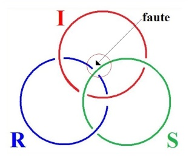
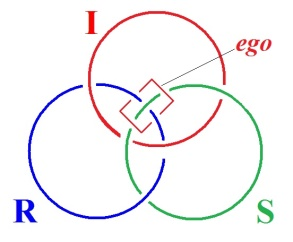
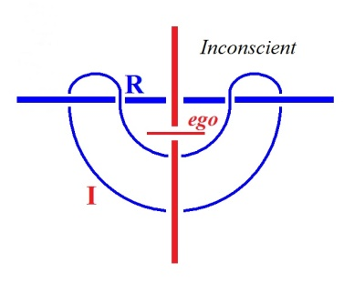

# Leçon 11 | 11 Mai 1976

  <label><input type="checkbox" data-lacan-toggle="original" checked> 原文</label>
  <label><input type="checkbox" data-lacan-toggle="notes" checked> 注释</label>
  <label><input type="checkbox" data-lacan-toggle="commentary" checked> 个人解读评论</label>

<section class="parallel-paragraph" data-paragraph-ids="s23-11-0001">

s23-11-0001

[无对应译文]

原文 · s23-11-0001

Bon, je commence cinq minutes plus tôt.

</section>

<section class="parallel-paragraph" data-paragraph-ids="s23-11-0002">

s23-11-0002

[无对应译文]

原文 · s23-11-0002

La dernière fois je vous ai fait en somme la confidence que la grève ça m’arrangeait très bien.

</section>

<section class="parallel-paragraph" data-paragraph-ids="s23-11-0003">

s23-11-0003

[无对应译文]

原文 · s23-11-0003

Je veux dire que comme j’avais aucune envie de vous raconter quoi que ce soit parce que j’étais moi-même embarrassé.

</section>

<section class="parallel-paragraph" data-paragraph-ids="s23-11-0004">

s23-11-0004

[无对应译文]

原文 · s23-11-0004

*Est-ce que l’on entend ?*

</section>

<section class="parallel-paragraph" data-paragraph-ids="s23-11-0005">

s23-11-0005

[无对应译文]

原文 · s23-11-0005

Parce que ça me serait très facile de trouver un autre prétexte \[*Rires*\], le prétexte que ça ne marche pas par exemple !

</section>

<section class="parallel-paragraph" data-paragraph-ids="s23-11-0006">

s23-11-0006

[无对应译文]

原文 · s23-11-0006

Non pas que cette fois-ci je n’ai pas quelque chose à vous dire.

</section>

<section class="parallel-paragraph" data-paragraph-ids="s23-11-0007">

s23-11-0007

[无对应译文]

原文 · s23-11-0007

Mais enfin, il est certain que la dernière fois, j’étais trop empêtré là, entre mes nœuds et Joyce, pour que j’eusse la moindre envie de vous en parler.

</section>

<section class="parallel-paragraph" data-paragraph-ids="s23-11-0008">

s23-11-0008

[无对应译文]

原文 · s23-11-0008

J’étais embarrassé, maintenant je le suis un peu moins parce que, comme ça, j’ai cru trouver des trucs, enfin des trucs transmissibles.

</section>

<section class="parallel-paragraph" data-paragraph-ids="s23-11-0009">

s23-11-0009

[无对应译文]

原文 · s23-11-0009

Je suis évidemment plutôt actif. Je veux dire que ça me provoque, la difficulté !

</section>

<section class="parallel-paragraph" data-paragraph-ids="s23-11-0010">

s23-11-0010

[无对应译文]

原文 · s23-11-0010

De sorte que pendant tous mes week-ends, je m’acharne à me casser la tête sur quelque chose qui ne va pas de soi.

</section>

<section class="parallel-paragraph" data-paragraph-ids="s23-11-0011">

s23-11-0011

[无对应译文]

原文 · s23-11-0011

Il ne va pas de soi que j’ai trouvé ce qu’on appelle, enfin, le prétendu «* nœud borroméen* ».

</section>

<section class="parallel-paragraph" data-paragraph-ids="s23-11-0012">

s23-11-0012

[无对应译文]

原文 · s23-11-0012

Et que j’essaie de forcer les choses, en somme.

</section>

<section class="parallel-paragraph" data-paragraph-ids="s23-11-0013">

s23-11-0013

[无对应译文]

原文 · s23-11-0013

Parce que Joyce il n’avait aucune espèce d’idée du *nœud borroméen*.

</section>

<section class="parallel-paragraph" data-paragraph-ids="s23-11-0014">

s23-11-0014

[无对应译文]

原文 · s23-11-0014

C’est pas qu’il n’ait pas fait usage du *cercle et de la croix*, on ne parle que de ça, même.

</section>

<section class="parallel-paragraph" data-paragraph-ids="s23-11-0015">

s23-11-0015

[无对应译文]

原文 · s23-11-0015

Et un nommé Clive Hart [^15], qui est un esprit éminent qui s’est consacré à commenter Joyce, en fait grand état de cet usage du *cercle et de la croix*, en fait grand usage dans le livre qu’il a intitulé lui-même : *« Structure in James Joyce »,* et tout spécialement à propos de *Finnegan’s Wake.*

</section>

<section class="parallel-paragraph" data-paragraph-ids="s23-11-0016">

s23-11-0016

[无对应译文]

原文 · s23-11-0016

Alors la première chose que je peux vous dire c’est ceci, c’est que l’expres­sion « *faut le faire !* » a un style de maintenant.

</section>

<section class="parallel-paragraph" data-paragraph-ids="s23-11-0017">

s23-11-0017

[无对应译文]

原文 · s23-11-0017

Je veux dire qu’on l’a jamais autant dit.

</section>

<section class="parallel-paragraph" data-paragraph-ids="s23-11-0018">

s23-11-0018

[无对应译文]

原文 · s23-11-0018

Et ça se loge tout naturellement dans la fabrication de ce nœud : « *il faut le faire !* ».

</section>

<section class="parallel-paragraph" data-paragraph-ids="s23-11-0019">

s23-11-0019

[无对应译文]

原文 · s23-11-0019

« *Il faut le faire* », ça veut dire quoi ?

</section>

<section class="parallel-paragraph" data-paragraph-ids="s23-11-0020">

s23-11-0020

[无对应译文]

原文 · s23-11-0020

Ça se réduit à l’écrire.

</section>

<section class="parallel-paragraph" data-paragraph-ids="s23-11-0021">

s23-11-0021

[无对应译文]

原文 · s23-11-0021

Ce qu’il y a de frappant, de curieux, c’est que ce nœud, comme ça, que je qualifie de « *borroméen* »...

</section>

<section class="parallel-paragraph" data-paragraph-ids="s23-11-0022">

s23-11-0022

[无对应译文]

原文 · s23-11-0022

vous devez savoir pourquoi, ...*est un appui à la pensée.*

</section>

<section class="parallel-paragraph" data-paragraph-ids="s23-11-0023">

s23-11-0023

[无对应译文]

原文 · s23-11-0023

C’est ce que je me permettrais d’illustrer du terme qu’il faut que j’écrive « *appui à l’appensée* », ça permet d’écrire autrement *la pensée*.

</section>

<section class="parallel-paragraph" data-paragraph-ids="s23-11-0024">

s23-11-0024

[无对应译文]

原文 · s23-11-0024

*C’est un appui à la pensée,* ce qui justifie l’écriture que je viens de vous mettre là sur cette petite feuille de papier blanc.

</section>

<section class="parallel-paragraph" data-paragraph-ids="s23-11-0025">

s23-11-0025

[无对应译文]

原文 · s23-11-0025

*C’est un appui à la pensée*, à *l’appensée*, mais c’est curieux qu’il *le faille* cet appui, si je puis m’exprimer ainsi.

</section>

<section class="parallel-paragraph" data-paragraph-ids="s23-11-0026">

s23-11-0026

[无对应译文]

原文 · s23-11-0026

C’est curieux que... *qu’il faille l’écrire* pour en tirer quelque chose.

</section>

<section class="parallel-paragraph" data-paragraph-ids="s23-11-0027">

s23-11-0027

[无对应译文]

原文 · s23-11-0027

Parce que il est tout à fait manifeste que ça n’est pas facile de se représenter cette chaîne...

</section>

<section class="parallel-paragraph" data-paragraph-ids="s23-11-0028">

s23-11-0028

[无对应译文]

原文 · s23-11-0028

> puisqu’il s’agit en réalité, non pas d’un nœud mais d’une chaîne *...*cette chaîne borroméenne, ça n’est pas facile de la voir fonctionner rien qu’à la penser*...*

</section>

<section class="parallel-paragraph" data-paragraph-ids="s23-11-0029">

s23-11-0029

[无对应译文]

原文 · s23-11-0029

> cette fois-ci en coupant le terme, en coupant le « *la* » de « *penser* » ...c’est pas facile même pour le plus simple.

</section>

<section class="parallel-paragraph" data-paragraph-ids="s23-11-0030">

s23-11-0030

[无对应译文]

原文 · s23-11-0030

Et c’est bien en quoi ce nœud porte quelque chose avec lui.

</section>

<section class="parallel-paragraph" data-paragraph-ids="s23-11-0031">

s23-11-0031

[无对应译文]

原文 · s23-11-0031

*Il faut l’écrire, il faut l’écrire pour voir comment ça fonctionne, ce nœud bo.*

</section>

<section class="parallel-paragraph" data-paragraph-ids="s23-11-0032">

s23-11-0032

[无对应译文]

原文 · s23-11-0032

Ça fait penser à quelque chose qui est évoqué quelque part, dans Joyce, où « *sur le mont Neubo la loi nous fut donnée* ».

</section>

<section class="parallel-paragraph" data-paragraph-ids="s23-11-0033">

s23-11-0033

[无对应译文]

原文 · s23-11-0033

Une *écriture* donc, est un *faire* qui donne support à la pensée.

</section>

<section class="parallel-paragraph" data-paragraph-ids="s23-11-0034">

s23-11-0034

[无对应译文]

原文 · s23-11-0034

À vrai dire, le *nœud bo* en question change complètement le *sens* de l’*écriture*.

</section>

<section class="parallel-paragraph" data-paragraph-ids="s23-11-0035">

s23-11-0035

[无对应译文]

原文 · s23-11-0035

Ça donne, à ladite *écriture,* ça donne une autonomie.

</section>

<section class="parallel-paragraph" data-paragraph-ids="s23-11-0036">

s23-11-0036

[无对应译文]

原文 · s23-11-0036

Et c’est une autonomie d’autant plus remarquable qu’il y a une autre *écriture* qui est celle sur laquelle Derrida a insisté...

</section>

<section class="parallel-paragraph" data-paragraph-ids="s23-11-0037">

s23-11-0037

[无对应译文]

原文 · s23-11-0037

> c’est à savoir celle qui résulte de ce qu’on pourrait appeler « *une* *précipitation du signifiant »*

</section>

<section class="parallel-paragraph" data-paragraph-ids="s23-11-0038">

s23-11-0038

[无对应译文]

原文 · s23-11-0038

...Derrida a insisté, mais il est tout à fait clair que je lui ai montré la voie, parce que le fait que je n’ai pas trouvé d’autre façon de supporter le signifiant que de l’écrire grand S, est déjà suffisante indication.

</section>

<section class="parallel-paragraph" data-paragraph-ids="s23-11-0039">

s23-11-0039

[无对应译文]

原文 · s23-11-0039

*Mais ce qui reste, c’est que le signifiant...*

</section>

<section class="parallel-paragraph" data-paragraph-ids="s23-11-0040">

s23-11-0040

[无对应译文]

原文 · s23-11-0040

*c’est-à-dire ce qui se module dans la voix...n’a rien à faire avec l’écriture.*

</section>

<section class="parallel-paragraph" data-paragraph-ids="s23-11-0041">

s23-11-0041

[无对应译文]

原文 · s23-11-0041

C’est en tout cas ce que démontre parfaitement mon nœud *bo*.

</section>

<section class="parallel-paragraph" data-paragraph-ids="s23-11-0042">

s23-11-0042

[无对应译文]

原文 · s23-11-0042

*Ça change le sens de l’écriture.*

</section>

<section class="parallel-paragraph" data-paragraph-ids="s23-11-0043">

s23-11-0043

[无对应译文]

原文 · s23-11-0043

*Ça montre qu’il y a quelque chose à quoi on peut accrocher des signi­fiants*.

</section>

<section class="parallel-paragraph" data-paragraph-ids="s23-11-0044">

s23-11-0044

[无对应译文]

原文 · s23-11-0044

*Et on les accroche comment ces signifiants* ? *Par l’intermédiaire* *de ce que j’appelle « dit-mension* »...

</section>

<section class="parallel-paragraph" data-paragraph-ids="s23-11-0045">

s23-11-0045

[无对应译文]

原文 · s23-11-0045

> là aussi, parce que je suis pas du tout sûr que ça ne vous ait pas échappé ...c’est *comme ça* que je l’écris : « *mension du dit* ».

</section>

<section class="parallel-paragraph" data-paragraph-ids="s23-11-0046">

s23-11-0046

[无对应译文]

原文 · s23-11-0046

Ça a un avantage cette façon d’écrire, c’est que ça permet de prolonger « *mension* » en « *mensionge* », \[*mension-Je*\] et que ça indique que le *dit* n’est pas du tout forcément *vrai*. Voilà !

</section>

<section class="parallel-paragraph" data-paragraph-ids="s23-11-0047">

s23-11-0047

[无对应译文]

原文 · s23-11-0047

Autrement dit, *le dit qui résulte de ce qu’on appelle la philosophie n’est pas sans un certain manque*.

</section>

<section class="parallel-paragraph" data-paragraph-ids="s23-11-0048">

s23-11-0048

[无对应译文]

原文 · s23-11-0048

*Manque* à quoi j’essaie – *j’essaie !* – j’essaie de suppléer par ce recours à ce qui ne peut, dans le nœud *bo,* que s’*écrire*.

</section>

<section class="parallel-paragraph" data-paragraph-ids="s23-11-0049">

s23-11-0049

[无对应译文]

原文 · s23-11-0049

Ce qui ne peut que s’*écrire* pour qu’on en tire un parti.

</section>

<section class="parallel-paragraph" data-paragraph-ids="s23-11-0050">

s23-11-0050

[无对应译文]

原文 · s23-11-0050

Il n’en reste pas moins que ce qu’il y a de φιλία \[philia\] dans le « *philo* »...

</section>

<section class="parallel-paragraph" data-paragraph-ids="s23-11-0051">

s23-11-0051

[无对应译文]

原文 · s23-11-0051

> le « *philo* » qui commence le mot philosophie ...ce qu’il y a de φιλία peut prendre un poids : c’est le temps en tant que pensé...

</section>

<section class="parallel-paragraph" data-paragraph-ids="s23-11-0052">

s23-11-0052

[无对应译文]

原文 · s23-11-0052

> « *pensé* » : non pas *la pensée*, mais le temps pensé ...le temps pensé, c’est la φιλία.

</section>

<section class="parallel-paragraph" data-paragraph-ids="s23-11-0053">

s23-11-0053

[无对应译文]

原文 · s23-11-0053

Et ce que je me permets d’avancer : c’est que *l’écriture dans l’occasion change le sens*, le mode *de* ce qui est en jeu, et ce qui est en jeu c’est *cette* φιλία \[philia\] de la Sagesse.

</section>

<section class="parallel-paragraph" data-paragraph-ids="s23-11-0054">

s23-11-0054

[无对应译文]

原文 · s23-11-0054

La Sagesse, qu’est-ce que c’est ?

</section>

<section class="parallel-paragraph" data-paragraph-ids="s23-11-0055">

s23-11-0055

[无对应译文]

原文 · s23-11-0055

C’est ce qui n’est pas très facile à supporter, autrement que de l’*écriture*, de l’*écriture* du nœud *bo*, elle-même.

</section>

<section class="parallel-paragraph" data-paragraph-ids="s23-11-0056">

s23-11-0056

[无对应译文]

原文 · s23-11-0056

De sorte qu’en somme - pardonnez à mon infatuation - ce que je fais, ce que j’essaie de faire avec mon nœud *bo*, ça n’est rien de moins que la première « *philosophie* » qui me paraisse se supporter.

</section>

<section class="parallel-paragraph" data-paragraph-ids="s23-11-0057">

s23-11-0057

[无对应译文]

原文 · s23-11-0057

La seule introduction de *ces nœuds bo*, de l’idée qu’ils *supportent un « os »* en somme, un « *os* » qui suggère, si je puis dire, suffisamment *quelque chose que j’appellerai dans cette occasion : « osbjet  »,* *qui est bien ce qui caractérise la lettre dont je l’accompagne cet « osbjet  », la lettre petit a.*

</section>

<section class="parallel-paragraph" data-paragraph-ids="s23-11-0058">

s23-11-0058

[无对应译文]

原文 · s23-11-0058

Et si *je le réduis, cet « osbjet  », à ce petit a,* c’est précisément *pour marquer que la lettre* en l’occasion *ne fait que témoigner de l’intrusion d’une écriture comme autre, comme autre avec précisément un petit a.*

</section>

<section class="parallel-paragraph" data-paragraph-ids="s23-11-0059">

s23-11-0059

[无对应译文]

原文 · s23-11-0059

*L’écriture en question vient d’ailleurs que du signifiant*.

</section>

<section class="parallel-paragraph" data-paragraph-ids="s23-11-0060">

s23-11-0060

[无对应译文]

原文 · s23-11-0060

C’est quand même pas d’hier que je me suis intéressé à cette affaire de l’*écriture*, que j’ai en somme promue la première fois que j’ai parlé du *trait unaire *: « *einziger Zug* » dans Freud.

</section>

<section class="parallel-paragraph" data-paragraph-ids="s23-11-0061">

s23-11-0061

[无对应译文]

原文 · s23-11-0061

J’ai donné, du fait du nœud borroméen, *un autre support à ce trait unaire...*

</section>

<section class="parallel-paragraph" data-paragraph-ids="s23-11-0062">

s23-11-0062

[无对应译文]

原文 · s23-11-0062

un autre support que, comme ça, je ne vous ai pas encore sorti ...que dans mes notes j’écris « D I ». « D I » ce sont des initiales et ça veut dire *« droite infinie ».*

</section>

<section class="parallel-paragraph" data-paragraph-ids="s23-11-0063">

s23-11-0063

[无对应译文]

原文 · s23-11-0063

La droite infinie en question...

</section>

<section class="parallel-paragraph" data-paragraph-ids="s23-11-0064">

s23-11-0064

[无对应译文]

原文 · s23-11-0064

> ça n’est pas la première fois que vous m’entendez en parler ...c’est quelque chose que je caractérise de son équivalence au cercle, c’est le principe du nœud borroméen.

</section>

<section class="parallel-paragraph" data-paragraph-ids="s23-11-0065">

s23-11-0065

[无对应译文]

原文 · s23-11-0065

C’est qu’en combinant deux droites avec le cercle, on a l’essentiel du *nœud borroméen*.

</section>

<section class="parallel-paragraph" data-paragraph-ids="s23-11-0066">

s23-11-0066

[无对应译文]

原文 · s23-11-0066

Pourquoi est-ce que *la droite infinie* a cette vertu, cette qualité ?

</section>

<section class="parallel-paragraph" data-paragraph-ids="s23-11-0067">

s23-11-0067

[无对应译文]

原文 · s23-11-0067

C’est parce que *c’est la meilleure illustration du trou.*

</section>

<section class="parallel-paragraph" data-paragraph-ids="s23-11-0068">

s23-11-0068

[无对应译文]

原文 · s23-11-0068

La topologie nous indique que dans un cercle, il y a un *trou* au milieu.

</section>

<section class="parallel-paragraph" data-paragraph-ids="s23-11-0069">

s23-11-0069

[无对应译文]

原文 · s23-11-0069

Et même qu’on se met à rêver sur ce qui en fait le centre, ce qui se prolonge dans toutes sortes d’effets de vocabulaire : *« le centre nerveux* » par exemple, dont personne ne sait bien exactement ce que ça veut dire.

</section>

<section class="parallel-paragraph" data-paragraph-ids="s23-11-0070">

s23-11-0070

[无对应译文]

原文 · s23-11-0070

*La droite infinie a pour vertu d’avoir le trou tout autour : c’est le support le plus simple du trou.*

</section>

<section class="parallel-paragraph" data-paragraph-ids="s23-11-0071">

s23-11-0071

[无对应译文]

原文 · s23-11-0071

Alors, qu’est-ce que ceci nous donne, à nous référer à la pratique ?

</section>

<section class="parallel-paragraph" data-paragraph-ids="s23-11-0072">

s23-11-0072

[无对应译文]

原文 · s23-11-0072

C’est que l’homme est - non pas Dieu - est un composé trinitaire, un composé trinitaire de ce que nous appellerons « *élément* ».

</section>

<section class="parallel-paragraph" data-paragraph-ids="s23-11-0073">

s23-11-0073

[无对应译文]

原文 · s23-11-0073

Qu’est-ce qu’un « *élément »* ?

</section>

<section class="parallel-paragraph" data-paragraph-ids="s23-11-0074">

s23-11-0074

[无对应译文]

原文 · s23-11-0074

Un *élément*, c’est ce qui fait *Un*, autre­ment dit *le trait unaire*.

</section>

<section class="parallel-paragraph" data-paragraph-ids="s23-11-0075">

s23-11-0075

[无对应译文]

原文 · s23-11-0075

Ce qui fait *Un* d’une part, et ce qui du fait de faire *Un*, amorce la substitution.

</section>

<section class="parallel-paragraph" data-paragraph-ids="s23-11-0076">

s23-11-0076

[无对应译文]

原文 · s23-11-0076

La caractéristique d’un *élément*, c’est qu’on procède à leur combinatoire.

</section>

<section class="parallel-paragraph" data-paragraph-ids="s23-11-0077">

s23-11-0077

[无对应译文]

原文 · s23-11-0077

Alors

</section>

<section class="parallel-paragraph" data-paragraph-ids="s23-11-0078">

s23-11-0078

[无对应译文]

原文 · s23-11-0078

- *Réel*,

</section>

<section class="parallel-paragraph" data-paragraph-ids="s23-11-0079">

s23-11-0079

[无对应译文]

原文 · s23-11-0079

- *Imaginaire,*

</section>

<section class="parallel-paragraph" data-paragraph-ids="s23-11-0080">

s23-11-0080

[无对应译文]

原文 · s23-11-0080

- et *Symbo­lique*, ça vaut bien après tout - me semble-t-il - l’autre triade dont, à entendre Aristote, on nous faisait le jus de composer l’homme, à savoir :

</section>

<section class="parallel-paragraph" data-paragraph-ids="s23-11-0081">

s23-11-0081

[无对应译文]

原文 · s23-11-0081

- νοῦς \[nouss\],

</section>

<section class="parallel-paragraph" data-paragraph-ids="s23-11-0082">

s23-11-0082

[无对应译文]

原文 · s23-11-0082

- ψυχή \[psuché\],

</section>

<section class="parallel-paragraph" data-paragraph-ids="s23-11-0083">

s23-11-0083

[无对应译文]

原文 · s23-11-0083

- σῶμα \[soma\].

</section>

<section class="parallel-paragraph" data-paragraph-ids="s23-11-0084">

s23-11-0084

[无对应译文]

原文 · s23-11-0084

Ou encore : volonté, intelligence, affectivité. Voilà !

</section>

<section class="parallel-paragraph" data-paragraph-ids="s23-11-0085">

s23-11-0085

[无对应译文]

原文 · s23-11-0085

Ce que j’essaie d’introduire avec cette *écriture*, ça n’est rien moins que ce que j’appellerai « *une logique de sacs et de cordes* ».

</section>

<section class="parallel-paragraph" data-paragraph-ids="s23-11-0086">

s23-11-0086

[无对应译文]

原文 · s23-11-0086

Parce que, évidemment, il y a le sac. Il y a le sac dont le mythe, si je puis dire, consiste dans la sphère.

</section>

<section class="parallel-paragraph" data-paragraph-ids="s23-11-0087">

s23-11-0087

[无对应译文]

原文 · s23-11-0087

Mais personne - semble-t-il - n’a suffi­samment réfléchi aux conséquences de l’introduction de *la corde*.

</section>

<section class="parallel-paragraph" data-paragraph-ids="s23-11-0088">

s23-11-0088

[无对应译文]

原文 · s23-11-0088

Et que ce que la corde prouve, c’est qu’un sac n’est clos qu’à le ficeler.

</section>

<section class="parallel-paragraph" data-paragraph-ids="s23-11-0089">

s23-11-0089

[无对应译文]

原文 · s23-11-0089

Et que dans toute sphère, il nous faut bien imaginer *quelque chose* qui, bien sûr, est en chaque point de la sphère et *qui la noue...*

</section>

<section class="parallel-paragraph" data-paragraph-ids="s23-11-0090">

s23-11-0090

[无对应译文]

原文 · s23-11-0090

cette chose dans laquelle on souffle ...et qui la noue d’une *corde*.

</section>

<section class="parallel-paragraph" data-paragraph-ids="s23-11-0091">

s23-11-0091

[无对应译文]

原文 · s23-11-0091

Les gens écrivent leurs souvenirs d’enfance.

</section>

<section class="parallel-paragraph" data-paragraph-ids="s23-11-0092">

s23-11-0092

[无对应译文]

原文 · s23-11-0092

Ça a des conséquences : c’est le passage d’une *écriture* à une autre *écriture*.

</section>

<section class="parallel-paragraph" data-paragraph-ids="s23-11-0093">

s23-11-0093

[无对应译文]

原文 · s23-11-0093

Je vous parlerai dans un moment des souvenirs d’enfance de Joyce, parce qu’évidemment il me faut montrer en quoi cette logique dite « *de sacs et de cordes* » est quelque chose qui peut nous aider à compren­dre comment Joyce a fonctionné comme écrivain.

</section>

<section class="parallel-paragraph" data-paragraph-ids="s23-11-0094">

s23-11-0094

[无对应译文]

原文 · s23-11-0094

La psychanalyse, c’est autre chose.

</section>

<section class="parallel-paragraph" data-paragraph-ids="s23-11-0095">

s23-11-0095

[无对应译文]

原文 · s23-11-0095

La psychanalyse passe par un certain nombre d’énoncés.

</section>

<section class="parallel-paragraph" data-paragraph-ids="s23-11-0096">

s23-11-0096

[无对应译文]

原文 · s23-11-0096

Il n’est pas dit que la psychanalyse mette dans la voie d’*écrire*.

</section>

<section class="parallel-paragraph" data-paragraph-ids="s23-11-0097">

s23-11-0097

[无对应译文]

原文 · s23-11-0097

C’est bien ce que je suis en train de vous imposer par mon langage : c’est que ça mérite d’y regarder à deux fois quand on vient demander...

</section>

<section class="parallel-paragraph" data-paragraph-ids="s23-11-0098">

s23-11-0098

[无对应译文]

原文 · s23-11-0098

> au nom de je ne sais quelle inhibition ...d’être mis en posture d’*écrire*.

</section>

<section class="parallel-paragraph" data-paragraph-ids="s23-11-0099">

s23-11-0099

[无对应译文]

原文 · s23-11-0099

J’y regarde, quant à moi, à deux fois quand...

</section>

<section class="parallel-paragraph" data-paragraph-ids="s23-11-0100">

s23-11-0100

[无对应译文]

原文 · s23-11-0100

ça m’arrive comme à tout le monde ...on vient me demander ça : de lever je ne sais quelle inhibition d’*écrire*.

</section>

<section class="parallel-paragraph" data-paragraph-ids="s23-11-0101">

s23-11-0101

[无对应译文]

原文 · s23-11-0101

Parce que c’est *pas du tout* tranché qu’avec la psychanalyse on y arrivera.

</section>

<section class="parallel-paragraph" data-paragraph-ids="s23-11-0102">

s23-11-0102

[无对应译文]

原文 · s23-11-0102

Ceci suppose une investigation à proprement parler de ce que ça signifie d’*écrire*.

</section>

<section class="parallel-paragraph" data-paragraph-ids="s23-11-0103">

s23-11-0103

[无对应译文]

原文 · s23-11-0103

Et très précisément, ce que je vais vous suggérer aujourd’hui concerne Joyce.

</section>

<section class="parallel-paragraph" data-paragraph-ids="s23-11-0104">

s23-11-0104

[无对应译文]

原文 · s23-11-0104

Il m’est venu, comme ça, dans *la boule*...

</section>

<section class="parallel-paragraph" data-paragraph-ids="s23-11-0105">

s23-11-0105

[无对应译文]

原文 · s23-11-0105

> *la boule* qui dans l’occa­sion, est loin d’être sphérique, puisqu’elle se rattache à tout ce qu’on sait ...il m’est venu, comme ça, dans *la boule*, que Joyce c’est quelque chose qui lui est arrivé...

</section>

<section class="parallel-paragraph" data-paragraph-ids="s23-11-0106">

s23-11-0106

[无对应译文]

原文 · s23-11-0106

> et qui lui est arrivé par une voie dont, moi, je crois pouvoir rendre compte ...quelque chose qui lui est arrivé et qui fait que chez lui ce qu’on appelle, comme ça, couramment, l’*ego*, a joué un tout autre rôle que le rôle simple... qu’on s’imagine simple ...que le rôle simple qu’il joue dans le commun de ce qu’on appelle mortel - mortel à juste titre.

</section>

<section class="parallel-paragraph" data-paragraph-ids="s23-11-0107">

s23-11-0107

[无对应译文]

原文 · s23-11-0107

L’*ego,* chez lui, a rempli une fonction dont, bien sûr, je ne peux rendre compte que par mon mode d’*écriture*.

</section>

<section class="parallel-paragraph" data-paragraph-ids="s23-11-0108">

s23-11-0108

[无对应译文]

原文 · s23-11-0108

Ce qui m’a mis sur la voie vaut quand même un peu la peine d’être signalé.

</section>

<section class="parallel-paragraph" data-paragraph-ids="s23-11-0109">

s23-11-0109

[无对应译文]

原文 · s23-11-0109

C’est ceci : c’est que l’écriture est tout à fait essentielle à son *ego*.

</section>

<section class="parallel-paragraph" data-paragraph-ids="s23-11-0110">

s23-11-0110

[无对应译文]

原文 · s23-11-0110

Et il l’a illustré quand, dans une rencontre avec je ne sais plus quel « *j’en-foutre* » qui venait l’interviewer...

</section>

<section class="parallel-paragraph" data-paragraph-ids="s23-11-0111">

s23-11-0111

[无对应译文]

原文 · s23-11-0111

> j’ai pas retrouvé le nom, non pas que je ne l’ai pas cherché, mais c’est un épisode bien connu.
>
> Il est peut-être dans Gormann[^16]. Je ne l’ai pas retrouvé dans Ellmann[^17] qui est sûrement la meilleure, la plus soigneuse, des biographies de Joyce. Je ne l’ai pas retrouvé, non pas que ça n’y soit sûrement pas,
>
> c’est parce que j’ai pas eu le temps ce matin de le rechercher.
>
> Il s’agit de quelque chose dont un quelconque des biographes de Joyce fait état ...quelqu’un, un jour, est venu le voir et lui a demandé de parler de ce qui concernait une certaine image.

</section>

<section class="parallel-paragraph" data-paragraph-ids="s23-11-0112">

s23-11-0112

[无对应译文]

原文 · s23-11-0112

C’était une image qui reproduisait un aspect de la ville de Cork.

</section>

<section class="parallel-paragraph" data-paragraph-ids="s23-11-0113">

s23-11-0113

[无对应译文]

原文 · s23-11-0113

Alors Joyce, qui savait où attendre son type au tournant, lui a répondu que c’était Cork.

</section>

<section class="parallel-paragraph" data-paragraph-ids="s23-11-0114">

s23-11-0114

[无对应译文]

原文 · s23-11-0114

À quoi le type a dit : « *Mais c’est bien évident que je sais ce que c’est : un aspect de la ville, enfin la grand place, disons, de Cork, je la reconnais.*

</section>

<section class="parallel-paragraph" data-paragraph-ids="s23-11-0115">

s23-11-0115

[无对应译文]

原文 · s23-11-0115

*Mais, qu’est-ce qui enca­dre ?* ».

</section>

<section class="parallel-paragraph" data-paragraph-ids="s23-11-0116">

s23-11-0116

[无对应译文]

原文 · s23-11-0116

À quoi Joyce, qui l’attendait au tournant, lui a répondu : *cork,* c’est-à-dire ce qui veut dire, traduit en français : *du liège.*

</section>

<section class="parallel-paragraph" data-paragraph-ids="s23-11-0117">

s23-11-0117

[无对应译文]

原文 · s23-11-0117

Ceci est donné comme illustration du fait, que dans Joyce, dans ce qu’il écrit, il en *passe* toujours, il suffit de lire le petit tableau qu’il a donné de *Ulysses *:

</section>

<section class="parallel-paragraph" data-paragraph-ids="s23-11-0118">

s23-11-0118

[无对应译文]

原文 · s23-11-0118

- qu’il a donné à Stuart Gilbert[^18],

</section>

<section class="parallel-paragraph" data-paragraph-ids="s23-11-0119">

s23-11-0119

[无对应译文]

原文 · s23-11-0119

- qu’il a donné aussi, quoique un peu différent, à Linati[^19],

</section>

<section class="parallel-paragraph" data-paragraph-ids="s23-11-0120">

s23-11-0120

[无对应译文]

原文 · s23-11-0120

- qu’il a donné à quelques autres,

</section>

<section class="parallel-paragraph" data-paragraph-ids="s23-11-0121">

s23-11-0121

[无对应译文]

原文 · s23-11-0121

- qu’il a donné à Valery Larbaud[^20].

</section>

<section class="parallel-paragraph" data-paragraph-ids="s23-11-0122">

s23-11-0122

[无对应译文]

原文 · s23-11-0122

C’est que, dans chacune des choses qu’il ramasse, qu’il raconte, pour en faire cette *œuvre d’art* qu’est *Ulysses,* dans chacune des ces choses, *l’encadrement* a toujours au minimum...

</section>

<section class="parallel-paragraph" data-paragraph-ids="s23-11-0123">

s23-11-0123

[无对应译文]

原文 · s23-11-0123

avec ce qu’il est censé raconter comme rapport à une image ...a toujours *un rapport* au moins *d’homonymie*.

</section>

<section class="parallel-paragraph" data-paragraph-ids="s23-11-0124">

s23-11-0124

[无对应译文]

原文 · s23-11-0124

Que chacun des chapitres d’*Ulysses* se veuille être supporté d’un certain mode d’encadre­ment...

</section>

<section class="parallel-paragraph" data-paragraph-ids="s23-11-0125">

s23-11-0125

[无对应译文]

原文 · s23-11-0125

> qui dans l’occasion est appelé *dialectique* par exemple, ou *rhéto­rique* ou *théologie* ...c’est bien ce qui est, pour lui, lié à l’étoffe même de ce qu’il raconte.

</section>

<section class="parallel-paragraph" data-paragraph-ids="s23-11-0126">

s23-11-0126

[无对应译文]

原文 · s23-11-0126

Et alors, ceci bien sûr n’est pas sans évoquer mes petits ronds, qui eux aussi sont le support de quelque *encadrement.*

</section>

<section class="parallel-paragraph" data-paragraph-ids="s23-11-0127">

s23-11-0127

[无对应译文]

原文 · s23-11-0127

La question est la suivante : qu’est-ce qui se passe quand, par suite d’une *faute*, conditionnée pas uniquement par le hasard, car ce que nous apprend la psychanalyse, c’est qu’une *faute* ne se produit jamais par hasard, qu’il y a derrière tout *lapsus* - pour appeler ça par son nom - une finalité signifiante.

</section>

<section class="parallel-paragraph" data-paragraph-ids="s23-11-0128">

s23-11-0128

[无对应译文]

原文 · s23-11-0128

À savoir que la faute tend...

</section>

<section class="parallel-paragraph" data-paragraph-ids="s23-11-0129">

s23-11-0129

[无对应译文]

原文 · s23-11-0129

s’il y a un inconscient ...à vouloir exprimer quelque chose, non pas seulement que le sujet *sait*, puisque le sujet réside...

</section>

<section class="parallel-paragraph" data-paragraph-ids="s23-11-0130">

s23-11-0130

[无对应译文]

原文 · s23-11-0130

> c’est ce que je vous ai exprimé en son temps par le rapport d’un signifiant à un autre signifiant ...le sujet réside dans cette division même, que c’est *la vie du langage*...

</section>

<section class="parallel-paragraph" data-paragraph-ids="s23-11-0131">

s23-11-0131

[无对应译文]

原文 · s23-11-0131

> « *vie* » pour le langage étant tout autre chose que ce qu’on appelle simplement vie ...que ce qui signifie « mort » pour le support somatique a tout autant de place dans ces pulsions qui relèvent de ce que je viens d’appeler *vie du langage*.

</section>

<section class="parallel-paragraph" data-paragraph-ids="s23-11-0132">

s23-11-0132

[无对应译文]

原文 · s23-11-0132

Ces pulsions en question relèvent du *rapport au corps*.

</section>

<section class="parallel-paragraph" data-paragraph-ids="s23-11-0133">

s23-11-0133

[无对应译文]

原文 · s23-11-0133

Et le *rapport au corps* n’est, chez aucun homme, un rapport simple.

</section>

<section class="parallel-paragraph" data-paragraph-ids="s23-11-0134">

s23-11-0134

[无对应译文]

原文 · s23-11-0134

Outre que le corps a des trous, c’est même - au dire de Freud - ce qui aurait dû mettre l’homme sur la voie, sur la voie de ces trous abstraits...

</section>

<section class="parallel-paragraph" data-paragraph-ids="s23-11-0135">

s23-11-0135

[无对应译文]

原文 · s23-11-0135

> parce que ceci c’est abstrait ...de ces trous abstraits qui concernent l’*énonciation* de quoi que ce soit.

</section>

<section class="parallel-paragraph" data-paragraph-ids="s23-11-0136">

s23-11-0136

[无对应译文]

原文 · s23-11-0136

Alors *le quelque chose* qui est en somme suggéré par cette référence, c’est qu’il faut essayer de se dépétrer d’une idée essen­tiellement confuse qui est *l’idée d’éternité*.

</section>

<section class="parallel-paragraph" data-paragraph-ids="s23-11-0137">

s23-11-0137

[无对应译文]

原文 · s23-11-0137

C’est une idée qui ne s’attache qu’au temps pensé, φιλία \[philia\] dont je parlais tout à l’heure.

</section>

<section class="parallel-paragraph" data-paragraph-ids="s23-11-0138">

s23-11-0138

[无对应译文]

原文 · s23-11-0138

On pense...

</section>

<section class="parallel-paragraph" data-paragraph-ids="s23-11-0139">

s23-11-0139

[无对应译文]

原文 · s23-11-0139

et il arrive même qu’on en parle à tort et à travers ...on pense un amour éternel : on ne sait vraiment pas ce qu’on dit.

</section>

<section class="parallel-paragraph" data-paragraph-ids="s23-11-0140">

s23-11-0140

[无对应译文]

原文 · s23-11-0140

Est-ce qu’on entend par là « *l’autre vie* », si je puis m’exprimer ainsi.

</section>

<section class="parallel-paragraph" data-paragraph-ids="s23-11-0141">

s23-11-0141

[无对应译文]

原文 · s23-11-0141

Vous voyez comment tout s’engage, et où en somme, cette idée d’éternité...

</section>

<section class="parallel-paragraph" data-paragraph-ids="s23-11-0142">

s23-11-0142

[无对应译文]

原文 · s23-11-0142

> dont personne ne sait ce que c’est ...cette idée d’éternité nous mène \[*sic*\]. Voilà !

</section>

<section class="parallel-paragraph" data-paragraph-ids="s23-11-0143">

s23-11-0143

[无对应译文]

原文 · s23-11-0143

Pour ce qui est de Joyce je voudrais... j’aurais pu vous lire à l’occasion...

</section>

<section class="parallel-paragraph" data-paragraph-ids="s23-11-0144">

s23-11-0144

[无对应译文]

原文 · s23-11-0144

> mais enfin sachez que ça existe et que vous pouvez le lire très facilement en français,
>
> parce que il y a eu une traduction du *Portrait of the Artist as a Young Man*... *Portrait* non pas *of the Artist*
>
> - car j’ai fait là naturellement un lapsus - *of an Artist *: *Portrait d’<u>un</u> Artiste comme <u>un</u> Jeune Homme* ...il y a une confidence que nous fait Joyce qui concerne ceci : c’est que, à propos de Tennyson, de Byron, enfin de choses qui se référaient à des poètes, il s’est trouvé que des camarades l’ont ficelé à une barrière \- non pas quelconque, elle était même en fil de fer barbelé - et lui ont donné à lui, Joyce, James Joyce...

</section>

<section class="parallel-paragraph" data-paragraph-ids="s23-11-0145">

s23-11-0145

[无对应译文]

原文 · s23-11-0145

> le camarade qui dirigeait toute l’aventure était un nommé Heron (*h,e,r,o,­n*),
>
> ce qui n’est pas un terme tout à fait indifférent, c’est l’ἐρῶν \[erôn : *l’amant* (≈ [ἐρᾰστής](https://en.wiktionary.org/wiki/%E1%BC%90%CF%81%CE%B1%CF%83%CF%84%CE%AE%CF%82#Ancient_Greek) : erastès)\] ...cet Heron l’a donc battu pendant un certain temps, aidé bien sûr de quelques autres camarades, et après l’aventure, Joyce s’interroge sur ce qui a fait que, passée la chose, il ne lui en voulait pas.

</section>

<section class="parallel-paragraph" data-paragraph-ids="s23-11-0146">

s23-11-0146

[无对应译文]

原文 · s23-11-0146

Joyce s’exprime d’une façon - on peut l’attendre de lui - très pertinente, je veux dire *qu’il métaphorise quelque chose qui n’est rien moins que son rapport à son corps*.

</section>

<section class="parallel-paragraph" data-paragraph-ids="s23-11-0147">

s23-11-0147

[无对应译文]

原文 · s23-11-0147

Il constate que toute l’affaire s’est évacuée.

</section>

<section class="parallel-paragraph" data-paragraph-ids="s23-11-0148">

s23-11-0148

[无对应译文]

原文 · s23-11-0148

Il s’exprimait lui-même en disant que « *c’est comme une pelure »*.

</section>

<section class="parallel-paragraph" data-paragraph-ids="s23-11-0149">

s23-11-0149

[无对应译文]

原文 · s23-11-0149

Qu’est-ce que ceci nous indique ?

</section>

<section class="parallel-paragraph" data-paragraph-ids="s23-11-0150">

s23-11-0150

[无对应译文]

原文 · s23-11-0150

Ça nous indique que ce quelque chose de déjà si imparfait chez tous les êtres humains, le rapport au corps...

</section>

<section class="parallel-paragraph" data-paragraph-ids="s23-11-0151">

s23-11-0151

[无对应译文]

原文 · s23-11-0151

qui est-ce qui sait ce qui se passe dans son corps ?

</section>

<section class="parallel-paragraph" data-paragraph-ids="s23-11-0152">

s23-11-0152

[无对应译文]

原文 · s23-11-0152

...il est clair que c’est bien là quelque chose qui est extraordinairement suggestif, et qui même pour certains, est le sens qu’ils donnent...

</section>

<section class="parallel-paragraph" data-paragraph-ids="s23-11-0153">

s23-11-0153

[无对应译文]

原文 · s23-11-0153

ces certains, ces certains en question ...est le sens qu’ils donnent à l’inconscient.

</section>

<section class="parallel-paragraph" data-paragraph-ids="s23-11-0154">

s23-11-0154

[无对应译文]

原文 · s23-11-0154

Mais s’il y a quelque chose que j’ai depuis l’origine articulé avec soin, c’est très précisément ceci, c’est que l’inconscient ça n’a rien à faire avec le fait qu’on ignore des tas de choses quant à son propre corps, et que ce qu’on sait est d’une toute autre nature : on sait des choses qui relèvent du signifiant.

</section>

<section class="parallel-paragraph" data-paragraph-ids="s23-11-0155">

s23-11-0155

[无对应译文]

原文 · s23-11-0155

L’ancienne notion de l’inconscient, de l’*Unerkannt* \[le non reconnu\], c’était précisément quelque chose qui prenait appui de notre ignorance de ce qui se passe dans notre corps.

</section>

<section class="parallel-paragraph" data-paragraph-ids="s23-11-0156">

s23-11-0156

[无对应译文]

原文 · s23-11-0156

Mais l’inconscient de Freud...

</section>

<section class="parallel-paragraph" data-paragraph-ids="s23-11-0157">

s23-11-0157

[无对应译文]

原文 · s23-11-0157

> c’est quelque chose qui vaut la peine d’être énoncé à cette occasion ...c’est justement ce que j’ai dit, à savoir le rapport qu’il y a entre

</section>

<section class="parallel-paragraph" data-paragraph-ids="s23-11-0158">

s23-11-0158

[无对应译文]

原文 · s23-11-0158

- un corps qui nous est étranger,

</section>

<section class="parallel-paragraph" data-paragraph-ids="s23-11-0159">

s23-11-0159

[无对应译文]

原文 · s23-11-0159

- et quelque chose qui fait cercle, voire droite infinie, qui de toute façon sont l’un à l’autre équivalents, quelque chose qui est l’inconscient.

</section>

<section class="parallel-paragraph" data-paragraph-ids="s23-11-0160">

s23-11-0160

[无对应译文]

原文 · s23-11-0160

Alors, quel sens donner à ce dont Joyce témoigne ?

</section>

<section class="parallel-paragraph" data-paragraph-ids="s23-11-0161">

s23-11-0161

[无对应译文]

原文 · s23-11-0161

À savoir que ce n’est pas simplement *le rapport à son corps*, c’est, si je puis dire, la « *psychologie* » de ce rapport, car après tout la *psychologie* n’est pas autre chose que ça, à savoir cette *image confuse* que nous avons de *notre propre corps*.

</section>

<section class="parallel-paragraph" data-paragraph-ids="s23-11-0162">

s23-11-0162

[无对应译文]

原文 · s23-11-0162

Mais cette image confuse n’est pas sans comporter - appe­lons ça comme ça s’appelle - des affects, à savoir que : à s’imaginer justement ça, ce *rapport psychique*, il y a quelque chose de *psychique qui s’affecte*, qui réagit, qui n’est pas détaché…

</section>

<section class="parallel-paragraph" data-paragraph-ids="s23-11-0163">

s23-11-0163

[无对应译文]

原文 · s23-11-0163

> comme Joyce en témoigne, après avoir reçu les coups de bâton de ses quatre ou cinq camarades …il y a quelque chose qui ne demande qu’à s’en aller, qu’à lâcher, comme une pelure.

</section>

<section class="parallel-paragraph" data-paragraph-ids="s23-11-0164">

s23-11-0164

[无对应译文]

原文 · s23-11-0164

C’est là quelque chose de frappant : qu’il y ait des gens qui n’aient pas d’affect à la violence subie corporellement.

</section>

<section class="parallel-paragraph" data-paragraph-ids="s23-11-0165">

s23-11-0165

[无对应译文]

原文 · s23-11-0165

Il y a là une sorte de chose qui d’ailleurs est ambiguë : ça lui a peut-être fait plaisir, le masochisme n’est pas du tout exclu des possibilités de *stimulation sexuelle* de Joyce, il y a assez insisté concernant Bloom.

</section>

<section class="parallel-paragraph" data-paragraph-ids="s23-11-0166">

s23-11-0166

[无对应译文]

原文 · s23-11-0166

Mais je dirais que ce qui est plutôt frappant, ce sont les métaphores qu’il emploie, à savoir le détachement de quelque chose comme d’une pelure.

</section>

<section class="parallel-paragraph" data-paragraph-ids="s23-11-0167">

s23-11-0167

[无对应译文]

原文 · s23-11-0167

Il n’a pas joui cette fois-là ! Il a eu...

</section>

<section class="parallel-paragraph" data-paragraph-ids="s23-11-0168">

s23-11-0168

[无对应译文]

原文 · s23-11-0168

> c’est quelque chose qui vaut psycholo­giquement ...il a eu une réaction de dégoût, et ce dégoût concerne son propre corps, en somme.

</section>

<section class="parallel-paragraph" data-paragraph-ids="s23-11-0169">

s23-11-0169

[无对应译文]

原文 · s23-11-0169

C’est comme quelqu’un qui met entre paren­thèses, qui chasse le mauvais souvenir.

</section>

<section class="parallel-paragraph" data-paragraph-ids="s23-11-0170">

s23-11-0170

[无对应译文]

原文 · s23-11-0170

C’est de ça ce dont il s’agit.

</section>

<section class="parallel-paragraph" data-paragraph-ids="s23-11-0171">

s23-11-0171

[无对应译文]

原文 · s23-11-0171

Ceci est tout à fait laissé comme possibilité de rapport à son propre corps comme étranger.

</section>

<section class="parallel-paragraph" data-paragraph-ids="s23-11-0172">

s23-11-0172

[无对应译文]

原文 · s23-11-0172

Et c’est bien ce qu’exprime le fait de l’usage du verbe « avoir ». Son corps on *l’a*, on ne l’*est* à aucun degré.

</section>

<section class="parallel-paragraph" data-paragraph-ids="s23-11-0173">

s23-11-0173

[无对应译文]

原文 · s23-11-0173

Et c’est ce qui fait croire à l’âme ! À la suite de quoi il n’y a pas de raison de s’arrêter.

</section>

<section class="parallel-paragraph" data-paragraph-ids="s23-11-0174">

s23-11-0174

[无对应译文]

原文 · s23-11-0174

Et on pense aussi qu’on a une âme, ce qui est un comble !

</section>

<section class="parallel-paragraph" data-paragraph-ids="s23-11-0175">

s23-11-0175

[无对应译文]

原文 · s23-11-0175

Cette forme du « *laisser tomber* », du « *laisser tomber* » du rapport au corps propre, est tout à fait suspecte pour un analyste.

</section>

<section class="parallel-paragraph" data-paragraph-ids="s23-11-0176">

s23-11-0176

[无对应译文]

原文 · s23-11-0176

Cette idée de soi, de soi comme corps, a quelque chose qui a un poids. C’est ça que l’on appelle l’*ego*.

</section>

<section class="parallel-paragraph" data-paragraph-ids="s23-11-0177">

s23-11-0177

[无对应译文]

原文 · s23-11-0177

Si l’*ego* est dit « *narcissique »*, c’est bien parce qu’*il y a quelque chose* à un certain niveau *qui supporte le corps comme image*.

</section>

<section class="parallel-paragraph" data-paragraph-ids="s23-11-0178">

s23-11-0178

[无对应译文]

原文 · s23-11-0178

Mais est-ce que dans le cas de Joyce, le fait que cette *image* dans l’occasion, ne soit pas intéressée, est-ce que ce n’est pas ça qui signe que l’*ego* a une fonction, dans cette occasion, toute particulière ?

</section>

<section class="parallel-paragraph" data-paragraph-ids="s23-11-0179">

s23-11-0179

[无对应译文]

原文 · s23-11-0179

Comment écrire cela dans mon nœud *bo* ?

</section>

<section class="parallel-paragraph" data-paragraph-ids="s23-11-0180">

s23-11-0180

[无对应译文]

原文 · s23-11-0180

Alors là, je trace, je franchis quelque chose dont il n’est pas forcé que vous le suiviez.

</section>

<section class="parallel-paragraph" data-paragraph-ids="s23-11-0181">

s23-11-0181

[无对应译文]

原文 · s23-11-0181

Jusqu’où va, si je puis dire, « la *père-version* » dont vous savez comment je l’écris ?

</section>

<section class="parallel-paragraph" data-paragraph-ids="s23-11-0182">

s23-11-0182

[无对应译文]

原文 · s23-11-0182

Le nœud *bo* c’est ça, c’est la sanction du fait que Freud fait tout tenir sur la *fonction du père*.

</section>

<section class="parallel-paragraph" data-paragraph-ids="s23-11-0183">

s23-11-0183

[无对应译文]

原文 · s23-11-0183

Le nœud *bo* n’est que la traduction de ceci, c’est que - comme on me le rappelait hier soir *- l’amour*...

</section>

<section class="parallel-paragraph" data-paragraph-ids="s23-11-0184">

s23-11-0184

[无对应译文]

原文 · s23-11-0184

> et par dessus le marché l’amour qu’on peut qualifier d’« *éternel* » ...*c’est ce qui se rapporte à la fonction du père, qui s’adresse à lui au nom de ceci que le père est porteur de la castration*.

</section>

<section class="parallel-paragraph" data-paragraph-ids="s23-11-0185">

s23-11-0185

[无对应译文]

原文 · s23-11-0185

C’est ce que Freud au moins avance dans *Totem et Tabou,* à savoir dans la référence à la première horde : c’est dans la mesure où les fils sont privés de femmes qu’ils aiment le père.

</section>

<section class="parallel-paragraph" data-paragraph-ids="s23-11-0186">

s23-11-0186

[无对应译文]

原文 · s23-11-0186

C’est en effet quelque chose de tout à fait singulier et ahurissant, et que seule sanctionne l’*intuition* de Freud.

</section>

<section class="parallel-paragraph" data-paragraph-ids="s23-11-0187">

s23-11-0187

[无对应译文]

原文 · s23-11-0187

Mais de cette *intuition*, à cette *intuition*, j’essaie de donner un autre corps, précisément dans mon nœud *bo* qui est si bien fait pour évoquer le « *Mont Neubo* » où comme on dit « *la Loi* »...

</section>

<section class="parallel-paragraph" data-paragraph-ids="s23-11-0188">

s23-11-0188

[无对应译文]

原文 · s23-11-0188

> « *la Loi* »qui n’a absolument rien à faire avec les lois du monde réel,
>
> les lois du monde réel étant d’ailleurs une question qui reste toute entière ouverte ... « *la Loi* » dans l’occasion, est simplement « *la Loi de l’amour* », c’est-à-dire la perversion.

</section>

<section class="parallel-paragraph" data-paragraph-ids="s23-11-0189">

s23-11-0189

[无对应译文]

原文 · s23-11-0189

C’est très curieux qu’apprendre à écrire, à écrire tout au moins mon nœud *bo,* serve à quelque chose.

</section>

<section class="parallel-paragraph" data-paragraph-ids="s23-11-0190">

s23-11-0190

[无对应译文]

原文 · s23-11-0190

Et ce dont je vais tout de suite l’illustrer est ceci : supposez qu’il y ait quelque part, nommément là, supposez qu’il y ait là quelque part, une erreur. À savoir que les coupures fassent ici une *faute* :

</section>

<section class="parallel-paragraph" data-paragraph-ids="s23-11-0191">

s23-11-0191

[无对应译文]

原文 · s23-11-0191

</section>

<section class="parallel-paragraph" data-paragraph-ids="s23-11-0192">

s23-11-0192

[无对应译文]

原文 · s23-11-0192

Qu’est-ce qu’il en résulte ?

</section>

<section class="parallel-paragraph" data-paragraph-ids="s23-11-0193">

s23-11-0193

[无对应译文]

原文 · s23-11-0193

Le nœud borroméen a cet aspect, c’est-à-dire...

</section>

<section class="parallel-paragraph" data-paragraph-ids="s23-11-0194">

s23-11-0194

[无对应译文]

原文 · s23-11-0194

> comme vous ne l’auriez certainement pas imaginé à prendre les choses comme ça : de nature d’*imaginaire* ...c’est-à-dire que comme vous le voyez, le grand **I** qui est là n’a plus qu’à foutre le camp.

</section>

<section class="parallel-paragraph" data-paragraph-ids="s23-11-0195">

s23-11-0195

[无对应译文]

原文 · s23-11-0195

Il glisse - il glisse exactement comme ce que Joyce ressent après avoir reçu sa raclée - il glisse : le rapport imaginaire n’a pas lieu. Il n’a pas lieu dans ce cas.

</section>

<section class="parallel-paragraph" data-paragraph-ids="s23-11-0196">

s23-11-0196

[无对应译文]

原文 · s23-11-0196

Et ceci laisse à penser que si Joyce s’est tellement intéressé à la *père-version*, c’était peut-être pour autre chose.

</section>

<section class="parallel-paragraph" data-paragraph-ids="s23-11-0197">

s23-11-0197

[无对应译文]

原文 · s23-11-0197

Peut-être qu’après tout, la raclée ça le dégoûtait. C’était peut-être pas un vrai pervers.

</section>

<section class="parallel-paragraph" data-paragraph-ids="s23-11-0198">

s23-11-0198

[无对应译文]

原文 · s23-11-0198

Parce que il faut bien tâcher de s’imaginer pourquoi Joyce est si illisible.

</section>

<section class="parallel-paragraph" data-paragraph-ids="s23-11-0199">

s23-11-0199

[无对应译文]

原文 · s23-11-0199

S’il est illisible, c’est peut-être parce qu’il n’évoque en nous aucune sympathie.

</section>

<section class="parallel-paragraph" data-paragraph-ids="s23-11-0200">

s23-11-0200

[无对应译文]

原文 · s23-11-0200

Mais est-ce que quelque chose ne pourrait pas être suggéré dans notre affaire, par le fait - par contre, patent – qu’il a un *ego* d’une tout autre nature que celle qui ne fonctionne pas précisément au moment de sa révolte, qui ne fonctionne pas tout de suite, tout juste après ladite révolte.

</section>

<section class="parallel-paragraph" data-paragraph-ids="s23-11-0201">

s23-11-0201

[无对应译文]

原文 · s23-11-0201

Car il arrive à se dégager, c’est un fait.

</section>

<section class="parallel-paragraph" data-paragraph-ids="s23-11-0202">

s23-11-0202

[无对应译文]

原文 · s23-11-0202

Mais après ça, je dirai qu’il n’en garde plus aucune reconnaissance à qui que ce soit d’avoir reçu cette raclée.

</section>

<section class="parallel-paragraph" data-paragraph-ids="s23-11-0203">

s23-11-0203

[无对应译文]

原文 · s23-11-0203

Et alors ce que je suggère, c’est ceci :

</section>

<section class="parallel-paragraph" data-paragraph-ids="s23-11-0204">

s23-11-0204

[无对应译文]

原文 · s23-11-0204

</section>

<section class="parallel-paragraph" data-paragraph-ids="s23-11-0205">

s23-11-0205

[无对应译文]

原文 · s23-11-0205

C’est que c’est pas compliqué à voir : supposez qu’ici, là, je le marque bien là, pour montrer qu’il passe par dessus, supposez que la correction de cette *erreur*, de cette *faute*, de ce *lapsus* dont après tout il y a rien de plus commun à imaginer...

</section>

<section class="parallel-paragraph" data-paragraph-ids="s23-11-0206">

s23-11-0206

[无对应译文]

原文 · s23-11-0206

> pourquoi ça n’arriverait-il pas qu’un nœud ne soit pas borroméen, que ça rate ...j’ai dix mille fois fait des erreurs au tableau en le dessinant.

</section>

<section class="parallel-paragraph" data-paragraph-ids="s23-11-0207">

s23-11-0207

[无对应译文]

原文 · s23-11-0207

Voilà exactement ce qui se passe, et où j’incarne l’*ego* : *ici l’ego comme correcteur de ce rapport manquant*, de ce qui ne noue pas borroméennement à ce qui fait nœud de *Réel* et *d’Inconscient*, dans le cas de Joyce.

</section>

<section class="parallel-paragraph" data-paragraph-ids="s23-11-0208">

s23-11-0208

[无对应译文]

原文 · s23-11-0208

Bon. *Par cet artifice d’écriture*, je dirai que *se restitue le nœud borroméen*.

</section>

<section class="parallel-paragraph" data-paragraph-ids="s23-11-0209">

s23-11-0209

[无对应译文]

原文 · s23-11-0209

Vous le voyez, ça n’est pas d’une *face* du nœud borroméen qu’il s’agit, c’est d’un *fil*.

</section>

<section class="parallel-paragraph" data-paragraph-ids="s23-11-0210">

s23-11-0210

[无对应译文]

原文 · s23-11-0210

C’est la différence entre la géométrie commune qui est celle d’où sort le mot *face*...

</section>

<section class="parallel-paragraph" data-paragraph-ids="s23-11-0211">

s23-11-0211

[无对应译文]

原文 · s23-11-0211

> la géométrie c’est des choses qui jouent sur les faces, les polyèdres c’est tout plein de faces, d’arêtes et de sommets ...mais le nœud nous introduit...

</section>

<section class="parallel-paragraph" data-paragraph-ids="s23-11-0212">

s23-11-0212

[无对应译文]

原文 · s23-11-0212

> le nœud qui est *chaîne* dans l’occasion ...le *nœud* nous introduit à une tout autre dimension, dont je dirai que, à la différence de l’*évidence* de la face géométrique, c’est *évidé*, et justement parce que c’est *évidé,* ça n’est pas *évident*.

</section>

<section class="parallel-paragraph" data-paragraph-ids="s23-11-0213">

s23-11-0213

[无对应译文]

原文 · s23-11-0213

Il y a quelqu’un qui dans un temps m’a interpellé : « *Pourquoi est-ce qu’il ne dit pas le vrai sur le vrai ?* »

</section>

<section class="parallel-paragraph" data-paragraph-ids="s23-11-0214">

s23-11-0214

[无对应译文]

原文 · s23-11-0214

Il ne dit pas vrai sur le vrai, parce que dire le vrai sur le vrai c’est dire : « *c’est un mensonge* ».

</section>

<section class="parallel-paragraph" data-paragraph-ids="s23-11-0215">

s23-11-0215

[无对应译文]

原文 · s23-11-0215

Le *vrai* *in-tensionnel*...

</section>

<section class="parallel-paragraph" data-paragraph-ids="s23-11-0216">

s23-11-0216

[无对应译文]

原文 · s23-11-0216

> que je me permettrai ici d’écrire : l’*in-tension.* J’ai déjà distingué l’*in-ten­sion* du mot *ex-tension* ...le *vrai* *in-tensionnel ,* écrit comme ça, *ça peut de temps en temps toucher à quelque chose de* *Réel*, mais ça, pour le coup, c’est par hasard.

</section>

<section class="parallel-paragraph" data-paragraph-ids="s23-11-0217">

s23-11-0217

[无对应译文]

原文 · s23-11-0217

On n’imagine pas à quel point on fait de ratés dans l’*écriture*.

</section>

<section class="parallel-paragraph" data-paragraph-ids="s23-11-0218">

s23-11-0218

[无对应译文]

原文 · s23-11-0218

Le *lapsus calami* n’est pas premier par rapport au *lapsus* *linguae*, mais ça peut être conçu comme touchant au *Réel*.

</section>

<section class="parallel-paragraph" data-paragraph-ids="s23-11-0219">

s23-11-0219

[无对应译文]

原文 · s23-11-0219

Je sais bien que mon nœud qui est ce par quoi - et uniquement ce par quoi - s’introduit le *Réel* comme tel.

</section>

<section class="parallel-paragraph" data-paragraph-ids="s23-11-0220">

s23-11-0220

[无对应译文]

原文 · s23-11-0220

Faut pas se frapper : ça ne va pas tellement loin ! Il y a que moi qui en aie le maniement, autant en faire usage.

</section>

<section class="parallel-paragraph" data-paragraph-ids="s23-11-0221">

s23-11-0221

[无对应译文]

原文 · s23-11-0221

Puisque ça me sert à vous expliquer quelque chose, on peut bien tolérer...

</section>

<section class="parallel-paragraph" data-paragraph-ids="s23-11-0222">

s23-11-0222

[无对应译文]

原文 · s23-11-0222

> puisque c’est ça la situation où vous êtes ...que je folâtre avec mes faibles moyens.

</section>

<section class="parallel-paragraph" data-paragraph-ids="s23-11-0223">

s23-11-0223

[无对应译文]

原文 · s23-11-0223

Mais c’est une façon d’articuler préci­sément ceci, que toute sexualité humaine est perverse, si nous suivons bien ce que dit Freud.

</section>

<section class="parallel-paragraph" data-paragraph-ids="s23-11-0224">

s23-11-0224

[无对应译文]

原文 · s23-11-0224

Il n’a jamais réussi à concevoir ladite sexualité autrement que perverse, et c’est bien en quoi j’interroge ce que j’appel­lerai la fécondité de la psychanalyse.

</section>

<section class="parallel-paragraph" data-paragraph-ids="s23-11-0225">

s23-11-0225

[无对应译文]

原文 · s23-11-0225

Vous m’avez entendu très souvent énoncer ceci, que la psychana­lyse n’a même pas été foutue d’inventer une nouvelle perversion \[*Rires*\].

</section>

<section class="parallel-paragraph" data-paragraph-ids="s23-11-0226">

s23-11-0226

[无对应译文]

原文 · s23-11-0226

C’est triste ! Parce qu’après tout si *la perversion* c’est l’essence de l’homme, quelle infécondité dans cette pratique !

</section>

<section class="parallel-paragraph" data-paragraph-ids="s23-11-0227">

s23-11-0227

[无对应译文]

原文 · s23-11-0227

Eh bien je pense que grâce à Joyce, nous touchons quelque chose à quoi je n’avais pas songé.

</section>

<section class="parallel-paragraph" data-paragraph-ids="s23-11-0228">

s23-11-0228

[无对应译文]

原文 · s23-11-0228

Je n’y avais pas songé tout de suite, mais ça m’est venu avec le temps, ça m’est venu avec le temps à considérer *le texte de Joyce, la façon dont c’est fait* : *c’est fait tout à fait comme un nœud borroméen*.

</section>

<section class="parallel-paragraph" data-paragraph-ids="s23-11-0229">

s23-11-0229

[无对应译文]

原文 · s23-11-0229

Et ce qui me frappe, c’est qu’il y avait qu’à lui que ça échappait, à savoir qu’il y a pas trace dans toute son œuvre de quelque chose qui y ressemble.

</section>

<section class="parallel-paragraph" data-paragraph-ids="s23-11-0230">

s23-11-0230

[无对应译文]

原文 · s23-11-0230

Mais ça me semble plutôt un signe d’authenticité.

</section>

<section class="parallel-paragraph" data-paragraph-ids="s23-11-0231">

s23-11-0231

[无对应译文]

原文 · s23-11-0231

Je me suis arrêté à ceci, c’est que ce qui frappe quand on lit ce texte, et surtout ses commentateurs, c’est que le nombre d’*énigmes* que Joyce - son texte - contient, c’est quelque chose non seulement qui foisonne, mais on peut dire sur lequel il a joué.

</section>

<section class="parallel-paragraph" data-paragraph-ids="s23-11-0232">

s23-11-0232

[无对应译文]

原文 · s23-11-0232

Sachant très bien qu’on s’occuperait, et qu’il y aurait des joyciens pendant deux ou trois cents ans.

</section>

<section class="parallel-paragraph" data-paragraph-ids="s23-11-0233">

s23-11-0233

[无对应译文]

原文 · s23-11-0233

Ces gens se sont uniquement occupés à résoudre les *énigmes*, à savoir, au mini­mum : « pourquoi Joyce a mis ça là ? ».

</section>

<section class="parallel-paragraph" data-paragraph-ids="s23-11-0234">

s23-11-0234

[无对应译文]

原文 · s23-11-0234

Ils trouvent naturellement toujours une raison.

</section>

<section class="parallel-paragraph" data-paragraph-ids="s23-11-0235">

s23-11-0235

[无对应译文]

原文 · s23-11-0235

Il a mis ça là parce qu’il y a juste après un autre mot, enfin, c’est exactement comme dans mes histoires, là, d’« *osbjet* », de « *mensionge* » et de « *dit-mension »* et de toute la suite.

</section>

<section class="parallel-paragraph" data-paragraph-ids="s23-11-0236">

s23-11-0236

[无对应译文]

原文 · s23-11-0236

Moi, il y a des raisons, je veux exprimer quelque chose, *j’équivoque*.

</section>

<section class="parallel-paragraph" data-paragraph-ids="s23-11-0237">

s23-11-0237

[无对应译文]

原文 · s23-11-0237

Mais avec Joyce, on y perd toujours ce que je pourrais appeler *son latin*, d’autant plus que le latin, il en connaissait un bout.

</section>

<section class="parallel-paragraph" data-paragraph-ids="s23-11-0238">

s23-11-0238

[无对应译文]

原文 · s23-11-0238

Alors l’*énigme*...

</section>

<section class="parallel-paragraph" data-paragraph-ids="s23-11-0239">

s23-11-0239

[无对应译文]

原文 · s23-11-0239

> heureusement, comme ça, dans un temps, je m’y suis intéressé, j’écris ça Ee : E indice e.
>
> E - un grand E - il s’agit de l’*énonciation* et de l’*énoncé* ...l’*énigme* consiste en leur rapport du grand E au petit e, à savoir de pourquoi diable *un tel énoncé* a-t-il été prononcé ?

</section>

<section class="parallel-paragraph" data-paragraph-ids="s23-11-0240">

s23-11-0240

[无对应译文]

原文 · s23-11-0240

C’est une affaire d’*énonciation*. Et l’*énonciation*, c’est l’*énigme*.

</section>

<section class="parallel-paragraph" data-paragraph-ids="s23-11-0241">

s23-11-0241

[无对应译文]

原文 · s23-11-0241

L’*énigme* portée à la puissance de l’*écriture*, c’est quelque chose qui vaut la peine qu’on s’y arrête.

</section>

<section class="parallel-paragraph" data-paragraph-ids="s23-11-0242">

s23-11-0242

[无对应译文]

原文 · s23-11-0242

Est-ce que ça ne serait pas là, la conséquence de ce raboutage si mal fait que c’est un *ego* de fonctions *énigmatiques*, de fonctions réparatoires ?

</section>

<section class="parallel-paragraph" data-paragraph-ids="s23-11-0243">

s23-11-0243

[无对应译文]

原文 · s23-11-0243

Que Joyce soit l’écrivain par excellence de l’*énigme*, c’est ce que je vous incite...

</section>

<section class="parallel-paragraph" data-paragraph-ids="s23-11-0244">

s23-11-0244

[无对应译文]

原文 · s23-11-0244

> j’aurais pu vous en citer maint exemples s’il n’était pas si tard ...mais je vous conseille d’aller le vérifier.

</section>

<section class="parallel-paragraph" data-paragraph-ids="s23-11-0245">

s23-11-0245

[无对应译文]

原文 · s23-11-0245

*Ulysse* en traduction française, ça existe, ça se trouve chez Gallimard, si vous avez pas le vieux volume du temps de Sylvia Beach.

</section>

<section class="parallel-paragraph" data-paragraph-ids="s23-11-0246">

s23-11-0246

[无对应译文]

原文 · s23-11-0246

Je vais quand même pointer quelques petites choses qui me pa­raissent notables avant de vous quitter.

</section>

<section class="parallel-paragraph" data-paragraph-ids="s23-11-0247">

s23-11-0247

[无对应译文]

原文 · s23-11-0247

Il faut bien que vous réalisiez que ce que je vous ai dit des rapports de l’homme à son corps, qui tient tout entier à ce que je vous ai dit : dans le fait que l’homme dit que *le corps*, *son corps*, il l’*a*.

</section>

<section class="parallel-paragraph" data-paragraph-ids="s23-11-0248">

s23-11-0248

[无对应译文]

原文 · s23-11-0248

Déjà à dire « *son »,* c’est dire que il le possède, qu’il le possède comme un meuble, bien entendu.

</section>

<section class="parallel-paragraph" data-paragraph-ids="s23-11-0249">

s23-11-0249

[无对应译文]

原文 · s23-11-0249

Et que ça n’a rien à faire avec quoi que ce soit qui permette de définir strictement le sujet.

</section>

<section class="parallel-paragraph" data-paragraph-ids="s23-11-0250">

s23-11-0250

[无对应译文]

原文 · s23-11-0250

Le sujet ne se définit d’une façon correcte :

</section>

<section class="parallel-paragraph" data-paragraph-ids="s23-11-0251">

s23-11-0251

[无对应译文]

原文 · s23-11-0251

- que de ce qui fait le rapport,

</section>

<section class="parallel-paragraph" data-paragraph-ids="s23-11-0252">

s23-11-0252

[无对应译文]

原文 · s23-11-0252

- que de ce qui fait qu’un sujet est un signifiant en tant qu’il est représenté auprès d’un autre signifiant.

</section>

<section class="parallel-paragraph" data-paragraph-ids="s23-11-0253">

s23-11-0253

[无对应译文]

原文 · s23-11-0253

Je voudrais ici vous dire quelque chose qui pourrait peut-être quand même freiner un tout petit peu ce qui fait gouffre, dans ce qu’il nous est permis de serrer par l’usage de ce nœud borroméen, de cette *père-version*.

</section>

<section class="parallel-paragraph" data-paragraph-ids="s23-11-0254">

s23-11-0254

[无对应译文]

原文 · s23-11-0254

I l y a quelque chose quand même dont on est tout à fait surpris : que ça ne serve pas plus, non pas *au* corps, mais que ça ne serve pas plus *le* corps comme tel, c’est la danse.

</section>

<section class="parallel-paragraph" data-paragraph-ids="s23-11-0255">

s23-11-0255

[无对应译文]

原文 · s23-11-0255

Ça permettrait d’écrire un peu différemment le terme de *condansation.* \[*Rires*\]

</section>

<section class="parallel-paragraph" data-paragraph-ids="s23-11-0256">

s23-11-0256

[无对应译文]

原文 · s23-11-0256

Vous voyez que je me livre à l’occasion... Ouais...

</section>

<section class="parallel-paragraph" data-paragraph-ids="s23-11-0257">

s23-11-0257

[无对应译文]

原文 · s23-11-0257

Le *Réel* est-il droit ?

</section>

<section class="parallel-paragraph" data-paragraph-ids="s23-11-0258">

s23-11-0258

[无对应译文]

原文 · s23-11-0258

C’est bien ce dont je voudrais aujour­d’hui poser la question devant vous.

</section>

<section class="parallel-paragraph" data-paragraph-ids="s23-11-0259">

s23-11-0259

[无对应译文]

原文 · s23-11-0259

Je voudrais aussi vous faire remar­quer, que dans la théorie de Freud, le *Réel* n’a rien à faire avec le monde.

</section>

<section class="parallel-paragraph" data-paragraph-ids="s23-11-0260">

s23-11-0260

[无对应译文]

原文 · s23-11-0260

Parce que ce qu’il nous explique dans quelque chose qui concerne précisément l’*ego*, à savoir le *Lust-Ich,* c’est qu’il y a une étape de narcissisme primaire. Et que ce narcissisme primaire se caractérise de ceci : non pas qu’il n’y ait pas de sujet, mais qu’il n’y a pas de rapport de l’intérieur à l’extérieur.

</section>

<section class="parallel-paragraph" data-paragraph-ids="s23-11-0261">

s23-11-0261

[无对应译文]

原文 · s23-11-0261

J’aurai sûrement à y revenir, je ne dis pas forcément devant vous, parce qu’après tout je n’ai aucune espèce de certitude à l’heure actuelle, que l’année prochaine je possèderai encore cet amphithéâtre, mais supposez que je trouve quelque part un endroit de 70 m2, eh ben ça fera la place pour huit personnes, en comptant moi.

</section>

<section class="parallel-paragraph" data-paragraph-ids="s23-11-0262">

s23-11-0262

[无对应译文]

原文 · s23-11-0262

Et c’est le meilleur de ce que je souhaite.

</section>

<section class="parallel-paragraph" data-paragraph-ids="s23-11-0263">

s23-11-0263

[无对应译文]

原文 · s23-11-0263

Il faudrait encore que je dise quelques mots...

</section>

<section class="parallel-paragraph" data-paragraph-ids="s23-11-0264">

s23-11-0264

[无对应译文]

原文 · s23-11-0264

je les avais préparés ...quelques mots de l’*épiphanie*, la fameuse *épiphanie* de Joyce, que vous rencontrerez à tous les tournants, l’*épiphanie.*

</section>

<section class="parallel-paragraph" data-paragraph-ids="s23-11-0265">

s23-11-0265

[无对应译文]

原文 · s23-11-0265

Car je vous prie de contrôler ceci : que quand il en donne une liste, *toutes ses épiphanies sont toujours caractérisées de la même chose*, et qui est très précisément ceci : la conséquence qui résulte de cette *erreur*, à savoir que l’*inconscient* est lié au *Réel*.

</section>

<section class="parallel-paragraph" data-paragraph-ids="s23-11-0266">

s23-11-0266

[无对应译文]

原文 · s23-11-0266

*Chose fantastique*, Joyce, lui-même, n’en parle pas autrement.

</section>

<section class="parallel-paragraph" data-paragraph-ids="s23-11-0267">

s23-11-0267

[无对应译文]

原文 · s23-11-0267

C’est tout à fait lisible dans Joyce que l’*épiphanie,* c’est là ce qui fait que, grâce à *la faute*, *inconscient et Réel* se nouent.

</section>

<section class="parallel-paragraph" data-paragraph-ids="s23-11-0268">

s23-11-0268

[无对应译文]

原文 · s23-11-0268

C’est quelque chose que...

</section>

<section class="parallel-paragraph" data-paragraph-ids="s23-11-0269">

s23-11-0269

[无对应译文]

原文 · s23-11-0269

C’est pas ce que je voulais vous faire entendre, il y a quelque chose que je peux quand même vous dessiner.

</section>

<section class="parallel-paragraph" data-paragraph-ids="s23-11-0270">

s23-11-0270

[无对应译文]

原文 · s23-11-0270

Si vous savez un peu... si vous avez vu un nœud borroméen, il vous indique ceci :

</section>

<section class="parallel-paragraph" data-paragraph-ids="s23-11-0271">

s23-11-0271

[无对应译文]

原文 · s23-11-0271

</section>

<section class="parallel-paragraph" data-paragraph-ids="s23-11-0272">

s23-11-0272

[无对应译文]

原文 · s23-11-0272

c’est que si, ici, c’est l’*ego* tel que je vous l’ai dessiné tout à l’heure, nous nous trouvons en posture de voir se reconstituer strictement le nœud borroméen, sous la forme suivante :

</section>

<section class="parallel-paragraph" data-paragraph-ids="s23-11-0273">

s23-11-0273

[无对应译文]

原文 · s23-11-0273

- ici c’est le *Réel*,

</section>

<section class="parallel-paragraph" data-paragraph-ids="s23-11-0274">

s23-11-0274

[无对应译文]

原文 · s23-11-0274

- ici c’est l’*Imaginaire*,

</section>

<section class="parallel-paragraph" data-paragraph-ids="s23-11-0275">

s23-11-0275

[无对应译文]

原文 · s23-11-0275

- ici c’est l’*inconscient,*

</section>

<section class="parallel-paragraph" data-paragraph-ids="s23-11-0276">

s23-11-0276

[无对应译文]

原文 · s23-11-0276

- et ici c’est l’*ego* de Joyce.

</section>

<section class="parallel-paragraph" data-paragraph-ids="s23-11-0277">

s23-11-0277

[无对应译文]

原文 · s23-11-0277

Vous pouvez facilement voir sur ce schéma, que la rupture de l’*ego* libère le *rapport imaginaire*.

</section>

<section class="parallel-paragraph" data-paragraph-ids="s23-11-0278">

s23-11-0278

[无对应译文]

原文 · s23-11-0278

Il est facile en effet, d’imaginer que l’*imaginaire* foutra le camp, foutra le camp par ici, si l’inconscient, comme c’est le cas, le permet. Et il le permet incontestablement.

</section>

<section class="parallel-paragraph" data-paragraph-ids="s23-11-0279">

s23-11-0279

[无对应译文]

原文 · s23-11-0279

Voilà les quelques indications que je voulais vous dire pour cette dernière séance.

</section>

<section class="parallel-paragraph" data-paragraph-ids="s23-11-0280">

s23-11-0280

[无对应译文]

原文 · s23-11-0280

On pense *contre* un signifiant.

</section>

<section class="parallel-paragraph" data-paragraph-ids="s23-11-0281">

s23-11-0281

[无对应译文]

原文 · s23-11-0281

C’est le sens que j’ai donné au mot de « *l’appensée* ».

</section>

<section class="parallel-paragraph" data-paragraph-ids="s23-11-0282">

s23-11-0282

[无对应译文]

原文 · s23-11-0282

On s’appuie *contre* un signifiant pour penser.

</section>

<section class="parallel-paragraph" data-paragraph-ids="s23-11-0283">

s23-11-0283

[无对应译文]

原文 · s23-11-0283

Voilà, je vous libère.

</section>

<section class="note-block original-notes">

## Notes

[^15]: Clive Hart : « *Structure and motif in Finnegans Wake* », Faber and Faber, 1962, ou Northwestern University Press, 1971.

[^16]: Herbert S. Gormann qui édita dans la première biographie de Joyce en 1924, *James Joyce : His First Forty Years*.

[^17]: Richard Ellmann, *James Joyce* (1959), Gallimard 1962.

[^18]: Stuart Gilbert, *James Joyce’s Ulysses* : *A Study* (1930).

[^19]: Carlo Linati, ami de Joyce, de qui il a reçu en 1920 schémas et tableaux destinés à l’aider dans sa compréhension d’*Ulysses.*

[^20]: Écrivain français, co-traducteur et superviseur pour la traduction d’*Ulysse.*

</section>
