# Leçon 01 | 16 Novembre 1976

  

    <label><input type="checkbox" data-lacan-toggle="original" checked> 原文</label>
    <label><input type="checkbox" data-lacan-toggle="notes" checked> 注释</label>
    <label><input type="checkbox" data-lacan-toggle="commentary" checked> 个人解读评论</label>
  

  <form class="lacan-tool-search" role="search">
    <input class="lacan-tool-search-input" type="search" placeholder="搜索全文" aria-label="搜索全文">
    <button class="lacan-tool-button" type="submit" title="搜索">搜索</button>
  </form>
  <button class="lacan-tool-button lacan-back-to-top" type="button" title="回到页面最上方" aria-label="回到页面最上方">↑</button>

<section class="parallel-paragraph" data-paragraph-ids="s24-01-0001">

s24-01-0001

原文 · s24-01-0001

Voilà ! Il y a une affiche comme ça qui professe...

[无对应译文]

</section>

<section class="parallel-paragraph" data-paragraph-ids="s24-01-0002">

s24-01-0002

原文 · s24-01-0002

Est-ce que vous avez su la lire ?

[无对应译文]

</section>

<section class="parallel-paragraph" data-paragraph-ids="s24-01-0003">

s24-01-0003

原文 · s24-01-0003

Qu’est-ce que ça donne pour vous ?

[无对应译文]

</section>

<section class="parallel-paragraph" data-paragraph-ids="s24-01-0004">

s24-01-0004

原文 · s24-01-0004

*L’insu que sait,* quand même ça fait *bla-bla*, ça équivoque*. L’insu que sait,* et après j’ai traduit l’*Unbewußt.*

[无对应译文]

</section>

<section class="parallel-paragraph" data-paragraph-ids="s24-01-0005">

s24-01-0005

原文 · s24-01-0005

J’ai dit qu’il y avait...

[无对应译文]

</section>

<section class="parallel-paragraph" data-paragraph-ids="s24-01-0006">

s24-01-0006

原文 · s24-01-0006

> au sens de l’usage en français du parti­tif ...qu’il y avait « *de l’une-bévue* ». C’est une façon aussi bonne de tra­duire l’*Unbewußt* que n’importe quelle autre, que *l’inconscient* en par­ticulier, qui en français, et en allemand aussi d’ailleurs, équivoque avec inconscience.

[无对应译文]

</section>

<section class="parallel-paragraph" data-paragraph-ids="s24-01-0007">

s24-01-0007

原文 · s24-01-0007

L’inconscient, ça n’a rien à faire avec l’inconscience.

[无对应译文]

</section>

<section class="parallel-paragraph" data-paragraph-ids="s24-01-0008">

s24-01-0008

原文 · s24-01-0008

Alors pourquoi ne pas traduire tout tranquillement par *l’une-bévue.*

[无对应译文]

</section>

<section class="parallel-paragraph" data-paragraph-ids="s24-01-0009">

s24-01-0009

原文 · s24-01-0009

D’autant plus que ça a tout de suite l’avantage de mettre en évidence certaines choses : pourquoi est-ce qu’on s’oblige dans l’analyse des rêves, qui constituent une *bévue* comme n’importe quoi d’autre, comme un acte manqué, à ceci près qu’il y a quelque chose où on se reconnaît.

[无对应译文]

</section>

<section class="parallel-paragraph" data-paragraph-ids="s24-01-0010">

s24-01-0010

原文 · s24-01-0010

On se reconnaît dans le trait d’esprit...

[无对应译文]

</section>

<section class="parallel-paragraph" data-paragraph-ids="s24-01-0011">

s24-01-0011

原文 · s24-01-0011

> parce que le trait d’esprit tient à ce que j’ai appelé *lalangue* ...on se reconnaît dans le trait d’esprit, on y glisse...

[无对应译文]

</section>

<section class="parallel-paragraph" data-paragraph-ids="s24-01-0012">

s24-01-0012

原文 · s24-01-0012

Et là-dessus Freud a fait quelques considérations qui ne sont pas négligeables.

[无对应译文]

</section>

<section class="parallel-paragraph" data-paragraph-ids="s24-01-0013">

s24-01-0013

原文 · s24-01-0013

Je veux dire que l’intérêt du trait d’esprit pour l’inconscient est quand même lié à cette chose spécifique qui comporte l’acquisition de *lalangue.*

[无对应译文]

</section>

<section class="parallel-paragraph" data-paragraph-ids="s24-01-0014">

s24-01-0014

原文 · s24-01-0014

Pour le reste, est-ce qu’il faut dire que pour l’analyse d’un rêve il faut s’en tenir à ce qui s’est passé la veille ?

[无对应译文]

</section>

<section class="parallel-paragraph" data-paragraph-ids="s24-01-0015">

s24-01-0015

原文 · s24-01-0015

Ça ne va pas de soi. Freud en a fait une règle, mais il conviendrait quand même de s’apercevoir qu’il y a bien des choses qui, non seulement peuvent remonter plus haut, mais qui tien­nent à ce qu’on peut appeler le « *tissu même* » de *l’inconscient*.

[无对应译文]

</section>

<section class="parallel-paragraph" data-paragraph-ids="s24-01-0016">

s24-01-0016

原文 · s24-01-0016

Est-ce que *l’acte manqué* aussi c’est une affaire qui doit être analysée étroitement selon ce qui s’est passé, non pas la veille, mais cette fois-ci dans la jour­née, c’est vraiment quelque chose qui pose question.

[无对应译文]

</section>

<section class="parallel-paragraph" data-paragraph-ids="s24-01-0017">

s24-01-0017

原文 · s24-01-0017

Cette année, disons qu’avec cet « *Insu que sait de l’Une-bévue »,* j’essaie d’introduire quelque chose qui va plus loin, qui va plus loin que l’inconscient : quel rapport y a-t-il entre ceci qu’il faut admettre que nous avons un *intérieur* qu’on appelle comme on peut, « *psychisme* » par exemple, on voit même Freud écrire « *endo* », *endo-psychique*...

[无对应译文]

</section>

<section class="parallel-paragraph" data-paragraph-ids="s24-01-0018">

s24-01-0018

原文 · s24-01-0018

ça ne va pas de soi que la ψυχή \[psyché\] ce soit *endo*, ça ne va pas de soi qu’il faille *endosser* cet *endo* ...quel rapport y a-t-il entre cet *endo,* cet intérieur, et ce que nous appelons couramment l’identification ?

[无对应译文]

</section>

<section class="parallel-paragraph" data-paragraph-ids="s24-01-0019">

s24-01-0019

原文 · s24-01-0019

C’est ça en somme que *sous ce titre* qui est comme ça fabriqué pour l’occasion, c’est ça que je vou­drais mettre *sous ce titre*.

[无对应译文]

</section>

<section class="parallel-paragraph" data-paragraph-ids="s24-01-0020">

s24-01-0020

原文 · s24-01-0020

Parce qu’il est clair que l’identification c’est ce qui se cristallise dans une identité.

[无对应译文]

</section>

<section class="parallel-paragraph" data-paragraph-ids="s24-01-0021">

s24-01-0021

原文 · s24-01-0021

D’ailleurs ce « ...*fication* » dans le français est en allemand autrement énoncé, *Identifizierung,* dit Freud, dans un endroit où j’ai été le retrouver, parce que je ne me souvenais pas que j’avais fait un séminaire sur *l’Identifizierung*...

[无对应译文]

</section>

<section class="parallel-paragraph" data-paragraph-ids="s24-01-0022">

s24-01-0022

原文 · s24-01-0022

> « *je ne me souve­nais pas* » : je me souvenais quand même de ce qu’il y avait dans le cha­pitre,
>
> je ne savais pas que j’y avais consacré une année ...mais je me sou­venais qu’il y a pour Freud, au moins 3 modes d’*identification*, à savoir :

[无对应译文]

</section>

<section class="parallel-paragraph" data-paragraph-ids="s24-01-0023">

s24-01-0023

原文 · s24-01-0023

- l’*identification* auquel il réserve - je ne sais pas bien pourquoi - la qualification d’*amour*. *Amour*, c’est la qualification qu’il donne à *l’identification au* *père*.

[无对应译文]

</section>

<section class="parallel-paragraph" data-paragraph-ids="s24-01-0024">

s24-01-0024

原文 · s24-01-0024

- Qu’est-ce que c’est que d’autre part ce qu’il avance d’une *identification* faite de *participation* ?

[无对应译文]

</section>

<section class="parallel-paragraph" data-paragraph-ids="s24-01-0025">

s24-01-0025

原文 · s24-01-0025

Il appelle ça, il épingle ça de *l’identification* *hystérique*.

[无对应译文]

</section>

<section class="parallel-paragraph" data-paragraph-ids="s24-01-0026">

s24-01-0026

原文 · s24-01-0026

- Et puis il y a une 3ème *identification* qui est celle qu’il fabrique d’un trait, d’un trait que j’ai autrefois...

[无对应译文]

</section>

<section class="parallel-paragraph" data-paragraph-ids="s24-01-0027">

s24-01-0027

原文 · s24-01-0027

> j’en avais gardé quand même le souvenir sans savoir que j’avais fait tout un *séminaire* sur l’*identification* ...d’un *trait* que j’ai appelé « *unaire* ».

[无对应译文]

</section>

<section class="parallel-paragraph" data-paragraph-ids="s24-01-0028">

s24-01-0028

原文 · s24-01-0028

Ce *trait unaire* nous intéresse parce que, comme Freud le souligne, c’est pas quelque chose qui a affaire spécialement avec une personne aimée.

[无对应译文]

</section>

<section class="parallel-paragraph" data-paragraph-ids="s24-01-0029">

s24-01-0029

原文 · s24-01-0029

Une personne peut être indifférente et un *trait unaire* choisi comme constituant la base d’une identification.

[无对应译文]

</section>

<section class="parallel-paragraph" data-paragraph-ids="s24-01-0030">

s24-01-0030

原文 · s24-01-0030

Ce n’est pas indifférent, puisque c’est comme ça que Freud croit pouvoir rendre compte de l’identification à la petite moustache du Führer dont chacun sait qu’elle a joué un grand rôle.

[无对应译文]

</section>

<section class="parallel-paragraph" data-paragraph-ids="s24-01-0031">

s24-01-0031

原文 · s24-01-0031

C’est une question qui a beaucoup d’intérêt parce qu’il résulterait de certains propos qui ont été avancés, que la fin de l’analyse serait de s’identifier à l’analyste.

[无对应译文]

</section>

<section class="parallel-paragraph" data-paragraph-ids="s24-01-0032">

s24-01-0032

原文 · s24-01-0032

Pour moi, je ne le pense pas, mais enfin c’est ce que soutient quand même Balint, et c’est très surprenant.

[无对应译文]

</section>

<section class="parallel-paragraph" data-paragraph-ids="s24-01-0033">

s24-01-0033

原文 · s24-01-0033

À quoi donc s’identifie-t­-on à la fin de l’analyse ?

[无对应译文]

</section>

<section class="parallel-paragraph" data-paragraph-ids="s24-01-0034">

s24-01-0034

原文 · s24-01-0034

Est-ce qu’on s’identifierait à son inconscient ?

[无对应译文]

</section>

<section class="parallel-paragraph" data-paragraph-ids="s24-01-0035">

s24-01-0035

原文 · s24-01-0035

C’est ce que je ne crois pas.

[无对应译文]

</section>

<section class="parallel-paragraph" data-paragraph-ids="s24-01-0036">

s24-01-0036

原文 · s24-01-0036

Je ne le crois pas, parce que l’inconscient reste...

[无对应译文]

</section>

<section class="parallel-paragraph" data-paragraph-ids="s24-01-0037">

s24-01-0037

原文 · s24-01-0037

> je dis « *reste* », je ne dis pas « *reste éternellement* », parce qu’il n’y a aucune éternité ...reste l’*Autre*, c’est de l’*Autre avec un grand A* qu’il s’agit dans l’*inconscient*.

[无对应译文]

</section>

<section class="parallel-paragraph" data-paragraph-ids="s24-01-0038">

s24-01-0038

原文 · s24-01-0038

Je ne vois pas qu’on puisse donner un sens à l’*inconscient*, si ce n’est de le situer dans cet Autre, porteur des signifiants, qui tire les ficelles de ce qu’on appelle *imprudemment* \[le sujet\], *imprudemment* parce que c’est là que se soulève la question de ce qu’est *le sujet,* à partir du moment où il dépend si entièrement de l’*Autre*.

[无对应译文]

</section>

<section class="parallel-paragraph" data-paragraph-ids="s24-01-0039">

s24-01-0039

原文 · s24-01-0039

Alors en quoi consiste ce repérage qu’est l’analyse ?

[无对应译文]

</section>

<section class="parallel-paragraph" data-paragraph-ids="s24-01-0040">

s24-01-0040

原文 · s24-01-0040

Est-ce que ça serait ou ça ne serait pas s’*identifier*...

[无对应译文]

</section>

<section class="parallel-paragraph" data-paragraph-ids="s24-01-0041">

s24-01-0041

原文 · s24-01-0041

> s’*identifier* en prenant ses garanties, une espèce de distance ...s’*identifier* à son *symptôme* ?

[无对应译文]

</section>

<section class="parallel-paragraph" data-paragraph-ids="s24-01-0042">

s24-01-0042

原文 · s24-01-0042

J’ai avancé que le *symptôme*, ça peut être...

[无对应译文]

</section>

<section class="parallel-paragraph" data-paragraph-ids="s24-01-0043">

s24-01-0043

原文 · s24-01-0043

> c’est monnayable, c’est courant ...ça peut être *le partenaire sexuel*.

[无对应译文]

</section>

<section class="parallel-paragraph" data-paragraph-ids="s24-01-0044">

s24-01-0044

原文 · s24-01-0044

C’est dans la ligne de ce que j’ai proféré...

[无对应译文]

</section>

<section class="parallel-paragraph" data-paragraph-ids="s24-01-0045">

s24-01-0045

原文 · s24-01-0045

> pro­féré sans que ça vous fasse pousser des cris d’orfraie ...c’est un fait, j’ai proféré que le *symptôme* pris dans ce sens c’est...

[无对应译文]

</section>

<section class="parallel-paragraph" data-paragraph-ids="s24-01-0046">

s24-01-0046

原文 · s24-01-0046

> pour employer le terme de « *connaître* » ...c’est ce qu’on connaît, c’est même ce qu’on connaît le mieux, sans que ça aille très loin.

[无对应译文]

</section>

<section class="parallel-paragraph" data-paragraph-ids="s24-01-0047">

s24-01-0047

原文 · s24-01-0047

Connaître n’a strictement que ce sens.

[无对应译文]

</section>

<section class="parallel-paragraph" data-paragraph-ids="s24-01-0048">

s24-01-0048

原文 · s24-01-0048

C’est la seule forme de *connaissance* prise au sens où l’on a avancé qu’il suffirait qu’un homme couche avec une femme pour qu’on puisse dire qu’il la connaît, voire inversement.

[无对应译文]

</section>

<section class="parallel-paragraph" data-paragraph-ids="s24-01-0049">

s24-01-0049

原文 · s24-01-0049

Comme, malgré que je m’y efforce, c’est un fait que je ne suis pas femme, je ne sais pas ce qu’il en est de ce qu’une femme *connaît* d’un homme.

[无对应译文]

</section>

<section class="parallel-paragraph" data-paragraph-ids="s24-01-0050">

s24-01-0050

原文 · s24-01-0050

Il est très possible que ça aille très loin.

[无对应译文]

</section>

<section class="parallel-paragraph" data-paragraph-ids="s24-01-0051">

s24-01-0051

原文 · s24-01-0051

Mais ça ne peut tout de même pas aller jusqu’à ce que la femme *crée* l’homme.

[无对应译文]

</section>

<section class="parallel-paragraph" data-paragraph-ids="s24-01-0052">

s24-01-0052

原文 · s24-01-0052

Même quand il s’agit de ses enfants, il s’agit de quelque chose qui se présente comme un parasitisme.

[无对应译文]

</section>

<section class="parallel-paragraph" data-paragraph-ids="s24-01-0053">

s24-01-0053

原文 · s24-01-0053

Dans l’utérus de la femme, l’enfant est parasite, et tout l’indique, jusques et y compris le fait que ça peut aller très mal entre ce parasite et ce ventre.

[无对应译文]

</section>

<section class="parallel-paragraph" data-paragraph-ids="s24-01-0054">

s24-01-0054

原文 · s24-01-0054

Alors qu’est-ce que ça veut dire connaître ?

[无对应译文]

</section>

<section class="parallel-paragraph" data-paragraph-ids="s24-01-0055">

s24-01-0055

原文 · s24-01-0055

Connaître veut dire :

[无对应译文]

</section>

<section class="parallel-paragraph" data-paragraph-ids="s24-01-0056">

s24-01-0056

原文 · s24-01-0056

- *savoir faire* avec ce symptôme,

[无对应译文]

</section>

<section class="parallel-paragraph" data-paragraph-ids="s24-01-0057">

s24-01-0057

原文 · s24-01-0057

- *savoir* le débrouiller,

[无对应译文]

</section>

<section class="parallel-paragraph" data-paragraph-ids="s24-01-0058">

s24-01-0058

原文 · s24-01-0058

- *savoir* le manipuler.

[无对应译文]

</section>

<section class="parallel-paragraph" data-paragraph-ids="s24-01-0059">

s24-01-0059

原文 · s24-01-0059

*Savoir*, ça a quelque chose qui correspond à ce que l’homme fait avec son image, c’est imaginer la façon dont on se débrouille avec ce *symptôme*.

[无对应译文]

</section>

<section class="parallel-paragraph" data-paragraph-ids="s24-01-0060">

s24-01-0060

原文 · s24-01-0060

Il s’agit ici, bien sûr, du narcissisme secondaire, le narcissisme radical, le narcis­sisme qu’on appelle primaire, étant dans l’occasion exclu.

[无对应译文]

</section>

<section class="parallel-paragraph" data-paragraph-ids="s24-01-0061">

s24-01-0061

原文 · s24-01-0061

*Savoir y faire avec son symptôme* c’est là la fin de l’analyse.

[无对应译文]

</section>

<section class="parallel-paragraph" data-paragraph-ids="s24-01-0062">

s24-01-0062

原文 · s24-01-0062

Il faut reconnaître que c’est court.

[无对应译文]

</section>

<section class="parallel-paragraph" data-paragraph-ids="s24-01-0063">

s24-01-0063

原文 · s24-01-0063

Ça ne va vraiment pas loin.

[无对应译文]

</section>

<section class="parallel-paragraph" data-paragraph-ids="s24-01-0064">

s24-01-0064

原文 · s24-01-0064

Comment ça se pratique, c’est bien entendu ce que je m’efforce de véhiculer dans cette foule, *je ne sais pas avec quel résultat*.

[无对应译文]

</section>

<section class="parallel-paragraph" data-paragraph-ids="s24-01-0065">

s24-01-0065

原文 · s24-01-0065

Je me suis embarqué dans cette navigation, comme ça, parce que dans le fond on m’y a provoqué.

[无对应译文]

</section>

<section class="parallel-paragraph" data-paragraph-ids="s24-01-0066">

s24-01-0066

原文 · s24-01-0066

C’est ce qui résulte de ce qui a été publié par je ne sais quelle série spéciale d’*Ornicar* sur « *La scis­sion de* 53 ».

[无对应译文]

</section>

<section class="parallel-paragraph" data-paragraph-ids="s24-01-0067">

s24-01-0067

原文 · s24-01-0067

J’aurais été sûrement beaucoup plus discret si *la scis­sion de* 53 n’avait pas eu lieu.

[无对应译文]

</section>

<section class="parallel-paragraph" data-paragraph-ids="s24-01-0068">

s24-01-0068

原文 · s24-01-0068

La métaphore en usage pour ce qu’on appelle l’accès au *réel*, c’est ce qu’on appelle « *le modèle* ».

[无对应译文]

</section>

<section class="parallel-paragraph" data-paragraph-ids="s24-01-0069">

s24-01-0069

原文 · s24-01-0069

Il y a un nommé Kelvin qui s’est beaucoup inté­ressé à ça - Lord même qu’il s’appelait : Lord Kelvin - il considérait que la science c’était quelque chose dans lequel fonctionnait un *modèle*, et qui permettait à l’aide de ce *modèle*, de prévoir quels seraient les résultats du fonctionnement du *réel*.

[无对应译文]

</section>

<section class="parallel-paragraph" data-paragraph-ids="s24-01-0070">

s24-01-0070

原文 · s24-01-0070

On recourt donc à *l’imaginaire* pour se faire une idée du *réel*.

[无对应译文]

</section>

<section class="parallel-paragraph" data-paragraph-ids="s24-01-0071">

s24-01-0071

原文 · s24-01-0071

Écrivez alors « *se faire* » - « *se faire une idée* » j’ai dit - écrivez le « *sphère* » pour bien savoir ce que *l’imaginaire* veut dire.

[无对应译文]

</section>

<section class="parallel-paragraph" data-paragraph-ids="s24-01-0072">

s24-01-0072

原文 · s24-01-0072

Ce que j’ai avancé dans mon nœud borroméen de *l’Imaginaire, du Symbolique et du Réel,* m’a conduit à distinguer ces 3 sphères et puis ensuite à les *renouer*.

[无对应译文]

</section>

<section class="parallel-paragraph" data-paragraph-ids="s24-01-0073">

s24-01-0073

原文 · s24-01-0073

Il a fallu donc que je passe de ces trois boules... il y a les dates : j’ai énoncé « *Le Symbolique, l’Imaginaire, et le Réel*  » en 54 [^1], j’ai intitulé une conférence inaugurale de ces trois noms, devenus en somme par moi ce que Frege appelle « *noms propres »*.

[无对应译文]

</section>

<section class="parallel-paragraph" data-paragraph-ids="s24-01-0074">

s24-01-0074

原文 · s24-01-0074

Fonder un *nom propre*, c’est une chose qui fait monter un petit peu *votre nom propre *: *le seul nom propre dans tout ça, c’est le mien*.

[无对应译文]

</section>

<section class="parallel-paragraph" data-paragraph-ids="s24-01-0075">

s24-01-0075

原文 · s24-01-0075

L’extension de Lacan au *Symbolique*, à l’*Imaginaire* et au *Réel*, est ce qui permet à ces trois termes de *consister*, je n’en suis pas spéciale­ment fier.

[无对应译文]

</section>

<section class="parallel-paragraph" data-paragraph-ids="s24-01-0076">

s24-01-0076

原文 · s24-01-0076

Mais je me suis après tout aperçu que *consister ça voulait dire* quelque chose, c’est à savoir *qu’il fallait parler de corps*, qu’il y a :

[无对应译文]

</section>

<section class="parallel-paragraph" data-paragraph-ids="s24-01-0077">

s24-01-0077

原文 · s24-01-0077

- un *corps de l’Imaginaire*,

[无对应译文]

</section>

<section class="parallel-paragraph" data-paragraph-ids="s24-01-0078">

s24-01-0078

原文 · s24-01-0078

- un *corps du Symbolique*, c’est *lalangue,*

[无对应译文]

</section>

<section class="parallel-paragraph" data-paragraph-ids="s24-01-0079">

s24-01-0079

原文 · s24-01-0079

- et un *corps du Réel* dont on ne sait pas comment il sort.

[无对应译文]

</section>

<section class="parallel-paragraph" data-paragraph-ids="s24-01-0080">

s24-01-0080

原文 · s24-01-0080

Ce n’est pas simple, non que la complication vienne de moi, mais elle est dans ce dont il s’agit.

[无对应译文]

</section>

<section class="parallel-paragraph" data-paragraph-ids="s24-01-0081">

s24-01-0081

原文 · s24-01-0081

C’est parce que j’ai été, comme dit l’autre, confronté avec l’idée que supporte l’*inconscient* de Freud, que j’ai essayé, non *d’en* répondre, mais *d’y* répondre de façon sensée, c’est-à-dire en n’imaginant pas que cette « *avision »*...

[无对应译文]

</section>

<section class="parallel-paragraph" data-paragraph-ids="s24-01-0082">

s24-01-0082

原文 · s24-01-0082

ce dont Freud s’est *avisé*, c’est ça que je veux dire ...que cette « *avision* » concerne quelque chose qui serait à l’intérieur de chacun, de chacun de ceux qui font foule et qui croient être de ce fait une *unité*.

[无对应译文]

</section>

<section class="parallel-paragraph" data-paragraph-ids="s24-01-0083">

s24-01-0083

原文 · s24-01-0083

On a traduit cette notion de foule que veut bien dire *Massen­psychologie*, on l’a traduit « *Psychologie* *collective et analyse du moi »*. Rien n’y fait ! Freud a beau prendre expressément son départ de ce que Gustave Lebon a appelé nommément *psychologie des foules*, on traduit par *psychologie collective *: *une collection... une collection de perles* sans doute, chacun en étant une.

[无对应译文]

</section>

<section class="parallel-paragraph" data-paragraph-ids="s24-01-0084">

s24-01-0084

原文 · s24-01-0084

Alors que ce dont il s’agit, c’est de rendre compte de l’existence, de l’existence dans cette foule, de quelque chose qui se qualifie « *moi* ».

[无对应译文]

</section>

<section class="parallel-paragraph" data-paragraph-ids="s24-01-0085">

s24-01-0085

原文 · s24-01-0085

Qu’est-ce que ça peut être que ce « *moi* » ?

[无对应译文]

</section>

<section class="parallel-paragraph" data-paragraph-ids="s24-01-0086">

s24-01-0086

原文 · s24-01-0086

C’est ce que pour essayer de vous l’expliquer, j’ai essayé d’imaginer cette année l’usage de ce qu’on appelle une *topologie*. Une *topologie*, comme vous pourrez le saisir rien qu’à ouvrir quoi que ce soit qui s’appelle « *Topologie générale »,* une topo­logie ça se fonde toujours sur un *tore  *:

[无对应译文]

</section>

<section class="parallel-paragraph" data-paragraph-ids="s24-01-0087">

s24-01-0087

原文 · s24-01-0087

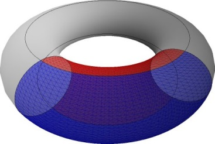

[无对应译文]

</section>

<section class="parallel-paragraph" data-paragraph-ids="s24-01-0088">

s24-01-0088

原文 · s24-01-0088

Même si ce tore est à l’occasion une *bouteille de Klein * :

[无对应译文]

</section>

<section class="parallel-paragraph" data-paragraph-ids="s24-01-0089">

s24-01-0089

原文 · s24-01-0089

[无对应译文]

</section>

<section class="parallel-paragraph" data-paragraph-ids="s24-01-0090">

s24-01-0090

原文 · s24-01-0090

car une *bouteille de Klein *est un tore, un tore qui se traverse lui-même

[无对应译文]

</section>

<section class="parallel-paragraph" data-paragraph-ids="s24-01-0091">

s24-01-0091

原文 · s24-01-0091

→ 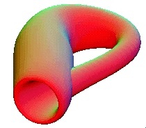

[无对应译文]

</section>

<section class="parallel-paragraph" data-paragraph-ids="s24-01-0092">

s24-01-0092

原文 · s24-01-0092

J’ai parlé de ça il y a bien longtemps.

[无对应译文]

</section>

<section class="parallel-paragraph" data-paragraph-ids="s24-01-0093">

s24-01-0093

原文 · s24-01-0093

Ici, vous voyez que dans ce tore il y a quelque chose qui repré­sente un intérieur absolu, quand on est dans le vide, dans le creux que peut constituer un tore. Ce tore peut être une corde sans doute, mais une corde elle-même se tord, et il y a quelque chose qui est dessinable comme étant l’intérieur de la corde.

[无对应译文]

</section>

<section class="parallel-paragraph" data-paragraph-ids="s24-01-0094">

s24-01-0094

原文 · s24-01-0094

Vous n’avez à cet égard qu’à déployer ce qui s’énonce comme nœud dans une littérature spéciale.

[无对应译文]

</section>

<section class="parallel-paragraph" data-paragraph-ids="s24-01-0095">

s24-01-0095

原文 · s24-01-0095

Alors il y a évidemment deux choses, il y a deux espèces de trous \[c et E\]  :

[无对应译文]

</section>

<section class="parallel-paragraph" data-paragraph-ids="s24-01-0096">

s24-01-0096

原文 · s24-01-0096

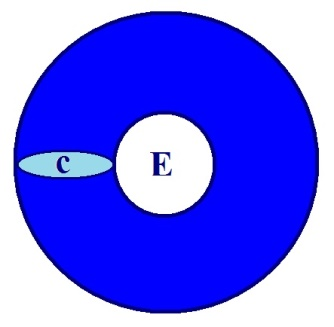

[无对应译文]

</section>

<section class="parallel-paragraph" data-paragraph-ids="s24-01-0097">

s24-01-0097

原文 · s24-01-0097

le trou qui s’ouvre à ce qu’on appelle l’extérieur \[E\], ça met en cause ce dont il s’agit quant à l’espace.

[无对应译文]

</section>

<section class="parallel-paragraph" data-paragraph-ids="s24-01-0098">

s24-01-0098

原文 · s24-01-0098

L’espace passe pour « *étendue »* quand il s’agit de Descartes.

[无对应译文]

</section>

<section class="parallel-paragraph" data-paragraph-ids="s24-01-0099">

s24-01-0099

原文 · s24-01-0099

Mais le corps nous fonde l’idée d’une *autre* *espèce d’espace*.

[无对应译文]

</section>

<section class="parallel-paragraph" data-paragraph-ids="s24-01-0100">

s24-01-0100

原文 · s24-01-0100

Ça n’a pas l’air tout de suite d’être ce qu’on appelle « *un corps »*, ce tore en question.

[无对应译文]

</section>

<section class="parallel-paragraph" data-paragraph-ids="s24-01-0101">

s24-01-0101

原文 · s24-01-0101

Mais vous allez voir qu’il suffit de le retourner...

[无对应译文]

</section>

<section class="parallel-paragraph" data-paragraph-ids="s24-01-0102">

s24-01-0102

原文 · s24-01-0102

> non pas comme se retourne une sphère, parce qu’un tore ça se retourne d’une toute autre façon.
>
> Si ici, par exemple, je me mets à imaginer que c’est une sphère qui est à l’intérieur d’une autre sphère :

[无对应译文]

</section>

<section class="parallel-paragraph" data-paragraph-ids="s24-01-0103">

s24-01-0103

原文 · s24-01-0103

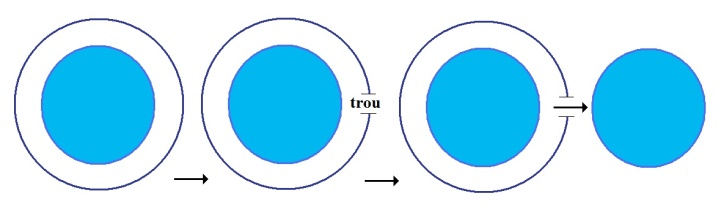

[无对应译文]

</section>

<section class="parallel-paragraph" data-paragraph-ids="s24-01-0104">

s24-01-0104

原文 · s24-01-0104

> je n’obtiens rien qui ressemble à ce que je vais essayer de vous faire sentir maintenant.
>
> Si je fais un trou dans l’autre sphère, cette sphère-là va sortir comme un *grelot* ...mais c’est un tore, c’est-à-dire qu’il va se comporter autrement.

[无对应译文]

</section>

<section class="parallel-paragraph" data-paragraph-ids="s24-01-0105">

s24-01-0105

原文 · s24-01-0105

Il suffirait que vous preniez une simple chambre à air, une chambre à air d’un petit pneu, que vous vous appliqueriez à mettre à l’épreuve, vous verrez alors que le pneu prête à cette façon...

[无对应译文]

</section>

<section class="parallel-paragraph" data-paragraph-ids="s24-01-0106">

s24-01-0106

原文 · s24-01-0106

> vous voyez comme j’ai de la peine à les manipuler ...prête à cette façon de s’enfiler si je puis dire, dans ce qu’offre à lui d’issue, la coupure que nous avons pra­tiquée ici, et que si je devais poursuivre, à supposer que la coupure vien­ne ici se rabattre, s’inverser, si l’on peut dire, ce que vous allez obtenir est ceci qui est différent, différent en apparence, du tore.

[无对应译文]

</section>

<section class="parallel-paragraph" data-paragraph-ids="s24-01-0107">

s24-01-0107

原文 · s24-01-0107

Car c’est bel et bien un tore tout de même, quoique, vu cette fois-ci en coupe, c’est bel et bien un tore exactement comme si nous coupions ici le tore dont il s’agit. Je pense qu’il ne vous échappe pas qu’à rabattre ceci jusqu’à ce que nous bouclions le trou que nous avons fait dans le tore :

[无对应译文]

</section>

<section class="parallel-paragraph" data-paragraph-ids="s24-01-0108">

s24-01-0108

原文 · s24-01-0108

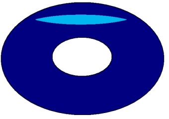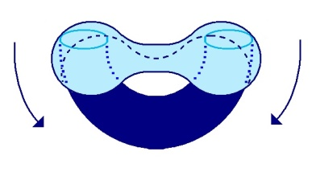

[无对应译文]

</section>

<section class="parallel-paragraph" data-paragraph-ids="s24-01-0109">

s24-01-0109

原文 · s24-01-0109

c’est bel et bien la *figure* qui suit que nous obtenons :

[无对应译文]

</section>

<section class="parallel-paragraph" data-paragraph-ids="s24-01-0110">

s24-01-0110

原文 · s24-01-0110

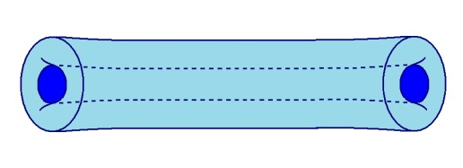

[无对应译文]

</section>

<section class="parallel-paragraph" data-paragraph-ids="s24-01-0111">

s24-01-0111

原文 · s24-01-0111

Ça ne semble pas ravir, si je puis dire, votre consentement.

[无对应译文]

</section>

<section class="parallel-paragraph" data-paragraph-ids="s24-01-0112">

s24-01-0112

原文 · s24-01-0112

C’est pourtant tout à fait sensible. Il suf­fit d’y faire un essai.

[无对应译文]

</section>

<section class="parallel-paragraph" data-paragraph-ids="s24-01-0113">

s24-01-0113

原文 · s24-01-0113

Vous avez ici 2 *tores* dont l’un représente ce qui est advenu, alors que l’autre est l’original :

[无对应译文]

</section>

<section class="parallel-paragraph" data-paragraph-ids="s24-01-0114">

s24-01-0114

原文 · s24-01-0114

 

[无对应译文]

</section>

<section class="parallel-paragraph" data-paragraph-ids="s24-01-0115">

s24-01-0115

原文 · s24-01-0115

original

[无对应译文]

</section>

<section class="parallel-paragraph" data-paragraph-ids="s24-01-0116">

s24-01-0116

原文 · s24-01-0116

Si vous, sur l’un de ces *tores couplés* de la même façon...

[无对应译文]

</section>

<section class="parallel-paragraph" data-paragraph-ids="s24-01-0117">

s24-01-0117

原文 · s24-01-0117

> ceci va nous conduire à autre chose ...sur un de ces *tores couplés* vous pratiquez la manipulation que je vous ai expliquée ici, à savoir que vous y fassiez une coupure :

[无对应译文]

</section>

<section class="parallel-paragraph" data-paragraph-ids="s24-01-0118">

s24-01-0118

原文 · s24-01-0118

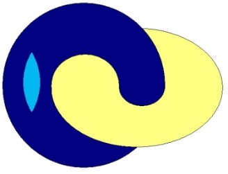

[无对应译文]

</section>

<section class="parallel-paragraph" data-paragraph-ids="s24-01-0119">

s24-01-0119

原文 · s24-01-0119

vous obtiendrez ce quelque chose qui se traduit comme ceci :

[无对应译文]

</section>

<section class="parallel-paragraph" data-paragraph-ids="s24-01-0120">

s24-01-0120

原文 · s24-01-0120

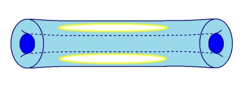 ou 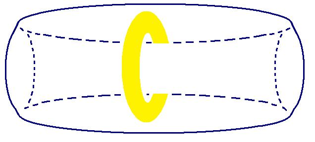

[无对应译文]

</section>

<section class="parallel-paragraph" data-paragraph-ids="s24-01-0121">

s24-01-0121

原文 · s24-01-0121

À savoir que les *tores étant couplés*, vous avez à l’in­térieur de l’un de ces tores, un autre tore, un tore qui est de *la même espèce* que celui que j’ai dessiné ici \[*en jaune*\]. Ce que désigne ceci, c’est qu’ici vous voyez bien que ce qui est du 1er tore \[*en bleu*\] a ici ce que j’appelle *son intérieur*, *quelque chose dans le tore s’est retourné*, qui est exactement en continuité avec ce qui reste d’intérieur dans ce premier tore, ce tore est retourné en ce sens que désormais son intérieur est ce qui passe à l’exté­rieur.

[无对应译文]

</section>

<section class="parallel-paragraph" data-paragraph-ids="s24-01-0122">

s24-01-0122

原文 · s24-01-0122

Alors que pour désigner celui-ci \[*en jaune*\] comme étant celui autour duquel se retourne celui qui est ici \[*en bleu*\], nous nous apercevons que celui que j’ai dési­gné *ici* \[*en jaune*\] est, lui, resté inchangé, c’est-à-dire qu’il a *son premier extérieur*...

[无对应译文]

</section>

<section class="parallel-paragraph" data-paragraph-ids="s24-01-0123">

s24-01-0123

原文 · s24-01-0123

> son extérieur tel qu’il se pose dans la boucle ...il a son extérieur toujours à la même place. Il y a donc eu de l’un d’entre eux, retournement.

[无对应译文]

</section>

<section class="parallel-paragraph" data-paragraph-ids="s24-01-0124">

s24-01-0124

原文 · s24-01-0124

Je pense que...

[无对应译文]

</section>

<section class="parallel-paragraph" data-paragraph-ids="s24-01-0125">

s24-01-0125

原文 · s24-01-0125

quoique ces choses soient fort incommodes, soient fort inhibées à imaginer ...je pense quand même vous avoir véhiculé ce dont il s’agit dans l’occasion.

[无对应译文]

</section>

<section class="parallel-paragraph" data-paragraph-ids="s24-01-0126">

s24-01-0126

原文 · s24-01-0126

Je veux dire que je me suis fait - je l’espère - entendre pour ce dont il s’agit.

[无对应译文]

</section>

<section class="parallel-paragraph" data-paragraph-ids="s24-01-0127">

s24-01-0127

原文 · s24-01-0127

Il est tout à fait remarquable que ce qui est ici, n’ait pas...

[无对应译文]

</section>

<section class="parallel-paragraph" data-paragraph-ids="s24-01-0128">

s24-01-0128

原文 · s24-01-0128

> quoique ce soit littéralement un tore ...n’ait pas la même forme, à savoir que ça se présente comme *une trique*.

[无对应译文]

</section>

<section class="parallel-paragraph" data-paragraph-ids="s24-01-0129">

s24-01-0129

原文 · s24-01-0129

C’est *une trique* qui n’en reste pas moins pourtant un tore. Je veux dire que comme vous l’avez déjà vu ici :

[无对应译文]

</section>

<section class="parallel-paragraph" data-paragraph-ids="s24-01-0130">

s24-01-0130

原文 · s24-01-0130

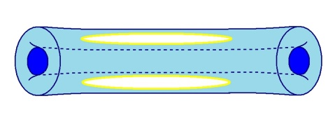

[无对应译文]

</section>

<section class="parallel-paragraph" data-paragraph-ids="s24-01-0131">

s24-01-0131

原文 · s24-01-0131

ce qui vient à se former, c’est quelque chose qui n’a plus rien à faire avec *la première présentation, celle qui noue les deux tores* :

[无对应译文]

</section>

<section class="parallel-paragraph" data-paragraph-ids="s24-01-0132">

s24-01-0132

原文 · s24-01-0132

[无对应译文]

</section>

<section class="parallel-paragraph" data-paragraph-ids="s24-01-0133">

s24-01-0133

原文 · s24-01-0133

Ça n’est pas la même sorte de *chaîne* du fait du *retournement* de ce que j’appelle dans l’occasion, le 1er tore \[en bleu\].

[无对应译文]

</section>

<section class="parallel-paragraph" data-paragraph-ids="s24-01-0134">

s24-01-0134

原文 · s24-01-0134

Mais par rapport à ce 1er tore, par rapport au même, ce que vous avez, c’est quelque chose que je des­sine comme ça : par rapport au même, le *tore-trique*, si nous nous souvenons du même :

[无对应译文]

</section>

<section class="parallel-paragraph" data-paragraph-ids="s24-01-0135">

s24-01-0135

原文 · s24-01-0135

→ 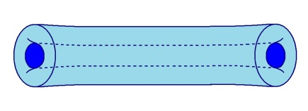

[无对应译文]

</section>

<section class="parallel-paragraph" data-paragraph-ids="s24-01-0136">

s24-01-0136

原文 · s24-01-0136

le *tore-trique* vient ici, c’est-à-dire que pour appuyer les choses, le trou qui est à faire dans le tore, celui que j’ai dési­gné ici, peut être fait en n’importe quel endroit du tore, jusque et y compris couper le tore ici :

[无对应译文]

</section>

<section class="parallel-paragraph" data-paragraph-ids="s24-01-0137">

s24-01-0137

原文 · s24-01-0137

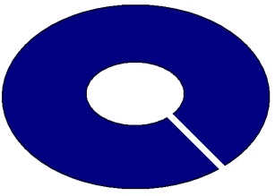

[无对应译文]

</section>

<section class="parallel-paragraph" data-paragraph-ids="s24-01-0138">

s24-01-0138

原文 · s24-01-0138

Car alors il est tout à fait manifeste que ce tore coupé peut se retourner de la même façon et que ce sera en joignant deux coupures que nous obtiendrons cet aspect :

[无对应译文]

</section>

<section class="parallel-paragraph" data-paragraph-ids="s24-01-0139">

s24-01-0139

原文 · s24-01-0139

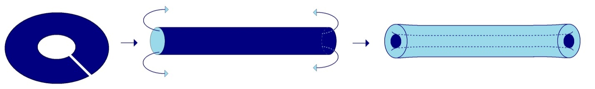

[无对应译文]

</section>

<section class="parallel-paragraph" data-paragraph-ids="s24-01-0140">

s24-01-0140

原文 · s24-01-0140

En d’autres termes en cou­pant ce tore ici, on obtient ce que j’ai appelé la présentation *en trique* de la même façon.

[无对应译文]

</section>

<section class="parallel-paragraph" data-paragraph-ids="s24-01-0141">

s24-01-0141

原文 · s24-01-0141

C’est-à-dire que quelque chose qui se manifestera dans le tore par 2 coupures per­mettra un rabattement exactement tel que c’est en joignant 2 coupures...

[无对应译文]

</section>

<section class="parallel-paragraph" data-paragraph-ids="s24-01-0142">

s24-01-0142

原文 · s24-01-0142

> et non pas en fermant la coupure unique, celle que j’ai faite ici ...c’est en joignant 2 coupures que nous obtiendrons cette *trique* que j’ai appellé de ce terme, encore que ce soit un tore.

[无对应译文]

</section>

<section class="parallel-paragraph" data-paragraph-ids="s24-01-0143">

s24-01-0143

原文 · s24-01-0143

Voilà ce qu’aujourd’hui... et je conviens que ce n’est pas nourritu­re facile, mais ce que j’aimerais la prochaine fois...

[无对应译文]

</section>

<section class="parallel-paragraph" data-paragraph-ids="s24-01-0144">

s24-01-0144

原文 · s24-01-0144

> à savoir dans le 2ème mardi de Décembre, ...ce que j’aimerais entendre la prochaine fois, de quiconque d’entre vous, c’est la façon dont, de ces 2 modes de repliement du tore, y étant adjoint un 3ème, qui - lui - est celui-ci :

[无对应译文]

</section>

<section class="parallel-paragraph" data-paragraph-ids="s24-01-0145">

s24-01-0145

原文 · s24-01-0145

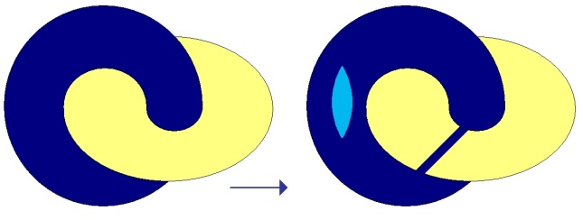

[无对应译文]

</section>

<section class="parallel-paragraph" data-paragraph-ids="s24-01-0146">

s24-01-0146

原文 · s24-01-0146

supposez que nous ayons un tore dans un autre tore, la même opération est concevable pour les 2 tores, à savoir :

[无对应译文]

</section>

<section class="parallel-paragraph" data-paragraph-ids="s24-01-0147">

s24-01-0147

原文 · s24-01-0147

- d’une *coupure* faite dans celui-ci,

[无对应译文]

</section>

<section class="parallel-paragraph" data-paragraph-ids="s24-01-0148">

s24-01-0148

原文 · s24-01-0148

- et d’une *coupure* autre, distincte, puisque ce n’est pas le même *tore*, faite dans celui-là.

[无对应译文]

</section>

<section class="parallel-paragraph" data-paragraph-ids="s24-01-0149">

s24-01-0149

原文 · s24-01-0149

Il est dans ce cas, tout a fait clair - je vous le laisse à concevoir - que le repliement de ces deux tores nous donnera une *même trique * :

[无对应译文]

</section>

<section class="parallel-paragraph" data-paragraph-ids="s24-01-0150">

s24-01-0150

原文 · s24-01-0150

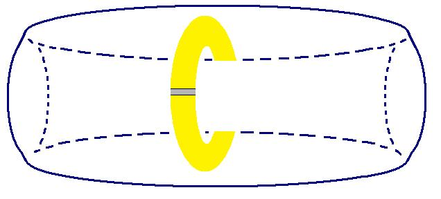 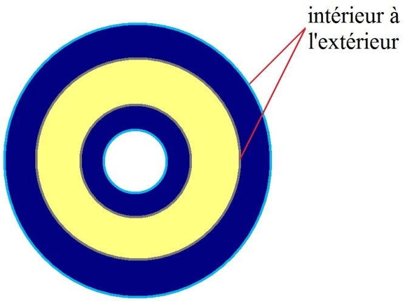

[无对应译文]

</section>

<section class="parallel-paragraph" data-paragraph-ids="s24-01-0151">

s24-01-0151

原文 · s24-01-0151

Mais :

[无对应译文]

</section>

<section class="parallel-paragraph" data-paragraph-ids="s24-01-0152">

s24-01-0152

原文 · s24-01-0152

- à ceci près que dans *la trique* il y aura un contenu analogue,

[无对应译文]

</section>

<section class="parallel-paragraph" data-paragraph-ids="s24-01-0153">

s24-01-0153

原文 · s24-01-0153

- à ceci près que pour les 2 cas, cette fois-ci l’intérieur sera à l’extérieu, et de même pour celui-ci, je veux dire pour le tore qui est à l’intérieur.

[无对应译文]

</section>

<section class="parallel-paragraph" data-paragraph-ids="s24-01-0154">

s24-01-0154

原文 · s24-01-0154

Comment - vous poserai-je la question - comment identifier, car c’est distinct, comment identifier :

[无对应译文]

</section>

<section class="parallel-paragraph" data-paragraph-ids="s24-01-0155">

s24-01-0155

原文 · s24-01-0155

- *l’identification hystérique*,

[无对应译文]

</section>

<section class="parallel-paragraph" data-paragraph-ids="s24-01-0156">

s24-01-0156

原文 · s24-01-0156

- *l’identifica­tion amoureuse dite « au père »*,

[无对应译文]

</section>

<section class="parallel-paragraph" data-paragraph-ids="s24-01-0157">

s24-01-0157

原文 · s24-01-0157

- et *l’identification que j’appellerai neutre*, celle qui n’est ni l’une, ni l’autre, qui est l’identification à un trait parti­culier, à un trait que j’ai appelé - c’est comme ça que j’ai traduit l’*Einziger Zug -* que j’ai appelé : « *à n’importe quel trait* » ?

[无对应译文]

</section>

<section class="parallel-paragraph" data-paragraph-ids="s24-01-0158">

s24-01-0158

原文 · s24-01-0158

Comment répartir ces 3 *inversions de tores* homogènes donc dans leur pratique, et en plus qui maintiennent la symétrie, si je puis dire, entre un tore et un autre, comment les repartir, comment désigner d’une façon homologue :

[无对应译文]

</section>

<section class="parallel-paragraph" data-paragraph-ids="s24-01-0159">

s24-01-0159

原文 · s24-01-0159

- *l’identification* « *paternelle* » ,

[无对应译文]

</section>

<section class="parallel-paragraph" data-paragraph-ids="s24-01-0160">

s24-01-0160

原文 · s24-01-0160

- *l’identification* « *hystérique* »,

[无对应译文]

</section>

<section class="parallel-paragraph" data-paragraph-ids="s24-01-0161">

s24-01-0161

原文 · s24-01-0161

- *l’identification* « *à un trait* », qui soit seulement le même ?

[无对应译文]

</section>

<section class="parallel-paragraph" data-paragraph-ids="s24-01-0162">

s24-01-0162

原文 · s24-01-0162

Voilà la question sur laquelle j’aimerais, la prochaine fois, que vous ayez la bonté de prendre parti.

[无对应译文]

</section>

<section class="note-block original-notes">

## Notes

[^1]: Conférence « [*Le symbolique, l’imaginaire et le réel*](http://ecole-lacanienne.net/wp-content/uploads/2016/04/1953-07-08.pdf) » du 08 Juillet 1953, en ouverture des activités de la récente « *Société française de Psychanalyse* »,

    née de la « scission de 1953 ».

</section>
