# Leçon 02 | 14 Décembre 1976

  <label><input type="checkbox" data-lacan-toggle="original" checked> 原文</label>
  <label><input type="checkbox" data-lacan-toggle="notes" checked> 注释</label>
  <label><input type="checkbox" data-lacan-toggle="commentary" checked> 个人解读评论</label>

<section class="parallel-paragraph" data-paragraph-ids="s24-02-0001">

s24-02-0001

[无对应译文]

原文 · s24-02-0001

Voilà ! Je ne vais pas à donner de commentaires. Bon, comme la dernière fois je vous ai parlé de quelque chose qui n’est pas *une sphère dans une autre*, qui est ce qu’on appelle un *tore*, il en résulte...

</section>

<section class="parallel-paragraph" data-paragraph-ids="s24-02-0002">

s24-02-0002

[无对应译文]

原文 · s24-02-0002

> c’était ce que je voulais vous indiquer par là, mais c’était allusif ...qu’aucun résultat de la science n’est un progrès.

</section>

<section class="parallel-paragraph" data-paragraph-ids="s24-02-0003">

s24-02-0003

[无对应译文]

原文 · s24-02-0003

Contrairement à ce qu’on s’imagine, la science tourne en rond, et nous n’avons pas de raison de penser que les gens du silex taillé avaient moins de science que nous.

</section>

<section class="parallel-paragraph" data-paragraph-ids="s24-02-0004">

s24-02-0004

[无对应译文]

原文 · s24-02-0004

La psychanalyse notamment n’est pas un progrès, puisque ce que je veux vous indiquer...

</section>

<section class="parallel-paragraph" data-paragraph-ids="s24-02-0005">

s24-02-0005

[无对应译文]

原文 · s24-02-0005

> puisque malgré tout je reste près de ce sujet ...la psychanalyse notamment n’est pas un progrès, c’est un biais pratique pour mieux se sentir.

</section>

<section class="parallel-paragraph" data-paragraph-ids="s24-02-0006">

s24-02-0006

[无对应译文]

原文 · s24-02-0006

Ce « *mieux se sentir* », il faut le dire, n’exclut pas l’abrutissement.

</section>

<section class="parallel-paragraph" data-paragraph-ids="s24-02-0007">

s24-02-0007

[无对应译文]

原文 · s24-02-0007

Tout indique...

</section>

<section class="parallel-paragraph" data-paragraph-ids="s24-02-0008">

s24-02-0008

[无对应译文]

原文 · s24-02-0008

avec l’indice de soupçon que j’ai fait peser sur le « *tout* » ...en fait il n’y a de « *tout* » que criblé, et *pièce à pièce*.

</section>

<section class="parallel-paragraph" data-paragraph-ids="s24-02-0009">

s24-02-0009

[无对应译文]

原文 · s24-02-0009

La seule chose qui compte, c’est qu’une pièce a ou non *valeur d’échange*, c’est la seule définition du « *tout* ».

</section>

<section class="parallel-paragraph" data-paragraph-ids="s24-02-0010">

s24-02-0010

[无对应译文]

原文 · s24-02-0010

*Une pièce vaut dans toutes circonstances, ceci ne veut dire que « circonstance » qualifiée comme « toute »* *pour valoir homo­généité de valeur... Le « tout » n’est qu’une notion de valeur.*

</section>

<section class="parallel-paragraph" data-paragraph-ids="s24-02-0011">

s24-02-0011

[无对应译文]

原文 · s24-02-0011

*Le « tout » c’est ce qui vaut dans son genre un autre de la même espèce d’unité.*

</section>

<section class="parallel-paragraph" data-paragraph-ids="s24-02-0012">

s24-02-0012

[无对应译文]

原文 · s24-02-0012

Nous avançons là tout doucement vers la contradiction de ce que j’ai appelé « *l’Une-bévue* ».

</section>

<section class="parallel-paragraph" data-paragraph-ids="s24-02-0013">

s24-02-0013

[无对应译文]

原文 · s24-02-0013

*L’Une-bévue*  est ce qui s’échange malgré que ça ne vaille pas l’unité en question.

</section>

<section class="parallel-paragraph" data-paragraph-ids="s24-02-0014">

s24-02-0014

[无对应译文]

原文 · s24-02-0014

*L’Une-bévue* est un « *tout* » *faux* ».

</section>

<section class="parallel-paragraph" data-paragraph-ids="s24-02-0015">

s24-02-0015

[无对应译文]

原文 · s24-02-0015

Son type, si je puis dire, c’est le signifiant, le signifiant *type*, c’est-à-dire, exemple: il n’y en a pas de plus type que « *le même et l’autre* ».

</section>

<section class="parallel-paragraph" data-paragraph-ids="s24-02-0016">

s24-02-0016

[无对应译文]

原文 · s24-02-0016

Je veux dire qu’il n’y a pas de signifiant *plus type* que ces deux énoncés.

</section>

<section class="parallel-paragraph" data-paragraph-ids="s24-02-0017">

s24-02-0017

[无对应译文]

原文 · s24-02-0017

Une autre unité est semblable à l’autre.

</section>

<section class="parallel-paragraph" data-paragraph-ids="s24-02-0018">

s24-02-0018

[无对应译文]

原文 · s24-02-0018

Tout ce qui soutient la différence du *même* et de l’*autre*, c’est que le *même* soit le *même matériellement*.

</section>

<section class="parallel-paragraph" data-paragraph-ids="s24-02-0019">

s24-02-0019

[无对应译文]

原文 · s24-02-0019

La notion de *matière* est fondamentale en ceci qu’elle fonde le *même*.

</section>

<section class="parallel-paragraph" data-paragraph-ids="s24-02-0020">

s24-02-0020

[无对应译文]

原文 · s24-02-0020

Tout ce qui n’est pas fondé sur la matière est une escroquerie : *matériel ne ment*.

</section>

<section class="parallel-paragraph" data-paragraph-ids="s24-02-0021">

s24-02-0021

[无对应译文]

原文 · s24-02-0021

*Le matériel* se présente à nous comme *corps-sistance,* je veux dire sous *la sub-sistance du corps*, de ce qui est *con-sistant* : ce qui tient ensemble à la façon de ce qu’on peut appeler un « *con* », autrement dit une unité.

</section>

<section class="parallel-paragraph" data-paragraph-ids="s24-02-0022">

s24-02-0022

[无对应译文]

原文 · s24-02-0022

Rien de plus unique qu’un signifiant, mais en ce sens limité qu’il n’est que *semblable* à une autre émission de signifiant.

</section>

<section class="parallel-paragraph" data-paragraph-ids="s24-02-0023">

s24-02-0023

[无对应译文]

原文 · s24-02-0023

Il retourne à la valeur, à l’échange.

</section>

<section class="parallel-paragraph" data-paragraph-ids="s24-02-0024">

s24-02-0024

[无对应译文]

原文 · s24-02-0024

Il signifie le « *tout* », ce qui veut dire : il est le « *signe du tout* ».

</section>

<section class="parallel-paragraph" data-paragraph-ids="s24-02-0025">

s24-02-0025

[无对应译文]

原文 · s24-02-0025

Le « *signe du tout* » c’est le *signifié*, lequel ouvre la possibilité de l’échange.

</section>

<section class="parallel-paragraph" data-paragraph-ids="s24-02-0026">

s24-02-0026

[无对应译文]

原文 · s24-02-0026

Je souligne à cette occasion ce que j’ai dit du *possible* : il y aura toujours un temps - c’est ça que ça veut dire –

</section>

<section class="parallel-paragraph" data-paragraph-ids="s24-02-0027">

s24-02-0027

[无对应译文]

原文 · s24-02-0027

- où *il cessera de s’écri­re*,

</section>

<section class="parallel-paragraph" data-paragraph-ids="s24-02-0028">

s24-02-0028

[无对应译文]

原文 · s24-02-0028

- où le *signifié* ne tiendra plus comme fondant *la même valeur* : l’échan­ge matériel.

</section>

<section class="parallel-paragraph" data-paragraph-ids="s24-02-0029">

s24-02-0029

[无对应译文]

原文 · s24-02-0029

Car « *la même valeur »* est l’introduction du mensonge : il y a échange, mais non matérialité même.

</section>

<section class="parallel-paragraph" data-paragraph-ids="s24-02-0030">

s24-02-0030

[无对应译文]

原文 · s24-02-0030

Qu’est-ce que l’autre comme tel ?

</section>

<section class="parallel-paragraph" data-paragraph-ids="s24-02-0031">

s24-02-0031

[无对应译文]

原文 · s24-02-0031

C’est cette matérialité que je disais « *même* » à l’instant, c’est-à-dire que j’épinglais du signe singeant l’autre.

</section>

<section class="parallel-paragraph" data-paragraph-ids="s24-02-0032">

s24-02-0032

[无对应译文]

原文 · s24-02-0032

Il n’y a qu’une série d’autres - tous les mêmes en tant qu’unité - entre lesquels *une bévue* est toujours *possible*, c’est-à-dire qu’elle ne se perpétuera pas, qu’elle cessera comme bévue.

</section>

<section class="parallel-paragraph" data-paragraph-ids="s24-02-0033">

s24-02-0033

[无对应译文]

原文 · s24-02-0033

Voilà ! Tout ça, c’est des vérités premières, mais que je crois devoir vous rappeler.

</section>

<section class="parallel-paragraph" data-paragraph-ids="s24-02-0034">

s24-02-0034

[无对应译文]

原文 · s24-02-0034

L’homme pense...

</section>

<section class="parallel-paragraph" data-paragraph-ids="s24-02-0035">

s24-02-0035

[无对应译文]

原文 · s24-02-0035

Ça ne veut pas dire qu’il ne soit fait que pour ça.

</section>

<section class="parallel-paragraph" data-paragraph-ids="s24-02-0036">

s24-02-0036

[无对应译文]

原文 · s24-02-0036

Mais ce qui est manifeste, c’est qu’il ne fait que ça de valable, parce que « *valable »* veut dire...

</section>

<section class="parallel-paragraph" data-paragraph-ids="s24-02-0037">

s24-02-0037

[无对应译文]

原文 · s24-02-0037

> et rien d’autre : ce n’est pas une échelle de valeur,
>
> l’échelle de valeur, comme je vous le rappelle, tourne en rond *...« valable » ne veut rien dire que ceci : que ça entraîne <u>la soumission de la valeur d’usage à la valeur d’échange</u>*.

</section>

<section class="parallel-paragraph" data-paragraph-ids="s24-02-0038">

s24-02-0038

[无对应译文]

原文 · s24-02-0038

Ce qui est patent, c’est que la notion de *valeur* est inhérente à ce système du *tore,* et que la notion *d’Une-bévue* dans mon titre de cette année veut dire seulement que...

</section>

<section class="parallel-paragraph" data-paragraph-ids="s24-02-0039">

s24-02-0039

[无对应译文]

原文 · s24-02-0039

> on pourrait également dire le contraire \[*cf. « docte ignorance »*\] ...l’homme sait plus qu’il ne croit savoir.

</section>

<section class="parallel-paragraph" data-paragraph-ids="s24-02-0040">

s24-02-0040

[无对应译文]

原文 · s24-02-0040

Mais la substance de ce savoir, la matérialité qui est dessous, n’est rien d’autre que *le signifiant* en tant qu’il a des effets de *signification*.

</section>

<section class="parallel-paragraph" data-paragraph-ids="s24-02-0041">

s24-02-0041

[无对应译文]

原文 · s24-02-0041

L’homme *parle-être* comme j’ai dit, ce qui ne veut rien dire d’autre *qu’il parle signifiant*, avec quoi la notion d’*être* se confond.

</section>

<section class="parallel-paragraph" data-paragraph-ids="s24-02-0042">

s24-02-0042

[无对应译文]

原文 · s24-02-0042

Ceci est réel... *Réel* ou *Vrai* ? Tout se pose, à ce niveau tentatif, *comme si les deux mots étaient synonymes*.

</section>

<section class="parallel-paragraph" data-paragraph-ids="s24-02-0043">

s24-02-0043

[无对应译文]

原文 · s24-02-0043

L’affreux, c’est qu’ils ne le sont pas partout.

</section>

<section class="parallel-paragraph" data-paragraph-ids="s24-02-0044">

s24-02-0044

[无对应译文]

原文 · s24-02-0044

Le *Vrai*, c’est ce qu’on croit tel : la foi et même la foi religieuse, voilà le *Vrai* qui n’a rien à faire avec le *Réel*.

</section>

<section class="parallel-paragraph" data-paragraph-ids="s24-02-0045">

s24-02-0045

[无对应译文]

原文 · s24-02-0045

La psychanalyse, il faut bien le dire, tourne dans le même rond.

</section>

<section class="parallel-paragraph" data-paragraph-ids="s24-02-0046">

s24-02-0046

[无对应译文]

原文 · s24-02-0046

C’est la forme moderne de la foi, de la foi religieuse \[*l’analysant « croit » à son symptôme*\].

</section>

<section class="parallel-paragraph" data-paragraph-ids="s24-02-0047">

s24-02-0047

[无对应译文]

原文 · s24-02-0047

À la dérive, voilà où est le *Vrai* quand il s’agit de *Réel*.

</section>

<section class="parallel-paragraph" data-paragraph-ids="s24-02-0048">

s24-02-0048

[无对应译文]

原文 · s24-02-0048

Tout cela parce que manifestement...

</section>

<section class="parallel-paragraph" data-paragraph-ids="s24-02-0049">

s24-02-0049

[无对应译文]

原文 · s24-02-0049

> depuis le temps, on le saurait, si ce n’était pas si manifeste ...manifestement il n’y a pas de connaissance.

</section>

<section class="parallel-paragraph" data-paragraph-ids="s24-02-0050">

s24-02-0050

[无对应译文]

原文 · s24-02-0050

Il n’y a que du *savoir*, au sens que j’ai dit d’abord, à savoir qu’on se goure, « *Une bévue »* c’est ce dont il s’agit : *tournage en rond de la philosophie*.

</section>

<section class="parallel-paragraph" data-paragraph-ids="s24-02-0051">

s24-02-0051

[无对应译文]

原文 · s24-02-0051

Il s’agit de substituer un autre sens au terme « *système du monde* » qu’il faut bien conserver, quoique de ce « *monde* » on ne peut rien dire de l’homme, sinon qu’il en est chu, nous allons voir comment, et ça a beaucoup de rapport avec le trou central du *tore*.

</section>

<section class="parallel-paragraph" data-paragraph-ids="s24-02-0052">

s24-02-0052

[无对应译文]

原文 · s24-02-0052

Il n’y a pas de progrès parce qu’il ne peut pas y en avoir : l’homme tourne en rond, si ce que je dis de sa structure est *vrai*, parce que la structure de l’homme est torique.

</section>

<section class="parallel-paragraph" data-paragraph-ids="s24-02-0053">

s24-02-0053

[无对应译文]

原文 · s24-02-0053

Non pas du tout que j’affirme qu’elle soit telle.

</section>

<section class="parallel-paragraph" data-paragraph-ids="s24-02-0054">

s24-02-0054

[无对应译文]

原文 · s24-02-0054

Je dis qu’on peut essayer de voir où en est l’affaire, ce d’autant plus que nous y incite la topologie générale.

</section>

<section class="parallel-paragraph" data-paragraph-ids="s24-02-0055">

s24-02-0055

[无对应译文]

原文 · s24-02-0055

Le « *système du monde* » jusqu’ici a toujours été sphéroïdal.

</section>

<section class="parallel-paragraph" data-paragraph-ids="s24-02-0056">

s24-02-0056

[无对应译文]

原文 · s24-02-0056

Bah ! On pourrait peut-être chan­ger !

</section>

<section class="parallel-paragraph" data-paragraph-ids="s24-02-0057">

s24-02-0057

[无对应译文]

原文 · s24-02-0057

Le monde s’est toujours peint, jusqu’à présent, pour ce qu’en ont énoncé les hommes, se peint à l’intérieur d’une bulle.

</section>

<section class="parallel-paragraph" data-paragraph-ids="s24-02-0058">

s24-02-0058

[无对应译文]

原文 · s24-02-0058

Le vivant se considère lui-même comme une boule, mais avec le temps il s’est quand même aperçu qu’il n’était pas une boule, une bulle. Pourquoi ne pas s’apercevoir qu’il est organisé...

</section>

<section class="parallel-paragraph" data-paragraph-ids="s24-02-0059">

s24-02-0059

[无对应译文]

原文 · s24-02-0059

> je veux dire ce qu’on voit du corps vivant ...qu’il est organisé comme ce que j’ai appelé « *trique* » l’autre jour.

</section>

<section class="parallel-paragraph" data-paragraph-ids="s24-02-0060">

s24-02-0060

[无对应译文]

原文 · s24-02-0060

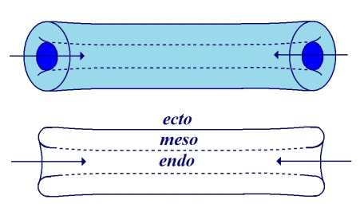

</section>

<section class="parallel-paragraph" data-paragraph-ids="s24-02-0061">

s24-02-0061

[无对应译文]

原文 · s24-02-0061

Voilà, j’essaye de dessiner ça comme ça.

</section>

<section class="parallel-paragraph" data-paragraph-ids="s24-02-0062">

s24-02-0062

[无对应译文]

原文 · s24-02-0062

Il est évident que c’est bien à ça que ça aboutit, ce que nous connaissons du corps comme consistant.

</section>

<section class="parallel-paragraph" data-paragraph-ids="s24-02-0063">

s24-02-0063

[无对应译文]

原文 · s24-02-0063

On appelle ça « *ecto »*, ça « *endo »,* et puis autour il y a le « *méso »*.

</section>

<section class="parallel-paragraph" data-paragraph-ids="s24-02-0064">

s24-02-0064

[无对应译文]

原文 · s24-02-0064

C’est comme ça que c’est fait : ici il y a la bouche, et ici... \[*Rires*\] le contraire, la bouche postérieure.

</section>

<section class="parallel-paragraph" data-paragraph-ids="s24-02-0065">

s24-02-0065

[无对应译文]

原文 · s24-02-0065

Seulement cette trique n’est rien d’autre qu’un *tore*.

</section>

<section class="parallel-paragraph" data-paragraph-ids="s24-02-0066">

s24-02-0066

[无对应译文]

原文 · s24-02-0066

Le fait que nous soyons *toriques* va assez bien en somme avec ce que j’ai appelé l’autre jour : *trique*.

</section>

<section class="parallel-paragraph" data-paragraph-ids="s24-02-0067">

s24-02-0067

[无对应译文]

原文 · s24-02-0067

C’est une élision de l’« o » \[t( )rique\].

</section>

<section class="parallel-paragraph" data-paragraph-ids="s24-02-0068">

s24-02-0068

[无对应译文]

原文 · s24-02-0068

Alors ceci nous amène à considérer que l’*hystérique* dont chacun sait qu’il est aussi bien mâle que femelle, l’*hystorique*...

</section>

<section class="parallel-paragraph" data-paragraph-ids="s24-02-0069">

s24-02-0069

[无对应译文]

原文 · s24-02-0069

> si je me permets ce glis­sement, il faut considérer en somme qu’elle n’est... je la féminise pour l’occasion, mais comme vous allez voir que je vais y mettre de l’autre côté mon poids,
>
> ça me suffira largement à vous démontrer que je ne pense pas qu’il n’y ait des *hystériques* que féminines ...l’*hystorique* n’a en somme - pour la faire consister - qu’un inconscient, c’est « *la radicalement Autre ».*

</section>

<section class="parallel-paragraph" data-paragraph-ids="s24-02-0070">

s24-02-0070

[无对应译文]

原文 · s24-02-0070

Elle n’*est* même *qu’en tant qu’Autre*.

</section>

<section class="parallel-paragraph" data-paragraph-ids="s24-02-0071">

s24-02-0071

[无对应译文]

原文 · s24-02-0071

Eh bien, c’est mon cas.

</section>

<section class="parallel-paragraph" data-paragraph-ids="s24-02-0072">

s24-02-0072

[无对应译文]

原文 · s24-02-0072

Moi aussi, je n’ai qu’un inconscient.

</section>

<section class="parallel-paragraph" data-paragraph-ids="s24-02-0073">

s24-02-0073

[无对应译文]

原文 · s24-02-0073

C’est même pour ça que j’y pense tout le temps.

</section>

<section class="parallel-paragraph" data-paragraph-ids="s24-02-0074">

s24-02-0074

[无对应译文]

原文 · s24-02-0074

C’en est au point que...

</section>

<section class="parallel-paragraph" data-paragraph-ids="s24-02-0075">

s24-02-0075

[无对应译文]

原文 · s24-02-0075

> enfin, je peux vous en témoigner ...c’en est au point que je pense l’*univers* *torique,* et que ça ne veut rien dire d’autre, c’est que je ne *consiste* qu’en *un inconscient* auquel, bien sûr, je pense nuit et jour, ce qui fait que *l’une-bévue* devient inexacte.

</section>

<section class="parallel-paragraph" data-paragraph-ids="s24-02-0076">

s24-02-0076

[无对应译文]

原文 · s24-02-0076

Je fais tellement peu de *bévues* que c’est la seule chose...

</section>

<section class="parallel-paragraph" data-paragraph-ids="s24-02-0077">

s24-02-0077

[无对应译文]

原文 · s24-02-0077

> bien sûr, j’en fais de temps en temps, ça n’a que peu d’importance.
>
> Il m’arrive de dire dans un restaurant : « *Mademoiselle en est réduit à ne manger que des écrevisses à la nage* »,
>
> tant que nous en sommes là, à faire une erreur de genre, ça ne va pas loin ...en fin de compte, je suis *un hystérique parfait,* c’est-à-dire *sans symptôme,* sauf de temps en temps cette erreur de genre en question.

</section>

<section class="parallel-paragraph" data-paragraph-ids="s24-02-0078">

s24-02-0078

[无对应译文]

原文 · s24-02-0078

Il y a quand même quelque chose qui distingue l’*hystérique*, je dirai : de moi dans l’occasion.

</section>

<section class="parallel-paragraph" data-paragraph-ids="s24-02-0079">

s24-02-0079

[无对应译文]

原文 · s24-02-0079

Mais je vais essayer de vous le présenter. Vous voyez comme on est maladroit. Voilà !

</section>

<section class="parallel-paragraph" data-paragraph-ids="s24-02-0080">

s24-02-0080

[无对应译文]

原文 · s24-02-0080

</section>

<section class="parallel-paragraph" data-paragraph-ids="s24-02-0081">

s24-02-0081

[无对应译文]

原文 · s24-02-0081

Ça c’est deux... je colore celui-là pour vous en donner le sens - ça veut dire ça : un *tore* qui fait *chaîne* avec un autre.

</section>

<section class="parallel-paragraph" data-paragraph-ids="s24-02-0082">

s24-02-0082

[无对应译文]

原文 · s24-02-0082

Chacun sait, parce que je l’ai déjà indiqué la dernière fois, que si vous faites une coupure ici et si vous rabattez le *tore* vous obtenez ceci, quelque chose qui se présente comme ça, c’est-à-dire qui reproduit ce que j’ai appelé tout à l’heure « *la trique* », à ceci près que ce que j’ai dessiné tout à l’heure comme *ceci* \[*ici en jaune*\], est là à l’intérieur de *la* *trique*.

</section>

<section class="parallel-paragraph" data-paragraph-ids="s24-02-0083">

s24-02-0083

[无对应译文]

原文 · s24-02-0083

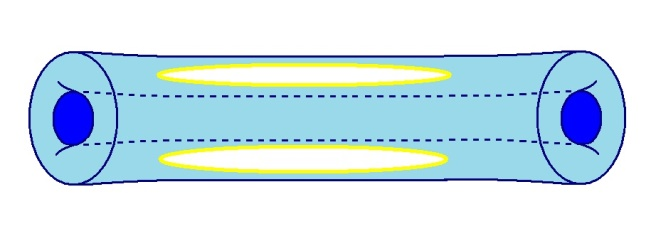 ou 

</section>

<section class="parallel-paragraph" data-paragraph-ids="s24-02-0084">

s24-02-0084

[无对应译文]

原文 · s24-02-0084

La différence entre l’*hystérique* et moi...

</section>

<section class="parallel-paragraph" data-paragraph-ids="s24-02-0085">

s24-02-0085

[无对应译文]

原文 · s24-02-0085

> et moi qui, en somme, à force d’avoir un incons­cient, l’unifie avec mon conscient ...la différence est ceci : c’est qu’en somme *l’hystérique est soutenue*...

</section>

<section class="parallel-paragraph" data-paragraph-ids="s24-02-0086">

s24-02-0086

[无对应译文]

原文 · s24-02-0086

> *dans sa forme de trique* ...*est soutenue par une armature*.

</section>

<section class="parallel-paragraph" data-paragraph-ids="s24-02-0087">

s24-02-0087

[无对应译文]

原文 · s24-02-0087

Cette *armature* est en somme distincte de son conscient.

</section>

<section class="parallel-paragraph" data-paragraph-ids="s24-02-0088">

s24-02-0088

[无对应译文]

原文 · s24-02-0088

*Cette armature, c’est son amour pour son père*.

</section>

<section class="parallel-paragraph" data-paragraph-ids="s24-02-0089">

s24-02-0089

[无对应译文]

原文 · s24-02-0089

Tout ce que nous connaissons de cas énoncés par Freud concernant l’*hystérique*, qu’il s’agisse :

</section>

<section class="parallel-paragraph" data-paragraph-ids="s24-02-0090">

s24-02-0090

[无对应译文]

原文 · s24-02-0090

- d’« *Anna O.* »,

</section>

<section class="parallel-paragraph" data-paragraph-ids="s24-02-0091">

s24-02-0091

[无对应译文]

原文 · s24-02-0091

- d’« *Emmy von N.* », ou de n’importe quelle autre,

</section>

<section class="parallel-paragraph" data-paragraph-ids="s24-02-0092">

s24-02-0092

[无对应译文]

原文 · s24-02-0092

- l’autre : « *von R.* » ...*la monture* c’est ce quelque chose que j’ai désigné tout à l’heure comme *chaîne*, *chaîne des générations*.

</section>

<section class="parallel-paragraph" data-paragraph-ids="s24-02-0093">

s24-02-0093

[无对应译文]

原文 · s24-02-0093

Il est bien clair qu’à partir du moment où on s’engage dans cette voie, il n’y a pas de raison que ça s’arrête, à savoir qu’*ici* :

</section>

<section class="parallel-paragraph" data-paragraph-ids="s24-02-0094">

s24-02-0094

[无对应译文]

原文 · s24-02-0094

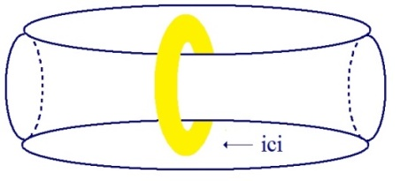

</section>

<section class="parallel-paragraph" data-paragraph-ids="s24-02-0095">

s24-02-0095

[无对应译文]

原文 · s24-02-0095

il peut y avoir *quelque chose d’autre* qui fasse *chaîne,* et qu’il est question de voir – ça ne peut pas aller très loin – comment *ceci* à l’occasion fera *trique* à l’endroit de l’amour, de l’amour du père en question.

</section>

<section class="parallel-paragraph" data-paragraph-ids="s24-02-0096">

s24-02-0096

[无对应译文]

原文 · s24-02-0096

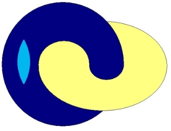 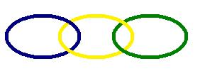 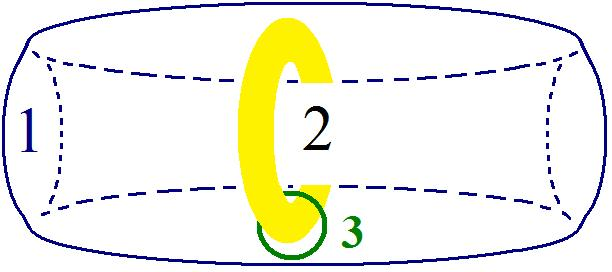

</section>

<section class="parallel-paragraph" data-paragraph-ids="s24-02-0097">

s24-02-0097

[无对应译文]

原文 · s24-02-0097

Ça ne veut pas dire que ça soit tranché et qu’on puisse schématiser le retournement de ce tore \[3\] autour du tore 2...

</section>

<section class="parallel-paragraph" data-paragraph-ids="s24-02-0098">

s24-02-0098

[无对应译文]

原文 · s24-02-0098

> appelons-le comme ça ...qu’on puisse le schématiser par *une trique*.

</section>

<section class="parallel-paragraph" data-paragraph-ids="s24-02-0099">

s24-02-0099

[无对应译文]

原文 · s24-02-0099

Il y a peut-être quelque chose qui fait obstacle, et très précisément tout est là : le fait que la chaîne inconsciente s’arrête au rap­port de l’enfant aux parents, est oui ou non fondé.

</section>

<section class="parallel-paragraph" data-paragraph-ids="s24-02-0100">

s24-02-0100

[无对应译文]

原文 · s24-02-0100

Si je pose la question de ce que c’est qu’*un trou,* il faut me faire confiance : ça a un certain rapport avec la question.

</section>

<section class="parallel-paragraph" data-paragraph-ids="s24-02-0101">

s24-02-0101

[无对应译文]

原文 · s24-02-0101

Un trou - comme ça « *de sentiment* » - ça veut dire ça : quand je craque la surface.

</section>

<section class="parallel-paragraph" data-paragraph-ids="s24-02-0102">

s24-02-0102

[无对应译文]

原文 · s24-02-0102

Je veux dire par là que « *d’intuition* », notre trou c’est un trou dans la surface.

</section>

<section class="parallel-paragraph" data-paragraph-ids="s24-02-0103">

s24-02-0103

[无对应译文]

原文 · s24-02-0103

Mais une surface a un endroit et un envers, c’est bien connu, et ça signifie donc qu’un trou, c’est le trou de l’endroit plus le trou de l’envers.

</section>

<section class="parallel-paragraph" data-paragraph-ids="s24-02-0104">

s24-02-0104

[无对应译文]

原文 · s24-02-0104

Mais comme il existe *une bande de Mœbius* qui a pour propriété de conjoindre *l’endroit* qui est ici avec *l’envers* qui est là.

</section>

<section class="parallel-paragraph" data-paragraph-ids="s24-02-0105">

s24-02-0105

[无对应译文]

原文 · s24-02-0105

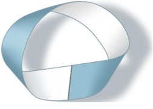

</section>

<section class="parallel-paragraph" data-paragraph-ids="s24-02-0106">

s24-02-0106

[无对应译文]

原文 · s24-02-0106

Est-ce qu’ *une bande de Mœbius* est un *trou* ?

</section>

<section class="parallel-paragraph" data-paragraph-ids="s24-02-0107">

s24-02-0107

[无对应译文]

原文 · s24-02-0107

Il est évident qu’elle en a bien l’air. Ici il y a un *trou*, mais *est-ce un vrai* *trou* ?

</section>

<section class="parallel-paragraph" data-paragraph-ids="s24-02-0108">

s24-02-0108

[无对应译文]

原文 · s24-02-0108

C’est pas clair du tout, pour une simple raison, comme je l’ai déjà fait remarquer : qu’*une bande de Mœbius* n’est rien d’autre qu’une *coupure*, et qu’il est facile de voir que si ceci est défini comme *un endroit,* c’est *une coupure entre un endroit et un envers*.

</section>

<section class="parallel-paragraph" data-paragraph-ids="s24-02-0109">

s24-02-0109

[无对应译文]

原文 · s24-02-0109

Parce qu’il suffit que vous considériez cette figure :

</section>

<section class="parallel-paragraph" data-paragraph-ids="s24-02-0110">

s24-02-0110

[无对应译文]

原文 · s24-02-0110

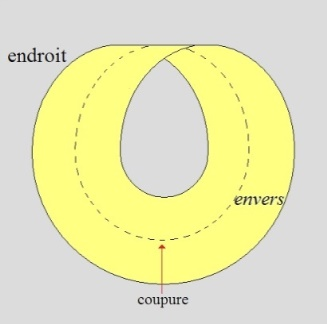

</section>

<section class="parallel-paragraph" data-paragraph-ids="s24-02-0111">

s24-02-0111

[无对应译文]

原文 · s24-02-0111

Il est tout à fait facile de voir que si ici est l’*endroit*, c’est ici un *envers* - puisque c’est l’*envers* de cet *endroit –* et qu’ici la coupure est entre un *endroit* et un *envers*, grâce à quoi, dans *la bande de Mœbius*, si nous la coupons en deux : l’*endroit* et l’*envers* redeviennent, si je puis dire, *normaux*.

</section>

<section class="parallel-paragraph" data-paragraph-ids="s24-02-0112">

s24-02-0112

[无对应译文]

原文 · s24-02-0112

À savoir que quand *une bande de Mœbius* coupée en deux, on va la parcourir, il est facile d’imaginer ce qu’on trouve, à savoir qu’à partir du moment où il y a deux tours, il y aura *un endroit* distinct de l’*envers*.

</section>

<section class="parallel-paragraph" data-paragraph-ids="s24-02-0113">

s24-02-0113

[无对应译文]

原文 · s24-02-0113

C’est bien en quoi *une bande de Mœbius* est essentiellement capable de se dédoubler.

</section>

<section class="parallel-paragraph" data-paragraph-ids="s24-02-0114">

s24-02-0114

[无对应译文]

原文 · s24-02-0114

 → 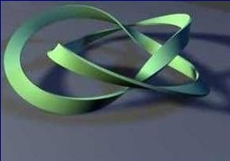

</section>

<section class="parallel-paragraph" data-paragraph-ids="s24-02-0115">

s24-02-0115

[无对应译文]

原文 · s24-02-0115

Et ce qu’il faut remarquer c’est ceci : c’est qu’elle se dédouble de la façon suivante qui permet le passage...

</section>

<section class="parallel-paragraph" data-paragraph-ids="s24-02-0116">

s24-02-0116

[无对应译文]

原文 · s24-02-0116

> c’est bien malheu­reux que je n’aie pas pris mes précautions ...voici la *bande de Mœbius* telle qu’elle se redouble, telle qu’elle se redouble et qu’elle se montre compatible avec un tore.

</section>

<section class="parallel-paragraph" data-paragraph-ids="s24-02-0117">

s24-02-0117

[无对应译文]

原文 · s24-02-0117

C’est bien pourquoi je me suis attaché à considérer le tore comme étant capable d’être *découpé* selon une *bande de Mœbius*.

</section>

<section class="parallel-paragraph" data-paragraph-ids="s24-02-0118">

s24-02-0118

[无对应译文]

原文 · s24-02-0118

Il y suffit - voilà le tore...

</section>

<section class="parallel-paragraph" data-paragraph-ids="s24-02-0119">

s24-02-0119

[无对应译文]

原文 · s24-02-0119

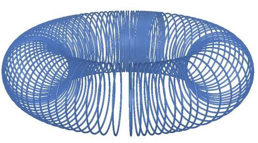

</section>

<section class="parallel-paragraph" data-paragraph-ids="s24-02-0120">

s24-02-0120

[无对应译文]

原文 · s24-02-0120

...il y suffit qu’on y décou­pe non pas une *bande de Mœbius*, mais une *bande de Mœbius double*.

</section>

<section class="parallel-paragraph" data-paragraph-ids="s24-02-0121">

s24-02-0121

[无对应译文]

原文 · s24-02-0121

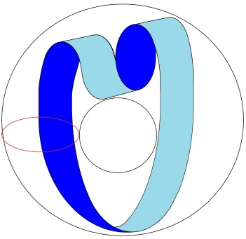

</section>

<section class="parallel-paragraph" data-paragraph-ids="s24-02-0122">

s24-02-0122

[无对应译文]

原文 · s24-02-0122

C’est très précisément ce qui va nous donner l’image de ce qu’il en est du lien du conscient à l’inconscient.

</section>

<section class="parallel-paragraph" data-paragraph-ids="s24-02-0123">

s24-02-0123

[无对应译文]

原文 · s24-02-0123

Le conscient et l’inconscient com­muniquent et sont supportés tous les deux par un *monde torique*.

</section>

<section class="parallel-paragraph" data-paragraph-ids="s24-02-0124">

s24-02-0124

[无对应译文]

原文 · s24-02-0124

C’est en quoi c’est la découverte...

</section>

<section class="parallel-paragraph" data-paragraph-ids="s24-02-0125">

s24-02-0125

[无对应译文]

原文 · s24-02-0125

> découverte qui s’est faite par hasard ...non pas que Freud ne s’y soit pas acharné, mais il n’en a pas dit le dernier mot.

</section>

<section class="parallel-paragraph" data-paragraph-ids="s24-02-0126">

s24-02-0126

[无对应译文]

原文 · s24-02-0126

Il n’a nommément jamais énoncé ceci : c’est *que le monde soit torique*.

</section>

<section class="parallel-paragraph" data-paragraph-ids="s24-02-0127">

s24-02-0127

[无对应译文]

原文 · s24-02-0127

Il croyait, comme l’implique toute notion de « *la psyché* », qu’il y avait ce quelque chose...

</section>

<section class="parallel-paragraph" data-paragraph-ids="s24-02-0128">

s24-02-0128

[无对应译文]

原文 · s24-02-0128

> que j’ai tout à l’heure écarté en disant : « *une boule et une autre boule autour de la première »*, celle-ci étant au milieu ...il a cru qu’il y avait *une vigilance*...

</section>

<section class="parallel-paragraph" data-paragraph-ids="s24-02-0129">

s24-02-0129

[无对应译文]

原文 · s24-02-0129

> une *vigilance* qu’il appelait « *la psyché* » ...*une vigilance qui reflétait point par point le cosmos*.

</section>

<section class="parallel-paragraph" data-paragraph-ids="s24-02-0130">

s24-02-0130

[无对应译文]

原文 · s24-02-0130

Il en était au fait de ce qui est considéré comme vérité commune, c’est que « *la psyché* » *est le reflet* d’un certain monde.

</section>

<section class="parallel-paragraph" data-paragraph-ids="s24-02-0131">

s24-02-0131

[无对应译文]

原文 · s24-02-0131

Que j’énonce ceci au titre - je vous le répète - de quelque chose de ten­tatif, parce que je ne vois pas pourquoi je serais plus sûr de ce que j’avan­ce, quoiqu’il y ait beaucoup d’éléments qui en donnent le sentiment, et nommément d’abord ce que j’ai donné de la structure du corps, du corps considéré comme ce que j’ai appelé *trique*.

</section>

<section class="parallel-paragraph" data-paragraph-ids="s24-02-0132">

s24-02-0132

[无对应译文]

原文 · s24-02-0132

Que l’être vivant, tout être vivant, se dénomme comme *trique*, c’est ce qu’un certain nombre d’études...

</section>

<section class="parallel-paragraph" data-paragraph-ids="s24-02-0133">

s24-02-0133

[无对应译文]

原文 · s24-02-0133

> d’ailleurs anatomiques grossières ...se sont vues toujours confirmer.

</section>

<section class="parallel-paragraph" data-paragraph-ids="s24-02-0134">

s24-02-0134

[无对应译文]

原文 · s24-02-0134

Que le *tore* soit quelque chose qui se présente comme ayant 2 trous autour de quoi quelque chose *consiste*, c’est ce qui est de simple évidence.

</section>

<section class="parallel-paragraph" data-paragraph-ids="s24-02-0135">

s24-02-0135

[无对应译文]

原文 · s24-02-0135

Je vous le répète, il n’a pas été nécessaire de construire beaucoup d’appareils nommément *microscopiques*, c’est une chose qu’on sait depuis toujours, depuis simplement qu’on a commencé de disséquer, qu’on a fait de l’anatomie la plus macroscopique.

</section>

<section class="parallel-paragraph" data-paragraph-ids="s24-02-0136">

s24-02-0136

[无对应译文]

原文 · s24-02-0136

Qu’on puisse découper le tore de façon que ça fasse *une bande de Mœbius* à double tour, c’est certainement à remarquer. D’une certaine façon, ce tore en question est lui-même un trou, et d’une certai­ne façon représente le corps.

</section>

<section class="parallel-paragraph" data-paragraph-ids="s24-02-0137">

s24-02-0137

[无对应译文]

原文 · s24-02-0137

Mais que ceci soit confirmé par le fait que cette *bande de Mœbius,* que j’ai déjà choisie pour exprimer le fait que *la conjonction d’un endroit et d’un envers* est quelque chose qui symboli­se assez bien l’union de *l’inconscient* et du conscient, est une chose qui vaut la peine d’être retenue.

</section>

<section class="parallel-paragraph" data-paragraph-ids="s24-02-0138">

s24-02-0138

[无对应译文]

原文 · s24-02-0138

Une sphère, pouvons-nous la considérer comme un trou dans l’espa­ce ?

</section>

<section class="parallel-paragraph" data-paragraph-ids="s24-02-0139">

s24-02-0139

[无对应译文]

原文 · s24-02-0139

C’est évidemment très suspect.

</section>

<section class="parallel-paragraph" data-paragraph-ids="s24-02-0140">

s24-02-0140

[无对应译文]

原文 · s24-02-0140

C’est très suspect parce que ça sup­pose, ce qui ne va pas de soi, le plongement dans l’espace.

</section>

<section class="parallel-paragraph" data-paragraph-ids="s24-02-0141">

s24-02-0141

[无对应译文]

原文 · s24-02-0141

C’est également vrai pour le tore, et c’est bien en quoi c’est à diviser le tore en 2 *feuillets*, si je puis m’exprimer ainsi, en 2 *feuillets* capables de faire un double tour, que nous retrouvons la surface, c’est-à­-dire quelque chose qui à nos yeux est plus assuré pour fonder ce qu’il en est du *trou*.

</section>

<section class="parallel-paragraph" data-paragraph-ids="s24-02-0142">

s24-02-0142

[无对应译文]

原文 · s24-02-0142

Il est clair que ce n’est pas d’hier que j’ai fait usage de ces *enchaîne­ments* :

</section>

<section class="parallel-paragraph" data-paragraph-ids="s24-02-0143">

s24-02-0143

[无对应译文]

原文 · s24-02-0143

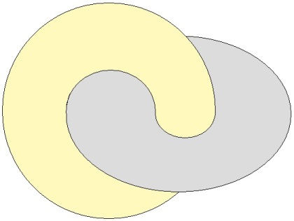

</section>

<section class="parallel-paragraph" data-paragraph-ids="s24-02-0144">

s24-02-0144

[无对应译文]

原文 · s24-02-0144

Déjà pour symboliser le circuit - la coupure du *désir* \[d\] et de la *demande* \[D\] - je m’étais servi de ceci, à savoir du tore:

</section>

<section class="parallel-paragraph" data-paragraph-ids="s24-02-0145">

s24-02-0145

[无对应译文]

原文 · s24-02-0145

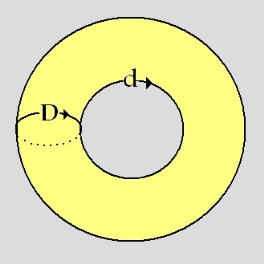

</section>

<section class="parallel-paragraph" data-paragraph-ids="s24-02-0146">

s24-02-0146

[无对应译文]

原文 · s24-02-0146

J’en avais distingué deux modes, à savoir :

</section>

<section class="parallel-paragraph" data-paragraph-ids="s24-02-0147">

s24-02-0147

[无对应译文]

原文 · s24-02-0147

- ce qui faisait le tour du tore \[D\]

</section>

<section class="parallel-paragraph" data-paragraph-ids="s24-02-0148">

s24-02-0148

[无对应译文]

原文 · s24-02-0148

- et d’autre part ce qui faisait le tour du trou central \[d\].

</section>

<section class="parallel-paragraph" data-paragraph-ids="s24-02-0149">

s24-02-0149

[无对应译文]

原文 · s24-02-0149

À cet égard l’identification de la *demande* à ce qui se présente comme ceci : et du *désir* à ce qui se présente comme ceci, était tout à fait significatif.

</section>

<section class="parallel-paragraph" data-paragraph-ids="s24-02-0150">

s24-02-0150

[无对应译文]

原文 · s24-02-0150

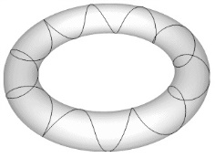 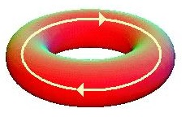

</section>

<section class="parallel-paragraph" data-paragraph-ids="s24-02-0151">

s24-02-0151

[无对应译文]

原文 · s24-02-0151

> Demande *désir*

</section>

<section class="parallel-paragraph" data-paragraph-ids="s24-02-0152">

s24-02-0152

[无对应译文]

原文 · s24-02-0152

Il y a quelque chose dont j’ai fait état la dernière fois, à savoir ceci, qui consiste en un tore dans un tore :

</section>

<section class="parallel-paragraph" data-paragraph-ids="s24-02-0153">

s24-02-0153

[无对应译文]

原文 · s24-02-0153

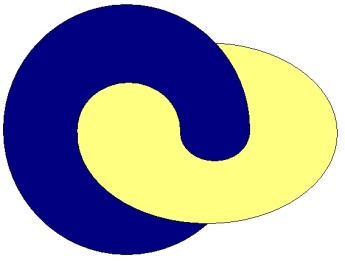

</section>

<section class="parallel-paragraph" data-paragraph-ids="s24-02-0154">

s24-02-0154

[无对应译文]

原文 · s24-02-0154

Si ces deux tores, vous les marquez - les deux ! - d’une coupure :

</section>

<section class="parallel-paragraph" data-paragraph-ids="s24-02-0155">

s24-02-0155

[无对应译文]

原文 · s24-02-0155

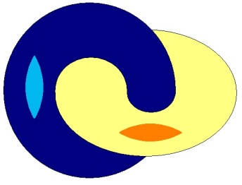

</section>

<section class="parallel-paragraph" data-paragraph-ids="s24-02-0156">

s24-02-0156

[无对应译文]

原文 · s24-02-0156

...en rabattant les deux coupures, si je puis m’exprimer ainsi, concentriquement, vous ferez venir

</section>

<section class="parallel-paragraph" data-paragraph-ids="s24-02-0157">

s24-02-0157

[无对应译文]

原文 · s24-02-0157

- ce qui est à l’intérieur à l’extérieur,

</section>

<section class="parallel-paragraph" data-paragraph-ids="s24-02-0158">

s24-02-0158

[无对应译文]

原文 · s24-02-0158

- et inversement c’est ce qui est à l’extérieur qui viendra à l’intérieur :

</section>

<section class="parallel-paragraph" data-paragraph-ids="s24-02-0159">

s24-02-0159

[无对应译文]

原文 · s24-02-0159

→ 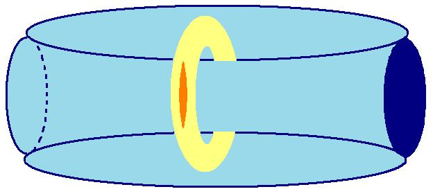 → 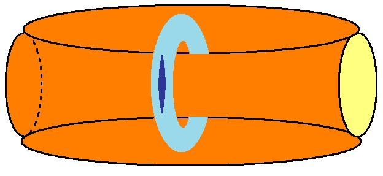

</section>

<section class="parallel-paragraph" data-paragraph-ids="s24-02-0160">

s24-02-0160

[无对应译文]

原文 · s24-02-0160

C’est très précisément en quoi me frappe ceci : que la mise en valeur, comme enveloppement, de ce qui est à l’intérieur est quelque chose qui n’est pas sans avoir affaire avec la psychanalyse.

</section>

<section class="parallel-paragraph" data-paragraph-ids="s24-02-0161">

s24-02-0161

[无对应译文]

原文 · s24-02-0161

Que la psychanalyse s’attache, ce qui est à l’intérieur - à savoir l’in­conscient - à le mettre au dehors, est quelque chose qui évidemment a son prix, mais qui n’est pas sans poser une question.

</section>

<section class="parallel-paragraph" data-paragraph-ids="s24-02-0162">

s24-02-0162

[无对应译文]

原文 · s24-02-0162

Parce que si nous supposons qu’il y a 3 tores...

</section>

<section class="parallel-paragraph" data-paragraph-ids="s24-02-0163">

s24-02-0163

[无对应译文]

原文 · s24-02-0163

> pour appeler les choses par leurs noms ...qu’il y a trois tores qui sont nommément, le *Réel*, l’*Imaginaire* et le *Symbolique* , qu’est-ce que nous allons voir à retourner si je puis dire, le *Symbolique* ?

</section>

<section class="parallel-paragraph" data-paragraph-ids="s24-02-0164">

s24-02-0164

[无对应译文]

原文 · s24-02-0164

Chacun sait que c’est ainsi que les choses se présenteront :

</section>

<section class="parallel-paragraph" data-paragraph-ids="s24-02-0165">

s24-02-0165

[无对应译文]

原文 · s24-02-0165

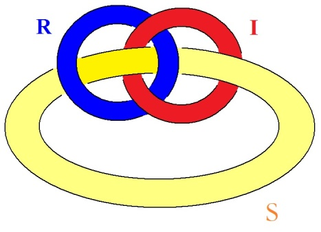

</section>

<section class="parallel-paragraph" data-paragraph-ids="s24-02-0166">

s24-02-0166

[无对应译文]

原文 · s24-02-0166

et que le *Symbolique,* vu du dehors comme tore, se trouvera...

</section>

<section class="parallel-paragraph" data-paragraph-ids="s24-02-0167">

s24-02-0167

[无对应译文]

原文 · s24-02-0167

> par rapport à l’*Imaginaire* et au *Réel* ...se trouvera devoir passer dessus celui qui est dessus \[*sur le rouge*\], et dessous celui qui est dessous \[*sous le bleu*\].

</section>

<section class="parallel-paragraph" data-paragraph-ids="s24-02-0168">

s24-02-0168

[无对应译文]

原文 · s24-02-0168

Mais que voyons-nous à procé­der comme d’ordinaire par une coupure, par une fente pour retourner le *Symbolique* ?

</section>

<section class="parallel-paragraph" data-paragraph-ids="s24-02-0169">

s24-02-0169

[无对应译文]

原文 · s24-02-0169

Le *Symbolique* retourné ainsi...

</section>

<section class="parallel-paragraph" data-paragraph-ids="s24-02-0170">

s24-02-0170

[无对应译文]

原文 · s24-02-0170

> voilà ce que donnera le *Symbolique* ...retourné ainsi il donnera une disposition complètement différente de ce que j’ai appelé *le nœud borroméen*, à savoir que le*Symbolique* enveloppera totalement...

</section>

<section class="parallel-paragraph" data-paragraph-ids="s24-02-0171">

s24-02-0171

[无对应译文]

原文 · s24-02-0171

> à en retourner le *tore* *symbolique...*enveloppera totalement l’*Imaginaire* et le *Réel  *:

</section>

<section class="parallel-paragraph" data-paragraph-ids="s24-02-0172">

s24-02-0172

[无对应译文]

原文 · s24-02-0172

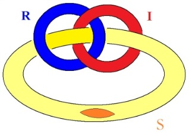 *→* 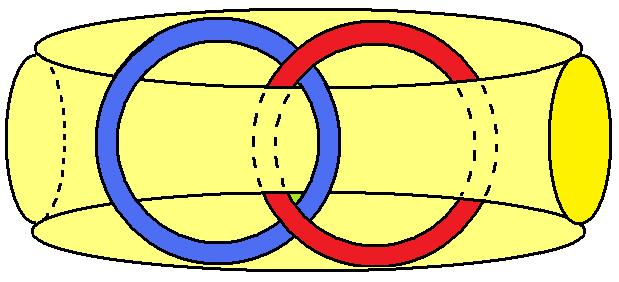

</section>

<section class="parallel-paragraph" data-paragraph-ids="s24-02-0173">

s24-02-0173

[无对应译文]

原文 · s24-02-0173

C’est bien en quoi l’usa­ge de la coupure, par rapport à ce qu’il en est du *Symbolique,* présente quelque chose qui risque en somme, à la fin d’une psychanalyse, de pro­voquer quelque chose qui se spécifierait d’une préférence donnée entre tout à *l’inconscient*.

</section>

<section class="parallel-paragraph" data-paragraph-ids="s24-02-0174">

s24-02-0174

[无对应译文]

原文 · s24-02-0174

Je veux dire que si les choses sont telles que ça s’ar­range un peu mieux comme ça pour ce qui est la vie de chacun, à savoir de mettre l’accent sur cette fonction du savoir de *l’Une-bévue* par lequel je traduis l’inconscient, ça peut effectivement s’arran­ger mieux.

</section>

<section class="parallel-paragraph" data-paragraph-ids="s24-02-0175">

s24-02-0175

[无对应译文]

原文 · s24-02-0175

Mais c’est une structure tout de même d’une nature essen­tiellement différente de celle que j’ai qualifiée du *nœud borroméen*.

</section>

<section class="parallel-paragraph" data-paragraph-ids="s24-02-0176">

s24-02-0176

[无对应译文]

原文 · s24-02-0176

Le fait que l’*Imaginaire* et le *Réel* soient tout entiers en somme inclus dans quelque chose qui est issu de la pratique de la psychanalyse elle-même, est quelque chose qui fait question.

</section>

<section class="parallel-paragraph" data-paragraph-ids="s24-02-0177">

s24-02-0177

[无对应译文]

原文 · s24-02-0177

Il y a quand même là un problème.

</section>

<section class="parallel-paragraph" data-paragraph-ids="s24-02-0178">

s24-02-0178

[无对应译文]

原文 · s24-02-0178

Je vous le répète, ceci est lié au fait que ce n’est pas, en fin de compte, la même chose : la structure du *nœud borroméen *:

</section>

<section class="parallel-paragraph" data-paragraph-ids="s24-02-0179">

s24-02-0179

[无对应译文]

原文 · s24-02-0179

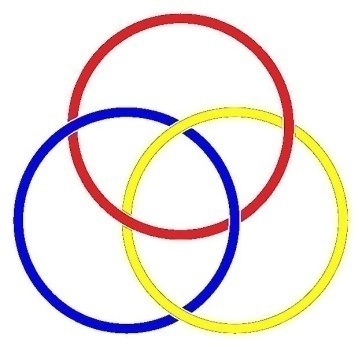 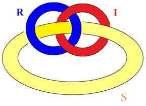

</section>

<section class="parallel-paragraph" data-paragraph-ids="s24-02-0180">

s24-02-0180

[无对应译文]

原文 · s24-02-0180

et celle que vous voyez là :

</section>

<section class="parallel-paragraph" data-paragraph-ids="s24-02-0181">

s24-02-0181

[无对应译文]

原文 · s24-02-0181

</section>

<section class="parallel-paragraph" data-paragraph-ids="s24-02-0182">

s24-02-0182

[无对应译文]

原文 · s24-02-0182

Quelqu’un qui a expérimenté une psychanalyse est quelque chose qui marque un passage.

</section>

<section class="parallel-paragraph" data-paragraph-ids="s24-02-0183">

s24-02-0183

[无对应译文]

原文 · s24-02-0183

Bien entendu ceci suppo­se que mon analyse de *l’inconscient* en tant que fondant la fonction du *Symbolique* soit complètement recevable.

</section>

<section class="parallel-paragraph" data-paragraph-ids="s24-02-0184">

s24-02-0184

[无对应译文]

原文 · s24-02-0184

Il est pourtant un fait, c’est qu’apparemment...

</section>

<section class="parallel-paragraph" data-paragraph-ids="s24-02-0185">

s24-02-0185

[无对应译文]

原文 · s24-02-0185

> et je peux le confirmer, réellement ...le fait d’avoir franchi une psychanalyse, est quelque chose qui ne saurait être en aucun cas ramené a l’état antérieur, sauf bien entendu à pratiquer une autre coupure, celle qui serait équivalente à une « *contre-psychanalyse* ».

</section>

<section class="parallel-paragraph" data-paragraph-ids="s24-02-0186">

s24-02-0186

[无对应译文]

原文 · s24-02-0186

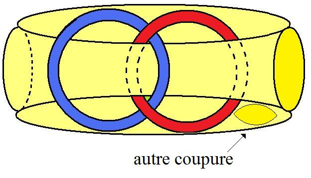→ 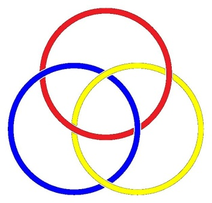

</section>

<section class="parallel-paragraph" data-paragraph-ids="s24-02-0187">

s24-02-0187

[无对应译文]

原文 · s24-02-0187

C’est bien pourquoi Freud insistait pour qu’*au moins* les psychanalystes refas­sent ce qu’on appelle couramment 2 *tranches*, c’est-à-dire fassent une seconde fois la coupure que je désigne ici comme étant ce qui res­taure le nœud borroméen dans sa forme originale. Voilà !

</section>

