# Leçon 03 | 21 Décembre 1976

  <label><input type="checkbox" data-lacan-toggle="original" checked> 原文</label>
  <label><input type="checkbox" data-lacan-toggle="notes" checked> 注释</label>
  <label><input type="checkbox" data-lacan-toggle="commentary" checked> 个人解读评论</label>

<section class="parallel-paragraph" data-paragraph-ids="s24-03-0001">

s24-03-0001

[无对应译文]

原文 · s24-03-0001

[Didier-Weill](#A_Didier_Weill21_12)

</section>

<section class="parallel-paragraph" data-paragraph-ids="s24-03-0002">

s24-03-0002

[无对应译文]

原文 · s24-03-0002

Lacan

</section>

<section class="parallel-paragraph" data-paragraph-ids="s24-03-0003">

s24-03-0003

[无对应译文]

原文 · s24-03-0003

Je me réjouis qu’en raison des vacances vous soyez moins nombreux, tout au moins je me réjouissais à l’avance.

</section>

<section class="parallel-paragraph" data-paragraph-ids="s24-03-0004">

s24-03-0004

[无对应译文]

原文 · s24-03-0004

Mais je dois vous dire qu’aujourd’hui...

</section>

<section class="parallel-paragraph" data-paragraph-ids="s24-03-0005">

s24-03-0005

[无对应译文]

原文 · s24-03-0005

Si dans un découpage systématique d’un tore, un découpage qui a pour effet de produire une *double bande de Mœbius*, ce découpage est ici présent :

</section>

<section class="parallel-paragraph" data-paragraph-ids="s24-03-0006">

s24-03-0006

[无对应译文]

原文 · s24-03-0006

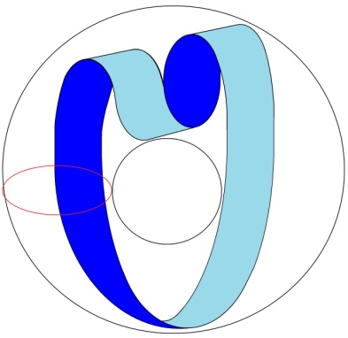

</section>

<section class="parallel-paragraph" data-paragraph-ids="s24-03-0007">

s24-03-0007

[无对应译文]

原文 · s24-03-0007

Le tore est là, et pour le signifier, pour le distinguer de la « *double boule* », je vais...

</section>

<section class="parallel-paragraph" data-paragraph-ids="s24-03-0008">

s24-03-0008

[无对应译文]

原文 · s24-03-0008

> de la même couleur que le tore en question ...vous dessiner ici un petit rond qui a pour effet de désigner ce qui est à l’inté­rieur du tore et ce qui est à l’extérieur.

</section>

<section class="parallel-paragraph" data-paragraph-ids="s24-03-0009">

s24-03-0009

[无对应译文]

原文 · s24-03-0009

Si nous découpons quelque chose de tel qu’ici nous coupions le tore selon quelque chose qui a pour résultat de fournir une *double bande de Mœbius*, nous ne le pouvons qu’à penser ce qui est à l’intérieur du tore...

</section>

<section class="parallel-paragraph" data-paragraph-ids="s24-03-0010">

s24-03-0010

[无对应译文]

原文 · s24-03-0010

> ce qui est à l’intérieur du tore en raison de la coupure que nous y pratiquons ...comme conjoignant les 2 coupures d’une façon telle que le plan idéal qui joint ces 2 coupures soit une *bande de Mœbius.*

</section>

<section class="parallel-paragraph" data-paragraph-ids="s24-03-0011">

s24-03-0011

[无对应译文]

原文 · s24-03-0011

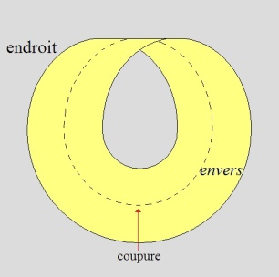 *→* 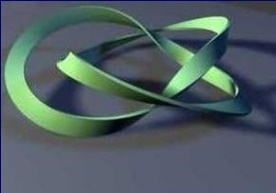 *→*

</section>

<section class="parallel-paragraph" data-paragraph-ids="s24-03-0012">

s24-03-0012

[无对应译文]

原文 · s24-03-0012

Vous voyez qu’ici j’ai coupé, doublement par la ligne verte, j’ai coupé le tore.

</section>

<section class="parallel-paragraph" data-paragraph-ids="s24-03-0013">

s24-03-0013

[无对应译文]

原文 · s24-03-0013

Si nous joignons ces deux coupures à l’aide d’un plan tendu, nous obtenons une *bande de Mœbius*.

</section>

<section class="parallel-paragraph" data-paragraph-ids="s24-03-0014">

s24-03-0014

[无对应译文]

原文 · s24-03-0014

C’est bien pour cela que

</section>

<section class="parallel-paragraph" data-paragraph-ids="s24-03-0015">

s24-03-0015

[无对应译文]

原文 · s24-03-0015

- ce qui est ici,

</section>

<section class="parallel-paragraph" data-paragraph-ids="s24-03-0016">

s24-03-0016

[无对应译文]

原文 · s24-03-0016

- et d’autre part ce qui est ici, constituent une *double bande de Mœbius*.

</section>

<section class="parallel-paragraph" data-paragraph-ids="s24-03-0017">

s24-03-0017

[无对应译文]

原文 · s24-03-0017

Je dis « *double* » qu’est-ce que ça veut dire ?

</section>

<section class="parallel-paragraph" data-paragraph-ids="s24-03-0018">

s24-03-0018

[无对应译文]

原文 · s24-03-0018

Ça veut dire une *bande de Mœbius* qui se redouble, et une *bande de Mœbius* qui se redouble a pour propriété...

</section>

<section class="parallel-paragraph" data-paragraph-ids="s24-03-0019">

s24-03-0019

[无对应译文]

原文 · s24-03-0019

> comme la dernière fois je vous l’ai montré déjà ...a pour propriété, non pas d’être deux *bandes de Mœbius*, mais d’être une seule *bande de Mœbius* qui apparaît ainsi - tâchons de faire mieux - qui apparaît ainsi comme résultat de la double coupure du tore :

</section>

<section class="parallel-paragraph" data-paragraph-ids="s24-03-0020">

s24-03-0020

[无对应译文]

原文 · s24-03-0020

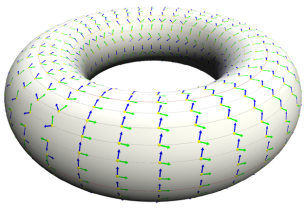 → 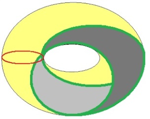→  → 

</section>

<section class="parallel-paragraph" data-paragraph-ids="s24-03-0021">

s24-03-0021

[无对应译文]

原文 · s24-03-0021

La question est la suivante: cette *bande de Mœbius* double, est-elle de cette forme ou de celle-ci :

</section>

<section class="parallel-paragraph" data-paragraph-ids="s24-03-0022">

s24-03-0022

[无对应译文]

原文 · s24-03-0022

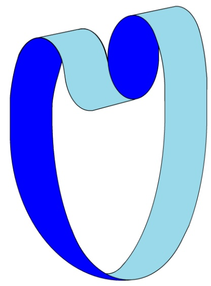 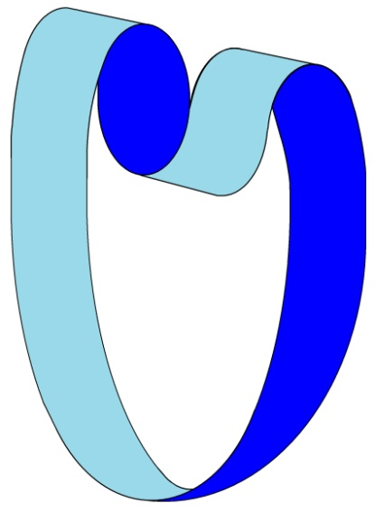

</section>

<section class="parallel-paragraph" data-paragraph-ids="s24-03-0023">

s24-03-0023

[无对应译文]

原文 · s24-03-0023

En d’autres termes, passe-t-elle...

</section>

<section class="parallel-paragraph" data-paragraph-ids="s24-03-0024">

s24-03-0024

[无对应译文]

原文 · s24-03-0024

> je parle d’une des boucles ...passe-t-elle devant la boucle suivante, celle qui est là, ou passe-t­elle derrière ?

</section>

<section class="parallel-paragraph" data-paragraph-ids="s24-03-0025">

s24-03-0025

[无对应译文]

原文 · s24-03-0025

C’est quelque chose qui n’est évidemment pas indifférent, à partir du moment où nous procédons à cette *double coupure* qui a pour résultat de déterminer cette *double bande de Mœbius*.

</section>

<section class="parallel-paragraph" data-paragraph-ids="s24-03-0026">

s24-03-0026

[无对应译文]

原文 · s24-03-0026

Je vous ai très mal dessiné cette figure, grâce à Gloria je vais pouvoir vous la dessiner mieux : voici comment elle devrait être dessinée.

</section>

<section class="parallel-paragraph" data-paragraph-ids="s24-03-0027">

s24-03-0027

[无对应译文]

原文 · s24-03-0027

Je ne sais pas si vous la voyez tout à fait claire, mais il est certain que la *bande de Mœbius* se redouble de la façon que vous voyez ici. C’est ici que je ne suis pas vraiment très satisfait de ce que je suis en train de vous montrer.

</section>

<section class="parallel-paragraph" data-paragraph-ids="s24-03-0028">

s24-03-0028

[无对应译文]

原文 · s24-03-0028

Je veux dire que, comme j’ai passé la nuit à cogiter sur cette affaire de tore, je ne peux pas dire que ce que je vous donne là soit très satisfaisant.

</section>

<section class="parallel-paragraph" data-paragraph-ids="s24-03-0029">

s24-03-0029

[无对应译文]

原文 · s24-03-0029

Ce qui apparaît comme résultat de ce que j’ai appelé cette *double bande de Mœbius* dont je vous prie de faire l’[épreuve](http://www.youtube.com/watch?v=4bcm-kPIuHE), qui s’expéri­mente de façon simple, à cette seule condition de prendre deux feuilles de papier, d’y dessiner un grand S, quelque chose de l’espèce suivante :

</section>

<section class="parallel-paragraph" data-paragraph-ids="s24-03-0030">

s24-03-0030

[无对应译文]

原文 · s24-03-0030

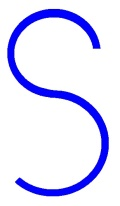

</section>

<section class="parallel-paragraph" data-paragraph-ids="s24-03-0031">

s24-03-0031

[无对应译文]

原文 · s24-03-0031

Méfiez-vous, parce que ce grand S commande d’être dessiné avec d’abord une *petite courbe* et ensuite une *grande courbe*.

</section>

<section class="parallel-paragraph" data-paragraph-ids="s24-03-0032">

s24-03-0032

[无对应译文]

原文 · s24-03-0032

Ici de même la petite courbe et ensuite une grande courbe.

</section>

<section class="parallel-paragraph" data-paragraph-ids="s24-03-0033">

s24-03-0033

[无对应译文]

原文 · s24-03-0033

Si vous en découpez deux sur une feuille de papier double, vous verrez qu’en pliant les deux choses que vous aurez coupées sur une seule feuille de papier, vous obtiendrez naturellement une jonction

</section>

<section class="parallel-paragraph" data-paragraph-ids="s24-03-0034">

s24-03-0034

[无对应译文]

原文 · s24-03-0034

- de la feuille de papier n°1 avec la feuille de papier n°2,

</section>

<section class="parallel-paragraph" data-paragraph-ids="s24-03-0035">

s24-03-0035

[无对应译文]

原文 · s24-03-0035

- et de la feuille de papier n°2 avec la feuille de papier n°1, c’est-à-dire que vous aurez ce que j’ai désigné à l’instant par une *double bande de Mœbius*.

</section>

<section class="parallel-paragraph" data-paragraph-ids="s24-03-0036">

s24-03-0036

[无对应译文]

原文 · s24-03-0036

Vous pourrez aisément constater que cette *double bande de Mœbius* se recoupe, si je puis m’exprimer ainsi, indifféremment. Je veux dire que ce qui ici est en-dessus, puis passe en-dessous, puis ensuite étant passé en-dessous repasse en-dessus.

</section>

<section class="parallel-paragraph" data-paragraph-ids="s24-03-0037">

s24-03-0037

[无对应译文]

原文 · s24-03-0037

II est indifférent de faire passer ce qui d’abord passe en-dessus, on peut le faire passer en-dessous.

</section>

<section class="parallel-paragraph" data-paragraph-ids="s24-03-0038">

s24-03-0038

[无对应译文]

原文 · s24-03-0038

Vous constaterez avec aisance que cette double *bande de Mœbius* fonctionne indifféremment.

</section>

<section class="parallel-paragraph" data-paragraph-ids="s24-03-0039">

s24-03-0039

[无对应译文]

原文 · s24-03-0039

Est-ce que c’est-à-dire qu’ici ce soit la même chose, je veux dire que d’un même point de vue on puisse mettre ce qui est en-dessous en-des­sus ou inversement ? C’est bien en effet ce que réalise la *double bande de Mœbius*.

</section>

<section class="parallel-paragraph" data-paragraph-ids="s24-03-0040">

s24-03-0040

[无对应译文]

原文 · s24-03-0040

Je m’excuse de m’aventurer dans quelque chose qui n’a pas été sans me donner de mal à moi-même, mais il est certain qu’il en est ainsi. Si vous fonctionnez en produisant de la même façon que je vous l’ai pré­sentée, cette *double bande de Mœbius*...

</section>

<section class="parallel-paragraph" data-paragraph-ids="s24-03-0041">

s24-03-0041

[无对应译文]

原文 · s24-03-0041

> à savoir en pliant deux pages - deux pages découpées ainsi - de façon telle que le 1 aille se conjoindre
>
> à la 2ème page, et qu’inversement la 2ème page vienne se conjoindre à la page 1 ...vous aurez exactement ce résultat, à propos duquel vous pourrez constater qu’on peut faire passer indiffé­remment l’un si je puis dire devant l’autre, la page 1 devant la page 2, et inversement la page 2 devant la page 1.

</section>

<section class="parallel-paragraph" data-paragraph-ids="s24-03-0042">

s24-03-0042

[无对应译文]

原文 · s24-03-0042

Quelle est *la suspension* qui résulte de cette mise en évidence  ?

</section>

<section class="parallel-paragraph" data-paragraph-ids="s24-03-0043">

s24-03-0043

[无对应译文]

原文 · s24-03-0043

Cette mise en évidence de ceci : que dans la *double bande de Mœbius* ce qui est « *en avant* » d’un même point de vue peut passer « *en arrière* » du point de vue qui reste le même.

</section>

<section class="parallel-paragraph" data-paragraph-ids="s24-03-0044">

s24-03-0044

[无对应译文]

原文 · s24-03-0044

Ceci nous conduit à quelque chose qui, je vous y inci­te, est de l’ordre d’un *savoir-faire* qui est démonstratif, en ce sens qu’il ne va pas sans possibilité de *l’une-bévue.*

</section>

<section class="parallel-paragraph" data-paragraph-ids="s24-03-0045">

s24-03-0045

[无对应译文]

原文 · s24-03-0045

Pour que cette possibilité s’éteigne, il faut qu’elle *cesse de s’écrire*, c’est-à-dire que nous trouvions un moyen...

</section>

<section class="parallel-paragraph" data-paragraph-ids="s24-03-0046">

s24-03-0046

[无对应译文]

原文 · s24-03-0046

> et un moyen, dans ce cas, évident ...un moyen de distinguer ces deux cas.

</section>

<section class="parallel-paragraph" data-paragraph-ids="s24-03-0047">

s24-03-0047

[无对应译文]

原文 · s24-03-0047

Quel est le moyen de distinguer ces deux cas ?

</section>

<section class="parallel-paragraph" data-paragraph-ids="s24-03-0048">

s24-03-0048

[无对应译文]

原文 · s24-03-0048

Ceci nous intéresse parce que *l’Une-bévue* est quelque chose qui sub­stitue :

</section>

<section class="parallel-paragraph" data-paragraph-ids="s24-03-0049">

s24-03-0049

[无对应译文]

原文 · s24-03-0049

- à ce qui se fonde comme « *savoir qu’on sait* »,

</section>

<section class="parallel-paragraph" data-paragraph-ids="s24-03-0050">

s24-03-0050

[无对应译文]

原文 · s24-03-0050

- le principe de « *savoir qu’on sait sans <u>le</u> savoir* ».

</section>

<section class="parallel-paragraph" data-paragraph-ids="s24-03-0051">

s24-03-0051

[无对应译文]

原文 · s24-03-0051

Le « *<u>le</u>* », là porte sur quelque chose.

</section>

<section class="parallel-paragraph" data-paragraph-ids="s24-03-0052">

s24-03-0052

[无对应译文]

原文 · s24-03-0052

Le « le » est un pronom dans l’occasion qui porte sur *le savoir* lui-même en tant, non pas que savoir, mais que *fait de savoir*. C’est bien en quoi l’inconscient prête à ce que j’ai cru devoir suspendre sous le titre de *l’Une-bévue.*

</section>

<section class="parallel-paragraph" data-paragraph-ids="s24-03-0053">

s24-03-0053

[无对应译文]

原文 · s24-03-0053

L’intérieur et l’extérieur dans l’occasion...

</section>

<section class="parallel-paragraph" data-paragraph-ids="s24-03-0054">

s24-03-0054

[无对应译文]

原文 · s24-03-0054

> à savoir : concernant le tore ...sont-elles des notions de « *structure* » ou de « *forme* » ?

</section>

<section class="parallel-paragraph" data-paragraph-ids="s24-03-0055">

s24-03-0055

[无对应译文]

原文 · s24-03-0055

Tout dépend de la conception qu’on a de l’espace, et je dirai jusqu’à un certain point de ce que nous pointerons comme *la vérité de l’espace*.

</section>

<section class="parallel-paragraph" data-paragraph-ids="s24-03-0056">

s24-03-0056

[无对应译文]

原文 · s24-03-0056

II y a certainement une *vérité de l’espace qui est celle du corps*.

</section>

<section class="parallel-paragraph" data-paragraph-ids="s24-03-0057">

s24-03-0057

[无对应译文]

原文 · s24-03-0057

Le corps dans l’occasion est quelque chose qui ne se fonde que sur *la vérité de l’espace*.

</section>

<section class="parallel-paragraph" data-paragraph-ids="s24-03-0058">

s24-03-0058

[无对应译文]

原文 · s24-03-0058

C’est bien en quoi la sorte de « *dissymétrie* » que je mets en évidence, a son fondement.

</section>

<section class="parallel-paragraph" data-paragraph-ids="s24-03-0059">

s24-03-0059

[无对应译文]

原文 · s24-03-0059

Cette « *dissymétrie* » tient au fait que j’ai désigné du même point de vue.

</section>

<section class="parallel-paragraph" data-paragraph-ids="s24-03-0060">

s24-03-0060

[无对应译文]

原文 · s24-03-0060

Et c’est bien en quoi ce que je voulais cette année introduire, est quelque chose qui m’importe.

</section>

<section class="parallel-paragraph" data-paragraph-ids="s24-03-0061">

s24-03-0061

[无对应译文]

原文 · s24-03-0061

Il y a une même dissymétrie non seulement concernant *le corps*, mais concernant ce que j’ai désigné du *Symbolique*.

</section>

<section class="parallel-paragraph" data-paragraph-ids="s24-03-0062">

s24-03-0062

[无对应译文]

原文 · s24-03-0062

Il y a une dissymétrie *du signifiant et du signifié* qui reste énigmatique.

</section>

<section class="parallel-paragraph" data-paragraph-ids="s24-03-0063">

s24-03-0063

[无对应译文]

原文 · s24-03-0063

La question que je voudrais avancer cette année est exactement celle-ci : est-ce que *la dissymétrie du signifiant et du signifié* est de même nature que *celle du contenant et du contenu* qui est tout de même quelque chose qui a sa fonction pour le corps ?

</section>

<section class="parallel-paragraph" data-paragraph-ids="s24-03-0064">

s24-03-0064

[无对应译文]

原文 · s24-03-0064

Ici importe la distinction de la « *forme* » et de la « *structure* ».

</section>

<section class="parallel-paragraph" data-paragraph-ids="s24-03-0065">

s24-03-0065

[无对应译文]

原文 · s24-03-0065

Ce n’est pas pour rien que j’ai marqué ici ceci, qui est un tore, quoique sa forme ne le laisse pas apparaître :

</section>

<section class="parallel-paragraph" data-paragraph-ids="s24-03-0066">

s24-03-0066

[无对应译文]

原文 · s24-03-0066

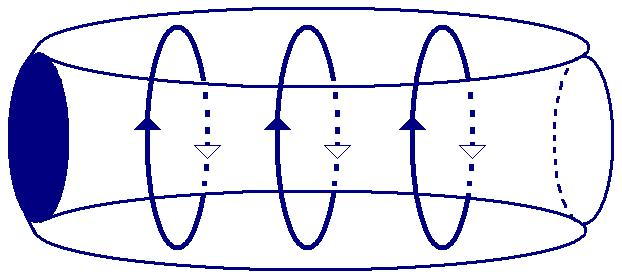

</section>

<section class="parallel-paragraph" data-paragraph-ids="s24-03-0067">

s24-03-0067

[无对应译文]

原文 · s24-03-0067

Est-ce que la « *forme* » est quelque chose qui prête à la suggestion ?

</section>

<section class="parallel-paragraph" data-paragraph-ids="s24-03-0068">

s24-03-0068

[无对应译文]

原文 · s24-03-0068

Voilà la question que je pose, et que je pose en avançant la primauté de la structure.

</section>

<section class="parallel-paragraph" data-paragraph-ids="s24-03-0069">

s24-03-0069

[无对应译文]

原文 · s24-03-0069

Ici il m’est difficile de ne pas avancer ceci : que la *bouteille de Klein*, cette vieille *bouteille de Klein*...

</section>

<section class="parallel-paragraph" data-paragraph-ids="s24-03-0070">

s24-03-0070

[无对应译文]

原文 · s24-03-0070

> dont j’ai fait état, si je me souviens bien, dans « *Les quatre concepts fondamentaux de la psychanalyse »* ...cette vieille *bouteille de Klein* a *en réalité* cette forme-là :

</section>

<section class="parallel-paragraph" data-paragraph-ids="s24-03-0071">

s24-03-0071

[无对应译文]

原文 · s24-03-0071

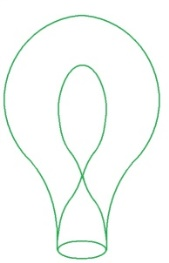

</section>

<section class="parallel-paragraph" data-paragraph-ids="s24-03-0072">

s24-03-0072

[无对应译文]

原文 · s24-03-0072

Elle n’est strictement pas autre chose que ceci, à ceci près que pour que ça fasse *bouteille* on la cor­rige ainsi, à savoir qu’on la fait rentrer sous la forme suivante, qu’on la fait rentrer ici d’une façon telle qu’on ne comprend plus rien à sa nature essentielle :

</section>

<section class="parallel-paragraph" data-paragraph-ids="s24-03-0073">

s24-03-0073

[无对应译文]

原文 · s24-03-0073

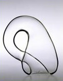 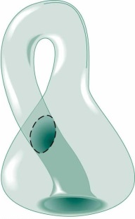 

</section>

<section class="parallel-paragraph" data-paragraph-ids="s24-03-0074">

s24-03-0074

[无对应译文]

原文 · s24-03-0074

Est-ce que, effectivement dans le fait de l’appeler « *bouteille »*, il n’y a pas là une falsification par rapport à ceci : que seule sa présentation - ici en vert - est le quelque chose qui précisé­ment permet de saisir immédiatement ce en quoi la jonction de l’*endroit* se fait avec l’*envers*, c’est-à-dire tout ce qui se découpe dans cette surfa­ce, à condition de le faire complet, et c’est là encore une question : « *qu’est­-ce à dire que de faire une découpure qui intéresse toute la surface ?* »

</section>

<section class="parallel-paragraph" data-paragraph-ids="s24-03-0075">

s24-03-0075

[无对应译文]

原文 · s24-03-0075

Voilà les questions que je pose et que j’espère pouvoir résoudre cette année, je veux dire que ceci nous porte à quelque chose de fondamental pour ce qui est de la structure du corps, ou plus exactement du corps considéré comme structure. Que le corps puisse présenter toutes sortes d’aspects qui sont de *pure forme*, que j’ai tout à l’heure mis sous la dépendance de la suggestion, voilà ce qui m’importe.

</section>

<section class="parallel-paragraph" data-paragraph-ids="s24-03-0076">

s24-03-0076

[无对应译文]

原文 · s24-03-0076

La différence de la forme...

</section>

<section class="parallel-paragraph" data-paragraph-ids="s24-03-0077">

s24-03-0077

[无对应译文]

原文 · s24-03-0077

> de la forme en tant qu’elle est toujours plus ou moins suggérée, ...avec la structure, voilà ce que je voudrais cette année mettre en évidence pour vous.

</section>

<section class="parallel-paragraph" data-paragraph-ids="s24-03-0078">

s24-03-0078

[无对应译文]

原文 · s24-03-0078

Je m’excuse.

</section>

<section class="parallel-paragraph" data-paragraph-ids="s24-03-0079">

s24-03-0079

[无对应译文]

原文 · s24-03-0079

Ceci, je dois dire, n’est pas assurément ce que j’aurais voulu vous apporter ce matin de meilleur.

</section>

<section class="parallel-paragraph" data-paragraph-ids="s24-03-0080">

s24-03-0080

[无对应译文]

原文 · s24-03-0080

J’ai eu - vous le voyez - j’ai eu le grand souci, je m’empêtre...

</section>

<section class="parallel-paragraph" data-paragraph-ids="s24-03-0081">

s24-03-0081

[无对应译文]

原文 · s24-03-0081

> c’est le cas de le dire, ce n’est pas la pre­mière fois ...je m’empêtre dans ce que j’ai à proférer devant vous, et c’est pour ça que je m’en vais vous donner l’occasion d’avoir quelqu’un qui sera ce matin un meilleur orateur que moi, je veux dire Alain Didier, qui est ici présent, et que j’invite à venir vous énoncer ce qu’il a tiré de certaines données qui sont les miennes, qui sont des dessins d’écritu­re, et dont il voudra bien vous faire part.

</section>

<section class="parallel-paragraph" data-paragraph-ids="s24-03-0082">

s24-03-0082

[无对应译文]

原文 · s24-03-0082

[Intervention d’Alain Didier-Weill](#Dec21)

</section>

<section class="parallel-paragraph" data-paragraph-ids="s24-03-0083">

s24-03-0083

[无对应译文]

原文 · s24-03-0083

Je dois dire d’abord que le Dr Lacan me prend tout à fait au dépourvu, que je n’étais pas prévenu qu’il me proposerait de me passer la parole pour essayer de reprendre un point dont je lui ai parlé ces jours-ci, dont je dois vous dire tout de suite que, personnellement, je n’en fais pas l’articulation du tout avec ce dont il nous est parlé présente­ment.

</section>

<section class="parallel-paragraph" data-paragraph-ids="s24-03-0084">

s24-03-0084

[无对应译文]

原文 · s24-03-0084

Je la sens peut-être confusément, mais c’est pas... N’attendez donc pas que j’essaie d’articuler ce que je vais essayer de dire avec les pro­blèmes de topologie dont le Dr Lacan parle en ce moment.

</section>

<section class="parallel-paragraph" data-paragraph-ids="s24-03-0085">

s24-03-0085

[无对应译文]

原文 · s24-03-0085

Le problème que j’ai essayé d’articuler, c’est d’essayer d’articuler...

</section>

<section class="parallel-paragraph" data-paragraph-ids="s24-03-0086">

s24-03-0086

[无对应译文]

原文 · s24-03-0086

> de façon un peu conséquente avec ce que le Dr Lacan a apporté sur le *montage de la pul­sion*, ...d’articuler à partir du problème du *circuit de la pulsion*, d’essayer d’articuler différentes *torsions* qui m’apparaissent repérables entre *le sujet* et *l’Autre*, différents temps dans lesquels s’articulent 2 ou 3 *torsions*.

</section>

<section class="parallel-paragraph" data-paragraph-ids="s24-03-0087">

s24-03-0087

[无对应译文]

原文 · s24-03-0087

Ça reste pour moi assez hypothétique, mais enfin je vais essayer de vous retracer comment les choses peuvent, comme ça, se mettre en place.

</section>

<section class="parallel-paragraph" data-paragraph-ids="s24-03-0088">

s24-03-0088

[无对应译文]

原文 · s24-03-0088

Alors *la pulsion*, le circuit pulsionnel d’où je partirai, pour essayer d’avancer, serait quelque chose d’assez énigmatique, serait quelque chose de l’ordre de « *la pulsion invocante* » et de son retournement *en pulsion d’écoute*.

</section>

<section class="parallel-paragraph" data-paragraph-ids="s24-03-0089">

s24-03-0089

[无对应译文]

原文 · s24-03-0089

Je veux dire que le mot de *pulsion d’écoute*, n’existe...

</section>

<section class="parallel-paragraph" data-paragraph-ids="s24-03-0090">

s24-03-0090

[无对应译文]

原文 · s24-03-0090

> je ne crois pas ...n’existe nulle part comme tel, ça reste tout à fait problématique.

</section>

<section class="parallel-paragraph" data-paragraph-ids="s24-03-0091">

s24-03-0091

[无对应译文]

原文 · s24-03-0091

Et plus précisément quand j’ai parlé de ces idées au Dr Lacan, je dois dire que c’est plus précisément au sujet du problème de la musique, et d’essayer de repérer...

</section>

<section class="parallel-paragraph" data-paragraph-ids="s24-03-0092">

s24-03-0092

[无对应译文]

原文 · s24-03-0092

> de repérer pour un auditeur qui écoute une musique qui le toucherait, disons qui lui ferait de l’effet ...de repérer les différents temps par lesquels se produisent des effets dans l’auditeur, et dans différents parcours que je vais essayer donc de vous livrer maintenant assez succinctement, parce que je n’ai pas préparé de texte, ni de notes. Alors excusez-moi si c’est un peu improvisé.

</section>

<section class="parallel-paragraph" data-paragraph-ids="s24-03-0093">

s24-03-0093

[无对应译文]

原文 · s24-03-0093

J’imagine, si vous voulez, que si vous écoutez une musique...

</section>

<section class="parallel-paragraph" data-paragraph-ids="s24-03-0094">

s24-03-0094

[无对应译文]

原文 · s24-03-0094

> je parle d’une musique qui vous parle ou qui vous « *musique* » ...je pars de l’idée que si vous l’écoutez, la façon dont vous la prenez cette musique, je par­tirai de l’idée que c’est en tant qu’« *auditeur* » d’abord que vous fonction­nez.

</section>

<section class="parallel-paragraph" data-paragraph-ids="s24-03-0095">

s24-03-0095

[无对应译文]

原文 · s24-03-0095

Ça paraît *évident*, mais enfin c’est pas tellement *simple*.

</section>

<section class="parallel-paragraph" data-paragraph-ids="s24-03-0096">

s24-03-0096

[无对应译文]

原文 · s24-03-0096

C’est-à-dire que je dirai que si la musique, dans un tout premier temps...

</section>

<section class="parallel-paragraph" data-paragraph-ids="s24-03-0097">

s24-03-0097

[无对应译文]

原文 · s24-03-0097

> les temps que je vais essayer de décortiquer pour la commodité de l’exposé ne sont bien sûr
>
> pas à prendre comme des *temps chronologiques*, mais comme des *temps* qui seraient *logiques*,
>
> et que je désarticule nécessairement pour la commodité de l’exposé ...si donc la musique vous fait de l’effet comme *auditeur*, je pense qu’on peut dire que c’est que quelque part, comme *auditeur*, tout se passe comme si elle vous apportait *une répon­se*.

</section>

<section class="parallel-paragraph" data-paragraph-ids="s24-03-0098">

s24-03-0098

[无对应译文]

原文 · s24-03-0098

Maintenant le problème commence avec le fait que cette *réponse* fait donc surgir en vous l’antécédence d’une *question* qui vous habitait en tant qu’*Autre*...

</section>

<section class="parallel-paragraph" data-paragraph-ids="s24-03-0099">

s24-03-0099

[无对应译文]

原文 · s24-03-0099

> en tant qu’*Autre,* en tant qu’auditeur ...qui vous habitait sans que vous le sachiez.

</section>

<section class="parallel-paragraph" data-paragraph-ids="s24-03-0100">

s24-03-0100

[无对应译文]

原文 · s24-03-0100

Vous découvrez donc qu’il y a là un sujet quelque part qui aurait entendu une question qui est en vous, et qui non seulement l’aurait entendue, mais qui en aurait été inspiré, puisque la musique, la production du « *sujet musicant* » si vous voulez, serait la réponse à cette question qui vous habiterait.

</section>

<section class="parallel-paragraph" data-paragraph-ids="s24-03-0101">

s24-03-0101

[无对应译文]

原文 · s24-03-0101

Vous voyez donc déjà que si on voulait articuler ça au désir de l’Autre, s’il y a en moi, en tant qu’Autre, un désir, un manque inconscient, j’ai le témoignage que le sujet qui reçoit ce manque n’en est pas paralysé, n’en est pas en *fading*, dessous, comme le sujet qui est sous l’injonction du « *che vuoi »,* mais au contraire en est inspiré et son inspiration, la musique en est le témoi­gnage.

</section>

<section class="parallel-paragraph" data-paragraph-ids="s24-03-0102">

s24-03-0102

[无对应译文]

原文 · s24-03-0102

Bon, ceci est le point de départ de cette constatation.

</section>

<section class="parallel-paragraph" data-paragraph-ids="s24-03-0103">

s24-03-0103

[无对应译文]

原文 · s24-03-0103

L’autre point, c’est de considérer qu’en tant qu’Autre, je ne sais pas quel est ce manque qui m’habite, mais que le sujet lui-même ne me dit rien sur ce manque puisqu’il dit directement ce manque.

</section>

<section class="parallel-paragraph" data-paragraph-ids="s24-03-0104">

s24-03-0104

[无对应译文]

原文 · s24-03-0104

Le sujet lui-même de ce manque ne sait rien, et n’en dit rien puisqu’il est dit par ce manque, mais en tant qu’Autre je dirais que je suis dans une perspective topologique où m’apparaît le point où le sujet est divisé, puisqu’il est dit par ce manque, c’est-à-dire que ce manque qui m’habite, je découvre que c’est le sien propre, lui-même ne sait rien de ce qu’il dit, mais moi je sais qu’*il sait sans savoir*.

</section>

<section class="parallel-paragraph" data-paragraph-ids="s24-03-0105">

s24-03-0105

[无对应译文]

原文 · s24-03-0105

Je vais donc...

</section>

<section class="parallel-paragraph" data-paragraph-ids="s24-03-0106">

s24-03-0106

[无对应译文]

原文 · s24-03-0106

> vous voyez que ce que je vous ai dit là pourrait s’écrire un peu comme ce que Lacan articule
>
> du procès de la séparation ...et je vais donc articuler les différents *temps de la pulsion* avec différentes *articulations de la* *séparation*.

</section>

<section class="parallel-paragraph" data-paragraph-ids="s24-03-0107">

s24-03-0107

[无对应译文]

原文 · s24-03-0107

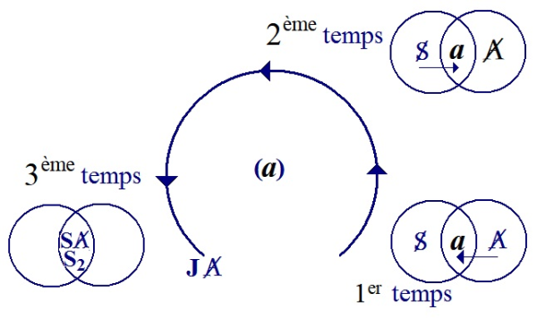

</section>

<section class="parallel-paragraph" data-paragraph-ids="s24-03-0108">

s24-03-0108

[无对应译文]

原文 · s24-03-0108

En bas à droite, j’ai mis le procès de la séparation avec une flèche qui va du grand A barré \[**A**\] à ce manque mis en commun entre le A et le sujet : l’*objet petit (a)*, et cette flèche voudrait signifier qu’en tant qu’Autre, je ne sais rien de ce manque en tant qu’Autre, mais quelque chose m’en revient du sujet qui - lui - en dit quelque chose.

</section>

<section class="parallel-paragraph" data-paragraph-ids="s24-03-0109">

s24-03-0109

[无对应译文]

原文 · s24-03-0109

C’est pour ça que je l’articule avec la pulsion, parce que tout se passe comme si je voudrais arriver à articuler ce manque, ce rien, en accrocher quelque chose, en *savoir quelque chose*.

</section>

<section class="parallel-paragraph" data-paragraph-ids="s24-03-0110">

s24-03-0110

[无对应译文]

原文 · s24-03-0110

Je fais confiance au sujet, disons que je me laisse *pousser* par lui...

</section>

<section class="parallel-paragraph" data-paragraph-ids="s24-03-0111">

s24-03-0111

[无对应译文]

原文 · s24-03-0111

> c’est d’ailleurs la « *pulsion* » ...je me laisse, pousser par lui et j’attends de lui qu’il me donne cet *objet petit (a)*.

</section>

<section class="parallel-paragraph" data-paragraph-ids="s24-03-0112">

s24-03-0112

[无对应译文]

原文 · s24-03-0112

Mais au fur et à mesure que j’avance, que « *j’attends* » du sujet si je puis dire, ce que je découvre c’est qu’en suivant le sujet, le *petit (a)*, nous ne faisons tous les deux que le *contourner*.

</section>

<section class="parallel-paragraph" data-paragraph-ids="s24-03-0113">

s24-03-0113

[无对应译文]

原文 · s24-03-0113

Il est effectivement à l’intérieur de la boucle et je m’assure effectivement que ce *petit (a)*, il est *inatteignable*.

</section>

<section class="parallel-paragraph" data-paragraph-ids="s24-03-0114">

s24-03-0114

[无对应译文]

原文 · s24-03-0114

Je pourrais dire là que c’est un premier parcours, et que, quand je me suis assuré, en tant qu’Autre, qu’il a ce caractère effectivement d’objet perdu, l’idée que je propose, c’est qu’on peut comprendre à ce moment-là le *retournement pulsionnel* dont parle Freud et que reprend Lacan...

</section>

<section class="parallel-paragraph" data-paragraph-ids="s24-03-0115">

s24-03-0115

[无对应译文]

原文 · s24-03-0115

> le *retournement pulsionnel* que je vais mettre *en haut du graphe* ...comme le passage à un 2ème mode de séparation, et ce *retournement pulsion­nel*, si on peut dire, comme une 2ème tentative d’approcher de *l’ob­jet perdu*, mais cette fois d’une autre perspective, de la perspective du sujet.

</section>

<section class="parallel-paragraph" data-paragraph-ids="s24-03-0116">

s24-03-0116

[无对应译文]

原文 · s24-03-0116

Je m’explique.

</section>

<section class="parallel-paragraph" data-paragraph-ids="s24-03-0117">

s24-03-0117

[无对应译文]

原文 · s24-03-0117

Si vous voulez, dans le 1er temps j’ai posé que j’étais auditeur : j’entends la musique, dans ce 2ème temps que je pos­tule, je dirais qu’alors que je me reconnaissais comme auditeur, le point de bascule qui arrive, qui fait que maintenant je vais passer de l’autre côté, on peut l’articuler ainsi, c’est-à-dire avancer qu’alors que je me recon­naissais comme auditeur, on pourrait dire que cette fois c’est moi : je suis reconnu comme auditeur par la musique qui m’arrive, c’est-à-dire que la musique...

</section>

<section class="parallel-paragraph" data-paragraph-ids="s24-03-0118">

s24-03-0118

[无对应译文]

原文 · s24-03-0118

> ce qui était une réponse et qui avait fait surgir une question en moi, les choses s’inversent ...c’est-à-dire que *la musique* devient une ques­tion qui m’assigne, en tant que sujet, à répondre moi-même à cette ques­tion, c’est-à-dire que vous voyez que *la musique se constitue comme m’entendant*, comme sujet finalement, appelons-le par son nom : comme *sujet supposé entendre* et la musique, la production, ce qui était la réponse inaugurale devient la question, la production donc du sujet *musicien* se constituant comme sujet supposé entendre, m’assigne dans cette position de sujet et je vais y répondre par un *amour de transfert*.

</section>

<section class="parallel-paragraph" data-paragraph-ids="s24-03-0119">

s24-03-0119

[无对应译文]

原文 · s24-03-0119

Par là on ne peut pas ne pas articuler le fait que la musique produit tout le temps effectivement des effets d’amour, si on peut dire.

</section>

<section class="parallel-paragraph" data-paragraph-ids="s24-03-0120">

s24-03-0120

[无对应译文]

原文 · s24-03-0120

Je reviens encore à cette notion d’*ob­jet perdu* par le biais suivant, c’est que vous n’êtes pas sans avoir remarqué que le propre de l’effet de la musique sur vous, c’est qu’elle a ce pouvoir, si on peut dire de métamorphose, de transmutation, qu’on pourrait résumer rapidement ainsi, dire par exemple, qu’elle transmute *la tristesse* qu’il y a en vous, en *nostalgie*.

</section>

<section class="parallel-paragraph" data-paragraph-ids="s24-03-0121">

s24-03-0121

[无对应译文]

原文 · s24-03-0121

Je veux dire par là que si vous êtes triste, c’est que vous pouvez désigner...

</section>

<section class="parallel-paragraph" data-paragraph-ids="s24-03-0122">

s24-03-0122

[无对应译文]

原文 · s24-03-0122

> si vous êtes triste ou déprimé ...vous pouvez désigner l’objet qui vous manque, dont le manque vous fait défaut, vous fait souffrir, et d’être triste c’est triste, je veux dire, ce n’est pas la source d’aucune jouissance.

</section>

<section class="parallel-paragraph" data-paragraph-ids="s24-03-0123">

s24-03-0123

[无对应译文]

原文 · s24-03-0123

Le paradoxe de la nostalgie...

</section>

<section class="parallel-paragraph" data-paragraph-ids="s24-03-0124">

s24-03-0124

[无对应译文]

原文 · s24-03-0124

> comme Victor Hugo le disait : « *la nostalgie, c’est le bonheur d’être triste* » ...le paradoxe de la nostalgie, c’est que précisément dans la nostalgie ce qui se passe, c’est que ce qui vous manque est d’une nature que vous ne pouvez pas désigner, et que vous aimez ce manque.

</section>

<section class="parallel-paragraph" data-paragraph-ids="s24-03-0125">

s24-03-0125

[无对应译文]

原文 · s24-03-0125

Vous voyez que dans cette transmutation, tout se passe comme si l’objet qui manquait s’est véritablement évaporé, s’est évaporé.

</section>

<section class="parallel-paragraph" data-paragraph-ids="s24-03-0126">

s24-03-0126

[无对应译文]

原文 · s24-03-0126

Et que ce que je vous propose, c’est de comprendre effectivement la jouissance...

</section>

<section class="parallel-paragraph" data-paragraph-ids="s24-03-0127">

s24-03-0127

[无对应译文]

原文 · s24-03-0127

> une des articulations de la jouissance musicale ...comme ayant le pouvoir d’évaporer l’*objet*.

</section>

<section class="parallel-paragraph" data-paragraph-ids="s24-03-0128">

s24-03-0128

[无对应译文]

原文 · s24-03-0128

Je vois que le mot « évaporer », nous pouvons le prendre presque au sens physique du terme, dont la physique a repéré la sublimation...

</section>

<section class="parallel-paragraph" data-paragraph-ids="s24-03-0129">

s24-03-0129

[无对应译文]

原文 · s24-03-0129

> *la sublimation, il s’agit effectivement de faire passer un solide à l’état de vapeur, de gaz* \[*cf. Lituraterre, « c’est bien aux nuées »*\] ...et la sublimation, c’est cette voie paradoxale par laquelle Freud nous enseigne...

</section>

<section class="parallel-paragraph" data-paragraph-ids="s24-03-0130">

s24-03-0130

[无对应译文]

原文 · s24-03-0130

> et Lacan l’a articulé de façon beaucoup plus soutenue ...c’est précisément la voie par laquelle nous pouvons accéder, justement par la voie de la désexualisation, à la jouissance.

</section>

<section class="parallel-paragraph" data-paragraph-ids="s24-03-0131">

s24-03-0131

[无对应译文]

原文 · s24-03-0131

Donc vous voyez, en ce 2ème temps...

</section>

<section class="parallel-paragraph" data-paragraph-ids="s24-03-0132">

s24-03-0132

[无对应译文]

原文 · s24-03-0132

> ce que je marque en haut du circuit : renversement de la pulsion ...une 1ère torsion...

</section>

<section class="parallel-paragraph" data-paragraph-ids="s24-03-0133">

s24-03-0133

[无对应译文]

原文 · s24-03-0133

> c’est peut-être à partir de cette notion de *torsion* que le Dr Lacan a pensé à insérer ce petit topo
>
> au point où il en est de son avancée ...2ème temps donc, une 1ère torsion apparaît où il y a apparition d’un *nou­veau sujet* et d’un *nouvel objet*.

</section>

<section class="parallel-paragraph" data-paragraph-ids="s24-03-0134">

s24-03-0134

[无对应译文]

原文 · s24-03-0134

Le nouveau sujet précisément, c’est moi qui d’auditeur devient, je dirais - je ne peux pas dire parleur - parlant, musicant, il faudrait dire que c’est le point dans la musique où, les notes qui vous traversent, tout se passe comme si...

</section>

<section class="parallel-paragraph" data-paragraph-ids="s24-03-0135">

s24-03-0135

[无对应译文]

原文 · s24-03-0135

> paradoxalement, c’est pas tant que vous les entendiez ...tout se passe comme si - j’insiste sur le « si » - tout se passe comme si vous les produisiez vous-même.

</section>

<section class="parallel-paragraph" data-paragraph-ids="s24-03-0136">

s24-03-0136

[无对应译文]

原文 · s24-03-0136

J’insiste sur le « si » et sur le conditionnel qui est lié à ce « si » :

</section>

<section class="parallel-paragraph" data-paragraph-ids="s24-03-0137">

s24-03-0137

[无对应译文]

原文 · s24-03-0137

- vous n’êtes pas délirant - mais tout se passe néanmoins comme si...

</section>

<section class="parallel-paragraph" data-paragraph-ids="s24-03-0138">

s24-03-0138

[无对应译文]

原文 · s24-03-0138

- vous ne les produisez pas, mais comme si vous les produisiez vous-même : c’est vous l’auteur de cette musique.

</section>

<section class="parallel-paragraph" data-paragraph-ids="s24-03-0139">

s24-03-0139

[无对应译文]

原文 · s24-03-0139

J’ai mis une flèche qui va là du sujet au *petit (a)* *séparateur*, voulant indiquer par là que dans cette 2ème perspective de la séparation, cette fois c’est du point de vue du sujet que j’ai une perspective sur le manque dans l’Autre.

</section>

<section class="parallel-paragraph" data-paragraph-ids="s24-03-0140">

s24-03-0140

[无对应译文]

原文 · s24-03-0140

Alors quel est ce manque ?

</section>

<section class="parallel-paragraph" data-paragraph-ids="s24-03-0141">

s24-03-0141

[无对应译文]

原文 · s24-03-0141

Et comment le repérer par rapport à l’*amour de transfert* ?

</section>

<section class="parallel-paragraph" data-paragraph-ids="s24-03-0142">

s24-03-0142

[无对应译文]

原文 · s24-03-0142

Eh bien, quand nous écoutons une musique qui nous émeut, la première impression, c’est tout le temps d’entendre que cette musique a tout le temps affaire avec l’amour, on dirait que le musicien chante l’amour.

</section>

<section class="parallel-paragraph" data-paragraph-ids="s24-03-0143">

s24-03-0143

[无对应译文]

原文 · s24-03-0143

Mais si on prend au sérieux ce petit schéma et si même on essaie de comprendre comment fonctionne l’amour, de ce mouvement de torsion dans la musique, vous sentirez que ce n’est pas tant le sujet...

</section>

<section class="parallel-paragraph" data-paragraph-ids="s24-03-0144">

s24-03-0144

[无对应译文]

原文 · s24-03-0144

> disons le sujet qui parle de son amour à l’Autre ...mais bien plutôt qu’il réponde à l’Autre, que son message est cette réponse où il est assigné par ce *sujet supposé entendre* et que *sa musique* *d’amour impossible* est en fait une réponse qu’il fait à l’*Autre*, *et c’est à l’Autre* qu’il suppose le fait de l’aimer et de l’aimer d’un *amour impossible*.

</section>

<section class="parallel-paragraph" data-paragraph-ids="s24-03-0145">

s24-03-0145

[无对应译文]

原文 · s24-03-0145

Le problème, si vous voulez, on pourrait sommairement faire le parallèle avec certaines positions *mystiques*, où le *mystique* est celui qui ne vous dit pas qu’il aime l’*Autre*, mais qu’il ne fait que *répondre* à l’*Autre* qui l’aime, qu’il est mis dans cette position, qu’il n’a pas le choix, qu’il ne fait qu’y *répondre*.

</section>

<section class="parallel-paragraph" data-paragraph-ids="s24-03-0146">

s24-03-0146

[无对应译文]

原文 · s24-03-0146

Dans ce 2ème temps de la musique, on peut faire ce parallèle dans la mesure où le sujet effectivement postule l’amour de l’Autre pour lui, mais l’amour de l’Autre en tant que radicalement impossible.

</section>

<section class="parallel-paragraph" data-paragraph-ids="s24-03-0147">

s24-03-0147

[无对应译文]

原文 · s24-03-0147

C’est en ceci que j’ai mis cette flèche : c’est que le sujet a, par ce 2ème point de vue a une perspective sur le manque qui habite l’Autre.

</section>

<section class="parallel-paragraph" data-paragraph-ids="s24-03-0148">

s24-03-0148

[无对应译文]

原文 · s24-03-0148

C’est-à-dire que, vous voyez, après ces 2 temps, on pourrait dire que se confirme par ce 2ème temps que l’objet évaporé, dans la 2ème position il reste tout aussi évaporé que dans la 1ère position.

</section>

<section class="parallel-paragraph" data-paragraph-ids="s24-03-0149">

s24-03-0149

[无对应译文]

原文 · s24-03-0149

On se rapproche, comme vous voyez, on se rapproche de la fin de la boucle.

</section>

<section class="parallel-paragraph" data-paragraph-ids="s24-03-0150">

s24-03-0150

[无对应译文]

原文 · s24-03-0150

Le transfert, on peut remarquer, correspond très précisément à la façon dont Lacan introduit *l’amour de transfert* dans le séminaire du *Transfert,* c’est-à-dire qu’il y a là...

</section>

<section class="parallel-paragraph" data-paragraph-ids="s24-03-0151">

s24-03-0151

[无对应译文]

原文 · s24-03-0151

> le sujet postule que c’est l’Autre qui l’aime, il pose donc un aimé et un aimant ...il y a donc passage, dans cet *amour de transfert,* de l’aimé à l’aimant.

</section>

<section class="parallel-paragraph" data-paragraph-ids="s24-03-0152">

s24-03-0152

[无对应译文]

原文 · s24-03-0152

Ce que je vous ai dit là, de toute façon n’est pas exact, parce que ce 2ème temps ne peut pas s’articuler comme tel, il s’arti­cule synchroniquement avec un 3ème temps, qui existe je dirais synchroniquement avec lui de la façon suivante : le sujet, cette fois si vous voulez, étant lui-même musicien, étant producteur de la musique donc, s’adresse à un nouvel Autre, que j’ai appelé *sujet supposé entendre* qui n’est plus tout à fait l’Autre du point de départ, c’est un nouvel Autre.

</section>

<section class="parallel-paragraph" data-paragraph-ids="s24-03-0153">

s24-03-0153

[无对应译文]

原文 · s24-03-0153

Ce nouvel Autre, précisément ça n’est plus le « vel » ce n’est plus « ou l’un ou l’autre ».

</section>

<section class="parallel-paragraph" data-paragraph-ids="s24-03-0154">

s24-03-0154

[无对应译文]

原文 · s24-03-0154

À ce nouvel Autre, il va également s’identifier, c’est-à-­dire qu’il y a à partir du haut de la boucle, une double disposition où le sujet est à la fois celui qui est parlant et celui qui est entendant.

</section>

<section class="parallel-paragraph" data-paragraph-ids="s24-03-0155">

s24-03-0155

[无对应译文]

原文 · s24-03-0155

Quelque chose peut-être pourra vous illustrer cette division, c’est celle que met en évidence, à mon avis, le mythe d’Ulysse et des sirènes.

</section>

<section class="parallel-paragraph" data-paragraph-ids="s24-03-0156">

s24-03-0156

[无对应译文]

原文 · s24-03-0156

Vous savez qu’Ulysse pour écouter le chant des sirènes, avait bouché de cire les oreilles de ses matelots.

</section>

<section class="parallel-paragraph" data-paragraph-ids="s24-03-0157">

s24-03-0157

[无对应译文]

原文 · s24-03-0157

Comment est-ce que nous devons comprendre ça ?

</section>

<section class="parallel-paragraph" data-paragraph-ids="s24-03-0158">

s24-03-0158

[无对应译文]

原文 · s24-03-0158

Ulysse s’expose à entendre, à entendre *la pulsion invocante,* enfin à entendre le chant des sirènes.

</section>

<section class="parallel-paragraph" data-paragraph-ids="s24-03-0159">

s24-03-0159

[无对应译文]

原文 · s24-03-0159

Mais ce à quoi il s’expose, puisque quand il va entendre le chant des sirènes, vous savez que l’histoire nous raconte qu’il hurle aux matelots, qu’il leur dit : « *Mais arrêtez, restons* ».

</section>

<section class="parallel-paragraph" data-paragraph-ids="s24-03-0160">

s24-03-0160

[无对应译文]

原文 · s24-03-0160

Mais il a pris ses précautions : il sait qu’il ne sera pas entendu.

</section>

<section class="parallel-paragraph" data-paragraph-ids="s24-03-0161">

s24-03-0161

[无对应译文]

原文 · s24-03-0161

C’est-à-dire que ce que ce mythe à mon avis illustre, c’est mon 2ème temps :

</section>

<section class="parallel-paragraph" data-paragraph-ids="s24-03-0162">

s24-03-0162

[无对应译文]

原文 · s24-03-0162

- c’est-à-dire qu’Ulysse s’est mis en position de pouvoir entendre, dans la mesure où il s’était assuré qu’il ne pourrait pas parler,

</section>

<section class="parallel-paragraph" data-paragraph-ids="s24-03-0163">

s24-03-0163

[无对应译文]

原文 · s24-03-0163

- c’est-à-dire où il s’était assuré qu’il n’y aurait pas ce retournement de la pulsion,

</section>

<section class="parallel-paragraph" data-paragraph-ids="s24-03-0164">

s24-03-0164

[无对应译文]

原文 · s24-03-0164

- c’est-à-dire le 2ème et le 3ème temps,

</section>

<section class="parallel-paragraph" data-paragraph-ids="s24-03-0165">

s24-03-0165

[无对应译文]

原文 · s24-03-0165

- c’est-à-dire où il s’était assuré qu’il n’y aurait pas *un sujet supposé entendre*, à cause des bouchons de cire.

</section>

<section class="parallel-paragraph" data-paragraph-ids="s24-03-0166">

s24-03-0166

[无对应译文]

原文 · s24-03-0166

Vous voyez que le premier temps, « *entendre* » c’est une chose, mais ça nous pose même *le problème de l’éthique de l’analyste*.

</section>

<section class="parallel-paragraph" data-paragraph-ids="s24-03-0167">

s24-03-0167

[无对应译文]

原文 · s24-03-0167

Est-ce que précisément un analyste, qui est quelqu’un dont on peut attendre de lui qu’il entende certaines choses, est-ce qu’il n’est pas, un moment donné, *nécessairement*, de par la structure même du circuit pulsionnel, en position d’avoir à se faire parlant ?

</section>

<section class="parallel-paragraph" data-paragraph-ids="s24-03-0168">

s24-03-0168

[无对应译文]

原文 · s24-03-0168

De ne pas faire comme Ulysse, disons qui avait déjà pris un premier risque d’entendre certaines choses.

</section>

<section class="parallel-paragraph" data-paragraph-ids="s24-03-0169">

s24-03-0169

[无对应译文]

原文 · s24-03-0169

J’imagine qu’après ce 2ème et 3ème temps où le sujet et l’Autre continuent leurs chemins côte à côte, toujours séparés par le *petit (a)séparateur*, quelle est la position par rapport à notre point de départ, où en sommes-nous ?

</section>

<section class="parallel-paragraph" data-paragraph-ids="s24-03-0170">

s24-03-0170

[无对应译文]

原文 · s24-03-0170

Eh bien, le point, on pourrait dire sur lequel le sujet débouche, c’est qu’après ce 2ème et 3ème temps, il a trou­vé l’assurance que ce *petit (a)séparateur*, il a trouvé l’assurance que c’était effectivement *impossible* de le rencontrer, puisqu’il n’est arrivé *à n’en faire que le tour*.

</section>

<section class="parallel-paragraph" data-paragraph-ids="s24-03-0171">

s24-03-0171

[无对应译文]

原文 · s24-03-0171

Mais il lui a fallu plusieurs mouvements dialectiques pour en avoir, je dirais, comme - je sais pas si le mot est bon - pour en avoir comme *une forme de certitude* qui va peut-être lui permettre là de faire un nouveau saut, qui sera mon 4ème *temps*, un nouveau saut qui va lui permettre à ce moment-là de passer à une nouvelle forme de jouissance, de s’y risquer.

</section>

<section class="parallel-paragraph" data-paragraph-ids="s24-03-0172">

s24-03-0172

[无对应译文]

原文 · s24-03-0172

J’ai dit « *de s’y risquer* », parce que ça n’est pas donné d’arriver à ce que j’appelle ce 4ème *temps,* que je vais quand même marquer.

</section>

<section class="parallel-paragraph" data-paragraph-ids="s24-03-0173">

s24-03-0173

[无对应译文]

原文 · s24-03-0173

</section>

<section class="parallel-paragraph" data-paragraph-ids="s24-03-0174">

s24-03-0174

[无对应译文]

原文 · s24-03-0174

Je vous dis qu’on peut imaginer un dernier temps qui serait le point terminal, le point non pas de retour, puisque la pulsion ne revient pas au point de départ, mais le point possible, ultime de la pul­sion : j’ai marqué *la jouissance de l’Autre*, et le petit schéma, le nouveau schéma de séparation, le troisième que j’inscris, représente le schéma de la séparation, non plus avec l’*objet petit (a)* dans la lunule, mais avec le signifiant *S de grand A barré* **S(A)**, et le signifiant **S2**, signifiant que Lacan nous apprend à repérer comme étant celui de l’*Urverdrängung.*

</section>

<section class="parallel-paragraph" data-paragraph-ids="s24-03-0175">

s24-03-0175

[无对应译文]

原文 · s24-03-0175

Pourquoi est-ce que je marque ça ?

</section>

<section class="parallel-paragraph" data-paragraph-ids="s24-03-0176">

s24-03-0176

[无对应译文]

原文 · s24-03-0176

Je dirai que tout le parcours ayant été fait, que ce soit du point de vue du Sujet, de l’Autre et du 2ème Autre, il est confirmé que *l’objet* est vraiment volatilisé.

</section>

<section class="parallel-paragraph" data-paragraph-ids="s24-03-0177">

s24-03-0177

[无对应译文]

原文 · s24-03-0177

On peut imaginer qu’à ce moment le sujet va faire un saut, ne va plus se contenter d’être séparé de l’Autre par l’*objet petit (a)*, mais va procéder véritablement à une tentative de *traversée du fantasme*.

</section>

<section class="parallel-paragraph" data-paragraph-ids="s24-03-0178">

s24-03-0178

[无对应译文]

原文 · s24-03-0178

Il y a un passage dans le séminaire 11...

</section>

<section class="parallel-paragraph" data-paragraph-ids="s24-03-0179">

s24-03-0179

[无对应译文]

原文 · s24-03-0179

> bien avant que Lacan parle du problème de la jouissance de l’Autre ...où Lacan, au sujet de la pulsion et de la sublimation, pose la question et se demande comment la pulsion peut-elle *être vécue* après ce que serait la traversée du fantasme.

</section>

<section class="parallel-paragraph" data-paragraph-ids="s24-03-0180">

s24-03-0180

[无对应译文]

原文 · s24-03-0180

Et Lacan ajoute : « *Ceci n’est plus du domaine de l’analyse, mais est de l’au-delà de l’analyse* ».

</section>

<section class="parallel-paragraph" data-paragraph-ids="s24-03-0181">

s24-03-0181

[无对应译文]

原文 · s24-03-0181

Alors, si nous nous rappelons que l’*objet petit (a)* n’est pas uniquement, comme on l’entend si souvent dire, essentiellement caractérisé par le fait qu’il est l’objet manquant, il est certes l’objet manquant...

</section>

<section class="parallel-paragraph" data-paragraph-ids="s24-03-0182">

s24-03-0182

[无对应译文]

原文 · s24-03-0182

> mais sa fonction d’être l’objet manquant est pointée
>
> très spécialement, disons dans le phénomène de l’angoisse ...mais, outre cette fonction, on pourrait dire que *sa fonction fondamentale* *est bien plutôt de colmater cette béance radicale qui rend si impérieuse la nécessité de la demande*.

</section>

<section class="parallel-paragraph" data-paragraph-ids="s24-03-0183">

s24-03-0183

[无对应译文]

原文 · s24-03-0183

S’il y a vraiment *quelque chose de manquant dans l’être parlant*, ce n’est pas l’*objet petit (a)*, c’est cette béance dans l’Autre qui s’articule avec le grand S de grand A barré, **S(A)**.

</section>

<section class="parallel-paragraph" data-paragraph-ids="s24-03-0184">

s24-03-0184

[无对应译文]

原文 · s24-03-0184

C’est pourquoi à la fin de ce circuit pulsionnel, pour rendre compte de l’expérience de l’auditeur, j’émets cette idée que la nature de la jouissance à laquelle on peut accéder en fin de parcours, n’est pas du tout du côté d’un « *plus-de-jouir* », mais précisément du côté de cette expérience de cette jouissance, peut-être qu’on pourrait dire « *extatique* », jouissance de l’existence elle-même.

</section>

<section class="parallel-paragraph" data-paragraph-ids="s24-03-0185">

s24-03-0185

[无对应译文]

原文 · s24-03-0185

D’ailleurs au sujet du terme « *jouissance extatique* », j’ai été frappé de repérer sous la plume de Lévi-Strauss d’une part, dans un numéro de « *Musique en jeu* » où Lévi-Strauss met très précisément en perspective la nature, non pas de la *jouissance*, enfin l’expérience de la musique et de celle qui lui apparaît être celle de *l’expérience* *mystique*.

</section>

<section class="parallel-paragraph" data-paragraph-ids="s24-03-0186">

s24-03-0186

[无对应译文]

原文 · s24-03-0186

Freud lui-même, dans une lettre à Romain Rolland, se trouve répondre, articuler spontanément qu’il se refusait à *la jouissance musicale* et que *cette jouissance musicale* lui paraissait aussi étrangère que ce que Romain Rolland lui disait *sur les jouissances d’ordre mystique*.

</section>

<section class="parallel-paragraph" data-paragraph-ids="s24-03-0187">

s24-03-0187

[无对应译文]

原文 · s24-03-0187

Enfin c’est lui-même qui articulait les deux, qui a eu l’idée d’introduire la musique là-dedans.

</section>

<section class="parallel-paragraph" data-paragraph-ids="s24-03-0188">

s24-03-0188

[无对应译文]

原文 · s24-03-0188

Dernier temps donc, où le sujet fera le saut, je ne sais pas si on peut dire « au-delà » ou « derrière » l’*objet petit (a)*, mais arrivera à franchir et à advenir à ce lieu, on pourrait dire de « *commémoration de l’être incons­cient* » comme tel.

</section>

<section class="parallel-paragraph" data-paragraph-ids="s24-03-0189">

s24-03-0189

[无对应译文]

原文 · s24-03-0189

C’est-à-dire de la mise en commun des manques les plus radicaux qui sont ceux qui font la béance

</section>

<section class="parallel-paragraph" data-paragraph-ids="s24-03-0190">

s24-03-0190

[无对应译文]

原文 · s24-03-0190

- du sujet de l’inconscient,

</section>

<section class="parallel-paragraph" data-paragraph-ids="s24-03-0191">

s24-03-0191

[无对应译文]

原文 · s24-03-0191

- et celle de l’inconscient.

</section>

<section class="parallel-paragraph" data-paragraph-ids="s24-03-0192">

s24-03-0192

[无对应译文]

原文 · s24-03-0192

C’est-à-dire de mettre l’expérience de cet... on pourrait dire qu’au dernier temps, si vous voulez, on pourrait dire que le *Réel* comme *impossible* est chauffé à blanc, est porté à incandescence.

</section>

<section class="parallel-paragraph" data-paragraph-ids="s24-03-0193">

s24-03-0193

[无对应译文]

原文 · s24-03-0193

À ce moment-là, je veux dire, j’indiquerai, moi, que la pulsion s’arrête, dans le sens où les musiciens, les auditeurs de musique savent que dans certains moments de bouleversement par la musique, comme on dit, le temps s’arrête.

</section>

<section class="parallel-paragraph" data-paragraph-ids="s24-03-0194">

s24-03-0194

[无对应译文]

原文 · s24-03-0194

Effectivement il y a une suspension du temps à ce niveau-là.

</section>

<section class="parallel-paragraph" data-paragraph-ids="s24-03-0195">

s24-03-0195

[无对应译文]

原文 · s24-03-0195

Et dans cette suspension du temps, on peut faire l’hypothèse que ce qui se passe, c’est une sorte de commémoration de l’acte fondateur de l’in­conscient dans la séparation la plus *primordiale*, la béance la plus pri­mordiale qui a été arrachée au *Réel* et qui a été introduite dans le sujet, qui est celle du **S(A)**, du signifiant **S2**.

</section>

<section class="parallel-paragraph" data-paragraph-ids="s24-03-0196">

s24-03-0196

[无对应译文]

原文 · s24-03-0196

Je crois que le dernier point que l’on peut avancer, c’est de faire remarquer que *ce point de jouissance* qui me paraît être ce que Lacan articule être de la *jouissance de l’Autre*, est précisément le point de désexualisation maximum...

</section>

<section class="parallel-paragraph" data-paragraph-ids="s24-03-0197">

s24-03-0197

[无对应译文]

原文 · s24-03-0197

> je dirais total, supérieur, sublime, sublime au sens de sublimation ...et c’est bien par ce point-là que la sublimation a affaire à la désexualisation et à la jouissance.

</section>

<section class="parallel-paragraph" data-paragraph-ids="s24-03-0198">

s24-03-0198

[无对应译文]

原文 · s24-03-0198

Alors, donc les 2 torsions ou 3 torsions, dont je vous parlais au départ, c’est donc celles qui sont repérables entre le passage du 1er au 2ème temps, du 2ème au 3ème, et je ne sais pas si on peut parler de torsion à vrai dire pour la topologie de ce que j’appellerais le 4ème temps.

</section>

<section class="parallel-paragraph" data-paragraph-ids="s24-03-0199">

s24-03-0199

[无对应译文]

原文 · s24-03-0199

Ça reste à penser.

</section>

<section class="parallel-paragraph" data-paragraph-ids="s24-03-0200">

s24-03-0200

[无对应译文]

原文 · s24-03-0200

Lacan

</section>

<section class="parallel-paragraph" data-paragraph-ids="s24-03-0201">

s24-03-0201

[无对应译文]

原文 · s24-03-0201

Merci beaucoup.

</section>

