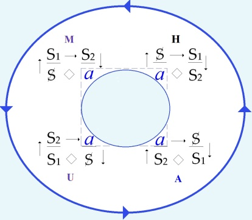
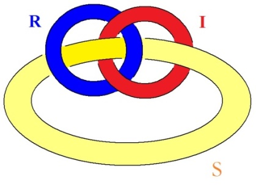

# Leçon 04 | 11 Janvier 1977

  <label><input type="checkbox" data-lacan-toggle="original" checked> 原文</label>
  <label><input type="checkbox" data-lacan-toggle="notes" checked> 注释</label>
  <label><input type="checkbox" data-lacan-toggle="commentary" checked> 个人解读评论</label>

<section class="parallel-paragraph" data-paragraph-ids="s24-04-0001">

s24-04-0001

[无对应译文]

原文 · s24-04-0001

Qu’est-ce qui règle la contagion de certaines formules ?

</section>

<section class="parallel-paragraph" data-paragraph-ids="s24-04-0002">

s24-04-0002

[无对应译文]

原文 · s24-04-0002

Je ne pense pas que ce soit la conviction avec laquelle on les prononce, parce qu’on ne peut pas dire que ce soit là le support dont j’ai propagé mon ensei­gnement.

</section>

<section class="parallel-paragraph" data-paragraph-ids="s24-04-0003">

s24-04-0003

[无对应译文]

原文 · s24-04-0003

Enfin ça, c’est plutôt Jacques-Alain Miller qui peut là-dessus porter un témoignage : est-ce qu’il considère que ce que j’ai jaspiné, au cours de mes vingt cinq années de séminaire portait cette marque ?

</section>

<section class="parallel-paragraph" data-paragraph-ids="s24-04-0004">

s24-04-0004

[无对应译文]

原文 · s24-04-0004

Bon. Ceci, d’autant plus que ce dont je me suis efforcé, c’est de *dire le vrai*, mais je ne l’ai pas dit avec tellement de conviction, me semble-­t-il.

</section>

<section class="parallel-paragraph" data-paragraph-ids="s24-04-0005">

s24-04-0005

[无对应译文]

原文 · s24-04-0005

J’étais quand même assez sur la touche pour être convenable.

</section>

<section class="parallel-paragraph" data-paragraph-ids="s24-04-0006">

s24-04-0006

[无对应译文]

原文 · s24-04-0006

*Dire le vrai* sur quoi ? Sur le savoir.

</section>

<section class="parallel-paragraph" data-paragraph-ids="s24-04-0007">

s24-04-0007

[无对应译文]

原文 · s24-04-0007

C’est ce dont j’ai cru pouvoir fonder la psychanalyse, puisqu’en fin de compte tout ce que j’ai dit se tient.

</section>

<section class="parallel-paragraph" data-paragraph-ids="s24-04-0008">

s24-04-0008

[无对应译文]

原文 · s24-04-0008

*Dire le vrai* sur le savoir, ça n’était pas forcément supposer le savoir au psy­chanalyste, vous le savez : j’ai défini de ces termes le transfert, mais ça ne veut pas dire que ça ne soit pas une illusion.

</section>

<section class="parallel-paragraph" data-paragraph-ids="s24-04-0009">

s24-04-0009

[无对应译文]

原文 · s24-04-0009

Il reste que, comme je l’ai dit quelque part dans ce truc que j’ai relu moi-même avec un peu d’étonnement, ça me frappe toujours ce que j’ai raconté dans l’ancien temps, je ne m’imagine jamais que c’est moi qui aie pu dire ça.

</section>

<section class="parallel-paragraph" data-paragraph-ids="s24-04-0010">

s24-04-0010

[无对应译文]

原文 · s24-04-0010

Il en reste donc ceci : que le *Savoir* et la *Vérité* n’ont entre eux...

</section>

<section class="parallel-paragraph" data-paragraph-ids="s24-04-0011">

s24-04-0011

[无对应译文]

原文 · s24-04-0011

> comme je le dis dans cette *Radiophonie* là, du n°2-3 de *Scilicet* ...que le *Savoir* et la *Vérité* n’ont aucune relation entre eux.

</section>

<section class="parallel-paragraph" data-paragraph-ids="s24-04-0012">

s24-04-0012

[无对应译文]

原文 · s24-04-0012

Il faut que je me tape maintenant une préface pour la traduction italienne de ces quatre premiers numé­ros de *Scilicet.*

</section>

<section class="parallel-paragraph" data-paragraph-ids="s24-04-0013">

s24-04-0013

[无对应译文]

原文 · s24-04-0013

ça ne m’est naturellement pas tellement commode, vu l’ancienneté de ces textes.

</section>

<section class="parallel-paragraph" data-paragraph-ids="s24-04-0014">

s24-04-0014

[无对应译文]

原文 · s24-04-0014

Je suis certainement plutôt faiblard dans la façon de recevoir la charge de ce que j’ai moi-même écrit.

</section>

<section class="parallel-paragraph" data-paragraph-ids="s24-04-0015">

s24-04-0015

[无对应译文]

原文 · s24-04-0015

C’est pas que ça me paraisse toujours la chose la plus mal inspirée, mais c’est toujours un peu en arrière de la main et c’est ça qui m’étonne.

</section>

<section class="parallel-paragraph" data-paragraph-ids="s24-04-0016">

s24-04-0016

[无对应译文]

原文 · s24-04-0016

*Le Savoir en question* donc, *c’est l’inconscient*.

</section>

<section class="parallel-paragraph" data-paragraph-ids="s24-04-0017">

s24-04-0017

[无对应译文]

原文 · s24-04-0017

Il y a quelque temps, convo­qué à quelque chose qui n’était rien de moins que ce que nous essayons de faire à Vincennes sous le nom de « *Clinique psychanalytique* », j’ai fait remar­quer que *le Savoir en question, c’était ni plus ni moins que l’inconscient* et qu’en somme c’était très difficile de bien savoir l’idée qu’en avait Freud.

</section>

<section class="parallel-paragraph" data-paragraph-ids="s24-04-0018">

s24-04-0018

[无对应译文]

原文 · s24-04-0018

Tout ce qu’il dit - m’a-t-il semblé - impose que ce soit un *Savoir*.

</section>

<section class="parallel-paragraph" data-paragraph-ids="s24-04-0019">

s24-04-0019

[无对应译文]

原文 · s24-04-0019

Essayons *de définir* ce que ça peut nous dire ça, un *Savoir*.

</section>

<section class="parallel-paragraph" data-paragraph-ids="s24-04-0020">

s24-04-0020

[无对应译文]

原文 · s24-04-0020

Il s’agit, dans le *Savoir*, de ce que nous pouvons appeler *effets de signifiant.*

</section>

<section class="parallel-paragraph" data-paragraph-ids="s24-04-0021">

s24-04-0021

[无对应译文]

原文 · s24-04-0021

J’ai là un truc qui - je dois dire - m’a terrorisé.

</section>

<section class="parallel-paragraph" data-paragraph-ids="s24-04-0022">

s24-04-0022

[无对应译文]

原文 · s24-04-0022

C’est une collection qui est parue sous le titre de « *La Philosophie en effet ».*

</section>

<section class="parallel-paragraph" data-paragraph-ids="s24-04-0023">

s24-04-0023

[无对应译文]

原文 · s24-04-0023

La Philosophie en effet - en effets de signifiants - c’est justement ce à propos de quoi je m’efforce de tirer mon épingle du jeu, je veux dire que je ne crois pas faire de phi­losophie...

</section>

<section class="parallel-paragraph" data-paragraph-ids="s24-04-0024">

s24-04-0024

[无对应译文]

原文 · s24-04-0024

> on en fait toujours plus qu’on ne croie ...il n’y a rien de plus glis­sant que ce domaine.

</section>

<section class="parallel-paragraph" data-paragraph-ids="s24-04-0025">

s24-04-0025

[无对应译文]

原文 · s24-04-0025

Vous en faites, vous aussi, à vos heures, et ce n’est certainement pas ce dont vous avez le plus à vous réjouir.

</section>

<section class="parallel-paragraph" data-paragraph-ids="s24-04-0026">

s24-04-0026

[无对应译文]

原文 · s24-04-0026

Freud n’avait donc que peu d’idées de ce que c’était que l’inconscient.

</section>

<section class="parallel-paragraph" data-paragraph-ids="s24-04-0027">

s24-04-0027

[无对应译文]

原文 · s24-04-0027

Mais il me semble, à le lire, qu’on peut déduire qu’il pensait que c’était des effets de signifiant.

</section>

<section class="parallel-paragraph" data-paragraph-ids="s24-04-0028">

s24-04-0028

[无对应译文]

原文 · s24-04-0028

L’homme...

</section>

<section class="parallel-paragraph" data-paragraph-ids="s24-04-0029">

s24-04-0029

[无对应译文]

原文 · s24-04-0029

il faut bien appeler comme ça une certaine généralité, une généralité dont on ne peut pas dire que quelques-uns émergent : Freud n’avait rien de transcendant, c’était un petit médecin qui faisait \- mon Dieu - ce qu’il pouvait pour ce qu’on appelle guérir, ce qui ne va pas loin ...l’homme donc, puisque j’ai parlé de l’homme, l’homme ne s’en tire guère de cette affaire de *Savoir*.

</section>

<section class="parallel-paragraph" data-paragraph-ids="s24-04-0030">

s24-04-0030

[无对应译文]

原文 · s24-04-0030

Ça lui est imposé par ce que j’ai appelé *les effets de signifiant*, et il n’est pas à l’aise : il ne sait pas « *faire avec* » le *Savoir*.

</section>

<section class="parallel-paragraph" data-paragraph-ids="s24-04-0031">

s24-04-0031

[无对应译文]

原文 · s24-04-0031

C’est ce qu’on appelle sa « *débilité mentale* », dont - je dois dire - je ne m’excepte pas. Je ne m’en excepte pas simplement parce que j’ai à faire au même matériel que tout le monde, et que ce matériel, c’est ce qui nous habite.

</section>

<section class="parallel-paragraph" data-paragraph-ids="s24-04-0032">

s24-04-0032

[无对应译文]

原文 · s24-04-0032

Avec ce matériel, il ne sait pas « *y faire* ».

</section>

<section class="parallel-paragraph" data-paragraph-ids="s24-04-0033">

s24-04-0033

[无对应译文]

原文 · s24-04-0033

C’est la même chose que ce « *faire avec* » dont je parlais tout à l’heure, mais c’est très important ces nuances comme ça, de langue.

</section>

<section class="parallel-paragraph" data-paragraph-ids="s24-04-0034">

s24-04-0034

[无对应译文]

原文 · s24-04-0034

Ça ne peut pas se dire ce « *y faire* », dans toutes les langues.

</section>

<section class="parallel-paragraph" data-paragraph-ids="s24-04-0035">

s24-04-0035

[无对应译文]

原文 · s24-04-0035

*Savoir y faire*, c’est autre chose que de savoir faire : ça veut dire se débrouiller.

</section>

<section class="parallel-paragraph" data-paragraph-ids="s24-04-0036">

s24-04-0036

[无对应译文]

原文 · s24-04-0036

Mais cet « *y faire* » indique qu’on ne prend pas vraiment *la chose*, en somme, en « concept ».

</section>

<section class="parallel-paragraph" data-paragraph-ids="s24-04-0037">

s24-04-0037

[无对应译文]

原文 · s24-04-0037

Ceci nous mène à pousser la porte de certaines *philosophies*.

</section>

<section class="parallel-paragraph" data-paragraph-ids="s24-04-0038">

s24-04-0038

[无对应译文]

原文 · s24-04-0038

Il faut pas pousser cette porte trop vite, parce qu’il faut rester au niveau où j’ai placé ce que j’ai en somme appelé *« les discours » : les dits, c’est le « dire qui secourt »*.

</section>

<section class="parallel-paragraph" data-paragraph-ids="s24-04-0039">

s24-04-0039

[无对应译文]

原文 · s24-04-0039

Il faut quand même bien profiter de ce que nous offre d’équi­voque la langue dans laquelle nous parlons.

</section>

<section class="parallel-paragraph" data-paragraph-ids="s24-04-0040">

s24-04-0040

[无对应译文]

原文 · s24-04-0040

Qu’est-ce qui secourt ?

</section>

<section class="parallel-paragraph" data-paragraph-ids="s24-04-0041">

s24-04-0041

[无对应译文]

原文 · s24-04-0041

Est-ce que c’est le *dire,* ou est-ce que c’est le *dit* ?

</section>

<section class="parallel-paragraph" data-paragraph-ids="s24-04-0042">

s24-04-0042

[无对应译文]

原文 · s24-04-0042

Dans l’hypothèse analytique, c’est le *dire,* c’est-à-dire l’*énonciation*, l’*énonciation* de ce que j’ai appelé tout à l’heure la *vérité*.

</section>

<section class="parallel-paragraph" data-paragraph-ids="s24-04-0043">

s24-04-0043

[无对应译文]

原文 · s24-04-0043

Et dans ces *« dire secours »* j’en ai...

</section>

<section class="parallel-paragraph" data-paragraph-ids="s24-04-0044">

s24-04-0044

[无对应译文]

原文 · s24-04-0044

> l’an­née où je parlais de « *L’envers de la psychanalyse »* [^2] vous ne vous en sou­venez sûrement pas ...j’en avais comme ça distingué en gros 4, parce que je m’étais amusé à faire tourner une suite de 4 justement, et que, dans cette suite de 4, la *Vérité* - la vérité du *dire -* la *Vérité* n’était en somme qu’impli­quée, puisque comme vous vous en souvenez peut-être ça se présentait comme ça :

</section>

<section class="parallel-paragraph" data-paragraph-ids="s24-04-0045">

s24-04-0045

[无对应译文]

原文 · s24-04-0045

   

</section>

<section class="parallel-paragraph" data-paragraph-ids="s24-04-0046">

s24-04-0046

[无对应译文]

原文 · s24-04-0046

*Discours du Maître Discours de l’Hystérique Discours Universitaire Discours analytique*

</section>

<section class="parallel-paragraph" data-paragraph-ids="s24-04-0047">

s24-04-0047

[无对应译文]

原文 · s24-04-0047

Je veux dire que c’était le *discours du maître* qui était le discours *le moins vrai*.

</section>

<section class="parallel-paragraph" data-paragraph-ids="s24-04-0048">

s24-04-0048

[无对应译文]

原文 · s24-04-0048

« *Le moins vrai »*, ça veut dire *le plus impossible*.

</section>

<section class="parallel-paragraph" data-paragraph-ids="s24-04-0049">

s24-04-0049

[无对应译文]

原文 · s24-04-0049

</section>

<section class="parallel-paragraph" data-paragraph-ids="s24-04-0050">

s24-04-0050

[无对应译文]

原文 · s24-04-0050

J’ai en effet marqué de l’impossibilité ce discours, c’est tout au moins ainsi que je l’ai reproduit dans ce qui a été imprimé de *Radiophonie*.

</section>

<section class="parallel-paragraph" data-paragraph-ids="s24-04-0051">

s24-04-0051

[无对应译文]

原文 · s24-04-0051

Ce discours est menteur et c’est précisément en cela qu’il atteint le *Réel* : *Verdrängung,* Freud a appelé ça, et pourtant c’est bien un dit qui le secourt.

</section>

<section class="parallel-paragraph" data-paragraph-ids="s24-04-0052">

s24-04-0052

[无对应译文]

原文 · s24-04-0052

*Tout ce qui se dit est une escroquerie.*

</section>

<section class="parallel-paragraph" data-paragraph-ids="s24-04-0053">

s24-04-0053

[无对应译文]

原文 · s24-04-0053

Ça ne l’est pas seulement de ce qui se dit à partir de l’inconscient.

</section>

<section class="parallel-paragraph" data-paragraph-ids="s24-04-0054">

s24-04-0054

[无对应译文]

原文 · s24-04-0054

Ce qui se dit à partir de l’inconscient participe de l’équivoque, de l’équivoque qui est le principe du *mot d’esprit* : équivalence du son et du sens, voilà au nom de quoi j’ai cru pouvoir avancer que *l’inconscient était structuré comme un langage*.

</section>

<section class="parallel-paragraph" data-paragraph-ids="s24-04-0055">

s24-04-0055

[无对应译文]

原文 · s24-04-0055

Je me suis aperçu, comme ça, un peu sur le tard, et à propos de quelque chose qui est paru dans *Lexique et grammaire* ou bien *Langue* *Française* [^3], revue trimestrielle, c’est un petit article que je vous conseille de regarder de près, parce qu’il est de quelqu’un pour qui j’ai beaucoup d’estime, il est de Jean-Claude Milner.

</section>

<section class="parallel-paragraph" data-paragraph-ids="s24-04-0056">

s24-04-0056

[无对应译文]

原文 · s24-04-0056

C’est le n° 30, paru en Mai 1976, ça s’appelle « *Réflexions sur la référence ».*

</section>

<section class="parallel-paragraph" data-paragraph-ids="s24-04-0057">

s24-04-0057

[无对应译文]

原文 · s24-04-0057

Ce qui, après la lecture de cet article, est pour moi l’objet d’*une interrogation*, c’est ceci : c’est le rôle qu’il donne à l’*anaphore*.

</section>

<section class="parallel-paragraph" data-paragraph-ids="s24-04-0058">

s24-04-0058

[无对应译文]

原文 · s24-04-0058

Il s’aperçoit que la grammaire, ça joue un certain rôle et que nommément la phrase qui n’est pas si simple :

</section>

<section class="parallel-paragraph" data-paragraph-ids="s24-04-0059">

s24-04-0059

[无对应译文]

原文 · s24-04-0059

> « *J’ai vu 10 lions et toi - dit-il - tu en as vu 15.* »

</section>

<section class="parallel-paragraph" data-paragraph-ids="s24-04-0060">

s24-04-0060

[无对应译文]

原文 · s24-04-0060

L’*anaphore* comporte l’usage de ce « *<u>en</u>* ».

</section>

<section class="parallel-paragraph" data-paragraph-ids="s24-04-0061">

s24-04-0061

[无对应译文]

原文 · s24-04-0061

Il met les choses très précisément au point en disant que ce « *en* » ne vise pas les lions, il vise les 10.

</section>

<section class="parallel-paragraph" data-paragraph-ids="s24-04-0062">

s24-04-0062

[无对应译文]

原文 · s24-04-0062

Je préférerai qu’il ne dise pas : « *tu en as vu 15* », j’ai­merais mieux qu’il dise : « *tu en as vu plus* ».

</section>

<section class="parallel-paragraph" data-paragraph-ids="s24-04-0063">

s24-04-0063

[无对应译文]

原文 · s24-04-0063

Parce qu’à la vérité, ces 15 il ne les a pas comptés, le « *tu* » en question.

</section>

<section class="parallel-paragraph" data-paragraph-ids="s24-04-0064">

s24-04-0064

[无对应译文]

原文 · s24-04-0064

Mais il est certain que dans la phrase distincte : « *J’ai capturé 10 des lions et toi, tu en as capturé 15.* » la référence n’est plus au 10, mais qu’elle est aux lions.

</section>

<section class="parallel-paragraph" data-paragraph-ids="s24-04-0065">

s24-04-0065

[无对应译文]

原文 · s24-04-0065

Il est - je crois - tout à fait saisissant que *dans ce que j’appelle la structure de l’inconscient, il faut éliminer la grammaire.*

</section>

<section class="parallel-paragraph" data-paragraph-ids="s24-04-0066">

s24-04-0066

[无对应译文]

原文 · s24-04-0066

*Il ne faut pas éliminer la logique, mais il faut éliminer la grammaire.*

</section>

<section class="parallel-paragraph" data-paragraph-ids="s24-04-0067">

s24-04-0067

[无对应译文]

原文 · s24-04-0067

Dans le français, il y a trop de grammaire.

</section>

<section class="parallel-paragraph" data-paragraph-ids="s24-04-0068">

s24-04-0068

[无对应译文]

原文 · s24-04-0068

Dans l’allemand, il y en a encore plus.

</section>

<section class="parallel-paragraph" data-paragraph-ids="s24-04-0069">

s24-04-0069

[无对应译文]

原文 · s24-04-0069

Dans l’anglais il y en a une autre, mais en quelque sorte implicite.

</section>

<section class="parallel-paragraph" data-paragraph-ids="s24-04-0070">

s24-04-0070

[无对应译文]

原文 · s24-04-0070

Il faut que la grammaire soit implicite pour pouvoir avoir son juste poids.

</section>

<section class="parallel-paragraph" data-paragraph-ids="s24-04-0071">

s24-04-0071

[无对应译文]

原文 · s24-04-0071

Je voudrais vous indiquer quelque chose, qui est d’un temps où le fran­çais n’avait pas une telle charge de grammaire, je voudrais vous indiquer ce quelque chose qui s’appelle « *Les bigarrures du seigneur des Accords »* [^4].

</section>

<section class="parallel-paragraph" data-paragraph-ids="s24-04-0072">

s24-04-0072

[无对应译文]

原文 · s24-04-0072

Il vivait tout à fait à la fin du siècle XVIème.

</section>

<section class="parallel-paragraph" data-paragraph-ids="s24-04-0073">

s24-04-0073

[无对应译文]

原文 · s24-04-0073

Et il est saisissant parce qu’il semble tout le temps jouer sur l’inconscient, ce qui tout de même est curieux, étant donné qu’il n’en avait aucune espèce d’idée, encore bien moins que Freud, mais que c’est tout de même là-dessus qu’il joue.

</section>

<section class="parallel-paragraph" data-paragraph-ids="s24-04-0074">

s24-04-0074

[无对应译文]

原文 · s24-04-0074

Comment arriver à saisir, à *dire* cette sorte de flou qui est en somme « *l’usa­ge* » ?

</section>

<section class="parallel-paragraph" data-paragraph-ids="s24-04-0075">

s24-04-0075

[无对应译文]

原文 · s24-04-0075

Et comment préciser la façon dont, dans ce flou, se spécifie l’incons­cient qui est toujours individuel ?

</section>

<section class="parallel-paragraph" data-paragraph-ids="s24-04-0076">

s24-04-0076

[无对应译文]

原文 · s24-04-0076

Il y a une chose qui frappe, c’est qu’*il n’y a pas 3 dimensions dans le langage : le langage, c’est toujours mis à plat.*

</section>

<section class="parallel-paragraph" data-paragraph-ids="s24-04-0077">

s24-04-0077

[无对应译文]

原文 · s24-04-0077

Et c’est bien pour ça que mon histoire tordue là, de l’*Imaginaire*, du *Symbolique* et du *Réel*, avec le fait que le *Symbolique* c’est

</section>

<section class="parallel-paragraph" data-paragraph-ids="s24-04-0078">

s24-04-0078

[无对应译文]

原文 · s24-04-0078

- ce qui passe au-dessus de ce qui est au-des­sus,

</section>

<section class="parallel-paragraph" data-paragraph-ids="s24-04-0079">

s24-04-0079

[无对应译文]

原文 · s24-04-0079

- et ce qui passe au-dessous de ce qui est en-dessous, c’est bien ce qui en fait la valeur : la valeur, c’est que c’est *mis à plat*.

</section>

<section class="parallel-paragraph" data-paragraph-ids="s24-04-0080">

s24-04-0080

[无对应译文]

原文 · s24-04-0080

C’est *mis à plat*, et d’une façon dont vous savez...

</section>

<section class="parallel-paragraph" data-paragraph-ids="s24-04-0081">

s24-04-0081

[无对应译文]

原文 · s24-04-0081

> parce que je vous l’ai répété, ressassé ...dont vous savez la fonction, la valeur, à savoir que ça a pour effet que l’un quelconque des trois étant dissout, les 2 autres se libèrent.

</section>

<section class="parallel-paragraph" data-paragraph-ids="s24-04-0082">

s24-04-0082

[无对应译文]

原文 · s24-04-0082

C’est ce que j’ai appelé dans son temps, du terme de *nœud* pour ce qui n’est pas un *nœud*, mais effectivement une *chaîne*. Cette *chaîne* quand même, il est frappant qu’elle puisse être *mise à plat*.

</section>

<section class="parallel-paragraph" data-paragraph-ids="s24-04-0083">

s24-04-0083

[无对应译文]

原文 · s24-04-0083

</section>

<section class="parallel-paragraph" data-paragraph-ids="s24-04-0084">

s24-04-0084

[无对应译文]

原文 · s24-04-0084

Et je dirai que...

</section>

<section class="parallel-paragraph" data-paragraph-ids="s24-04-0085">

s24-04-0085

[无对应译文]

原文 · s24-04-0085

c’est une réflexion comme ça que m’a inspiré le fait que pour ce qui est du *Réel*, on veut l’identifier à la matière ...je pro­poserai plutôt de l’écrire comme ça : « *l’âme à tiers* ».

</section>

<section class="parallel-paragraph" data-paragraph-ids="s24-04-0086">

s24-04-0086

[无对应译文]

原文 · s24-04-0086

Ce serait comme ça une façon plus sérieuse de se référer à ce quelque chose à quoi nous avons affaire, dont ce n’est pas pour rien qu’elle est homogène aux 2 autres.

</section>

<section class="parallel-paragraph" data-paragraph-ids="s24-04-0087">

s24-04-0087

[无对应译文]

原文 · s24-04-0087

Qu’un nommé Charles-Sanders Peirce, comme il s’appelait...

</section>

<section class="parallel-paragraph" data-paragraph-ids="s24-04-0088">

s24-04-0088

[无对应译文]

原文 · s24-04-0088

> vous le savez, j’ai déjà écrit ce nom, maintes et maintes fois ...que ce Peirce était tout à fait frappé par le fait que le langage n’exprime pas à proprement parler *la relation*, c’est bien là quelque chose qui est frap­pant. Que le langage ne permette pas une notation comme

</section>

<section class="parallel-paragraph" data-paragraph-ids="s24-04-0089">

s24-04-0089

[无对应译文]

原文 · s24-04-0089

X ayant un cer­tain type - et pas un autre - de relation avec Y, c’est bien ce qui m’autorise...

</section>

<section class="parallel-paragraph" data-paragraph-ids="s24-04-0090">

s24-04-0090

[无对应译文]

原文 · s24-04-0090

> puisque Peirce lui-même articule qu’il faudrait pour ça une logique ternaire,
>
> et non pas, comme on en use, une logique binaire ...c’est bien ce qui m’autorise à parler de « *l’âme à tiers* », comme de quelque chose qui nécessite un certain type de rapports logiques.

</section>

<section class="parallel-paragraph" data-paragraph-ids="s24-04-0091">

s24-04-0091

[无对应译文]

原文 · s24-04-0091

Eh ben tout de même, je vais en effet venir à cette *« Philosophie en effet »,* collection qui paraît chez Aubier-Flammarion, pour dire ce qui m’a un peu effrayé dans ce qui chemine en somme de quelque chose que j’ai inauguré par mon discours.

</section>

<section class="parallel-paragraph" data-paragraph-ids="s24-04-0092">

s24-04-0092

[无对应译文]

原文 · s24-04-0092

Il y a un livre qui y est paru, d’un nommé Nicolas Abraham et d’une nommée Maria Torok.

</section>

<section class="parallel-paragraph" data-paragraph-ids="s24-04-0093">

s24-04-0093

[无对应译文]

原文 · s24-04-0093

Ça s’appelle *Cryptonymie,* ce qui indique assez l’équivoque, à savoir que le nom y est caché, et ça s’appelle *Le Verbier de l’Homme aux loups* [^5].

</section>

<section class="parallel-paragraph" data-paragraph-ids="s24-04-0094">

s24-04-0094

[无对应译文]

原文 · s24-04-0094

Je ne sais pas, il y en a peut-être qui sont là et qui ont assisté à mes élucubrations sur *L’Homme aux loups.*

</section>

<section class="parallel-paragraph" data-paragraph-ids="s24-04-0095">

s24-04-0095

[无对应译文]

原文 · s24-04-0095

C’est à ce propos que j’ai parlé de *forclusion du Nom du Père*.

</section>

<section class="parallel-paragraph" data-paragraph-ids="s24-04-0096">

s24-04-0096

[无对应译文]

原文 · s24-04-0096

*« Le Verbier de l’Homme aux loups »* est quelque chose où, si les mots ont un sens, je crois reconnaître la poussée de ce que j’ai articu­lé depuis toujours.

</section>

<section class="parallel-paragraph" data-paragraph-ids="s24-04-0097">

s24-04-0097

[无对应译文]

原文 · s24-04-0097

À savoir que *le signifiant*, c’est de cela qu’il s’agit dans *l’inconscient*, et que le fait *que l’inconscient c’est qu’en somme on parle*...

</section>

<section class="parallel-paragraph" data-paragraph-ids="s24-04-0098">

s24-04-0098

[无对应译文]

原文 · s24-04-0098

> si tant est qu’il y ait du *parlêtre* ...*qu’on parle tout seul, parce qu’on ne dit jamais qu’une seule et même chose*, sauf si on s’ouvre à « *dialoguer* » avec un psychanalyste.

</section>

<section class="parallel-paragraph" data-paragraph-ids="s24-04-0099">

s24-04-0099

[无对应译文]

原文 · s24-04-0099

Il n’y a pas moyen de faire autrement que de recevoir d’un psychanalyste ce quelque chose qui en somme dérange, d’où sa défense, et tout ce qu’on élucubre sur les pré­tendues « résistances ».

</section>

<section class="parallel-paragraph" data-paragraph-ids="s24-04-0100">

s24-04-0100

[无对应译文]

原文 · s24-04-0100

Il est tout à fait frappant que la résistance c’est quelque chose qui prenne son point de départ chez l’analys­te lui-même, et que la bonne volonté de l’analysant ne rencontre jamais rien de pire que la résistance de l’analyste.

</section>

<section class="parallel-paragraph" data-paragraph-ids="s24-04-0101">

s24-04-0101

[无对应译文]

原文 · s24-04-0101

*La psychanalyse* - je l’ai dit, je l’ai répété tout récemment - *n’est pas une science*.

</section>

<section class="parallel-paragraph" data-paragraph-ids="s24-04-0102">

s24-04-0102

[无对应译文]

原文 · s24-04-0102

Elle n’a pas son statut de science et elle ne peut que l’at­tendre, l’espérer.

</section>

<section class="parallel-paragraph" data-paragraph-ids="s24-04-0103">

s24-04-0103

[无对应译文]

原文 · s24-04-0103

Mais c’est *un délire* dont on attend qu’il *porte une science*.

</section>

<section class="parallel-paragraph" data-paragraph-ids="s24-04-0104">

s24-04-0104

[无对应译文]

原文 · s24-04-0104

C’est *un délire* dont on attend qu’il devienne *scientifique*.

</section>

<section class="parallel-paragraph" data-paragraph-ids="s24-04-0105">

s24-04-0105

[无对应译文]

原文 · s24-04-0105

On peut attendre longtemps.

</section>

<section class="parallel-paragraph" data-paragraph-ids="s24-04-0106">

s24-04-0106

[无对应译文]

原文 · s24-04-0106

On peut attendre longtemps, j’ai dit pourquoi : simplement parce qu’il n’y a pas de « *progrès* » et que ce qu’on attend ce n’est pas forcément ce qu’on recueille.

</section>

<section class="parallel-paragraph" data-paragraph-ids="s24-04-0107">

s24-04-0107

[无对应译文]

原文 · s24-04-0107

C’est un délire scientifique donc, et on attend qu’il porte une science, mais ça ne veut pas dire que jamais la pratique analytique portera cette science.

</section>

<section class="parallel-paragraph" data-paragraph-ids="s24-04-0108">

s24-04-0108

[无对应译文]

原文 · s24-04-0108

C’est une science qui a d’autant moins de chance de mûrir qu’elle est antinomique, que quand même par l’usage que nous en avons, nous savons qu’il y a des rapports entre la science et la logique.

</section>

<section class="parallel-paragraph" data-paragraph-ids="s24-04-0109">

s24-04-0109

[无对应译文]

原文 · s24-04-0109

Il y a une chose qui - je dois dire - m’étonne encore plus que la diffusion...

</section>

<section class="parallel-paragraph" data-paragraph-ids="s24-04-0110">

s24-04-0110

[无对应译文]

原文 · s24-04-0110

> la diffu­sion dont on sait bien qu’elle se fait, la diffusion de ce qu’on appelle mon enseignement,
>
> mes idées, puisque ça voudrait dire que j’ai des idées... ...la diffusion de mon enseignement à ce quelque chose qui est l’autre extrême des groupements analytiques...

</section>

<section class="parallel-paragraph" data-paragraph-ids="s24-04-0111">

s24-04-0111

[无对应译文]

原文 · s24-04-0111

> qui est cette chose qui chemine sous le nom d’« *Institut de Psychanalyse* » ...une chose qui m’étonne encore plus, ce n’est pas que « *Le Verbier de l’Homme aux loups »,* non seulement il vogue mais il fasse des petits, c’est que quelqu’un dont je ne savais pas que...

</section>

<section class="parallel-paragraph" data-paragraph-ids="s24-04-0112">

s24-04-0112

[无对应译文]

原文 · s24-04-0112

> pour dire la vérité, je le *crois* en analyse ...dont je ne savais pas qu’il fût en analyse, mais c’est une simple hypothèse, c’est un nommé Jacques Derrida qui fait une préface à ce *« Verbier*... ».

</section>

<section class="parallel-paragraph" data-paragraph-ids="s24-04-0113">

s24-04-0113

[无对应译文]

原文 · s24-04-0113

Il fait une préface absolument fervente, enthousiaste où je crois percevoir un frémissement qui est lié...

</section>

<section class="parallel-paragraph" data-paragraph-ids="s24-04-0114">

s24-04-0114

[无对应译文]

原文 · s24-04-0114

je ne sais pas auquel des deux analystes il a affaire, ce qu’il y a de certain, c’est qu’il les couple.

</section>

<section class="parallel-paragraph" data-paragraph-ids="s24-04-0115">

s24-04-0115

[无对应译文]

原文 · s24-04-0115

Et je ne trouve pas - je dois dire...

</section>

<section class="parallel-paragraph" data-paragraph-ids="s24-04-0116">

s24-04-0116

[无对应译文]

原文 · s24-04-0116

> malgré que j’aie engagé les choses dans cette voie ...je ne trouve pas que ce livre, ni cette préface soient d’un très bon ton.

</section>

<section class="parallel-paragraph" data-paragraph-ids="s24-04-0117">

s24-04-0117

[无对应译文]

原文 · s24-04-0117

Dans le genre *délire*, je vous en parle comme ça, je ne peux pas dire que ce soit dans l’espoir que vous irez y voir, je préférerais même que vous y renonciez, mais enfin je sais bien qu’en fin de compte vous allez vous précipiter chez Aubier-Flammarion, ne serait-ce que pour voir ce que j’appelle « un extrême ».

</section>

<section class="parallel-paragraph" data-paragraph-ids="s24-04-0118">

s24-04-0118

[无对应译文]

原文 · s24-04-0118

C’est certain que ça se combine avec la - de plus en plus - médiocre envie que j’ai de vous parler.

</section>

<section class="parallel-paragraph" data-paragraph-ids="s24-04-0119">

s24-04-0119

[无对应译文]

原文 · s24-04-0119

Ce qui se combine, c’est que je suis effrayé de ce dont en somme je me sens plus ou moins responsable, à savoir d’avoir ouvert les écluses de quelque chose sur lequel j’aurais aussi bien pu la boucler.

</section>

<section class="parallel-paragraph" data-paragraph-ids="s24-04-0120">

s24-04-0120

[无对应译文]

原文 · s24-04-0120

J’aurais aussi bien pu me réserver à moi tout seul la satisfaction de jouer sur l’inconscient sans en expliquer la farce, sans dire que c’est par ce truc des effets de signifiant qu’on opère.

</section>

<section class="parallel-paragraph" data-paragraph-ids="s24-04-0121">

s24-04-0121

[无对应译文]

原文 · s24-04-0121

J’aurais aussi bien pu le garder pour moi, puisqu’en somme si on ne m’y avait pas vraiment forcé, je n’aurais jamais fait d’enseignement.

</section>

<section class="parallel-paragraph" data-paragraph-ids="s24-04-0122">

s24-04-0122

[无对应译文]

原文 · s24-04-0122

On ne peut pas dire que ce que Jacques-Alain Miller a publié sur la « *Scission de 53* », ce soit avec enthousiasme que j’ai pris la relève sur le sujet de cet inconscient.

</section>

<section class="parallel-paragraph" data-paragraph-ids="s24-04-0123">

s24-04-0123

[无对应译文]

原文 · s24-04-0123

Je dirai même plus, je n’aime pas tellement la seconde topique, je veux dire celle où Freud s’est laissé entraîner par Groddeck.

</section>

<section class="parallel-paragraph" data-paragraph-ids="s24-04-0124">

s24-04-0124

[无对应译文]

原文 · s24-04-0124

Bien sûr, on ne peut pas faire autrement, ces *mises à plat *: le *Ça* avec le gros œil qui est *le* *Moi*, tout se met à plat.

</section>

<section class="parallel-paragraph" data-paragraph-ids="s24-04-0125">

s24-04-0125

[无对应译文]

原文 · s24-04-0125

Mais enfin, ce *Moi*...

</section>

<section class="parallel-paragraph" data-paragraph-ids="s24-04-0126">

s24-04-0126

[无对应译文]

原文 · s24-04-0126

> qui d’ailleurs en allemand ne s’appelle pas « *Moi »*, s’appelle « *Ich »*

</section>

<section class="parallel-paragraph" data-paragraph-ids="s24-04-0127">

s24-04-0127

[无对应译文]

原文 · s24-04-0127

...*Wo es war, là où c’était* : on ne sait pas du tout ce qu’il y avait dans la boule de ce Groddeck pour soutenir ce *Ça*, cet *Es*. Lui pensait que le *Ça* dont il s’agit, c’était ce qui vous vivait.

</section>

<section class="parallel-paragraph" data-paragraph-ids="s24-04-0128">

s24-04-0128

[无对应译文]

原文 · s24-04-0128

C’est ce qu’il dit quand il écrit son *Buch,* son « *Livre du ça* », son livre du *Es*, il dit que c’est ce qui vous vit.

</section>

<section class="parallel-paragraph" data-paragraph-ids="s24-04-0129">

s24-04-0129

[无对应译文]

原文 · s24-04-0129

Cette idée d’une unité globale qui vous vit, alors qu’il est bien évident que le *Ça* dialogue, et que c’est même ça que j’ai désigné du nom de *grand A*, *c’est qu’il y a quelque chose d’autre, ce que j’appelais tout à l’heure « l’âme à tiers »,* *« l’âme à tiers » qui n’est pas seulement le Réel,* *qui est quelque chose avec quoi* expressément - je le dis - *nous n’avons pas de relations*.

</section>

<section class="parallel-paragraph" data-paragraph-ids="s24-04-0130">

s24-04-0130

[无对应译文]

原文 · s24-04-0130

*Avec le langage nous aboyons après cette chose*, *et ce que veut dire* **S(A)** *c’est ça que ça veut dire, c’est que ça ne répond pas*.

</section>

<section class="parallel-paragraph" data-paragraph-ids="s24-04-0131">

s24-04-0131

[无对应译文]

原文 · s24-04-0131

C’est bien en ça que nous parlons tout seuls, que nous parlons tout seuls jus­qu’à ce que sorte ce qu’on appelle un *moi*, c’est-à-dire quelque chose dont rien ne garantit qu’il ne puisse, à proprement parler, délirer.

</section>

<section class="parallel-paragraph" data-paragraph-ids="s24-04-0132">

s24-04-0132

[无对应译文]

原文 · s24-04-0132

C’est bien en quoi j’ai pointé que...

</section>

<section class="parallel-paragraph" data-paragraph-ids="s24-04-0133">

s24-04-0133

[无对应译文]

原文 · s24-04-0133

> comme Freud d’ailleurs ...qu’il n’y avait pas à y regarder de si près pour ce qui est de la psychanalyse, et qu’entre folie et débilité mentale, nous n’avons que le choix.

</section>

<section class="parallel-paragraph" data-paragraph-ids="s24-04-0134">

s24-04-0134

[无对应译文]

原文 · s24-04-0134

En voilà assez pour aujourd’hui.

</section>

<section class="note-block original-notes">

## Notes

[^2]: Cf. séminaire 1969-70 : « *L'envers de la psychanalyse* », Seuil, 1991.

[^3]: Jean-Claude Milner : « *Réflexions sur la référence* », in *Langue française* : *lexique et grammaire*. éd. Larousse, numéro 30, Mai 1976, pp.63-73.

[^4]: Étienne Tabourot : « *Les bigarrures du seigneur Des Accords*. *Quatrième livre. Avec les Apophtegmes du seigneur Gaulard* », éd. B. Rigaud, 1584 ;

    ou éd. Honoré Champion, 2004.

[^5]: Nicolas Abraham (1919-1975) et Maria Torok (1925-1998), *Le Verbier de l’Homme aux loups*, éd. Flammarion, 1999.

</section>
