# Leçon 05 | 18 janvier 1977

  <label><input type="checkbox" data-lacan-toggle="original" checked> 原文</label>
  <label><input type="checkbox" data-lacan-toggle="notes" checked> 注释</label>
  <label><input type="checkbox" data-lacan-toggle="commentary" checked> 个人解读评论</label>

<section class="parallel-paragraph" data-paragraph-ids="s24-05-0001">

s24-05-0001

[无对应译文]

原文 · s24-05-0001

C’est plutôt pénible, alors voilà : à la vérité ceci c’est plutôt le témoignage d’un échec, à savoir que je me suis épui­sé pendant quarante huit heures, à faire ce que j’appellerais...

</section>

<section class="parallel-paragraph" data-paragraph-ids="s24-05-0002">

s24-05-0002

[无对应译文]

原文 · s24-05-0002

> contrairement à ce qu’il en est de la « *tresse »* ...je me suis épuisé pendant quarante huit heures à faire ce que j’appellerais une « *quatresse* ». Voilà :

</section>

<section class="parallel-paragraph" data-paragraph-ids="s24-05-0003">

s24-05-0003

[无对应译文]

原文 · s24-05-0003

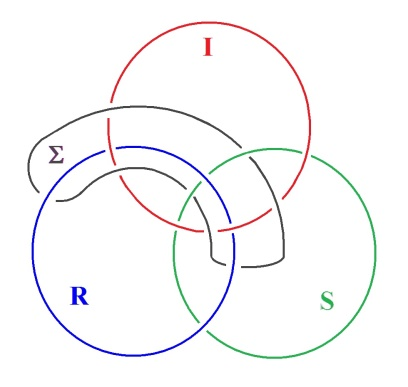 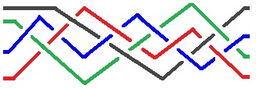

</section>

<section class="parallel-paragraph" data-paragraph-ids="s24-05-0004">

s24-05-0004

[无对应译文]

原文 · s24-05-0004

La « *tresse »* est au principe du nœud borroméen, c’est à savoir qu’au bout de 6 fois, on trouve...

</section>

<section class="parallel-paragraph" data-paragraph-ids="s24-05-0005">

s24-05-0005

[无对应译文]

原文 · s24-05-0005

> pour peu qu’on croise de la façon convenable ces 3 ...ceci veut dire qu’au bout de 6 manœuvres de *la tresse,* vous retrouvez dans l’ordre - à la 6ème *manœuvre* - le 1, 2, 3 :

</section>

<section class="parallel-paragraph" data-paragraph-ids="s24-05-0006">

s24-05-0006

[无对应译文]

原文 · s24-05-0006

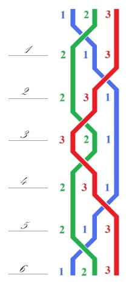

</section>

<section class="parallel-paragraph" data-paragraph-ids="s24-05-0007">

s24-05-0007

[无对应译文]

原文 · s24-05-0007

C’est ceci qui constitue le nœud borro­méen.

</section>

<section class="parallel-paragraph" data-paragraph-ids="s24-05-0008">

s24-05-0008

[无对应译文]

原文 · s24-05-0008

Si vous procédez douze fois, vous avez de même un autre nœud bor­roméen.

</section>

<section class="parallel-paragraph" data-paragraph-ids="s24-05-0009">

s24-05-0009

[无对应译文]

原文 · s24-05-0009

Chose curieuse, cet autre nœud borroméen n’est pas visualisé immédiatement.

</section>

<section class="parallel-paragraph" data-paragraph-ids="s24-05-0010">

s24-05-0010

[无对应译文]

原文 · s24-05-0010

Il a pourtant ce caractère que, contrairement au 1er nœud borroméen qui, comme vous l’avez vu tout à l’heure,

</section>

<section class="parallel-paragraph" data-paragraph-ids="s24-05-0011">

s24-05-0011

[无对应译文]

原文 · s24-05-0011

- passe au-dessus de celui qui est au-dessus, puisque vous le voyez : le rouge est au-dessus du vert,

</section>

<section class="parallel-paragraph" data-paragraph-ids="s24-05-0012">

s24-05-0012

[无对应译文]

原文 · s24-05-0012

- au-dessous de celui qui est au-dessous, voilà le principe dont découle le nœud borroméen, c’est en fonction de cette opération que le nœud borroméen tient.

</section>

<section class="parallel-paragraph" data-paragraph-ids="s24-05-0013">

s24-05-0013

[无对应译文]

原文 · s24-05-0013

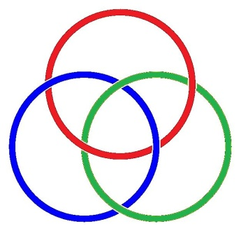

</section>

<section class="parallel-paragraph" data-paragraph-ids="s24-05-0014">

s24-05-0014

[无对应译文]

原文 · s24-05-0014

De même, dans une opération à quatre, vous mettrez un au-dessus, l’autre au-dessous :

</section>

<section class="parallel-paragraph" data-paragraph-ids="s24-05-0015">

s24-05-0015

[无对应译文]

原文 · s24-05-0015

</section>

<section class="parallel-paragraph" data-paragraph-ids="s24-05-0016">

s24-05-0016

[无对应译文]

原文 · s24-05-0016

Et de même opérerez­-vous, avec au-dessous celui qui est au-dessous, vous aurez ainsi un nouveau nœud borroméen qui représente celui à 12 croise­ments :

</section>

<section class="parallel-paragraph" data-paragraph-ids="s24-05-0017">

s24-05-0017

[无对应译文]

原文 · s24-05-0017

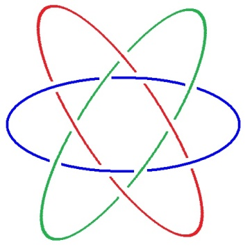

</section>

<section class="parallel-paragraph" data-paragraph-ids="s24-05-0018">

s24-05-0018

[无对应译文]

原文 · s24-05-0018

Que penser de cette tresse ?

</section>

<section class="parallel-paragraph" data-paragraph-ids="s24-05-0019">

s24-05-0019

[无对应译文]

原文 · s24-05-0019

Cette tresse peut être dans l’espace, il n’y a aucune raison - en tout cas au niveau de la *quatresse -* que nous ne puissions la supposer entièrement *suspendue*.

</section>

<section class="parallel-paragraph" data-paragraph-ids="s24-05-0020">

s24-05-0020

[无对应译文]

原文 · s24-05-0020

*La tresse* pourtant est visualisable pour autant qu’elle est mise à plat.

</section>

<section class="parallel-paragraph" data-paragraph-ids="s24-05-0021">

s24-05-0021

[无对应译文]

原文 · s24-05-0021

J’ai passé une autre époque, celle qui était prétendument réservée aux vacances, à m’épuiser de même à essayer de mettre en fonction un autre type de nœud borroméen, c’est à savoir celui qui se serait fait obligatoirement dans l’espace puisque ce dont je partais, ça n’était pas le *cercle*...

</section>

<section class="parallel-paragraph" data-paragraph-ids="s24-05-0022">

s24-05-0022

[无对应译文]

原文 · s24-05-0022

> comme vous le voyez là, c’est-à-dire de quelque chose qu’on met d’habitude à plat ...mais de ce qu’on appelle un *tétraèdre*. Un tétraèdre, ça se dessine comme ça :

</section>

<section class="parallel-paragraph" data-paragraph-ids="s24-05-0023">

s24-05-0023

[无对应译文]

原文 · s24-05-0023

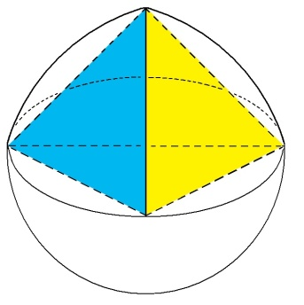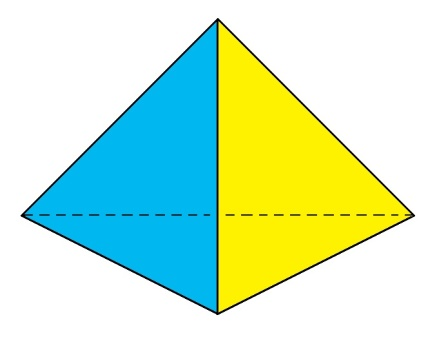

</section>

<section class="parallel-paragraph" data-paragraph-ids="s24-05-0024">

s24-05-0024

[无对应译文]

原文 · s24-05-0024

Grâce à ça, il y a 1, 2, 3, 4, 5, 6 *arêtes*.

</section>

<section class="parallel-paragraph" data-paragraph-ids="s24-05-0025">

s24-05-0025

[无对应译文]

原文 · s24-05-0025

Je dois dire que les préjugés que j’avais...

</section>

<section class="parallel-paragraph" data-paragraph-ids="s24-05-0026">

s24-05-0026

[无对应译文]

原文 · s24-05-0026

> car il ne s’agit de rien de moins ...m’ont poussé à opérer avec les 4 faces et non pas avec les 6 arêtes, et qu’avec les 4 faces c’est tout à fait difficile, c’est impossible de faire un tressage.

</section>

<section class="parallel-paragraph" data-paragraph-ids="s24-05-0027">

s24-05-0027

[无对应译文]

原文 · s24-05-0027

II y faut les 6 arêtes pour faire un tressage correct.

</section>

<section class="parallel-paragraph" data-paragraph-ids="s24-05-0028">

s24-05-0028

[无对应译文]

原文 · s24-05-0028

*Et j’aimerais que ces boules, je les vois revenir*. \[boules lancées à la salle portant le tracé du schéma\]

</section>

<section class="parallel-paragraph" data-paragraph-ids="s24-05-0029">

s24-05-0029

[无对应译文]

原文 · s24-05-0029

Le fait est que vous y constaterez que le tres­sage, non pas à 6 mais à 12, est tout à fait fondamental.

</section>

<section class="parallel-paragraph" data-paragraph-ids="s24-05-0030">

s24-05-0030

[无对应译文]

原文 · s24-05-0030

Je veux dire que ce qui se produit, c’est qu’on ne saurait mettre en exercice ce tressage des tétraèdres sans partir...

</section>

<section class="parallel-paragraph" data-paragraph-ids="s24-05-0031">

s24-05-0031

[无对应译文]

原文 · s24-05-0031

> puisque de tétraèdres, il n’y en a que 3 ...sans partir de la *tresse*.

</section>

<section class="parallel-paragraph" data-paragraph-ids="s24-05-0032">

s24-05-0032

[无对应译文]

原文 · s24-05-0032

C’est un fait qui m’a été découvert sur le tard, et dont vous verrez ici, pour peu que je vous passe ces boules dont, je le répète, j’aimerais les voir revenir parce que je ne les ai pas - loin de là - pleinement élucidées.

</section>

<section class="parallel-paragraph" data-paragraph-ids="s24-05-0033">

s24-05-0033

[无对应译文]

原文 · s24-05-0033

Je vais donc, comme je fais d’habitude, vous les envoyer pour que vous les examiniez.

</section>

<section class="parallel-paragraph" data-paragraph-ids="s24-05-0034">

s24-05-0034

[无对应译文]

原文 · s24-05-0034

*J’aimerais les voir revenir toutes les 4.*

</section>

<section class="parallel-paragraph" data-paragraph-ids="s24-05-0035">

s24-05-0035

[无对应译文]

原文 · s24-05-0035

En effet, elles ne sont pas semblables.

</section>

<section class="parallel-paragraph" data-paragraph-ids="s24-05-0036">

s24-05-0036

[无对应译文]

原文 · s24-05-0036

Il y en a quatre, ce n’est pas sans raison.

</section>

<section class="parallel-paragraph" data-paragraph-ids="s24-05-0037">

s24-05-0037

[无对应译文]

原文 · s24-05-0037

C’est une raison que je n’ai pas même encore maîtrisée.

</section>

<section class="parallel-paragraph" data-paragraph-ids="s24-05-0038">

s24-05-0038

[无对应译文]

原文 · s24-05-0038

Il est préférable...

</section>

<section class="parallel-paragraph" data-paragraph-ids="s24-05-0039">

s24-05-0039

[无对应译文]

原文 · s24-05-0039

quoi que bien entendu ça prendrait trop de temps ...il serait préférable que, d’une de ces boules à l’autre, on les compare, car elles sont effectivement différentes.

</section>

<section class="parallel-paragraph" data-paragraph-ids="s24-05-0040">

s24-05-0040

[无对应译文]

原文 · s24-05-0040

J’aimerais que, de cette tresse à 3...

</section>

<section class="parallel-paragraph" data-paragraph-ids="s24-05-0041">

s24-05-0041

[无对应译文]

原文 · s24-05-0041

> qui est basale dans l’opération de ces nœuds borroméens tétraédriques
>
> auxquels, je vous le répète, je me suis attaché sans y parvenir complètement ...j’aimerais que vous tiriez une conclusion.

</section>

<section class="parallel-paragraph" data-paragraph-ids="s24-05-0042">

s24-05-0042

[无对应译文]

原文 · s24-05-0042

C’est que, *même pour les tétraèdres* en question, on procède aussi à ce que j’appellerais *une mise à plat*, pour que ce soit clair.

</section>

<section class="parallel-paragraph" data-paragraph-ids="s24-05-0043">

s24-05-0043

[无对应译文]

原文 · s24-05-0043

Il faut la mise à plat - dans l’occasion *sphérique* - pour qu’on touche du doigt, si je puis dire, que *les croisements* en question, les croisements tétraédriques, sont bien du même ordre, c’est à savoir

</section>

<section class="parallel-paragraph" data-paragraph-ids="s24-05-0044">

s24-05-0044

[无对应译文]

原文 · s24-05-0044

- que le tétraèdre qui est *en-dessous* le 3ème tétraèdre, passe *en-dessous*,

</section>

<section class="parallel-paragraph" data-paragraph-ids="s24-05-0045">

s24-05-0045

[无对应译文]

原文 · s24-05-0045

- et que le tétraèdre qui est *en-dessus* le 3ème tétraèdre passe *en-dessus*.

</section>

<section class="parallel-paragraph" data-paragraph-ids="s24-05-0046">

s24-05-0046

[无对应译文]

原文 · s24-05-0046

C’est bien à cause de ça que nous en sommes, là encore, au nœud borroméen.

</section>

<section class="parallel-paragraph" data-paragraph-ids="s24-05-0047">

s24-05-0047

[无对应译文]

原文 · s24-05-0047

Ce qu’il y a de fâcheux pourtant, c’est que même dans l’espace, même à partir d’un présupposé spatial, nous soyons contraints aussi dans ce cas-là à supporter...

</section>

<section class="parallel-paragraph" data-paragraph-ids="s24-05-0048">

s24-05-0048

[无对应译文]

原文 · s24-05-0048

> puisqu’en fin de compte, c’est nous qui supportons ...à supporter la mise à plat.

</section>

<section class="parallel-paragraph" data-paragraph-ids="s24-05-0049">

s24-05-0049

[无对应译文]

原文 · s24-05-0049

Même à partir d’un présuppose spatial, nous sommes forcés de supporter cette mise à plat, très précisément sous la forme de quelque chose qui se présente comme une sphère :

</section>

<section class="parallel-paragraph" data-paragraph-ids="s24-05-0050">

s24-05-0050

[无对应译文]

原文 · s24-05-0050

</section>

<section class="parallel-paragraph" data-paragraph-ids="s24-05-0051">

s24-05-0051

[无对应译文]

原文 · s24-05-0051

Mais qu’est-ce à dire, si ce n’est que même quand nous manipulons *l’es­pace*, nous n’avons jamais vue que sur des *surfaces*, des surfaces sans doute qui ne sont pas des surfaces banales, puisque nous les articulons comme mises à plat.

</section>

<section class="parallel-paragraph" data-paragraph-ids="s24-05-0052">

s24-05-0052

[无对应译文]

原文 · s24-05-0052

À partir de ce moment, il est, sur les boules...

</section>

<section class="parallel-paragraph" data-paragraph-ids="s24-05-0053">

s24-05-0053

[无对应译文]

原文 · s24-05-0053

> que je viens de vous distribuer *et que j’aimerais bien voir revenir* ...il est, sur les boules, mani­feste que la tresse fondamentale...

</section>

<section class="parallel-paragraph" data-paragraph-ids="s24-05-0054">

s24-05-0054

[无对应译文]

原文 · s24-05-0054

> celle qui s’entrecroise 12 fois ...il est manifeste que cette tresse fondamentale fait partie d’un tore.

</section>

<section class="parallel-paragraph" data-paragraph-ids="s24-05-0055">

s24-05-0055

[无对应译文]

原文 · s24-05-0055

Exactement ce tore que nous pouvons matérialiser au niveau de ceci, à savoir de *la tresse à* 12, et que nous pourrions d’ailleurs aussi bien matérialiser au niveau de ceci, c’est-à-dire de *la tresse à* 6 :

</section>

<section class="parallel-paragraph" data-paragraph-ids="s24-05-0056">

s24-05-0056

[无对应译文]

原文 · s24-05-0056

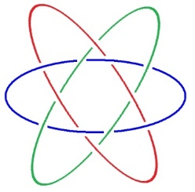 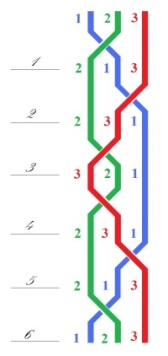

</section>

<section class="parallel-paragraph" data-paragraph-ids="s24-05-0057">

s24-05-0057

[无对应译文]

原文 · s24-05-0057

À la vérité cette fonction du tore est tout à fait manifeste au niveau des boules que je viens de vous remettre, parce que il n’est pas moins vrai qu’entre les deux petits triangles, si nous faisons...

</section>

<section class="parallel-paragraph" data-paragraph-ids="s24-05-0058">

s24-05-0058

[无对应译文]

原文 · s24-05-0058

> je vous prie de consi­dérer ces boules ...si nous faisons passer un fil polaire, nous aurons exactement de la même façon un tore.

</section>

<section class="parallel-paragraph" data-paragraph-ids="s24-05-0059">

s24-05-0059

[无对应译文]

原文 · s24-05-0059

Car il suffit de faire un trou au niveau de ces deux petits triangles pour constituer du même coup un tore.

</section>

<section class="parallel-paragraph" data-paragraph-ids="s24-05-0060">

s24-05-0060

[无对应译文]

原文 · s24-05-0060

C’est bien en quoi la situation est homogène...

</section>

<section class="parallel-paragraph" data-paragraph-ids="s24-05-0061">

s24-05-0061

[无对应译文]

原文 · s24-05-0061

> dans le cas du nœud borroméen, tel que je viens de le dessiner ici, ...est homogène entre ce nœud borroméen et le tétraèdre.

</section>

<section class="parallel-paragraph" data-paragraph-ids="s24-05-0062">

s24-05-0062

[无对应译文]

原文 · s24-05-0062

Il y a donc quelque chose qui fait qu’il n’est pas moins vrai pour un tétraèdre que la fonction du tore y règle ce qu’il y a de « *nodal* » dans le nœud borroméen.

</section>

<section class="parallel-paragraph" data-paragraph-ids="s24-05-0063">

s24-05-0063

[无对应译文]

原文 · s24-05-0063

C’est un fait, c’est un fait qui n’a strictement jamais été aperçu, c’est à savoir que tout ce qui concerne le nœud borroméen, ne s’articule que d’être torique.

</section>

<section class="parallel-paragraph" data-paragraph-ids="s24-05-0064">

s24-05-0064

[无对应译文]

原文 · s24-05-0064

Un tore se caractérise tout à fait spécifiquement d’être un trou.

</section>

<section class="parallel-paragraph" data-paragraph-ids="s24-05-0065">

s24-05-0065

[无对应译文]

原文 · s24-05-0065

Ce qu’il y a de fâcheux, c’est que le trou c’est très difficile à définir.

</section>

<section class="parallel-paragraph" data-paragraph-ids="s24-05-0066">

s24-05-0066

[无对应译文]

原文 · s24-05-0066

C’est que le nœud du trou avec sa mise à plat est essentiel : c’est le seul principe de leur comptage, et qu’il n’y a qu’une seule façon, jusqu’à présent en mathématiques, de compter les trous, c’est de « *passer par »*, c’est-à-dire de faire un trajet tel que les trous soient comptés.

</section>

<section class="parallel-paragraph" data-paragraph-ids="s24-05-0067">

s24-05-0067

[无对应译文]

原文 · s24-05-0067

C’est ce qu’on appelle « *le groupe fondamental* ».

</section>

<section class="parallel-paragraph" data-paragraph-ids="s24-05-0068">

s24-05-0068

[无对应译文]

原文 · s24-05-0068

C’est bien en quoi la mathématique ne maîtrise pas pleinement ce dont il s’agit.

</section>

<section class="parallel-paragraph" data-paragraph-ids="s24-05-0069">

s24-05-0069

[无对应译文]

原文 · s24-05-0069

Combien de trous y a-t-il dans un nœud borroméen ?

</section>

<section class="parallel-paragraph" data-paragraph-ids="s24-05-0070">

s24-05-0070

[无对应译文]

原文 · s24-05-0070

C’est bien ce qui est problématique, puisque vous le voyez, mis à plat, il y en a 4 :

</section>

<section class="parallel-paragraph" data-paragraph-ids="s24-05-0071">

s24-05-0071

[无对应译文]

原文 · s24-05-0071

</section>

<section class="parallel-paragraph" data-paragraph-ids="s24-05-0072">

s24-05-0072

[无对应译文]

原文 · s24-05-0072

Il y en a 4, c’est-à-dire qu’il n’y en a pas moins que dans le tétraèdre qui a 4 faces, dans lesquelles – chacune - on peut faire un trou.

</section>

<section class="parallel-paragraph" data-paragraph-ids="s24-05-0073">

s24-05-0073

[无对应译文]

原文 · s24-05-0073

À ceci près qu’on peut faire 2 trous, voire 3, voire 4, en faisant un trou dans chacune des faces et que dans ce cas-là, chaque face se combinant avec toutes les autres et pouvant même repasser par soi, nous voyons mal comment compter ces *trajets* qui seraient constituants de ce qu’on appelle « *le groupe fondamental »*.

</section>

<section class="parallel-paragraph" data-paragraph-ids="s24-05-0074">

s24-05-0074

[无对应译文]

原文 · s24-05-0074

Nous en sommes donc réduits à la constance de chacun de ces trous, qui de ce fait s’évanouit d’une façon tout à fait sensible, puisqu’un trou ce n’est pas grand chose.

</section>

<section class="parallel-paragraph" data-paragraph-ids="s24-05-0075">

s24-05-0075

[无对应译文]

原文 · s24-05-0075

Comment dès lors distinguer ce qui fait trou et ce qui ne fait pas trou ?

</section>

<section class="parallel-paragraph" data-paragraph-ids="s24-05-0076">

s24-05-0076

[无对应译文]

原文 · s24-05-0076

Peut-être la *quatresse* peut nous aider à le saisir. Il s’agit en effet dans la *quatresse* de quelque chose qui solidarise ce dont il se trouve que j’ai qualifié 3 cercles, c’est à savoir que, comme vous le voyez ici dans ce 1er dessin, ces 3 cercles forment nœud borroméen.

</section>

<section class="parallel-paragraph" data-paragraph-ids="s24-05-0077">

s24-05-0077

[无对应译文]

原文 · s24-05-0077

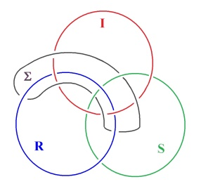 

</section>

<section class="parallel-paragraph" data-paragraph-ids="s24-05-0078">

s24-05-0078

[无对应译文]

原文 · s24-05-0078

Ils forment nœud borroméen, non pas que les 3 premiers fassent nœud borroméen, puisque, comme c’est impliqué dans le fait que le 4ème, *libéré* si je puis dire, le 4ème élément *libéré* doit laisser chacun des 3, libre.

</section>

<section class="parallel-paragraph" data-paragraph-ids="s24-05-0079">

s24-05-0079

[无对应译文]

原文 · s24-05-0079

*La quatresse* lie pourtant, à partir de celui qui est le plus en-dessus \[en noir\], à condition de passer par-dessus celui qui est le plus en-dessus, il se trou­vera à passer - sur celui qui dans la mise à plat est intermédiaire \[en vert\] - à passer dessous, il se trouvera lier les trois.

</section>

<section class="parallel-paragraph" data-paragraph-ids="s24-05-0080">

s24-05-0080

[无对应译文]

原文 · s24-05-0080

C’est bien en effet ce dont nous voyons ce qui se passe, c’est à savoir que, à condition que vous voyiez ça comme équivalent à ceci :

</section>

<section class="parallel-paragraph" data-paragraph-ids="s24-05-0081">

s24-05-0081

[无对应译文]

原文 · s24-05-0081

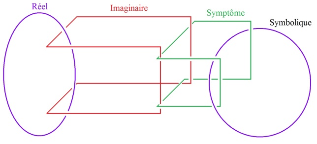

</section>

<section class="parallel-paragraph" data-paragraph-ids="s24-05-0082">

s24-05-0082

[无对应译文]

原文 · s24-05-0082

Je pense que vous voyez ici qu’il s’agit d’une représentation

</section>

<section class="parallel-paragraph" data-paragraph-ids="s24-05-0083">

s24-05-0083

[无对应译文]

原文 · s24-05-0083

- du *Réel* pour autant que c’est ici que vous en avons l’appréhension,

</section>

<section class="parallel-paragraph" data-paragraph-ids="s24-05-0084">

s24-05-0084

[无对应译文]

原文 · s24-05-0084

- de l’*Imaginaire*,

</section>

<section class="parallel-paragraph" data-paragraph-ids="s24-05-0085">

s24-05-0085

[无对应译文]

原文 · s24-05-0085

- du *Symptôme,*

</section>

<section class="parallel-paragraph" data-paragraph-ids="s24-05-0086">

s24-05-0086

[无对应译文]

原文 · s24-05-0086

- et du *Symbolique*, le *Symbolique* dans l’occasion étant très précisément ce qu’il nous faut penser comme étant le signifiant.

</section>

<section class="parallel-paragraph" data-paragraph-ids="s24-05-0087">

s24-05-0087

[无对应译文]

原文 · s24-05-0087

Qu’est-ce à dire ?

</section>

<section class="parallel-paragraph" data-paragraph-ids="s24-05-0088">

s24-05-0088

[无对应译文]

原文 · s24-05-0088

C’est que *le signifié* dans l’occasion est un *symptôme*, le corps, à savoir l’*Imaginaire* étant distinct du *signifié*.

</section>

<section class="parallel-paragraph" data-paragraph-ids="s24-05-0089">

s24-05-0089

[无对应译文]

原文 · s24-05-0089

Cette façon de faire *la chaîne* nous interroge sur ceci : c’est que le *Réel*...

</section>

<section class="parallel-paragraph" data-paragraph-ids="s24-05-0090">

s24-05-0090

[无对应译文]

原文 · s24-05-0090

> à savoir ceci dans l’occasion qui est marqué là ...c’est que *le Réel serait suspendu* tout spécialement *au Corps*.

</section>

<section class="parallel-paragraph" data-paragraph-ids="s24-05-0091">

s24-05-0091

[无对应译文]

原文 · s24-05-0091

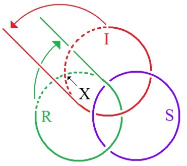 → 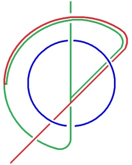

</section>

<section class="parallel-paragraph" data-paragraph-ids="s24-05-0092">

s24-05-0092

[无对应译文]

原文 · s24-05-0092

Oui, tâchons ici de voir ce qui résulterait de ceci, c’est à savoir que cet « X » qui est là, cette place s’ouvrirait et que *l’Imaginaire* se continue­rait dans *le Réel*.

</section>

<section class="parallel-paragraph" data-paragraph-ids="s24-05-0093">

s24-05-0093

[无对应译文]

原文 · s24-05-0093

C’est bien en effet ce qui se passe, puisque les corps ne sont produits, de la façon la plus futile, que comme appendices de la vie, autrement dit de ce sur quoi Freud spécule quand il parle du *germen*.

</section>

<section class="parallel-paragraph" data-paragraph-ids="s24-05-0094">

s24-05-0094

[无对应译文]

原文 · s24-05-0094

Nous trouvons là, autour de la fonction parlante, quelque chose qui, si l’on peut dire isole l’homme, dont il faudrait à ce moment-là marquer que ce n’est qu’en fonction de ceci *qu’il n’y a pas de rapport sexuel*, que ce que nous pouvons appeler dans l’occasion *le langage*, si je puis dire, y suppléerait.

</section>

<section class="parallel-paragraph" data-paragraph-ids="s24-05-0095">

s24-05-0095

[无对应译文]

原文 · s24-05-0095

C’est un fait que le *bla-bla* meuble, meuble ce qui se dis­tingue de ceci *qu’il n’y a pas de rapport*.

</section>

<section class="parallel-paragraph" data-paragraph-ids="s24-05-0096">

s24-05-0096

[无对应译文]

原文 · s24-05-0096

Oui, il faudrait dans ce cas que *le Réel*...

</section>

<section class="parallel-paragraph" data-paragraph-ids="s24-05-0097">

s24-05-0097

[无对应译文]

原文 · s24-05-0097

> sans que nous puissions savoir où il s’arrête ...que *le Réel*, nous le mettions en continuité avec *l’Imaginaire*.

</section>

<section class="parallel-paragraph" data-paragraph-ids="s24-05-0098">

s24-05-0098

[无对应译文]

原文 · s24-05-0098

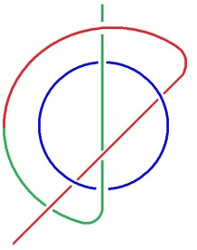

</section>

<section class="parallel-paragraph" data-paragraph-ids="s24-05-0099">

s24-05-0099

[无对应译文]

原文 · s24-05-0099

En d’autres termes, ça commence là quelque part au beau milieu du *Symbolique  *: Ça expliquerait que l’*Imaginaire*, ici tracé en rouge, effectivement se reploie dans le *Symbolique*, mais qu’il en est d’autre part étranger, comme en témoigne le fait qu’il n’y a que l’homme à parler.

</section>

<section class="parallel-paragraph" data-paragraph-ids="s24-05-0100">

s24-05-0100

[无对应译文]

原文 · s24-05-0100

Ça s’exprime ici : que le *Réel* est dessiné en vert.

</section>

<section class="parallel-paragraph" data-paragraph-ids="s24-05-0101">

s24-05-0101

[无对应译文]

原文 · s24-05-0101

J’aimerais que quelqu’un m’interpelle à propos de ce que j’ai aujourd’hui, pour vous, péniblement essayé de formuler de cette façon qui fait du symbolique quelque chose qui n’est pas facile à exprimer. Je pense que, pour ce qui est de cette tresse à quatre, elle me semble reproduire, reproduire très exactement ce qui est ici :

</section>

<section class="parallel-paragraph" data-paragraph-ids="s24-05-0102">

s24-05-0102

[无对应译文]

原文 · s24-05-0102

</section>

<section class="parallel-paragraph" data-paragraph-ids="s24-05-0103">

s24-05-0103

[无对应译文]

原文 · s24-05-0103

C’est à savoir que c’est une façon de la représenter comme *tresse* dont il s’agit.

</section>

<section class="parallel-paragraph" data-paragraph-ids="s24-05-0104">

s24-05-0104

[无对应译文]

原文 · s24-05-0104

Si je n’y ai pas effectivement réussi d’emblée, c’est parce qu’il ne faut pas croire que ce soit aisé de faire *une tresse à* 4 : il y faut partir d’un point qui *sectionne les entrecroisements*, si je puis dire, d’une façon appropriée, et il se peut que les choses soient telles qu’à partir d’un de ces points, on ne trouve pas moyen de faire la *tresse*.

</section>

<section class="parallel-paragraph" data-paragraph-ids="s24-05-0105">

s24-05-0105

[无对应译文]

原文 · s24-05-0105

C’est bien à ça que je me suis si longuement attardé, si longuement attardé qu’il en est résulté plus qu’un dommage pour ce que j’avais à vous dire aujourd’hui.

</section>

<section class="parallel-paragraph" data-paragraph-ids="s24-05-0106">

s24-05-0106

[无对应译文]

原文 · s24-05-0106

Si donc quelqu’un veut bien me donner la réplique, à savoir m’interroger sur ce que j’ai voulu dire aujourd’hui, je lui en serais reconnaissant.

</section>

<section class="parallel-paragraph" data-paragraph-ids="s24-05-0107">

s24-05-0107

[无对应译文]

原文 · s24-05-0107

Questions

</section>

<section class="parallel-paragraph" data-paragraph-ids="s24-05-0108">

s24-05-0108

[无对应译文]

原文 · s24-05-0108

X

</section>

<section class="parallel-paragraph" data-paragraph-ids="s24-05-0109">

s24-05-0109

[无对应译文]

原文 · s24-05-0109

*Je me permets de vous poser une question.*

</section>

<section class="parallel-paragraph" data-paragraph-ids="s24-05-0110">

s24-05-0110

[无对应译文]

原文 · s24-05-0110

*Je voulais vous demander, parce que vous avez dit : « le présupposé espace », et je n’ai jamais très bien compris* *- et je l’avoue humblement devant cette noble assemblée - que vous disiez « ek-siste » ou « existe ».*

</section>

<section class="parallel-paragraph" data-paragraph-ids="s24-05-0111">

s24-05-0111

[无对应译文]

原文 · s24-05-0111

*J’ai le droit d’avoir mes faiblesses. Mais pourquoi ne pourriez-vous pas dire : le « père espa­ce » ?*

</section>

<section class="parallel-paragraph" data-paragraph-ids="s24-05-0112">

s24-05-0112

[无对应译文]

原文 · s24-05-0112

Lacan - Oui

</section>

<section class="parallel-paragraph" data-paragraph-ids="s24-05-0113">

s24-05-0113

[无对应译文]

原文 · s24-05-0113

X

</section>

<section class="parallel-paragraph" data-paragraph-ids="s24-05-0114">

s24-05-0114

[无对应译文]

原文 · s24-05-0114

...*Je me demande. Et puis vous avez dit : le « présupposé tétraèdre qui est à trois dans l’espace forme tresse ».*

</section>

<section class="parallel-paragraph" data-paragraph-ids="s24-05-0115">

s24-05-0115

[无对应译文]

原文 · s24-05-0115

*Je ne suis pas au cirque, mais je me souviens puisque nous parlons de sphère, avec ces balles que vous avez envoyées qui sont si différentes,* *on peut la tresser.*

</section>

<section class="parallel-paragraph" data-paragraph-ids="s24-05-0116">

s24-05-0116

[无对应译文]

原文 · s24-05-0116

Lacan - On peut...?

</section>

<section class="parallel-paragraph" data-paragraph-ids="s24-05-0117">

s24-05-0117

[无对应译文]

原文 · s24-05-0117

X - *On peut la tresser sur l’île Borromée. On peut faire la tresse dans l’espace comme le jongleur.*

</section>

<section class="parallel-paragraph" data-paragraph-ids="s24-05-0118">

s24-05-0118

[无对应译文]

原文 · s24-05-0118

Lacan - Ouais… X - *C’est ce que vous avez dit qui est difficile à plat, vous l’avez avoué vous-même. Personne ne vous l’a dit ?*

</section>

<section class="parallel-paragraph" data-paragraph-ids="s24-05-0119">

s24-05-0119

[无对应译文]

原文 · s24-05-0119

Lacan - oui c’est vrai. Bien. Est-ce que quelqu’un d’autre a une question à poser ?

</section>

<section class="parallel-paragraph" data-paragraph-ids="s24-05-0120">

s24-05-0120

[无对应译文]

原文 · s24-05-0120

X

</section>

<section class="parallel-paragraph" data-paragraph-ids="s24-05-0121">

s24-05-0121

[无对应译文]

原文 · s24-05-0121

*Est-ce que l’ouverture du Réel et de l’Imaginaire avec le Symbolique replié sur lui-même suppose que vous passiez du domaine de « l’homme » au domaine de « la vie et des vivants » ?*

</section>

<section class="parallel-paragraph" data-paragraph-ids="s24-05-0122">

s24-05-0122

[无对应译文]

原文 · s24-05-0122

Lacan - Il n’est certainement pas le seul à vivre.

</section>

<section class="parallel-paragraph" data-paragraph-ids="s24-05-0123">

s24-05-0123

[无对应译文]

原文 · s24-05-0123

X

</section>

<section class="parallel-paragraph" data-paragraph-ids="s24-05-0124">

s24-05-0124

[无对应译文]

原文 · s24-05-0124

*Vous ne m’entendez pas parce que justement je n’ai pas de micro. La technique est faite ainsi qu’il y a des micros.*

</section>

<section class="parallel-paragraph" data-paragraph-ids="s24-05-0125">

s24-05-0125

[无对应译文]

原文 · s24-05-0125

*Pourquoi est-ce que vous ne vous en servez pas ? Est-ce que c’est pour donner plus de valeur à ce que vous dites ?*

</section>

<section class="parallel-paragraph" data-paragraph-ids="s24-05-0126">

s24-05-0126

[无对应译文]

原文 · s24-05-0126

Lacan - Certainement pas ! Je m’excuse d’avoir dû aller au tableau plus d’une fois.

</section>

<section class="parallel-paragraph" data-paragraph-ids="s24-05-0127">

s24-05-0127

[无对应译文]

原文 · s24-05-0127

X

</section>

<section class="parallel-paragraph" data-paragraph-ids="s24-05-0128">

s24-05-0128

[无对应译文]

原文 · s24-05-0128

*Alors, si la fonction parlante isole l’homme, qu’en est-il d’une manifestation préverbale, c’est-à-dire de l’ouverture possible du Réel*...

</section>

<section class="parallel-paragraph" data-paragraph-ids="s24-05-0129">

s24-05-0129

[无对应译文]

原文 · s24-05-0129

*je relis : le Réel en continuité avec l’Imaginaire* ...*comment voyez-vous par exemple des manifestations préverbales qui sont celles de l’art par exemple.*

</section>

<section class="parallel-paragraph" data-paragraph-ids="s24-05-0130">

s24-05-0130

[无对应译文]

原文 · s24-05-0130

Lacan - Celles de... ?

</section>

<section class="parallel-paragraph" data-paragraph-ids="s24-05-0131">

s24-05-0131

[无对应译文]

原文 · s24-05-0131

X ...*l’art, la musique, l’« art » entre guillemets, la peinture, la musique, enfin tous les arts qui sont, qui ne passent pas par la talking-cure, qui ne passent pas par le parler ? Alors, si vous mettez le Réel en continuité avec l’Imaginaire par une ouverture ici, je crois*...

</section>

<section class="parallel-paragraph" data-paragraph-ids="s24-05-0132">

s24-05-0132

[无对应译文]

原文 · s24-05-0132

*d’une expérience qui est la mienne de la peinture* ...*que la continuité ici dessinée par vous au tableau par une ouverture est en acte*...

</section>

<section class="parallel-paragraph" data-paragraph-ids="s24-05-0133">

s24-05-0133

[无对应译文]

原文 · s24-05-0133

> *je dis bien en acte - cette fois par le corps, qui est comme vous l’avez défini et comme Freud le définit par le germen, comme le corps étant là par appendice* ...*je pense que là au niveau de la peinture se passe justement un jeu d’appendice pré-verbal, c’est-à-dire et alors là, je vous demande d’enchaîner justement, non pas que je ne sais pas la suite, mais que j’attends votre riposte.*

</section>

<section class="parallel-paragraph" data-paragraph-ids="s24-05-0134">

s24-05-0134

[无对应译文]

原文 · s24-05-0134

Lacan - Oui...

</section>

<section class="parallel-paragraph" data-paragraph-ids="s24-05-0135">

s24-05-0135

[无对应译文]

原文 · s24-05-0135

X

</section>

<section class="parallel-paragraph" data-paragraph-ids="s24-05-0136">

s24-05-0136

[无对应译文]

原文 · s24-05-0136

*Je vois dans ce graphe, qui est la représentation donc d’une coupure, mais où il y a la possibilité d’une ouverture en acte qui est l’acte de la peinture, qui est justement là le fait d’une ouverture, mais par une conti­nuité qui serait, excusez-moi, une sorte de… un peu comme quand vous prenez du caramel, ça fait des fils. Alors cette fois il n’y a pas la coupure entre le sujet et le lieu de l’Autre, il n’y a pas cette aliénation qui nous a été décrite dans la musique, la fois dernière, où le petit(a) s’évanouit, disons qu’entre le Sujet et le lieu de l’Autre ça fait des fils. C’est comme quand on fait du caramel.*

</section>

<section class="parallel-paragraph" data-paragraph-ids="s24-05-0137">

s24-05-0137

[无对应译文]

原文 · s24-05-0137

*À partir du compulsionnel du Sujet jusqu’au lieu de l’Autre, moi, je vois une possibilité curieuse du langage de la pein­ture*...

</section>

<section class="parallel-paragraph" data-paragraph-ids="s24-05-0138">

s24-05-0138

[无对应译文]

原文 · s24-05-0138

> *qui est la mienne, et qui est un langage où au niveau du dénoté, c’est-­à-dire au niveau de ce qui est le dictionnaire et de ce qui est justement mis en abîme et qui est en fonction de l’heure dans votre étude sur le langage à partir de la cure* ...*ici dans le fait pictural il y a une sorte d’insistance*...

</section>

<section class="parallel-paragraph" data-paragraph-ids="s24-05-0139">

s24-05-0139

[无对应译文]

原文 · s24-05-0139

> *et comme Lacan dit que le sens ne consiste pas en ce qu’il signifie au moment même, effectivement il y a toujours cette glissade et ce jeu des signifiants comme dans le Séminaire de La Lettre volée* ...*ici il y aurait un processus de conti­nuité, de curieuse insistance, à un premier niveau qui serait un niveau du dénoté*...

</section>

<section class="parallel-paragraph" data-paragraph-ids="s24-05-0140">

s24-05-0140

[无对应译文]

原文 · s24-05-0140

> *qui existerait en poésie, qui existe en ce qui me concerne moi, dans une expérience picturale où à ce moment-là il y a une première mise en scénario, en scène* ...*les signes sont scéno-engraphés et vont insister à un niveau où le primaire passe dans le secondaire et - si vous voulez - fait une première mise en forme de signes qui eux-mêmes seront après mis en condition d’abîme par le jeu d’une sorte d’engrenage scénique.*

</section>

<section class="parallel-paragraph" data-paragraph-ids="s24-05-0141">

s24-05-0141

[无对应译文]

原文 · s24-05-0141

Lacan

</section>

<section class="parallel-paragraph" data-paragraph-ids="s24-05-0142">

s24-05-0142

[无对应译文]

原文 · s24-05-0142

Moi je crois que votre *pré-verbal* en l’occasion est tout à fait modelé par le verbal.

</section>

<section class="parallel-paragraph" data-paragraph-ids="s24-05-0143">

s24-05-0143

[无对应译文]

原文 · s24-05-0143

Je dirais presque que c’est *un hyper-verbal*.

</section>

<section class="parallel-paragraph" data-paragraph-ids="s24-05-0144">

s24-05-0144

[无对应译文]

原文 · s24-05-0144

Ce que vous appelez dans l’occasion par exemple ces filaments, c’est quelque chose qui est profondément motivé par le symbole et par le signifiant.

</section>

<section class="parallel-paragraph" data-paragraph-ids="s24-05-0145">

s24-05-0145

[无对应译文]

原文 · s24-05-0145

X

</section>

<section class="parallel-paragraph" data-paragraph-ids="s24-05-0146">

s24-05-0146

[无对应译文]

原文 · s24-05-0146

*Oui, je le crois aussi d’ailleurs. Mais, disons que la voie est autre et ne passe par tout le processus du Symbolique* *et c’est pas du tout pour mettre en doute ou en défaut votre enseignement, bien que je ne suis pas là pour…* Lacan - Il n’y a aucune raison qu’on ne puisse pas mettre mon ensei­gnement en défaut.

</section>

<section class="parallel-paragraph" data-paragraph-ids="s24-05-0147">

s24-05-0147

[无对应译文]

原文 · s24-05-0147

X - *Non mais disons qu’au niveau de ce qui n’est plus*...

</section>

<section class="parallel-paragraph" data-paragraph-ids="s24-05-0148">

s24-05-0148

[无对应译文]

原文 · s24-05-0148

Lacan

</section>

<section class="parallel-paragraph" data-paragraph-ids="s24-05-0149">

s24-05-0149

[无对应译文]

原文 · s24-05-0149

J’essaye de dire que l’art dans l’occasion est au-delà du sym­bolisme.

</section>

<section class="parallel-paragraph" data-paragraph-ids="s24-05-0150">

s24-05-0150

[无对应译文]

原文 · s24-05-0150

L’art est un savoir-faire et le *Symbolique* est au principe de faire.

</section>

<section class="parallel-paragraph" data-paragraph-ids="s24-05-0151">

s24-05-0151

[无对应译文]

原文 · s24-05-0151

Je crois qu’il y a plus de vérité dans le *dire* de l’art que dans n’importe quel *bla-bla*.

</section>

<section class="parallel-paragraph" data-paragraph-ids="s24-05-0152">

s24-05-0152

[无对应译文]

原文 · s24-05-0152

Mais ça ne veut pas dire que ça passe par n’im­porte quelle voie.

</section>

<section class="parallel-paragraph" data-paragraph-ids="s24-05-0153">

s24-05-0153

[无对应译文]

原文 · s24-05-0153

X - *Oui, j’ai seulement voulu dire que les choses*...

</section>

<section class="parallel-paragraph" data-paragraph-ids="s24-05-0154">

s24-05-0154

[无对应译文]

原文 · s24-05-0154

Lacan - Ce n’est pas un pré-verbal. C’est un verbal à la seconde puissance. Voilà !

</section>

