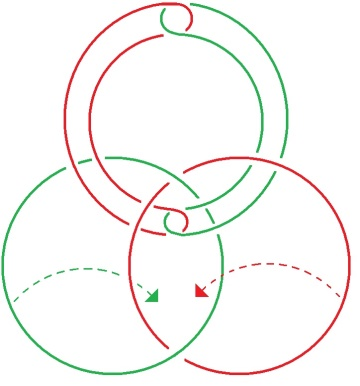
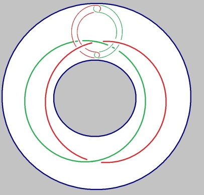

# Leçon 07 | 15 Février 1977

  

    <label><input type="checkbox" data-lacan-toggle="original" checked> 原文</label>
    <label><input type="checkbox" data-lacan-toggle="notes" checked> 注释</label>
    <label><input type="checkbox" data-lacan-toggle="commentary" checked> 个人解读评论</label>
  

  <form class="lacan-tool-search" role="search">
    <input class="lacan-tool-search-input" type="search" placeholder="搜索全文" aria-label="搜索全文">
    <button class="lacan-tool-button" type="submit" title="搜索">搜索</button>
  </form>
  <button class="lacan-tool-button lacan-back-to-top" type="button" title="回到页面最上方" aria-label="回到页面最上方">↑</button>

<section class="parallel-paragraph" data-paragraph-ids="s24-07-0001">

s24-07-0001

原文 · s24-07-0001

Pour vous donner une idée de ce pourquoi, la dernière fois, j’ai fait parler - je lui ai demandé de parler - Alain Didier-Weill, c’est parce que, évidemment je me tracasse avec des histoires de *chaîne borroméenne*.

[无对应译文]

</section>

<section class="parallel-paragraph" data-paragraph-ids="s24-07-0002">

s24-07-0002

原文 · s24-07-0002

Ceci est une *chaîne borroméenne*, comme vous le voyez :

[无对应译文]

</section>

<section class="parallel-paragraph" data-paragraph-ids="s24-07-0003">

s24-07-0003

原文 · s24-07-0003

[无对应译文]

</section>

<section class="parallel-paragraph" data-paragraph-ids="s24-07-0004">

s24-07-0004

原文 · s24-07-0004

Cet élément-là pourrait être *replié* de façon telle que ces deux cercles se bouclent, comme ceux que vous voyez ici, ce qui réalise un noeud borroméen.

[无对应译文]

</section>

<section class="parallel-paragraph" data-paragraph-ids="s24-07-0005">

s24-07-0005

原文 · s24-07-0005

Ça n’est pas absolument tout simple et le fait que j’ai dérangé plusieurs fois Pierre Soury...

[无对应译文]

</section>

<section class="parallel-paragraph" data-paragraph-ids="s24-07-0006">

s24-07-0006

原文 · s24-07-0006

> qui est quelqu’un dont j’ose croire que je suis pour quelque chose
>
> dans le fait qu’il ait beaucoup donné dans le noeud borroméen ...je lui ai posé le plus récemment la question de savoir comment 4 tétraèdres peuvent *se nouer borroméennement entre eux*.

[无对应译文]

</section>

<section class="parallel-paragraph" data-paragraph-ids="s24-07-0007">

s24-07-0007

原文 · s24-07-0007

Il m’en a aussitôt donné la solution, solution que j’ai vérifiée pour être valable.

[无对应译文]

</section>

<section class="parallel-paragraph" data-paragraph-ids="s24-07-0008">

s24-07-0008

原文 · s24-07-0008

C’est quelque chose qui implique ce que vous voyez-là :

[无对应译文]

</section>

<section class="parallel-paragraph" data-paragraph-ids="s24-07-0009">

s24-07-0009

原文 · s24-07-0009

[无对应译文]

</section>

<section class="parallel-paragraph" data-paragraph-ids="s24-07-0010">

s24-07-0010

原文 · s24-07-0010

À savoir, non pas *une relation* entre ces termes qui soit *sphérique*, mais *une relation* que j’appellerai *torique*.

[无对应译文]

</section>

<section class="parallel-paragraph" data-paragraph-ids="s24-07-0011">

s24-07-0011

原文 · s24-07-0011

Il m’a semblé qu’était tout aussi *torique* le mode sous lequel...

[无对应译文]

</section>

<section class="parallel-paragraph" data-paragraph-ids="s24-07-0012">

s24-07-0012

原文 · s24-07-0012

> mais je ne l’ai reçu qu’hier soir ...le mode sous lequel Pierre Soury m’a envoyé le nœud borroméen des 4 tétraèdres.

[无对应译文]

</section>

<section class="parallel-paragraph" data-paragraph-ids="s24-07-0013">

s24-07-0013

原文 · s24-07-0013

Ceci simplement pour vous expliquer que ça me fait souci, bien entendu de savoir si, *à un espace repré­sentable sphériquement*, l’application du nœud borroméen engendre éga­lement un *espace torique.*

[无对应译文]

</section>

<section class="parallel-paragraph" data-paragraph-ids="s24-07-0014">

s24-07-0014

原文 · s24-07-0014

Et ceci pour vous expliquer qu’en somme, comme j’étais au milieu de tout cela très embrouillé, c’est à Alain Didier-Weill que j’ai fait appel, l’appel de se substituer à moi dans cet énoncé, puisque j’avais attendu de grandes promesses de ce pour quoi il avait avancé le nom de Bozef.

[无对应译文]

</section>

<section class="parallel-paragraph" data-paragraph-ids="s24-07-0015">

s24-07-0015

原文 · s24-07-0015

Ce nom de Bozef qu’il fait entrer comme un intrus dans « *La lettre volée »*, ce nom de Bozef, je l’ai interpellé sur ce nom de Bozef et ce fameux

[无对应译文]

</section>

<section class="parallel-paragraph" data-paragraph-ids="s24-07-0016">

s24-07-0016

原文 · s24-07-0016

« *Je sais qu’il sait*... » - « *qu’il sait* » - le Roi - « ...*parce que je l’en ai informé* ».

[无对应译文]

</section>

<section class="parallel-paragraph" data-paragraph-ids="s24-07-0017">

s24-07-0017

原文 · s24-07-0017

Informé de quoi, c’est ce qui n’est pas dit.

[无对应译文]

</section>

<section class="parallel-paragraph" data-paragraph-ids="s24-07-0018">

s24-07-0018

原文 · s24-07-0018

En principe Alain Didier-Weill, en introduisant le Bozef dans l’histoi­re de « *La lettre volée* », ne sait pas formellement ce qu’il avance.

[无对应译文]

</section>

<section class="parallel-paragraph" data-paragraph-ids="s24-07-0019">

s24-07-0019

原文 · s24-07-0019

Témoin, la question que je lui en ai posée et à laquelle il a répondu.

[无对应译文]

</section>

<section class="parallel-paragraph" data-paragraph-ids="s24-07-0020">

s24-07-0020

原文 · s24-07-0020

Il a répondu : si Bozef pouvait être substitué à un personnage du conte de Poe, ce ne sau­rait être que la Reine, éventuellement le ministre quand il est - comme je le souligne - en position féminisée.

[无对应译文]

</section>

<section class="parallel-paragraph" data-paragraph-ids="s24-07-0021">

s24-07-0021

原文 · s24-07-0021

C’est un fait, que le fait de s’intro­duire par ce que vous savez, à savoir le rapt de la lettre, dite pour cela « volée », alors que ce que j’énonce, en rétablissant le texte de Poe, « *The purloined Letter »*, à savoir *la lettre qui ne parvient pas*, la lettre prolongée dans son circuit.

[无对应译文]

</section>

<section class="parallel-paragraph" data-paragraph-ids="s24-07-0022">

s24-07-0022

原文 · s24-07-0022

J’ai fait là-dessus un certain nombre de considérations que vous retrouverez dans mon texte, texte qui est au début de ce qu’on appelle mes *Écrits*.

[无对应译文]

</section>

<section class="parallel-paragraph" data-paragraph-ids="s24-07-0023">

s24-07-0023

原文 · s24-07-0023

Je montre combien il est frappant de voir que le fait d’être en somme dans la dépendance de cette lettre, féminise un person­nage qui, on peut le dire autrement, n’a pas précisément *froid aux yeux*, ne serait-ce que du fait de ce rapt de la lettre dont la Reine sait qu’il se trouve possesseur et *il est féminisé* pour autant, non pas que ce soit par l’épreuve qu’il a de cacher à l’Autre - qui est le Roi - la lettre scandaleuse.

[无对应译文]

</section>

<section class="parallel-paragraph" data-paragraph-ids="s24-07-0024">

s24-07-0024

原文 · s24-07-0024

Il se dit : « *l’Autre ne sait pas* ». Mais ceci est simplement l’équivalent du fait qu’il détient la lettre : lui sait.

[无对应译文]

</section>

<section class="parallel-paragraph" data-paragraph-ids="s24-07-0025">

s24-07-0025

原文 · s24-07-0025

D’où l’extrapolation qu’Alain Didier-Weill fait, extrapolation qui tient au fait de *la détention* de cette lettre.

[无对应译文]

</section>

<section class="parallel-paragraph" data-paragraph-ids="s24-07-0026">

s24-07-0026

原文 · s24-07-0026

Qu’il la cache à l’Autre, ne fait pas que le Roi en sache quoi que ce soit.

[无对应译文]

</section>

<section class="parallel-paragraph" data-paragraph-ids="s24-07-0027">

s24-07-0027

原文 · s24-07-0027

Alain Didier-Weill poursuit : ce en quoi l’histoire de la Reine du conte est différente de Bozef, tient à ce que, si la Reine fait bien l’épreuve ouverte avec le ministre de ces 4 *temps du savoir* qu’il a décrits lui-même, et dont il trouve trace dans Poe par l’ascendant qu’a pris le ministre aux dépens de la connaissance qu’a le ravisseur...

[无对应译文]

</section>

<section class="parallel-paragraph" data-paragraph-ids="s24-07-0028">

s24-07-0028

原文 · s24-07-0028

> de la connaissance qu’a la victime de son ravisseur ...et dans lesquels les 4 *temps* sont à son dire : le ministre sait \[**1**\], que la Reine sait \[**2**\], que le ministre sait \[**3**\], qu’elle sait \[**4**\].

[无对应译文]

</section>

<section class="parallel-paragraph" data-paragraph-ids="s24-07-0029">

s24-07-0029

原文 · s24-07-0029

C’est vrai que ceci est repérable, et qu’à la suite de cela, Alain Didier-Weill, dans sa lettre, me fait remarquer que la Reine ne vit pas pour autant cette dépossession objective par le ministre, comme la dépossession *subjective* à laquelle parvient Bozef au niveau qu’il vous a énoncé la dernière fois, comme B3-R3.

[无对应译文]

</section>

<section class="parallel-paragraph" data-paragraph-ids="s24-07-0030">

s24-07-0030

原文 · s24-07-0030

C’est vrai que là il y a une carence dans l’énoncé que nous a fait, à la dernière séance, Alain Didier-Weill.

[无对应译文]

</section>

<section class="parallel-paragraph" data-paragraph-ids="s24-07-0031">

s24-07-0031

原文 · s24-07-0031

Mais je m’inscris, à cet égard, en faux.

[无对应译文]

</section>

<section class="parallel-paragraph" data-paragraph-ids="s24-07-0032">

s24-07-0032

原文 · s24-07-0032

Bozef, quoi qu’il l’ait doté d’un nom...

[无对应译文]

</section>

<section class="parallel-paragraph" data-paragraph-ids="s24-07-0033">

s24-07-0033

原文 · s24-07-0033

> et c’est bien là qu’est le défaut où je surprends Alain Didier-Weill

[无对应译文]

</section>

<section class="parallel-paragraph" data-paragraph-ids="s24-07-0034">

s24-07-0034

原文 · s24-07-0034

...Bozef, bien qu’il l’ait doté d’un nom, n’est pas quelque chose qui mérite d’être nommé, je veux dire que ce n’est pas quelque chose qui soit comme quelque chose qui, disons *se voit*.

[无对应译文]

</section>

<section class="parallel-paragraph" data-paragraph-ids="s24-07-0035">

s24-07-0035

原文 · s24-07-0035

Ce n’est pas nommable.

[无对应译文]

</section>

<section class="parallel-paragraph" data-paragraph-ids="s24-07-0036">

s24-07-0036

原文 · s24-07-0036

Bozef est, je dirais l’incarnation du *Savoir Absolu*, et ce qu’Alain Didier-Weill extrapole, tout à fait en marge du conte de Poe, c’est le cheminement à partir de cette hypothèse...

[无对应译文]

</section>

<section class="parallel-paragraph" data-paragraph-ids="s24-07-0037">

s24-07-0037

原文 · s24-07-0037

> à savoir que Bozef est l’incarnation de ce que veut dire le *Savoir Absolu* ...montre le cheminement à partir de cette hypothèse...

[无对应译文]

</section>

<section class="parallel-paragraph" data-paragraph-ids="s24-07-0038">

s24-07-0038

原文 · s24-07-0038

> qu’il est lui-même, Bozef, cette incarnation ...montre le cheminement d’une *vérité* qui n’éclate en fait nulle part.

[无对应译文]

</section>

<section class="parallel-paragraph" data-paragraph-ids="s24-07-0039">

s24-07-0039

原文 · s24-07-0039

À aucun moment, le ministre...

[无对应译文]

</section>

<section class="parallel-paragraph" data-paragraph-ids="s24-07-0040">

s24-07-0040

原文 · s24-07-0040

> qui a gardé cette lettre en somme comme un gage de la bonne volonté de la Reine ...à aucun moment le ministre n’a même l’idée de communiquer cette lettre, au Roi par exemple, qui est d’ailleurs le seul qui se trouverait en position d’en tirer des conséquences.

[无对应译文]

</section>

<section class="parallel-paragraph" data-paragraph-ids="s24-07-0041">

s24-07-0041

原文 · s24-07-0041

La *vérité*, peut-on dire, « *demande* » à être *dite*.

[无对应译文]

</section>

<section class="parallel-paragraph" data-paragraph-ids="s24-07-0042">

s24-07-0042

原文 · s24-07-0042

Elle n’a pas de voix, pour « *demander* » à être *dite*, puisqu’en somme il se peut, comme on dit...

[无对应译文]

</section>

<section class="parallel-paragraph" data-paragraph-ids="s24-07-0043">

s24-07-0043

原文 · s24-07-0043

et c’est bien là l’extraordinaire du langage ...il se peut...

[无对应译文]

</section>

<section class="parallel-paragraph" data-paragraph-ids="s24-07-0044">

s24-07-0044

原文 · s24-07-0044

com­ment le français qu’il faut considérer comme un individu a-t-il mis cette forme en usage ?

[无对应译文]

</section>

<section class="parallel-paragraph" data-paragraph-ids="s24-07-0045">

s24-07-0045

原文 · s24-07-0045

...il se peut, dis-je après lui...

[无对应译文]

</section>

<section class="parallel-paragraph" data-paragraph-ids="s24-07-0046">

s24-07-0046

原文 · s24-07-0046

le français concret dont il s’agit ...il se peut, dis-je après lui, que personne ne la *dise*, pas même Bozef.

[无对应译文]

</section>

<section class="parallel-paragraph" data-paragraph-ids="s24-07-0047">

s24-07-0047

原文 · s24-07-0047

Et c’est bien en fait ce qui se passe.

[无对应译文]

</section>

<section class="parallel-paragraph" data-paragraph-ids="s24-07-0048">

s24-07-0048

原文 · s24-07-0048

C’est à savoir que ce Bozef mythique, puisqu’il n’est pas dans le conte de Poe, ne dit absolument rien.

[无对应译文]

</section>

<section class="parallel-paragraph" data-paragraph-ids="s24-07-0049">

s24-07-0049

原文 · s24-07-0049

Le *Savoir Absolu* - je dirai - ne parle pas à tout prix.

[无对应译文]

</section>

<section class="parallel-paragraph" data-paragraph-ids="s24-07-0050">

s24-07-0050

原文 · s24-07-0050

Il se tait s’il veut se taire.

[无对应译文]

</section>

<section class="parallel-paragraph" data-paragraph-ids="s24-07-0051">

s24-07-0051

原文 · s24-07-0051

Ce que j’ai appelé le *Savoir Absolu* dans l’occasion c’est ceci : c’est simplement qu’il y a du savoir quelque part, pas n’importe où : dans le *Réel*, et ceci grâce à *l’existence apparente*...

[无对应译文]

</section>

<section class="parallel-paragraph" data-paragraph-ids="s24-07-0052">

s24-07-0052

原文 · s24-07-0052

> c’est-à-dire chue d’une façon dont il s’agit de rendre compte ...*l’existence apparente* d’une espèce pour laquelle, je l’ai dit, *il n’y a pas de rapport sexuel*.

[无对应译文]

</section>

<section class="parallel-paragraph" data-paragraph-ids="s24-07-0053">

s24-07-0053

原文 · s24-07-0053

C’est une *existence pure­ment accidentelle*, mais sur laquelle on raisonne à partir du fait, si je puis dire, à partir du fait qu’elle est capable *d’énoncer quelque chose*, sur *l’apparence* bien sûr, puisque j’ai souligné *l’existence apparente*. L’orthographe que je donne au nom « *paraître* », que j’écris « *parêtre* », il n’y a que le « *parêtre* » dont nous avons à *savoir*, l’*être* dans l’occasion *n’étant qu’une part du* *parl’être*, comme je l’ai dit, c’est-à-dire de ce qui est fait unique­ment *de ce qui parle*.

[无对应译文]

</section>

<section class="parallel-paragraph" data-paragraph-ids="s24-07-0054">

s24-07-0054

原文 · s24-07-0054

Qu’est-ce que veut dire le *Savoir* en tant que tel ?

[无对应译文]

</section>

<section class="parallel-paragraph" data-paragraph-ids="s24-07-0055">

s24-07-0055

原文 · s24-07-0055

C’est *le Savoir* en tant qu’il est *dans le Réel*.

[无对应译文]

</section>

<section class="parallel-paragraph" data-paragraph-ids="s24-07-0056">

s24-07-0056

原文 · s24-07-0056

Ce *Réel* est une notion que j’ai élaborée de l’avoir mise en nœud borroméen avec celles de l’*Imaginaire* et du *Symbolique*.

[无对应译文]

</section>

<section class="parallel-paragraph" data-paragraph-ids="s24-07-0057">

s24-07-0057

原文 · s24-07-0057

*<u>Le Réel</u> tel qu’il apparaît, le Réel <u>dit</u> la Vérité, mais il ne parle pas*, et il faut parler pour *dire* quoi que ce soit.

[无对应译文]

</section>

<section class="parallel-paragraph" data-paragraph-ids="s24-07-0058">

s24-07-0058

原文 · s24-07-0058

<u>Le *Symbolique*</u>, lui, supporté par le signifiant, ne dit que mensonges quand il parle, et il parle beaucoup.

[无对应译文]

</section>

<section class="parallel-paragraph" data-paragraph-ids="s24-07-0059">

s24-07-0059

原文 · s24-07-0059

Il s’exprime d’ordinaire par la *Verneinung,* mais le contraire de la *Verneinung*...

[无对应译文]

</section>

<section class="parallel-paragraph" data-paragraph-ids="s24-07-0060">

s24-07-0060

原文 · s24-07-0060

> comme l’a bien énoncé quelqu’un[^7] qui a bien voulu prendre la parole dans mon premier séminaire ...le contraire de la *Verneinung*...

[无对应译文]

</section>

<section class="parallel-paragraph" data-paragraph-ids="s24-07-0061">

s24-07-0061

原文 · s24-07-0061

> autrement dit de ce qui s’accompagne de la négation ...le contraire de la *Verneinung* ne donne pas *la Vérité*.

[无对应译文]

</section>

<section class="parallel-paragraph" data-paragraph-ids="s24-07-0062">

s24-07-0062

原文 · s24-07-0062

Quand on parle de contraire, on parle toujours de quelque chose qui existe, et qui est vrai d’un *Particulier* entre autres, mais il n’y a pas d’*Universel* qui en réponde dans ce cas-là.

[无对应译文]

</section>

<section class="parallel-paragraph" data-paragraph-ids="s24-07-0063">

s24-07-0063

原文 · s24-07-0063

Et ce à quoi se reconnaît typiquement la *Verneinung,* c’est qu’il faut dire une chose fausse, pour réussir à faire passer une *vérité*.

[无对应译文]

</section>

<section class="parallel-paragraph" data-paragraph-ids="s24-07-0064">

s24-07-0064

原文 · s24-07-0064

Une chose fausse n’est pas un mensonge, elle n’est un mensonge que si elle est voulue comme telle, ce qui arrive souvent, si elle vise en quelque sorte à ce qu’un mensonge passe pour une vérité.

[无对应译文]

</section>

<section class="parallel-paragraph" data-paragraph-ids="s24-07-0065">

s24-07-0065

原文 · s24-07-0065

Mais il faut bien dire que, mise à part la psychanalyse, le cas est rare.

[无对应译文]

</section>

<section class="parallel-paragraph" data-paragraph-ids="s24-07-0066">

s24-07-0066

原文 · s24-07-0066

C’est dans la psychanalyse que cette promotion de *la Verneinung...*

[无对应译文]

</section>

<section class="parallel-paragraph" data-paragraph-ids="s24-07-0067">

s24-07-0067

原文 · s24-07-0067

à savoir du men­songe voulu comme tel pour faire passer une vérité, ...est exemplaire.

[无对应译文]

</section>

<section class="parallel-paragraph" data-paragraph-ids="s24-07-0068">

s24-07-0068

原文 · s24-07-0068

Tout ceci, bien sûr, n’est noué que par l’intermédiaire de <u>l’*Imaginaire*</u> qui a toujours tort.

[无对应译文]

</section>

<section class="parallel-paragraph" data-paragraph-ids="s24-07-0069">

s24-07-0069

原文 · s24-07-0069

*Il a toujours tort, mais c’est de lui que relève ce qu’on appelle la conscience*.

[无对应译文]

</section>

<section class="parallel-paragraph" data-paragraph-ids="s24-07-0070">

s24-07-0070

原文 · s24-07-0070

*La conscience* est bien loin d’être *le savoir*, puisque ce à quoi elle se prête, c’est très précisément à la fausseté.

[无对应译文]

</section>

<section class="parallel-paragraph" data-paragraph-ids="s24-07-0071">

s24-07-0071

原文 · s24-07-0071

« *Je sais* » ne veut jamais rien dire, et on peut facilement parier, que ce qu’on sait est *faux*.

[无对应译文]

</section>

<section class="parallel-paragraph" data-paragraph-ids="s24-07-0072">

s24-07-0072

原文 · s24-07-0072

Est *faux*, mais est soutenu par la conscience, dont la caractéristique est précisé­ment de soutenir de sa consistance ce *faux*.

[无对应译文]

</section>

<section class="parallel-paragraph" data-paragraph-ids="s24-07-0073">

s24-07-0073

原文 · s24-07-0073

C’est au point qu’on peut dire qu’il faut y regarder à deux fois avant d’admettre une *évidence*, qu’il faut la cribler comme telle, que rien n’est sûr en matière d’*éviden­ce*, et c’est pour ça que *j’ai énoncé qu’il fallait « évider l’évidence », que c’est de l’évidement que l’évidence relève*.

[无对应译文]

</section>

<section class="parallel-paragraph" data-paragraph-ids="s24-07-0074">

s24-07-0074

原文 · s24-07-0074

C’est très frappant que...

[无对应译文]

</section>

<section class="parallel-paragraph" data-paragraph-ids="s24-07-0075">

s24-07-0075

原文 · s24-07-0075

> je peux bien, moi aussi, passer à l’ordre des confidences
>
> dont je suis accablé par mes analyses quotidiennes ...un « *je sais* » qui ait conscience...

[无对应译文]

</section>

<section class="parallel-paragraph" data-paragraph-ids="s24-07-0076">

s24-07-0076

原文 · s24-07-0076

> c’est-à-dire non seulement savoir, mais volonté de ne pas changer ...c’est quelque chose que j’ai - je peux vous en faire la confidence - éprouvé très tôt, éprouvé du fait de quelqu’un, comme tout le monde, qui m’était proche, à savoir celle que j’appelais à ce moment-­là...

[无对应译文]

</section>

<section class="parallel-paragraph" data-paragraph-ids="s24-07-0077">

s24-07-0077

原文 · s24-07-0077

> j’avais 2 ans de plus qu’elle, 2 ans et demi ...« *ma petite sœur* », elle s’ap­pelle Madeleine et elle m’a dit un jour, non pas « *je sais* »...

[无对应译文]

</section>

<section class="parallel-paragraph" data-paragraph-ids="s24-07-0078">

s24-07-0078

原文 · s24-07-0078

> parce que le « *je* » aurait été beaucoup ...mais « *Manène sait* ».

[无对应译文]

</section>

<section class="parallel-paragraph" data-paragraph-ids="s24-07-0079">

s24-07-0079

原文 · s24-07-0079

L’*inconscient* est une entité...

[无对应译文]

</section>

<section class="parallel-paragraph" data-paragraph-ids="s24-07-0080">

s24-07-0080

原文 · s24-07-0080

> que j’ai essayé de définir par le *Symbolique*, mais qui n’est en somme qu’une entité de plus ...une entité avec laquelle il s’agit de « *savoir y faire* ».

[无对应译文]

</section>

<section class="parallel-paragraph" data-paragraph-ids="s24-07-0081">

s24-07-0081

原文 · s24-07-0081

*Savoir y faire*, c’est pas la même chose qu’un *Savoir*, que le *Savoir Absolu* dont j’ai parlé tout à l’heure.

[无对应译文]

</section>

<section class="parallel-paragraph" data-paragraph-ids="s24-07-0082">

s24-07-0082

原文 · s24-07-0082

L’inconscient est ce qui fait changer justement quelque chose, ce qui réduit ce que j’appelle le *sinthome,* le *sinthome* que j’écris avec l’ortho­graphe que vous savez.

[无对应译文]

</section>

<section class="parallel-paragraph" data-paragraph-ids="s24-07-0083">

s24-07-0083

原文 · s24-07-0083

J’ai toujours eu affaire à la *conscience*, mais sous une forme qui faisait partie de l’inconscient...

[无对应译文]

</section>

<section class="parallel-paragraph" data-paragraph-ids="s24-07-0084">

s24-07-0084

原文 · s24-07-0084

> puisque c’est une personne, une « elle » dans l’oc­casion, une « elle » puisque,
>
> la personne en question s’est mise à la troi­sième personne en se nommant « Manène » ...sous une forme qui faisait par­tie de l’inconscient, dis-je, puisque c’est *une « elle » qui*...

[无对应译文]

</section>

<section class="parallel-paragraph" data-paragraph-ids="s24-07-0085">

s24-07-0085

原文 · s24-07-0085

> comme dans mon titre de cette année ...*une « elle » qui s’ailait à mourre, qui se donnait pour porteuse de Savoir*.

[无对应译文]

</section>

<section class="parallel-paragraph" data-paragraph-ids="s24-07-0086">

s24-07-0086

原文 · s24-07-0086

Il ou elle, c’est la troisième personne, c’est l’Autre, tel que je le défi­nis, *c’est l’inconscient*.

[无对应译文]

</section>

<section class="parallel-paragraph" data-paragraph-ids="s24-07-0087">

s24-07-0087

原文 · s24-07-0087

Il sait, dans l’absolu - *et seulement dans l’absolu* - *il sait que je sais ce qu’il y avait dans la lettre, mais que je le sais tout seul*.

[无对应译文]

</section>

<section class="parallel-paragraph" data-paragraph-ids="s24-07-0088">

s24-07-0088

原文 · s24-07-0088

En réalité, il ne sait donc rien, sinon que je le sais, mais que ce n’est pas raison pour que je le lui dise.

[无对应译文]

</section>

<section class="parallel-paragraph" data-paragraph-ids="s24-07-0089">

s24-07-0089

原文 · s24-07-0089

En fait, ce *Savoir Absolu*, j’y ai bien fait plus qu’allusion quelque part, j’y ai vraiment insisté avec mes gros sabots, à savoir que tout l’appendice que j’ai ajouté à mon écrit sur *La lettre volée*, à savoir ce qui va de la page 52 à la page 60, et que j’ai intitulé en partie « *Parenthèse des parenthèses* », c’est très précisément *ce quelque chose qui*, là, *se substitue à* Bozef.

[无对应译文]

</section>

<section class="parallel-paragraph" data-paragraph-ids="s24-07-0090">

s24-07-0090

原文 · s24-07-0090

Alain Didier-Weill, lui, c’est pas qu’il se substitue : il s’*identifie* à Bozef...

[无对应译文]

</section>

<section class="parallel-paragraph" data-paragraph-ids="s24-07-0091">

s24-07-0091

原文 · s24-07-0091

Il se sent, il se sent dans *la Passe*.

[无对应译文]

</section>

<section class="parallel-paragraph" data-paragraph-ids="s24-07-0092">

s24-07-0092

原文 · s24-07-0092

C’est assez curieux qu’il ait pu, en quelque sorte, dans cet écrit trouver, si je puis dire, l’appel qui a répondu pour moi, m’a fait répondre par *la Passe*.

[无对应译文]

</section>

<section class="parallel-paragraph" data-paragraph-ids="s24-07-0093">

s24-07-0093

原文 · s24-07-0093

Le Réel dont il s’agit, c’est le nœud tout entier.

[无对应译文]

</section>

<section class="parallel-paragraph" data-paragraph-ids="s24-07-0094">

s24-07-0094

原文 · s24-07-0094

Puisque nous parlons du Symbolique, il faut le situer dans le Réel.

[无对应译文]

</section>

<section class="parallel-paragraph" data-paragraph-ids="s24-07-0095">

s24-07-0095

原文 · s24-07-0095

Il y a, pour ce nœud, corde : la corde, c’est aussi le « *corps-de »,* ce « *corps-de »,* est parasité par le signi­fiant.

[无对应译文]

</section>

<section class="parallel-paragraph" data-paragraph-ids="s24-07-0096">

s24-07-0096

原文 · s24-07-0096

Car le signifiant, s’il fait partie du Réel, si c’est bien là que j’ai rai­son de situer le Symbolique, *il faut penser à ceci, c’est que cette « corps-de », nous pourrions bien n’y avoir affaire que dans le noir*.

[无对应译文]

</section>

<section class="parallel-paragraph" data-paragraph-ids="s24-07-0097">

s24-07-0097

原文 · s24-07-0097

Comment recon­naîtrions-nous, dans le noir, que c’est un nœud borroméen ?

[无对应译文]

</section>

<section class="parallel-paragraph" data-paragraph-ids="s24-07-0098">

s24-07-0098

原文 · s24-07-0098

C’est de cela qu’il s’agit dans *la Passe*.

[无对应译文]

</section>

<section class="parallel-paragraph" data-paragraph-ids="s24-07-0099">

s24-07-0099

原文 · s24-07-0099

« *Je sais qu’il sait* », qu’est-ce que ça peut vouloir dire, sinon d’objectiver l’*inconscient*, à ceci près que *l’objectiva­tion de l’inconscient nécessite un redoublement, à savoir que « je sais qu’il sait que je sais qu’il sait ».*

[无对应译文]

</section>

<section class="parallel-paragraph" data-paragraph-ids="s24-07-0100">

s24-07-0100

原文 · s24-07-0100

C’est à cette condition seule que l’analy­se tient son statut.

[无对应译文]

</section>

<section class="parallel-paragraph" data-paragraph-ids="s24-07-0101">

s24-07-0101

原文 · s24-07-0101

C’est ce qui fait *obstacle à ce* *quelque chose* qui, à se limiter au « *je sais qu’il sait* », ouvre la porte à l’occultisme, à la télépa­thie. C’est pour n’avoir pas assez saisi, assez bien saisi, le statut de l’anti­-savoir, à savoir de l’anti-inconscient...

[无对应译文]

</section>

<section class="parallel-paragraph" data-paragraph-ids="s24-07-0102">

s24-07-0102

原文 · s24-07-0102

> autrement dit de ce pôle, de ce pôle qu’est le conscient ...que Freud se laissait de temps en temps chatouiller par ce qu’on a appelé depuis « *les phénomènes psy* », à savoir qu’il se mettait à glisser tout doucement *dans le délire*, à propos du fait que Jones lui faisait passer sa carte de visite juste après qu’un patient lui ait eu men­tionné incidemment le nom de Jones.

[无对应译文]

</section>

<section class="parallel-paragraph" data-paragraph-ids="s24-07-0103">

s24-07-0103

原文 · s24-07-0103

*« La Passe »* dont il s’agit, je ne l’ai envisagée que d’une façon tâtonnan­te, comme quelque chose qui ne veut rien dire que de « *se reconnaître entre soir* », si je puis m’exprimer ainsi, à condition que nous y insérions un « *av* » après la première lettre : « *se reconnaître entre s(av)oir* ».

[无对应译文]

</section>

<section class="parallel-paragraph" data-paragraph-ids="s24-07-0104">

s24-07-0104

原文 · s24-07-0104

Y a-t-il des langues qui font obstacle à la reconnaissance de l’inconscient ?

[无对应译文]

</section>

<section class="parallel-paragraph" data-paragraph-ids="s24-07-0105">

s24-07-0105

原文 · s24-07-0105

C’est quelque chose qui m’a été suggéré comme question par le fait de ce « *c’est toi* », où Alain Didier-Weill veut que communique Bozef avec le Roi dans ce moment, qu’il m’a imputé - bien à tort - grâce au fait qu’il a relevé le terme de « *communion* » quelque part dans mes *Écrits.*

[无对应译文]

</section>

<section class="parallel-paragraph" data-paragraph-ids="s24-07-0106">

s24-07-0106

原文 · s24-07-0106

*« C’est toi* », est-ce qu’il y a des langues dans lesquelles ça pourrait être un « *toi sait* » du verbe savoir, à savoir quelque chose qui mettrait le « *toi* », qui le ferait glisser à la troisième personne ?

[无对应译文]

</section>

<section class="parallel-paragraph" data-paragraph-ids="s24-07-0107">

s24-07-0107

原文 · s24-07-0107

Tout ceci pour avancer, pour dire que c’est vraiment divinatoire qu’Alain Didier-Weill ait pu relier ce que j’appelle « *la Passe »* avec « *La lettre volée ».*

[无对应译文]

</section>

<section class="parallel-paragraph" data-paragraph-ids="s24-07-0108">

s24-07-0108

原文 · s24-07-0108

Il y a sûrement quelque chose qui tient le coup, quelque chose qui *consiste* dans l’introduction de Bozef.

[无对应译文]

</section>

<section class="parallel-paragraph" data-paragraph-ids="s24-07-0109">

s24-07-0109

原文 · s24-07-0109

Bozef se promène là-dedans, comme je l’ai vraiment indiqué dans le texte même de *La lettre volée*...

[无对应译文]

</section>

<section class="parallel-paragraph" data-paragraph-ids="s24-07-0110">

s24-07-0110

原文 · s24-07-0110

> comme je l’ai vraiment indiqué : je parle tout le temps, à chaque page,
>
> de ceci qui est sur le point de se produire, c’est même au point que c’est là-dessus que je termine ...*qu’une lettre arrive toujours à destination*, à savoir qu’elle est en somme adressée au Roi, et que c’est pour ça qu’il faut qu’elle lui parvienne.

[无对应译文]

</section>

<section class="parallel-paragraph" data-paragraph-ids="s24-07-0111">

s24-07-0111

原文 · s24-07-0111

Que dans tout ce texte je ne parle que de ça, à savoir de l’imminence du fait que le Roi ait connaissance de la lettre, est-ce que ce n’est pas dire, à savoir avancer, qu’il la connaît déjà ?

[无对应译文]

</section>

<section class="parallel-paragraph" data-paragraph-ids="s24-07-0112">

s24-07-0112

原文 · s24-07-0112

Non seulement qu’il la connaît déjà, mais je dirai qu’il la « *reconnaît* » ?

[无对应译文]

</section>

<section class="parallel-paragraph" data-paragraph-ids="s24-07-0113">

s24-07-0113

原文 · s24-07-0113

Est-ce que cette « *reconnaissance* » n’est pas, très précisément, ce qui seul peut assurer la tenue du couple Reine et Roi ?

[无对应译文]

</section>

<section class="parallel-paragraph" data-paragraph-ids="s24-07-0114">

s24-07-0114

原文 · s24-07-0114

Voilà ce que je voulais vous dire aujourd’hui.

[无对应译文]

</section>

<section class="note-block original-notes">

## Notes

[^7]: Exposé de Jean Hyppolite sur la *Verneinung* dans le séminaire 1953-54 : « *Les écrits techniques de Freud* », Seuil 1975, dont le texte se trouve

    dans les *Écrits*, Seuil, 1966, pp. 879-887, (ou Points Seuil, t.1 pp. 527-537).

</section>
