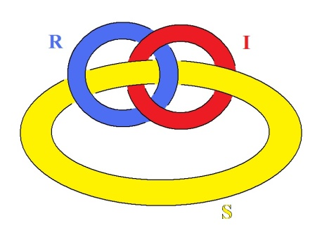
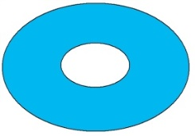
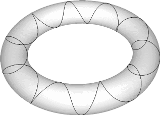
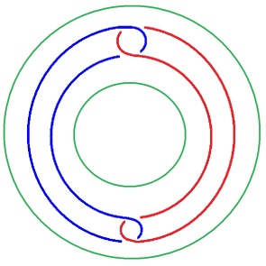
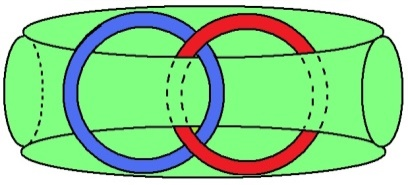
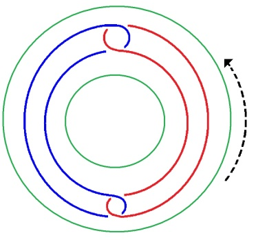
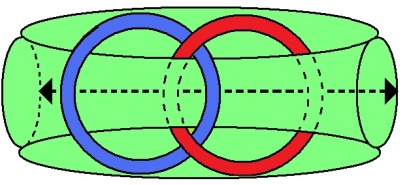
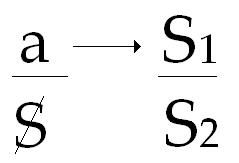

# Leçon 08 | 08 Mars 1977

  

    <label><input type="checkbox" data-lacan-toggle="original" checked> 原文</label>
    <label><input type="checkbox" data-lacan-toggle="notes" checked> 注释</label>
    <label><input type="checkbox" data-lacan-toggle="commentary" checked> 个人解读评论</label>
  

  <form class="lacan-tool-search" role="search">
    <input class="lacan-tool-search-input" type="search" placeholder="搜索全文" aria-label="搜索全文">
    <button class="lacan-tool-button" type="submit" title="搜索">搜索</button>
  </form>
  <button class="lacan-tool-button lacan-back-to-top" type="button" title="回到页面最上方" aria-label="回到页面最上方">↑</button>

<section class="parallel-paragraph" data-paragraph-ids="s24-08-0001">

s24-08-0001

原文 · s24-08-0001

On écrit...

[无对应译文]

</section>

<section class="parallel-paragraph" data-paragraph-ids="s24-08-0002">

s24-08-0002

原文 · s24-08-0002

Je dis « *On* », parce que n’importe qui peut écrire, je dis « *On* » parce que ça me gêne de dire « *Je* ».

[无对应译文]

</section>

<section class="parallel-paragraph" data-paragraph-ids="s24-08-0003">

s24-08-0003

原文 · s24-08-0003

Ça me gêne, pas sans raison : au nom de quoi le « *Je* » se produirait-il en l’occasion ?

[无对应译文]

</section>

<section class="parallel-paragraph" data-paragraph-ids="s24-08-0004">

s24-08-0004

原文 · s24-08-0004

Donc il se trouve que j’ai dit...

[无对应译文]

</section>

<section class="parallel-paragraph" data-paragraph-ids="s24-08-0005">

s24-08-0005

原文 · s24-08-0005

> et que de ce fait ça se trouve écrit ...j’ai dit qu’*il n’y a pas de métalangage*, à savoir qu’on ne parle pas sur le langage.

[无对应译文]

</section>

<section class="parallel-paragraph" data-paragraph-ids="s24-08-0006">

s24-08-0006

原文 · s24-08-0006

Il se trouve que j’ai relu quelque chose - qui est dans le « *Scilicet* 4 » - que j’ai appelé, enfin que j’ai intitulé...

[无对应译文]

</section>

<section class="parallel-paragraph" data-paragraph-ids="s24-08-0007">

s24-08-0007

原文 · s24-08-0007

> c’est en ça que c’est une chose comme ça qui porte votre marque ...enfin je l’ai intitulé* « L’étourdit »,* et dans « *L’étourdit »* je me suis aperçu, j’ai reconnu quelque chose : dans « *L’étourdit »* ce métalangage, je dirais que je le fais presque naître.

[无对应译文]

</section>

<section class="parallel-paragraph" data-paragraph-ids="s24-08-0008">

s24-08-0008

原文 · s24-08-0008

Naturellement ça ferait date.

[无对应译文]

</section>

<section class="parallel-paragraph" data-paragraph-ids="s24-08-0009">

s24-08-0009

原文 · s24-08-0009

Ça ferait date, mais il n’y a pas de date parce qu’il n’y a pas de changement.

[无对应译文]

</section>

<section class="parallel-paragraph" data-paragraph-ids="s24-08-0010">

s24-08-0010

原文 · s24-08-0010

Ce « *presque* » que j’ai ajouté à ma phrase, ce « *presque* » souligne que ce n’est pas arrivé.

[无对应译文]

</section>

<section class="parallel-paragraph" data-paragraph-ids="s24-08-0011">

s24-08-0011

原文 · s24-08-0011

C’est un *semblant de métalangage.*

[无对应译文]

</section>

<section class="parallel-paragraph" data-paragraph-ids="s24-08-0012">

s24-08-0012

原文 · s24-08-0012

Et comme je m’en sers dans le texte de cette écri­ture : *s’embler, s’emblant* au métalangage.

[无对应译文]

</section>

<section class="parallel-paragraph" data-paragraph-ids="s24-08-0013">

s24-08-0013

原文 · s24-08-0013

En faire un verbe réfléchi de ce *s’embler,* le détache de l’affruition qu’est l’*être*, et comme je l’écris : il *parest.*

[无对应译文]

</section>

<section class="parallel-paragraph" data-paragraph-ids="s24-08-0014">

s24-08-0014

原文 · s24-08-0014

*Parest* veut dire un *s’emblant d’être*. Voilà !

[无对应译文]

</section>

<section class="parallel-paragraph" data-paragraph-ids="s24-08-0015">

s24-08-0015

原文 · s24-08-0015

Et alors, à ce propos, je m’aperçois que c’était pour une préface que j’ai ouvert cet écrit, pour une préface que j’avais à faire pour une édition italienne que j’avais promise...

[无对应译文]

</section>

<section class="parallel-paragraph" data-paragraph-ids="s24-08-0016">

s24-08-0016

原文 · s24-08-0016

> il n’est pas sûr que je la donne... il n’est pas sûr que je la donne parce que ça m’ennuie ...mais je me suis rendu compte à ce propos, que j’ai consulté quelqu’un qui est italien...

[无对应译文]

</section>

<section class="parallel-paragraph" data-paragraph-ids="s24-08-0017">

s24-08-0017

原文 · s24-08-0017

> pour qui cette langue, à laquelle je n’entends rien, est sa langue maternelle ...j’ai consulté quelqu’un qui m’a fait remarquer qu’il y a quelque chose qui ressemble à *s’embler,* qui ressemble à *s’embler* mais qui n’est pas faci­le à introduire avec la déformation d’écriture que je donne.

[无对应译文]

</section>

<section class="parallel-paragraph" data-paragraph-ids="s24-08-0018">

s24-08-0018

原文 · s24-08-0018

Bref, ce n’est pas facile à transcrire, c’est pour ça que je proposais qu’on ne traduise pas ma préface après tout, ce d’autant plus qu’il n’y a aucune espèce d’in­convénient à ce *qu’on ne traduise quoi que ce soit*, en particulier pas la pré­face.

[无对应译文]

</section>

<section class="parallel-paragraph" data-paragraph-ids="s24-08-0019">

s24-08-0019

原文 · s24-08-0019

Comme toutes les préfaces, je serais incliné à...

[无对应译文]

</section>

<section class="parallel-paragraph" data-paragraph-ids="s24-08-0020">

s24-08-0020

原文 · s24-08-0020

> comme d’ordinaire c’est ce qui se passe dans les préfaces ...je serais incliné à m’approuver, voire à m’applaudir.

[无对应译文]

</section>

<section class="parallel-paragraph" data-paragraph-ids="s24-08-0021">

s24-08-0021

原文 · s24-08-0021

C’est ce qui se fait d’habitude. C’est la comédie...

[无对应译文]

</section>

<section class="parallel-paragraph" data-paragraph-ids="s24-08-0022">

s24-08-0022

原文 · s24-08-0022

C’est de l’ordre de la comédie et ça m’a fait, ça m’a induit, ça m’a poussé vers Dante.

[无对应译文]

</section>

<section class="parallel-paragraph" data-paragraph-ids="s24-08-0023">

s24-08-0023

原文 · s24-08-0023

Cette comédie est divine, bien sûr, mais ça ne veut dire qu’une chose, c’est qu’elle est bouffonne.

[无对应译文]

</section>

<section class="parallel-paragraph" data-paragraph-ids="s24-08-0024">

s24-08-0024

原文 · s24-08-0024

Je parle du « bouffon » dans « *L’étourdit »,* j’en parle à je ne sais quelle page, mais j’en parle.

[无对应译文]

</section>

<section class="parallel-paragraph" data-paragraph-ids="s24-08-0025">

s24-08-0025

原文 · s24-08-0025

Ça veut dire qu’on peut bouffonner sur la prétendue « *œuvre divine* ».

[无对应译文]

</section>

<section class="parallel-paragraph" data-paragraph-ids="s24-08-0026">

s24-08-0026

原文 · s24-08-0026

Il n’y a pas la moindre « *œuvre divine* » à moins qu’on ne veuille l’identifier à ce que j’appelle le *Réel.*

[无对应译文]

</section>

<section class="parallel-paragraph" data-paragraph-ids="s24-08-0027">

s24-08-0027

原文 · s24-08-0027

Mais je tiens à préciser cette notion que je me fais du *Réel*, j’aimerais qu’elle se répande.

[无对应译文]

</section>

<section class="parallel-paragraph" data-paragraph-ids="s24-08-0028">

s24-08-0028

原文 · s24-08-0028

Il y a *une face*...

[无对应译文]

</section>

<section class="parallel-paragraph" data-paragraph-ids="s24-08-0029">

s24-08-0029

原文 · s24-08-0029

inouï qu’on ose avancer des termes comme ça ...il y a *une face* par laquelle ce *Réel* se distingue de ce qui lui est - pour dire le mot - *noué*.

[无对应译文]

</section>

<section class="parallel-paragraph" data-paragraph-ids="s24-08-0030">

s24-08-0030

原文 · s24-08-0030

Il faudrait préciser là certaines choses.

[无对应译文]

</section>

<section class="parallel-paragraph" data-paragraph-ids="s24-08-0031">

s24-08-0031

原文 · s24-08-0031

Si on peut parler de « *face »*, il faut que ça prenne son poids, je veux dire que ça ait un sens.

[无对应译文]

</section>

<section class="parallel-paragraph" data-paragraph-ids="s24-08-0032">

s24-08-0032

原文 · s24-08-0032

Il est bien clair que c’est en tant que cette notion du *Réel* est quelque chose de *consistant*, que je peux l’avancer.

[无对应译文]

</section>

<section class="parallel-paragraph" data-paragraph-ids="s24-08-0033">

s24-08-0033

原文 · s24-08-0033

Et là je voudrais faire une remarque : c’est que « *les ronds de ficelle* », comme je les ai appelés...

[无对应译文]

</section>

<section class="parallel-paragraph" data-paragraph-ids="s24-08-0034">

s24-08-0034

原文 · s24-08-0034

> en quoi je fais consister *cette triade du Réel, de l’Imaginaire et du Symbolique *:

[无对应译文]

</section>

<section class="parallel-paragraph" data-paragraph-ids="s24-08-0035">

s24-08-0035

原文 · s24-08-0035

[无对应译文]

</section>

<section class="parallel-paragraph" data-paragraph-ids="s24-08-0036">

s24-08-0036

原文 · s24-08-0036

> *à laquelle j’ai été poussé*, pas par n’importe qui, *par les hystériques*, de sorte que je suis reparti
>
> du même matériel que Freud, puisque c’est pour dire quelque chose de cohérent sur *les hystériques*
>
> que Freud a édifié toute sa technique, qui est une technique,
>
> c’est-à-dire quelque chose en l’occasion de bien fragile. ...je voudrais tout de même faire remarquer ceci : c’est que les *ronds de ficelle* dans l’occasion, ça ne tient pas.

[无对应译文]

</section>

<section class="parallel-paragraph" data-paragraph-ids="s24-08-0037">

s24-08-0037

原文 · s24-08-0037

Il faut un peu plus.

[无对应译文]

</section>

<section class="parallel-paragraph" data-paragraph-ids="s24-08-0038">

s24-08-0038

原文 · s24-08-0038

C’est ce qui m’a été, je dois dire, suggéré par, l’autre jour, le cours de Soury...

[无对应译文]

</section>

<section class="parallel-paragraph" data-paragraph-ids="s24-08-0039">

s24-08-0039

原文 · s24-08-0039

> Soury fait un cours le jeudi soir - je ne vois pas pourquoi je ne vous le dirais pas –
>
> à sept heures et quart à Jussieu dans un endroit que vous lui demanderez.
>
> J’espère que plusieurs des personnes qui sont ici s’y rendront ...il m’a fait remarquer très justement que ces *ronds de ficelle*, ça ne tenait qu’à condition d’être quelque chose qu’il faut bien appeler par son nom : *un tore*.

[无对应译文]

</section>

<section class="parallel-paragraph" data-paragraph-ids="s24-08-0040">

s24-08-0040

原文 · s24-08-0040

En d’autres termes, il y a trois tores. Il y a trois tores qui sont nécessaires, parce que si on ne les suppose pas, on ne peut pas mettre en évidence le fait que ces tores sont nécessités par *le retournement* des dits tores.

[无对应译文]

</section>

<section class="parallel-paragraph" data-paragraph-ids="s24-08-0041">

s24-08-0041

原文 · s24-08-0041

En d’autres termes un tore, nous avons l’habitude de le dessiner comme ça :

[无对应译文]

</section>

<section class="parallel-paragraph" data-paragraph-ids="s24-08-0042">

s24-08-0042

原文 · s24-08-0042

[无对应译文]

</section>

<section class="parallel-paragraph" data-paragraph-ids="s24-08-0043">

s24-08-0043

原文 · s24-08-0043

Bien entendu c’est un dessin tout à fait insuffisant, puisqu’on ne voit pas - sauf à l’indiquer expressément sous cette forme - que c’est une surface et pas du tout une bulle dans une boule.

[无对应译文]

</section>

<section class="parallel-paragraph" data-paragraph-ids="s24-08-0044">

s24-08-0044

原文 · s24-08-0044

[无对应译文]

</section>

<section class="parallel-paragraph" data-paragraph-ids="s24-08-0045">

s24-08-0045

原文 · s24-08-0045

Que cette surface se retourne, a des propriétés d’où il résulte...

[无对应译文]

</section>

<section class="parallel-paragraph" data-paragraph-ids="s24-08-0046">

s24-08-0046

原文 · s24-08-0046

> j’ai, dans mon temps, évoqué que le tore se retournait ...d’où il résulte - c’est grâce à ça qu’il apparaît, que retourné, le tore...

[无对应译文]

</section>

<section class="parallel-paragraph" data-paragraph-ids="s24-08-0047">

s24-08-0047

原文 · s24-08-0047

> qui par exemple serait un des trois, celui-ci par exemple \[*vert*\] :

[无对应译文]

</section>

<section class="parallel-paragraph" data-paragraph-ids="s24-08-0048">

s24-08-0048

原文 · s24-08-0048

 → 

[无对应译文]

</section>

<section class="parallel-paragraph" data-paragraph-ids="s24-08-0049">

s24-08-0049

原文 · s24-08-0049

...que *retourné* le tore contient les 2 autres *ronds de ficelle* qui doivent être eux-mêmes représentés par un tore, c’est-à-dire que ce que vous voyez ici - que j’ai dessiné de cette façon - doit, non pas se dessiner comme je viens de commencer à le dessiner, mais se dessiner comme ça, à savoir 2 autres tores. Et 2 autres tores, ça n’est pas 2 autres ronds de ficelle.

[无对应译文]

</section>

<section class="parallel-paragraph" data-paragraph-ids="s24-08-0050">

s24-08-0050

原文 · s24-08-0050

Est-ce à dire que ces 3 tores sont des nœuds borroméens ? Absolument pas !

[无对应译文]

</section>

<section class="parallel-paragraph" data-paragraph-ids="s24-08-0051">

s24-08-0051

原文 · s24-08-0051

Car si c’est ainsi que vous coupez le tore qui est par exemple celui-ci, que j’ai désigné là : si c’est ainsi que vous le coupez, ça ne les libérera pas les deux autres tores.

[无对应译文]

</section>

<section class="parallel-paragraph" data-paragraph-ids="s24-08-0052">

s24-08-0052

原文 · s24-08-0052

Il faut que vous le coupiez...

[无对应译文]

</section>

<section class="parallel-paragraph" data-paragraph-ids="s24-08-0053">

s24-08-0053

原文 · s24-08-0053

> si je puis dire pour m’exprimer de façon métaphorique ...il faut que vous le coupiez dans « *la longueur* » pour qu’il se libère :

[无对应译文]

</section>

<section class="parallel-paragraph" data-paragraph-ids="s24-08-0054">

s24-08-0054

原文 · s24-08-0054

 

[无对应译文]

</section>

<section class="parallel-paragraph" data-paragraph-ids="s24-08-0055">

s24-08-0055

原文 · s24-08-0055

La condition donc que le tore ne soit coupé que d’une seule façon, alors qu’il peut l’être de deux, est quelque chose qui mérite d’être retenu dans ce que j’appellerai, dans l’occasion, non pas une métaphore, mais *une* *structure*.

[无对应译文]

</section>

<section class="parallel-paragraph" data-paragraph-ids="s24-08-0056">

s24-08-0056

原文 · s24-08-0056

Car la différence qu’il y a entre la métaphore et la structure, c’est que la métaphore est justifiée par la structure.

[无对应译文]

</section>

<section class="parallel-paragraph" data-paragraph-ids="s24-08-0057">

s24-08-0057

原文 · s24-08-0057

En filant ce dont il s’agit dans le Dante en question, j’ai été amené à relire un vieux livre que mon libraire m’a apporté, puisqu’il vient de temps en temps m’apporter des trucs, c’est d’un nommé Delécluze, ça a été publié en 1854, c’était un copain de Baudelaire, ça s’appelle « *Dante et la poésie amoureuse »* et ça n’est pas rassurant.

[无对应译文]

</section>

<section class="parallel-paragraph" data-paragraph-ids="s24-08-0058">

s24-08-0058

原文 · s24-08-0058

C’est d’autant moins rassurant que, comme je l’ai dit tout à l’heure, Dante a commencé à cette occa­sion...

[无对应译文]

</section>

<section class="parallel-paragraph" data-paragraph-ids="s24-08-0059">

s24-08-0059

原文 · s24-08-0059

> à l’occasion de ladite poésie amoureuse ...a commencé à bouffonner.

[无对应译文]

</section>

<section class="parallel-paragraph" data-paragraph-ids="s24-08-0060">

s24-08-0060

原文 · s24-08-0060

Il a créé...

[无对应译文]

</section>

<section class="parallel-paragraph" data-paragraph-ids="s24-08-0061">

s24-08-0061

原文 · s24-08-0061

non pas ce que je n’ai pas créé, à savoir un métalangage ...il a créé ce qu’on peut appeler une nouvelle langue, ce qu’on pourrait appeler « *une métalangue* », parce qu’après tout, toute langue nouvelle c’est une *métalangue*, mais comme toutes les langues nouvelles, elle se forme sur le modèle des anciennes, c’est-à-dire qu’elle est ratée.

[无对应译文]

</section>

<section class="parallel-paragraph" data-paragraph-ids="s24-08-0062">

s24-08-0062

原文 · s24-08-0062

Qu’est-ce qu’il y a comme fatalité qui fait que, quel que soit le génie de quelqu’un, il recommence dans le même rail, dans ce rail qui fait que *la langue est ratée*, qu’en somme *c’est une bouffonnerie de langue* ?

[无对应译文]

</section>

<section class="parallel-paragraph" data-paragraph-ids="s24-08-0063">

s24-08-0063

原文 · s24-08-0063

La langue française ne l’est pas moins que les autres, c’est uniquement parce que nous en avons le goût, la pratique, que nous la considérons comme supérieure. Elle n’a rien de supérieure à quoi que ce soit.

[无对应译文]

</section>

<section class="parallel-paragraph" data-paragraph-ids="s24-08-0064">

s24-08-0064

原文 · s24-08-0064

Elle est exactement comme « l’Algonquin » ou « le Coyote », elle ne vaut pas mieux.

[无对应译文]

</section>

<section class="parallel-paragraph" data-paragraph-ids="s24-08-0065">

s24-08-0065

原文 · s24-08-0065

Si elle valait mieux, on pourrait en dire ce qu’énonce quelque part Dante, il énonce ça dans un écrit qu’il a fait en latin et il l’appelle : *« Nomina sunt* - on prononce « sounte » en français - *consequentia rerum. »* [^8]

[无对应译文]

</section>

<section class="parallel-paragraph" data-paragraph-ids="s24-08-0066">

s24-08-0066

原文 · s24-08-0066

La conséquence voulant dire en l’occasion quoi ?

[无对应译文]

</section>

<section class="parallel-paragraph" data-paragraph-ids="s24-08-0067">

s24-08-0067

原文 · s24-08-0067

Ça ne peut vouloir dire que conséquence réelle, mais il n’y a pas de consé­quence réelle, puisque le *Réel*, comme je l’ai symbolisé par le nœud borroméen, le *Réel* s’évanouit en une poussière de tores parce que, bien sûr, ces deux tores là, à l’intérieur de l’autre, ces deux tores là se dénouent.

[无对应译文]

</section>

<section class="parallel-paragraph" data-paragraph-ids="s24-08-0068">

s24-08-0068

原文 · s24-08-0068

Ils se dénouent, et ceci veut dire que le *Réel*...

[无对应译文]

</section>

<section class="parallel-paragraph" data-paragraph-ids="s24-08-0069">

s24-08-0069

原文 · s24-08-0069

> tel tout au moins que nous croyons le représenter ...le *Réel* n’est lié que par une structure, si nous posons que structure, ça ne veut rien dire que nœud borroméen.

[无对应译文]

</section>

<section class="parallel-paragraph" data-paragraph-ids="s24-08-0070">

s24-08-0070

原文 · s24-08-0070

Le *Réel* est en somme défini d’être incohérent pour autant qu’il est justement structure.

[无对应译文]

</section>

<section class="parallel-paragraph" data-paragraph-ids="s24-08-0071">

s24-08-0071

原文 · s24-08-0071

Tout ceci ne fait que préciser la conception que quelqu’un - qui se trouve être en l’occasion moi - a du *Réel* : le *Réel* ne constitue pas un univers, sauf à être *noué* à deux autres fonctions.

[无对应译文]

</section>

<section class="parallel-paragraph" data-paragraph-ids="s24-08-0072">

s24-08-0072

原文 · s24-08-0072

Ça n’est pas rassurant, ça n’est pas rassurant parce qu’une de ces fonctions est le corps vivant.

[无对应译文]

</section>

<section class="parallel-paragraph" data-paragraph-ids="s24-08-0073">

s24-08-0073

原文 · s24-08-0073

On ne sait pas ce que c’est qu’un corps vivant.

[无对应译文]

</section>

<section class="parallel-paragraph" data-paragraph-ids="s24-08-0074">

s24-08-0074

原文 · s24-08-0074

C’est une affaire pour laquelle nous nous en remettons à Dieu.

[无对应译文]

</section>

<section class="parallel-paragraph" data-paragraph-ids="s24-08-0075">

s24-08-0075

原文 · s24-08-0075

Je veux dire que...

[无对应译文]

</section>

<section class="parallel-paragraph" data-paragraph-ids="s24-08-0076">

s24-08-0076

原文 · s24-08-0076

> « *Je veux dire* » : *si tant est que ce que je dis ait un sens...*ce que je veux dire c’est que j’ai lu une thèse, qui, chose bizarre, a été émise en 1943.

[无对应译文]

</section>

<section class="parallel-paragraph" data-paragraph-ids="s24-08-0077">

s24-08-0077

原文 · s24-08-0077

Ne la cherchez pas, parce que vous ne mettrez jamais la main dessus, vous ne mettrez jamais la main dessus parce que vous êtes ici beaucoup plus nombreux que le nombre de ce qui est sorti de ces exemplaires de thèse, c’est la thèse d’une nommée Madeleine Cavet qui est née en 1908 - la thèse le précise – c’est-à-dire environ sept ans plus tard que moi, et ce qu’elle dit n’est pas sot.

[无对应译文]

</section>

<section class="parallel-paragraph" data-paragraph-ids="s24-08-0078">

s24-08-0078

原文 · s24-08-0078

Elle s’aperçoit parfaitement que Freud, c’est quelque chose d’absolument confus, que comme on dit : « *une chatte ne retrouverait pas ses petits* ». Et elle prend une mesure, elle évoque à cette occasion l’œuvre de Pasteur.

[无对应译文]

</section>

<section class="parallel-paragraph" data-paragraph-ids="s24-08-0079">

s24-08-0079

原文 · s24-08-0079

Pasteur, c’est une drôle d’affaire.

[无对应译文]

</section>

<section class="parallel-paragraph" data-paragraph-ids="s24-08-0080">

s24-08-0080

原文 · s24-08-0080

Je veux dire que jusqu’à lui...

[无对应译文]

</section>

<section class="parallel-paragraph" data-paragraph-ids="s24-08-0081">

s24-08-0081

原文 · s24-08-0081

> car enfin c’est de lui que ça vient ...jusqu’à lui on croyait à ce qu’on peut appeler « la génération spontanée », à savoir qu’on croyait qu’à abandonner...

[无对应译文]

</section>

<section class="parallel-paragraph" data-paragraph-ids="s24-08-0082">

s24-08-0082

原文 · s24-08-0082

> c’était là le fondement apparent ...à abandonner un corps vivant, naturellement ça se met à grouiller dessus, je veux dire que ça grouille de ce qu’on appelle *micro-organismes*, moyennant quoi on s’imaginait que ces *micro-organismes* pouvaient pousser sur n’importe quoi. C’est bien certain que si on laisse un gobelet à l’air, il y a des trucs qui s’y déposent et qui même, à l’occasion, font ce qu’on appelle « *culture* ».

[无对应译文]

</section>

<section class="parallel-paragraph" data-paragraph-ids="s24-08-0083">

s24-08-0083

原文 · s24-08-0083

Mais ce que Freud a démontré... ce que Pasteur ! a démontré...

[无对应译文]

</section>

<section class="parallel-paragraph" data-paragraph-ids="s24-08-0084">

s24-08-0084

原文 · s24-08-0084

> ce lapsus a toute sa valeur, étant donné le sens de la thèse de ladite Madeleine Cavet ...ce que Pasteur a démontré, c’est qu’à condition seulement de mettre un petit coton à l’entrée d’un vase, ça ne se met pas à foisonner à l’intérieur et c’est manifestement une des démonstrations les plus simples de la non-génération spontanée.

[无对应译文]

</section>

<section class="parallel-paragraph" data-paragraph-ids="s24-08-0085">

s24-08-0085

原文 · s24-08-0085

Mais alors, ça suppose d’étranges choses.

[无对应译文]

</section>

<section class="parallel-paragraph" data-paragraph-ids="s24-08-0086">

s24-08-0086

原文 · s24-08-0086

D’où viennent-ils ces micro-organismes ?

[无对应译文]

</section>

<section class="parallel-paragraph" data-paragraph-ids="s24-08-0087">

s24-08-0087

原文 · s24-08-0087

On en est réduit de nos jours à penser qu’ils viennent de nulle part.

[无对应译文]

</section>

<section class="parallel-paragraph" data-paragraph-ids="s24-08-0088">

s24-08-0088

原文 · s24-08-0088

Autant dire que c’est Dieu qui les a fabriqués.

[无对应译文]

</section>

<section class="parallel-paragraph" data-paragraph-ids="s24-08-0089">

s24-08-0089

原文 · s24-08-0089

Il est très, très embêtant qu’on ait abandonné cette ouverture de « *la génération spontanée* » qui était en somme un rempart contre l’existence de Dieu. Nous, notre cher Pasteur était d’ailleurs considéré par les médecins de l’époque comme un redoutable curé, et c’est en plus tout à fait vrai : il avait des convictions religieuses.

[无对应译文]

</section>

<section class="parallel-paragraph" data-paragraph-ids="s24-08-0090">

s24-08-0090

原文 · s24-08-0090

On oublie tout à fait cette aventure, cette aventure du dit Pasteur, on l’oublie. On l’oublie et le fait d’en être réduit à penser qu’il y a de la vie, plus ou moins pullulante, sur des météorites ne résout pas la question.

[无对应译文]

</section>

<section class="parallel-paragraph" data-paragraph-ids="s24-08-0091">

s24-08-0091

原文 · s24-08-0091

Le fait que nous ne trouvions pas la plus petite trace de vie sur la lune, ni sur Mars, n’arrange pas les choses.

[无对应译文]

</section>

<section class="parallel-paragraph" data-paragraph-ids="s24-08-0092">

s24-08-0092

原文 · s24-08-0092

Car pourquoi, au nom de quoi, sinon au nom d’un être qu’il faut tout de même situer quelque part, d’un être qui aurait fait ça expressément à la manière de l’homme, comme si l’homme...

[无对应译文]

</section>

<section class="parallel-paragraph" data-paragraph-ids="s24-08-0093">

s24-08-0093

原文 · s24-08-0093

> qui, lui, manipule et trifouille des choses ...comme si l’homme tout d’un coup avait vu qu’il avait un singe, un singe-Dieu...

[无对应译文]

</section>

<section class="parallel-paragraph" data-paragraph-ids="s24-08-0094">

s24-08-0094

原文 · s24-08-0094

> je veux dire que Dieu le singerait ...comme si tout partait en somme de là, ce qui en somme boucle la boucle.

[无对应译文]

</section>

<section class="parallel-paragraph" data-paragraph-ids="s24-08-0095">

s24-08-0095

原文 · s24-08-0095

Chacun sait que le dieu-singe, c’est à peu près l’idée que nous pouvons nous faire de l’idée de la façon dont naît l’homme et ça n’est pas non plus quelque chose qui soit complètement satisfaisant.

[无对应译文]

</section>

<section class="parallel-paragraph" data-paragraph-ids="s24-08-0096">

s24-08-0096

原文 · s24-08-0096

Car pourquoi l’homme a-t-il ce que j’appelle le *parl’être,* à savoir cette façon de parler de façon telle que : *« nomina non sunt consequentia rerum »,* autrement dit *qu’il y a quelque part une chose qui va mal dans la* *structure* telle que je la conçois, à savoir le nœud dit *borroméen*.

[无对应译文]

</section>

<section class="parallel-paragraph" data-paragraph-ids="s24-08-0097">

s24-08-0097

原文 · s24-08-0097

C’est bien le cas. Tout ça vaut la peine d’évoquer par ce nom : Borromée, une date historique, à savoir la façon dont a été élucubrée l’idée même en somme de la *structure*.

[无对应译文]

</section>

<section class="parallel-paragraph" data-paragraph-ids="s24-08-0098">

s24-08-0098

原文 · s24-08-0098

Il est tout à fait frappant de voir que ça voulait dire à l’époque, que si une famille se retirait d’un groupe de 3, les 2 autres se trouvaient du même coup libres, libres de ne plus s’entendre.

[无对应译文]

</section>

<section class="parallel-paragraph" data-paragraph-ids="s24-08-0099">

s24-08-0099

原文 · s24-08-0099

Bien sûr, le sordide de cette histoire des Borromée vaut la peine d’être rappelé.

[无对应译文]

</section>

<section class="parallel-paragraph" data-paragraph-ids="s24-08-0100">

s24-08-0100

原文 · s24-08-0100

Non seulement *les noms ne sont pas la conséquence des choses*, mais nous pouvons affirmer expressément le contraire.

[无对应译文]

</section>

<section class="parallel-paragraph" data-paragraph-ids="s24-08-0101">

s24-08-0101

原文 · s24-08-0101

J’ai un petit-fils qui s’appelle Luc...

[无对应译文]

</section>

<section class="parallel-paragraph" data-paragraph-ids="s24-08-0102">

s24-08-0102

原文 · s24-08-0102

> c’est une drôle d’idée, mais c’est ses parents qui l’ont baptisé ...il s’appelle Luc et il dit des choses tout à fait convenables : il dit qu’en somme les mots qu’il ne comprenait pas, il s’efforçait de les *dire*, et il en déduit que c’est ça qui lui a fait enfler la tête, parce qu’il a comme moi... c’est pas surprenant, puisqu’il est mon petit-fils ...il a comme moi une grosse tête.

[无对应译文]

</section>

<section class="parallel-paragraph" data-paragraph-ids="s24-08-0103">

s24-08-0103

原文 · s24-08-0103

C’est ce qu’on appelle - je ne suis pas à proprement parler hydrocéphale - mais j’ai quand même une tête...

[无对应译文]

</section>

<section class="parallel-paragraph" data-paragraph-ids="s24-08-0104">

s24-08-0104

原文 · s24-08-0104

> et une tête, on la caractérise par la moyenne ...j’ai plutôt une grosse tête.

[无对应译文]

</section>

<section class="parallel-paragraph" data-paragraph-ids="s24-08-0105">

s24-08-0105

原文 · s24-08-0105

Mon petit-fils aussi et il a le tort évidemment de penser que cette façon qu’il a de définir si bien l’inconscient...

[无对应译文]

</section>

<section class="parallel-paragraph" data-paragraph-ids="s24-08-0106">

s24-08-0106

原文 · s24-08-0106

> car c’est de ça qu’il s’agit ...cette façon qu’il a de définir si bien l’inconscient...

[无对应译文]

</section>

<section class="parallel-paragraph" data-paragraph-ids="s24-08-0107">

s24-08-0107

原文 · s24-08-0107

> à savoir que les mots lui entraient dans la tête ...il en a déduit que du même coup c’est pour ça qu’il a une grosse tête.

[无对应译文]

</section>

<section class="parallel-paragraph" data-paragraph-ids="s24-08-0108">

s24-08-0108

原文 · s24-08-0108

C’est une théorie, en somme pas très intelligente, mais pertinente en ce sens qu’elle est motivée.

[无对应译文]

</section>

<section class="parallel-paragraph" data-paragraph-ids="s24-08-0109">

s24-08-0109

原文 · s24-08-0109

Il y a quelque chose qui quand même lui donne le sentiment que *parler c’est parasitai­re*.

[无对应译文]

</section>

<section class="parallel-paragraph" data-paragraph-ids="s24-08-0110">

s24-08-0110

原文 · s24-08-0110

Alors il pousse ça un petit peu plus loin jusqu’à penser que c’est pour ça qu’il a une grosse tête.

[无对应译文]

</section>

<section class="parallel-paragraph" data-paragraph-ids="s24-08-0111">

s24-08-0111

原文 · s24-08-0111

C’est très difficile de ne pas glisser, à cette occasion, dans l’imaginaire du corps, à savoir de la grosse tête.

[无对应译文]

</section>

<section class="parallel-paragraph" data-paragraph-ids="s24-08-0112">

s24-08-0112

原文 · s24-08-0112

L’affreux, c’est que c’est logique et la logique c’est pas une petite affaire, à savoir que c’est le parasite de l’homme.

[无对应译文]

</section>

<section class="parallel-paragraph" data-paragraph-ids="s24-08-0113">

s24-08-0113

原文 · s24-08-0113

J’ai dit tout à l’heure que l’univers n’existait pas, mais est-ce que c’est vrai ?

[无对应译文]

</section>

<section class="parallel-paragraph" data-paragraph-ids="s24-08-0114">

s24-08-0114

原文 · s24-08-0114

Est-ce que c’est vrai

[无对应译文]

</section>

<section class="parallel-paragraph" data-paragraph-ids="s24-08-0115">

s24-08-0115

原文 · s24-08-0115

- que l’*Un* qui est au prin­cipe de la notion de l’univers,

[无对应译文]

</section>

<section class="parallel-paragraph" data-paragraph-ids="s24-08-0116">

s24-08-0116

原文 · s24-08-0116

- que l’*Un* est capable de s’en aller en poudre,

[无对应译文]

</section>

<section class="parallel-paragraph" data-paragraph-ids="s24-08-0117">

s24-08-0117

原文 · s24-08-0117

- que l’*Un* de l’univers ne soit pas *un* ou ne soit qu’*un* entre autres ?

[无对应译文]

</section>

<section class="parallel-paragraph" data-paragraph-ids="s24-08-0118">

s24-08-0118

原文 · s24-08-0118

Qu’il en existe *un*, implique-t-il à soi tout seul *l’universel* ?

[无对应译文]

</section>

<section class="parallel-paragraph" data-paragraph-ids="s24-08-0119">

s24-08-0119

原文 · s24-08-0119

Ceci comporte qu’on dise que, tout exclu que soit l’universel, *la forclusion de cet universel implique le maintien de la particularité*.

[无对应译文]

</section>

<section class="parallel-paragraph" data-paragraph-ids="s24-08-0120">

s24-08-0120

原文 · s24-08-0120

« *Il en existe un* » n’est jamais avancé en logique, que de façon cohérente avec une suite : « *il en existe un qui satisfait à la fonction* ». La logique de la fonction est en somme ce qui repose sur la logique de l’*Un.*

[无对应译文]

</section>

<section class="parallel-paragraph" data-paragraph-ids="s24-08-0121">

s24-08-0121

原文 · s24-08-0121

Mais ceci veut dire du même coup, et c’est ce que j’ai essayé de crayonner quelque part dans mon *graphe*...

[无对应译文]

</section>

<section class="parallel-paragraph" data-paragraph-ids="s24-08-0122">

s24-08-0122

原文 · s24-08-0122

> dans ce *graphe* que j’ai commis dans un ancien temps
>
> sur lequel, comme ça, quelques personnes spéculent ...j’ai écrit ce quelque chose qui est le signifiant de ce que l’Autre n’existe pas, ce que j’ai écrit comme ça : **S(A)**.

[无对应译文]

</section>

<section class="parallel-paragraph" data-paragraph-ids="s24-08-0123">

s24-08-0123

原文 · s24-08-0123

Mais l’Autre en question, il faut bien l’appeler par son nom :

[无对应译文]

</section>

<section class="parallel-paragraph" data-paragraph-ids="s24-08-0124">

s24-08-0124

原文 · s24-08-0124

- l’Autre, c’est *le sens*,

[无对应译文]

</section>

<section class="parallel-paragraph" data-paragraph-ids="s24-08-0125">

s24-08-0125

原文 · s24-08-0125

- c’est « *l’Autre que le réel* ».

[无对应译文]

</section>

<section class="parallel-paragraph" data-paragraph-ids="s24-08-0126">

s24-08-0126

原文 · s24-08-0126

C’est très difficile de ne pas flotter en l’occasion.

[无对应译文]

</section>

<section class="parallel-paragraph" data-paragraph-ids="s24-08-0127">

s24-08-0127

原文 · s24-08-0127

Il y a un choix à faire entre *l’infini actuel*...

[无对应译文]

</section>

<section class="parallel-paragraph" data-paragraph-ids="s24-08-0128">

s24-08-0128

原文 · s24-08-0128

> qui peut être circulaire, à condition qu’il n’y ait pas d’origine désignable ...et les nœuds dénombrables, c’est-à-dire finis.

[无对应译文]

</section>

<section class="parallel-paragraph" data-paragraph-ids="s24-08-0129">

s24-08-0129

原文 · s24-08-0129

Il y a beaucoup de *possibles* là-dedans, ce qui veut dire qu’on interrompt l’écriture...

[无对应译文]

</section>

<section class="parallel-paragraph" data-paragraph-ids="s24-08-0130">

s24-08-0130

原文 · s24-08-0130

> c’est ma définition du *possible* ...on ne la continue que si on veut. De fait on abandonne, parce qu’il est toujours possible d’abandonner, parce qu’il est même impossible de ne pas abandonner réellement.

[无对应译文]

</section>

<section class="parallel-paragraph" data-paragraph-ids="s24-08-0131">

s24-08-0131

原文 · s24-08-0131

Ce que j’appelle « *l’impossible, c’est le Réel* » se limite à *la non contradiction*.

[无对应译文]

</section>

<section class="parallel-paragraph" data-paragraph-ids="s24-08-0132">

s24-08-0132

原文 · s24-08-0132

Le *Réel* est *l’impossible* seulement *à écrire*, soit : *ne cesse pas de ne pas s’écrire*.

[无对应译文]

</section>

<section class="parallel-paragraph" data-paragraph-ids="s24-08-0133">

s24-08-0133

原文 · s24-08-0133

Le *Réel*, c’est *le possible* en attendant qu’il s’écrive.

[无对应译文]

</section>

<section class="parallel-paragraph" data-paragraph-ids="s24-08-0134">

s24-08-0134

原文 · s24-08-0134

Et je dois dire que j’en ai eu la confirmation, parce que je sais pas - une mouche m’a piqué : je suis allé à Saclay, plus exactement j’ai deman­dé à une personne de m’y conduire.

[无对应译文]

</section>

<section class="parallel-paragraph" data-paragraph-ids="s24-08-0135">

s24-08-0135

原文 · s24-08-0135

C’est un nommé Goldzahl...

[无对应译文]

</section>

<section class="parallel-paragraph" data-paragraph-ids="s24-08-0136">

s24-08-0136

原文 · s24-08-0136

> c’est amusant qu’il ait ce nom qui veut dire *« nombre d’or »,* eh oui ! ...il m’a introduit dans une petite salle où il y avait *trace*...

[无对应译文]

</section>

<section class="parallel-paragraph" data-paragraph-ids="s24-08-0137">

s24-08-0137

原文 · s24-08-0137

> parce que c’est immense Saclay, c’est absolument énorme, on n’imagine pas le nombre de gens
>
> qui grat­tent du papier là-dedans, il y en a 7000, ils ne font d’ailleurs que de grat­ter du papier,
>
> sauf les quelques personnes qui sont là dans cette petite salle et grâce à quoi est vu
>
> ce qui témoigne du fonctionnement de la plupart des appareils ...moyennant quoi, on voit *le tracé ondulatoire* de ce qui représente...

[无对应译文]

</section>

<section class="parallel-paragraph" data-paragraph-ids="s24-08-0138">

s24-08-0138

原文 · s24-08-0138

> bien sûr il a fallu qu’on monte les appareils de façon à ce que ça fonctionne, que ça soit représenté ...de ce qui représente le magnétisme des principaux aimants.

[无对应译文]

</section>

<section class="parallel-paragraph" data-paragraph-ids="s24-08-0139">

s24-08-0139

原文 · s24-08-0139

On voit sur d’autres appareils se déplacer, parce que on peut qualifier de déplacement ce qui va de gauche à droite et qui se supporte d’un point, un point au bout d’une ligne, ça fait *trace*, et dans cette pièce on ne voit que ces *traces*, dont il est en somme concevable de symboliser la structure par quelque chose qui entoure en forme de cercle chacun de ces points qui représente une *particule*.

[无对应译文]

</section>

<section class="parallel-paragraph" data-paragraph-ids="s24-08-0140">

s24-08-0140

原文 · s24-08-0140

Une particule donc s’articule à tous ces appareils dont il est bien certain que l’ensemble de ces appareils c’est ce qu’on appelle Ψ \[psy\], autrement dit ce que Freud n’a pas pu s’empêcher de marquer comme l’initiale de la *psyché.*

[无对应译文]

</section>

<section class="parallel-paragraph" data-paragraph-ids="s24-08-0141">

s24-08-0141

原文 · s24-08-0141

S’il n’y avait pas de ces savants qui s’occupent des particules, il n’y aurait pas non plus de « *psarticules »* et ça nous force la main à penser que, non seulement il y a le *parl’être,* mais qu’il y a aussi le « *psarl’être »,* que tout ça n’existerait pas s’il n’y avait pas le fonctionnement de cette chose pourtant grotesque qui s’appelle *la pensée*.

[无对应译文]

</section>

<section class="parallel-paragraph" data-paragraph-ids="s24-08-0142">

s24-08-0142

原文 · s24-08-0142

Tout ce que je vous dis là, je ne pense pas que ça ait plus de valeur que ce que raconte mon petit-fils.

[无对应译文]

</section>

<section class="parallel-paragraph" data-paragraph-ids="s24-08-0143">

s24-08-0143

原文 · s24-08-0143

C’est assez fâcheux que le *Réel* ne se conçoive que d’être impropre.

[无对应译文]

</section>

<section class="parallel-paragraph" data-paragraph-ids="s24-08-0144">

s24-08-0144

原文 · s24-08-0144

C’est pas tout à fait comme le langage : le langage n’est impropre qu’à dire quoi que ce soit.

[无对应译文]

</section>

<section class="parallel-paragraph" data-paragraph-ids="s24-08-0145">

s24-08-0145

原文 · s24-08-0145

Le *Réel* n’est impropre qu’à *être réalisé* : d’après l’usage du mot *to realize,* ça ne veut rien dire d’autre que *imaginer comme sens.*

[无对应译文]

</section>

<section class="parallel-paragraph" data-paragraph-ids="s24-08-0146">

s24-08-0146

原文 · s24-08-0146

Il y a une chose qui est en tout cas cer­taine, si tant est qu’une chose puisse l’être, c’est *que l’idée même de Réel comporte l’exclusion de tout sens*.

[无对应译文]

</section>

<section class="parallel-paragraph" data-paragraph-ids="s24-08-0147">

s24-08-0147

原文 · s24-08-0147

Ce n’est que pour autant que le *Réel* est vidé de sens, que nous pouvons un peu l’appréhender.

[无对应译文]

</section>

<section class="parallel-paragraph" data-paragraph-ids="s24-08-0148">

s24-08-0148

原文 · s24-08-0148

Ce qui évi­demment me porte à ne même pas lui donner le sens de l’*Un*, mais il faut quand même bien se raccrocher quelque part, et cette logique de l’*Un* est bien ce qui reste, ce qui reste comme ex-sistence. Voilà.

[无对应译文]

</section>

<section class="parallel-paragraph" data-paragraph-ids="s24-08-0149">

s24-08-0149

原文 · s24-08-0149

Je suis bien fâché de vous avoir entretenu aujourd’hui de cette espè­ce d’extrême.

[无对应译文]

</section>

<section class="parallel-paragraph" data-paragraph-ids="s24-08-0150">

s24-08-0150

原文 · s24-08-0150

Il faudrait quand même que ça prenne une autre tournure, je veux dire que de déboucher sur l’idée qu’il n’y a pas de *Réel* que ce qui exclut toute espèce de sens, est exactement le contraire de notre pratique.

[无对应译文]

</section>

<section class="parallel-paragraph" data-paragraph-ids="s24-08-0151">

s24-08-0151

原文 · s24-08-0151

Car notre pratique nage dans cette espèce de précise indication que,

[无对应译文]

</section>

<section class="parallel-paragraph" data-paragraph-ids="s24-08-0152">

s24-08-0152

原文 · s24-08-0152

- non seulement *les noms*,

[无对应译文]

</section>

<section class="parallel-paragraph" data-paragraph-ids="s24-08-0153">

s24-08-0153

原文 · s24-08-0153

- mais simplement *les mots,* ...*ont une portée*. Je ne vois pas comment expliquer ça.

[无对应译文]

</section>

<section class="parallel-paragraph" data-paragraph-ids="s24-08-0154">

s24-08-0154

原文 · s24-08-0154

Si les « *nomina »* ne tiennent pas d’une façon quelconque aux « *choses »*, comment est-ce que la psychanaly­se est possible ?

[无对应译文]

</section>

<section class="parallel-paragraph" data-paragraph-ids="s24-08-0155">

s24-08-0155

原文 · s24-08-0155

La psychanalyse serait d’une certaine façon ce qu’on pourrait appeler du « *chiqué* », je veux dire du *semblant*.

[无对应译文]

</section>

<section class="parallel-paragraph" data-paragraph-ids="s24-08-0156">

s24-08-0156

原文 · s24-08-0156

C’est tout de même comme ça que j’ai situé dans l’énoncé de mes différents dis­cours, la seule façon pensable d’articuler ce qu’on appelle *le discours psy­chanalytique*.

[无对应译文]

</section>

<section class="parallel-paragraph" data-paragraph-ids="s24-08-0157">

s24-08-0157

原文 · s24-08-0157

Je vous rappelle que la place du *semblant,* où j’ai mis *l’objet(a)*, n’est pas celle que j’ai articulée de *la Vérité*.

[无对应译文]

</section>

<section class="parallel-paragraph" data-paragraph-ids="s24-08-0158">

s24-08-0158

原文 · s24-08-0158

Comment est-ce qu’un sujet...

[无对应译文]

</section>

<section class="parallel-paragraph" data-paragraph-ids="s24-08-0159">

s24-08-0159

原文 · s24-08-0159

> puisque c’est comme ça que je désigne le S avec la barre : **S** ...comment est-ce qu’un sujet, un sujet avec toute sa faiblesse, sa débilité, peut tenir la place de *la Vérité* et même faire que ça ait des résultats ?

[无对应译文]

</section>

<section class="parallel-paragraph" data-paragraph-ids="s24-08-0160">

s24-08-0160

原文 · s24-08-0160

Il s’y place de cette façon, à savoir un *Savoir*…

[无对应译文]

</section>

<section class="parallel-paragraph" data-paragraph-ids="s24-08-0161">

s24-08-0161

原文 · s24-08-0161

[无对应译文]

</section>

<section class="parallel-paragraph" data-paragraph-ids="s24-08-0162">

s24-08-0162

原文 · s24-08-0162

*Hein ? C’est pas comme ça que je l’ai écrit à l’époque ?*

[无对应译文]

</section>

<section class="parallel-paragraph" data-paragraph-ids="s24-08-0163">

s24-08-0163

原文 · s24-08-0163

Jacques-Alain Miller : S *à la place de* S1, S1 *à la place de* S2,  S2 *à la place de* S.

[无对应译文]

</section>

<section class="parallel-paragraph" data-paragraph-ids="s24-08-0164">

s24-08-0164

原文 · s24-08-0164

[无对应译文]

</section>

<section class="parallel-paragraph" data-paragraph-ids="s24-08-0165">

s24-08-0165

原文 · s24-08-0165

Vous voyez qu’il y a de quoi s’embrouiller !

[无对应译文]

</section>

<section class="parallel-paragraph" data-paragraph-ids="s24-08-0166">

s24-08-0166

原文 · s24-08-0166

Oui. C’est incontestablement mieux comme ça.

[无对应译文]

</section>

<section class="parallel-paragraph" data-paragraph-ids="s24-08-0167">

s24-08-0167

原文 · s24-08-0167

C’est incontestablement mieux comme ça, mais c’est encore plus troublant comme ça, je veux dire que la faille entre **S1** et **S2** est plus frappante, parce qu’ici il y a quelque chose d’*interrompu* et qu’en somme le **S1**, ça n’est que le commencement du savoir.

[无对应译文]

</section>

<section class="parallel-paragraph" data-paragraph-ids="s24-08-0168">

s24-08-0168

原文 · s24-08-0168

Mais un savoir qui se contente de toujours commencer, comme on dit, ça n’arrive à rien.

[无对应译文]

</section>

<section class="parallel-paragraph" data-paragraph-ids="s24-08-0169">

s24-08-0169

原文 · s24-08-0169

C’est bien pourquoi, quand je suis allé à Bruxelles, je n’ai pas parlé de la psychanalyse dans les meilleurs termes.

[无对应译文]

</section>

<section class="parallel-paragraph" data-paragraph-ids="s24-08-0170">

s24-08-0170

原文 · s24-08-0170

Il y en a que je reconnais, qui sont là.

[无对应译文]

</section>

<section class="parallel-paragraph" data-paragraph-ids="s24-08-0171">

s24-08-0171

原文 · s24-08-0171

Car commencer à savoir, pour n’y pas arriver, c’est quelque chose qui va, somme toute assez bien avec ce que j’appelle mon « *manque d’espoir* », mais enfin ça implique un nom, un terme qu’il me reste à vous laisser à deviner.

[无对应译文]

</section>

<section class="parallel-paragraph" data-paragraph-ids="s24-08-0172">

s24-08-0172

原文 · s24-08-0172

Les personnes belges qui m’ont entendu en parler à Bruxelles étant libres de vous en faire part ou pas.

[无对应译文]

</section>

<section class="note-block original-notes">

## Notes

[^8]: Le nom comme expression de l’*essence* de la personne nommée, le pouvoir du nom sur la personne nommée.

</section>
