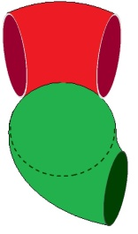
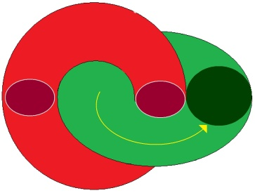

# Leçon 09 | 15 Mars 1977

  <label><input type="checkbox" data-lacan-toggle="original" checked> 原文</label>
  <label><input type="checkbox" data-lacan-toggle="notes" checked> 注释</label>
  <label><input type="checkbox" data-lacan-toggle="commentary" checked> 个人解读评论</label>

<section class="parallel-paragraph" data-paragraph-ids="s24-09-0001">

s24-09-0001

[无对应译文]

原文 · s24-09-0001

Il y a des gens bien intentionnés à mon endroit...

</section>

<section class="parallel-paragraph" data-paragraph-ids="s24-09-0002">

s24-09-0002

[无对应译文]

原文 · s24-09-0002

> et déjà ça soulè­ve une montagne de problèmes :
>
> qu’est-ce qui peut bien faire que des gens soient bien intentionnés à mon endroit ?
>
> C’est qu’ils ne me connaissent pas ! Car, quant à moi, je ne suis pas plein de bonnes inten­tions ...enfin ces bien intentionnés m’ont quelquefois écrit des lettres tendant – enfin, c’était écrit – c’était écrit que mon bafouillage de la dernière fois concernant le discours que j’appelle « *analytique »*, était un lapsus.

</section>

<section class="parallel-paragraph" data-paragraph-ids="s24-09-0003">

s24-09-0003

[无对应译文]

原文 · s24-09-0003

Ils ont écrit ça textuellement.

</section>

<section class="parallel-paragraph" data-paragraph-ids="s24-09-0004">

s24-09-0004

[无对应译文]

原文 · s24-09-0004

Qu’est-ce qui distingue le *lapsus* de l’erreur grossière ?

</section>

<section class="parallel-paragraph" data-paragraph-ids="s24-09-0005">

s24-09-0005

[无对应译文]

原文 · s24-09-0005

J’ai d’autant plus tendance, quant à moi, à classer comme erreur ce qu’on qualifie de *lapsus* que - quand même ! - ce *discours analytique*, j’en avais « *un tant soit peu* » parlé...

</section>

<section class="parallel-paragraph" data-paragraph-ids="s24-09-0006">

s24-09-0006

[无对应译文]

原文 · s24-09-0006

Quand je parle, je m’imagine que je dis quelque chose.

</section>

<section class="parallel-paragraph" data-paragraph-ids="s24-09-0007">

s24-09-0007

[无对应译文]

原文 · s24-09-0007

L’ennuyeux c’est que là où j’ai fait *lapsus*...

</section>

<section class="parallel-paragraph" data-paragraph-ids="s24-09-0008">

s24-09-0008

[无对应译文]

原文 · s24-09-0008

> où je suis censé avoir fait *lapsus* ...c’est en matière, si je puis dire, en matière d’*écrit*, que j’ai fait *lapsus*.

</section>

<section class="parallel-paragraph" data-paragraph-ids="s24-09-0009">

s24-09-0009

[无对应译文]

原文 · s24-09-0009

Ça prend une particulière importance quand il s’agit d’*écrit,* par quelqu’un - moi en l’occasion - par quelqu’un *trouvé*. Autrefois il m’est arrivé de dire, à l’imitation d’ailleurs de quelqu’un qui était un peintre célèbre : « *Je ne cherche pas, je trouve*. » \[Picasso\]

</section>

<section class="parallel-paragraph" data-paragraph-ids="s24-09-0010">

s24-09-0010

[无对应译文]

原文 · s24-09-0010

Au point où j’en suis, je ne trouve pas tant que je ne cherche, autrement dit je tourne en rond.

</section>

<section class="parallel-paragraph" data-paragraph-ids="s24-09-0011">

s24-09-0011

[无对应译文]

原文 · s24-09-0011

Et c’est bien ce qui s’est produit à propos de ce « *lapsus* »: c’est que les lettres écrites n’étaient pas dans leur bon sens \- dans le sens où elles tournent - mais étaient embrouillées.

</section>

<section class="parallel-paragraph" data-paragraph-ids="s24-09-0012">

s24-09-0012

[无对应译文]

原文 · s24-09-0012

Il faut quand même bien dire que je n’ai pas fait ce *lapsus* tout à fait sans raison, je veux dire que l’ordre dans lequel les lettres tournaient, je l’ai certes imaginé, mais je crois tout au moins savoir ce que je voulais dire.

</section>

<section class="parallel-paragraph" data-paragraph-ids="s24-09-0013">

s24-09-0013

[无对应译文]

原文 · s24-09-0013

Je vais essayer aujourd’hui de vous expliquer quoi.

</section>

<section class="parallel-paragraph" data-paragraph-ids="s24-09-0014">

s24-09-0014

[无对应译文]

原文 · s24-09-0014

J’y suis encouragé par l’audition que j’ai reçue hier soir à l’*École freudienne* d’une Mme Kress-Rosen.

</section>

<section class="parallel-paragraph" data-paragraph-ids="s24-09-0015">

s24-09-0015

[无对应译文]

原文 · s24-09-0015

Je ne vais pas lui demander de se lever, encore que je la voie fort bien.

</section>

<section class="parallel-paragraph" data-paragraph-ids="s24-09-0016">

s24-09-0016

[无对应译文]

原文 · s24-09-0016

Je me suis même tout à fait inquiété de savoir si elle était là parmi ce qu’on appelle des auditrices, et je ne vois pas pourquoi je met­trais ce terme au féminin, puisque ça n’a pas de sens, ça n’a pas de sens valable.

</section>

<section class="parallel-paragraph" data-paragraph-ids="s24-09-0017">

s24-09-0017

[无对应译文]

原文 · s24-09-0017

Madame Kress-Rosen a eu la bonté de dire hier soir, presque ce que je voulais dire à une personne...

</section>

<section class="parallel-paragraph" data-paragraph-ids="s24-09-0018">

s24-09-0018

[无对应译文]

原文 · s24-09-0018

> dont il n’est d’ailleurs plus question que je la rencontre,
>
> puisque c’est une personne à qui j’ai demandé de télépho­ner chez moi, et qui ne l’a pas fait ...c’est quelqu’un qui fait partie de la radio allemande, je ne sais pas très bien, je ne sais pas son nom à la véri­té, mais elle m’a demandé - paraît-il sur l’avis de Roman Jakobson - de répondre quelque chose sur ce qui le concerne.

</section>

<section class="parallel-paragraph" data-paragraph-ids="s24-09-0019">

s24-09-0019

[无对应译文]

原文 · s24-09-0019

Mon premier sentiment était de dire que ce que j’appelle « *la linguisterie »* ...

</section>

<section class="parallel-paragraph" data-paragraph-ids="s24-09-0020">

s24-09-0020

[无对应译文]

原文 · s24-09-0020

> Madame Kress-Rosen a fait un sort à cette appellation ...que ce que j’appelle « *la linguisterie »* exige la psychanalyse pour être soutenue.

</section>

<section class="parallel-paragraph" data-paragraph-ids="s24-09-0021">

s24-09-0021

[无对应译文]

原文 · s24-09-0021

J’ajouterai qu’il n’y a pas d’autre linguistique que ce que j’appelle *lin­guisterie,* ce qui ne veut pas dire que la psychanalyse soit toute la linguis­tique.

</section>

<section class="parallel-paragraph" data-paragraph-ids="s24-09-0022">

s24-09-0022

[无对应译文]

原文 · s24-09-0022

L’événement le prouve, c’est à savoir qu’on fait de la linguistique depuis très longtemps...

</section>

<section class="parallel-paragraph" data-paragraph-ids="s24-09-0023">

s24-09-0023

[无对应译文]

原文 · s24-09-0023

depuis le *Cratyle*, depuis Donat, depuis Priscien, ...qu’on en a toujours fait, et ceci d’ailleurs n’arrange rien puisque je tendais à dire la dernière fois...

</section>

<section class="parallel-paragraph" data-paragraph-ids="s24-09-0024">

s24-09-0024

[无对应译文]

原文 · s24-09-0024

> je m’en suis aperçu à propos de ce **S1** et de cet **S2** qui sont séparés
>
> dans la notation correcte de ce que j’ai appelé *discours psychanalytique* ...je pense que malgré tout vous vous êtes un peu infor­més auprès des Belges, et que le fait que j’ai parlé de *la psychanalyse comme* *pouvant être une escroquerie*, est parvenu à vos oreilles, je dirais même que j’y insistais en parlant de ce **S1** qui paraît promettre un **S2**.

</section>

<section class="parallel-paragraph" data-paragraph-ids="s24-09-0025">

s24-09-0025

[无对应译文]

原文 · s24-09-0025

Il faut quand même à ce moment-là se souvenir de ce que j’ai dit concernant le sujet...

</section>

<section class="parallel-paragraph" data-paragraph-ids="s24-09-0026">

s24-09-0026

[无对应译文]

原文 · s24-09-0026

> c’est à savoir le rapport de cet **S1** avec cet **S2** ...j’ai dit, dans son temps : « *qu’un signifiant était ce qui représente le sujet auprès d’un autre signifiant »*.

</section>

<section class="parallel-paragraph" data-paragraph-ids="s24-09-0027">

s24-09-0027

[无对应译文]

原文 · s24-09-0027

Alors quoi en déduire ?

</section>

<section class="parallel-paragraph" data-paragraph-ids="s24-09-0028">

s24-09-0028

[无对应译文]

原文 · s24-09-0028

Je vais quand même un peu vous donner une indication, *ne serait-ce que pour éclairer ma route* parce qu’elle ne va pas de soi.

</section>

<section class="parallel-paragraph" data-paragraph-ids="s24-09-0029">

s24-09-0029

[无对应译文]

原文 · s24-09-0029

La psychanalyse est peut-être une escro­querie, mais ça n’est pas n’importe laquelle.

</section>

<section class="parallel-paragraph" data-paragraph-ids="s24-09-0030">

s24-09-0030

[无对应译文]

原文 · s24-09-0030

C’est une escroquerie qui tombe juste par rapport à ce qu’est le signifiant.

</section>

<section class="parallel-paragraph" data-paragraph-ids="s24-09-0031">

s24-09-0031

[无对应译文]

原文 · s24-09-0031

Et le signifiant, il faut quand même bien remarquer qu’il est quelque chose de bien spécial : il a ce qu’on appelle « *des effets de sens* », et il suffirait que je connote le **S2**, non pas d’être le second dans le temps, mais d’avoir un « *sens double* », pour que le **S1** prenne sa place, et sa place correctement.

</section>

<section class="parallel-paragraph" data-paragraph-ids="s24-09-0032">

s24-09-0032

[无对应译文]

原文 · s24-09-0032

Il faut quand même dire que le poids de cette duplicité de sens est commun à tout signifiant.

</section>

<section class="parallel-paragraph" data-paragraph-ids="s24-09-0033">

s24-09-0033

[无对应译文]

原文 · s24-09-0033

Je pense que Mme Kress-Rosen ne me contredira pas...

</section>

<section class="parallel-paragraph" data-paragraph-ids="s24-09-0034">

s24-09-0034

[无对应译文]

原文 · s24-09-0034

> si elle veut s’y opposer d’une façon quelconque,
>
> elle est tout à fait libre de me faire signe puisque, je le répète, je me félicite qu’elle soit là ...la psychanalyse n’est pas - je dirai - plus une escroquerie que la poésie elle-même, et la poésie se fonde précisément sur cette ambiguïté dont je parle et que je qualifie du « *sens double* ».

</section>

<section class="parallel-paragraph" data-paragraph-ids="s24-09-0035">

s24-09-0035

[无对应译文]

原文 · s24-09-0035

La poésie me paraît quand même relever de la relation du signifiant au signifié.

</section>

<section class="parallel-paragraph" data-paragraph-ids="s24-09-0036">

s24-09-0036

[无对应译文]

原文 · s24-09-0036

On peut dire d’une certaine façon que la poésie est *imaginairement symbolique.*

</section>

<section class="parallel-paragraph" data-paragraph-ids="s24-09-0037">

s24-09-0037

[无对应译文]

原文 · s24-09-0037

Je veux dire que, puisque Mme Kress-Rosen hier a évoqué Saussure et sa distinction de *la langue* et de *la parole*, non d’ailleurs sans noter que quant à cette dis­tinction, Saussure avait flotté.

</section>

<section class="parallel-paragraph" data-paragraph-ids="s24-09-0038">

s24-09-0038

[无对应译文]

原文 · s24-09-0038

Il reste quand même que son départ...

</section>

<section class="parallel-paragraph" data-paragraph-ids="s24-09-0039">

s24-09-0039

[无对应译文]

原文 · s24-09-0039

> à savoir que la langue est le fruit d’une maturation,
>
> d’un mûrissement de quelque chose qui se cristallise dans l’usage ...il reste que *la poésie relève d’une violence* faite à cet usage et que - nous en avons des preuves - si j’ai évoqué la dernière fois Dante et *la poésie amoureuse*, c’est bien *pour marquer cette violence que la philosophie fait tout pour effacer*.

</section>

<section class="parallel-paragraph" data-paragraph-ids="s24-09-0040">

s24-09-0040

[无对应译文]

原文 · s24-09-0040

C’est bien en quoi la philosophie est le champ d’essai de l’escroquerie et en quoi on ne peut pas dire que la poésie n’y joue pas, à sa façon, inno­cemment, ce que j’ai appelé à l’instant, ce que j’ai connoté de l’*imaginairement symbolique,* ça s’appelle *la Vérité*.

</section>

<section class="parallel-paragraph" data-paragraph-ids="s24-09-0041">

s24-09-0041

[无对应译文]

原文 · s24-09-0041

Ça s’appelle *la Vérité* notamment concernant *le rapport sexuel*, c’est à savoir que, comme je le dis...

</section>

<section class="parallel-paragraph" data-paragraph-ids="s24-09-0042">

s24-09-0042

[无对应译文]

原文 · s24-09-0042

> peut-être le premier, et je ne vois pas pourquoi je m’en ferai un titre ...*le rapport sexuel *: *il n’y en a pas*, je veux dire à proprement parler, au sens où il y aurait quelque chose qui ferait qu’un homme reconnaîtrait forcément une femme.

</section>

<section class="parallel-paragraph" data-paragraph-ids="s24-09-0043">

s24-09-0043

[无对应译文]

原文 · s24-09-0043

C’est certain que moi, j’ai cette faiblesse de la reconnaître « *la *», mais je suis quand même assez averti pour avoir fait remarquer qu’il n’y a pas de « *la *», ce qui coïncide avec mon expérience, à savoir que je ne reconnais *pas toutes les femmes*.

</section>

<section class="parallel-paragraph" data-paragraph-ids="s24-09-0044">

s24-09-0044

[无对应译文]

原文 · s24-09-0044

*Il n’y en a pas*...

</section>

<section class="parallel-paragraph" data-paragraph-ids="s24-09-0045">

s24-09-0045

[无对应译文]

原文 · s24-09-0045

> mais il faut tout de même bien dire que ça ne va pas de soi

</section>

<section class="parallel-paragraph" data-paragraph-ids="s24-09-0046">

s24-09-0046

[无对应译文]

原文 · s24-09-0046

...*Il n’y en a pas*, sauf incestueux...

</section>

<section class="parallel-paragraph" data-paragraph-ids="s24-09-0047">

s24-09-0047

[无对应译文]

原文 · s24-09-0047

> c’est très exac­tement ce qu’a avancé Freud

</section>

<section class="parallel-paragraph" data-paragraph-ids="s24-09-0048">

s24-09-0048

[无对应译文]

原文 · s24-09-0048

...*Il n’y en a pas* sauf incestueux ou meurtrier, je veux dire que ce que Freud a dit, c’est que le mythe d’Œdipe désigne ceci : que la seule personne avec laquelle on ait envie de coucher, c’est sa mère, et que pour le père, on le tue.

</section>

<section class="parallel-paragraph" data-paragraph-ids="s24-09-0049">

s24-09-0049

[无对应译文]

原文 · s24-09-0049

C’est même d’autant plus probable qu’on ne sait ni qui sont votre père et votre mère, c’est exactement comme ça que le mythe d’Œdipe a un sens :

</section>

<section class="parallel-paragraph" data-paragraph-ids="s24-09-0050">

s24-09-0050

[无对应译文]

原文 · s24-09-0050

- il a tué quelqu’un qu’il ne connais­sait pas,

</section>

<section class="parallel-paragraph" data-paragraph-ids="s24-09-0051">

s24-09-0051

[无对应译文]

原文 · s24-09-0051

- et il a couché avec quelqu’un dont il n’avait aucune idée que c’était sa mère.

</section>

<section class="parallel-paragraph" data-paragraph-ids="s24-09-0052">

s24-09-0052

[无对应译文]

原文 · s24-09-0052

C’est néanmoins comme ça que les choses se sont passées selon le mythe, et ce que ça veut dire, c’est qu’en somme il n’y a de vrai que *la castration*.

</section>

<section class="parallel-paragraph" data-paragraph-ids="s24-09-0053">

s24-09-0053

[无对应译文]

原文 · s24-09-0053

En tout cas avec *la castration*, on est bien sûr d’y échapper, comme toute cette dite *mythologie grecque* nous le désigne bien, c’est à savoir que le père, c’est pas tellement du meurtre qu’il s’agit que de sa castration, que *la castration passe par le meurtre* et que, quant à la mère, le mieux qu’on ait à en faire, c’est de se le couper pour être bien sûr de ne pas commettre *l’inceste*.

</section>

<section class="parallel-paragraph" data-paragraph-ids="s24-09-0054">

s24-09-0054

[无对应译文]

原文 · s24-09-0054

Ce que je voudrais, c’est vous donner la réfraction de ces vérités dans le sens.

</section>

<section class="parallel-paragraph" data-paragraph-ids="s24-09-0055">

s24-09-0055

[无对应译文]

原文 · s24-09-0055

Il faudrait arriver à donner une idée d’une structure, qui soit telle que ça incarnerait le sens d’une façon correcte.

</section>

<section class="parallel-paragraph" data-paragraph-ids="s24-09-0056">

s24-09-0056

[无对应译文]

原文 · s24-09-0056

Contrairement à ce qu’on dit, *il n’y a pas de vérité sur le Réel, puisque le Réel se dessine comme excluant le sens.*

</section>

<section class="parallel-paragraph" data-paragraph-ids="s24-09-0057">

s24-09-0057

[无对应译文]

原文 · s24-09-0057

Ça serait encore trop dire qu’il y a du *Réel,* parce que dire ceci c’est quand même supposer un sens.

</section>

<section class="parallel-paragraph" data-paragraph-ids="s24-09-0058">

s24-09-0058

[无对应译文]

原文 · s24-09-0058

Le mot *Réel* a lui-même un sens, j’ai même, dans son temps, un petit peu joué là-dessus, je veux dire que pour invoquer les choses, j’ai évoqué en écho le mot *reus* qui en latin veut dire *coupable* : on est plus ou moins coupable du *Réel*. C’est bien en quoi d’ailleurs la psychanalyse est une chose sérieuse, je veux dire que c’est pas absurde de dire qu’elle peut glisser dans l’escroquerie.

</section>

<section class="parallel-paragraph" data-paragraph-ids="s24-09-0059">

s24-09-0059

[无对应译文]

原文 · s24-09-0059

Il y a une chose qu’il faut noter au passage, c’est que comme je l’ai fait remarquer la dernière fois à Pierre Soury...

</section>

<section class="parallel-paragraph" data-paragraph-ids="s24-09-0060">

s24-09-0060

[无对应译文]

原文 · s24-09-0060

> *la dernière fois*, je veux dire dans son local même, à Jussieu, celui dont je vous ai parlé la dernière fois ...je lui ai fait remarquer que le tore retournable dont il fait l’approche du nœud borroméen, est quelque chose qui, pour le nœud en question, suppose qu’un seul tore est retourné.

</section>

<section class="parallel-paragraph" data-paragraph-ids="s24-09-0061">

s24-09-0061

[无对应译文]

原文 · s24-09-0061

Non pas, bien sûr, qu’on ne puis­se en retourner d’autres, mais alors ce n’est plus un nœud borroméen.

</section>

<section class="parallel-paragraph" data-paragraph-ids="s24-09-0062">

s24-09-0062

[无对应译文]

原文 · s24-09-0062

Je vous ai donné une idée de ça par un petit dessin la dernière fois.

</section>

<section class="parallel-paragraph" data-paragraph-ids="s24-09-0063">

s24-09-0063

[无对应译文]

原文 · s24-09-0063

Il n’est donc pas surprenant d’énoncer à propos de ce tore...

</section>

<section class="parallel-paragraph" data-paragraph-ids="s24-09-0064">

s24-09-0064

[无对应译文]

原文 · s24-09-0064

> de ce tore qui part d’un nœud borroméen triple ...de ce tore - si vous le retournez - de qualifier ce qui est *dans le tore* - dans le tore du Symbolique - de *symboli­quement réel.*

</section>

<section class="parallel-paragraph" data-paragraph-ids="s24-09-0065">

s24-09-0065

[无对应译文]

原文 · s24-09-0065

Le *symboliquement réel* n’est pas le *réellement symbo­lique,* car le *réellement symbolique* c’est *le Symbolique* inclus dans le *Réel*.

</section>

<section class="parallel-paragraph" data-paragraph-ids="s24-09-0066">

s24-09-0066

[无对应译文]

原文 · s24-09-0066

Le *Symbolique* inclus dans le *Réel* a bel et bien un nom, ça s’ap­pelle le *mensonge*.

</section>

<section class="parallel-paragraph" data-paragraph-ids="s24-09-0067">

s24-09-0067

[无对应译文]

原文 · s24-09-0067

Au lieu que le *symboliquement réel* ...

</section>

<section class="parallel-paragraph" data-paragraph-ids="s24-09-0068">

s24-09-0068

[无对应译文]

原文 · s24-09-0068

> je veux dire ce qui du *Réel* se connote à l’intérieur du *Symbolique* ...c’est ce qu’on appelle l’*angoisse*.

</section>

<section class="parallel-paragraph" data-paragraph-ids="s24-09-0069">

s24-09-0069

[无对应译文]

原文 · s24-09-0069

*Le sinthome est réel*, c’est même la seule chose vrai­ment *réelle* - c’est-à-dire qui ait *un sens* - qui conserve un sens dans le *Réel*. C’est bien pour ça que le psychanalyste peut, s’il a de la chance, intervenir symboliquement pour *le dissoudre dans le* *Réel*.

</section>

<section class="parallel-paragraph" data-paragraph-ids="s24-09-0070">

s24-09-0070

[无对应译文]

原文 · s24-09-0070

Alors je vais quand même vous noter en passant ce qui est *symboli­quement imaginaire *: eh bien, c’est la *géométrie*...

</section>

<section class="parallel-paragraph" data-paragraph-ids="s24-09-0071">

s24-09-0071

[无对应译文]

原文 · s24-09-0071

> le fameux *mos geome­tricus* dont on a fait tant état ...c’est la *géométrie des anges*, c’est-à-dire quelque chose qui malgré l’Écriture n’existe pas.

</section>

<section class="parallel-paragraph" data-paragraph-ids="s24-09-0072">

s24-09-0072

[无对应译文]

原文 · s24-09-0072

J’ai autrefois beaucoup taquiné le Révérend Père Teilhard de Chardin, en lui faisant remarquer que s’il tenait tellement à l’Écriture, il fallait qu’il reconnaisse que les anges, ça existait.

</section>

<section class="parallel-paragraph" data-paragraph-ids="s24-09-0073">

s24-09-0073

[无对应译文]

原文 · s24-09-0073

Paradoxalement le Révérend Père Teilhard de Chardin n’y croyait pas, il croyait en l’homme, d’où son histoire d’« *hominisation* » de la planète.

</section>

<section class="parallel-paragraph" data-paragraph-ids="s24-09-0074">

s24-09-0074

[无对应译文]

原文 · s24-09-0074

Je vois pas pourquoi on croirait plus à l’*hominisation* de quoi que ce soit, qu’à *la géométrie*.

</section>

<section class="parallel-paragraph" data-paragraph-ids="s24-09-0075">

s24-09-0075

[无对应译文]

原文 · s24-09-0075

La géométrie concerne expressément les anges, et pour le reste, c’est-à-dire pour *la structure*, ne règne qu’une chose, c’est ce que j’appelle l’*inhibition*.

</section>

<section class="parallel-paragraph" data-paragraph-ids="s24-09-0076">

s24-09-0076

[无对应译文]

原文 · s24-09-0076

C’est une *inhibition* à laquelle je m’attaque, je veux dire que je me soucie, je me fais un tracas pour tout ce que je vous apporte ici comme *structure*, un tracas qui est seule­ment lié au fait que la *géométrie* véritable n’est pas celle que l’on croit, celle qui relève de purs esprits, que celle qui a un corps, c’est ça que nous voulons dire quand nous parlions de *structure*.

</section>

<section class="parallel-paragraph" data-paragraph-ids="s24-09-0077">

s24-09-0077

[无对应译文]

原文 · s24-09-0077

Et pour commencer à vous mettre ça noir sur blanc, je vais vous montrer de quoi il s’agit quand on parle de *structure*. Il s’agit de quelque chose comme ça :

</section>

<section class="parallel-paragraph" data-paragraph-ids="s24-09-0078">

s24-09-0078

[无对应译文]

原文 · s24-09-0078

</section>

<section class="parallel-paragraph" data-paragraph-ids="s24-09-0079">

s24-09-0079

[无对应译文]

原文 · s24-09-0079

C’est à savoir d’un tore troué - ça, je le dois à Pierre Soury - je veux dire que c’est facile de le complé­ter ce tore.

</section>

<section class="parallel-paragraph" data-paragraph-ids="s24-09-0080">

s24-09-0080

[无对应译文]

原文 · s24-09-0080

Vous voyez bien qu’ici c’est, si on peut dire, le bord - si on peut s’exprimer ainsi, aussi improprement - le bord du trou qui est dans le tore et que tout ça c’est le corps du tore.

</section>

<section class="parallel-paragraph" data-paragraph-ids="s24-09-0081">

s24-09-0081

[无对应译文]

原文 · s24-09-0081

</section>

<section class="parallel-paragraph" data-paragraph-ids="s24-09-0082">

s24-09-0082

[无对应译文]

原文 · s24-09-0082

Ce tore, il ne suffit pas de le dessiner ainsi.

</section>

<section class="parallel-paragraph" data-paragraph-ids="s24-09-0083">

s24-09-0083

[无对应译文]

原文 · s24-09-0083

Car on s’aperçoit qu’à le trouer ce tore, on fait en même temps un trou dans un autre tore.

</section>

<section class="parallel-paragraph" data-paragraph-ids="s24-09-0084">

s24-09-0084

[无对应译文]

原文 · s24-09-0084

C’est le propre du tore, car il est tout aussi légitime de dessiner ici le trou et de faire un tore qui soit, si je puis dire, *enchaîné* avec celui-là.

</section>

<section class="parallel-paragraph" data-paragraph-ids="s24-09-0085">

s24-09-0085

[无对应译文]

原文 · s24-09-0085

C’est bien en quoi on peut dire qu’à trouer un tore, on troue en même temps un autre tore qui est celui qui a avec lui un rapport de *chaîne*.

</section>

<section class="parallel-paragraph" data-paragraph-ids="s24-09-0086">

s24-09-0086

[无对应译文]

原文 · s24-09-0086

Alors je vais essayer de vous figurer ce qu’on peut ici dessiner d’*une structure* dont vous voyez qu’à le dessiner en 2 *couleurs*, je pense qu’il est suffisamment évident que ceci, à savoir le vert en question, est à l’intérieur du tore rouge, mais que par contre ici vous pouvez voir que le second tore est à l’extérieur.

</section>

<section class="parallel-paragraph" data-paragraph-ids="s24-09-0087">

s24-09-0087

[无对应译文]

原文 · s24-09-0087

Mais ça n’est pas un second tore, puisque ce dont il s’agit, c’est toujours de la même figure, mais une figure qui se démontre pouvoir glisser à l’intérieur de ce que j’appellerai le tore rouge, qui glisse en tournant et qui réalise ce tore en chaîne avec le premier.

</section>

<section class="parallel-paragraph" data-paragraph-ids="s24-09-0088">

s24-09-0088

[无对应译文]

原文 · s24-09-0088

Ce vert, qui se trouve être à la surface, extérieur au tore rouge, si nous le faisons tourner, il va se trouver ici représenté par sa propre glissade, et ce que nous pouvons dire de l’un et de l’autre, c’est que ce tore vert est très précisément ce qui représente ce que nous pourrions appeler *le complémentaire* de l’autre tore, c’est-à­-dire le tore enchaîné.

</section>

<section class="parallel-paragraph" data-paragraph-ids="s24-09-0089">

s24-09-0089

[无对应译文]

原文 · s24-09-0089

Mais supposez que ce soit le tore rouge que nous fassions glisser ainsi.

</section>

<section class="parallel-paragraph" data-paragraph-ids="s24-09-0090">

s24-09-0090

[无对应译文]

原文 · s24-09-0090

Ce que nous obtenons, c’est ceci, c’est quelque chose, qui va se trouver inversement réaliser que quelque chose qui est *vide* se noue à quelque chose qui est *vide*, c’est à savoir que ce qui est là, va apparaître là.

</section>

<section class="parallel-paragraph" data-paragraph-ids="s24-09-0091">

s24-09-0091

[无对应译文]

原文 · s24-09-0091

Autrement dit ce que je suppose par cette manipulation, c’est que, loin que nous ayons deux choses *concentriques*, nous aurons au contraire deux choses qui *jouent* l’une sur l’autre.

</section>

<section class="parallel-paragraph" data-paragraph-ids="s24-09-0092">

s24-09-0092

[无对应译文]

原文 · s24-09-0092

Et ce que je veux désigner par là, c’est quelque chose sur quoi on m’a interrogé quand j’ai parlé de *Parole pleine* et de *parole vide.* Je l’éclaire maintenant :

</section>

<section class="parallel-paragraph" data-paragraph-ids="s24-09-0093">

s24-09-0093

[无对应译文]

原文 · s24-09-0093

- la *parole pleine*, c’est une parole pleine de *sens*.

</section>

<section class="parallel-paragraph" data-paragraph-ids="s24-09-0094">

s24-09-0094

[无对应译文]

原文 · s24-09-0094

- la *parole vide*, c’est une qui n’a que de la *signification*.

</section>

<section class="parallel-paragraph" data-paragraph-ids="s24-09-0095">

s24-09-0095

[无对应译文]

原文 · s24-09-0095

J’espère que Mme Kress-Rosen - dont je vois toujours le sourire futé - ne voit pas à ça un trop grand inconvénient.

</section>

<section class="parallel-paragraph" data-paragraph-ids="s24-09-0096">

s24-09-0096

[无对应译文]

原文 · s24-09-0096

Je veux dire par là qu’une parole peut être à la fois pleine de sens, elle est pleine de sens parce qu’elle part de cette duplicité ici dessinée, c’est parce que le mot a « *double* *sens* », qu’il est **S2**, que le mot *sens* est plein lui-même.

</section>

<section class="parallel-paragraph" data-paragraph-ids="s24-09-0097">

s24-09-0097

[无对应译文]

原文 · s24-09-0097

Quand j’ai parlé de *Vérité,* c’est au *sens* que je me réfère, mais le propre de la poésie quand elle rate, c’est justement de n’avoir qu’une signification, d’être pur nœud d’un mot avec un autre mot.

</section>

<section class="parallel-paragraph" data-paragraph-ids="s24-09-0098">

s24-09-0098

[无对应译文]

原文 · s24-09-0098

Il n’en reste pas moins que la volonté de sens consiste à éliminer le double sens, ce qui ne se conçoit qu’à réaliser, si je puis dire, une coupure, c’est-à-dire à faire qu’il n’y ait qu’un sens, le vert recouvrant le rouge dans l’occasion.

</section>

<section class="parallel-paragraph" data-paragraph-ids="s24-09-0099">

s24-09-0099

[无对应译文]

原文 · s24-09-0099

Comment le poète peut-il réaliser ce tour de force de faire qu’un sens soit absent ?

</section>

<section class="parallel-paragraph" data-paragraph-ids="s24-09-0100">

s24-09-0100

[无对应译文]

原文 · s24-09-0100

C’est, bien entendu, en le remplaçant, ce sens absent, par ce que j’ai appelé la signification.

</section>

<section class="parallel-paragraph" data-paragraph-ids="s24-09-0101">

s24-09-0101

[无对应译文]

原文 · s24-09-0101

La signification n’est pas du tout ce qu’un vain peuple croit, si je puis dire.

</section>

<section class="parallel-paragraph" data-paragraph-ids="s24-09-0102">

s24-09-0102

[无对应译文]

原文 · s24-09-0102

La signification, c’est un mot vide, autrement dit c’est ce qui, à propos de Dante, s’exprime dans *le qualificatif* mis sur sa poésie, à savoir qu’elle soit amoureuse.

</section>

<section class="parallel-paragraph" data-paragraph-ids="s24-09-0103">

s24-09-0103

[无对应译文]

原文 · s24-09-0103

L’amour n’est rien qu’une signification, c’est-à-dire qu’il est vide, et on voit bien la façon dont Dante l’incarne, cette signification.

</section>

<section class="parallel-paragraph" data-paragraph-ids="s24-09-0104">

s24-09-0104

[无对应译文]

原文 · s24-09-0104

Le désir a un sens, mais l’amour tel que j’en ai déjà fait état dans mon séminaire sur *L’éthique*, tel que l’amour courtois le supporte, ça n’est qu’une signification.

</section>

<section class="parallel-paragraph" data-paragraph-ids="s24-09-0105">

s24-09-0105

[无对应译文]

原文 · s24-09-0105

Je me contenterai de vous dire ce que je vous ai dit aujourd’hui, puisque aussi bien je ne vois pas pourquoi j’insisterai.

</section>

