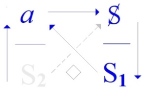

# Leçon 11 | 10 Mai 1977

  

    <label><input type="checkbox" data-lacan-toggle="original" checked> 原文</label>
    <label><input type="checkbox" data-lacan-toggle="notes" checked> 注释</label>
    <label><input type="checkbox" data-lacan-toggle="commentary" checked> 个人解读评论</label>
  

  <form class="lacan-tool-search" role="search">
    <input class="lacan-tool-search-input" type="search" placeholder="搜索全文" aria-label="搜索全文">
    <button class="lacan-tool-button" type="submit" title="搜索">搜索</button>
  </form>
  <button class="lacan-tool-button lacan-back-to-top" type="button" title="回到页面最上方" aria-label="回到页面最上方">↑</button>

<section class="parallel-paragraph" data-paragraph-ids="s24-11-0001">

s24-11-0001

原文 · s24-11-0001

Je me casse la tête, ce qui est déjà embêtant, parce que je me la casse sérieusement, mais le plus *embêtant* c’est que je ne sais pas sur quoi je me casse la tête.

[无对应译文]

</section>

<section class="parallel-paragraph" data-paragraph-ids="s24-11-0002">

s24-11-0002

原文 · s24-11-0002

Il y a quelqu’un qui - un nommé Gödel \[1906-78\] - qui vit en Amérique et qui a énoncé le nom d’« *indécidable* ».

[无对应译文]

</section>

<section class="parallel-paragraph" data-paragraph-ids="s24-11-0003">

s24-11-0003

原文 · s24-11-0003

Ce qu’il y a de solide dans cet énoncé, c’est qu’il démontre qu’il y a de l’*indécidable*.

[无对应译文]

</section>

<section class="parallel-paragraph" data-paragraph-ids="s24-11-0004">

s24-11-0004

原文 · s24-11-0004

Et il le démontre sur quel terrain ?

[无对应译文]

</section>

<section class="parallel-paragraph" data-paragraph-ids="s24-11-0005">

s24-11-0005

原文 · s24-11-0005

Sur quelque chose que je qualifierai, comme ça, du plus mental de tous les mentaux...

[无对应译文]

</section>

<section class="parallel-paragraph" data-paragraph-ids="s24-11-0006">

s24-11-0006

原文 · s24-11-0006

> je veux dire de tout ce qu’il y a de plus mental, le mental par excellence, la pointe du mental ...à savoir ce qui se comp­te : *ce qui se compte c’est l’arithmétique*. Je veux dire que *c’est l’arithmétique qui développe le comptable*.

[无对应译文]

</section>

<section class="parallel-paragraph" data-paragraph-ids="s24-11-0007">

s24-11-0007

原文 · s24-11-0007

La question est de savoir s’il y a des *Un* qui sont indénombrables, c’est tout au moins ce qu’a promu Cantor.

[无对应译文]

</section>

<section class="parallel-paragraph" data-paragraph-ids="s24-11-0008">

s24-11-0008

原文 · s24-11-0008

Mais ça reste quand même douteux, étant donné que *nous ne connaissons rien que de* *fini*, *et que le fini c’est toujours dénombré*.

[无对应译文]

</section>

<section class="parallel-paragraph" data-paragraph-ids="s24-11-0009">

s24-11-0009

原文 · s24-11-0009

Est-ce que c’est dire *la faiblesse du mental* ?

[无对应译文]

</section>

<section class="parallel-paragraph" data-paragraph-ids="s24-11-0010">

s24-11-0010

原文 · s24-11-0010

C’est simplement *la faiblesse de* ce que j’appelle *l’Imaginaire*.

[无对应译文]

</section>

<section class="parallel-paragraph" data-paragraph-ids="s24-11-0011">

s24-11-0011

原文 · s24-11-0011

L’inconscient a été identifié par Freud - on ne sait pourquoi - l’inconscient a été identifié par Freud au mental.

[无对应译文]

</section>

<section class="parallel-paragraph" data-paragraph-ids="s24-11-0012">

s24-11-0012

原文 · s24-11-0012

C’est tout au moins ce qui résulte du fait que le mental est tissé de mots, entre quoi...

[无对应译文]

</section>

<section class="parallel-paragraph" data-paragraph-ids="s24-11-0013">

s24-11-0013

原文 · s24-11-0013

> c’est expressément - me semble-t-il - la définition qu’en donne Freud ...entre quoi il y a des « *bévues »* toujours possibles. D’où mon énoncé, que de *Réel* il n’y a que *l’impossible*.

[无对应译文]

</section>

<section class="parallel-paragraph" data-paragraph-ids="s24-11-0014">

s24-11-0014

原文 · s24-11-0014

C’est bien là que j’achoppe : le *Réel* est-il impossible à penser ?

[无对应译文]

</section>

<section class="parallel-paragraph" data-paragraph-ids="s24-11-0015">

s24-11-0015

原文 · s24-11-0015

*S’il ne cesse pas*...

[无对应译文]

</section>

<section class="parallel-paragraph" data-paragraph-ids="s24-11-0016">

s24-11-0016

原文 · s24-11-0016

mais il y a là une nuance : je n’énonce pas *qu’il ne cesse pas de ne pas se dire*, ne serait-ce que parce que le *Réel* je le nomme comme tel, mais je dis : ...*qu’il ne cesse pas de ne pas s’écrire*.

[无对应译文]

</section>

<section class="parallel-paragraph" data-paragraph-ids="s24-11-0017">

s24-11-0017

原文 · s24-11-0017

Tout ce qui est mental, en fin de compte, est ce que j’écris du nom de « *sinthome* »(*s.i.n.t.h.o.m.e.*) c’est-à-dire *signe*.

[无对应译文]

</section>

<section class="parallel-paragraph" data-paragraph-ids="s24-11-0018">

s24-11-0018

原文 · s24-11-0018

Qu’est-ce que veut dire être *signe* ?

[无对应译文]

</section>

<section class="parallel-paragraph" data-paragraph-ids="s24-11-0019">

s24-11-0019

原文 · s24-11-0019

C’est là-dessus que je me casse la tête.

[无对应译文]

</section>

<section class="parallel-paragraph" data-paragraph-ids="s24-11-0020">

s24-11-0020

原文 · s24-11-0020

Est-ce qu’on peut dire que la négation soit un signe ?

[无对应译文]

</section>

<section class="parallel-paragraph" data-paragraph-ids="s24-11-0021">

s24-11-0021

原文 · s24-11-0021

J’ai autrefois essayé de poser ce qu’il en est de *L’instance de la lettre*.

[无对应译文]

</section>

<section class="parallel-paragraph" data-paragraph-ids="s24-11-0022">

s24-11-0022

原文 · s24-11-0022

Est-ce que c’est tout dire que de dire que le signe de la négation, qui s’écrit comme ça : ┐, n’a pas à être écrit ?

[无对应译文]

</section>

<section class="parallel-paragraph" data-paragraph-ids="s24-11-0023">

s24-11-0023

原文 · s24-11-0023

Qu’est-ce que nier ? Qu’est-ce qu’on peut nier ?

[无对应译文]

</section>

<section class="parallel-paragraph" data-paragraph-ids="s24-11-0024">

s24-11-0024

原文 · s24-11-0024

Ceci nous met dans le bain de la *Verneinung* dont Freud a promu l’essentiel.

[无对应译文]

</section>

<section class="parallel-paragraph" data-paragraph-ids="s24-11-0025">

s24-11-0025

原文 · s24-11-0025

Ce qu’il énonce, c’est que la négation suppose une *Bejahung *: c’est à partir de quelque chose qui s’énonce comme positif qu’on écrit la négation.

[无对应译文]

</section>

<section class="parallel-paragraph" data-paragraph-ids="s24-11-0026">

s24-11-0026

原文 · s24-11-0026

En d’autres termes, le signe est à rechercher...

[无对应译文]

</section>

<section class="parallel-paragraph" data-paragraph-ids="s24-11-0027">

s24-11-0027

原文 · s24-11-0027

> et c’est bien ce que, dans cette *instance de la lettre*, j’ai posé ...est à rechercher comme *congruence du signe au Réel*.

[无对应译文]

</section>

<section class="parallel-paragraph" data-paragraph-ids="s24-11-0028">

s24-11-0028

原文 · s24-11-0028

Qu’est-ce qu’un signe qu’on ne pourrait écrire ?

[无对应译文]

</section>

<section class="parallel-paragraph" data-paragraph-ids="s24-11-0029">

s24-11-0029

原文 · s24-11-0029

Car ce signe, on l’écrit réellement.

[无对应译文]

</section>

<section class="parallel-paragraph" data-paragraph-ids="s24-11-0030">

s24-11-0030

原文 · s24-11-0030

J’ai mis en valeur comme ça, un temps, la pertinence de ce que *lalangue –* française - touche comme adverbe.

[无对应译文]

</section>

<section class="parallel-paragraph" data-paragraph-ids="s24-11-0031">

s24-11-0031

原文 · s24-11-0031

Est-ce qu’on peut dire que le *Réel* ment ?

[无对应译文]

</section>

<section class="parallel-paragraph" data-paragraph-ids="s24-11-0032">

s24-11-0032

原文 · s24-11-0032

Dans l’analyse, on peut sûrement dire que le *Vrai* mente.

[无对应译文]

</section>

<section class="parallel-paragraph" data-paragraph-ids="s24-11-0033">

s24-11-0033

原文 · s24-11-0033

L’analyse est un long cheminement - on le retrouve partout - que le *chemine-ne-mente,* c’est quelque chose qui ne peut à l’occasion que nous signaler que - comme dans le fil du téléphone - nous nous prenons les pieds.

[无对应译文]

</section>

<section class="parallel-paragraph" data-paragraph-ids="s24-11-0034">

s24-11-0034

原文 · s24-11-0034

Et alors, qu’on puisse avancer des choses pareilles pose la question de ce que c’est que le sens.

[无对应译文]

</section>

<section class="parallel-paragraph" data-paragraph-ids="s24-11-0035">

s24-11-0035

原文 · s24-11-0035

N’y aurait-il de *sens* que menteur, puisque la notion de *Réel*, on peut en dire qu’elle *exclue*...

[无对应译文]

</section>

<section class="parallel-paragraph" data-paragraph-ids="s24-11-0036">

s24-11-0036

原文 · s24-11-0036

> qu’il faut écrire au *subjonctif* ...qu’elle *exclue* le sens ? Est-ce que ça indique qu’elle *exclue* aussi le *mensonge* ?

[无对应译文]

</section>

<section class="parallel-paragraph" data-paragraph-ids="s24-11-0037">

s24-11-0037

原文 · s24-11-0037

C’est bien ce à quoi nous avons affaire quand nous parions en somme sur le fait que le *Réel* exclue...

[无对应译文]

</section>

<section class="parallel-paragraph" data-paragraph-ids="s24-11-0038">

s24-11-0038

原文 · s24-11-0038

> au subjonctif, mais *le subjonctif est l’indication du modal* ...qu’est-ce qui se module dans ce modal qui exclurait le mensonge ?

[无对应译文]

</section>

<section class="parallel-paragraph" data-paragraph-ids="s24-11-0039">

s24-11-0039

原文 · s24-11-0039

À la vérité, il n’y a - nous le sentons bien - dans tout cela que paradoxes. Les paradoxes sont-ils représentables ?

[无对应译文]

</section>

<section class="parallel-paragraph" data-paragraph-ids="s24-11-0040">

s24-11-0040

原文 · s24-11-0040

Δόξα \[doxa\] c’est l’opinion, la première chose sur quoi j’ai introduit une conférence, au temps de ce qu’on appelle ou de ce qu’on pourrait appeler « mes débuts », c’est sur le *Menon* où on énonce que la δόξα \[doxa\], c’est l’opinion vraie.

[无对应译文]

</section>

<section class="parallel-paragraph" data-paragraph-ids="s24-11-0041">

s24-11-0041

原文 · s24-11-0041

Il n’y a pas la moindre *opinion vraie*, puisqu’il y a des paradoxes.

[无对应译文]

</section>

<section class="parallel-paragraph" data-paragraph-ids="s24-11-0042">

s24-11-0042

原文 · s24-11-0042

C’est la question que je soulève : que les paradoxes soient ou non représentables, je veux dire *dessinables*.

[无对应译文]

</section>

<section class="parallel-paragraph" data-paragraph-ids="s24-11-0043">

s24-11-0043

原文 · s24-11-0043

Le principe du dire vrai, c’est la négation.

[无对应译文]

</section>

<section class="parallel-paragraph" data-paragraph-ids="s24-11-0044">

s24-11-0044

原文 · s24-11-0044

Et ma pratique - puisque pratique il y a, pratique sur quoi je m’interroge - c’est que je me glisse, j’ai à me glisser...

[无对应译文]

</section>

<section class="parallel-paragraph" data-paragraph-ids="s24-11-0045">

s24-11-0045

原文 · s24-11-0045

> parce que c’est comme ça que c’est foutu ...j’ai à me glisser entre *le transfert* qu’on appelle - je ne sais pourquoi - *négatif*, mais c’est un fait qu’on l’appelle comme ça, on l’appelle *négatif* parce qu’on sent bien qu’il y a *quelque chose*... On ne sait toujours pas ce que c’est que *le transfert positif*, le transfert positif c’est ce que j’ai essayé de définir sous le nom du *sujet supposé savoir.*

[无对应译文]

</section>

<section class="parallel-paragraph" data-paragraph-ids="s24-11-0046">

s24-11-0046

原文 · s24-11-0046

Qu’est-ce qui est *supposé savoir* ? C’est l’analyste.

[无对应译文]

</section>

<section class="parallel-paragraph" data-paragraph-ids="s24-11-0047">

s24-11-0047

原文 · s24-11-0047

C’est une *attribution*, comme déjà l’indique le mot de *supposé.*

[无对应译文]

</section>

<section class="parallel-paragraph" data-paragraph-ids="s24-11-0048">

s24-11-0048

原文 · s24-11-0048

Une attribution, ce n’est qu’un mot : il y a un sujet, quelque chose qui est *dessous*, qui est *supposé savoir*.

[无对应译文]

</section>

<section class="parallel-paragraph" data-paragraph-ids="s24-11-0049">

s24-11-0049

原文 · s24-11-0049

Savoir est donc *son attri­but*. Il n’y a qu’une seule chose, c’est qu’il est impossible de donner l’attribut du savoir *à quiconque*.

[无对应译文]

</section>

<section class="parallel-paragraph" data-paragraph-ids="s24-11-0050">

s24-11-0050

原文 · s24-11-0050

Celui qui sait c’est - dans l’analyse - l’analysant, ce qu’il déroule, ce qu’il développe, c’est ce qu’il sait, à ceci près que c’est un Autre - *mais y a-t-il un Autre ?* - que c’est un Autre qui suit ce qu’il a à dire, à savoir ce qu’il sait.

[无对应译文]

</section>

<section class="parallel-paragraph" data-paragraph-ids="s24-11-0051">

s24-11-0051

原文 · s24-11-0051

Cette *notion d’Autre*, je l’ai *marquée* dans un certain graphe *d’une barre qui le rompt : A*.

[无对应译文]

</section>

<section class="parallel-paragraph" data-paragraph-ids="s24-11-0052">

s24-11-0052

原文 · s24-11-0052

Est-ce que ça veut dire que rompu, ça soit *nié* ?

[无对应译文]

</section>

<section class="parallel-paragraph" data-paragraph-ids="s24-11-0053">

s24-11-0053

原文 · s24-11-0053

*L’analyse*, à proprement parler, *énonce que l’Autre ne soit rien que cette duplicité*.

[无对应译文]

</section>

<section class="parallel-paragraph" data-paragraph-ids="s24-11-0054">

s24-11-0054

原文 · s24-11-0054

*Y’a de l’Un, mais il n’y a rien d’autre.* \[**S1, S1, S1, S1, S1, S1, S1, S1, S1, S1, S1, S1, S1, S1, S1, S1**,... *ad libitum*, *mais jamais de* **S2**\]

[无对应译文]

</section>

<section class="parallel-paragraph" data-paragraph-ids="s24-11-0055">

s24-11-0055

原文 · s24-11-0055

L’*Un* - je l’ai dit - l’*Un* dialogue tout seul, puisqu’il reçoit son propre message sous une forme inversée.

[无对应译文]

</section>

<section class="parallel-paragraph" data-paragraph-ids="s24-11-0056">

s24-11-0056

原文 · s24-11-0056

C’est lui qui sait, et non pas le *supposé savoir*.

[无对应译文]

</section>

<section class="parallel-paragraph" data-paragraph-ids="s24-11-0057">

s24-11-0057

原文 · s24-11-0057

J’ai avancé aussi *ce quelque chose* qui s’énonce de *l’Universel* \[; !\], et ceci *pour le nier* \[. !\] : j’ai dit « *qu’il n’y a pas de* *tous* ».

[无对应译文]

</section>

<section class="parallel-paragraph" data-paragraph-ids="s24-11-0058">

s24-11-0058

原文 · s24-11-0058

C’est bien en quoi *les femmes* sont plus homme que l’homme \[/ §...\].

[无对应译文]

</section>

<section class="parallel-paragraph" data-paragraph-ids="s24-11-0059">

s24-11-0059

原文 · s24-11-0059

Elles ne sont *pas-toutes,* ai-je dit.

[无对应译文]

</section>

<section class="parallel-paragraph" data-paragraph-ids="s24-11-0060">

s24-11-0060

原文 · s24-11-0060

Ces « *tous* » donc, n’ont aucun trait commun.

[无对应译文]

</section>

<section class="parallel-paragraph" data-paragraph-ids="s24-11-0061">

s24-11-0061

原文 · s24-11-0061

Ils ont pourtant celui-ci, *le seul trait commun* : *le trait* que j’ai dit *unaire*.

[无对应译文]

</section>

<section class="parallel-paragraph" data-paragraph-ids="s24-11-0062">

s24-11-0062

原文 · s24-11-0062

Ils se confortent de l’*Un*.

[无对应译文]

</section>

<section class="parallel-paragraph" data-paragraph-ids="s24-11-0063">

s24-11-0063

原文 · s24-11-0063

*Y’a de l’Un,* je l’ai répété tout à l’heure pour dire qu’*Y’a de l’Un* *et rien d’autre*.

[无对应译文]

</section>

<section class="parallel-paragraph" data-paragraph-ids="s24-11-0064">

s24-11-0064

原文 · s24-11-0064

*Y’a de l’Un* mais ça veut dire qu’il y a quand même *du sentiment*.

[无对应译文]

</section>

<section class="parallel-paragraph" data-paragraph-ids="s24-11-0065">

s24-11-0065

原文 · s24-11-0065

Ce sentiment que j’ai appelé - selon les unarités - que j’ai appelé le support, le support de ce qu’il faut bien que je reconnaisse : *la haine*, en tant que cette haine est parente de *l’amour*.

[无对应译文]

</section>

<section class="parallel-paragraph" data-paragraph-ids="s24-11-0066">

s24-11-0066

原文 · s24-11-0066

*La mourre* que j’écris dans...

[无对应译文]

</section>

<section class="parallel-paragraph" data-paragraph-ids="s24-11-0067">

s24-11-0067

原文 · s24-11-0067

> il faut tout de même bien que je finisse là-dessus ...que j’écris dans mon titre de cette année : *L’insu que sait -* quoi ? - *de l’Une-bévue*.

[无对应译文]

</section>

<section class="parallel-paragraph" data-paragraph-ids="s24-11-0068">

s24-11-0068

原文 · s24-11-0068

Il n’y a rien de plus difficile à saisir que ce trait de *l’Une-bévue.*

[无对应译文]

</section>

<section class="parallel-paragraph" data-paragraph-ids="s24-11-0069">

s24-11-0069

原文 · s24-11-0069

Cette *bévue*, c’est ce dont je traduis l’*Unbewußt,* c’est-à-dire l’*Inconscient*.

[无对应译文]

</section>

<section class="parallel-paragraph" data-paragraph-ids="s24-11-0070">

s24-11-0070

原文 · s24-11-0070

En allemand, ça veut dire inconscient, mais traduit par *l’Une-bévue,* ça veut dire tout autre chose, ça veut dire un *achoppement*, un *trébuchement*, un *glissement* de mot à mot, et c’est bien de ça qu’il s’agit *quand nous nous trompons de clé* pour ouvrir une porte que précisément cette clé n’ouvre pas.

[无对应译文]

</section>

<section class="parallel-paragraph" data-paragraph-ids="s24-11-0071">

s24-11-0071

原文 · s24-11-0071

Freud se précipite pour dire qu’on a pensé qu’elle ouvrait cette porte, mais qu’on s’est trompé.

[无对应译文]

</section>

<section class="parallel-paragraph" data-paragraph-ids="s24-11-0072">

s24-11-0072

原文 · s24-11-0072

*Bévue* est bien le seul sens qui nous reste pour cette conscience.

[无对应译文]

</section>

<section class="parallel-paragraph" data-paragraph-ids="s24-11-0073">

s24-11-0073

原文 · s24-11-0073

La conscience n’a pas d’autre support que de permettre une *bévue*.

[无对应译文]

</section>

<section class="parallel-paragraph" data-paragraph-ids="s24-11-0074">

s24-11-0074

原文 · s24-11-0074

C’est bien inquiétant parce que cette conscience ressemble fort à *l’inconscient*, puisque c’est lui qu’on dit responsable, responsable de toutes ces bévues qui nous font rêver. Rêver au nom de quoi ?

[无对应译文]

</section>

<section class="parallel-paragraph" data-paragraph-ids="s24-11-0075">

s24-11-0075

原文 · s24-11-0075

De ce que j’ai appelé *l’objet(a),* à savoir ce dont se divise *le sujet*, qui *d’essence est barré*, à savoir plus barré encore que l’Autre.

[无对应译文]

</section>

<section class="parallel-paragraph" data-paragraph-ids="s24-11-0076">

s24-11-0076

原文 · s24-11-0076

Voilà sur quoi je me casse la tête.

[无对应译文]

</section>

<section class="parallel-paragraph" data-paragraph-ids="s24-11-0077">

s24-11-0077

原文 · s24-11-0077

Je me casse la tête et je pense qu’en fin de compte la psychanalyse, c’est ce qui *fait vrai*.

[无对应译文]

</section>

<section class="parallel-paragraph" data-paragraph-ids="s24-11-0078">

s24-11-0078

原文 · s24-11-0078

Mais *faire vrai,* comment faut-il l’entendre ? C’est un coup de sens, c’est un « *sens blanc* ».

[无对应译文]

</section>

<section class="parallel-paragraph" data-paragraph-ids="s24-11-0079">

s24-11-0079

原文 · s24-11-0079

Il y a toute la distance que j’ai désignée du S indice 2 \[**S2**\], à ce qu’il produit \[*a*\].

[无对应译文]

</section>

<section class="parallel-paragraph" data-paragraph-ids="s24-11-0080">

s24-11-0080

原文 · s24-11-0080

Que bien entendu l’analysant produise l’analyste, c’est ce qui ne fait aucun doute.

[无对应译文]

</section>

<section class="parallel-paragraph" data-paragraph-ids="s24-11-0081">

s24-11-0081

原文 · s24-11-0081

[无对应译文]

</section>

<section class="parallel-paragraph" data-paragraph-ids="s24-11-0082">

s24-11-0082

原文 · s24-11-0082

Et c’est pour ça que *je m’interroge sur* *ce qu’il en est de ce statut de l’analyste* *à quoi je laisse* *sa place de* « *faire vrai »*, de « *semblant* » \[*a*\].

[无对应译文]

</section>

<section class="parallel-paragraph" data-paragraph-ids="s24-11-0083">

s24-11-0083

原文 · s24-11-0083

[无对应译文]

</section>

<section class="parallel-paragraph" data-paragraph-ids="s24-11-0084">

s24-11-0084

原文 · s24-11-0084

Et dont je considère que c’est ailleurs, là où - vous l’avez vu l’autre fois - il n’y a rien de plus facile que de glisser dans la *bévue*, je veux dire dans un effet de l’inconscient, puisque c’était bien un effet de mon inconscient qui fait que vous avez eu la bonté de considérer ceci comme un *lapsus*, et non pas comme ce que j’ai voulu qualifier moi-même, à savoir - la fois suivante - comme une erreur grossière.

[无对应译文]

</section>

<section class="parallel-paragraph" data-paragraph-ids="s24-11-0085">

s24-11-0085

原文 · s24-11-0085

Qu’est-ce que ce sujet - sujet divisé - a pour effet, si le **S1**, S indice 1, le signifiant indice 1, se trouve dans notre *tétraèdre*, puisque ce que j’ai marqué, c’est que de ce *tétraèdre* il y a toujours une de ses liaisons qui est rompue : c’est à savoir que le S indice 1 \[**S1**\] *ne représente pas le sujet auprès du* S indice 2 \[**S2**\], à savoir de l’Autre.

[无对应译文]

</section>

<section class="parallel-paragraph" data-paragraph-ids="s24-11-0086">

s24-11-0086

原文 · s24-11-0086

Le S indice 1 \[**S1**\] et le S indice 2 \[**S2**\], c’est très précisément ce que je désigne par le A divisé dont je fais lui-même un signifiant : **S(A)**.

[无对应译文]

</section>

<section class="parallel-paragraph" data-paragraph-ids="s24-11-0087">

s24-11-0087

原文 · s24-11-0087

C’est bien ainsi que se présente le fameux inconscient.

[无对应译文]

</section>

<section class="parallel-paragraph" data-paragraph-ids="s24-11-0088">

s24-11-0088

原文 · s24-11-0088

Cet inconscient, il est en fin de compte impossible de le saisir. Il ne représente...

[无对应译文]

</section>

<section class="parallel-paragraph" data-paragraph-ids="s24-11-0089">

s24-11-0089

原文 · s24-11-0089

> j’ai parlé tout à l’heure des paradoxes comme étant représentables, à savoir dessinables ...il n’y a pas de dessin possible de l’inconscient.

[无对应译文]

</section>

<section class="parallel-paragraph" data-paragraph-ids="s24-11-0090">

s24-11-0090

原文 · s24-11-0090

L’inconscient se limite à une attribution, à *une substance*, à quelque chose qui est supposé être « *sous* ».

[无对应译文]

</section>

<section class="parallel-paragraph" data-paragraph-ids="s24-11-0091">

s24-11-0091

原文 · s24-11-0091

Et ce qu’énonce la psychanalyse c’est précisément ceci : que ce n’est *qu’une* - je dis déduction - *déduction supposée*, rien de plus.

[无对应译文]

</section>

<section class="parallel-paragraph" data-paragraph-ids="s24-11-0092">

s24-11-0092

原文 · s24-11-0092

Ce dont j’ai essayé de lui donner corps avec la création du *Symbolique* a très précisément ce destin : que *ça ne parvient pas à son destinataire*.

[无对应译文]

</section>

<section class="parallel-paragraph" data-paragraph-ids="s24-11-0093">

s24-11-0093

原文 · s24-11-0093

Comment se fait-il pourtant que ça s’énonce ?

[无对应译文]

</section>

<section class="parallel-paragraph" data-paragraph-ids="s24-11-0094">

s24-11-0094

原文 · s24-11-0094

Voilà l’interrogation centrale de la psychanalyse.

[无对应译文]

</section>

<section class="parallel-paragraph" data-paragraph-ids="s24-11-0095">

s24-11-0095

原文 · s24-11-0095

Je m’en tiens là pour aujourd’hui.

[无对应译文]

</section>

<section class="parallel-paragraph" data-paragraph-ids="s24-11-0096">

s24-11-0096

原文 · s24-11-0096

J’espère pouvoir dans huit jours, puisqu’il y aura un 17 mai, Dieu sait pourquoi...

[无对应译文]

</section>

<section class="parallel-paragraph" data-paragraph-ids="s24-11-0097">

s24-11-0097

原文 · s24-11-0097

Enfin on m’a annoncé qu’il y aurait un 17 mai, et qu’ici je n’aurai pas trop d’examinés, si ce n’est vous, que j’examinerai moi-même et que peut-être j’interrogerai dans l’espoir que quelque chose passe, passe de ce que je dis.

[无对应译文]

</section>

<section class="parallel-paragraph" data-paragraph-ids="s24-11-0098">

s24-11-0098

原文 · s24-11-0098

Au revoir !

[无对应译文]

</section>

