# Leçon 02 | 13 Décembre 1977

  

    <label><input type="checkbox" data-lacan-toggle="original" checked> 原文</label>
    <label><input type="checkbox" data-lacan-toggle="notes" checked> 注释</label>
    <label><input type="checkbox" data-lacan-toggle="commentary" checked> 个人解读评论</label>
  

  <form class="lacan-tool-search" role="search">
    <input class="lacan-tool-search-input" type="search" placeholder="搜索全文" aria-label="搜索全文">
    <button class="lacan-tool-button" type="submit" title="搜索">搜索</button>
  </form>
  <button class="lacan-tool-button lacan-back-to-top" type="button" title="回到页面最上方" aria-label="回到页面最上方">↑</button>

<section class="parallel-paragraph" data-paragraph-ids="s25-02-0001">

s25-02-0001

原文 · s25-02-0001

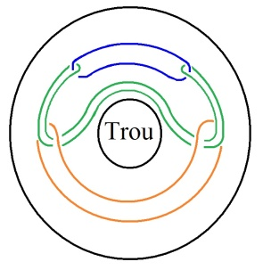

[无对应译文]

</section>

<section class="parallel-paragraph" data-paragraph-ids="s25-02-0002">

s25-02-0002

原文 · s25-02-0002

Ça, c’est pour vous indiquer que c’est un tore. C’est pour ça que j’ins­cris « *trou* ». En principe, c’est un tore à 4.

[无对应译文]

</section>

<section class="parallel-paragraph" data-paragraph-ids="s25-02-0003">

s25-02-0003

原文 · s25-02-0003

C’est un tore à quatre tel qu’un quelconque des quatre soit retourné. Voilà le tore à quatre dont il s’agit :

[无对应译文]

</section>

<section class="parallel-paragraph" data-paragraph-ids="s25-02-0004">

s25-02-0004

原文 · s25-02-0004

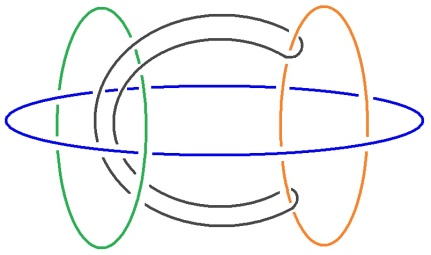

[无对应译文]

</section>

<section class="parallel-paragraph" data-paragraph-ids="s25-02-0005">

s25-02-0005

原文 · s25-02-0005

C’est Soury qui s’est aperçu qu’en retournant un quelconque des 4, on obtient ce que je vous montre dans la figure de gauche.

[无对应译文]

</section>

<section class="parallel-paragraph" data-paragraph-ids="s25-02-0006">

s25-02-0006

原文 · s25-02-0006

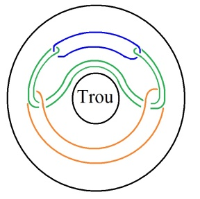 ← 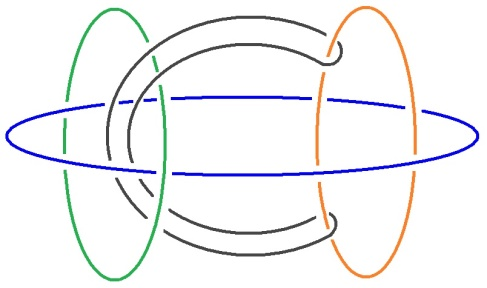

[无对应译文]

</section>

<section class="parallel-paragraph" data-paragraph-ids="s25-02-0007">

s25-02-0007

原文 · s25-02-0007

En retournant un quelconque des 4, on obtient cette figure qui consiste en un tore, à ceci près qu’à l’intérieur du tore, nous ne faisons que ce qui se présente là au tableau, à savoir des ronds de ficelle.

[无对应译文]

</section>

<section class="parallel-paragraph" data-paragraph-ids="s25-02-0008">

s25-02-0008

原文 · s25-02-0008

Mais chacun, chacun de ceux que vous voyez là, chacun de ces ronds de ficelle est lui-même un tore.

[无对应译文]

</section>

<section class="parallel-paragraph" data-paragraph-ids="s25-02-0009">

s25-02-0009

原文 · s25-02-0009

Et ce rond de ficelle retourné comme tore donne le même résultat.

[无对应译文]

</section>

<section class="parallel-paragraph" data-paragraph-ids="s25-02-0010">

s25-02-0010

原文 · s25-02-0010

« *Le même résultat* » : c’est-à-dire qu’à l’intérieur du tore qui enveloppe tout, chacun des ronds de ficelle...

[无对应译文]

</section>

<section class="parallel-paragraph" data-paragraph-ids="s25-02-0011">

s25-02-0011

原文 · s25-02-0011

> qui est pourtant un tore ...chacun des ronds de ficelle...

[无对应译文]

</section>

<section class="parallel-paragraph" data-paragraph-ids="s25-02-0012">

s25-02-0012

原文 · s25-02-0012

> dont je vous le répète qu’il est également un tore ...chacun de ces ronds de ficelle fonctionne de la façon que Soury a formulée sous la forme de ce dessin.

[无对应译文]

</section>

<section class="parallel-paragraph" data-paragraph-ids="s25-02-0013">

s25-02-0013

原文 · s25-02-0013

Ceci implique une dissymétrie. Je veux dire qu’il a choisi un tore parti­culier pour en faire le tore tel que je viens de le dessiner.

[无对应译文]

</section>

<section class="parallel-paragraph" data-paragraph-ids="s25-02-0014">

s25-02-0014

原文 · s25-02-0014

C’est le tore qu’il a retourné, je vous prie d’y prendre garde, et à ce titre il lui a donné un privilège sur les autres tores qui se trouvent ne figurer ici qu’à l’état de ronds de ficelle. Pourtant il est tout à fait patent que le tore qu’il a choisi, le tore qu’il a choisi et qui pourrait se désigner par 1,2,3,4, en partant de l’arrière vers ce qui est en avant :

[无对应译文]

</section>

<section class="parallel-paragraph" data-paragraph-ids="s25-02-0015">

s25-02-0015

原文 · s25-02-0015

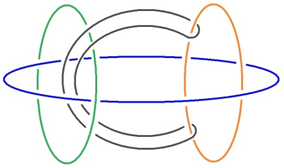

[无对应译文]

</section>

<section class="parallel-paragraph" data-paragraph-ids="s25-02-0016">

s25-02-0016

原文 · s25-02-0016

- celui-là est en avant,

[无对应译文]

</section>

<section class="parallel-paragraph" data-paragraph-ids="s25-02-0017">

s25-02-0017

原文 · s25-02-0017

- celui-là qui est un peu plus en avant que celui-là, je parle de celui-là, qui est un peu plus en avant, c’est pour ça que je lui mets le n°3,

[无对应译文]

</section>

<section class="parallel-paragraph" data-paragraph-ids="s25-02-0018">

s25-02-0018

原文 · s25-02-0018

- et celui-là est tout à fait en avant.

[无对应译文]

</section>

<section class="parallel-paragraph" data-paragraph-ids="s25-02-0019">

s25-02-0019

原文 · s25-02-0019

Aussi bien, comme vous le voyez - pour peu que vous ayez un peu d’imagination - comme vous le voyez, il y en a quatre, et c’est en en choisissant un et en le retournant qu’on obtient la figure que vous voyez à gauche :

[无对应译文]

</section>

<section class="parallel-paragraph" data-paragraph-ids="s25-02-0020">

s25-02-0020

原文 · s25-02-0020

← 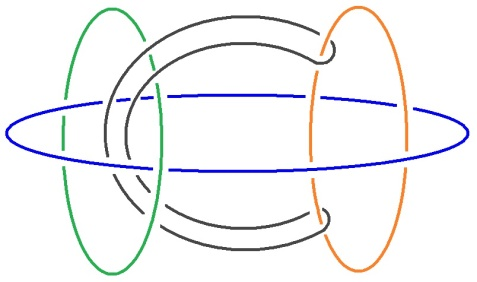

[无对应译文]

</section>

<section class="parallel-paragraph" data-paragraph-ids="s25-02-0021">

s25-02-0021

原文 · s25-02-0021

Et cette figure est équivalente pour n’impor­te lequel des ronds, je veux dire des tores.

[无对应译文]

</section>

<section class="parallel-paragraph" data-paragraph-ids="s25-02-0022">

s25-02-0022

原文 · s25-02-0022

Néanmoins j’objecte à Soury ceci, qui n’est pas moins vrai, c’est à savoir qu’en retournant n’importe lequel de ce qui s’appelle nœud bor­roméen, on obtient la figure suivan­te :

[无对应译文]

</section>

<section class="parallel-paragraph" data-paragraph-ids="s25-02-0023">

s25-02-0023

原文 · s25-02-0023

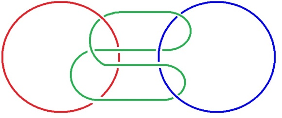 → 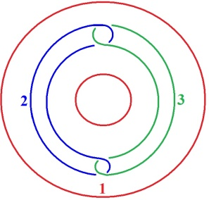

[无对应译文]

</section>

<section class="parallel-paragraph" data-paragraph-ids="s25-02-0024">

s25-02-0024

原文 · s25-02-0024

Le 2 et 3 étant indifférents, c’est de retourner ce que j’ai désigné ici comme 1, à savoir un des éléments du nœud borroméen, dont vous savez comment il se dessine :

[无对应译文]

</section>

<section class="parallel-paragraph" data-paragraph-ids="s25-02-0025">

s25-02-0025

原文 · s25-02-0025

[无对应译文]

</section>

<section class="parallel-paragraph" data-paragraph-ids="s25-02-0026">

s25-02-0026

原文 · s25-02-0026

Dans la figure qui est à droite, celle-ci :

[无对应译文]

</section>

<section class="parallel-paragraph" data-paragraph-ids="s25-02-0027">

s25-02-0027

原文 · s25-02-0027

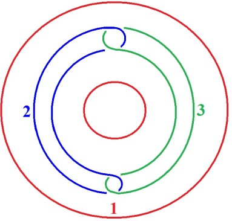

[无对应译文]

</section>

<section class="parallel-paragraph" data-paragraph-ids="s25-02-0028">

s25-02-0028

原文 · s25-02-0028

il est tout à fait clair que les ronds de ficelle qui sont à l’intérieur, à l’intérieur du tore, et qui d’une façon équivalente à ce que j’ai dit tout à l’heure, peuvent être figurés comme tores, ce que je fais actuellement : chacun de ces tores, *retourné*, enveloppe les deux autres tores.

[无对应译文]

</section>

<section class="parallel-paragraph" data-paragraph-ids="s25-02-0029">

s25-02-0029

原文 · s25-02-0029

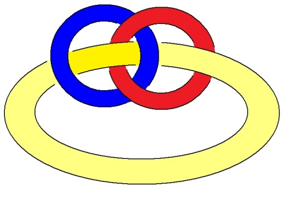

[无对应译文]

</section>

<section class="parallel-paragraph" data-paragraph-ids="s25-02-0030">

s25-02-0030

原文 · s25-02-0030

De même que ce qui est désigné en 1\[**rouge**\] ici :

[无对应译文]

</section>

<section class="parallel-paragraph" data-paragraph-ids="s25-02-0031">

s25-02-0031

原文 · s25-02-0031

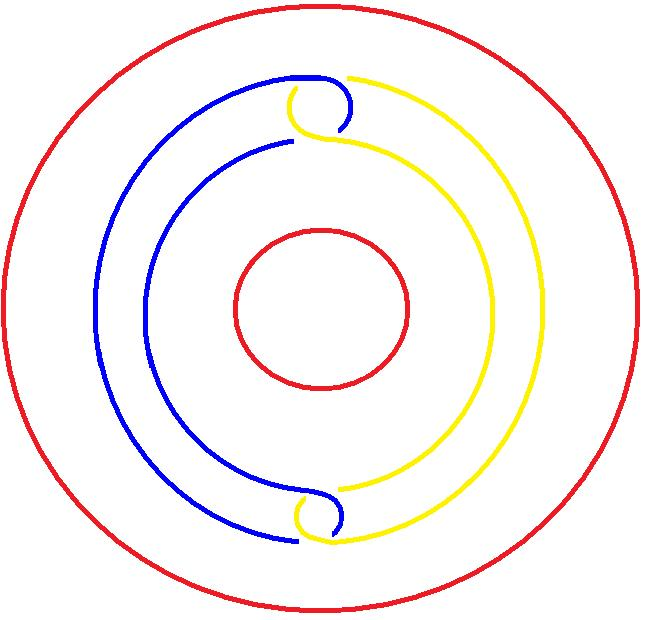

[无对应译文]

</section>

<section class="parallel-paragraph" data-paragraph-ids="s25-02-0032">

s25-02-0032

原文 · s25-02-0032

est un tore qui a pour propriété d’envelopper les deux autres, à condition qu’il soit retour­né.

[无对应译文]

</section>

<section class="parallel-paragraph" data-paragraph-ids="s25-02-0033">

s25-02-0033

原文 · s25-02-0033

*Ce qui donc est dans la figure de droite devient ce qui est dans la figure de gauche* à condition que chacun de ces tores soit retourné.

[无对应译文]

</section>

<section class="parallel-paragraph" data-paragraph-ids="s25-02-0034">

s25-02-0034

原文 · s25-02-0034

 ← 

[无对应译文]

</section>

<section class="parallel-paragraph" data-paragraph-ids="s25-02-0035">

s25-02-0035

原文 · s25-02-0035

Ιl est patent que les deux figures de gauche sont plus complexes que les deux figures de droite :

[无对应译文]

</section>

<section class="parallel-paragraph" data-paragraph-ids="s25-02-0036">

s25-02-0036

原文 · s25-02-0036

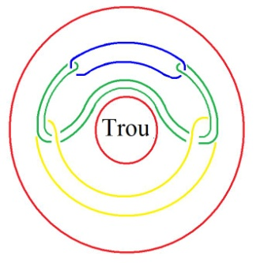← 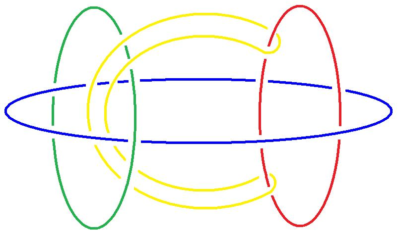

[无对应译文]

</section>

<section class="parallel-paragraph" data-paragraph-ids="s25-02-0037">

s25-02-0037

原文 · s25-02-0037

← 

[无对应译文]

</section>

<section class="parallel-paragraph" data-paragraph-ids="s25-02-0038">

s25-02-0038

原文 · s25-02-0038

 = 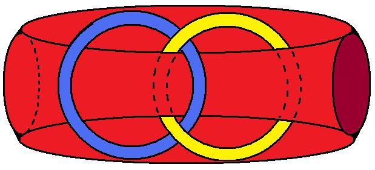← 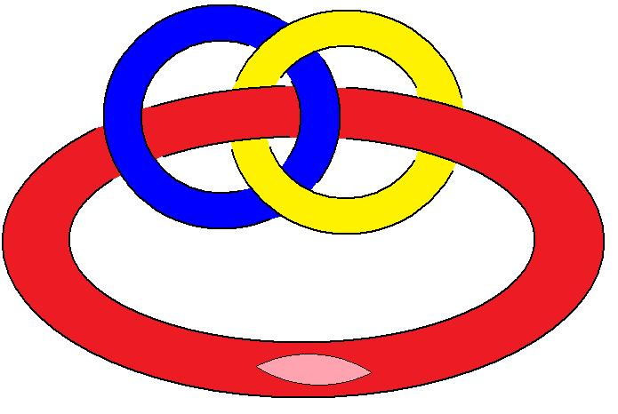

[无对应译文]

</section>

<section class="parallel-paragraph" data-paragraph-ids="s25-02-0039">

s25-02-0039

原文 · s25-02-0039

En outre ce que fait apparaître la troisième figure, c’est ceci qu’une fois retourné, le tore que j’ai désigné par 1 sur la figure, en allant de gauche à droite, sur la figure troisième… Quelque chose me vient, me vient à l’esprit à propos de ces tores : sup­posez que ce que j’ai appelé « *privilégier un tore* » se passe au niveau du tore 2 par exemple.

[无对应译文]

</section>

<section class="parallel-paragraph" data-paragraph-ids="s25-02-0040">

s25-02-0040

原文 · s25-02-0040

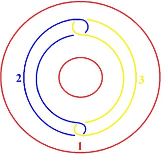 =← 

[无对应译文]

</section>

<section class="parallel-paragraph" data-paragraph-ids="s25-02-0041">

s25-02-0041

原文 · s25-02-0041

Est-ce que vous pouvez imaginer ce que le tore 2 \[bleu\] devient, en le privilégiant par rapport au tore 3, à savoir en le retournant à l’intérieur du tore que j’ai désigné du nom de 1 ?

[无对应译文]

</section>

<section class="parallel-paragraph" data-paragraph-ids="s25-02-0042">

s25-02-0042

原文 · s25-02-0042

Dans un cas, le retournement ne changera rien au rapport du tore 2 par rapport au tore 3.

[无对应译文]

</section>

<section class="parallel-paragraph" data-paragraph-ids="s25-02-0043">

s25-02-0043

原文 · s25-02-0043

Dans l’autre, il équivaudra à une rupture du nœud borroméen.

[无对应译文]

</section>

<section class="parallel-paragraph" data-paragraph-ids="s25-02-0044">

s25-02-0044

原文 · s25-02-0044

Ceci tient au fait que le nœud borroméen se comporte différemment selon que, sur le tore retourné, la rupture se produit d’une façon différente :

[无对应译文]

</section>

<section class="parallel-paragraph" data-paragraph-ids="s25-02-0045">

s25-02-0045

原文 · s25-02-0045

- section *concentrique,*

[无对应译文]

</section>

<section class="parallel-paragraph" data-paragraph-ids="s25-02-0046">

s25-02-0046

原文 · s25-02-0046

- section *perpendiculaire*.

[无对应译文]

</section>

<section class="parallel-paragraph" data-paragraph-ids="s25-02-0047">

s25-02-0047

原文 · s25-02-0047

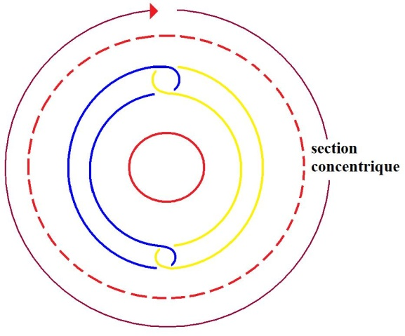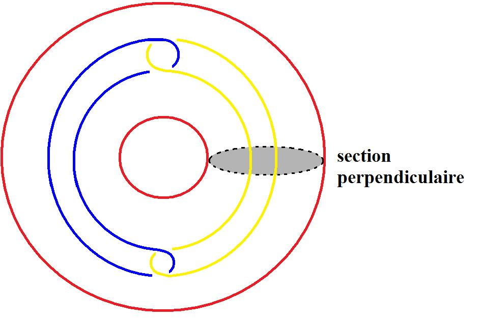

[无对应译文]

</section>

<section class="parallel-paragraph" data-paragraph-ids="s25-02-0048">

s25-02-0048

原文 · s25-02-0048

Je vais vous indiquer sur la figure de gauche ceci qui est patent…

[无对应译文]

</section>

<section class="parallel-paragraph" data-paragraph-ids="s25-02-0049">

s25-02-0049

原文 · s25-02-0049

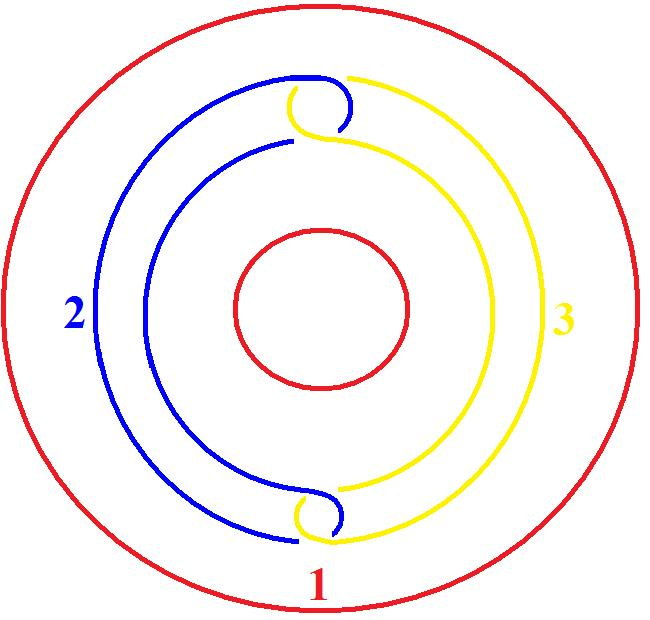

[无对应译文]

</section>

<section class="parallel-paragraph" data-paragraph-ids="s25-02-0050">

s25-02-0050

原文 · s25-02-0050

Ceci qui est patent, c’est que :

[无对应译文]

</section>

<section class="parallel-paragraph" data-paragraph-ids="s25-02-0051">

s25-02-0051

原文 · s25-02-0051

- à sectionner le tore retourné de la façon que je viens de faire \[*concentrique*\], le nœud borroméen se défait.

[无对应译文]

</section>

<section class="parallel-paragraph" data-paragraph-ids="s25-02-0052">

s25-02-0052

原文 · s25-02-0052

- Par contre, à le sectionner de cette autre façon \[*perpendiculaire*\], dont il est, je suppose, pour vous tous évident que c’est équivalent à ce que je dessine ici, que c’est équivalent : le nœud borroméen ne se dissout pas, alors que dans le cas présent, la coupure que je viens de faire ici \[*concentrique*\] dissout le nœud borroméen.

[无对应译文]

</section>

<section class="parallel-paragraph" data-paragraph-ids="s25-02-0053">

s25-02-0053

原文 · s25-02-0053

Le privilège donc dont il s’agit n’est pas quelque chose qui soit univoque.

[无对应译文]

</section>

<section class="parallel-paragraph" data-paragraph-ids="s25-02-0054">

s25-02-0054

原文 · s25-02-0054

Le retournement d’un quelconque de ce qui aboutit à la 1ère figu­re, le retournement ne donne pas le même résultat selon que la coupure se présente sur le tore d’une façon telle qu’elle soit *concen­trique* au trou ou selon qu’il est *perpendiculaire* au trou.

[无对应译文]

</section>

<section class="parallel-paragraph" data-paragraph-ids="s25-02-0055">

s25-02-0055

原文 · s25-02-0055

Il est tout à fait clair...

[无对应译文]

</section>

<section class="parallel-paragraph" data-paragraph-ids="s25-02-0056">

s25-02-0056

原文 · s25-02-0056

> ceci se voit sur la 2ème figu­re ...il est tout à fait clair que c’est la même chose, je veux dire qu’à rompre selon un tracé qui est celui-ci \[*concentrique*\], le nœud borroméen à 3 se dissout : car il est tout à fait clair que même à l’état de tore, les 2 figures que vous voyez là *se dissolvent*, je veux dire *se séparent*, si le tore retourné est coupé dans le sens que j’ai appelé *longitudinal* \[*concentrique*\], alors que l’autre sens: le *transversal* \[*perpendiculaire*\] ne libère pas le tore à 3, par contre le *longitudinal* le libère. Ιl y a donc le même choix à faire sur le tore retourné, selon le cas où l’on veut et où l’on ne veut pas, dis­soudre le *nœud borroméen*.

[无对应译文]

</section>

<section class="parallel-paragraph" data-paragraph-ids="s25-02-0057">

s25-02-0057

原文 · s25-02-0057

La figure de droite :

[无对应译文]

</section>

<section class="parallel-paragraph" data-paragraph-ids="s25-02-0058">

s25-02-0058

原文 · s25-02-0058

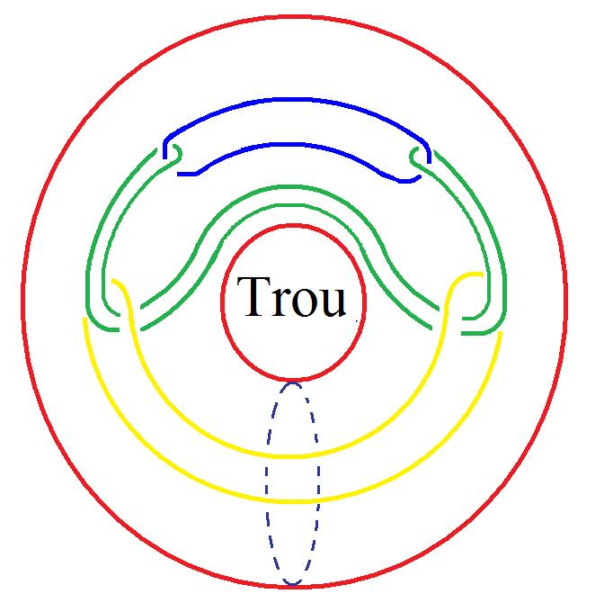

[无对应译文]

</section>

<section class="parallel-paragraph" data-paragraph-ids="s25-02-0059">

s25-02-0059

原文 · s25-02-0059

celle qui matérialise la façon dont il faut couper le tore environnant pour - je pense que vous le voyez - pour libérer les trois, les trois qui restent, il est bien clair que, à dessiner les choses comme ça, on voit que ceci que je désigne à l’occasion de 2, se libère du 3 et que secondairement le 3 se libère du 4

[无对应译文]

</section>

<section class="parallel-paragraph" data-paragraph-ids="s25-02-0060">

s25-02-0060

原文 · s25-02-0060

Je propose ceci, qui est amorcé par le fait que dans la façon de répartir la figuration du 4, le nommé Soury a eu une préférence, je veux dire qu’il préfère marquer que le 4 est à dessiner comme cela :

[无对应译文]

</section>

<section class="parallel-paragraph" data-paragraph-ids="s25-02-0061">

s25-02-0061

原文 · s25-02-0061

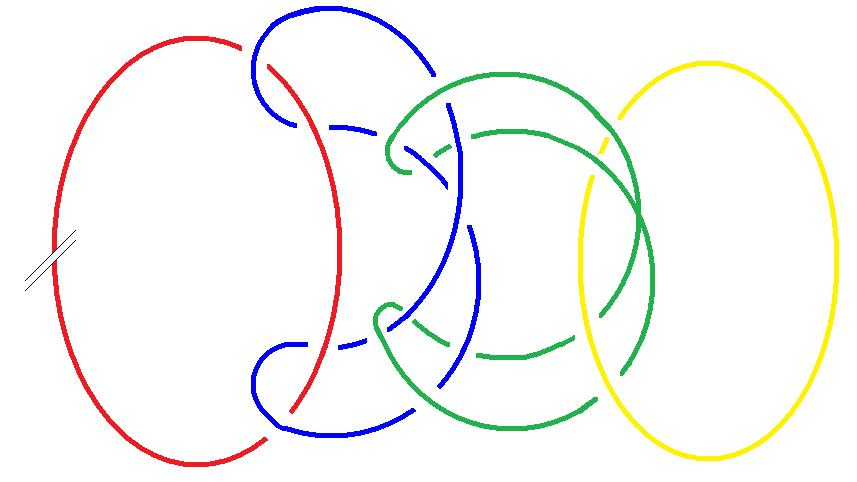

[无对应译文]

</section>

<section class="parallel-paragraph" data-paragraph-ids="s25-02-0062">

s25-02-0062

原文 · s25-02-0062

C’est également un nœud borroméen.

[无对应译文]

</section>

<section class="parallel-paragraph" data-paragraph-ids="s25-02-0063">

s25-02-0063

原文 · s25-02-0063

Mais je suggère ceci qu’il y a un nœud borroméen à 6, qui n’est pas le même qu’un nœud borroméen qui, si je puis dire, se suivrait « *à la queue ­leu-leu* ». C’est un nœud borroméen plus complexe dont je vous montre la façon dont il s’organise, à savoir que par rapport aux deux que j’ai dessinés d’abord, ces deux sont équivalents à ce qui se produit du fait que l’un est sur l’autre, et dans ce cas, il faut que le nœud borroméen s’inscrive en étant

[无对应译文]

</section>

<section class="parallel-paragraph" data-paragraph-ids="s25-02-0064">

s25-02-0064

原文 · s25-02-0064

- *sur* celui qui est *dessus,*

[无对应译文]

</section>

<section class="parallel-paragraph" data-paragraph-ids="s25-02-0065">

s25-02-0065

原文 · s25-02-0065

- et *sous* celui qui est *dessous*.

[无对应译文]

</section>

<section class="parallel-paragraph" data-paragraph-ids="s25-02-0066">

s25-02-0066

原文 · s25-02-0066

C’est ce que vous voyez là : il est *sous* celui qui est *dessous* et *sur* celui qui est *dessus *:

[无对应译文]

</section>

<section class="parallel-paragraph" data-paragraph-ids="s25-02-0067">

s25-02-0067

原文 · s25-02-0067

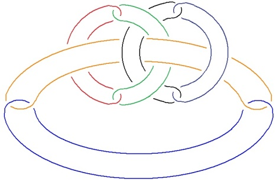

[无对应译文]

</section>

<section class="parallel-paragraph" data-paragraph-ids="s25-02-0068">

s25-02-0068

原文 · s25-02-0068

C’est pas commode à dessiner. Voilà celui qui est dessous, le 3ème. Vous avez à propos de ces 2 couples qui sont figurés là, vous n’avez qu’à vous apercevoir que celui-ci est dessus, le 3ème couple vient donc dessus et dessous celui qui est dessous.

[无对应译文]

</section>

<section class="parallel-paragraph" data-paragraph-ids="s25-02-0069">

s25-02-0069

原文 · s25-02-0069

Je pose la question : est-ce que retourner un de ceux qui sont ici, donne le même résultat que ce que j’ai appelé la figure « *à la queue ­leu-leu* », c’est-à-dire, ainsi, celle qui se présente ainsi 1,2,3,4,5,6, le tout se terminant par le rond qui est ici.

[无对应译文]

</section>

<section class="parallel-paragraph" data-paragraph-ids="s25-02-0070">

s25-02-0070

原文 · s25-02-0070

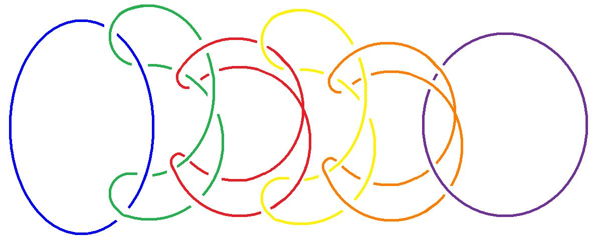

[无对应译文]

</section>

<section class="parallel-paragraph" data-paragraph-ids="s25-02-0071">

s25-02-0071

原文 · s25-02-0071

Est-ce que *retourner* le « 6 » ainsi fabriqué donnera le même résultat que le *retournement* d’un quelconque de ces trois-ci ?

[无对应译文]

</section>

<section class="parallel-paragraph" data-paragraph-ids="s25-02-0072">

s25-02-0072

原文 · s25-02-0072

Nous avons déjà une indication de réponse : c’est que le résultat sera différent. Ιl sera différent parce que la façon de retourner un quelconque de ces six que j’appelle « *à la queue ­leu-leu* » donnera quelque chose d’analogue à ce qui est figuré ici :

[无对应译文]

</section>

<section class="parallel-paragraph" data-paragraph-ids="s25-02-0073">

s25-02-0073

原文 · s25-02-0073

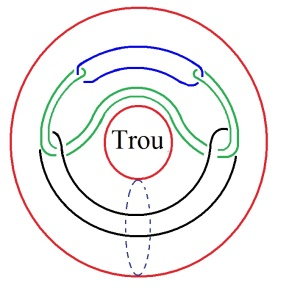

[无对应译文]

</section>

<section class="parallel-paragraph" data-paragraph-ids="s25-02-0074">

s25-02-0074

原文 · s25-02-0074

Par contre, la façon dont cette figure se retourne, donnera quelque chose de différent.

[无对应译文]

</section>

<section class="parallel-paragraph" data-paragraph-ids="s25-02-0075">

s25-02-0075

原文 · s25-02-0075

[无对应译文]

</section>

<section class="parallel-paragraph" data-paragraph-ids="s25-02-0076">

s25-02-0076

原文 · s25-02-0076

Je m’excuse d’avoir mis en cause directement Soury.

[无对应译文]

</section>

<section class="parallel-paragraph" data-paragraph-ids="s25-02-0077">

s25-02-0077

原文 · s25-02-0077

Ιl est certainement tout à fait valable en ayant introduit ce que j’énonce aujourd’hui.

[无对应译文]

</section>

<section class="parallel-paragraph" data-paragraph-ids="s25-02-0078">

s25-02-0078

原文 · s25-02-0078

La dis­tinction de ce que j’ai appelé *la coupure longitudinale* d’avec *la coupure transversale* est essentielle.

[无对应译文]

</section>

<section class="parallel-paragraph" data-paragraph-ids="s25-02-0079">

s25-02-0079

原文 · s25-02-0079

Je pense que vous en avez suffisamment l’indi­cation par cette coupure ici.

[无对应译文]

</section>

<section class="parallel-paragraph" data-paragraph-ids="s25-02-0080">

s25-02-0080

原文 · s25-02-0080

La façon dont est faite la coupure est tout à fait décisive.

[无对应译文]

</section>

<section class="parallel-paragraph" data-paragraph-ids="s25-02-0081">

s25-02-0081

原文 · s25-02-0081

Qu’est-ce qu’il advient du retournement d’un des six, tel que je l’ai désigné ici ?

[无对应译文]

</section>

<section class="parallel-paragraph" data-paragraph-ids="s25-02-0082">

s25-02-0082

原文 · s25-02-0082

[无对应译文]

</section>

<section class="parallel-paragraph" data-paragraph-ids="s25-02-0083">

s25-02-0083

原文 · s25-02-0083

C’est ce qui est important à savoir et c’est en le remettant entre vos mains que je désire en avoir le fin mot.

[无对应译文]

</section>

<section class="parallel-paragraph" data-paragraph-ids="s25-02-0084">

s25-02-0084

原文 · s25-02-0084

Voilà, je m’en tiendrai là pour aujourd’hui.

[无对应译文]

</section>

