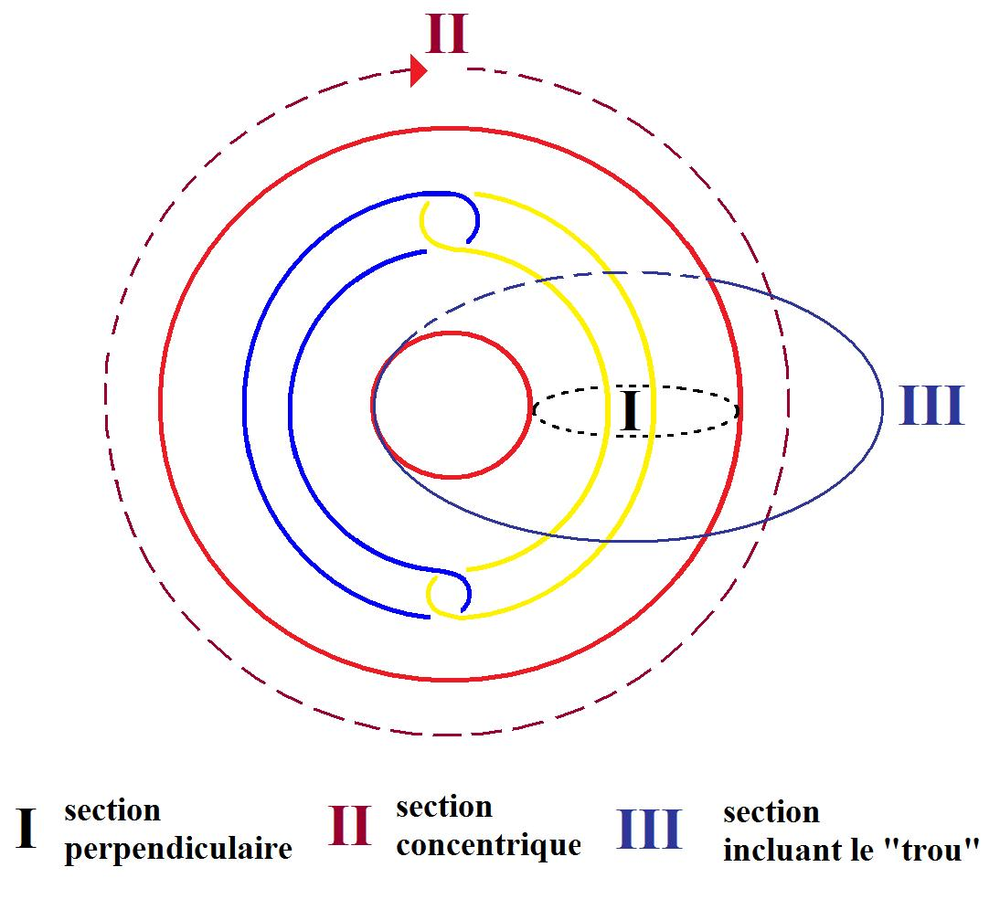
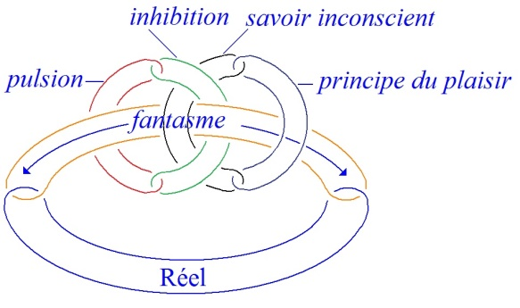

# Leçon 03 | 20 Décembre 1977

  <label><input type="checkbox" data-lacan-toggle="original" checked> 原文</label>
  <label><input type="checkbox" data-lacan-toggle="notes" checked> 注释</label>
  <label><input type="checkbox" data-lacan-toggle="commentary" checked> 个人解读评论</label>

<section class="parallel-paragraph" data-paragraph-ids="s25-03-0001">

s25-03-0001

[无对应译文]

原文 · s25-03-0001

Je travaille dans l’impossible à dire.

</section>

<section class="parallel-paragraph" data-paragraph-ids="s25-03-0002">

s25-03-0002

[无对应译文]

原文 · s25-03-0002

Dire est autre chose que parler.

</section>

<section class="parallel-paragraph" data-paragraph-ids="s25-03-0003">

s25-03-0003

[无对应译文]

原文 · s25-03-0003

L’analysant parle, il fait de la poésie.

</section>

<section class="parallel-paragraph" data-paragraph-ids="s25-03-0004">

s25-03-0004

[无对应译文]

原文 · s25-03-0004

Ιl fait de la poésie quand il y arrive, c’est peu fréquent - mais il est « *art *». Je coupe parce que je veux pas dire « *il est tard* ».

</section>

<section class="parallel-paragraph" data-paragraph-ids="s25-03-0005">

s25-03-0005

[无对应译文]

原文 · s25-03-0005

L’analyste, lui, tranche.

</section>

<section class="parallel-paragraph" data-paragraph-ids="s25-03-0006">

s25-03-0006

[无对应译文]

原文 · s25-03-0006

Ce qu’il dit est *coupure*, c’est-à-dire participe de *l’écriture*, à ceci près que pour lui il équivoque sur l’orthographe.

</section>

<section class="parallel-paragraph" data-paragraph-ids="s25-03-0007">

s25-03-0007

[无对应译文]

原文 · s25-03-0007

Ιl écrit différemment de façon à ce que de par la grâce de l’orthographe, d’une façon différente d’écrire, il sonne autre chose que ce qui est *dit*, que ce qui est *dit* avec l’intention de dire, c’est-à-dire consciemment, pour autant que la conscience aille bien loin.

</section>

<section class="parallel-paragraph" data-paragraph-ids="s25-03-0008">

s25-03-0008

[无对应译文]

原文 · s25-03-0008

C’est pour ça que je dis que, ni dans ce que dit l’*analysant*, ni dans ce que dit l’*analyste*, il y a autre chose qu’écriture.

</section>

<section class="parallel-paragraph" data-paragraph-ids="s25-03-0009">

s25-03-0009

[无对应译文]

原文 · s25-03-0009

Elle ne va pas loin cette conscience, on ne sait pas ce qu’on dit quand on parle.

</section>

<section class="parallel-paragraph" data-paragraph-ids="s25-03-0010">

s25-03-0010

[无对应译文]

原文 · s25-03-0010

C’est bien pour cela que l’*analysant* en dit plus qu’il n’en veut dire.

</section>

<section class="parallel-paragraph" data-paragraph-ids="s25-03-0011">

s25-03-0011

[无对应译文]

原文 · s25-03-0011

L’*analyste* tranche *à lire* ce qu’il en est de ce qu’il veut *dire*, si tant est que l’analyste sache ce que lui-même veut.

</section>

<section class="parallel-paragraph" data-paragraph-ids="s25-03-0012">

s25-03-0012

[无对应译文]

原文 · s25-03-0012

Ιl y a beaucoup de jeu, au sens de liberté, dans tout cela. Ça joue, au sens que le mot a d’ordinaire.

</section>

<section class="parallel-paragraph" data-paragraph-ids="s25-03-0013">

s25-03-0013

[无对应译文]

原文 · s25-03-0013

Tout ça ne me dit pas à moi-même comment j’ai glissé dans le nœud borroméen pour m’en trouver à l’occasion serré à la gorge. Ιl faut dire que le nœud borroméen, c’est ce qui, dans la pensée, fait matière. La matière, c’est ce qu’on casse...

</section>

<section class="parallel-paragraph" data-paragraph-ids="s25-03-0014">

s25-03-0014

[无对应译文]

原文 · s25-03-0014

> là aussi au sens que ce mot a d’ordi­naire ...ce qu’on casse, c’est ce qui tient ensemble et est souple, à l’occasion, comme ce qu’on appelle un nœud.

</section>

<section class="parallel-paragraph" data-paragraph-ids="s25-03-0015">

s25-03-0015

[无对应译文]

原文 · s25-03-0015

Comment ai-je glissé du nœud borroméen à l’imaginer composé de tores, et de là à la pensée de retourner chacun de ces tores, c’est ce qui m’a conduit à des choses qui font métaphore, métaphore au naturel, c’est-à-dire que ça colle avec la linguistique, pour autant qu’il y en ait une. Mais la métaphore a à être pensée métaphoriquement.

</section>

<section class="parallel-paragraph" data-paragraph-ids="s25-03-0016">

s25-03-0016

[无对应译文]

原文 · s25-03-0016

L’étoffe de la métaphore, c’est ce qui dans la pensée fait matière, ou comme dit Descartes « *étendue* », autrement dit corps.

</section>

<section class="parallel-paragraph" data-paragraph-ids="s25-03-0017">

s25-03-0017

[无对应译文]

原文 · s25-03-0017

*La béance* est ici comblée comme elle l’était depuis toujours.

</section>

<section class="parallel-paragraph" data-paragraph-ids="s25-03-0018">

s25-03-0018

[无对应译文]

原文 · s25-03-0018

Le corps ici représenté est *fantasme du corps*.

</section>

<section class="parallel-paragraph" data-paragraph-ids="s25-03-0019">

s25-03-0019

[无对应译文]

原文 · s25-03-0019

Le fantasme du corps, c’est « *l’étendue* » imaginée par Descartes.

</section>

<section class="parallel-paragraph" data-paragraph-ids="s25-03-0020">

s25-03-0020

[无对应译文]

原文 · s25-03-0020

Il y a distance entre « *l’étendue »* de Descartes, et le *fantasme*.

</section>

<section class="parallel-paragraph" data-paragraph-ids="s25-03-0021">

s25-03-0021

[无对应译文]

原文 · s25-03-0021

Ici intervient l’analyste qui colore le *fantasme* de *sexualité*.

</section>

<section class="parallel-paragraph" data-paragraph-ids="s25-03-0022">

s25-03-0022

[无对应译文]

原文 · s25-03-0022

Il n’y a pas de rapport sexuel, certes, sauf entre *fantasmes*.

</section>

<section class="parallel-paragraph" data-paragraph-ids="s25-03-0023">

s25-03-0023

[无对应译文]

原文 · s25-03-0023

Et le fantas­me est à noter avec l’accent que je lui donnais quand je remarquais que la géométrie...

</section>

<section class="parallel-paragraph" data-paragraph-ids="s25-03-0024">

s25-03-0024

[无对应译文]

原文 · s25-03-0024

> \[Lacan écrit au tableau :\] « *l’âge et haut-maître* *hie* » ...que la géométrie est tissée de fantasmes, et du même coup toute science.

</section>

<section class="parallel-paragraph" data-paragraph-ids="s25-03-0025">

s25-03-0025

[无对应译文]

原文 · s25-03-0025

Je lisais, récemment un machin qui s’appelle - c’est en 4 volumes - *The world of mathematics.*

</section>

<section class="parallel-paragraph" data-paragraph-ids="s25-03-0026">

s25-03-0026

[无对应译文]

原文 · s25-03-0026

Comme vous le voyez, c’est en anglais.

</section>

<section class="parallel-paragraph" data-paragraph-ids="s25-03-0027">

s25-03-0027

[无对应译文]

原文 · s25-03-0027

Il n’y a pas le moindre « *monde des mathématiques* ».

</section>

<section class="parallel-paragraph" data-paragraph-ids="s25-03-0028">

s25-03-0028

[无对应译文]

原文 · s25-03-0028

Il suffit d’ac­crocher les articles en question.

</section>

<section class="parallel-paragraph" data-paragraph-ids="s25-03-0029">

s25-03-0029

[无对应译文]

原文 · s25-03-0029

Ça ne suffit pas à faire ce qu’on appelle un monde, je veux dire un monde qui se tienne.

</section>

<section class="parallel-paragraph" data-paragraph-ids="s25-03-0030">

s25-03-0030

[无对应译文]

原文 · s25-03-0030

Le mystère de ce monde reste absolument entier.

</section>

<section class="parallel-paragraph" data-paragraph-ids="s25-03-0031">

s25-03-0031

[无对应译文]

原文 · s25-03-0031

Qu’est-ce que veut dire du même coup que le savoir ? Le savoir, c’est ce qui nous guide.

</section>

<section class="parallel-paragraph" data-paragraph-ids="s25-03-0032">

s25-03-0032

[无对应译文]

原文 · s25-03-0032

C’est ce qui fait qu’on a pu traduire le savoir en ques­tion par le mot *instinct,* dont fait partie ce qu’on articule comme « *l’appensée »* que j’écris comme ça, parce que ça fait équi­voque avec l’appui.

</section>

<section class="parallel-paragraph" data-paragraph-ids="s25-03-0033">

s25-03-0033

[无对应译文]

原文 · s25-03-0033

Quand j’ai dit l’autre jour, que la science n’est rien d’autre qu’un fantasme, qu’un *noyau fantasmatique*,

</section>

<section class="parallel-paragraph" data-paragraph-ids="s25-03-0034">

s25-03-0034

[无对应译文]

原文 · s25-03-0034

> je « *suis* » certes - mais au sens de « *suivre* » ...et contrairement à ce que quelqu’un, dans un article a espéré \[*J.Β. Pontalis dans* *Le Monde* \], je pense que je serai suivi sur ce terrain.

</section>

<section class="parallel-paragraph" data-paragraph-ids="s25-03-0035">

s25-03-0035

[无对应译文]

原文 · s25-03-0035

Ça me semble évident.

</section>

<section class="parallel-paragraph" data-paragraph-ids="s25-03-0036">

s25-03-0036

[无对应译文]

原文 · s25-03-0036

La science est une futilité qui n’a de poids dans la vie d’aucun, bien qu’elle ait des effets, la télévision par exemple.

</section>

<section class="parallel-paragraph" data-paragraph-ids="s25-03-0037">

s25-03-0037

[无对应译文]

原文 · s25-03-0037

Mais ses effets ne tiennent à rien qu’au fantasme qui, écrirai-je comme ça, qui « *hycroit *».

</section>

<section class="parallel-paragraph" data-paragraph-ids="s25-03-0038">

s25-03-0038

[无对应译文]

原文 · s25-03-0038

La science est liée à ce qu’on appelle spécialement *pulsion de mort*.

</section>

<section class="parallel-paragraph" data-paragraph-ids="s25-03-0039">

s25-03-0039

[无对应译文]

原文 · s25-03-0039

C’est un fait que la vie continue grâce au fait de la reproduction liée au fantasme.

</section>

<section class="parallel-paragraph" data-paragraph-ids="s25-03-0040">

s25-03-0040

[无对应译文]

原文 · s25-03-0040

Voilà. L’autre jour, je vous ai fait un tore en vous faisant remarquer que c’est un *nœud borroméen*.

</section>

<section class="parallel-paragraph" data-paragraph-ids="s25-03-0041">

s25-03-0041

[无对应译文]

原文 · s25-03-0041

 = ← 

</section>

<section class="parallel-paragraph" data-paragraph-ids="s25-03-0042">

s25-03-0042

[无对应译文]

原文 · s25-03-0042

Je veux dire qu’il y a ici 3 éléments, le tore retourné et puis les 2 *ronds de ficelle*, que vous voyez là, qui sont des tores également.

</section>

<section class="parallel-paragraph" data-paragraph-ids="s25-03-0043">

s25-03-0043

[无对应译文]

原文 · s25-03-0043

 

</section>

<section class="parallel-paragraph" data-paragraph-ids="s25-03-0044">

s25-03-0044

[无对应译文]

原文 · s25-03-0044

Et je vous ai fait remarquer que si l’on coupe ce tore comme ça, c’est-à-dire - comme je me suis exprimé – *longitudinalement* par rapport au tore, ce n’est pas surprenant qu’on obtienne l’*effet de coupure* qui est celui du nœud borroméen.

</section>

<section class="parallel-paragraph" data-paragraph-ids="s25-03-0045">

s25-03-0045

[无对应译文]

原文 · s25-03-0045

C’est le contraire qui serait surprenant. C’est la même chose que de couper...

</section>

<section class="parallel-paragraph" data-paragraph-ids="s25-03-0046">

s25-03-0046

[无对应译文]

原文 · s25-03-0046

> là je complète, puisque j’ai lais­sé ce nœud borroméen inachevé ...c’est la même chose que de couper comme ça :

</section>

<section class="parallel-paragraph" data-paragraph-ids="s25-03-0047">

s25-03-0047

[无对应译文]

原文 · s25-03-0047

</section>

<section class="parallel-paragraph" data-paragraph-ids="s25-03-0048">

s25-03-0048

[无对应译文]

原文 · s25-03-0048

à ceci près que dans ce cas la coupure est - contrairement à celui-ci - « *perpendiculaire* » à ce qu’on appelle *le trou* \[*incluant le trou*\].

</section>

<section class="parallel-paragraph" data-paragraph-ids="s25-03-0049">

s25-03-0049

[无对应译文]

原文 · s25-03-0049

Mais il est bien clair que, si les choses se complètent, c’est-à-dire que ceci se recolle, à savoir qu’il se passe quelque chose ici comme une jonc­tion, la coupure circulaire laisse le nœud borroméen intact et c’est bien la même coupure qui se retrouve là, la même coupure que ce qui résulte de ce que j’ai appelé la coupure longitudinale.

</section>

<section class="parallel-paragraph" data-paragraph-ids="s25-03-0050">

s25-03-0050

[无对应译文]

原文 · s25-03-0050

La coupure n’est rien que ce qui élimine le nœud borroméen tout entier.

</section>

<section class="parallel-paragraph" data-paragraph-ids="s25-03-0051">

s25-03-0051

[无对应译文]

原文 · s25-03-0051

C’est de ce fait quelque chose qui est réparable, à condition de s’apercevoir que le tore intéressé se recolle, si on le traite convenablement, retourné. Ce qu’on peut appeler *la suggestion du tore*...

</section>

<section class="parallel-paragraph" data-paragraph-ids="s25-03-0052">

s25-03-0052

[无对应译文]

原文 · s25-03-0052

> du tore transformé, je veux dire du tore que constitue le retournement ...la suggestion du tore en *remet*, si je puis m’exprimer ainsi, sur la solidité du nœud.

</section>

<section class="parallel-paragraph" data-paragraph-ids="s25-03-0053">

s25-03-0053

[无对应译文]

原文 · s25-03-0053

C’est-à-dire que ce qui se voit...

</section>

<section class="parallel-paragraph" data-paragraph-ids="s25-03-0054">

s25-03-0054

[无对应译文]

原文 · s25-03-0054

> à condition qu’on coupe perpendiculai­rement au trou ...ce qui se voit, c’est que le tore à ce moment-là maintient le nœud borroméen.

</section>

<section class="parallel-paragraph" data-paragraph-ids="s25-03-0055">

s25-03-0055

[无对应译文]

原文 · s25-03-0055

Il suffit qu’une coupure participe de la coupure dite « *perpendiculaire* » au trou, pour que ça retienne le nœud.

</section>

<section class="parallel-paragraph" data-paragraph-ids="s25-03-0056">

s25-03-0056

[无对应译文]

原文 · s25-03-0056

Supposez que la coupure que nous avons faite ici \[II\] participe de la coupure que nous avons faite ici \[I\] c’est-à-dire que *quelque chose* s’ins­taure *de cette nature-là* \[III\], autrement dit que ça tourne autour du tore, je veux dire : la coupure.

</section>

<section class="parallel-paragraph" data-paragraph-ids="s25-03-0057">

s25-03-0057

[无对应译文]

原文 · s25-03-0057

</section>

<section class="parallel-paragraph" data-paragraph-ids="s25-03-0058">

s25-03-0058

[无对应译文]

原文 · s25-03-0058

Voilà ce que nous obtenons :

</section>

<section class="parallel-paragraph" data-paragraph-ids="s25-03-0059">

s25-03-0059

[无对应译文]

原文 · s25-03-0059

> 

</section>

<section class="parallel-paragraph" data-paragraph-ids="s25-03-0060">

s25-03-0060

[无对应译文]

原文 · s25-03-0060

Le retournement du tore pare aux effets de sa coupure.

</section>

<section class="parallel-paragraph" data-paragraph-ids="s25-03-0061">

s25-03-0061

[无对应译文]

原文 · s25-03-0061

Le fantasme de la coupure suffit à tenir le nœud borroméen.

</section>

<section class="parallel-paragraph" data-paragraph-ids="s25-03-0062">

s25-03-0062

[无对应译文]

原文 · s25-03-0062

Pour qu’il y ait fantasme, il faut qu’il y ait tore.

</section>

<section class="parallel-paragraph" data-paragraph-ids="s25-03-0063">

s25-03-0063

[无对应译文]

原文 · s25-03-0063

L’identification du fantasme au tore est ce qui justifie, si je puis dire, mon imagination du *retournement* du tore.

</section>

<section class="parallel-paragraph" data-paragraph-ids="s25-03-0064">

s25-03-0064

[无对应译文]

原文 · s25-03-0064

Alors là, je vais dessiner ce qu’il en est du tore que j’ai appelé l’autre jour « *tore à 6* ».

</section>

<section class="parallel-paragraph" data-paragraph-ids="s25-03-0065">

s25-03-0065

[无对应译文]

原文 · s25-03-0065

Et imaginez ce qui se déduit de la figuration que je viens de faire.

</section>

<section class="parallel-paragraph" data-paragraph-ids="s25-03-0066">

s25-03-0066

[无对应译文]

原文 · s25-03-0066

Il y a un couple : « *pulsion-inhibition* ». Prenons par exemple celui-ci : « *pulsion-inhibition* ».

</section>

<section class="parallel-paragraph" data-paragraph-ids="s25-03-0067">

s25-03-0067

[无对应译文]

原文 · s25-03-0067

De la même façon, pour les autres, appelons le couple suivant : « *princi­pe du plaisir-inconscient* ».

</section>

<section class="parallel-paragraph" data-paragraph-ids="s25-03-0068">

s25-03-0068

[无对应译文]

原文 · s25-03-0068

On voit assez de ce fait que l’inconscient est ce savoir qui nous guide que j’appelais tout à l’heure « *principe du plaisir ».*

</section>

<section class="parallel-paragraph" data-paragraph-ids="s25-03-0069">

s25-03-0069

[无对应译文]

原文 · s25-03-0069

</section>

<section class="parallel-paragraph" data-paragraph-ids="s25-03-0070">

s25-03-0070

[无对应译文]

原文 · s25-03-0070

L’intérêt, c’est de s’apercevoir que le tiers, je veux dire ce qui de ce fait s’organise de cette façon...

</section>

<section class="parallel-paragraph" data-paragraph-ids="s25-03-0071">

s25-03-0071

[无对应译文]

原文 · s25-03-0071

> je vous demande pardon, ces nœuds sont tou­jours très difficiles à faire ...ici vous avez une façon meilleure que celle que j’ai dû rectifier là, de représenter ce que j’ai appelé

</section>

<section class="parallel-paragraph" data-paragraph-ids="s25-03-0072">

s25-03-0072

[无对应译文]

原文 · s25-03-0072

- *principe du plaisir-savoir,*

</section>

<section class="parallel-paragraph" data-paragraph-ids="s25-03-0073">

s25-03-0073

[无对应译文]

原文 · s25-03-0073

- *pulsion-inhibition,*

</section>

<section class="parallel-paragraph" data-paragraph-ids="s25-03-0074">

s25-03-0074

[无对应译文]

原文 · s25-03-0074

- et c’est ici que le tiers se présente comme l’accouplement du *Réel* et du *fantasme*.

</section>

<section class="parallel-paragraph" data-paragraph-ids="s25-03-0075">

s25-03-0075

[无对应译文]

原文 · s25-03-0075

C’est mettre l’accent sur le fait *qu’il n’y a pas de réalité*.

</section>

<section class="parallel-paragraph" data-paragraph-ids="s25-03-0076">

s25-03-0076

[无对应译文]

原文 · s25-03-0076

La réalité n’est constituée que par *le fantasme*, et *le* *fantasme* est aussi bien ce qui donne matière à la poésie.

</section>

<section class="parallel-paragraph" data-paragraph-ids="s25-03-0077">

s25-03-0077

[无对应译文]

原文 · s25-03-0077

C’est-à-dire que tout notre développement de science est quelque chose qui, on ne sait pas par quelle voie, émerge, fait irruption, du fait de ce qu’on appelle rapport sexuel.

</section>

<section class="parallel-paragraph" data-paragraph-ids="s25-03-0078">

s25-03-0078

[无对应译文]

原文 · s25-03-0078

Pourquoi est-ce qu’il y a quelque chose qui fonctionne comme scien­ce ?

</section>

<section class="parallel-paragraph" data-paragraph-ids="s25-03-0079">

s25-03-0079

[无对应译文]

原文 · s25-03-0079

C’est de la poésie. L’aperception de ce « *World of mathematics »* m’en a convaincu.

</section>

<section class="parallel-paragraph" data-paragraph-ids="s25-03-0080">

s25-03-0080

[无对应译文]

原文 · s25-03-0080

Il y a quelque chose qui arrive à passer par l’intermédiaire de ce qui se réduit dans l’espèce humaine au *rapport sexuel*.

</section>

<section class="parallel-paragraph" data-paragraph-ids="s25-03-0081">

s25-03-0081

[无对应译文]

原文 · s25-03-0081

Qu’est-ce qui se réduit au *rapport sexuel* dans l’espèce humaine ?

</section>

<section class="parallel-paragraph" data-paragraph-ids="s25-03-0082">

s25-03-0082

[无对应译文]

原文 · s25-03-0082

C’est quelque chose qui nous rend très difficile la saisie de ce qu’il en est des ani­maux.

</section>

<section class="parallel-paragraph" data-paragraph-ids="s25-03-0083">

s25-03-0083

[无对应译文]

原文 · s25-03-0083

Est-ce que les animaux savent compter ?

</section>

<section class="parallel-paragraph" data-paragraph-ids="s25-03-0084">

s25-03-0084

[无对应译文]

原文 · s25-03-0084

Nous n’en n’avons pas de preuves, ce qui s’appelle des preuves sensibles.

</section>

<section class="parallel-paragraph" data-paragraph-ids="s25-03-0085">

s25-03-0085

[无对应译文]

原文 · s25-03-0085

Tout part de la numération, pour ce qu’il en est de la science.

</section>

<section class="parallel-paragraph" data-paragraph-ids="s25-03-0086">

s25-03-0086

[无对应译文]

原文 · s25-03-0086

Quoi qu’il en soit, même ce qu’il en est de cette *pratique*, c’est aussi bien de la poésie - je parle de *la pratique* qui s’appelle *l’analyse*.

</section>

<section class="parallel-paragraph" data-paragraph-ids="s25-03-0087">

s25-03-0087

[无对应译文]

原文 · s25-03-0087

Pourquoi est-ce qu’un nommé Freud a réussi dans sa poésie à lui, je veux dire à ins­taurer un art analytique ?

</section>

<section class="parallel-paragraph" data-paragraph-ids="s25-03-0088">

s25-03-0088

[无对应译文]

原文 · s25-03-0088

C’est ce qui reste tout à fait douteux.

</section>

<section class="parallel-paragraph" data-paragraph-ids="s25-03-0089">

s25-03-0089

[无对应译文]

原文 · s25-03-0089

Pourquoi est-ce qu’on se souvient de certains hommes qui ont réussi ?

</section>

<section class="parallel-paragraph" data-paragraph-ids="s25-03-0090">

s25-03-0090

[无对应译文]

原文 · s25-03-0090

Ça ne veut pas dire que ce qu’ils ont réussi soit valable.

</section>

<section class="parallel-paragraph" data-paragraph-ids="s25-03-0091">

s25-03-0091

[无对应译文]

原文 · s25-03-0091

Ce que je fais là - comme l’a remarqué quelqu’un de bon sens qui est Althusser - c’est de la philosophie.

</section>

<section class="parallel-paragraph" data-paragraph-ids="s25-03-0092">

s25-03-0092

[无对应译文]

原文 · s25-03-0092

Mais la philosophie, c’est tout ce que nous savons faire.

</section>

<section class="parallel-paragraph" data-paragraph-ids="s25-03-0093">

s25-03-0093

[无对应译文]

原文 · s25-03-0093

Mes nœuds borroméens, c’est de la philosophie aussi.

</section>

<section class="parallel-paragraph" data-paragraph-ids="s25-03-0094">

s25-03-0094

[无对应译文]

原文 · s25-03-0094

C’est de la phi­losophie que j’ai maniée comme j’ai pu en suivant le courant qui résulte de la philosophie de Freud.

</section>

<section class="parallel-paragraph" data-paragraph-ids="s25-03-0095">

s25-03-0095

[无对应译文]

原文 · s25-03-0095

Le fait d’avoir énoncé le mot d’inconscient, ça n’est rien de plus que de la poésie avec laquelle on fait de l’Histoir*e*.

</section>

<section class="parallel-paragraph" data-paragraph-ids="s25-03-0096">

s25-03-0096

[无对应译文]

原文 · s25-03-0096

Mais l’*Histoire* - comme je le dis quelquefois - l’*Histoire*, c’est l’*hystérie*.

</section>

<section class="parallel-paragraph" data-paragraph-ids="s25-03-0097">

s25-03-0097

[无对应译文]

原文 · s25-03-0097

Freud, s’il a bien senti ce qu’il en est de l’hystérique, s’il a fabulé autour de l’hystérique, ça n’est évidemment qu’un fait d’histoire.

</section>

<section class="parallel-paragraph" data-paragraph-ids="s25-03-0098">

s25-03-0098

[无对应译文]

原文 · s25-03-0098

Marx était également un poète, un poète qui a l’avantage d’avoir réussi à faire un mouvement politique.

</section>

<section class="parallel-paragraph" data-paragraph-ids="s25-03-0099">

s25-03-0099

[无对应译文]

原文 · s25-03-0099

D’ailleurs s’il qualifie son matérialisme d’*historique*, ça n’est certainement pas sans intention.

</section>

<section class="parallel-paragraph" data-paragraph-ids="s25-03-0100">

s25-03-0100

[无对应译文]

原文 · s25-03-0100

*Le matérialisme his­torique, c’est ce qui s’incarne dans l’Histoire*.

</section>

<section class="parallel-paragraph" data-paragraph-ids="s25-03-0101">

s25-03-0101

[无对应译文]

原文 · s25-03-0101

Tout ce que je viens d’énon­cer concernant l’étoffe qui constitue la pensée n’est pas autre chose que de dire exactement les choses de la même façon.

</section>

<section class="parallel-paragraph" data-paragraph-ids="s25-03-0102">

s25-03-0102

[无对应译文]

原文 · s25-03-0102

Ce qu’on peut dire de Freud, c’est qu’il a situé les choses d’une façon telle que ça ait réussi. Mais ce n’est pas sûr.

</section>

<section class="parallel-paragraph" data-paragraph-ids="s25-03-0103">

s25-03-0103

[无对应译文]

原文 · s25-03-0103

</section>

<section class="parallel-paragraph" data-paragraph-ids="s25-03-0104">

s25-03-0104

[无对应译文]

原文 · s25-03-0104

Tout ce dont il s’agit, c’est une composition telle que j’ai été amené à - pour rendre tout ça cohérent - à donner la note d’un certain rapport entre :

</section>

<section class="parallel-paragraph" data-paragraph-ids="s25-03-0105">

s25-03-0105

[无对应译文]

原文 · s25-03-0105

- la *pulsion* et l’*inhibition*,

</section>

<section class="parallel-paragraph" data-paragraph-ids="s25-03-0106">

s25-03-0106

[无对应译文]

原文 · s25-03-0106

- et puis le *principe du plaisir* et le *savoir*, le *savoir incons­cient*, bien entendu.

</section>

<section class="parallel-paragraph" data-paragraph-ids="s25-03-0107">

s25-03-0107

[无对应译文]

原文 · s25-03-0107

Faites bien attention que c’est ici, et qu’ici c’est le tiers élément, je veux dire que c’est là qu’il y a le *fantasme* et ce qu’il se trouve que j’ai désigné du *Réel*.

</section>

<section class="parallel-paragraph" data-paragraph-ids="s25-03-0108">

s25-03-0108

[无对应译文]

原文 · s25-03-0108

Je n’ai vraiment pas trouvé mieux que cette façon d’imager *métaphori­quement* ce dont il s’agit dans la doctrine de Freud.

</section>

<section class="parallel-paragraph" data-paragraph-ids="s25-03-0109">

s25-03-0109

[无对应译文]

原文 · s25-03-0109

Ce qui me semble matériellement abusif, c’est d’avoir imputé tellement de matière au sexe.

</section>

<section class="parallel-paragraph" data-paragraph-ids="s25-03-0110">

s25-03-0110

[无对应译文]

原文 · s25-03-0110

Je sais bien qu’il y a les hormones, que les hormones font partie de la science, mais il est tout à fait clair que c’est là le point le plus épais et qu’il n’y a là nulle transparence.

</section>

<section class="parallel-paragraph" data-paragraph-ids="s25-03-0111">

s25-03-0111

[无对应译文]

原文 · s25-03-0111

Bien, j’en reste là.

</section>

