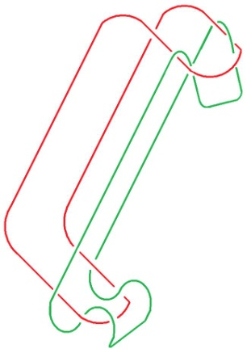
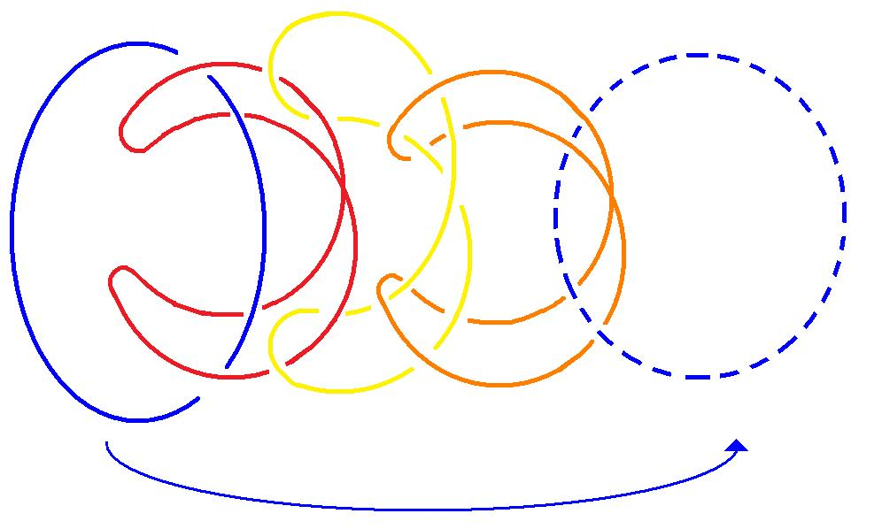
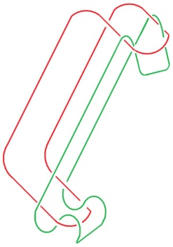
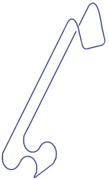
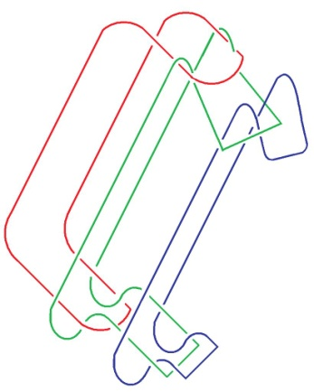
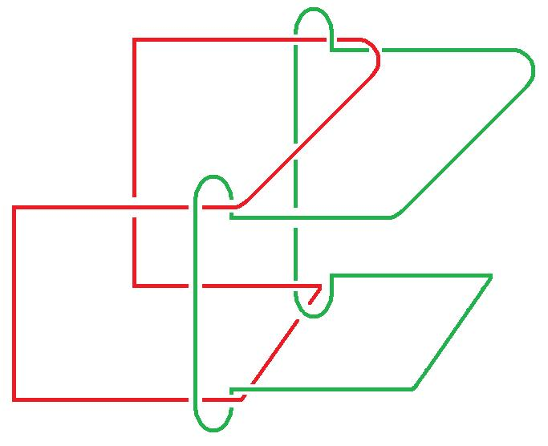
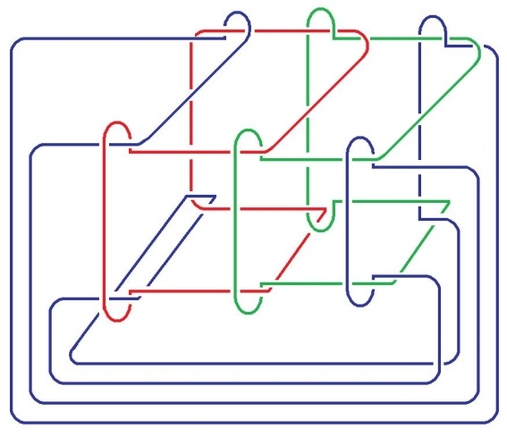

# Leçon 06 | 14 Février 1978

  <label><input type="checkbox" data-lacan-toggle="original" checked> 原文</label>
  <label><input type="checkbox" data-lacan-toggle="notes" checked> 注释</label>
  <label><input type="checkbox" data-lacan-toggle="commentary" checked> 个人解读评论</label>

<section class="parallel-paragraph" data-paragraph-ids="s25-06-0001">

s25-06-0001

[无对应译文]

原文 · s25-06-0001

Je suis un petit peu ennuyé parce qu’il se trouve que je n’ai pas l’inten­tion de vous ménager aujourd’hui. Voilà !

</section>

<section class="parallel-paragraph" data-paragraph-ids="s25-06-0002">

s25-06-0002

[无对应译文]

原文 · s25-06-0002

Ιl y a quelque chose que je me suis demandé, et que je fais mes efforts pour résoudre.

</section>

<section class="parallel-paragraph" data-paragraph-ids="s25-06-0003">

s25-06-0003

[无对应译文]

原文 · s25-06-0003

C’est quelque chose qui consiste en ceci : supposons quelque chose qui se pré­sente comme ceci, en d’autres termes, qui comporte une double boucle.

</section>

<section class="parallel-paragraph" data-paragraph-ids="s25-06-0004">

s25-06-0004

[无对应译文]

原文 · s25-06-0004

</section>

<section class="parallel-paragraph" data-paragraph-ids="s25-06-0005">

s25-06-0005

[无对应译文]

原文 · s25-06-0005

On est capable avec ça, c’est-à-dire avec cette amorce, de faire un nœud borroméen à 3.

</section>

<section class="parallel-paragraph" data-paragraph-ids="s25-06-0006">

s25-06-0006

[无对应译文]

原文 · s25-06-0006

Vous voyez bien qu’ici les deux cercles qui se trouvent être quelque chose comme ça \- ce sont des cercles vus en perspective - les deux cercles se nouent.

</section>

<section class="parallel-paragraph" data-paragraph-ids="s25-06-0007">

s25-06-0007

[无对应译文]

原文 · s25-06-0007

C’est une idée qui m’est venue, je n’étais pas sûr que ça ferait un nœud borroméen.

</section>

<section class="parallel-paragraph" data-paragraph-ids="s25-06-0008">

s25-06-0008

[无对应译文]

原文 · s25-06-0008

Mais enfin, j’en ai parlé et ça s’est trouvé exact.

</section>

<section class="parallel-paragraph" data-paragraph-ids="s25-06-0009">

s25-06-0009

[无对应译文]

原文 · s25-06-0009

Ιl faut ici que vous y mettiez un peu de bonne volonté, voilà comment ça se goupille.

</section>

<section class="parallel-paragraph" data-paragraph-ids="s25-06-0010">

s25-06-0010

[无对应译文]

原文 · s25-06-0010

J’ai mis ça à l’épreuve avec le nommé Soury que - pour l’instant - je fréquente.

</section>

<section class="parallel-paragraph" data-paragraph-ids="s25-06-0011">

s25-06-0011

[无对应译文]

原文 · s25-06-0011

Je le fréquente parce qu’il me dit des choses sensées sur le sujet de ces nœuds borroméens.

</section>

<section class="parallel-paragraph" data-paragraph-ids="s25-06-0012">

s25-06-0012

[无对应译文]

原文 · s25-06-0012

Néanmoins je peux pas dire qu’il ne me donne pas de *tintouin*.

</section>

<section class="parallel-paragraph" data-paragraph-ids="s25-06-0013">

s25-06-0013

[无对应译文]

原文 · s25-06-0013

Je veux dire que pour ce nœud borroméen, il voulait à tout prix le faire à 4.

</section>

<section class="parallel-paragraph" data-paragraph-ids="s25-06-0014">

s25-06-0014

[无对应译文]

原文 · s25-06-0014

Ιl y en avait déjà à 2, pourquoi le faire à 4 ? Ceci d’autant plus qu’à 2, il ne tient pas.

</section>

<section class="parallel-paragraph" data-paragraph-ids="s25-06-0015">

s25-06-0015

[无对应译文]

原文 · s25-06-0015

À 4 - me semble-t-il - il ne tiendrait pas plus, c’est à savoir qu’il se dénouerait assurément, à moins de le faire circulaire.

</section>

<section class="parallel-paragraph" data-paragraph-ids="s25-06-0016">

s25-06-0016

[无对应译文]

原文 · s25-06-0016

Je vous ai déjà parlé de cette chaîne borroméenne circulaire.

</section>

<section class="parallel-paragraph" data-paragraph-ids="s25-06-0017">

s25-06-0017

[无对应译文]

原文 · s25-06-0017

Elle suppose quelque chose qui, comme on dit, raboute le début, au commencement, et ce quelque chose qui ne peut être que le rond qui la termine et du même coup l’inaugure :

</section>

<section class="parallel-paragraph" data-paragraph-ids="s25-06-0018">

s25-06-0018

[无对应译文]

原文 · s25-06-0018

</section>

<section class="parallel-paragraph" data-paragraph-ids="s25-06-0019">

s25-06-0019

[无对应译文]

原文 · s25-06-0019

Ce nœud borroméen, celui qui s’ébauche, comme je viens de le dire, n’est pas circulaire.

</section>

<section class="parallel-paragraph" data-paragraph-ids="s25-06-0020">

s25-06-0020

[无对应译文]

原文 · s25-06-0020

Plus exactement il n’est circulaire qu’à 3. À 3, à condition de faire passer dessous l’inférieur, dessus le supérieur, nous obtenons un nœud borroméen typique, c’est-à-dire celui-ci : Celui-ci \[I\] et celui-ci \[II\], ils se complètent comme ceci \[III\]  :

</section>

<section class="parallel-paragraph" data-paragraph-ids="s25-06-0021">

s25-06-0021

[无对应译文]

原文 · s25-06-0021

</section>

<section class="parallel-paragraph" data-paragraph-ids="s25-06-0022">

s25-06-0022

[无对应译文]

原文 · s25-06-0022

> I II III Ιl est tout à fait clair qu’à ce nœud borroméen, on ne s’est pas encore habitué. Pourquoi diable l’ai-je introduit ?

</section>

<section class="parallel-paragraph" data-paragraph-ids="s25-06-0023">

s25-06-0023

[无对应译文]

原文 · s25-06-0023

Je l’ai introduit parce qu’il me semblait que ça avait quelque chose à faire avec la clinique.

</section>

<section class="parallel-paragraph" data-paragraph-ids="s25-06-0024">

s25-06-0024

[无对应译文]

原文 · s25-06-0024

Je veux dire que le trio *de l’Imaginaire, du Symbolique et du Réel*, me paraissait avoir un sens.

</section>

<section class="parallel-paragraph" data-paragraph-ids="s25-06-0025">

s25-06-0025

[无对应译文]

原文 · s25-06-0025

De fait il est certain c’est quelque chose qui se goupille comme ceci, c’est-à-dire qui est le 3ème \[III\], eh bien ça se noue.

</section>

<section class="parallel-paragraph" data-paragraph-ids="s25-06-0026">

s25-06-0026

[无对应译文]

原文 · s25-06-0026

Ça n’est pas évi­dent sur la figure qui est là.

</section>

<section class="parallel-paragraph" data-paragraph-ids="s25-06-0027">

s25-06-0027

[无对应译文]

原文 · s25-06-0027

Mais si on mettait la chose que j’ai ajoutée en noir, mise en tête, je veux dire ici, on verrait que ces 2 noirs \[I\] peuvent s’identifier.

</section>

<section class="parallel-paragraph" data-paragraph-ids="s25-06-0028">

s25-06-0028

[无对应译文]

原文 · s25-06-0028

Je vais tâcher de vous le montrer à l’aide d’un dessin supplémentaire. C’est vraiment très compliqué.

</section>

<section class="parallel-paragraph" data-paragraph-ids="s25-06-0029">

s25-06-0029

[无对应译文]

原文 · s25-06-0029

C’est à peu près ça, à condition de le compléter comme ceci.

</section>

<section class="parallel-paragraph" data-paragraph-ids="s25-06-0030">

s25-06-0030

[无对应译文]

原文 · s25-06-0030

Ιl est bien évident que je suis extrêmement maladroit \[*Rires*\] pour me retrouver dans ces dessins.

</section>

<section class="parallel-paragraph" data-paragraph-ids="s25-06-0031">

s25-06-0031

[无对应译文]

原文 · s25-06-0031

Ιl y a une autre façon de le faire \[Rires\], c’est celle que je dois à Soury et qui se présente à peu près comme ceci.

</section>

<section class="parallel-paragraph" data-paragraph-ids="s25-06-0032">

s25-06-0032

[无对应译文]

原文 · s25-06-0032

La façon de le faire est la suivante \[IV\], ce qui se complète dans le dessin suivant \[V\] qui bien évidemment n’est pas très clair..

</section>

<section class="parallel-paragraph" data-paragraph-ids="s25-06-0033">

s25-06-0033

[无对应译文]

原文 · s25-06-0033

 

</section>

<section class="parallel-paragraph" data-paragraph-ids="s25-06-0034">

s25-06-0034

[无对应译文]

原文 · s25-06-0034

IV V

</section>

<section class="parallel-paragraph" data-paragraph-ids="s25-06-0035">

s25-06-0035

[无对应译文]

原文 · s25-06-0035

Sachez qu’il est concevable de mettre ici le 3e dessin, je veux dire le des­sin noir \[bleu ici\].

</section>

<section class="parallel-paragraph" data-paragraph-ids="s25-06-0036">

s25-06-0036

[无对应译文]

原文 · s25-06-0036

Peut-être, ce qui incontestablement se dénoue tel que c’est pré­senté ici, peut-être arriverez-vous à reconstituer ceci : qu’ils se nouent.

</section>

<section class="parallel-paragraph" data-paragraph-ids="s25-06-0037">

s25-06-0037

[无对应译文]

原文 · s25-06-0037

Je veux dire qu’il y a un nœud borroméen à 3 qui se constitue du raboutage, je veux dire du fait que ça se clôt.

</section>

<section class="parallel-paragraph" data-paragraph-ids="s25-06-0038">

s25-06-0038

[无对应译文]

原文 · s25-06-0038

Que ça se clôt exactement comme dans ce que je vous ai montré là improprement, ça se clôt exacte­ment comme dans le cas du nœud borroméen simple. Voilà !

</section>

<section class="parallel-paragraph" data-paragraph-ids="s25-06-0039">

s25-06-0039

[无对应译文]

原文 · s25-06-0039

Je m’excuse de n’avoir pas pu mieux préparer cette leçon.

</section>

<section class="parallel-paragraph" data-paragraph-ids="s25-06-0040">

s25-06-0040

[无对应译文]

原文 · s25-06-0040

Je tâcherai la prochaine fois de vous faire distribuer quelques dessins un peu plus clairs.

</section>

<section class="parallel-paragraph" data-paragraph-ids="s25-06-0041">

s25-06-0041

[无对应译文]

原文 · s25-06-0041

Voilà, je vous quitte là aujourd’hui.

</section>

