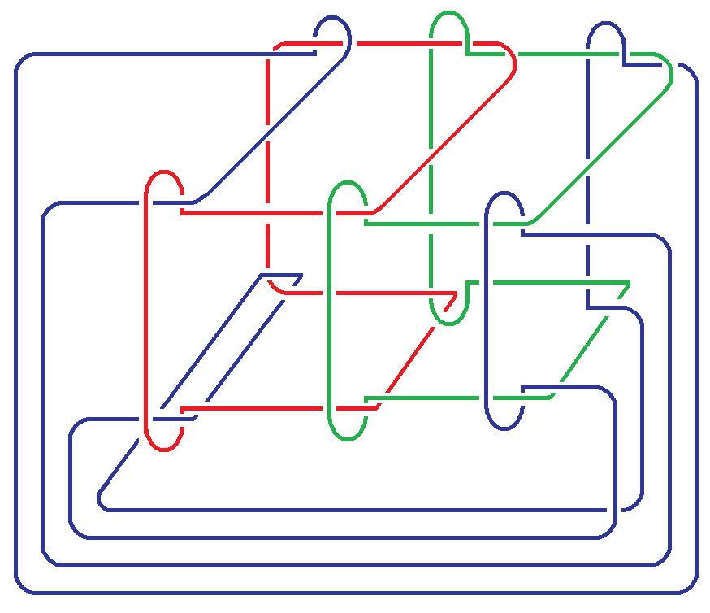
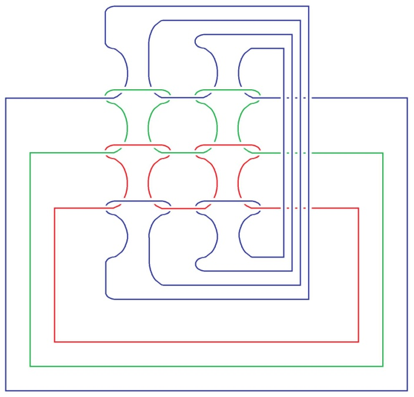

# Leçon 07 | 21 Février 1978

  <label><input type="checkbox" data-lacan-toggle="original" checked> 原文</label>
  <label><input type="checkbox" data-lacan-toggle="notes" checked> 注释</label>
  <label><input type="checkbox" data-lacan-toggle="commentary" checked> 个人解读评论</label>

<section class="parallel-paragraph" data-paragraph-ids="s25-07-0001">

s25-07-0001

[无对应译文]

原文 · s25-07-0001

[Pierre Soury](#SOURY21Fev)

</section>

<section class="parallel-paragraph" data-paragraph-ids="s25-07-0002">

s25-07-0002

[无对应译文]

原文 · s25-07-0002

Lacan Ιl y a un nommé Montcenis, c’est tout au moins ce que j’ai cru lire sur le texte qu’il m’a envoyé, il n’est pas là ? C’est vous ?

</section>

<section class="parallel-paragraph" data-paragraph-ids="s25-07-0003">

s25-07-0003

[无对应译文]

原文 · s25-07-0003

Bon, je vous remer­cie beaucoup d’avoir reçu ce texte qui prouve tout au moins qu’il y a des gens qui ont pu relever, relever d’une façon convenable, les ronds de ficel­le que j’ai donnés la dernière fois.

</section>

<section class="parallel-paragraph" data-paragraph-ids="s25-07-0004">

s25-07-0004

[无对应译文]

原文 · s25-07-0004

Je répète que ce dont il s’agit, c’est de quelque chose comme ça :

</section>

<section class="parallel-paragraph" data-paragraph-ids="s25-07-0005">

s25-07-0005

[无对应译文]

原文 · s25-07-0005

</section>

<section class="parallel-paragraph" data-paragraph-ids="s25-07-0006">

s25-07-0006

[无对应译文]

原文 · s25-07-0006

Grâce à Soury, ici présent, J’ai pu obtenir la transformation de cette chose triple que j’ai essayé de reproduire là, cette chose à 3 éléments, grâce à Soury donc, par une transformation progressive, nous avons quelque chose qui a les mêmes 3 éléments.

</section>

<section class="parallel-paragraph" data-paragraph-ids="s25-07-0007">

s25-07-0007

[无对应译文]

原文 · s25-07-0007

Et si vous considérez ce qui se trouve en haut, vous pouvez constater...

</section>

<section class="parallel-paragraph" data-paragraph-ids="s25-07-0008">

s25-07-0008

[无对应译文]

原文 · s25-07-0008

> ce qui se trouve en haut sur la feuille que je vous ai distribuée, à seule fin que vous la reproduisiez ...ce qui se trouve en haut à condition que de le mettre, de le considérer, ce qui se trouve en haut, vous pouvez voir que ceci reproduit, reproduit la figure qui est ici présente. Ιl suffit simplement de vous apercevoir que ceci passe sous les trois éléments qui composent la figure. Et que ceci - à partir du moment où ce que vous voyez à droite, passe sous ce que j’ai appelé les trois éléments - ceci permet de descendre ce qu’il en est de l’élément noir et qu’on obtient cette figure-là.

</section>

<section class="parallel-paragraph" data-paragraph-ids="s25-07-0009">

s25-07-0009

[无对应译文]

原文 · s25-07-0009

Ce que je demande maintenant à Soury, c’est comment la figure en bas peut être tripotée de façon telle qu’elle reproduise la figure qui est en haut. Ιl a bien essayé de me figurer ce dont il s’agit, à savoir de rabattre ce qui figure en bas, sous la forme de ce qui vient en avant, et qui pourrait donc se rabattre selon un mouvement qui déplacerait en avant ce qui paraît libre.

</section>

<section class="parallel-paragraph" data-paragraph-ids="s25-07-0010">

s25-07-0010

[无对应译文]

原文 · s25-07-0010

Je ne vois pas qu’il m’ait là-dessus convaincu. Je crois que très exactement ces deux objets sont *différents*.

</section>

<section class="parallel-paragraph" data-paragraph-ids="s25-07-0011">

s25-07-0011

[无对应译文]

原文 · s25-07-0011

 

</section>

<section class="parallel-paragraph" data-paragraph-ids="s25-07-0012">

s25-07-0012

[无对应译文]

原文 · s25-07-0012

Νicole Sels - C’est le même. C’est retourné comme une crêpe.

</section>

<section class="parallel-paragraph" data-paragraph-ids="s25-07-0013">

s25-07-0013

[无对应译文]

原文 · s25-07-0013

Lacan

</section>

<section class="parallel-paragraph" data-paragraph-ids="s25-07-0014">

s25-07-0014

[无对应译文]

原文 · s25-07-0014

Je ne vois pas que ce soit retourné comme une crêpe. Je ne vois pas que ce soit le cas.

</section>

<section class="parallel-paragraph" data-paragraph-ids="s25-07-0015">

s25-07-0015

[无对应译文]

原文 · s25-07-0015

On me commu­nique que la figure d’en haut est l’image de ce que l’on voit *dans un miroir* placé derrière la figure d’en bas.

</section>

<section class="parallel-paragraph" data-paragraph-ids="s25-07-0016">

s25-07-0016

[无对应译文]

原文 · s25-07-0016

C’est très précisément cette question de miroir qui différencie les deux figures, car une figure placée dans un miroir est inversée.

</section>

<section class="parallel-paragraph" data-paragraph-ids="s25-07-0017">

s25-07-0017

[无对应译文]

原文 · s25-07-0017

C’est bien ça qui fait que j’objecte à Soury que c’est ce qu’il appelle ou ce qu’il définit par couple.

</section>

<section class="parallel-paragraph" data-paragraph-ids="s25-07-0018">

s25-07-0018

[无对应译文]

原文 · s25-07-0018

Une figure placée dans un miroir n’est pas identique à la figure primitive.

</section>

<section class="parallel-paragraph" data-paragraph-ids="s25-07-0019">

s25-07-0019

[无对应译文]

原文 · s25-07-0019

Est-ce que Soury peut ici intervenir ?

</section>

<section class="parallel-paragraph" data-paragraph-ids="s25-07-0020">

s25-07-0020

[无对应译文]

原文 · s25-07-0020

[Intervention de Pierre Soury](#Fev21)

</section>

<section class="parallel-paragraph" data-paragraph-ids="s25-07-0021">

s25-07-0021

[无对应译文]

原文 · s25-07-0021

Oui. Alors il y a là-dedans, il y a beau­coup d’inversions. Il y a différentes sortes d’inversions :

</section>

<section class="parallel-paragraph" data-paragraph-ids="s25-07-0022">

s25-07-0022

[无对应译文]

原文 · s25-07-0022

- il y a *l’inversion* « *image-miroir* »,

</section>

<section class="parallel-paragraph" data-paragraph-ids="s25-07-0023">

s25-07-0023

[无对应译文]

原文 · s25-07-0023

- il y a *l’inversion* « *retourner le papier comme si c’était quelque chose en vannerie* »,

</section>

<section class="parallel-paragraph" data-paragraph-ids="s25-07-0024">

s25-07-0024

[无对应译文]

原文 · s25-07-0024

- il y a *l’inversion* « *échanger les dessus-des­sous* »,

</section>

<section class="parallel-paragraph" data-paragraph-ids="s25-07-0025">

s25-07-0025

[无对应译文]

原文 · s25-07-0025

- il y a *l’inversion* comme quoi « *les mailles à l’endroit deviennent des mailles à l’envers* » puisque c’est du tricot,

</section>

<section class="parallel-paragraph" data-paragraph-ids="s25-07-0026">

s25-07-0026

[无对应译文]

原文 · s25-07-0026

- il y a *l’inversion* comme quoi les rangées - là-dedans il y a des *lignes de rangées* et des *lignes de mailles* - il faut savoir si les *lignes de rangée* passent en-dessous ou en-­dessus des *lignes de mailles*, c’est-à-dire dans le dessin du haut les *lignes de mailles* passent en-dessous des *lignes de mailles* et, dans le dessin du bas, c’est le contraire.

</section>

<section class="parallel-paragraph" data-paragraph-ids="s25-07-0027">

s25-07-0027

[无对应译文]

原文 · s25-07-0027

Alors des inversions il n’y en a pas qu’une, il y en a des quantités.

</section>

<section class="parallel-paragraph" data-paragraph-ids="s25-07-0028">

s25-07-0028

[无对应译文]

原文 · s25-07-0028

C’est une difficulté là-dedans, c’est qu’il n’y a pas qu’une inversion, il y a de multiples inversions. Bon.

</section>

<section class="parallel-paragraph" data-paragraph-ids="s25-07-0029">

s25-07-0029

[无对应译文]

原文 · s25-07-0029

Lacan - Ιl y a de multiples inversions. Ιl y en a combien ?

</section>

<section class="parallel-paragraph" data-paragraph-ids="s25-07-0030">

s25-07-0030

[无对应译文]

原文 · s25-07-0030

Pierre Soury

</section>

<section class="parallel-paragraph" data-paragraph-ids="s25-07-0031">

s25-07-0031

[无对应译文]

原文 · s25-07-0031

Ça a tendance à proliférer \[*Rires*\].

</section>

<section class="parallel-paragraph" data-paragraph-ids="s25-07-0032">

s25-07-0032

[无对应译文]

原文 · s25-07-0032

Ici il y a une inversion principale qui est une *inversion d’objet*.

</section>

<section class="parallel-paragraph" data-paragraph-ids="s25-07-0033">

s25-07-0033

[无对应译文]

原文 · s25-07-0033

l’inversion principale comme quoi il y a deux objets, c’est les deux *tricots toriques*.

</section>

<section class="parallel-paragraph" data-paragraph-ids="s25-07-0034">

s25-07-0034

[无对应译文]

原文 · s25-07-0034

Lacan - Les deux…?

</section>

<section class="parallel-paragraph" data-paragraph-ids="s25-07-0035">

s25-07-0035

[无对应译文]

原文 · s25-07-0035

Pierre Soury

</section>

<section class="parallel-paragraph" data-paragraph-ids="s25-07-0036">

s25-07-0036

[无对应译文]

原文 · s25-07-0036

Les deux *tricots toriques*. Ιl y a deux *tricots toriques*, ce sont deux *chaînes* différentes.

</section>

<section class="parallel-paragraph" data-paragraph-ids="s25-07-0037">

s25-07-0037

[无对应译文]

原文 · s25-07-0037

Ça, c’est *l’inversion principale* parce que c’est deux objets.

</section>

<section class="parallel-paragraph" data-paragraph-ids="s25-07-0038">

s25-07-0038

[无对应译文]

原文 · s25-07-0038

Ιl y a une autre inversion, c’est l’inversion « *maille à l’en­droit, maille à l’envers* », c’est-à-dire les deux faces d’un tissu *jersey*, les deux faces du *tricot régulier*...

</section>

<section class="parallel-paragraph" data-paragraph-ids="s25-07-0039">

s25-07-0039

[无对应译文]

原文 · s25-07-0039

> le tricot régulier, c’est le tricot jersey qui a deux faces ...ça, c’est *une inversion* tout à fait importante dans la *chaîne*.

</section>

<section class="parallel-paragraph" data-paragraph-ids="s25-07-0040">

s25-07-0040

[无对应译文]

原文 · s25-07-0040

C’est-à-dire que là-dedans il s’agit de tricots toriques, c’est-à-dire d’un tore habillé de tricot...

</section>

<section class="parallel-paragraph" data-paragraph-ids="s25-07-0041">

s25-07-0041

[无对应译文]

原文 · s25-07-0041

> habillé d’un tricot régulier, d’un tricot *jersey* ...et l’une des faces du tore est en *mailles à l’endroit* et l’autre face du tore est en *mailles à l’envers*. Ça, c’est une seconde inversion.

</section>

<section class="parallel-paragraph" data-paragraph-ids="s25-07-0042">

s25-07-0042

[无对应译文]

原文 · s25-07-0042

Là-dedans il y a encore d’autres inversions qui sont les inversions du tore, c’est-à-dire :

</section>

<section class="parallel-paragraph" data-paragraph-ids="s25-07-0043">

s25-07-0043

[无对应译文]

原文 · s25-07-0043

- on peut changer méridien et longitude

</section>

<section class="parallel-paragraph" data-paragraph-ids="s25-07-0044">

s25-07-0044

[无对应译文]

原文 · s25-07-0044

- ou échanger inté­rieur et extérieur.

</section>

<section class="parallel-paragraph" data-paragraph-ids="s25-07-0045">

s25-07-0045

[无对应译文]

原文 · s25-07-0045

J’en suis déjà à 4 inversions. Ιl y a l’inversion de retournement du tore. Ça fait 5 inversions.

</section>

<section class="parallel-paragraph" data-paragraph-ids="s25-07-0046">

s25-07-0046

[无对应译文]

原文 · s25-07-0046

Maintenant, sur la présentation plane qui est là, l’inversion principale, c’est l’inversion...

</section>

<section class="parallel-paragraph" data-paragraph-ids="s25-07-0047">

s25-07-0047

[无对应译文]

原文 · s25-07-0047

> enfin, il y a *une inversion apparente* plutôt ...c’est *l’inversion de dessus-dessous*, c’est-à-dire que ces deux dessins se déduisent l’un de l’autre en changeant tous *les dessus-dessous*.

</section>

<section class="parallel-paragraph" data-paragraph-ids="s25-07-0048">

s25-07-0048

[无对应译文]

原文 · s25-07-0048

Je ne sais pas à combien d’inversions j’en suis. Dans cette *présentation plane*, j’ai­merais y voir deux *inversions *:

</section>

<section class="parallel-paragraph" data-paragraph-ids="s25-07-0049">

s25-07-0049

[无对应译文]

原文 · s25-07-0049

- c’est-à-dire qu’il y a l’inversion de tricot, c’est-à-dire que dans la partie centrale, *les mailles à l’endroit* deviennent *des mailles à l’envers*, sur cette présentation plane c’est une inversion,

</section>

<section class="parallel-paragraph" data-paragraph-ids="s25-07-0050">

s25-07-0050

[无对应译文]

原文 · s25-07-0050

- et l’autre inversion, c’est cette affaire que les lignes de mailles pas­sent dessous ou dessus les lignes de rangées.

</section>

<section class="parallel-paragraph" data-paragraph-ids="s25-07-0051">

s25-07-0051

[无对应译文]

原文 · s25-07-0051

Alors quand il y a plusieurs inversions qui se combinent...

</section>

<section class="parallel-paragraph" data-paragraph-ids="s25-07-0052">

s25-07-0052

[无对应译文]

原文 · s25-07-0052

> déjà quand il y a simplement *une inversion*, genre *gauche-droite*, on a toutes raisons de prendre gauche pour droite et réciproquement. Déjà simplement un couple, un binaire : une inversion, on a toutes les chances
>
> de se tromper, de choisir l’un quand on veut choisir l’autre. ...quand il y a plusieurs inver­sions, ben c’est ce que j’appelai les binaires et la liaison des binaires.

</section>

<section class="parallel-paragraph" data-paragraph-ids="s25-07-0053">

s25-07-0053

[无对应译文]

原文 · s25-07-0053

Enfin bref ! Où j’en suis ?

</section>

<section class="parallel-paragraph" data-paragraph-ids="s25-07-0054">

s25-07-0054

[无对应译文]

原文 · s25-07-0054

Pour s’assurer, pour se faire des certitudes là-dessus, à mon avis, ça ne suffit pas de réussir à imaginer dans l’espace une déformation, parce qu’imaginer dans l’espace une déformation, on reste trop dépendant de ces inversions de couples et inversions de binaires.

</section>

<section class="parallel-paragraph" data-paragraph-ids="s25-07-0055">

s25-07-0055

[无对应译文]

原文 · s25-07-0055

Ça me paraît nécessaire par rapport à la prolifération des binaires, des couples des inversions, de faire du *recensement exhaustif*.

</section>

<section class="parallel-paragraph" data-paragraph-ids="s25-07-0056">

s25-07-0056

[无对应译文]

原文 · s25-07-0056

Alors le défaut de cette feuille, de ce point de vue là, c’est qu’il n’y a pas un *recensement exhaustif*.

</section>

<section class="parallel-paragraph" data-paragraph-ids="s25-07-0057">

s25-07-0057

[无对应译文]

原文 · s25-07-0057

C’est-à-dire pour faire le *recensement exhaustif* qui corres­pondrait à cette feuille-là, il faudrait quatre figures.

</section>

<section class="parallel-paragraph" data-paragraph-ids="s25-07-0058">

s25-07-0058

[无对应译文]

原文 · s25-07-0058

C’est-à-dire qu’il y ait les quatre combinaisons possibles, d’une part maille à l’endroit, maille à l’envers et d’autre part, savoir si les lignes de mailles et de rangées passent au-dessus ou au-dessous l’une de l’autre.

</section>

<section class="parallel-paragraph" data-paragraph-ids="s25-07-0059">

s25-07-0059

[无对应译文]

原文 · s25-07-0059

Ιl faudrait *quatre dessins* pour avoir quelque chose *d’exhaustif*...

</section>

<section class="parallel-paragraph" data-paragraph-ids="s25-07-0060">

s25-07-0060

[无对应译文]

原文 · s25-07-0060

> je répète, par rapport à ces inversions, on ne peut que s’y perdre : il y a besoin de quelque chose d’exhaustif ...donc, il manque une seconde feuille, ce qui fait qu’on a quatre dessins. Ιl y aurait quatre présentations planes.

</section>

<section class="parallel-paragraph" data-paragraph-ids="s25-07-0061">

s25-07-0061

[无对应译文]

原文 · s25-07-0061

Sur ces quatre présentations planes, alors là, ça serait la bonne mise en place pour discuter : est-ce que ces quatre pré­sentations sont présentations de combien d’objets ?

</section>

<section class="parallel-paragraph" data-paragraph-ids="s25-07-0062">

s25-07-0062

[无对应译文]

原文 · s25-07-0062

Car il se trouve que ces quatre présentations seraient présentations de deux objets.

</section>

<section class="parallel-paragraph" data-paragraph-ids="s25-07-0063">

s25-07-0063

[无对应译文]

原文 · s25-07-0063

C’est-à-dire qu’il y a des changements de présentations qui ne changent pas l’ob­jet.

</section>

<section class="parallel-paragraph" data-paragraph-ids="s25-07-0064">

s25-07-0064

[无对应译文]

原文 · s25-07-0064

Alors il se trouve que, sur cette feuille, il y a deux présentations du même objet.

</section>

<section class="parallel-paragraph" data-paragraph-ids="s25-07-0065">

s25-07-0065

[无对应译文]

原文 · s25-07-0065

Lacan Ιl est - me semble-t-il - clair que si on divise cette feuille, ce qu’on voit sur la figure du bas est exactement ce qui est reproduit en miroir par ce qui se figure dans l’image du haut.

</section>

<section class="parallel-paragraph" data-paragraph-ids="s25-07-0066">

s25-07-0066

[无对应译文]

原文 · s25-07-0066

Νicole Sels - Non, non !

</section>

<section class="parallel-paragraph" data-paragraph-ids="s25-07-0067">

s25-07-0067

[无对应译文]

原文 · s25-07-0067

Lacan *–* Comment ?

</section>

<section class="parallel-paragraph" data-paragraph-ids="s25-07-0068">

s25-07-0068

[无对应译文]

原文 · s25-07-0068

Νicole Sels - Si c’était en miroir, ce qui est à gauche dans l’un serait à droi­te dans l’autre.

</section>

<section class="parallel-paragraph" data-paragraph-ids="s25-07-0069">

s25-07-0069

[无对应译文]

原文 · s25-07-0069

Lacan

</section>

<section class="parallel-paragraph" data-paragraph-ids="s25-07-0070">

s25-07-0070

[无对应译文]

原文 · s25-07-0070

Ce sont deux objets différents, parce que l’un est l’image de l’autre en miroir.

</section>

<section class="parallel-paragraph" data-paragraph-ids="s25-07-0071">

s25-07-0071

[无对应译文]

原文 · s25-07-0071

Ce que vous soutenez, c’est que ce qui se passe...

</section>

<section class="parallel-paragraph" data-paragraph-ids="s25-07-0072">

s25-07-0072

[无对应译文]

原文 · s25-07-0072

> puisqu’il y a quatre inversions d’après ce que vous dites ...c’est que ça serait quatre inversions et qu’il y aurait deux objets, deux objets *distincts* dans ces quatre inversions.

</section>

<section class="parallel-paragraph" data-paragraph-ids="s25-07-0073">

s25-07-0073

[无对应译文]

原文 · s25-07-0073

Je ne vois ici qu’une inversion.

</section>

<section class="parallel-paragraph" data-paragraph-ids="s25-07-0074">

s25-07-0074

[无对应译文]

原文 · s25-07-0074

Je suis de l’avis de la per­sonne qui me communique que les deux schémas représentent le même objet.

</section>

<section class="parallel-paragraph" data-paragraph-ids="s25-07-0075">

s25-07-0075

[无对应译文]

原文 · s25-07-0075

Si nous concrétisons par trois ficelles concrètes, le schéma d’en haut est l’image du schéma d’en bas, vu toujours dans un miroir mis derrière, et *vice-versa*. L’objet considéré n’a que ces deux schémas.

</section>

<section class="parallel-paragraph" data-paragraph-ids="s25-07-0076">

s25-07-0076

[无对应译文]

原文 · s25-07-0076

Et à ce titre le schéma, le rapport de ces deux schémas, est celui d’une image en miroir. Donc ça ne coïncide pas.

</section>

<section class="parallel-paragraph" data-paragraph-ids="s25-07-0077">

s25-07-0077

[无对应译文]

原文 · s25-07-0077

Une image en miroir ne coïncide pas avec l’ob­jet primitif, avec la figure primitive. Ιl n’y a pas deux inversions, il n’y en a qu’une.

</section>

<section class="parallel-paragraph" data-paragraph-ids="s25-07-0078">

s25-07-0078

[无对应译文]

原文 · s25-07-0078

Ιl n’y en a qu’une, mais qui introduit une différence essentielle, c’est à savoir que *la figure en miroir* n’est pas identique à ce qui se voit de *la figure primitive*. Ιl y a une seule inversion. Voilà !

</section>

<section class="parallel-paragraph" data-paragraph-ids="s25-07-0079">

s25-07-0079

[无对应译文]

原文 · s25-07-0079

Je vais donc vous renvoyer maintenant, puisque je crois - en une matière qui n’est pas spécialement difficile - vous avoir dit ce qu’il en est de ces deux images, une fois inversées. Et qui ne sont inversées qu’une fois.

</section>

<section class="parallel-paragraph" data-paragraph-ids="s25-07-0080">

s25-07-0080

[无对应译文]

原文 · s25-07-0080

Voilà. Je vais en rester là pour aujourd’hui.

</section>

