# Leçon 09 | 21 Mars 1978

  <label><input type="checkbox" data-lacan-toggle="original" checked> 原文</label>
  <label><input type="checkbox" data-lacan-toggle="notes" checked> 注释</label>
  <label><input type="checkbox" data-lacan-toggle="commentary" checked> 个人解读评论</label>

<section class="parallel-paragraph" data-paragraph-ids="s25-09-0001">

s25-09-0001

[无对应译文]

原文 · s25-09-0001

[Soury](#SOURY21Mars)

</section>

<section class="parallel-paragraph" data-paragraph-ids="s25-09-0002">

s25-09-0002

[无对应译文]

原文 · s25-09-0002

Lacan

</section>

<section class="parallel-paragraph" data-paragraph-ids="s25-09-0003">

s25-09-0003

[无对应译文]

原文 · s25-09-0003

Je vous avertis que Madame Ahrweiler - Présidente de l’Université de Paris Ι - Madame Ahrweiler a bien voulu faire que j’énonce mon séminai­re le 11 et le 18 avril. C’est la période des vacances et donc vous aurez pro­bablement tout juste à entrer par la porte qui est, non pas sur la *rue Saint-Jacques*, mais sur la *place du* *Panthéon.* En effet, j’en étais réduit à 2 séminaires puisque, pour ce qui est de mai, ça sera le 2ème mardi, mais pas le 3ème, étant donné qu’on m’a averti que dans cette salle même, il y aurait, le 3ème mardi, des examens.

</section>

<section class="parallel-paragraph" data-paragraph-ids="s25-09-0004">

s25-09-0004

[无对应译文]

原文 · s25-09-0004

Ιl n’en reste pas moins que je suis bien soucieux de ce qu’il en est, nom­mément du tore. Soury va vous passer des tores, des tores sur lesquels il y a quelque chose de tricoté. Ιl y a quelque chose qui me soucie particuliè­rement, c’est le rapport entre ce qu’on peut appeler *toricité* et le *trouage*. Ιl semble - aux dires de Soury - qu’il n’y ait pas de rapports entre le *trouage* et la *toricité*. Pour moi je ne peux pas dire que *je ne voie pas* de rap­ports, mais probablement que je me fais une idée confuse de ce qu’on peut appeler un tore.Vous avez eu, la dernière fois, une certaine présentation de ce qu’on peut faire avec le tore. Ιl y a quelque chose que Soury va vous passer tout à l’heure et qui comporte un trouage. C’est un trouage qui est artificiel, je veux dire que c’est un tore couvert d’un tricotage qui est plus nourri que celui simple, c’est-à-dire celui qui est - et c’est bien là la difficulté - celui qui est tracé comme tricot sur le tore.

</section>

<section class="parallel-paragraph" data-paragraph-ids="s25-09-0005">

s25-09-0005

[无对应译文]

原文 · s25-09-0005

1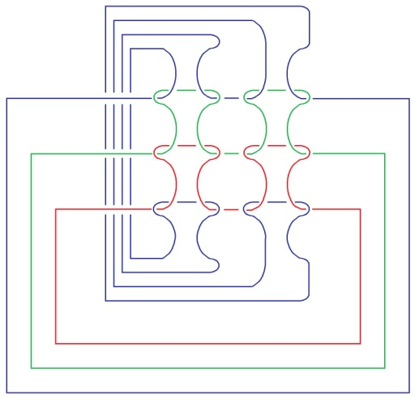 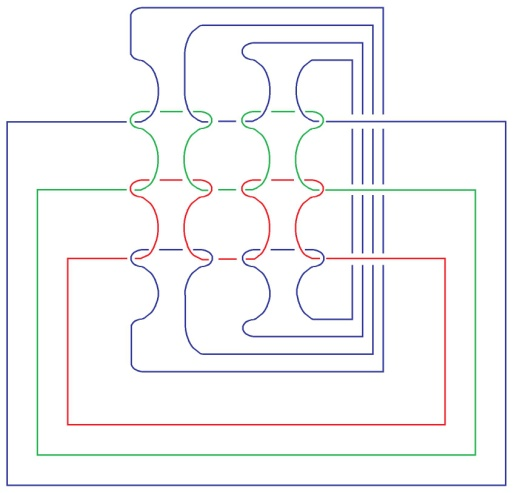3 2 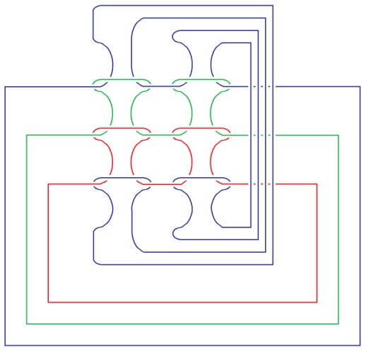4 5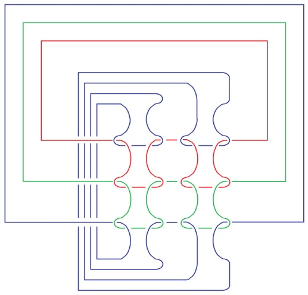 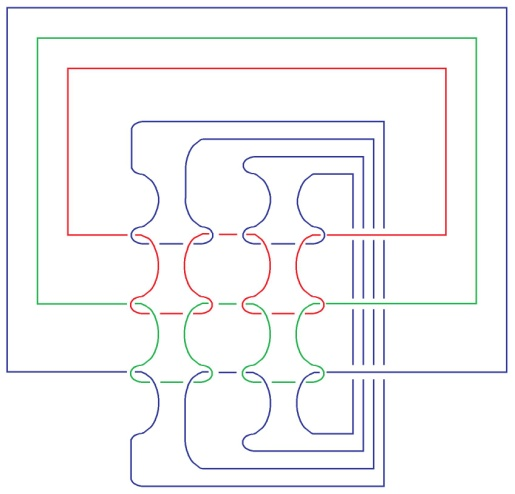7 6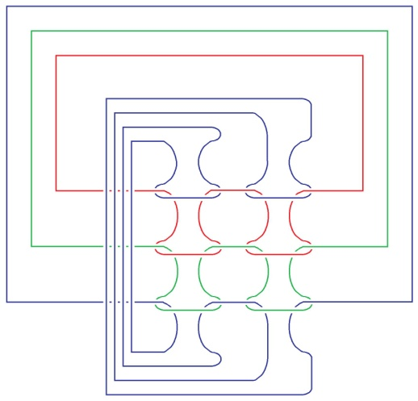 8

</section>

<section class="parallel-paragraph" data-paragraph-ids="s25-09-0006">

s25-09-0006

[无对应译文]

原文 · s25-09-0006

Je ne vous ai pas dissimulé ce que ceci comporte : le fait que ce soit tracé sur le tore est tout à fait de nature à ce que ça ne puisse pas - ce que je désigne « tracé » - que ça ne puisse pas passer pour un tricot. Ιl n’en reste pas moins que par convention, on pense, on articule que c’est un tricot. Mais il faudrait y adjoindre ce com­plément que ce qui peut se tracer de l’autre côté de la surface a à s’inverser et à s’inverser en mettant en valeur l’inversion du dessus-dessous, ce qui bien entendu complique franchement ce que nous pouvons dire de ce qui se passe à l’intérieur du tore.

</section>

<section class="parallel-paragraph" data-paragraph-ids="s25-09-0007">

s25-09-0007

[无对应译文]

原文 · s25-09-0007

C’est bien ce qui se manifeste dans la relati­ve complexité de ce qui est dessiné à ce niveau. \[Sur le tableau de Soury, 3e et 4e étages\]

</section>

<section class="parallel-paragraph" data-paragraph-ids="s25-09-0008">

s25-09-0008

[无对应译文]

原文 · s25-09-0008

Nous conviendrons de dire que l’inversion du dessus-dessous complique l’affaire, parce que ce que j’ai appelé tout à l’heure la complexité de ce tableau n’a rien à faire avec cette inversion qu’on peut convenir d’appeler, parce que c’est à l’intérieur du tore au lieu d’être à l’extérieur, qu’on peut appeler par définition, son image en miroir. Ça voudrait dire qu’il y a des miroirs toriques.

</section>

<section class="parallel-paragraph" data-paragraph-ids="s25-09-0009">

s25-09-0009

[无对应译文]

原文 · s25-09-0009

C’est une simple question de définition. Ιl est un fait que c’est ce qui est à l’extérieur qui passe pour important, *à l’extérieur du tore*, *tracé* *à l’extérieur du tore*. Ιl n’y a pas trace dans ces figures \[tableau de Soury, 3e et 4e étages\] il n’y a pas trace de cette inversion que j’ai appelée « *l’ima­ge en miroir torique* ». Le *trouage* est un moyen de *retournement*.

</section>

<section class="parallel-paragraph" data-paragraph-ids="s25-09-0010">

s25-09-0010

[无对应译文]

原文 · s25-09-0010

Par le trouage il est possible qu’une main s’introduise et aille saisir l’axe du tore, et par là le retourne.

</section>

<section class="parallel-paragraph" data-paragraph-ids="s25-09-0011">

s25-09-0011

[无对应译文]

原文 · s25-09-0011

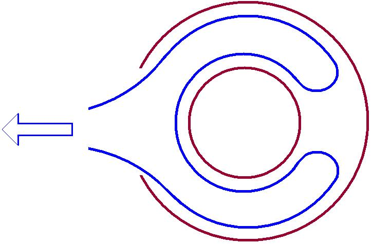

</section>

<section class="parallel-paragraph" data-paragraph-ids="s25-09-0012">

s25-09-0012

[无对应译文]

原文 · s25-09-0012

Mais il y a quelque chose d’autre qui est possible, c’est que par ce trou, en poussant à travers le trou l’ensemble du tore, on obtienne un effet de retournement.

</section>

<section class="parallel-paragraph" data-paragraph-ids="s25-09-0013">

s25-09-0013

[无对应译文]

原文 · s25-09-0013

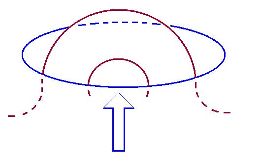

</section>

<section class="parallel-paragraph" data-paragraph-ids="s25-09-0014">

s25-09-0014

[无对应译文]

原文 · s25-09-0014

C’est ce que Soury vous manifestera tout à l’heure à l’aide d’un tricot torique un peu plus compliqué.

</section>

<section class="parallel-paragraph" data-paragraph-ids="s25-09-0015">

s25-09-0015

[无对应译文]

原文 · s25-09-0015

Ιl est frappant qu’on obtienne - en poussant l’extérieur du tore - qu’on obtienne exactement le même résultat.

</section>

<section class="parallel-paragraph" data-paragraph-ids="s25-09-0016">

s25-09-0016

[无对应译文]

原文 · s25-09-0016

Ce que je justifie en disant que ce trou par définition n’a pas à proprement parler de dimension, à savoir que c’est ainsi qu’il peut se présenter, à savoir que ce qui est trou ici peut aussi bien se projeter de la façon suivante : ce qui se présentera donc comme saisie de l’axe ici se trouvera inversé : la saisie de l’axe fera que ceci sera hors du trou, mais que - puisqu’il y a inversion du tore - la saisie de l’axe fera que le tore…

</section>

<section class="parallel-paragraph" data-paragraph-ids="s25-09-0017">

s25-09-0017

[无对应译文]

原文 · s25-09-0017

> ceci est également un simple cercle et se trouvera ici après que l’axe ait été saisi

</section>

<section class="parallel-paragraph" data-paragraph-ids="s25-09-0018">

s25-09-0018

[无对应译文]

原文 · s25-09-0018

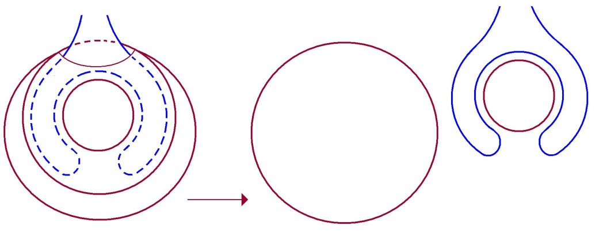

</section>

<section class="parallel-paragraph" data-paragraph-ids="s25-09-0019">

s25-09-0019

[无对应译文]

原文 · s25-09-0019

…mais inverse­ment on peut voir qu’ici *nous obtiendrons la même figure*, à savoir que ce qui est ici attrapé par le trou et ceci repoussé à l’intérieur, après inversion de ce qui est ici, se trouvera aussi bien fonctionner comme un tore, ce qui est ici devenant l’axe.

</section>

<section class="parallel-paragraph" data-paragraph-ids="s25-09-0020">

s25-09-0020

[无对应译文]

原文 · s25-09-0020

Je vais maintenant prier Soury, puisqu’il a la bonté d’être là, de venir montrer la différence - différence nulle - qu’il y a entre ces deux façons de figurer *le tricot torique*. Vous avez l’objet ?

</section>

<section class="parallel-paragraph" data-paragraph-ids="s25-09-0021">

s25-09-0021

[无对应译文]

原文 · s25-09-0021

Soury - Je l’ai fait passer.

</section>

<section class="parallel-paragraph" data-paragraph-ids="s25-09-0022">

s25-09-0022

[无对应译文]

原文 · s25-09-0022

Lacan

</section>

<section class="parallel-paragraph" data-paragraph-ids="s25-09-0023">

s25-09-0023

[无对应译文]

原文 · s25-09-0023

Vous l’avez fait passer… On peut voir, sur cet objet, la diffé­rence qu’il y a entre saisir l’axe et repousser l’ensemble du tore. Allez-y.

</section>

<section class="parallel-paragraph" data-paragraph-ids="s25-09-0024">

s25-09-0024

[无对应译文]

原文 · s25-09-0024

Soury - J’y vais ?

</section>

<section class="parallel-paragraph" data-paragraph-ids="s25-09-0025">

s25-09-0025

[无对应译文]

原文 · s25-09-0025

[Intervention de Pierre Soury](#Mars21)

</section>

<section class="parallel-paragraph" data-paragraph-ids="s25-09-0026">

s25-09-0026

[无对应译文]

原文 · s25-09-0026

Alors il s’agit du retournement du tore par trouage.

</section>

<section class="parallel-paragraph" data-paragraph-ids="s25-09-0027">

s25-09-0027

[无对应译文]

原文 · s25-09-0027

Je vais le présenter de la façon suivante, c’est-à-dire c’est un tore qui est greffé sur un plan infini.

</section>

<section class="parallel-paragraph" data-paragraph-ids="s25-09-0028">

s25-09-0028

[无对应译文]

原文 · s25-09-0028

Ce dessin-là indique qu’il y a un tore qui est gref­fé par un *tuyau* sur un plan infini. Là-dedans ce qui correspond au troua­ge, c’est cette partie *tuyau* qui fait à la fois *trouage du tore* et *trouage du plan infini,* et pour ça, c’est pareil.

</section>

<section class="parallel-paragraph" data-paragraph-ids="s25-09-0029">

s25-09-0029

[无对应译文]

原文 · s25-09-0029

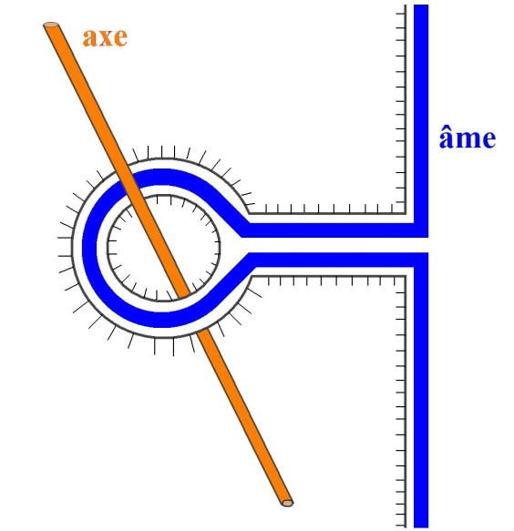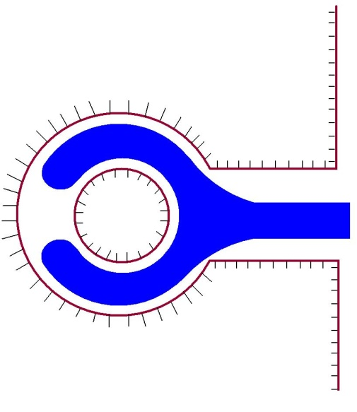

</section>

<section class="parallel-paragraph" data-paragraph-ids="s25-09-0030">

s25-09-0030

[无对应译文]

原文 · s25-09-0030

Alors là-dedans, l’espace est divi­sé en deux moitiés et cette surface a deux faces. Une face...

</section>

<section class="parallel-paragraph" data-paragraph-ids="s25-09-0031">

s25-09-0031

[无对应译文]

原文 · s25-09-0031

> que je dessine ici par des poils, des poils sur la surface ...est ici : ceci c’est une face, et il y a une autre face. Bon !

</section>

<section class="parallel-paragraph" data-paragraph-ids="s25-09-0032">

s25-09-0032

[无对应译文]

原文 · s25-09-0032

L’espace est divisé en deux moitiés :

</section>

<section class="parallel-paragraph" data-paragraph-ids="s25-09-0033">

s25-09-0033

[无对应译文]

原文 · s25-09-0033

- *une moitié de l’espace* : la moitié qui est à gauche de ce plan infini et qui est à l’extérieur du tore et qui fait axe pour ce tore,

</section>

<section class="parallel-paragraph" data-paragraph-ids="s25-09-0034">

s25-09-0034

[无对应译文]

原文 · s25-09-0034

- *et dans l’autre moitié*, enfin l’autre moitié de ce plan infini est en communication avec l’intérieur du tore et ici je dessi­ne quelque chose qui fait âme.

</section>

<section class="parallel-paragraph" data-paragraph-ids="s25-09-0035">

s25-09-0035

[无对应译文]

原文 · s25-09-0035

Alors cette configuration-là permet d’indi­quer le *retournement*. Alors je vais indiquer *l’avant* et *l’après* du *retournement*.

</section>

<section class="parallel-paragraph" data-paragraph-ids="s25-09-0036">

s25-09-0036

[无对应译文]

原文 · s25-09-0036

Là je suis en train de redessi­ner la même chose et c’est l’*avant*. Et l’*après* du retournement… alors je montre les deux faces toujours par la même indication.

</section>

<section class="parallel-paragraph" data-paragraph-ids="s25-09-0037">

s25-09-0037

[无对应译文]

原文 · s25-09-0037

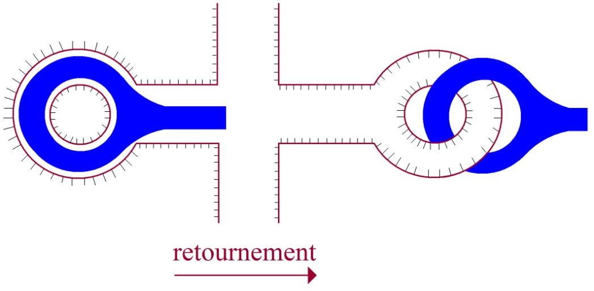

</section>

<section class="parallel-paragraph" data-paragraph-ids="s25-09-0038">

s25-09-0038

[无对应译文]

原文 · s25-09-0038

Donc voici ce qui faisait *face extérieure* : face gauche du plan et face extérieure du tore, et maintenant qui après fait toujours *face gauche du plan*, mais qui fait *face intérieure du tore*, c’est-à-dire dans le retourne­ment ce qui était *face extérieure du tore* est devenu *face intérieure*.

</section>

<section class="parallel-paragraph" data-paragraph-ids="s25-09-0039">

s25-09-0039

[无对应译文]

原文 · s25-09-0039

Alors ça c’est une espèce de gant, enfin ce retournement, c’est quelque chose de comparable au retournement du gant.

</section>

<section class="parallel-paragraph" data-paragraph-ids="s25-09-0040">

s25-09-0040

[无对应译文]

原文 · s25-09-0040

C’est quand même pas tout à fait un gant, c’est un gant torique, c’est un gant qui saisit, c’est un gant qui se ferme et qui saisit.

</section>

<section class="parallel-paragraph" data-paragraph-ids="s25-09-0041">

s25-09-0041

[无对应译文]

原文 · s25-09-0041

Alors ce gant qui ferme et qui saisit peut se retourner et ça devient encore un gant qui ferme et qui saisit.

</section>

<section class="parallel-paragraph" data-paragraph-ids="s25-09-0042">

s25-09-0042

[无对应译文]

原文 · s25-09-0042

Alors une description qui était donnée tout à l’heure, c’est une main que je vais des­siner bleue comme ça, qui vient saisir ici…

</section>

<section class="parallel-paragraph" data-paragraph-ids="s25-09-0043">

s25-09-0043

[无对应译文]

原文 · s25-09-0043

 

</section>

<section class="parallel-paragraph" data-paragraph-ids="s25-09-0044">

s25-09-0044

[无对应译文]

原文 · s25-09-0044

Bon, cette main bleue - ce couple-là du ocre et du bleu, c’est un couple intérieur-extérieur - cette main bleue qui vient saisir, qui utilise ce gant, c’est-à-dire que ce gant torique gante cette main bleue et par là cette main bleue saisit, peut saisir l’axe qui est ocre ici, cette main qui vient utiliser ce gant comme gant, peut par là saisir l’axe ocre.

</section>

<section class="parallel-paragraph" data-paragraph-ids="s25-09-0045">

s25-09-0045

[无对应译文]

原文 · s25-09-0045

Le retour­nement peut, à ce moment-là, être décrit de la façon suivante, c’est que cette main bleue tire, tire… et comment elle se retrouve ?

</section>

<section class="parallel-paragraph" data-paragraph-ids="s25-09-0046">

s25-09-0046

[无对应译文]

原文 · s25-09-0046

Enfin cette main se retrouve comme ça après *le retournement* :

</section>

<section class="parallel-paragraph" data-paragraph-ids="s25-09-0047">

s25-09-0047

[无对应译文]

原文 · s25-09-0047

</section>

<section class="parallel-paragraph" data-paragraph-ids="s25-09-0048">

s25-09-0048

[无对应译文]

原文 · s25-09-0048

Cette main je vais la dessiner en plein, voilà la main qui saisit et le bras et cette main se retrouve ici.

</section>

<section class="parallel-paragraph" data-paragraph-ids="s25-09-0049">

s25-09-0049

[无对应译文]

原文 · s25-09-0049

Et déjà maintenant le dessin de la main, je l’ai légère­ment changé, c’est-à-dire que j’ai dessiné cette main sur le mode d’une main qui saisit, c’est-à-dire que je n’ai plus comme là laissé l’indication que les doigts ne se refermaient pas :

</section>

<section class="parallel-paragraph" data-paragraph-ids="s25-09-0050">

s25-09-0050

[无对应译文]

原文 · s25-09-0050

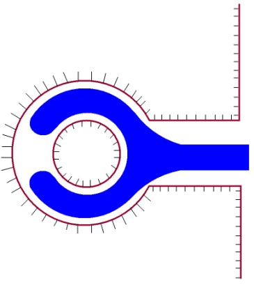

</section>

<section class="parallel-paragraph" data-paragraph-ids="s25-09-0051">

s25-09-0051

[无对应译文]

原文 · s25-09-0051

J’ai dessiné la main de deux façons différentes. Je vais maintenant modifier le dessin de la main qui est ici pour indiquer que c’est une main qui saisit, donc je l’indique comme main fermée. Voilà :

</section>

<section class="parallel-paragraph" data-paragraph-ids="s25-09-0052">

s25-09-0052

[无对应译文]

原文 · s25-09-0052

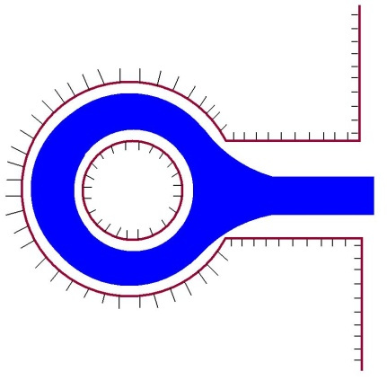

</section>

<section class="parallel-paragraph" data-paragraph-ids="s25-09-0053">

s25-09-0053

[无对应译文]

原文 · s25-09-0053

J’ai donc modifié le dessin de la main comme main fermée, main qui sai­sit. Voilà.

</section>

<section class="parallel-paragraph" data-paragraph-ids="s25-09-0054">

s25-09-0054

[无对应译文]

原文 · s25-09-0054

Donc ici sa relation avec ce tore, c’est qu’elle est gantée par ce tore et ici sa relation avec le tore, c’est qu’elle est en situation de « *poignée de mains* » avec le tore, c’est-à-dire que de la main au tore ici, c’est comme une *poignée de mains* , c’est-à-dire de la main au tore c’est passer ici d’une situation de dédoublement, que le gant est un dédoublement de la main, et ici en situation de complémentation. C’est-à-dire que ces deux mains qui sont en poignée de mains se complémentent l’une de l’autre, enfin ce sont deux tores complémentaires, deux tores enlacés, la main qui saisit étant elle-même un tore.

</section>

<section class="parallel-paragraph" data-paragraph-ids="s25-09-0055">

s25-09-0055

[无对应译文]

原文 · s25-09-0055

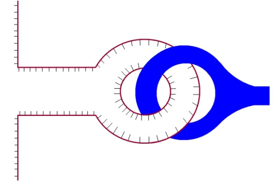

</section>

<section class="parallel-paragraph" data-paragraph-ids="s25-09-0056">

s25-09-0056

[无对应译文]

原文 · s25-09-0056

Donc ceci, c’est l’avant et l’après du retournement. Alors dans le retournement, enfin le retournement donc peut être précisé par la situa­tion de cette main, soit qui est gantée, soit qui fait une poignée de mains. Ceci peut préciser le retournement, mais ce n’est pas indispensable pour indiquer le retournement, c’est-à-dire que le retournement peut être indi­qué… si cette main ne figurait pas, si cette main était absente …le retournement pourrait être figuré quand même : c’est pousser tout ça dans le trou.

</section>

<section class="parallel-paragraph" data-paragraph-ids="s25-09-0057">

s25-09-0057

[无对应译文]

原文 · s25-09-0057

Le retournement de ce gant torique peut être fait en le poussant dans le trou, c’est-à-dire le passage de l’avant à l’après qui est ici n’a pas besoin d’être défini par une main qui saisit, qui tire et qui se retrouve comme ça là. Cette main d’abord *intérieure* qui devient main *complémentaire*, ce n’est pas indispensable, le retournement peut être défini comme simple­ment *pousser* toute cette partie-là - *la partie torique* - *la pousser dans le trou* et il suffit de la pousser dans le trou pour qu’elle se retrouve de l’autre côté.

</section>

<section class="parallel-paragraph" data-paragraph-ids="s25-09-0058">

s25-09-0058

[无对应译文]

原文 · s25-09-0058

Autrement dit, le saisissement ici contribue bien à décrire le retour­nement. Le passage du gantage à la poignée, autrement dit *le passage* du *dédoublement du tore* au *complémentaire du tore*, donc le saisissement là­-dedans, ce qui sert à indiquer, ce qui l’indique, c’est qu’à l’occasion du retournement il y a passage du dédoublement à l’enlacement.

</section>

<section class="parallel-paragraph" data-paragraph-ids="s25-09-0059">

s25-09-0059

[无对应译文]

原文 · s25-09-0059

Mais ça n’est pas indispensable pour… La main là-dedans, ne fait que montrer *le tore complémentaire*.

</section>

<section class="parallel-paragraph" data-paragraph-ids="s25-09-0060">

s25-09-0060

[无对应译文]

原文 · s25-09-0060

La main là-dedans vaut pour le tore complémentai­re. Mais le retournement peut être fait même si le tore complémentaire n’est pas présent et en poussant tout ça. Enfin en poussant tout ça à tra­vers le trou, ça donne ça, c’est-à-dire que c’est pas... enfin on peut pous­ser d’ailleurs le tout, on peut pousser le tore et la main, et ça donnera ça.

</section>

<section class="parallel-paragraph" data-paragraph-ids="s25-09-0061">

s25-09-0061

[无对应译文]

原文 · s25-09-0061

C’est-à-dire que là-dedans la main qui saisit n’est qu’un dédoublement du tore, qui donc *n’est pas indispensable au retournement*, c’est-à-dire que la différence entre la description sans la main ou avec la main, c’est la dif­férence entre faire le retournement d’un tore qui est ici blanc ou d’un tore dédoublé par un tore bleu.

</section>

<section class="parallel-paragraph" data-paragraph-ids="s25-09-0062">

s25-09-0062

[无对应译文]

原文 · s25-09-0062

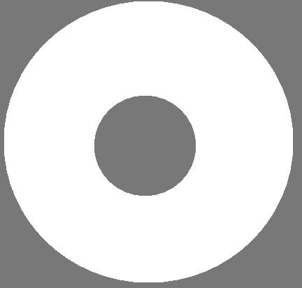 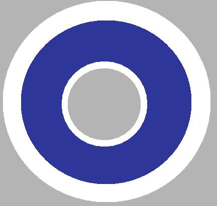

</section>

<section class="parallel-paragraph" data-paragraph-ids="s25-09-0063">

s25-09-0063

[无对应译文]

原文 · s25-09-0063

Alors je dessine les deux descriptions du retournement - sauf que je viens de faire une erreur, là c’est en bleu.

</section>

<section class="parallel-paragraph" data-paragraph-ids="s25-09-0064">

s25-09-0064

[无对应译文]

原文 · s25-09-0064

Je redessine ce qui était dessiné précédemment, c’est-à-dire précédemment ce tore avec son extérieur ici.

</section>

<section class="parallel-paragraph" data-paragraph-ids="s25-09-0065">

s25-09-0065

[无对应译文]

原文 · s25-09-0065

Voilà la face extérieure du tore qui est retournée comme ça, la face extérieure devient face intérieure.

</section>

<section class="parallel-paragraph" data-paragraph-ids="s25-09-0066">

s25-09-0066

[无对应译文]

原文 · s25-09-0066

Et ici c’est la même chose, mais le tore est dédoublé par la main. Et ici, alors voilà.

</section>

<section class="parallel-paragraph" data-paragraph-ids="s25-09-0067">

s25-09-0067

[无对应译文]

原文 · s25-09-0067

 →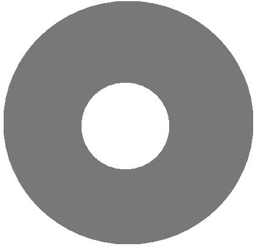  →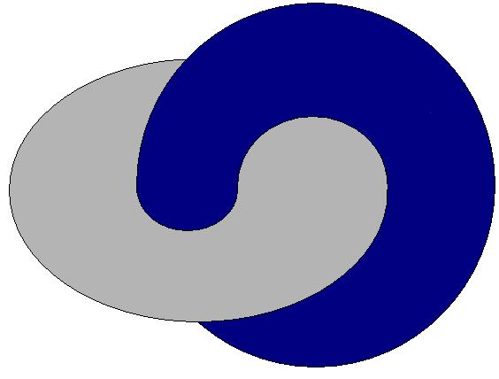

</section>

<section class="parallel-paragraph" data-paragraph-ids="s25-09-0068">

s25-09-0068

[无对应译文]

原文 · s25-09-0068

Donc c’est deux présentations, c’est deux descriptions voisines du retournement :

</section>

<section class="parallel-paragraph" data-paragraph-ids="s25-09-0069">

s25-09-0069

[无对应译文]

原文 · s25-09-0069

- dans un cas le tore isolé,

</section>

<section class="parallel-paragraph" data-paragraph-ids="s25-09-0070">

s25-09-0070

[无对应译文]

原文 · s25-09-0070

- dans l’autre cas le tore avec son double, le double qui est, soit le double par dédoublement, soit le double par enlacement, le double par dédoublement pouvant donc être imagé comme la situation de ganta­ge et le double par enlacement pouvant être imagé par la situation de poi­gnée de mains. Bon. Voilà.

</section>

<section class="parallel-paragraph" data-paragraph-ids="s25-09-0071">

s25-09-0071

[无对应译文]

原文 · s25-09-0071

Jean-Michel Ribettes - *Pouvez-vous situer la position de l’axe ?*

</section>

<section class="parallel-paragraph" data-paragraph-ids="s25-09-0072">

s25-09-0072

[无对应译文]

原文 · s25-09-0072

Pierre Soury

</section>

<section class="parallel-paragraph" data-paragraph-ids="s25-09-0073">

s25-09-0073

[无对应译文]

原文 · s25-09-0073

Alors l’axe ici, je peux le rajouter. Donc la main gantée saisit l’axe. À l’occasion du retournement, l’axe va devenir âme. Alors l’axe ici est là, et après retournement il est devenu âme.

</section>

<section class="parallel-paragraph" data-paragraph-ids="s25-09-0074">

s25-09-0074

[无对应译文]

原文 · s25-09-0074

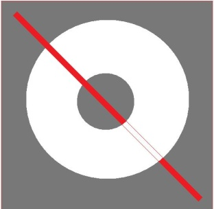 →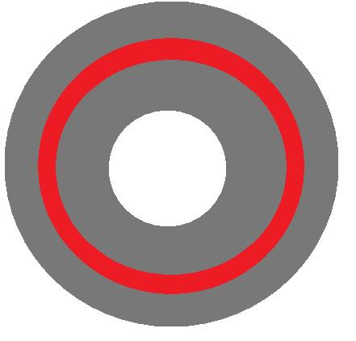 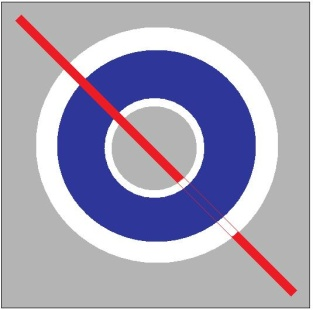 →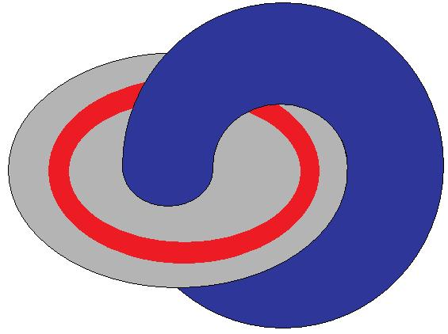

</section>

<section class="parallel-paragraph" data-paragraph-ids="s25-09-0075">

s25-09-0075

[无对应译文]

原文 · s25-09-0075

Χ - Pourquoi l’image de *la poignée de mains*, elle a l’air tellement...

</section>

<section class="parallel-paragraph" data-paragraph-ids="s25-09-0076">

s25-09-0076

[无对应译文]

原文 · s25-09-0076

Pierre Soury - Pourquoi l’image de la poignée de mains... ?

</section>

<section class="parallel-paragraph" data-paragraph-ids="s25-09-0077">

s25-09-0077

[无对应译文]

原文 · s25-09-0077

-X - ...a l’air tellement... ?

</section>

<section class="parallel-paragraph" data-paragraph-ids="s25-09-0078">

s25-09-0078

[无对应译文]

原文 · s25-09-0078

Pierre Soury

</section>

<section class="parallel-paragraph" data-paragraph-ids="s25-09-0079">

s25-09-0079

[无对应译文]

原文 · s25-09-0079

Pourquoi l’image de *la poignée de mains* a l’air tellement dure ? Ben, la poignée de mains elle est complètement fermée.

</section>

<section class="parallel-paragraph" data-paragraph-ids="s25-09-0080">

s25-09-0080

[无对应译文]

原文 · s25-09-0080

Ce sont des anneaux qui sont fermés.

</section>

<section class="parallel-paragraph" data-paragraph-ids="s25-09-0081">

s25-09-0081

[无对应译文]

原文 · s25-09-0081

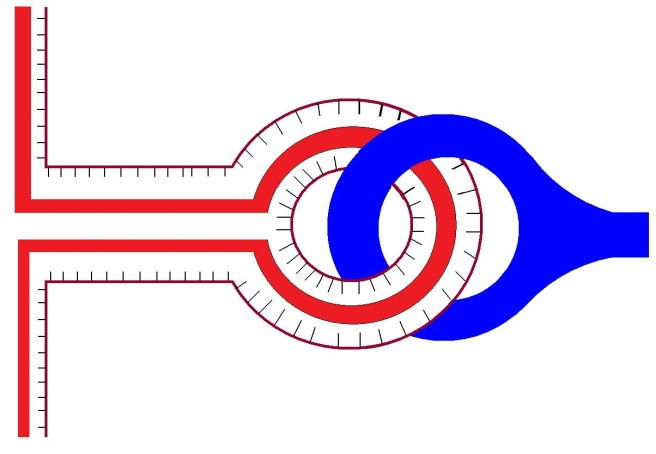

</section>

<section class="parallel-paragraph" data-paragraph-ids="s25-09-0082">

s25-09-0082

[无对应译文]

原文 · s25-09-0082

Et il n’y a le choix qu’entre *la poignée de mains* ou le gantage. Là-dedans la souplesse ne permet que le passa­ge de *la poignée* *de mains* au gantage. Elle ne permet pas… Enfin, ce que c’est que des mains qui s’ouvrent et qui se ferment, j’en sais rien.

</section>

<section class="parallel-paragraph" data-paragraph-ids="s25-09-0083">

s25-09-0083

[无对应译文]

原文 · s25-09-0083

Là, ce ne sont que des mains toriques, des mains fermées.

</section>

<section class="parallel-paragraph" data-paragraph-ids="s25-09-0084">

s25-09-0084

[无对应译文]

原文 · s25-09-0084

Lacan

</section>

<section class="parallel-paragraph" data-paragraph-ids="s25-09-0085">

s25-09-0085

[无对应译文]

原文 · s25-09-0085

Vous considérez en somme que c’est de *pousser* qu’il s’agit ?

</section>

<section class="parallel-paragraph" data-paragraph-ids="s25-09-0086">

s25-09-0086

[无对应译文]

原文 · s25-09-0086

Dans cette façon de faire, il ne peut s’agit que de pousser l’ensemble du tore.

</section>

<section class="parallel-paragraph" data-paragraph-ids="s25-09-0087">

s25-09-0087

[无对应译文]

原文 · s25-09-0087

C’est pour ça que vous avez parlé tout à l’heu­re d’ensemble du tore.

</section>

<section class="parallel-paragraph" data-paragraph-ids="s25-09-0088">

s25-09-0088

[无对应译文]

原文 · s25-09-0088

Pierre Soury - Oui, oui.

</section>

<section class="parallel-paragraph" data-paragraph-ids="s25-09-0089">

s25-09-0089

[无对应译文]

原文 · s25-09-0089

Lacan - Bien, je vais en rester là pour aujourd’hui. Je vous donne ren­dez-vous le 11 Avril.

</section>

