# Leçon 11 | 18 Avril 1979

  <label><input type="checkbox" data-lacan-toggle="original" checked> 原文</label>
  <label><input type="checkbox" data-lacan-toggle="notes" checked> 注释</label>
  <label><input type="checkbox" data-lacan-toggle="commentary" checked> 个人解读评论</label>

<section class="parallel-paragraph" data-paragraph-ids="s25-11-0001">

s25-11-0001

[无对应译文]

原文 · s25-11-0001

[Terrasson](#TERASSON)

</section>

<section class="parallel-paragraph" data-paragraph-ids="s25-11-0002">

s25-11-0002

[无对应译文]

原文 · s25-11-0002

Lacan

</section>

<section class="parallel-paragraph" data-paragraph-ids="s25-11-0003">

s25-11-0003

[无对应译文]

原文 · s25-11-0003

Venez un peu, parce que vous m’avez envoyé des choses.

</section>

<section class="parallel-paragraph" data-paragraph-ids="s25-11-0004">

s25-11-0004

[无对应译文]

原文 · s25-11-0004

Je voudrais que les choses que vous m’avez envoyées, vous les com­mentiez, comme ça, une par une, parce que ça ne va pas.

</section>

<section class="parallel-paragraph" data-paragraph-ids="s25-11-0005">

s25-11-0005

[无对应译文]

原文 · s25-11-0005

Je vous signale que ce que je vous ai dessiné la dernière fois, sous la forme de cette bande que j’ai faite du mieux que j’ai pu, si on la coupe en deux, le résultat...

</section>

<section class="parallel-paragraph" data-paragraph-ids="s25-11-0006">

s25-11-0006

[无对应译文]

原文 · s25-11-0006

> si on la coupe en deux comme ceci ...le résultat est ce qu’on appelle un nœud à 3, c’est-à-dire quelque chose qui se présente comme ça.

</section>

<section class="parallel-paragraph" data-paragraph-ids="s25-11-0007">

s25-11-0007

[无对应译文]

原文 · s25-11-0007

C’est, bien entendu, tout à fait frappant.

</section>

<section class="parallel-paragraph" data-paragraph-ids="s25-11-0008">

s25-11-0008

[无对应译文]

原文 · s25-11-0008

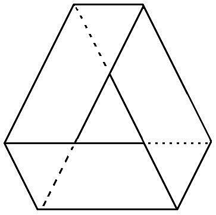→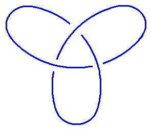

</section>

<section class="parallel-paragraph" data-paragraph-ids="s25-11-0009">

s25-11-0009

[无对应译文]

原文 · s25-11-0009

Ici, c’est ce qu’on appelle une *bande de Mœbius *:

</section>

<section class="parallel-paragraph" data-paragraph-ids="s25-11-0010">

s25-11-0010

[无对应译文]

原文 · s25-11-0010

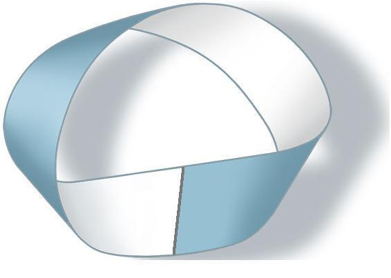\[1\]

</section>

<section class="parallel-paragraph" data-paragraph-ids="s25-11-0011">

s25-11-0011

[无对应译文]

原文 · s25-11-0011

Je la redessine parce que ça vaut la peine de s’apercevoir que, grâce à ce qu’on appelle l’élasticité, la *bande de Mœbius* se dessine comme ça. En d’autres termes, on retourne ce qui apparaît sous cette forme :

</section>

<section class="parallel-paragraph" data-paragraph-ids="s25-11-0012">

s25-11-0012

[无对应译文]

原文 · s25-11-0012

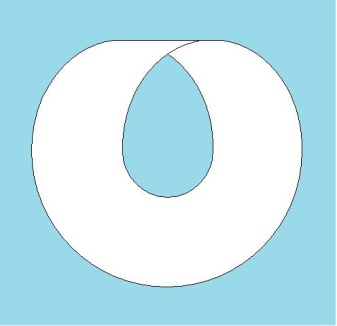

</section>

<section class="parallel-paragraph" data-paragraph-ids="s25-11-0013">

s25-11-0013

[无对应译文]

原文 · s25-11-0013

La forme \[1\] est celle qui apparait sur la couverture de *Scilicet*, mais la véritable *bande de Mœbius est celle-ci.*

</section>

<section class="parallel-paragraph" data-paragraph-ids="s25-11-0014">

s25-11-0014

[无对应译文]

原文 · s25-11-0014

Et il y a ce que très légitimement Jean-Claude Terrasson - qui est là et qui m’aide - ce que très légitimement

</section>

<section class="parallel-paragraph" data-paragraph-ids="s25-11-0015">

s25-11-0015

[无对应译文]

原文 · s25-11-0015

Jean-Claude Terrasson appelle « *une demi-torsion »* et là sous la forme où j’ai fait fonctionner la dernière fois, puisque c’est ce que je vous ai dessiné la dernière fois : il y a 3 *demi-torsions* :

</section>

<section class="parallel-paragraph" data-paragraph-ids="s25-11-0016">

s25-11-0016

[无对应译文]

原文 · s25-11-0016

</section>

<section class="parallel-paragraph" data-paragraph-ids="s25-11-0017">

s25-11-0017

[无对应译文]

原文 · s25-11-0017

Par contre, il est pos­sible de faire *une seule torsion*. C’est ce qui est manifesté dans la figure 2 où il y a effectivement 1 *seule torsion* :

</section>

<section class="parallel-paragraph" data-paragraph-ids="s25-11-0018">

s25-11-0018

[无对应译文]

原文 · s25-11-0018

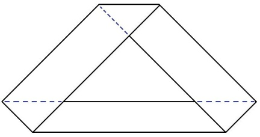

</section>

<section class="parallel-paragraph" data-paragraph-ids="s25-11-0019">

s25-11-0019

[无对应译文]

原文 · s25-11-0019

La figure 2 peut également se figurer ainsi :

</section>

<section class="parallel-paragraph" data-paragraph-ids="s25-11-0020">

s25-11-0020

[无对应译文]

原文 · s25-11-0020

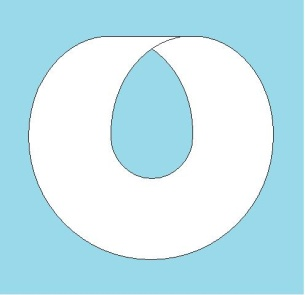

</section>

<section class="parallel-paragraph" data-paragraph-ids="s25-11-0021">

s25-11-0021

[无对应译文]

原文 · s25-11-0021

Ça c’est une figure à 1 *seule torsion*, elle est équiva­lente à la figure suivante - c’est pas commode :

</section>

<section class="parallel-paragraph" data-paragraph-ids="s25-11-0022">

s25-11-0022

[无对应译文]

原文 · s25-11-0022

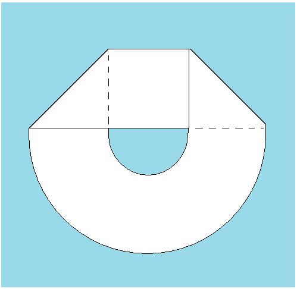

</section>

<section class="parallel-paragraph" data-paragraph-ids="s25-11-0023">

s25-11-0023

[无对应译文]

原文 · s25-11-0023

c’est-à-dire que ceci, si nous figurons l’intérieur ici, ceci est réalisé communément parce qu’on appelle le tore.

</section>

<section class="parallel-paragraph" data-paragraph-ids="s25-11-0024">

s25-11-0024

[无对应译文]

原文 · s25-11-0024

Si nous fai­sons ici une boucle, ce qui vient ici vient sous la forme de quelque chose qui vient au-delà de ce que j’appelle *l’axe du tore*, c’est ça qui vient dans *l’axe du tore* \[**2**\] et c’est ça qui fait *le tour du tore* \[**1**\] :

</section>

<section class="parallel-paragraph" data-paragraph-ids="s25-11-0025">

s25-11-0025

[无对应译文]

原文 · s25-11-0025

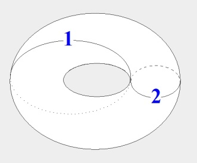

</section>

<section class="parallel-paragraph" data-paragraph-ids="s25-11-0026">

s25-11-0026

[无对应译文]

原文 · s25-11-0026

Je vous prie, à cette occasion, de le vérifier, et vous verrez que la torsion, la torsion complète dont il s’agit est exactement équiva­lente à ce que Jean-Claude Terrasson appelle une torsion, une torsion complète.

</section>

<section class="parallel-paragraph" data-paragraph-ids="s25-11-0027">

s25-11-0027

[无对应译文]

原文 · s25-11-0027

C’est ce qui est réalisé dans le tore... La *torsion complète* est tout ce qu’on peut faire sur un tore, ce qui n’est bien entendu pas surprenant, parce que il n’y a aucun moyen d’opérer autrement sur un tore.

</section>

<section class="parallel-paragraph" data-paragraph-ids="s25-11-0028">

s25-11-0028

[无对应译文]

原文 · s25-11-0028

Si sur un tore vous dessinez quelque chose qui coupe, bien sûr qui coupe en passant ce qu’on appelle « *derrière le tore* », qui revient « *en avant* » et qui repasse « *derrière le tore* », ce que vous obte­nez, c’est quelque chose qui est comme ça et qui s’achève de la façon sui­vante c’est-à-dire que cela redouble le nœud qui s’entoure autour du tore.

</section>

<section class="parallel-paragraph" data-paragraph-ids="s25-11-0029">

s25-11-0029

[无对应译文]

原文 · s25-11-0029

En d’autres termes ce qui vient ici, est très précisément ce qui passe autour de ce que j’appelle l’axe.

</section>

<section class="parallel-paragraph" data-paragraph-ids="s25-11-0030">

s25-11-0030

[无对应译文]

原文 · s25-11-0030

Donc ceci équivaut à 2 *tor­sions *: ici 1 *torsion* et là 2 *torsions.*

</section>

<section class="parallel-paragraph" data-paragraph-ids="s25-11-0031">

s25-11-0031

[无对应译文]

原文 · s25-11-0031

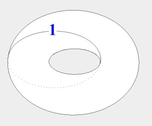

</section>

<section class="parallel-paragraph" data-paragraph-ids="s25-11-0032">

s25-11-0032

[无对应译文]

原文 · s25-11-0032

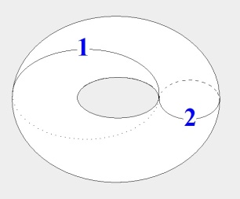

</section>

<section class="parallel-paragraph" data-paragraph-ids="s25-11-0033">

s25-11-0033

[无对应译文]

原文 · s25-11-0033

Je vais prier maintenant Jean-Claude Terrasson, de bien vouloir prendre la parole pour nous commenter *ses figures* qu’il a faites là.

</section>

<section class="parallel-paragraph" data-paragraph-ids="s25-11-0034">

s25-11-0034

[无对应译文]

原文 · s25-11-0034

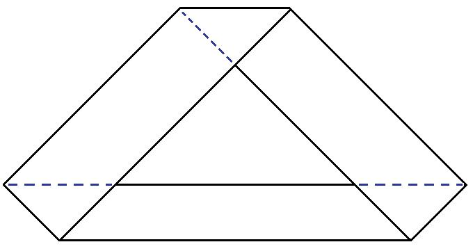

</section>

<section class="parallel-paragraph" data-paragraph-ids="s25-11-0035">

s25-11-0035

[无对应译文]

原文 · s25-11-0035

Ceci est une *bande de Mœbius.*

</section>

<section class="parallel-paragraph" data-paragraph-ids="s25-11-0036">

s25-11-0036

[无对应译文]

原文 · s25-11-0036

[Intervention de Jean-Claude Terrasson](#Avril18)

</section>

<section class="parallel-paragraph" data-paragraph-ids="s25-11-0037">

s25-11-0037

[无对应译文]

原文 · s25-11-0037

Alors on peut poser le problème de savoir comment on pourrait *paver l’espace, ou paver le plan* régulièrement avec des *bandes de Mœbius* aplaties, c’est-à-dire mises à plat. Alors le problème c’est : comment est-ce que je pourrais paver régulièrement le plan en aplatissant des *bandes de Mœbius*, enfin des bandes… \[**0**\] C’est-à-dire on peut commen­cer par *la bande à* 0 *torsion :* si on dessine uniquement les bords, on les dessine comme ça :

</section>

<section class="parallel-paragraph" data-paragraph-ids="s25-11-0038">

s25-11-0038

[无对应译文]

原文 · s25-11-0038

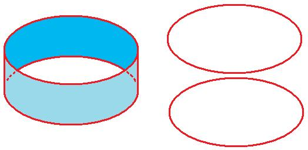

</section>

<section class="parallel-paragraph" data-paragraph-ids="s25-11-0039">

s25-11-0039

[无对应译文]

原文 · s25-11-0039

Ils ne sont liés que par le fait que la bande a une certaine matérialité pour lier ces deux bords.

</section>

<section class="parallel-paragraph" data-paragraph-ids="s25-11-0040">

s25-11-0040

[无对应译文]

原文 · s25-11-0040

Bon alors, pour mettre cette figure à plat, pour l’aplatir et obtenir quelque chose qui pave régulièrement le plan, c’est-à-dire un polygone régulier...

</section>

<section class="parallel-paragraph" data-paragraph-ids="s25-11-0041">

s25-11-0041

[无对应译文]

原文 · s25-11-0041

> enfin, il n’y en a pas des masses, il n’y a que l’*hexa­gone*, le *carré* et le *triangle équilatéral* ...pour ça j’ai une solution très simple qui est de coller les deux bords ensemble...

</section>

<section class="parallel-paragraph" data-paragraph-ids="s25-11-0042">

s25-11-0042

[无对应译文]

原文 · s25-11-0042

> enfin coller *<u>un</u>* bord, accoler un bord à lui-même ...et aplatir, c’est-à-dire que si je fais hachurer ce qui vient là où la surface vient deux fois l’une sur l’autre... bon c’est ça : j’obtiens un carré. Bon là ce n’est pas un carré, mais ça pourrait être, à condition que ma bande ait le double de longueur que de largeur et j’obtiens un carré. \[**1**\] À partir d’**½** *torsion*, là le problème va être plus compliqué, mais ce qu’on remarque déjà, c’est que chaque fois on obtiendra...

</section>

<section class="parallel-paragraph" data-paragraph-ids="s25-11-0043">

s25-11-0043

[无对应译文]

原文 · s25-11-0043

> enfin jusqu’à 5 ...on obtiendra un polygone régulier sans trou. C’est-à-dire ce qui est le trou de la bande trouve un moyen de se résorber pour obtenir un polygone régulier, et ça sera même le seul que je pourrai obtenir.

</section>

<section class="parallel-paragraph" data-paragraph-ids="s25-11-0044">

s25-11-0044

[无对应译文]

原文 · s25-11-0044

Bon alors là, cette figure-là \[*bande* 1/2 *torsion*\] si j’en dessine le bord, c’est ça, c’est-à-dire on voit que ça ne tient noué...

</section>

<section class="parallel-paragraph" data-paragraph-ids="s25-11-0045">

s25-11-0045

[无对应译文]

原文 · s25-11-0045

que comme la 1ère *figure*, le bord ne tient dans sa position de torsion que par rapport au fait que la bande ait une maté­rialité aussi.

</section>

<section class="parallel-paragraph" data-paragraph-ids="s25-11-0046">

s25-11-0046

[无对应译文]

原文 · s25-11-0046

Ce ne sera plus vrai à partir de ces bandes-là où les bords se tiennent par eux-mêmes en dehors de toute matérialité de la bande :

</section>

<section class="parallel-paragraph" data-paragraph-ids="s25-11-0047">

s25-11-0047

[无对应译文]

原文 · s25-11-0047

→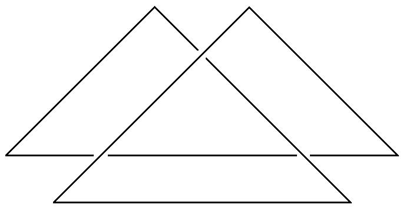→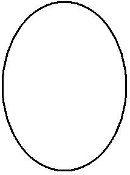

</section>

<section class="parallel-paragraph" data-paragraph-ids="s25-11-0048">

s25-11-0048

[无对应译文]

原文 · s25-11-0048

Alors ça, c’est la mise à plat de *la bande à* **1** *demi-torsion*. Alors là je dessine :

</section>

<section class="parallel-paragraph" data-paragraph-ids="s25-11-0049">

s25-11-0049

[无对应译文]

原文 · s25-11-0049

- le bord de la bande,

</section>

<section class="parallel-paragraph" data-paragraph-ids="s25-11-0050">

s25-11-0050

[无对应译文]

原文 · s25-11-0050

- et en pointillé évidemment là où il passe dessous,

</section>

<section class="parallel-paragraph" data-paragraph-ids="s25-11-0051">

s25-11-0051

[无对应译文]

原文 · s25-11-0051

- et en hachu­ré l’endroit où la surface se recouvre.

</section>

<section class="parallel-paragraph" data-paragraph-ids="s25-11-0052">

s25-11-0052

[无对应译文]

原文 · s25-11-0052

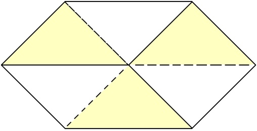

</section>

<section class="parallel-paragraph" data-paragraph-ids="s25-11-0053">

s25-11-0053

[无对应译文]

原文 · s25-11-0053

Bon alors cette bande comme toutes celles qui seront des hexagones, pour obtenir un hexagone régulier, il faut que les proportions ça soit :

</section>

<section class="parallel-paragraph" data-paragraph-ids="s25-11-0054">

s25-11-0054

[无对应译文]

原文 · s25-11-0054

- la largeur, je prends 1 de largeur : *l* = 1

</section>

<section class="parallel-paragraph" data-paragraph-ids="s25-11-0055">

s25-11-0055

[无对应译文]

原文 · s25-11-0055

- la longueur, ça sera racine de 3 : L = √3.

</section>

<section class="parallel-paragraph" data-paragraph-ids="s25-11-0056">

s25-11-0056

[无对应译文]

原文 · s25-11-0056

Bon, on ne va pas entrer là-dedans...

</section>

<section class="parallel-paragraph" data-paragraph-ids="s25-11-0057">

s25-11-0057

[无对应译文]

原文 · s25-11-0057

\[**2**\] Bon alors, ce qui se passe à *la bande à* **2** *demi-torsions*, c’est-à-dire à une torsion, c’est-à-dire une *bande à deux bords*.

</section>

<section class="parallel-paragraph" data-paragraph-ids="s25-11-0058">

s25-11-0058

[无对应译文]

原文 · s25-11-0058

Voilà la manière dont les bords du trou, les bords de la bande se nouent entre eux, c’est-à-dire que là ils n’ont plus besoin de la matérialité de la bande pour maintenir leur nouage, c’est bien pour ça qu’on passe au tore, comme disait Lacan tout à l’heure.

</section>

<section class="parallel-paragraph" data-paragraph-ids="s25-11-0059">

s25-11-0059

[无对应译文]

原文 · s25-11-0059

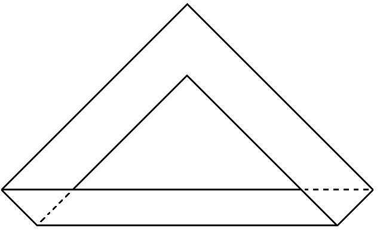→ 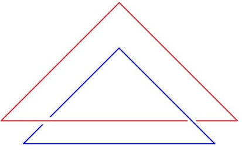→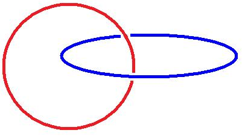

</section>

<section class="parallel-paragraph" data-paragraph-ids="s25-11-0060">

s25-11-0060

[无对应译文]

原文 · s25-11-0060

Alors cette figure-là se remet à plat dans le carré.

</section>

<section class="parallel-paragraph" data-paragraph-ids="s25-11-0061">

s25-11-0061

[无对应译文]

原文 · s25-11-0061

Mais pour rendre ces figures plus lisibles...

</section>

<section class="parallel-paragraph" data-paragraph-ids="s25-11-0062">

s25-11-0062

[无对应译文]

原文 · s25-11-0062

> là aussi le bord vient s’accoler à lui-même, c’est-à-dire là il est deux fois ...il faudrait que je le dessine avec un petit écartement pour rendre la chose visible. En dessinant, en hachu­rant toujours là où ça se recouvre, voilà avec un petit écartement pour voir comment le trou, les bords du trou se nouent entre eux :

</section>

<section class="parallel-paragraph" data-paragraph-ids="s25-11-0063">

s25-11-0063

[无对应译文]

原文 · s25-11-0063

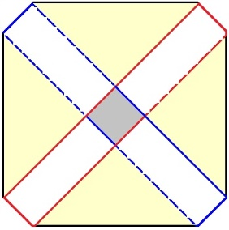

</section>

<section class="parallel-paragraph" data-paragraph-ids="s25-11-0064">

s25-11-0064

[无对应译文]

原文 · s25-11-0064

Ιl y a cette figure qui est donc recouverte, où la surface se recouvre dans la totalité, cette figure est un carré et à partir de ce moment-là, ce n’est plus ce carré-là, mais c’est *un carré qui est obtenu avec une bande dont la longueur est quatre fois la largeur*, L = 4 *l*.

</section>

<section class="parallel-paragraph" data-paragraph-ids="s25-11-0065">

s25-11-0065

[无对应译文]

原文 · s25-11-0065

\[**3**\] Alors quand on passe à *la bande à* **3** *demi-torsions*, c’est-à-dire que là, le dessin du bord de la bande, c’est ça.

</section>

<section class="parallel-paragraph" data-paragraph-ids="s25-11-0066">

s25-11-0066

[无对应译文]

原文 · s25-11-0066

Je peux encore *mettre à plat* cette figure-là, cette bande-là, bon c’est pareil, je dessine le bord visible du trou, et j’ob­tiens cette figure-là, c’est-à-dire que je le fais avec une bande qui a les mêmes proportions que celles-là, toujours.

</section>

<section class="parallel-paragraph" data-paragraph-ids="s25-11-0067">

s25-11-0067

[无对应译文]

原文 · s25-11-0067

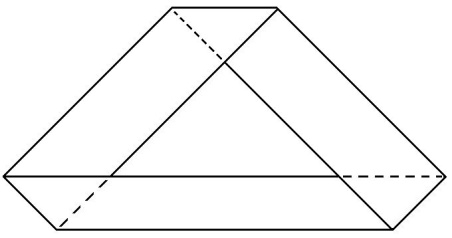→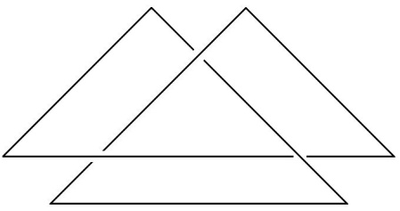→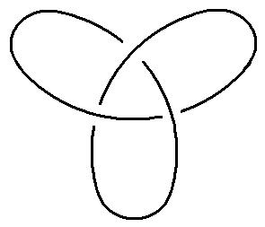→ 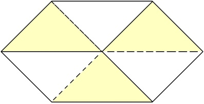

</section>

<section class="parallel-paragraph" data-paragraph-ids="s25-11-0068">

s25-11-0068

[无对应译文]

原文 · s25-11-0068

\[**4**\] *La bande à* **4** *demi-torsions*, c’est-à-dire à deux torsions, elle noue ses deux bords de cette manière-là, c’est-à­-dire comme ça, c’est le deuxième nœud, et on pourrait dire également que c’est le tore à deux trous. Et celle-là, je peux encore l’aplatir.

</section>

<section class="parallel-paragraph" data-paragraph-ids="s25-11-0069">

s25-11-0069

[无对应译文]

原文 · s25-11-0069

C’est pareil, il faudrait que je dessine les bords du trou. Voilà comment ça va se nouer.

</section>

<section class="parallel-paragraph" data-paragraph-ids="s25-11-0070">

s25-11-0070

[无对应译文]

原文 · s25-11-0070

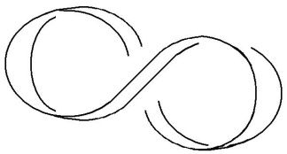→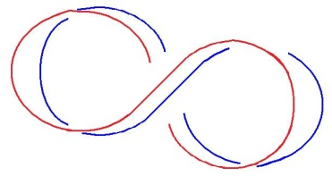→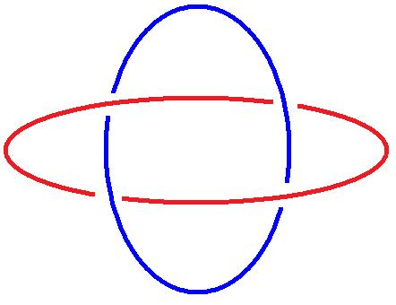

</section>

<section class="parallel-paragraph" data-paragraph-ids="s25-11-0071">

s25-11-0071

[无对应译文]

原文 · s25-11-0071

Et vous voyez que c’est la même figure que celle-là :

</section>

<section class="parallel-paragraph" data-paragraph-ids="s25-11-0072">

s25-11-0072

[无对应译文]

原文 · s25-11-0072

</section>

<section class="parallel-paragraph" data-paragraph-ids="s25-11-0073">

s25-11-0073

[无对应译文]

原文 · s25-11-0073

Et cette figure-­là est identique à elle-même si on la retourne.

</section>

<section class="parallel-paragraph" data-paragraph-ids="s25-11-0074">

s25-11-0074

[无对应译文]

原文 · s25-11-0074

Là je n’ai pas dessiné la bande à **5** *demi-torsions*, mais il est évident qu’elle ne va pas faire un polygone régulier pavant l’espace, ça il n’y aura plus moyen. Mais si on retournait à celle à **6**, on pourrait encore refaire un figure régulière pavant l’espace.

</section>

<section class="parallel-paragraph" data-paragraph-ids="s25-11-0075">

s25-11-0075

[无对应译文]

原文 · s25-11-0075

J. Lagarrigue

</section>

<section class="parallel-paragraph" data-paragraph-ids="s25-11-0076">

s25-11-0076

[无对应译文]

原文 · s25-11-0076

Avec 1 *demi-torsion* et avec 3 *demi-torsions*, tu as toujours un point virtuel, un trou virtuel, qui est un point là qui est tout comme un petit triangle, mais en fait ce n’est pas obligatoire pour une seule torsion et tu peux la réduire à la dimension d’un triangle. Je vais le représenter.

</section>

<section class="parallel-paragraph" data-paragraph-ids="s25-11-0077">

s25-11-0077

[无对应译文]

原文 · s25-11-0077

Tu as cette représentation là actuellement et tu as le bord qui décrit un schéma là, comme ça, avec le bord qui est ici, qui passe derrière et tu as le bord là qui repart devant, et qui fait ce schéma. Mais enfin on peut rédui­re ces 3 bords à n’être plus rien.

</section>

<section class="parallel-paragraph" data-paragraph-ids="s25-11-0078">

s25-11-0078

[无对应译文]

原文 · s25-11-0078

Alors si tu réduis ces 3 bords à n’être plus rien, tu obtiens une forme qui est triangulaire...

</section>

<section class="parallel-paragraph" data-paragraph-ids="s25-11-0079">

s25-11-0079

[无对应译文]

原文 · s25-11-0079

> que je ne fais pas tout à fait triangulaire pour que ce soit plus facilement représentable ...et où tu as ce bord en fait qui va - ce n’est pas facile à représenter - et où tu as en fait :

</section>

<section class="parallel-paragraph" data-paragraph-ids="s25-11-0080">

s25-11-0080

[无对应译文]

原文 · s25-11-0080

- ce bord-là qui viendra ici comme ça, puis ça va passer derrière, là comme ça et puis ça va revenir sur le devant,

</section>

<section class="parallel-paragraph" data-paragraph-ids="s25-11-0081">

s25-11-0081

[无对应译文]

原文 · s25-11-0081

- ce bord-ci, il va là, ce petit côté-là qui se réduit à rien, il est ici, ça repasse derrière et ça rejoint ce bord-là, celui-là va se trouver donc en haut et puis ça va revenir ici pour repasser derrière et ça va rejoindre ici le troisième.

</section>

<section class="parallel-paragraph" data-paragraph-ids="s25-11-0082">

s25-11-0082

[无对应译文]

原文 · s25-11-0082

Et alors là il y a une *bande de Mœbius* réduite à sa plus simple expression, et qui n’est plus réductible, et qui a la forme d’un triangle à trois sections successives :

</section>

<section class="parallel-paragraph" data-paragraph-ids="s25-11-0083">

s25-11-0083

[无对应译文]

原文 · s25-11-0083

- avec une première qui est représentée par cette bande qui passe comme ça,

</section>

<section class="parallel-paragraph" data-paragraph-ids="s25-11-0084">

s25-11-0084

[无对应译文]

原文 · s25-11-0084

- puis la seconde - *là ça va passer derrière* - et puis la seconde *qui repasse* et qui se replie une troisième fois *pour repasser derrière*.

</section>

<section class="parallel-paragraph" data-paragraph-ids="s25-11-0085">

s25-11-0085

[无对应译文]

原文 · s25-11-0085

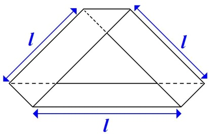→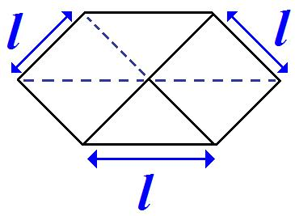→ 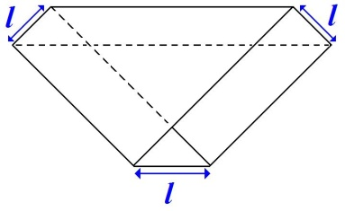 →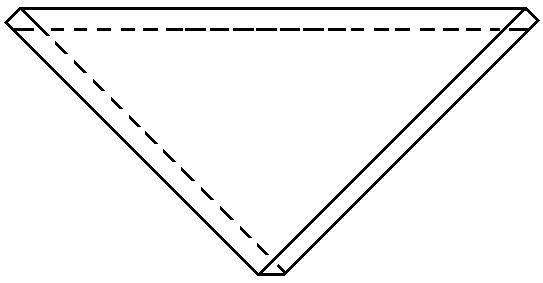

</section>

<section class="parallel-paragraph" data-paragraph-ids="s25-11-0086">

s25-11-0086

[无对应译文]

原文 · s25-11-0086

Et en fait ce dalla­ge que tu fais ici avec un hexagone, tu peux le faire avec des triangles. Mais c’est une autre forme beaucoup plus simple en fait de dallage. Et où tu as la disparition que tu supposais presque obligatoire de ce trou virtuel qui disparaît avec cette représentation-là. Voilà, c’est ce que je voulais dire. C’est une autre représentation.

</section>

<section class="parallel-paragraph" data-paragraph-ids="s25-11-0087">

s25-11-0087

[无对应译文]

原文 · s25-11-0087

Jean-Claude Terrasson

</section>

<section class="parallel-paragraph" data-paragraph-ids="s25-11-0088">

s25-11-0088

[无对应译文]

原文 · s25-11-0088

Pourquoi j’ai fait ces représentations-là et pas celle-là ?

</section>

<section class="parallel-paragraph" data-paragraph-ids="s25-11-0089">

s25-11-0089

[无对应译文]

原文 · s25-11-0089

C’est parce qu’ici, j’ai au maximum une double épaisseur et une simple épaisseur, et que ça je peux évidemment le représenter - comme ici d’ailleurs - par des pavés dont je peux paver le plan.

</section>

<section class="parallel-paragraph" data-paragraph-ids="s25-11-0090">

s25-11-0090

[无对应译文]

原文 · s25-11-0090

J. Lagarrigue

</section>

<section class="parallel-paragraph" data-paragraph-ids="s25-11-0091">

s25-11-0091

[无对应译文]

原文 · s25-11-0091

</section>

<section class="parallel-paragraph" data-paragraph-ids="s25-11-0092">

s25-11-0092

[无对应译文]

原文 · s25-11-0092

Ici, tu n’as pas de trou virtuel qui tra­verse le plan, vu que le seul trou est un trou qui est vertical comme ça, comme une manche et ici, à cette représentation comme ici tu as toujours un trou qui est virtuel, qui est ici, tu as un point par lequel tu peux passer une aiguille, une épingle, et qui disparaît dans cette représentation où tu as les trois qui se recouvrent absolument :

</section>

<section class="parallel-paragraph" data-paragraph-ids="s25-11-0093">

s25-11-0093

[无对应译文]

原文 · s25-11-0093

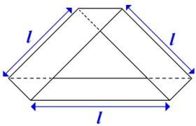→→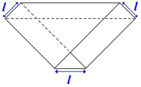→

</section>

<section class="parallel-paragraph" data-paragraph-ids="s25-11-0094">

s25-11-0094

[无对应译文]

原文 · s25-11-0094

et qui est la forme en fait la plus réduite possible d’une *bande de Mœbius* avec une seule demi­-torsion et qui est une représentation qui est beaucoup plus réduite que celle-ci, parce que tu élimines en fait cet effet d’hexagone, qui est un effet artificiel si on peut dire, qui n’a pas de raison d’être particulière. Sa seule raison d’être de forme de la bande de Mœbius à *une seule demi-torsion*, c’est en fait la forme triangulaire et c’est celle-là.

</section>

<section class="parallel-paragraph" data-paragraph-ids="s25-11-0095">

s25-11-0095

[无对应译文]

原文 · s25-11-0095

Et cette forme-là, tu ne peux pas l’obtenir avec la seconde *bande de Mœbius* qui est la *bande de Mœbius* à *trois demi-torsions*, où là, l’existence de ce trou virtuel central est absolument obligatoire. Ça se fabrique très bien avec une bande de papier...

</section>

<section class="parallel-paragraph" data-paragraph-ids="s25-11-0096">

s25-11-0096

[无对应译文]

原文 · s25-11-0096

Lacan

</section>

<section class="parallel-paragraph" data-paragraph-ids="s25-11-0097">

s25-11-0097

[无对应译文]

原文 · s25-11-0097

L’intérêt de cette réflexion est que, également pour la *bande de Mœbius*, ce que j’ai dessiné la dernière fois, l’amincissement de ce dont il s’agit, permet de maintenir la forme qui aboutit au nœud à trois, et ceci, je veux dire la *bande de Mœbius*, comme il est bien connu, la *bande de Mœbius* divisée en deux fait un huit - si mon souvenir est bon - ce huit recoupé en deux fait une forme comme ceci, c’est-à-dire quelque chose d’enlacé, *si mon souvenir est bon*…Je crois que mon souvenir n’est pas bon.

</section>

<section class="parallel-paragraph" data-paragraph-ids="s25-11-0098">

s25-11-0098

[无对应译文]

原文 · s25-11-0098

J. Lagarrigue

</section>

<section class="parallel-paragraph" data-paragraph-ids="s25-11-0099">

s25-11-0099

[无对应译文]

原文 · s25-11-0099

Je crois que ça donne une *formation* qui a des caracté­ristiques comme ça.

</section>

<section class="parallel-paragraph" data-paragraph-ids="s25-11-0100">

s25-11-0100

[无对应译文]

原文 · s25-11-0100

Lorsqu’on divise deux fois une *bande de Mœbius*, on obtient une bande qui ressemble à ça, qui est de ce type-là, avec une bande comme ça qui est nouée par une sorte de tissage et qui n’est pas un simple… Lacan

</section>

<section class="parallel-paragraph" data-paragraph-ids="s25-11-0101">

s25-11-0101

[无对应译文]

原文 · s25-11-0101

Je crois en effet que ce sont deux anneaux séparés qu’on obtient avec la *bande de Mœbius*.

</section>

<section class="parallel-paragraph" data-paragraph-ids="s25-11-0102">

s25-11-0102

[无对应译文]

原文 · s25-11-0102

Ιl y a quelque chose qui me paraît pour­tant pas clair, c’est votre double torsion, comment obtenez-vous cette figure là ?

</section>

<section class="parallel-paragraph" data-paragraph-ids="s25-11-0103">

s25-11-0103

[无对应译文]

原文 · s25-11-0103

Jean-Claude Terrasson

</section>

<section class="parallel-paragraph" data-paragraph-ids="s25-11-0104">

s25-11-0104

[无对应译文]

原文 · s25-11-0104

En aplatissant une *bande de Mœbius*, *une bande à une torsion*, en l’aplatissant, c’est-à-dire en faisant une demi-torsion à chaque fois, elle prend cette forme-là :

</section>

<section class="parallel-paragraph" data-paragraph-ids="s25-11-0105">

s25-11-0105

[无对应译文]

原文 · s25-11-0105

</section>

<section class="parallel-paragraph" data-paragraph-ids="s25-11-0106">

s25-11-0106

[无对应译文]

原文 · s25-11-0106

Lacan - En quoi ici les deux bords font-ils *enlacement* ? Car en fait, c’est un fait qu’il font *enlacement*. Ils font *enlacement* !

</section>

<section class="parallel-paragraph" data-paragraph-ids="s25-11-0107">

s25-11-0107

[无对应译文]

原文 · s25-11-0107

Jean-Claude Terrasson

</section>

<section class="parallel-paragraph" data-paragraph-ids="s25-11-0108">

s25-11-0108

[无对应译文]

原文 · s25-11-0108

C’est la première bande dont les bords s’obtiennent par eux-mêmes, c’est-à-dire en dehors du fait de l’existence du sort de la bande… Lacan – Ouais… X - On aimerait bien participer.

</section>

<section class="parallel-paragraph" data-paragraph-ids="s25-11-0109">

s25-11-0109

[无对应译文]

原文 · s25-11-0109

Lacan - Les deux bords font enlacement.

</section>

<section class="parallel-paragraph" data-paragraph-ids="s25-11-0110">

s25-11-0110

[无对应译文]

原文 · s25-11-0110

Jean-Claude Terrasson - C’est le premier enlacement de bords. On peut conti­nuer. Ιl y a toute la série des enlacements.

</section>

<section class="parallel-paragraph" data-paragraph-ids="s25-11-0111">

s25-11-0111

[无对应译文]

原文 · s25-11-0111

Lacan - Hein ?

</section>

<section class="parallel-paragraph" data-paragraph-ids="s25-11-0112">

s25-11-0112

[无对应译文]

原文 · s25-11-0112

J. Lagarrigue - Ιl y a toute la série des enlacements de bords.

</section>

<section class="parallel-paragraph" data-paragraph-ids="s25-11-0113">

s25-11-0113

[无对应译文]

原文 · s25-11-0113

Lacan

</section>

<section class="parallel-paragraph" data-paragraph-ids="s25-11-0114">

s25-11-0114

[无对应译文]

原文 · s25-11-0114

Je vous fais mes excuses. Ιl y a un moyen de faire un nœud borroméen avec le nœud à 3.

</section>

<section class="parallel-paragraph" data-paragraph-ids="s25-11-0115">

s25-11-0115

[无对应译文]

原文 · s25-11-0115

Pourtant la question est de savoir s’il y a *un autre moyen* de faire un nœud borroméen avec le nœud à 3.

</section>

<section class="parallel-paragraph" data-paragraph-ids="s25-11-0116">

s25-11-0116

[无对应译文]

原文 · s25-11-0116

Si on groupe les 3, il est bien évident que ce qu’on obtiendra ce sera la même chose que ce qu’on obtient avec la *bande de Mœbius*.

</section>

<section class="parallel-paragraph" data-paragraph-ids="s25-11-0117">

s25-11-0117

[无对应译文]

原文 · s25-11-0117

Est-ce qu’il y a moyen, en décalant ce nœud à trois - c’est à ça que je me suis escrimé ce matin - en décalant ce nœud à 3, est-ce qu’il y a un moyen en déplaçant ce nœud à 3 de faire qu’on puisse passer sous le 2nd nœud à 3 qui est légèrement décalé, qu’on puisse passer sous...

</section>

<section class="parallel-paragraph" data-paragraph-ids="s25-11-0118">

s25-11-0118

[无对应译文]

原文 · s25-11-0118

> puisque c’est ça la définition du nœud borroméen ...qu’on puisse passer *sous* celui qui est *dessous*, et *sur* celui qui est *dessus*.

</section>

<section class="parallel-paragraph" data-paragraph-ids="s25-11-0119">

s25-11-0119

[无对应译文]

原文 · s25-11-0119

C’est ce que je vous propose de mettre à l’épreuve, puisque je n’ai pas pu le mettre à l’épreuve moi-même ce matin.

</section>

<section class="parallel-paragraph" data-paragraph-ids="s25-11-0120">

s25-11-0120

[无对应译文]

原文 · s25-11-0120

Ιl faut d’autre part bien se dire que ce nœud à 3 lui-même se divise en 2, je veux dire qu’il est susceptible d’être coupé, et que coupé par le milieu, ça donne un certain effet que je vous propose également de mettre à l’épreuve.

</section>

<section class="parallel-paragraph" data-paragraph-ids="s25-11-0121">

s25-11-0121

[无对应译文]

原文 · s25-11-0121

Ceci nous promet pour la séance du 9 Mai quelques résultats auxquels je m’efforcerai moi-même de donner une solution.

</section>

