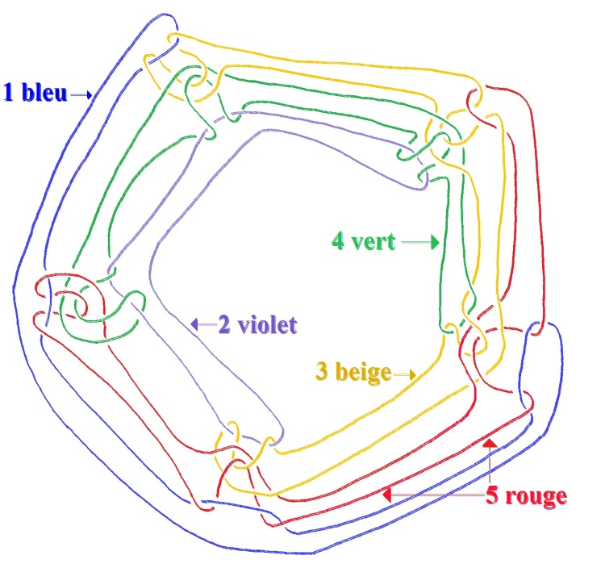
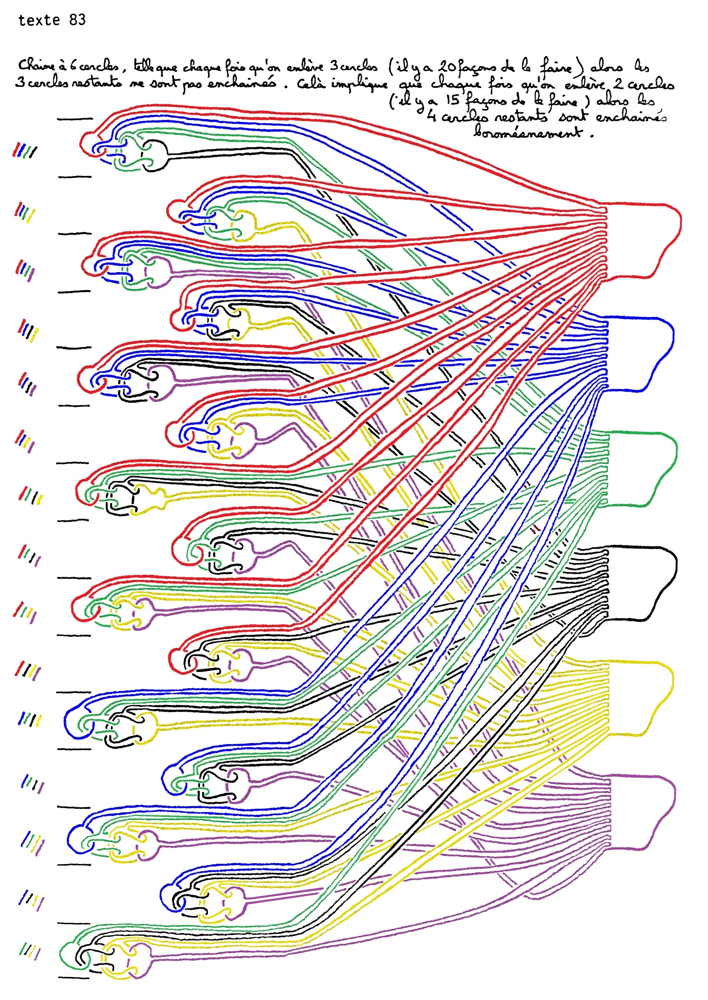

# Leçon 02 | 12 décembre 1978

  

    <label><input type="checkbox" data-lacan-toggle="original" checked> 原文</label>
    <label><input type="checkbox" data-lacan-toggle="notes" checked> 注释</label>
    <label><input type="checkbox" data-lacan-toggle="commentary" checked> 个人解读评论</label>
  

  <form class="lacan-tool-search" role="search">
    <input class="lacan-tool-search-input" type="search" placeholder="搜索全文" aria-label="搜索全文">
    <button class="lacan-tool-button" type="submit" title="搜索">搜索</button>
  </form>
  <button class="lacan-tool-button lacan-back-to-top" type="button" title="回到页面最上方" aria-label="回到页面最上方">↑</button>

<section class="parallel-paragraph" data-paragraph-ids="s26-02-0001">

s26-02-0001

原文 · s26-02-0001

Je me suis aventuré à annoncer que peut-être je prendrai un exemple de ce qu’on appelle « *le borroméen généralisé* », c’est à savoir que j’énoncerai comment on peut rendre *borroméen*, je veux dire à partir de quel moment s’avère *borroméen* un nombre de cinq cercles, puisque dans le borroméen c’est de cercles qu’il s’agit.

[无对应译文]

</section>

<section class="parallel-paragraph" data-paragraph-ids="s26-02-0002">

s26-02-0002

原文 · s26-02-0002

Le borroméen généralisé, je l’avais annoncé pour deux cercles retirés sur cinq.

[无对应译文]

</section>

<section class="parallel-paragraph" data-paragraph-ids="s26-02-0003">

s26-02-0003

原文 · s26-02-0003

La solution m’a été donnée en main par deux personnes, à savoir

[无对应译文]

</section>

<section class="parallel-paragraph" data-paragraph-ids="s26-02-0004">

s26-02-0004

原文 · s26-02-0004

- Mme Parizot dont j’espère qu’elle est ici présente,

[无对应译文]

</section>

<section class="parallel-paragraph" data-paragraph-ids="s26-02-0005">

s26-02-0005

原文 · s26-02-0005

- et un nommé Vappereau qui a bien voulu aussi contribuer à cette solution.

[无对应译文]

</section>

<section class="parallel-paragraph" data-paragraph-ids="s26-02-0006">

s26-02-0006

原文 · s26-02-0006

Il n’y a rien de plus facile que de rendre borroméen,

[无对应译文]

</section>

<section class="parallel-paragraph" data-paragraph-ids="s26-02-0007">

s26-02-0007

原文 · s26-02-0007

- c’est-à-dire de déchaîner,

[无对应译文]

</section>

<section class="parallel-paragraph" data-paragraph-ids="s26-02-0008">

s26-02-0008

原文 · s26-02-0008

- c’est-à-dire de libérer 5 cercles.

[无对应译文]

</section>

<section class="parallel-paragraph" data-paragraph-ids="s26-02-0009">

s26-02-0009

原文 · s26-02-0009

En voici 1, en voici 2, voici le 3ème, voici le 4ème et voici le 5ème.

[无对应译文]

</section>

<section class="parallel-paragraph" data-paragraph-ids="s26-02-0010">

s26-02-0010

原文 · s26-02-0010

[无对应译文]

</section>

<section class="parallel-paragraph" data-paragraph-ids="s26-02-0011">

s26-02-0011

原文 · s26-02-0011

Ça c’est le 3ème, ça c’est le 2ème.

[无对应译文]

</section>

<section class="parallel-paragraph" data-paragraph-ids="s26-02-0012">

s26-02-0012

原文 · s26-02-0012

Le 2ème est violet, le 3ème est en beige, le 4ème est en vert et le 5ème est en rouge.

[无对应译文]

</section>

<section class="parallel-paragraph" data-paragraph-ids="s26-02-0013">

s26-02-0013

原文 · s26-02-0013

La façon de libérer deux cercles sur ces cinq est tout à fait claire.

[无对应译文]

</section>

<section class="parallel-paragraph" data-paragraph-ids="s26-02-0014">

s26-02-0014

原文 · s26-02-0014

Les personnes qui s’en sont mêlées ont bien voulu l’une et l’autre dire de quelle façon c’est possible : c’est possible de dix façons.

[无对应译文]

</section>

<section class="parallel-paragraph" data-paragraph-ids="s26-02-0015">

s26-02-0015

原文 · s26-02-0015

Il suffit de libérer, c’est-à-dire de couper le 1 et le 2, le 1 et le 3, le 1 et le 4, le 1 et le 5, les trois autres se déchaînent, comme il est facile de le voir du fait que ce violet-là par exemple file jusqu’à se réduire à quelque chose qui vient là. Ce *violet* se réduit à *ce quelque chose* qui glisse jusque là et qui, du fait du 5 disparu, est dénoué *du vert, du beige et du violet*.

[无对应译文]

</section>

<section class="parallel-paragraph" data-paragraph-ids="s26-02-0016">

s26-02-0016

原文 · s26-02-0016

Ceci est libre, ces trois, puisqu’il s’agit ici de cercles, ces trois cercles sont libres l’un par rapport à l’autre.

[无对应译文]

</section>

<section class="parallel-paragraph" data-paragraph-ids="s26-02-0017">

s26-02-0017

原文 · s26-02-0017

Le vert, le violet et le beige sont libres par rapport au violet, à savoir que

[无对应译文]

</section>

<section class="parallel-paragraph" data-paragraph-ids="s26-02-0018">

s26-02-0018

原文 · s26-02-0018

- le vert se dénoue,

[无对应译文]

</section>

<section class="parallel-paragraph" data-paragraph-ids="s26-02-0019">

s26-02-0019

原文 · s26-02-0019

- le beige se dénoue aussi,

[无对应译文]

</section>

<section class="parallel-paragraph" data-paragraph-ids="s26-02-0020">

s26-02-0020

原文 · s26-02-0020

- et le violet ici se dénoue également.

[无对应译文]

</section>

<section class="parallel-paragraph" data-paragraph-ids="s26-02-0021">

s26-02-0021

原文 · s26-02-0021

Il est facile de voir qu’en dénouant le 2 associé au 3, le 2 associé au 4, le 2 associé au 5, on aura le même résultat.

[无对应译文]

</section>

<section class="parallel-paragraph" data-paragraph-ids="s26-02-0022">

s26-02-0022

原文 · s26-02-0022

Le 3 associé au 4 et le 3 associé au 5 aura le même résultat, le 4 associé au 5 aura aussi le même résultat.

[无对应译文]

</section>

<section class="parallel-paragraph" data-paragraph-ids="s26-02-0023">

s26-02-0023

原文 · s26-02-0023

Il y a donc 10 *façons de sectionner* 1 de ces cercles qui sont 5, de le sectionner de façon à ce que le résultat soit atteint.

[无对应译文]

</section>

<section class="parallel-paragraph" data-paragraph-ids="s26-02-0024">

s26-02-0024

原文 · s26-02-0024

J’ai poussé plus loin mon investigation, à savoir que j’ai interrogé sur un groupe de 6 cercles, j’ai questionné sur la façon dont on obtient un borroméen généralisé en en coupant trois.

[无对应译文]

</section>

<section class="parallel-paragraph" data-paragraph-ids="s26-02-0025">

s26-02-0025

原文 · s26-02-0025

Il y a effectivement 35 façons de le faire.

[无对应译文]

</section>

<section class="parallel-paragraph" data-paragraph-ids="s26-02-0026">

s26-02-0026

原文 · s26-02-0026

Pour cela, il faudrait, de la même façon que nous avons fait ces 5 cercles, en produire un 6ème.

[无对应译文]

</section>

<section class="parallel-paragraph" data-paragraph-ids="s26-02-0027">

s26-02-0027

原文 · s26-02-0027

Cette façon, je vous en dispense, car aussi bien ça serait un peu forcé.

[无对应译文]

</section>

<section class="parallel-paragraph" data-paragraph-ids="s26-02-0028">

s26-02-0028

原文 · s26-02-0028

Mais il est possible de le construire.

[无对应译文]

</section>

<section class="parallel-paragraph" data-paragraph-ids="s26-02-0029">

s26-02-0029

原文 · s26-02-0029

Parmi les 35 façons de couper les 3 cercles en obtenant ce nœud que j’appelle borroméen parce qu’il est symbolisé à partir de trois, c’est-à-dire que les trois sont dénoués quand on retire un...

[无对应译文]

</section>

<section class="parallel-paragraph" data-paragraph-ids="s26-02-0030">

s26-02-0030

原文 · s26-02-0030

il suffit d’en couper un pour que les trois autres soient dénoués.

[无对应译文]

</section>

<section class="parallel-paragraph" data-paragraph-ids="s26-02-0031">

s26-02-0031

原文 · s26-02-0031

Dans le borroméen à 6, il suffit également d’en couper 1 pour que les 6 soient dénoués.

[无对应译文]

</section>

<section class="parallel-paragraph" data-paragraph-ids="s26-02-0032">

s26-02-0032

原文 · s26-02-0032

Je précise qu’il y a 10 façons de dénouer 5 cercles et qu’il y a 35 façons de dénouer 6 cercles en en coupant 3.

[无对应译文]

</section>

<section class="parallel-paragraph" data-paragraph-ids="s26-02-0033">

s26-02-0033

原文 · s26-02-0033

Peut-être je vais distribuer ce qui a été obtenu ce matin par Soury [^2] qui a bien voulu s’en charger de photocopier d’une photo en couleur, c’est-à-dire que les couleurs elles n’apparaissent pas, mais qu’à couper trois de ces cercles, on peut s’apercevoir que les autres sont libres.

[无对应译文]

</section>

<section class="parallel-paragraph" data-paragraph-ids="s26-02-0034">

s26-02-0034

原文 · s26-02-0034

Ça demande un certain soin de colorier chacun de ces cercles, mais on peut voir que ça marche.

[无对应译文]

</section>

<section class="parallel-paragraph" data-paragraph-ids="s26-02-0035">

s26-02-0035

原文 · s26-02-0035

Ceci suppose qu’on en retire d’abord 2 et ensuite un 3ème.

[无对应译文]

</section>

<section class="parallel-paragraph" data-paragraph-ids="s26-02-0036">

s26-02-0036

原文 · s26-02-0036

C’est au 3ème que chacun de ces cercles s’avère être libre.

[无对应译文]

</section>

<section class="parallel-paragraph" data-paragraph-ids="s26-02-0037">

s26-02-0037

原文 · s26-02-0037

C’est vous Vappereau ? Je vous écoute.

[无对应译文]

</section>

<section class="parallel-paragraph" data-paragraph-ids="s26-02-0038">

s26-02-0038

原文 · s26-02-0038

Vappereau

[无对应译文]

</section>

<section class="parallel-paragraph" data-paragraph-ids="s26-02-0039">

s26-02-0039

原文 · s26-02-0039

Vous faites une erreur dans la façon de compter les différentes manières de dénouer la chaîne à 6 en coupant 3.

[无对应译文]

</section>

<section class="parallel-paragraph" data-paragraph-ids="s26-02-0040">

s26-02-0040

原文 · s26-02-0040

Vous avez donné le résultat pour la chaîne à 7 en en coupant 4, c’est à dire 35.

[无对应译文]

</section>

<section class="parallel-paragraph" data-paragraph-ids="s26-02-0041">

s26-02-0041

原文 · s26-02-0041

Lacan : J’ai dit qu’en en coupant 3 sur les 6, on obtient une chaîne borroméenne...

[无对应译文]

</section>

<section class="parallel-paragraph" data-paragraph-ids="s26-02-0042">

s26-02-0042

原文 · s26-02-0042

Vappereau : Vous dites qu’il y a 35 façons de le faire, or il n’y en a que 20.

[无对应译文]

</section>

<section class="parallel-paragraph" data-paragraph-ids="s26-02-0043">

s26-02-0043

原文 · s26-02-0043

Lacan

[无对应译文]

</section>

<section class="parallel-paragraph" data-paragraph-ids="s26-02-0044">

s26-02-0044

原文 · s26-02-0044

Oui, c’est vrai qu’il n’y en a que 20.

[无对应译文]

</section>

<section class="parallel-paragraph" data-paragraph-ids="s26-02-0045">

s26-02-0045

原文 · s26-02-0045

C’est vrai qu’il n’y en a que 20 et que, de ce fait, je me suis trompé.

[无对应译文]

</section>

<section class="parallel-paragraph" data-paragraph-ids="s26-02-0046">

s26-02-0046

原文 · s26-02-0046

Il me reste à m’en excuser et à vous promettre que la prochaine fois je ne vous entretiendrai pas sur les cercles.

[无对应译文]

</section>

<section class="parallel-paragraph" data-paragraph-ids="s26-02-0047">

s26-02-0047

原文 · s26-02-0047

Bien, au revoir !

[无对应译文]

</section>

<section class="parallel-paragraph" data-paragraph-ids="s26-02-0048">

s26-02-0048

原文 · s26-02-0048

[无对应译文]

</section>

<section class="note-block original-notes">

## Notes

[^2]: Cf. Pierre Soury, « *Chaînes et nœuds* », Volume 2, texte 83, édité par Michel Thomé et Christian Léger, Paris, 1988.

</section>
