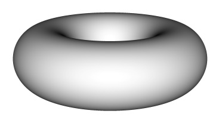
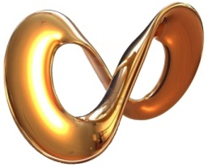

# Leçon 03 | 19 décembre 1978

  

    <label><input type="checkbox" data-lacan-toggle="original" checked> 原文</label>
    <label><input type="checkbox" data-lacan-toggle="notes" checked> 注释</label>
    <label><input type="checkbox" data-lacan-toggle="commentary" checked> 个人解读评论</label>
  

  <form class="lacan-tool-search" role="search">
    <input class="lacan-tool-search-input" type="search" placeholder="搜索全文" aria-label="搜索全文">
    <button class="lacan-tool-button" type="submit" title="搜索">搜索</button>
  </form>
  <button class="lacan-tool-button lacan-back-to-top" type="button" title="回到页面最上方" aria-label="回到页面最上方">↑</button>

<section class="parallel-paragraph" data-paragraph-ids="s26-03-0001">

s26-03-0001

原文 · s26-03-0001

Je vous avertis tout de suite que je ne ferai pas mon séminaire.

[无对应译文]

</section>

<section class="parallel-paragraph" data-paragraph-ids="s26-03-0002">

s26-03-0002

原文 · s26-03-0002

Je vous en avertis parce que chez moi, ce matin, il y avait une panne d’électricité, « les lumières » comme on dit, c’est à dire la lumière électrique, ne s’allumaient plus.

[无对应译文]

</section>

<section class="parallel-paragraph" data-paragraph-ids="s26-03-0003">

s26-03-0003

原文 · s26-03-0003

Naturellement Gloria ici présente m’a aidé : elle m’a porté des chandelles, ce qu’on appelle de nos jours bougies.

[无对应译文]

</section>

<section class="parallel-paragraph" data-paragraph-ids="s26-03-0004">

s26-03-0004

原文 · s26-03-0004

Qu’est-ce que Gloria a à faire avec mon enseignement, c’est-à-dire avec ce que j’enseigne cette année de la topologie et du temps ?

[无对应译文]

</section>

<section class="parallel-paragraph" data-paragraph-ids="s26-03-0005">

s26-03-0005

原文 · s26-03-0005

Elle m’aide, elle m’aide à couper les ficelles quand j’ai à faire des ronds de ficelles.

[无对应译文]

</section>

<section class="parallel-paragraph" data-paragraph-ids="s26-03-0006">

s26-03-0006

原文 · s26-03-0006

Les ronds de ficelle, c’est théorique, ça a affaire avec des cercles, des cercles souples et même élastiques, ça s’imagine. Mais l’imagination ne va pas loin.

[无对应译文]

</section>

<section class="parallel-paragraph" data-paragraph-ids="s26-03-0007">

s26-03-0007

原文 · s26-03-0007

La topologie est imaginaire.

[无对应译文]

</section>

<section class="parallel-paragraph" data-paragraph-ids="s26-03-0008">

s26-03-0008

原文 · s26-03-0008

Elle n’a pris son développement qu’avec l’imagination.

[无对应译文]

</section>

<section class="parallel-paragraph" data-paragraph-ids="s26-03-0009">

s26-03-0009

原文 · s26-03-0009

Il y a une distinction qui est à faire entre l’*Imaginaire* et ce que j’appelle le *Symbolique *:

[无对应译文]

</section>

<section class="parallel-paragraph" data-paragraph-ids="s26-03-0010">

s26-03-0010

原文 · s26-03-0010

- *le symbolique*, c’est la parole.

[无对应译文]

</section>

<section class="parallel-paragraph" data-paragraph-ids="s26-03-0011">

s26-03-0011

原文 · s26-03-0011

- *l’imaginaire* en est distinct.

[无对应译文]

</section>

<section class="parallel-paragraph" data-paragraph-ids="s26-03-0012">

s26-03-0012

原文 · s26-03-0012

Il y a des surfaces qui sont à l’occasion sans bord : un tore, par exemple, est une surface sans bord.

[无对应译文]

</section>

<section class="parallel-paragraph" data-paragraph-ids="s26-03-0013">

s26-03-0013

原文 · s26-03-0013

Néanmoins un tore peut être aplati et si on l’aplatit, ça fait une surface avec bords.

[无对应译文]

</section>

<section class="parallel-paragraph" data-paragraph-ids="s26-03-0014">

s26-03-0014

原文 · s26-03-0014

C’est même pour ça que le tore peut servir à faire une bande de Mœbius.

[无对应译文]

</section>

<section class="parallel-paragraph" data-paragraph-ids="s26-03-0015">

s26-03-0015

原文 · s26-03-0015

Voilà comment ça se dessine. Ca fait une bande de Mœbius, à condition de l’aplatir.

[无对应译文]

</section>

<section class="parallel-paragraph" data-paragraph-ids="s26-03-0016">

s26-03-0016

原文 · s26-03-0016

Mais on peut gonfler cette surface, auquel cas ça refait un tore.

[无对应译文]

</section>

<section class="parallel-paragraph" data-paragraph-ids="s26-03-0017">

s26-03-0017

原文 · s26-03-0017

→ → 

[无对应译文]

</section>

<section class="parallel-paragraph" data-paragraph-ids="s26-03-0018">

s26-03-0018

原文 · s26-03-0018

Il n’en reste pas moins que le tore et la bande de Mœbius, c’est distinct.

[无对应译文]

</section>

<section class="parallel-paragraph" data-paragraph-ids="s26-03-0019">

s26-03-0019

原文 · s26-03-0019

\[*dernières minutes du séminaire inaudibles par absence de sono*\]

[无对应译文]

</section>

