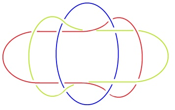
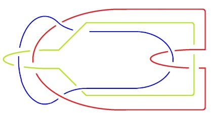
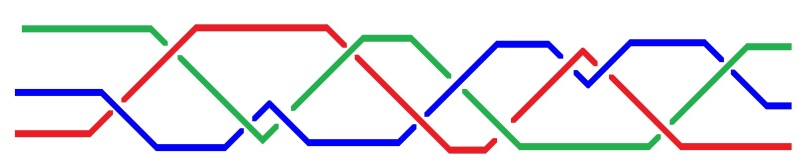

# Leçon 04 | 9 janvier 1979

  

    <label><input type="checkbox" data-lacan-toggle="original" checked> 原文</label>
    <label><input type="checkbox" data-lacan-toggle="notes" checked> 注释</label>
    <label><input type="checkbox" data-lacan-toggle="commentary" checked> 个人解读评论</label>
  

  <form class="lacan-tool-search" role="search">
    <input class="lacan-tool-search-input" type="search" placeholder="搜索全文" aria-label="搜索全文">
    <button class="lacan-tool-button" type="submit" title="搜索">搜索</button>
  </form>
  <button class="lacan-tool-button lacan-back-to-top" type="button" title="回到页面最上方" aria-label="回到页面最上方">↑</button>

<section class="parallel-paragraph" data-paragraph-ids="s26-04-0001">

s26-04-0001

原文 · s26-04-0001

Il n’y a pas de rapport sexuel, c’est ce que j’ai énoncé.

[无对应译文]

</section>

<section class="parallel-paragraph" data-paragraph-ids="s26-04-0002">

s26-04-0002

原文 · s26-04-0002

Qu’est-ce qui y supplée, parce que il est clair que les gens...

[无对应译文]

</section>

<section class="parallel-paragraph" data-paragraph-ids="s26-04-0003">

s26-04-0003

原文 · s26-04-0003

> ce qu’on appelle tel, soit les êtres humains ...les gens font l’amour.

[无对应译文]

</section>

<section class="parallel-paragraph" data-paragraph-ids="s26-04-0004">

s26-04-0004

原文 · s26-04-0004

Il y a à ça une explication : la possibilité...

[无对应译文]

</section>

<section class="parallel-paragraph" data-paragraph-ids="s26-04-0005">

s26-04-0005

原文 · s26-04-0005

> notons que « *le possible* », c’est ce que nous avons défini comme « *ce qui cesse de s’écrire* » ...la possibilité d’un 3ème sexe.

[无对应译文]

</section>

<section class="parallel-paragraph" data-paragraph-ids="s26-04-0006">

s26-04-0006

原文 · s26-04-0006

Pourquoi il y en a 2 d’ailleurs, ça s’explique mal.

[无对应译文]

</section>

<section class="parallel-paragraph" data-paragraph-ids="s26-04-0007">

s26-04-0007

原文 · s26-04-0007

C’est ce qui est évoqué dans la doublure d’Ève, à savoir Lilith.

[无对应译文]

</section>

<section class="parallel-paragraph" data-paragraph-ids="s26-04-0008">

s26-04-0008

原文 · s26-04-0008

L’évocation n’est pourtant pas une chose précise.

[无对应译文]

</section>

<section class="parallel-paragraph" data-paragraph-ids="s26-04-0009">

s26-04-0009

原文 · s26-04-0009

C’est justement de précision, c’est-à-dire de *Réel*, que j’ai fait état en rêvant à ce qu’il en est du *nœud borroméen*.

[无对应译文]

</section>

<section class="parallel-paragraph" data-paragraph-ids="s26-04-0010">

s26-04-0010

原文 · s26-04-0010

Le nœud borroméen a comme consistance de s’imaginer.

[无对应译文]

</section>

<section class="parallel-paragraph" data-paragraph-ids="s26-04-0011">

s26-04-0011

原文 · s26-04-0011

Quelle est la différence entre l’*Imaginaire* et ce qu’on appelle le *Symbolique*, autrement dit le langage.

[无对应译文]

</section>

<section class="parallel-paragraph" data-paragraph-ids="s26-04-0012">

s26-04-0012

原文 · s26-04-0012

Le langage a ses lois dont l’universalité est le modèle, la particularité ne l’est pas moins.

[无对应译文]

</section>

<section class="parallel-paragraph" data-paragraph-ids="s26-04-0013">

s26-04-0013

原文 · s26-04-0013

Ce que l’*Imaginaire* fait, il imagine le *Réel* : c’est une réflexion.

[无对应译文]

</section>

<section class="parallel-paragraph" data-paragraph-ids="s26-04-0014">

s26-04-0014

原文 · s26-04-0014

Une réflexion tient au miroir, c’est donc dans le miroir que s’exerce une fonction.

[无对应译文]

</section>

<section class="parallel-paragraph" data-paragraph-ids="s26-04-0015">

s26-04-0015

原文 · s26-04-0015

Le miroir est le plus simple des appareils.

[无对应译文]

</section>

<section class="parallel-paragraph" data-paragraph-ids="s26-04-0016">

s26-04-0016

原文 · s26-04-0016

C’est une fonction en quelque sorte toute naturelle.

[无对应译文]

</section>

<section class="parallel-paragraph" data-paragraph-ids="s26-04-0017">

s26-04-0017

原文 · s26-04-0017

C’est curieux que j’aie choisi le nœud borroméen pour en faire quelque chose.

[无对应译文]

</section>

<section class="parallel-paragraph" data-paragraph-ids="s26-04-0018">

s26-04-0018

原文 · s26-04-0018

Mais le nœud borroméen a pour propriété qu’on peut commencer par n’importe lequel.

[无对应译文]

</section>

<section class="parallel-paragraph" data-paragraph-ids="s26-04-0019">

s26-04-0019

原文 · s26-04-0019

Tout au contraire, celui-ci (I) : on ne peut pas commencer par n’importe lequel.

[无对应译文]

</section>

<section class="parallel-paragraph" data-paragraph-ids="s26-04-0020">

s26-04-0020

原文 · s26-04-0020

Si on commence par celui-là (le vert), il y a un obstacle, ça fait *tresse* comme le démontre le dessin qui est à gauche (III), mais si on tire celui-là vers la droite, ce sont les deux autres qui sont entraînés et on ne sait pas ce qu’il est de ce qui peut résulter de cet entraînement.

[无对应译文]

</section>

<section class="parallel-paragraph" data-paragraph-ids="s26-04-0021">

s26-04-0021

原文 · s26-04-0021

En tout cas, ce sont les deux autres.

[无对应译文]

</section>

<section class="parallel-paragraph" data-paragraph-ids="s26-04-0022">

s26-04-0022

原文 · s26-04-0022

C’est le même cas pour celui-ci (II) et c’est bien pourquoi ce qui est là ne peut pas servir à symboliser *l’Imaginaire*, *le Symbolique* et *le Réel*. Car ce qu’on symbolise dans *l’Imaginaire*, *le Symbolique* et *le Réel*, c’est l’intérieur du cercle (V), c’est le champ intérieur du cercle, le champ : c.h.a.m.p.

[无对应译文]

</section>

<section class="parallel-paragraph" data-paragraph-ids="s26-04-0023">

s26-04-0023

原文 · s26-04-0023

De sorte que ce dont il s’agit c’est d’une métaphore. Il serait beaucoup plus difficile d’installer une métaphore dans ce dessin-là (I) que dans celui-ci (V), à plus forte raison dans le 3ème dessin (II).

[无对应译文]

</section>

<section class="parallel-paragraph" data-paragraph-ids="s26-04-0024">

s26-04-0024

原文 · s26-04-0024

  

[无对应译文]

</section>

<section class="parallel-paragraph" data-paragraph-ids="s26-04-0025">

s26-04-0025

原文 · s26-04-0025

I V II

[无对应译文]

</section>

<section class="parallel-paragraph" data-paragraph-ids="s26-04-0026">

s26-04-0026

原文 · s26-04-0026

Car le troisième dessin (II) a l’air plus compliqué, mais c’est le même.

[无对应译文]

</section>

<section class="parallel-paragraph" data-paragraph-ids="s26-04-0027">

s26-04-0027

原文 · s26-04-0027

C’est le même étant donné que le rouge a là une inflexion qui pourrait permettre de régulariser, de faire rentrer le dessin de gauche (I) dans le dessin de droite (II).

[无对应译文]

</section>

<section class="parallel-paragraph" data-paragraph-ids="s26-04-0028">

s26-04-0028

原文 · s26-04-0028

La différence, c’est que celui-ci (II) colle avec celui-là (III)

[无对应译文]

</section>

<section class="parallel-paragraph" data-paragraph-ids="s26-04-0029">

s26-04-0029

原文 · s26-04-0029

 

[无对应译文]

</section>

<section class="parallel-paragraph" data-paragraph-ids="s26-04-0030">

s26-04-0030

原文 · s26-04-0030

> II III et que celui-ci (V) se tresse comme celui-là (IV) :

[无对应译文]

</section>

<section class="parallel-paragraph" data-paragraph-ids="s26-04-0031">

s26-04-0031

原文 · s26-04-0031

 

[无对应译文]

</section>

<section class="parallel-paragraph" data-paragraph-ids="s26-04-0032">

s26-04-0032

原文 · s26-04-0032

V IV

[无对应译文]

</section>

<section class="parallel-paragraph" data-paragraph-ids="s26-04-0033">

s26-04-0033

原文 · s26-04-0033

La métaphore du nœud borroméen à l’état le plus simple est impropre.

[无对应译文]

</section>

<section class="parallel-paragraph" data-paragraph-ids="s26-04-0034">

s26-04-0034

原文 · s26-04-0034

C’est un abus de métaphore, parce qu’en réalité il n’y a pas de chose qui supporte *l’Imaginaire*, *le Symbolique* et *le Réel*. Qu’il n’y ait pas de rapport sexuel, c’est ce qui est l’essentiel de ce que j’énonce.

[无对应译文]

</section>

<section class="parallel-paragraph" data-paragraph-ids="s26-04-0035">

s26-04-0035

原文 · s26-04-0035

*Qu’il n’y ait pas de rapport sexuel* parce qu’il y a un *Imaginaire*, un *Symbolique* et un *Réel*, c’est ce que je n’ai pas osé dire.

[无对应译文]

</section>

<section class="parallel-paragraph" data-paragraph-ids="s26-04-0036">

s26-04-0036

原文 · s26-04-0036

Je l’ai quand même dit.

[无对应译文]

</section>

<section class="parallel-paragraph" data-paragraph-ids="s26-04-0037">

s26-04-0037

原文 · s26-04-0037

Il est bien évident que j’ai eu tort, mais je m’y suis laissé glisser... je m’y suis laissé glisser tout simplement.

[无对应译文]

</section>

<section class="parallel-paragraph" data-paragraph-ids="s26-04-0038">

s26-04-0038

原文 · s26-04-0038

C’est embêtant, c’est même plus qu’ennuyeux.

[无对应译文]

</section>

<section class="parallel-paragraph" data-paragraph-ids="s26-04-0039">

s26-04-0039

原文 · s26-04-0039

C’est d’autant plus ennuyeux que c’est injustifié.

[无对应译文]

</section>

<section class="parallel-paragraph" data-paragraph-ids="s26-04-0040">

s26-04-0040

原文 · s26-04-0040

C’est ce qui m’apparait aujourd’hui, c’est du même coup ce que je vous avoue. Bien !

[无对应译文]

</section>

