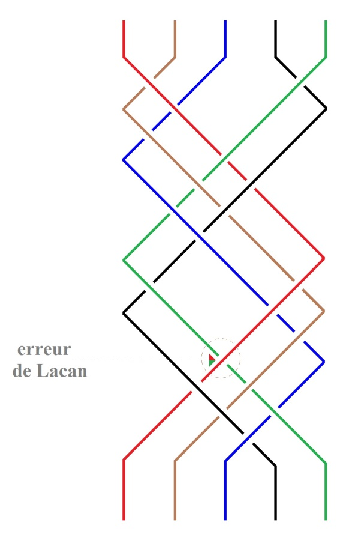

# Leçon 05 | 16 janvier 1979

  

    <label><input type="checkbox" data-lacan-toggle="original" checked> 原文</label>
    <label><input type="checkbox" data-lacan-toggle="notes" checked> 注释</label>
    <label><input type="checkbox" data-lacan-toggle="commentary" checked> 个人解读评论</label>
  

  <form class="lacan-tool-search" role="search">
    <input class="lacan-tool-search-input" type="search" placeholder="搜索全文" aria-label="搜索全文">
    <button class="lacan-tool-button" type="submit" title="搜索">搜索</button>
  </form>
  <button class="lacan-tool-button lacan-back-to-top" type="button" title="回到页面最上方" aria-label="回到页面最上方">↑</button>

<section class="parallel-paragraph" data-paragraph-ids="s26-05-0001">

s26-05-0001

原文 · s26-05-0001

Je suis plutôt embêté de ce que je vous ai annoncé la dernière fois, à savoir qu’il faut un troisième sexe.

[无对应译文]

</section>

<section class="parallel-paragraph" data-paragraph-ids="s26-05-0002">

s26-05-0002

原文 · s26-05-0002

Ce troisième sexe ne peut pas subsister en présence des deux autres.

[无对应译文]

</section>

<section class="parallel-paragraph" data-paragraph-ids="s26-05-0003">

s26-05-0003

原文 · s26-05-0003

Il y a un forçage qui s’appelle l’initiation.

[无对应译文]

</section>

<section class="parallel-paragraph" data-paragraph-ids="s26-05-0004">

s26-05-0004

原文 · s26-05-0004

La psychanalyse est une anti-initiation.

[无对应译文]

</section>

<section class="parallel-paragraph" data-paragraph-ids="s26-05-0005">

s26-05-0005

原文 · s26-05-0005

L’initiation, c’est ce par quoi on s’élève, si je puis dire, au Phallus.

[无对应译文]

</section>

<section class="parallel-paragraph" data-paragraph-ids="s26-05-0006">

s26-05-0006

原文 · s26-05-0006

Ce n’est pas commode de savoir ce qui est initiation ou pas.

[无对应译文]

</section>

<section class="parallel-paragraph" data-paragraph-ids="s26-05-0007">

s26-05-0007

原文 · s26-05-0007

Mais enfin l’orientation générale, c’est que le phallus, on l’intègre.

[无对应译文]

</section>

<section class="parallel-paragraph" data-paragraph-ids="s26-05-0008">

s26-05-0008

原文 · s26-05-0008

Il faut bien qu’en l’absence d’initiation, on soit homme ou on soit femme. Bon.

[无对应译文]

</section>

<section class="parallel-paragraph" data-paragraph-ids="s26-05-0009">

s26-05-0009

原文 · s26-05-0009

Je m’en vais vous parler de quelque chose qui est une tresse à cinq.

[无对应译文]

</section>

<section class="parallel-paragraph" data-paragraph-ids="s26-05-0010">

s26-05-0010

原文 · s26-05-0010

Vous voyez ici il y en a deux qu’il franchit au-dessus et deux qu’il franchit au-dessous.

[无对应译文]

</section>

<section class="parallel-paragraph" data-paragraph-ids="s26-05-0011">

s26-05-0011

原文 · s26-05-0011

Il faudrait redoubler cette séquence, c’est-à-dire ici (bas du schéma de la tresse)

[无对应译文]

</section>

<section class="parallel-paragraph" data-paragraph-ids="s26-05-0012">

s26-05-0012

原文 · s26-05-0012

On peut voir ici dans notre dessin deux fois reproduit qu’il y a une trame qui concerne....

[无对应译文]

</section>

<section class="parallel-paragraph" data-paragraph-ids="s26-05-0013">

s26-05-0013

原文 · s26-05-0013

Bon c’est ennuyeux que je m’embrouille, mais je dois dire que je dois avouer que je m’embrouille.

[无对应译文]

</section>

<section class="parallel-paragraph" data-paragraph-ids="s26-05-0014">

s26-05-0014

原文 · s26-05-0014

Bien. Ça sera assez pour aujourd’hui.

[无对应译文]

</section>

<section class="parallel-paragraph" data-paragraph-ids="s26-05-0015">

s26-05-0015

原文 · s26-05-0015

[无对应译文]

</section>

