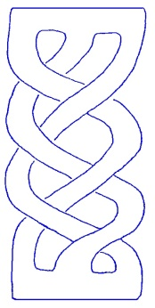
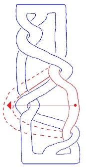
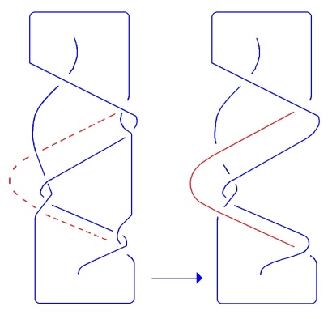

# Leçon 06 | 20 février 1979

  <label><input type="checkbox" data-lacan-toggle="original" checked> 原文</label>
  <label><input type="checkbox" data-lacan-toggle="notes" checked> 注释</label>
  <label><input type="checkbox" data-lacan-toggle="commentary" checked> 个人解读评论</label>

<section class="parallel-paragraph" data-paragraph-ids="s26-06-0001">

s26-06-0001

[无对应译文]

原文 · s26-06-0001

Lacan

</section>

<section class="parallel-paragraph" data-paragraph-ids="s26-06-0002">

s26-06-0002

[无对应译文]

原文 · s26-06-0002

Je suis embêté à cause du borroméen généralisé.

</section>

<section class="parallel-paragraph" data-paragraph-ids="s26-06-0003">

s26-06-0003

[无对应译文]

原文 · s26-06-0003

Je ne peux pas croire que les \[*nœuds borroméens*\] généralisés, ça soit :

</section>

<section class="parallel-paragraph" data-paragraph-ids="s26-06-0004">

s26-06-0004

[无对应译文]

原文 · s26-06-0004

- 4 moins 2,

</section>

<section class="parallel-paragraph" data-paragraph-ids="s26-06-0005">

s26-06-0005

[无对应译文]

原文 · s26-06-0005

- 5 moins 3,

</section>

<section class="parallel-paragraph" data-paragraph-ids="s26-06-0006">

s26-06-0006

[无对应译文]

原文 · s26-06-0006

- 6 moins 4,

</section>

<section class="parallel-paragraph" data-paragraph-ids="s26-06-0007">

s26-06-0007

[无对应译文]

原文 · s26-06-0007

- 7 moins 5,

</section>

<section class="parallel-paragraph" data-paragraph-ids="s26-06-0008">

s26-06-0008

[无对应译文]

原文 · s26-06-0008

- 8 moins 6.

</section>

<section class="parallel-paragraph" data-paragraph-ids="s26-06-0009">

s26-06-0009

[无对应译文]

原文 · s26-06-0009

Je ne peux pas le croire parce que dans tous ces cas, il y a 2 de différence et que ceci implique que de les prendre 2 par 2 ça soit neutre, que de les prendre 3 par 3 ça soit borroméen.

</section>

<section class="parallel-paragraph" data-paragraph-ids="s26-06-0010">

s26-06-0010

[无对应译文]

原文 · s26-06-0010

J’ai le sentiment qu’il faudrait que la généralisation du borroméen s’étende à 4 et même - pourquoi pas - à 5.

</section>

<section class="parallel-paragraph" data-paragraph-ids="s26-06-0011">

s26-06-0011

[无对应译文]

原文 · s26-06-0011

De sorte qu’il faudrait que ça ne soit pas 2 de différence qu’il s’agisse.

</section>

<section class="parallel-paragraph" data-paragraph-ids="s26-06-0012">

s26-06-0012

[无对应译文]

原文 · s26-06-0012

La question est de savoir si tout est neutre avant 4, et même 5.

</section>

<section class="parallel-paragraph" data-paragraph-ids="s26-06-0013">

s26-06-0013

[无对应译文]

原文 · s26-06-0013

Alors aujourd’hui je réserverai cette question et j’espère que je vous apporterai quelque chose la prochaine fois.

</section>

<section class="parallel-paragraph" data-paragraph-ids="s26-06-0014">

s26-06-0014

[无对应译文]

原文 · s26-06-0014

Car il est un fait que le borroméen généralisé a toujours une différence de 2 et qu’il faudrait bien que le borroméen généralisé procède autrement.

</section>

<section class="parallel-paragraph" data-paragraph-ids="s26-06-0015">

s26-06-0015

[无对应译文]

原文 · s26-06-0015

Je voudrais aujourd’hui vous dessiner autre chose, c’est à savoir une bande de Slade.

</section>

<section class="parallel-paragraph" data-paragraph-ids="s26-06-0016">

s26-06-0016

[无对应译文]

原文 · s26-06-0016

Chose curieuse, c’est la même bande que celle-ci, ce qui se voit en rabattant d’abord ceci, ça vous permet de rabattre ceci et ça aboutit, du même coup, à rendre identique ceci avec ceci.

</section>

<section class="parallel-paragraph" data-paragraph-ids="s26-06-0017">

s26-06-0017

[无对应译文]

原文 · s26-06-0017

 ← ceci = ceci → si vous rabattez ceci

</section>

<section class="parallel-paragraph" data-paragraph-ids="s26-06-0018">

s26-06-0018

[无对应译文]

原文 · s26-06-0018

En d’autres termes, en rabattant ceci, c’est-à-dire ceci, ça vous permet, celui-ci, de le rabattre d’une façon telle que c’est égal à ceci, c’est à dire aux 6 croisements de cette figure, alors que celle-ci en a 8.

</section>

<section class="parallel-paragraph" data-paragraph-ids="s26-06-0019">

s26-06-0019

[无对应译文]

原文 · s26-06-0019

> 

</section>

<section class="parallel-paragraph" data-paragraph-ids="s26-06-0020">

s26-06-0020

[无对应译文]

原文 · s26-06-0020

Peut-être cela m’aidera-t-il à résoudre la question du borroméen généralisé.

</section>

<section class="parallel-paragraph" data-paragraph-ids="s26-06-0021">

s26-06-0021

[无对应译文]

原文 · s26-06-0021

Questions

</section>

<section class="parallel-paragraph" data-paragraph-ids="s26-06-0022">

s26-06-0022

[无对应译文]

原文 · s26-06-0022

Posez la question.

</section>

<section class="parallel-paragraph" data-paragraph-ids="s26-06-0023">

s26-06-0023

[无对应译文]

原文 · s26-06-0023

Mme Mouchonnat : Excusez-moi, Monsieur, de vous poser une question dans mon style, c’est-à-dire assez naïf, je pense que je ne suis pas la seule ici d’ailleurs, mais vous y répondrez si vous pensez que ça vaut la peine, c’est une question qui, pour moi, vaut.

</section>

<section class="parallel-paragraph" data-paragraph-ids="s26-06-0024">

s26-06-0024

[无对应译文]

原文 · s26-06-0024

On en est à 6 et 8, or je suis complètement dépassée... Jusqu’à 3, ça va !

</section>

<section class="parallel-paragraph" data-paragraph-ids="s26-06-0025">

s26-06-0025

[无对应译文]

原文 · s26-06-0025

Je me pose la question, à vrai dire depuis que vous \[...\]

</section>

<section class="parallel-paragraph" data-paragraph-ids="s26-06-0026">

s26-06-0026

[无对应译文]

原文 · s26-06-0026

X \[...\] avons avancé, il n’y a pas longtemps, il y a à peu près deux séminaires, que peut-être la métaphore du nœud borroméen, c’est-à-dire les 3...

</section>

<section class="parallel-paragraph" data-paragraph-ids="s26-06-0027">

s26-06-0027

[无对应译文]

原文 · s26-06-0027

> je m’arrête là pour le moment ...ça ne convient pas pour rendre compte du R.S.I.

</section>

<section class="parallel-paragraph" data-paragraph-ids="s26-06-0028">

s26-06-0028

[无对应译文]

原文 · s26-06-0028

Alors je ne sais pas ce qu’il en est de mes camarades, ça m’a beaucoup touché, ça m’a paru extrêmement important, je pense que même on pourrait dire qu’il y a de quoi ne plus dormir, ce qui est peut-être pas mal.

</section>

<section class="parallel-paragraph" data-paragraph-ids="s26-06-0029">

s26-06-0029

[无对应译文]

原文 · s26-06-0029

Alors voilà un petit peu mes réflexions : le nœud borroméen, comme tout ce qu’amène Lacan, il faut...

</section>

<section class="parallel-paragraph" data-paragraph-ids="s26-06-0030">

s26-06-0030

[无对应译文]

原文 · s26-06-0030

> en tout cas, pour moi, c’est comme ça ...il me faut quelques années pour comprendre, entendre...

</section>

<section class="parallel-paragraph" data-paragraph-ids="s26-06-0031">

s26-06-0031

[无对应译文]

原文 · s26-06-0031

Bon, j’en suis arrivé à un petit peu entendre ce que c’est que le nœud borroméen et en tout cas, moi, ça me sert dans l’analyse. C’est un moyen.

</section>

<section class="parallel-paragraph" data-paragraph-ids="s26-06-0032">

s26-06-0032

[无对应译文]

原文 · s26-06-0032

Mon truc, c’est pas les mathématiques, je m’en fiche comme de ma première liquette, je dirai même plus !

</section>

<section class="parallel-paragraph" data-paragraph-ids="s26-06-0033">

s26-06-0033

[无对应译文]

原文 · s26-06-0033

Mais c’est un moyen pour une fin, c’est-à-dire que ça me permet de mieux me démêler avec ce qu’est la psychanalyse. Alors l’intérêt du nœud borroméen, c’est que c’est une façon d’écrire le R.S.I.

</section>

<section class="parallel-paragraph" data-paragraph-ids="s26-06-0034">

s26-06-0034

[无对应译文]

原文 · s26-06-0034

En gros - bon, je le rappelle- il y a trois ronds qui s’attachent, au milieu il y a un trou : c’est le *petit a*.

</section>

<section class="parallel-paragraph" data-paragraph-ids="s26-06-0035">

s26-06-0035

[无对应译文]

原文 · s26-06-0035

Mais ils s’attachent d’une certaine façon, ça c’est très important - non ? – je crois que depuis le temps qu’on nous le serine ça, jusque là c’est fait, le travail d’avoir saisi...

</section>

<section class="parallel-paragraph" data-paragraph-ids="s26-06-0036">

s26-06-0036

[无对应译文]

原文 · s26-06-0036

Quand même, je veux dire quelque chose, c’est qu’à propos du nœud borroméen, l’intérêt que Lacan a suscité chez moi, avec tout ça, je le vois à deux niveaux : d’abord il nous a fait une monstration qui a duré, qui dure, qui est une vraie démonstration, c’est-à-dire, il se collète avec le Réel, il s’emmêle, il nous le montre, je dirais même qu’il y met *une certaine complaisance*, et je pense que c’est une leçon, enfin pour moi, c’en est une.

</section>

<section class="parallel-paragraph" data-paragraph-ids="s26-06-0037">

s26-06-0037

[无对应译文]

原文 · s26-06-0037

Le deuxième niveau, ça m’intéresse parce que, comme je le disais, ça m’aide pour travailler dans la psychanalyse. Alors pour en revenir à nos moutons, je dirais que c’est-à-dire une histoire de bélier, en gros, je reconnais là une histoire de bélier, c’est-à-dire

</section>

<section class="parallel-paragraph" data-paragraph-ids="s26-06-0038">

s26-06-0038

[无对应译文]

原文 · s26-06-0038

- le corps primordial qu’on incorpore, comme chacun sait, dont l’origine est peut-être mythique, enfin je le mettrais plutôt du côté du R, du Réel,

</section>

<section class="parallel-paragraph" data-paragraph-ids="s26-06-0039">

s26-06-0039

[无对应译文]

原文 · s26-06-0039

- et puis il y a, deuxième, c’est le « Tu dois une vie à ton père », le S à peu près...

</section>

<section class="parallel-paragraph" data-paragraph-ids="s26-06-0040">

s26-06-0040

[无对应译文]

原文 · s26-06-0040

Non, bien sûr, je me suis trompé pour le premier, c’est l’*Imaginaire* que je voulais dire, le bélier, *le corps imaginaire*.

</section>

<section class="parallel-paragraph" data-paragraph-ids="s26-06-0041">

s26-06-0041

[无对应译文]

原文 · s26-06-0041

- et ensuite le Symbolique du côté de Jéhovah : « Tu dois une mort à Dieu ». Quel dieu, peu importe! La question de dieu se pose à chacun, comme chacun sait, même aux athées.

</section>

<section class="parallel-paragraph" data-paragraph-ids="s26-06-0042">

s26-06-0042

[无对应译文]

原文 · s26-06-0042

Bon, alors, moi ça me sert le nœud borroméen.

</section>

<section class="parallel-paragraph" data-paragraph-ids="s26-06-0043">

s26-06-0043

[无对应译文]

原文 · s26-06-0043

Je dois dire que quand Lacan nous dit, il y a 2 ou 3 séances, que peut-être que cette métaphore ne convient pas, vraiment ça m’a bouleversée. Alors, voilà, je me suis dit : « *ça ne convient pas* », ça veut dire quoi ?

</section>

<section class="parallel-paragraph" data-paragraph-ids="s26-06-0044">

s26-06-0044

[无对应译文]

原文 · s26-06-0044

Enfin il a dit quelque chose...

</section>

<section class="parallel-paragraph" data-paragraph-ids="s26-06-0045">

s26-06-0045

[无对应译文]

原文 · s26-06-0045

> Je n’ai pas retrouvé mes notes, je les ai prêtées à quelqu’un, je n’ai pas pu revoir exactement ...mais c’était quelque chose, enfin il y avait un adjectif en « able » du genre « *c’est pas convenable* », c’était peut-être un autre... disons « *injustifiable* » ?

</section>

<section class="parallel-paragraph" data-paragraph-ids="s26-06-0046">

s26-06-0046

[无对应译文]

原文 · s26-06-0046

Alors, c’est injustifiable, je me suis dit : pourquoi c’est injustifiable ?

</section>

<section class="parallel-paragraph" data-paragraph-ids="s26-06-0047">

s26-06-0047

[无对应译文]

原文 · s26-06-0047

Injustifiable, ça veut dire que notre démonstration ne convient pas bien, notre modèle que nous avions avancé...

</section>

<section class="parallel-paragraph" data-paragraph-ids="s26-06-0048">

s26-06-0048

[无对应译文]

原文 · s26-06-0048

> je dis nous parce qu’on assiste à son séminaire, et même après quelques années
>
> je pense qu’on assiste son séminaire, c’est pour cela que je me permets de parler ...bon, alors c’est « injustifiable »

</section>

<section class="parallel-paragraph" data-paragraph-ids="s26-06-0049">

s26-06-0049

[无对应译文]

原文 · s26-06-0049

- parce que ce modèle ne convient pas, on s’est trompé quelque part, comme on sait bien qu’on fait, c’est à revoir, retourner un peu en arrière,

</section>

<section class="parallel-paragraph" data-paragraph-ids="s26-06-0050">

s26-06-0050

[无对应译文]

原文 · s26-06-0050

- ou bien alors, vraiment ça ne peut pas convenir, ce modèle ne peut pas convenir ?

</section>

<section class="parallel-paragraph" data-paragraph-ids="s26-06-0051">

s26-06-0051

[无对应译文]

原文 · s26-06-0051

Alors voilà, ma question arrive là - pour moi c’est une question importante.

</section>

<section class="parallel-paragraph" data-paragraph-ids="s26-06-0052">

s26-06-0052

[无对应译文]

原文 · s26-06-0052

Il a dit : cette métaphore est, disons, « injustifiable ».

</section>

<section class="parallel-paragraph" data-paragraph-ids="s26-06-0053">

s26-06-0053

[无对应译文]

原文 · s26-06-0053

Alors est-ce qu’on peut dire qu’une métaphore est liquidée parce qu’elle n’est pas bien... juste ?

</section>

<section class="parallel-paragraph" data-paragraph-ids="s26-06-0054">

s26-06-0054

[无对应译文]

原文 · s26-06-0054

Moi, je pense que non, une métaphore, ça n’est jamais tout à fait juste sinon ça ne serait pas une métaphore.

</section>

<section class="parallel-paragraph" data-paragraph-ids="s26-06-0055">

s26-06-0055

[无对应译文]

原文 · s26-06-0055

Seulement on ne peut pas parler si on n’utilise pas des métaphores, et dans ce sens le nœud borroméen, ça m’est utile comme métaphore.

</section>

<section class="parallel-paragraph" data-paragraph-ids="s26-06-0056">

s26-06-0056

[无对应译文]

原文 · s26-06-0056

Alors je l’entends un tout petit peu du côté de la métaphore paternelle, mais peut-être que je comprends mal Lacan. La question que je voudrais poser, c’est celle-ci : est-ce que simplement c’est un problème de mathématiques, auquel cas, je suis tranquille, enfin ça ne m’intéresse pas, pas spécialement, non vraiment !

</section>

<section class="parallel-paragraph" data-paragraph-ids="s26-06-0057">

s26-06-0057

[无对应译文]

原文 · s26-06-0057

Mais si le R.S.I, cet arrangement particulier de ces trois catégories, liées comme elles le sont, avec ce trou au milieu, c’était la métaphore paternelle ou bien peut-être en ajoutant un quatrième rond, comme ça a été évoqué, peut-être Freud avait joué avec le père comme ça, à l’autre rond là...

</section>

<section class="parallel-paragraph" data-paragraph-ids="s26-06-0058">

s26-06-0058

[无对应译文]

原文 · s26-06-0058

Bon, eh bien, si ça ne convient pas, ça nous entraîne loin, je crois que c’est une question très importante.

</section>

<section class="parallel-paragraph" data-paragraph-ids="s26-06-0059">

s26-06-0059

[无对应译文]

原文 · s26-06-0059

Enfin la question...

</section>

<section class="parallel-paragraph" data-paragraph-ids="s26-06-0060">

s26-06-0060

[无对应译文]

原文 · s26-06-0060

> mais je crois que c’est pas très clair ce que je dis, je le dis comme je le peux ...la question que je pose à Lacan, c’est : sommes-nous, nous tous, emmêlés dans des nœuds là devant des difficultés proprement mathématiques, mais ça n’a-t-il pas des incidences, puisque quand même il nous parle dans la psychanalyse là, pour la psychanalyse ?

</section>

<section class="parallel-paragraph" data-paragraph-ids="s26-06-0061">

s26-06-0061

[无对应译文]

原文 · s26-06-0061

Est-ce que ça ne nous réinterroge pas dans nos catégories psychanalytiques ?

</section>

<section class="parallel-paragraph" data-paragraph-ids="s26-06-0062">

s26-06-0062

[无对应译文]

原文 · s26-06-0062

Est-ce qu’il n’y a pas là quelque chose au niveau des noms du père qui serait à réajuster ?

</section>

<section class="parallel-paragraph" data-paragraph-ids="s26-06-0063">

s26-06-0063

[无对应译文]

原文 · s26-06-0063

On se serait trompé :

</section>

<section class="parallel-paragraph" data-paragraph-ids="s26-06-0064">

s26-06-0064

[无对应译文]

原文 · s26-06-0064

- ou notre modèle ne convient pas,

</section>

<section class="parallel-paragraph" data-paragraph-ids="s26-06-0065">

s26-06-0065

[无对应译文]

原文 · s26-06-0065

- ou il faut repenser quelque chose au niveau de la métaphore paternelle.

</section>

<section class="parallel-paragraph" data-paragraph-ids="s26-06-0066">

s26-06-0066

[无对应译文]

原文 · s26-06-0066

Alors la troisième solution étant qu’évidemment je n’aie pas compris, ce qui n’est pas du tout exclu, c’est sûr...

</section>

<section class="parallel-paragraph" data-paragraph-ids="s26-06-0067">

s26-06-0067

[无对应译文]

原文 · s26-06-0067

Lacan

</section>

<section class="parallel-paragraph" data-paragraph-ids="s26-06-0068">

s26-06-0068

[无对应译文]

原文 · s26-06-0068

Ce qui me tracasse dans le nœud borroméen, c’est une question mathématique, et c’est mathématiquement que j’entends la traiter.

</section>

<section class="parallel-paragraph" data-paragraph-ids="s26-06-0069">

s26-06-0069

[无对应译文]

原文 · s26-06-0069

X

</section>

<section class="parallel-paragraph" data-paragraph-ids="s26-06-0070">

s26-06-0070

[无对应译文]

原文 · s26-06-0070

Docteur, permettez-moi de rectifier votre troisième schéma.

</section>

<section class="parallel-paragraph" data-paragraph-ids="s26-06-0071">

s26-06-0071

[无对应译文]

原文 · s26-06-0071

Dans le cadre de la bande de Slade, si on donne 1-2-3 à l’ordre de départ, ça arrive en bas en 1-2-3, mais dans le cadre du troisième schéma, si c’est 1-2-3 au départ, c’est 2-3-1 à l’arrivée.

</section>

<section class="parallel-paragraph" data-paragraph-ids="s26-06-0072">

s26-06-0072

[无对应译文]

原文 · s26-06-0072

Lacan

</section>

<section class="parallel-paragraph" data-paragraph-ids="s26-06-0073">

s26-06-0073

[无对应译文]

原文 · s26-06-0073

C’est tout à fait vrai...

</section>

<section class="parallel-paragraph" data-paragraph-ids="s26-06-0074">

s26-06-0074

[无对应译文]

原文 · s26-06-0074

C’est tout à fait vrai, mais je suis embrouillé.

</section>

<section class="parallel-paragraph" data-paragraph-ids="s26-06-0075">

s26-06-0075

[无对应译文]

原文 · s26-06-0075

Bien, je vous dis au revoir. J’essaierai de faire mieux la prochaine fois.

</section>

