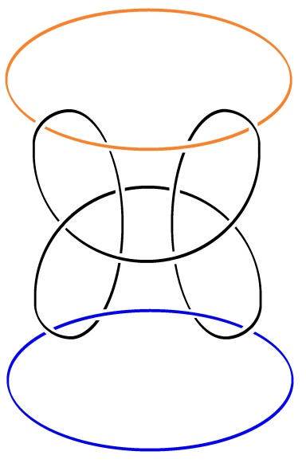

# Leçon 07 | 13 Mars 1979

  

    <label><input type="checkbox" data-lacan-toggle="original" checked> 原文</label>
    <label><input type="checkbox" data-lacan-toggle="notes" checked> 注释</label>
    <label><input type="checkbox" data-lacan-toggle="commentary" checked> 个人解读评论</label>
  

  <form class="lacan-tool-search" role="search">
    <input class="lacan-tool-search-input" type="search" placeholder="搜索全文" aria-label="搜索全文">
    <button class="lacan-tool-button" type="submit" title="搜索">搜索</button>
  </form>
  <button class="lacan-tool-button lacan-back-to-top" type="button" title="回到页面最上方" aria-label="回到页面最上方">↑</button>

<section class="parallel-paragraph" data-paragraph-ids="s26-07-0001">

s26-07-0001

原文 · s26-07-0001

Il y quelque chose que je vous ai dit : pourquoi n’y aurait-il pas un troisième sexe ?

[无对应译文]

</section>

<section class="parallel-paragraph" data-paragraph-ids="s26-07-0002">

s26-07-0002

原文 · s26-07-0002

Tout ça vient de ce que j’ai étudié le borroméen généralisé.

[无对应译文]

</section>

<section class="parallel-paragraph" data-paragraph-ids="s26-07-0003">

s26-07-0003

原文 · s26-07-0003

→ 

[无对应译文]

</section>

<section class="parallel-paragraph" data-paragraph-ids="s26-07-0004">

s26-07-0004

原文 · s26-07-0004

→  → 

[无对应译文]

</section>

<section class="parallel-paragraph" data-paragraph-ids="s26-07-0005">

s26-07-0005

原文 · s26-07-0005

**Nœud dénoué**

[无对应译文]

</section>

<section class="parallel-paragraph" data-paragraph-ids="s26-07-0006">

s26-07-0006

原文 · s26-07-0006

Le borroméen généralisé, il va de soi que je n’y comprends rien, je m’embrouille...

[无对应译文]

</section>

<section class="parallel-paragraph" data-paragraph-ids="s26-07-0007">

s26-07-0007

原文 · s26-07-0007

Je m’embrouille, ce dont vous témoigne le fait qu’en écrivant au tableau, je m’y suis, c’est le cas de le dire, absolument embrouillé.

[无对应译文]

</section>

<section class="parallel-paragraph" data-paragraph-ids="s26-07-0008">

s26-07-0008

原文 · s26-07-0008

Je voudrais aujourd’hui vous faire sentir que le borroméen généralisé, ce n’est pas une petite affaire...

[无对应译文]

</section>

<section class="parallel-paragraph" data-paragraph-ids="s26-07-0009">

s26-07-0009

原文 · s26-07-0009

Je m’embrouille et je vous congédie de ce fait.

[无对应译文]

</section>

