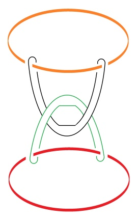
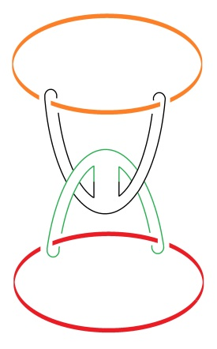

# Leçon 08 | 20 mars 1979

  <label><input type="checkbox" data-lacan-toggle="original" checked> 原文</label>
  <label><input type="checkbox" data-lacan-toggle="notes" checked> 注释</label>
  <label><input type="checkbox" data-lacan-toggle="commentary" checked> 个人解读评论</label>

<section class="parallel-paragraph" data-paragraph-ids="s26-08-0001">

s26-08-0001

[无对应译文]

原文 · s26-08-0001

Il y a quelqu’un qui m’a écrit pour me dire ce qu’il avait pensé de mon dernier séminaire.

</section>

<section class="parallel-paragraph" data-paragraph-ids="s26-08-0002">

s26-08-0002

[无对应译文]

原文 · s26-08-0002

Eh bien, à la vérité, ce que j’avais fait était ça : c’est un borroméen généralisé \[ I \]...

</section>

<section class="parallel-paragraph" data-paragraph-ids="s26-08-0003">

s26-08-0003

[无对应译文]

原文 · s26-08-0003

> alors que la personne qui m’a écrit l’a réduit à ce qui est \[*un borroméen*\] normal \[ II \], ...à savoir que ceci \[*bo. généralisé*\] a été découvert en mettant en continuité ces deux : vert et noir \[ III \].

</section>

<section class="parallel-paragraph" data-paragraph-ids="s26-08-0004">

s26-08-0004

[无对应译文]

原文 · s26-08-0004

Le vert et le noir sont là.

</section>

<section class="parallel-paragraph" data-paragraph-ids="s26-08-0005">

s26-08-0005

[无对应译文]

原文 · s26-08-0005

  

</section>

<section class="parallel-paragraph" data-paragraph-ids="s26-08-0006">

s26-08-0006

[无对应译文]

原文 · s26-08-0006

**I II III**

</section>

<section class="parallel-paragraph" data-paragraph-ids="s26-08-0007">

s26-08-0007

[无对应译文]

原文 · s26-08-0007

Une autre façon de le résoudre :

</section>

<section class="parallel-paragraph" data-paragraph-ids="s26-08-0008">

s26-08-0008

[无对应译文]

原文 · s26-08-0008

- ça serait de *mettre en continuité* ce que j’ai dessiné d’abord en jaune (orange) et ce que j’ai dessiné en rouge \[ II \],

</section>

<section class="parallel-paragraph" data-paragraph-ids="s26-08-0009">

s26-08-0009

[无对应译文]

原文 · s26-08-0009

- ou bien encore de mettre en continuité ce que j’ai dessiné là en rouge avec ce que j’ai dessiné en noir \[ II \].

</section>

<section class="parallel-paragraph" data-paragraph-ids="s26-08-0010">

s26-08-0010

[无对应译文]

原文 · s26-08-0010

La question est de savoir ce qui est *homotopique* : ce qui est *homotopique* est à l’intérieur d’une consistance \[ IV \].

</section>

<section class="parallel-paragraph" data-paragraph-ids="s26-08-0011">

s26-08-0011

[无对应译文]

原文 · s26-08-0011

J’ai commis la dernière fois, quelque chose qui était de cet ordre \[ IV \], je veux dire qu’à l’intérieur d’une même corde l’homotopie consiste à pouvoir transgresser la figure.

</section>

<section class="parallel-paragraph" data-paragraph-ids="s26-08-0012">

s26-08-0012

[无对应译文]

原文 · s26-08-0012

Il en résulte que le nœud se défait. Il suffit de traverser la corde en un point \*. C’est de la même corde qu’il s’agit.

</section>

<section class="parallel-paragraph" data-paragraph-ids="s26-08-0013">

s26-08-0013

[无对应译文]

原文 · s26-08-0013

 **→** 

</section>

<section class="parallel-paragraph" data-paragraph-ids="s26-08-0014">

s26-08-0014

[无对应译文]

原文 · s26-08-0014

**1er état 2ème état**

</section>

<section class="parallel-paragraph" data-paragraph-ids="s26-08-0015">

s26-08-0015

[无对应译文]

原文 · s26-08-0015

**IV V**

</section>

<section class="parallel-paragraph" data-paragraph-ids="s26-08-0016">

s26-08-0016

[无对应译文]

原文 · s26-08-0016

X - Il faut que la même corde se traverse en trois points.

</section>

<section class="parallel-paragraph" data-paragraph-ids="s26-08-0017">

s26-08-0017

[无对应译文]

原文 · s26-08-0017

Lacan : Oui, vous croyez cela.

</section>

<section class="parallel-paragraph" data-paragraph-ids="s26-08-0018">

s26-08-0018

[无对应译文]

原文 · s26-08-0018

X :

</section>

<section class="parallel-paragraph" data-paragraph-ids="s26-08-0019">

s26-08-0019

[无对应译文]

原文 · s26-08-0019

- La torsion à droite... pardon : la torsion à gauche en haut,

</section>

<section class="parallel-paragraph" data-paragraph-ids="s26-08-0020">

s26-08-0020

[无对应译文]

原文 · s26-08-0020

- à droite en bas

</section>

<section class="parallel-paragraph" data-paragraph-ids="s26-08-0021">

s26-08-0021

[无对应译文]

原文 · s26-08-0021

- et à gauche...

</section>

<section class="parallel-paragraph" data-paragraph-ids="s26-08-0022">

s26-08-0022

[无对应译文]

原文 · s26-08-0022

Si vous ne corrigez qu’un point, comme vous l’avez dit, elle ne se dénoue pas.

</section>

<section class="parallel-paragraph" data-paragraph-ids="s26-08-0023">

s26-08-0023

[无对应译文]

原文 · s26-08-0023

Lacan : vous croyez qu’en modifiant ceci, elle ne se dénoue pas ? Alors il faut modifier ces points-là ?

</section>

<section class="parallel-paragraph" data-paragraph-ids="s26-08-0024">

s26-08-0024

[无对应译文]

原文 · s26-08-0024

X : (inaudible)

</section>

<section class="parallel-paragraph" data-paragraph-ids="s26-08-0025">

s26-08-0025

[无对应译文]

原文 · s26-08-0025

Lacan : Bien. Au revoir !

</section>

