# Leçon 10 | 15 mai 1979

  

    <label><input type="checkbox" data-lacan-toggle="original" checked> 原文</label>
    <label><input type="checkbox" data-lacan-toggle="notes" checked> 注释</label>
    <label><input type="checkbox" data-lacan-toggle="commentary" checked> 个人解读评论</label>
  

  <form class="lacan-tool-search" role="search">
    <input class="lacan-tool-search-input" type="search" placeholder="搜索全文" aria-label="搜索全文">
    <button class="lacan-tool-button" type="submit" title="搜索">搜索</button>
  </form>
  <button class="lacan-tool-button lacan-back-to-top" type="button" title="回到页面最上方" aria-label="回到页面最上方">↑</button>

<section class="parallel-paragraph" data-paragraph-ids="s26-10-0001">

s26-10-0001

原文 · s26-10-0001

<u>Nasio, Vappereau</u>

[无对应译文]

</section>

<section class="parallel-paragraph" data-paragraph-ids="s26-10-0002">

s26-10-0002

原文 · s26-10-0002

Lacan : Aujourd’hui, ça va être un dialogue entre Nasio et Jean-Michel Vappereau.

[无对应译文]

</section>

<section class="parallel-paragraph" data-paragraph-ids="s26-10-0003">

s26-10-0003

原文 · s26-10-0003

Nasio

[无对应译文]

</section>

<section class="parallel-paragraph" data-paragraph-ids="s26-10-0004">

s26-10-0004

原文 · s26-10-0004

Il semblerait que monter sur cette estrade conduit presque automatiquement à vous demander, vous les auditeurs de Lacan, l’indulgence. Car c’est seulement hier, lundi à midi, que M. Lacan m’a demandé de vous parler d’une question dont je lui avais fait état. Elle concerne la théorie du sujet de l’inconscient.

[无对应译文]

</section>

<section class="parallel-paragraph" data-paragraph-ids="s26-10-0005">

s26-10-0005

原文 · s26-10-0005

Si je devais intituler cette intervention, j’écrirais : « *l’enfant magnifique de la psychanalyse* ».

[无对应译文]

</section>

<section class="parallel-paragraph" data-paragraph-ids="s26-10-0006">

s26-10-0006

原文 · s26-10-0006

Alors qu’au début de l’année, mon projet était d’étudier l’articulation entre le savoir inconscient et l’interprétation, progressivement, au fur et à mesure de certains développements, la question du sujet a pris le dessus, est devenue le problème principal.

[无对应译文]

</section>

<section class="parallel-paragraph" data-paragraph-ids="s26-10-0007">

s26-10-0007

原文 · s26-10-0007

Ce matin, je me bornerai à un rappel succinct des abords possibles du concept de sujet, abords certainement connus de la plupart d’entre vous, afin de vous soumettre ensuite quelques interrogations.

[无对应译文]

</section>

<section class="parallel-paragraph" data-paragraph-ids="s26-10-0008">

s26-10-0008

原文 · s26-10-0008

Divisons ce résumé en trois parties :

[无对应译文]

</section>

<section class="parallel-paragraph" data-paragraph-ids="s26-10-0009">

s26-10-0009

原文 · s26-10-0009

- selon le rapport du sujet au savoir inconscient,

[无对应译文]

</section>

<section class="parallel-paragraph" data-paragraph-ids="s26-10-0010">

s26-10-0010

原文 · s26-10-0010

- selon le rapport du sujet à la logique de Frege,

[无对应译文]

</section>

<section class="parallel-paragraph" data-paragraph-ids="s26-10-0011">

s26-10-0011

原文 · s26-10-0011

- et enfin selon le rapport du sujet à la castration.

[无对应译文]

</section>

<section class="parallel-paragraph" data-paragraph-ids="s26-10-0012">

s26-10-0012

原文 · s26-10-0012

**I**

[无对应译文]

</section>

<section class="parallel-paragraph" data-paragraph-ids="s26-10-0013">

s26-10-0013

原文 · s26-10-0013

Notre point de départ sera celui de la psychanalyse elle-même, constitué par ce fait de langage qui s’énonce : « *Je ne sais pas ce que je dis* ».

[无对应译文]

</section>

<section class="parallel-paragraph" data-paragraph-ids="s26-10-0014">

s26-10-0014

原文 · s26-10-0014

Si le désir de l’hystérique est fondateur du transfert, le « *je ne sais pas ce que je dis* » est le fondateur de la notion d’inconscient chez Freud et de la notion d’inconscient comme savoir chez Lacan.

[无对应译文]

</section>

<section class="parallel-paragraph" data-paragraph-ids="s26-10-0015">

s26-10-0015

原文 · s26-10-0015

Donc « *Je ne sais pas ce que je dis* ».

[无对应译文]

</section>

<section class="parallel-paragraph" data-paragraph-ids="s26-10-0016">

s26-10-0016

原文 · s26-10-0016

Je ne sais pas quoi ?

[无对应译文]

</section>

<section class="parallel-paragraph" data-paragraph-ids="s26-10-0017">

s26-10-0017

原文 · s26-10-0017

Je ne sais pas que ce que je dis est un signifiant et comme tel ne s’adresse pas au parlant, mais à un autre signifiant.

[无对应译文]

</section>

<section class="parallel-paragraph" data-paragraph-ids="s26-10-0018">

s26-10-0018

原文 · s26-10-0018

Il s’adresse à l’Autre.

[无对应译文]

</section>

<section class="parallel-paragraph" data-paragraph-ids="s26-10-0019">

s26-10-0019

原文 · s26-10-0019

Je parle, j’émets des sons, je construis des sens, mais le dit, lui, m’échappe.

[无对应译文]

</section>

<section class="parallel-paragraph" data-paragraph-ids="s26-10-0020">

s26-10-0020

原文 · s26-10-0020

Il m’échappe parce qu’il n’est pas du pouvoir du sujet de savoir avec quel autre dit, ce dit va se lier.

[无对应译文]

</section>

<section class="parallel-paragraph" data-paragraph-ids="s26-10-0021">

s26-10-0021

原文 · s26-10-0021

« *Le signifiant s’adresse à l’Autre* » veut dire qu’il va se lier à un autre signifiant, ailleurs, à côté, après...

[无对应译文]

</section>

<section class="parallel-paragraph" data-paragraph-ids="s26-10-0022">

s26-10-0022

原文 · s26-10-0022

Donc, je ne sais pas quoi ?

[无对应译文]

</section>

<section class="parallel-paragraph" data-paragraph-ids="s26-10-0023">

s26-10-0023

原文 · s26-10-0023

L’effet de ma parole sur vous, sur l’Autre.

[无对应译文]

</section>

<section class="parallel-paragraph" data-paragraph-ids="s26-10-0024">

s26-10-0024

原文 · s26-10-0024

Et de ne pas savoir ce que je dis, je dis plus que je ne voudrai.

[无对应译文]

</section>

<section class="parallel-paragraph" data-paragraph-ids="s26-10-0025">

s26-10-0025

原文 · s26-10-0025

En un mot, je ne sais pas ce que je dis parce que mon dit va ailleurs :

[无对应译文]

</section>

<section class="parallel-paragraph" data-paragraph-ids="s26-10-0026">

s26-10-0026

原文 · s26-10-0026

- à mon insu, il s’adresse à l’Autre,

[无对应译文]

</section>

<section class="parallel-paragraph" data-paragraph-ids="s26-10-0027">

s26-10-0027

原文 · s26-10-0027

- et à mon insu aussi, il me vient de l’Autre.

[无对应译文]

</section>

<section class="parallel-paragraph" data-paragraph-ids="s26-10-0028">

s26-10-0028

原文 · s26-10-0028

Il vient de l’Autre et il s’adresse à l’Autre, il part de l’Autre.

[无对应译文]

</section>

<section class="parallel-paragraph" data-paragraph-ids="s26-10-0029">

s26-10-0029

原文 · s26-10-0029

Il existe encore une raison à ce « *Je ne sais pas ce que je dis* », c’est que le sujet qui énonce son dit...

[无对应译文]

</section>

<section class="parallel-paragraph" data-paragraph-ids="s26-10-0030">

s26-10-0030

原文 · s26-10-0030

> j’insiste : « *le sujet qui énonce*... » ...n’est pas le même lorsque le message, ou dit, peut lui revenir.

[无对应译文]

</section>

<section class="parallel-paragraph" data-paragraph-ids="s26-10-0031">

s26-10-0031

原文 · s26-10-0031

Nous ne sommes plus le même parce que dans l’acte de dire, je change.

[无对应译文]

</section>

<section class="parallel-paragraph" data-paragraph-ids="s26-10-0032">

s26-10-0032

原文 · s26-10-0032

L’expression « *sujet effet du signifiant* » veut dire justement que le sujet change avec l’acte de dire.

[无对应译文]

</section>

<section class="parallel-paragraph" data-paragraph-ids="s26-10-0033">

s26-10-0033

原文 · s26-10-0033

En bref, je ne sais pas quoi ?

[无对应译文]

</section>

<section class="parallel-paragraph" data-paragraph-ids="s26-10-0034">

s26-10-0034

原文 · s26-10-0034

1)  Je ne sais pas que j’étais là, sous tel signifiant.

[无对应译文]

</section>

<section class="parallel-paragraph" data-paragraph-ids="s26-10-0035">

s26-10-0035

原文 · s26-10-0035

Que tel *dit* a été le signifiant, mon signifiant, le signifiant du sujet.

[无对应译文]

</section>

<section class="parallel-paragraph" data-paragraph-ids="s26-10-0036">

s26-10-0036

原文 · s26-10-0036

> Donc j’étais là, un point de non-savoir.

[无对应译文]

</section>

<section class="parallel-paragraph" data-paragraph-ids="s26-10-0037">

s26-10-0037

原文 · s26-10-0037

Et ce point de non-savoir représente ce qui a échappé à l’Autre et qui s’adresse à lui.

[无对应译文]

</section>

<section class="parallel-paragraph" data-paragraph-ids="s26-10-0038">

s26-10-0038

原文 · s26-10-0038

2)  De ne pas savoir quel est le signifiant sous la coupe duquel je me trouvais, j’ignore du même coup l’autre signifiant auquel il s’adresse.

[无对应译文]

</section>

<section class="parallel-paragraph" data-paragraph-ids="s26-10-0039">

s26-10-0039

原文 · s26-10-0039

Autrement dit : je ne sais pas - en disant - quel signifiant m’attend.

[无对应译文]

</section>

<section class="parallel-paragraph" data-paragraph-ids="s26-10-0040">

s26-10-0040

原文 · s26-10-0040

3)  Je ne sais pas qui je suis.

[无对应译文]

</section>

<section class="parallel-paragraph" data-paragraph-ids="s26-10-0041">

s26-10-0041

原文 · s26-10-0041

En somme vous avez :

[无对应译文]

</section>

<section class="parallel-paragraph" data-paragraph-ids="s26-10-0042">

s26-10-0042

原文 · s26-10-0042

- d’une part le sujet fixé, suspendu à un signifiant, celui de son acte de dire,

[无对应译文]

</section>

<section class="parallel-paragraph" data-paragraph-ids="s26-10-0043">

s26-10-0043

原文 · s26-10-0043

- d’autre part les signifiants se succédant l’un derrière l’autre, le sujet, en fait, n’est nulle part.

[无对应译文]

</section>

<section class="parallel-paragraph" data-paragraph-ids="s26-10-0044">

s26-10-0044

原文 · s26-10-0044

Je répète, car c’est la conclusion à laquelle je voulais aboutir : le sujet est dans l’acte, son acte d’énoncer le dit, mais étant donné que celui-ci vient de l’Autre et s’adresse à l’Autre, que tout se passe entre des dits, le sujet reste suspendu, perdu, effacé dans l’ensemble ouvert des signifiants enchaînés :

[无对应译文]

</section>

<section class="parallel-paragraph" data-paragraph-ids="s26-10-0045">

s26-10-0045

原文 · s26-10-0045

- nous sommes le sujet de l’acte et avec cet acte, cependant nous disparaissons,

[无对应译文]

</section>

<section class="parallel-paragraph" data-paragraph-ids="s26-10-0046">

s26-10-0046

原文 · s26-10-0046

- nous sommes le sujet de l’acte et nous ne sommes pas [^3].

[无对应译文]

</section>

<section class="parallel-paragraph" data-paragraph-ids="s26-10-0047">

s26-10-0047

原文 · s26-10-0047

Voilà ce qu’on pourrait appeler l’antinomie du sujet.

[无对应译文]

</section>

<section class="parallel-paragraph" data-paragraph-ids="s26-10-0048">

s26-10-0048

原文 · s26-10-0048

**II**

[无对应译文]

</section>

<section class="parallel-paragraph" data-paragraph-ids="s26-10-0049">

s26-10-0049

原文 · s26-10-0049

Nous pouvons, tout d’abord, nous représenter cette antinomie moyennant un objet topologique introduit depuis longtemps dans la théorie lacanienne.

[无对应译文]

</section>

<section class="parallel-paragraph" data-paragraph-ids="s26-10-0050">

s26-10-0050

原文 · s26-10-0050

Au lieu de définir le sujet, la bande de Mœbius va nous le montrer.

[无对应译文]

</section>

<section class="parallel-paragraph" data-paragraph-ids="s26-10-0051">

s26-10-0051

原文 · s26-10-0051

Mais il serait faux d’identifier directement le sujet à la bande et de dire en le signalant : voici le sujet. Non.

[无对应译文]

</section>

<section class="parallel-paragraph" data-paragraph-ids="s26-10-0052">

s26-10-0052

原文 · s26-10-0052

Ce qui nous intéresse dans la bande de Mœbius, c’est que sa propriété d’avoir un seul bord change si on opère une coupure médiane (tout au moins, c’est le cas pour un ruban tordu d’une seule demi-torsion). À ce moment, c’est-à-dire au moment d’accomplir une courbe fermée (qui rejoint son point de départ), la bande proprement dite disparaît, il en résulte un ruban qui n’est plus une bande mœbienne.

[无对应译文]

</section>

<section class="parallel-paragraph" data-paragraph-ids="s26-10-0053">

s26-10-0053

原文 · s26-10-0053

Il ne suffit donc pas de représenter le sujet dans l’espace, il faut aussi l’acte de couper, de tracer une courbe fermée. *L’acte de dire est du même type*, puisque le signifiant détermine, fend le sujet en deux : il le représente et le fait disparaître.

[无对应译文]

</section>

<section class="parallel-paragraph" data-paragraph-ids="s26-10-0054">

s26-10-0054

原文 · s26-10-0054

Venons-en à une 2ème façon - logique, cette fois - de considérer l’antinomie.

[无对应译文]

</section>

<section class="parallel-paragraph" data-paragraph-ids="s26-10-0055">

s26-10-0055

原文 · s26-10-0055

Pour ce faire, reprenons l’analyse, établie de longue date par le discours lacanien, du rapport entre l’Un et le zéro en correspondance au rapport du sujet et du signifiant. Je n’entrerai pas dans les détails de la démonstration, elle a été rigoureusement traitée par J. A. Miller dans son texte « *La Suture* » \[*Cahier pour l’analyse*, n° 1-2, p.39-51, Paris, 1966\].

[无对应译文]

</section>

<section class="parallel-paragraph" data-paragraph-ids="s26-10-0056">

s26-10-0056

原文 · s26-10-0056

Je me limiterai aux points essentiels de cette corrélation afin de répondre à la question qui nous préoccupe :

[无对应译文]

</section>

<section class="parallel-paragraph" data-paragraph-ids="s26-10-0057">

s26-10-0057

原文 · s26-10-0057

- comment rendre compte de ce fait théorique que le sujet est impossible et cependant nommé et plus que nommé, compte pour un (soit-il un en plus, ou un en moins) ?

[无对应译文]

</section>

<section class="parallel-paragraph" data-paragraph-ids="s26-10-0058">

s26-10-0058

原文 · s26-10-0058

- Comment cette chose fuyante qu’est le sujet peut-elle être fixée avec un signifiant ?

[无对应译文]

</section>

<section class="parallel-paragraph" data-paragraph-ids="s26-10-0059">

s26-10-0059

原文 · s26-10-0059

Le rapprochement avec la définition du zéro fournie par Frege est ici éclairant : c’est un nombre doté de deux propriétés

[无对应译文]

</section>

<section class="parallel-paragraph" data-paragraph-ids="s26-10-0060">

s26-10-0060

原文 · s26-10-0060

- d’une part, il désigne le concept d’un objet impossible, non pas à l’égard de la réalité, mais de la vérité, parce que non-identique à soi,

[无对应译文]

</section>

<section class="parallel-paragraph" data-paragraph-ids="s26-10-0061">

s26-10-0061

原文 · s26-10-0061

- et d’autre part - par rapport à la suite des nombres - le zéro compte comme un. Le zéro se définit alors en tant que concept de l’*impossible* et en tant qu’élément occupant une place dans la succession numérique.

[无对应译文]

</section>

<section class="parallel-paragraph" data-paragraph-ids="s26-10-0062">

s26-10-0062

原文 · s26-10-0062

De même le sujet, tout en étant rejeté de la chaîne signifiante, reste cependant représenté par un signifiant et, partant, élément comptable.

[无对应译文]

</section>

<section class="parallel-paragraph" data-paragraph-ids="s26-10-0063">

s26-10-0063

原文 · s26-10-0063

Il y a donc une étroite affinité entre *le sujet* et *le zéro*, encore plus serrée et importante si l’on considère cette fonction qui leur est commune : l’un aussi bien que l’autre assure par sa place singulière le mouvement de *la suite des nombres*. Ainsi, quand nous définissons le sujet de l’inconscient comme effet du signifiant dans l’être parlant, nous voulons dire que le défilé des signifiants à travers nous, fait de nous une constante, un zéro, un manque, un manque-pilier qui va précisément soutenir toute la chaîne.

[无对应译文]

</section>

<section class="parallel-paragraph" data-paragraph-ids="s26-10-0064">

s26-10-0064

原文 · s26-10-0064

Comment tout ceci se joue-t-il dans l’analyse ? N’est-ce pas une spéculation décharnée ?

[无对应译文]

</section>

<section class="parallel-paragraph" data-paragraph-ids="s26-10-0065">

s26-10-0065

原文 · s26-10-0065

Quelle autre visée analytique pouvons-nous attendre, si ce n’est que le sujet, dans une analyse, parle, non pas pour dire du sens, pour signifier, mais pour se signifier ?

[无对应译文]

</section>

<section class="parallel-paragraph" data-paragraph-ids="s26-10-0066">

s26-10-0066

原文 · s26-10-0066

C’est-à-dire qu’un sujet parle -là réside la paradoxe- pour disparaître.

[无对应译文]

</section>

<section class="parallel-paragraph" data-paragraph-ids="s26-10-0067">

s26-10-0067

原文 · s26-10-0067

Pour qu’il fasse acte et s’efface aussitôt.

[无对应译文]

</section>

<section class="parallel-paragraph" data-paragraph-ids="s26-10-0068">

s26-10-0068

原文 · s26-10-0068

Nous sollicitons, nous attendons que le sujet démissionne, vienne à l’Autre, disparaisse et du même coup relance la chaîne des signifiants inconscients.

[无对应译文]

</section>

<section class="parallel-paragraph" data-paragraph-ids="s26-10-0069">

s26-10-0069

原文 · s26-10-0069

Le sujet dit, et en disant il devient sujet (espace blanc) et disparaît :

[无对应译文]

</section>

<section class="parallel-paragraph" data-paragraph-ids="s26-10-0070">

s26-10-0070

原文 · s26-10-0070

- avant l’acte, il n’était pas,

[无对应译文]

</section>

<section class="parallel-paragraph" data-paragraph-ids="s26-10-0071">

s26-10-0071

原文 · s26-10-0071

- après l’acte, il n’est plus.

[无对应译文]

</section>

<section class="parallel-paragraph" data-paragraph-ids="s26-10-0072">

s26-10-0072

原文 · s26-10-0072

Le sujet « *ex-siste* » en dehors de cette chaîne, mais par rapport à elle.

[无对应译文]

</section>

<section class="parallel-paragraph" data-paragraph-ids="s26-10-0073">

s26-10-0073

原文 · s26-10-0073

À ce point de la démonstration, avant d’entrer dans le problème de la castration, anticipons déjà l’interrogation dont je voulais vous faire part : pourquoi, si tout le système est signifiant, si l’ordre est signifiant, y introduire le terme de sujet ?

[无对应译文]

</section>

<section class="parallel-paragraph" data-paragraph-ids="s26-10-0074">

s26-10-0074

原文 · s26-10-0074

Pourquoi Lacan tient-il à garder ce terme là où, en principe, tout conduit à dire qu’il n’y en a pas ?

[无对应译文]

</section>

<section class="parallel-paragraph" data-paragraph-ids="s26-10-0075">

s26-10-0075

原文 · s26-10-0075

Or, il est déjà clair que nier l’existence du sujet, tout au moins du point de vue de la théorie lacanienne, est *une erreur*.

[无对应译文]

</section>

<section class="parallel-paragraph" data-paragraph-ids="s26-10-0076">

s26-10-0076

原文 · s26-10-0076

Si vous dites : le sujet est sous le signifiant, puis il n’est plus, vous commettez une erreur.

[无对应译文]

</section>

<section class="parallel-paragraph" data-paragraph-ids="s26-10-0077">

s26-10-0077

原文 · s26-10-0077

Le sujet est divisé, il est donc aussi dans la chaîne.

[无对应译文]

</section>

<section class="parallel-paragraph" data-paragraph-ids="s26-10-0078">

s26-10-0078

原文 · s26-10-0078

Lacan a tenu à conserver ce terme de sujet, voire l’utiliser pour démarquer la psychanalyse du formalisme.

[无对应译文]

</section>

<section class="parallel-paragraph" data-paragraph-ids="s26-10-0079">

s26-10-0079

原文 · s26-10-0079

Même par rapport à Freud, il tient au sujet.

[无对应译文]

</section>

<section class="parallel-paragraph" data-paragraph-ids="s26-10-0080">

s26-10-0080

原文 · s26-10-0080

Il y a une très belle citation où, parlant de la satisfaction du désir...

[无对应译文]

</section>

<section class="parallel-paragraph" data-paragraph-ids="s26-10-0081">

s26-10-0081

原文 · s26-10-0081

> vous savez que le désir se satisfait avec du symbole, du signifiant

[无对应译文]

</section>

<section class="parallel-paragraph" data-paragraph-ids="s26-10-0082">

s26-10-0082

原文 · s26-10-0082

...Lacan affirme : « *Freud nous dit* : *« le désir se satisfait », alors que moi je vous propose* : *le sujet du désir se satisfait* ».

[无对应译文]

</section>

<section class="parallel-paragraph" data-paragraph-ids="s26-10-0083">

s26-10-0083

原文 · s26-10-0083

Pourquoi ne démord-il pas de cette question du sujet ?

[无对应译文]

</section>

<section class="parallel-paragraph" data-paragraph-ids="s26-10-0084">

s26-10-0084

原文 · s26-10-0084

À reprendre cet écart, cette nuance par rapport à Freud, on peut se demander si c’est le concept de satisfaction qui le conduit à ne pas abandonner le sujet. Le sujet lui est-il nécessaire pour parler de jouissance ou de satisfaction?

[无对应译文]

</section>

<section class="parallel-paragraph" data-paragraph-ids="s26-10-0085">

s26-10-0085

原文 · s26-10-0085

À mon avis, ce n’est pas la voie à suivre : vous verrez plus tard que le rapport entre le sujet et la jouissance est un rapport d’opposition.

[无对应译文]

</section>

<section class="parallel-paragraph" data-paragraph-ids="s26-10-0086">

s26-10-0086

原文 · s26-10-0086

On pourrait dire, avec quelques réserves : là où il y a de la jouissance, il n’y a pas de sujet.

[无对应译文]

</section>

<section class="parallel-paragraph" data-paragraph-ids="s26-10-0087">

s26-10-0087

原文 · s26-10-0087

Ce n’est donc pas cette problématique de la jouissance qui explique son attachement au sujet.

[无对应译文]

</section>

<section class="parallel-paragraph" data-paragraph-ids="s26-10-0088">

s26-10-0088

原文 · s26-10-0088

**III**

[无对应译文]

</section>

<section class="parallel-paragraph" data-paragraph-ids="s26-10-0089">

s26-10-0089

原文 · s26-10-0089

Avant d’exposer quelle problématique ce terme de sujet va résoudre, venons-en directement à notre 3ème rapport, celui du sujet à la castration.

[无对应译文]

</section>

<section class="parallel-paragraph" data-paragraph-ids="s26-10-0090">

s26-10-0090

原文 · s26-10-0090

C’est dans le cadre de la castration que nous trouverons chez Lacan une première réponse, inspirée du terme d’*aphanisis* extrait de Jones, auquel il se réfère dans la plupart de ses séminaires pour en faire - non sans admiration - la critique. D’ailleurs certains concepts importants dans la théorie lacanienne portent si fortement le sceau de Jones que je me suis dit que Lacan aime Freud comme son double, mais que c’est Jones qu’il désire.

[无对应译文]

</section>

<section class="parallel-paragraph" data-paragraph-ids="s26-10-0091">

s26-10-0091

原文 · s26-10-0091

Donc, quand Freud écrit : « *le désir se satisfait* », lui \[Lacan\] dit : « *le sujet du désir se satisfait* ».

[无对应译文]

</section>

<section class="parallel-paragraph" data-paragraph-ids="s26-10-0092">

s26-10-0092

原文 · s26-10-0092

Jones propose : *aphanisis* du désir, lui dit : non, c’est l’*aphanisis* *du sujet*.

[无对应译文]

</section>

<section class="parallel-paragraph" data-paragraph-ids="s26-10-0093">

s26-10-0093

原文 · s26-10-0093

Il a donc trouvé le moyen de dire :

[无对应译文]

</section>

<section class="parallel-paragraph" data-paragraph-ids="s26-10-0094">

s26-10-0094

原文 · s26-10-0094

- ce n’est pas que le sujet soit absent de la chaîne des signifiants,

[无对应译文]

</section>

<section class="parallel-paragraph" data-paragraph-ids="s26-10-0095">

s26-10-0095

原文 · s26-10-0095

- ce n’est pas que nous ne soyons pas dans les mille et un événements qui vont succéder,

[无对应译文]

</section>

<section class="parallel-paragraph" data-paragraph-ids="s26-10-0096">

s26-10-0096

原文 · s26-10-0096

- c’est que le sujet est, mais comme effacé, que le sujet « s’*aphanise* », s’évanouit chez l’Autre.

[无对应译文]

</section>

<section class="parallel-paragraph" data-paragraph-ids="s26-10-0097">

s26-10-0097

原文 · s26-10-0097

Si maintenant, nous nous rapportons à la castration et à la distinction établie par Lacan, il y a déjà plusieurs années, entre avoir le phallus et l’être, nous verrons ce concept d’*aphanisis* se dédoubler d’après la place que le sujet occupe en référence au signifiant ou bien à l’objet phallique.

[无对应译文]

</section>

<section class="parallel-paragraph" data-paragraph-ids="s26-10-0098">

s26-10-0098

原文 · s26-10-0098

Je ne puis entrer ici dans l’examen approfondi d’un point que nous avons traité ailleurs.

[无对应译文]

</section>

<section class="parallel-paragraph" data-paragraph-ids="s26-10-0099">

s26-10-0099

原文 · s26-10-0099

Demandons-nous simplement, en manière de rappel, ce que nous voulons dire quand nous utilisons l’expression bien connue d’« être châtré ».

[无对应译文]

</section>

<section class="parallel-paragraph" data-paragraph-ids="s26-10-0100">

s26-10-0100

原文 · s26-10-0100

Nous y mettons trois significations.

[无对应译文]

</section>

<section class="parallel-paragraph" data-paragraph-ids="s26-10-0101">

s26-10-0101

原文 · s26-10-0101

Tout d’abord que l’être parlant ne s’affronte au sexe qu’avec deux moyens :

[无对应译文]

</section>

<section class="parallel-paragraph" data-paragraph-ids="s26-10-0102">

s26-10-0102

原文 · s26-10-0102

- *le signifiant* (symptôme ou pas),

[无对应译文]

</section>

<section class="parallel-paragraph" data-paragraph-ids="s26-10-0103">

s26-10-0103

原文 · s26-10-0103

- et *le fantasme*, moyen artisanaux car incapables de résoudre *l’impasse de la jouissance*, entendue ici comme *inexistence du rapport sexuel*.

[无对应译文]

</section>

<section class="parallel-paragraph" data-paragraph-ids="s26-10-0104">

s26-10-0104

原文 · s26-10-0104

Ensuite, que le recours au signifiant est une contrainte et une soumission :

[无对应译文]

</section>

<section class="parallel-paragraph" data-paragraph-ids="s26-10-0105">

s26-10-0105

原文 · s26-10-0105

- contrainte à une répétition inutile car la suppléance ne s’accomplit pas, elle rate,

[无对应译文]

</section>

<section class="parallel-paragraph" data-paragraph-ids="s26-10-0106">

s26-10-0106

原文 · s26-10-0106

- soumission au terme qui ordonne cette répétition : le signifiant phallique. Avoir le phallus veut dire ceci, n’avoir rien du tout et rester cependant soumis à la fonction phallique.

[无对应译文]

</section>

<section class="parallel-paragraph" data-paragraph-ids="s26-10-0107">

s26-10-0107

原文 · s26-10-0107

Et, enfin, voici que ce travail inexorable de mettre des signifiants l’un après l’autre au cours d’une vie, le sujet s’éteint passivement, s’*aphanise*. C’est là une des formes de disparition.

[无对应译文]

</section>

<section class="parallel-paragraph" data-paragraph-ids="s26-10-0108">

s26-10-0108

原文 · s26-10-0108

L’autre forme relative à être le phallus dépend d’une dimension bien différente, celle du fantasme où nous voyons disparaître le sujet caché derrière l’objet fantasmatique.

[无对应译文]

</section>

<section class="parallel-paragraph" data-paragraph-ids="s26-10-0109">

s26-10-0109

原文 · s26-10-0109

Il faut donc très sommairement distinguer deux classes d’*aphanisis*, deux façons de ne plus être là (ce qui est tout autre chose que de ne pas être là) :

[无对应译文]

</section>

<section class="parallel-paragraph" data-paragraph-ids="s26-10-0110">

s26-10-0110

原文 · s26-10-0110

- une façon propre à la répétition,

[无对应译文]

</section>

<section class="parallel-paragraph" data-paragraph-ids="s26-10-0111">

s26-10-0111

原文 · s26-10-0111

- l’autre propre à l’occultation.

[无对应译文]

</section>

<section class="parallel-paragraph" data-paragraph-ids="s26-10-0112">

s26-10-0112

原文 · s26-10-0112

On voit donc que *la castration* *n’est pas*, comme on pourrait le croire, *une opération négative* d’élimination d’un organe.

[无对应译文]

</section>

<section class="parallel-paragraph" data-paragraph-ids="s26-10-0113">

s26-10-0113

原文 · s26-10-0113

Au contraire, châtrer est un travail de prolifération inexorable de signifiants successifs.

[无对应译文]

</section>

<section class="parallel-paragraph" data-paragraph-ids="s26-10-0114">

s26-10-0114

原文 · s26-10-0114

Et, si quelque chose est affecté de privation, ce n’est pas le pénis, c’est le sujet lui-même.

[无对应译文]

</section>

<section class="parallel-paragraph" data-paragraph-ids="s26-10-0115">

s26-10-0115

原文 · s26-10-0115

Châtrer c’est décapiter, car plus les signifiants insistent et se répètent, plus le sujet est en moins.

[无对应译文]

</section>

<section class="parallel-paragraph" data-paragraph-ids="s26-10-0116">

s26-10-0116

原文 · s26-10-0116

Si maintenant, pour résumer, nous changeons de vocabulaire et nous demandons à nouveau : *qu’est-ce que la castration* ? nous dirons qu’elle est une initiation, une entrée de l’enfant dans le monde de l’échec en vue d’aborder la jouissance (même pas la connaître, seulement la signifier) , au prix de disparaître.

[无对应译文]

</section>

<section class="parallel-paragraph" data-paragraph-ids="s26-10-0117">

s26-10-0117

原文 · s26-10-0117

Une fois de plus, nous aboutissons à la même conclusion : l’enfant entre dans le monde et il pâlit.

[无对应译文]

</section>

<section class="parallel-paragraph" data-paragraph-ids="s26-10-0118">

s26-10-0118

原文 · s26-10-0118

Retournons au questionnement de tout à l’heure : de quelle sorte d’obstacle ce terme de sujet nous affranchit-il ?

[无对应译文]

</section>

<section class="parallel-paragraph" data-paragraph-ids="s26-10-0119">

s26-10-0119

原文 · s26-10-0119

Je soumets à votre appréciation l’idée que l’impasse que Lacan a dû lever : l’alternative déjà très ancienne de l’être et du non-être. Il lui fallait ne pas ontologiser le sujet, ne pas en faire un substrat, il lui fallait, autrement dit, ne pas le plaquer à la notion de représenté.

[无对应译文]

</section>

<section class="parallel-paragraph" data-paragraph-ids="s26-10-0120">

s26-10-0120

原文 · s26-10-0120

Il était nécessaire que le sujet ne soit pas seulement une chose marquée par la représentation, ce qui pour un Berkeley se traduirait sa célèbre formule : « *l’être, c’est l’être perçu* » et, pour nous, par : « le sujet, c’est le sujet représenté ».

[无对应译文]

</section>

<section class="parallel-paragraph" data-paragraph-ids="s26-10-0121">

s26-10-0121

原文 · s26-10-0121

Il s’agit donc pour Lacan d’éviter ce sujet-substrat, identifié exclusivement à une représentation.

[无对应译文]

</section>

<section class="parallel-paragraph" data-paragraph-ids="s26-10-0122">

s26-10-0122

原文 · s26-10-0122

Si le sujet n’était que cela, *pure représentation*, nous serions naturellement conduits à l’ériger en *entité absolue*, *substantielle*. Or il fallait, pour ne pas finir dans le filet de la métaphysique, que le sujet soit autre.

[无对应译文]

</section>

<section class="parallel-paragraph" data-paragraph-ids="s26-10-0123">

s26-10-0123

原文 · s26-10-0123

Lacan, donc, garde d’une main cette notion de représenté mais, pour que cela ne soit pas un substrat, il introduit alors de l’autre la notion de sujet effacé dans toute la chaîne. L’inverse étant valable : la nécessité de ne pas faire disparaître complètement le sujet explique le recours à la notion de sujet représenté.

[无对应译文]

</section>

<section class="parallel-paragraph" data-paragraph-ids="s26-10-0124">

s26-10-0124

原文 · s26-10-0124

Cette double main, bien sûr, c’est le sujet divisé.

[无对应译文]

</section>

<section class="parallel-paragraph" data-paragraph-ids="s26-10-0125">

s26-10-0125

原文 · s26-10-0125

Je veux être clair sur ce point : l’astuce n’est pas tant d’avoir divisé le sujet...

[无对应译文]

</section>

<section class="parallel-paragraph" data-paragraph-ids="s26-10-0126">

s26-10-0126

原文 · s26-10-0126

> il aurait pu le diviser en être et non-être ...que de l’avoir divisé entre la représentation et l’ensemble des représentations.

[无对应译文]

</section>

<section class="parallel-paragraph" data-paragraph-ids="s26-10-0127">

s26-10-0127

原文 · s26-10-0127

Quel intérêt à cela ? C’est que, de cette façon-là, il divise le sujet entre

[无对应译文]

</section>

<section class="parallel-paragraph" data-paragraph-ids="s26-10-0128">

s26-10-0128

原文 · s26-10-0128

- l’être représenté,

[无对应译文]

</section>

<section class="parallel-paragraph" data-paragraph-ids="s26-10-0129">

s26-10-0129

原文 · s26-10-0129

- et d’autre part, le fait éclater en autant de dires, en autant de signifiants qui s’ordonnent en chaîne.

[无对应译文]

</section>

<section class="parallel-paragraph" data-paragraph-ids="s26-10-0130">

s26-10-0130

原文 · s26-10-0130

Ainsi, il garde le sujet et conserve surtout la chaîne : *la chaîne des représentations inconscientes*, ou bien *la chaîne des signifiants*.

[无对应译文]

</section>

<section class="parallel-paragraph" data-paragraph-ids="s26-10-0131">

s26-10-0131

原文 · s26-10-0131

J’insiste encore sur le fait que la division du sujet n’est pas entre l’être et le non-être,

[无对应译文]

</section>

<section class="parallel-paragraph" data-paragraph-ids="s26-10-0132">

s26-10-0132

原文 · s26-10-0132

- mais entre l’un et l’Autre,

[无对应译文]

</section>

<section class="parallel-paragraph" data-paragraph-ids="s26-10-0133">

s26-10-0133

原文 · s26-10-0133

- entre un signifiant qui le représente et l’évanouissement dans la chaîne,

[无对应译文]

</section>

<section class="parallel-paragraph" data-paragraph-ids="s26-10-0134">

s26-10-0134

原文 · s26-10-0134

- ou encore, pour reprendre nos lettres, entre S1 et S2 (S indice 1 et S indice 2).

[无对应译文]

</section>

<section class="parallel-paragraph" data-paragraph-ids="s26-10-0135">

s26-10-0135

原文 · s26-10-0135

Or la solution de diviser le sujet en éludant ces deux risques repose tout entière sur la fonction représentative : un signifiant représente le sujet pour un autre signifiant. Sans ce concept de représentation, la division du sujet serait impensable, car c’est par un représentant que le sujet demeure attaché au système.

[无对应译文]

</section>

<section class="parallel-paragraph" data-paragraph-ids="s26-10-0136">

s26-10-0136

原文 · s26-10-0136

Mais - et voici l’interrogation dont j’ai fait état à Lacan, et que je vous soumets - cette amarre de la représentation n’est-elle pas trop mince pour maintenir ensemble 2 dimensions si hétérogènes :

[无对应译文]

</section>

<section class="parallel-paragraph" data-paragraph-ids="s26-10-0137">

s26-10-0137

原文 · s26-10-0137

- la détermination signifiante,

[无对应译文]

</section>

<section class="parallel-paragraph" data-paragraph-ids="s26-10-0138">

s26-10-0138

原文 · s26-10-0138

- et l’effet d’un sujet disparu ?

[无对应译文]

</section>

<section class="parallel-paragraph" data-paragraph-ids="s26-10-0139">

s26-10-0139

原文 · s26-10-0139

Comment concevoir que la représentation puisse réunir

[无对应译文]

</section>

<section class="parallel-paragraph" data-paragraph-ids="s26-10-0140">

s26-10-0140

原文 · s26-10-0140

- la détermination et le rejet,

[无对应译文]

</section>

<section class="parallel-paragraph" data-paragraph-ids="s26-10-0141">

s26-10-0141

原文 · s26-10-0141

- la cause de l’abolition et ce qui est aboli ?

[无对应译文]

</section>

<section class="parallel-paragraph" data-paragraph-ids="s26-10-0142">

s26-10-0142

原文 · s26-10-0142

Pour certains d’entre vous une telle question peut susciter des objections parmi lesquelles quelques-unes pourraient même se trouver déjà dans la trame de cet exposé, voir être avancées par moi-même.

[无对应译文]

</section>

<section class="parallel-paragraph" data-paragraph-ids="s26-10-0143">

s26-10-0143

原文 · s26-10-0143

Cependant, je préfère au contraire ne pas taire la question et la laisser nous conduire, quitte à ce que, plus tard, nous soyons obligés de revenir sur nos pas.

[无对应译文]

</section>

<section class="parallel-paragraph" data-paragraph-ids="s26-10-0144">

s26-10-0144

原文 · s26-10-0144

Donc, à partir de cette mise en cause de la représentation en tant que diviseur du sujet il me semble possible,

[无对应译文]

</section>

<section class="parallel-paragraph" data-paragraph-ids="s26-10-0145">

s26-10-0145

原文 · s26-10-0145

- plutôt que de diviser horizontalement le sujet,

[无对应译文]

</section>

<section class="parallel-paragraph" data-paragraph-ids="s26-10-0146">

s26-10-0146

原文 · s26-10-0146

- de le multiplier verticalement en autant de signifiants qui composent une chaîne.

[无对应译文]

</section>

<section class="parallel-paragraph" data-paragraph-ids="s26-10-0147">

s26-10-0147

原文 · s26-10-0147

Un sujet étagé, feuilleté en somme.

[无对应译文]

</section>

<section class="parallel-paragraph" data-paragraph-ids="s26-10-0148">

s26-10-0148

原文 · s26-10-0148

Cette conception spatiale du sujet nous est apparue avec la considération d’une certaine classe de *surfaces topologiques*, nommée « *surface de Riemann* » [^4], définie par une fonction analytique.

[无对应译文]

</section>

<section class="parallel-paragraph" data-paragraph-ids="s26-10-0149">

s26-10-0149

原文 · s26-10-0149

Riemann, savant et mathématicien du XIXème siècle, avait génialement résolu, dans le cadre de la théorie des fonctions analytiques à variables complexes, le cas anormal d’une fonction multiforme.

[无对应译文]

</section>

<section class="parallel-paragraph" data-paragraph-ids="s26-10-0150">

s26-10-0150

原文 · s26-10-0150

C’est le cas - je ne fais que le mentionner - d’une variable (relative à *un nombre complexe*, par exemple racine carré de z ) à laquelle correspond plus d’une fonction. Afin de lever l’obstacle d’une irrégularité gênante pour d’autres calculs (calcul intégral), Riemann sort du champ propre des fonctions algébriques et recourt à l’espace géométrique, voire à l’imaginaire de l’espace.

[无对应译文]

</section>

<section class="parallel-paragraph" data-paragraph-ids="s26-10-0151">

s26-10-0151

原文 · s26-10-0151

Ainsi, il procède à une multiplication de la variable en autant de valeur qu’il y a de fonctions.

[无对应译文]

</section>

<section class="parallel-paragraph" data-paragraph-ids="s26-10-0152">

s26-10-0152

原文 · s26-10-0152

Au lieu donc de chercher à réduire le nombre de fonctions et accorder une fonction à une variable, il trouve ce même accord en découpant la valeur de la variable, en un mot, au lieu de diminuer les fonctions, il démultiplie les variables [^5].

[无对应译文]

</section>

<section class="parallel-paragraph" data-paragraph-ids="s26-10-0153">

s26-10-0153

原文 · s26-10-0153

Or cette multiplication aura, tout au moins dans cette démarche de Riemann (cela a été modifié depuis), un support spatial, topologique. Il dresse en hauteur un bâti composé de feuillets superposés, chacun correspondant à une valeur et l’ensemble recouvrant le plan des nombres complexes.

[无对应译文]

</section>

<section class="parallel-paragraph" data-paragraph-ids="s26-10-0154">

s26-10-0154

原文 · s26-10-0154

Le nombre d’étages ou de feuillets peut, selon le genre de surface, monter à l’infini.

[无对应译文]

</section>

<section class="parallel-paragraph" data-paragraph-ids="s26-10-0155">

s26-10-0155

原文 · s26-10-0155

C’est cette structure, précisément, que l’on nomme « *surface de Riemann* ».

[无对应译文]

</section>

<section class="parallel-paragraph" data-paragraph-ids="s26-10-0156">

s26-10-0156

原文 · s26-10-0156

L’analogie d’une analyse de ce type avec le sujet est pour nous remarquable.

[无对应译文]

</section>

<section class="parallel-paragraph" data-paragraph-ids="s26-10-0157">

s26-10-0157

原文 · s26-10-0157

Pourquoi ne pas supposer - quitte à nous reprendre - que le sujet subit le même accroissement, le même feuilletage que Riemann faisait subir à la valeur de la variable et supposer encore que si le sujet se multiplie ainsi à la mesure des signifiants composant de la chaîne, il finit par s’y identifier ?

[无对应译文]

</section>

<section class="parallel-paragraph" data-paragraph-ids="s26-10-0158">

s26-10-0158

原文 · s26-10-0158

Nous savons bien que ceci signifierait libérer le sujet de toute attache au système, puisque ce système, il le devient. Nous savons aussi qu’il existe un nom pour désigner cette assimilation du sujet à la chaîne : *le sujet supposé savoir*.

[无对应译文]

</section>

<section class="parallel-paragraph" data-paragraph-ids="s26-10-0159">

s26-10-0159

原文 · s26-10-0159

Nous savons encore, comme j’ai essayé de l’expliquer, qu’il ne faut pas confondre la négation du sujet et dépendance du sujet :

[无对应译文]

</section>

<section class="parallel-paragraph" data-paragraph-ids="s26-10-0160">

s26-10-0160

原文 · s26-10-0160

- qu’une chose est de dire que le sujet n’est pas,

[无对应译文]

</section>

<section class="parallel-paragraph" data-paragraph-ids="s26-10-0161">

s26-10-0161

原文 · s26-10-0161

- et une autre qu’il s’aphanise.

[无对应译文]

</section>

<section class="parallel-paragraph" data-paragraph-ids="s26-10-0162">

s26-10-0162

原文 · s26-10-0162

Tout, ceci, nous le savons.

[无对应译文]

</section>

<section class="parallel-paragraph" data-paragraph-ids="s26-10-0163">

s26-10-0163

原文 · s26-10-0163

Mais d’ordinaire, quand les psychanalystes que nous sommes pratiquent aussi bien la théorie que l’analyse, ce sujet glisse entre nos doigts, nous raisonnons et philosophons comme si en fait le sujet n’était qu’un ornement surajouté, un « *joker* » commode dans le jeu théorique.

[无对应译文]

</section>

<section class="parallel-paragraph" data-paragraph-ids="s26-10-0164">

s26-10-0164

原文 · s26-10-0164

Tout se passe comme si nous étions « *sujettistes* » de pensée mais « *formaliste* » de cœur.

[无对应译文]

</section>

<section class="parallel-paragraph" data-paragraph-ids="s26-10-0165">

s26-10-0165

原文 · s26-10-0165

Or quand nous proposons, avec l’appui de la surface de Riemann, de voir le sujet se feuilleter et disparaître, nous sommes en train de confirmer cette intuition, mieux : peut-être sommes nous en train de l’interroger comme un symptôme au lieu d’essayer obstinément de la corriger.

[无对应译文]

</section>

<section class="parallel-paragraph" data-paragraph-ids="s26-10-0166">

s26-10-0166

原文 · s26-10-0166

Le terrain serait alors plus dégagé pour reconnaître aisément la nécessité d’approfondir l’*aphanisis* effective du sujet, et du même coup, en conséquence, de retravailler la dimension imaginaire du *moi*.

[无对应译文]

</section>

<section class="parallel-paragraph" data-paragraph-ids="s26-10-0167">

s26-10-0167

原文 · s26-10-0167

À partir de nos formulations sur le sujet, c’est tout ce thème du *moi* et de l’intuition qui s’offre à l’examen.

[无对应译文]

</section>

<section class="parallel-paragraph" data-paragraph-ids="s26-10-0168">

s26-10-0168

原文 · s26-10-0168

Si le sujet reste confiné à la chaîne comme nous le supposons, s’impose alors la nécessité de nous pencher sur la portée de l’instance *imaginaire* du *moi* et d’analyser plus à fond son rapport à l’intuition.

[无对应译文]

</section>

<section class="parallel-paragraph" data-paragraph-ids="s26-10-0169">

s26-10-0169

原文 · s26-10-0169

Bref, il s’agirait de maintenir vive la question : « qui est le sujet ? ».

[无对应译文]

</section>

<section class="parallel-paragraph" data-paragraph-ids="s26-10-0170">

s26-10-0170

原文 · s26-10-0170

- Si nous reprenons notre terminologie en parlant de la castration,

[无对应译文]

</section>

<section class="parallel-paragraph" data-paragraph-ids="s26-10-0171">

s26-10-0171

原文 · s26-10-0171

- si au lieu du sujet nous disons l’enfant,

[无对应译文]

</section>

<section class="parallel-paragraph" data-paragraph-ids="s26-10-0172">

s26-10-0172

原文 · s26-10-0172

- si au lieu de la chaîne nous traduisons loi du père,

[无对应译文]

</section>

<section class="parallel-paragraph" data-paragraph-ids="s26-10-0173">

s26-10-0173

原文 · s26-10-0173

- si au lieu d’affirmer simplement « jouissance », nous ajoutons « jouissance de la mère »,

[无对应译文]

</section>

<section class="parallel-paragraph" data-paragraph-ids="s26-10-0174">

s26-10-0174

原文 · s26-10-0174

- si enfin, nous nous demandons qui est cet enfant de la psychanalyse, qui est cet enfant magnifique dont la psychanalyse parle tant pour soutenir ses hypothèses, ...nous devons alors répondre que cet enfant, ce sujet donc, est celui qui parle et pense avec les mots du père, attiré par la jouissance de la mère.

[无对应译文]

</section>

<section class="parallel-paragraph" data-paragraph-ids="s26-10-0175">

s26-10-0175

原文 · s26-10-0175

L’enfant magnifique de la psychanalyse, nous les êtres parlants, nous ne sommes que des êtres de vent, des messagers évanouissant entre la jouissance qui aspire les mots et le nom du père qui les ordonne.

[无对应译文]

</section>

<section class="parallel-paragraph" data-paragraph-ids="s26-10-0176">

s26-10-0176

原文 · s26-10-0176

(Ce texte a été revu par J. D. Nasio )

[无对应译文]

</section>

<section class="parallel-paragraph" data-paragraph-ids="s26-10-0177">

s26-10-0177

原文 · s26-10-0177

Vappereau

[无对应译文]

</section>

<section class="parallel-paragraph" data-paragraph-ids="s26-10-0178">

s26-10-0178

原文 · s26-10-0178

Je n’ai pas voulu interrompre Nasio au moment ou il parlait de *la bande de Mœbius*, parce que je crois que, comme avec l’espace de Riemann, on imagine que c’est à partir de là que nous pourrions dialoguer.

[无对应译文]

</section>

<section class="parallel-paragraph" data-paragraph-ids="s26-10-0179">

s26-10-0179

原文 · s26-10-0179

Alors je vais dessiner *cette bande de Mœbius* et vous trouverez le commentaire du dessin que je vais faire, dans *L’étourdit* qui se trouve dans *Scilicet*.

[无对应译文]

</section>

<section class="parallel-paragraph" data-paragraph-ids="s26-10-0180">

s26-10-0180

原文 · s26-10-0180

Je n’ai pas l’intention d’illustrer ce texte et je vais plutôt m’en servir pour répondre à la question...

[无对应译文]

</section>

<section class="parallel-paragraph" data-paragraph-ids="s26-10-0181">

s26-10-0181

原文 · s26-10-0181

enfin, disons, le Dr Lacan m’a incité à vous parler, il m’a présenté les quatre volumes du *Séminaire* qui sont édités et il m’a demandé d’en tirer quelque chose pour vous, et j’ai fait quelques dessins.

[无对应译文]

</section>

<section class="parallel-paragraph" data-paragraph-ids="s26-10-0182">

s26-10-0182

原文 · s26-10-0182

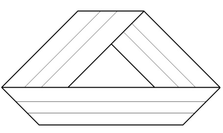

[无对应译文]

</section>

<section class="parallel-paragraph" data-paragraph-ids="s26-10-0183">

s26-10-0183

原文 · s26-10-0183

Alors voilà *la bande de Mœbius* dont Nasio a parlé à propos du S1 → S2 en termes de mathèmes, et je vais tracer le dessin de la coupure dont il a très bien parlé. Voilà cette coupure.

[无对应译文]

</section>

<section class="parallel-paragraph" data-paragraph-ids="s26-10-0184">

s26-10-0184

原文 · s26-10-0184

Si vous extrayez le lambeau de surface que vous obtenez après avoir coupé selon le trait bleu qui est un trait continu, vous obtenez une surface à un seul bord et une seule face, qui est elle même une *surface de Mœbius*.

[无对应译文]

</section>

<section class="parallel-paragraph" data-paragraph-ids="s26-10-0185">

s26-10-0185

原文 · s26-10-0185

Et de l’autre côté du tableau, je vais dessiner de l’autre extrémité une chaîne borroméenne dont je pourrais d’ailleurs mettre une consistance en bleu.

[无对应译文]

</section>

<section class="parallel-paragraph" data-paragraph-ids="s26-10-0186">

s26-10-0186

原文 · s26-10-0186

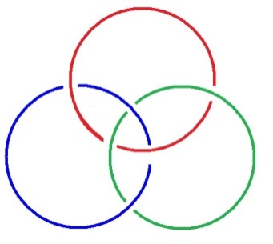

[无对应译文]

</section>

<section class="parallel-paragraph" data-paragraph-ids="s26-10-0187">

s26-10-0187

原文 · s26-10-0187

Alors voilà, c’est entre ces deux dessins, que je vais essayer de vous parler des quatre volumes du Séminaire, à propos de deux termes :

[无对应译文]

</section>

<section class="parallel-paragraph" data-paragraph-ids="s26-10-0188">

s26-10-0188

原文 · s26-10-0188

- d’abord du terme de « *machine* »,

[无对应译文]

</section>

<section class="parallel-paragraph" data-paragraph-ids="s26-10-0189">

s26-10-0189

原文 · s26-10-0189

- et de celui de « *nœud* ».

[无对应译文]

</section>

<section class="parallel-paragraph" data-paragraph-ids="s26-10-0190">

s26-10-0190

原文 · s26-10-0190

Alors dans ces quatre volumes, les machines occupent une place très importante dans le second, dans le livre II.

[无对应译文]

</section>

<section class="parallel-paragraph" data-paragraph-ids="s26-10-0191">

s26-10-0191

原文 · s26-10-0191

Et il est bien évident que, quand j’ai commencé à lire le livre I, parce qu’il est paru en même temps que « *Encore* »...

[无对应译文]

</section>

<section class="parallel-paragraph" data-paragraph-ids="s26-10-0192">

s26-10-0192

原文 · s26-10-0192

> le livre XX, j’avais assisté au *Séminaire*, j’étais très content de l’avoir, comme ça, pour pouvoir le lire ...eh bien, le Livre I, je dois dire que je ne comprenais pas très bien le début où il était question de l’Ego, un terme que je ne connaissais pas parce que ce n’est pas, disons, un endroit d’où je viens, alors j’ai attendu un peu et c’est seulement à propos de cette question de l’au-delà de la psychologie que je me trouve intéressé.

[无对应译文]

</section>

<section class="parallel-paragraph" data-paragraph-ids="s26-10-0193">

s26-10-0193

原文 · s26-10-0193

Or cette question est développée dans le *Séminaire* en termes d’*Imaginaire* et de *Symbolique* que dans un premier temps, je vous propose de considérer comme étant les 2 phases de la bande bipartite qui sont ici de part et d’autre du bleu, parce qu’il faudrait que vous vous rendiez compte, soit en le découpant, soit en le dessinant, qu’on obtient sur la bande de Mœbius ainsi, on obtient une bande bipartite, c’est-à-dire qu’on sépare la bande, non pas en deux parties, n’importe lesquelles, mais en deux faces.

[无对应译文]

</section>

<section class="parallel-paragraph" data-paragraph-ids="s26-10-0194">

s26-10-0194

原文 · s26-10-0194

Je vais vous les colorier : en voilà une verte, ici il y a une torsion, alors il va y avoir l’autre côté, mais c’est le vert de nouveau qui réapparaît là, et encore du vert si je continue, ici ça va être l’autre côté, ici voilà le vert qui va réapparaître là. Et puis il y a une partie que je colorie en rouge qui est l’envers du vert.

[无对应译文]

</section>

<section class="parallel-paragraph" data-paragraph-ids="s26-10-0195">

s26-10-0195

原文 · s26-10-0195

Alors c’est à propos de cette bande, si je vous propose en essayant de rester très près du livre I du Séminaire, je me suis rendu compte que la partie qui concernait le bleu, c’était le Réel. Alors là en fin de compte, c’est très maladroit de présenter les choses comme ça, parce que c’est carrément de la représentation.

[无对应译文]

</section>

<section class="parallel-paragraph" data-paragraph-ids="s26-10-0196">

s26-10-0196

原文 · s26-10-0196

Mais dans le Séminaire, le Livre I, il se trouve qu’effectivement il est question du Réel à propos, il m’a semblé, de la *Verneinung* de Freud, commentée par Hyppolite, et c’est ainsi que je rattache à cela l’exposé de Mme Lefort, à propos de ces deux termes « *Le loup ! Le loup !* ».

[无对应译文]

</section>

<section class="parallel-paragraph" data-paragraph-ids="s26-10-0197">

s26-10-0197

原文 · s26-10-0197

Bien, mais venons-en aux « *machines* ».

[无对应译文]

</section>

<section class="parallel-paragraph" data-paragraph-ids="s26-10-0198">

s26-10-0198

原文 · s26-10-0198

Le *Séminaire* suivant, le *Livre II* développe, me semble-t-il, là cette question des *machines* que j’ai été très surpris de rencontrer sous cet aspect dans la mesure où je les avais étudiées comme *des automates abstraits* chez les mathématiciens et puis que j’avais eu l’idée de ce qu’une machine pouvait être, bien qu’on ne pense pas assez souvent qu’une poulie ou un dé soit une machine.

[无对应译文]

</section>

<section class="parallel-paragraph" data-paragraph-ids="s26-10-0199">

s26-10-0199

原文 · s26-10-0199

Et ce vers quoi je voudrais aller, c’est parler de *machines* qui sont un petit peu différentes les unes des autres et parler *du nœud* et *des chaînes* comme *machines*.

[无对应译文]

</section>

<section class="parallel-paragraph" data-paragraph-ids="s26-10-0200">

s26-10-0200

原文 · s26-10-0200

Alors si je m’en tiens pour l’instant à l’époque de ce *Livre II* du *Séminaire* du Dr Lacan, si je m’en tiens aux machines mathématiques, les machines récursives

[无对应译文]

</section>

<section class="parallel-paragraph" data-paragraph-ids="s26-10-0201">

s26-10-0201

原文 · s26-10-0201

- qui produisent une répétition d’une certaine opération aussi longtemps qu’on veut,

[无对应译文]

</section>

<section class="parallel-paragraph" data-paragraph-ids="s26-10-0202">

s26-10-0202

原文 · s26-10-0202

- qui ont des limitations,

[无对应译文]

</section>

<section class="parallel-paragraph" data-paragraph-ids="s26-10-0203">

s26-10-0203

原文 · s26-10-0203

- et qui ont échoué à rendre compte des langages naturels, ...eh bien, ces machines ont une tête de lecture ou d’écriture, eh bien, je crois qu’il ne faut pas se préoccuper excessivement de la tête ou uniquement.

[无对应译文]

</section>

<section class="parallel-paragraph" data-paragraph-ids="s26-10-0204">

s26-10-0204

原文 · s26-10-0204

Les mathématiciens et les logiciens, le problème qu’ils se sont posé avec cette tête, c’est de savoir si elle passait dans différents états : on appelle ça les états de la machine et on note ça S1, S2, etc.

[无对应译文]

</section>

<section class="parallel-paragraph" data-paragraph-ids="s26-10-0205">

s26-10-0205

原文 · s26-10-0205

Or ça m’a beaucoup servi comme analogie, au début, de suivre le programme, la grammaire de cette tête.

[无对应译文]

</section>

<section class="parallel-paragraph" data-paragraph-ids="s26-10-0206">

s26-10-0206

原文 · s26-10-0206

Mais j’ai très vite été amené à dédoubler cette tête et maintenant

[无对应译文]

</section>

<section class="parallel-paragraph" data-paragraph-ids="s26-10-0207">

s26-10-0207

原文 · s26-10-0207

- je me rends compte parfaitement que ce qu’il y a en face de la tête c’est ce qu’on appelle *« la bande-machine »,*

[无对应译文]

</section>

<section class="parallel-paragraph" data-paragraph-ids="s26-10-0208">

s26-10-0208

原文 · s26-10-0208

- je me rends compte tout à fait qu’il faut s’occuper de la bande.

[无对应译文]

</section>

<section class="parallel-paragraph" data-paragraph-ids="s26-10-0209">

s26-10-0209

原文 · s26-10-0209

Seulement les bandes dans *les machines de Mœbius* - non justement : *pas de Mœbius mais de* *Turing* ! - n’ont pas de torsion, c’est à dire que ce sont des machines forcément linéaires, et avec ces machines on n’arrive jamais à leur faire faire autre chose que ce qu’elles savent faire, mais qui rencontrent - dès que contraintes - une limite : c’est à dire que la limite se trouve du côté de l’infini, c’est-à-dire qu’il faut brancher, pour rendre compte des langues naturelles, semble-t-il, une infinité de machines, les unes à côté des autres, pour réussir à leur faire faire - quoi ? - on pourrait se le demander...

[无对应译文]

</section>

<section class="parallel-paragraph" data-paragraph-ids="s26-10-0210">

s26-10-0210

原文 · s26-10-0210

Mais du côté de la bande, il faut s’intéresser à la bande comme machine, et c’est déjà une étape comme celle que j’ai dessinée là.

[无对应译文]

</section>

<section class="parallel-paragraph" data-paragraph-ids="s26-10-0211">

s26-10-0211

原文 · s26-10-0211

Et vous voyez bien que ce n’est pas suffisant de le monter par un seul dessin, il faut transformer, il faut faire fonctionner cette machine.

[无对应译文]

</section>

<section class="parallel-paragraph" data-paragraph-ids="s26-10-0212">

s26-10-0212

原文 · s26-10-0212

C’est une étape des machines donc.

[无对应译文]

</section>

<section class="parallel-paragraph" data-paragraph-ids="s26-10-0213">

s26-10-0213

原文 · s26-10-0213

Et il me semble qu’avec ça on pourrait faire quelque chose.

[无对应译文]

</section>

<section class="parallel-paragraph" data-paragraph-ids="s26-10-0214">

s26-10-0214

原文 · s26-10-0214

Alors comme je m’intéresse sérieusement à cette bande avec ses torsions et ses trous, je vais vous dessiner une autre représentation de cette bande avec un trou et vous monter une petite machination assez surprenante, enfin plutôt vous en monter les deux termes parce que c’est très long de faire des dessins intermédiaires et c’est tout un exercice.

[无对应译文]

</section>

<section class="parallel-paragraph" data-paragraph-ids="s26-10-0215">

s26-10-0215

原文 · s26-10-0215

Alors il s’agit, d’une part de cette bande sur laquelle je perce un trou.

[无对应译文]

</section>

<section class="parallel-paragraph" data-paragraph-ids="s26-10-0216">

s26-10-0216

原文 · s26-10-0216

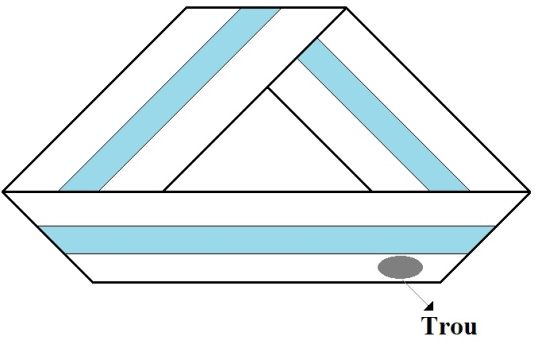

[无对应译文]

</section>

<section class="parallel-paragraph" data-paragraph-ids="s26-10-0217">

s26-10-0217

原文 · s26-10-0217

Si je perce un trou ici et que j’étends ce trou au point d’élargir les bords de ce trou, j’obtiens cela.

[无对应译文]

</section>

<section class="parallel-paragraph" data-paragraph-ids="s26-10-0218">

s26-10-0218

原文 · s26-10-0218

Je vais dessiner ici assez gros.

[无对应译文]

</section>

<section class="parallel-paragraph" data-paragraph-ids="s26-10-0219">

s26-10-0219

原文 · s26-10-0219

C’est-à-dire que je fais faire au bord du trou le trou du trou central et je vais remettre la partie bleue. Voilà.

[无对应译文]

</section>

<section class="parallel-paragraph" data-paragraph-ids="s26-10-0220">

s26-10-0220

原文 · s26-10-0220

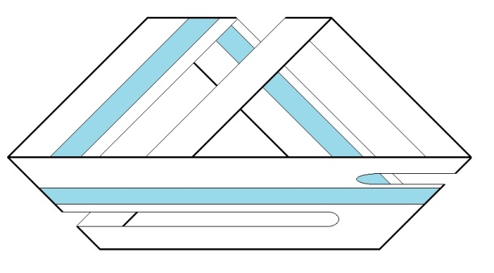

[无对应译文]

</section>

<section class="parallel-paragraph" data-paragraph-ids="s26-10-0221">

s26-10-0221

原文 · s26-10-0221

Eh bien, cette figure, sur laquelle on peut reporter le rouge et le vert, il se trouve que cette figure est ce qu’on appelle un carrefour de bande, si on découpe la partie bleue que j’ai coloriée, on va obtenir un carrefour de bande deux fois fendues et que je vais redresser.

[无对应译文]

</section>

<section class="parallel-paragraph" data-paragraph-ids="s26-10-0222">

s26-10-0222

原文 · s26-10-0222

Alors ces objets que je dessine ont des propriétés et il se trouve, quand je lis, j’essaye de puiser dans l’ensemble des figures d’un certain nombre d’objets que j’ai déjà dessinés, j’essaye de puiser dedans et de voir si ce que je lis donne quelque chose, répond, ou résonne avec les dessins et les problèmes qui ici sont des problèmes de surfaces.

[无对应译文]

</section>

<section class="parallel-paragraph" data-paragraph-ids="s26-10-0223">

s26-10-0223

原文 · s26-10-0223

Or ça ne marche jamais très longtemps.

[无对应译文]

</section>

<section class="parallel-paragraph" data-paragraph-ids="s26-10-0224">

s26-10-0224

原文 · s26-10-0224

Ça, je crois que c’est une constante, une constante de cette façon de faire qui est qu’on arrive à chaque fois à un moment ou les choses paraissent insuffisantes. Mais ce que je voudrais essayer de dire, c’est qu’il y a un saut, parce qu’on a déjà commencé à faire marcher une autre machine, quand on abandonne un certain type de machine.

[无对应译文]

</section>

<section class="parallel-paragraph" data-paragraph-ids="s26-10-0225">

s26-10-0225

原文 · s26-10-0225

Et il ne faut pas chercher à les pousser à l’extrême, c’est-à-dire nulle part.

[无对应译文]

</section>

<section class="parallel-paragraph" data-paragraph-ids="s26-10-0226">

s26-10-0226

原文 · s26-10-0226

Par exemple, je vais vous le montrer sur cette figure :

[无对应译文]

</section>

<section class="parallel-paragraph" data-paragraph-ids="s26-10-0227">

s26-10-0227

原文 · s26-10-0227

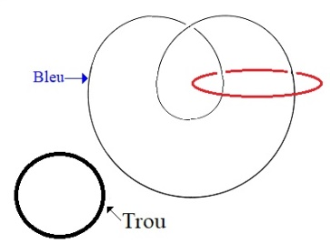

[无对应译文]

</section>

<section class="parallel-paragraph" data-paragraph-ids="s26-10-0228">

s26-10-0228

原文 · s26-10-0228

Il y a déjà le dessin des bords et je peux m’intéresser aux bords.

[无对应译文]

</section>

<section class="parallel-paragraph" data-paragraph-ids="s26-10-0229">

s26-10-0229

原文 · s26-10-0229

Or qu’est-ce que ces bords vont me donner ?

[无对应译文]

</section>

<section class="parallel-paragraph" data-paragraph-ids="s26-10-0230">

s26-10-0230

原文 · s26-10-0230

Eh bien, je vois ici qu’il y a un trou.

[无对应译文]

</section>

<section class="parallel-paragraph" data-paragraph-ids="s26-10-0231">

s26-10-0231

原文 · s26-10-0231

Or le trou, si on raisonne sur le trou, le bord du trou, on imagine très bien qu’il est indépendant, tout à fait indépendant des autres bords qui sont sur cette surface, parce qu’on voit bien ici qu’il est indépendant de la partie bleue et l’autre bord rouge extérieur. Ici on voit bien que le bord de ce trou noir est tout à fait *indépendant*. Cette petite pastille, elle n’est pas nouée.

[无对应译文]

</section>

<section class="parallel-paragraph" data-paragraph-ids="s26-10-0232">

s26-10-0232

原文 · s26-10-0232

Par conséquent, je peux par contre dessiner la partie bleue et la partie rouge :

[无对应译文]

</section>

<section class="parallel-paragraph" data-paragraph-ids="s26-10-0233">

s26-10-0233

原文 · s26-10-0233

- la partie bleue, ça va être un huit intérieur sur lequel vient se nouer en rouge une consistance,

[无对应译文]

</section>

<section class="parallel-paragraph" data-paragraph-ids="s26-10-0234">

s26-10-0234

原文 · s26-10-0234

- la partie bleue, c’est le bord de *la bande de Mœbius*, qui est tracée sur *la bande de Mœbius* et le bord du trou, c’est un rond noir.

[无对应译文]

</section>

<section class="parallel-paragraph" data-paragraph-ids="s26-10-0235">

s26-10-0235

原文 · s26-10-0235

Alors j’essaye de faire comme ça monstration d’un cheminement qui échoue et qui reprend successivement...

[无对应译文]

</section>

<section class="parallel-paragraph" data-paragraph-ids="s26-10-0236">

s26-10-0236

原文 · s26-10-0236

Dans le Livre II où il est question des machines, à propos du Séminaire, j’ai essayé d’appliquer cette machine, c’est-à-dire celle-ci, ce carrefour de bande, au rêve que fait Freud à propos d’Irma et dont part le Dr Lacan.

[无对应译文]

</section>

<section class="parallel-paragraph" data-paragraph-ids="s26-10-0237">

s26-10-0237

原文 · s26-10-0237

Alors effectivement je situe le mouvement du rêve et je m’aperçois qu’effectivement dans le commentaire on peut suivre très précisément Freud qui s’écarte, qui se met à l’écart avec Irma.

[无对应译文]

</section>

<section class="parallel-paragraph" data-paragraph-ids="s26-10-0238">

s26-10-0238

原文 · s26-10-0238

Alors il part, au lieu de rester sur la bande là, qui est traversée de la partie bleue, il emprunte une bretelle ici, c’est-à-dire qu’au carrefour il va s’écarter du trajet normal de la bande bleue.

[无对应译文]

</section>

<section class="parallel-paragraph" data-paragraph-ids="s26-10-0239">

s26-10-0239

原文 · s26-10-0239

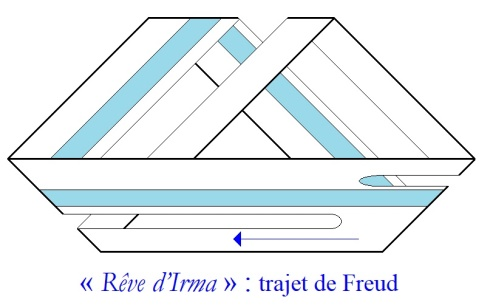

[无对应译文]

</section>

<section class="parallel-paragraph" data-paragraph-ids="s26-10-0240">

s26-10-0240

原文 · s26-10-0240

Et vous voyez qu’il va être entraîné pour passer sous la bande.

[无对应译文]

</section>

<section class="parallel-paragraph" data-paragraph-ids="s26-10-0241">

s26-10-0241

原文 · s26-10-0241

Or c’est à ce moment là qu’il voit la bouche ouverte d’Irma et la remarque qui était faite dans le Séminaire, c’était qu’à ce moment là il aurait dû se réveiller, or il ne se réveille pas.

[无对应译文]

</section>

<section class="parallel-paragraph" data-paragraph-ids="s26-10-0242">

s26-10-0242

原文 · s26-10-0242

Alors qu’est-ce que je me suis posé comme question ?

[无对应译文]

</section>

<section class="parallel-paragraph" data-paragraph-ids="s26-10-0243">

s26-10-0243

原文 · s26-10-0243

Je me suis dit : qu’est-ce qui fait qu’il ne se réveille pas ?

[无对应译文]

</section>

<section class="parallel-paragraph" data-paragraph-ids="s26-10-0244">

s26-10-0244

原文 · s26-10-0244

Et en travaillant ces bandes d’une part, et en rêvant aussi, je suis arrivé à situer le réveil du côté de la torsion, c’est-à-dire qu’il semblerait que dans ce dessin Freud n’a pas rencontré de torsion.

[无对应译文]

</section>

<section class="parallel-paragraph" data-paragraph-ids="s26-10-0245">

s26-10-0245

原文 · s26-10-0245

Alors je voulais vous montrer comment, si on découpe selon ses trois bords cette bande, que je vais finir de colorier, si on découpe cette bande, on peut réussir à la présenter comme ceci, on peut réussir à la présenter ainsi sans torsion, c’est-à-dire que vous imaginez la complexité pour monter ça directement par des transformations continues.

[无对应译文]

</section>

<section class="parallel-paragraph" data-paragraph-ids="s26-10-0246">

s26-10-0246

原文 · s26-10-0246

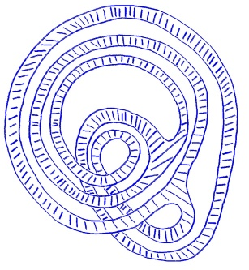

[无对应译文]

</section>

<section class="parallel-paragraph" data-paragraph-ids="s26-10-0247">

s26-10-0247

原文 · s26-10-0247

Alors c’est là que je suis amené à faire un petit peu de mathématique.

[无对应译文]

</section>

<section class="parallel-paragraph" data-paragraph-ids="s26-10-0248">

s26-10-0248

原文 · s26-10-0248

Ce que j’entends par faire des mathématiques à ce moment-là, c’est chercher des moyens intermédiaires qui me permettent de justifier cette transformation, que j’ai rencontrée parce que je travaillais avec ses objets.

[无对应译文]

</section>

<section class="parallel-paragraph" data-paragraph-ids="s26-10-0249">

s26-10-0249

原文 · s26-10-0249

Alors j’hachure la bande dans son plein, il n’y a plus de torsion et il s’agit d’une véritable spirale.

[无对应译文]

</section>

<section class="parallel-paragraph" data-paragraph-ids="s26-10-0250">

s26-10-0250

原文 · s26-10-0250

Or il me semble par conséquent que tout ça tient très très bien avec les problèmes de l’analyse, c’est-à-dire que cette spirale sans torsion, je dis tout de suite que je ne crois pas que ce soit une psychose, je dirai que ça a quelque chose qui est de l’ordre de l’analyse dans un 1er schéma que j’ai retrouvé assez évocateur dans le livre I du Séminaire, au cours de la dernière réunion où le Dr Lacan nous a proposé un schéma de l’analyse qui est daté de cette époque du Livre I du Séminaire.

[无对应译文]

</section>

<section class="parallel-paragraph" data-paragraph-ids="s26-10-0251">

s26-10-0251

原文 · s26-10-0251

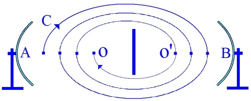

[无对应译文]

</section>

<section class="parallel-paragraph" data-paragraph-ids="s26-10-0252">

s26-10-0252

原文 · s26-10-0252

Alors vous voyez la question qui s’élabore, c’est qu’il y a une part d’illustration, il y a une part mathématique que je préserve et qu’à mon avis, il n’est pas indispensable de développer autrement et je vais essayer de m’expliquer sur ça en parlant justement du Livre XI qui, lui, reprend...

[无对应译文]

</section>

<section class="parallel-paragraph" data-paragraph-ids="s26-10-0253">

s26-10-0253

原文 · s26-10-0253

> à mon avis, enfin tel que je l’ai lu ...le Livre I.

[无对应译文]

</section>

<section class="parallel-paragraph" data-paragraph-ids="s26-10-0254">

s26-10-0254

原文 · s26-10-0254

Il m’a semblé que c’était un développement analogue, or il est question dans ce Livre XI énormément de mathèmes, d’écritures mathématiques qui correspondent donc à un autre ordre que ce que tout à l’heure disait Nasio, qui n’est pas topologique, mais ensuite parlant de logique avec le zéro de Frege, ces choses effectivement sont très présentes, ces différentes façons d’aborder une question, si on veut s’en tenir à cela, soit avec des bandes, soit avec des écritures.

[无对应译文]

</section>

<section class="parallel-paragraph" data-paragraph-ids="s26-10-0255">

s26-10-0255

原文 · s26-10-0255

Et c’est autour de ces termes que nous tournons.

[无对应译文]

</section>

<section class="parallel-paragraph" data-paragraph-ids="s26-10-0256">

s26-10-0256

原文 · s26-10-0256

Eh bien, je dirais que le Livre XI dans lequel il y a beaucoup de mathèmes qui surprennent les mathématiciens parce qu’ils n’y comprennent rien, il faut être un peu logicien pour suivre cela et je crois qu’avec les chaînes et les nœuds, on arrive particulièrement bien à s’y plier.

[无对应译文]

</section>

<section class="parallel-paragraph" data-paragraph-ids="s26-10-0257">

s26-10-0257

原文 · s26-10-0257

Alors c’est pour cela que je vais sauter au Livre XX qui, lui, me paraît extrêmement dense, très concis, mais dans lequel il est question de cette faille compacte que les mathématiciens peuvent lire, et reconnaître là la définition tout à fait correcte de ce que nous connaissons comme compacité.

[无对应译文]

</section>

<section class="parallel-paragraph" data-paragraph-ids="s26-10-0258">

s26-10-0258

原文 · s26-10-0258

Et je crois qu’on peut renvoyer cette faille compacte à ce qui en sort, s’apercevoir que par exemple elle renvoie au Séminaire XI, si on le lit, au moment justement ou le réseau du signifiant est présenté dans le chapitre juste avant, qui s’appelle « *L’inconscient freudien* » et où Lacan...

[无对应译文]

</section>

<section class="parallel-paragraph" data-paragraph-ids="s26-10-0259">

s26-10-0259

原文 · s26-10-0259

> après avoir parlé de Lévi-Strauss et de « *La pensée sauvage* », ...dit qu’il y a quelque chose d’un petit peu différent de la pensée magique, c’est la discontinuité.

[无对应译文]

</section>

<section class="parallel-paragraph" data-paragraph-ids="s26-10-0260">

s26-10-0260

原文 · s26-10-0260

Alors ça doit faire rigoler encore plus les mathématiciens, la discontinuité, de parler de discontinuité à ce moment-là, parce que justement la topologie se définit justement des fonctions continues.

[无对应译文]

</section>

<section class="parallel-paragraph" data-paragraph-ids="s26-10-0261">

s26-10-0261

原文 · s26-10-0261

Donc ceci peut paraître extrêmement difficile et pourtant je pense, sur le plan de l’enseignement de Lacan, que c’est à dessiner, à éviter justement mes mathématiques en tant que *pratique de l’écriture*, que *les nœuds* et *les* *chaînes*, ça apporte quelque chose justement, et qu’il faut différencier des surfaces que j’ai dessinées ici au tableau qui, elles, ces surfaces, sont des machines encore sommaires à l’égard des chaînes qui sont des machines, je dirais, plus consistantes, qu’on peut pratiquer très simplement, comme les dés sont des machines : on peut jeter les dés, on peut aussi jeter les chaînes, borroméennes ou pas, par terre, les ramasser, les reprendre.

[无对应译文]

</section>

<section class="parallel-paragraph" data-paragraph-ids="s26-10-0262">

s26-10-0262

原文 · s26-10-0262

Or je suis de l’avis que les dessiner, quand on arrive à les dessiner, produit des contraintes de structure qui peuvent être mieux suivies qu’avec la manipulation du modèle physique.

[无对应译文]

</section>

<section class="parallel-paragraph" data-paragraph-ids="s26-10-0263">

s26-10-0263

原文 · s26-10-0263

Et j’en viens par là à discuter ce terme de modèle, parce que, si j’évoque

[无对应译文]

</section>

<section class="parallel-paragraph" data-paragraph-ids="s26-10-0264">

s26-10-0264

原文 · s26-10-0264

- ces machines d’une part,

[无对应译文]

</section>

<section class="parallel-paragraph" data-paragraph-ids="s26-10-0265">

s26-10-0265

原文 · s26-10-0265

- et les mathématiques d’autre part, c’est un critère que de pouvoir construire en mathématique ce que l’on appelle des modèles.

[无对应译文]

</section>

<section class="parallel-paragraph" data-paragraph-ids="s26-10-0266">

s26-10-0266

原文 · s26-10-0266

Et là je dis qu’il ne s’agit pas de modèles parce que finalement je dessine...

[无对应译文]

</section>

<section class="parallel-paragraph" data-paragraph-ids="s26-10-0267">

s26-10-0267

原文 · s26-10-0267

> ici j’ai même dessiné assez maladroitement ...mais je vous proposerai pour cela justement le fait suivant : ce ne sont pas des modèles parce que le Dr Lacan a poussé le travail sur les écritures des mathèmes au point, dans « *Encore* », de nous produire quelque chose...

[无对应译文]

</section>

<section class="parallel-paragraph" data-paragraph-ids="s26-10-0268">

s26-10-0268

原文 · s26-10-0268

> il ne le dit peut-être pas dans ce séminaire, mais un peu plus tard ...que quelqu’un d’autre avait déjà remarqué et il s’agit en l’occurrence du « *Pas-tous* ».

[无对应译文]

</section>

<section class="parallel-paragraph" data-paragraph-ids="s26-10-0269">

s26-10-0269

原文 · s26-10-0269

Or effectivement si on étudie les mathématiques,

[无对应译文]

</section>

<section class="parallel-paragraph" data-paragraph-ids="s26-10-0270">

s26-10-0270

原文 · s26-10-0270

- c’est-à-dire la question de la théorie des mathématiques,

[无对应译文]

</section>

<section class="parallel-paragraph" data-paragraph-ids="s26-10-0271">

s26-10-0271

原文 · s26-10-0271

- c’est-à-dire la question de la théorie des modèles,

[无对应译文]

</section>

<section class="parallel-paragraph" data-paragraph-ids="s26-10-0272">

s26-10-0272

原文 · s26-10-0272

- de la théorie des ensembles dans le langage du calcul des prédicats, on ne comprend rien au « *Pas-tous* », on ne le découvre jamais, puisque toute l’affaire est faite pour que justement avec le *tau* \[τ\] de Hilbert les choses n’apparaissent pas.

[无对应译文]

</section>

<section class="parallel-paragraph" data-paragraph-ids="s26-10-0273">

s26-10-0273

原文 · s26-10-0273

Par conséquent il faut avoir une autre idée de ce qu’on cherche pour trouver le « pas-tous » dans la théorie des ensembles et dans le calcul des prédicats.

[无对应译文]

</section>

<section class="parallel-paragraph" data-paragraph-ids="s26-10-0274">

s26-10-0274

原文 · s26-10-0274

Mais c’est parfaitement articulé et c’est avec cet argument qu’on arrive à produire quelque chose.

[无对应译文]

</section>

<section class="parallel-paragraph" data-paragraph-ids="s26-10-0275">

s26-10-0275

原文 · s26-10-0275

Or je dis qu’après - dans ce séminaire XX - après avoir articulé précisément à propos du mathème la borne par-dessus laquelle le mathématicien qui fait le calcul des prédicats n’est pas obligé de sauter, eh bien, on rencontre les *chaînes*, c’est-à-dire on revient aux *machines*, on quitte ces modèles et la théorie des ensembles même plus mécanisée et on revient à des machines beaucoup plus simples.

[无对应译文]

</section>

<section class="parallel-paragraph" data-paragraph-ids="s26-10-0276">

s26-10-0276

原文 · s26-10-0276

Et c’est des machines beaucoup plus simples qui me semblent avoir un intérêt à être pratiquées.

[无对应译文]

</section>

<section class="parallel-paragraph" data-paragraph-ids="s26-10-0277">

s26-10-0277

原文 · s26-10-0277

Alors je dirai : qu’est-ce qu’il y a de particulier avec ces chaînes, pour finir ?

[无对应译文]

</section>

<section class="parallel-paragraph" data-paragraph-ids="s26-10-0278">

s26-10-0278

原文 · s26-10-0278

Pour reprendre la question que Nasio a posée avec la question du Un et de l’Autre, je dirai...

[无对应译文]

</section>

<section class="parallel-paragraph" data-paragraph-ids="s26-10-0279">

s26-10-0279

原文 · s26-10-0279

> pour répondre aussi à cette question de la représentation de la représentation ou du Rien ...que, si je trace une chaîne à 4, si je trace une chaîne *borroméenne* à 4, eh bien, il y a 3 ronds...

[无对应译文]

</section>

<section class="parallel-paragraph" data-paragraph-ids="s26-10-0280">

s26-10-0280

原文 · s26-10-0280

> et ça, le Dr Lacan le dit très bien dans les séminaires qui sont parus dans *Ornicar* ...il y a 3 ronds que je vais désigner l’un en bleu comme dans la figure précédente, c’est-à-dire celui-ci, un autre en rouge et un troisième en vert.

[无对应译文]

</section>

<section class="parallel-paragraph" data-paragraph-ids="s26-10-0281">

s26-10-0281

原文 · s26-10-0281

Si on coupe un des trois qui sont colorés, le quatrième étant resté noir, les deux autres colorés sont libres, donc *ils sont noués*... ils présentent quelques analogies *avec la structure borroméenne*, c’est-à-dire que si on en coupe un des trois, un quelconque des trois, les deux autres sont libres.

[无对应译文]

</section>

<section class="parallel-paragraph" data-paragraph-ids="s26-10-0282">

s26-10-0282

原文 · s26-10-0282

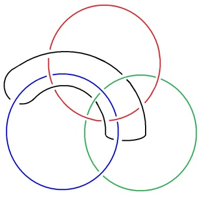

[无对应译文]

</section>

<section class="parallel-paragraph" data-paragraph-ids="s26-10-0283">

s26-10-0283

原文 · s26-10-0283

Or qu’est-ce qui se passe dans la structure borroméenne ?

[无对应译文]

</section>

<section class="parallel-paragraph" data-paragraph-ids="s26-10-0284">

s26-10-0284

原文 · s26-10-0284

Il se trouve que le 4ème est implicite...

[无对应译文]

</section>

<section class="parallel-paragraph" data-paragraph-ids="s26-10-0285">

s26-10-0285

原文 · s26-10-0285

> dit Lacan quelque part après, dans les Séminaires qui suivent ...le 4ème est implicite, eh bien, la question, elle est de savoir qu’est-ce qui tient les trois.

[无对应译文]

</section>

<section class="parallel-paragraph" data-paragraph-ids="s26-10-0286">

s26-10-0286

原文 · s26-10-0286

Chacun des 3 tient les 3, chacun des 3 tient les 2 autres, peut-on dire, mais on peut même dire qu’il tient les 3.

[无对应译文]

</section>

<section class="parallel-paragraph" data-paragraph-ids="s26-10-0287">

s26-10-0287

原文 · s26-10-0287

Mais rien - mais alors est-ce qu’on tombe dans la mystique ? - rien, mais c’est un rien qui compte, c’est-à-dire un vide, parce qu’il n’est pas question de le représenter ici par un 4ème.

[无对应译文]

</section>

<section class="parallel-paragraph" data-paragraph-ids="s26-10-0288">

s26-10-0288

原文 · s26-10-0288

Ici, je dirai que le 4ème est explicite.

[无对应译文]

</section>

<section class="parallel-paragraph" data-paragraph-ids="s26-10-0289">

s26-10-0289

原文 · s26-10-0289

Ici le 4ème est explicite, je le nomme S, ici qu’est-ce qui tient les trois ?

[无对应译文]

</section>

<section class="parallel-paragraph" data-paragraph-ids="s26-10-0290">

s26-10-0290

原文 · s26-10-0290

C’est la structure borroméenne qui fait ça, qui les tient, c’est un rien qui compte.

[无对应译文]

</section>

<section class="parallel-paragraph" data-paragraph-ids="s26-10-0291">

s26-10-0291

原文 · s26-10-0291

Voilà comment je dirais que cet effet de nodalité - voilà comment je le vois ou comment je le dis, cet effet de nodalité permet, à mon sens, de faire jouer quelque chose qui n’est pas représentable et ne peut pas être épuisé par aucune machine, c’est-à-dire que c’est une machine.

[无对应译文]

</section>

<section class="parallel-paragraph" data-paragraph-ids="s26-10-0292">

s26-10-0292

原文 · s26-10-0292

Mais par contre c’est une machine soi-même qui se pratique, c’est-à-dire qui est à la portée de la main et qui est, à mon sens, quelque chose comme...

[无对应译文]

</section>

<section class="parallel-paragraph" data-paragraph-ids="s26-10-0293">

s26-10-0293

原文 · s26-10-0293

pour évoquer l’endroit dans le Séminaire où pour la 1ère fois, apparaît la nodalité ...c’est quelque chose comme le tir à l’arc.

[无对应译文]

</section>

<section class="parallel-paragraph" data-paragraph-ids="s26-10-0294">

s26-10-0294

原文 · s26-10-0294

C’est-à-dire - je prends cette référence dans le livre XI, le Dr Lacan a présenté la pulsion dans ces termes en faisant ce dessin à propos d’un bord- eh bien, c’est le circuit aller et retour de la pulsion qui contourne le (a).

[无对应译文]

</section>

<section class="parallel-paragraph" data-paragraph-ids="s26-10-0295">

s26-10-0295

原文 · s26-10-0295

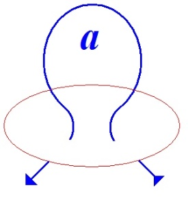

[无对应译文]

</section>

<section class="parallel-paragraph" data-paragraph-ids="s26-10-0296">

s26-10-0296

原文 · s26-10-0296

C’est la première occurrence de la nodalité dans les dessins du Dr Lacan.

[无对应译文]

</section>

<section class="parallel-paragraph" data-paragraph-ids="s26-10-0297">

s26-10-0297

原文 · s26-10-0297

Regardez comment j’ai été frappé de retrouver un autre dessin qui, lui, n’est jamais commenté, qui présente exactement ce bord et ce circuit.

[无对应译文]

</section>

<section class="parallel-paragraph" data-paragraph-ids="s26-10-0298">

s26-10-0298

原文 · s26-10-0298

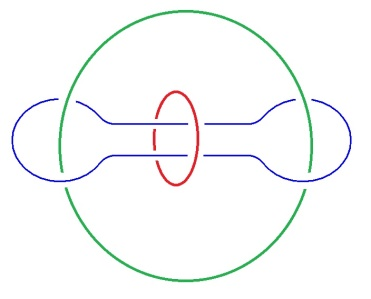

[无对应译文]

</section>

<section class="parallel-paragraph" data-paragraph-ids="s26-10-0299">

s26-10-0299

原文 · s26-10-0299

Ici il s’agit encore d’une chaîne à 3 avec *une consistance* qui passe dans un trou, enfin que je considère comme un trou et qui se trouve être une chaîne borroméenne. Or je voudrais dire que le recours à ces figures, la question que moi je me pose, c’est, à propos justement que ce soit de l’idée d’enseigner ou de pouvoir discuter, c’est quel type exactement de mise en œuvre il faut effectuer pour réussir à en faire quelque chose ?

[无对应译文]

</section>

<section class="parallel-paragraph" data-paragraph-ids="s26-10-0300">

s26-10-0300

原文 · s26-10-0300

C’est-à-dire qu’il me semble qu’effectivement là...

[无对应译文]

</section>

<section class="parallel-paragraph" data-paragraph-ids="s26-10-0301">

s26-10-0301

原文 · s26-10-0301

> je ne me suis toujours guidé que là-dessus ...il y avait quelque chose qui jouait dans le texte des Séminaires, c’est-à-dire que le Dr Lacan écrivait ou parlait...

[无对应译文]

</section>

<section class="parallel-paragraph" data-paragraph-ids="s26-10-0302">

s26-10-0302

原文 · s26-10-0302

> c’est ça que j’intitulerai volontiers ça « *machine* à écrire »,
>
> parce que ça donne finalement quelque chose d’écrit ...eh bien, il parlait , disons, d’une manière matérielle et consistante.

[无对应译文]

</section>

<section class="parallel-paragraph" data-paragraph-ids="s26-10-0303">

s26-10-0303

原文 · s26-10-0303

Qu’il ait réussi à développer différentes machines jusqu’à rencontrer la chaîne borroméenne qui maintenant....

[无对应译文]

</section>

<section class="parallel-paragraph" data-paragraph-ids="s26-10-0304">

s26-10-0304

原文 · s26-10-0304

qu’on peut se fabriquer pour quoi ? Pour fonctionner, et à ce moment-là, avec cette machine qui, il me semble, lorsqu’on la pratique, donne des effets, surtout assure, je dirais une très grande consistance matérielle au discours, c’est-à-dire qu’elle permet de faire des étapes dans la lecture comme dans l’écriture d’une part...

[无对应译文]

</section>

<section class="parallel-paragraph" data-paragraph-ids="s26-10-0305">

s26-10-0305

原文 · s26-10-0305

> et ça je le prends dans un sens très ample ...elle permet de faire des parcours, des petits parcours machiniques qui échouent.

[无对应译文]

</section>

<section class="parallel-paragraph" data-paragraph-ids="s26-10-0306">

s26-10-0306

原文 · s26-10-0306

Mais c’est exactement comme dans *l’interprétation d’un mot d’esprit*, c’est-à-dire que lorsqu’on n’a pas épuisé la structure, lorsqu’on a fait fonctionner l’analyse d’un mot d’esprit, on n’a pas épuisé, mais on a d’une certaine façon l’impression qu’on a tari, détérioré, le brillant de cette lampe qu’est *le mot d’esprit*.

[无对应译文]

</section>

<section class="parallel-paragraph" data-paragraph-ids="s26-10-0307">

s26-10-0307

原文 · s26-10-0307

Eh bien, avec la structure ici en présence, vous pouvez faire fonctionner, vous pouvez travailler les chaînes, mais vous n’épuiserez jamais, jamais vous ne direz quelle est en l’occurrence dans la chaîne à 3 et s’il ne s’agit pas de la représenter et je ne crois pas que ce soit rien puisque ça fait tenir les chaînes et que vous vous trouvez affronté à la matérialité de la chaîne.

[无对应译文]

</section>

<section class="parallel-paragraph" data-paragraph-ids="s26-10-0308">

s26-10-0308

原文 · s26-10-0308

Donc là ce qui me paraît important, c’est qu’avec le dernier donc de ces séminaires, quand on atteint la nodalité, ce que je reconnais comme tel, eh bien, il n’est pas question de continuer dans un mouvement infini de constitution de machine, parce que là on rencontre une machine qu’on n’épuise pas, il me semble, qui est dans l’espace, structure l’espace de telle manière qu’elle n’épuise pas et ne peut pas épuiser l’espace.

[无对应译文]

</section>

<section class="parallel-paragraph" data-paragraph-ids="s26-10-0309">

s26-10-0309

原文 · s26-10-0309

Alors toutes les étapes précédentes, c’était constamment cette structure qui rejaillissait, qui faisait rebondir les différentes machines qu’il fallait faire fonctionner.

[无对应译文]

</section>

<section class="parallel-paragraph" data-paragraph-ids="s26-10-0310">

s26-10-0310

原文 · s26-10-0310

Et ce que ça nous apprend, c’est qu’il faut les faire marcher, c’est-à-dire que ce n’est pas simplement à les regarder qu’on peut en apprendre quelque chose.

[无对应译文]

</section>

<section class="parallel-paragraph" data-paragraph-ids="s26-10-0311">

s26-10-0311

原文 · s26-10-0311

Alors du côté de l’écriture mathématique, moi, je dois dire que je l’ai pratiquée très cabalistiquement au point de lire Bourbaki, c’est-à-dire pour finir, je dirai qu’il y a une torsion dans les écrits mathématiques très difficile, il me semble que les espaces feuilletés dont tu faisais référence, c’est très difficile, c’est inimaginable même, mais je ne crois pas qu’on ait une meilleure garantie de structure.

[无对应译文]

</section>

<section class="parallel-paragraph" data-paragraph-ids="s26-10-0312">

s26-10-0312

原文 · s26-10-0312

Du côté d’une chose qui peut mathématiquement être inscrite en calcul des prédicats, si on lit la question du « pas-tous » telle que Lacan l’articule dans le Séminaire « *Encore* », on voit que même sur le calcul des prédicats- il est là question de modèle- les espaces feuilletés, il ne faut pas y retomber en tant que modèle.

[无对应译文]

</section>

<section class="parallel-paragraph" data-paragraph-ids="s26-10-0313">

s26-10-0313

原文 · s26-10-0313

Voilà, ça a été assez difficile.

[无对应译文]

</section>

<section class="parallel-paragraph" data-paragraph-ids="s26-10-0314">

s26-10-0314

原文 · s26-10-0314

[Table des séances](#Table)

[无对应译文]

</section>

<section class="note-block original-notes">

## Notes

[^3]: Je prononce « *nous sommes* ». Or, d’après ce qui précède, « *nous sommes* » est une inexactitude. Car, si je dis que le sujet est dans l’acte, puis qu’il

    s’efface dans tous les dits qui se succèdent, il reste la question : mais qui est ce *nous* ? Je dis *nous sommes*, car comment indiquer autrement que :

    « *nous ne saurions spéculer sur le sujet sans partir de ceci, que nous-même comme sujets, nous sommes impliqués dans cette profonde duplicité du sujet* » (Lacan).

[^4]: La surface de Riemann ou structure de variété analytique complexe est une des sources communes à la théorie des fonctions algébriques et

    à la topologie. Une des propriétés, qui peut particulièrement nous intéresser dans le maniement des objets topologiques introduits par Lacan,

    est l’orientabilité de la surface de Riemann. Inversement, toute surface fermée orientable est homéomorphe à une surface de Riemann,

    c’est le cas de la sphère, du tore, du tore troué (à *p* trous). Pour cette dernière remarque, on peut consulter sans trop de peine le IIème chapitre

    de G. Springer : « *Introduction to Riemann surfaces* », Reading, 1951.

[^5]: Il est intéressant de noter que cette découverte de Riemann est en étroite dépendance avec sa théorie des multiplicités (très marquée par la

    philosophie de Herbart). Cf. B. Russell, « *Fondements de la Géométrie *», Gautier-Villars, 1901.

</section>
